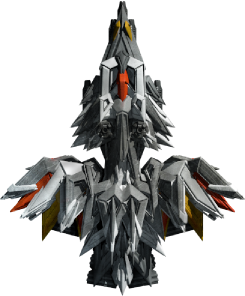
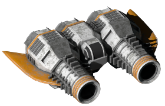

</img>

# News
(latest 10 entries):
<table><tr><td width=800>

2023-07-07 'Sounds Of Endless Sky' updated by Sam Gleske | category: [uncategorized](https://github.com/Hecter94/EndlessSky-PluginArchive/blob/main/README.md#uncategorized)
 2023-07-07 'Undisclosed Plugin' updated by petervdmeer | category: [overhauls](https://github.com/Hecter94/EndlessSky-PluginArchive/blob/main/README.md#overhauls)
 2023-07-07 'Coalition-At-War' updated by Josh Mudge | category: [story](https://github.com/Hecter94/EndlessSky-PluginArchive/blob/main/README.md#story)
 2023-07-07 'Endless-Endless-Sky' updated by 1010Todd | category: [overhauls](https://github.com/Hecter94/EndlessSky-PluginArchive/blob/main/README.md#overhauls)
 2023-07-07 'High DPI' updated by Michael Zahniser (Maintained by the ES Community) | category: [graphics](https://github.com/Hecter94/EndlessSky-PluginArchive/blob/main/README.md#graphics)
 2023-07-07 'Portraits for News' updated by Anarchist2 | category: [story](https://github.com/Hecter94/EndlessSky-PluginArchive/blob/main/README.md#story)
 2023-07-07 'sensor' updated by orbitalsupershell | category: [weapons](https://github.com/Hecter94/EndlessSky-PluginArchive/blob/main/README.md#weapons)
 2023-07-07 'Sci-Fi Flavours' updated by Linear Perk | category: [overhauls](https://github.com/Hecter94/EndlessSky-PluginArchive/blob/main/README.md#overhauls)
 2023-07-07 'Arena of the worthy' updated by RisingLeaf | category: [uncategorized](https://github.com/Hecter94/EndlessSky-PluginArchive/blob/main/README.md#uncategorized)
 2023-07-07 'Midnight Scrapyard' updated by MidnightPlugins | category: [story](https://github.com/Hecter94/EndlessSky-PluginArchive/blob/main/README.md#story)
 

</td></tr></table>
Provide a directlink to your zipped plugin and we do a daily check if it is newer than the one we host here. 

[howto](https://github.com/Hecter94/EndlessSky-PluginArchive/blob/main/README.md#automatic-updating)

---

# Table of Contents

[Introduction](https://github.com/Hecter94/EndlessSky-PluginArchive/blob/main/README.md#introduction) 
 
[Download Information](https://github.com/Hecter94/EndlessSky-PluginArchive/blob/main/README.md#download-information)  
- [Downloading Alternative](https://github.com/Hecter94/EndlessSky-PluginArchive/blob/main/README.md#downloading-alternative)  
- [Notes](https://github.com/Hecter94/EndlessSky-PluginArchive/blob/main/README.md#notes)  
- [Known Plugin Issues](https://github.com/Hecter94/EndlessSky-PluginArchive/blob/main/README.md#known-plugin-issues)  

[Contribution](https://github.com/Hecter94/EndlessSky-PluginArchive/blob/main/README.md#contribution)  
- [Regarding Plugin Informations](https://github.com/Hecter94/EndlessSky-PluginArchive/blob/main/README.md#regarding-plugin-informations)  
- [Add your Plugin](https://github.com/Hecter94/EndlessSky-PluginArchive/blob/main/README.md#add-your-plugin)  
- [Automatic Updating](https://github.com/Hecter94/EndlessSky-PluginArchive/blob/main/README.md#automatic-updating)
- [Plugin Naming Convention](https://github.com/Hecter94/EndlessSky-PluginArchive/blob/main/README.md#plugin-naming-convention)

[Plugin Download](https://github.com/Hecter94/EndlessSky-PluginArchive/blob/main/README.md#plugin-download)  
- [Cheats](https://github.com/Hecter94/EndlessSky-PluginArchive/blob/main/README.md#cheats)  
- [Gameplay](https://github.com/Hecter94/EndlessSky-PluginArchive/blob/main/README.md#gameplay)  
- [Graphics](https://github.com/Hecter94/EndlessSky-PluginArchive/blob/main/README.md#graphics)  
- [Outfits](https://github.com/Hecter94/EndlessSky-PluginArchive/blob/main/README.md#outfits)  
- [Overhauls](https://github.com/Hecter94/EndlessSky-PluginArchive/blob/main/README.md#overhauls)  
- [Overwrites](https://github.com/Hecter94/EndlessSky-PluginArchive/blob/main/README.md#overwrites)  
- [Patches](https://github.com/Hecter94/EndlessSky-PluginArchive/blob/main/README.md#patches)  
- [Races](https://github.com/Hecter94/EndlessSky-PluginArchive/blob/main/README.md#races)  
- [Ships](https://github.com/Hecter94/EndlessSky-PluginArchive/blob/main/README.md#ships)  
- [Story](https://github.com/Hecter94/EndlessSky-PluginArchive/blob/main/README.md#story)   
- [Weapons](https://github.com/Hecter94/EndlessSky-PluginArchive/blob/main/README.md#weapons)  
- [Uncategorized](https://github.com/Hecter94/EndlessSky-PluginArchive/blob/main/README.md#uncategorized)  

---

# Introduction

A comprehensive library of 475 ancient and new plugins for the open-source game Endless Sky.

---

# Download Information

All plugins can get downloaded directly as zip-files from this page.

## Downloading Alternative

Third party tool such as [https://download-directory.github.io](https://download-directory.github.io/) can download a single folder/plugin. Paste the url to the folder url into that tool and you will be given a .zip for that folder.

For example, for the "50 cal" plugin, enter: [https://github.com/Hecter94/EndlessSky-PluginArchive/tree/main/Working/50%20cal](https://github.com/Hecter94/EndlessSky-PluginArchive/tree/main/Working/50%20cal)

Github by default only allows the entire library to be downloaded as a single .zip. Github may have issues with downloading very large file sizes, a possible workaround is using Github Desktop or Git Bash to clone the repository.

## Notes

- "Working" directory – plugins updated to work with the continous build of Endless Sky
- "Originals" directory – archived copies of original plugins
- "Nonfunctional" directory – plugins that will not function without updates

## Known Plugin Issues

### A Galaxy Far Far Away, Businessman Mod, Endless Depth, Normandy

Title screen missing/corrupted. override the title screen, using one or more of these can cause issues with it looking corrupted or "missing". Recommend to use one of these at a time, OR delete title.png from \images to restore the vanilla title screen

### Civil War, Edge of Endless, Jump to Lightspeed and Star Wars

all edit the vanilla interface, this can also cause issues and can only be fixed by editing/removing the interfaces.txt file in the plugin.

### A Wonderful Worldship

Random sprites replaced by worldships Culprit: Intended Behavior of "A wonderful worldship mod"

### Bare Ships

clears all ships from shipyards, meaning only bare versions of ships will be available, any plugins adding other ships not to custom shipyards will likely be incompatible

### Elite Sky

creates an Interceptor "bay type" which seems to make any interceptor escort jump around randomly.

### Final Frontier

sets every government swizzle to 0, also has an image named raider which conflicts with vanilla korath raider.

### Star Wars

includes a copy of vanilla data files and will likely conflict with any missions added/changed since it was created. Specifically known to conflict with changes to the Remnant storyline.

Star Wars has an image named fury which conflicts with vanilla fury.

### Recovery Ships

NPC Ships unable to assist with fuel or repairs Culprit: Likely an old version of Recovery Ship, updated 2/8/2022. Please let me know if you still see the issue.

Escorts from missions not spawning correctly Culprit: use the “safe” variant of this plugin to fix this behavior, “safe” version ships can only carry "Fighter" from vanilla and "Heavy Fighter" and "Gunship"

### The Station of Dr. Rousseau

"Bounty" Arfecta is spawned directly outside starting location. Culprit: , Mission: "Puzzle 3". No location is defined so Arfecta is spawned on first "landing".

"Hunt Dread Pirate Roberts" mission offers everywhere due to a lack of a source filter

### Edge of Endless

Overrides Luxury Accommodations and give it much higher space, bunks, and crew requirement, might make some ships that comes with it appears to have negative space and/or bunks.

Ship "Colossus" conflicts with a ship of the same name from Adamas

### Adamas

Ship "Colossus" conflicts with a ship of the same name from Edge of Endless

### ES-Restock

Gatling gun texture has empty space at 200px tall, resultuing in the outfit display being 10px lower than others

### Akasha Chronicles

Ship "Seraphim" conflicts with a ship of the same name from AES Irm

### AES Irm*

Ship "Seraphim" conflicts with a ship of the same name from Akasha Chronicles

### Mata

Ship "Spectre" conflicts with a ship of the same name from Alterra

### Alterra

Ship "Spectre" conflicts with a ship of the same name from Mata

Ship "Gladius" conflicts with a ship of the same name from Eternals

### Eternals

Ship "Gladius" conflicts with a ship of the same name from Alterra

### Cobbled Ships

Ship "Mammoth" conflicts with a ship of the same name in vanilla version 0.9.15 and later.

---

# Contribution

## Regarding Plugin Informations

As you may have noticed some plugins miss infos. That ranges from missing author name to full description, or just if it is still playable on the current Endless Sky version. 

Please help updating these, by either posting in discussions area or by doing a Pull Request changing the files in `/res/pluginlist/`. 
Thanks.

## Add your plugin

You want your plugin here? Fork this repository, upload your plugin and make a Pull Request. Beside that you can post it in the discussion area.

For Pull Requests, the folder structure has changed with this update. There are no more category folders for you to upload to. Instead, you create a file with the plugin information in `/res/pluginlist/` and your plugin at `Working/`, so this README.md can get auto-generated by a script. Check the other files there to see the formatting. 

If you provide the `directlink=` in the plugin-file at `res/pluginlist/`, then there is no need to upload you plugin to the `Working` directory, your plugin will be loaded on the next daily check for updates. So instead of uploading a folder with a git client, you can upload a single text-file with the web Interface.

## Automatic Updating

The files in `res/pluginlist/` which are used to generate this README.md, have a line `directlink=`, where you can put a URL to your zipped plugin. The line should look like: `directlink=https://github.com/userxyz/esplugins/releases/download/Latest/myplugin.zip` or any other directly accessible webspace.

This repository does an automated check for your directlink once a day(03:30 am utc) and if your plugin there is newer than the one hosted here, it updates it and puts it in the news box. For security reasons the zip file size is currently limited to 100 mb. Please read naming convention paragraph to prevent errors.

If you have a single plugin GitHub repo (with the data folder in root), you can use the auto-generated zip file (green button) as a direct update link.

We hope to create a centralized overview for active plugin developing with this feature.

## Plugin Naming Convention

Allthough a lot of checking and errorhandling got implemented in the scripts, there might be some bugs. To be safe, try to avoid special characters in your plugin name. 

We now have different paths and files which get addressed to the same plugin. The plugin folder is `Working/YourPlugin/`, and the plugin information file is at `res/pluginlist/YourPlugin.txt`. 
To keep these files related together, you have to give them the same name.

---

# Plugin Download

All Plugins (475)

[Cheats](https://github.com/Hecter94/EndlessSky-PluginArchive/blob/main/README.md#cheats) (36) | [Gameplay](https://github.com/Hecter94/EndlessSky-PluginArchive/blob/main/README.md#gameplay) (34) | [Graphics](https://github.com/Hecter94/EndlessSky-PluginArchive/blob/main/README.md#graphics) (17) | [Outfits](https://github.com/Hecter94/EndlessSky-PluginArchive/blob/main/README.md#outfits) (35) 
[Overhauls](https://github.com/Hecter94/EndlessSky-PluginArchive/blob/main/README.md#overhauls) (38) | [Overwrites](https://github.com/Hecter94/EndlessSky-PluginArchive/blob/main/README.md#overwrites) (1) | [Patches](https://github.com/Hecter94/EndlessSky-PluginArchive/blob/main/README.md#patches) (3) | [Races](https://github.com/Hecter94/EndlessSky-PluginArchive/blob/main/README.md#races) (64) 
[Ships](https://github.com/Hecter94/EndlessSky-PluginArchive/blob/main/README.md#ships) (120) | [Story](https://github.com/Hecter94/EndlessSky-PluginArchive/blob/main/README.md#story) (61) | [Weapons](https://github.com/Hecter94/EndlessSky-PluginArchive/blob/main/README.md#weapons) (40) | [Uncategorized](https://github.com/Hecter94/EndlessSky-PluginArchive/blob/main/README.md#uncategorized) (26) 

---

## Cheats

36 plugins in this category.

 

---

### AES Omnis
</img> 

[AES.Omnis.zip](https://github.com/Hecter94/EndlessSky-PluginArchive/releases/download/Latest/AES.Omnis.zip) | 1.08 mb | 2022-10-06 | [view files](https://github.com/Hecter94/EndlessSky-PluginArchive/tree/main/Working/AES%20Omnis/)  
Author: Darcy Manoel | [https://github.com/Darcman99/Adde-Endless-Sky](https://github.com/Darcman99/Adde-Endless-Sky)  
Category: Cheats  

>The most extensive all-content plugin to date. It includes many opportunities to test balance or ship builds against AI driven ships or fleets, all vanilla content and the content of many plugins available to use to put together different ship builds. Many more tools are included into Omnis too!
>

Status: N/A  

---

### All Content Plugin
</img> 

[All.Content.Plugin.zip](https://github.com/Hecter94/EndlessSky-PluginArchive/releases/download/Latest/All.Content.Plugin.zip) | 147.83 kb | 2023-07-07 | [view files](https://github.com/Hecter94/EndlessSky-PluginArchive/tree/main/Working/All%20Content%20Plugin/)  
Author: Michael Zahniser | [https://github.com/endless-sky/all-content-plugin](https://github.com/endless-sky/all-content-plugin)  
Category: Cheats  

>This plugin was made to allow content creators to have access to all outfits in a single place, for the purpose of designing and testing outfit loadouts for new ships. Of course, it can also be used by people who want to ruin the game for themselves by getting a massive fleet without needing to work for it.
>

Status: N/A  

---

### Arena
</img> 

[Arena.zip](https://github.com/Hecter94/EndlessSky-PluginArchive/releases/download/Latest/Arena.zip) | 29.61 kb | 2022-10-06 | [view files](https://github.com/Hecter94/EndlessSky-PluginArchive/tree/main/Working/Arena/)  
Author: 10010101001 | [https://github.com/10010101001/Arena](https://github.com/10010101001/Arena)  
Category: Cheats  

>This plugin adds two arenas with diffrent combat styles for the player to enjoy in-game and for testing purposes (near Sagittarius A).
>

Status: N/A  

---

### automata.destruction.0percent
</img> 

[automata.destruction.0percent.zip](https://github.com/Hecter94/EndlessSky-PluginArchive/releases/download/Latest/automata.destruction.0percent.zip) | 52.52 kb | 2023-06-20 | [view files](https://github.com/Hecter94/EndlessSky-PluginArchive/tree/main/Working/automata.destruction.0percent/)  
Author: zuckung | [https://github.com/zuckung/endless-sky-plugins](https://github.com/zuckung/endless-sky-plugins)  
Category: Cheats  

>(14 ship attributes changed)
>
>Modifies the self destruction chance of Sestor and Mereti ships.
>Sestor 349/109/78/71/53/40/27 and Mereti 512/256/128/64/32/16/8 ships have a self destruction value of 0.0 (0%).

Status: tested with 0.10.1  

---

### automata.destruction.23percent
</img> 

[automata.destruction.23percent.zip](https://github.com/Hecter94/EndlessSky-PluginArchive/releases/download/Latest/automata.destruction.23percent.zip) | 52.54 kb | 2023-06-20 | [view files](https://github.com/Hecter94/EndlessSky-PluginArchive/tree/main/Working/automata.destruction.23percent/)  
Author: zuckung | [https://github.com/zuckung/endless-sky-plugins](https://github.com/zuckung/endless-sky-plugins)  
Category: Cheats  

>(14 ship attributes changed)
>
>Modifies the self destruction chance of Sestor and Mereti ships.
>Sestor 349/109/78/71/53/40/27 and Mereti 512/256/128/64/32/16/8 ships have a self destruction value of 0.12 (23%).

Status: tested with 0.10.1  

---

### automata.destruction.51percent
</img> 

[automata.destruction.51percent.zip](https://github.com/Hecter94/EndlessSky-PluginArchive/releases/download/Latest/automata.destruction.51percent.zip) | 52.54 kb | 2023-06-20 | [view files](https://github.com/Hecter94/EndlessSky-PluginArchive/tree/main/Working/automata.destruction.51percent/)  
Author: zuckung | [https://github.com/zuckung/endless-sky-plugins](https://github.com/zuckung/endless-sky-plugins)  
Category: Cheats  

>(14 ship attributes changed)
>
>Modifies the self destruction chance of Sestor and Mereti ships.
>Sestor 349/109/78/71/53/40/27 and Mereti 512/256/128/64/32/16/8 ships have a self destruction value of 0.3 (51%).

Status: tested with 0.10.1  

---

### automata.destruction.75percent
</img> 

[automata.destruction.75percent.zip](https://github.com/Hecter94/EndlessSky-PluginArchive/releases/download/Latest/automata.destruction.75percent.zip) | 52.54 kb | 2023-06-20 | [view files](https://github.com/Hecter94/EndlessSky-PluginArchive/tree/main/Working/automata.destruction.75percent/)  
Author: zuckung | [https://github.com/zuckung/endless-sky-plugins](https://github.com/zuckung/endless-sky-plugins)  
Category: Cheats  

>(14 ship attributes changed)
>
>Modifies the self destruction chance of Sestor and Mereti ships.
>Sestor 349/109/78/71/53/40/27 and Mereti 512/256/128/64/32/16/8 ships have a self destruction value of 0.5 (75%).

Status: tested with 0.10.1  

---

### Bit and Bobs

[Bit.and.Bobs.zip](https://github.com/Hecter94/EndlessSky-PluginArchive/releases/download/Latest/Bit.and.Bobs.zip) | 1.14 mb | 2022-10-06 | [view files](https://github.com/Hecter94/EndlessSky-PluginArchive/tree/main/Working/Bit%20and%20Bobs/)  
Author: N/A | N/A  
Category: Cheats  

>N/A
>

Status: N/A  

---

### Casual Mod

[Casual.Mod.zip](https://github.com/Hecter94/EndlessSky-PluginArchive/releases/download/Latest/Casual.Mod.zip) | 401.62 kb | 2022-10-06 | [view files](https://github.com/Hecter94/EndlessSky-PluginArchive/tree/main/Working/Casual%20Mod/)  
Author: PPhoto  | [https://github.com/pphotography/EndlessSky_CasualMod](https://github.com/pphotography/EndlessSky_CasualMod)  
Category: Cheats  

>Makes gameplay more casual
>Ships are heavier making navigation and combat slower
>Higher range for some cannons to compensate ship speed
>Less, slower and weaker asteroids to increase clarity, FPS and easier mining
>

Status: N/A  

---

### Checkmatemate

[Checkmatemate.zip](https://github.com/Hecter94/EndlessSky-PluginArchive/releases/download/Latest/Checkmatemate.zip) | 0.58 kb | 2022-10-06 | [view files](https://github.com/Hecter94/EndlessSky-PluginArchive/tree/main/Working/Checkmatemate/)  
Author: Zoura | N/A  
Category: Cheats  

>Unlocks checkmate stuff without having to do FWs
>

Status: Playable on 0.9.15 Continuous.  

---

### Ciu Kreo
</img> 

[Ciu.Kreo.zip](https://github.com/Hecter94/EndlessSky-PluginArchive/releases/download/Latest/Ciu.Kreo.zip) | 455.83 kb | 2022-10-06 | [view files](https://github.com/Hecter94/EndlessSky-PluginArchive/tree/main/Working/Ciu%20Kreo/)  
Author: Luna | [https://github.com/RestingImmortal/Ciu-Kreo](https://github.com/RestingImmortal/Ciu-Kreo)  
Category: Cheats  

>An all-content plugin for Endless-Sky. Made to assist with content creation, or for general use.
>

Status: Playable on 0.9.14  

---

### Cloaking Device Unlocked

[Cloaking.Device.Unlocked.zip](https://github.com/Hecter94/EndlessSky-PluginArchive/releases/download/Latest/Cloaking.Device.Unlocked.zip) | 2.6 kb | 2022-10-06 | [view files](https://github.com/Hecter94/EndlessSky-PluginArchive/tree/main/Working/Cloaking%20Device%20Unlocked/)  
Author: N/A | N/A  
Category: Cheats  

>N/A
>

Status: N/A  

---

### Custom Outfitting (Chop Shop)

[Custom.Outfitting.Chop.Shop.zip](https://github.com/Hecter94/EndlessSky-PluginArchive/releases/download/Latest/Custom.Outfitting.Chop.Shop.zip) | 4.02 kb | 2022-10-06 | [view files](https://github.com/Hecter94/EndlessSky-PluginArchive/tree/main/Working/Custom%20Outfitting%20(Chop%20Shop)/)  
Author: Jareth (Dr. Anthrax) | [http://steamcommunity.com/id/DrAnthraxCrux/](http://steamcommunity.com/id/DrAnthraxCrux/)  
Category: Cheats  

>Lets the player swap excess weapon and engine space for outfit space also alows the spending of outfit space to have more weapon and engine space.
>

Status: N/A  

---

### Dragonflame Fabrication

[Dragonflame.Fabrication.zip](https://github.com/Hecter94/EndlessSky-PluginArchive/releases/download/Latest/Dragonflame.Fabrication.zip) | 1.58 kb | 2022-10-06 | [view files](https://github.com/Hecter94/EndlessSky-PluginArchive/tree/main/Working/Dragonflame%20Fabrication/)  
Author: Lake (Galaucus) | [https://github.com/Galaucus/Dragonflame-Fabrication](https://github.com/Galaucus/Dragonflame-Fabrication)  
Category: Cheats  

>A post-Emerald Sword mission chain that allows Kraz to manufacture a replacement Dragonflame Cannon.
>

Status: N/A  

---

### easier harvesting

[easier.harvesting.zip](https://github.com/Hecter94/EndlessSky-PluginArchive/releases/download/Latest/easier.harvesting.zip) | 92.25 kb | 2022-10-06 | [view files](https://github.com/Hecter94/EndlessSky-PluginArchive/tree/main/Working/easier%20harvesting/)  
Author: Endros Gunderberg | N/A  
Category: Cheats  

>N/A
>

Status: N/A  

---

### Easier Korath Automatons
</img> 

[Easier.Korath.Automatons.zip](https://github.com/Hecter94/EndlessSky-PluginArchive/releases/download/Latest/Easier.Korath.Automatons.zip) | 73.53 kb | 2022-10-06 | [view files](https://github.com/Hecter94/EndlessSky-PluginArchive/tree/main/Working/Easier%20Korath%20Automatons/)  
Author: Bereskatuket (Kestrel1110) | [https://github.com/kestrel1110/Easier-Korath-Automatons](https://github.com/kestrel1110/Easier-Korath-Automatons)  
Category: Cheats  

>Makes fighting the Kor Mereti and Sestor a little bit easier.
>Also give bunks to the automatons so they will be viable flagships.
>

Status: Should work  

---

### Generic Plugin

[Generic.Plugin.zip](https://github.com/Hecter94/EndlessSky-PluginArchive/releases/download/Latest/Generic.Plugin.zip) | 7.27 mb | 2022-10-06 | [view files](https://github.com/Hecter94/EndlessSky-PluginArchive/tree/main/Working/Generic%20Plugin/)  
Author: N/A | N/A  
Category: Cheats  

>A generic plugin for testing purposes.
>

Status: N/A  

---

### Gray Box

[Gray.Box.zip](https://github.com/Hecter94/EndlessSky-PluginArchive/releases/download/Latest/Gray.Box.zip) | 18.01 kb | 2022-10-06 | [view files](https://github.com/Hecter94/EndlessSky-PluginArchive/tree/main/Working/Gray%20Box/)  
Author: N/A | N/A  
Category: Cheats  

>N/A
>

Status: N/A  

---

### Heliarch Shopping & Korath Konvenience

[Heliarch.Shopping.Korath.Konvenience.zip](https://github.com/Hecter94/EndlessSky-PluginArchive/releases/download/Latest/Heliarch.Shopping.Korath.Konvenience.zip) | 3.24 kb | 2022-10-06 | [view files](https://github.com/Hecter94/EndlessSky-PluginArchive/tree/main/Working/Heliarch%20Shopping%20&%20Korath%20Konvenience/)  
Author: Waladil | N/A  
Category: Cheats  

>KorExile outfits to KorEfret outfitter and mission to get Heliarch License and buy their outfits.
>

Status: Playable on 0.9.14, 0.9.15 Continuous.  

---

### Hilo2000 Arena
</img> 

[Hilo2000.Arena.zip](https://github.com/Hecter94/EndlessSky-PluginArchive/releases/download/Latest/Hilo2000.Arena.zip) | 28.51 kb | 2022-10-06 | [view files](https://github.com/Hecter94/EndlessSky-PluginArchive/tree/main/Working/Hilo2000%20Arena/)  
Author: Mielo Symeonidis | [https://github.com/Hilo2000/arena/blob/main/](https://github.com/Hilo2000/arena/blob/main/)  
Category: Cheats  

>This plugin adds an arena with multiple hard and easy challenges.
>

Status: N/A  

---

### Improved Ship Integrity

[Improved.Ship.Integrity.zip](https://github.com/Hecter94/EndlessSky-PluginArchive/releases/download/Latest/Improved.Ship.Integrity.zip) | 54.96 kb | 2022-10-06 | [view files](https://github.com/Hecter94/EndlessSky-PluginArchive/tree/main/Working/Improved%20Ship%20Integrity/)  
Author: Xolarix | [https://github.com/Xolarix/Improved-Ship-Integrity](https://github.com/Xolarix/Improved-Ship-Integrity)  
Category: Cheats  

>This plugin puts the hull points of all ships in the game at 250% their original values.
>

Status: N/A  

---

### Kestrel Rework

[Kestrel.Rework.zip](https://github.com/Hecter94/EndlessSky-PluginArchive/releases/download/Latest/Kestrel.Rework.zip) | 6.76 kb | 2022-10-06 | [view files](https://github.com/Hecter94/EndlessSky-PluginArchive/tree/main/Working/Kestrel%20Rework/)  
Author: MinneIceCube | [https://github.com/MinneIceCube/KestrelRework](https://github.com/MinneIceCube/KestrelRework)  
Category: Cheats  

>Make Kestrel a much better ship, and increased requirements.
>

Status: N/A  

---

### No Bactrian

[No.Bactrian.zip](https://github.com/Hecter94/EndlessSky-PluginArchive/releases/download/Latest/No.Bactrian.zip) | 2.91 kb | 2022-10-06 | [view files](https://github.com/Hecter94/EndlessSky-PluginArchive/tree/main/Working/No%20Bactrian/)  
Author: Disiuze | [https://github.com/Disiuze/misc-projects](https://github.com/Disiuze/misc-projects)  
Category: Cheats  

>This mod removes Bactrians and Mules from the shipyard and fleet definitions.
>NOTE: Overrides fleets and Lionheart shipyards, might cause problem with other plugin.
>
>

Status: Should be playable on 0.9.14, 0.9.15.  

---

### No Drag Mod

[No.Drag.Mod.zip](https://github.com/Hecter94/EndlessSky-PluginArchive/releases/download/Latest/No.Drag.Mod.zip) | 1.51 kb | 2022-10-06 | [view files](https://github.com/Hecter94/EndlessSky-PluginArchive/tree/main/Working/No%20Drag%20Mod/)  
Author: N/A | N/A  
Category: Cheats  

>N/A
>

Status: N/A  

---

### Nuclear War

[Nuclear.War.zip](https://github.com/Hecter94/EndlessSky-PluginArchive/releases/download/Latest/Nuclear.War.zip) | 0.72 kb | 2022-10-06 | [view files](https://github.com/Hecter94/EndlessSky-PluginArchive/tree/main/Working/Nuclear%20War/)  
Author: House Kitty | N/A  
Category: Cheats  

>Merchant and Pirate Hawks equiped with Nukes locked in an endless and massive battle in the Holeb system.
>

Status: Should be playable on 0.9.14, 0.9.15 Continuous.  

---

### Overkill

[Overkill.zip](https://github.com/Hecter94/EndlessSky-PluginArchive/releases/download/Latest/Overkill.zip) | 3.34 mb | 2022-10-06 | [view files](https://github.com/Hecter94/EndlessSky-PluginArchive/tree/main/Working/Overkill/)  
Author: Carter-M-II | [https://github.com/Carter-M-II/ES-Overkill](https://github.com/Carter-M-II/ES-Overkill)  
Category: Cheats  

>This mod is full of overpowered/bloated things like Ships and Outfits. Only used to beat the game but may be fun to pit on other mods with overpowered ships/outfits.
>

Status: N/A  

---

### Reverse Engineering

[Reverse.Engineering.zip](https://github.com/Hecter94/EndlessSky-PluginArchive/releases/download/Latest/Reverse.Engineering.zip) | 1.48 mb | 2022-10-06 | [view files](https://github.com/Hecter94/EndlessSky-PluginArchive/tree/main/Working/Reverse%20Engineering/)  
Author: N/A | N/A  
Category: Cheats  

>Small to medium sized mod focused around reverse engineering alien technology and establishing a business empire. 
>

Status: N/A  

---

### Shipmod

[Shipmod.zip](https://github.com/Hecter94/EndlessSky-PluginArchive/releases/download/Latest/Shipmod.zip) | 6.67 kb | 2022-10-06 | [view files](https://github.com/Hecter94/EndlessSky-PluginArchive/tree/main/Working/Shipmod/)  
Author: Lake (Galaucus) | [https://github.com/Galaucus/Shipmod](https://github.com/Galaucus/Shipmod)  
Category: Cheats  

>N/A
>

Status: N/A  

---

### Slightly Less Self-Destructive Korath Automa

[Slightly.Less.Self-Destructive.Korath.Automa.zip](https://github.com/Hecter94/EndlessSky-PluginArchive/releases/download/Latest/Slightly.Less.Self-Destructive.Korath.Automa.zip) | 1.57 kb | 2022-10-06 | [view files](https://github.com/Hecter94/EndlessSky-PluginArchive/tree/main/Working/Slightly%20Less%20Self-Destructive%20Korath%20Automa/)  
Author: N/A | N/A  
Category: Cheats  

>All this little plugin does is make them Korath Automa a little less likely to react like an Electrode and explode in your face when you try to board/capture them.
>

Status: N/A  

---

### Space Conversion

[Space.Conversion.zip](https://github.com/Hecter94/EndlessSky-PluginArchive/releases/download/Latest/Space.Conversion.zip) | 23.31 kb | 2022-10-06 | [view files](https://github.com/Hecter94/EndlessSky-PluginArchive/tree/main/Working/Space%20Conversion/)  
Author: whismerhill | [https://www.nexusmods.com/endlesssky/mods/1](https://www.nexusmods.com/endlesssky/mods/1)  
Category: Cheats  

>N/A
>

Status: N/A  

---

### Trollship

[Trollship.zip](https://github.com/Hecter94/EndlessSky-PluginArchive/releases/download/Latest/Trollship.zip) | 2.48 kb | 2022-10-06 | [view files](https://github.com/Hecter94/EndlessSky-PluginArchive/tree/main/Working/Trollship/)  
Author: House Kitty | N/A  
Category: Cheats  

>Occasionally spawn troll ships in transport.
>

Status: Playable on 0.9.14, 0.9.15 Continuous.  

---

### Ultimate Cheater Plugin
</img> 

[Ultimate.Cheater.Plugin.zip](https://github.com/Hecter94/EndlessSky-PluginArchive/releases/download/Latest/Ultimate.Cheater.Plugin.zip) | 2.4 mb | 2022-10-06 | [view files](https://github.com/Hecter94/EndlessSky-PluginArchive/tree/main/Working/Ultimate%20Cheater%20Plugin/)  
Author: mdsmestad | [https://github.com/Hondolor/mdsmestad-Ultimate-Cheater-Pluggin](https://github.com/Hondolor/mdsmestad-Ultimate-Cheater-Pluggin)  
Category: Cheats  

>This plugin was made to allow content creators to have access to all outfits in a single place, for the purpose of designing and testing outfit loadouts for new ships. Of course, it can also be used by people who want to ruin the game for themselves by getting a massive fleet without needing to work for it.
>
>

Status: Playable on 0.9.14, 0.9.15 Continuous.  

---

### Ursa Polaris
</img> 

[Ursa.Polaris.zip](https://github.com/Hecter94/EndlessSky-PluginArchive/releases/download/Latest/Ursa.Polaris.zip) | 3.38 mb | 2022-10-06 | [view files](https://github.com/Hecter94/EndlessSky-PluginArchive/tree/main/Working/Ursa%20Polaris/)  
Author: Local God | [https://github.com/LocalGod79/UrsaPolaris](https://github.com/LocalGod79/UrsaPolaris)  
Category: Cheats  

>Post-mainline mission to build a universal outfitter.
>

Status: Playable on 0.10.0  

---

### Visible Minable Asteroids

[Visible.Minable.Asteroids.zip](https://github.com/Hecter94/EndlessSky-PluginArchive/releases/download/Latest/Visible.Minable.Asteroids.zip) | 7.17 mb | 2022-10-06 | [view files](https://github.com/Hecter94/EndlessSky-PluginArchive/tree/main/Working/Visible%20Minable%20Asteroids/)  
Author: hellminister | [https://steamcommunity.com/sharedfiles/filedetails/?id=1199797331](https://steamcommunity.com/sharedfiles/filedetails/?id=1199797331)  
Category: Cheats  

>Add highlighting box around mineable asteroids.
>

Status: N/A  

---

### World Forge
</img> 

[World.Forge.zip](https://github.com/Hecter94/EndlessSky-PluginArchive/releases/download/Latest/World.Forge.zip) | 576.47 kb | 2023-07-07 | [view files](https://github.com/Hecter94/EndlessSky-PluginArchive/tree/main/Working/World%20Forge/)  
Author: Amazinite | [https://github.com/Amazinite/world-forge](https://github.com/Amazinite/world-forge)  
Category: Cheats  

>"This plugin was made to allow content creators to have access to all outfits in a single place, for the purpose of designing and testing outfit loadouts for new ships. Of course, it can also be used by people who want to ruin the game for themselves by getting a massive fleet without needing to work for it."
>World Forge does this as well, but extends this: not only all outfits in one place, but sorted by race additionally, a way to change the swizzle(derived from ProjectRunabout), a easy way to add own outfits and ships into the existing scheme, and  missions to change your reputation with factions! 

Status: N/A  

---

### ZES Global

[ZES.Global.zip](https://github.com/Hecter94/EndlessSky-PluginArchive/releases/download/Latest/ZES.Global.zip) | 926.98 kb | 2022-10-06 | [view files](https://github.com/Hecter94/EndlessSky-PluginArchive/tree/main/Working/ZES%20Global/)  
Author: Zichas | [https://github.com/Zitchas/ZESglobal](https://github.com/Zitchas/ZESglobal)  
Category: Cheats  

>This is a collection of files intended to change the general feel of the game. 
>
>ZOutfitSpace: Increases the outfit space of most ships.
>ZMobility: Alters the manouverability balance of the game.
>ZRemnantStart: disabled. Will have a Remnant start once that PR is implemented.
>ZRemArrival: disabled. Will have a starting point at Ingot in an Osprey with a quantum keystone.
>

Status: N/A  

[back to top](https://github.com/Hecter94/EndlessSky-PluginArchive/blob/main/README.md#plugin-download)

---

## Gameplay

34 plugins in this category.

 

---

### Adjusted Hyperdrive

[Adjusted.Hyperdrive.zip](https://github.com/Hecter94/EndlessSky-PluginArchive/releases/download/Latest/Adjusted.Hyperdrive.zip) | 2.87 kb | 2022-10-06 | [view files](https://github.com/Hecter94/EndlessSky-PluginArchive/tree/main/Working/Adjusted%20Hyperdrive/)  
Author: N/A | N/A  
Category: Gameplay  

>Increases fuel capacity of many ships and modifies the three drives.
>

Status: N/A  

---

### Arrival Distance Override

[Arrival.Distance.Override.zip](https://github.com/Hecter94/EndlessSky-PluginArchive/releases/download/Latest/Arrival.Distance.Override.zip) | 217.09 kb | 2022-10-06 | [view files](https://github.com/Hecter94/EndlessSky-PluginArchive/tree/main/Working/Arrival%20Distance%20Override/)  
Author: N/A | N/A  
Category: Gameplay  

>Add system arrival depending on habitable or belt distance.
>Can get overridden by other plugins.
>

Status: N/A  

---

### automata.in.human.space
</img> 

[automata.in.human.space.zip](https://github.com/Hecter94/EndlessSky-PluginArchive/releases/download/Latest/automata.in.human.space.zip) | 53.66 kb | 2023-06-20 | [view files](https://github.com/Hecter94/EndlessSky-PluginArchive/tree/main/Working/automata.in.human.space/)  
Author: zuckung | [https://github.com/zuckung/endless-sky-plugins](https://github.com/zuckung/endless-sky-plugins)  
Category: Gameplay  

>(14 ship variants, 16 variants in 4 fleets)
>
>Brings jump drive equipped automata into human space after the wanderer campaign. 
>You can find them where Korath ships in human space are usually found(ember waste and eastern syndicate). 
>The chance to encounter previous Korath ships or automata is like 50/50.

Status: tested with 0.10.1  

---

### Bare Ships

[Bare.Ships.zip](https://github.com/Hecter94/EndlessSky-PluginArchive/releases/download/Latest/Bare.Ships.zip) | 2.14 kb | 2022-10-06 | [view files](https://github.com/Hecter94/EndlessSky-PluginArchive/tree/main/Working/Bare%20Ships/)  
Author: lifeyouristhis | [https://github.com/lifeyouristhis/bare-ships-plugin](https://github.com/lifeyouristhis/bare-ships-plugin)  
Category: Gameplay  

>Shipyards now sell bare hulls with no outfits.
>

Status: N/A  

---

### Boarding Licenses

[Boarding.Licenses.zip](https://github.com/Hecter94/EndlessSky-PluginArchive/releases/download/Latest/Boarding.Licenses.zip) | 17.78 kb | 2022-10-06 | [view files](https://github.com/Hecter94/EndlessSky-PluginArchive/tree/main/Working/Boarding%20Licenses/)  
Author: An-archist | [https://github.com/An-archist/boarding-licenses](https://github.com/An-archist/boarding-licenses)  
Category: Gameplay  

>Adds licenses that allow the player to capture ships. Currently in alpha The better the license, the more ships you can cap
>

Status: N/A  

---

### Bounty Hunters

[Bounty.Hunters.zip](https://github.com/Hecter94/EndlessSky-PluginArchive/releases/download/Latest/Bounty.Hunters.zip) | 11.51 kb | 2022-10-06 | [view files](https://github.com/Hecter94/EndlessSky-PluginArchive/tree/main/Working/Bounty%20Hunters/)  
Author: WarlordMike | [https://github.com/WarlordMike/es-bounty-hunters](https://github.com/WarlordMike/es-bounty-hunters)  
Category: Gameplay  

>Adds a storyline where you can become a bounty hunter.
>

Status: N/A  

---

### Businessman Mod

[Businessman.Mod.zip](https://github.com/Hecter94/EndlessSky-PluginArchive/releases/download/Latest/Businessman.Mod.zip) | 783.69 kb | 2022-10-06 | [view files](https://github.com/Hecter94/EndlessSky-PluginArchive/tree/main/Working/Businessman%20Mod/)  
Author: Evan | [http://steamcommunity.com/id/01001001011001011/](http://steamcommunity.com/id/01001001011001011/)  
Category: Gameplay  

>Become a ruler of the galaxy through money. Buy trade routes, stocks, set up shops and entertainment centers, buy planets, hire a mercenary army, hunt down people who didn't pay back their loans....and more.. Also includes an optional alternate pirate start, and additons to make piracy much more viable and fun.
>

Status: Playable on 0.9.14, 0.9.15 Continuous.  

---

### Costly Drives
</img> 

[Costly.Drives.zip](https://github.com/Hecter94/EndlessSky-PluginArchive/releases/download/Latest/Costly.Drives.zip) | 111.78 kb | 2022-10-06 | [view files](https://github.com/Hecter94/EndlessSky-PluginArchive/tree/main/Working/Costly%20Drives/)  
Author: Anarchist2 | [https://github.com/Anarchist2/costly-drives](https://github.com/Anarchist2/costly-drives)  
Category: Gameplay  

>This plugin makes drives much more expensive, while making them unplunderable to prevent easy(er) boarding. Additionally, drive sales are much more restricted.
>

Status: N/A  

---

### Crowded Sky

[Crowded.Sky.zip](https://github.com/Hecter94/EndlessSky-PluginArchive/releases/download/Latest/Crowded.Sky.zip) | 8.83 kb | 2022-10-06 | [view files](https://github.com/Hecter94/EndlessSky-PluginArchive/tree/main/Working/Crowded%20Sky/)  
Author: 1010todd | N/A  
Category: Gameplay  

>Make npc fleets spawn more often.
>Note: it's done by overwriting map file, may cause conflict with other plugin that also do that.
>

Status: N/A  

---

### Difficulties
</img> 

[Difficulties.zip](https://github.com/Hecter94/EndlessSky-PluginArchive/releases/download/Latest/Difficulties.zip) | 25.37 kb | 2022-10-06 | [view files](https://github.com/Hecter94/EndlessSky-PluginArchive/tree/main/Working/Difficulties/)  
Author: Mielo Symeonidis | N/A  
Category: Gameplay  

>Adds three diffrent difficulties that take form as the start to a game. Not reccomended for people new to Endless Sky.
>

Status: N/A  

---

### Drop Loot

[Drop.Loot.zip](https://github.com/Hecter94/EndlessSky-PluginArchive/releases/download/Latest/Drop.Loot.zip) | 89.72 kb | 2023-03-04 | [view files](https://github.com/Hecter94/EndlessSky-PluginArchive/tree/main/Working/Drop%20Loot/)  
Author: 1010todd | N/A  
Category: Gameplay  

>Every outfit now have chance to be dropped as flotsam when the ship explodes.
>

Status: N/A  

---

### Extra Large Jobs

[Extra.Large.Jobs.zip](https://github.com/Hecter94/EndlessSky-PluginArchive/releases/download/Latest/Extra.Large.Jobs.zip) | 6.25 kb | 2022-10-06 | [view files](https://github.com/Hecter94/EndlessSky-PluginArchive/tree/main/Working/Extra%20Large%20Jobs/)  
Author: 1010todd | N/A  
Category: Gameplay  

>Add various large to extremely large jobs to fill up the space when for extra large ships.
>
>
>

Status: Playable on 0.9.15 Continuous.  

---

### Galactic Hazards

[Galactic.Hazards.zip](https://github.com/Hecter94/EndlessSky-PluginArchive/releases/download/Latest/Galactic.Hazards.zip) | 5.04 kb | 2022-10-06 | [view files](https://github.com/Hecter94/EndlessSky-PluginArchive/tree/main/Working/Galactic%20Hazards/)  
Author: N/A | N/A  
Category: Gameplay  

>N/A
>

Status: N/A  

---

### galactic.capital.investment
</img> 

[galactic.capital.investment.zip](https://github.com/Hecter94/EndlessSky-PluginArchive/releases/download/Latest/galactic.capital.investment.zip) | 54.81 kb | 2023-06-28 | [view files](https://github.com/Hecter94/EndlessSky-PluginArchive/tree/main/Working/galactic.capital.investment/)  
Author: zuckung | [https://github.com/zuckung/endless-sky-plugins](https://github.com/zuckung/endless-sky-plugins)  
Category: Gameplay  

>(story, repeatable mission)
>
>Implements a two mission chain that enables regular spaceport investment opportunities which result in small daily income. Available in human, quarg and hai space with 2 million credits cash.
>(inspired by a-alhusaini's investment bank plugin)

Status: tested with 0.10.1  

---

### Gatling Ammo Fix
</img> 

[Gatling.Ammo.Fix.zip](https://github.com/Hecter94/EndlessSky-PluginArchive/releases/download/Latest/Gatling.Ammo.Fix.zip) | 92.99 kb | 2022-10-06 | [view files](https://github.com/Hecter94/EndlessSky-PluginArchive/tree/main/Working/Gatling%20Ammo%20Fix/)  
Author: Cat-Lady | [https://github.com/Cat-Lady/](https://github.com/Cat-Lady/)  
Category: Gameplay  

>This plugin fixes availability of Gatling Gun Ammo (and its boxes) - being most primitive and easiest to manufacture type of ordnance, it is now available where you would expect it to be (hint: "galactic south" and multipurpose ammo depots).
>
>Recommended to use with Becca's Endless Expansion plugin (which adds Kraz Cybernetic's Accurate Gatling Blaster" variant).
>

Status: N/A  

---

### GreyShipVolume

[GreyShipVolume.zip](https://github.com/Hecter94/EndlessSky-PluginArchive/releases/download/Latest/GreyShipVolume.zip) | 62.42 kb | 2022-10-06 | [view files](https://github.com/Hecter94/EndlessSky-PluginArchive/tree/main/Working/GreyShipVolume/)  
Author: 1010Todd | N/A  
Category: Gameplay  

>Lots of map to calculate ship volume(outfit/cargo space) and mass.
>WARNING: single-file race might have unrelated data attached (Pug, Drak, etc.)
>
>

Status: Playable on 0.9.14, 0.9.15 Continuous.  

---

### HW Rebalance Test

[HW.Rebalance.Test.zip](https://github.com/Hecter94/EndlessSky-PluginArchive/releases/download/Latest/HW.Rebalance.Test.zip) | 18.13 kb | 2022-10-06 | [view files](https://github.com/Hecter94/EndlessSky-PluginArchive/tree/main/Working/HW%20Rebalance%20Test/)  
Author: 1010Todd | N/A  
Category: Gameplay  

>Triple human heavy warship mass to make them slower.
>

Status: Playable on 0.9.14, 0.9.15 Continuous.  

---

### Investment Bank

[Investment.Bank.zip](https://github.com/Hecter94/EndlessSky-PluginArchive/releases/download/Latest/Investment.Bank.zip) | 1.19 kb | 2022-10-06 | [view files](https://github.com/Hecter94/EndlessSky-PluginArchive/tree/main/Working/Investment%20Bank/)  
Author: a-alhusain | [https://github.com/appdevland/investment-bank-es-plugin](https://github.com/appdevland/investment-bank-es-plugin)  
Category: Gameplay  

>When you are rich enough some investment banks will offer you a chance to invest with them to gain an increased daily salary
>

Status: Playable on 0.9.14, 0.10.0 Continuous.  

---

### kor.efret.shipyard
</img> 

[kor.efret.shipyard.zip](https://github.com/Hecter94/EndlessSky-PluginArchive/releases/download/Latest/kor.efret.shipyard.zip) | 52.51 kb | 2023-06-20 | [view files](https://github.com/Hecter94/EndlessSky-PluginArchive/tree/main/Working/kor.efret.shipyard/)  
Author: zuckung | [https://github.com/zuckung/endless-sky-plugins](https://github.com/zuckung/endless-sky-plugins)  
Category: Gameplay  

>(outfitter and shipyard added)
>
>Adds a shipyard with the the three Kor Efret ships(Arch-Carrack, Charm-Shallop, Echo-Galleon) to Laki Nemparu(Kashikt) in Kor Efret space. Also adds an outfitter with all outfits of these three ships.

Status: tested with 0.10.1  

---

### Korath Domination

[Korath.Domination.zip](https://github.com/Hecter94/EndlessSky-PluginArchive/releases/download/Latest/Korath.Domination.zip) | 3.57 kb | 2022-10-06 | [view files](https://github.com/Hecter94/EndlessSky-PluginArchive/tree/main/Working/Korath%20Domination/)  
Author: N/A | N/A  
Category: Gameplay  

>N/A
>

Status: N/A  

---

### Landing Fees and Tax

[Landing.Fees.and.Tax.zip](https://github.com/Hecter94/EndlessSky-PluginArchive/releases/download/Latest/Landing.Fees.and.Tax.zip) | 1.56 kb | 2022-10-06 | [view files](https://github.com/Hecter94/EndlessSky-PluginArchive/tree/main/Working/Landing%20Fees%20and%20Tax/)  
Author: Disiuze | [https://github.com/Disiuze/misc-projects](https://github.com/Disiuze/misc-projects)  
Category: Gameplay  

>Adds a landing fee the player has to pay each time after one year.
>

Status: Playable on 0.9.14, 0.9.15 Continuous.  

---

### Mass-ive Fix
</img> 

[Mass-ive.Fix.zip](https://github.com/Hecter94/EndlessSky-PluginArchive/releases/download/Latest/Mass-ive.Fix.zip) | 98.79 kb | 2022-10-06 | [view files](https://github.com/Hecter94/EndlessSky-PluginArchive/tree/main/Working/Mass-ive%20Fix/)  
Author: Anarchist2 | [https://github.com/Anarchist2/Mass-ive-fix](https://github.com/Anarchist2/Mass-ive-fix)  
Category: Gameplay  

>Make mass and outfit space of a few outfits the same.
>

Status: N/A  

---

### Mess

[Mess.zip](https://github.com/Hecter94/EndlessSky-PluginArchive/releases/download/Latest/Mess.zip) | 5.42 kb | 2022-10-06 | [view files](https://github.com/Hecter94/EndlessSky-PluginArchive/tree/main/Working/Mess/)  
Author: FranchuFranchu | [https://github.com/FranchuFranchu/endless-sky-mess-plugin](https://github.com/FranchuFranchu/endless-sky-mess-plugin)  
Category: Gameplay  

>This plugin makes all the governments get in war against each other
>It also makes every fleet spawn in Sol, so you can see them all destroy each other in one place
>Finally, it changes how the pilot starts.
>

Status: N/A  

---

### more.boarding.missions
</img> 

[more.boarding.missions.zip](https://github.com/Hecter94/EndlessSky-PluginArchive/releases/download/Latest/more.boarding.missions.zip) | 52.88 kb | 2023-06-20 | [view files](https://github.com/Hecter94/EndlessSky-PluginArchive/tree/main/Working/more.boarding.missions/)  
Author: zuckung | [https://github.com/zuckung/endless-sky-plugins](https://github.com/zuckung/endless-sky-plugins)  
Category: Gameplay  

>(21 boarding mission)
>
>Adds seven pirate bounty boarding missions, seven human assisting boarding missions and seven Hai assisting boarding missions(20%, different credit rewards, repeatable).

Status: tested with 0.10.1  

---

### Persistent NPC

[Persistent.NPC.zip](https://github.com/Hecter94/EndlessSky-PluginArchive/releases/download/Latest/Persistent.NPC.zip) | 1.15 mb | 2022-10-06 | [view files](https://github.com/Hecter94/EndlessSky-PluginArchive/tree/main/Working/Persistent%20NPC/)  
Author: 1010todd | N/A  
Category: Gameplay  

>Proof-of-concept for NPC that upgrades over time if they don't die.
>

Status: Playable on 0.9.15 Continuous.  

---

### Pirate Hunter
</img> 

[Pirate.Hunter.zip](https://github.com/Hecter94/EndlessSky-PluginArchive/releases/download/Latest/Pirate.Hunter.zip) | 425.02 kb | 2022-10-06 | [view files](https://github.com/Hecter94/EndlessSky-PluginArchive/tree/main/Working/Pirate%20Hunter/)  
Author: Zavindur | N/A  
Category: Gameplay  

>This gives a small payment for destroying pirates. About 10000 per pirate crew eliminated.  Payment is automatically given when landing on a planet with a starport.
>

Status: Playable on 0.9.14, 0.9.15 Continuous.  

---

### PlayerRewards

[PlayerRewards.zip](https://github.com/Hecter94/EndlessSky-PluginArchive/releases/download/Latest/PlayerRewards.zip) | 1.93 kb | 2022-10-06 | [view files](https://github.com/Hecter94/EndlessSky-PluginArchive/tree/main/Working/PlayerRewards/)  
Author: Beanzilla | [https://github.com/Beanzilla/PlayerRewards](https://github.com/Beanzilla/PlayerRewards)  
Category: Gameplay  

>Visit New Boston to start getting Money and to get All the Licenses.
>
>For best use... please cancel the starting mission you get when making a new game and just take off and land.
>

Status: N/A  

---

### Salvaging

[Salvaging.zip](https://github.com/Hecter94/EndlessSky-PluginArchive/releases/download/Latest/Salvaging.zip) | 5.44 kb | 2022-11-05 | [view files](https://github.com/Hecter94/EndlessSky-PluginArchive/tree/main/Working/Salvaging/)  
Author: Hecter94 | N/A  
Category: Gameplay  

>Salvaging proof of concept.
>

Status: N/A  

---

### Ship Overhaul

[Ship.Overhaul.zip](https://github.com/Hecter94/EndlessSky-PluginArchive/releases/download/Latest/Ship.Overhaul.zip) | 235.68 kb | 2022-10-06 | [view files](https://github.com/Hecter94/EndlessSky-PluginArchive/tree/main/Working/Ship%20Overhaul/)  
Author: Vrok-Kronos | [https://github.com/Vrok-Kronos/endless-sky-ship-overhaul](https://github.com/Vrok-Kronos/endless-sky-ship-overhaul)  
Category: Gameplay  

>Overhaul of ships and systems to make flying a capital ship feel weighty...
>
>More mass on larger ships, better shield and hull regen, faster drones & intercepters, and quicker turn rates
>

Status: N/A  

---

### Spacefarer
</img> 

[Spacefarer.zip](https://github.com/Hecter94/EndlessSky-PluginArchive/releases/download/Latest/Spacefarer.zip) | 219.26 kb | 2022-10-06 | [view files](https://github.com/Hecter94/EndlessSky-PluginArchive/tree/main/Working/Spacefarer/)  
Author: samrocketman and Airhead | [https://github.com/samrocketman/Spacefarer](https://github.com/samrocketman/Spacefarer)  
Category: Gameplay  

>One Jump Drive; No ship capturing; No plundering installed outfits.
>

Status: Playable on 0.9.15 Continuous.  

---

### Stronger Hulls

[Stronger.Hulls.zip](https://github.com/Hecter94/EndlessSky-PluginArchive/releases/download/Latest/Stronger.Hulls.zip) | 34.66 kb | 2022-10-06 | [view files](https://github.com/Hecter94/EndlessSky-PluginArchive/tree/main/Working/Stronger%20Hulls/)  
Author: Connor Waterbanks | N/A  
Category: Gameplay  

>This plugin multiplies all ship hulls by five meaning ship combat lasts five times longer.
>
>

Status: Playable on 0.9.14, 0.9.15 Continuous  

---

### Tale Of Apoxys

[Tale.Of.Apoxys.zip](https://github.com/Hecter94/EndlessSky-PluginArchive/releases/download/Latest/Tale.Of.Apoxys.zip) | 151.33 kb | 2023-06-03 | [view files](https://github.com/Hecter94/EndlessSky-PluginArchive/tree/main/Working/Tale%20Of%20Apoxys/)  
Author: N/A | N/A  
Category: Gameplay  

>Turns endless sky into a "character-driven" RPG, featuring a special ship known as the Apoxys. Take the helm of the black and red beauty and play your way through the whole game in just one ship; a ship that just so happens to grow along with you!
>

Status: N/A  

---

### Weapon Ranges

[Weapon.Ranges.zip](https://github.com/Hecter94/EndlessSky-PluginArchive/releases/download/Latest/Weapon.Ranges.zip) | 2.05 kb | 2022-10-06 | [view files](https://github.com/Hecter94/EndlessSky-PluginArchive/tree/main/Working/Weapon%20Ranges/)  
Author: EjoThims | [https://github.com/EjoThims/Weapon-Ranges](https://github.com/EjoThims/Weapon-Ranges)  
Category: Gameplay  

>Roughly double weapon ranges for all non-homing, non-beam weapons.
>
>Most small, fast projectiles have this weighted as higher velocity, while most big, slow projectiles have this weighted as longer lifetime.
>
>Adds cluster and parallel to most longer ranged weapons.
>
>Includes blaster changes to turn them into more of an anti-fighter screen, but I'm only 84% satisfied with that atm.
>
>

Status: N/A  

---

### zLarge Asteroid

[zLarge.Asteroid.zip](https://github.com/Hecter94/EndlessSky-PluginArchive/releases/download/Latest/zLarge.Asteroid.zip) | 48.34 mb | 2022-10-06 | [view files](https://github.com/Hecter94/EndlessSky-PluginArchive/tree/main/Working/zLarge%20Asteroid/)  
Author: 1010Todd | N/A  
Category: Gameplay  

>Add larger minable asteroids actually big enough for smaller ships to hide inside.
>

Status: N/A  

[back to top](https://github.com/Hecter94/EndlessSky-PluginArchive/blob/main/README.md#plugin-download)

---

## Graphics

17 plugins in this category.

 

---

### additional.command.buttons
</img> 

[additional.command.buttons.zip](https://github.com/Hecter94/EndlessSky-PluginArchive/releases/download/Latest/additional.command.buttons.zip) | 54.6 kb | 2023-07-07 | [view files](https://github.com/Hecter94/EndlessSky-PluginArchive/tree/main/Working/additional.command.buttons/)  
Author: zuckung | [https://github.com/zuckung/endless-sky-plugins](https://github.com/zuckung/endless-sky-plugins)  
Category: Graphics  

>2(interface changed)
>
>Made for the mobile version and  
>adds the following buttons: full stop / board ship / land on planet / fleet: harvest flotsam / fleet: hold position / fleet: gather around me / view player info
>adjusts the message box to not overlap
>(inspired by theweirednut)
>

Status: tested with 0.10.2  

---

### Animated Ships

[Animated.Ships.zip](https://github.com/Hecter94/EndlessSky-PluginArchive/releases/download/Latest/Animated.Ships.zip) | 30.3 mb | 2022-10-06 | [view files](https://github.com/Hecter94/EndlessSky-PluginArchive/tree/main/Working/Animated%20Ships/)  
Author: beccabunny | [https://github.com/beccabunny/Animated-ships](https://github.com/beccabunny/Animated-ships)  
Category: Graphics  

>Adds animations to many ships.
>

Status: N/A  

---

### Animated Stars

[Animated.Stars.zip](https://github.com/Hecter94/EndlessSky-PluginArchive/releases/download/Latest/Animated.Stars.zip) | 6.09 mb | 2022-10-06 | [view files](https://github.com/Hecter94/EndlessSky-PluginArchive/tree/main/Working/Animated%20Stars/)  
Author: N/A | N/A  
Category: Graphics  

>Replaces many stars with animated stars.
>

Status: N/A  

---

### Colorful Void Sprites

[Colorful.Void.Sprites.zip](https://github.com/Hecter94/EndlessSky-PluginArchive/releases/download/Latest/Colorful.Void.Sprites.zip) | 4.44 kb | 2022-10-06 | [view files](https://github.com/Hecter94/EndlessSky-PluginArchive/tree/main/Working/Colorful%20Void%20Sprites/)  
Author: rob59er | [https://github.com/Rob59er/Colorful-Void-Sprites](https://github.com/Rob59er/Colorful-Void-Sprites)  
Category: Graphics  

>Makes Void Sprites colorful.
>

Status: Playable on 0.9.14, 0.9.15 Continuous.  

---

### Dark Ships
</img> 

[Dark.Ships.zip](https://github.com/Hecter94/EndlessSky-PluginArchive/releases/download/Latest/Dark.Ships.zip) | 8.73 mb | 2022-10-06 | [view files](https://github.com/Hecter94/EndlessSky-PluginArchive/tree/main/Working/Dark%20Ships/)  
Author: N/A | N/A  
Category: Graphics  

>This plugin contains ships rendered with a sharper illumination angle to get more dramatic shadows and less "flat" appearances.
>

Status: Should work  

---

### ES Ships

[ES.Ships.zip](https://github.com/Hecter94/EndlessSky-PluginArchive/releases/download/Latest/ES.Ships.zip) | 8.06 mb | 2022-10-06 | [view files](https://github.com/Hecter94/EndlessSky-PluginArchive/tree/main/Working/ES%20Ships/)  
Author: Yann | N/A  
Category: Graphics  

>Sprites with modified cockpit/bridge.
>

Status: Playable on 0.9.15 Continuous.  

---

### High DPI
</img> 

[High.DPI.zip](https://github.com/Hecter94/EndlessSky-PluginArchive/releases/download/Latest/High.DPI.zip) | 557.93 mb | 2023-07-07 | [view files](https://github.com/Hecter94/EndlessSky-PluginArchive/tree/main/Working/High%20DPI/)  
Author: Michael Zahniser (Maintained by the ES Community) | [https://github.com/endless-sky/endless-sky-high-dpi](https://github.com/endless-sky/endless-sky-high-dpi)  
Category: Graphics  

>Official High-DPI graphics for Endless Sky. Note: check repository below for most up-to-date version.
>

Status: Playable on 0.9.14, 0.9.15 Continuous.  

---

### Human Steering Flares

[Human.Steering.Flares.zip](https://github.com/Hecter94/EndlessSky-PluginArchive/releases/download/Latest/Human.Steering.Flares.zip) | 2.6 kb | 2022-10-06 | [view files](https://github.com/Hecter94/EndlessSky-PluginArchive/tree/main/Working/Human%20Steering%20Flares/)  
Author: Ferociousfeind | N/A  
Category: Graphics  

>Add steering flare to human ships.
>

Status: Playable on 0.9.14, 0.9.15 Continuous.  

---

### Low Quality

[Low.Quality.zip](https://github.com/Hecter94/EndlessSky-PluginArchive/releases/download/Latest/Low.Quality.zip) | 359.42 kb | 2022-10-06 | [view files](https://github.com/Hecter94/EndlessSky-PluginArchive/tree/main/Working/Low%20Quality/)  
Author: N/A | N/A  
Category: Graphics  

>N/A
>

Status: N/A  

---

### New Galaxy
</img> 

[New.Galaxy.zip](https://github.com/Hecter94/EndlessSky-PluginArchive/releases/download/Latest/New.Galaxy.zip) | 7.28 mb | 2022-10-06 | [view files](https://github.com/Hecter94/EndlessSky-PluginArchive/tree/main/Working/New%20Galaxy/)  
Author: Lia Gerty | N/A  
Category: Graphics  

>This is just a demonstration of the map image that would be used with an expanded core region.  Since it does not include the new systems that would be between Sagittarius A* and human space, Sagittarius A* will appear off centre.
>
>

Status: N/A  

---

### Outfit Highlighter
</img> 

[Outfit.Highlighter.zip](https://github.com/Hecter94/EndlessSky-PluginArchive/releases/download/Latest/Outfit.Highlighter.zip) | 435.47 kb | 2023-07-07 | [view files](https://github.com/Hecter94/EndlessSky-PluginArchive/tree/main/Working/Outfit%20Highlighter/)  
Author: Michael Arsollon | [https://github.com/MidnightPlugins/Outfit-Highlighter](https://github.com/MidnightPlugins/Outfit-Highlighter)  
Category: Graphics  

>Makes the selected outfit stand out more in the outfitter screen. Recommended for those who prefer to navigate the outfitter using the keyboard instead of the mouse.
>

Status: N/A  

---

### Pi game mods

[Pi.game.mods.zip](https://github.com/Hecter94/EndlessSky-PluginArchive/releases/download/Latest/Pi.game.mods.zip) | 158.06 kb | 2022-11-09 | [view files](https://github.com/Hecter94/EndlessSky-PluginArchive/tree/main/Working/Pi%20game%20mods/)  
Author: Pilover100 | N/A  
Category: Graphics  

>Pilover100's personal modifications. (Change UI colors to make things more visible. Alternate Wanderer Reactor graphic.)
>

Status: Playable on 0.9.15/0.9.16.  

---

### Realistic Solar System

[Realistic.Solar.System.zip](https://github.com/Hecter94/EndlessSky-PluginArchive/releases/download/Latest/Realistic.Solar.System.zip) | 9.08 mb | 2022-10-06 | [view files](https://github.com/Hecter94/EndlessSky-PluginArchive/tree/main/Working/Realistic%20Solar%20System/)  
Author: beccabunny | [https://github.com/beccabunny/Realistic-Solar-System](https://github.com/beccabunny/Realistic-Solar-System)  
Category: Graphics  

>This plugin modifies the Sol system adding every planet, large moon (over 20!) and two dwarf planets (Ceres and Pluto with its moon, Charon), each with unique sprites modified from NASA pictures taken during various missions. Everything in Sol has also been resized to a much bigger and realistic size, including the Sun itself.
>

Status: N/A  

---

### Restock

[Restock.zip](https://github.com/Hecter94/EndlessSky-PluginArchive/releases/download/Latest/Restock.zip) | 9.67 mb | 2022-10-06 | [view files](https://github.com/Hecter94/EndlessSky-PluginArchive/tree/main/Working/Restock/)  
Author: Tommaso Becca | N/A  
Category: Graphics  

>A visual mod that improves the look of many vanilla human outfits, either greatly detailing the original model or using a completely new one. Currently including 109 new sprites!
>

Status: N/A  

---

### Swizzle Player

[Swizzle.Player.zip](https://github.com/Hecter94/EndlessSky-PluginArchive/releases/download/Latest/Swizzle.Player.zip) | 61.81 kb | 2022-10-06 | [view files](https://github.com/Hecter94/EndlessSky-PluginArchive/tree/main/Working/Swizzle%20Player/)  
Author: Cat-Lady | [https://github.com/Cat-Lady/swizzle-player/releases](https://github.com/Cat-Lady/swizzle-player/releases)  
Category: Graphics  

>This is a small plugin that allow to change player's swizzle in "Endless Sky" - and keep the colour after ES get updates that change goverments.txt data file.
>
>
>
>

Status: N/A  

---

### Wanderer Suns
</img> 

[Wanderer.Suns.zip](https://github.com/Hecter94/EndlessSky-PluginArchive/releases/download/Latest/Wanderer.Suns.zip) | 291.86 kb | 2022-10-06 | [view files](https://github.com/Hecter94/EndlessSky-PluginArchive/tree/main/Working/Wanderer%20Suns/)  
Author: Gefüllte Taubenbrust | N/A  
Category: Graphics  

>This plugin changes the models of the Wanderer "Sun" reactors so that a sort of "sun" can actually be seen in them.
>

Status: N/A  

---

### What a Wonderful World-Ship

[What.a.Wonderful.World-Ship.zip](https://github.com/Hecter94/EndlessSky-PluginArchive/releases/download/Latest/What.a.Wonderful.World-Ship.zip) | 3.56 kb | 2022-10-06 | [view files](https://github.com/Hecter94/EndlessSky-PluginArchive/tree/main/Working/What%20a%20Wonderful%20World-Ship/)  
Author: N/A | N/A  
Category: Graphics  

>N/A
>

Status: N/A  

[back to top](https://github.com/Hecter94/EndlessSky-PluginArchive/blob/main/README.md#plugin-download)

---

## Outfits

35 plugins in this category.

 

---

### Alternate Human Shields

[Alternate.Human.Shields.zip](https://github.com/Hecter94/EndlessSky-PluginArchive/releases/download/Latest/Alternate.Human.Shields.zip) | 2.76 kb | 2022-10-06 | [view files](https://github.com/Hecter94/EndlessSky-PluginArchive/tree/main/Working/Alternate%20Human%20Shields/)  
Author: 1010todd | N/A  
Category: Outfits  

>Add alternate version of human shield generator with high regen but long delay to outfitters.
>

Status: Playable on 0.9.15 Continuous.  

---

### Androids

[Androids.zip](https://github.com/Hecter94/EndlessSky-PluginArchive/releases/download/Latest/Androids.zip) | 1.33 kb | 2022-10-06 | [view files](https://github.com/Hecter94/EndlessSky-PluginArchive/tree/main/Working/Androids/)  
Author: Disiuze | [https://github.com/Disiuze/misc-projects](https://github.com/Disiuze/misc-projects)  
Category: Outfits  

>This mod reimplements the android but with a few balancing fixes.
>

Status: Playable on 0.9.14, 0.9.15 Continuous.  

---

### Androids Rebalanced

[Androids.Rebalanced.zip](https://github.com/Hecter94/EndlessSky-PluginArchive/releases/download/Latest/Androids.Rebalanced.zip) | 27.36 kb | 2022-10-06 | [view files](https://github.com/Hecter94/EndlessSky-PluginArchive/tree/main/Working/Androids%20Rebalanced/)  
Author: czartrak | [https://github.com/czartrak/Androids-Rebalanced](https://github.com/czartrak/Androids-Rebalanced)  
Category: Outfits  

>Adds androids and several outfits for charging them.
>

Status: N/A  

---

### Antiquity

[Antiquity.zip](https://github.com/Hecter94/EndlessSky-PluginArchive/releases/download/Latest/Antiquity.zip) | 125.25 kb | 2022-10-06 | [view files](https://github.com/Hecter94/EndlessSky-PluginArchive/tree/main/Working/Antiquity/)  
Author: N/A | N/A  
Category: Outfits  

>A few antique outfits and weapons scattered across human space. Plunder them from pirates and sell them for a lot of money! Or keep them for yourself, to remind yourself that you have antique stuff!
>

Status: N/A  

---

### Assorted Outfits

[Assorted.Outfits.zip](https://github.com/Hecter94/EndlessSky-PluginArchive/releases/download/Latest/Assorted.Outfits.zip) | 96.83 kb | 2022-10-06 | [view files](https://github.com/Hecter94/EndlessSky-PluginArchive/tree/main/Working/Assorted%20Outfits/)  
Author: N/A | N/A  
Category: Outfits  

>N/A
>

Status: N/A  

---

### Automation

[Automation.zip](https://github.com/Hecter94/EndlessSky-PluginArchive/releases/download/Latest/Automation.zip) | 1.4 kb | 2022-10-06 | [view files](https://github.com/Hecter94/EndlessSky-PluginArchive/tree/main/Working/Automation/)  
Author: Disiuze | [https://github.com/Disiuze/misc-projects](https://github.com/Disiuze/misc-projects)  
Category: Outfits  

>Playable on 0.9.14, 0.9.15 Continuous.Adds an outfit whiich turns ships into automata. Requries you to have more than 2 karma with the Republic.
>

Status: N/A  

---

### Better Vanilla Weapons

[Better.Vanilla.Weapons.zip](https://github.com/Hecter94/EndlessSky-PluginArchive/releases/download/Latest/Better.Vanilla.Weapons.zip) | 228.91 kb | 2022-11-05 | [view files](https://github.com/Hecter94/EndlessSky-PluginArchive/tree/main/Working/Better%20Vanilla%20Weapons/)  
Author: ZBok | N/A  
Category: Outfits  

>Add new weapons.
>

Status: N/A  

---

### Dr_Z

[Dr_Z.zip](https://github.com/Hecter94/EndlessSky-PluginArchive/releases/download/Latest/Dr_Z.zip) | 2.29 kb | 2022-10-06 | [view files](https://github.com/Hecter94/EndlessSky-PluginArchive/tree/main/Working/Dr_Z/)  
Author: Dr. Z | N/A  
Category: Outfits  

>Adds several new outfits, mostly for boarding.
>

Status: Should work.  

---

### Endless Cargo

[Endless.Cargo.zip](https://github.com/Hecter94/EndlessSky-PluginArchive/releases/download/Latest/Endless.Cargo.zip) | 57.64 kb | 2022-10-06 | [view files](https://github.com/Hecter94/EndlessSky-PluginArchive/tree/main/Working/Endless%20Cargo/)  
Author: Ryan S. Northrup | [https://bitbucket.org/YellowApple/endless-cargo/downloads/](https://bitbucket.org/YellowApple/endless-cargo/downloads/)  
Category: Outfits  

>Shipping Containers that aren't welded to ships
>

Status: Functional  

---

### Epic Outfits

[Epic.Outfits.zip](https://github.com/Hecter94/EndlessSky-PluginArchive/releases/download/Latest/Epic.Outfits.zip) | 263.78 kb | 2022-10-06 | [view files](https://github.com/Hecter94/EndlessSky-PluginArchive/tree/main/Working/Epic%20Outfits/)  
Author: TheronEpic | N/A  
Category: Outfits  

>Several new outfits.
>

Status: Should work  

---

### Fighter Factory

[Fighter.Factory.zip](https://github.com/Hecter94/EndlessSky-PluginArchive/releases/download/Latest/Fighter.Factory.zip) | 3.36 kb | 2023-03-04 | [view files](https://github.com/Hecter94/EndlessSky-PluginArchive/tree/main/Working/Fighter%20Factory/)  
Author: 1010todd | N/A  
Category: Outfits  

>This plugin add outfits that can produce fighters for you.
> 
>

Status: 0.9.17/Continuous  

---

### Gyroscopes

[Gyroscopes.zip](https://github.com/Hecter94/EndlessSky-PluginArchive/releases/download/Latest/Gyroscopes.zip) | 556.57 kb | 2022-10-06 | [view files](https://github.com/Hecter94/EndlessSky-PluginArchive/tree/main/Working/Gyroscopes/)  
Author: TheronEpic | N/A  
Category: Outfits  

>This plugin adds a set of Gyroscopes: They can store an amount of energy, and can produce turning force, despite not taking any engine space. But, they are dense, and constantly consume energy.
>
>In addition, there are Flywheel Batteries: similar to the gyroscopes, except that they are dedicated batteries with no turn rate; much more powerful than a similarly sized battery, but with the mentioned downsides.
>

Status: Playable on 0.9.14, 0.9.15 Continuous.  

---

### H2H Outfits
</img> 

[H2H.Outfits.zip](https://github.com/Hecter94/EndlessSky-PluginArchive/releases/download/Latest/H2H.Outfits.zip) | 207.3 kb | 2022-10-06 | [view files](https://github.com/Hecter94/EndlessSky-PluginArchive/tree/main/Working/H2H%20Outfits/)  
Author: Timothy Butterworth | [https://github.com/tmbutterworth/hand-to-hand-outfits](https://github.com/tmbutterworth/hand-to-hand-outfits)  
Category: Outfits  

>A plugin that adds a number of hand-to-hand outfits to increase selection and availability.
>
>Outfits included are: flack vest, tactical armor, stun grenades, tear gas, bolt action rifle, blaster rifle, assault rifle, sidearm, small armory and large armory.
>

Status: N/A  

---

### Hai Engine

[Hai.Engine.zip](https://github.com/Hecter94/EndlessSky-PluginArchive/releases/download/Latest/Hai.Engine.zip) | 3.34 kb | 2022-10-06 | [view files](https://github.com/Hecter94/EndlessSky-PluginArchive/tree/main/Working/Hai%20Engine/)  
Author: N/A | N/A  
Category: Outfits  

>N/A
>

Status: N/A  

---

### Human Space Overhaul

[Human.Space.Overhaul.zip](https://github.com/Hecter94/EndlessSky-PluginArchive/releases/download/Latest/Human.Space.Overhaul.zip) | 34.54 kb | 2022-11-09 | [view files](https://github.com/Hecter94/EndlessSky-PluginArchive/tree/main/Working/Human%20Space%20Overhaul/)  
Author: Zoura (AvianGeneticist) | [https://github.com/AvianGeneticist/Human-Space-Overhaul](https://github.com/AvianGeneticist/Human-Space-Overhaul)  
Category: Outfits  

>Add new unique outfits for each human governments (FW, Navy, Syndicate).
>

Status: Playable on 0.9.15/0.9.16/Continuous.  

---

### Hyperdrive Boosters

[Hyperdrive.Boosters.zip](https://github.com/Hecter94/EndlessSky-PluginArchive/releases/download/Latest/Hyperdrive.Boosters.zip) | 32.52 kb | 2022-10-06 | [view files](https://github.com/Hecter94/EndlessSky-PluginArchive/tree/main/Working/Hyperdrive%20Boosters/)  
Author: Jafdy | N/A  
Category: Outfits  

>N/A
>

Status: N/A  

---

### Korath Automation Upgrade

[Korath.Automation.Upgrade.zip](https://github.com/Hecter94/EndlessSky-PluginArchive/releases/download/Latest/Korath.Automation.Upgrade.zip) | 149.18 kb | 2022-10-06 | [view files](https://github.com/Hecter94/EndlessSky-PluginArchive/tree/main/Working/Korath%20Automation%20Upgrade/)  
Author: Kriegstofu | [https://github.com/Kriegstofu/Korath-Automation-Upgrade](https://github.com/Kriegstofu/Korath-Automation-Upgrade)  
Category: Outfits  

>After the Korath have salvaged the Kor Automata building cores, not only did they begin to replicate automata ships, but they also integrated the best parts of both Kor Factions onto their Korath Raider.
>
>(This takes place after the Co-Op Wanderer/Korath mission and adds a Korath Pillager variant to their raiding fleets.) ("korath raid")
>
>So you might no longer be able to equip captured Kor Automata with jump drives but at least you will be able to get something even better. Has a large amount of crew required to balance its awesomeness
>
>Basically merges the Good of both Mereti and Sestor Ships into one
>
>NOTE: Also makes the Remnant Missions a tad harder if done after the wanderer storyline
>

Status: N/A  

---

### Kraz Cybernetics Evolution

[Kraz.Cybernetics.Evolution.zip](https://github.com/Hecter94/EndlessSky-PluginArchive/releases/download/Latest/Kraz.Cybernetics.Evolution.zip) | 116.51 kb | 2022-10-06 | [view files](https://github.com/Hecter94/EndlessSky-PluginArchive/tree/main/Working/Kraz%20Cybernetics%20Evolution/)  
Author: MCOfficer | [https://github.com/MCOfficer/Kraz-Cybernetics-Evolution](https://github.com/MCOfficer/Kraz-Cybernetics-Evolution)  
Category: Outfits  

>N/A
>

Status: N/A  

---

### MaddreMod

[MaddreMod.zip](https://github.com/Hecter94/EndlessSky-PluginArchive/releases/download/Latest/MaddreMod.zip) | 54.33 kb | 2022-10-06 | [view files](https://github.com/Hecter94/EndlessSky-PluginArchive/tree/main/Working/MaddreMod/)  
Author: Maddremor | [https://github.com/Maddremor/ES-MaddreMod](https://github.com/Maddremor/ES-MaddreMod)  
Category: Outfits  

>Random, unbalanced additions and tweaks for Endless Sky.
>

Status: N/A  

---

### Maurader Pieces

[Maurader.Pieces.zip](https://github.com/Hecter94/EndlessSky-PluginArchive/releases/download/Latest/Maurader.Pieces.zip) | 7.6 kb | 2022-10-06 | [view files](https://github.com/Hecter94/EndlessSky-PluginArchive/tree/main/Working/Maurader%20Pieces/)  
Author: N/A | N/A  
Category: Outfits  

>N/A
>

Status: N/A  

---

### Mereti

[Mereti.zip](https://github.com/Hecter94/EndlessSky-PluginArchive/releases/download/Latest/Mereti.zip) | 2.45 kb | 2022-10-06 | [view files](https://github.com/Hecter94/EndlessSky-PluginArchive/tree/main/Working/Mereti/)  
Author: N/A | N/A  
Category: Outfits  

>This is a small endgame QoL plugin that gives a mission which will unlock Kor Mereti shipyards and outfiters after the point in the story where they become friendly to the player.  The mission can be picked up in the shipyard of Spera Anatrusk.
>

Status: works on 0.10.0  

---

### Missile Expansion

[Missile.Expansion.zip](https://github.com/Hecter94/EndlessSky-PluginArchive/releases/download/Latest/Missile.Expansion.zip) | 6.52 kb | 2022-10-06 | [view files](https://github.com/Hecter94/EndlessSky-PluginArchive/tree/main/Working/Missile%20Expansion/)  
Author: N/A | N/A  
Category: Outfits  

>N/A
>

Status: N/A  

---

### New Droid Regime

[New.Droid.Regime.zip](https://github.com/Hecter94/EndlessSky-PluginArchive/releases/download/Latest/New.Droid.Regime.zip) | 20.15 kb | 2022-10-06 | [view files](https://github.com/Hecter94/EndlessSky-PluginArchive/tree/main/Working/New%20Droid%20Regime/)  
Author: czartrak | [https://github.com/czartrak/New-Droid-Regime](https://github.com/czartrak/New-Droid-Regime)  
Category: Outfits  

>N/A
>

Status: N/A  

---

### Pilots License
</img> 

[Pilots.License.zip](https://github.com/Hecter94/EndlessSky-PluginArchive/releases/download/Latest/Pilots.License.zip) | 75.91 kb | 2022-10-06 | [view files](https://github.com/Hecter94/EndlessSky-PluginArchive/tree/main/Working/Pilots%20License/)  
Author: Timothy Butterworth | [https://github.com/tmbutterworth/pilots-license](https://github.com/tmbutterworth/pilots-license)  
Category: Outfits  

>A small plug-in to implement the Pilot's License. All ships that used to not have a license restriction now require a Pilot's License to purchase them.
>

Status: N/A  

---

### Quarg Outfit Overhaul

[Quarg.Outfit.Overhaul.zip](https://github.com/Hecter94/EndlessSky-PluginArchive/releases/download/Latest/Quarg.Outfit.Overhaul.zip) | 861.17 kb | 2022-10-06 | [view files](https://github.com/Hecter94/EndlessSky-PluginArchive/tree/main/Working/Quarg%20Outfit%20Overhaul/)  
Author: N/A | N/A  
Category: Outfits  

>N/A
>

Status: N/A  

---

### Science Stuff

[Science.Stuff.zip](https://github.com/Hecter94/EndlessSky-PluginArchive/releases/download/Latest/Science.Stuff.zip) | 2.98 kb | 2022-10-06 | [view files](https://github.com/Hecter94/EndlessSky-PluginArchive/tree/main/Working/Science%20Stuff/)  
Author: N/A | N/A  
Category: Outfits  

>N/A
>

Status: N/A  

---

### Ship Modded

[Ship.Modded.zip](https://github.com/Hecter94/EndlessSky-PluginArchive/releases/download/Latest/Ship.Modded.zip) | 793.68 kb | 2022-10-06 | [view files](https://github.com/Hecter94/EndlessSky-PluginArchive/tree/main/Working/Ship%20Modded/)  
Author: Beanzilla | [https://github.com/Beanzilla/ShipModded](https://github.com/Beanzilla/ShipModded)  
Category: Outfits  

>This is a plugin/mod designed to provide special items that "cheat" or "hack" in the game, it allows you to modify just about everything on your ship all within game instead of needing to modify your save file.
>

Status: N/A  

---

### snowfeather.robotics
</img> 

[snowfeather.robotics.zip](https://github.com/Hecter94/EndlessSky-PluginArchive/releases/download/Latest/snowfeather.robotics.zip) | 54.77 kb | 2023-06-21 | [view files](https://github.com/Hecter94/EndlessSky-PluginArchive/tree/main/Working/snowfeather.robotics/)  
Author: zuckung | [https://github.com/zuckung/endless-sky-plugins](https://github.com/zuckung/endless-sky-plugins)  
Category: Outfits  

>(story, 1 new outfit)
>
>Adds three missions that lead to adding androids to the outfitter on Snowfeather(Hai space).
>Starts on Snowfeather(Bore Fah) after completing mission "remnant: shattered light 4" and have at least one android installed.

Status: tested with 0.10.1  

---

### Solar Sails
</img> 

[Solar.Sails.zip](https://github.com/Hecter94/EndlessSky-PluginArchive/releases/download/Latest/Solar.Sails.zip) | 947.05 kb | 2022-10-06 | [view files](https://github.com/Hecter94/EndlessSky-PluginArchive/tree/main/Working/Solar%20Sails/)  
Author: TheronEpic | [https://github.com/TheronEpic/theronepic-solar-sails](https://github.com/TheronEpic/theronepic-solar-sails)  
Category: Outfits  

>TheronEpic's Solar Sails introduces a new type of engine: Solar Sails. They're cheap, have only 25% of their size in mass, produce forward, reverse, and steering thrust, and consume negligable levels of energy.
>

Status: Playable on 0.9.14, 0.9.15 Continuous.  

---

### Speed Stabilisers

[Speed.Stabilisers.zip](https://github.com/Hecter94/EndlessSky-PluginArchive/releases/download/Latest/Speed.Stabilisers.zip) | 0.93 kb | 2022-10-06 | [view files](https://github.com/Hecter94/EndlessSky-PluginArchive/tree/main/Working/Speed%20Stabilisers/)  
Author: N/A | N/A  
Category: Outfits  

>N/A
>

Status: N/A  

---

### The Machines are Taking Over

[The.Machines.are.Taking.Over.zip](https://github.com/Hecter94/EndlessSky-PluginArchive/releases/download/Latest/The.Machines.are.Taking.Over.zip) | 225.46 kb | 2022-10-06 | [view files](https://github.com/Hecter94/EndlessSky-PluginArchive/tree/main/Working/The%20Machines%20are%20Taking%20Over/)  
Author: SpiralCat | [https://www.moddb.com/mods/the-machines-are-taking-over](https://www.moddb.com/mods/the-machines-are-taking-over)  
Category: Outfits  

>Adds mechs and some other customization options.
>

Status: N/A  

---

### Utili-Pak

[Utili-Pak.zip](https://github.com/Hecter94/EndlessSky-PluginArchive/releases/download/Latest/Utili-Pak.zip) | 393.06 kb | 2022-10-06 | [view files](https://github.com/Hecter94/EndlessSky-PluginArchive/tree/main/Working/Utili-Pak/)  
Author: N/A | N/A  
Category: Outfits  

>N/A
>

Status: N/A  

---

### wanderer engines

[wanderer.engines.zip](https://github.com/Hecter94/EndlessSky-PluginArchive/releases/download/Latest/wanderer.engines.zip) | 77.69 kb | 2022-10-06 | [view files](https://github.com/Hecter94/EndlessSky-PluginArchive/tree/main/Working/wanderer%20engines/)  
Author: N/A | N/A  
Category: Outfits  

>N/A
>

Status: N/A  

---

### worker bot

[worker.bot.zip](https://github.com/Hecter94/EndlessSky-PluginArchive/releases/download/Latest/worker.bot.zip) | 17.9 kb | 2022-10-06 | [view files](https://github.com/Hecter94/EndlessSky-PluginArchive/tree/main/Working/worker%20bot/)  
Author: N/A | N/A  
Category: Outfits  

>N/A
>

Status: N/A  

---

### Zweihander

[Zweihander.zip](https://github.com/Hecter94/EndlessSky-PluginArchive/releases/download/Latest/Zweihander.zip) | 4.37 kb | 2022-10-06 | [view files](https://github.com/Hecter94/EndlessSky-PluginArchive/tree/main/Working/Zweihander/)  
Author: 1010Todd | N/A  
Category: Outfits  

>Add a Zweihander(sword) as H2H. Yes it's useless.
>

Status: outfit is nowhere for sale  

[back to top](https://github.com/Hecter94/EndlessSky-PluginArchive/blob/main/README.md#plugin-download)

---

## Overhauls

38 plugins in this category.

 

---

### 3ndless March

[3ndless.March.zip](https://github.com/Hecter94/EndlessSky-PluginArchive/releases/download/Latest/3ndless.March.zip) | 1.99 mb | 2022-10-06 | [view files](https://github.com/Hecter94/EndlessSky-PluginArchive/tree/main/Working/3ndless%20March/)  
Author: N/A | N/A  
Category: Overhauls  

>3ndless March is a plugin that aims to add lots of advanced and dated technology for all factions
>
>Demo 1.0 Humans and partially Hai got new outfits. Playtesting purposes and typo hunting version
>

Status: N/A  

---

### 40k Pack
</img> 

[40k.Pack.zip](https://github.com/Hecter94/EndlessSky-PluginArchive/releases/download/Latest/40k.Pack.zip) | 122.43 mb | 2023-07-07 | [view files](https://github.com/Hecter94/EndlessSky-PluginArchive/tree/main/Working/40k%20Pack/)  
Author: 1010Todd | [https://github.com/1010todd/Endless-Sky-40k](https://github.com/1010todd/Endless-Sky-40k)  
Category: Overhauls  

>Endless Sky 40K plugin adds ships and outfits from Warhammer 40k to Endless Sky!
>
>Currently have:
>-15 Imperial Navy ships + outfits
>-2 Tau ships + outfits
>

Status: in development and playable 0.9.15 continous  

---

### A Galaxy Far Far Away
</img> 

[A.Galaxy.Far.Far.Away.zip](https://github.com/Hecter94/EndlessSky-PluginArchive/releases/download/Latest/A.Galaxy.Far.Far.Away.zip) | 642.52 mb | 2022-10-06 | [view files](https://github.com/Hecter94/EndlessSky-PluginArchive/tree/main/Working/A%20Galaxy%20Far%20Far%20Away/)  
Author: Ember369 | [https://github.com/Ember369/Endless-Sky-A-Galaxy-Far-Far-Away](https://github.com/Ember369/Endless-Sky-A-Galaxy-Far-Far-Away)  
Category: Overhauls  

>A mod designed to replicate Star Wars in Endless Sky.
>

Status: unfinished but playable  

---

### Alphean Boolean's Expansion

[Alphean.Boolean.s.Expansion.zip](https://github.com/Hecter94/EndlessSky-PluginArchive/releases/download/Latest/Alphean.Boolean.s.Expansion.zip) | 11.68 mb | 2022-10-06 | [view files](https://github.com/Hecter94/EndlessSky-PluginArchive/tree/main/Working/Alphean%20Boolean's%20Expansion/)  
Author: Alphean Boolean | [https://github.com/Disiuze/alphean-expansion](https://github.com/Disiuze/alphean-expansion)  
Category: Overhauls  

>This mod adds more ships, outfits, missions and governments to the game.
>

Status: N/A  

---

### Altera
</img> 

[Altera.zip](https://github.com/Hecter94/EndlessSky-PluginArchive/releases/download/Latest/Altera.zip) | 16.09 mb | 2023-07-07 | [view files](https://github.com/Hecter94/EndlessSky-PluginArchive/tree/main/Working/Altera/)  
Author: EricD112 | [https://github.com/EricD112/Altera](https://github.com/EricD112/Altera)  
Category: Overhauls  

>Adds a new civilization to the Ember Wastes: Alterans.  Alterans, like
>Heliarchs, are a Tier 2.5 civilization in the Endless Sky universe.  In total,
>there are about 80 systems related to Alteran territory.
>

Status: Playable on 0.9.15 Continuous.  

---

### Beccas Endless Expansion

[Beccas.Endless.Expansion.zip](https://github.com/Hecter94/EndlessSky-PluginArchive/releases/download/Latest/Beccas.Endless.Expansion.zip) | 6.1 mb | 2022-10-06 | [view files](https://github.com/Hecter94/EndlessSky-PluginArchive/tree/main/Working/Beccas%20Endless%20Expansion/)  
Author: Becca Tommaso | [https://github.com/beccabunny/Beccas-Endless-Expansion](https://github.com/beccabunny/Beccas-Endless-Expansion)  
Category: Overhauls  

>Add several new ships for various vanilla races with very vanilla-looking sprites (Made by same person who remade several vanilla sprites).
>

Status: N/A  

---

### Better Vanilla Pirates
</img> 

[Better.Vanilla.Pirates.zip](https://github.com/Hecter94/EndlessSky-PluginArchive/releases/download/Latest/Better.Vanilla.Pirates.zip) | 72.36 kb | 2022-10-06 | [view files](https://github.com/Hecter94/EndlessSky-PluginArchive/tree/main/Working/Better%20Vanilla%20Pirates/)  
Author: ZBok | [https://github.com/ZBok/BetterVanillaPirates](https://github.com/ZBok/BetterVanillaPirates)  
Category: Overhauls  

>Enhance/improve/fill gaps in many aspects of pirate combat in Human space, especially in the late-game.
>

Status: N/A  

---

### Beyond the Sky

[Beyond.the.Sky.zip](https://github.com/Hecter94/EndlessSky-PluginArchive/releases/download/Latest/Beyond.the.Sky.zip) | 15.48 mb | 2023-07-07 | [view files](https://github.com/Hecter94/EndlessSky-PluginArchive/tree/main/Working/Beyond%20the%20Sky/)  
Author: 1010todd | [https://github.com/1010todd/Beyond-the-Sky](https://github.com/1010todd/Beyond-the-Sky)  
Category: Overhauls  

>Additional ships and reaction to being farmed for high tier alien(Pug, Quarg).
>
>

Status: Continuous/0.9.15+  

---

### Civil War

[Civil.War.zip](https://github.com/Hecter94/EndlessSky-PluginArchive/releases/download/Latest/Civil.War.zip) | 57.95 mb | 2023-06-03 | [view files](https://github.com/Hecter94/EndlessSky-PluginArchive/tree/main/Working/Civil%20War/)  
Author: kikotheexile | [https://github.com/kikotheexile/Endless-Sky-Civil-War](https://github.com/kikotheexile/Endless-Sky-Civil-War)  
Category: Overhauls  

>A story-driven variation of the 2015 game Endless Sky, the spiritual successor to Escape Velocity. You can still explore other star systems. Earn money by trading, carrying passengers, or completing missions. Use your earnings to buy a better ship or to upgrade the weapons and engines on your current one. Blow up pirates. But now you can Truly pick a side in the Civil War.
>

Status: Total conversion mod, will likely function but is outdated, expect issues.  

---

### Disable Pack

[Disable.Pack.zip](https://github.com/Hecter94/EndlessSky-PluginArchive/releases/download/Latest/Disable.Pack.zip) | 4.06 kb | 2022-10-06 | [view files](https://github.com/Hecter94/EndlessSky-PluginArchive/tree/main/Working/Disable%20Pack/)  
Author: "That Guy" | N/A  
Category: Overhauls  

>A small plugin which stops ships destroying everything!
>

Status: N/A  

---

### Edge of Endless

[Edge.of.Endless.zip](https://github.com/Hecter94/EndlessSky-PluginArchive/releases/download/Latest/Edge.of.Endless.zip) | 231.07 mb | 2022-10-06 | [view files](https://github.com/Hecter94/EndlessSky-PluginArchive/tree/main/Working/Edge%20of%20Endless/)  
Author: Zach Farmer | N/A  
Category: Overhauls  

>Large plugin that adds a bunch of stuffs to the galaxy. And lots of big ships.
>

Status: Abandoned, Should be playable on 0.9.14, 0.9.15 Continuous.  

---

### Endless-Endless-Sky
</img> 

[Endless-Endless-Sky.zip](https://github.com/Hecter94/EndlessSky-PluginArchive/releases/download/Latest/Endless-Endless-Sky.zip) | 11.1 mb | 2023-07-07 | [view files](https://github.com/Hecter94/EndlessSky-PluginArchive/tree/main/Working/Endless-Endless-Sky/)  
Author: 1010Todd | [https://github.com/1010todd/Endless-Endless-Sky](https://github.com/1010todd/Endless-Endless-Sky)  
Category: Overhauls  

>Python scripts to generate new procedurally generated galaxy. Comes with pre-generated data for instant playing.
>

Status: Playable on 0.9.15/0.9.16/Continuous.  

---

### Enigma Corp Legacy

[Enigma.Corp.Legacy.zip](https://github.com/Hecter94/EndlessSky-PluginArchive/releases/download/Latest/Enigma.Corp.Legacy.zip) | 13.89 mb | 2022-10-06 | [view files](https://github.com/Hecter94/EndlessSky-PluginArchive/tree/main/Working/Enigma%20Corp%20Legacy/)  
Author: Amazinite | [https://github.com/Amazinite/Enigma-Corp-Legacy](https://github.com/Amazinite/Enigma-Corp-Legacy)  
Category: Overhauls  

>N/A
>

Status: N/A  

---

### Fallen

[Fallen.zip](https://github.com/Hecter94/EndlessSky-PluginArchive/releases/download/Latest/Fallen.zip) | 2.62 mb | 2023-05-30 | [view files](https://github.com/Hecter94/EndlessSky-PluginArchive/tree/main/Working/Fallen/)  
Author: Michael Feather | N/A  
Category: Overhauls  

>N/A
>

Status: N/A  

---

### Galactic War
</img> 

[Galactic.War.zip](https://github.com/Hecter94/EndlessSky-PluginArchive/releases/download/Latest/Galactic.War.zip) | 161.26 mb | 2023-07-07 | [view files](https://github.com/Hecter94/EndlessSky-PluginArchive/tree/main/Working/Galactic%20War/)  
Author: 1010todd | [https://github.com/1010todd/Galactic-War](https://github.com/1010todd/Galactic-War)  
Category: Overhauls  

>This is a massive content mod about a war in another galaxy. While no storyline exist yet there's a large galaxy to explore filled with various aliens with different advancement and specializations.
>

Status: Playable on 0.9.14, 0.9.15 Continuous.  

---

### Humans Alternate Universe

[Humans.Alternate.Universe.zip](https://github.com/Hecter94/EndlessSky-PluginArchive/releases/download/Latest/Humans.Alternate.Universe.zip) | 2.71 mb | 2022-10-06 | [view files](https://github.com/Hecter94/EndlessSky-PluginArchive/tree/main/Working/Humans%20Alternate%20Universe/)  
Author: N/A | N/A  
Category: Overhauls  

>N/A
>

Status: N/A  

---

### Jump to Lightspeed

[Jump.to.Lightspeed.zip](https://github.com/Hecter94/EndlessSky-PluginArchive/releases/download/Latest/Jump.to.Lightspeed.zip) | 1.18 mb | 2022-10-06 | [view files](https://github.com/Hecter94/EndlessSky-PluginArchive/tree/main/Working/Jump%20to%20Lightspeed/)  
Author: Krayt Dragon Moddding | [https://www.moddb.com/mods/endless-sky-jump-to-lightspeed](https://www.moddb.com/mods/endless-sky-jump-to-lightspeed)  
Category: Overhauls  

>Star Wars mod.
>
>

Status: Abandoned, Should be playable on 0.9.14, 0.9.15 Continuous.  

---

### New Sky

[New.Sky.zip](https://github.com/Hecter94/EndlessSky-PluginArchive/releases/download/Latest/New.Sky.zip) | 11.42 mb | 2022-10-06 | [view files](https://github.com/Hecter94/EndlessSky-PluginArchive/tree/main/Working/New%20Sky/)  
Author: 1010Todd | [https://github.com/1010todd/ES-New_Sky](https://github.com/1010todd/ES-New_Sky)  
Category: Overhauls  

>Add a small galaxy with a few alien. Content merged with Galactic War
>

Status: No longer developed. Playable on 0.9.14, 0.9.15 Continuous.  

---

### PipMod

[PipMod.zip](https://github.com/Hecter94/EndlessSky-PluginArchive/releases/download/Latest/PipMod.zip) | 24.71 kb | 2022-10-06 | [view files](https://github.com/Hecter94/EndlessSky-PluginArchive/tree/main/Working/PipMod/)  
Author: N/A | N/A  
Category: Overhauls  

>N/A
>

Status: N/A  

---

### Pirate Expansion

[Pirate.Expansion.zip](https://github.com/Hecter94/EndlessSky-PluginArchive/releases/download/Latest/Pirate.Expansion.zip) | 4.94 mb | 2022-10-06 | [view files](https://github.com/Hecter94/EndlessSky-PluginArchive/tree/main/Working/Pirate%20Expansion/)  
Author: Becca Tommaso | [https://github.com/beccabunny/Pirate-Expansion](https://github.com/beccabunny/Pirate-Expansion)  
Category: Overhauls  

>Expand your pirate experience with new ships, outfits, systems and even mechanics! This plugin expands the northern pirate section to a large area, big enough to allow trading or similar activities one could do in the rest of the galaxy. Two new pirate ships are added, a freighter that is by itself capable of jamming the nearby sensors and a middle ground between the Firebird and the Leviathan. Finally, 6 new outfits are added, including two turrets and one special outfit that comes with a special mechanic that is obtainable using a lot of invisible missions.
>
>

Status: N/A  

---

### Prometeus Flame
</img> 

[Prometeus.Flame.zip](https://github.com/Hecter94/EndlessSky-PluginArchive/releases/download/Latest/Prometeus.Flame.zip) | 38.54 mb | 2022-11-05 | [view files](https://github.com/Hecter94/EndlessSky-PluginArchive/tree/main/Working/Prometeus%20Flame/)  
Author: Delta-Zero | [https://github.com/Delta-Zero/Endless-Sky-Prometeus-Flame-Plugin](https://github.com/Delta-Zero/Endless-Sky-Prometeus-Flame-Plugin)  
Category: Overhauls  

>Prometeus Flame is a campaign expansion plugin that introduces a new corporation: “Prometeus AT Group” which become vital to the Free worlds war effort.
>The company provides over eight new ships added to the campaign that will be operated exclusively by the FW giving the faction some serious new firepower as well as new missions integrating the Lyria System and its corporation Prometeus into the universe of Endless Sky and lore.
>

Status: WIP, Map Only  

---

### Pug Defense
</img> 

[Pug.Defense.zip](https://github.com/Hecter94/EndlessSky-PluginArchive/releases/download/Latest/Pug.Defense.zip) | 1.11 mb | 2022-10-06 | [view files](https://github.com/Hecter94/EndlessSky-PluginArchive/tree/main/Working/Pug%20Defense/)  
Author: Wyrdean | [https://github.com/Wyrdean/Pug-Defense](https://github.com/Wyrdean/Pug-Defense)  
Category: Overhauls  

>Pug Defense is a small but extremely challenging plugin which adds a system to the south of the galaxy, accessible only by jump drive. In the system, corrupted pug fleets will spawn, extremely hostile and after your blood, however, should you be strong enough, you can challenge the planets and demand tribute. The defenders are like nothing you've ever seen before, including the peak of Pug technology, the Pug Perfecta.
>
>To access the plugin content, first land on any planet to initialize the missions. Then go to the Sard system and jump south from there to a new system, Sylansia Lost. From there, landing on Monolith will begin the quest chain.
>

Status: works on 0.10.0  

---

### Random Expansion

[Random.Expansion.zip](https://github.com/Hecter94/EndlessSky-PluginArchive/releases/download/Latest/Random.Expansion.zip) | 2.42 mb | 2022-10-06 | [view files](https://github.com/Hecter94/EndlessSky-PluginArchive/tree/main/Working/Random%20Expansion/)  
Author: Alphean Boolean | [https://github.com/Disiuze/alphean-expansion](https://github.com/Disiuze/alphean-expansion)  
Category: Overhauls  

>This mod by Alphean Boolean adds more ships, outfits, missions and governments to the game.
>

Status: N/A  

---

### Sci-Fi Flavours

[Sci-Fi.Flavours.zip](https://github.com/Hecter94/EndlessSky-PluginArchive/releases/download/Latest/Sci-Fi.Flavours.zip) | 47.2 mb | 2023-07-07 | [view files](https://github.com/Hecter94/EndlessSky-PluginArchive/tree/main/Working/Sci-Fi%20Flavours/)  
Author: Linear Perk | [https://github.com/LinearPerk/Sci-Fi-Flavours](https://github.com/LinearPerk/Sci-Fi-Flavours)  
Category: Overhauls  

>This Plugin contains:
>About 100 new ships
>About 100 new outfits/weapons
>No changes to storyline missions
>More starter ships and increased start money (1 million)
>

Status: N/A  

---

### Shields Up
</img> 

[Shields.Up.zip](https://github.com/Hecter94/EndlessSky-PluginArchive/releases/download/Latest/Shields.Up.zip) | 12.72 mb | 2022-10-06 | [view files](https://github.com/Hecter94/EndlessSky-PluginArchive/tree/main/Working/Shields%20Up/)  
Author: Alphean Boolean | [https://github.com/Disiuze/alphean-expansion](https://github.com/Disiuze/alphean-expansion)  
Category: Overhauls  

>Say hello to the one and only Shields Up plugin! This iteration of Shields Up is the love-child of quite a few people, as it was worked on by Direstorm and Friendly Neighbor, has a few cool ships from Mdsmestad, was just recently merged with the Alphean's Expansion plugin, and is currently under the care of Derpy Horse.
>Enjoy playing with dozens of new systems, outfits, and ships across the Milky Way galaxy (and beyond...?) as you encounter strange new alien races never before seen by humanity.
>

Status: N/A  

---

### ShieldsUp Derpy's Expansion
</img> 

[ShieldsUp.Derpy.s.Expansion.zip](https://github.com/Hecter94/EndlessSky-PluginArchive/releases/download/Latest/ShieldsUp.Derpy.s.Expansion.zip) | 266.45 kb | 2022-10-06 | [view files](https://github.com/Hecter94/EndlessSky-PluginArchive/tree/main/Working/ShieldsUp%20Derpy's%20Expansion/)  
Author: N/A | N/A  
Category: Overhauls  

>Derpy's Shields Up Expansion is a temporary addition to Shields Up that brings with it a few outfits that the main plugin does not offer, most notably at the moment outfits that increase your ammunition capacity for secondary weapons. This will eventually be removed.
>

Status: N/A  

---

### ShieldsUp Housekeeping
</img> 

[ShieldsUp.Housekeeping.zip](https://github.com/Hecter94/EndlessSky-PluginArchive/releases/download/Latest/ShieldsUp.Housekeeping.zip) | 5.44 mb | 2022-10-06 | [view files](https://github.com/Hecter94/EndlessSky-PluginArchive/tree/main/Working/ShieldsUp%20Housekeeping/)  
Author: N/A | N/A  
Category: Overhauls  

>Shields Up Housekeeping is a simple plugin meant to go along with the rest of the Shields Up pack to ensure the best Shields Up experience. Although not necessary, it's best to keep this installed, especially for players using pilots that played older versions of Shields Up.
>

Status: N/A  

---

### ShieldsUp Legacy

[ShieldsUp.Legacy.zip](https://github.com/Hecter94/EndlessSky-PluginArchive/releases/download/Latest/ShieldsUp.Legacy.zip) | 757.61 kb | 2022-10-06 | [view files](https://github.com/Hecter94/EndlessSky-PluginArchive/tree/main/Working/ShieldsUp%20Legacy/)  
Author: N/A | N/A  
Category: Overhauls  

>Shields Up Legacy is a small combination of two of the oldest mods that were in the original Shields Up pack: That Someone and Tufton's plugins.
>That Someone brings with it a whole new faction of Hai who have their own stories and outlooks on the history of the Hai, and a strange new Pug factions that partakes in a perpetual war.
>Tufton adds cool new weapons and an amazing heavy fighter called the Tactical Assault Fighter.
>

Status: N/A  

---

### ShieldsUp Override

[ShieldsUp.Override.zip](https://github.com/Hecter94/EndlessSky-PluginArchive/releases/download/Latest/ShieldsUp.Override.zip) | 1.19 mb | 2022-10-06 | [view files](https://github.com/Hecter94/EndlessSky-PluginArchive/tree/main/Working/ShieldsUp%20Override/)  
Author: N/A | N/A  
Category: Overhauls  

>N/A
>

Status: N/A  

---

### ShieldsUp_ZZOverride

[ShieldsUp_ZZOverride.zip](https://github.com/Hecter94/EndlessSky-PluginArchive/releases/download/Latest/ShieldsUp_ZZOverride.zip) | 1.19 mb | 2022-10-06 | [view files](https://github.com/Hecter94/EndlessSky-PluginArchive/tree/main/Working/ShieldsUp_ZZOverride/)  
Author: N/A | N/A  
Category: Overhauls  

>N/A
>

Status: N/A  

---

### Star Wars

[Star.Wars.zip](https://github.com/Hecter94/EndlessSky-PluginArchive/releases/download/Latest/Star.Wars.zip) | 18.64 mb | 2022-10-06 | [view files](https://github.com/Hecter94/EndlessSky-PluginArchive/tree/main/Working/Star%20Wars/)  
Author: N/A | N/A  
Category: Overhauls  

>N/A
>

Status: N/A  

---

### The Empire's March

[The.Empire.s.March.zip](https://github.com/Hecter94/EndlessSky-PluginArchive/releases/download/Latest/The.Empire.s.March.zip) | 170.14 kb | 2022-10-06 | [view files](https://github.com/Hecter94/EndlessSky-PluginArchive/tree/main/Working/The%20Empire's%20March/)  
Author: Rushin Neighbour | N/A  
Category: Overhauls  

> Tie fighter code
> And
> The imperial system "Kullat"
>

Status: N/A  

---

### The Enclave
</img> 

[The.Enclave.zip](https://github.com/Hecter94/EndlessSky-PluginArchive/releases/download/Latest/The.Enclave.zip) | 6.62 mb | 2022-10-06 | [view files](https://github.com/Hecter94/EndlessSky-PluginArchive/tree/main/Working/The%20Enclave/)  
Author: Storm Crow | [https://github.com/1010todd/The-Enclave](https://github.com/1010todd/The-Enclave)  
Category: Overhauls  

>The Enclave is a story-driven plugin focused on the discovery of an isolated group of humans stranded, hundreds of years ago, in another galaxy. I'd recommend you have a large Tier 2 fleet at least to complete the (admittedly still in-progress) story.
>

Status: Playable on 0.9.14, 0.9.15 Continuous.  

---

### The Final Frontier

[The.Final.Frontier.zip](https://github.com/Hecter94/EndlessSky-PluginArchive/releases/download/Latest/The.Final.Frontier.zip) | 27.66 mb | 2022-10-06 | [view files](https://github.com/Hecter94/EndlessSky-PluginArchive/tree/main/Working/The%20Final%20Frontier/)  
Author: William 'Swingfire' | [https://www.indiedb.com/mods/endless-sky-the-final-frontier](https://www.indiedb.com/mods/endless-sky-the-final-frontier)  
Category: Overhauls  

>Add Star Trek ships.
>

Status: N/A  

---

### Titans

[Titans.zip](https://github.com/Hecter94/EndlessSky-PluginArchive/releases/download/Latest/Titans.zip) | 10.43 mb | 2022-10-06 | [view files](https://github.com/Hecter94/EndlessSky-PluginArchive/tree/main/Working/Titans/)  
Author: N/A | N/A  
Category: Overhauls  

>N/A
>

Status: N/A  

---

### too.many.asteroids
</img> 

[too.many.asteroids.zip](https://github.com/Hecter94/EndlessSky-PluginArchive/releases/download/Latest/too.many.asteroids.zip) | 57.36 kb | 2023-06-21 | [view files](https://github.com/Hecter94/EndlessSky-PluginArchive/tree/main/Working/too.many.asteroids/)  
Author: zuckung | [https://github.com/zuckung/endless-sky-plugins](https://github.com/zuckung/endless-sky-plugins)  
Category: Overhauls  

>(2654 system attributes changed, in 552 systems)
>
>Removes all non-mineable asteroids from all systems. Mineable asteroids and asteroid belts are untouched.

Status: tested with 0.10.1  

---

### Undisclosed Plugin

[Undisclosed.Plugin.zip](https://github.com/Hecter94/EndlessSky-PluginArchive/releases/download/Latest/Undisclosed.Plugin.zip) | 8.18 mb | 2023-07-07 | [view files](https://github.com/Hecter94/EndlessSky-PluginArchive/tree/main/Working/Undisclosed%20Plugin/)  
Author: petervdmeer | [https://github.com/petervdmeer/endless-sky-undisclosed-plugin](https://github.com/petervdmeer/endless-sky-undisclosed-plugin)  
Category: Overhauls  

>Various concept ideas.
>

Status: N/A  

---

### unique.fix
</img> 

[unique.fix.zip](https://github.com/Hecter94/EndlessSky-PluginArchive/releases/download/Latest/unique.fix.zip) | 96.93 kb | 2023-06-20 | [view files](https://github.com/Hecter94/EndlessSky-PluginArchive/tree/main/Working/unique.fix/)  
Author: zuckung | [https://github.com/zuckung/endless-sky-plugins](https://github.com/zuckung/endless-sky-plugins)  
Category: Overhauls  

>(3 outfit attributes changed)
>
>Removes mass and outfit space from the cloaking device.
>Removes mass and outfit space from outskirts gauger and puts it in unique category.
>Gives outfit '"Puny"' a portrait.

Status: tested with 0.10.1  

[back to top](https://github.com/Hecter94/EndlessSky-PluginArchive/blob/main/README.md#plugin-download)

---

## Overwrites

1 plugins in this category.

 

---

### Nerf This Sound Replacer

[Nerf.This.Sound.Replacer.zip](https://github.com/Hecter94/EndlessSky-PluginArchive/releases/download/Latest/Nerf.This.Sound.Replacer.zip) | 10.32 mb | 2022-10-06 | [view files](https://github.com/Hecter94/EndlessSky-PluginArchive/tree/main/Working/Nerf%20This%20Sound%20Replacer/)  
Author: N/A | N/A  
Category: Overwrites  

>This mod replaces all vanilla Endless Sky sounds with the best part of "Nerf This"
>

Status: N/A  

[back to top](https://github.com/Hecter94/EndlessSky-PluginArchive/blob/main/README.md#plugin-download)

---

## Patches

3 plugins in this category.

 

---

### Mega Freight ZHO

[Mega.Freight.ZHO.zip](https://github.com/Hecter94/EndlessSky-PluginArchive/releases/download/Latest/Mega.Freight.ZHO.zip) | 2.69 kb | 2022-11-05 | [view files](https://github.com/Hecter94/EndlessSky-PluginArchive/tree/main/Working/Mega%20Freight%20ZHO/)  
Author: 1010Todd | N/A  
Category: Patches  

>Compatibility bridge for Mega Freight and Zoura's Human Space Overhaul plugins; Allowing Mega Freight ships to use contents from Zoura's Human Space Overhaul
>

Status: N/A  

---

### zFleet Patch

[zFleet.Patch.zip](https://github.com/Hecter94/EndlessSky-PluginArchive/releases/download/Latest/zFleet.Patch.zip) | 7.27 kb | 2022-10-06 | [view files](https://github.com/Hecter94/EndlessSky-PluginArchive/tree/main/Working/zFleet%20Patch/)  
Author: 1010Todd | N/A  
Category: Patches  

>Patch for playing with (nearly) all plugins in this archive at the same time making plugin-added fleet variants appear and include several plugin ships not included with a fleet to a fleet.
>WARNING: May accidentally spawn the wrong Kraken.
>

Status: N/A  

---

### zFW Patch

[zFW.Patch.zip](https://github.com/Hecter94/EndlessSky-PluginArchive/releases/download/Latest/zFW.Patch.zip) | 6.34 kb | 2022-10-06 | [view files](https://github.com/Hecter94/EndlessSky-PluginArchive/tree/main/Working/zFW%20Patch/)  
Author: N/A | N/A  
Category: Patches  

>Something in these hundreds of plugin prevent FW missions from offering, this fixes that.
>

Status: N/A  

[back to top](https://github.com/Hecter94/EndlessSky-PluginArchive/blob/main/README.md#plugin-download)

---

## Races

64 plugins in this category.

 

---

### Adamas Project
</img> 

[Adamas.Project.zip](https://github.com/Hecter94/EndlessSky-PluginArchive/releases/download/Latest/Adamas.Project.zip) | 17.88 mb | 2023-07-07 | [view files](https://github.com/Hecter94/EndlessSky-PluginArchive/tree/main/Working/Adamas%20Project/)  
Author: toiletthings | [https://github.com/kestrel1110/Adamas-Project](https://github.com/kestrel1110/Adamas-Project)  
Category: Races  

>The Adamas Project is a medium-sized plugin introducing two alien species and their regions of space, as well as some storyline involving the two.
>

Status: N/A  

---

### AES Aben
</img> 

[AES.Aben.zip](https://github.com/Hecter94/EndlessSky-PluginArchive/releases/download/Latest/AES.Aben.zip) | 73.46 kb | 2022-10-06 | [view files](https://github.com/Hecter94/EndlessSky-PluginArchive/tree/main/Working/AES%20Aben/)  
Author: Darcy Manoel | [https://github.com/Darcman99/Adde-Endless-Sky](https://github.com/Darcman99/Adde-Endless-Sky)  
Category: Races  

>New aliens that are incapable of spaceflight as far as the player is concerned, offers the player multiple missions in aiding the Aben which also benefit the player in turn.
>

Status: N/A  

---

### AES Fallen
</img> 

[AES.Fallen.zip](https://github.com/Hecter94/EndlessSky-PluginArchive/releases/download/Latest/AES.Fallen.zip) | 895.4 kb | 2022-10-06 | [view files](https://github.com/Hecter94/EndlessSky-PluginArchive/tree/main/Working/AES%20Fallen/)  
Author: Darcy Manoel | [https://github.com/Darcman99/Adde-Endless-Sky](https://github.com/Darcman99/Adde-Endless-Sky)  
Category: Races  

>Inspired by an old and unfortunately unfinished fan favourite plugin that offered truly unique content. While this might not mimic the original in design, hopefully it can stoke a similarly unique experience.
>

Status: N/A  

---

### AES Irm
</img> 

[AES.Irm.zip](https://github.com/Hecter94/EndlessSky-PluginArchive/releases/download/Latest/AES.Irm.zip) | 8.15 mb | 2022-10-06 | [view files](https://github.com/Hecter94/EndlessSky-PluginArchive/tree/main/Working/AES%20Irm/)  
Author: Darcy Manoel | [https://github.com/Darcman99/Adde-Endless-Sky](https://github.com/Darcman99/Adde-Endless-Sky)  
Category: Races  

>New aliens to the north of human space that can only be described as technocratic isolationists. They will not begin or turn hostile towards the player under normal circumstances, but you would be one unlucky pilot if you were to find yourself on bad terms with the Irm.
>

Status: N/A  

---

### AES Korath
</img> 

[AES.Korath.zip](https://github.com/Hecter94/EndlessSky-PluginArchive/releases/download/Latest/AES.Korath.zip) | 3.98 mb | 2022-10-06 | [view files](https://github.com/Hecter94/EndlessSky-PluginArchive/tree/main/Working/AES%20Korath/)  
Author: Darcy Manoel | [https://github.com/Darcman99/Adde-Endless-Sky](https://github.com/Darcman99/Adde-Endless-Sky)  
Category: Races  

>A collection of changes and additions to Endless Sky regarding the fallen empire: The Korath.
>

Status: N/A  

---

### AES Misc
</img> 

[AES.Misc.zip](https://github.com/Hecter94/EndlessSky-PluginArchive/releases/download/Latest/AES.Misc.zip) | 16.6 mb | 2022-10-06 | [view files](https://github.com/Hecter94/EndlessSky-PluginArchive/tree/main/Working/AES%20Misc/)  
Author: Darcy Manoel | [https://github.com/Darcman99/Adde-Endless-Sky](https://github.com/Darcman99/Adde-Endless-Sky)  
Category: Races  

>Any Adde content that doesn't fit in another or deserve it's own repository. This includes many new outfits and ships for various aspects of the vanilla game, even new missions here and there.
>
>

Status: N/A  

---

### AES Quarg
</img> 

[AES.Quarg.zip](https://github.com/Hecter94/EndlessSky-PluginArchive/releases/download/Latest/AES.Quarg.zip) | 7.68 mb | 2022-10-06 | [view files](https://github.com/Hecter94/EndlessSky-PluginArchive/tree/main/Working/AES%20Quarg/)  
Author: Darcy Manoel | [https://github.com/Darcman99/Adde-Endless-Sky](https://github.com/Darcman99/Adde-Endless-Sky)  
Category: Races  

>A collection of changes and additions to Endless Sky regarding the advanced alien species: The Quarg. 
>

Status: N/A  

---

### Akasha Chronicles
</img> 

[Akasha.Chronicles.zip](https://github.com/Hecter94/EndlessSky-PluginArchive/releases/download/Latest/Akasha.Chronicles.zip) | 8.29 mb | 2022-10-06 | [view files](https://github.com/Hecter94/EndlessSky-PluginArchive/tree/main/Working/Akasha%20Chronicles/)  
Author: Gillax / jchamlin | [https://github.com/jchamlin/akasha-chronicles](https://github.com/jchamlin/akasha-chronicles)  
Category: Races  

>Akasha Chronicles is a progressive storyline giving you access to new technology and ships over time. You can start the storyline in the Kor Efret Space (the nice Koraths) after you finish the Wanderers storyline. 
>
>

Status: N/A  

---

### Akashic War

[Akashic.War.zip](https://github.com/Hecter94/EndlessSky-PluginArchive/releases/download/Latest/Akashic.War.zip) | 9.78 mb | 2022-10-06 | [view files](https://github.com/Hecter94/EndlessSky-PluginArchive/tree/main/Working/Akashic%20War/)  
Author: Gillax | N/A  
Category: Races  

>N/A
>

Status: N/A  

---

### Alpha Wars

[Alpha.Wars.zip](https://github.com/Hecter94/EndlessSky-PluginArchive/releases/download/Latest/Alpha.Wars.zip) | 19.7 kb | 2022-10-06 | [view files](https://github.com/Hecter94/EndlessSky-PluginArchive/tree/main/Working/Alpha%20Wars/)  
Author: Makuta-Miras (Storm Crow) and warp-core | [https://github.com/Makuta-Miras/ES-Alpha-Wars](https://github.com/Makuta-Miras/ES-Alpha-Wars)  
Category: Races  

>Adds some outfits and ships for a planned Alpha Wars overhaul.
>

Status: abandoned  

---

### Ancient Saryds

[Ancient.Saryds.zip](https://github.com/Hecter94/EndlessSky-PluginArchive/releases/download/Latest/Ancient.Saryds.zip) | 3.76 mb | 2023-05-30 | [view files](https://github.com/Hecter94/EndlessSky-PluginArchive/tree/main/Working/Ancient%20Saryds/)  
Author: Zoura | N/A  
Category: Races  

>This is a plugin that adds a historic sect of the Saryd species, divorced from the Coalition and the Heliarchs that govern it. Discover their steam engines and great "Trainships" in this somewhat story-driven plugin.
>

Status: Playable on 0.10.0 continuous  

---

### Arbiter

[Arbiter.zip](https://github.com/Hecter94/EndlessSky-PluginArchive/releases/download/Latest/Arbiter.zip) | 92.57 kb | 2022-10-06 | [view files](https://github.com/Hecter94/EndlessSky-PluginArchive/tree/main/Working/Arbiter/)  
Author: czartrak | [https://github.com/czartrak/es-arbiter](https://github.com/czartrak/es-arbiter)  
Category: Races  

>This mod adds another civilization called "Arbiter" into the game. To start the storyline, one has to complete the main story as well as make contact with the Quarg, Wanderers, Hai, Korath, Coalition, and has to be equipped with a jump drive. Then find a system called "Wolf" somewhear around the Free Worlds space. When you get to the Wolf system, the story will be pretty much self-explanatory.
>

Status: N/A  

---

### Arion
</img> 

[Arion.zip](https://github.com/Hecter94/EndlessSky-PluginArchive/releases/download/Latest/Arion.zip) | 2.03 mb | 2023-05-07 | [view files](https://github.com/Hecter94/EndlessSky-PluginArchive/tree/main/Working/Arion/)  
Author: Spectre907YT | [https://github.com/Spectre907YT/Endless-Sky---Arion](https://github.com/Spectre907YT/Endless-Sky---Arion)  
Category: Races  

>Adds a shipyard and outfitter to Luna which supplies some tier 1-3+ gear.
>

Status: Should work in Continuous/0.9.15/0.9.16  

---

### Athmagr Invasion

[Athmagr.Invasion.zip](https://github.com/Hecter94/EndlessSky-PluginArchive/releases/download/Latest/Athmagr.Invasion.zip) | 11.76 mb | 2022-11-07 | [view files](https://github.com/Hecter94/EndlessSky-PluginArchive/tree/main/Working/Athmagr%20Invasion/)  
Author: 1010todd | [https://github.com/1010todd/Athmagr-Invasion](https://github.com/1010todd/Athmagr-Invasion)  
Category: Races  

>Add new alien invader to Milky Way. Triggered 3 months after the current end of Wanderer Storyline.
>

Status: Playable on 0.9.15, 0.9.16, Continuous  

---

### Better Korath

[Better.Korath.zip](https://github.com/Hecter94/EndlessSky-PluginArchive/releases/download/Latest/Better.Korath.zip) | 276.84 kb | 2022-10-06 | [view files](https://github.com/Hecter94/EndlessSky-PluginArchive/tree/main/Working/Better%20Korath/)  
Author: superdragon322 | [https://github.com/superdragon322/Better-Korath-](https://github.com/superdragon322/Better-Korath-)  
Category: Races  

>N/A
>

Status: N/A  

---

### BiteOfTheAnt

[BiteOfTheAnt.zip](https://github.com/Hecter94/EndlessSky-PluginArchive/releases/download/Latest/BiteOfTheAnt.zip) | 887.06 kb | 2022-10-06 | [view files](https://github.com/Hecter94/EndlessSky-PluginArchive/tree/main/Working/BiteOfTheAnt/)  
Author: TayganPhilglas | [https://github.com/TayganPhilglas/EndlessSky-BiteOfTheAnt-Mod](https://github.com/TayganPhilglas/EndlessSky-BiteOfTheAnt-Mod)  
Category: Races  

>This mod currently assumes that the Player has completed the main plot of the game. In this mod, the Player discovers the first race to actually be younger than Humanity and is tasked with helping them grow up a little bit and in the process learn how to help the Human race grow up more themselves.
>

Status: N/A  

---

### Core Mining Inc
</img> 

[Core.Mining.Inc.zip](https://github.com/Hecter94/EndlessSky-PluginArchive/releases/download/Latest/Core.Mining.Inc.zip) | 373.55 kb | 2022-10-06 | [view files](https://github.com/Hecter94/EndlessSky-PluginArchive/tree/main/Working/Core%20Mining%20Inc/)  
Author: DJF113 | [https://github.com/DJF113/Core-Mining-Inc](https://github.com/DJF113/Core-Mining-Inc)  
Category: Races  

>The Core Mining, Inc. plugin gives you the chance to follow the progress of a small startup mining company. The storyline is designed to fit in with the feel of the vanilla game. The story and plugin itself is not finished yet so you may find bugs, glitches, and other problems.
>

Status: playable on 0.9.15 Continuous.  

---

### COTSA

[COTSA.zip](https://github.com/Hecter94/EndlessSky-PluginArchive/releases/download/Latest/COTSA.zip) | 1.2 mb | 2022-10-06 | [view files](https://github.com/Hecter94/EndlessSky-PluginArchive/tree/main/Working/COTSA/)  
Author: mdsmestad | N/A  
Category: Races  

>N/A
>

Status: N/A  

---

### Destination Sol

[Destination.Sol.zip](https://github.com/Hecter94/EndlessSky-PluginArchive/releases/download/Latest/Destination.Sol.zip) | 151.94 kb | 2022-10-06 | [view files](https://github.com/Hecter94/EndlessSky-PluginArchive/tree/main/Working/Destination%20Sol/)  
Author: N/A | N/A  
Category: Races  

>Various components from the game Destination Sol, including weapons, hulls, and abilities(?).
>

Status: N/A  

---

### Eireen

[Eireen.zip](https://github.com/Hecter94/EndlessSky-PluginArchive/releases/download/Latest/Eireen.zip) | 3.97 mb | 2022-10-06 | [view files](https://github.com/Hecter94/EndlessSky-PluginArchive/tree/main/Working/Eireen/)  
Author: Endros Gunderberg | N/A  
Category: Races  

>In this plugin, you establish some relation to Eireen, one of the chief engineers for cargo affairs at Southbound Shipyards on Zug.
>You need to meet a certain minimum fleet / game progress to meet her (as of now: either 1200 cargo space, or 50M networth, or a third (lower) condition).
>But your first contact - which is so far the main conversation of this plugin (more to follow) - heavily depends on or progress in the games campaigns.
>

Status: N/A  

---

### Elystian Plugin

[Elystian.Plugin.zip](https://github.com/Hecter94/EndlessSky-PluginArchive/releases/download/Latest/Elystian.Plugin.zip) | 855.18 kb | 2022-10-06 | [view files](https://github.com/Hecter94/EndlessSky-PluginArchive/tree/main/Working/Elystian%20Plugin/)  
Author: Ferociousfeind | N/A  
Category: Races  

>This Mod is for adding the Elystian goverment, a friendly government that convert Korath Automata ships to fight their former factions, west of Kor Sestor space.
>

Status: Playable on 0.9.14, 0.9.15 Continuous.  

---

### Endless Depth Mod
</img> 

[Endless.Depth.Mod.zip](https://github.com/Hecter94/EndlessSky-PluginArchive/releases/download/Latest/Endless.Depth.Mod.zip) | 3.5 mb | 2022-10-06 | [view files](https://github.com/Hecter94/EndlessSky-PluginArchive/tree/main/Working/Endless%20Depth%20Mod/)  
Author: Kryes Omega | N/A  
Category: Races  

>Endless Depth is a assortion of my random ideas that I thought might give the game a bit more depth. Hence the name. Rather than focusing on outfits, ships, and other things to blow up, I'm trying to get a little more creative, with things such as planetary flight areas, pirate gangs, and a few other small details I added.
>

Status: N/A  

---

### Endless Fortress 2
</img> 

[Endless.Fortress.2.zip](https://github.com/Hecter94/EndlessSky-PluginArchive/releases/download/Latest/Endless.Fortress.2.zip) | 1.29 mb | 2022-10-06 | [view files](https://github.com/Hecter94/EndlessSky-PluginArchive/tree/main/Working/Endless%20Fortress%202/)  
Author: N/A | N/A  
Category: Races  

>N/A
>

Status: N/A  

---

### Endless Horizon

[Endless.Horizon.zip](https://github.com/Hecter94/EndlessSky-PluginArchive/releases/download/Latest/Endless.Horizon.zip) | 2.61 mb | 2022-10-06 | [view files](https://github.com/Hecter94/EndlessSky-PluginArchive/tree/main/Working/Endless%20Horizon/)  
Author: CTheta | [https://www.moddb.com/games/endless-sky-endless-horizon](https://www.moddb.com/games/endless-sky-endless-horizon)  
Category: Races  

>Star Trek overhaul mod adding 10 ships and a number of outfits.
>

Status: Abandoned  

---

### Ertluk

[Ertluk.zip](https://github.com/Hecter94/EndlessSky-PluginArchive/releases/download/Latest/Ertluk.zip) | 18.92 mb | 2022-10-06 | [view files](https://github.com/Hecter94/EndlessSky-PluginArchive/tree/main/Working/Ertluk/)  
Author: ZBok | N/A  
Category: Races  

>Add a race.
>

Status: N/A  

---

### Eternals
</img> 

[Eternals.zip](https://github.com/Hecter94/EndlessSky-PluginArchive/releases/download/Latest/Eternals.zip) | 16.44 mb | 2022-10-06 | [view files](https://github.com/Hecter94/EndlessSky-PluginArchive/tree/main/Working/Eternals/)  
Author: comnom | [https://github.com/comnom/Eternals](https://github.com/comnom/Eternals)  
Category: Races  

>Add a race.
>

Status: N/A  

---

### Exotic Matter

[Exotic.Matter.zip](https://github.com/Hecter94/EndlessSky-PluginArchive/releases/download/Latest/Exotic.Matter.zip) | 4.3 kb | 2022-10-06 | [view files](https://github.com/Hecter94/EndlessSky-PluginArchive/tree/main/Working/Exotic%20Matter/)  
Author: CristopherZhong | [https://github.com/ChristopherZhong/endless-sky-exotic-matter-plugin](https://github.com/ChristopherZhong/endless-sky-exotic-matter-plugin)  
Category: Races  

>N/A
>

Status: N/A  

---

### Exporianes
</img> 

[Exporianes.zip](https://github.com/Hecter94/EndlessSky-PluginArchive/releases/download/Latest/Exporianes.zip) | 57.16 mb | 2023-07-07 | [view files](https://github.com/Hecter94/EndlessSky-PluginArchive/tree/main/Working/Exporianes/)  
Author: Bereskatuket(Kestrel1110) | [https://github.com/kestrel1110/Exporianes](https://github.com/kestrel1110/Exporianes)  
Category: Races  

>Adds a new race of T5 aliens to the Milky-Way galaxy. They can be reached after completing the Emerald Sword missions and having a combat rating of 13.
>

Status: In development, Playable on 0.9.15 Continuous.  

---

### Galactic Invaders

[Galactic.Invaders.zip](https://github.com/Hecter94/EndlessSky-PluginArchive/releases/download/Latest/Galactic.Invaders.zip) | 825.82 kb | 2022-10-06 | [view files](https://github.com/Hecter94/EndlessSky-PluginArchive/tree/main/Working/Galactic%20Invaders/)  
Author: Matthew Murray | N/A  
Category: Races  

>N/A
>

Status: N/A  

---

### Ironclad

[Ironclad.zip](https://github.com/Hecter94/EndlessSky-PluginArchive/releases/download/Latest/Ironclad.zip) | 2.62 mb | 2022-10-06 | [view files](https://github.com/Hecter94/EndlessSky-PluginArchive/tree/main/Working/Ironclad/)  
Author: 1010todd | N/A  
Category: Races  

>Add a single-system faction which use hull-only WW2-style warships.
>
>

Status: Playable on 0.9.15 Continuous.  

---

### Jaling Expansion

[Jaling.Expansion.zip](https://github.com/Hecter94/EndlessSky-PluginArchive/releases/download/Latest/Jaling.Expansion.zip) | 4.27 mb | 2022-10-06 | [view files](https://github.com/Hecter94/EndlessSky-PluginArchive/tree/main/Working/Jaling%20Expansion/)  
Author: RizkyPramudyaCJ | [https://github.com/RizkyPramudyaCJ/Jaling-Expansion](https://github.com/RizkyPramudyaCJ/Jaling-Expansion)  
Category: Races  

>Jaling Expansion adds another human civilization which not connected to human space.
>

Status: N/A  

---

### KorExiles PA

[KorExiles.PA.zip](https://github.com/Hecter94/EndlessSky-PluginArchive/releases/download/Latest/KorExiles.PA.zip) | 21.74 mb | 2022-10-06 | [view files](https://github.com/Hecter94/EndlessSky-PluginArchive/tree/main/Working/KorExiles%20PA/)  
Author: Ejothims | N/A  
Category: Races  

>Addition for Korath Exiles Post-Automata.
>

Status: Playable on 0.9.15 Continuous.  

---

### Low Tech Worlds

[Low.Tech.Worlds.zip](https://github.com/Hecter94/EndlessSky-PluginArchive/releases/download/Latest/Low.Tech.Worlds.zip) | 56.04 mb | 2022-10-06 | [view files](https://github.com/Hecter94/EndlessSky-PluginArchive/tree/main/Working/Low%20Tech%20Worlds/)  
Author: Samuel Dennis | N/A  
Category: Races  

>Adds a new alien species that has lower technology than humans. Intended as early game content to be submitted to endless-sky for inclusion in the game.
>

Status: N/A  

---

### Make Communism Great Again

[Make.Communism.Great.Again.zip](https://github.com/Hecter94/EndlessSky-PluginArchive/releases/download/Latest/Make.Communism.Great.Again.zip) | 1.38 mb | 2022-10-06 | [view files](https://github.com/Hecter94/EndlessSky-PluginArchive/tree/main/Working/Make%20Communism%20Great%20Again/)  
Author: JonathanZhang1 | [https://github.com/JonathanZhang1/Make-communism-great-again-endless-sky](https://github.com/JonathanZhang1/Make-communism-great-again-endless-sky)  
Category: Races  

>I add a new government,a new system and three new kinds of ships into the game,and I will write some story in the future.
>

Status: N/A  

---

### Mark 2 Pug

[Mark.2.Pug.zip](https://github.com/Hecter94/EndlessSky-PluginArchive/releases/download/Latest/Mark.2.Pug.zip) | 1021.7 kb | 2022-10-06 | [view files](https://github.com/Hecter94/EndlessSky-PluginArchive/tree/main/Working/Mark%202%20Pug/)  
Author: N/A | N/A  
Category: Races  

>Add Mark 2 version of Pug ships and replace Pug fleet in Wanderer space with it.
>

Status: N/A  

---

### Marsian Ancestors

[Marsian.Ancestors.zip](https://github.com/Hecter94/EndlessSky-PluginArchive/releases/download/Latest/Marsian.Ancestors.zip) | 32.54 mb | 2022-10-06 | [view files](https://github.com/Hecter94/EndlessSky-PluginArchive/tree/main/Working/Marsian%20Ancestors/)  
Author: Endros Gunderberg | N/A  
Category: Races  

>In this plugin, you get involved into discoveries of the origins of ancient settlements on Mars.
>

Status: N/A  

---

### Mata

[Mata.zip](https://github.com/Hecter94/EndlessSky-PluginArchive/releases/download/Latest/Mata.zip) | 21.1 mb | 2022-10-06 | [view files](https://github.com/Hecter94/EndlessSky-PluginArchive/tree/main/Working/Mata/)  
Author: Karimi(Karirawri) | N/A  
Category: Races  

>Add a new advanced race south east of Ember Waste.
>

Status: N/A  

---

### Military Plugin

[Military.Plugin.zip](https://github.com/Hecter94/EndlessSky-PluginArchive/releases/download/Latest/Military.Plugin.zip) | 314.6 kb | 2022-10-06 | [view files](https://github.com/Hecter94/EndlessSky-PluginArchive/tree/main/Working/Military%20Plugin/)  
Author: JPG7D | [https://github.com/JPG7D/endless-sky-military-plugin](https://github.com/JPG7D/endless-sky-military-plugin)  
Category: Races  

>Military Vehicles from WWII to the Modern Era.
>

Status: N/A  

---

### nomads

[nomads.zip](https://github.com/Hecter94/EndlessSky-PluginArchive/releases/download/Latest/nomads.zip) | 2.0 mb | 2023-03-04 | [view files](https://github.com/Hecter94/EndlessSky-PluginArchive/tree/main/Working/nomads/)  
Author: N/A | N/A  
Category: Races  

>N/A
>

Status: N/A  

---

### Octyl

[Octyl.zip](https://github.com/Hecter94/EndlessSky-PluginArchive/releases/download/Latest/Octyl.zip) | 5.54 mb | 2022-10-08 | [view files](https://github.com/Hecter94/EndlessSky-PluginArchive/tree/main/Working/Octyl/)  
Author: Ferociousfeind | [https://github.com/Ferociousfeind/Octyl-Emergence](https://github.com/Ferociousfeind/Octyl-Emergence)  
Category: Races  

>A modest plugin about some squids out in space.
>

Status: Should be playable on 0.9.14, 0.9.15 Continuous.  

---

### Overseers

[Overseers.zip](https://github.com/Hecter94/EndlessSky-PluginArchive/releases/download/Latest/Overseers.zip) | 980.65 kb | 2022-10-06 | [view files](https://github.com/Hecter94/EndlessSky-PluginArchive/tree/main/Working/Overseers/)  
Author: N/A | N/A  
Category: Races  

>N/A
>

Status: N/A  

---

### Project Technovirus

[Project.Technovirus.zip](https://github.com/Hecter94/EndlessSky-PluginArchive/releases/download/Latest/Project.Technovirus.zip) | 694.59 kb | 2022-10-06 | [view files](https://github.com/Hecter94/EndlessSky-PluginArchive/tree/main/Working/Project%20Technovirus/)  
Author: czartrak | [https://github.com/czartrak/Project-Technovirus](https://github.com/czartrak/Project-Technovirus)  
Category: Races  

>N/A
>

Status: N/A  

---

### Remnant

[Remnant.zip](https://github.com/Hecter94/EndlessSky-PluginArchive/releases/download/Latest/Remnant.zip) | 5.37 mb | 2022-10-06 | [view files](https://github.com/Hecter94/EndlessSky-PluginArchive/tree/main/Working/Remnant/)  
Author: Zitchas | N/A  
Category: Races  

>My collection of missions, excitement, and additional stuff for the Remnant.
>

Status: N/A  

---

### Sarcina

[Sarcina.zip](https://github.com/Hecter94/EndlessSky-PluginArchive/releases/download/Latest/Sarcina.zip) | 6.31 mb | 2022-10-06 | [view files](https://github.com/Hecter94/EndlessSky-PluginArchive/tree/main/Working/Sarcina/)  
Author: Darcy Manoel | N/A  
Category: Races  

>Add a few ships across a few races. Add a new race Irm. Renamed and updated to AES Misc
>

Status: N/A  

---

### Shirni

[Shirni.zip](https://github.com/Hecter94/EndlessSky-PluginArchive/releases/download/Latest/Shirni.zip) | 273.97 kb | 2023-07-07 | [view files](https://github.com/Hecter94/EndlessSky-PluginArchive/tree/main/Working/Shirni/)  
Author: Quantumshark | [https://github.com/Quantumshark/ES-Shirni](https://github.com/Quantumshark/ES-Shirni)  
Category: Races  

>A plugin adding a new alien species, the Shirni, who live north of Deep space.
>

Status: N/A  

---

### Space Invaders
</img> 

[Space.Invaders.zip](https://github.com/Hecter94/EndlessSky-PluginArchive/releases/download/Latest/Space.Invaders.zip) | 76.58 kb | 2022-10-06 | [view files](https://github.com/Hecter94/EndlessSky-PluginArchive/tree/main/Working/Space%20Invaders/)  
Author: mdsmestad | N/A  
Category: Races  

>This plugin add the iconic space invader at the end of the world.
>
>Note: You need to finish FW storyline first if you want to find them.
>

Status: Playable on 0.9.14, 0.9.15 Continuous.  

---

### Space Things

[Space.Things.zip](https://github.com/Hecter94/EndlessSky-PluginArchive/releases/download/Latest/Space.Things.zip) | 5.62 mb | 2022-10-06 | [view files](https://github.com/Hecter94/EndlessSky-PluginArchive/tree/main/Working/Space%20Things/)  
Author: Michael Arsollon | N/A  
Category: Races  

>The Space things mod implements many space themed ships, planets, etc. into the game. Of course some continuity errors 
>will arise, mostly because i have to change the story to fit into the Endless Sky world. More updates will come, 
>however i can't guarantee consistanty in updates. I hope you enjoy! (There might be some easter eggs in the Pirate systems,
>just be patient and you'll see. :)

Status: N/A  

---

### Star Wars Map

[Star.Wars.Map.zip](https://github.com/Hecter94/EndlessSky-PluginArchive/releases/download/Latest/Star.Wars.Map.zip) | 10.33 mb | 2022-10-06 | [view files](https://github.com/Hecter94/EndlessSky-PluginArchive/tree/main/Working/Star%20Wars%20Map/)  
Author: N/A | N/A  
Category: Races  

>The current goal is to have every system from Star Wars Legends placed as accurately as
>possible (within reason), and to have sector borders, trade routes, and important
>astronomical features such as the Void of Chopani labled.
>

Status: N/A  

---

### Stargate Mod

[Stargate.Mod.zip](https://github.com/Hecter94/EndlessSky-PluginArchive/releases/download/Latest/Stargate.Mod.zip) | 29.55 mb | 2022-10-06 | [view files](https://github.com/Hecter94/EndlessSky-PluginArchive/tree/main/Working/Stargate%20Mod/)  
Author: N/A | N/A  
Category: Races  

>N/A
>

Status: N/A  

---

### Starlus

[Starlus.zip](https://github.com/Hecter94/EndlessSky-PluginArchive/releases/download/Latest/Starlus.zip) | 1.9 mb | 2022-10-08 | [view files](https://github.com/Hecter94/EndlessSky-PluginArchive/tree/main/Working/Starlus/)  
Author: pilover100 | [https://github.com/pilover100/starlus-plugin](https://github.com/pilover100/starlus-plugin)  
Category: Races  

>The Starlus are an unusual species living south of human space that the player can interact with and learn to speak to them in order to (eventually) earn the right to purchase some of their technology and unlock some unique storylines that arrive via a mysterious wormhole.
>
>
>

Status: N/A  

---

### StarSector

[StarSector.zip](https://github.com/Hecter94/EndlessSky-PluginArchive/releases/download/Latest/StarSector.zip) | 478.55 kb | 2022-10-06 | [view files](https://github.com/Hecter94/EndlessSky-PluginArchive/tree/main/Working/StarSector/)  
Author: N/A | N/A  
Category: Races  

>N/A
>

Status: N/A  

---

### synchrony

[synchrony.zip](https://github.com/Hecter94/EndlessSky-PluginArchive/releases/download/Latest/synchrony.zip) | 901.28 kb | 2022-10-06 | [view files](https://github.com/Hecter94/EndlessSky-PluginArchive/tree/main/Working/synchrony/)  
Author: N/A | N/A  
Category: Races  

>N/A
>

Status: N/A  

---

### Terrans

[Terrans.zip](https://github.com/Hecter94/EndlessSky-PluginArchive/releases/download/Latest/Terrans.zip) | 5.83 mb | 2022-10-06 | [view files](https://github.com/Hecter94/EndlessSky-PluginArchive/tree/main/Working/Terrans/)  
Author: TimCabbage | [https://github.com/sivael/EndlessSkyTerrans/](https://github.com/sivael/EndlessSkyTerrans/)  
Category: Races  

>N/A
>

Status: N/A  

---

### The Arion Campaign

[The.Arion.Campaign.zip](https://github.com/Hecter94/EndlessSky-PluginArchive/releases/download/Latest/The.Arion.Campaign.zip) | 8.84 mb | 2022-10-06 | [view files](https://github.com/Hecter94/EndlessSky-PluginArchive/tree/main/Working/The%20Arion%20Campaign/)  
Author: Red-57 | [https://github.com/Red-57/The-Arion-Campaign](https://github.com/Red-57/The-Arion-Campaign)  
Category: Races  

>Adds a new group of tier 2.5 aliens and a long storyline to go with it  
>

Status: N/A  

---

### The Evora Navaiya

[The.Evora.Navaiya.zip](https://github.com/Hecter94/EndlessSky-PluginArchive/releases/download/Latest/The.Evora.Navaiya.zip) | 6.53 kb | 2023-07-07 | [view files](https://github.com/Hecter94/EndlessSky-PluginArchive/tree/main/Working/The%20Evora%20Navaiya/)  
Author: Polaria1 | [https://github.com/Polaria1/The-Evora-Navaiya](https://github.com/Polaria1/The-Evora-Navaiya)  
Category: Races  

>The Evora Navaiya adds two alien species to the southwest of Coalition space; the Evora Navaiya and the Doyek.
>

Status: N/A  

---

### The Forgotten

[The.Forgotten.zip](https://github.com/Hecter94/EndlessSky-PluginArchive/releases/download/Latest/The.Forgotten.zip) | 2.34 mb | 2022-10-06 | [view files](https://github.com/Hecter94/EndlessSky-PluginArchive/tree/main/Working/The%20Forgotten/)  
Author: Startome | [https://github.com/Startome/TheForgotten](https://github.com/Startome/TheForgotten)  
Category: Races  

>N/A
>

Status: N/A  

---

### The Great Journey

[The.Great.Journey.zip](https://github.com/Hecter94/EndlessSky-PluginArchive/releases/download/Latest/The.Great.Journey.zip) | 4.17 mb | 2022-10-06 | [view files](https://github.com/Hecter94/EndlessSky-PluginArchive/tree/main/Working/The%20Great%20Journey/)  
Author: Mr.Guineo | N/A  
Category: Races  

>This is a new and at the momment WIP content plugin based in the halo universe, adding 12 new ships and 14 new outfits, including 3 new powerful spinal weapons, all purchasable in the deep and renmant.
>
>
>

Status: N/A  

---

### The Jump Gate Project

[The.Jump.Gate.Project.zip](https://github.com/Hecter94/EndlessSky-PluginArchive/releases/download/Latest/The.Jump.Gate.Project.zip) | 3.18 mb | 2022-10-06 | [view files](https://github.com/Hecter94/EndlessSky-PluginArchive/tree/main/Working/The%20Jump%20Gate%20Project/)  
Author: N/A | N/A  
Category: Races  

>N/A
>

Status: N/A  

---

### The Swarm Project

[The.Swarm.Project.zip](https://github.com/Hecter94/EndlessSky-PluginArchive/releases/download/Latest/The.Swarm.Project.zip) | 1.54 mb | 2022-10-06 | [view files](https://github.com/Hecter94/EndlessSky-PluginArchive/tree/main/Working/The%20Swarm%20Project/)  
Author: jafdy | [https://github.com/jafdy/the-swarm-project](https://github.com/jafdy/the-swarm-project)  
Category: Races  

>N/A
>

Status: N/A  

---

### Trin

[Trin.zip](https://github.com/Hecter94/EndlessSky-PluginArchive/releases/download/Latest/Trin.zip) | 14.79 mb | 2022-10-06 | [view files](https://github.com/Hecter94/EndlessSky-PluginArchive/tree/main/Working/Trin/)  
Author: Elyssaen | [https://github.com/Elyssaen/trin](https://github.com/Elyssaen/trin)  
Category: Races  

>The Trin are a proposed hostile, Tier 3 alien species.
>

Status: N/A  

---

### Ultaka Invasion of Milky Way

[Ultaka.Invasion.of.Milky.Way.zip](https://github.com/Hecter94/EndlessSky-PluginArchive/releases/download/Latest/Ultaka.Invasion.of.Milky.Way.zip) | 7.91 mb | 2022-10-06 | [view files](https://github.com/Hecter94/EndlessSky-PluginArchive/tree/main/Working/Ultaka%20Invasion%20of%20Milky%20Way/)  
Author: 1010Todd | N/A  
Category: Races  

>Got bored of writing intross. Here's what Ultaka were originally made for (The original plugin was never released).
>
>REQUIRES: Galactic War plugin for assets, AES Omnis to access the conten
>

Status: N/A  

---

### Vile Corp

[Vile.Corp.zip](https://github.com/Hecter94/EndlessSky-PluginArchive/releases/download/Latest/Vile.Corp.zip) | 836.36 kb | 2022-10-06 | [view files](https://github.com/Hecter94/EndlessSky-PluginArchive/tree/main/Working/Vile%20Corp/)  
Author: janitor | N/A  
Category: Races  

>N/A
>

Status: N/A  

---

### West Iron

[West.Iron.zip](https://github.com/Hecter94/EndlessSky-PluginArchive/releases/download/Latest/West.Iron.zip) | 2.47 mb | 2022-10-06 | [view files](https://github.com/Hecter94/EndlessSky-PluginArchive/tree/main/Working/West%20Iron/)  
Author: Kryes-Omega | [https://github.com/Kryes-Omega/endless-sky-WestIron](https://github.com/Kryes-Omega/endless-sky-WestIron)  
Category: Races  

>Add a faction with some missions.
>

Status: N/A  

---

### Yokoyama

[Yokoyama.zip](https://github.com/Hecter94/EndlessSky-PluginArchive/releases/download/Latest/Yokoyama.zip) | 361.34 kb | 2022-10-06 | [view files](https://github.com/Hecter94/EndlessSky-PluginArchive/tree/main/Working/Yokoyama/)  
Author: dilydaly | [https://github.com/dilydaly/Endless-Sky---Yokoyama](https://github.com/dilydaly/Endless-Sky---Yokoyama)  
Category: Races  

>N/A
>

Status: N/A  

[back to top](https://github.com/Hecter94/EndlessSky-PluginArchive/blob/main/README.md#plugin-download)

---

## Ships

120 plugins in this category.

 

---

### Ambriel

[Ambriel.zip](https://github.com/Hecter94/EndlessSky-PluginArchive/releases/download/Latest/Ambriel.zip) | 386.94 kb | 2022-10-06 | [view files](https://github.com/Hecter94/EndlessSky-PluginArchive/tree/main/Working/Ambriel/)  
Author: N/A | N/A  
Category: Ships  

>Adds a new ship.
>

Status: should work  

---

### Amphibious-Ships

[Amphibious-Ships.zip](https://github.com/Hecter94/EndlessSky-PluginArchive/releases/download/Latest/Amphibious-Ships.zip) | 8.38 mb | 2023-07-07 | [view files](https://github.com/Hecter94/EndlessSky-PluginArchive/tree/main/Working/Amphibious-Ships/)  
Author: Zoura | [https://github.com/AvianGeneticist/Amphibious-Ships](https://github.com/AvianGeneticist/Amphibious-Ships)  
Category: Ships  

>Adds sea-to-space ships to Endless Sky.
>

Status: Playable on 0.10.0/Continuous  

---

### Archetto

[Archetto.zip](https://github.com/Hecter94/EndlessSky-PluginArchive/releases/download/Latest/Archetto.zip) | 93.94 kb | 2022-10-06 | [view files](https://github.com/Hecter94/EndlessSky-PluginArchive/tree/main/Working/Archetto/)  
Author: Hilokiyz | N/A  
Category: Ships  

>Adds a ship.
>

Status: N/A  

---

### Assault Cruiser

[Assault.Cruiser.zip](https://github.com/Hecter94/EndlessSky-PluginArchive/releases/download/Latest/Assault.Cruiser.zip) | 995.67 kb | 2022-10-06 | [view files](https://github.com/Hecter94/EndlessSky-PluginArchive/tree/main/Working/Assault%20Cruiser/)  
Author: N/A | N/A  
Category: Ships  

>Adds 2 Navy ships.
>

Status: N/A  

---

### B-25

[B-25.zip](https://github.com/Hecter94/EndlessSky-PluginArchive/releases/download/Latest/B-25.zip) | 21.1 kb | 2022-10-06 | [view files](https://github.com/Hecter94/EndlessSky-PluginArchive/tree/main/Working/B-25/)  
Author: N/A | N/A  
Category: Ships  

>N/A
>

Status: N/A  

---

### Bacterian T2

[Bacterian.T2.zip](https://github.com/Hecter94/EndlessSky-PluginArchive/releases/download/Latest/Bacterian.T2.zip) | 142.53 kb | 2022-10-06 | [view files](https://github.com/Hecter94/EndlessSky-PluginArchive/tree/main/Working/Bacterian%20T2/)  
Author: N/A | N/A  
Category: Ships  

>Adds a new ship.
>

Status: N/A  

---

### Bailiff

[Bailiff.zip](https://github.com/Hecter94/EndlessSky-PluginArchive/releases/download/Latest/Bailiff.zip) | 5.99 kb | 2022-10-06 | [view files](https://github.com/Hecter94/EndlessSky-PluginArchive/tree/main/Working/Bailiff/)  
Author: GeoNeil | N/A  
Category: Ships  

>Adds a ship.
>

Status: N/A  

---

### Bardagh's Ship Variants

[Bardagh.s.Ship.Variants.zip](https://github.com/Hecter94/EndlessSky-PluginArchive/releases/download/Latest/Bardagh.s.Ship.Variants.zip) | 16.82 kb | 2022-10-06 | [view files](https://github.com/Hecter94/EndlessSky-PluginArchive/tree/main/Working/Bardagh's%20Ship%20Variants/)  
Author: Bardagh | [https://github.com/Bardagh/ship-variants/](https://github.com/Bardagh/ship-variants/)  
Category: Ships  

>A plugin which adds variants of human ships to select shipyards. No stat changes, just loadouts. Right now it's mostly bare-bones versions so you don't have to pay for a bunch of outfits you're just going to sell - instead you get a (very) cheap engine & power system, a hyperdrive (or scram drive for the really big ships), & luxury accommodations when they're part of the stock loadout.
>

Status: Playable on 0.9.14, 0.9.15 Continuous.  

---

### Battle Carrier

[Battle.Carrier.zip](https://github.com/Hecter94/EndlessSky-PluginArchive/releases/download/Latest/Battle.Carrier.zip) | 128.78 kb | 2022-10-06 | [view files](https://github.com/Hecter94/EndlessSky-PluginArchive/tree/main/Working/Battle%20Carrier/)  
Author: N/A | N/A  
Category: Ships  

>Adds 2 ships and an outfit.
>

Status: Ships and outfit are nowhere for sale.  

---

### Battleship Test

[Battleship.Test.zip](https://github.com/Hecter94/EndlessSky-PluginArchive/releases/download/Latest/Battleship.Test.zip) | 2.8 mb | 2022-10-06 | [view files](https://github.com/Hecter94/EndlessSky-PluginArchive/tree/main/Working/Battleship%20Test/)  
Author: Quarg Block(Brick) | N/A  
Category: Ships  

>Add post-Kor Sestor Invasion navy ship.
>

Status: N/A  

---

### Binary reOrder

[Binary.reOrder.zip](https://github.com/Hecter94/EndlessSky-PluginArchive/releases/download/Latest/Binary.reOrder.zip) | 1.83 mb | 2022-10-06 | [view files](https://github.com/Hecter94/EndlessSky-PluginArchive/tree/main/Working/Binary%20reOrder/)  
Author: Vaelophis Nyx & Kezethun | N/A  
Category: Ships  

>Add new faction of AI flying sailship-inspired ships.
>

Status: N/A  

---

### Blended Ships
</img> 

[Blended.Ships.zip](https://github.com/Hecter94/EndlessSky-PluginArchive/releases/download/Latest/Blended.Ships.zip) | 3.71 mb | 2023-07-07 | [view files](https://github.com/Hecter94/EndlessSky-PluginArchive/tree/main/Working/Blended%20Ships/)  
Author: mOctave | [https://github.com/mOctave/blended-ships](https://github.com/mOctave/blended-ships)  
Category: Ships  

>Blended Ships is the realistic spliced ship plugin. All these ships have thumbnails, believeable stats, and actual potential uses! There is also a greater variety of civilian ships available, to support various playstyles.
>

Status: N/A  

---

### Carriers

[Carriers.zip](https://github.com/Hecter94/EndlessSky-PluginArchive/releases/download/Latest/Carriers.zip) | 2.55 kb | 2022-10-06 | [view files](https://github.com/Hecter94/EndlessSky-PluginArchive/tree/main/Working/Carriers/)  
Author: Arkhne | N/A  
Category: Ships  

>Adds 6 ships.
>

Status: Should work  

---

### Cobbled Ships

[Cobbled.Ships.zip](https://github.com/Hecter94/EndlessSky-PluginArchive/releases/download/Latest/Cobbled.Ships.zip) | 4.44 mb | 2022-10-06 | [view files](https://github.com/Hecter94/EndlessSky-PluginArchive/tree/main/Working/Cobbled%20Ships/)  
Author: Zoura3025 | [https://github.com/AvianGeneticist/CobbleShipModES](https://github.com/AvianGeneticist/CobbleShipModES)  
Category: Ships  

>Add several new ships.
>

Status: Playable on 0.9.15 Continuous.  

---

### Czartraks Ship Pack

[Czartraks.Ship.Pack.zip](https://github.com/Hecter94/EndlessSky-PluginArchive/releases/download/Latest/Czartraks.Ship.Pack.zip) | 12.94 mb | 2022-10-06 | [view files](https://github.com/Hecter94/EndlessSky-PluginArchive/tree/main/Working/Czartraks%20Ship%20Pack/)  
Author: Czartrak | [https://github.com/czartrak/Czartraks-Ship-Pack](https://github.com/czartrak/Czartraks-Ship-Pack)  
Category: Ships  

>This mod adds various new ships to Endless Sky.
>

Status: N/A  

---

### DaBestShipEver

[DaBestShipEver.zip](https://github.com/Hecter94/EndlessSky-PluginArchive/releases/download/Latest/DaBestShipEver.zip) | 342.21 kb | 2022-10-06 | [view files](https://github.com/Hecter94/EndlessSky-PluginArchive/tree/main/Working/DaBestShipEver/)  
Author: mdsmestad | N/A  
Category: Ships  

>Add DaBestShipEver.
>

Status: N/A  

---

### Death Pancake v1.0.0

[Death.Pancake.v1.0.0.zip](https://github.com/Hecter94/EndlessSky-PluginArchive/releases/download/Latest/Death.Pancake.v1.0.0.zip) | 289.21 kb | 2022-10-06 | [view files](https://github.com/Hecter94/EndlessSky-PluginArchive/tree/main/Working/Death%20Pancake%20v1.0.0/)  
Author: N/A | N/A  
Category: Ships  

>Adds a ship.
>

Status: Should work  

---

### Defense Drone Plugin
</img> 

[Defense.Drone.Plugin.zip](https://github.com/Hecter94/EndlessSky-PluginArchive/releases/download/Latest/Defense.Drone.Plugin.zip) | 122.32 kb | 2022-10-06 | [view files](https://github.com/Hecter94/EndlessSky-PluginArchive/tree/main/Working/Defense%20Drone%20Plugin/)  
Author: starmlerp | [https://github.com/starmlerp/ESDefenseDronePlugin](https://github.com/starmlerp/ESDefenseDronePlugin)  
Category: Ships  

>This plugin adds a few human drones, intended to be added into vanilla game.
>

Status: Playable on 0.9.14, 0.9.15 Continuous.  

---

### Derogam
</img> 

[Derogam.zip](https://github.com/Hecter94/EndlessSky-PluginArchive/releases/download/Latest/Derogam.zip) | 5.73 mb | 2023-07-07 | [view files](https://github.com/Hecter94/EndlessSky-PluginArchive/tree/main/Working/Derogam/)  
Author: Lorantine | [https://github.com/Lorantine/derogam](https://github.com/Lorantine/derogam)  
Category: Ships  

>A big WIP project involving a multi-alien society with ships, outfits, jobs, a storyline and more. High-quality is the aim, so older things will be redone. Perhaps one day this'll be in the main game!
>

Status: Functional  

---

### Derp Ship

[Derp.Ship.zip](https://github.com/Hecter94/EndlessSky-PluginArchive/releases/download/Latest/Derp.Ship.zip) | 943.79 kb | 2022-10-06 | [view files](https://github.com/Hecter94/EndlessSky-PluginArchive/tree/main/Working/Derp%20Ship/)  
Author: N/A | N/A  
Category: Ships  

>N/A
>

Status: N/A  

---

### Destiny

[Destiny.zip](https://github.com/Hecter94/EndlessSky-PluginArchive/releases/download/Latest/Destiny.zip) | 148.09 kb | 2022-10-06 | [view files](https://github.com/Hecter94/EndlessSky-PluginArchive/tree/main/Working/Destiny/)  
Author: Dantoys | N/A  
Category: Ships  

>Add Destiny to the Game.
>

Status: N/A  

---

### Dragoon

[Dragoon.zip](https://github.com/Hecter94/EndlessSky-PluginArchive/releases/download/Latest/Dragoon.zip) | 246.54 kb | 2022-10-06 | [view files](https://github.com/Hecter94/EndlessSky-PluginArchive/tree/main/Working/Dragoon/)  
Author: mdsmestad | N/A  
Category: Ships  

>Adds a ship.
>

Status: Should work.  

---

### Dragoon Industries

[Dragoon.Industries.zip](https://github.com/Hecter94/EndlessSky-PluginArchive/releases/download/Latest/Dragoon.Industries.zip) | 37.04 kb | 2022-10-06 | [view files](https://github.com/Hecter94/EndlessSky-PluginArchive/tree/main/Working/Dragoon%20Industries/)  
Author: Hayden Plishka | N/A  
Category: Ships  

>Adds several ships and outfits.
>

Status: Should work  

---

### Elite Sky
</img> 

[Elite.Sky.zip](https://github.com/Hecter94/EndlessSky-PluginArchive/releases/download/Latest/Elite.Sky.zip) | 201.57 kb | 2022-10-06 | [view files](https://github.com/Hecter94/EndlessSky-PluginArchive/tree/main/Working/Elite%20Sky/)  
Author: N/A | N/A  
Category: Ships  

>Add ships from Elite Dangerous.
>

Status: N/A  

---

### Ema Skylark
</img> 

[Ema.Skylark.zip](https://github.com/Hecter94/EndlessSky-PluginArchive/releases/download/Latest/Ema.Skylark.zip) | 43.91 mb | 2022-10-06 | [view files](https://github.com/Hecter94/EndlessSky-PluginArchive/tree/main/Working/Ema%20Skylark/)  
Author: rymeilema | [https://github.com/rymeilema/rymeilema-skylark](https://github.com/rymeilema/rymeilema-skylark)  
Category: Ships  

>this plugin adds an upgraded skylark purchasable in tarazed, with a special animation.
>

Status: N/A  

---

### Endless-Sky-Ship

[Endless-Sky-Ship.zip](https://github.com/Hecter94/EndlessSky-PluginArchive/releases/download/Latest/Endless-Sky-Ship.zip) | 1.24 mb | 2022-10-06 | [view files](https://github.com/Hecter94/EndlessSky-PluginArchive/tree/main/Working/Endless-Sky-Ship/)  
Author: The-Borg-Captain | [https://github.com/The-Borg-Captain/Endless-Sky-Ship](https://github.com/The-Borg-Captain/Endless-Sky-Ship)  
Category: Ships  

>Adds an overpowered ship.
>

Status: N/A  

---

### Endros human basic ships

[Endros.human.basic.ships.zip](https://github.com/Hecter94/EndlessSky-PluginArchive/releases/download/Latest/Endros.human.basic.ships.zip) | 189.59 kb | 2022-10-06 | [view files](https://github.com/Hecter94/EndlessSky-PluginArchive/tree/main/Working/Endros%20human%20basic%20ships/)  
Author: Endros Gunderberg  | N/A  
Category: Ships  

>adds:
>- Hauler Zero Light Warship to the Southbound Shipyards. Simply a Hauler with zero cargo pods.
>- A ct-75 (large) Star Barge.
>It does not modify the fleet definitions though, because they are generally subject to change with every new ship and thus any fleet definition in this plugin might become outdated pretty soon.
>

Status: N/A  

---

### Everything-n-More

[Everything-n-More.zip](https://github.com/Hecter94/EndlessSky-PluginArchive/releases/download/Latest/Everything-n-More.zip) | 148.43 kb | 2022-10-06 | [view files](https://github.com/Hecter94/EndlessSky-PluginArchive/tree/main/Working/Everything-n-More/)  
Author: Please-Close-This-Issue | [https://github.com/Please-Close-This-Issue/everything-n-more-mod-](https://github.com/Please-Close-This-Issue/everything-n-more-mod-)  
Category: Ships  

>N/A
>

Status: N/A  

---

### Fauxwing

[Fauxwing.zip](https://github.com/Hecter94/EndlessSky-PluginArchive/releases/download/Latest/Fauxwing.zip) | 1.31 kb | 2022-10-06 | [view files](https://github.com/Hecter94/EndlessSky-PluginArchive/tree/main/Working/Fauxwing/)  
Author: N/A | N/A  
Category: Ships  

>N/A
>

Status: N/A  

---

### Flip Those Ships
</img> 

[Flip.Those.Ships.zip](https://github.com/Hecter94/EndlessSky-PluginArchive/releases/download/Latest/Flip.Those.Ships.zip) | 882.98 kb | 2022-10-06 | [view files](https://github.com/Hecter94/EndlessSky-PluginArchive/tree/main/Working/Flip%20Those%20Ships/)  
Author: TheronEpic | [https://github.com/TheronEpic/Flip-Those-Ships](https://github.com/TheronEpic/Flip-Those-Ships)  
Category: Ships  

>Do you dislike the multitude of lawn dart ships? do you like the look of front-heavy ships? Or do you just want something different? Then just flip those ships around! guns on the back, engines on the front, then drive them backwards!
>

Status: N/A  

---

### Flying Saucer

[Flying.Saucer.zip](https://github.com/Hecter94/EndlessSky-PluginArchive/releases/download/Latest/Flying.Saucer.zip) | 121.82 kb | 2022-10-06 | [view files](https://github.com/Hecter94/EndlessSky-PluginArchive/tree/main/Working/Flying%20Saucer/)  
Author: N/A | N/A  
Category: Ships  

>N/A
>

Status: N/A  

---

### Galaxias
</img> 

[Galaxias.zip](https://github.com/Hecter94/EndlessSky-PluginArchive/releases/download/Latest/Galaxias.zip) | 139.59 kb | 2023-07-07 | [view files](https://github.com/Hecter94/EndlessSky-PluginArchive/tree/main/Working/Galaxias/)  
Author: mdpiper | [https://github.com/mdpiper/galaxias](https://github.com/mdpiper/galaxias)  
Category: Ships  

>An Endless Sky plugin for the Galaxias fast battlecruiser.
>

Status: N/A  

---

### Gulliver

[Gulliver.zip](https://github.com/Hecter94/EndlessSky-PluginArchive/releases/download/Latest/Gulliver.zip) | 30.19 mb | 2022-10-06 | [view files](https://github.com/Hecter94/EndlessSky-PluginArchive/tree/main/Working/Gulliver/)  
Author: Danzig Or War(Test-711) | N/A  
Category: Ships  

>Add non-spaceflight race and a T2 race. Heavily WIP.
>

Status: N/A  

---

### Hauler Expansion

[Hauler.Expansion.zip](https://github.com/Hecter94/EndlessSky-PluginArchive/releases/download/Latest/Hauler.Expansion.zip) | 1.29 mb | 2022-10-06 | [view files](https://github.com/Hecter94/EndlessSky-PluginArchive/tree/main/Working/Hauler%20Expansion/)  
Author: N/A | N/A  
Category: Ships  

>We have small Haulers, big Haulers, medium Haulers, circular Haulers! You name it, we have it!
>Come on down to Glaze in the Aldhibain system to find our heaping collection of hauling vehicles!
>

Status: N/A  

---

### Heliarch Avenger

[Heliarch.Avenger.zip](https://github.com/Hecter94/EndlessSky-PluginArchive/releases/download/Latest/Heliarch.Avenger.zip) | 462.23 kb | 2022-10-06 | [view files](https://github.com/Hecter94/EndlessSky-PluginArchive/tree/main/Working/Heliarch%20Avenger/)  
Author: Arachi(Arachi-lover) | N/A  
Category: Ships  

>Add a Heliarch superheavy warship.
>

Status: N/A  

---

### High Tier Warships

[High.Tier.Warships.zip](https://github.com/Hecter94/EndlessSky-PluginArchive/releases/download/Latest/High.Tier.Warships.zip) | 14.35 mb | 2022-10-06 | [view files](https://github.com/Hecter94/EndlessSky-PluginArchive/tree/main/Working/High%20Tier%20Warships/)  
Author: 1010todd | N/A  
Category: Ships  

>Additional ships and reaction to being farmed for high tier alien(Pug, Quarg). Renamed to Beyond the Sky.
>

Status: Playable on 0.9.14, 0.9.15 Continuous.  

---

### HONK

[HONK.zip](https://github.com/Hecter94/EndlessSky-PluginArchive/releases/download/Latest/HONK.zip) | 2.28 mb | 2022-10-06 | [view files](https://github.com/Hecter94/EndlessSky-PluginArchive/tree/main/Working/HONK/)  
Author: Hurtz | [https://github.com/Killerhurtz/ES-HONK](https://github.com/Killerhurtz/ES-HONK)  
Category: Ships  

>Small plugin for the hilarity of it. HONK.
>

Status: N/A  

---

### Human Ship Expansion
</img> 

[Human.Ship.Expansion.zip](https://github.com/Hecter94/EndlessSky-PluginArchive/releases/download/Latest/Human.Ship.Expansion.zip) | 546.22 kb | 2022-10-06 | [view files](https://github.com/Hecter94/EndlessSky-PluginArchive/tree/main/Working/Human%20Ship%20Expansion/)  
Author: loyse | N/A  
Category: Ships  

>Add a couple of human ships and two weapons
>

Status: N/A  

---

### IJN Yamato

[IJN.Yamato.zip](https://github.com/Hecter94/EndlessSky-PluginArchive/releases/download/Latest/IJN.Yamato.zip) | 983.61 kb | 2022-10-06 | [view files](https://github.com/Hecter94/EndlessSky-PluginArchive/tree/main/Working/IJN%20Yamato/)  
Author: Hiloki Zheng | [https://github.com/hilokiyz/IJN-Yamato-Endless-Sky](https://github.com/hilokiyz/IJN-Yamato-Endless-Sky)  
Category: Ships  

>Bringing the biggest WW2 Battleship ever made in Endless Sky
>

Status: N/A  

---

### Jenkins My Beloved

[Jenkins.My.Beloved.zip](https://github.com/Hecter94/EndlessSky-PluginArchive/releases/download/Latest/Jenkins.My.Beloved.zip) | 8.75 kb | 2022-11-05 | [view files](https://github.com/Hecter94/EndlessSky-PluginArchive/tree/main/Working/Jenkins%20My%20Beloved/)  
Author: Zoura (AvianGeneticist) | N/A  
Category: Ships  

>Add new types of fighter which is literally a guy with a gun flying around shooting things.
>

Status: Should be playable on 0.9.15/0.9.16  

---

### Just a ship

[Just.a.ship.zip](https://github.com/Hecter94/EndlessSky-PluginArchive/releases/download/Latest/Just.a.ship.zip) | 87.72 kb | 2022-10-06 | [view files](https://github.com/Hecter94/EndlessSky-PluginArchive/tree/main/Working/Just%20a%20ship/)  
Author: N/A | N/A  
Category: Ships  

>Adds a new ship that is from my personal mod, it's rather overpowered even with the vanilla weapons it has, so have fun! (or something like that)
>You can find the ship at Tarazed.
>

Status: N/A  

---

### Kaynz

[Kaynz.zip](https://github.com/Hecter94/EndlessSky-PluginArchive/releases/download/Latest/Kaynz.zip) | 7.07 mb | 2022-10-06 | [view files](https://github.com/Hecter94/EndlessSky-PluginArchive/tree/main/Working/Kaynz/)  
Author: Mcgode | [https://github.com/Mcgode/Kaynz](https://github.com/Mcgode/Kaynz)  
Category: Ships  

>N/A
>

Status: N/A  

---

### Kestrel-M

[Kestrel-M.zip](https://github.com/Hecter94/EndlessSky-PluginArchive/releases/download/Latest/Kestrel-M.zip) | 54.82 kb | 2022-10-06 | [view files](https://github.com/Hecter94/EndlessSky-PluginArchive/tree/main/Working/Kestrel-M/)  
Author: mdsmestad | N/A  
Category: Ships  

>N/A
>

Status: N/A  

---

### Kor-Fighter-Additions

[Kor-Fighter-Additions.zip](https://github.com/Hecter94/EndlessSky-PluginArchive/releases/download/Latest/Kor-Fighter-Additions.zip) | 76.33 mb | 2023-05-30 | [view files](https://github.com/Hecter94/EndlessSky-PluginArchive/tree/main/Working/Kor-Fighter-Additions/)  
Author: EjoThims | N/A  
Category: Ships  

>Additional fighters for Korath Exiles.
>

Status: Playable on 0.10.0 continuous  

---

### Lampyrid Start
</img> 

[Lampyrid.Start.zip](https://github.com/Hecter94/EndlessSky-PluginArchive/releases/download/Latest/Lampyrid.Start.zip) | 53.54 kb | 2022-10-06 | [view files](https://github.com/Hecter94/EndlessSky-PluginArchive/tree/main/Working/Lampyrid%20Start/)  
Author: Zitchas | [https://github.com/Zitchas/ES_Lampyrid_Start](https://github.com/Zitchas/ES_Lampyrid_Start)  
Category: Ships  

>Alternate start with Lampyrid ship.
>

Status: Playable on 0.9.15 Continuous.  

---

### Legendary Pirates

[Legendary.Pirates.zip](https://github.com/Hecter94/EndlessSky-PluginArchive/releases/download/Latest/Legendary.Pirates.zip) | 4.0 mb | 2022-10-06 | [view files](https://github.com/Hecter94/EndlessSky-PluginArchive/tree/main/Working/Legendary%20Pirates/)  
Author: Lake(Galaucus) | [https://github.com/Galaucus/Endless-Sky-Legendary-Pirates](https://github.com/Galaucus/Endless-Sky-Legendary-Pirates)  
Category: Ships  

>Legendary version of ships used by pirates as person ships.
>

Status: N/A  

---

### Lertsek
</img> 

[Lertsek.zip](https://github.com/Hecter94/EndlessSky-PluginArchive/releases/download/Latest/Lertsek.zip) | 300.51 kb | 2022-10-06 | [view files](https://github.com/Hecter94/EndlessSky-PluginArchive/tree/main/Working/Lertsek/)  
Author: TheronEpic | [https://github.com/TheronEpic/lertsek](https://github.com/TheronEpic/lertsek)  
Category: Ships  

>Do you dislike the Kestrel? Are its guns too far back? Do you just want something different? Or do you just like front-heavy ships? Well then the Lertsek is for you.
>

Status: N/A  

---

### Lleytons ES Starships

[Lleytons.ES.Starships.zip](https://github.com/Hecter94/EndlessSky-PluginArchive/releases/download/Latest/Lleytons.ES.Starships.zip) | 31.91 kb | 2022-10-06 | [view files](https://github.com/Hecter94/EndlessSky-PluginArchive/tree/main/Working/Lleytons%20ES%20Starships/)  
Author: Lleyton | N/A  
Category: Ships  

>adds back in a couple of old ships, I plan to add some of my own in the future.
>

Status: N/A  

---

### Loronar Transport

[Loronar.Transport.zip](https://github.com/Hecter94/EndlessSky-PluginArchive/releases/download/Latest/Loronar.Transport.zip) | 284.73 kb | 2022-10-06 | [view files](https://github.com/Hecter94/EndlessSky-PluginArchive/tree/main/Working/Loronar%20Transport/)  
Author: Armalarde7895 | [https://github.com/Armalarde7895/Loronar-transport](https://github.com/Armalarde7895/Loronar-transport)  
Category: Ships  

>It adds the Loronar medium transport from Star Wars.
>

Status: N/A  

---

### Marauder Bactrian
</img> 

[Marauder.Bactrian.zip](https://github.com/Hecter94/EndlessSky-PluginArchive/releases/download/Latest/Marauder.Bactrian.zip) | 3.1 mb | 2022-10-06 | [view files](https://github.com/Hecter94/EndlessSky-PluginArchive/tree/main/Working/Marauder%20Bactrian/)  
Author: J.C. Hamlin | [https://github.com/jchamlin/marauder-bactrian](https://github.com/jchamlin/marauder-bactrian)  
Category: Ships  

>This plugin adds Marauder shields, engines, and weapons variants of the Bactrian.
>

Status: N/A  

---

### Marauder Swarmer
</img> 

[Marauder.Swarmer.zip](https://github.com/Hecter94/EndlessSky-PluginArchive/releases/download/Latest/Marauder.Swarmer.zip) | 117.43 kb | 2022-10-06 | [view files](https://github.com/Hecter94/EndlessSky-PluginArchive/tree/main/Working/Marauder%20Swarmer/)  
Author: Tadrix | [https://github.com/Tadrix/es-mswarmer](https://github.com/Tadrix/es-mswarmer)  
Category: Ships  

>This plugin adds a new type of fighter, Marauder Swarmers. It doesn't make them available in shipyards and doesn't add them to NPC fleets.
>
>

Status: N/A  

---

### Marausprey
</img> 

[Marausprey.zip](https://github.com/Hecter94/EndlessSky-PluginArchive/releases/download/Latest/Marausprey.zip) | 792.2 kb | 2022-10-06 | [view files](https://github.com/Hecter94/EndlessSky-PluginArchive/tree/main/Working/Marausprey/)  
Author: TheronEpic | [https://github.com/TheronEpic/marausprey](https://github.com/TheronEpic/marausprey)  
Category: Ships  

>Three new upgraded versions of the Osprey! Now with 30% more spike, and 100% more badassery.
>

Status: N/A  

---

### Matthews Alien Ship

[Matthews.Alien.Ship.zip](https://github.com/Hecter94/EndlessSky-PluginArchive/releases/download/Latest/Matthews.Alien.Ship.zip) | 86.67 kb | 2022-10-06 | [view files](https://github.com/Hecter94/EndlessSky-PluginArchive/tree/main/Working/Matthews%20Alien%20Ship/)  
Author: N/A | N/A  
Category: Ships  

>N/A
>

Status: N/A  

---

### Maurader Osprey
</img> 

[Maurader.Osprey.zip](https://github.com/Hecter94/EndlessSky-PluginArchive/releases/download/Latest/Maurader.Osprey.zip) | 486.69 kb | 2022-10-06 | [view files](https://github.com/Hecter94/EndlessSky-PluginArchive/tree/main/Working/Maurader%20Osprey/)  
Author: N/A | N/A  
Category: Ships  

>N/A
>

Status: N/A  

---

### Maurder Covette
</img> 

[Maurder.Covette.zip](https://github.com/Hecter94/EndlessSky-PluginArchive/releases/download/Latest/Maurder.Covette.zip) | 379.96 kb | 2022-10-06 | [view files](https://github.com/Hecter94/EndlessSky-PluginArchive/tree/main/Working/Maurder%20Covette/)  
Author: TheronEpic | N/A  
Category: Ships  

>little description space better Corvette 2 variant in fleets TheronEpic.
>

Status: N/A  

---

### MAY

[MAY.zip](https://github.com/Hecter94/EndlessSky-PluginArchive/releases/download/Latest/MAY.zip) | 30.24 kb | 2022-10-06 | [view files](https://github.com/Hecter94/EndlessSky-PluginArchive/tree/main/Working/MAY/)  
Author: N/A | N/A  
Category: Ships  

>N/A
>

Status: N/A  

---

### Mega Bactrian

[Mega.Bactrian.zip](https://github.com/Hecter94/EndlessSky-PluginArchive/releases/download/Latest/Mega.Bactrian.zip) | 363.7 kb | 2022-10-06 | [view files](https://github.com/Hecter94/EndlessSky-PluginArchive/tree/main/Working/Mega%20Bactrian/)  
Author: mdsmestad | N/A  
Category: Ships  

>Adds mega Bactrian ship
>

Status: N/A  

---

### Mega Freight
</img> 

[Mega.Freight.zip](https://github.com/Hecter94/EndlessSky-PluginArchive/releases/download/Latest/Mega.Freight.zip) | 82.97 mb | 2023-07-07 | [view files](https://github.com/Hecter94/EndlessSky-PluginArchive/tree/main/Working/Mega%20Freight/)  
Author: 1010todd | [https://github.com/1010todd/Mega-Freight](https://github.com/1010todd/Mega-Freight)  
Category: Ships  

>Adds several mostly civilian ships for you and npc merchants( and pirates) to use for more variety in human space.
>

Status: Requires Continuous/0.10.1+  

---

### Merchant Marine

[Merchant.Marine.zip](https://github.com/Hecter94/EndlessSky-PluginArchive/releases/download/Latest/Merchant.Marine.zip) | 79.54 kb | 2022-10-06 | [view files](https://github.com/Hecter94/EndlessSky-PluginArchive/tree/main/Working/Merchant%20Marine/)  
Author: AnotherMonkey | N/A  
Category: Ships  

>Add a few new human ships.
>

Status: Playable on 0.9.14, 0.9.15 Continuous.  

---

### Mercury

[Mercury.zip](https://github.com/Hecter94/EndlessSky-PluginArchive/releases/download/Latest/Mercury.zip) | 258.48 kb | 2022-10-06 | [view files](https://github.com/Hecter94/EndlessSky-PluginArchive/tree/main/Working/Mercury/)  
Author: Orlando Peñarubia | N/A  
Category: Ships  

>This is a heavy warship designed to use the best human engines. This is the main idea behind the stats design.
>It is a very fast ship with very high shields.
>It has 4 particle cannons, 4 sidewinder missile launchers, 2 heavy laser turrets and 2 heavy anti-missile turrets.
>
>The ships can be bought in World Forge plugin human shipyard and in Navy Basics shipyards.
>

Status: N/A  

---

### Mining Pinger

[Mining.Pinger.zip](https://github.com/Hecter94/EndlessSky-PluginArchive/releases/download/Latest/Mining.Pinger.zip) | 13.0 kb | 2022-10-06 | [view files](https://github.com/Hecter94/EndlessSky-PluginArchive/tree/main/Working/Mining%20Pinger/)  
Author: N/A | N/A  
Category: Ships  

>N/A
>

Status: N/A  

---

### Mining ships
</img> 

[Mining.ships.zip](https://github.com/Hecter94/EndlessSky-PluginArchive/releases/download/Latest/Mining.ships.zip) | 1017.29 kb | 2022-10-06 | [view files](https://github.com/Hecter94/EndlessSky-PluginArchive/tree/main/Working/Mining%20ships/)  
Author: 1010todd | N/A  
Category: Ships  

>Adds 3 new ships and a weapon dedicated to asteroid mining.
>

Status: Playable since the version that adds minable asteroid (0.9.3).  

---

### Modified Falcon

[Modified.Falcon.zip](https://github.com/Hecter94/EndlessSky-PluginArchive/releases/download/Latest/Modified.Falcon.zip) | 295.48 kb | 2022-10-06 | [view files](https://github.com/Hecter94/EndlessSky-PluginArchive/tree/main/Working/Modified%20Falcon/)  
Author: N/A | N/A  
Category: Ships  

>N/A
>

Status: N/A  

---

### Modular Haulers

[Modular.Haulers.zip](https://github.com/Hecter94/EndlessSky-PluginArchive/releases/download/Latest/Modular.Haulers.zip) | 586.27 kb | 2022-10-06 | [view files](https://github.com/Hecter94/EndlessSky-PluginArchive/tree/main/Working/Modular%20Haulers/)  
Author: PhantomBerserker | [https://github.com/PhantomBerserker/ES-Modular-Haulers](https://github.com/PhantomBerserker/ES-Modular-Haulers)  
Category: Ships  

>A small plugin that aims to introduce new ships to the Southbound Shipyards plethora.
>Drop by your local Free Worlds affiliated shipyard to purchase one today!
>

Status: N/A  

---

### Monitor

[Monitor.zip](https://github.com/Hecter94/EndlessSky-PluginArchive/releases/download/Latest/Monitor.zip) | 23.0 kb | 2022-10-06 | [view files](https://github.com/Hecter94/EndlessSky-PluginArchive/tree/main/Working/Monitor/)  
Author: N/A | N/A  
Category: Ships  

>Adding a fan favorite ship back into the game. The Monitor.
>

Status: N/A  

---

### More Ships Plugin
</img> 

[More.Ships.Plugin.zip](https://github.com/Hecter94/EndlessSky-PluginArchive/releases/download/Latest/More.Ships.Plugin.zip) | 546.01 kb | 2022-10-06 | [view files](https://github.com/Hecter94/EndlessSky-PluginArchive/tree/main/Working/More%20Ships%20Plugin/)  
Author: Loyser(Loiseeer) | [https://github.com/loiseeer/The-more-ships-plugin](https://github.com/loiseeer/The-more-ships-plugin)  
Category: Ships  

>Add a couple of human ships and two weapons
>

Status: Playable on 0.9.14, 0.9.15 Continuous.  

---

### Nemesis
</img> 

[Nemesis.zip](https://github.com/Hecter94/EndlessSky-PluginArchive/releases/download/Latest/Nemesis.zip) | 155.5 kb | 2022-10-06 | [view files](https://github.com/Hecter94/EndlessSky-PluginArchive/tree/main/Working/Nemesis/)  
Author: Zavindur | N/A  
Category: Ships  

>Add a ship.
>

Status: N/A  

---

### Normandy

[Normandy.zip](https://github.com/Hecter94/EndlessSky-PluginArchive/releases/download/Latest/Normandy.zip) | 355.34 kb | 2022-10-06 | [view files](https://github.com/Hecter94/EndlessSky-PluginArchive/tree/main/Working/Normandy/)  
Author: N/A | N/A  
Category: Ships  

>This is a simple plugin that adds an unique ship and a few outfits after completing a dedicated quest line.
>The Normandy is meant to be an end game flagship option to compete with the Pug Arfecta.
>

Status: N/A  

---

### Penthrower

[Penthrower.zip](https://github.com/Hecter94/EndlessSky-PluginArchive/releases/download/Latest/Penthrower.zip) | 226.43 kb | 2022-10-06 | [view files](https://github.com/Hecter94/EndlessSky-PluginArchive/tree/main/Working/Penthrower/)  
Author: 1010Todd | N/A  
Category: Ships  

>Joke plugin that add a new ship and a few weapons.
>

Status: N/A  

---

### Pheonix

[Pheonix.zip](https://github.com/Hecter94/EndlessSky-PluginArchive/releases/download/Latest/Pheonix.zip) | 267.1 kb | 2022-10-06 | [view files](https://github.com/Hecter94/EndlessSky-PluginArchive/tree/main/Working/Pheonix/)  
Author: N/A | N/A  
Category: Ships  

>N/A
>

Status: N/A  

---

### Poseidon

[Poseidon.zip](https://github.com/Hecter94/EndlessSky-PluginArchive/releases/download/Latest/Poseidon.zip) | 272.15 kb | 2022-10-06 | [view files](https://github.com/Hecter94/EndlessSky-PluginArchive/tree/main/Working/Poseidon/)  
Author: N/A | N/A  
Category: Ships  

>N/A
>

Status: N/A  

---

### Project Olympus

[Project.Olympus.zip](https://github.com/Hecter94/EndlessSky-PluginArchive/releases/download/Latest/Project.Olympus.zip) | 5.79 mb | 2022-10-06 | [view files](https://github.com/Hecter94/EndlessSky-PluginArchive/tree/main/Working/Project%20Olympus/)  
Author: N/A | N/A  
Category: Ships  

>N/A
>

Status: N/A  

---

### Project Runabout

[Project.Runabout.zip](https://github.com/Hecter94/EndlessSky-PluginArchive/releases/download/Latest/Project.Runabout.zip) | 213.36 kb | 2022-10-06 | [view files](https://github.com/Hecter94/EndlessSky-PluginArchive/tree/main/Working/Project%20Runabout/)  
Author: N/A | N/A  
Category: Ships  

>N/A
>

Status: N/A  

---

### Prong
</img> 

[Prong.zip](https://github.com/Hecter94/EndlessSky-PluginArchive/releases/download/Latest/Prong.zip) | 195.89 kb | 2023-03-04 | [view files](https://github.com/Hecter94/EndlessSky-PluginArchive/tree/main/Working/Prong/)  
Author: 1010todd | N/A  
Category: Ships  

>Add Prong interceptor, which is basically a Barb with extra gun.
>

Status: N/A  

---

### prototype D
</img> 

[prototype.D.zip](https://github.com/Hecter94/EndlessSky-PluginArchive/releases/download/Latest/prototype.D.zip) | 1.41 mb | 2022-10-06 | [view files](https://github.com/Hecter94/EndlessSky-PluginArchive/tree/main/Working/prototype%20D/)  
Author: 1010todd | N/A  
Category: Ships  

>Adds a ship to Tarazed shipyard and a few weapons.
>

Status: Playable on 0.9.15 Continuous.  

---

### Quaernan

[Quaernan.zip](https://github.com/Hecter94/EndlessSky-PluginArchive/releases/download/Latest/Quaernan.zip) | 842.46 kb | 2022-10-06 | [view files](https://github.com/Hecter94/EndlessSky-PluginArchive/tree/main/Working/Quaernan/)  
Author: Zoura3025 | N/A  
Category: Ships  

>Add Quaernan, a human worldship from alternate universe.
>

Status: Playable on 0.9.15 Continuous.  

---

### QuaernanHardpoints

[QuaernanHardpoints.zip](https://github.com/Hecter94/EndlessSky-PluginArchive/releases/download/Latest/QuaernanHardpoints.zip) | 915.63 kb | 2022-10-06 | [view files](https://github.com/Hecter94/EndlessSky-PluginArchive/tree/main/Working/QuaernanHardpoints/)  
Author: Zoura3025 | N/A  
Category: Ships  

>Add Quaernan, a human worldship from alternate universe.
>

Status: Playable on 0.9.15 Continuous.  

---

### QuaernanHardpointsCarries

[QuaernanHardpointsCarries.zip](https://github.com/Hecter94/EndlessSky-PluginArchive/releases/download/Latest/QuaernanHardpointsCarries.zip) | 1.03 mb | 2022-10-06 | [view files](https://github.com/Hecter94/EndlessSky-PluginArchive/tree/main/Working/QuaernanHardpointsCarries/)  
Author: Zoura3025 | [https://github.com/AvianGeneticist/QuaernanHardpointsCarries](https://github.com/AvianGeneticist/QuaernanHardpointsCarries)  
Category: Ships  

>Add Quaernan, a human worldship from alternate universe.
>

Status: Playable on 0.9.15 Continuous.  

---

### QuaernanV2 Lian

[QuaernanV2.Lian.zip](https://github.com/Hecter94/EndlessSky-PluginArchive/releases/download/Latest/QuaernanV2.Lian.zip) | 6.73 mb | 2022-10-06 | [view files](https://github.com/Hecter94/EndlessSky-PluginArchive/tree/main/Working/QuaernanV2%20Lian/)  
Author: Zoura3025 | N/A  
Category: Ships  

>An endless sky plugin that just aims to flesh out the game with a wide variety of changes, ranging from experimental weapons to the expansion of both Human and Hai space, as well as a whole new (in-development) galaxy.
>

Status: N/A  

---

### Quarg Elder Dragon

[Quarg.Elder.Dragon.zip](https://github.com/Hecter94/EndlessSky-PluginArchive/releases/download/Latest/Quarg.Elder.Dragon.zip) | 38.76 kb | 2022-10-06 | [view files](https://github.com/Hecter94/EndlessSky-PluginArchive/tree/main/Working/Quarg%20Elder%20Dragon/)  
Author: mdsmestad | N/A  
Category: Ships  

>N/A
>

Status: N/A  

---

### Quargarriffic

[Quargarriffic.zip](https://github.com/Hecter94/EndlessSky-PluginArchive/releases/download/Latest/Quargarriffic.zip) | 7.4 mb | 2022-10-06 | [view files](https://github.com/Hecter94/EndlessSky-PluginArchive/tree/main/Working/Quargarriffic/)  
Author: N/A | N/A  
Category: Ships  

>N/A
>

Status: N/A  

---

### Raptor

[Raptor.zip](https://github.com/Hecter94/EndlessSky-PluginArchive/releases/download/Latest/Raptor.zip) | 57.41 kb | 2022-10-06 | [view files](https://github.com/Hecter94/EndlessSky-PluginArchive/tree/main/Working/Raptor/)  
Author: N/A | N/A  
Category: Ships  

>N/A
>

Status: N/A  

---

### Ravens Aerie

[Ravens.Aerie.zip](https://github.com/Hecter94/EndlessSky-PluginArchive/releases/download/Latest/Ravens.Aerie.zip) | 568.38 kb | 2022-10-06 | [view files](https://github.com/Hecter94/EndlessSky-PluginArchive/tree/main/Working/Ravens%20Aerie/)  
Author: N/A | N/A  
Category: Ships  

>N/A
>

Status: N/A  

---

### Recluse

[Recluse.zip](https://github.com/Hecter94/EndlessSky-PluginArchive/releases/download/Latest/Recluse.zip) | 28.9 kb | 2022-10-06 | [view files](https://github.com/Hecter94/EndlessSky-PluginArchive/tree/main/Working/Recluse/)  
Author: David Reynolds | [https://groups.google.com/forum/#!categories/endless-sky/content-creation](https://groups.google.com/forum/#!categories/endless-sky/content-creation)  
Category: Ships  

>N/A
>

Status: N/A  

---

### Recovery Ships

[Recovery.Ships.zip](https://github.com/Hecter94/EndlessSky-PluginArchive/releases/download/Latest/Recovery.Ships.zip) | 777.3 kb | 2022-10-06 | [view files](https://github.com/Hecter94/EndlessSky-PluginArchive/tree/main/Working/Recovery%20Ships/)  
Author: 1010Todd | N/A  
Category: Ships  

>Add a few new ships for carrying other ships. Safemode avoids meddling with vanilla category.
>WARNING: Will cause Light Warship and Light Freighter escorts from mission to not spawn.

Status: Playable on 0.9.15 Continuous.  

---

### Recovery Ships Safemode

[Recovery.Ships.Safemode.zip](https://github.com/Hecter94/EndlessSky-PluginArchive/releases/download/Latest/Recovery.Ships.Safemode.zip) | 1.96 mb | 2022-10-06 | [view files](https://github.com/Hecter94/EndlessSky-PluginArchive/tree/main/Working/Recovery%20Ships%20Safemode/)  
Author: 1010Todd | N/A  
Category: Ships  

>Add a few new ships for carrying other ships. Safemode avoids meddling with vanilla category.
>

Status: Playable on 0.9.15 Continuous.  

---

### Red's Star Trek Prime Ship Pack Plugin 0.4

[Red.s.Star.Trek.Prime.Ship.Pack.Plugin.0.4.zip](https://github.com/Hecter94/EndlessSky-PluginArchive/releases/download/Latest/Red.s.Star.Trek.Prime.Ship.Pack.Plugin.0.4.zip) | 1.72 mb | 2022-10-06 | [view files](https://github.com/Hecter94/EndlessSky-PluginArchive/tree/main/Working/Red's%20Star%20Trek%20Prime%20Ship%20Pack%20Plugin%200.4/)  
Author: William 'Swingfire' | N/A  
Category: Ships  

>N/A
>

Status: N/A  

---

### Red's The Final Frontier 0.0.1a

[Red.s.The.Final.Frontier.0.0.1a.zip](https://github.com/Hecter94/EndlessSky-PluginArchive/releases/download/Latest/Red.s.The.Final.Frontier.0.0.1a.zip) | 25.8 mb | 2022-10-06 | [view files](https://github.com/Hecter94/EndlessSky-PluginArchive/tree/main/Working/Red's%20The%20Final%20Frontier%200.0.1a/)  
Author: N/A | N/A  
Category: Ships  

>N/A
>

Status: N/A  

---

### Republic Battlecruiser

[Republic.Battlecruiser.zip](https://github.com/Hecter94/EndlessSky-PluginArchive/releases/download/Latest/Republic.Battlecruiser.zip) | 528.54 kb | 2022-10-06 | [view files](https://github.com/Hecter94/EndlessSky-PluginArchive/tree/main/Working/Republic%20Battlecruiser/)  
Author: N/A | N/A  
Category: Ships  

>N/A
>

Status: N/A  

---

### Republic Destroyer

[Republic.Destroyer.zip](https://github.com/Hecter94/EndlessSky-PluginArchive/releases/download/Latest/Republic.Destroyer.zip) | 225.68 kb | 2022-10-06 | [view files](https://github.com/Hecter94/EndlessSky-PluginArchive/tree/main/Working/Republic%20Destroyer/)  
Author: N/A | N/A  
Category: Ships  

>N/A
>

Status: N/A  

---

### Republic Juggernaut

[Republic.Juggernaut.zip](https://github.com/Hecter94/EndlessSky-PluginArchive/releases/download/Latest/Republic.Juggernaut.zip) | 57.71 kb | 2022-10-06 | [view files](https://github.com/Hecter94/EndlessSky-PluginArchive/tree/main/Working/Republic%20Juggernaut/)  
Author: 1010Todd | N/A  
Category: Ships  

>New Republic heavy warship for a competition.
>

Status: N/A  

---

### Riley's Plugin

[Riley.s.Plugin.zip](https://github.com/Hecter94/EndlessSky-PluginArchive/releases/download/Latest/Riley.s.Plugin.zip) | 1.18 mb | 2022-10-06 | [view files](https://github.com/Hecter94/EndlessSky-PluginArchive/tree/main/Working/Riley's%20Plugin/)  
Author: N/A | N/A  
Category: Ships  

>N/A
>

Status: N/A  

---

### Scrapper Extras

[Scrapper.Extras.zip](https://github.com/Hecter94/EndlessSky-PluginArchive/releases/download/Latest/Scrapper.Extras.zip) | 94.93 kb | 2023-03-04 | [view files](https://github.com/Hecter94/EndlessSky-PluginArchive/tree/main/Working/Scrapper%20Extras/)  
Author: 1010todd | N/A  
Category: Ships  

>This plugin add a new small pirate interceptor, Scrapper. Comes in a few variants and are quite common to find. The Scrapper is weaker than Sparrow to allow stock Sparrow to actually beat something with relative ease.
>

Status: N/A  

---

### Sestor-Expansion

[Sestor-Expansion.zip](https://github.com/Hecter94/EndlessSky-PluginArchive/releases/download/Latest/Sestor-Expansion.zip) | 768.37 kb | 2023-05-30 | [view files](https://github.com/Hecter94/EndlessSky-PluginArchive/tree/main/Working/Sestor-Expansion/)  
Author: Zoura | [https://github.com/AvianGeneticist/Sestor-Expansion](https://github.com/AvianGeneticist/Sestor-Expansion)  
Category: Ships  

>Greatly increases the variety in Kor Sestor ships and fleets.
>

Status: Playable on 0.9.16  

---

### Shadow's Expansion

[Shadow.s.Expansion.zip](https://github.com/Hecter94/EndlessSky-PluginArchive/releases/download/Latest/Shadow.s.Expansion.zip) | 253.21 kb | 2022-10-06 | [view files](https://github.com/Hecter94/EndlessSky-PluginArchive/tree/main/Working/Shadow's%20Expansion/)  
Author: N/A | N/A  
Category: Ships  

>N/A
>

Status: N/A  

---

### Ship Testing
</img> 

[Ship.Testing.zip](https://github.com/Hecter94/EndlessSky-PluginArchive/releases/download/Latest/Ship.Testing.zip) | 1.52 mb | 2022-10-06 | [view files](https://github.com/Hecter94/EndlessSky-PluginArchive/tree/main/Working/Ship%20Testing/)  
Author: loiseeer | [https://github.com/loiseeer/Ship-testing](https://github.com/loiseeer/Ship-testing)  
Category: Ships  

>N/A
>

Status: N/A  

---

### Squid Ship

[Squid.Ship.zip](https://github.com/Hecter94/EndlessSky-PluginArchive/releases/download/Latest/Squid.Ship.zip) | 899.63 kb | 2022-10-06 | [view files](https://github.com/Hecter94/EndlessSky-PluginArchive/tree/main/Working/Squid%20Ship/)  
Author: seanpuller | N/A  
Category: Ships  

>Add a star-camouflaged and animated ship.
>

Status: Playable on 0.9.15 Continuous.  

---

### Star Destroyer

[Star.Destroyer.zip](https://github.com/Hecter94/EndlessSky-PluginArchive/releases/download/Latest/Star.Destroyer.zip) | 207.33 kb | 2022-10-06 | [view files](https://github.com/Hecter94/EndlessSky-PluginArchive/tree/main/Working/Star%20Destroyer/)  
Author: N/A | N/A  
Category: Ships  

>N/A
>

Status: N/A  

---

### Starbridge Pack
</img> 

[Starbridge.Pack.zip](https://github.com/Hecter94/EndlessSky-PluginArchive/releases/download/Latest/Starbridge.Pack.zip) | 628.84 kb | 2022-10-06 | [view files](https://github.com/Hecter94/EndlessSky-PluginArchive/tree/main/Working/Starbridge%20Pack/)  
Author: autohummer | [https://github.com/Autohummer/Endless-Sky-Starbridge-Pack](https://github.com/Autohummer/Endless-Sky-Starbridge-Pack)  
Category: Ships  

>Add Starbridge(and its variant) from Escape Velocity series.

Status: Playable on 0.9.14, 0.9.15 Continuous.  

---

### Starhopper

[Starhopper.zip](https://github.com/Hecter94/EndlessSky-PluginArchive/releases/download/Latest/Starhopper.zip) | 33.56 kb | 2022-10-06 | [view files](https://github.com/Hecter94/EndlessSky-PluginArchive/tree/main/Working/Starhopper/)  
Author: N/A | N/A  
Category: Ships  

>N/A
>

Status: N/A  

---

### StarProtector-Endless-Sky

[StarProtector-Endless-Sky.zip](https://github.com/Hecter94/EndlessSky-PluginArchive/releases/download/Latest/StarProtector-Endless-Sky.zip) | 411.38 kb | 2023-05-30 | [view files](https://github.com/Hecter94/EndlessSky-PluginArchive/tree/main/Working/StarProtector-Endless-Sky/)  
Author: BawSaqS | [https://github.com/BawSaqS/StarProtector-Endless-Sky](https://github.com/BawSaqS/StarProtector-Endless-Sky)  
Category: Ships  

>Add a ship called StrProtector.
>

Status: Playable on 0.9.16  

---

### Subsidurial Petting Zoo

[Subsidurial.Petting.Zoo.zip](https://github.com/Hecter94/EndlessSky-PluginArchive/releases/download/Latest/Subsidurial.Petting.Zoo.zip) | 2.02 kb | 2022-10-06 | [view files](https://github.com/Hecter94/EndlessSky-PluginArchive/tree/main/Working/Subsidurial%20Petting%20Zoo/)  
Author: N/A | N/A  
Category: Ships  

>Adopt tamed Subsidurials into your fleet, so you can have all the 700+ ton furry friends you could want.
>
>Biiig space moo-moos.
>

Status: N/A  

---

### Super Carrier

[Super.Carrier.zip](https://github.com/Hecter94/EndlessSky-PluginArchive/releases/download/Latest/Super.Carrier.zip) | 176.33 kb | 2022-10-06 | [view files](https://github.com/Hecter94/EndlessSky-PluginArchive/tree/main/Working/Super%20Carrier/)  
Author: N/A | N/A  
Category: Ships  

>N/A
>

Status: N/A  

---

### Super Kestrel

[Super.Kestrel.zip](https://github.com/Hecter94/EndlessSky-PluginArchive/releases/download/Latest/Super.Kestrel.zip) | 83.02 kb | 2022-10-06 | [view files](https://github.com/Hecter94/EndlessSky-PluginArchive/tree/main/Working/Super%20Kestrel/)  
Author: mdsmestad | N/A  
Category: Ships  

>N/A
>

Status: N/A  

---

### Super Ships

[Super.Ships.zip](https://github.com/Hecter94/EndlessSky-PluginArchive/releases/download/Latest/Super.Ships.zip) | 93.55 kb | 2022-10-06 | [view files](https://github.com/Hecter94/EndlessSky-PluginArchive/tree/main/Working/Super%20Ships/)  
Author: taldarus | [https://www.moddb.com/mods/super-ships](https://www.moddb.com/mods/super-ships)  
Category: Ships  

>Adds more ships and outfits to the game.
>

Status: N/A  

---

### Swarm Ship

[Swarm.Ship.zip](https://github.com/Hecter94/EndlessSky-PluginArchive/releases/download/Latest/Swarm.Ship.zip) | 4.9 kb | 2022-10-06 | [view files](https://github.com/Hecter94/EndlessSky-PluginArchive/tree/main/Working/Swarm%20Ship/)  
Author: mdsmestad | N/A  
Category: Ships  

>N/A
>

Status: N/A  

---

### Syndicate Capital Ships

[Syndicate.Capital.Ships.zip](https://github.com/Hecter94/EndlessSky-PluginArchive/releases/download/Latest/Syndicate.Capital.Ships.zip) | 2.1 mb | 2022-10-06 | [view files](https://github.com/Hecter94/EndlessSky-PluginArchive/tree/main/Working/Syndicate%20Capital%20Ships/)  
Author: Ejothims | [https://github.com/EjoThims/Syndicate-Capital-Ships](https://github.com/EjoThims/Syndicate-Capital-Ships)  
Category: Ships  

>Adds beefed up versions of Vanguard, with a new spinal mount proton gun, and Protector, which uses angled gun ports and 8 fighter slots.
>
>

Status: Playable on 0.9.15 Continuous.  

---

### Tachyon

[Tachyon.zip](https://github.com/Hecter94/EndlessSky-PluginArchive/releases/download/Latest/Tachyon.zip) | 55.5 kb | 2022-10-06 | [view files](https://github.com/Hecter94/EndlessSky-PluginArchive/tree/main/Working/Tachyon/)  
Author: mdsmestad | N/A  
Category: Ships  

>N/A
>

Status: N/A  

---

### The Borg Captain

[The.Borg.Captain.zip](https://github.com/Hecter94/EndlessSky-PluginArchive/releases/download/Latest/The.Borg.Captain.zip) | 1.81 mb | 2022-10-06 | [view files](https://github.com/Hecter94/EndlessSky-PluginArchive/tree/main/Working/The%20Borg%20Captain/)  
Author: The Borg Captain | [https://github.com/The-Borg-Captain/TheBorgCaptain-s-Shipyard](https://github.com/The-Borg-Captain/TheBorgCaptain-s-Shipyard)  
Category: Ships  

>Welcome to The Borg Captain's Shipyard where you can find mainly ship plugins for Endless Sky

Status: N/A  

---

### The Heroes

[The.Heroes.zip](https://github.com/Hecter94/EndlessSky-PluginArchive/releases/download/Latest/The.Heroes.zip) | 1.99 mb | 2022-10-06 | [view files](https://github.com/Hecter94/EndlessSky-PluginArchive/tree/main/Working/The%20Heroes/)  
Author: mdsmestad | [https://github.com/Hondolor/The-Heroes-ES-Pluggin](https://github.com/Hondolor/The-Heroes-ES-Pluggin)  
Category: Ships  

>Add a bunch of person ships representing the community members.
>

Status: Playable on 0.9.14, 0.9.15 Continuous.  

---

### The Ships of the Internet

[The.Ships.of.the.Internet.zip](https://github.com/Hecter94/EndlessSky-PluginArchive/releases/download/Latest/The.Ships.of.the.Internet.zip) | 846.53 kb | 2022-10-06 | [view files](https://github.com/Hecter94/EndlessSky-PluginArchive/tree/main/Working/The%20Ships%20of%20the%20Internet/)  
Author: N/A | N/A  
Category: Ships  

>N/A
>

Status: N/A  

---

### Tiny Ships

[Tiny.Ships.zip](https://github.com/Hecter94/EndlessSky-PluginArchive/releases/download/Latest/Tiny.Ships.zip) | 60.04 kb | 2022-10-06 | [view files](https://github.com/Hecter94/EndlessSky-PluginArchive/tree/main/Working/Tiny%20Ships/)  
Author: N/A | N/A  
Category: Ships  

>N/A
>

Status: N/A  

---

### Tremor Gunship
</img> 

[Tremor.Gunship.zip](https://github.com/Hecter94/EndlessSky-PluginArchive/releases/download/Latest/Tremor.Gunship.zip) | 672.52 kb | 2023-03-04 | [view files](https://github.com/Hecter94/EndlessSky-PluginArchive/tree/main/Working/Tremor%20Gunship/)  
Author: N/A | N/A  
Category: Ships  

>Add OP heavily armed light warship with unique weapon tuned for solo play and capable of taking down most ship with some piloting skill.
>

Status: N/A  

---

### Tufton Plugin

[Tufton.Plugin.zip](https://github.com/Hecter94/EndlessSky-PluginArchive/releases/download/Latest/Tufton.Plugin.zip) | 680.94 kb | 2022-10-06 | [view files](https://github.com/Hecter94/EndlessSky-PluginArchive/tree/main/Working/Tufton%20Plugin/)  
Author: N/A | N/A  
Category: Ships  

>N/A
>

Status: N/A  

---

### Tuftons Stuffs

[Tuftons.Stuffs.zip](https://github.com/Hecter94/EndlessSky-PluginArchive/releases/download/Latest/Tuftons.Stuffs.zip) | 681.13 kb | 2022-10-06 | [view files](https://github.com/Hecter94/EndlessSky-PluginArchive/tree/main/Working/Tuftons%20Stuffs/)  
Author: N/A | N/A  
Category: Ships  

>N/A
>

Status: N/A  

---

### Twinargosy

[Twinargosy.zip](https://github.com/Hecter94/EndlessSky-PluginArchive/releases/download/Latest/Twinargosy.zip) | 45.78 kb | 2022-10-06 | [view files](https://github.com/Hecter94/EndlessSky-PluginArchive/tree/main/Working/Twinargosy/)  
Author: Zoura | N/A  
Category: Ships  

>This is a plugin giving stats to a seemingly previously unused Twin Argosy hull image.
>

Status: playable on 0.9.15 Continuous.  

---

### Ultra Protector
</img> 

[Ultra.Protector.zip](https://github.com/Hecter94/EndlessSky-PluginArchive/releases/download/Latest/Ultra.Protector.zip) | 675.92 kb | 2022-10-06 | [view files](https://github.com/Hecter94/EndlessSky-PluginArchive/tree/main/Working/Ultra%20Protector/)  
Author: N/A | N/A  
Category: Ships  

>N/A
>

Status: N/A  

---

### War of Worlds

[War.of.Worlds.zip](https://github.com/Hecter94/EndlessSky-PluginArchive/releases/download/Latest/War.of.Worlds.zip) | 182.34 kb | 2022-10-06 | [view files](https://github.com/Hecter94/EndlessSky-PluginArchive/tree/main/Working/War%20of%20Worlds/)  
Author: fjc130 | [https://www.moddb.com/mods/war-of-worlds-v01](https://www.moddb.com/mods/war-of-worlds-v01)  
Category: Ships  

>adds 4 new ships
>

Status: N/A  

---

### Winners Arrow

[Winners.Arrow.zip](https://github.com/Hecter94/EndlessSky-PluginArchive/releases/download/Latest/Winners.Arrow.zip) | 42.61 kb | 2022-10-06 | [view files](https://github.com/Hecter94/EndlessSky-PluginArchive/tree/main/Working/Winners%20Arrow/)  
Author: N/A | N/A  
Category: Ships  

>N/A
>

Status: N/A  

---

### X-70B Phantom

[X-70B.Phantom.zip](https://github.com/Hecter94/EndlessSky-PluginArchive/releases/download/Latest/X-70B.Phantom.zip) | 293.59 kb | 2022-10-06 | [view files](https://github.com/Hecter94/EndlessSky-PluginArchive/tree/main/Working/X-70B%20Phantom/)  
Author: Armalarde7895 | [https://github.com/Armalarde7895/X-70B-Phantom](https://github.com/Armalarde7895/X-70B-Phantom)  
Category: Ships  

>It adds the X-70B Phantom from Star Wars.
>On the planet Rust in the Kraz System.
>

Status: N/A  

[back to top](https://github.com/Hecter94/EndlessSky-PluginArchive/blob/main/README.md#plugin-download)

---

## Story

61 plugins in this category.

 

---

### Advanced Starts

[Advanced.Starts.zip](https://github.com/Hecter94/EndlessSky-PluginArchive/releases/download/Latest/Advanced.Starts.zip) | 23.64 kb | 2022-10-06 | [view files](https://github.com/Hecter94/EndlessSky-PluginArchive/tree/main/Working/Advanced%20Starts/)  
Author: Bereskatuket (Kestrel1110) | [https://github.com/kestrel1110/ES-Advanced-Starts](https://github.com/kestrel1110/ES-Advanced-Starts)  
Category: Story  

>Adds more starting options.
>

Status: N/A  

---

### Alexandria

[Alexandria.zip](https://github.com/Hecter94/EndlessSky-PluginArchive/releases/download/Latest/Alexandria.zip) | 3.23 kb | 2022-12-28 | [view files](https://github.com/Hecter94/EndlessSky-PluginArchive/tree/main/Working/Alexandria/)  
Author: N/A | N/A  
Category: Story  

>N/A
>

Status: N/A  

---

### Alternate Start Luna

[Alternate.Start.Luna.zip](https://github.com/Hecter94/EndlessSky-PluginArchive/releases/download/Latest/Alternate.Start.Luna.zip) | 2.71 kb | 2022-10-06 | [view files](https://github.com/Hecter94/EndlessSky-PluginArchive/tree/main/Working/Alternate%20Start%20Luna/)  
Author: N/A | N/A  
Category: Story  

>N/A
>

Status: N/A  

---

### Arrr Mateys

[Arrr.Mateys.zip](https://github.com/Hecter94/EndlessSky-PluginArchive/releases/download/Latest/Arrr.Mateys.zip) | 26.88 kb | 2022-10-06 | [view files](https://github.com/Hecter94/EndlessSky-PluginArchive/tree/main/Working/Arrr%20Mateys/)  
Author: Ryan S. Northrup | [https://bitbucket.org/YellowApple/arrr-mateys/src/master/](https://bitbucket.org/YellowApple/arrr-mateys/src/master/)  
Category: Story  

>Adds some missions for the pirate worlds.
>

Status: N/A  

---

### Bactrian Mission

[Bactrian.Mission.zip](https://github.com/Hecter94/EndlessSky-PluginArchive/releases/download/Latest/Bactrian.Mission.zip) | 714.95 kb | 2022-10-06 | [view files](https://github.com/Hecter94/EndlessSky-PluginArchive/tree/main/Working/Bactrian%20Mission/)  
Author: N/A | N/A  
Category: Story  

>This plugin was built to provide some satisfaction to acquiring the mighty Bactrian. Hopefully the short mission sequence will also be enjoyable.
>There is some non-linearity to the story so depending on your choices two of three large ships (i.e. flagships) can be made available for purchase.
>Two large ships, one bounty mission and one transport mission were added.
>

Status: N/A  

---

### Boarding Missions

[Boarding.Missions.zip](https://github.com/Hecter94/EndlessSky-PluginArchive/releases/download/Latest/Boarding.Missions.zip) | 14.77 kb | 2022-10-06 | [view files](https://github.com/Hecter94/EndlessSky-PluginArchive/tree/main/Working/Boarding%20Missions/)  
Author: Timothy Butterworth | [https://github.com/tmbutterworth/boarding-missions](https://github.com/tmbutterworth/boarding-missions)  
Category: Story  

>This plug-in adds additional boarding missions to the game increasing the chances for a player to receive a payment for assisting a disabled ship.
>

Status: N/A  

---

### Captain Last and the Timeship

[Captain.Last.and.the.Timeship.zip](https://github.com/Hecter94/EndlessSky-PluginArchive/releases/download/Latest/Captain.Last.and.the.Timeship.zip) | 40.77 mb | 2022-10-06 | [view files](https://github.com/Hecter94/EndlessSky-PluginArchive/tree/main/Working/Captain%20Last%20and%20the%20Timeship/)  
Author: N/A | N/A  
Category: Story  

>N/A
>

Status: N/A  

---

### Coalition-At-War

[Coalition-At-War.zip](https://github.com/Hecter94/EndlessSky-PluginArchive/releases/download/Latest/Coalition-At-War.zip) | 43.06 kb | 2023-07-07 | [view files](https://github.com/Hecter94/EndlessSky-PluginArchive/tree/main/Working/Coalition-At-War/)  
Author: Josh Mudge | [https://github.com/mathwhiz1212/A-Coalition-At-War](https://github.com/mathwhiz1212/A-Coalition-At-War)  
Category: Story  

>You hear a lot about the conflict between the Coalition and the Quarg, but you never see it.
>
>This plugin introduces a storyline that lets you see that conflict and even capture Heliarch ships if you want to farm experience by repairing Heliarch ships.
>

Status: N/A  

---

### Cognitive Subdivision
</img> 

[Cognitive.Subdivision.zip](https://github.com/Hecter94/EndlessSky-PluginArchive/releases/download/Latest/Cognitive.Subdivision.zip) | 13.46 mb | 2022-10-06 | [view files](https://github.com/Hecter94/EndlessSky-PluginArchive/tree/main/Working/Cognitive%20Subdivision/)  
Author: professorlust | N/A  
Category: Story  

>Cognitive Subdivision introduces a new difficult story taking place after the first part of the Wanderer Campaign
>as well as several new maps, 2 new tier 3 factions with various unique outfits and ships of their own for you to unlock
>...and some suprises for you to find!
>

Status: N/A  

---

### Colorado

[Colorado.zip](https://github.com/Hecter94/EndlessSky-PluginArchive/releases/download/Latest/Colorado.zip) | 74.94 kb | 2022-10-06 | [view files](https://github.com/Hecter94/EndlessSky-PluginArchive/tree/main/Working/Colorado/)  
Author: Clint Moyer | [https://github.com/clintmoyer/endless-sky-plugins](https://github.com/clintmoyer/endless-sky-plugins)  
Category: Story  

>Adds a new system and some missions.
>

Status: N/A  

---

### Dangerous Games

[Dangerous.Games.zip](https://github.com/Hecter94/EndlessSky-PluginArchive/releases/download/Latest/Dangerous.Games.zip) | 16.5 kb | 2022-10-06 | [view files](https://github.com/Hecter94/EndlessSky-PluginArchive/tree/main/Working/Dangerous%20Games/)  
Author: davidwhitman | [https://github.com/davidwhitman/endless-sky-dangerous-games](https://github.com/davidwhitman/endless-sky-dangerous-games)  
Category: Story  

>This is a mission available from the planet Clark that takes you an a short adventure with the dragons of Skymoot.
>

Status: Allready ingame  

---

### Endless Romances

[Endless.Romances.zip](https://github.com/Hecter94/EndlessSky-PluginArchive/releases/download/Latest/Endless.Romances.zip) | 3.57 kb | 2023-03-04 | [view files](https://github.com/Hecter94/EndlessSky-PluginArchive/tree/main/Working/Endless%20Romances/)  
Author: N/A | N/A  
Category: Story  

>Romance Plugin for Endless sky as requested by more people then i would like to admit (WIP)
>

Status: N/A  

---

### Enki-Station

[Enki-Station.zip](https://github.com/Hecter94/EndlessSky-PluginArchive/releases/download/Latest/Enki-Station.zip) | 15.08 kb | 2022-10-06 | [view files](https://github.com/Hecter94/EndlessSky-PluginArchive/tree/main/Working/Enki-Station/)  
Author: Nergal8617 | [https://github.com/Nergal8617/Enki-Station](https://github.com/Nergal8617/Enki-Station)  
Category: Story  

>N/A
>

Status: N/A  

---

### Epic Trucker
</img> 

[Epic.Trucker.zip](https://github.com/Hecter94/EndlessSky-PluginArchive/releases/download/Latest/Epic.Trucker.zip) | 162.19 kb | 2022-10-06 | [view files](https://github.com/Hecter94/EndlessSky-PluginArchive/tree/main/Working/Epic%20Trucker/)  
Author: KelvallRogers | [https://github.com/kelvallrogers/epic-trucker](https://github.com/kelvallrogers/epic-trucker)  
Category: Story  

>This plug-in adds additional cargo and passenger (and both at once) missions to the game increasing the scale and scope for a player who wants to focus on running a huge trucker shipping delivery and passenger service.
>

Status: Playable on 0.9.14, 0.9.15 Continuous.  

---

### ES Dawn

[ES.Dawn.zip](https://github.com/Hecter94/EndlessSky-PluginArchive/releases/download/Latest/ES.Dawn.zip) | 342.62 kb | 2022-10-06 | [view files](https://github.com/Hecter94/EndlessSky-PluginArchive/tree/main/Working/ES%20Dawn/)  
Author: mOctave | [https://github.com/mOctave/es-dawn/](https://github.com/mOctave/es-dawn/)  
Category: Story  

>N/A
>

Status: N/A  

---

### Flavour Text

[Flavour.Text.zip](https://github.com/Hecter94/EndlessSky-PluginArchive/releases/download/Latest/Flavour.Text.zip) | 4.24 kb | 2022-10-06 | [view files](https://github.com/Hecter94/EndlessSky-PluginArchive/tree/main/Working/Flavour%20Text/)  
Author: N/A | N/A  
Category: Story  

>N/A
>

Status: N/A  

---

### Free Kitten

[Free.Kitten.zip](https://github.com/Hecter94/EndlessSky-PluginArchive/releases/download/Latest/Free.Kitten.zip) | 450.72 kb | 2022-10-06 | [view files](https://github.com/Hecter94/EndlessSky-PluginArchive/tree/main/Working/Free%20Kitten/)  
Author: Epchk | [https://github.com/Epchk/ES-free-kitten](https://github.com/Epchk/ES-free-kitten)  
Category: Story  

>Adds a mission that pays you with a kitten.
>

Status: N/A  

---

### Free Worlds Saga

[Free.Worlds.Saga.zip](https://github.com/Hecter94/EndlessSky-PluginArchive/releases/download/Latest/Free.Worlds.Saga.zip) | 45.0 kb | 2022-10-06 | [view files](https://github.com/Hecter94/EndlessSky-PluginArchive/tree/main/Working/Free%20Worlds%20Saga/)  
Author: Ian | N/A  
Category: Story  

>N/A
>

Status: N/A  

---

### Galactic Conquest

[Galactic.Conquest.zip](https://github.com/Hecter94/EndlessSky-PluginArchive/releases/download/Latest/Galactic.Conquest.zip) | 1.55 mb | 2022-10-06 | [view files](https://github.com/Hecter94/EndlessSky-PluginArchive/tree/main/Working/Galactic%20Conquest/)  
Author: SpiralCat | [https://www.moddb.com/mods/galactic-conquest](https://www.moddb.com/mods/galactic-conquest)  
Category: Story  

>Starts you on an abandoned alien station, where you are tasked with conquering the galaxy. Adds ships and outfits.
>

Status: Abandoned. An updated version appears to have been made by 1010Todd. AES Fallen  

---

### Galactic Couriers
</img> 

[Galactic.Couriers.zip](https://github.com/Hecter94/EndlessSky-PluginArchive/releases/download/Latest/Galactic.Couriers.zip) | 10.13 mb | 2022-10-06 | [view files](https://github.com/Hecter94/EndlessSky-PluginArchive/tree/main/Working/Galactic%20Couriers/)  
Author: Derekcz | [https://github.com/Derekcz/galactic-couriers](https://github.com/Derekcz/galactic-couriers)  
Category: Story  

>A minor side-story taking place mostly in an isolated star system outside of the human space.
>Main game story must be completed before this plugin's story can fully start.
>

Status: N/A  

---

### Inheritance

[Inheritance.zip](https://github.com/Hecter94/EndlessSky-PluginArchive/releases/download/Latest/Inheritance.zip) | 304.6 kb | 2022-10-06 | [view files](https://github.com/Hecter94/EndlessSky-PluginArchive/tree/main/Working/Inheritance/)  
Author: N/A | N/A  
Category: Story  

>N/A
>

Status: N/A  

---

### Join the Navy

[Join.the.Navy.zip](https://github.com/Hecter94/EndlessSky-PluginArchive/releases/download/Latest/Join.the.Navy.zip) | 59.26 kb | 2022-10-06 | [view files](https://github.com/Hecter94/EndlessSky-PluginArchive/tree/main/Working/Join%20the%20Navy/)  
Author: N/A | N/A  
Category: Story  

>N/A
>

Status: N/A  

---

### Jojo's Galactic Adventure

[Jojo.s.Galactic.Adventure.zip](https://github.com/Hecter94/EndlessSky-PluginArchive/releases/download/Latest/Jojo.s.Galactic.Adventure.zip) | 16.31 kb | 2022-10-06 | [view files](https://github.com/Hecter94/EndlessSky-PluginArchive/tree/main/Working/Jojo's%20Galactic%20Adventure/)  
Author: N/A | N/A  
Category: Story  

>N/A
>

Status: N/A  

---

### Korath Remnant War

[Korath.Remnant.War.zip](https://github.com/Hecter94/EndlessSky-PluginArchive/releases/download/Latest/Korath.Remnant.War.zip) | 7.86 kb | 2022-10-06 | [view files](https://github.com/Hecter94/EndlessSky-PluginArchive/tree/main/Working/Korath%20Remnant%20War/)  
Author: Rafael Ramawadh | N/A  
Category: Story  

>This mod is all about allowing a player to have access to the korath world ship which now is allowed to spawn inside the remnant worlds, all i did was make it is the korath home fleets spawn at half the rate of raids.... my first plugin so don't enjoy
>

Status: N/A  

---

### Lemurias Extra ES Stuff
</img> 

[Lemurias.Extra.ES.Stuff.zip](https://github.com/Hecter94/EndlessSky-PluginArchive/releases/download/Latest/Lemurias.Extra.ES.Stuff.zip) | 13.63 mb | 2023-07-07 | [view files](https://github.com/Hecter94/EndlessSky-PluginArchive/tree/main/Working/Lemurias%20Extra%20ES%20Stuff/)  
Author: a-random-lemurian | [https://github.com/a-random-lemurian/Lemurias-Extra-ES-Stuff](https://github.com/a-random-lemurian/Lemurias-Extra-ES-Stuff)  
Category: Story  

>It adds so much new content to the game that it cannot be listed in this README
>

Status: N/A  

---

### Little Addon

[Little.Addon.zip](https://github.com/Hecter94/EndlessSky-PluginArchive/releases/download/Latest/Little.Addon.zip) | 12.6 kb | 2022-10-06 | [view files](https://github.com/Hecter94/EndlessSky-PluginArchive/tree/main/Working/Little%20Addon/)  
Author: HorusX5 | [http://steamcommunity.com/id/HorusX5](http://steamcommunity.com/id/HorusX5)  
Category: Story  

>Add a Search and Rescue mission type, which requires you to board and repair a disabled merchant ship within a limited time.
>

Status: Playable on 0.9.14, 0.9.15 Continuous.  

---

### Lost in Midnight
</img> 

[Lost.in.Midnight.zip](https://github.com/Hecter94/EndlessSky-PluginArchive/releases/download/Latest/Lost.in.Midnight.zip) | 61.15 mb | 2023-07-07 | [view files](https://github.com/Hecter94/EndlessSky-PluginArchive/tree/main/Working/Lost%20in%20Midnight/)  
Author: MidnightPlugins | [https://github.com/MidnightPlugins/Lost-in-Midnight](https://github.com/MidnightPlugins/Lost-in-Midnight)  
Category: Story  

>A mission focused plugin for Endless Sky.
>

Status: In development, Playable on 0.9.14, 0.9.15 Continuous.  

---

### Mad Quest

[Mad.Quest.zip](https://github.com/Hecter94/EndlessSky-PluginArchive/releases/download/Latest/Mad.Quest.zip) | 43.3 kb | 2022-10-06 | [view files](https://github.com/Hecter94/EndlessSky-PluginArchive/tree/main/Working/Mad%20Quest/)  
Author: czartrak | [https://github.com/czartrak/Mad-Quest](https://github.com/czartrak/Mad-Quest)  
Category: Story  

>N/A
>

Status: N/A  

---

### Midnight Expansion
</img> 

[Midnight.Expansion.zip](https://github.com/Hecter94/EndlessSky-PluginArchive/releases/download/Latest/Midnight.Expansion.zip) | 9.32 mb | 2022-10-06 | [view files](https://github.com/Hecter94/EndlessSky-PluginArchive/tree/main/Working/Midnight%20Expansion/)  
Author: Michael Arsollon | N/A  
Category: Story  

>Expanded content derived from the creations of other creators of plugins or pull requests.
>

Status: N/A  

---

### Midnight Scrapyard
</img> 

[Midnight.Scrapyard.zip](https://github.com/Hecter94/EndlessSky-PluginArchive/releases/download/Latest/Midnight.Scrapyard.zip) | 11.0 mb | 2023-07-07 | [view files](https://github.com/Hecter94/EndlessSky-PluginArchive/tree/main/Working/Midnight%20Scrapyard/)  
Author: MidnightPlugins | [https://github.com/MidnightPlugins/Midnight-Scrapyard](https://github.com/MidnightPlugins/Midnight-Scrapyard)  
Category: Story  

>A plugin suggesting an epilogue for the Kor Sestor region of Endless Sky.
>
>
>

Status: In development, Playable on 0.9.14, 0.9.15 Continuous.  

---

### Moar Jobs

[Moar.Jobs.zip](https://github.com/Hecter94/EndlessSky-PluginArchive/releases/download/Latest/Moar.Jobs.zip) | 3.18 kb | 2022-10-06 | [view files](https://github.com/Hecter94/EndlessSky-PluginArchive/tree/main/Working/Moar%20Jobs/)  
Author: appdevland | [https://github.com/appdevland/moarjobs-es-plugin](https://github.com/appdevland/moarjobs-es-plugin)  
Category: Story  

>This is a plugin for endless sky that introduces umm... more jobs? and a pirate storyline Enjoy!
>

Status: N/A  

---

### More Missions

[More.Missions.zip](https://github.com/Hecter94/EndlessSky-PluginArchive/releases/download/Latest/More.Missions.zip) | 0.76 kb | 2022-10-06 | [view files](https://github.com/Hecter94/EndlessSky-PluginArchive/tree/main/Working/More%20Missions/)  
Author: N/A | N/A  
Category: Story  

>N/A
>

Status: N/A  

---

### Nanachi Missions

[Nanachi.Missions.zip](https://github.com/Hecter94/EndlessSky-PluginArchive/releases/download/Latest/Nanachi.Missions.zip) | 52.78 kb | 2022-10-06 | [view files](https://github.com/Hecter94/EndlessSky-PluginArchive/tree/main/Working/Nanachi%20Missions/)  
Author: N/A | N/A  
Category: Story  

>allready ingame
>

Status: N/A  

---

### Navy Campaign

[Navy.Campaign.zip](https://github.com/Hecter94/EndlessSky-PluginArchive/releases/download/Latest/Navy.Campaign.zip) | 2.34 mb | 2022-10-06 | [view files](https://github.com/Hecter94/EndlessSky-PluginArchive/tree/main/Working/Navy%20Campaign/)  
Author: N/A | N/A  
Category: Story  

>My Navy campaign which I hope to get implemented when finished.
>

Status: N/A  

---

### Navy Conscript
</img> 

[Navy.Conscript.zip](https://github.com/Hecter94/EndlessSky-PluginArchive/releases/download/Latest/Navy.Conscript.zip) | 98.49 kb | 2022-10-06 | [view files](https://github.com/Hecter94/EndlessSky-PluginArchive/tree/main/Working/Navy%20Conscript/)  
Author: Timothy Butterworth | [https://github.com/tmbutterworth/navy-conscript](https://github.com/tmbutterworth/navy-conscript)  
Category: Story  

>This Plug-in provides an alternate story plot to the main story plot allowing the player to join The Republic Navy as a conscript instead of joining the free worlds militia.
>
>This plug-in uses time based events, if you game date is past: 11 7 3014 the plug-in story plot will never start.
>

Status: N/A  

---

### News Plugin
</img> 

[News.Plugin.zip](https://github.com/Hecter94/EndlessSky-PluginArchive/releases/download/Latest/News.Plugin.zip) | 21.5 kb | 2022-10-06 | [view files](https://github.com/Hecter94/EndlessSky-PluginArchive/tree/main/Working/News%20Plugin/)  
Author: Lars Rune "SeaLiteral" Præstmark | [https://github.com/SeaLiteral/endless-sky-news-plugin](https://github.com/SeaLiteral/endless-sky-news-plugin)  
Category: Story  

>This plugin adds some news.
>
>Most of them show up in Hai space.
>

Status: Playable on 0.9.14, 0.9.15.  

---

### Outfits Expansion

[Outfits.Expansion.zip](https://github.com/Hecter94/EndlessSky-PluginArchive/releases/download/Latest/Outfits.Expansion.zip) | 213.74 kb | 2022-10-06 | [view files](https://github.com/Hecter94/EndlessSky-PluginArchive/tree/main/Working/Outfits%20Expansion/)  
Author: N/A | N/A  
Category: Story  

>N/A
>

Status: N/A  

---

### Paradigm Shift

[Paradigm.Shift.zip](https://github.com/Hecter94/EndlessSky-PluginArchive/releases/download/Latest/Paradigm.Shift.zip) | 22.22 kb | 2022-10-06 | [view files](https://github.com/Hecter94/EndlessSky-PluginArchive/tree/main/Working/Paradigm%20Shift/)  
Author: N/A | N/A  
Category: Story  

>N/A
>

Status: N/A  

---

### Paradise World Jobs

[Paradise.World.Jobs.zip](https://github.com/Hecter94/EndlessSky-PluginArchive/releases/download/Latest/Paradise.World.Jobs.zip) | 15.45 kb | 2022-10-06 | [view files](https://github.com/Hecter94/EndlessSky-PluginArchive/tree/main/Working/Paradise%20World%20Jobs/)  
Author: Timothy Butterworth | [https://github.com/tmbutterworth/paradise-world-jobs](https://github.com/tmbutterworth/paradise-world-jobs)  
Category: Story  

>This plug-in adds additional paradise world jobs to the game increasing variety.
>

Status: N/A  

---

### Pathmakers Way

[Pathmakers.Way.zip](https://github.com/Hecter94/EndlessSky-PluginArchive/releases/download/Latest/Pathmakers.Way.zip) | 5.21 mb | 2022-10-06 | [view files](https://github.com/Hecter94/EndlessSky-PluginArchive/tree/main/Working/Pathmakers%20Way/)  
Author: Zachary Chupinsky | N/A  
Category: Story  

>Add a new race with systems scattered in between the existing gaps across human space.
>

Status: N/A  

---

### Portraits for News
</img> 

[Portraits.for.News.zip](https://github.com/Hecter94/EndlessSky-PluginArchive/releases/download/Latest/Portraits.for.News.zip) | 1.1 mb | 2023-07-07 | [view files](https://github.com/Hecter94/EndlessSky-PluginArchive/tree/main/Working/Portraits%20for%20News/)  
Author: Anarchist2 | [https://github.com/Anarchist2/ES-news-portraits](https://github.com/Anarchist2/ES-news-portraits)  
Category: Story  

>This plugin re-activates the portrait system for news in ES. Many of the images for portraits are already in the game, but became unused after portraits for news was disabled by default. However, some portraits had to be added for news items after 0.9.12. Alien portraits (including transhuman portraits) are not considered canon. 
>

Status: made for 0.9.13  

---

### Quarg Military Retalition

[Quarg.Military.Retalition.zip](https://github.com/Hecter94/EndlessSky-PluginArchive/releases/download/Latest/Quarg.Military.Retalition.zip) | 2.75 mb | 2022-10-06 | [view files](https://github.com/Hecter94/EndlessSky-PluginArchive/tree/main/Working/Quarg%20Military%20Retalition/)  
Author: Issacssv | N/A  
Category: Story  

>Quarg fight back when farmed.
>

Status: Playable on 0.9.14, 0.9.15 Continuous.  

---

### Red Cross

[Red.Cross.zip](https://github.com/Hecter94/EndlessSky-PluginArchive/releases/download/Latest/Red.Cross.zip) | 9.11 kb | 2022-10-06 | [view files](https://github.com/Hecter94/EndlessSky-PluginArchive/tree/main/Working/Red%20Cross/)  
Author: SirRailOfGun | [https://github.com/SirRailOfGun/ES-Red-Cross](https://github.com/SirRailOfGun/ES-Red-Cross)  
Category: Story  

>This mod is a compiliation of medical-themed outfits and jobs, allowing the player to turn their ships into ambulances.
>

Status: N/A  

---

### sheragi-rebirth-0.9.16.1.1
</img> 

[sheragi-rebirth-0.9.16.1.1.zip](https://github.com/Hecter94/EndlessSky-PluginArchive/releases/download/Latest/sheragi-rebirth-0.9.16.1.1.zip) | 1.1 mb | 2022-12-14 | [view files](https://github.com/Hecter94/EndlessSky-PluginArchive/tree/main/Working/sheragi-rebirth-0.9.16.1.1/)  
Author: N/A | N/A  
Category: Story  

>Adds a new questline that leads to a small sheragi star cluster.
>

Status: N/A  

---

### Smugglers, Corporations, and Other Thieves

[Smugglers.Corporations.and.Other.Thieves.zip](https://github.com/Hecter94/EndlessSky-PluginArchive/releases/download/Latest/Smugglers.Corporations.and.Other.Thieves.zip) | 3.38 mb | 2022-10-06 | [view files](https://github.com/Hecter94/EndlessSky-PluginArchive/tree/main/Working/Smugglers,%20Corporations,%20and%20Other%20Thieves/)  
Author: pootthedestroyer | N/A  
Category: Story  

>Add a few new ships and weapons.
>

Status: Playable on 0.9.14, 0.9.15 Continuous.  

---

### Space Shuttle Start
</img> 

[Space.Shuttle.Start.zip](https://github.com/Hecter94/EndlessSky-PluginArchive/releases/download/Latest/Space.Shuttle.Start.zip) | 2.35 mb | 2023-07-07 | [view files](https://github.com/Hecter94/EndlessSky-PluginArchive/tree/main/Working/Space%20Shuttle%20Start/)  
Author: MidnightPlugins | [https://github.com/MidnightPlugins/Space-Shuttle-Start](https://github.com/MidnightPlugins/Space-Shuttle-Start)  
Category: Story  

>Start in the Sol system with an old Earth relic for your ship.
>
>The space shuttle has no weapons, but lots of cargo space.
>
>It has an Afterburner.
>
>

Status: N/A  

---

### SpaceCrate-0.1
</img> 

[SpaceCrate-0.1.zip](https://github.com/Hecter94/EndlessSky-PluginArchive/releases/download/Latest/SpaceCrate-0.1.zip) | 126.77 kb | 2022-12-10 | [view files](https://github.com/Hecter94/EndlessSky-PluginArchive/tree/main/Working/SpaceCrate-0.1/)  
Author: Arnan de Gans | [www.arnan.me](www.arnan.me)  
Category: Story  

>SpaceCrate adds planet X-283N1 in the Alpha Centauri system. A rapidly developing world obsessed with trade and exports. Ship workers and raw materials in bulk to the planet. Export everything they produce.
>Version: 0.3
>
>
>

Status: Tested on: ES 0.9.16.1 (macOS)  

---

### Superquest

[Superquest.zip](https://github.com/Hecter94/EndlessSky-PluginArchive/releases/download/Latest/Superquest.zip) | 12.83 kb | 2022-10-06 | [view files](https://github.com/Hecter94/EndlessSky-PluginArchive/tree/main/Working/Superquest/)  
Author: N/A | N/A  
Category: Story  

>N/A
>

Status: N/A  

---

### Syndicate
</img> 

[Syndicate.zip](https://github.com/Hecter94/EndlessSky-PluginArchive/releases/download/Latest/Syndicate.zip) | 161.51 kb | 2022-10-06 | [view files](https://github.com/Hecter94/EndlessSky-PluginArchive/tree/main/Working/Syndicate/)  
Author: N/A | N/A  
Category: Story  

>N/A
>

Status: N/A  

---

### Syndicate Consultancy

[Syndicate.Consultancy.zip](https://github.com/Hecter94/EndlessSky-PluginArchive/releases/download/Latest/Syndicate.Consultancy.zip) | 12.42 kb | 2022-10-06 | [view files](https://github.com/Hecter94/EndlessSky-PluginArchive/tree/main/Working/Syndicate%20Consultancy/)  
Author: Elyssaen | [https://github.com/Elyssaen/syndicate-consultancy](https://github.com/Elyssaen/syndicate-consultancy)  
Category: Story  

>N/A
>

Status: N/A  

---

### Syndicate Story
</img> 

[Syndicate.Story.zip](https://github.com/Hecter94/EndlessSky-PluginArchive/releases/download/Latest/Syndicate.Story.zip) | 257.93 kb | 2022-10-06 | [view files](https://github.com/Hecter94/EndlessSky-PluginArchive/tree/main/Working/Syndicate%20Story/)  
Author: N/A | N/A  
Category: Story  

>This is an alternate start for Endless Sky, with a full storyline running parallel to the Free Worlds story.
>
>Current status
>
>Intro and part 2/4 finished: Runs up almost to the point of the Free Worlds choice to side with the defector or Syndicate
>
>- Plus the main side-plot for part I, and some side jobs
>
>I've written the story outline for the rest, up to the end of the civil war, but not written it into the game yet: that's To Be Continued.
>

Status: N/A  

---

### test convo

[test.convo.zip](https://github.com/Hecter94/EndlessSky-PluginArchive/releases/download/Latest/test.convo.zip) | 3.8 kb | 2022-10-06 | [view files](https://github.com/Hecter94/EndlessSky-PluginArchive/tree/main/Working/test%20convo/)  
Author: N/A | N/A  
Category: Story  

>N/A
>

Status: N/A  

---

### That Someone

[That.Someone.zip](https://github.com/Hecter94/EndlessSky-PluginArchive/releases/download/Latest/That.Someone.zip) | 451.29 kb | 2022-10-06 | [view files](https://github.com/Hecter94/EndlessSky-PluginArchive/tree/main/Working/That%20Someone/)  
Author: N/A | N/A  
Category: Story  

>N/A
>

Status: N/A  

---

### The Legacy
</img> 

[The.Legacy.zip](https://github.com/Hecter94/EndlessSky-PluginArchive/releases/download/Latest/The.Legacy.zip) | 633.44 kb | 2022-10-06 | [view files](https://github.com/Hecter94/EndlessSky-PluginArchive/tree/main/Working/The%20Legacy/)  
Author: pega3 | [https://github.com/pega3/endless-sky-the-legacy-plugin](https://github.com/pega3/endless-sky-the-legacy-plugin)  
Category: Story  

>Endless Sky: The Legacy takes the player on a chase through the Galaxy, covering
>multiple races and testing the knowledge of the player on the systems of Endless
>Sky and the storylines.
>

Status: N/A  

---

### The Mysterious Baby

[The.Mysterious.Baby.zip](https://github.com/Hecter94/EndlessSky-PluginArchive/releases/download/Latest/The.Mysterious.Baby.zip) | 0.67 kb | 2022-10-06 | [view files](https://github.com/Hecter94/EndlessSky-PluginArchive/tree/main/Working/The%20Mysterious%20Baby/)  
Author: N/A | N/A  
Category: Story  

>N/A
>

Status: N/A  

---

### The Station of Dr. Rousseau

[The.Station.of.Dr.Rousseau.zip](https://github.com/Hecter94/EndlessSky-PluginArchive/releases/download/Latest/The.Station.of.Dr.Rousseau.zip) | 2.5 mb | 2022-10-06 | [view files](https://github.com/Hecter94/EndlessSky-PluginArchive/tree/main/Working/The%20Station%20of%20Dr.%20Rousseau/)  
Author: N/A | N/A  
Category: Story  

>N/A
>

Status: N/A  

---

### Tribute and Domination

[Tribute.and.Domination.zip](https://github.com/Hecter94/EndlessSky-PluginArchive/releases/download/Latest/Tribute.and.Domination.zip) | 39.96 kb | 2022-10-06 | [view files](https://github.com/Hecter94/EndlessSky-PluginArchive/tree/main/Working/Tribute%20and%20Domination/)  
Author: Legolas | N/A  
Category: Story  

>Allow you to tribute (almost) every planet(alien included) and start your own faction.
>

Status: Playable on 0.9.14, 0.9.15 Continuous.  

---

### Unfettered Conquest

[Unfettered.Conquest.zip](https://github.com/Hecter94/EndlessSky-PluginArchive/releases/download/Latest/Unfettered.Conquest.zip) | 1.65 mb | 2022-10-06 | [view files](https://github.com/Hecter94/EndlessSky-PluginArchive/tree/main/Working/Unfettered%20Conquest/)  
Author: N/A | N/A  
Category: Story  

>N/A
>

Status: N/A  

---

### Wanderers Storyline

[Wanderers.Storyline.zip](https://github.com/Hecter94/EndlessSky-PluginArchive/releases/download/Latest/Wanderers.Storyline.zip) | 380.62 kb | 2022-10-06 | [view files](https://github.com/Hecter94/EndlessSky-PluginArchive/tree/main/Working/Wanderers%20Storyline/)  
Author: beccabunny | [https://github.com/beccabunny/Wanderer-Storyline](https://github.com/beccabunny/Wanderer-Storyline)  
Category: Story  

>A continuation to the wanderer storyline, with new ships, outfits and missions!

Status: N/A  

---

### Warm Start

[Warm.Start.zip](https://github.com/Hecter94/EndlessSky-PluginArchive/releases/download/Latest/Warm.Start.zip) | 38.65 kb | 2022-10-06 | [view files](https://github.com/Hecter94/EndlessSky-PluginArchive/tree/main/Working/Warm%20Start/)  
Author: David Elworthy | N/A  
Category: Story  

>This plugin gives you some alternatives for the starting character. The choices are:
>
>  the standard starting character from the official version of Endless Sky.
>  an adventurer with a good combat rating.
>  an inexperienced youth with a trust fund.
>  a merchant with a temporarily mislaid ship.
>
>For the last two of these, you'll have to complete a simple mission.
>

Status: N/A  

---

### Watcher

[Watcher.zip](https://github.com/Hecter94/EndlessSky-PluginArchive/releases/download/Latest/Watcher.zip) | 11.83 kb | 2022-10-06 | [view files](https://github.com/Hecter94/EndlessSky-PluginArchive/tree/main/Working/Watcher/)  
Author: Natan Gold | N/A  
Category: Story  

>Roughly double weapon ranges for all non-homing, non-beam weapons.
>
>Most small, fast projectiles have this weighted as higher velocity, while most big, slow projectiles have this weighted as longer lifetime.
>
>Adds cluster and parallel to most longer ranged weapons.
>
>Includes blaster changes to turn them into more of an anti-fighter screen, but I'm only 84% satisfied with that atm.
>
>

Status: N/A  

[back to top](https://github.com/Hecter94/EndlessSky-PluginArchive/blob/main/README.md#plugin-download)

---

## Weapons

40 plugins in this category.

 

---

### 50 cal

[50.cal.zip](https://github.com/Hecter94/EndlessSky-PluginArchive/releases/download/Latest/50.cal.zip) | 57.81 kb | 2022-10-06 | [view files](https://github.com/Hecter94/EndlessSky-PluginArchive/tree/main/Working/50%20cal/)  
Author: 1010Todd | N/A  
Category: Weapons  

>Adds M2 Browning as ship outfit and H2H, also made Sparrow variant with it, and make npcs use it.
>

Status: complete and playable on 0.9.15 continous  

---

### Andromeda Torpedo

[Andromeda.Torpedo.zip](https://github.com/Hecter94/EndlessSky-PluginArchive/releases/download/Latest/Andromeda.Torpedo.zip) | 6.87 mb | 2022-10-06 | [view files](https://github.com/Hecter94/EndlessSky-PluginArchive/tree/main/Working/Andromeda%20Torpedo/)  
Author: N/A | N/A  
Category: Weapons  

>Adds a torpedo and launcher to the game.
>

Status: N/A  

---

### Ballistic Mayhem

[Ballistic.Mayhem.zip](https://github.com/Hecter94/EndlessSky-PluginArchive/releases/download/Latest/Ballistic.Mayhem.zip) | 106.54 kb | 2022-10-06 | [view files](https://github.com/Hecter94/EndlessSky-PluginArchive/tree/main/Working/Ballistic%20Mayhem/)  
Author: SpiralCat | N/A  
Category: Weapons  

>Adds a ship and several outfits.
>

Status: Ship and outfits are nowhere for sale.  

---

### Better Thunderhead Lance

[Better.Thunderhead.Lance.zip](https://github.com/Hecter94/EndlessSky-PluginArchive/releases/download/Latest/Better.Thunderhead.Lance.zip) | 281.27 kb | 2022-10-06 | [view files](https://github.com/Hecter94/EndlessSky-PluginArchive/tree/main/Working/Better%20Thunderhead%20Lance/)  
Author: BCPowerhouse | N/A  
Category: Weapons  

>Modifies this outfit.
>

Status: N/A  

---

### Burst Anti-Missile

[Burst.Anti-Missile.zip](https://github.com/Hecter94/EndlessSky-PluginArchive/releases/download/Latest/Burst.Anti-Missile.zip) | 2.89 kb | 2022-10-06 | [view files](https://github.com/Hecter94/EndlessSky-PluginArchive/tree/main/Working/Burst%20Anti-Missile/)  
Author: mdsmestad | N/A  
Category: Weapons  

>Adds 6 new outfits.
>

Status: N/A  

---

### Cannon Friendly Weapon Pack

[Cannon.Friendly.Weapon.Pack.zip](https://github.com/Hecter94/EndlessSky-PluginArchive/releases/download/Latest/Cannon.Friendly.Weapon.Pack.zip) | 214.13 kb | 2022-10-06 | [view files](https://github.com/Hecter94/EndlessSky-PluginArchive/tree/main/Working/Cannon%20Friendly%20Weapon%20Pack/)  
Author: Kyle Willey | N/A  
Category: Weapons  

>The Cannon Friendly Weapon Pack (pun intended) is a selection of guns and lasers that aims to add more versatility to the range of weapons in Endless Sky. It attempts to blend itself into the canon where possible.
>
>The Cannon Friendly Weapon Pack has a number of weapons and weapon additions, such as ammunition storage for most vanilla weapons, all the ammunition-consuming weapons in the CFWP, and more.
>

Status: N/A  

---

### Dual Blaster

[Dual.Blaster.zip](https://github.com/Hecter94/EndlessSky-PluginArchive/releases/download/Latest/Dual.Blaster.zip) | 69.92 kb | 2022-10-06 | [view files](https://github.com/Hecter94/EndlessSky-PluginArchive/tree/main/Working/Dual%20Blaster/)  
Author: Nathan | N/A  
Category: Weapons  

>Adds a weapon.
>

Status: Should work  

---

### EMP Weapons

[EMP.Weapons.zip](https://github.com/Hecter94/EndlessSky-PluginArchive/releases/download/Latest/EMP.Weapons.zip) | 2.68 mb | 2022-10-06 | [view files](https://github.com/Hecter94/EndlessSky-PluginArchive/tree/main/Working/EMP%20Weapons/)  
Author: N/A | N/A  
Category: Weapons  

>Adds some outfits and a ship.
>

Status: Ship and outfits are nowhere for sale.  

---

### Evasion Bomb

[Evasion.Bomb.zip](https://github.com/Hecter94/EndlessSky-PluginArchive/releases/download/Latest/Evasion.Bomb.zip) | 1.05 kb | 2022-10-06 | [view files](https://github.com/Hecter94/EndlessSky-PluginArchive/tree/main/Working/Evasion%20Bomb/)  
Author: Vilhelm | N/A  
Category: Weapons  

>Adds 2 outfits.
>

Status: Outfits are nowhere for sale.  

---

### Extra Missiles Outfit

[Extra.Missiles.Outfit.zip](https://github.com/Hecter94/EndlessSky-PluginArchive/releases/download/Latest/Extra.Missiles.Outfit.zip) | 2.53 kb | 2022-10-06 | [view files](https://github.com/Hecter94/EndlessSky-PluginArchive/tree/main/Working/Extra%20Missiles%20Outfit/)  
Author: N/A | N/A  
Category: Weapons  

>Adds some missile outfits.
>

Status: Should work  

---

### Fancy Weapons

[Fancy.Weapons.zip](https://github.com/Hecter94/EndlessSky-PluginArchive/releases/download/Latest/Fancy.Weapons.zip) | 1.85 mb | 2022-10-06 | [view files](https://github.com/Hecter94/EndlessSky-PluginArchive/tree/main/Working/Fancy%20Weapons/)  
Author: 1010todd | N/A  
Category: Weapons  

>Add various weapons utilizing complex submunition chain to be used as example. Not intended for normal gameplay.

Status: Requires AES Omnis to access.  

---

### Flak Weapons

[Flak.Weapons.zip](https://github.com/Hecter94/EndlessSky-PluginArchive/releases/download/Latest/Flak.Weapons.zip) | 86.27 kb | 2022-10-06 | [view files](https://github.com/Hecter94/EndlessSky-PluginArchive/tree/main/Working/Flak%20Weapons/)  
Author: tehhowch | [https://github.com/tehhowch/es-modding](https://github.com/tehhowch/es-modding)  
Category: Weapons  

>Adds some weapon outfits.
>

Status: N/A  

---

### Flak&Snare

[Flak.Snare.zip](https://github.com/Hecter94/EndlessSky-PluginArchive/releases/download/Latest/Flak.Snare.zip) | 85.9 kb | 2022-10-06 | [view files](https://github.com/Hecter94/EndlessSky-PluginArchive/tree/main/Working/Flak&Snare/)  
Author: tehhowch | [https://github.com/tehhowch/es-modding](https://github.com/tehhowch/es-modding)  
Category: Weapons  

>Adds some weapon outfits.
>

Status: N/A  

---

### Flamethrower Turret

[Flamethrower.Turret.zip](https://github.com/Hecter94/EndlessSky-PluginArchive/releases/download/Latest/Flamethrower.Turret.zip) | 79.93 kb | 2022-10-06 | [view files](https://github.com/Hecter94/EndlessSky-PluginArchive/tree/main/Working/Flamethrower%20Turret/)  
Author: ItsNickBarry | [https://github.com/ItsNickBarry/endless-sky-flamethrower-turret](https://github.com/ItsNickBarry/endless-sky-flamethrower-turret)  
Category: Weapons  

>adds a turret variant of the flamethrower.
>

Status: N/A  

---

### Gungnir

[Gungnir.zip](https://github.com/Hecter94/EndlessSky-PluginArchive/releases/download/Latest/Gungnir.zip) | 472.33 kb | 2022-10-06 | [view files](https://github.com/Hecter94/EndlessSky-PluginArchive/tree/main/Working/Gungnir/)  
Author: jschiav | [https://github.com/jschiav/Gungnir](https://github.com/jschiav/Gungnir)  
Category: Weapons  

>N/A
>

Status: N/A  

---

### HellFire Missile

[HellFire.Missile.zip](https://github.com/Hecter94/EndlessSky-PluginArchive/releases/download/Latest/HellFire.Missile.zip) | 41.35 kb | 2022-10-06 | [view files](https://github.com/Hecter94/EndlessSky-PluginArchive/tree/main/Working/HellFire%20Missile/)  
Author: N/A | N/A  
Category: Weapons  

>N/A
>

Status: N/A  

---

### Incendiary Grenades

[Incendiary.Grenades.zip](https://github.com/Hecter94/EndlessSky-PluginArchive/releases/download/Latest/Incendiary.Grenades.zip) | 84.38 kb | 2022-10-06 | [view files](https://github.com/Hecter94/EndlessSky-PluginArchive/tree/main/Working/Incendiary%20Grenades/)  
Author: czartrak | [https://github.com/czartrak/Incendiary-Grenades-ES](https://github.com/czartrak/Incendiary-Grenades-ES)  
Category: Weapons  

>N/A
>

Status: N/A  

---

### Interdictor

[Interdictor.zip](https://github.com/Hecter94/EndlessSky-PluginArchive/releases/download/Latest/Interdictor.zip) | 0.61 kb | 2022-10-06 | [view files](https://github.com/Hecter94/EndlessSky-PluginArchive/tree/main/Working/Interdictor/)  
Author: Nechochwen | N/A  
Category: Weapons  

>Fuel Damage before fuel damage is a thing in vanilla.
>

Status: N/A  

---

### Kinetic Weaponry
</img> 

[Kinetic.Weaponry.zip](https://github.com/Hecter94/EndlessSky-PluginArchive/releases/download/Latest/Kinetic.Weaponry.zip) | 132.24 kb | 2022-11-05 | [view files](https://github.com/Hecter94/EndlessSky-PluginArchive/tree/main/Working/Kinetic%20Weaponry/)  
Author: Bereskatuket (kestrel1110) | [https://github.com/kestrel1110/KineticWeaponry](https://github.com/kestrel1110/KineticWeaponry)  
Category: Weapons  

>A plugin adding modern realistic weapons to Endless-Sky, including a cannon and two shell types, APFSDS & HEATFS.
>They are tier 1 human weapons, already balanced to work as anti-capital ship weapons.
>

Status: Playable on 0.9.15, 0.9.16, Continuous.  

---

### M.A.C. cannon

[M.A.C.cannon.zip](https://github.com/Hecter94/EndlessSky-PluginArchive/releases/download/Latest/M.A.C.cannon.zip) | 37.98 kb | 2022-10-06 | [view files](https://github.com/Hecter94/EndlessSky-PluginArchive/tree/main/Working/M.A.C.%20cannon/)  
Author: N/A | N/A  
Category: Weapons  

>N/A
>

Status: N/A  

---

### Mass Driver

[Mass.Driver.zip](https://github.com/Hecter94/EndlessSky-PluginArchive/releases/download/Latest/Mass.Driver.zip) | 1.04 kb | 2022-10-06 | [view files](https://github.com/Hecter94/EndlessSky-PluginArchive/tree/main/Working/Mass%20Driver/)  
Author: N/A | N/A  
Category: Weapons  

>N/A
>

Status: N/A  

---

### Missile Turrets

[Missile.Turrets.zip](https://github.com/Hecter94/EndlessSky-PluginArchive/releases/download/Latest/Missile.Turrets.zip) | 3.13 kb | 2022-10-06 | [view files](https://github.com/Hecter94/EndlessSky-PluginArchive/tree/main/Working/Missile%20Turrets/)  
Author: Dalrethliant | N/A  
Category: Weapons  

>N/A
>

Status: N/A  

---

### Non Lethal

[Non.Lethal.zip](https://github.com/Hecter94/EndlessSky-PluginArchive/releases/download/Latest/Non.Lethal.zip) | 52.62 kb | 2022-10-06 | [view files](https://github.com/Hecter94/EndlessSky-PluginArchive/tree/main/Working/Non%20Lethal/)  
Author: N/A | N/A  
Category: Weapons  

>N/A
>

Status: N/A  

---

### Nuclear Launcher

[Nuclear.Launcher.zip](https://github.com/Hecter94/EndlessSky-PluginArchive/releases/download/Latest/Nuclear.Launcher.zip) | 35.82 kb | 2022-10-06 | [view files](https://github.com/Hecter94/EndlessSky-PluginArchive/tree/main/Working/Nuclear%20Launcher/)  
Author: N/A | N/A  
Category: Weapons  

>N/A
>

Status: N/A  

---

### Nuke turret

[Nuke.turret.zip](https://github.com/Hecter94/EndlessSky-PluginArchive/releases/download/Latest/Nuke.turret.zip) | 35.66 kb | 2022-10-06 | [view files](https://github.com/Hecter94/EndlessSky-PluginArchive/tree/main/Working/Nuke%20turret/)  
Author: 1010todd | N/A  
Category: Weapons  

>Tiny plugin that add two outfit: Nuclear Missile Turret and Nuclear Missile Ammo. 
>
>Just happened to have a nuke launcher turret sprite so I turned it into a quick plugin.
>

Status: N/A  

---

### OP Thunderhead Lance

[OP.Thunderhead.Lance.zip](https://github.com/Hecter94/EndlessSky-PluginArchive/releases/download/Latest/OP.Thunderhead.Lance.zip) | 281.17 kb | 2022-10-06 | [view files](https://github.com/Hecter94/EndlessSky-PluginArchive/tree/main/Working/OP%20Thunderhead%20Lance/)  
Author: BCPowerhouse | N/A  
Category: Weapons  

>N/A
>

Status: N/A  

---

### Orion Missile

[Orion.Missile.zip](https://github.com/Hecter94/EndlessSky-PluginArchive/releases/download/Latest/Orion.Missile.zip) | 2.13 kb | 2022-10-06 | [view files](https://github.com/Hecter94/EndlessSky-PluginArchive/tree/main/Working/Orion%20Missile/)  
Author: Marksman-ES | [https://github.com/TheMarksman-ES/Orion-Missile](https://github.com/TheMarksman-ES/Orion-Missile)  
Category: Weapons  

>Add a missile based on Orion Drive nuclear propulsion, gets more powerful over range.
>

Status: Playable on 0.9.15 Continuous.  

---

### Particle Turret

[Particle.Turret.zip](https://github.com/Hecter94/EndlessSky-PluginArchive/releases/download/Latest/Particle.Turret.zip) | 363.74 kb | 2022-10-06 | [view files](https://github.com/Hecter94/EndlessSky-PluginArchive/tree/main/Working/Particle%20Turret/)  
Author: N/A | N/A  
Category: Weapons  

>N/A
>

Status: N/A  

---

### Plasma Mine

[Plasma.Mine.zip](https://github.com/Hecter94/EndlessSky-PluginArchive/releases/download/Latest/Plasma.Mine.zip) | 42.65 kb | 2022-10-06 | [view files](https://github.com/Hecter94/EndlessSky-PluginArchive/tree/main/Working/Plasma%20Mine/)  
Author: John Abbe | N/A  
Category: Weapons  

>Plasma mines - This is a first attempt at mines to see how they fit into combat tactics and learn how to balance them properly. The heat damage gives a decent chance to disable big ships without giving the mines an unbalanced amount of regular damage.
>

Status: N/A  

---

### Pulse

[Pulse.zip](https://github.com/Hecter94/EndlessSky-PluginArchive/releases/download/Latest/Pulse.zip) | 20.7 kb | 2022-10-06 | [view files](https://github.com/Hecter94/EndlessSky-PluginArchive/tree/main/Working/Pulse/)  
Author: Jesse Dickens | N/A  
Category: Weapons  

>The comcept is to create a series of crafts that combine the engineering prowess of the space pirates along with the technology of aliens.
>

Status: N/A  

---

### Punt Gun
</img> 

[Punt.Gun.zip](https://github.com/Hecter94/EndlessSky-PluginArchive/releases/download/Latest/Punt.Gun.zip) | 133.53 kb | 2023-03-04 | [view files](https://github.com/Hecter94/EndlessSky-PluginArchive/tree/main/Working/Punt%20Gun/)  
Author: 1010todd | N/A  
Category: Weapons  

>Add bigger proton gun with higher knockback, and recoil. Found at Rust, Kraz system.
>

Status: N/A  

---

### Quarg AM

[Quarg.AM.zip](https://github.com/Hecter94/EndlessSky-PluginArchive/releases/download/Latest/Quarg.AM.zip) | 189.2 kb | 2022-10-06 | [view files](https://github.com/Hecter94/EndlessSky-PluginArchive/tree/main/Working/Quarg%20AM/)  
Author: N/A | N/A  
Category: Weapons  

>N/A
>

Status: N/A  

---

### sensor
</img> 

[sensor.zip](https://github.com/Hecter94/EndlessSky-PluginArchive/releases/download/Latest/sensor.zip) | 167.17 kb | 2023-07-07 | [view files](https://github.com/Hecter94/EndlessSky-PluginArchive/tree/main/Working/sensor/)  
Author: orbitalsupershell | [https://github.com/orbitalsupershell/sensor](https://github.com/orbitalsupershell/sensor)  
Category: Weapons  

>Tiny mod for adding weapons, still in progress!
>
>More weapons WILL be added soon!
>

Status: N/A  

---

### Spacetime Ripper Warhead

[Spacetime.Ripper.Warhead.zip](https://github.com/Hecter94/EndlessSky-PluginArchive/releases/download/Latest/Spacetime.Ripper.Warhead.zip) | 2.98 mb | 2022-10-06 | [view files](https://github.com/Hecter94/EndlessSky-PluginArchive/tree/main/Working/Spacetime%20Ripper%20Warhead/)  
Author: Karirawri | [https://github.com/Karirawri/Spacetime-Ripper-Warhead](https://github.com/Karirawri/Spacetime-Ripper-Warhead)  
Category: Weapons  

>A proof of concept superweapon for Endless sky. Available in Trinket, Makerplace and World forge.
>
>

Status: N/A  

---

### Stat Reworks

[Stat.Reworks.zip](https://github.com/Hecter94/EndlessSky-PluginArchive/releases/download/Latest/Stat.Reworks.zip) | 9.65 mb | 2022-11-09 | [view files](https://github.com/Hecter94/EndlessSky-PluginArchive/tree/main/Working/Stat%20Reworks/)  
Author: Saturnalia9 | N/A  
Category: Weapons  

>Reworked vanilla weapon stats and add new weapons for more diversity.
>

Status: Should work on 0.9.15, 0.9.16, Continuous.  

---

### Support Beams

[Support.Beams.zip](https://github.com/Hecter94/EndlessSky-PluginArchive/releases/download/Latest/Support.Beams.zip) | 138.86 kb | 2022-10-06 | [view files](https://github.com/Hecter94/EndlessSky-PluginArchive/tree/main/Working/Support%20Beams/)  
Author: 1010Todd | N/A  
Category: Weapons  

>Add a few supportive beams (Repair, Shields, etc.) Don't give to AI.
>

Status: N/A  

---

### The Witch

[The.Witch.zip](https://github.com/Hecter94/EndlessSky-PluginArchive/releases/download/Latest/The.Witch.zip) | 6.4 kb | 2022-10-06 | [view files](https://github.com/Hecter94/EndlessSky-PluginArchive/tree/main/Working/The%20Witch/)  
Author: 1010todd | N/A  
Category: Weapons  

>Add small spaceport mission that can offer you various magic orbs to assist you in-flight.
>
>Will conflict with anything that add: "Repair Beam"
>

Status: N/A  

---

### Thunderhead Lance

[Thunderhead.Lance.zip](https://github.com/Hecter94/EndlessSky-PluginArchive/releases/download/Latest/Thunderhead.Lance.zip) | 281.09 kb | 2022-10-06 | [view files](https://github.com/Hecter94/EndlessSky-PluginArchive/tree/main/Working/Thunderhead%20Lance/)  
Author: BCPowerhouse | N/A  
Category: Weapons  

>N/A
>

Status: N/A  

---

### TooManyBlasters

[TooManyBlasters.zip](https://github.com/Hecter94/EndlessSky-PluginArchive/releases/download/Latest/TooManyBlasters.zip) | 2.67 kb | 2022-10-06 | [view files](https://github.com/Hecter94/EndlessSky-PluginArchive/tree/main/Working/TooManyBlasters/)  
Author: N/A | N/A  
Category: Weapons  

>Pssh, just put 90 blasters on a turret mount, idk.
>

Status: N/A  

---

### YEET

[YEET.zip](https://github.com/Hecter94/EndlessSky-PluginArchive/releases/download/Latest/YEET.zip) | 280.77 kb | 2022-10-06 | [view files](https://github.com/Hecter94/EndlessSky-PluginArchive/tree/main/Working/YEET/)  
Author: BCPowerhouse | N/A  
Category: Weapons  

>N/A
>

Status: N/A  

[back to top](https://github.com/Hecter94/EndlessSky-PluginArchive/blob/main/README.md#plugin-download)

---

## Uncategorized

26 plugins in this category.

 

---

### -Omnis
</img> 

[-Omnis.zip](https://github.com/Hecter94/EndlessSky-PluginArchive/releases/download/Latest/-Omnis.zip) | 5.24 mb | 2023-05-17 | [view files](https://github.com/Hecter94/EndlessSky-PluginArchive/tree/main/Working/-Omnis/)  
Author: N/A | N/A  
Category: N/A  

>N/A
>

Status: N/A  

---

### Amalgamation

[Amalgamation.zip](https://github.com/Hecter94/EndlessSky-PluginArchive/releases/download/Latest/Amalgamation.zip) | 42.7 mb | 2022-10-08 | [view files](https://github.com/Hecter94/EndlessSky-PluginArchive/tree/main/Working/Amalgamation/)  
Author: demolish238 | N/A  
Category: N/A  

>A large collection of older plugins that have been edited and modified to work together with the newer versions of Endless Sky and be overall more balanced and lore friendly, along with many unique Amalgamation additions to fill out previous placeholders in these plugins.
>
>The plugins included are: Shields Up, Enclave, Quarg Military Retaliation, ZRemnantX's ships, Tribute Plus, Space Conversion, Businessman, Inheritance ships, KorNewShips, Korath Automation Upgrade, Enigma Corps outfits, Cultures of the Southern Arm ships, Flamethrower Turret and The Machines are Taking Over.
>

Status: N/A  

---

### Arena of the worthy

[Arena.of.the.worthy.zip](https://github.com/Hecter94/EndlessSky-PluginArchive/releases/download/Latest/Arena.of.the.worthy.zip) | 1.91 mb | 2023-07-07 | [view files](https://github.com/Hecter94/EndlessSky-PluginArchive/tree/main/Working/Arena%20of%20the%20worthy/)  
Author: RisingLeaf | [https://github.com/RisingLeaf/Arena-of-the-Worthy/tree/main](https://github.com/RisingLeaf/Arena-of-the-Worthy/tree/main)  
Category: N/A  

>This plugin adds a new species, the Impeti. They are even more advanced than the Drak and they found no happiness in scientific progress. Instead they started searching for the most capable person in the galaxy and find out how they achieve happiness. Therefore they started the Arena of the Worthy, where a few individuum of each species battle for honor and very special gifts.
>

Status: REQUIRES PR #7348. Either wait for it to be merged or use ESLauncher2 to download the PR.  

---

### Bulkheads-and-Battleships

[Bulkheads-and-Battleships.zip](https://github.com/Hecter94/EndlessSky-PluginArchive/releases/download/Latest/Bulkheads-and-Battleships.zip) | 41.28 kb | 2023-05-30 | [view files](https://github.com/Hecter94/EndlessSky-PluginArchive/tree/main/Working/Bulkheads-and-Battleships/)  
Author: Zoura | [https://github.com/AvianGeneticist/Bulkheads-and-Battleships](https://github.com/AvianGeneticist/Bulkheads-and-Battleships)  
Category: N/A  

>Turn Endless Sky into DnD-style RPG.
>

Status: Playable on 0.10.0 continuous  

---

### Custom Landscapes

[Custom.Landscapes.zip](https://github.com/Hecter94/EndlessSky-PluginArchive/releases/download/Latest/Custom.Landscapes.zip) | 52.0 mb | 2023-06-03 | [view files](https://github.com/Hecter94/EndlessSky-PluginArchive/tree/main/Working/Custom%20Landscapes/)  
Author: N/A | N/A  
Category: N/A  

>N/A
>

Status: N/A  

---

### Custom Portraits

[Custom.Portraits.zip](https://github.com/Hecter94/EndlessSky-PluginArchive/releases/download/Latest/Custom.Portraits.zip) | 2.75 mb | 2023-06-03 | [view files](https://github.com/Hecter94/EndlessSky-PluginArchive/tree/main/Working/Custom%20Portraits/)  
Author: N/A | N/A  
Category: N/A  

>N/A
>

Status: N/A  

---

### Endless Addon

[Endless.Addon.zip](https://github.com/Hecter94/EndlessSky-PluginArchive/releases/download/Latest/Endless.Addon.zip) | 8.47 mb | 2022-10-06 | [view files](https://github.com/Hecter94/EndlessSky-PluginArchive/tree/main/Working/Endless%20Addon/)  
Author: IModThings | [https://github.com/IModThings/I_M_T-Endless-Sky-Mods](https://github.com/IModThings/I_M_T-Endless-Sky-Mods)  
Category: N/A  

>Includes the ships, missions, and outfits I have or will create. Features unique and original endless sky ideas and original assets created by me.
>

Status: N/A  

---

### Endless Gauntlet
</img> 

[Endless.Gauntlet.zip](https://github.com/Hecter94/EndlessSky-PluginArchive/releases/download/Latest/Endless.Gauntlet.zip) | 784.14 kb | 2022-10-06 | [view files](https://github.com/Hecter94/EndlessSky-PluginArchive/tree/main/Working/Endless%20Gauntlet/)  
Author: comnom(maintained by samrocketman) | [https://github.com/EndlessSkyPlugins/Endless-Gauntlet](https://github.com/EndlessSkyPlugins/Endless-Gauntlet)  
Category: N/A  

>This plugin generates an arcade-style gauntlet wherein you take a mission, jump through a wormhole, and face a series of randomly generated fleets. Intended for end-game players who are comfortable running a python script.
>

Status: Playable on 0.9.14, 0.9.15 Continuous.  

---

### Endless Sky except everything makes that werid Tim Allen noise

[Endless.Sky.except.everything.makes.that.werid.Tim.Allen.noise.zip](https://github.com/Hecter94/EndlessSky-PluginArchive/releases/download/Latest/Endless.Sky.except.everything.makes.that.werid.Tim.Allen.noise.zip) | 5.65 mb | 2022-10-06 | [view files](https://github.com/Hecter94/EndlessSky-PluginArchive/tree/main/Working/Endless%20Sky%20except%20everything%20makes%20that%20werid%20Tim%20Allen%20noise/)  
Author: N/A | N/A  
Category: N/A  

>Replaces sounds.
>

Status: Should work  

---

### Endless Sky except ships make that weird Tim Allen sound when they die

[Endless.Sky.except.ships.make.that.weird.Tim.Allen.sound.when.they.die.zip](https://github.com/Hecter94/EndlessSky-PluginArchive/releases/download/Latest/Endless.Sky.except.ships.make.that.weird.Tim.Allen.sound.when.they.die.zip) | 85.63 kb | 2022-10-06 | [view files](https://github.com/Hecter94/EndlessSky-PluginArchive/tree/main/Working/Endless%20Sky%20except%20ships%20make%20that%20weird%20Tim%20Allen%20sound%20when%20they%20die/)  
Author: N/A | N/A  
Category: N/A  

>Replaces sounds.
>

Status: Should work  

---

### Enigma Corp
</img> 

[Enigma.Corp.zip](https://github.com/Hecter94/EndlessSky-PluginArchive/releases/download/Latest/Enigma.Corp.zip) | 39.68 mb | 2022-10-06 | [view files](https://github.com/Hecter94/EndlessSky-PluginArchive/tree/main/Working/Enigma%20Corp/)  
Author: Amazinite | [https://github.com/amazinite/enigma-corp](https://github.com/amazinite/enigma-corp)  
Category: N/A  

>The high DPI plugin for the Enigma Corp mod. High DPI images are only used if your zoom level is above 100% to increase graphical resolution.
>

Status: N/A  

---

### Expanded Territory

[Expanded.Territory.zip](https://github.com/Hecter94/EndlessSky-PluginArchive/releases/download/Latest/Expanded.Territory.zip) | 983.19 kb | 2022-10-06 | [view files](https://github.com/Hecter94/EndlessSky-PluginArchive/tree/main/Working/Expanded%20Territory/)  
Author: virmitio | [https://github.com/virmitio/ES_ExpandedTerritory](https://github.com/virmitio/ES_ExpandedTerritory)  
Category: N/A  

>This is a plugin for Endless Sky which adds a significant large area to fly around and explore. At this time there isn't much to see or do beyond just flying around the pair of newly accessable galaxies (which are not yet fully mapped out or populated).
>

Status: N/A  

---

### Experimental

[Experimental.zip](https://github.com/Hecter94/EndlessSky-PluginArchive/releases/download/Latest/Experimental.zip) | 6.64 kb | 2022-10-06 | [view files](https://github.com/Hecter94/EndlessSky-PluginArchive/tree/main/Working/Experimental/)  
Author: N/A | N/A  
Category: N/A  

>N/A
>

Status: N/A  

---

### Hi Quality Stainless Steel Nonstick Pan

[Hi.Quality.Stainless.Steel.Nonstick.Pan.zip](https://github.com/Hecter94/EndlessSky-PluginArchive/releases/download/Latest/Hi.Quality.Stainless.Steel.Nonstick.Pan.zip) | 212.9 kb | 2022-10-06 | [view files](https://github.com/Hecter94/EndlessSky-PluginArchive/tree/main/Working/Hi%20Quality%20Stainless%20Steel%20Nonstick%20Pan/)  
Author: N/A | N/A  
Category: N/A  

>N/A
>

Status: N/A  

---

### Improvisatory

[Improvisatory.zip](https://github.com/Hecter94/EndlessSky-PluginArchive/releases/download/Latest/Improvisatory.zip) | 1.82 mb | 2023-03-04 | [view files](https://github.com/Hecter94/EndlessSky-PluginArchive/tree/main/Working/Improvisatory/)  
Author: N/A | N/A  
Category: N/A  

>This plugin add a few ships that are a modified variant of existing ships by individuals and private groups like pirates and some merchants.
>

Status: N/A  

---

### Logbook Help
</img> 

[Logbook.Help.zip](https://github.com/Hecter94/EndlessSky-PluginArchive/releases/download/Latest/Logbook.Help.zip) | 15.25 kb | 2022-10-06 | [view files](https://github.com/Hecter94/EndlessSky-PluginArchive/tree/main/Working/Logbook%20Help/)  
Author: Michael Arsollon | [https://github.com/MidnightPlugins/Logbook-Help](https://github.com/MidnightPlugins/Logbook-Help)  
Category: N/A  

>Adds a Help tab to the Logbook which can be used as a centralized location to review or preview various helpful game tips.
>

Status: Compatible with ES 0.9.14  

---

### MechSummoner

[MechSummoner.zip](https://github.com/Hecter94/EndlessSky-PluginArchive/releases/download/Latest/MechSummoner.zip) | 477.01 kb | 2023-05-30 | [view files](https://github.com/Hecter94/EndlessSky-PluginArchive/tree/main/Working/MechSummoner/)  
Author: Zoura | N/A  
Category: N/A  

>A plugin that aims to add self-maintaining allies to endless sky.
>

Status: Playable on 0.10.0 continuous  

---

### multiplayer map

[multiplayer.map.zip](https://github.com/Hecter94/EndlessSky-PluginArchive/releases/download/Latest/multiplayer.map.zip) | 3.51 mb | 2022-10-06 | [view files](https://github.com/Hecter94/EndlessSky-PluginArchive/tree/main/Working/multiplayer%20map/)  
Author: N/A | N/A  
Category: N/A  

>N/A
>

Status: N/A  

---

### MultiTech Extra Light

[MultiTech.Extra.Light.zip](https://github.com/Hecter94/EndlessSky-PluginArchive/releases/download/Latest/MultiTech.Extra.Light.zip) | 862.21 kb | 2022-10-06 | [view files](https://github.com/Hecter94/EndlessSky-PluginArchive/tree/main/Working/MultiTech%20Extra%20Light/)  
Author: sgtdrew720 | [https://github.com/sgtdrew720/MultiTech-Extra-Light-v1.0.0-](https://github.com/sgtdrew720/MultiTech-Extra-Light-v1.0.0-)  
Category: N/A  

>N/A
>

Status: N/A  

---

### Newscasts

[Newscasts.zip](https://github.com/Hecter94/EndlessSky-PluginArchive/releases/download/Latest/Newscasts.zip) | 1.86 kb | 2022-10-06 | [view files](https://github.com/Hecter94/EndlessSky-PluginArchive/tree/main/Working/Newscasts/)  
Author: czartrak | [https://github.com/czartrak/ES-newscasts](https://github.com/czartrak/ES-newscasts)  
Category: N/A  

>N/A
>

Status: N/A  

---

### Play As Sestor

[Play.As.Sestor.zip](https://github.com/Hecter94/EndlessSky-PluginArchive/releases/download/Latest/Play.As.Sestor.zip) | 44.01 kb | 2023-07-07 | [view files](https://github.com/Hecter94/EndlessSky-PluginArchive/tree/main/Working/Play%20As%20Sestor/)  
Author: Zoura (AvianGeneticist) | [https://github.com/AvianGeneticist/Play-As-Sestor](https://github.com/AvianGeneticist/Play-As-Sestor)  
Category: N/A  

>Play as Sestor does what it says on the tin! Start a new life (pilot) as a kiloton-rated metal death machine! Patrol space, amass a fleet, and conquer the galaxy!
>Oh, yeah, by the way, everyone hates you, except for your bretheren.
>

Status: Playable on 0.9.15/0.9.16.  

---

### ShieldsUp Phils Flavours
</img> 

[ShieldsUp.Phils.Flavours.zip](https://github.com/Hecter94/EndlessSky-PluginArchive/releases/download/Latest/ShieldsUp.Phils.Flavours.zip) | 13.93 mb | 2022-10-06 | [view files](https://github.com/Hecter94/EndlessSky-PluginArchive/tree/main/Working/ShieldsUp%20Phils%20Flavours/)  
Author: Phil Morley | N/A  
Category: N/A  

>Phil's Flavours is the newest addition to the Shields Up pack, and includes dozens of new animated ships and helpful new outfits, all made to look like they fit right in with the game.
>

Status: N/A  

---

### ShieldsUp Pompano's Ever Expanding Galaxy
</img> 

[ShieldsUp.Pompano.s.Ever.Expanding.Galaxy.zip](https://github.com/Hecter94/EndlessSky-PluginArchive/releases/download/Latest/ShieldsUp.Pompano.s.Ever.Expanding.Galaxy.zip) | 1.41 mb | 2022-10-06 | [view files](https://github.com/Hecter94/EndlessSky-PluginArchive/tree/main/Working/ShieldsUp%20Pompano's%20Ever%20Expanding%20Galaxy/)  
Author: N/A | N/A  
Category: N/A  

>N/A
>

Status: N/A  

---

### Sounds Of Endless Sky

[Sounds.Of.Endless.Sky.zip](https://github.com/Hecter94/EndlessSky-PluginArchive/releases/download/Latest/Sounds.Of.Endless.Sky.zip) | 51.59 mb | 2023-07-07 | [view files](https://github.com/Hecter94/EndlessSky-PluginArchive/tree/main/Working/Sounds%20Of%20Endless%20Sky/)  
Author: Sam Gleske | [https://github.com/samrocketman/sounds-of-endless-sky](https://github.com/samrocketman/sounds-of-endless-sky)  
Category: N/A  

>This is a plugin aiming to provide music for Endless Sky as well as remaster the audio to balance it.
>
>

Status: N/A  

---

### Syndicate Campaign
</img> 

[Syndicate.Campaign.zip](https://github.com/Hecter94/EndlessSky-PluginArchive/releases/download/Latest/Syndicate.Campaign.zip) | 699.31 kb | 2022-10-06 | [view files](https://github.com/Hecter94/EndlessSky-PluginArchive/tree/main/Working/Syndicate%20Campaign/)  
Author: N/A | N/A  
Category: N/A  

>This is an alternate start for Endless Sky, with a full storyline running parallel to the Free Worlds story.
>
>Current status
>
>Main story and most side-things, complete. This will take you up to the end of the civil war, all completed and ready to continue the game as if you'd completed the main-game story.
>
>Remaining: logs on all the events; a few more epilogue conversations; and various hopefully-minor issues, both discovered and undiscovered.
>

Status: story  

---

### Warehouse

[Warehouse.zip](https://github.com/Hecter94/EndlessSky-PluginArchive/releases/download/Latest/Warehouse.zip) | 1.57 kb | 2022-10-06 | [view files](https://github.com/Hecter94/EndlessSky-PluginArchive/tree/main/Working/Warehouse/)  
Author: Wanderer | [https://www.nexusmods.com/endlesssky/mods/2](https://www.nexusmods.com/endlesssky/mods/2)  
Category: N/A  

>Adds purchasable warehouse to every advanced shipyard, pirate shipyards, and Coalition shipyards.
>
>

Status: N/A  

[back to top](https://github.com/Hecter94/EndlessSky-PluginArchive/blob/main/README.md#plugin-download)

