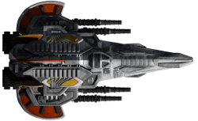
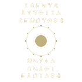
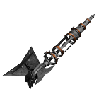
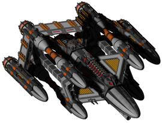
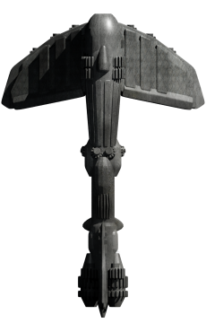
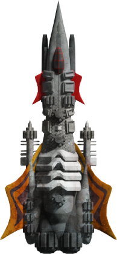
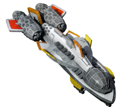

</img>

# News
(latest 15 entries):
<table><tr><td width=800>

2023-08-01 | updated Plugin 'Cromha Expansion' by OcelotWalrus | [story](https://github.com/Hecter94/EndlessSky-PluginArchive/blob/main/README.md#story) 
2023-07-31 | updated Plugin 'Midnight Scrapyard' by MidnightPlugins | [story](https://github.com/Hecter94/EndlessSky-PluginArchive/blob/main/README.md#story) 
2023-07-31 | updated Plugin 'Mega Freight' by 1010todd | [ships](https://github.com/Hecter94/EndlessSky-PluginArchive/blob/main/README.md#ships) 
2023-07-31 | updated Plugin 'Cromha Expansion' by OcelotWalrus | [story](https://github.com/Hecter94/EndlessSky-PluginArchive/blob/main/README.md#story) 
2023-07-30 | new Plugin 'Kraz Expanded' by Oskatel | [story](https://github.com/Hecter94/EndlessSky-PluginArchive/blob/main/README.md#story) 
2023-07-30 | updated Plugin 'Midnight Scrapyard' by MidnightPlugins | [story](https://github.com/Hecter94/EndlessSky-PluginArchive/blob/main/README.md#story) 
2023-07-30 | updated Plugin 'Ruin the Fun' by Pshy0 | [cheats](https://github.com/Hecter94/EndlessSky-PluginArchive/blob/main/README.md#cheats) 
2023-07-30 | updated Plugin 'Prism' by Startingfresher | [uncategorized](https://github.com/Hecter94/EndlessSky-PluginArchive/blob/main/README.md#uncategorized) 
2023-07-30 | updated Plugin 'Mega Freight' by 1010todd | [ships](https://github.com/Hecter94/EndlessSky-PluginArchive/blob/main/README.md#ships) 
2023-07-30 | updated Plugin 'Cromha Expansion' by OcelotWalrus | [story](https://github.com/Hecter94/EndlessSky-PluginArchive/blob/main/README.md#story) 
2023-07-29 | updated Plugin 'Endless-Endless-Sky' by 1010Todd | [overhauls](https://github.com/Hecter94/EndlessSky-PluginArchive/blob/main/README.md#overhauls) 
2023-07-29 | updated Plugin 'Mega Freight' by 1010todd | [ships](https://github.com/Hecter94/EndlessSky-PluginArchive/blob/main/README.md#ships) 
2023-07-29 | updated Plugin 'Lost in Midnight' by MidnightPlugins | [story](https://github.com/Hecter94/EndlessSky-PluginArchive/blob/main/README.md#story) 
2023-07-29 | updated Plugin 'Cromha Expansion' by OcelotWalrus | [story](https://github.com/Hecter94/EndlessSky-PluginArchive/blob/main/README.md#story) 
2023-07-29 | updated Plugin 'Naltok' by Quantumshark | [races](https://github.com/Hecter94/EndlessSky-PluginArchive/blob/main/README.md#races) 

</td></tr></table>
Provide a direct link to your zipped plugin to enable automatic updating. 

[howto](https://github.com/Hecter94/EndlessSky-PluginArchive/blob/main/README.md#automatic-updating) | [view all news](https://github.com/Hecter94/EndlessSky-PluginArchive/blob/main/res/allnews.md)

---

# Table of Contents

[Introduction](https://github.com/Hecter94/EndlessSky-PluginArchive/blob/main/README.md#introduction)

[Download Information](https://github.com/Hecter94/EndlessSky-PluginArchive/blob/main/README.md#download-information)
- [Downloading Alternative](https://github.com/Hecter94/EndlessSky-PluginArchive/blob/main/README.md#downloading-alternative)
- [Notes](https://github.com/Hecter94/EndlessSky-PluginArchive/blob/main/README.md#notes)
- [Known Plugin Issues](https://github.com/Hecter94/EndlessSky-PluginArchive/blob/main/README.md#known-plugin-issues)

[Contribution](https://github.com/Hecter94/EndlessSky-PluginArchive/blob/main/README.md#contribution)
- [Regarding Plugin Informations](https://github.com/Hecter94/EndlessSky-PluginArchive/blob/main/README.md#regarding-plugin-informations)
- [Add your Plugin](https://github.com/Hecter94/EndlessSky-PluginArchive/blob/main/README.md#add-your-plugin)
- [Automatic Updating](https://github.com/Hecter94/EndlessSky-PluginArchive/blob/main/README.md#automatic-updating)
- [Plugin Naming Convention](https://github.com/Hecter94/EndlessSky-PluginArchive/blob/main/README.md#plugin-naming-convention)

[Plugin Download](https://github.com/Hecter94/EndlessSky-PluginArchive/blob/main/README.md#plugin-download)
- [Cheats](https://github.com/Hecter94/EndlessSky-PluginArchive/blob/main/README.md#cheats)
- [Gameplay](https://github.com/Hecter94/EndlessSky-PluginArchive/blob/main/README.md#gameplay)
- [Graphics](https://github.com/Hecter94/EndlessSky-PluginArchive/blob/main/README.md#graphics)
- [Outfits](https://github.com/Hecter94/EndlessSky-PluginArchive/blob/main/README.md#outfits)
- [Overhauls](https://github.com/Hecter94/EndlessSky-PluginArchive/blob/main/README.md#overhauls)
- [Overwrites](https://github.com/Hecter94/EndlessSky-PluginArchive/blob/main/README.md#overwrites)
- [Patches](https://github.com/Hecter94/EndlessSky-PluginArchive/blob/main/README.md#patches)
- [Races](https://github.com/Hecter94/EndlessSky-PluginArchive/blob/main/README.md#races)
- [Ships](https://github.com/Hecter94/EndlessSky-PluginArchive/blob/main/README.md#ships)
- [Story](https://github.com/Hecter94/EndlessSky-PluginArchive/blob/main/README.md#story)
- [Weapons](https://github.com/Hecter94/EndlessSky-PluginArchive/blob/main/README.md#weapons)
- [Uncategorized](https://github.com/Hecter94/EndlessSky-PluginArchive/blob/main/README.md#uncategorized)

---

# Introduction

A comprehensive library of 544 ancient and new plugins for the open-source game Endless Sky.

---

# Download Information

All plugins can be downloaded directly [here](https://github.com/Hecter94/EndlessSky-PluginArchive#plugin-download) or as zip files from the [releases](https://github.com/Hecter94/EndlessSky-PluginArchive/releases/tag/Latest) page.

## Downloading Alternative

Third-party tools such as [https://download-directory.github.io](https://download-directory.github.io/) can download a single folder/plugin. Paste the folder URL into that tool and you will be given a .zip file for that folder.

For example, for the "50 cal" plugin, enter: [https://github.com/Hecter94/EndlessSky-PluginArchive/tree/main/Working/50%20cal](https://github.com/Hecter94/EndlessSky-PluginArchive/tree/main/Working/50%20cal)

Github, by default, only allows the entire library to be downloaded as a single .zip. GitHub may have issues downloading large file sizes; a possible workaround is using GitHub Desktop or Git Bash to clone the repository.

## Notes

- "Working" directory – plugins updated to work with the continous build of Endless Sky
- "Originals" directory – archived copies of original plugins
- "Nonfunctional" directory – plugins that will not function without updates

## Known Plugin Issues

If you find more plugin issues / conflicts please add them to 'res/plugin_issues.txt'.

### A Galaxy Far Far Away, Businessman Mod, Endless Depth, Normandy

Title screen missing/corrupted. override the title screen, using one or more of these can cause issues with it looking corrupted or "missing". Recommend to use one of these at a time, OR delete title.png from \images to restore the vanilla title screen

### Civil War, Edge of Endless, Jump to Lightspeed and Star Wars

all edit the vanilla interface, this can also cause issues and can only be fixed by editing/removing the interfaces.txt file in the plugin.

### A Wonderful Worldship

Random sprites replaced by worldships Culprit: Intended Behavior of "A wonderful worldship mod"

### Bare Ships

clears all ships from shipyards, meaning only bare versions of ships will be available, any plugins adding other ships not to custom shipyards will likely be incompatible

### Elite Sky

creates an Interceptor "bay type" which seems to make any interceptor escort jump around randomly.

### Final Frontier

sets every government swizzle to 0, also has an image named raider which conflicts with vanilla korath raider.

### Star Wars

includes a copy of vanilla data files and will likely conflict with any missions added/changed since it was created. Specifically known to conflict with changes to the Remnant storyline.

Star Wars has an image named fury which conflicts with vanilla fury.

### Recovery Ships

NPC Ships unable to assist with fuel or repairs Culprit: Likely an old version of Recovery Ship, updated 2/8/2022. Please let me know if you still see the issue.

Escorts from missions not spawning correctly Culprit: use the “safe” variant of this plugin to fix this behavior, “safe” version ships can only carry "Fighter" from vanilla and "Heavy Fighter" and "Gunship"

### The Station of Dr. Rousseau

"Bounty" Arfecta is spawned directly outside starting location. Culprit: , Mission: "Puzzle 3". No location is defined so Arfecta is spawned on first "landing".

"Hunt Dread Pirate Roberts" mission offers everywhere due to a lack of a source filter

### Edge of Endless

Overrides Luxury Accommodations and give it much higher space, bunks, and crew requirement, might make some ships that comes with it appears to have negative space and/or bunks.

Ship "Colossus" conflicts with a ship of the same name from Adamas

### Adamas

Ship "Colossus" conflicts with a ship of the same name from Edge of Endless

### ES-Restock

Gatling gun texture has empty space at 200px tall, resultuing in the outfit display being 10px lower than others

### Akasha Chronicles

Ship "Seraphim" conflicts with a ship of the same name from AES Irm

### AES Irm*

Ship "Seraphim" conflicts with a ship of the same name from Akasha Chronicles

### Mata

Ship "Spectre" conflicts with a ship of the same name from Alterra

### Alterra

Ship "Spectre" conflicts with a ship of the same name from Mata

Ship "Gladius" conflicts with a ship of the same name from Eternals

### Eternals

Ship "Gladius" conflicts with a ship of the same name from Alterra

### Cobbled Ships

Ship "Mammoth" conflicts with a ship of the same name in vanilla version 0.9.15 and later.

[back to top](https://github.com/Hecter94/EndlessSky-PluginArchive/blob/main/README.md#known-plugin-issues)

---

# Contribution

## Regarding Plugin Information

Some plugins are still missing important information, such as the author, description or current status. If you would like to help add this info, please update these by posting in the discussions area or making a Pull Request changing the files in `/res/pluginlist/`.

## Add your plugin

Do you want your plugin here? Fork this repository, upload your plugin, and make a Pull Request. Besides that, you can post it in the discussion area.

For Pull Requests, create a file with the plugin information in `/res/pluginlist/` and your plugin at `Working/`, so this README.md can get auto-generated by a script. Check the other files there to see the formatting.

If you provide a `directlink=` in the plugin file at `res/pluginlist/`, then there is no need to upload your plugin to the `Working` directory; your plugin will be uploaded automatically on the next daily check for updates. So instead of uploading a folder with a git client, you can upload a single text file with the web Interface.

## Automatic Updating

The files in `res/pluginlist/` used to generate this README.md have a line `directlink=`, where you can put a URL to your zipped plugin. The line should look like this: `directlink=https://github.com/userxyz/esplugins/releases/download/Latest/myplugin.zip` or any other directly accessible webspace.

This repository does an automated check for your direct link once a day at 23:30am UTC, and if your plugin there is newer than the one hosted here, it updates it and puts it in the news box. Please read the naming convention paragraph to prevent errors.

If you have a single plugin GitHub repo (with the data folder in the root), you can use the auto-generated zip file (green button) as a direct update link. You can fork the official plugin template repository at [https://github.com/endless-sky/plugin-template](https://github.com/endless-sky/plugin-template).

With this feature, we hope to create a centralized overview for active plugin development.

## Plugin Naming Convention

Although a lot of checking and error handling got implemented in the scripts, there might be some bugs. To be safe, try to avoid special characters in your plugin name.

We now have different paths and files addressed to the same plugin. The plugin folder is `Working/YourPlugin/`, and the information file is at `res/pluginlist/YourPlugin.txt`. 
To keep these files related, you must give them the same name.

---

# Plugin Download

All Plugins (544)

[Cheats](https://github.com/Hecter94/EndlessSky-PluginArchive/blob/main/README.md#cheats) (38) | [Gameplay](https://github.com/Hecter94/EndlessSky-PluginArchive/blob/main/README.md#gameplay) (40) | [Graphics](https://github.com/Hecter94/EndlessSky-PluginArchive/blob/main/README.md#graphics) (22) | [Outfits](https://github.com/Hecter94/EndlessSky-PluginArchive/blob/main/README.md#outfits) (44) 
[Overhauls](https://github.com/Hecter94/EndlessSky-PluginArchive/blob/main/README.md#overhauls) (47) | [Overwrites](https://github.com/Hecter94/EndlessSky-PluginArchive/blob/main/README.md#overwrites) (5) | [Patches](https://github.com/Hecter94/EndlessSky-PluginArchive/blob/main/README.md#patches) (3) | [Races](https://github.com/Hecter94/EndlessSky-PluginArchive/blob/main/README.md#races) (67) 
[Ships](https://github.com/Hecter94/EndlessSky-PluginArchive/blob/main/README.md#ships) (137) | [Story](https://github.com/Hecter94/EndlessSky-PluginArchive/blob/main/README.md#story) (76) | [Weapons](https://github.com/Hecter94/EndlessSky-PluginArchive/blob/main/README.md#weapons) (41) | [Uncategorized](https://github.com/Hecter94/EndlessSky-PluginArchive/blob/main/README.md#uncategorized) (24) 

---

## Cheats

38 plugins in this category.

 

---

### -Omnis

[-Omnis.zip](https://github.com/Hecter94/EndlessSky-PluginArchive/releases/download/Latest/-Omnis.zip) | 5.28 mb | 2023-07-14 | [view files](https://github.com/Hecter94/EndlessSky-PluginArchive/tree/main/Working/-Omnis/)  
Author: Darcy Manoel | [https://github.com/Adde-Endless-Sky-Mods/-Omnis](https://github.com/Adde-Endless-Sky-Mods/-Omnis)  
Category: Cheats  

>The most extensive all-content plugin to date. It includes many opportunities to test balance or ship builds against AI driven ships or fleets, all vanilla content and the content of many plugins available to use to put together different ship builds. Many more tools are included into Omnis too!
>

Status: N/A  
Daily update check: </img> 

---

### All Content Plugin
</img> 

[All.Content.Plugin.zip](https://github.com/Hecter94/EndlessSky-PluginArchive/releases/download/Latest/All.Content.Plugin.zip) | 141.9 kb | 2023-07-27 | [view files](https://github.com/Hecter94/EndlessSky-PluginArchive/tree/main/Working/All%20Content%20Plugin/)  
Author: Michael Zahniser | [https://github.com/endless-sky/all-content-plugin](https://github.com/endless-sky/all-content-plugin)  
Category: Cheats  

>This mod starts you on Greenrock with a trillion (10^12) credits and access to almost every ship and outfit in the game. It is intended for testing purposes, but of course, as its description says, "it can also be used by people who want to ruin the game for themselves by getting a massive fleet without needing to work for it." 
>

Status: N/A  
Daily update check: </img> 

---

### Arena
</img> 

[Arena.zip](https://github.com/Hecter94/EndlessSky-PluginArchive/releases/download/Latest/Arena.zip) | 17.97 kb | 2023-07-27 | [view files](https://github.com/Hecter94/EndlessSky-PluginArchive/tree/main/Working/Arena/)  
Author: 10010101001 | [https://github.com/10010101001/Arena](https://github.com/10010101001/Arena)  
Category: Cheats  

>This plugin adds two arenas with diffrent combat styles for the player to enjoy in-game and for testing purposes (near Sagittarius A).
>

Status: N/A  
Daily update check: </img> 

---

### automata.destruction.0percent
</img> 

[automata.destruction.0percent.zip](https://github.com/Hecter94/EndlessSky-PluginArchive/releases/download/Latest/automata.destruction.0percent.zip) | 51.32 kb | 2023-07-27 | [view files](https://github.com/Hecter94/EndlessSky-PluginArchive/tree/main/Working/automata.destruction.0percent/)  
Author: zuckung | [https://github.com/zuckung/endless-sky-plugins](https://github.com/zuckung/endless-sky-plugins)  
Category: Cheats  

>(14 ship attributes changed)
>
>Modifies the self destruction chance of Sestor and Mereti ships.
>Sestor 349/109/78/71/53/40/27 and Mereti 512/256/128/64/32/16/8 ships have a self destruction value of 0.0 (0%).

Status: tested with 0.10.2  
Daily update check: </img> 

---

### automata.destruction.23percent
</img> 

[automata.destruction.23percent.zip](https://github.com/Hecter94/EndlessSky-PluginArchive/releases/download/Latest/automata.destruction.23percent.zip) | 51.34 kb | 2023-07-27 | [view files](https://github.com/Hecter94/EndlessSky-PluginArchive/tree/main/Working/automata.destruction.23percent/)  
Author: zuckung | [https://github.com/zuckung/endless-sky-plugins](https://github.com/zuckung/endless-sky-plugins)  
Category: Cheats  

>(14 ship attributes changed)
>
>Modifies the self destruction chance of Sestor and Mereti ships.
>Sestor 349/109/78/71/53/40/27 and Mereti 512/256/128/64/32/16/8 ships have a self destruction value of 0.12 (23%).

Status: tested with 0.10.2  
Daily update check: </img> 

---

### automata.destruction.51percent
</img> 

[automata.destruction.51percent.zip](https://github.com/Hecter94/EndlessSky-PluginArchive/releases/download/Latest/automata.destruction.51percent.zip) | 51.34 kb | 2023-07-27 | [view files](https://github.com/Hecter94/EndlessSky-PluginArchive/tree/main/Working/automata.destruction.51percent/)  
Author: zuckung | [https://github.com/zuckung/endless-sky-plugins](https://github.com/zuckung/endless-sky-plugins)  
Category: Cheats  

>(14 ship attributes changed)
>
>Modifies the self destruction chance of Sestor and Mereti ships.
>Sestor 349/109/78/71/53/40/27 and Mereti 512/256/128/64/32/16/8 ships have a self destruction value of 0.3 (51%).

Status: tested with 0.10.2  
Daily update check: </img> 

---

### automata.destruction.75percent
</img> 

[automata.destruction.75percent.zip](https://github.com/Hecter94/EndlessSky-PluginArchive/releases/download/Latest/automata.destruction.75percent.zip) | 51.34 kb | 2023-07-27 | [view files](https://github.com/Hecter94/EndlessSky-PluginArchive/tree/main/Working/automata.destruction.75percent/)  
Author: zuckung | [https://github.com/zuckung/endless-sky-plugins](https://github.com/zuckung/endless-sky-plugins)  
Category: Cheats  

>(14 ship attributes changed)
>
>Modifies the self destruction chance of Sestor and Mereti ships.
>Sestor 349/109/78/71/53/40/27 and Mereti 512/256/128/64/32/16/8 ships have a self destruction value of 0.5 (75%).

Status: tested with 0.10.2  
Daily update check: </img> 

---

### Bit and Bobs

[Bit.and.Bobs.zip](https://github.com/Hecter94/EndlessSky-PluginArchive/releases/download/Latest/Bit.and.Bobs.zip) | 1.14 mb | 2022-10-06 | [view files](https://github.com/Hecter94/EndlessSky-PluginArchive/tree/main/Working/Bit%20and%20Bobs/)  
Author: N/A | N/A  
Category: Cheats  

>N/A
>

Status: N/A  
Daily update check: </img> 

---

### Casual Mod

[Casual.Mod.zip](https://github.com/Hecter94/EndlessSky-PluginArchive/releases/download/Latest/Casual.Mod.zip) | 403.08 kb | 2023-07-27 | [view files](https://github.com/Hecter94/EndlessSky-PluginArchive/tree/main/Working/Casual%20Mod/)  
Author: PPhoto  | [https://github.com/pphotography/EndlessSky_CasualMod](https://github.com/pphotography/EndlessSky_CasualMod)  
Category: Cheats  

>Makes gameplay more casual
>Ships are heavier making navigation and combat slower
>Higher range for some cannons to compensate ship speed
>Less, slower and weaker asteroids to increase clarity, FPS and easier mining
>

Status: N/A  
Daily update check: </img> 

---

### Checkmatemate

[Checkmatemate.zip](https://github.com/Hecter94/EndlessSky-PluginArchive/releases/download/Latest/Checkmatemate.zip) | 0.58 kb | 2022-10-06 | [view files](https://github.com/Hecter94/EndlessSky-PluginArchive/tree/main/Working/Checkmatemate/)  
Author: Zoura | N/A  
Category: Cheats  

>Unlocks checkmate stuff without having to do FWs
>

Status: Playable on 0.9.15 Continuous.  
Daily update check: </img> 

---

### Ciu Kreo
</img> 

[Ciu.Kreo.zip](https://github.com/Hecter94/EndlessSky-PluginArchive/releases/download/Latest/Ciu.Kreo.zip) | 458.64 kb | 2023-07-27 | [view files](https://github.com/Hecter94/EndlessSky-PluginArchive/tree/main/Working/Ciu%20Kreo/)  
Author: RestingImmortal | [https://github.com/RestingImmortal/Ciu-Kreo](https://github.com/RestingImmortal/Ciu-Kreo)  
Category: Cheats  

>An all-content plugin for Endless-Sky. Made to assist with content creation, or for general use.
>

Status: Playable on 0.9.14  
Daily update check: </img> 

---

### Cloaking Device Unlocked

[Cloaking.Device.Unlocked.zip](https://github.com/Hecter94/EndlessSky-PluginArchive/releases/download/Latest/Cloaking.Device.Unlocked.zip) | 2.6 kb | 2022-10-06 | [view files](https://github.com/Hecter94/EndlessSky-PluginArchive/tree/main/Working/Cloaking%20Device%20Unlocked/)  
Author: FriendlyNeighbour | N/A  
Category: Cheats  

>N/A
>

Status: N/A  
Daily update check: </img> 

---

### Custom Outfitting (Chop Shop)

[Custom.Outfitting.Chop.Shop.zip](https://github.com/Hecter94/EndlessSky-PluginArchive/releases/download/Latest/Custom.Outfitting.Chop.Shop.zip) | 4.02 kb | 2022-10-06 | [view files](https://github.com/Hecter94/EndlessSky-PluginArchive/tree/main/Working/Custom%20Outfitting%20(Chop%20Shop)/)  
Author: Jareth (Dr. Anthrax) | N/A  
Category: Cheats  

>Lets the player swap excess weapon and engine space for outfit space also alows the spending of outfit space to have more weapon and engine space.
>

Status: N/A  
Daily update check: </img> 

---

### DevStarts

[DevStarts.zip](https://github.com/Hecter94/EndlessSky-PluginArchive/releases/download/Latest/DevStarts.zip) | 1.67 kb | 2023-07-27 | [view files](https://github.com/Hecter94/EndlessSky-PluginArchive/tree/main/Working/DevStarts/)  
Author: williaji | [https://github.com/williaji/DevStarts](https://github.com/williaji/DevStarts)  
Category: Cheats  

>several developer start options, with credits, ships or jump drives

Status: N/A  
Daily update check: </img> 

---

### Dragonflame Fabrication

[Dragonflame.Fabrication.zip](https://github.com/Hecter94/EndlessSky-PluginArchive/releases/download/Latest/Dragonflame.Fabrication.zip) | 1.58 kb | 2022-10-06 | [view files](https://github.com/Hecter94/EndlessSky-PluginArchive/tree/main/Working/Dragonflame%20Fabrication/)  
Author: Galaucus | [https://github.com/Galaucus/Dragonflame-Fabrication](https://github.com/Galaucus/Dragonflame-Fabrication)  
Category: Cheats  

>A post-Emerald Sword mission chain that allows Kraz to manufacture a replacement Dragonflame Cannon.
>

Status: N/A  
Daily update check: </img> 

---

### Easier Korath Automatons
</img> 

[Easier.Korath.Automatons.zip](https://github.com/Hecter94/EndlessSky-PluginArchive/releases/download/Latest/Easier.Korath.Automatons.zip) | 73.38 kb | 2023-07-27 | [view files](https://github.com/Hecter94/EndlessSky-PluginArchive/tree/main/Working/Easier%20Korath%20Automatons/)  
Author: Kestrel1110 | [https://github.com/kestrel1110/Easier-Korath-Automatons](https://github.com/kestrel1110/Easier-Korath-Automatons)  
Category: Cheats  

>Makes fighting the Kor Mereti and Sestor a little bit easier.
>Also give bunks to the automatons so they will be viable flagships.
>

Status: Should work  
Daily update check: </img> 

---

### Generic Plugin

[Generic.Plugin.zip](https://github.com/Hecter94/EndlessSky-PluginArchive/releases/download/Latest/Generic.Plugin.zip) | 7.27 mb | 2022-10-06 | [view files](https://github.com/Hecter94/EndlessSky-PluginArchive/tree/main/Working/Generic%20Plugin/)  
Author: N/A | N/A  
Category: Cheats  

>A generic plugin for testing purposes.
>

Status: N/A  
Daily update check: </img> 

---

### Gray Box

[Gray.Box.zip](https://github.com/Hecter94/EndlessSky-PluginArchive/releases/download/Latest/Gray.Box.zip) | 18.01 kb | 2022-10-06 | [view files](https://github.com/Hecter94/EndlessSky-PluginArchive/tree/main/Working/Gray%20Box/)  
Author: granto | N/A  
Category: Cheats  

>alternate start with more money and a medium warship
>

Status: N/A  
Daily update check: </img> 

---

### Heliarch Shopping & Korath Konvenience

[Heliarch.Shopping.Korath.Konvenience.zip](https://github.com/Hecter94/EndlessSky-PluginArchive/releases/download/Latest/Heliarch.Shopping.Korath.Konvenience.zip) | 3.24 kb | 2022-10-06 | [view files](https://github.com/Hecter94/EndlessSky-PluginArchive/tree/main/Working/Heliarch%20Shopping%20&%20Korath%20Konvenience/)  
Author: Waladil | N/A  
Category: Cheats  

>KorExile outfits to KorEfret outfitter and mission to get Heliarch License and buy their outfits.
>

Status: Playable on 0.9.14, 0.9.15 Continuous.  
Daily update check: </img> 

---

### Hilo2000 Arena
</img> 

[Hilo2000.Arena.zip](https://github.com/Hecter94/EndlessSky-PluginArchive/releases/download/Latest/Hilo2000.Arena.zip) | 17.05 kb | 2023-07-27 | [view files](https://github.com/Hecter94/EndlessSky-PluginArchive/tree/main/Working/Hilo2000%20Arena/)  
Author: Mielo Symeonidis | [https://github.com/Hilo2000/arena/blob/main/](https://github.com/Hilo2000/arena/blob/main/)  
Category: Cheats  

>This plugin adds an arena with multiple hard and easy challenges.
>

Status: N/A  
Daily update check: </img> 

---

### Improved Ship Integrity

[Improved.Ship.Integrity.zip](https://github.com/Hecter94/EndlessSky-PluginArchive/releases/download/Latest/Improved.Ship.Integrity.zip) | 44.14 kb | 2023-07-27 | [view files](https://github.com/Hecter94/EndlessSky-PluginArchive/tree/main/Working/Improved%20Ship%20Integrity/)  
Author: Xolarix | [https://github.com/Xolarix/Improved-Ship-Integrity](https://github.com/Xolarix/Improved-Ship-Integrity)  
Category: Cheats  

>This plugin puts the hull points of all ships in the game at 250% their original values.
>

Status: N/A  
Daily update check: </img> 

---

### Kestrel Rework

[Kestrel.Rework.zip](https://github.com/Hecter94/EndlessSky-PluginArchive/releases/download/Latest/Kestrel.Rework.zip) | 5.53 kb | 2023-07-27 | [view files](https://github.com/Hecter94/EndlessSky-PluginArchive/tree/main/Working/Kestrel%20Rework/)  
Author: MinneIceCube | [https://github.com/MinneIceCube/KestrelRework](https://github.com/MinneIceCube/KestrelRework)  
Category: Cheats  

>Make Kestrel a much better ship, and increased requirements.
>

Status: N/A  
Daily update check: </img> 

---

### No Bactrian

[No.Bactrian.zip](https://github.com/Hecter94/EndlessSky-PluginArchive/releases/download/Latest/No.Bactrian.zip) | 2.91 kb | 2022-10-06 | [view files](https://github.com/Hecter94/EndlessSky-PluginArchive/tree/main/Working/No%20Bactrian/)  
Author: Disiuze | [https://github.com/Disiuze/misc-projects](https://github.com/Disiuze/misc-projects)  
Category: Cheats  

>This mod removes Bactrians and Mules from the shipyard and fleet definitions.
>NOTE: Overrides fleets and Lionheart shipyards, might cause problem with other plugin.
>
>

Status: Should be playable on 0.9.14, 0.9.15.  
Daily update check: </img> 

---

### No Drag Mod

[No.Drag.Mod.zip](https://github.com/Hecter94/EndlessSky-PluginArchive/releases/download/Latest/No.Drag.Mod.zip) | 1.51 kb | 2022-10-06 | [view files](https://github.com/Hecter94/EndlessSky-PluginArchive/tree/main/Working/No%20Drag%20Mod/)  
Author: Jafdy | N/A  
Category: Cheats  

>sets the drag of all ships and missiles to 0.
>

Status: N/A  
Daily update check: </img> 

---

### Nuclear War

[Nuclear.War.zip](https://github.com/Hecter94/EndlessSky-PluginArchive/releases/download/Latest/Nuclear.War.zip) | 0.72 kb | 2022-10-06 | [view files](https://github.com/Hecter94/EndlessSky-PluginArchive/tree/main/Working/Nuclear%20War/)  
Author: House Kitty | N/A  
Category: Cheats  

>Merchant and Pirate Hawks equiped with Nukes locked in an endless and massive battle in the Holeb system.
>

Status: Should be playable on 0.9.14, 0.9.15 Continuous.  
Daily update check: </img> 

---

### Overkill

[Overkill.zip](https://github.com/Hecter94/EndlessSky-PluginArchive/releases/download/Latest/Overkill.zip) | 3.34 mb | 2022-10-06 | [view files](https://github.com/Hecter94/EndlessSky-PluginArchive/tree/main/Working/Overkill/)  
Author: Carter-M-II | [https://github.com/Carter-M-II/ES-Overkill](https://github.com/Carter-M-II/ES-Overkill)  
Category: Cheats  

>This mod is full of overpowered/bloated things like Ships and Outfits. Only used to beat the game but may be fun to pit on other mods with overpowered ships/outfits.
>

Status: N/A  
Daily update check: </img> 

---

### Reverse Engineering

[Reverse.Engineering.zip](https://github.com/Hecter94/EndlessSky-PluginArchive/releases/download/Latest/Reverse.Engineering.zip) | 1.48 mb | 2022-10-06 | [view files](https://github.com/Hecter94/EndlessSky-PluginArchive/tree/main/Working/Reverse%20Engineering/)  
Author: N/A | N/A  
Category: Cheats  

>Small to medium sized mod focused around reverse engineering alien technology and establishing a business empire. 
>

Status: N/A  
Daily update check: </img> 

---

### Ruin the Fun
</img> 

[Ruin.the.Fun.zip](https://github.com/Hecter94/EndlessSky-PluginArchive/releases/download/Latest/Ruin.the.Fun.zip) | 3.56 mb | 2023-07-30 | [view files](https://github.com/Hecter94/EndlessSky-PluginArchive/tree/main/Working/Ruin%20the%20Fun/)  
Author: Pshy0 | [https://github.com/Pshy0/es-ruin-the-fun](https://github.com/Pshy0/es-ruin-the-fun)  
Category: Cheats  

>A development / cheat plugin for Endless Sky. Access all ships and outfits, change your captain's name, choose the color swizzle of your ships, edit your relation with other governments, set your combat rank, hire a powerful escort, gift yourself pre-outfitted ships, give yourself money, and much more. 

Status: N/A  
Daily update check: </img> 

---

### Shipmod

[Shipmod.zip](https://github.com/Hecter94/EndlessSky-PluginArchive/releases/download/Latest/Shipmod.zip) | 6.67 kb | 2022-10-06 | [view files](https://github.com/Hecter94/EndlessSky-PluginArchive/tree/main/Working/Shipmod/)  
Author: Galaucus | [https://github.com/Galaucus/Shipmod](https://github.com/Galaucus/Shipmod)  
Category: Cheats  

>adds lots of outfits to the game
>

Status: N/A  
Daily update check: </img> 

---

### Slightly Less Self-Destructive Korath Automa

[Slightly.Less.Self-Destructive.Korath.Automa.zip](https://github.com/Hecter94/EndlessSky-PluginArchive/releases/download/Latest/Slightly.Less.Self-Destructive.Korath.Automa.zip) | 1.37 kb | 2023-07-27 | [view files](https://github.com/Hecter94/EndlessSky-PluginArchive/tree/main/Working/Slightly%20Less%20Self-Destructive%20Korath%20Automa/)  
Author: N/A | N/A  
Category: Cheats  

>All this little plugin does is make them Korath Automa a little less likely to react like an Electrode and explode in your face when you try to board/capture them.
>

Status: N/A  
Daily update check: </img> 

---

### Space Conversion

[Space.Conversion.zip](https://github.com/Hecter94/EndlessSky-PluginArchive/releases/download/Latest/Space.Conversion.zip) | 23.31 kb | 2022-10-06 | [view files](https://github.com/Hecter94/EndlessSky-PluginArchive/tree/main/Working/Space%20Conversion/)  
Author: whismerhill | [https://www.nexusmods.com/endlesssky/mods/1](https://www.nexusmods.com/endlesssky/mods/1)  
Category: Cheats  

>Adds several outfits to fine-tune your ships, convert weapon slots, existing bunks to outfit or cargo space and even create more engine space.
>

Status: N/A  
Daily update check: </img> 

---

### TheronEpic Omnis

[TheronEpic.Omnis.zip](https://github.com/Hecter94/EndlessSky-PluginArchive/releases/download/Latest/TheronEpic.Omnis.zip) | 2.68 kb | 2023-07-27 | [view files](https://github.com/Hecter94/EndlessSky-PluginArchive/tree/main/Working/TheronEpic%20Omnis/)  
Author: TheronEpic | [https://github.com/TheronEpic/TheronEpic-Omnis](https://github.com/TheronEpic/TheronEpic-Omnis)  
Category: Cheats  

>Just a small mod, adding a dedicated system for my content, made for players with Omnis. Has arena worlds for most of my ships

Status: N/A  
Daily update check: </img> 

---

### Trollship

[Trollship.zip](https://github.com/Hecter94/EndlessSky-PluginArchive/releases/download/Latest/Trollship.zip) | 2.48 kb | 2022-10-06 | [view files](https://github.com/Hecter94/EndlessSky-PluginArchive/tree/main/Working/Trollship/)  
Author: House Kitty | N/A  
Category: Cheats  

>Occasionally spawn troll ships in transport.
>

Status: Playable on 0.9.14, 0.9.15 Continuous.  
Daily update check: </img> 

---

### Ultimate Cheater Plugin
</img> 

[Ultimate.Cheater.Plugin.zip](https://github.com/Hecter94/EndlessSky-PluginArchive/releases/download/Latest/Ultimate.Cheater.Plugin.zip) | 2.4 mb | 2023-07-27 | [view files](https://github.com/Hecter94/EndlessSky-PluginArchive/tree/main/Working/Ultimate%20Cheater%20Plugin/)  
Author: Hondolor | [https://github.com/Hondolor/mdsmestad-Ultimate-Cheater-Pluggin](https://github.com/Hondolor/mdsmestad-Ultimate-Cheater-Pluggin)  
Category: Cheats  

>This plugin was made to allow content creators to have access to all outfits in a single place, for the purpose of designing and testing outfit loadouts for new ships. Of course, it can also be used by people who want to ruin the game for themselves by getting a massive fleet without needing to work for it.
>
>

Status: Playable on 0.9.14, 0.9.15 Continuous.  
Daily update check: </img> 

---

### Ursa Polaris
</img> 

[Ursa.Polaris.zip](https://github.com/Hecter94/EndlessSky-PluginArchive/releases/download/Latest/Ursa.Polaris.zip) | 3.38 mb | 2022-10-06 | [view files](https://github.com/Hecter94/EndlessSky-PluginArchive/tree/main/Working/Ursa%20Polaris/)  
Author: Local God | [https://github.com/LocalGod79/UrsaPolaris](https://github.com/LocalGod79/UrsaPolaris)  
Category: Cheats  

>Post-mainline mission to build a universal outfitter.
>

Status: Playable on 0.10.0  
Daily update check: </img> 

---

### Visible Minable Asteroids

[Visible.Minable.Asteroids.zip](https://github.com/Hecter94/EndlessSky-PluginArchive/releases/download/Latest/Visible.Minable.Asteroids.zip) | 7.17 mb | 2022-10-06 | [view files](https://github.com/Hecter94/EndlessSky-PluginArchive/tree/main/Working/Visible%20Minable%20Asteroids/)  
Author: hellminister | [https://steamcommunity.com/sharedfiles/filedetails/?id=1199797331](https://steamcommunity.com/sharedfiles/filedetails/?id=1199797331)  
Category: Cheats  

>Add highlighting box around mineable asteroids.
>

Status: N/A  
Daily update check: </img> 

---

### World Forge
</img> 

[World.Forge.zip](https://github.com/Hecter94/EndlessSky-PluginArchive/releases/download/Latest/World.Forge.zip) | 553.1 kb | 2023-07-27 | [view files](https://github.com/Hecter94/EndlessSky-PluginArchive/tree/main/Working/World%20Forge/)  
Author: Amazinite | [https://github.com/EndlessSkyCommunity/world-forge](https://github.com/EndlessSkyCommunity/world-forge)  
Category: Cheats  

>"This plugin was made to allow content creators to have access to all outfits in a single place, for the purpose of designing and testing outfit loadouts for new ships. Of course, it can also be used by people who want to ruin the game for themselves by getting a massive fleet without needing to work for it."
>World Forge does this as well, but extends this: not only all outfits in one place, but sorted by race additionally, a way to change the swizzle(derived from ProjectRunabout), a easy way to add own outfits and ships into the existing scheme, and  missions to change your reputation with factions! 

Status: N/A  
Daily update check: </img> 

---

### ZES Global

[ZES.Global.zip](https://github.com/Hecter94/EndlessSky-PluginArchive/releases/download/Latest/ZES.Global.zip) | 914.69 kb | 2023-07-27 | [view files](https://github.com/Hecter94/EndlessSky-PluginArchive/tree/main/Working/ZES%20Global/)  
Author: Zichas | [https://github.com/Zitchas/ZESglobal](https://github.com/Zitchas/ZESglobal)  
Category: Cheats  

>This is a collection of files intended to change the general feel of the game. 
>
>ZOutfitSpace: Increases the outfit space of most ships.
>ZMobility: Alters the manouverability balance of the game.
>ZRemnantStart: disabled. Will have a Remnant start once that PR is implemented.
>ZRemArrival: disabled. Will have a starting point at Ingot in an Osprey with a quantum keystone.
>

Status: N/A  
Daily update check: </img> 

[back to top](https://github.com/Hecter94/EndlessSky-PluginArchive/blob/main/README.md#Cheats)

---

## Gameplay

40 plugins in this category.

 

---

### Adjusted Hyperdrive

[Adjusted.Hyperdrive.zip](https://github.com/Hecter94/EndlessSky-PluginArchive/releases/download/Latest/Adjusted.Hyperdrive.zip) | 2.87 kb | 2022-10-06 | [view files](https://github.com/Hecter94/EndlessSky-PluginArchive/tree/main/Working/Adjusted%20Hyperdrive/)  
Author: N/A | N/A  
Category: Gameplay  

>Increases fuel capacity of many ships and modifies the three drives.
>

Status: N/A  
Daily update check: </img> 

---

### Arrival Distance Override

[Arrival.Distance.Override.zip](https://github.com/Hecter94/EndlessSky-PluginArchive/releases/download/Latest/Arrival.Distance.Override.zip) | 217.09 kb | 2022-10-06 | [view files](https://github.com/Hecter94/EndlessSky-PluginArchive/tree/main/Working/Arrival%20Distance%20Override/)  
Author: N/A | N/A  
Category: Gameplay  

>Add system arrival depending on habitable or belt distance.
>Can get overridden by other plugins.
>

Status: N/A  
Daily update check: </img> 

---

### automata.in.human.space
</img> 

[automata.in.human.space.zip](https://github.com/Hecter94/EndlessSky-PluginArchive/releases/download/Latest/automata.in.human.space.zip) | 52.44 kb | 2023-07-27 | [view files](https://github.com/Hecter94/EndlessSky-PluginArchive/tree/main/Working/automata.in.human.space/)  
Author: zuckung | [https://github.com/zuckung/endless-sky-plugins](https://github.com/zuckung/endless-sky-plugins)  
Category: Gameplay  

>(14 ship variants, 16 variants in 4 fleets)
>
>Brings jump drive equipped automata into human space after the wanderer campaign. 
>You can find them where Korath ships in human space are usually found(ember waste and eastern syndicate). 
>The chance to encounter previous Korath ships or automata is like 50/50.

Status: tested with 0.10.2  
Daily update check: </img> 

---

### Bare Ships

[Bare.Ships.zip](https://github.com/Hecter94/EndlessSky-PluginArchive/releases/download/Latest/Bare.Ships.zip) | 2.02 kb | 2023-07-27 | [view files](https://github.com/Hecter94/EndlessSky-PluginArchive/tree/main/Working/Bare%20Ships/)  
Author: lifeyouristhis | [https://github.com/lifeyouristhis/bare-ships-plugin](https://github.com/lifeyouristhis/bare-ships-plugin)  
Category: Gameplay  

>Shipyards now sell bare hulls with no outfits.
>

Status: N/A  
Daily update check: </img> 

---

### BetterVanillaHai
</img> 

[BetterVanillaHai.zip](https://github.com/Hecter94/EndlessSky-PluginArchive/releases/download/Latest/BetterVanillaHai.zip) | 72.77 kb | 2023-07-27 | [view files](https://github.com/Hecter94/EndlessSky-PluginArchive/tree/main/Working/BetterVanillaHai/)  
Author: ZBok | [https://github.com/ZBok/BetterVanillaHai](https://github.com/ZBok/BetterVanillaHai)  
Category: Gameplay  

>In short this plugin assumes news of the Hai spreads rapidly. Therefore in the late game a small percentage of humans start using their ships in ambient fleets. It therefore adds Hai vessels and many variants (like full Proton SB or Plasma/QuadBlaster Solifuge + many more) as rare additions to almost all human fleets in the late-game (more details below). This makes ambient pirate combat much more spicy and varied, with the tide of pirate battle being turned when a Hai ship from either side jumps in.

Status: N/A  
Daily update check: </img> 

---

### Boarding Licenses

[Boarding.Licenses.zip](https://github.com/Hecter94/EndlessSky-PluginArchive/releases/download/Latest/Boarding.Licenses.zip) | 17.69 kb | 2023-07-27 | [view files](https://github.com/Hecter94/EndlessSky-PluginArchive/tree/main/Working/Boarding%20Licenses/)  
Author: An-archist | [https://github.com/An-archist/boarding-licenses](https://github.com/An-archist/boarding-licenses)  
Category: Gameplay  

>Adds licenses that allow the player to capture ships. Currently in alpha The better the license, the more ships you can cap
>

Status: N/A  
Daily update check: </img> 

---

### Bounty Hunters

[Bounty.Hunters.zip](https://github.com/Hecter94/EndlessSky-PluginArchive/releases/download/Latest/Bounty.Hunters.zip) | 11.3 kb | 2023-07-27 | [view files](https://github.com/Hecter94/EndlessSky-PluginArchive/tree/main/Working/Bounty%20Hunters/)  
Author: WarlordMike | [https://github.com/WarlordMike/es-bounty-hunters](https://github.com/WarlordMike/es-bounty-hunters)  
Category: Gameplay  

>Adds a storyline where you can become a bounty hunter.
>

Status: N/A  
Daily update check: </img> 

---

### Bounty-Fix
</img> 

[Bounty-Fix.zip](https://github.com/Hecter94/EndlessSky-PluginArchive/releases/download/Latest/Bounty-Fix.zip) | 95.43 kb | 2023-07-23 | [view files](https://github.com/Hecter94/EndlessSky-PluginArchive/tree/main/Working/Bounty-Fix/)  
Author: CatLady | [https://github.com/Cat-Lady/Bounty-Fix](https://github.com/Cat-Lady/Bounty-Fix)  
Category: Gameplay  

>This ES plugin makes Pirates/Marauders that are subject of Bounty Hunting missions be properly seen as enemies by Militia/Navy/Deep Security/Merchants and other forces that should dislike Marauders/Pirates.

Status: N/A  
Daily update check: </img> 

---

### Businessman Mod

[Businessman.Mod.zip](https://github.com/Hecter94/EndlessSky-PluginArchive/releases/download/Latest/Businessman.Mod.zip) | 802.36 kb | 2023-07-27 | [view files](https://github.com/Hecter94/EndlessSky-PluginArchive/tree/main/Working/Businessman%20Mod/)  
Author: Evan | N/A  
Category: Gameplay  

>Become a ruler of the galaxy through money. Buy trade routes, stocks, set up shops and entertainment centers, buy planets, hire a mercenary army, hunt down people who didn't pay back their loans....and more.. Also includes an optional alternate pirate start, and additons to make piracy much more viable and fun.
>

Status: Playable on 0.9.14, 0.9.15 Continuous.  
Daily update check: </img> 

---

### Cargo Controls Plugin

[Cargo.Controls.Plugin.zip](https://github.com/Hecter94/EndlessSky-PluginArchive/releases/download/Latest/Cargo.Controls.Plugin.zip) | 3.15 kb | 2023-07-27 | [view files](https://github.com/Hecter94/EndlessSky-PluginArchive/tree/main/Working/Cargo%20Controls%20Plugin/)  
Author: petervdmeer | [https://github.com/petervdmeer/endless-sky-cargo-controls-plugin](https://github.com/petervdmeer/endless-sky-cargo-controls-plugin)  
Category: Gameplay  

>Cargo Controls options for Endless Sky.

Status: N/A  
Daily update check: </img> 

---

### Conscience Plugin

[Conscience.Plugin.zip](https://github.com/Hecter94/EndlessSky-PluginArchive/releases/download/Latest/Conscience.Plugin.zip) | 24.08 kb | 2023-07-27 | [view files](https://github.com/Hecter94/EndlessSky-PluginArchive/tree/main/Working/Conscience%20Plugin/)  
Author: mathwhiz1212 | [https://github.com/mathwhiz1212/ES-conscience-plugin](https://github.com/mathwhiz1212/ES-conscience-plugin)  
Category: Gameplay  

>This plugin is meant to allow you to complete Endless Sky story lines without doing things you have an ethical problem with. For now, it just makes it so you don't need to drop a bomb on Zenith and kill civilians.

Status: N/A  
Daily update check: </img> 

---

### Costly Drives
</img> 

[Costly.Drives.zip](https://github.com/Hecter94/EndlessSky-PluginArchive/releases/download/Latest/Costly.Drives.zip) | 99.21 kb | 2023-07-27 | [view files](https://github.com/Hecter94/EndlessSky-PluginArchive/tree/main/Working/Costly%20Drives/)  
Author: Anarchist2 | [https://github.com/Anarchist2/costly-drives](https://github.com/Anarchist2/costly-drives)  
Category: Gameplay  

>This plugin makes drives much more expensive, while making them unplunderable to prevent easy(er) boarding. Additionally, drive sales are much more restricted.
>

Status: N/A  
Daily update check: </img> 

---

### Crowded Sky

[Crowded.Sky.zip](https://github.com/Hecter94/EndlessSky-PluginArchive/releases/download/Latest/Crowded.Sky.zip) | 8.83 kb | 2022-10-06 | [view files](https://github.com/Hecter94/EndlessSky-PluginArchive/tree/main/Working/Crowded%20Sky/)  
Author: 1010todd | N/A  
Category: Gameplay  

>Make npc fleets spawn more often.
>Note: it's done by overwriting map file, may cause conflict with other plugin that also do that.
>

Status: N/A  
Daily update check: </img> 

---

### Delayed Free Worlds

[Delayed.Free.Worlds.zip](https://github.com/Hecter94/EndlessSky-PluginArchive/releases/download/Latest/Delayed.Free.Worlds.zip) | 16.59 kb | 2023-07-27 | [view files](https://github.com/Hecter94/EndlessSky-PluginArchive/tree/main/Working/Delayed%20Free%20Worlds/)  
Author: MinneIceCube | [https://github.com/MinneIceCube/Delayed-Free-Worlds-Start](https://github.com/MinneIceCube/Delayed-Free-Worlds-Start)  
Category: Gameplay  

>Does exactly what the title says it does. Delays the declration of the Free Worlds by about half a year. The reason for this is so that players will have more time to complete missions for the The "Southern Mutual Defense Pact." While few in number, they are easy to miss if not done before the war starts. 

Status: N/A  
Daily update check: </img> 

---

### Difficulties
</img> 

[Difficulties.zip](https://github.com/Hecter94/EndlessSky-PluginArchive/releases/download/Latest/Difficulties.zip) | 13.81 kb | 2023-07-27 | [view files](https://github.com/Hecter94/EndlessSky-PluginArchive/tree/main/Working/Difficulties/)  
Author: Mielo Symeonidis | N/A  
Category: Gameplay  

>Adds three diffrent difficulties that take form as the start to a game. Not reccomended for people new to Endless Sky.
>

Status: N/A  
Daily update check: </img> 

---

### Drop Loot

[Drop.Loot.zip](https://github.com/Hecter94/EndlessSky-PluginArchive/releases/download/Latest/Drop.Loot.zip) | 89.72 kb | 2023-03-04 | [view files](https://github.com/Hecter94/EndlessSky-PluginArchive/tree/main/Working/Drop%20Loot/)  
Author: 1010todd | N/A  
Category: Gameplay  

>Every outfit now have chance to be dropped as flotsam when the ship explodes.
>

Status: N/A  
Daily update check: </img> 

---

### Extra Large Jobs

[Extra.Large.Jobs.zip](https://github.com/Hecter94/EndlessSky-PluginArchive/releases/download/Latest/Extra.Large.Jobs.zip) | 6.25 kb | 2022-10-06 | [view files](https://github.com/Hecter94/EndlessSky-PluginArchive/tree/main/Working/Extra%20Large%20Jobs/)  
Author: 1010todd | N/A  
Category: Gameplay  

>Add various large to extremely large jobs to fill up the space when for extra large ships.
>
>
>

Status: Playable on 0.9.15 Continuous.  
Daily update check: </img> 

---

### Galactic Hazards

[Galactic.Hazards.zip](https://github.com/Hecter94/EndlessSky-PluginArchive/releases/download/Latest/Galactic.Hazards.zip) | 5.04 kb | 2022-10-06 | [view files](https://github.com/Hecter94/EndlessSky-PluginArchive/tree/main/Working/Galactic%20Hazards/)  
Author: N/A | N/A  
Category: Gameplay  

>adds more hazards to many systems. like coronar mass ejection, different asteroid impact, dust rings atound stars, etc.
>

Status: N/A  
Daily update check: </img> 

---

### galactic.capital.investment
</img> 

[galactic.capital.investment.zip](https://github.com/Hecter94/EndlessSky-PluginArchive/releases/download/Latest/galactic.capital.investment.zip) | 53.43 kb | 2023-07-27 | [view files](https://github.com/Hecter94/EndlessSky-PluginArchive/tree/main/Working/galactic.capital.investment/)  
Author: zuckung | [https://github.com/zuckung/endless-sky-plugins](https://github.com/zuckung/endless-sky-plugins)  
Category: Gameplay  

>(story, repeatable mission)
>
>Implements a two mission chain that enables regular spaceport investment opportunities which result in small daily income. Available in human, quarg and hai space with 2 million credits cash.
>(inspired by a-alhusaini's investment bank plugin)

Status: tested with 0.10.2  
Daily update check: </img> 

---

### Gatling Ammo Fix
</img> 

[Gatling.Ammo.Fix.zip](https://github.com/Hecter94/EndlessSky-PluginArchive/releases/download/Latest/Gatling.Ammo.Fix.zip) | 79.73 kb | 2023-07-27 | [view files](https://github.com/Hecter94/EndlessSky-PluginArchive/tree/main/Working/Gatling%20Ammo%20Fix/)  
Author: Cat-Lady | [https://github.com/Cat-Lady/](https://github.com/Cat-Lady/)  
Category: Gameplay  

>This plugin fixes availability of Gatling Gun Ammo (and its boxes) - being most primitive and easiest to manufacture type of ordnance, it is now available where you would expect it to be (hint: "galactic south" and multipurpose ammo depots).
>
>Recommended to use with Becca's Endless Expansion plugin (which adds Kraz Cybernetic's Accurate Gatling Blaster" variant).
>

Status: N/A  
Daily update check: </img> 

---

### GreyShipVolume

[GreyShipVolume.zip](https://github.com/Hecter94/EndlessSky-PluginArchive/releases/download/Latest/GreyShipVolume.zip) | 62.42 kb | 2022-10-06 | [view files](https://github.com/Hecter94/EndlessSky-PluginArchive/tree/main/Working/GreyShipVolume/)  
Author: 1010Todd | N/A  
Category: Gameplay  

>Lots of map to calculate ship volume(outfit/cargo space) and mass.
>WARNING: single-file race might have unrelated data attached (Pug, Drak, etc.)
>
>

Status: Playable on 0.9.14, 0.9.15 Continuous.  
Daily update check: </img> 

---

### HW Rebalance Test

[HW.Rebalance.Test.zip](https://github.com/Hecter94/EndlessSky-PluginArchive/releases/download/Latest/HW.Rebalance.Test.zip) | 18.13 kb | 2022-10-06 | [view files](https://github.com/Hecter94/EndlessSky-PluginArchive/tree/main/Working/HW%20Rebalance%20Test/)  
Author: 1010Todd | N/A  
Category: Gameplay  

>Triple human heavy warship mass to make them slower.
>

Status: Playable on 0.9.14, 0.9.15 Continuous.  
Daily update check: </img> 

---

### Investment Bank

[Investment.Bank.zip](https://github.com/Hecter94/EndlessSky-PluginArchive/releases/download/Latest/Investment.Bank.zip) | 0.96 kb | 2023-07-27 | [view files](https://github.com/Hecter94/EndlessSky-PluginArchive/tree/main/Working/Investment%20Bank/)  
Author: a-alhusain | [https://github.com/a-alhusaini/investment-bank-es-plugin](https://github.com/a-alhusaini/investment-bank-es-plugin)  
Category: Gameplay  

>When you are rich enough some investment banks will offer you a chance to invest with them to gain an increased daily salary
>

Status: Playable on 0.9.14, 0.10.0 Continuous.  
Daily update check: </img> 

---

### Kor Mereti Fluff
</img> 

[Kor.Mereti.Fluff.zip](https://github.com/Hecter94/EndlessSky-PluginArchive/releases/download/Latest/Kor.Mereti.Fluff.zip) | 2.62 mb | 2023-07-27 | [view files](https://github.com/Hecter94/EndlessSky-PluginArchive/tree/main/Working/Kor%20Mereti%20Fluff/)  
Author: OcelotWalrus | [https://github.com/OcelotWalrus/Kor-Mereti-Fluff](https://github.com/OcelotWalrus/Kor-Mereti-Fluff)  
Category: Gameplay  

>It is a plugin that expand the ships and the outfits of the Kor Mereti faction.

Status: N/A  
Daily update check: </img> 

---

### kor.efret.shipyard
</img> 

[kor.efret.shipyard.zip](https://github.com/Hecter94/EndlessSky-PluginArchive/releases/download/Latest/kor.efret.shipyard.zip) | 51.36 kb | 2023-07-27 | [view files](https://github.com/Hecter94/EndlessSky-PluginArchive/tree/main/Working/kor.efret.shipyard/)  
Author: zuckung | [https://github.com/zuckung/endless-sky-plugins](https://github.com/zuckung/endless-sky-plugins)  
Category: Gameplay  

>(outfitter and shipyard added)
>
>Adds a shipyard with the the three Kor Efret ships(Arch-Carrack, Charm-Shallop, Echo-Galleon) to Laki Nemparu(Kashikt) in Kor Efret space. Also adds an outfitter with all outfits of these three ships.

Status: tested with 0.10.2  
Daily update check: </img> 

---

### Korath Domination

[Korath.Domination.zip](https://github.com/Hecter94/EndlessSky-PluginArchive/releases/download/Latest/Korath.Domination.zip) | 3.57 kb | 2022-10-06 | [view files](https://github.com/Hecter94/EndlessSky-PluginArchive/tree/main/Working/Korath%20Domination/)  
Author: N/A | N/A  
Category: Gameplay  

>makes korath exiles, kor efret, mereti and sestor planets dominateable(with tribute)
>

Status: N/A  
Daily update check: </img> 

---

### Landing Fees and Tax

[Landing.Fees.and.Tax.zip](https://github.com/Hecter94/EndlessSky-PluginArchive/releases/download/Latest/Landing.Fees.and.Tax.zip) | 1.56 kb | 2022-10-06 | [view files](https://github.com/Hecter94/EndlessSky-PluginArchive/tree/main/Working/Landing%20Fees%20and%20Tax/)  
Author: Disiuze | [https://github.com/Disiuze/misc-projects](https://github.com/Disiuze/misc-projects)  
Category: Gameplay  

>Adds a landing fee the player has to pay each time after one year.
>

Status: Playable on 0.9.14, 0.9.15 Continuous.  
Daily update check: </img> 

---

### Mass-ive Fix
</img> 

[Mass-ive.Fix.zip](https://github.com/Hecter94/EndlessSky-PluginArchive/releases/download/Latest/Mass-ive.Fix.zip) | 86.69 kb | 2023-07-27 | [view files](https://github.com/Hecter94/EndlessSky-PluginArchive/tree/main/Working/Mass-ive%20Fix/)  
Author: Anarchist2 | [https://github.com/Anarchist2/Mass-ive-fix](https://github.com/Anarchist2/Mass-ive-fix)  
Category: Gameplay  

>Make mass and outfit space of a few outfits the same.
>

Status: N/A  
Daily update check: </img> 

---

### Mess

[Mess.zip](https://github.com/Hecter94/EndlessSky-PluginArchive/releases/download/Latest/Mess.zip) | 5.0 kb | 2023-07-27 | [view files](https://github.com/Hecter94/EndlessSky-PluginArchive/tree/main/Working/Mess/)  
Author: FranchuFranchu | [https://github.com/FranchuFranchu/endless-sky-mess-plugin](https://github.com/FranchuFranchu/endless-sky-mess-plugin)  
Category: Gameplay  

>This plugin makes all the governments get in war against each other
>It also makes every fleet spawn in Sol, so you can see them all destroy each other in one place
>Finally, it changes how the pilot starts.
>

Status: N/A  
Daily update check: </img> 

---

### more.boarding.missions
</img> 

[more.boarding.missions.zip](https://github.com/Hecter94/EndlessSky-PluginArchive/releases/download/Latest/more.boarding.missions.zip) | 51.76 kb | 2023-07-27 | [view files](https://github.com/Hecter94/EndlessSky-PluginArchive/tree/main/Working/more.boarding.missions/)  
Author: zuckung | [https://github.com/zuckung/endless-sky-plugins](https://github.com/zuckung/endless-sky-plugins)  
Category: Gameplay  

>(21 boarding mission)
>
>Adds seven pirate bounty boarding missions, seven human assisting boarding missions and seven Hai assisting boarding missions(20%, different credit rewards, repeatable).

Status: tested with 0.10.2  
Daily update check: </img> 

---

### Persistent NPC

[Persistent.NPC.zip](https://github.com/Hecter94/EndlessSky-PluginArchive/releases/download/Latest/Persistent.NPC.zip) | 378.67 kb | 2023-07-27 | [view files](https://github.com/Hecter94/EndlessSky-PluginArchive/tree/main/Working/Persistent%20NPC/)  
Author: 1010todd | N/A  
Category: Gameplay  

>Proof-of-concept for NPC that upgrades over time if they don't die.
>

Status: Playable on 0.9.15 Continuous.  
Daily update check: </img> 

---

### Pirate Hunter
</img> 

[Pirate.Hunter.zip](https://github.com/Hecter94/EndlessSky-PluginArchive/releases/download/Latest/Pirate.Hunter.zip) | 425.02 kb | 2022-10-06 | [view files](https://github.com/Hecter94/EndlessSky-PluginArchive/tree/main/Working/Pirate%20Hunter/)  
Author: Zavindur | N/A  
Category: Gameplay  

>This gives a small payment for destroying pirates. About 10000 per pirate crew eliminated.  Payment is automatically given when landing on a planet with a starport.
>

Status: Playable on 0.9.14, 0.9.15 Continuous.  
Daily update check: </img> 

---

### PlayerRewards

[PlayerRewards.zip](https://github.com/Hecter94/EndlessSky-PluginArchive/releases/download/Latest/PlayerRewards.zip) | 1.51 kb | 2023-07-27 | [view files](https://github.com/Hecter94/EndlessSky-PluginArchive/tree/main/Working/PlayerRewards/)  
Author: Beanzilla | [https://github.com/Beanzilla/PlayerRewards](https://github.com/Beanzilla/PlayerRewards)  
Category: Gameplay  

>Visit New Boston to start getting Money and to get All the Licenses.
>
>For best use... please cancel the starting mission you get when making a new game and just take off and land.
>

Status: N/A  
Daily update check: </img> 

---

### Salvaging

[Salvaging.zip](https://github.com/Hecter94/EndlessSky-PluginArchive/releases/download/Latest/Salvaging.zip) | 5.44 kb | 2022-11-05 | [view files](https://github.com/Hecter94/EndlessSky-PluginArchive/tree/main/Working/Salvaging/)  
Author: Hecter94 | N/A  
Category: Gameplay  

>Salvaging proof of concept.
>

Status: N/A  
Daily update check: </img> 

---

### Ship Overhaul

[Ship.Overhaul.zip](https://github.com/Hecter94/EndlessSky-PluginArchive/releases/download/Latest/Ship.Overhaul.zip) | 7.05 kb | 2023-07-27 | [view files](https://github.com/Hecter94/EndlessSky-PluginArchive/tree/main/Working/Ship%20Overhaul/)  
Author: Vrok-Kronos | [https://github.com/Vrok-Kronos/endless-sky-ship-overhaul](https://github.com/Vrok-Kronos/endless-sky-ship-overhaul)  
Category: Gameplay  

>Overhaul of ships and systems to make flying a capital ship feel weighty...
>
>More mass on larger ships, better shield and hull regen, faster drones & intercepters, and quicker turn rates
>

Status: N/A  
Daily update check: </img> 

---

### Spacefarer
</img> 

[Spacefarer.zip](https://github.com/Hecter94/EndlessSky-PluginArchive/releases/download/Latest/Spacefarer.zip) | 220.79 kb | 2023-07-27 | [view files](https://github.com/Hecter94/EndlessSky-PluginArchive/tree/main/Working/Spacefarer/)  
Author: samrocketman | [https://github.com/samrocketman/Spacefarer](https://github.com/samrocketman/Spacefarer)  
Category: Gameplay  

>One Jump Drive; No ship capturing; No plundering installed outfits.
>

Status: Playable on 0.9.15 Continuous.  
Daily update check: </img> 

---

### Stronger Hulls

[Stronger.Hulls.zip](https://github.com/Hecter94/EndlessSky-PluginArchive/releases/download/Latest/Stronger.Hulls.zip) | 34.66 kb | 2022-10-06 | [view files](https://github.com/Hecter94/EndlessSky-PluginArchive/tree/main/Working/Stronger%20Hulls/)  
Author: Connor Waterbanks | N/A  
Category: Gameplay  

>This plugin multiplies all ship hulls by five meaning ship combat lasts five times longer.
>
>

Status: Playable on 0.9.14, 0.9.15 Continuous  
Daily update check: </img> 

---

### Tale Of Apoxys

[Tale.Of.Apoxys.zip](https://github.com/Hecter94/EndlessSky-PluginArchive/releases/download/Latest/Tale.Of.Apoxys.zip) | 150.62 kb | 2023-07-27 | [view files](https://github.com/Hecter94/EndlessSky-PluginArchive/tree/main/Working/Tale%20Of%20Apoxys/)  
Author: Zoura | [https://github.com/AvianGeneticist/TaleOfApoxys](https://github.com/AvianGeneticist/TaleOfApoxys)  
Category: Gameplay  

>Turns endless sky into a "character-driven" RPG, featuring a special ship known as the Apoxys. Take the helm of the black and red beauty and play your way through the whole game in just one ship; a ship that just so happens to grow along with you!
>

Status: N/A  
Daily update check: </img> 

---

### Weapon Ranges

[Weapon.Ranges.zip](https://github.com/Hecter94/EndlessSky-PluginArchive/releases/download/Latest/Weapon.Ranges.zip) | 1.54 kb | 2023-07-23 | [view files](https://github.com/Hecter94/EndlessSky-PluginArchive/tree/main/Working/Weapon%20Ranges/)  
Author: EjoThims | [https://github.com/EjoThims/Weapon-Ranges](https://github.com/EjoThims/Weapon-Ranges)  
Category: Gameplay  

>Roughly double weapon ranges for all non-homing, non-beam weapons.
>
>Most small, fast projectiles have this weighted as higher velocity, while most big, slow projectiles have this weighted as longer lifetime.
>
>Adds cluster and parallel to most longer ranged weapons.
>
>Includes blaster changes to turn them into more of an anti-fighter screen, but I'm only 84% satisfied with that atm.
>
>

Status: N/A  
Daily update check: </img> 

---

### zLarge Asteroid

[zLarge.Asteroid.zip](https://github.com/Hecter94/EndlessSky-PluginArchive/releases/download/Latest/zLarge.Asteroid.zip) | 48.34 mb | 2022-10-06 | [view files](https://github.com/Hecter94/EndlessSky-PluginArchive/tree/main/Working/zLarge%20Asteroid/)  
Author: 1010Todd | N/A  
Category: Gameplay  

>Add larger minable asteroids actually big enough for smaller ships to hide inside.
>

Status: N/A  
Daily update check: </img> 

[back to top](https://github.com/Hecter94/EndlessSky-PluginArchive/blob/main/README.md#Gameplay)

---

## Graphics

22 plugins in this category.

 

---

### additional.command.buttons
</img> 

[additional.command.buttons.zip](https://github.com/Hecter94/EndlessSky-PluginArchive/releases/download/Latest/additional.command.buttons.zip) | 129.35 kb | 2023-07-27 | [view files](https://github.com/Hecter94/EndlessSky-PluginArchive/tree/main/Working/additional.command.buttons/)  
Author: zuckung | [https://github.com/zuckung/endless-sky-plugins](https://github.com/zuckung/endless-sky-plugins)  
Category: Graphics  

>2(interface changed)
>
>Made for the mobile version and  
>adds the following buttons: full stop / board ship / land on planet / fleet: harvest flotsam / fleet: hold position / fleet: gather around me / view player info
>adjusts the message box to not overlap
>(inspired by theweirednut)
>

Status: tested with 0.10.2  
Daily update check: </img> 

---

### Animated Ships

[Animated.Ships.zip](https://github.com/Hecter94/EndlessSky-PluginArchive/releases/download/Latest/Animated.Ships.zip) | 30.3 mb | 2022-10-06 | [view files](https://github.com/Hecter94/EndlessSky-PluginArchive/tree/main/Working/Animated%20Ships/)  
Author: beccabunny | [https://github.com/beccabunny/Animated-ships](https://github.com/beccabunny/Animated-ships)  
Category: Graphics  

>Adds animations to many ships.
>

Status: N/A  
Daily update check: </img> 

---

### Animated Stars

[Animated.Stars.zip](https://github.com/Hecter94/EndlessSky-PluginArchive/releases/download/Latest/Animated.Stars.zip) | 1.54 mb | 2023-07-27 | [view files](https://github.com/Hecter94/EndlessSky-PluginArchive/tree/main/Working/Animated%20Stars/)  
Author: Cat-Lady | [https://github.com/Cat-Lady/animated-stars-nova](https://github.com/Cat-Lady/animated-stars-nova)  
Category: Graphics  

>Replaces many stars with animated stars.
>

Status: N/A  
Daily update check: </img> 

---

### Colorful Void Sprites

[Colorful.Void.Sprites.zip](https://github.com/Hecter94/EndlessSky-PluginArchive/releases/download/Latest/Colorful.Void.Sprites.zip) | 4.28 kb | 2023-07-27 | [view files](https://github.com/Hecter94/EndlessSky-PluginArchive/tree/main/Working/Colorful%20Void%20Sprites/)  
Author: Rob59er | [https://github.com/Rob59er/Colorful-Void-Sprites](https://github.com/Rob59er/Colorful-Void-Sprites)  
Category: Graphics  

>Makes Void Sprites colorful.
>

Status: Playable on 0.9.14, 0.9.15 Continuous.  
Daily update check: </img> 

---

### Dark Ships
</img> 

[Dark.Ships.zip](https://github.com/Hecter94/EndlessSky-PluginArchive/releases/download/Latest/Dark.Ships.zip) | 8.73 mb | 2022-10-06 | [view files](https://github.com/Hecter94/EndlessSky-PluginArchive/tree/main/Working/Dark%20Ships/)  
Author: N/A | N/A  
Category: Graphics  

>This plugin contains ships rendered with a sharper illumination angle to get more dramatic shadows and less "flat" appearances.
>

Status: Should work  
Daily update check: </img> 

---

### Different Galaxy Plugin

[Different.Galaxy.Plugin.zip](https://github.com/Hecter94/EndlessSky-PluginArchive/releases/download/Latest/Different.Galaxy.Plugin.zip) | 12.36 mb | 2023-07-27 | [view files](https://github.com/Hecter94/EndlessSky-PluginArchive/tree/main/Working/Different%20Galaxy%20Plugin/)  
Author: FranchuFranchu | [https://github.com/FranchuFranchu/endless-sky-different-galaxy-plugin](https://github.com/FranchuFranchu/endless-sky-different-galaxy-plugin)  
Category: Graphics  

>Changes the background galaxy image of Endless Sky to a nicer one.

Status: N/A  
Daily update check: </img> 

---

### easier harvesting

[easier.harvesting.zip](https://github.com/Hecter94/EndlessSky-PluginArchive/releases/download/Latest/easier.harvesting.zip) | 92.25 kb | 2022-10-06 | [view files](https://github.com/Hecter94/EndlessSky-PluginArchive/tree/main/Working/easier%20harvesting/)  
Author: Endros Gunderberg | [https://github.com/EndrosG/ES-Plugins](https://github.com/EndrosG/ES-Plugins)  
Category: Graphics  

>This plugin provides easy to identify images which help you identifying minable asteroids.
>

Status: N/A  
Daily update check: </img> 

---

### EndlessSky_ARUI
</img> 

[EndlessSky_ARUI.zip](https://github.com/Hecter94/EndlessSky-PluginArchive/releases/download/Latest/EndlessSky_ARUI.zip) | 325.62 kb | 2023-07-27 | [view files](https://github.com/Hecter94/EndlessSky-PluginArchive/tree/main/Working/EndlessSky_ARUI/)  
Author: DrZingo | [https://github.com/DrZingo/EndlessSky_ARUI](https://github.com/DrZingo/EndlessSky_ARUI)  
Category: Graphics  

>A Reorganized User Interface for Endless Sky.
>
>This is a changed user interface when in space.
>
>Most important stuff (bars, weapons, hull/shield, target) is organized in top left corner by the radar.
>
>Destination is now to the right under world / date / money.
>

Status: N/A  
Daily update check: </img> 

---

### ES Ships

[ES.Ships.zip](https://github.com/Hecter94/EndlessSky-PluginArchive/releases/download/Latest/ES.Ships.zip) | 8.06 mb | 2022-10-06 | [view files](https://github.com/Hecter94/EndlessSky-PluginArchive/tree/main/Working/ES%20Ships/)  
Author: Yann | N/A  
Category: Graphics  

>Sprites with modified cockpit/bridge.
>

Status: Playable on 0.9.15 Continuous.  
Daily update check: </img> 

---

### High DPI
</img> 

[High.DPI.zip](https://github.com/Hecter94/EndlessSky-PluginArchive/releases/download/Latest/High.DPI.zip) | 557.67 mb | 2023-07-27 | [view files](https://github.com/Hecter94/EndlessSky-PluginArchive/tree/main/Working/High%20DPI/)  
Author: Michael Zahniser (Maintained by the ES Community) | [https://github.com/endless-sky/endless-sky-high-dpi](https://github.com/endless-sky/endless-sky-high-dpi)  
Category: Graphics  

>Official High-DPI graphics for Endless Sky.
>

Status: Playable on 0.9.14, 0.9.15 Continuous.  
Daily update check: </img> 

---

### Human Steering Flares

[Human.Steering.Flares.zip](https://github.com/Hecter94/EndlessSky-PluginArchive/releases/download/Latest/Human.Steering.Flares.zip) | 2.6 kb | 2022-10-06 | [view files](https://github.com/Hecter94/EndlessSky-PluginArchive/tree/main/Working/Human%20Steering%20Flares/)  
Author: Ferociousfeind | N/A  
Category: Graphics  

>Add steering flare to human ships.
>

Status: Playable on 0.9.14, 0.9.15 Continuous.  
Daily update check: </img> 

---

### Low Quality

[Low.Quality.zip](https://github.com/Hecter94/EndlessSky-PluginArchive/releases/download/Latest/Low.Quality.zip) | 359.6 kb | 2023-07-27 | [view files](https://github.com/Hecter94/EndlessSky-PluginArchive/tree/main/Working/Low%20Quality/)  
Author: N/A | N/A  
Category: Graphics  

>replaces ship images with lows quality versions
>

Status: N/A  
Daily update check: </img> 

---

### New Galaxy
</img> 

[New.Galaxy.zip](https://github.com/Hecter94/EndlessSky-PluginArchive/releases/download/Latest/New.Galaxy.zip) | 7.28 mb | 2022-10-06 | [view files](https://github.com/Hecter94/EndlessSky-PluginArchive/tree/main/Working/New%20Galaxy/)  
Author: Lia Gerty | N/A  
Category: Graphics  

>This is just a demonstration of the map image that would be used with an expanded core region.  Since it does not include the new systems that would be between Sagittarius A* and human space, Sagittarius A* will appear off centre.
>
>

Status: N/A  
Daily update check: </img> 

---

### Outfit Highlighter
</img> 

[Outfit.Highlighter.zip](https://github.com/Hecter94/EndlessSky-PluginArchive/releases/download/Latest/Outfit.Highlighter.zip) | 436.04 kb | 2023-07-27 | [view files](https://github.com/Hecter94/EndlessSky-PluginArchive/tree/main/Working/Outfit%20Highlighter/)  
Author: MidnightPlugins | [https://github.com/MidnightPlugins/Outfit-Highlighter](https://github.com/MidnightPlugins/Outfit-Highlighter)  
Category: Graphics  

>Makes the selected outfit stand out more in the outfitter screen. Recommended for those who prefer to navigate the outfitter using the keyboard instead of the mouse.
>

Status: N/A  
Daily update check: </img> 

---

### Pi game mods

[Pi.game.mods.zip](https://github.com/Hecter94/EndlessSky-PluginArchive/releases/download/Latest/Pi.game.mods.zip) | 158.06 kb | 2022-11-09 | [view files](https://github.com/Hecter94/EndlessSky-PluginArchive/tree/main/Working/Pi%20game%20mods/)  
Author: Pilover100 | N/A  
Category: Graphics  

>Pilover100's personal modifications. (Change UI colors to make things more visible. Alternate Wanderer Reactor graphic.)
>

Status: Playable on 0.9.15/0.9.16.  
Daily update check: </img> 

---

### Pug-Hud
</img> 

[Pug-Hud.zip](https://github.com/Hecter94/EndlessSky-PluginArchive/releases/download/Latest/Pug-Hud.zip) | 458.21 kb | 2023-07-27 | [view files](https://github.com/Hecter94/EndlessSky-PluginArchive/tree/main/Working/Pug-Hud/)  
Author: comnom | [https://github.com/comnom/es-huds](https://github.com/comnom/es-huds)  
Category: Graphics  

>adds a HUD

Status: N/A  
Daily update check: </img> 

---

### Rainbow Pleiades

[Rainbow.Pleiades.zip](https://github.com/Hecter94/EndlessSky-PluginArchive/releases/download/Latest/Rainbow.Pleiades.zip) | 139.64 kb | 2023-07-27 | [view files](https://github.com/Hecter94/EndlessSky-PluginArchive/tree/main/Working/Rainbow%20Pleiades/)  
Author: RestingImmortal | [https://github.com/RestingImmortal/misc-plugins](https://github.com/RestingImmortal/misc-plugins)  
Category: Graphics  

>Turns the galaxy sprite for the pug empty galaxy into a rainbow.

Status: Abandoned  
Daily update check: </img> 

---

### Realistic Solar System

[Realistic.Solar.System.zip](https://github.com/Hecter94/EndlessSky-PluginArchive/releases/download/Latest/Realistic.Solar.System.zip) | 9.06 mb | 2023-07-27 | [view files](https://github.com/Hecter94/EndlessSky-PluginArchive/tree/main/Working/Realistic%20Solar%20System/)  
Author: beccabunny | [https://github.com/beccabunny/Realistic-Solar-System](https://github.com/beccabunny/Realistic-Solar-System)  
Category: Graphics  

>This plugin modifies the Sol system adding every planet, large moon (over 20!) and two dwarf planets (Ceres and Pluto with its moon, Charon), each with unique sprites modified from NASA pictures taken during various missions. Everything in Sol has also been resized to a much bigger and realistic size, including the Sun itself.
>

Status: N/A  
Daily update check: </img> 

---

### Resized Endless Sky

[Resized.Endless.Sky.zip](https://github.com/Hecter94/EndlessSky-PluginArchive/releases/download/Latest/Resized.Endless.Sky.zip) | 3.26 mb | 2023-07-27 | [view files](https://github.com/Hecter94/EndlessSky-PluginArchive/tree/main/Working/Resized%20Endless%20Sky/)  
Author: FranchuFranchu | [https://github.com/FranchuFranchu/resized-endless-sky](https://github.com/FranchuFranchu/resized-endless-sky)  
Category: Graphics  

>Resizes the Endless Sky galaxy. 

Status: WIP  
Daily update check: </img> 

---

### Restock

[Restock.zip](https://github.com/Hecter94/EndlessSky-PluginArchive/releases/download/Latest/Restock.zip) | 9.68 mb | 2023-07-27 | [view files](https://github.com/Hecter94/EndlessSky-PluginArchive/tree/main/Working/Restock/)  
Author: beccabunny | [https://github.com/beccabunny/ES-Restock](https://github.com/beccabunny/ES-Restock)  
Category: Graphics  

>A visual mod that improves the look of many vanilla human outfits, either greatly detailing the original model or using a completely new one. Currently including 109 new sprites!
>

Status: N/A  
Daily update check: </img> 

---

### Swizzle Player

[Swizzle.Player.zip](https://github.com/Hecter94/EndlessSky-PluginArchive/releases/download/Latest/Swizzle.Player.zip) | 48.53 kb | 2023-07-27 | [view files](https://github.com/Hecter94/EndlessSky-PluginArchive/tree/main/Working/Swizzle%20Player/)  
Author: Cat-Lady | [https://github.com/Cat-Lady/swizzle-player/releases](https://github.com/Cat-Lady/swizzle-player/releases)  
Category: Graphics  

>This is a small plugin that allow to change player's swizzle in "Endless Sky" - and keep the colour after ES get updates that change goverments.txt data file.
>
>

Status: N/A  
Daily update check: </img> 

---

### Wanderer Suns
</img> 

[Wanderer.Suns.zip](https://github.com/Hecter94/EndlessSky-PluginArchive/releases/download/Latest/Wanderer.Suns.zip) | 285.29 kb | 2023-07-27 | [view files](https://github.com/Hecter94/EndlessSky-PluginArchive/tree/main/Working/Wanderer%20Suns/)  
Author: Gefüllte Taubenbrust | [https://github.com/GefullteTaubenbrust2/Wanderer-Suns](https://github.com/GefullteTaubenbrust2/Wanderer-Suns)  
Category: Graphics  

>This plugin changes the models of the Wanderer "Sun" reactors so that a sort of "sun" can actually be seen in them.
>

Status: N/A  
Daily update check: </img> 

[back to top](https://github.com/Hecter94/EndlessSky-PluginArchive/blob/main/README.md#Graphics)

---

## Outfits

44 plugins in this category.

 

---

### Alternate Human Shields

[Alternate.Human.Shields.zip](https://github.com/Hecter94/EndlessSky-PluginArchive/releases/download/Latest/Alternate.Human.Shields.zip) | 2.76 kb | 2022-10-06 | [view files](https://github.com/Hecter94/EndlessSky-PluginArchive/tree/main/Working/Alternate%20Human%20Shields/)  
Author: 1010todd | N/A  
Category: Outfits  

>Add alternate version of human shield generator with high regen but long delay to outfitters.
>

Status: Playable on 0.9.15 Continuous.  
Daily update check: </img> 

---

### Androids

[Androids.zip](https://github.com/Hecter94/EndlessSky-PluginArchive/releases/download/Latest/Androids.zip) | 1.33 kb | 2022-10-06 | [view files](https://github.com/Hecter94/EndlessSky-PluginArchive/tree/main/Working/Androids/)  
Author: Disiuze | [https://github.com/Disiuze/misc-projects](https://github.com/Disiuze/misc-projects)  
Category: Outfits  

>This mod reimplements the android but with a few balancing fixes.
>

Status: Playable on 0.9.14, 0.9.15 Continuous.  
Daily update check: </img> 

---

### Androids Rebalanced

[Androids.Rebalanced.zip](https://github.com/Hecter94/EndlessSky-PluginArchive/releases/download/Latest/Androids.Rebalanced.zip) | 18.71 kb | 2023-07-27 | [view files](https://github.com/Hecter94/EndlessSky-PluginArchive/tree/main/Working/Androids%20Rebalanced/)  
Author: czartrak | [https://github.com/czartrak/Androids-Rebalanced](https://github.com/czartrak/Androids-Rebalanced)  
Category: Outfits  

>Adds androids and several outfits for charging them.
>

Status: N/A  
Daily update check: </img> 

---

### Antiquity

[Antiquity.zip](https://github.com/Hecter94/EndlessSky-PluginArchive/releases/download/Latest/Antiquity.zip) | 125.25 kb | 2022-10-06 | [view files](https://github.com/Hecter94/EndlessSky-PluginArchive/tree/main/Working/Antiquity/)  
Author: N/A | N/A  
Category: Outfits  

>A few antique outfits and weapons scattered across human space. Plunder them from pirates and sell them for a lot of money! Or keep them for yourself, to remind yourself that you have antique stuff!
>

Status: N/A  
Daily update check: </img> 

---

### Artificial Intelligence Outfits

[Artificial.Intelligence.Outfits.zip](https://github.com/Hecter94/EndlessSky-PluginArchive/releases/download/Latest/Artificial.Intelligence.Outfits.zip) | 27.32 kb | 2023-07-26 | [view files](https://github.com/Hecter94/EndlessSky-PluginArchive/tree/main/Working/Artificial%20Intelligence%20Outfits/)  
Author: Brent Kerman | [https://www.nexusmods.com/endlesssky/mods/6](https://www.nexusmods.com/endlesssky/mods/6)  
Category: Outfits  

>Adds three outfits to outfitters in the Deep that reduce required crew. 
>
>Basic: Replaces one crew member. Takes two bunk space. Makes heat. Costs $50,000. Uses no outfits space.
>
>Improved: Replaces one crew member. Takes one bunk space. Makes less heat. Costs $250,000 Uses no outfits space.
>
>Advanced: Replaces one crew member, overclocks engines and shields slightly. Costs $1,000,000 Uses no outfits space.
>
>Inspired by The Machines are Taking Over, but only has AI units instead of the other things that mod also had.

Status: looks abandoned  
Daily update check: </img> 

---

### Automation

[Automation.zip](https://github.com/Hecter94/EndlessSky-PluginArchive/releases/download/Latest/Automation.zip) | 1.4 kb | 2022-10-06 | [view files](https://github.com/Hecter94/EndlessSky-PluginArchive/tree/main/Working/Automation/)  
Author: Disiuze | [https://github.com/Disiuze/misc-projects](https://github.com/Disiuze/misc-projects)  
Category: Outfits  

>Playable on 0.9.14, 0.9.15 Continuous.Adds an outfit whiich turns ships into automata. Requries you to have more than 2 karma with the Republic.
>

Status: N/A  
Daily update check: </img> 

---

### Better Vanilla Weapons

[Better.Vanilla.Weapons.zip](https://github.com/Hecter94/EndlessSky-PluginArchive/releases/download/Latest/Better.Vanilla.Weapons.zip) | 228.91 kb | 2022-11-05 | [view files](https://github.com/Hecter94/EndlessSky-PluginArchive/tree/main/Working/Better%20Vanilla%20Weapons/)  
Author: ZBok | N/A  
Category: Outfits  

>Add new weapons.
>

Status: N/A  
Daily update check: </img> 

---

### Dr_Z

[Dr_Z.zip](https://github.com/Hecter94/EndlessSky-PluginArchive/releases/download/Latest/Dr_Z.zip) | 2.29 kb | 2022-10-06 | [view files](https://github.com/Hecter94/EndlessSky-PluginArchive/tree/main/Working/Dr_Z/)  
Author: Dr. Z | N/A  
Category: Outfits  

>Adds several new outfits, mostly for boarding.
>

Status: Should work.  
Daily update check: </img> 

---

### Endless Cargo

[Endless.Cargo.zip](https://github.com/Hecter94/EndlessSky-PluginArchive/releases/download/Latest/Endless.Cargo.zip) | 33.15 kb | 2023-07-27 | [view files](https://github.com/Hecter94/EndlessSky-PluginArchive/tree/main/Working/Endless%20Cargo/)  
Author: Ryan S. Northrup | [https://bitbucket.org/YellowApple/endless-cargo/downloads/](https://bitbucket.org/YellowApple/endless-cargo/downloads/)  
Category: Outfits  

>This plugin adds shipping containers and container ships to the game. 
>

Status: Functional  
Daily update check: </img> 

---

### Epic Outfits

[Epic.Outfits.zip](https://github.com/Hecter94/EndlessSky-PluginArchive/releases/download/Latest/Epic.Outfits.zip) | 247.23 kb | 2023-07-27 | [view files](https://github.com/Hecter94/EndlessSky-PluginArchive/tree/main/Working/Epic%20Outfits/)  
Author: TheronEpic | [https://github.com/TheronEpic/TheronEpics-Outfits](https://github.com/TheronEpic/TheronEpics-Outfits)  
Category: Outfits  

>Several new outfits.
>

Status: Should work  
Daily update check: </img> 

---

### ES Compatability Plugin

[ES.Compatability.Plugin.zip](https://github.com/Hecter94/EndlessSky-PluginArchive/releases/download/Latest/ES.Compatability.Plugin.zip) | 27.02 kb | 2023-07-27 | [view files](https://github.com/Hecter94/EndlessSky-PluginArchive/tree/main/Working/ES%20Compatability%20Plugin/)  
Author: lumbar527 | [https://github.com/lumbar527/es-compatability-plugin](https://github.com/lumbar527/es-compatability-plugin)  
Category: Outfits  

>This plugin is for use on older saves that have deprecated ships or outfits. It will only be useful when deprecated things are removed from Endless Sky.

Status: N/A  
Daily update check: </img> 

---

### Experimental

[Experimental.zip](https://github.com/Hecter94/EndlessSky-PluginArchive/releases/download/Latest/Experimental.zip) | 4.63 kb | 2023-07-27 | [view files](https://github.com/Hecter94/EndlessSky-PluginArchive/tree/main/Working/Experimental/)  
Author: N/A | N/A  
Category: Outfits  

>adds a 'multidrive'
>

Status: N/A  
Daily update check: </img> 

---

### Fighter Factory
</img> 

[Fighter.Factory.zip](https://github.com/Hecter94/EndlessSky-PluginArchive/releases/download/Latest/Fighter.Factory.zip) | 173.83 kb | 2023-07-27 | [view files](https://github.com/Hecter94/EndlessSky-PluginArchive/tree/main/Working/Fighter%20Factory/)  
Author: 1010todd | [https://github.com/1010todd/Fighter-Factory](https://github.com/1010todd/Fighter-Factory)  
Category: Outfits  

>This plugin add outfits that can produce fighters for you.
> 
>

Status: 0.9.17/Continuous  
Daily update check: </img> 

---

### Gyroscopes

[Gyroscopes.zip](https://github.com/Hecter94/EndlessSky-PluginArchive/releases/download/Latest/Gyroscopes.zip) | 539.7 kb | 2023-07-27 | [view files](https://github.com/Hecter94/EndlessSky-PluginArchive/tree/main/Working/Gyroscopes/)  
Author: TheronEpic | [https://github.com/TheronEpic/theronepics-gyroscopes](https://github.com/TheronEpic/theronepics-gyroscopes)  
Category: Outfits  

>This plugin adds a set of Gyroscopes: They can store an amount of energy, and can produce turning force, despite not taking any engine space. But, they are dense, and constantly consume energy.
>
>In addition, there are Flywheel Batteries: similar to the gyroscopes, except that they are dedicated batteries with no turn rate; much more powerful than a similarly sized battery, but with the mentioned downsides.
>

Status: Playable on 0.9.14, 0.9.15 Continuous.  
Daily update check: </img> 

---

### H2H Outfits
</img> 

[H2H.Outfits.zip](https://github.com/Hecter94/EndlessSky-PluginArchive/releases/download/Latest/H2H.Outfits.zip) | 194.66 kb | 2023-07-27 | [view files](https://github.com/Hecter94/EndlessSky-PluginArchive/tree/main/Working/H2H%20Outfits/)  
Author: Timothy Butterworth | [https://github.com/tmbutterworth/hand-to-hand-outfits](https://github.com/tmbutterworth/hand-to-hand-outfits)  
Category: Outfits  

>A plugin that adds a number of hand-to-hand outfits to increase selection and availability.
>
>Outfits included are: flack vest, tactical armor, stun grenades, tear gas, bolt action rifle, blaster rifle, assault rifle, sidearm, small armory and large armory.
>

Status: N/A  
Daily update check: </img> 

---

### Hai Engine

[Hai.Engine.zip](https://github.com/Hecter94/EndlessSky-PluginArchive/releases/download/Latest/Hai.Engine.zip) | 3.34 kb | 2022-10-06 | [view files](https://github.com/Hecter94/EndlessSky-PluginArchive/tree/main/Working/Hai%20Engine/)  
Author: Natan Gold | N/A  
Category: Outfits  

>adds several hai engines
>

Status: N/A  
Daily update check: </img> 

---

### Hi Quality Stainless Steel Nonstick Pan

[Hi.Quality.Stainless.Steel.Nonstick.Pan.zip](https://github.com/Hecter94/EndlessSky-PluginArchive/releases/download/Latest/Hi.Quality.Stainless.Steel.Nonstick.Pan.zip) | 212.9 kb | 2022-10-06 | [view files](https://github.com/Hecter94/EndlessSky-PluginArchive/tree/main/Working/Hi%20Quality%20Stainless%20Steel%20Nonstick%20Pan/)  
Author: N/A | N/A  
Category: Outfits  

>adds a station with outfitter, several weapons and other outfits
>

Status: N/A  
Daily update check: </img> 

---

### Human Space Overhaul

[Human.Space.Overhaul.zip](https://github.com/Hecter94/EndlessSky-PluginArchive/releases/download/Latest/Human.Space.Overhaul.zip) | 20.75 kb | 2023-07-27 | [view files](https://github.com/Hecter94/EndlessSky-PluginArchive/tree/main/Working/Human%20Space%20Overhaul/)  
Author: Zoura | [https://github.com/AvianGeneticist/Human-Space-Overhaul](https://github.com/AvianGeneticist/Human-Space-Overhaul)  
Category: Outfits  

>Add new unique outfits for each human governments (FW, Navy, Syndicate).
>

Status: Playable on 0.9.15/0.9.16/Continuous.  
Daily update check: </img> 

---

### Hyperdrive Boosters

[Hyperdrive.Boosters.zip](https://github.com/Hecter94/EndlessSky-PluginArchive/releases/download/Latest/Hyperdrive.Boosters.zip) | 32.52 kb | 2022-10-06 | [view files](https://github.com/Hecter94/EndlessSky-PluginArchive/tree/main/Working/Hyperdrive%20Boosters/)  
Author: Jafdy | N/A  
Category: Outfits  

>adds hyperdrive/scramdrive boosters, increasing the speed at which you can jump.
>

Status: N/A  
Daily update check: </img> 

---

### Incendiary Grenades

[Incendiary.Grenades.zip](https://github.com/Hecter94/EndlessSky-PluginArchive/releases/download/Latest/Incendiary.Grenades.zip) | 84.38 kb | 2022-10-06 | [view files](https://github.com/Hecter94/EndlessSky-PluginArchive/tree/main/Working/Incendiary%20Grenades/)  
Author: czartrak | [https://github.com/czartrak/Incendiary-Grenades-ES](https://github.com/czartrak/Incendiary-Grenades-ES)  
Category: Outfits  

>Adds incendiary grenades as hand to hand outfits.
>

Status: N/A  
Daily update check: </img> 

---

### Korath Automation Upgrade

[Korath.Automation.Upgrade.zip](https://github.com/Hecter94/EndlessSky-PluginArchive/releases/download/Latest/Korath.Automation.Upgrade.zip) | 143.05 kb | 2023-07-27 | [view files](https://github.com/Hecter94/EndlessSky-PluginArchive/tree/main/Working/Korath%20Automation%20Upgrade/)  
Author: Kriegstofu | [https://github.com/Kriegstofu/Korath-Automation-Upgrade](https://github.com/Kriegstofu/Korath-Automation-Upgrade)  
Category: Outfits  

>After the Korath have salvaged the Kor Automata building cores, not only did they begin to replicate automata ships, but they also integrated the best parts of both Kor Factions onto their Korath Raider.
>
>(This takes place after the Co-Op Wanderer/Korath mission and adds a Korath Pillager variant to their raiding fleets.) ("korath raid")
>
>So you might no longer be able to equip captured Kor Automata with jump drives but at least you will be able to get something even better. Has a large amount of crew required to balance its awesomeness
>
>Basically merges the Good of both Mereti and Sestor Ships into one
>
>NOTE: Also makes the Remnant Missions a tad harder if done after the wanderer storyline
>

Status: N/A  
Daily update check: </img> 

---

### MaddreMod

[MaddreMod.zip](https://github.com/Hecter94/EndlessSky-PluginArchive/releases/download/Latest/MaddreMod.zip) | 42.6 kb | 2023-07-27 | [view files](https://github.com/Hecter94/EndlessSky-PluginArchive/tree/main/Working/MaddreMod/)  
Author: Maddremor | [https://github.com/Maddremor/ES-MaddreMod](https://github.com/Maddremor/ES-MaddreMod)  
Category: Outfits  

>Random, unbalanced additions and tweaks for Endless Sky.
>

Status: N/A  
Daily update check: </img> 

---

### Maurader Pieces

[Maurader.Pieces.zip](https://github.com/Hecter94/EndlessSky-PluginArchive/releases/download/Latest/Maurader.Pieces.zip) | 7.6 kb | 2022-10-06 | [view files](https://github.com/Hecter94/EndlessSky-PluginArchive/tree/main/Working/Maurader%20Pieces/)  
Author: N/A | N/A  
Category: Outfits  

>adds several new outfits. more weapon space, more hullarmor etc.
>

Status: N/A  
Daily update check: </img> 

---

### Mereti

[Mereti.zip](https://github.com/Hecter94/EndlessSky-PluginArchive/releases/download/Latest/Mereti.zip) | 2.45 kb | 2022-10-06 | [view files](https://github.com/Hecter94/EndlessSky-PluginArchive/tree/main/Working/Mereti/)  
Author: N/A | N/A  
Category: Outfits  

>This is a small endgame QoL plugin that gives a mission which will unlock Kor Mereti shipyards and outfiters after the point in the story where they become friendly to the player.  The mission can be picked up in the shipyard of Spera Anatrusk.
>

Status: works on 0.10.0  
Daily update check: </img> 

---

### Missile Expansion

[Missile.Expansion.zip](https://github.com/Hecter94/EndlessSky-PluginArchive/releases/download/Latest/Missile.Expansion.zip) | 6.52 kb | 2022-10-06 | [view files](https://github.com/Hecter94/EndlessSky-PluginArchive/tree/main/Working/Missile%20Expansion/)  
Author: N/A | N/A  
Category: Outfits  

>adds more antimissiles, missiles and racks.
>

Status: N/A  
Daily update check: </img> 

---

### MultiTech Extra Light

[MultiTech.Extra.Light.zip](https://github.com/Hecter94/EndlessSky-PluginArchive/releases/download/Latest/MultiTech.Extra.Light.zip) | 862.21 kb | 2022-10-06 | [view files](https://github.com/Hecter94/EndlessSky-PluginArchive/tree/main/Working/MultiTech%20Extra%20Light/)  
Author: sgtdrew720 | [https://github.com/sgtdrew720/MultiTech-Extra-Light-v1.0.0-](https://github.com/sgtdrew720/MultiTech-Extra-Light-v1.0.0-)  
Category: Outfits  

>Mod for endless sky adding alien-human tech in systems near the deep
>

Status: N/A  
Daily update check: </img> 

---

### New Droid Regime

[New.Droid.Regime.zip](https://github.com/Hecter94/EndlessSky-PluginArchive/releases/download/Latest/New.Droid.Regime.zip) | 19.11 kb | 2023-07-27 | [view files](https://github.com/Hecter94/EndlessSky-PluginArchive/tree/main/Working/New%20Droid%20Regime/)  
Author: czartrak | [https://github.com/czartrak/New-Droid-Regime](https://github.com/czartrak/New-Droid-Regime)  
Category: Outfits  

>Re-adds NDR-228 Androids at a much higher price. Installing new droids requires a Charging Dock.
>

Status: N/A  
Daily update check: </img> 

---

### Olden Things

[Olden.Things.zip](https://github.com/Hecter94/EndlessSky-PluginArchive/releases/download/Latest/Olden.Things.zip) | 1.57 mb | 2023-07-27 | [view files](https://github.com/Hecter94/EndlessSky-PluginArchive/tree/main/Working/Olden%20Things/)  
Author: RestingImmortal | [https://github.com/RestingImmortal/misc-plugins](https://github.com/RestingImmortal/misc-plugins)  
Category: Outfits  

>Adds some ancient ES history to the current version of the game as well as makess some changes to the UI. The outfits and ships can be accessed with Ciu Kreo or Omnis, found within Adde.

Status: Abandoned  
Daily update check: </img> 

---

### Pilots License
</img> 

[Pilots.License.zip](https://github.com/Hecter94/EndlessSky-PluginArchive/releases/download/Latest/Pilots.License.zip) | 63.65 kb | 2023-07-27 | [view files](https://github.com/Hecter94/EndlessSky-PluginArchive/tree/main/Working/Pilots%20License/)  
Author: Timothy Butterworth | [https://github.com/tmbutterworth/pilots-license](https://github.com/tmbutterworth/pilots-license)  
Category: Outfits  

>A small plug-in to implement the Pilot's License. All ships that used to not have a license restriction now require a Pilot's License to purchase them.
>

Status: N/A  
Daily update check: </img> 

---

### Project Technovirus

[Project.Technovirus.zip](https://github.com/Hecter94/EndlessSky-PluginArchive/releases/download/Latest/Project.Technovirus.zip) | 694.28 kb | 2023-07-27 | [view files](https://github.com/Hecter94/EndlessSky-PluginArchive/tree/main/Working/Project%20Technovirus/)  
Author: czartrak | [https://github.com/czartrak/Project-Technovirus](https://github.com/czartrak/Project-Technovirus)  
Category: Outfits  

>adds several outfits and ships
>

Status: N/A  
Daily update check: </img> 

---

### Quarg Outfit Overhaul

[Quarg.Outfit.Overhaul.zip](https://github.com/Hecter94/EndlessSky-PluginArchive/releases/download/Latest/Quarg.Outfit.Overhaul.zip) | 574.44 kb | 2023-07-27 | [view files](https://github.com/Hecter94/EndlessSky-PluginArchive/tree/main/Working/Quarg%20Outfit%20Overhaul/)  
Author: N/A | N/A  
Category: Outfits  

>changing stats on some quarg outfits
>

Status: N/A  
Daily update check: </img> 

---

### Science Stuff

[Science.Stuff.zip](https://github.com/Hecter94/EndlessSky-PluginArchive/releases/download/Latest/Science.Stuff.zip) | 2.98 kb | 2022-10-06 | [view files](https://github.com/Hecter94/EndlessSky-PluginArchive/tree/main/Working/Science%20Stuff/)  
Author: N/A | N/A  
Category: Outfits  

>adds some coolers, engines, beam weapons and a hyperdrive.
>

Status: N/A  
Daily update check: </img> 

---

### Ship Modded

[Ship.Modded.zip](https://github.com/Hecter94/EndlessSky-PluginArchive/releases/download/Latest/Ship.Modded.zip) | 786.3 kb | 2023-07-27 | [view files](https://github.com/Hecter94/EndlessSky-PluginArchive/tree/main/Working/Ship%20Modded/)  
Author: Beanzilla | [https://github.com/Beanzilla/ShipModded](https://github.com/Beanzilla/ShipModded)  
Category: Outfits  

>This is a plugin/mod designed to provide special items that "cheat" or "hack" in the game, it allows you to modify just about everything on your ship all within game instead of needing to modify your save file.
>

Status: N/A  
Daily update check: </img> 

---

### snowfeather.robotics
</img> 

[snowfeather.robotics.zip](https://github.com/Hecter94/EndlessSky-PluginArchive/releases/download/Latest/snowfeather.robotics.zip) | 53.6 kb | 2023-07-27 | [view files](https://github.com/Hecter94/EndlessSky-PluginArchive/tree/main/Working/snowfeather.robotics/)  
Author: zuckung | [https://github.com/zuckung/endless-sky-plugins](https://github.com/zuckung/endless-sky-plugins)  
Category: Outfits  

>(story, 1 new outfit)
>
>Adds three missions that lead to adding androids to the outfitter on Snowfeather(Hai space).
>Starts on Snowfeather(Bore Fah) after completing mission "remnant: shattered light 4" and have at least one android installed.

Status: tested with 0.10.2  
Daily update check: </img> 

---

### Solar Sails
</img> 

[Solar.Sails.zip](https://github.com/Hecter94/EndlessSky-PluginArchive/releases/download/Latest/Solar.Sails.zip) | 931.02 kb | 2023-07-27 | [view files](https://github.com/Hecter94/EndlessSky-PluginArchive/tree/main/Working/Solar%20Sails/)  
Author: TheronEpic | [https://github.com/TheronEpic/theronepic-solar-sails](https://github.com/TheronEpic/theronepic-solar-sails)  
Category: Outfits  

>TheronEpic's Solar Sails introduces a new type of engine: Solar Sails. They're cheap, have only 25% of their size in mass, produce forward, reverse, and steering thrust, and consume negligable levels of energy.
>

Status: Playable on 0.9.14, 0.9.15 Continuous.  
Daily update check: </img> 

---

### Speed Stabilisers

[Speed.Stabilisers.zip](https://github.com/Hecter94/EndlessSky-PluginArchive/releases/download/Latest/Speed.Stabilisers.zip) | 0.93 kb | 2022-10-06 | [view files](https://github.com/Hecter94/EndlessSky-PluginArchive/tree/main/Working/Speed%20Stabilisers/)  
Author: N/A | N/A  
Category: Outfits  

>adds 3 outfits modifying mass and drag
>

Status: N/A  
Daily update check: </img> 

---

### Staferfield Mod

[Staferfield.Mod.zip](https://github.com/Hecter94/EndlessSky-PluginArchive/releases/download/Latest/Staferfield.Mod.zip) | 140.57 kb | 2023-07-27 | [view files](https://github.com/Hecter94/EndlessSky-PluginArchive/tree/main/Working/Staferfield%20Mod/)  
Author: staferfield | [https://github.com/staferfield/ES-Plugins](https://github.com/staferfield/ES-Plugins)  
Category: Outfits  

>several new outfits and weapons

Status: N/A  
Daily update check: </img> 

---

### Stargate Mod

[Stargate.Mod.zip](https://github.com/Hecter94/EndlessSky-PluginArchive/releases/download/Latest/Stargate.Mod.zip) | 29.55 mb | 2022-10-06 | [view files](https://github.com/Hecter94/EndlessSky-PluginArchive/tree/main/Working/Stargate%20Mod/)  
Author: N/A | N/A  
Category: Outfits  

>adds stargate themed outfits to the game
>

Status: N/A  
Daily update check: </img> 

---

### The Machines are Taking Over

[The.Machines.are.Taking.Over.zip](https://github.com/Hecter94/EndlessSky-PluginArchive/releases/download/Latest/The.Machines.are.Taking.Over.zip) | 225.46 kb | 2022-10-06 | [view files](https://github.com/Hecter94/EndlessSky-PluginArchive/tree/main/Working/The%20Machines%20are%20Taking%20Over/)  
Author: SpiralCat | [https://www.moddb.com/mods/the-machines-are-taking-over](https://www.moddb.com/mods/the-machines-are-taking-over)  
Category: Outfits  

>Adds mechs and some other customization options.
>

Status: N/A  
Daily update check: </img> 

---

### Utili-Pak

[Utili-Pak.zip](https://github.com/Hecter94/EndlessSky-PluginArchive/releases/download/Latest/Utili-Pak.zip) | 393.06 kb | 2022-10-06 | [view files](https://github.com/Hecter94/EndlessSky-PluginArchive/tree/main/Working/Utili-Pak/)  
Author: N/A | N/A  
Category: Outfits  

>adds the large cargo expansion and modifies the x1000 ion engine. also expands the outfit/cargo space of the 'crate' ship.
>

Status: N/A  
Daily update check: </img> 

---

### wanderer engines

[wanderer.engines.zip](https://github.com/Hecter94/EndlessSky-PluginArchive/releases/download/Latest/wanderer.engines.zip) | 77.69 kb | 2022-10-06 | [view files](https://github.com/Hecter94/EndlessSky-PluginArchive/tree/main/Working/wanderer%20engines/)  
Author: N/A | N/A  
Category: Outfits  

>adds some wanderer thruster/steering
>

Status: N/A  
Daily update check: </img> 

---

### worker bot

[worker.bot.zip](https://github.com/Hecter94/EndlessSky-PluginArchive/releases/download/Latest/worker.bot.zip) | 17.9 kb | 2022-10-06 | [view files](https://github.com/Hecter94/EndlessSky-PluginArchive/tree/main/Working/worker%20bot/)  
Author: N/A | N/A  
Category: Outfits  

>adds the "B-35 Worker Bot" which has some cooling effect.
>

Status: N/A  
Daily update check: </img> 

---

### Zoura's Outfits Expanded

[Zoura.s.Outfits.Expanded.zip](https://github.com/Hecter94/EndlessSky-PluginArchive/releases/download/Latest/Zoura.s.Outfits.Expanded.zip) | 251.96 kb | 2023-07-27 | [view files](https://github.com/Hecter94/EndlessSky-PluginArchive/tree/main/Working/Zoura's%20Outfits%20Expanded/)  
Author: Zoura | [https://github.com/AvianGeneticist/Zoura-s-Outfits-Expanded](https://github.com/AvianGeneticist/Zoura-s-Outfits-Expanded)  
Category: Outfits  

>Expands outfit variety across all castes of vanilla Endless Sky.

Status: N/A  
Daily update check: </img> 

---

### Zweihander

[Zweihander.zip](https://github.com/Hecter94/EndlessSky-PluginArchive/releases/download/Latest/Zweihander.zip) | 4.37 kb | 2022-10-06 | [view files](https://github.com/Hecter94/EndlessSky-PluginArchive/tree/main/Working/Zweihander/)  
Author: 1010Todd | N/A  
Category: Outfits  

>Add a Zweihander(sword) as H2H. Yes it's useless.
>

Status: outfit is nowhere for sale  
Daily update check: </img> 

[back to top](https://github.com/Hecter94/EndlessSky-PluginArchive/blob/main/README.md#Outfits)

---

## Overhauls

47 plugins in this category.

 

---

### 3ndless March

[3ndless.March.zip](https://github.com/Hecter94/EndlessSky-PluginArchive/releases/download/Latest/3ndless.March.zip) | 1.99 mb | 2022-10-06 | [view files](https://github.com/Hecter94/EndlessSky-PluginArchive/tree/main/Working/3ndless%20March/)  
Author: N/A | N/A  
Category: Overhauls  

>3ndless March is a plugin that aims to add lots of advanced and dated technology for all factions
>
>Demo 1.0 Humans and partially Hai got new outfits. Playtesting purposes and typo hunting version
>

Status: N/A  
Daily update check: </img> 

---

### 40k Pack
</img> 

[40k.Pack.zip](https://github.com/Hecter94/EndlessSky-PluginArchive/releases/download/Latest/40k.Pack.zip) | 122.31 mb | 2023-07-27 | [view files](https://github.com/Hecter94/EndlessSky-PluginArchive/tree/main/Working/40k%20Pack/)  
Author: 1010Todd | [https://github.com/1010todd/Endless-Sky-40k](https://github.com/1010todd/Endless-Sky-40k)  
Category: Overhauls  

>Endless Sky 40K plugin adds ships and outfits from Warhammer 40k to Endless Sky!
>
>Currently have:
>-15 Imperial Navy ships + outfits
>-2 Tau ships + outfits
>

Status: in development and playable 0.9.15 continous  
Daily update check: </img> 

---

### A Galaxy Far Far Away
</img> 

[A.Galaxy.Far.Far.Away.zip](https://github.com/Hecter94/EndlessSky-PluginArchive/releases/download/Latest/A.Galaxy.Far.Far.Away.zip) | 641.3 mb | 2023-07-27 | [view files](https://github.com/Hecter94/EndlessSky-PluginArchive/tree/main/Working/A%20Galaxy%20Far%20Far%20Away/)  
Author: Ember369 | [https://github.com/Ember369/Endless-Sky-A-Galaxy-Far-Far-Away](https://github.com/Ember369/Endless-Sky-A-Galaxy-Far-Far-Away)  
Category: Overhauls  

>A mod designed to replicate Star Wars in Endless Sky.
>

Status: unfinished but playable  
Daily update check: </img> 

---

### AES Slow Ships

[AES.Slow.Ships.zip](https://github.com/Hecter94/EndlessSky-PluginArchive/releases/download/Latest/AES.Slow.Ships.zip) | 3.73 kb | 2023-07-27 | [view files](https://github.com/Hecter94/EndlessSky-PluginArchive/tree/main/Working/AES%20Slow%20Ships/)  
Author: Darcy Manoel | [https://github.com/Adde-Endless-Sky-Mods/Slow-Ships](https://github.com/Adde-Endless-Sky-Mods/Slow-Ships)  
Category: Overhauls  

>Changes ships and outfits stats to make them slower

Status: Abandoned  
Daily update check: </img> 

---

### Alphean Boolean's Expansion

[Alphean.Boolean.s.Expansion.zip](https://github.com/Hecter94/EndlessSky-PluginArchive/releases/download/Latest/Alphean.Boolean.s.Expansion.zip) | 11.69 mb | 2023-07-27 | [view files](https://github.com/Hecter94/EndlessSky-PluginArchive/tree/main/Working/Alphean%20Boolean's%20Expansion/)  
Author: Amazinite | [https://github.com/Amazinite/alphean-expansion](https://github.com/Amazinite/alphean-expansion)  
Category: Overhauls  

>This mod adds more ships, outfits, missions and governments to the game.
>

Status: N/A  
Daily update check: </img> 

---

### Altera
</img> 

[Altera.zip](https://github.com/Hecter94/EndlessSky-PluginArchive/releases/download/Latest/Altera.zip) | 16.08 mb | 2023-07-27 | [view files](https://github.com/Hecter94/EndlessSky-PluginArchive/tree/main/Working/Altera/)  
Author: EricD112 | [https://github.com/EricD112/Altera](https://github.com/EricD112/Altera)  
Category: Overhauls  

>Adds a new civilization to the Ember Wastes: Alterans.  Alterans, like
>Heliarchs, are a Tier 2.5 civilization in the Endless Sky universe.  In total,
>there are about 80 systems related to Alteran territory.
>

Status: Playable on 0.9.15 Continuous.  
Daily update check: </img> 

---

### Amalgamation

[Amalgamation.zip](https://github.com/Hecter94/EndlessSky-PluginArchive/releases/download/Latest/Amalgamation.zip) | 42.65 mb | 2023-07-27 | [view files](https://github.com/Hecter94/EndlessSky-PluginArchive/tree/main/Working/Amalgamation/)  
Author: demolish238 | [https://github.com/SDer4illl4/ZAmalgamation-Revived](https://github.com/SDer4illl4/ZAmalgamation-Revived)  
Category: Overhauls  

>A large collection of older plugins that have been edited and modified to work together with the newer versions of Endless Sky and be overall more balanced and lore friendly, along with many unique Amalgamation additions to fill out previous placeholders in these plugins.
>
>The plugins included are: Shields Up, Enclave, Quarg Military Retaliation, ZRemnantX's ships, Tribute Plus, Space Conversion, Businessman, Inheritance ships, KorNewShips, Korath Automation Upgrade, Enigma Corps outfits, Cultures of the Southern Arm ships, Flamethrower Turret and The Machines are Taking Over.
>

Status: N/A  
Daily update check: </img> 

---

### Babylon 5-the first ones

[Babylon.5-the.first.ones.zip](https://github.com/Hecter94/EndlessSky-PluginArchive/releases/download/Latest/Babylon.5-the.first.ones.zip) | 15.6 mb | 2023-07-27 | [view files](https://github.com/Hecter94/EndlessSky-PluginArchive/tree/main/Working/Babylon%205-the%20first%20ones/)  
Author: Ambassador Kosh | [https://www.nexusmods.com/endlesssky/mods/9](https://www.nexusmods.com/endlesssky/mods/9)  
Category: Overhauls  

>Goal is to integrate B5 story into endless sky. currently adding new ships, new start and a few weapons.

Status: WIP  
Daily update check: </img> 

---

### Beccas Endless Expansion

[Beccas.Endless.Expansion.zip](https://github.com/Hecter94/EndlessSky-PluginArchive/releases/download/Latest/Beccas.Endless.Expansion.zip) | 6.09 mb | 2023-07-27 | [view files](https://github.com/Hecter94/EndlessSky-PluginArchive/tree/main/Working/Beccas%20Endless%20Expansion/)  
Author: Beccabunny | [https://github.com/beccabunny/Beccas-Endless-Expansion](https://github.com/beccabunny/Beccas-Endless-Expansion)  
Category: Overhauls  

>Add several new ships for various vanilla races with very vanilla-looking sprites (Made by same person who remade several vanilla sprites).
>

Status: N/A  
Daily update check: </img> 

---

### Better Vanilla Pirates
</img> 

[Better.Vanilla.Pirates.zip](https://github.com/Hecter94/EndlessSky-PluginArchive/releases/download/Latest/Better.Vanilla.Pirates.zip) | 69.8 kb | 2023-07-27 | [view files](https://github.com/Hecter94/EndlessSky-PluginArchive/tree/main/Working/Better%20Vanilla%20Pirates/)  
Author: ZBok | [https://github.com/ZBok/BetterVanillaPirates](https://github.com/ZBok/BetterVanillaPirates)  
Category: Overhauls  

>Enhance/improve/fill gaps in many aspects of pirate combat in Human space, especially in the late-game.
>

Status: N/A  
Daily update check: </img> 

---

### Beyond the Sky

[Beyond.the.Sky.zip](https://github.com/Hecter94/EndlessSky-PluginArchive/releases/download/Latest/Beyond.the.Sky.zip) | 15.45 mb | 2023-07-27 | [view files](https://github.com/Hecter94/EndlessSky-PluginArchive/tree/main/Working/Beyond%20the%20Sky/)  
Author: 1010todd | [https://github.com/1010todd/Beyond-the-Sky](https://github.com/1010todd/Beyond-the-Sky)  
Category: Overhauls  

>Additional ships and reaction to being farmed for high tier alien(Pug, Quarg).
>
>

Status: Continuous/0.9.15+  
Daily update check: </img> 

---

### Bulkheads-and-Battleships

[Bulkheads-and-Battleships.zip](https://github.com/Hecter94/EndlessSky-PluginArchive/releases/download/Latest/Bulkheads-and-Battleships.zip) | 34.3 kb | 2023-07-27 | [view files](https://github.com/Hecter94/EndlessSky-PluginArchive/tree/main/Working/Bulkheads-and-Battleships/)  
Author: Zoura | [https://github.com/AvianGeneticist/Bulkheads-and-Battleships](https://github.com/AvianGeneticist/Bulkheads-and-Battleships)  
Category: Overhauls  

>Turn Endless Sky into DnD-style RPG.
>

Status: Playable on 0.10.0 continuous  
Daily update check: </img> 

---

### Civil War

[Civil.War.zip](https://github.com/Hecter94/EndlessSky-PluginArchive/releases/download/Latest/Civil.War.zip) | 57.79 mb | 2023-07-27 | [view files](https://github.com/Hecter94/EndlessSky-PluginArchive/tree/main/Working/Civil%20War/)  
Author: kikotheexile | [https://github.com/kikotheexile/Endless-Sky-Civil-War](https://github.com/kikotheexile/Endless-Sky-Civil-War)  
Category: Overhauls  

>A story-driven variation of the 2015 game Endless Sky, the spiritual successor to Escape Velocity. You can still explore other star systems. Earn money by trading, carrying passengers, or completing missions. Use your earnings to buy a better ship or to upgrade the weapons and engines on your current one. Blow up pirates. But now you can Truly pick a side in the Civil War.
>

Status: Total conversion mod, will likely function but is outdated, expect issues.  
Daily update check: </img> 

---

### Disable Pack

[Disable.Pack.zip](https://github.com/Hecter94/EndlessSky-PluginArchive/releases/download/Latest/Disable.Pack.zip) | 4.06 kb | 2022-10-06 | [view files](https://github.com/Hecter94/EndlessSky-PluginArchive/tree/main/Working/Disable%20Pack/)  
Author: "That Guy" | N/A  
Category: Overhauls  

>A small plugin which stops ships destroying everything!
>

Status: N/A  
Daily update check: </img> 

---

### Edge of Endless

[Edge.of.Endless.zip](https://github.com/Hecter94/EndlessSky-PluginArchive/releases/download/Latest/Edge.of.Endless.zip) | 231.41 mb | 2023-07-27 | [view files](https://github.com/Hecter94/EndlessSky-PluginArchive/tree/main/Working/Edge%20of%20Endless/)  
Author: Zach Farmer | N/A  
Category: Overhauls  

>Large plugin that adds a bunch of stuffs to the galaxy. And lots of big ships.
>

Status: Abandoned, Should be playable on 0.9.14, 0.9.15 Continuous.  
Daily update check: </img> 

---

### Endless Seas
</img> 

[Endless.Seas.zip](https://github.com/Hecter94/EndlessSky-PluginArchive/releases/download/Latest/Endless.Seas.zip) | 165.55 mb | 2023-07-27 | [view files](https://github.com/Hecter94/EndlessSky-PluginArchive/tree/main/Working/Endless%20Seas/)  
Author: Zoura | [https://github.com/AvianGeneticist/Endless-Seas](https://github.com/AvianGeneticist/Endless-Seas)  
Category: Overhauls  

>A total conversion mod of Endless Sky. The objective of this total conversion is to give Endless Sky a more maritime theme, with all the quirks that come with it. 
>

Status: Currently, this is a pre-pre-pre-alpha  
Daily update check: </img> 

---

### Endless War The Struggles of the Old Republic

[Endless.War.The.Struggles.of.the.Old.Republic.zip](https://github.com/Hecter94/EndlessSky-PluginArchive/releases/download/Latest/Endless.War.The.Struggles.of.the.Old.Republic.zip) | 18.67 mb | 2023-07-27 | [view files](https://github.com/Hecter94/EndlessSky-PluginArchive/tree/main/Working/Endless%20War%20The%20Struggles%20of%20the%20Old%20Republic/)  
Author: ShadowNinja909 | [https://www.moddb.com/mods/endless-war-the-struggles-of-the-old-republic](https://www.moddb.com/mods/endless-war-the-struggles-of-the-old-republic)  
Category: Overhauls  

>I've been slowly working on a Star Wars mod set at the beginning of the Great Galactic War between the New Sith Empire and the Galactic Republic, some four thousand years before the battle of Yavin. Right now it is far from complete, though I do have jobs and many factions implement, as well as over 40 complete star systems.

Status: seems abandoned  
Daily update check: </img> 

---

### Endless-Endless-Sky
</img> 

[Endless-Endless-Sky.zip](https://github.com/Hecter94/EndlessSky-PluginArchive/releases/download/Latest/Endless-Endless-Sky.zip) | 11.09 mb | 2023-07-29 | [view files](https://github.com/Hecter94/EndlessSky-PluginArchive/tree/main/Working/Endless-Endless-Sky/)  
Author: 1010Todd | [https://github.com/1010todd/Endless-Endless-Sky](https://github.com/1010todd/Endless-Endless-Sky)  
Category: Overhauls  

>Python scripts to generate new procedurally generated galaxy. Comes with pre-generated data for instant playing.
>

Status: Playable on 0.9.15/0.9.16/Continuous.  
Daily update check: </img> 

---

### Fallen

[Fallen.zip](https://github.com/Hecter94/EndlessSky-PluginArchive/releases/download/Latest/Fallen.zip) | 2.62 mb | 2023-05-30 | [view files](https://github.com/Hecter94/EndlessSky-PluginArchive/tree/main/Working/Fallen/)  
Author: Michael Feather | [https://github.com/MrmanNaqa/Endless_Sky_PRP_Fallen](https://github.com/MrmanNaqa/Endless_Sky_PRP_Fallen)  
Category: Overhauls  

>This mod starts you on an ancient space station that was built by a fallen alien empire. You are the last member of this alien species, and the AI that awoke you has informed you that you have been tasked with reconquering the galaxy. It's a good thing the station you're on doubles as a ship construction yard.
>

Status: revival project with fixes  
Daily update check: </img> 

---

### Galactic War
</img> 

[Galactic.War.zip](https://github.com/Hecter94/EndlessSky-PluginArchive/releases/download/Latest/Galactic.War.zip) | 161.22 mb | 2023-07-27 | [view files](https://github.com/Hecter94/EndlessSky-PluginArchive/tree/main/Working/Galactic%20War/)  
Author: 1010todd | [https://github.com/1010todd/Galactic-War](https://github.com/1010todd/Galactic-War)  
Category: Overhauls  

>This is a massive content mod about a war in another galaxy. While no storyline exist yet there's a large galaxy to explore filled with various aliens with different advancement and specializations.
>

Status: Playable on 0.9.14, 0.9.15 Continuous.  
Daily update check: </img> 

---

### Galactic War hi-dpi

[Galactic.War.hi-dpi.zip](https://github.com/Hecter94/EndlessSky-PluginArchive/releases/download/Latest/Galactic.War.hi-dpi.zip) | 55.66 mb | 2023-07-27 | [view files](https://github.com/Hecter94/EndlessSky-PluginArchive/tree/main/Working/Galactic%20War%20hi-dpi/)  
Author: 1010todd | [https://github.com/1010todd/Galactic-War-hi-dpi](https://github.com/1010todd/Galactic-War-hi-dpi)  
Category: Overhauls  

>high resolution sprites for endless sky mod "Galactic War"

Status: N/A  
Daily update check: </img> 

---

### Humans Alternate Universe

[Humans.Alternate.Universe.zip](https://github.com/Hecter94/EndlessSky-PluginArchive/releases/download/Latest/Humans.Alternate.Universe.zip) | 2.71 mb | 2022-10-06 | [view files](https://github.com/Hecter94/EndlessSky-PluginArchive/tree/main/Working/Humans%20Alternate%20Universe/)  
Author: N/A | N/A  
Category: Overhauls  

>N/A
>

Status: N/A  
Daily update check: </img> 

---

### Jump to Lightspeed

[Jump.to.Lightspeed.zip](https://github.com/Hecter94/EndlessSky-PluginArchive/releases/download/Latest/Jump.to.Lightspeed.zip) | 1.19 mb | 2023-07-27 | [view files](https://github.com/Hecter94/EndlessSky-PluginArchive/tree/main/Working/Jump%20to%20Lightspeed/)  
Author: Krayt Dragon Moddding | [https://www.moddb.com/mods/endless-sky-jump-to-lightspeed](https://www.moddb.com/mods/endless-sky-jump-to-lightspeed)  
Category: Overhauls  

>Star Wars mod.
>
>

Status: Abandoned, Should be playable on 0.9.14, 0.9.15 Continuous.  
Daily update check: </img> 

---

### New Sky

[New.Sky.zip](https://github.com/Hecter94/EndlessSky-PluginArchive/releases/download/Latest/New.Sky.zip) | 11.27 mb | 2023-07-27 | [view files](https://github.com/Hecter94/EndlessSky-PluginArchive/tree/main/Working/New%20Sky/)  
Author: 1010Todd | [https://github.com/1010todd/ES-New_Sky](https://github.com/1010todd/ES-New_Sky)  
Category: Overhauls  

>Add a small galaxy with a few alien. Content merged with Galactic War
>

Status: No longer developed. Playable on 0.9.14, 0.9.15 Continuous.  
Daily update check: </img> 

---

### PipMod

[PipMod.zip](https://github.com/Hecter94/EndlessSky-PluginArchive/releases/download/Latest/PipMod.zip) | 24.71 kb | 2022-10-06 | [view files](https://github.com/Hecter94/EndlessSky-PluginArchive/tree/main/Working/PipMod/)  
Author: Pipsqueak | N/A  
Category: Overhauls  

>a lot of changes to weapons / rebalancing
>

Status: N/A  
Daily update check: </img> 

---

### Pirate Expansion

[Pirate.Expansion.zip](https://github.com/Hecter94/EndlessSky-PluginArchive/releases/download/Latest/Pirate.Expansion.zip) | 4.94 mb | 2023-07-27 | [view files](https://github.com/Hecter94/EndlessSky-PluginArchive/tree/main/Working/Pirate%20Expansion/)  
Author: Beccabunny | [https://github.com/beccabunny/Pirate-Expansion](https://github.com/beccabunny/Pirate-Expansion)  
Category: Overhauls  

>Expand your pirate experience with new ships, outfits, systems and even mechanics! This plugin expands the northern pirate section to a large area, big enough to allow trading or similar activities one could do in the rest of the galaxy. Two new pirate ships are added, a freighter that is by itself capable of jamming the nearby sensors and a middle ground between the Firebird and the Leviathan. Finally, 6 new outfits are added, including two turrets and one special outfit that comes with a special mechanic that is obtainable using a lot of invisible missions.
>
>

Status: N/A  
Daily update check: </img> 

---

### Prometeus Flame
</img> 

[Prometeus.Flame.zip](https://github.com/Hecter94/EndlessSky-PluginArchive/releases/download/Latest/Prometeus.Flame.zip) | 38.51 mb | 2023-07-27 | [view files](https://github.com/Hecter94/EndlessSky-PluginArchive/tree/main/Working/Prometeus%20Flame/)  
Author: Delta-Zero | [https://github.com/Delta-Zero/Endless-Sky-Prometeus-Flame-Plugin](https://github.com/Delta-Zero/Endless-Sky-Prometeus-Flame-Plugin)  
Category: Overhauls  

>Prometeus Flame is a campaign expansion plugin that introduces a new corporation: “Prometeus AT Group” which become vital to the Free worlds war effort.
>The company provides over eight new ships added to the campaign that will be operated exclusively by the FW giving the faction some serious new firepower as well as new missions integrating the Lyria System and its corporation Prometeus into the universe of Endless Sky and lore.
>

Status: WIP, Map Only  
Daily update check: </img> 

---

### Pug Defense
</img> 

[Pug.Defense.zip](https://github.com/Hecter94/EndlessSky-PluginArchive/releases/download/Latest/Pug.Defense.zip) | 1.11 mb | 2022-10-06 | [view files](https://github.com/Hecter94/EndlessSky-PluginArchive/tree/main/Working/Pug%20Defense/)  
Author: Wyrdean | [https://github.com/Wyrdean/Pug-Defense](https://github.com/Wyrdean/Pug-Defense)  
Category: Overhauls  

>Pug Defense is a small but extremely challenging plugin which adds a system to the south of the galaxy, accessible only by jump drive. In the system, corrupted pug fleets will spawn, extremely hostile and after your blood, however, should you be strong enough, you can challenge the planets and demand tribute. The defenders are like nothing you've ever seen before, including the peak of Pug technology, the Pug Perfecta.
>
>To access the plugin content, first land on any planet to initialize the missions. Then go to the Sard system and jump south from there to a new system, Sylansia Lost. From there, landing on Monolith will begin the quest chain.
>

Status: works on 0.10.0  
Daily update check: </img> 

---

### Random Expansion

[Random.Expansion.zip](https://github.com/Hecter94/EndlessSky-PluginArchive/releases/download/Latest/Random.Expansion.zip) | 2.42 mb | 2023-07-27 | [view files](https://github.com/Hecter94/EndlessSky-PluginArchive/tree/main/Working/Random%20Expansion/)  
Author: Alphean Boolean | [https://github.com/Disiuze/alphean-expansion](https://github.com/Disiuze/alphean-expansion)  
Category: Overhauls  

>This mod by Alphean Boolean adds more ships, outfits, missions and governments to the game.
>

Status: N/A  
Daily update check: </img> 

---

### Sci-Fi Flavours

[Sci-Fi.Flavours.zip](https://github.com/Hecter94/EndlessSky-PluginArchive/releases/download/Latest/Sci-Fi.Flavours.zip) | 41.33 mb | 2023-07-27 | [view files](https://github.com/Hecter94/EndlessSky-PluginArchive/tree/main/Working/Sci-Fi%20Flavours/)  
Author: Linear Perk | [https://github.com/LinearPerk/Sci-Fi-Flavours](https://github.com/LinearPerk/Sci-Fi-Flavours)  
Category: Overhauls  

>This Plugin contains:
>About 100 new ships
>About 100 new outfits/weapons
>No changes to storyline missions
>More starter ships and increased start money (1 million)
>

Status: N/A  
Daily update check: </img> 

---

### Shields Up
</img> 

[Shields.Up.zip](https://github.com/Hecter94/EndlessSky-PluginArchive/releases/download/Latest/Shields.Up.zip) | 12.75 mb | 2023-07-27 | [view files](https://github.com/Hecter94/EndlessSky-PluginArchive/tree/main/Working/Shields%20Up/)  
Author: Alphean Boolean | [https://github.com/Disiuze/alphean-expansion](https://github.com/Disiuze/alphean-expansion)  
Category: Overhauls  

>Say hello to the one and only Shields Up plugin! This iteration of Shields Up is the love-child of quite a few people, as it was worked on by Direstorm and Friendly Neighbor, has a few cool ships from Mdsmestad, was just recently merged with the Alphean's Expansion plugin, and is currently under the care of Derpy Horse.
>Enjoy playing with dozens of new systems, outfits, and ships across the Milky Way galaxy (and beyond...?) as you encounter strange new alien races never before seen by humanity.
>

Status: N/A  
Daily update check: </img> 

---

### ShieldsUp Derpy's Expansion
</img> 

[ShieldsUp.Derpy.s.Expansion.zip](https://github.com/Hecter94/EndlessSky-PluginArchive/releases/download/Latest/ShieldsUp.Derpy.s.Expansion.zip) | 266.45 kb | 2022-10-06 | [view files](https://github.com/Hecter94/EndlessSky-PluginArchive/tree/main/Working/ShieldsUp%20Derpy's%20Expansion/)  
Author: N/A | N/A  
Category: Overhauls  

>Derpy's Shields Up Expansion is a temporary addition to Shields Up that brings with it a few outfits that the main plugin does not offer, most notably at the moment outfits that increase your ammunition capacity for secondary weapons. This will eventually be removed.
>

Status: N/A  
Daily update check: </img> 

---

### ShieldsUp Housekeeping
</img> 

[ShieldsUp.Housekeeping.zip](https://github.com/Hecter94/EndlessSky-PluginArchive/releases/download/Latest/ShieldsUp.Housekeeping.zip) | 5.44 mb | 2022-10-06 | [view files](https://github.com/Hecter94/EndlessSky-PluginArchive/tree/main/Working/ShieldsUp%20Housekeeping/)  
Author: N/A | [https://github.com/Amazinite/Shields-Up](https://github.com/Amazinite/Shields-Up)  
Category: Overhauls  

>Shields Up Housekeeping is a simple plugin meant to go along with the rest of the Shields Up pack to ensure the best Shields Up experience. Although not necessary, it's best to keep this installed, especially for players using pilots that played older versions of Shields Up.
>

Status: N/A  
Daily update check: </img> 

---

### ShieldsUp Legacy

[ShieldsUp.Legacy.zip](https://github.com/Hecter94/EndlessSky-PluginArchive/releases/download/Latest/ShieldsUp.Legacy.zip) | 757.61 kb | 2022-10-06 | [view files](https://github.com/Hecter94/EndlessSky-PluginArchive/tree/main/Working/ShieldsUp%20Legacy/)  
Author: Amazinite | [https://github.com/Amazinite/Shields-Up](https://github.com/Amazinite/Shields-Up)  
Category: Overhauls  

>Shields Up Legacy is a small combination of two of the oldest mods that were in the original Shields Up pack: That Someone and Tufton's plugins.
>That Someone brings with it a whole new faction of Hai who have their own stories and outlooks on the history of the Hai, and a strange new Pug factions that partakes in a perpetual war.
>Tufton adds cool new weapons and an amazing heavy fighter called the Tactical Assault Fighter.
>

Status: N/A  
Daily update check: </img> 

---

### ShieldsUp Override

[ShieldsUp.Override.zip](https://github.com/Hecter94/EndlessSky-PluginArchive/releases/download/Latest/ShieldsUp.Override.zip) | 1.19 mb | 2022-10-06 | [view files](https://github.com/Hecter94/EndlessSky-PluginArchive/tree/main/Working/ShieldsUp%20Override/)  
Author: N/A | N/A  
Category: Overhauls  

>N/A
>

Status: N/A  
Daily update check: </img> 

---

### ShieldsUp Phils Flavours
</img> 

[ShieldsUp.Phils.Flavours.zip](https://github.com/Hecter94/EndlessSky-PluginArchive/releases/download/Latest/ShieldsUp.Phils.Flavours.zip) | 13.93 mb | 2022-10-06 | [view files](https://github.com/Hecter94/EndlessSky-PluginArchive/tree/main/Working/ShieldsUp%20Phils%20Flavours/)  
Author: Phil Morley | [https://github.com/Amazinite/Shields-Up](https://github.com/Amazinite/Shields-Up)  
Category: Overhauls  

>Phil's Flavours is the newest addition to the Shields Up pack, and includes dozens of new animated ships and helpful new outfits, all made to look like they fit right in with the game.
>

Status: N/A  
Daily update check: </img> 

---

### ShieldsUp Pompano's Ever Expanding Galaxy
</img> 

[ShieldsUp.Pompano.s.Ever.Expanding.Galaxy.zip](https://github.com/Hecter94/EndlessSky-PluginArchive/releases/download/Latest/ShieldsUp.Pompano.s.Ever.Expanding.Galaxy.zip) | 1.41 mb | 2022-10-06 | [view files](https://github.com/Hecter94/EndlessSky-PluginArchive/tree/main/Working/ShieldsUp%20Pompano's%20Ever%20Expanding%20Galaxy/)  
Author: N/A | [https://github.com/Amazinite/Shields-Up](https://github.com/Amazinite/Shields-Up)  
Category: Overhauls  

>a new race, several systems, several new ships and outfits
>

Status: N/A  
Daily update check: </img> 

---

### ShieldsUp_ZZOverride

[ShieldsUp_ZZOverride.zip](https://github.com/Hecter94/EndlessSky-PluginArchive/releases/download/Latest/ShieldsUp_ZZOverride.zip) | 1.19 mb | 2022-10-06 | [view files](https://github.com/Hecter94/EndlessSky-PluginArchive/tree/main/Working/ShieldsUp_ZZOverride/)  
Author: N/A | N/A  
Category: Overhauls  

>N/A
>

Status: N/A  
Daily update check: </img> 

---

### The Empire's March

[The.Empire.s.March.zip](https://github.com/Hecter94/EndlessSky-PluginArchive/releases/download/Latest/The.Empire.s.March.zip) | 170.14 kb | 2022-10-06 | [view files](https://github.com/Hecter94/EndlessSky-PluginArchive/tree/main/Working/The%20Empire's%20March/)  
Author: Rushin Neighbour | N/A  
Category: Overhauls  

> Tie fighter code
> And
> The imperial system "Kullat"
>

Status: N/A  
Daily update check: </img> 

---

### The Enclave
</img> 

[The.Enclave.zip](https://github.com/Hecter94/EndlessSky-PluginArchive/releases/download/Latest/The.Enclave.zip) | 6.65 mb | 2023-07-27 | [view files](https://github.com/Hecter94/EndlessSky-PluginArchive/tree/main/Working/The%20Enclave/)  
Author: Storm Crow and 1010todd | [https://github.com/1010todd/The-Enclave](https://github.com/1010todd/The-Enclave)  
Category: Overhauls  

>The Enclave is a story-driven plugin focused on the discovery of an isolated group of humans stranded, hundreds of years ago, in another galaxy. I'd recommend you have a large Tier 2 fleet at least to complete the (admittedly still in-progress) story.
>

Status: Playable on 0.9.14, 0.9.15 Continuous.  
Daily update check: </img> 

---

### The Enclave High DPI

[The.Enclave.High.DPI.zip](https://github.com/Hecter94/EndlessSky-PluginArchive/releases/download/Latest/The.Enclave.High.DPI.zip) | 7.89 mb | 2023-07-27 | [view files](https://github.com/Hecter94/EndlessSky-PluginArchive/tree/main/Working/The%20Enclave%20High%20DPI/)  
Author: Makuta Miras | [https://github.com/Makuta-Miras/The-Enclave-High-DPI](https://github.com/Makuta-Miras/The-Enclave-High-DPI)  
Category: Overhauls  

>High DPI for The Enclave

Status: N/A  
Daily update check: </img> 

---

### The Final Frontier

[The.Final.Frontier.zip](https://github.com/Hecter94/EndlessSky-PluginArchive/releases/download/Latest/The.Final.Frontier.zip) | 27.66 mb | 2022-10-06 | [view files](https://github.com/Hecter94/EndlessSky-PluginArchive/tree/main/Working/The%20Final%20Frontier/)  
Author: William 'Swingfire' | [https://www.indiedb.com/mods/endless-sky-the-final-frontier](https://www.indiedb.com/mods/endless-sky-the-final-frontier)  
Category: Overhauls  

>Add Star Trek ships.
>

Status: N/A  
Daily update check: </img> 

---

### Titans

[Titans.zip](https://github.com/Hecter94/EndlessSky-PluginArchive/releases/download/Latest/Titans.zip) | 10.43 mb | 2022-10-06 | [view files](https://github.com/Hecter94/EndlessSky-PluginArchive/tree/main/Working/Titans/)  
Author: N/A | N/A  
Category: Overhauls  

>N/A
>

Status: N/A  
Daily update check: </img> 

---

### too.many.asteroids
</img> 

[too.many.asteroids.zip](https://github.com/Hecter94/EndlessSky-PluginArchive/releases/download/Latest/too.many.asteroids.zip) | 55.5 kb | 2023-07-27 | [view files](https://github.com/Hecter94/EndlessSky-PluginArchive/tree/main/Working/too.many.asteroids/)  
Author: zuckung | [https://github.com/zuckung/endless-sky-plugins](https://github.com/zuckung/endless-sky-plugins)  
Category: Overhauls  

>(2654 system attributes changed, in 552 systems)
>
>Removes all non-mineable asteroids from all systems. Mineable asteroids and asteroid belts are untouched.

Status: tested with 0.10.2  
Daily update check: </img> 

---

### Undisclosed Plugin

[Undisclosed.Plugin.zip](https://github.com/Hecter94/EndlessSky-PluginArchive/releases/download/Latest/Undisclosed.Plugin.zip) | 8.17 mb | 2023-07-27 | [view files](https://github.com/Hecter94/EndlessSky-PluginArchive/tree/main/Working/Undisclosed%20Plugin/)  
Author: petervdmeer | [https://github.com/petervdmeer/endless-sky-undisclosed-plugin](https://github.com/petervdmeer/endless-sky-undisclosed-plugin)  
Category: Overhauls  

>Various concept ideas.
>

Status: N/A  
Daily update check: </img> 

---

### unique.fix
</img> 

[unique.fix.zip](https://github.com/Hecter94/EndlessSky-PluginArchive/releases/download/Latest/unique.fix.zip) | 95.83 kb | 2023-07-27 | [view files](https://github.com/Hecter94/EndlessSky-PluginArchive/tree/main/Working/unique.fix/)  
Author: zuckung | [https://github.com/zuckung/endless-sky-plugins](https://github.com/zuckung/endless-sky-plugins)  
Category: Overhauls  

>(3 outfit attributes changed)
>
>Removes mass and outfit space from the cloaking device.
>Removes mass and outfit space from outskirts gauger and puts it in unique category.
>Gives outfit '"Puny"' a portrait.

Status: tested with 0.10.2  
Daily update check: </img> 

---

### XtraStuf

[XtraStuf.zip](https://github.com/Hecter94/EndlessSky-PluginArchive/releases/download/Latest/XtraStuf.zip) | N/A | N/A | [view files](https://github.com/Hecter94/EndlessSky-PluginArchive/tree/main/Working/XtraStuf/)  
Author: Ishaname | [https://www.nexusmods.com/endlesssky/mods/8](https://www.nexusmods.com/endlesssky/mods/8)  
Category: Overhauls  

>Just a simple plugin that adds a few things. Ships, Weapons, Quests, Asteroids, Engines. You know, the works.	

Status: N/A  
Daily update check: </img> 

[back to top](https://github.com/Hecter94/EndlessSky-PluginArchive/blob/main/README.md#Overhauls)

---

## Overwrites

5 plugins in this category.

 

---

### AES No Asteroids

[AES.No.Asteroids.zip](https://github.com/Hecter94/EndlessSky-PluginArchive/releases/download/Latest/AES.No.Asteroids.zip) | 237.25 kb | 2023-07-27 | [view files](https://github.com/Hecter94/EndlessSky-PluginArchive/tree/main/Working/AES%20No%20Asteroids/)  
Author: Darcy Manoel | [https://github.com/Adde-Endless-Sky-Mods/No-Asteroids](https://github.com/Adde-Endless-Sky-Mods/No-Asteroids)  
Category: Overwrites  

>Overwrites asteroid images with empty images.

Status: N/A  
Daily update check: </img> 

---

### Custom Landscapes

[Custom.Landscapes.zip](https://github.com/Hecter94/EndlessSky-PluginArchive/releases/download/Latest/Custom.Landscapes.zip) | 52.0 mb | 2023-06-03 | [view files](https://github.com/Hecter94/EndlessSky-PluginArchive/tree/main/Working/Custom%20Landscapes/)  
Author: hikeemt | [https://www.nexusmods.com/endlesssky/mods/5?](https://www.nexusmods.com/endlesssky/mods/5?)  
Category: Overwrites  

>This mod replaces many landscape pictures to make planets look more alien. 
>

Status: N/A  
Daily update check: </img> 

---

### Custom Portraits

[Custom.Portraits.zip](https://github.com/Hecter94/EndlessSky-PluginArchive/releases/download/Latest/Custom.Portraits.zip) | 2.75 mb | 2023-06-03 | [view files](https://github.com/Hecter94/EndlessSky-PluginArchive/tree/main/Working/Custom%20Portraits/)  
Author: hikeemt | [https://www.nexusmods.com/endlesssky/mods/4](https://www.nexusmods.com/endlesssky/mods/4)  
Category: Overwrites  

>129 custom portraits that override the generic ones in the base game files.  I wanted to have a better variety of people talking to me at the Spaceport bar--something that would make me feel like I'm flying across the galaxy for adventure. 
>

Status: N/A  
Daily update check: </img> 

---

### EndlessSky Sounds

[EndlessSky.Sounds.zip](https://github.com/Hecter94/EndlessSky-PluginArchive/releases/download/Latest/EndlessSky.Sounds.zip) | 9.57 mb | 2023-07-27 | [view files](https://github.com/Hecter94/EndlessSky-PluginArchive/tree/main/Working/EndlessSky%20Sounds/)  
Author: pphotography | [https://github.com/pphotography/EndlessSky_Sounds](https://github.com/pphotography/EndlessSky_Sounds)  
Category: Overwrites  

>Sounds for Endless Sky 

Status: N/A  
Daily update check: </img> 

---

### Nerf This Sound Replacer

[Nerf.This.Sound.Replacer.zip](https://github.com/Hecter94/EndlessSky-PluginArchive/releases/download/Latest/Nerf.This.Sound.Replacer.zip) | 10.32 mb | 2022-10-06 | [view files](https://github.com/Hecter94/EndlessSky-PluginArchive/tree/main/Working/Nerf%20This%20Sound%20Replacer/)  
Author: N/A | N/A  
Category: Overwrites  

>This mod replaces all vanilla Endless Sky sounds with the best part of "Nerf This"
>

Status: N/A  
Daily update check: </img> 

[back to top](https://github.com/Hecter94/EndlessSky-PluginArchive/blob/main/README.md#Overwrites)

---

## Patches

3 plugins in this category.

 

---

### Mega Freight ZHO

[Mega.Freight.ZHO.zip](https://github.com/Hecter94/EndlessSky-PluginArchive/releases/download/Latest/Mega.Freight.ZHO.zip) | 2.69 kb | 2022-11-05 | [view files](https://github.com/Hecter94/EndlessSky-PluginArchive/tree/main/Working/Mega%20Freight%20ZHO/)  
Author: 1010Todd | N/A  
Category: Patches  

>Compatibility bridge for Mega Freight and Zoura's Human Space Overhaul plugins; Allowing Mega Freight ships to use contents from Zoura's Human Space Overhaul
>

Status: N/A  
Daily update check: </img> 

---

### zFleet Patch

[zFleet.Patch.zip](https://github.com/Hecter94/EndlessSky-PluginArchive/releases/download/Latest/zFleet.Patch.zip) | 7.27 kb | 2022-10-06 | [view files](https://github.com/Hecter94/EndlessSky-PluginArchive/tree/main/Working/zFleet%20Patch/)  
Author: 1010Todd | N/A  
Category: Patches  

>Patch for playing with (nearly) all plugins in this archive at the same time making plugin-added fleet variants appear and include several plugin ships not included with a fleet to a fleet.
>WARNING: May accidentally spawn the wrong Kraken.
>

Status: N/A  
Daily update check: </img> 

---

### zFW Patch

[zFW.Patch.zip](https://github.com/Hecter94/EndlessSky-PluginArchive/releases/download/Latest/zFW.Patch.zip) | 6.34 kb | 2022-10-06 | [view files](https://github.com/Hecter94/EndlessSky-PluginArchive/tree/main/Working/zFW%20Patch/)  
Author: N/A | N/A  
Category: Patches  

>Something in these hundreds of plugin prevent FW missions from offering, this fixes that.
>

Status: N/A  
Daily update check: </img> 

[back to top](https://github.com/Hecter94/EndlessSky-PluginArchive/blob/main/README.md#Patches)

---

## Races

67 plugins in this category.

 

---

### Adamas Project
</img> 

[Adamas.Project.zip](https://github.com/Hecter94/EndlessSky-PluginArchive/releases/download/Latest/Adamas.Project.zip) | 17.86 mb | 2023-07-27 | [view files](https://github.com/Hecter94/EndlessSky-PluginArchive/tree/main/Working/Adamas%20Project/)  
Author: toiletthings | [https://github.com/kestrel1110/Adamas-Project](https://github.com/kestrel1110/Adamas-Project)  
Category: Races  

>The Adamas Project is a medium-sized plugin introducing two alien species and their regions of space, as well as some storyline involving the two.
>

Status: N/A  
Daily update check: </img> 

---

### AES Aben

[AES.Aben.zip](https://github.com/Hecter94/EndlessSky-PluginArchive/releases/download/Latest/AES.Aben.zip) | 25.32 kb | 2023-07-27 | [view files](https://github.com/Hecter94/EndlessSky-PluginArchive/tree/main/Working/AES%20Aben/)  
Author: Darcy Manoel | [https://github.com/Adde-Endless-Sky-Mods/Aben](https://github.com/Adde-Endless-Sky-Mods/Aben)  
Category: Races  

>New aliens that are incapable of spaceflight as far as the player is concerned, offers the player multiple missions in aiding the Aben which also benefit the player in turn.
>

Status: N/A  
Daily update check: </img> 

---

### AES Fallen
</img> 

[AES.Fallen.zip](https://github.com/Hecter94/EndlessSky-PluginArchive/releases/download/Latest/AES.Fallen.zip) | 885.37 kb | 2023-07-27 | [view files](https://github.com/Hecter94/EndlessSky-PluginArchive/tree/main/Working/AES%20Fallen/)  
Author: Darcy Manoel | N/A  
Category: Races  

>Inspired by an old and unfortunately unfinished fan favourite plugin that offered truly unique content. While this might not mimic the original in design, hopefully it can stoke a similarly unique experience.
>

Status: N/A  
Daily update check: </img> 

---

### AES Irm

[AES.Irm.zip](https://github.com/Hecter94/EndlessSky-PluginArchive/releases/download/Latest/AES.Irm.zip) | 6.29 mb | 2023-07-27 | [view files](https://github.com/Hecter94/EndlessSky-PluginArchive/tree/main/Working/AES%20Irm/)  
Author: Darcy Manoel | [https://github.com/Adde-Endless-Sky-Mods/Irm](https://github.com/Adde-Endless-Sky-Mods/Irm)  
Category: Races  

>New aliens to the north of human space that can only be described as technocratic isolationists. They will not begin or turn hostile towards the player under normal circumstances, but you would be one unlucky pilot if you were to find yourself on bad terms with the Irm.
>

Status: N/A  
Daily update check: </img> 

---

### AES Korath

[AES.Korath.zip](https://github.com/Hecter94/EndlessSky-PluginArchive/releases/download/Latest/AES.Korath.zip) | 2.97 mb | 2023-07-27 | [view files](https://github.com/Hecter94/EndlessSky-PluginArchive/tree/main/Working/AES%20Korath/)  
Author: Darcy Manoel | [https://github.com/Adde-Endless-Sky-Mods/Korath-Fluff](https://github.com/Adde-Endless-Sky-Mods/Korath-Fluff)  
Category: Races  

>A collection of changes and additions to Endless Sky regarding the fallen empire: The Korath.
>

Status: N/A  
Daily update check: </img> 

---

### AES Misc
</img> 

[AES.Misc.zip](https://github.com/Hecter94/EndlessSky-PluginArchive/releases/download/Latest/AES.Misc.zip) | 16.57 mb | 2023-07-27 | [view files](https://github.com/Hecter94/EndlessSky-PluginArchive/tree/main/Working/AES%20Misc/)  
Author: Darcy Manoel | N/A  
Category: Races  

>Any Adde content that doesn't fit in another or deserve it's own repository. This includes many new outfits and ships for various aspects of the vanilla game, even new missions here and there.
>
>

Status: N/A  
Daily update check: </img> 

---

### AES Quarg

[AES.Quarg.zip](https://github.com/Hecter94/EndlessSky-PluginArchive/releases/download/Latest/AES.Quarg.zip) | 7.44 mb | 2023-07-27 | [view files](https://github.com/Hecter94/EndlessSky-PluginArchive/tree/main/Working/AES%20Quarg/)  
Author: Darcy Manoel | [https://github.com/Adde-Endless-Sky-Mods/Quarg-Fluff](https://github.com/Adde-Endless-Sky-Mods/Quarg-Fluff)  
Category: Races  

>A collection of changes and additions to Endless Sky regarding the advanced alien species: The Quarg. 
>

Status: N/A  
Daily update check: </img> 

---

### Akasha Chronicles
</img> 

[Akasha.Chronicles.zip](https://github.com/Hecter94/EndlessSky-PluginArchive/releases/download/Latest/Akasha.Chronicles.zip) | 8.29 mb | 2023-07-27 | [view files](https://github.com/Hecter94/EndlessSky-PluginArchive/tree/main/Working/Akasha%20Chronicles/)  
Author: jchamlin | [https://github.com/jchamlin/akasha-chronicles](https://github.com/jchamlin/akasha-chronicles)  
Category: Races  

>Akasha Chronicles is a progressive storyline giving you access to new technology and ships over time. You can start the storyline in the Kor Efret Space (the nice Koraths) after you finish the Wanderers storyline. 
>
>

Status: N/A  
Daily update check: </img> 

---

### Akashic War

[Akashic.War.zip](https://github.com/Hecter94/EndlessSky-PluginArchive/releases/download/Latest/Akashic.War.zip) | 9.78 mb | 2023-07-27 | [view files](https://github.com/Hecter94/EndlessSky-PluginArchive/tree/main/Working/Akashic%20War/)  
Author: EricD112 | [https://github.com/EricD112/Akashic-War](https://github.com/EricD112/Akashic-War)  
Category: Races  

>Akashic War is a reworked/updated version of the Akasha Chronicles plugin for Endless Sky by Reddit u/Giliax. 
>

Status: N/A  
Daily update check: </img> 

---

### Alpha Wars

[Alpha.Wars.zip](https://github.com/Hecter94/EndlessSky-PluginArchive/releases/download/Latest/Alpha.Wars.zip) | 19.9 kb | 2023-07-27 | [view files](https://github.com/Hecter94/EndlessSky-PluginArchive/tree/main/Working/Alpha%20Wars/)  
Author: Storm Crow and warp-core | [https://github.com/Makuta-Miras/ES-Alpha-Wars](https://github.com/Makuta-Miras/ES-Alpha-Wars)  
Category: Races  

>Adds some outfits and ships for a planned Alpha Wars overhaul.
>

Status: abandoned  
Daily update check: </img> 

---

### Ancient Saryds

[Ancient.Saryds.zip](https://github.com/Hecter94/EndlessSky-PluginArchive/releases/download/Latest/Ancient.Saryds.zip) | 3.76 mb | 2023-05-30 | [view files](https://github.com/Hecter94/EndlessSky-PluginArchive/tree/main/Working/Ancient%20Saryds/)  
Author: Zoura | N/A  
Category: Races  

>This is a plugin that adds a historic sect of the Saryd species, divorced from the Coalition and the Heliarchs that govern it. Discover their steam engines and great "Trainships" in this somewhat story-driven plugin.
>

Status: Playable on 0.10.0 continuous  
Daily update check: </img> 

---

### Arbiter

[Arbiter.zip](https://github.com/Hecter94/EndlessSky-PluginArchive/releases/download/Latest/Arbiter.zip) | 81.17 kb | 2023-07-27 | [view files](https://github.com/Hecter94/EndlessSky-PluginArchive/tree/main/Working/Arbiter/)  
Author: czartrak | [https://github.com/czartrak/es-arbiter](https://github.com/czartrak/es-arbiter)  
Category: Races  

>This mod adds another civilization called "Arbiter" into the game. To start the storyline, one has to complete the main story as well as make contact with the Quarg, Wanderers, Hai, Korath, Coalition, and has to be equipped with a jump drive. Then find a system called "Wolf" somewhear around the Free Worlds space. When you get to the Wolf system, the story will be pretty much self-explanatory.
>

Status: N/A  
Daily update check: </img> 

---

### Arena of the worthy

[Arena.of.the.worthy.zip](https://github.com/Hecter94/EndlessSky-PluginArchive/releases/download/Latest/Arena.of.the.worthy.zip) | 1.9 mb | 2023-07-27 | [view files](https://github.com/Hecter94/EndlessSky-PluginArchive/tree/main/Working/Arena%20of%20the%20worthy/)  
Author: RisingLeaf | [https://github.com/RisingLeaf/Arena-of-the-Worthy/tree/main](https://github.com/RisingLeaf/Arena-of-the-Worthy/tree/main)  
Category: Races  

>This plugin adds a new species, the Impeti. They are even more advanced than the Drak and they found no happiness in scientific progress. Instead they started searching for the most capable person in the galaxy and find out how they achieve happiness. Therefore they started the Arena of the Worthy, where a few individuum of each species battle for honor and very special gifts.
>

Status: REQUIRES PR #7348. Either wait for it to be merged or use ESLauncher2 to download the PR.  
Daily update check: </img> 

---

### Arion
</img> 

[Arion.zip](https://github.com/Hecter94/EndlessSky-PluginArchive/releases/download/Latest/Arion.zip) | 2.03 mb | 2023-07-27 | [view files](https://github.com/Hecter94/EndlessSky-PluginArchive/tree/main/Working/Arion/)  
Author: Spectre907YT | [https://github.com/Spectre907YT/Endless-Sky---Arion](https://github.com/Spectre907YT/Endless-Sky---Arion)  
Category: Races  

>Adds a shipyard and outfitter to Luna which supplies some tier 1-3+ gear.
>

Status: Should work in Continuous/0.9.15/0.9.16  
Daily update check: </img> 

---

### Athmagr Invasion

[Athmagr.Invasion.zip](https://github.com/Hecter94/EndlessSky-PluginArchive/releases/download/Latest/Athmagr.Invasion.zip) | 11.76 mb | 2022-11-07 | [view files](https://github.com/Hecter94/EndlessSky-PluginArchive/tree/main/Working/Athmagr%20Invasion/)  
Author: 1010todd | [https://github.com/1010todd/Athmagr-Invasion](https://github.com/1010todd/Athmagr-Invasion)  
Category: Races  

>Add new alien invader to Milky Way. Triggered 3 months after the current end of Wanderer Storyline.
>

Status: Playable on 0.9.15, 0.9.16, Continuous  
Daily update check: </img> 

---

### Better Korath

[Better.Korath.zip](https://github.com/Hecter94/EndlessSky-PluginArchive/releases/download/Latest/Better.Korath.zip) | 276.43 kb | 2023-07-27 | [view files](https://github.com/Hecter94/EndlessSky-PluginArchive/tree/main/Working/Better%20Korath/)  
Author: superdragon322 | [https://github.com/ldjahnigen/Better-Korath-](https://github.com/ldjahnigen/Better-Korath-)  
Category: Races  

>some more mereti ships, reworked outfits and weapons, lots of fleet definitions
>

Status: N/A  
Daily update check: </img> 

---

### BiteOfTheAnt

[BiteOfTheAnt.zip](https://github.com/Hecter94/EndlessSky-PluginArchive/releases/download/Latest/BiteOfTheAnt.zip) | 887.25 kb | 2023-07-27 | [view files](https://github.com/Hecter94/EndlessSky-PluginArchive/tree/main/Working/BiteOfTheAnt/)  
Author: TayganPhilglas | [https://github.com/TayganPhilglas/EndlessSky-BiteOfTheAnt-Mod](https://github.com/TayganPhilglas/EndlessSky-BiteOfTheAnt-Mod)  
Category: Races  

>This mod currently assumes that the Player has completed the main plot of the game. In this mod, the Player discovers the first race to actually be younger than Humanity and is tasked with helping them grow up a little bit and in the process learn how to help the Human race grow up more themselves.
>

Status: N/A  
Daily update check: </img> 

---

### Celestial Strands
</img> 

[Celestial.Strands.zip](https://github.com/Hecter94/EndlessSky-PluginArchive/releases/download/Latest/Celestial.Strands.zip) | 21.57 mb | 2023-07-27 | [view files](https://github.com/Hecter94/EndlessSky-PluginArchive/tree/main/Working/Celestial%20Strands/)  
Author: Saugia | [https://github.com/Saugia/celestial-strands](https://github.com/Saugia/celestial-strands)  
Category: Races  

>Celestial Strands is a plug-in for Endless Sky that adds a new area of content based on the original Escape Velocity games, primarily Escape Velocity: Override. 

Status: N/A  
Daily update check: </img> 

---

### Celestial Strands HighDPI

[Celestial.Strands.HighDPI.zip](https://github.com/Hecter94/EndlessSky-PluginArchive/releases/download/Latest/Celestial.Strands.HighDPI.zip) | 52.57 mb | 2023-07-27 | [view files](https://github.com/Hecter94/EndlessSky-PluginArchive/tree/main/Working/Celestial%20Strands%20HighDPI/)  
Author: Saugia | [https://github.com/Saugia/celestial-strands-highdpi](https://github.com/Saugia/celestial-strands-highdpi)  
Category: Races  

>High DPI for the Celestial Strands plug-in. 

Status: N/A  
Daily update check: </img> 

---

### Core Mining Inc
</img> 

[Core.Mining.Inc.zip](https://github.com/Hecter94/EndlessSky-PluginArchive/releases/download/Latest/Core.Mining.Inc.zip) | 363.82 kb | 2023-07-27 | [view files](https://github.com/Hecter94/EndlessSky-PluginArchive/tree/main/Working/Core%20Mining%20Inc/)  
Author: DJF113 | [https://github.com/DJF113/Core-Mining-Inc](https://github.com/DJF113/Core-Mining-Inc)  
Category: Races  

>The Core Mining, Inc. plugin gives you the chance to follow the progress of a small startup mining company. The storyline is designed to fit in with the feel of the vanilla game. The story and plugin itself is not finished yet so you may find bugs, glitches, and other problems.
>

Status: playable on 0.9.15 Continuous.  
Daily update check: </img> 

---

### COTSA

[COTSA.zip](https://github.com/Hecter94/EndlessSky-PluginArchive/releases/download/Latest/COTSA.zip) | 1.2 mb | 2022-10-06 | [view files](https://github.com/Hecter94/EndlessSky-PluginArchive/tree/main/Working/COTSA/)  
Author: Hondolor | [https://github.com/Hondolor/ES-COTSA-Pluggin](https://github.com/Hondolor/ES-COTSA-Pluggin)  
Category: Races  

>N/A
>

Status: N/A  
Daily update check: </img> 

---

### Destination Sol

[Destination.Sol.zip](https://github.com/Hecter94/EndlessSky-PluginArchive/releases/download/Latest/Destination.Sol.zip) | 151.94 kb | 2022-10-06 | [view files](https://github.com/Hecter94/EndlessSky-PluginArchive/tree/main/Working/Destination%20Sol/)  
Author: N/A | N/A  
Category: Races  

>Various components from the game Destination Sol, including weapons, hulls, and abilities(?).
>

Status: N/A  
Daily update check: </img> 

---

### Eireen

[Eireen.zip](https://github.com/Hecter94/EndlessSky-PluginArchive/releases/download/Latest/Eireen.zip) | 3.97 mb | 2022-10-06 | [view files](https://github.com/Hecter94/EndlessSky-PluginArchive/tree/main/Working/Eireen/)  
Author: Endros Gunderberg | [https://github.com/EndrosG/ES-Plugins](https://github.com/EndrosG/ES-Plugins)  
Category: Races  

>In this plugin, you establish some relation to Eireen, one of the chief engineers for cargo affairs at Southbound Shipyards on Zug.
>You need to meet a certain minimum fleet / game progress to meet her (as of now: either 1200 cargo space, or 50M networth, or a third (lower) condition).
>But your first contact - which is so far the main conversation of this plugin (more to follow) - heavily depends on or progress in the games campaigns.
>

Status: N/A  
Daily update check: </img> 

---

### Elystian Plugin

[Elystian.Plugin.zip](https://github.com/Hecter94/EndlessSky-PluginArchive/releases/download/Latest/Elystian.Plugin.zip) | 240.46 kb | 2023-07-27 | [view files](https://github.com/Hecter94/EndlessSky-PluginArchive/tree/main/Working/Elystian%20Plugin/)  
Author: Ferociousfeind | N/A  
Category: Races  

>This Mod is for adding the Elystian goverment, a friendly government that convert Korath Automata ships to fight their former factions, west of Kor Sestor space.
>

Status: Playable on 0.9.14, 0.9.15 Continuous.  
Daily update check: </img> 

---

### Endless Depth Mod
</img> 

[Endless.Depth.Mod.zip](https://github.com/Hecter94/EndlessSky-PluginArchive/releases/download/Latest/Endless.Depth.Mod.zip) | 3.5 mb | 2022-10-06 | [view files](https://github.com/Hecter94/EndlessSky-PluginArchive/tree/main/Working/Endless%20Depth%20Mod/)  
Author: Kryes Omega | [https://github.com/Kryes-Omega/Endless-Depth-ES](https://github.com/Kryes-Omega/Endless-Depth-ES)  
Category: Races  

>Endless Depth is a assortion of my random ideas that I thought might give the game a bit more depth. Hence the name. Rather than focusing on outfits, ships, and other things to blow up, I'm trying to get a little more creative, with things such as planetary flight areas, pirate gangs, and a few other small details I added.
>

Status: N/A  
Daily update check: </img> 

---

### Endless Fortress 2
</img> 

[Endless.Fortress.2.zip](https://github.com/Hecter94/EndlessSky-PluginArchive/releases/download/Latest/Endless.Fortress.2.zip) | 1.29 mb | 2022-10-06 | [view files](https://github.com/Hecter94/EndlessSky-PluginArchive/tree/main/Working/Endless%20Fortress%202/)  
Author: N/A | N/A  
Category: Races  

>N/A
>

Status: N/A  
Daily update check: </img> 

---

### Endless Horizon

[Endless.Horizon.zip](https://github.com/Hecter94/EndlessSky-PluginArchive/releases/download/Latest/Endless.Horizon.zip) | 2.61 mb | 2022-10-06 | [view files](https://github.com/Hecter94/EndlessSky-PluginArchive/tree/main/Working/Endless%20Horizon/)  
Author: CTheta | [https://www.moddb.com/games/endless-sky-endless-horizon](https://www.moddb.com/games/endless-sky-endless-horizon)  
Category: Races  

>Star Trek overhaul mod adding 10 ships and a number of outfits.
>

Status: Abandoned  
Daily update check: </img> 

---

### Ertluk

[Ertluk.zip](https://github.com/Hecter94/EndlessSky-PluginArchive/releases/download/Latest/Ertluk.zip) | 18.92 mb | 2022-10-06 | [view files](https://github.com/Hecter94/EndlessSky-PluginArchive/tree/main/Working/Ertluk/)  
Author: ZBok | N/A  
Category: Races  

>Add a race.
>

Status: N/A  
Daily update check: </img> 

---

### Eternals
</img> 

[Eternals.zip](https://github.com/Hecter94/EndlessSky-PluginArchive/releases/download/Latest/Eternals.zip) | 16.49 mb | 2023-07-27 | [view files](https://github.com/Hecter94/EndlessSky-PluginArchive/tree/main/Working/Eternals/)  
Author: comnom | [https://github.com/comnom/Eternals](https://github.com/comnom/Eternals)  
Category: Races  

>It adds two new factions northeast of Unfettered space, the Valuutians and the Lost Ones.
>
>Ten new systems with sixty-nine new planet sprites
>Twenty new ships, thirteen of which are immediately purchasable
>Thirty-two new outfits with associated effects
>Custom sound effects and ambient music
>
>

Status: N/A  
Daily update check: </img> 

---

### Exotic Matter

[Exotic.Matter.zip](https://github.com/Hecter94/EndlessSky-PluginArchive/releases/download/Latest/Exotic.Matter.zip) | 4.02 kb | 2023-07-27 | [view files](https://github.com/Hecter94/EndlessSky-PluginArchive/tree/main/Working/Exotic%20Matter/)  
Author: CristopherZhong | [https://github.com/ChristopherZhong/endless-sky-exotic-matter-plugin](https://github.com/ChristopherZhong/endless-sky-exotic-matter-plugin)  
Category: Races  

>N/A
>

Status: N/A  
Daily update check: </img> 

---

### Exporianes
</img> 

[Exporianes.zip](https://github.com/Hecter94/EndlessSky-PluginArchive/releases/download/Latest/Exporianes.zip) | 56.11 mb | 2023-07-27 | [view files](https://github.com/Hecter94/EndlessSky-PluginArchive/tree/main/Working/Exporianes/)  
Author: Kestrel1110 | [https://github.com/kestrel1110/Exporianes](https://github.com/kestrel1110/Exporianes)  
Category: Races  

>Adds a new race of T5 aliens to the Milky-Way galaxy. They can be reached after completing the Emerald Sword missions and having a combat rating of 13.
>

Status: In development, Playable on 0.9.15 Continuous.  
Daily update check: </img> 

---

### Galactic Invaders

[Galactic.Invaders.zip](https://github.com/Hecter94/EndlessSky-PluginArchive/releases/download/Latest/Galactic.Invaders.zip) | 825.82 kb | 2022-10-06 | [view files](https://github.com/Hecter94/EndlessSky-PluginArchive/tree/main/Working/Galactic%20Invaders/)  
Author: Matthew Murray | N/A  
Category: Races  

>N/A
>

Status: N/A  
Daily update check: </img> 

---

### Ironclad

[Ironclad.zip](https://github.com/Hecter94/EndlessSky-PluginArchive/releases/download/Latest/Ironclad.zip) | 2.62 mb | 2022-10-06 | [view files](https://github.com/Hecter94/EndlessSky-PluginArchive/tree/main/Working/Ironclad/)  
Author: 1010todd | N/A  
Category: Races  

>Add a single-system faction which use hull-only WW2-style warships.
>
>

Status: Playable on 0.9.15 Continuous.  
Daily update check: </img> 

---

### Jaling Expansion

[Jaling.Expansion.zip](https://github.com/Hecter94/EndlessSky-PluginArchive/releases/download/Latest/Jaling.Expansion.zip) | 4.25 mb | 2023-07-27 | [view files](https://github.com/Hecter94/EndlessSky-PluginArchive/tree/main/Working/Jaling%20Expansion/)  
Author: RizkyPramudyaCJ | [https://github.com/RizkyPramudyaCJ/Jaling-Expansion](https://github.com/RizkyPramudyaCJ/Jaling-Expansion)  
Category: Races  

>Jaling Expansion adds another human civilization which not connected to human space.
>

Status: N/A  
Daily update check: </img> 

---

### KorExiles PA

[KorExiles.PA.zip](https://github.com/Hecter94/EndlessSky-PluginArchive/releases/download/Latest/KorExiles.PA.zip) | 21.75 mb | 2023-07-27 | [view files](https://github.com/Hecter94/EndlessSky-PluginArchive/tree/main/Working/KorExiles%20PA/)  
Author: Ejothims | [https://github.com/EjoThims/KorExiles-PA](https://github.com/EjoThims/KorExiles-PA)  
Category: Races  

>Addition for Korath Exiles Post-Automata.
>

Status: Playable on 0.9.15 Continuous.  
Daily update check: </img> 

---

### Low Tech Worlds

[Low.Tech.Worlds.zip](https://github.com/Hecter94/EndlessSky-PluginArchive/releases/download/Latest/Low.Tech.Worlds.zip) | 4.39 mb | 2023-07-27 | [view files](https://github.com/Hecter94/EndlessSky-PluginArchive/tree/main/Working/Low%20Tech%20Worlds/)  
Author: dennistribe | [https://github.com/dennistribe/es-low-tech-worlds](https://github.com/dennistribe/es-low-tech-worlds)  
Category: Races  

>Adds a new alien species that has lower technology than humans. Intended as early game content to be submitted to endless-sky for inclusion in the game.
>

Status: N/A  
Daily update check: </img> 

---

### Lupainians

[Lupainians.zip](https://github.com/Hecter94/EndlessSky-PluginArchive/releases/download/Latest/Lupainians.zip) | 1.42 mb | 2023-07-23 | [view files](https://github.com/Hecter94/EndlessSky-PluginArchive/tree/main/Working/Lupainians/)  
Author: 3agleEmpire | [https://github.com/3agleEmpire/Lupainian-Development](https://github.com/3agleEmpire/Lupainian-Development)  
Category: Races  

>This Is The Development for a new alien Species inside Endless Sky, I will upload updates here as they come out.

Status: N/A  
Daily update check: </img> 

---

### Make Communism Great Again

[Make.Communism.Great.Again.zip](https://github.com/Hecter94/EndlessSky-PluginArchive/releases/download/Latest/Make.Communism.Great.Again.zip) | 1.39 mb | 2023-07-27 | [view files](https://github.com/Hecter94/EndlessSky-PluginArchive/tree/main/Working/Make%20Communism%20Great%20Again/)  
Author: JonathanZhang1 | [https://github.com/JonathanZhang1/Make-communism-great-again-endless-sky](https://github.com/JonathanZhang1/Make-communism-great-again-endless-sky)  
Category: Races  

>I add a new government,a new system and three new kinds of ships into the game,and I will write some story in the future.
>

Status: N/A  
Daily update check: </img> 

---

### Mark 2 Pug

[Mark.2.Pug.zip](https://github.com/Hecter94/EndlessSky-PluginArchive/releases/download/Latest/Mark.2.Pug.zip) | 1021.7 kb | 2022-10-06 | [view files](https://github.com/Hecter94/EndlessSky-PluginArchive/tree/main/Working/Mark%202%20Pug/)  
Author: N/A | N/A  
Category: Races  

>Add Mark 2 version of Pug ships and replace Pug fleet in Wanderer space with it.
>

Status: N/A  
Daily update check: </img> 

---

### Marsian Ancestors

[Marsian.Ancestors.zip](https://github.com/Hecter94/EndlessSky-PluginArchive/releases/download/Latest/Marsian.Ancestors.zip) | 32.54 mb | 2022-10-06 | [view files](https://github.com/Hecter94/EndlessSky-PluginArchive/tree/main/Working/Marsian%20Ancestors/)  
Author: Endros Gunderberg | [https://github.com/EndrosG/ES-Plugins](https://github.com/EndrosG/ES-Plugins)  
Category: Races  

>In this plugin, you get involved into discoveries of the origins of ancient settlements on Mars.
>

Status: N/A  
Daily update check: </img> 

---

### Mata

[Mata.zip](https://github.com/Hecter94/EndlessSky-PluginArchive/releases/download/Latest/Mata.zip) | 29.43 mb | 2023-07-27 | [view files](https://github.com/Hecter94/EndlessSky-PluginArchive/tree/main/Working/Mata/)  
Author: Karirawri | [https://github.com/Karirawri/Mata](https://github.com/Karirawri/Mata)  
Category: Races  

>Add a new advanced race south east of Ember Waste.
>

Status: N/A  
Daily update check: </img> 

---

### Military Plugin

[Military.Plugin.zip](https://github.com/Hecter94/EndlessSky-PluginArchive/releases/download/Latest/Military.Plugin.zip) | 315.04 kb | 2023-07-27 | [view files](https://github.com/Hecter94/EndlessSky-PluginArchive/tree/main/Working/Military%20Plugin/)  
Author: JPG7D | [https://github.com/JPG7D/endless-sky-military-plugin](https://github.com/JPG7D/endless-sky-military-plugin)  
Category: Races  

>Military Vehicles from WWII to the Modern Era.
>

Status: N/A  
Daily update check: </img> 

---

### Naltok

[Naltok.zip](https://github.com/Hecter94/EndlessSky-PluginArchive/releases/download/Latest/Naltok.zip) | 1.2 mb | 2023-07-29 | [view files](https://github.com/Hecter94/EndlessSky-PluginArchive/tree/main/Working/Naltok/)  
Author: Quantumshark | [https://github.com/Quantumshark/ES-Naltok](https://github.com/Quantumshark/ES-Naltok)  
Category: Races  

>A new tier 1.5 alien species, the amphibious Naltok. 

Status: N/A  
Daily update check: </img> 

---

### nomads

[nomads.zip](https://github.com/Hecter94/EndlessSky-PluginArchive/releases/download/Latest/nomads.zip) | 2.0 mb | 2023-07-27 | [view files](https://github.com/Hecter94/EndlessSky-PluginArchive/tree/main/Working/nomads/)  
Author: RisingLeaf | [https://github.com/RisingLeaf/nomads](https://github.com/RisingLeaf/nomads)  
Category: Races  

>adds several nomad fleets appearing ramndomly

Status: N/A  
Daily update check: </img> 

---

### Octyl

[Octyl.zip](https://github.com/Hecter94/EndlessSky-PluginArchive/releases/download/Latest/Octyl.zip) | 5.53 mb | 2023-07-27 | [view files](https://github.com/Hecter94/EndlessSky-PluginArchive/tree/main/Working/Octyl/)  
Author: Ferociousfeind | [https://github.com/Ferociousfeind/Octyl-Emergence](https://github.com/Ferociousfeind/Octyl-Emergence)  
Category: Races  

>A modest plugin about some squids out in space.
>

Status: Should be playable on 0.9.14, 0.9.15 Continuous.  
Daily update check: </img> 

---

### Overseers

[Overseers.zip](https://github.com/Hecter94/EndlessSky-PluginArchive/releases/download/Latest/Overseers.zip) | 980.65 kb | 2022-10-06 | [view files](https://github.com/Hecter94/EndlessSky-PluginArchive/tree/main/Working/Overseers/)  
Author: N/A | N/A  
Category: Races  

>N/A
>

Status: N/A  
Daily update check: </img> 

---

### Play As Sestor

[Play.As.Sestor.zip](https://github.com/Hecter94/EndlessSky-PluginArchive/releases/download/Latest/Play.As.Sestor.zip) | 26.44 kb | 2023-07-27 | [view files](https://github.com/Hecter94/EndlessSky-PluginArchive/tree/main/Working/Play%20As%20Sestor/)  
Author: Zoura (AvianGeneticist) | [https://github.com/AvianGeneticist/Play-As-Sestor](https://github.com/AvianGeneticist/Play-As-Sestor)  
Category: Races  

>Play as Sestor does what it says on the tin! Start a new life (pilot) as a kiloton-rated metal death machine! Patrol space, amass a fleet, and conquer the galaxy!
>Oh, yeah, by the way, everyone hates you, except for your bretheren.
>

Status: Playable on 0.9.15/0.9.16.  
Daily update check: </img> 

---

### Remnant

[Remnant.zip](https://github.com/Hecter94/EndlessSky-PluginArchive/releases/download/Latest/Remnant.zip) | 5.35 mb | 2023-07-27 | [view files](https://github.com/Hecter94/EndlessSky-PluginArchive/tree/main/Working/Remnant/)  
Author: Zitchas | [https://github.com/Zitchas/ZRemnantX](https://github.com/Zitchas/ZRemnantX)  
Category: Races  

>My collection of missions, excitement, and additional stuff for the Remnant.
>

Status: N/A  
Daily update check: </img> 

---

### Sarcina

[Sarcina.zip](https://github.com/Hecter94/EndlessSky-PluginArchive/releases/download/Latest/Sarcina.zip) | 6.29 mb | 2023-07-27 | [view files](https://github.com/Hecter94/EndlessSky-PluginArchive/tree/main/Working/Sarcina/)  
Author: 10010101001 | [https://github.com/10010101001/Sarcina](https://github.com/10010101001/Sarcina)  
Category: Races  

>Playground plugin, several new ships and outfits, not focused on adding content to vanilla galaxy so much of it is unavailable without an all-content plugin.
>
>Can be considered new game plus as only the content clostest to vanilla quality is available in-game, however probably not at its' current state. All outfits and ships are available using my all-content plugin, or adding the shipyard and outfitter manually to a planet.
>
>

Status: N/A  
Daily update check: </img> 

---

### Shirni

[Shirni.zip](https://github.com/Hecter94/EndlessSky-PluginArchive/releases/download/Latest/Shirni.zip) | 261.58 kb | 2023-07-27 | [view files](https://github.com/Hecter94/EndlessSky-PluginArchive/tree/main/Working/Shirni/)  
Author: Quantumshark | [https://github.com/Quantumshark/ES-Shirni](https://github.com/Quantumshark/ES-Shirni)  
Category: Races  

>A plugin adding a new alien species, the Shirni, who live north of Deep space.
>

Status: N/A  
Daily update check: </img> 

---

### Space Invaders
</img> 

[Space.Invaders.zip](https://github.com/Hecter94/EndlessSky-PluginArchive/releases/download/Latest/Space.Invaders.zip) | 76.58 kb | 2022-10-06 | [view files](https://github.com/Hecter94/EndlessSky-PluginArchive/tree/main/Working/Space%20Invaders/)  
Author: mdsmestad | [https://github.com/staferfield/ES-Plugins](https://github.com/staferfield/ES-Plugins)  
Category: Races  

>This plugin add the iconic space invader at the end of the world.
>
>Note: You need to finish FW storyline first if you want to find them.
>

Status: Playable on 0.9.14, 0.9.15 Continuous.  
Daily update check: </img> 

---

### Space Things

[Space.Things.zip](https://github.com/Hecter94/EndlessSky-PluginArchive/releases/download/Latest/Space.Things.zip) | 5.62 mb | 2022-10-06 | [view files](https://github.com/Hecter94/EndlessSky-PluginArchive/tree/main/Working/Space%20Things/)  
Author: Michael Arsollon | N/A  
Category: Races  

>The Space things mod implements many space themed ships, planets, etc. into the game. Of course some continuity errors 
>will arise, mostly because i have to change the story to fit into the Endless Sky world. More updates will come, 
>however i can't guarantee consistanty in updates. I hope you enjoy! (There might be some easter eggs in the Pirate systems,
>just be patient and you'll see. :)

Status: N/A  
Daily update check: </img> 

---

### Star Wars Map

[Star.Wars.Map.zip](https://github.com/Hecter94/EndlessSky-PluginArchive/releases/download/Latest/Star.Wars.Map.zip) | 10.42 mb | 2023-07-27 | [view files](https://github.com/Hecter94/EndlessSky-PluginArchive/tree/main/Working/Star%20Wars%20Map/)  
Author: DSCelestia | [https://github.com/ESCelestia/Star-Wars-Map-in-Endless-Sky](https://github.com/ESCelestia/Star-Wars-Map-in-Endless-Sky)  
Category: Races  

>The current goal is to have every system from Star Wars Legends placed as accurately as
>possible (within reason), and to have sector borders, trade routes, and important
>astronomical features such as the Void of Chopani labled.
>

Status: N/A  
Daily update check: </img> 

---

### Starlus

[Starlus.zip](https://github.com/Hecter94/EndlessSky-PluginArchive/releases/download/Latest/Starlus.zip) | 1.88 mb | 2023-07-27 | [view files](https://github.com/Hecter94/EndlessSky-PluginArchive/tree/main/Working/Starlus/)  
Author: pilover100 | [https://github.com/pilover100/starlus-plugin](https://github.com/pilover100/starlus-plugin)  
Category: Races  

>A comprehensive content based plugin for Endless-Sky, focused around a tier 1.8 species located south of human space between Coalition space and the graveyard.
>
>
>

Status: N/A  
Daily update check: </img> 

---

### StarSector

[StarSector.zip](https://github.com/Hecter94/EndlessSky-PluginArchive/releases/download/Latest/StarSector.zip) | 478.55 kb | 2022-10-06 | [view files](https://github.com/Hecter94/EndlessSky-PluginArchive/tree/main/Working/StarSector/)  
Author: N/A | N/A  
Category: Races  

>adds starsector themed outfits and ships
>

Status: N/A  
Daily update check: </img> 

---

### synchrony

[synchrony.zip](https://github.com/Hecter94/EndlessSky-PluginArchive/releases/download/Latest/synchrony.zip) | 901.28 kb | 2022-10-06 | [view files](https://github.com/Hecter94/EndlessSky-PluginArchive/tree/main/Working/synchrony/)  
Author: N/A | N/A  
Category: Races  

>N/A
>

Status: N/A  
Daily update check: </img> 

---

### Terrans

[Terrans.zip](https://github.com/Hecter94/EndlessSky-PluginArchive/releases/download/Latest/Terrans.zip) | 5.65 mb | 2023-07-27 | [view files](https://github.com/Hecter94/EndlessSky-PluginArchive/tree/main/Working/Terrans/)  
Author: TimCabbage | [https://github.com/TimCabbage/EndlessSkyTerrans](https://github.com/TimCabbage/EndlessSkyTerrans)  
Category: Races  

>just pictures, no data folders
>

Status: Nonfunfional  
Daily update check: </img> 

---

### The Arion Campaign

[The.Arion.Campaign.zip](https://github.com/Hecter94/EndlessSky-PluginArchive/releases/download/Latest/The.Arion.Campaign.zip) | 8.84 mb | 2023-07-27 | [view files](https://github.com/Hecter94/EndlessSky-PluginArchive/tree/main/Working/The%20Arion%20Campaign/)  
Author: Red-57 | [https://github.com/Red-57/The-Arion-Campaign](https://github.com/Red-57/The-Arion-Campaign)  
Category: Races  

>Adds a new group of tier 2.5 aliens and a long storyline to go with it.
>

Status: N/A  
Daily update check: </img> 

---

### The Evora Navaiya

[The.Evora.Navaiya.zip](https://github.com/Hecter94/EndlessSky-PluginArchive/releases/download/Latest/The.Evora.Navaiya.zip) | 6.41 kb | 2023-07-27 | [view files](https://github.com/Hecter94/EndlessSky-PluginArchive/tree/main/Working/The%20Evora%20Navaiya/)  
Author: Polaria1 | [https://github.com/Polaria1/The-Evora-Navaiya](https://github.com/Polaria1/The-Evora-Navaiya)  
Category: Races  

>The Evora Navaiya adds two alien species to the southwest of Coalition space; the Evora Navaiya and the Doyek.
>

Status: N/A  
Daily update check: </img> 

---

### The Forgotten

[The.Forgotten.zip](https://github.com/Hecter94/EndlessSky-PluginArchive/releases/download/Latest/The.Forgotten.zip) | 2.35 mb | 2023-07-27 | [view files](https://github.com/Hecter94/EndlessSky-PluginArchive/tree/main/Working/The%20Forgotten/)  
Author: Startome | [https://github.com/Startome/TheForgotten](https://github.com/Startome/TheForgotten)  
Category: Races  

>N/A
>

Status: N/A  
Daily update check: </img> 

---

### The Great Journey

[The.Great.Journey.zip](https://github.com/Hecter94/EndlessSky-PluginArchive/releases/download/Latest/The.Great.Journey.zip) | 4.17 mb | 2022-10-06 | [view files](https://github.com/Hecter94/EndlessSky-PluginArchive/tree/main/Working/The%20Great%20Journey/)  
Author: Mr.Guineo | N/A  
Category: Races  

>This is a new and at the momment WIP content plugin based in the halo universe, adding 12 new ships and 14 new outfits, including 3 new powerful spinal weapons, all purchasable in the deep and renmant.
>
>
>

Status: N/A  
Daily update check: </img> 

---

### The Jump Gate Project

[The.Jump.Gate.Project.zip](https://github.com/Hecter94/EndlessSky-PluginArchive/releases/download/Latest/The.Jump.Gate.Project.zip) | 3.18 mb | 2022-10-06 | [view files](https://github.com/Hecter94/EndlessSky-PluginArchive/tree/main/Working/The%20Jump%20Gate%20Project/)  
Author: N/A | N/A  
Category: Races  

>N/A
>

Status: N/A  
Daily update check: </img> 

---

### The Swarm Project

[The.Swarm.Project.zip](https://github.com/Hecter94/EndlessSky-PluginArchive/releases/download/Latest/The.Swarm.Project.zip) | 1.53 mb | 2023-07-27 | [view files](https://github.com/Hecter94/EndlessSky-PluginArchive/tree/main/Working/The%20Swarm%20Project/)  
Author: jafdy | [https://github.com/jafdy/the-swarm-project](https://github.com/jafdy/the-swarm-project)  
Category: Races  

>Adds a new race with the working name "The Swarm". 
>

Status: N/A  
Daily update check: </img> 

---

### Trin

[Trin.zip](https://github.com/Hecter94/EndlessSky-PluginArchive/releases/download/Latest/Trin.zip) | 14.84 mb | 2023-07-27 | [view files](https://github.com/Hecter94/EndlessSky-PluginArchive/tree/main/Working/Trin/)  
Author: Elyssaen | [https://github.com/Elyssaen/trin](https://github.com/Elyssaen/trin)  
Category: Races  

>The Trin are a proposed hostile, Tier 3 alien species.
>

Status: N/A  
Daily update check: </img> 

---

### Ultaka Invasion of Milky Way

[Ultaka.Invasion.of.Milky.Way.zip](https://github.com/Hecter94/EndlessSky-PluginArchive/releases/download/Latest/Ultaka.Invasion.of.Milky.Way.zip) | 9.77 mb | 2023-07-27 | [view files](https://github.com/Hecter94/EndlessSky-PluginArchive/tree/main/Working/Ultaka%20Invasion%20of%20Milky%20Way/)  
Author: 1010Todd | [https://github.com/1010todd/Ultaka-Invasion](https://github.com/1010todd/Ultaka-Invasion)  
Category: Races  

>Got bored of writing intross. Here's what Ultaka were originally made for (The original plugin was never released).
>
>REQUIRES: Galactic War plugin for assets, AES Omnis to access the content
>

Status: N/A  
Daily update check: </img> 

---

### Vile Corp

[Vile.Corp.zip](https://github.com/Hecter94/EndlessSky-PluginArchive/releases/download/Latest/Vile.Corp.zip) | 445.65 kb | 2023-07-27 | [view files](https://github.com/Hecter94/EndlessSky-PluginArchive/tree/main/Working/Vile%20Corp/)  
Author: janitor | N/A  
Category: Races  

>N/A
>

Status: N/A  
Daily update check: </img> 

---

### West Iron

[West.Iron.zip](https://github.com/Hecter94/EndlessSky-PluginArchive/releases/download/Latest/West.Iron.zip) | 2.48 mb | 2023-07-27 | [view files](https://github.com/Hecter94/EndlessSky-PluginArchive/tree/main/Working/West%20Iron/)  
Author: Kryes-Omega | [https://github.com/Kryes-Omega/endless-sky-WestIron](https://github.com/Kryes-Omega/endless-sky-WestIron)  
Category: Races  

>Add a faction with some missions.
>

Status: N/A  
Daily update check: </img> 

[back to top](https://github.com/Hecter94/EndlessSky-PluginArchive/blob/main/README.md#Races)

---

## Ships

137 plugins in this category.

 

---

### AES Fluff

[AES.Fluff.zip](https://github.com/Hecter94/EndlessSky-PluginArchive/releases/download/Latest/AES.Fluff.zip) | 5.68 mb | 2023-07-27 | [view files](https://github.com/Hecter94/EndlessSky-PluginArchive/tree/main/Working/AES%20Fluff/)  
Author: Darcy Manoel | [https://github.com/Adde-Endless-Sky-Mods/Fluff](https://github.com/Adde-Endless-Sky-Mods/Fluff)  
Category: Ships  

>As expected, this mod fluffs the edges of various different aspects of the game. Many new ships and outfits scattered about to add more to an already enticing experience, some content may blend well and remain unnoticed while other content will stick out sorely.

Status: N/A  
Daily update check: </img> 

---

### AES Human Fluff

[AES.Human.Fluff.zip](https://github.com/Hecter94/EndlessSky-PluginArchive/releases/download/Latest/AES.Human.Fluff.zip) | 946.82 kb | 2023-07-27 | [view files](https://github.com/Hecter94/EndlessSky-PluginArchive/tree/main/Working/AES%20Human%20Fluff/)  
Author: Darcy Manoel | [https://github.com/Adde-Endless-Sky-Mods/Human-Fluff](https://github.com/Adde-Endless-Sky-Mods/Human-Fluff)  
Category: Ships  

>N/A

Status: Merged into AES Fluff  
Daily update check: </img> 

---

### Ambriel

[Ambriel.zip](https://github.com/Hecter94/EndlessSky-PluginArchive/releases/download/Latest/Ambriel.zip) | 265.3 kb | 2023-07-27 | [view files](https://github.com/Hecter94/EndlessSky-PluginArchive/tree/main/Working/Ambriel/)  
Author: N/A | N/A  
Category: Ships  

>Adds a new ship.
>

Status: should work  
Daily update check: </img> 

---

### Amphibious-Ships

[Amphibious-Ships.zip](https://github.com/Hecter94/EndlessSky-PluginArchive/releases/download/Latest/Amphibious-Ships.zip) | 11.35 mb | 2023-07-27 | [view files](https://github.com/Hecter94/EndlessSky-PluginArchive/tree/main/Working/Amphibious-Ships/)  
Author: Zoura | [https://github.com/AvianGeneticist/Amphibious-Ships](https://github.com/AvianGeneticist/Amphibious-Ships)  
Category: Ships  

>Adds sea-to-space ships to Endless Sky.
>

Status: Playable on 0.10.0/Continuous  
Daily update check: </img> 

---

### Archetto

[Archetto.zip](https://github.com/Hecter94/EndlessSky-PluginArchive/releases/download/Latest/Archetto.zip) | 93.94 kb | 2022-10-06 | [view files](https://github.com/Hecter94/EndlessSky-PluginArchive/tree/main/Working/Archetto/)  
Author: Hilokiyz | N/A  
Category: Ships  

>Adds a ship.
>

Status: N/A  
Daily update check: </img> 

---

### Assault Cruiser

[Assault.Cruiser.zip](https://github.com/Hecter94/EndlessSky-PluginArchive/releases/download/Latest/Assault.Cruiser.zip) | 995.67 kb | 2022-10-06 | [view files](https://github.com/Hecter94/EndlessSky-PluginArchive/tree/main/Working/Assault%20Cruiser/)  
Author: N/A | N/A  
Category: Ships  

>Adds 2 Navy ships.
>

Status: N/A  
Daily update check: </img> 

---

### B-25

[B-25.zip](https://github.com/Hecter94/EndlessSky-PluginArchive/releases/download/Latest/B-25.zip) | 21.01 kb | 2023-07-27 | [view files](https://github.com/Hecter94/EndlessSky-PluginArchive/tree/main/Working/B-25/)  
Author: N/A | N/A  
Category: Ships  

>adds the ship B-25 ynd several weapon outfits to the pirates
>

Status: N/A  
Daily update check: </img> 

---

### Bacterian T2

[Bacterian.T2.zip](https://github.com/Hecter94/EndlessSky-PluginArchive/releases/download/Latest/Bacterian.T2.zip) | 142.53 kb | 2022-10-06 | [view files](https://github.com/Hecter94/EndlessSky-PluginArchive/tree/main/Working/Bacterian%20T2/)  
Author: N/A | N/A  
Category: Ships  

>Adds a new ship.
>

Status: N/A  
Daily update check: </img> 

---

### Bailiff

[Bailiff.zip](https://github.com/Hecter94/EndlessSky-PluginArchive/releases/download/Latest/Bailiff.zip) | 2.98 kb | 2023-07-27 | [view files](https://github.com/Hecter94/EndlessSky-PluginArchive/tree/main/Working/Bailiff/)  
Author: GeoNeil | [https://github.com/geoneil/Bailiff-plugin](https://github.com/geoneil/Bailiff-plugin)  
Category: Ships  

>Adds a ship.
>

Status: N/A  
Daily update check: </img> 

---

### Bardagh's Ship Variants

[Bardagh.s.Ship.Variants.zip](https://github.com/Hecter94/EndlessSky-PluginArchive/releases/download/Latest/Bardagh.s.Ship.Variants.zip) | 16.26 kb | 2023-07-27 | [view files](https://github.com/Hecter94/EndlessSky-PluginArchive/tree/main/Working/Bardagh's%20Ship%20Variants/)  
Author: Bardagh | [https://github.com/Bardagh/ship-variants/](https://github.com/Bardagh/ship-variants/)  
Category: Ships  

>A plugin which adds variants of human ships to select shipyards. No stat changes, just loadouts. Right now it's mostly bare-bones versions so you don't have to pay for a bunch of outfits you're just going to sell - instead you get a (very) cheap engine & power system, a hyperdrive (or scram drive for the really big ships), & luxury accommodations when they're part of the stock loadout.
>

Status: Playable on 0.9.14, 0.9.15 Continuous.  
Daily update check: </img> 

---

### Battle Carrier

[Battle.Carrier.zip](https://github.com/Hecter94/EndlessSky-PluginArchive/releases/download/Latest/Battle.Carrier.zip) | 128.78 kb | 2022-10-06 | [view files](https://github.com/Hecter94/EndlessSky-PluginArchive/tree/main/Working/Battle%20Carrier/)  
Author: N/A | N/A  
Category: Ships  

>Adds 2 ships and an outfit.
>

Status: Ships and outfit are nowhere for sale.  
Daily update check: </img> 

---

### Battleship Test

[Battleship.Test.zip](https://github.com/Hecter94/EndlessSky-PluginArchive/releases/download/Latest/Battleship.Test.zip) | 2.8 mb | 2022-10-06 | [view files](https://github.com/Hecter94/EndlessSky-PluginArchive/tree/main/Working/Battleship%20Test/)  
Author: Quarg Block(Brick) | N/A  
Category: Ships  

>Add post-Kor Sestor Invasion navy ship.
>

Status: N/A  
Daily update check: </img> 

---

### Binary reOrder

[Binary.reOrder.zip](https://github.com/Hecter94/EndlessSky-PluginArchive/releases/download/Latest/Binary.reOrder.zip) | 1.83 mb | 2022-10-06 | [view files](https://github.com/Hecter94/EndlessSky-PluginArchive/tree/main/Working/Binary%20reOrder/)  
Author: Vaelophis Nyx & Kezethun | N/A  
Category: Ships  

>Add new faction of AI flying sailship-inspired ships.
>

Status: N/A  
Daily update check: </img> 

---

### Blended Ships
</img> 

[Blended.Ships.zip](https://github.com/Hecter94/EndlessSky-PluginArchive/releases/download/Latest/Blended.Ships.zip) | 3.7 mb | 2023-07-27 | [view files](https://github.com/Hecter94/EndlessSky-PluginArchive/tree/main/Working/Blended%20Ships/)  
Author: mOctave | [https://github.com/mOctave/blended-ships](https://github.com/mOctave/blended-ships)  
Category: Ships  

>Blended Ships is the realistic spliced ship plugin. All these ships have thumbnails, believeable stats, and actual potential uses! There is also a greater variety of civilian ships available, to support various playstyles.
>

Status: N/A  
Daily update check: </img> 

---

### BSRC

[BSRC.zip](https://github.com/Hecter94/EndlessSky-PluginArchive/releases/download/Latest/BSRC.zip) | 4.68 mb | 2023-07-27 | [view files](https://github.com/Hecter94/EndlessSky-PluginArchive/tree/main/Working/BSRC/)  
Author: phenix2 | [https://github.com/phenix2/BSRC](https://github.com/phenix2/BSRC)  
Category: Ships  

>A Endless Sky plugin with ships from drone class to battleship class

Status: N/A  
Daily update check: </img> 

---

### Carriers

[Carriers.zip](https://github.com/Hecter94/EndlessSky-PluginArchive/releases/download/Latest/Carriers.zip) | 2.55 kb | 2022-10-06 | [view files](https://github.com/Hecter94/EndlessSky-PluginArchive/tree/main/Working/Carriers/)  
Author: Arkhne | N/A  
Category: Ships  

>Adds 6 ships.
>

Status: Should work  
Daily update check: </img> 

---

### Cobbled Ships

[Cobbled.Ships.zip](https://github.com/Hecter94/EndlessSky-PluginArchive/releases/download/Latest/Cobbled.Ships.zip) | 4.44 mb | 2022-10-06 | [view files](https://github.com/Hecter94/EndlessSky-PluginArchive/tree/main/Working/Cobbled%20Ships/)  
Author: Zoura | [https://github.com/AvianGeneticist/CobbleShipModES](https://github.com/AvianGeneticist/CobbleShipModES)  
Category: Ships  

>Add several new ships.
>

Status: Playable on 0.9.15 Continuous.  
Daily update check: </img> 

---

### Czartraks Ship Pack

[Czartraks.Ship.Pack.zip](https://github.com/Hecter94/EndlessSky-PluginArchive/releases/download/Latest/Czartraks.Ship.Pack.zip) | 12.94 mb | 2022-10-06 | [view files](https://github.com/Hecter94/EndlessSky-PluginArchive/tree/main/Working/Czartraks%20Ship%20Pack/)  
Author: Czartrak | [https://github.com/czartrak/Czartraks-Ship-Pack](https://github.com/czartrak/Czartraks-Ship-Pack)  
Category: Ships  

>This mod adds various new ships to Endless Sky.
>

Status: N/A  
Daily update check: </img> 

---

### DaBestShipEver

[DaBestShipEver.zip](https://github.com/Hecter94/EndlessSky-PluginArchive/releases/download/Latest/DaBestShipEver.zip) | 342.21 kb | 2022-10-06 | [view files](https://github.com/Hecter94/EndlessSky-PluginArchive/tree/main/Working/DaBestShipEver/)  
Author: mdsmestad | N/A  
Category: Ships  

>Add DaBestShipEver.
>

Status: N/A  
Daily update check: </img> 

---

### Death Pancake v1.0.0

[Death.Pancake.v1.0.0.zip](https://github.com/Hecter94/EndlessSky-PluginArchive/releases/download/Latest/Death.Pancake.v1.0.0.zip) | 289.21 kb | 2022-10-06 | [view files](https://github.com/Hecter94/EndlessSky-PluginArchive/tree/main/Working/Death%20Pancake%20v1.0.0/)  
Author: N/A | N/A  
Category: Ships  

>Adds a ship.
>

Status: Should work  
Daily update check: </img> 

---

### Defense Drone Plugin
</img> 

[Defense.Drone.Plugin.zip](https://github.com/Hecter94/EndlessSky-PluginArchive/releases/download/Latest/Defense.Drone.Plugin.zip) | 122.32 kb | 2022-10-06 | [view files](https://github.com/Hecter94/EndlessSky-PluginArchive/tree/main/Working/Defense%20Drone%20Plugin/)  
Author: starmlerp | [https://github.com/starmlerp/ESDefenseDronePlugin](https://github.com/starmlerp/ESDefenseDronePlugin)  
Category: Ships  

>This plugin adds a few human drones, intended to be added into vanilla game.
>

Status: Playable on 0.9.14, 0.9.15 Continuous.  
Daily update check: </img> 

---

### Derogam
</img> 

[Derogam.zip](https://github.com/Hecter94/EndlessSky-PluginArchive/releases/download/Latest/Derogam.zip) | 5.72 mb | 2023-07-27 | [view files](https://github.com/Hecter94/EndlessSky-PluginArchive/tree/main/Working/Derogam/)  
Author: Lorantine | [https://github.com/Lorantine/derogam](https://github.com/Lorantine/derogam)  
Category: Ships  

>A big WIP project involving a multi-alien society with ships, outfits, jobs, a storyline and more. High-quality is the aim, so older things will be redone. Perhaps one day this'll be in the main game!
>

Status: Functional  
Daily update check: </img> 

---

### Derp Ship

[Derp.Ship.zip](https://github.com/Hecter94/EndlessSky-PluginArchive/releases/download/Latest/Derp.Ship.zip) | 943.79 kb | 2022-10-06 | [view files](https://github.com/Hecter94/EndlessSky-PluginArchive/tree/main/Working/Derp%20Ship/)  
Author: N/A | N/A  
Category: Ships  

>adds the person ship "Derpy Horse"
>

Status: N/A  
Daily update check: </img> 

---

### Destiny

[Destiny.zip](https://github.com/Hecter94/EndlessSky-PluginArchive/releases/download/Latest/Destiny.zip) | 148.09 kb | 2022-10-06 | [view files](https://github.com/Hecter94/EndlessSky-PluginArchive/tree/main/Working/Destiny/)  
Author: Dantoys | N/A  
Category: Ships  

>Add Destiny to the Game.
>

Status: N/A  
Daily update check: </img> 

---

### Donut 512

[Donut.512.zip](https://github.com/Hecter94/EndlessSky-PluginArchive/releases/download/Latest/Donut.512.zip) | 376.65 kb | 2023-07-27 | [view files](https://github.com/Hecter94/EndlessSky-PluginArchive/tree/main/Working/Donut%20512/)  
Author: Lorantine | [https://github.com/Lorantine/donut-512](https://github.com/Lorantine/donut-512)  
Category: Ships  

>A carefully-crafted Endless Sky plugin that replaces the Model 512 with a better model. May affect balance due to size.

Status: N/A  
Daily update check: </img> 

---

### Dragoon

[Dragoon.zip](https://github.com/Hecter94/EndlessSky-PluginArchive/releases/download/Latest/Dragoon.zip) | 246.54 kb | 2022-10-06 | [view files](https://github.com/Hecter94/EndlessSky-PluginArchive/tree/main/Working/Dragoon/)  
Author: Hondolor | N/A  
Category: Ships  

>Adds a ship.
>

Status: Should work.  
Daily update check: </img> 

---

### Dragoon Industries

[Dragoon.Industries.zip](https://github.com/Hecter94/EndlessSky-PluginArchive/releases/download/Latest/Dragoon.Industries.zip) | 36.83 kb | 2023-07-27 | [view files](https://github.com/Hecter94/EndlessSky-PluginArchive/tree/main/Working/Dragoon%20Industries/)  
Author: Hayden Plishka | N/A  
Category: Ships  

>Adds several ships and outfits.
>

Status: Should work  
Daily update check: </img> 

---

### Elite Sky
</img> 

[Elite.Sky.zip](https://github.com/Hecter94/EndlessSky-PluginArchive/releases/download/Latest/Elite.Sky.zip) | 201.57 kb | 2022-10-06 | [view files](https://github.com/Hecter94/EndlessSky-PluginArchive/tree/main/Working/Elite%20Sky/)  
Author: N/A | N/A  
Category: Ships  

>Add ships from Elite Dangerous.
>

Status: N/A  
Daily update check: </img> 

---

### Endless-Sky-Ship

[Endless-Sky-Ship.zip](https://github.com/Hecter94/EndlessSky-PluginArchive/releases/download/Latest/Endless-Sky-Ship.zip) | 1.25 mb | 2023-07-27 | [view files](https://github.com/Hecter94/EndlessSky-PluginArchive/tree/main/Working/Endless-Sky-Ship/)  
Author: The-Borg-Captain | [https://github.com/The-Borg-Captain/Endless-Sky-Ship](https://github.com/The-Borg-Captain/Endless-Sky-Ship)  
Category: Ships  

>Adds an overpowered ship.
>

Status: N/A  
Daily update check: </img> 

---

### Endros human basic ships

[Endros.human.basic.ships.zip](https://github.com/Hecter94/EndlessSky-PluginArchive/releases/download/Latest/Endros.human.basic.ships.zip) | 189.59 kb | 2022-10-06 | [view files](https://github.com/Hecter94/EndlessSky-PluginArchive/tree/main/Working/Endros%20human%20basic%20ships/)  
Author: Endros Gunderberg  | [https://github.com/EndrosG/ES-Plugins](https://github.com/EndrosG/ES-Plugins)  
Category: Ships  

>adds:
>- Hauler Zero Light Warship to the Southbound Shipyards. Simply a Hauler with zero cargo pods.
>- A ct-75 (large) Star Barge.
>It does not modify the fleet definitions though, because they are generally subject to change with every new ship and thus any fleet definition in this plugin might become outdated pretty soon.
>

Status: N/A  
Daily update check: </img> 

---

### Everything-n-More

[Everything-n-More.zip](https://github.com/Hecter94/EndlessSky-PluginArchive/releases/download/Latest/Everything-n-More.zip) | 148.6 kb | 2023-07-27 | [view files](https://github.com/Hecter94/EndlessSky-PluginArchive/tree/main/Working/Everything-n-More/)  
Author: Please-Close-This-Issue | [https://github.com/Please-Close-This-Issue/everything-n-more-mod-](https://github.com/Please-Close-This-Issue/everything-n-more-mod-)  
Category: Ships  

>several modified ships
>

Status: N/A  
Daily update check: </img> 

---

### Fauxwing

[Fauxwing.zip](https://github.com/Hecter94/EndlessSky-PluginArchive/releases/download/Latest/Fauxwing.zip) | 1.31 kb | 2022-10-06 | [view files](https://github.com/Hecter94/EndlessSky-PluginArchive/tree/main/Working/Fauxwing/)  
Author: N/A | N/A  
Category: Ships  

>adds the ship "Fauxwing" to the shipyard on Zug
>

Status: N/A  
Daily update check: </img> 

---

### Flip Those Ships
</img> 

[Flip.Those.Ships.zip](https://github.com/Hecter94/EndlessSky-PluginArchive/releases/download/Latest/Flip.Those.Ships.zip) | 866.92 kb | 2023-07-27 | [view files](https://github.com/Hecter94/EndlessSky-PluginArchive/tree/main/Working/Flip%20Those%20Ships/)  
Author: TheronEpic | [https://github.com/TheronEpic/Flip-Those-Ships](https://github.com/TheronEpic/Flip-Those-Ships)  
Category: Ships  

>Do you dislike the multitude of lawn dart ships? do you like the look of front-heavy ships? Or do you just want something different? Then just flip those ships around! guns on the back, engines on the front, then drive them backwards!
>

Status: N/A  
Daily update check: </img> 

---

### Flying Saucer

[Flying.Saucer.zip](https://github.com/Hecter94/EndlessSky-PluginArchive/releases/download/Latest/Flying.Saucer.zip) | 121.82 kb | 2022-10-06 | [view files](https://github.com/Hecter94/EndlessSky-PluginArchive/tree/main/Working/Flying%20Saucer/)  
Author: N/A | N/A  
Category: Ships  

>adds a ship
>

Status: N/A  
Daily update check: </img> 

---

### Galaxias
</img> 

[Galaxias.zip](https://github.com/Hecter94/EndlessSky-PluginArchive/releases/download/Latest/Galaxias.zip) | 133.34 kb | 2023-07-27 | [view files](https://github.com/Hecter94/EndlessSky-PluginArchive/tree/main/Working/Galaxias/)  
Author: mdpiper | [https://github.com/mdpiper/galaxias](https://github.com/mdpiper/galaxias)  
Category: Ships  

>An Endless Sky plugin for the Galaxias fast battlecruiser.
>

Status: N/A  
Daily update check: </img> 

---

### Gander

[Gander.zip](https://github.com/Hecter94/EndlessSky-PluginArchive/releases/download/Latest/Gander.zip) | 301.4 kb | 2023-07-27 | [view files](https://github.com/Hecter94/EndlessSky-PluginArchive/tree/main/Working/Gander/)  
Author: williaji | [https://github.com/williaji/Gander](https://github.com/williaji/Gander)  
Category: Ships  

>a new ship named Gander

Status: N/A  
Daily update check: </img> 

---

### Gulliver

[Gulliver.zip](https://github.com/Hecter94/EndlessSky-PluginArchive/releases/download/Latest/Gulliver.zip) | 30.2 mb | 2023-07-27 | [view files](https://github.com/Hecter94/EndlessSky-PluginArchive/tree/main/Working/Gulliver/)  
Author: Test-711 | [https://github.com/Test-711/gulliver](https://github.com/Test-711/gulliver)  
Category: Ships  

>Add non-spaceflight race and a T2 race. Heavily WIP.
>

Status: N/A  
Daily update check: </img> 

---

### Hauler Expansion

[Hauler.Expansion.zip](https://github.com/Hecter94/EndlessSky-PluginArchive/releases/download/Latest/Hauler.Expansion.zip) | 1.29 mb | 2022-10-06 | [view files](https://github.com/Hecter94/EndlessSky-PluginArchive/tree/main/Working/Hauler%20Expansion/)  
Author: JPG7D | [https://github.com/JPG7D/Haulers-Expansion-v2](https://github.com/JPG7D/Haulers-Expansion-v2)  
Category: Ships  

>We have small Haulers, big Haulers, medium Haulers, circular Haulers! You name it, we have it!
>Come on down to Glaze in the Aldhibain system to find our heaping collection of hauling vehicles!
>

Status: N/A  
Daily update check: </img> 

---

### Heliarch Avenger

[Heliarch.Avenger.zip](https://github.com/Hecter94/EndlessSky-PluginArchive/releases/download/Latest/Heliarch.Avenger.zip) | 462.23 kb | 2022-10-06 | [view files](https://github.com/Hecter94/EndlessSky-PluginArchive/tree/main/Working/Heliarch%20Avenger/)  
Author: Arachi(Arachi-lover) | N/A  
Category: Ships  

>Add a Heliarch superheavy warship.
>

Status: N/A  
Daily update check: </img> 

---

### High Tier Warships

[High.Tier.Warships.zip](https://github.com/Hecter94/EndlessSky-PluginArchive/releases/download/Latest/High.Tier.Warships.zip) | 14.35 mb | 2022-10-06 | [view files](https://github.com/Hecter94/EndlessSky-PluginArchive/tree/main/Working/High%20Tier%20Warships/)  
Author: 1010todd | N/A  
Category: Ships  

>Additional ships and reaction to being farmed for high tier alien(Pug, Quarg). Renamed to Beyond the Sky.
>

Status: Playable on 0.9.14, 0.9.15 Continuous.  
Daily update check: </img> 

---

### HONK

[HONK.zip](https://github.com/Hecter94/EndlessSky-PluginArchive/releases/download/Latest/HONK.zip) | 2.28 mb | 2022-10-06 | [view files](https://github.com/Hecter94/EndlessSky-PluginArchive/tree/main/Working/HONK/)  
Author: Hurtz | [https://github.com/Killerhurtz/ES-HONK](https://github.com/Killerhurtz/ES-HONK)  
Category: Ships  

>Small plugin for the hilarity of it. HONK.
>

Status: N/A  
Daily update check: </img> 

---

### Human Ship Expansion
</img> 

[Human.Ship.Expansion.zip](https://github.com/Hecter94/EndlessSky-PluginArchive/releases/download/Latest/Human.Ship.Expansion.zip) | 545.82 kb | 2023-07-27 | [view files](https://github.com/Hecter94/EndlessSky-PluginArchive/tree/main/Working/Human%20Ship%20Expansion/)  
Author: loyse | N/A  
Category: Ships  

>Add a couple of human ships and two weapons
>

Status: N/A  
Daily update check: </img> 

---

### IJN Yamato

[IJN.Yamato.zip](https://github.com/Hecter94/EndlessSky-PluginArchive/releases/download/Latest/IJN.Yamato.zip) | 986.89 kb | 2023-07-27 | [view files](https://github.com/Hecter94/EndlessSky-PluginArchive/tree/main/Working/IJN%20Yamato/)  
Author: Hiloki Zheng | [https://github.com/hilokiyz/IJN-Yamato-Endless-Sky](https://github.com/hilokiyz/IJN-Yamato-Endless-Sky)  
Category: Ships  

>Bringing the biggest WW2 Battleship ever made in Endless Sky
>

Status: N/A  
Daily update check: </img> 

---

### Improvisatory

[Improvisatory.zip](https://github.com/Hecter94/EndlessSky-PluginArchive/releases/download/Latest/Improvisatory.zip) | 1.82 mb | 2023-03-04 | [view files](https://github.com/Hecter94/EndlessSky-PluginArchive/tree/main/Working/Improvisatory/)  
Author: N/A | N/A  
Category: Ships  

>This plugin add a few ships that are a modified variant of existing ships by individuals and private groups like pirates and some merchants.
>

Status: N/A  
Daily update check: </img> 

---

### Jenkins My Beloved

[Jenkins.My.Beloved.zip](https://github.com/Hecter94/EndlessSky-PluginArchive/releases/download/Latest/Jenkins.My.Beloved.zip) | 8.75 kb | 2022-11-05 | [view files](https://github.com/Hecter94/EndlessSky-PluginArchive/tree/main/Working/Jenkins%20My%20Beloved/)  
Author: Zoura (AvianGeneticist) | N/A  
Category: Ships  

>Add new types of fighter which is literally a guy with a gun flying around shooting things.
>

Status: Should be playable on 0.9.15/0.9.16  
Daily update check: </img> 

---

### Just a ship

[Just.a.ship.zip](https://github.com/Hecter94/EndlessSky-PluginArchive/releases/download/Latest/Just.a.ship.zip) | 87.72 kb | 2022-10-06 | [view files](https://github.com/Hecter94/EndlessSky-PluginArchive/tree/main/Working/Just%20a%20ship/)  
Author: N/A | N/A  
Category: Ships  

>Adds a new ship that is from my personal mod, it's rather overpowered even with the vanilla weapons it has, so have fun! (or something like that)
>You can find the ship at Tarazed.
>

Status: N/A  
Daily update check: </img> 

---

### Kaynz

[Kaynz.zip](https://github.com/Hecter94/EndlessSky-PluginArchive/releases/download/Latest/Kaynz.zip) | 7.08 mb | 2023-07-27 | [view files](https://github.com/Hecter94/EndlessSky-PluginArchive/tree/main/Working/Kaynz/)  
Author: Mcgode | [https://github.com/Mcgode/Kaynz](https://github.com/Mcgode/Kaynz)  
Category: Ships  

>The goal is to add an ulterior story arc to the main game, which puts it, as of the moment this is redacted, after the wanderer storyline. The plugin will add a new galaxy to the game, with a new race: the Kaynz. They are intended to be a tier 4 alien race, capable of taking down Drak ships (with some difficulty however), a detail important to the lore. 
>

Status: N/A  
Daily update check: </img> 

---

### Kestrel-M

[Kestrel-M.zip](https://github.com/Hecter94/EndlessSky-PluginArchive/releases/download/Latest/Kestrel-M.zip) | 54.82 kb | 2022-10-06 | [view files](https://github.com/Hecter94/EndlessSky-PluginArchive/tree/main/Working/Kestrel-M/)  
Author: mdsmestad | N/A  
Category: Ships  

>adds the ship "Kestrel-M" to Tarazad shipyard
>

Status: N/A  
Daily update check: </img> 

---

### Kor-Fighter-Additions

[Kor-Fighter-Additions.zip](https://github.com/Hecter94/EndlessSky-PluginArchive/releases/download/Latest/Kor-Fighter-Additions.zip) | 4.44 mb | 2023-07-27 | [view files](https://github.com/Hecter94/EndlessSky-PluginArchive/tree/main/Working/Kor-Fighter-Additions/)  
Author: EjoThims | [https://github.com/EjoThims/Kor-Fighter-Additions](https://github.com/EjoThims/Kor-Fighter-Additions)  
Category: Ships  

>Additional fighters for Korath Exiles.
>

Status: Playable on 0.10.0 continuous  
Daily update check: </img> 

---

### Lampyrid Start
</img> 

[Lampyrid.Start.zip](https://github.com/Hecter94/EndlessSky-PluginArchive/releases/download/Latest/Lampyrid.Start.zip) | 41.0 kb | 2023-07-27 | [view files](https://github.com/Hecter94/EndlessSky-PluginArchive/tree/main/Working/Lampyrid%20Start/)  
Author: Zitchas | [https://github.com/Zitchas/ES_Lampyrid_Start](https://github.com/Zitchas/ES_Lampyrid_Start)  
Category: Ships  

>Alternate start with Lampyrid ship.
>

Status: Playable on 0.9.15 Continuous.  
Daily update check: </img> 

---

### Legendary Pirates

[Legendary.Pirates.zip](https://github.com/Hecter94/EndlessSky-PluginArchive/releases/download/Latest/Legendary.Pirates.zip) | 4.0 mb | 2022-10-06 | [view files](https://github.com/Hecter94/EndlessSky-PluginArchive/tree/main/Working/Legendary%20Pirates/)  
Author: Galaucus | [https://github.com/Galaucus/Endless-Sky-Legendary-Pirates](https://github.com/Galaucus/Endless-Sky-Legendary-Pirates)  
Category: Ships  

>A plugin adding unique pirates in tricked-out ships. There's only one of them in the galaxy! 
>

Status: N/A  
Daily update check: </img> 

---

### Lertsek
</img> 

[Lertsek.zip](https://github.com/Hecter94/EndlessSky-PluginArchive/releases/download/Latest/Lertsek.zip) | 283.87 kb | 2023-07-27 | [view files](https://github.com/Hecter94/EndlessSky-PluginArchive/tree/main/Working/Lertsek/)  
Author: TheronEpic | [https://github.com/TheronEpic/lertsek](https://github.com/TheronEpic/lertsek)  
Category: Ships  

>Do you dislike the Kestrel? Are its guns too far back? Do you just want something different? Or do you just like front-heavy ships? Well then the Lertsek is for you.
>

Status: N/A  
Daily update check: </img> 

---

### Levis Customs

[Levis.Customs.zip](https://github.com/Hecter94/EndlessSky-PluginArchive/releases/download/Latest/Levis.Customs.zip) | 5.44 kb | 2023-07-27 | [view files](https://github.com/Hecter94/EndlessSky-PluginArchive/tree/main/Working/Levis%20Customs/)  
Author: Zoura | [https://github.com/AvianGeneticist/Levi-s-Customs](https://github.com/AvianGeneticist/Levi-s-Customs)  
Category: Ships  

>Build your own custom Leviathans!
>This is a simple plugin for Endless Sky that allows you to pay 20 million credits to customize a Leviathan. Choose half a dozen extra hardpoints, add Health and System Capacities, and even special augmentations to give yourself a leg-up in the early to mid game!
>

Status: N/A  
Daily update check: </img> 

---

### Lleytons ES Starships

[Lleytons.ES.Starships.zip](https://github.com/Hecter94/EndlessSky-PluginArchive/releases/download/Latest/Lleytons.ES.Starships.zip) | 31.79 kb | 2023-07-27 | [view files](https://github.com/Hecter94/EndlessSky-PluginArchive/tree/main/Working/Lleytons%20ES%20Starships/)  
Author: Lleyton | [https://github.com/Llalpaca/Lleytons-es-starships](https://github.com/Llalpaca/Lleytons-es-starships)  
Category: Ships  

>adds back in a couple of old ships, I plan to add some of my own in the future.
>

Status: N/A  
Daily update check: </img> 

---

### Loronar Transport

[Loronar.Transport.zip](https://github.com/Hecter94/EndlessSky-PluginArchive/releases/download/Latest/Loronar.Transport.zip) | 283.7 kb | 2023-07-27 | [view files](https://github.com/Hecter94/EndlessSky-PluginArchive/tree/main/Working/Loronar%20Transport/)  
Author: Armalarde7895 | [https://github.com/Armalarde7895/Loronar-transport](https://github.com/Armalarde7895/Loronar-transport)  
Category: Ships  

>It adds the Loronar medium transport from Star Wars.
>

Status: N/A  
Daily update check: </img> 

---

### Marauder Bactrian
</img> 

[Marauder.Bactrian.zip](https://github.com/Hecter94/EndlessSky-PluginArchive/releases/download/Latest/Marauder.Bactrian.zip) | 3.09 mb | 2023-07-27 | [view files](https://github.com/Hecter94/EndlessSky-PluginArchive/tree/main/Working/Marauder%20Bactrian/)  
Author: J.C. Hamlin | [https://github.com/jchamlin/marauder-bactrian](https://github.com/jchamlin/marauder-bactrian)  
Category: Ships  

>This plugin adds Marauder shields, engines, and weapons variants of the Bactrian.
>

Status: N/A  
Daily update check: </img> 

---

### Marauder Swarmer
</img> 

[Marauder.Swarmer.zip](https://github.com/Hecter94/EndlessSky-PluginArchive/releases/download/Latest/Marauder.Swarmer.zip) | 106.3 kb | 2023-07-27 | [view files](https://github.com/Hecter94/EndlessSky-PluginArchive/tree/main/Working/Marauder%20Swarmer/)  
Author: Tadrix | [https://github.com/Tadrix/es-mswarmer](https://github.com/Tadrix/es-mswarmer)  
Category: Ships  

>This plugin adds a new type of fighter, Marauder Swarmers. It doesn't make them available in shipyards and doesn't add them to NPC fleets.
>
>

Status: N/A  
Daily update check: </img> 

---

### Marausprey
</img> 

[Marausprey.zip](https://github.com/Hecter94/EndlessSky-PluginArchive/releases/download/Latest/Marausprey.zip) | 777.44 kb | 2023-07-27 | [view files](https://github.com/Hecter94/EndlessSky-PluginArchive/tree/main/Working/Marausprey/)  
Author: TheronEpic | [https://github.com/TheronEpic/marausprey](https://github.com/TheronEpic/marausprey)  
Category: Ships  

>Three new upgraded versions of the Osprey! Now with 30% more spike, and 100% more badassery.
>

Status: N/A  
Daily update check: </img> 

---

### Marvette
</img> 

[Marvette.zip](https://github.com/Hecter94/EndlessSky-PluginArchive/releases/download/Latest/Marvette.zip) | 362.85 kb | 2023-07-27 | [view files](https://github.com/Hecter94/EndlessSky-PluginArchive/tree/main/Working/Marvette/)  
Author: TheronEpic | [https://github.com/TheronEpic/marvette](https://github.com/TheronEpic/marvette)  
Category: Ships  

>plugin that adds a Marauder Corvette, as well as two variants with different sprites and thumbnails, to the game Endless Sky. 

Status: N/A  
Daily update check: </img> 

---

### Matthews Alien Ship

[Matthews.Alien.Ship.zip](https://github.com/Hecter94/EndlessSky-PluginArchive/releases/download/Latest/Matthews.Alien.Ship.zip) | 86.67 kb | 2022-10-06 | [view files](https://github.com/Hecter94/EndlessSky-PluginArchive/tree/main/Working/Matthews%20Alien%20Ship/)  
Author: N/A | N/A  
Category: Ships  

>adds a ship to Tarazad shipyard
>

Status: N/A  
Daily update check: </img> 

---

### Maurader Osprey
</img> 

[Maurader.Osprey.zip](https://github.com/Hecter94/EndlessSky-PluginArchive/releases/download/Latest/Maurader.Osprey.zip) | 471.07 kb | 2023-07-27 | [view files](https://github.com/Hecter94/EndlessSky-PluginArchive/tree/main/Working/Maurader%20Osprey/)  
Author: TheronEpic | N/A  
Category: Ships  

>Three new upgraded versions of the Osprey! Now with 30% more spike, and 100% more badassery.
>

Status: N/A  
Daily update check: </img> 

---

### Maurder Covette
</img> 

[Maurder.Covette.zip](https://github.com/Hecter94/EndlessSky-PluginArchive/releases/download/Latest/Maurder.Covette.zip) | 363.03 kb | 2023-07-27 | [view files](https://github.com/Hecter94/EndlessSky-PluginArchive/tree/main/Working/Maurder%20Covette/)  
Author: TheronEpic | N/A  
Category: Ships  

>little description space better Corvette 2 variant in fleets TheronEpic.
>

Status: N/A  
Daily update check: </img> 

---

### MAY

[MAY.zip](https://github.com/Hecter94/EndlessSky-PluginArchive/releases/download/Latest/MAY.zip) | 30.45 kb | 2023-07-27 | [view files](https://github.com/Hecter94/EndlessSky-PluginArchive/tree/main/Working/MAY/)  
Author: N/A | N/A  
Category: Ships  

>adds several new ships and outfits
>

Status: N/A  
Daily update check: </img> 

---

### Mega Bactrian

[Mega.Bactrian.zip](https://github.com/Hecter94/EndlessSky-PluginArchive/releases/download/Latest/Mega.Bactrian.zip) | 363.7 kb | 2022-10-06 | [view files](https://github.com/Hecter94/EndlessSky-PluginArchive/tree/main/Working/Mega%20Bactrian/)  
Author: mdsmestad | N/A  
Category: Ships  

>Adds mega Bactrian ship
>

Status: N/A  
Daily update check: </img> 

---

### Mega Freight
</img> 

[Mega.Freight.zip](https://github.com/Hecter94/EndlessSky-PluginArchive/releases/download/Latest/Mega.Freight.zip) | 131.75 mb | 2023-07-31 | [view files](https://github.com/Hecter94/EndlessSky-PluginArchive/tree/main/Working/Mega%20Freight/)  
Author: 1010todd | [https://github.com/1010todd/Mega-Freight](https://github.com/1010todd/Mega-Freight)  
Category: Ships  

>Adds several mostly civilian ships for you and npc merchants( and pirates) to use for more variety in human space.
>

Status: Requires Continuous/0.10.1+  
Daily update check: </img> 

---

### Merchant Marine

[Merchant.Marine.zip](https://github.com/Hecter94/EndlessSky-PluginArchive/releases/download/Latest/Merchant.Marine.zip) | 79.54 kb | 2022-10-06 | [view files](https://github.com/Hecter94/EndlessSky-PluginArchive/tree/main/Working/Merchant%20Marine/)  
Author: AnotherMonkey | N/A  
Category: Ships  

>Add a few new human ships.
>

Status: Playable on 0.9.14, 0.9.15 Continuous.  
Daily update check: </img> 

---

### Mercury

[Mercury.zip](https://github.com/Hecter94/EndlessSky-PluginArchive/releases/download/Latest/Mercury.zip) | 258.48 kb | 2022-10-06 | [view files](https://github.com/Hecter94/EndlessSky-PluginArchive/tree/main/Working/Mercury/)  
Author: Orlando Peñarubia | N/A  
Category: Ships  

>This is a heavy warship designed to use the best human engines. This is the main idea behind the stats design.
>It is a very fast ship with very high shields.
>It has 4 particle cannons, 4 sidewinder missile launchers, 2 heavy laser turrets and 2 heavy anti-missile turrets.
>
>The ships can be bought in World Forge plugin human shipyard and in Navy Basics shipyards.
>

Status: N/A  
Daily update check: </img> 

---

### Mining Pinger

[Mining.Pinger.zip](https://github.com/Hecter94/EndlessSky-PluginArchive/releases/download/Latest/Mining.Pinger.zip) | 744.9 kb | 2023-07-27 | [view files](https://github.com/Hecter94/EndlessSky-PluginArchive/tree/main/Working/Mining%20Pinger/)  
Author: Zoura | [https://github.com/AvianGeneticist/MiningPinger](https://github.com/AvianGeneticist/MiningPinger)  
Category: Ships  

>Some miscalleneous stuff for ES; mostly pertaining to fleets and mining 
>

Status: N/A  
Daily update check: </img> 

---

### Mining ships
</img> 

[Mining.ships.zip](https://github.com/Hecter94/EndlessSky-PluginArchive/releases/download/Latest/Mining.ships.zip) | 1017.29 kb | 2022-10-06 | [view files](https://github.com/Hecter94/EndlessSky-PluginArchive/tree/main/Working/Mining%20ships/)  
Author: 1010todd | N/A  
Category: Ships  

>Adds 3 new ships and a weapon dedicated to asteroid mining.
>

Status: Playable since the version that adds minable asteroid (0.9.3).  
Daily update check: </img> 

---

### Modified Falcon

[Modified.Falcon.zip](https://github.com/Hecter94/EndlessSky-PluginArchive/releases/download/Latest/Modified.Falcon.zip) | 295.48 kb | 2022-10-06 | [view files](https://github.com/Hecter94/EndlessSky-PluginArchive/tree/main/Working/Modified%20Falcon/)  
Author: Jason Clark | N/A  
Category: Ships  

>adds the "Modified Falcon" the the southern pirates shipyards
>

Status: N/A  
Daily update check: </img> 

---

### Modular Haulers

[Modular.Haulers.zip](https://github.com/Hecter94/EndlessSky-PluginArchive/releases/download/Latest/Modular.Haulers.zip) | 586.27 kb | 2022-10-06 | [view files](https://github.com/Hecter94/EndlessSky-PluginArchive/tree/main/Working/Modular%20Haulers/)  
Author: PhantomBerserker | [https://github.com/PhantomBerserker/ES-Modular-Haulers](https://github.com/PhantomBerserker/ES-Modular-Haulers)  
Category: Ships  

>A small plugin that aims to introduce new ships to the Southbound Shipyards plethora.
>Drop by your local Free Worlds affiliated shipyard to purchase one today!
>

Status: N/A  
Daily update check: </img> 

---

### Monitor

[Monitor.zip](https://github.com/Hecter94/EndlessSky-PluginArchive/releases/download/Latest/Monitor.zip) | 23.0 kb | 2022-10-06 | [view files](https://github.com/Hecter94/EndlessSky-PluginArchive/tree/main/Working/Monitor/)  
Author: N/A | N/A  
Category: Ships  

>Adding a fan favorite ship back into the game. The Monitor.
>

Status: N/A  
Daily update check: </img> 

---

### More Ships Plugin
</img> 

[More.Ships.Plugin.zip](https://github.com/Hecter94/EndlessSky-PluginArchive/releases/download/Latest/More.Ships.Plugin.zip) | 545.62 kb | 2023-07-27 | [view files](https://github.com/Hecter94/EndlessSky-PluginArchive/tree/main/Working/More%20Ships%20Plugin/)  
Author: Loiseeer | [https://github.com/loiseeer/The-more-ships-plugin](https://github.com/loiseeer/The-more-ships-plugin)  
Category: Ships  

>Add a couple of human ships and two weapons
>

Status: Playable on 0.9.14, 0.9.15 Continuous.  
Daily update check: </img> 

---

### Nemesis
</img> 

[Nemesis.zip](https://github.com/Hecter94/EndlessSky-PluginArchive/releases/download/Latest/Nemesis.zip) | 155.5 kb | 2022-10-06 | [view files](https://github.com/Hecter94/EndlessSky-PluginArchive/tree/main/Working/Nemesis/)  
Author: Zavindur | N/A  
Category: Ships  

>Add a ship.
>

Status: N/A  
Daily update check: </img> 

---

### Normandy

[Normandy.zip](https://github.com/Hecter94/EndlessSky-PluginArchive/releases/download/Latest/Normandy.zip) | 355.34 kb | 2022-10-06 | [view files](https://github.com/Hecter94/EndlessSky-PluginArchive/tree/main/Working/Normandy/)  
Author: Dogmeat137mods | [https://www.moddb.com/mods/endless-sky-n7](https://www.moddb.com/mods/endless-sky-n7)  
Category: Ships  

>This is a simple plugin that adds an unique ship and a few outfits after completing a dedicated quest line.
>The Normandy is meant to be an end game flagship option to compete with the Pug Arfecta.
>

Status: N/A  
Daily update check: </img> 

---

### Penthrower

[Penthrower.zip](https://github.com/Hecter94/EndlessSky-PluginArchive/releases/download/Latest/Penthrower.zip) | 226.43 kb | 2022-10-06 | [view files](https://github.com/Hecter94/EndlessSky-PluginArchive/tree/main/Working/Penthrower/)  
Author: 1010Todd | N/A  
Category: Ships  

>Joke plugin that add a new ship and a few weapons.
>

Status: N/A  
Daily update check: </img> 

---

### Pheonix

[Pheonix.zip](https://github.com/Hecter94/EndlessSky-PluginArchive/releases/download/Latest/Pheonix.zip) | 267.1 kb | 2022-10-06 | [view files](https://github.com/Hecter94/EndlessSky-PluginArchive/tree/main/Working/Pheonix/)  
Author: Matthew Smestad | N/A  
Category: Ships  

>adds a new ship
>

Status: N/A  
Daily update check: </img> 

---

### Poseidon

[Poseidon.zip](https://github.com/Hecter94/EndlessSky-PluginArchive/releases/download/Latest/Poseidon.zip) | 272.15 kb | 2022-10-06 | [view files](https://github.com/Hecter94/EndlessSky-PluginArchive/tree/main/Working/Poseidon/)  
Author: N/A | N/A  
Category: Ships  

>adds a new ship
>

Status: N/A  
Daily update check: </img> 

---

### Project Olympus

[Project.Olympus.zip](https://github.com/Hecter94/EndlessSky-PluginArchive/releases/download/Latest/Project.Olympus.zip) | 5.79 mb | 2022-10-06 | [view files](https://github.com/Hecter94/EndlessSky-PluginArchive/tree/main/Working/Project%20Olympus/)  
Author: N/A | N/A  
Category: Ships  

>N/A
>

Status: N/A  
Daily update check: </img> 

---

### Project Runabout

[Project.Runabout.zip](https://github.com/Hecter94/EndlessSky-PluginArchive/releases/download/Latest/Project.Runabout.zip) | 213.36 kb | 2022-10-06 | [view files](https://github.com/Hecter94/EndlessSky-PluginArchive/tree/main/Working/Project%20Runabout/)  
Author: EarlGrey | N/A  
Category: Ships  

>N/A
>

Status: N/A  
Daily update check: </img> 

---

### Prong
</img> 

[Prong.zip](https://github.com/Hecter94/EndlessSky-PluginArchive/releases/download/Latest/Prong.zip) | 195.89 kb | 2023-03-04 | [view files](https://github.com/Hecter94/EndlessSky-PluginArchive/tree/main/Working/Prong/)  
Author: 1010todd | N/A  
Category: Ships  

>Add Prong interceptor, which is basically a Barb with extra gun.
>

Status: N/A  
Daily update check: </img> 

---

### prototype D
</img> 

[prototype.D.zip](https://github.com/Hecter94/EndlessSky-PluginArchive/releases/download/Latest/prototype.D.zip) | 1.41 mb | 2022-10-06 | [view files](https://github.com/Hecter94/EndlessSky-PluginArchive/tree/main/Working/prototype%20D/)  
Author: 1010todd | N/A  
Category: Ships  

>Adds a ship to Tarazed shipyard and a few weapons.
>

Status: Playable on 0.9.15 Continuous.  
Daily update check: </img> 

---

### Quaernan

[Quaernan.zip](https://github.com/Hecter94/EndlessSky-PluginArchive/releases/download/Latest/Quaernan.zip) | 842.46 kb | 2022-10-06 | [view files](https://github.com/Hecter94/EndlessSky-PluginArchive/tree/main/Working/Quaernan/)  
Author: Zoura | N/A  
Category: Ships  

>Add Quaernan, a human worldship from alternate universe.
>

Status: Playable on 0.9.15 Continuous.  
Daily update check: </img> 

---

### QuaernanHardpoints

[QuaernanHardpoints.zip](https://github.com/Hecter94/EndlessSky-PluginArchive/releases/download/Latest/QuaernanHardpoints.zip) | 915.63 kb | 2022-10-06 | [view files](https://github.com/Hecter94/EndlessSky-PluginArchive/tree/main/Working/QuaernanHardpoints/)  
Author: Zoura | N/A  
Category: Ships  

>Add Quaernan, a human worldship from alternate universe.
>

Status: Playable on 0.9.15 Continuous.  
Daily update check: </img> 

---

### QuaernanHardpointsCarries

[QuaernanHardpointsCarries.zip](https://github.com/Hecter94/EndlessSky-PluginArchive/releases/download/Latest/QuaernanHardpointsCarries.zip) | 1.03 mb | 2022-10-06 | [view files](https://github.com/Hecter94/EndlessSky-PluginArchive/tree/main/Working/QuaernanHardpointsCarries/)  
Author: Zoura | [https://github.com/AvianGeneticist/QuaernanHardpointsCarries](https://github.com/AvianGeneticist/QuaernanHardpointsCarries)  
Category: Ships  

>Add Quaernan, a human worldship from alternate universe.
>

Status: Playable on 0.9.15 Continuous.  
Daily update check: </img> 

---

### QuaernanV2 Lian

[QuaernanV2.Lian.zip](https://github.com/Hecter94/EndlessSky-PluginArchive/releases/download/Latest/QuaernanV2.Lian.zip) | 6.73 mb | 2022-10-06 | [view files](https://github.com/Hecter94/EndlessSky-PluginArchive/tree/main/Working/QuaernanV2%20Lian/)  
Author: Zoura | N/A  
Category: Ships  

>An endless sky plugin that just aims to flesh out the game with a wide variety of changes, ranging from experimental weapons to the expansion of both Human and Hai space, as well as a whole new (in-development) galaxy.
>

Status: N/A  
Daily update check: </img> 

---

### Quarg Elder Dragon

[Quarg.Elder.Dragon.zip](https://github.com/Hecter94/EndlessSky-PluginArchive/releases/download/Latest/Quarg.Elder.Dragon.zip) | 38.76 kb | 2022-10-06 | [view files](https://github.com/Hecter94/EndlessSky-PluginArchive/tree/main/Working/Quarg%20Elder%20Dragon/)  
Author: mdsmestad | N/A  
Category: Ships  

>adds the ship "Elder Dragon" to the quarg fleets. also adds an introduction mission for it if your quarg reputation is very low.
>

Status: N/A  
Daily update check: </img> 

---

### Quargarriffic

[Quargarriffic.zip](https://github.com/Hecter94/EndlessSky-PluginArchive/releases/download/Latest/Quargarriffic.zip) | 7.4 mb | 2022-10-06 | [view files](https://github.com/Hecter94/EndlessSky-PluginArchive/tree/main/Working/Quargarriffic/)  
Author: N/A | N/A  
Category: Ships  

>adds several new quarg ships to their fleets. the fleets can be very large.
>

Status: N/A  
Daily update check: </img> 

---

### Random Human Expansion
</img> 

[Random.Human.Expansion.zip](https://github.com/Hecter94/EndlessSky-PluginArchive/releases/download/Latest/Random.Human.Expansion.zip) | 5.93 mb | 2023-07-27 | [view files](https://github.com/Hecter94/EndlessSky-PluginArchive/tree/main/Working/Random%20Human%20Expansion/)  
Author: kestrel1110 | [https://github.com/kestrel1110/Random-Human-Expansion](https://github.com/kestrel1110/Random-Human-Expansion)  
Category: Ships  

>Adds a bunch of ships to the human race.

Status: N/A  
Daily update check: </img> 

---

### Raptor

[Raptor.zip](https://github.com/Hecter94/EndlessSky-PluginArchive/releases/download/Latest/Raptor.zip) | 57.41 kb | 2022-10-06 | [view files](https://github.com/Hecter94/EndlessSky-PluginArchive/tree/main/Working/Raptor/)  
Author: N/A | N/A  
Category: Ships  

>adds the new ship "Raptor" to the Remnant shipyard on Caelian.
>

Status: N/A  
Daily update check: </img> 

---

### Ravens Aerie

[Ravens.Aerie.zip](https://github.com/Hecter94/EndlessSky-PluginArchive/releases/download/Latest/Ravens.Aerie.zip) | 568.38 kb | 2022-10-06 | [view files](https://github.com/Hecter94/EndlessSky-PluginArchive/tree/main/Working/Ravens%20Aerie/)  
Author: N/A | N/A  
Category: Ships  

>N/A
>

Status: N/A  
Daily update check: </img> 

---

### Recluse

[Recluse.zip](https://github.com/Hecter94/EndlessSky-PluginArchive/releases/download/Latest/Recluse.zip) | 18.36 kb | 2023-07-27 | [view files](https://github.com/Hecter94/EndlessSky-PluginArchive/tree/main/Working/Recluse/)  
Author: David Reynolds | N/A  
Category: Ships  

>adds a ship
>

Status: N/A  
Daily update check: </img> 

---

### Recovery Ships

[Recovery.Ships.zip](https://github.com/Hecter94/EndlessSky-PluginArchive/releases/download/Latest/Recovery.Ships.zip) | 777.3 kb | 2022-10-06 | [view files](https://github.com/Hecter94/EndlessSky-PluginArchive/tree/main/Working/Recovery%20Ships/)  
Author: 1010Todd | N/A  
Category: Ships  

>Add a few new ships for carrying other ships. Safemode avoids meddling with vanilla category.
>WARNING: Will cause Light Warship and Light Freighter escorts from mission to not spawn.

Status: Playable on 0.9.15 Continuous.  
Daily update check: </img> 

---

### Recovery Ships Safemode

[Recovery.Ships.Safemode.zip](https://github.com/Hecter94/EndlessSky-PluginArchive/releases/download/Latest/Recovery.Ships.Safemode.zip) | 1.96 mb | 2022-10-06 | [view files](https://github.com/Hecter94/EndlessSky-PluginArchive/tree/main/Working/Recovery%20Ships%20Safemode/)  
Author: 1010Todd | N/A  
Category: Ships  

>Add a few new ships for carrying other ships. Safemode avoids meddling with vanilla category.
>

Status: Playable on 0.9.15 Continuous.  
Daily update check: </img> 

---

### Red's Star Trek Prime Ship Pack Plugin 0.4

[Red.s.Star.Trek.Prime.Ship.Pack.Plugin.0.4.zip](https://github.com/Hecter94/EndlessSky-PluginArchive/releases/download/Latest/Red.s.Star.Trek.Prime.Ship.Pack.Plugin.0.4.zip) | 1.73 mb | 2023-07-27 | [view files](https://github.com/Hecter94/EndlessSky-PluginArchive/tree/main/Working/Red's%20Star%20Trek%20Prime%20Ship%20Pack%20Plugin%200.4/)  
Author: William 'Swingfire' | N/A  
Category: Ships  

>adds many StarTrek themed ships to the game
>

Status: N/A  
Daily update check: </img> 

---

### Red's The Final Frontier 0.0.1a

[Red.s.The.Final.Frontier.0.0.1a.zip](https://github.com/Hecter94/EndlessSky-PluginArchive/releases/download/Latest/Red.s.The.Final.Frontier.0.0.1a.zip) | 25.77 mb | 2023-07-27 | [view files](https://github.com/Hecter94/EndlessSky-PluginArchive/tree/main/Working/Red's%20The%20Final%20Frontier%200.0.1a/)  
Author: N/A | [https://www.moddb.com/mods/endless-sky-the-final-frontier](https://www.moddb.com/mods/endless-sky-the-final-frontier)  
Category: Ships  

>The Final Frontier is a Star-Trek themed full overhaul mod
>

Status: N/A  
Daily update check: </img> 

---

### Republic Battlecruiser

[Republic.Battlecruiser.zip](https://github.com/Hecter94/EndlessSky-PluginArchive/releases/download/Latest/Republic.Battlecruiser.zip) | 528.54 kb | 2022-10-06 | [view files](https://github.com/Hecter94/EndlessSky-PluginArchive/tree/main/Working/Republic%20Battlecruiser/)  
Author: N/A | N/A  
Category: Ships  

>adds the new ship Battlecruiser to Republic fleets.
>

Status: N/A  
Daily update check: </img> 

---

### Republic Destroyer

[Republic.Destroyer.zip](https://github.com/Hecter94/EndlessSky-PluginArchive/releases/download/Latest/Republic.Destroyer.zip) | 225.68 kb | 2022-10-06 | [view files](https://github.com/Hecter94/EndlessSky-PluginArchive/tree/main/Working/Republic%20Destroyer/)  
Author: N/A | N/A  
Category: Ships  

>add the Republic Destroyer. can only be seen/obtained with an all-content-plugin.
>

Status: N/A  
Daily update check: </img> 

---

### Republic Juggernaut

[Republic.Juggernaut.zip](https://github.com/Hecter94/EndlessSky-PluginArchive/releases/download/Latest/Republic.Juggernaut.zip) | 57.71 kb | 2022-10-06 | [view files](https://github.com/Hecter94/EndlessSky-PluginArchive/tree/main/Working/Republic%20Juggernaut/)  
Author: 1010Todd | N/A  
Category: Ships  

>New Republic heavy warship for a competition.
>

Status: N/A  
Daily update check: </img> 

---

### Republic Rising

[Republic.Rising.zip](https://github.com/Hecter94/EndlessSky-PluginArchive/releases/download/Latest/Republic.Rising.zip) | N/A | N/A | [view files](https://github.com/Hecter94/EndlessSky-PluginArchive/tree/main/Working/Republic%20Rising/)  
Author: wolffe420 | [https://www.moddb.com/mods/endless-sky-republic-rising](https://www.moddb.com/mods/endless-sky-republic-rising)  
Category: Ships  

>StarWars plugin. It includes starships from the Clone Wars era.

Status: seems abandoned  
Daily update check: </img> 

---

### Riley's Plugin

[Riley.s.Plugin.zip](https://github.com/Hecter94/EndlessSky-PluginArchive/releases/download/Latest/Riley.s.Plugin.zip) | 1.18 mb | 2022-10-06 | [view files](https://github.com/Hecter94/EndlessSky-PluginArchive/tree/main/Working/Riley's%20Plugin/)  
Author: N/A | N/A  
Category: Ships  

>N/A
>

Status: N/A  
Daily update check: </img> 

---

### Rymeilema Skylark
</img> 

[Rymeilema.Skylark.zip](https://github.com/Hecter94/EndlessSky-PluginArchive/releases/download/Latest/Rymeilema.Skylark.zip) | 43.91 mb | 2023-07-27 | [view files](https://github.com/Hecter94/EndlessSky-PluginArchive/tree/main/Working/Rymeilema%20Skylark/)  
Author: rymeilema | [https://github.com/rymeilema/rymeilema-skylark](https://github.com/rymeilema/rymeilema-skylark)  
Category: Ships  

>this plugin adds an upgraded skylark purchasable in tarazed, with a special animation.
>

Status: N/A  
Daily update check: </img> 

---

### Rymeilema Skylark II
</img> 

[Rymeilema.Skylark.II.zip](https://github.com/Hecter94/EndlessSky-PluginArchive/releases/download/Latest/Rymeilema.Skylark.II.zip) | 11.54 mb | 2023-07-23 | [view files](https://github.com/Hecter94/EndlessSky-PluginArchive/tree/main/Working/Rymeilema%20Skylark%20II/)  
Author: Rymeilema | [https://github.com/rymeilema/rymeilema-skylark-ii](https://github.com/rymeilema/rymeilema-skylark-ii)  
Category: Ships  

>new animated skylark as a tribute to Storm Crow's old "edgy designs"

Status: N/A  
Daily update check: </img> 

---

### Scrapper Extras

[Scrapper.Extras.zip](https://github.com/Hecter94/EndlessSky-PluginArchive/releases/download/Latest/Scrapper.Extras.zip) | 94.93 kb | 2023-03-04 | [view files](https://github.com/Hecter94/EndlessSky-PluginArchive/tree/main/Working/Scrapper%20Extras/)  
Author: 1010todd | N/A  
Category: Ships  

>This plugin add a new small pirate interceptor, Scrapper. Comes in a few variants and are quite common to find. The Scrapper is weaker than Sparrow to allow stock Sparrow to actually beat something with relative ease.
>

Status: N/A  
Daily update check: </img> 

---

### Sestor-Expansion

[Sestor-Expansion.zip](https://github.com/Hecter94/EndlessSky-PluginArchive/releases/download/Latest/Sestor-Expansion.zip) | 769.11 kb | 2023-07-27 | [view files](https://github.com/Hecter94/EndlessSky-PluginArchive/tree/main/Working/Sestor-Expansion/)  
Author: Zoura | [https://github.com/AvianGeneticist/Sestor-Expansion](https://github.com/AvianGeneticist/Sestor-Expansion)  
Category: Ships  

>Greatly increases the variety in Kor Sestor ships and fleets.
>

Status: Playable on 0.9.16  
Daily update check: </img> 

---

### Shadow's Expansion

[Shadow.s.Expansion.zip](https://github.com/Hecter94/EndlessSky-PluginArchive/releases/download/Latest/Shadow.s.Expansion.zip) | 253.21 kb | 2022-10-06 | [view files](https://github.com/Hecter94/EndlessSky-PluginArchive/tree/main/Working/Shadow's%20Expansion/)  
Author: N/A | N/A  
Category: Ships  

>N/A
>

Status: N/A  
Daily update check: </img> 

---

### Ship Testing
</img> 

[Ship.Testing.zip](https://github.com/Hecter94/EndlessSky-PluginArchive/releases/download/Latest/Ship.Testing.zip) | 1.52 mb | 2023-07-27 | [view files](https://github.com/Hecter94/EndlessSky-PluginArchive/tree/main/Working/Ship%20Testing/)  
Author: loiseeer | [https://github.com/loiseeer/Ship-testing](https://github.com/loiseeer/Ship-testing)  
Category: Ships  

>adds several new ships to the game
>

Status: N/A  
Daily update check: </img> 

---

### Spinaleviathan

[Spinaleviathan.zip](https://github.com/Hecter94/EndlessSky-PluginArchive/releases/download/Latest/Spinaleviathan.zip) | 50.99 kb | 2023-07-27 | [view files](https://github.com/Hecter94/EndlessSky-PluginArchive/tree/main/Working/Spinaleviathan/)  
Author: Zoura | [https://github.com/AvianGeneticist/Spinaleviathan](https://github.com/AvianGeneticist/Spinaleviathan)  
Category: Ships  

>Adds a spinal leviathan with big guns. 

Status: N/A  
Daily update check: </img> 

---

### Squid Ship

[Squid.Ship.zip](https://github.com/Hecter94/EndlessSky-PluginArchive/releases/download/Latest/Squid.Ship.zip) | 898.86 kb | 2023-07-27 | [view files](https://github.com/Hecter94/EndlessSky-PluginArchive/tree/main/Working/Squid%20Ship/)  
Author: seanpuller | N/A  
Category: Ships  

>Add a star-camouflaged and animated ship.
>

Status: Playable on 0.9.15 Continuous.  
Daily update check: </img> 

---

### Star Destroyer

[Star.Destroyer.zip](https://github.com/Hecter94/EndlessSky-PluginArchive/releases/download/Latest/Star.Destroyer.zip) | 207.33 kb | 2022-10-06 | [view files](https://github.com/Hecter94/EndlessSky-PluginArchive/tree/main/Working/Star%20Destroyer/)  
Author: N/A | N/A  
Category: Ships  

>adds the Star Destroyer from StarWars to several shipyards
>

Status: N/A  
Daily update check: </img> 

---

### Starbridge Pack
</img> 

[Starbridge.Pack.zip](https://github.com/Hecter94/EndlessSky-PluginArchive/releases/download/Latest/Starbridge.Pack.zip) | 616.9 kb | 2023-07-27 | [view files](https://github.com/Hecter94/EndlessSky-PluginArchive/tree/main/Working/Starbridge%20Pack/)  
Author: autohummer | [https://github.com/Autohummer/Endless-Sky-Starbridge-Pack](https://github.com/Autohummer/Endless-Sky-Starbridge-Pack)  
Category: Ships  

>Add Starbridge(and its variant) from Escape Velocity series.

Status: Playable on 0.9.14, 0.9.15 Continuous.  
Daily update check: </img> 

---

### Starhopper

[Starhopper.zip](https://github.com/Hecter94/EndlessSky-PluginArchive/releases/download/Latest/Starhopper.zip) | 33.56 kb | 2022-10-06 | [view files](https://github.com/Hecter94/EndlessSky-PluginArchive/tree/main/Working/Starhopper/)  
Author: Matthew Smestad | N/A  
Category: Ships  

>adds a ship
>

Status: N/A  
Daily update check: </img> 

---

### StarProtector-Endless-Sky

[StarProtector-Endless-Sky.zip](https://github.com/Hecter94/EndlessSky-PluginArchive/releases/download/Latest/StarProtector-Endless-Sky.zip) | 411.78 kb | 2023-07-27 | [view files](https://github.com/Hecter94/EndlessSky-PluginArchive/tree/main/Working/StarProtector-Endless-Sky/)  
Author: BawSaqS | [https://github.com/BawSaqS/StarProtector-Endless-Sky](https://github.com/BawSaqS/StarProtector-Endless-Sky)  
Category: Ships  

>Add a ship called StrProtector.
>

Status: Playable on 0.9.16  
Daily update check: </img> 

---

### Subsidurial Petting Zoo

[Subsidurial.Petting.Zoo.zip](https://github.com/Hecter94/EndlessSky-PluginArchive/releases/download/Latest/Subsidurial.Petting.Zoo.zip) | 2.02 kb | 2022-10-06 | [view files](https://github.com/Hecter94/EndlessSky-PluginArchive/tree/main/Working/Subsidurial%20Petting%20Zoo/)  
Author: N/A | N/A  
Category: Ships  

>Adopt tamed Subsidurials into your fleet, so you can have all the 700+ ton furry friends you could want.
>
>Biiig space moo-moos.
>

Status: N/A  
Daily update check: </img> 

---

### Super Carrier

[Super.Carrier.zip](https://github.com/Hecter94/EndlessSky-PluginArchive/releases/download/Latest/Super.Carrier.zip) | 176.33 kb | 2022-10-06 | [view files](https://github.com/Hecter94/EndlessSky-PluginArchive/tree/main/Working/Super%20Carrier/)  
Author: N/A | N/A  
Category: Ships  

>adds the Super Carrier to the Tarazad shipyard
>

Status: N/A  
Daily update check: </img> 

---

### Super Kestrel

[Super.Kestrel.zip](https://github.com/Hecter94/EndlessSky-PluginArchive/releases/download/Latest/Super.Kestrel.zip) | 83.02 kb | 2022-10-06 | [view files](https://github.com/Hecter94/EndlessSky-PluginArchive/tree/main/Working/Super%20Kestrel/)  
Author: mdsmestad | N/A  
Category: Ships  

>adds a ship and several outfits for it
>

Status: N/A  
Daily update check: </img> 

---

### Super Ships

[Super.Ships.zip](https://github.com/Hecter94/EndlessSky-PluginArchive/releases/download/Latest/Super.Ships.zip) | 92.09 kb | 2023-07-27 | [view files](https://github.com/Hecter94/EndlessSky-PluginArchive/tree/main/Working/Super%20Ships/)  
Author: taldarus | [https://www.moddb.com/mods/super-ships](https://www.moddb.com/mods/super-ships)  
Category: Ships  

>Adds more ships and outfits to the game.
>

Status: N/A  
Daily update check: </img> 

---

### Swarm Ship

[Swarm.Ship.zip](https://github.com/Hecter94/EndlessSky-PluginArchive/releases/download/Latest/Swarm.Ship.zip) | 4.9 kb | 2022-10-06 | [view files](https://github.com/Hecter94/EndlessSky-PluginArchive/tree/main/Working/Swarm%20Ship/)  
Author: mdsmestad | N/A  
Category: Ships  

>adds the fighter "Swarm Drone"
>

Status: N/A  
Daily update check: </img> 

---

### Syndicate Capital Ships

[Syndicate.Capital.Ships.zip](https://github.com/Hecter94/EndlessSky-PluginArchive/releases/download/Latest/Syndicate.Capital.Ships.zip) | 2.1 mb | 2023-07-27 | [view files](https://github.com/Hecter94/EndlessSky-PluginArchive/tree/main/Working/Syndicate%20Capital%20Ships/)  
Author: Ejothims | [https://github.com/EjoThims/Syndicate-Capital-Ships](https://github.com/EjoThims/Syndicate-Capital-Ships)  
Category: Ships  

>Adds beefed up versions of Vanguard, with a new spinal mount proton gun, and Protector, which uses angled gun ports and 8 fighter slots.
>
>

Status: Playable on 0.9.15 Continuous.  
Daily update check: </img> 

---

### Tachyon

[Tachyon.zip](https://github.com/Hecter94/EndlessSky-PluginArchive/releases/download/Latest/Tachyon.zip) | 55.5 kb | 2022-10-06 | [view files](https://github.com/Hecter94/EndlessSky-PluginArchive/tree/main/Working/Tachyon/)  
Author: mdsmestad | N/A  
Category: Ships  

>adds the ship "Tachyon" to syndicate shipyards
>

Status: N/A  
Daily update check: </img> 

---

### The Borg Captain

[The.Borg.Captain.zip](https://github.com/Hecter94/EndlessSky-PluginArchive/releases/download/Latest/The.Borg.Captain.zip) | 1.79 mb | 2023-07-27 | [view files](https://github.com/Hecter94/EndlessSky-PluginArchive/tree/main/Working/The%20Borg%20Captain/)  
Author: The Borg Captain | [https://github.com/The-Borg-Captain/TheBorgCaptain-s-Shipyard](https://github.com/The-Borg-Captain/TheBorgCaptain-s-Shipyard)  
Category: Ships  

>Welcome to The Borg Captain's Shipyard where you can find mainly ship plugins for Endless Sky

Status: N/A  
Daily update check: </img> 

---

### The Heroes

[The.Heroes.zip](https://github.com/Hecter94/EndlessSky-PluginArchive/releases/download/Latest/The.Heroes.zip) | 1.99 mb | 2022-10-06 | [view files](https://github.com/Hecter94/EndlessSky-PluginArchive/tree/main/Working/The%20Heroes/)  
Author: Hondolor | [https://github.com/Hondolor/The-Heroes-ES-Pluggin](https://github.com/Hondolor/The-Heroes-ES-Pluggin)  
Category: Ships  

>Add a bunch of person ships representing the community members.
>

Status: Playable on 0.9.14, 0.9.15 Continuous.  
Daily update check: </img> 

---

### The Peacebringer

[The.Peacebringer.zip](https://github.com/Hecter94/EndlessSky-PluginArchive/releases/download/Latest/The.Peacebringer.zip) | 3.74 kb | 2023-07-27 | [view files](https://github.com/Hecter94/EndlessSky-PluginArchive/tree/main/Working/The%20Peacebringer/)  
Author: Polaria1 | [https://github.com/Polaria1/The-Peacebringer](https://github.com/Polaria1/The-Peacebringer)  
Category: Ships  

>End-game flagship with *jazz hands* modularity! 

Status: WIP  
Daily update check: </img> 

---

### The Ships of the Internet

[The.Ships.of.the.Internet.zip](https://github.com/Hecter94/EndlessSky-PluginArchive/releases/download/Latest/The.Ships.of.the.Internet.zip) | 846.53 kb | 2022-10-06 | [view files](https://github.com/Hecter94/EndlessSky-PluginArchive/tree/main/Working/The%20Ships%20of%20the%20Internet/)  
Author: N/A | N/A  
Category: Ships  

>adds several ships
>

Status: N/A  
Daily update check: </img> 

---

### TheronEpics Ships

[TheronEpics.Ships.zip](https://github.com/Hecter94/EndlessSky-PluginArchive/releases/download/Latest/TheronEpics.Ships.zip) | 2.78 mb | 2023-07-27 | [view files](https://github.com/Hecter94/EndlessSky-PluginArchive/tree/main/Working/TheronEpics%20Ships/)  
Author: TheronEpic | [https://github.com/TheronEpic/TheronEpics-Ships](https://github.com/TheronEpic/TheronEpics-Ships)  
Category: Ships  

>A merging of multiple of my other ship-focused plugins, this holds: the Flipped Ships, Marvette, Marausprey, and a separate ship, the Amur.

Status: N/A  
Daily update check: </img> 

---

### Tiny Ships

[Tiny.Ships.zip](https://github.com/Hecter94/EndlessSky-PluginArchive/releases/download/Latest/Tiny.Ships.zip) | 60.04 kb | 2022-10-06 | [view files](https://github.com/Hecter94/EndlessSky-PluginArchive/tree/main/Working/Tiny%20Ships/)  
Author: N/A | N/A  
Category: Ships  

>adds tiny versions of warships to the shipyard on Tarazad
>

Status: N/A  
Daily update check: </img> 

---

### Tremor Gunship
</img> 

[Tremor.Gunship.zip](https://github.com/Hecter94/EndlessSky-PluginArchive/releases/download/Latest/Tremor.Gunship.zip) | 603.25 kb | 2023-07-27 | [view files](https://github.com/Hecter94/EndlessSky-PluginArchive/tree/main/Working/Tremor%20Gunship/)  
Author: N/A | N/A  
Category: Ships  

>Add OP heavily armed light warship with unique weapon tuned for solo play and capable of taking down most ship with some piloting skill.
>

Status: N/A  
Daily update check: </img> 

---

### Tufton Plugin

[Tufton.Plugin.zip](https://github.com/Hecter94/EndlessSky-PluginArchive/releases/download/Latest/Tufton.Plugin.zip) | 680.94 kb | 2022-10-06 | [view files](https://github.com/Hecter94/EndlessSky-PluginArchive/tree/main/Working/Tufton%20Plugin/)  
Author: N/A | N/A  
Category: Ships  

>adds some new ships, several outfits and fleet definifions
>

Status: N/A  
Daily update check: </img> 

---

### Tuftons Stuffs

[Tuftons.Stuffs.zip](https://github.com/Hecter94/EndlessSky-PluginArchive/releases/download/Latest/Tuftons.Stuffs.zip) | 681.13 kb | 2022-10-06 | [view files](https://github.com/Hecter94/EndlessSky-PluginArchive/tree/main/Working/Tuftons%20Stuffs/)  
Author: N/A | N/A  
Category: Ships  

>adds ships and outfits
>

Status: N/A  
Daily update check: </img> 

---

### Twinargosy

[Twinargosy.zip](https://github.com/Hecter94/EndlessSky-PluginArchive/releases/download/Latest/Twinargosy.zip) | 45.78 kb | 2022-10-06 | [view files](https://github.com/Hecter94/EndlessSky-PluginArchive/tree/main/Working/Twinargosy/)  
Author: Zoura | N/A  
Category: Ships  

>This is a plugin giving stats to a seemingly previously unused Twin Argosy hull image.
>

Status: playable on 0.9.15 Continuous.  
Daily update check: </img> 

---

### Ultra Protector
</img> 

[Ultra.Protector.zip](https://github.com/Hecter94/EndlessSky-PluginArchive/releases/download/Latest/Ultra.Protector.zip) | 663.97 kb | 2023-07-27 | [view files](https://github.com/Hecter94/EndlessSky-PluginArchive/tree/main/Working/Ultra%20Protector/)  
Author: N/A | N/A  
Category: Ships  

>adds a ship
>

Status: N/A  
Daily update check: </img> 

---

### Unfettered Innovations
</img> 

[Unfettered.Innovations.zip](https://github.com/Hecter94/EndlessSky-PluginArchive/releases/download/Latest/Unfettered.Innovations.zip) | 974.04 kb | 2023-07-27 | [view files](https://github.com/Hecter94/EndlessSky-PluginArchive/tree/main/Working/Unfettered%20Innovations/)  
Author: Hurleveur | [https://github.com/Hurleveur/unfettered-innovations](https://github.com/Hurleveur/unfettered-innovations)  
Category: Ships  

>endless sky plugin for the Unfettered ships and outfits to come in the campaign

Status: N/A  
Daily update check: </img> 

---

### War of Worlds

[War.of.Worlds.zip](https://github.com/Hecter94/EndlessSky-PluginArchive/releases/download/Latest/War.of.Worlds.zip) | 182.34 kb | 2022-10-06 | [view files](https://github.com/Hecter94/EndlessSky-PluginArchive/tree/main/Working/War%20of%20Worlds/)  
Author: fjc130 | [https://www.moddb.com/mods/war-of-worlds-v01](https://www.moddb.com/mods/war-of-worlds-v01)  
Category: Ships  

>adds 4 new ships
>

Status: N/A  
Daily update check: </img> 

---

### What a Wonderful World-Ship

[What.a.Wonderful.World-Ship.zip](https://github.com/Hecter94/EndlessSky-PluginArchive/releases/download/Latest/What.a.Wonderful.World-Ship.zip) | 543.0 kb | 2023-07-27 | [view files](https://github.com/Hecter94/EndlessSky-PluginArchive/tree/main/Working/What%20a%20Wonderful%20World-Ship/)  
Author: RestingImmortal | [https://github.com/RestingImmortal/misc-plugins](https://github.com/RestingImmortal/misc-plugins)  
Category: Ships  

>WhatAWonderfulWorldShip, but Luna did the work on this. Currently changes all ship, most effects, all human weapons, and all systems. (Idea stolen from Arachi)

Status: Abandoned  
Daily update check: </img> 

---

### Winners Arrow

[Winners.Arrow.zip](https://github.com/Hecter94/EndlessSky-PluginArchive/releases/download/Latest/Winners.Arrow.zip) | 42.61 kb | 2022-10-06 | [view files](https://github.com/Hecter94/EndlessSky-PluginArchive/tree/main/Working/Winners%20Arrow/)  
Author: Matthew Smestad | N/A  
Category: Ships  

>adds a ship
>

Status: N/A  
Daily update check: </img> 

---

### X-70B Phantom

[X-70B.Phantom.zip](https://github.com/Hecter94/EndlessSky-PluginArchive/releases/download/Latest/X-70B.Phantom.zip) | 292.57 kb | 2023-07-27 | [view files](https://github.com/Hecter94/EndlessSky-PluginArchive/tree/main/Working/X-70B%20Phantom/)  
Author: Armalarde7895 | [https://github.com/Armalarde7895/X-70B-Phantom](https://github.com/Armalarde7895/X-70B-Phantom)  
Category: Ships  

>It adds the X-70B Phantom from Star Wars.
>On the planet Rust in the Kraz System.
>

Status: N/A  
Daily update check: </img> 

---

### Yokoyama

[Yokoyama.zip](https://github.com/Hecter94/EndlessSky-PluginArchive/releases/download/Latest/Yokoyama.zip) | 361.34 kb | 2022-10-06 | [view files](https://github.com/Hecter94/EndlessSky-PluginArchive/tree/main/Working/Yokoyama/)  
Author: dilydaly | [https://github.com/dilydaly/Endless-Sky---Yokoyama](https://github.com/dilydaly/Endless-Sky---Yokoyama)  
Category: Ships  

>A plugin/mod for Endless Sky that adds a few familiar ships to the game. 
>

Status: N/A  
Daily update check: </img> 

[back to top](https://github.com/Hecter94/EndlessSky-PluginArchive/blob/main/README.md#Ships)

---

## Story

76 plugins in this category.

 

---

### Advanced Starts

[Advanced.Starts.zip](https://github.com/Hecter94/EndlessSky-PluginArchive/releases/download/Latest/Advanced.Starts.zip) | 11.72 kb | 2023-07-27 | [view files](https://github.com/Hecter94/EndlessSky-PluginArchive/tree/main/Working/Advanced%20Starts/)  
Author: Kestrel1110 | [https://github.com/kestrel1110/ES-Advanced-Starts](https://github.com/kestrel1110/ES-Advanced-Starts)  
Category: Story  

>Adds more starting options.
>

Status: N/A  
Daily update check: </img> 

---

### Alexandria

[Alexandria.zip](https://github.com/Hecter94/EndlessSky-PluginArchive/releases/download/Latest/Alexandria.zip) | 3.23 kb | 2022-12-28 | [view files](https://github.com/Hecter94/EndlessSky-PluginArchive/tree/main/Working/Alexandria/)  
Author: N/A | N/A  
Category: Story  

>adds a museum tour on alexandria
>

Status: N/A  
Daily update check: </img> 

---

### Alternate Start Luna

[Alternate.Start.Luna.zip](https://github.com/Hecter94/EndlessSky-PluginArchive/releases/download/Latest/Alternate.Start.Luna.zip) | 2.71 kb | 2022-10-06 | [view files](https://github.com/Hecter94/EndlessSky-PluginArchive/tree/main/Working/Alternate%20Start%20Luna/)  
Author: N/A | N/A  
Category: Story  

>adds a new start option/story on luna
>

Status: N/A  
Daily update check: </img> 

---

### Arrr Mateys

[Arrr.Mateys.zip](https://github.com/Hecter94/EndlessSky-PluginArchive/releases/download/Latest/Arrr.Mateys.zip) | 3.56 kb | 2023-07-27 | [view files](https://github.com/Hecter94/EndlessSky-PluginArchive/tree/main/Working/Arrr%20Mateys/)  
Author: Ryan S. Northrup | [https://bitbucket.org/YellowApple/arrr-mateys/src/master/](https://bitbucket.org/YellowApple/arrr-mateys/src/master/)  
Category: Story  

>Adds some missions for the pirate worlds.
>

Status: N/A  
Daily update check: </img> 

---

### Bactrian Mission

[Bactrian.Mission.zip](https://github.com/Hecter94/EndlessSky-PluginArchive/releases/download/Latest/Bactrian.Mission.zip) | 715.14 kb | 2023-07-27 | [view files](https://github.com/Hecter94/EndlessSky-PluginArchive/tree/main/Working/Bactrian%20Mission/)  
Author: Turtleroku | [https://github.com/Turtleroku/Bactrian-Mission](https://github.com/Turtleroku/Bactrian-Mission)  
Category: Story  

>This plugin was built to provide some satisfaction to acquiring the mighty Bactrian. Hopefully the short mission sequence will also be enjoyable.
>There is some non-linearity to the story so depending on your choices two of three large ships (i.e. flagships) can be made available for purchase.
>Two large ships, one bounty mission and one transport mission were added.
>

Status: N/A  
Daily update check: </img> 

---

### Blackheart's Treasure

[Blackheart.s.Treasure.zip](https://github.com/Hecter94/EndlessSky-PluginArchive/releases/download/Latest/Blackheart.s.Treasure.zip) | 398.29 kb | 2023-07-27 | [view files](https://github.com/Hecter94/EndlessSky-PluginArchive/tree/main/Working/Blackheart's%20Treasure/)  
Author: Galaucus | [https://github.com/Galaucus/Blackheart-s-Treasure](https://github.com/Galaucus/Blackheart-s-Treasure)  
Category: Story  

>N/A

Status: N/A  
Daily update check: </img> 

---

### Boarding Missions

[Boarding.Missions.zip](https://github.com/Hecter94/EndlessSky-PluginArchive/releases/download/Latest/Boarding.Missions.zip) | 2.38 kb | 2023-07-27 | [view files](https://github.com/Hecter94/EndlessSky-PluginArchive/tree/main/Working/Boarding%20Missions/)  
Author: Timothy Butterworth | [https://github.com/tmbutterworth/boarding-missions](https://github.com/tmbutterworth/boarding-missions)  
Category: Story  

>This plug-in adds additional boarding missions to the game increasing the chances for a player to receive a payment for assisting a disabled ship.
>

Status: N/A  
Daily update check: </img> 

---

### Captain Last and the Timeship

[Captain.Last.and.the.Timeship.zip](https://github.com/Hecter94/EndlessSky-PluginArchive/releases/download/Latest/Captain.Last.and.the.Timeship.zip) | 40.77 mb | 2022-10-06 | [view files](https://github.com/Hecter94/EndlessSky-PluginArchive/tree/main/Working/Captain%20Last%20and%20the%20Timeship/)  
Author: N/A | N/A  
Category: Story  

>N/A
>

Status: N/A  
Daily update check: </img> 

---

### Coalition-At-War

[Coalition-At-War.zip](https://github.com/Hecter94/EndlessSky-PluginArchive/releases/download/Latest/Coalition-At-War.zip) | 40.55 kb | 2023-07-27 | [view files](https://github.com/Hecter94/EndlessSky-PluginArchive/tree/main/Working/Coalition-At-War/)  
Author: mathwhiz1212 | [https://github.com/mathwhiz1212/A-Coalition-At-War](https://github.com/mathwhiz1212/A-Coalition-At-War)  
Category: Story  

>You hear a lot about the conflict between the Coalition and the Quarg, but you never see it.
>
>This plugin introduces a storyline that lets you see that conflict and even capture Heliarch ships if you want to farm experience by repairing Heliarch ships.
>

Status: N/A  
Daily update check: </img> 

---

### Cognitive Subdivision
</img> 

[Cognitive.Subdivision.zip](https://github.com/Hecter94/EndlessSky-PluginArchive/releases/download/Latest/Cognitive.Subdivision.zip) | 13.44 mb | 2023-07-27 | [view files](https://github.com/Hecter94/EndlessSky-PluginArchive/tree/main/Working/Cognitive%20Subdivision/)  
Author: LazurasLong | [https://github.com/LazurasLong/cognitive-subdivision](https://github.com/LazurasLong/cognitive-subdivision)  
Category: Story  

>Cognitive Subdivision introduces a new difficult story taking place after the first part of the Wanderer Campaign
>as well as several new maps, 2 new tier 3 factions with various unique outfits and ships of their own for you to unlock
>...and some suprises for you to find!
>

Status: N/A  
Daily update check: </img> 

---

### Colorado

[Colorado.zip](https://github.com/Hecter94/EndlessSky-PluginArchive/releases/download/Latest/Colorado.zip) | 73.45 kb | 2023-07-27 | [view files](https://github.com/Hecter94/EndlessSky-PluginArchive/tree/main/Working/Colorado/)  
Author: Clint Moyer | [https://github.com/clintmoyer/endless-sky-plugins](https://github.com/clintmoyer/endless-sky-plugins)  
Category: Story  

>Adds a new system and some missions.
>

Status: N/A  
Daily update check: </img> 

---

### Cromha Expansion
</img> 

[Cromha.Expansion.zip](https://github.com/Hecter94/EndlessSky-PluginArchive/releases/download/Latest/Cromha.Expansion.zip) | 366.17 mb | 2023-08-01 | [view files](https://github.com/Hecter94/EndlessSky-PluginArchive/tree/main/Working/Cromha%20Expansion/)  
Author: OcelotWalrus | [https://github.com/OcelotWalrus/Cromha-Expansion-plugin](https://github.com/OcelotWalrus/Cromha-Expansion-plugin)  
Category: Story  

>Adds a new civilization to the Korath Space (now named the 'Empire Space'): The Cromha Empire. Also known as 'The Empire', it is a government that dirige a huge part of the north of the Milky Way. It also a very high advanced government, that has kind of remixed outfits and ships from other vanilla governments. They are human but don't directly have contact with human Merchants, they have contact with the Syndicate, the Republic but they don't allow them to enter their territory.

Status: N/A  
Daily update check: </img> 

---

### Dangerous Games

[Dangerous.Games.zip](https://github.com/Hecter94/EndlessSky-PluginArchive/releases/download/Latest/Dangerous.Games.zip) | 4.63 kb | 2023-07-27 | [view files](https://github.com/Hecter94/EndlessSky-PluginArchive/tree/main/Working/Dangerous%20Games/)  
Author: wispborne | [https://github.com/wispborne/endless-sky-dangerous-games](https://github.com/wispborne/endless-sky-dangerous-games)  
Category: Story  

>This is a mission available from the planet Clark that takes you an a short adventure with the dragons of Skymoot.
>

Status: Allready ingame  
Daily update check: </img> 

---

### EfretiMissions

[EfretiMissions.zip](https://github.com/Hecter94/EndlessSky-PluginArchive/releases/download/Latest/EfretiMissions.zip) | 0.63 kb | 2023-07-27 | [view files](https://github.com/Hecter94/EndlessSky-PluginArchive/tree/main/Working/EfretiMissions/)  
Author: williaji | [https://github.com/williaji/EfretiMissions](https://github.com/williaji/EfretiMissions)  
Category: Story  

>additional missions for the Korath Efreti

Status: N/A  
Daily update check: </img> 

---

### Endless Romances

[Endless.Romances.zip](https://github.com/Hecter94/EndlessSky-PluginArchive/releases/download/Latest/Endless.Romances.zip) | 3.57 kb | 2023-03-04 | [view files](https://github.com/Hecter94/EndlessSky-PluginArchive/tree/main/Working/Endless%20Romances/)  
Author: N/A | N/A  
Category: Story  

>Romance Plugin for Endless sky as requested by more people then i would like to admit (WIP)
>

Status: N/A  
Daily update check: </img> 

---

### Enigma Corp
</img> 

[Enigma.Corp.zip](https://github.com/Hecter94/EndlessSky-PluginArchive/releases/download/Latest/Enigma.Corp.zip) | 28.77 mb | 2023-07-27 | [view files](https://github.com/Hecter94/EndlessSky-PluginArchive/tree/main/Working/Enigma%20Corp/)  
Author: Amazinite | [https://github.com/amazinite/enigma-corp](https://github.com/amazinite/enigma-corp)  
Category: Story  

>Enigma Corp is an ever expanding mod that centers around the story of the Enigma Corporation, a new and mysterious weapons developer that has only risen up since shortly before the player begins their journey.
>

Status: N/A  
Daily update check: </img> 

---

### Enigma Corp High DPI
</img> 

[Enigma.Corp.High.DPI.zip](https://github.com/Hecter94/EndlessSky-PluginArchive/releases/download/Latest/Enigma.Corp.High.DPI.zip) | 8.47 mb | 2023-07-27 | [view files](https://github.com/Hecter94/EndlessSky-PluginArchive/tree/main/Working/Enigma%20Corp%20High%20DPI/)  
Author: Amazinite | [https://github.com/Amazinite/Enigma-Corp-High-DPI](https://github.com/Amazinite/Enigma-Corp-High-DPI)  
Category: Story  

>The high DPI plugin for the Enigma Corp mod. High DPI images are only used if your zoom level is above 100% to increase graphical resolution.
>

Status: N/A  
Daily update check: </img> 

---

### Enigma Corp Legacy

[Enigma.Corp.Legacy.zip](https://github.com/Hecter94/EndlessSky-PluginArchive/releases/download/Latest/Enigma.Corp.Legacy.zip) | 13.89 mb | 2022-10-06 | [view files](https://github.com/Hecter94/EndlessSky-PluginArchive/tree/main/Working/Enigma%20Corp%20Legacy/)  
Author: Amazinite | [https://github.com/Amazinite/Enigma-Corp-Legacy](https://github.com/Amazinite/Enigma-Corp-Legacy)  
Category: Story  

>A bunch of old stuff that I removed from Enigma Corp 
>

Status: N/A  
Daily update check: </img> 

---

### Enki-Station

[Enki-Station.zip](https://github.com/Hecter94/EndlessSky-PluginArchive/releases/download/Latest/Enki-Station.zip) | 15.3 kb | 2023-07-27 | [view files](https://github.com/Hecter94/EndlessSky-PluginArchive/tree/main/Working/Enki-Station/)  
Author: Nergal8617 | [https://github.com/Nergal8617/Enki-Station](https://github.com/Nergal8617/Enki-Station)  
Category: Story  

>N/A
>

Status: N/A  
Daily update check: </img> 

---

### Epic Trucker
</img> 

[Epic.Trucker.zip](https://github.com/Hecter94/EndlessSky-PluginArchive/releases/download/Latest/Epic.Trucker.zip) | 160.58 kb | 2023-07-27 | [view files](https://github.com/Hecter94/EndlessSky-PluginArchive/tree/main/Working/Epic%20Trucker/)  
Author: BriannaTheBrave | [https://github.com/BriannaTheBrave/epic-trucker](https://github.com/BriannaTheBrave/epic-trucker)  
Category: Story  

>This plug-in adds additional cargo and passenger (and both at once) missions to the game increasing the scale and scope for a player who wants to focus on running a huge trucker shipping delivery and passenger service.
>

Status: Playable on 0.9.14, 0.9.15 Continuous.  
Daily update check: </img> 

---

### ES Callisto
</img> 

[ES.Callisto.zip](https://github.com/Hecter94/EndlessSky-PluginArchive/releases/download/Latest/ES.Callisto.zip) | 298.14 kb | 2023-07-27 | [view files](https://github.com/Hecter94/EndlessSky-PluginArchive/tree/main/Working/ES%20Callisto/)  
Author: mOctave | [https://github.com/mOctave/es-callisto](https://github.com/mOctave/es-callisto)  
Category: Story  

>This is a very small plugin that adds Callisto as a landable location in Sol, and provides backstory as to why it is currently abandoned. More may be added to this plugin in the future, but I might also just leave it at this.

Status: N/A  
Daily update check: </img> 

---

### ES Dawn

[ES.Dawn.zip](https://github.com/Hecter94/EndlessSky-PluginArchive/releases/download/Latest/ES.Dawn.zip) | 327.71 kb | 2023-07-27 | [view files](https://github.com/Hecter94/EndlessSky-PluginArchive/tree/main/Working/ES%20Dawn/)  
Author: mOctave | [https://github.com/mOctave/es-dawn/](https://github.com/mOctave/es-dawn/)  
Category: Story  

>A plugin for Endless Sky providing an alternate, and much earlier, storyline. First version still in progress: Right now it is very buggy and incomplete.
>

Status:  designed for 0.9.14  
Daily update check: </img> 

---

### Fire Corporation
</img> 

[Fire.Corporation.zip](https://github.com/Hecter94/EndlessSky-PluginArchive/releases/download/Latest/Fire.Corporation.zip) | 1016.1 kb | 2023-07-27 | [view files](https://github.com/Hecter94/EndlessSky-PluginArchive/tree/main/Working/Fire%20Corporation/)  
Author: lumbar527 | [https://github.com/lumbar527/Fire-Corporation](https://github.com/lumbar527/Fire-Corporation)  
Category: Story  

>An Endless Sky plugin about a manufacturing corporation that hates pirates. 

Status: N/A  
Daily update check: </img> 

---

### Flavour Text

[Flavour.Text.zip](https://github.com/Hecter94/EndlessSky-PluginArchive/releases/download/Latest/Flavour.Text.zip) | 4.24 kb | 2022-10-06 | [view files](https://github.com/Hecter94/EndlessSky-PluginArchive/tree/main/Working/Flavour%20Text/)  
Author: N/A | N/A  
Category: Story  

>N/A
>

Status: N/A  
Daily update check: </img> 

---

### Free Kitten

[Free.Kitten.zip](https://github.com/Hecter94/EndlessSky-PluginArchive/releases/download/Latest/Free.Kitten.zip) | 438.4 kb | 2023-07-27 | [view files](https://github.com/Hecter94/EndlessSky-PluginArchive/tree/main/Working/Free%20Kitten/)  
Author: Epchk | [https://github.com/Epchk/ES-free-kitten](https://github.com/Epchk/ES-free-kitten)  
Category: Story  

>Adds a mission that pays you with a kitten.
>

Status: N/A  
Daily update check: </img> 

---

### Free Worlds Saga

[Free.Worlds.Saga.zip](https://github.com/Hecter94/EndlessSky-PluginArchive/releases/download/Latest/Free.Worlds.Saga.zip) | 45.0 kb | 2022-10-06 | [view files](https://github.com/Hecter94/EndlessSky-PluginArchive/tree/main/Working/Free%20Worlds%20Saga/)  
Author: Ian | N/A  
Category: Story  

>N/A
>

Status: N/A  
Daily update check: </img> 

---

### Galactic Conquest

[Galactic.Conquest.zip](https://github.com/Hecter94/EndlessSky-PluginArchive/releases/download/Latest/Galactic.Conquest.zip) | 1.55 mb | 2022-10-06 | [view files](https://github.com/Hecter94/EndlessSky-PluginArchive/tree/main/Working/Galactic%20Conquest/)  
Author: SpiralCat | [https://www.moddb.com/mods/galactic-conquest](https://www.moddb.com/mods/galactic-conquest)  
Category: Story  

>Starts you on an abandoned alien station, where you are tasked with conquering the galaxy. Adds ships and outfits.
>

Status: Abandoned. An updated version appears to have been made by 1010Todd: "Fallen"  
Daily update check: </img> 

---

### Galactic Couriers
</img> 

[Galactic.Couriers.zip](https://github.com/Hecter94/EndlessSky-PluginArchive/releases/download/Latest/Galactic.Couriers.zip) | 10.13 mb | 2022-10-06 | [view files](https://github.com/Hecter94/EndlessSky-PluginArchive/tree/main/Working/Galactic%20Couriers/)  
Author: Derekcz | [https://github.com/Derekcz/galactic-couriers](https://github.com/Derekcz/galactic-couriers)  
Category: Story  

>A minor side-story taking place mostly in an isolated star system outside of the human space.
>Main game story must be completed before this plugin's story can fully start.
>

Status: N/A  
Daily update check: </img> 

---

### Inheritance

[Inheritance.zip](https://github.com/Hecter94/EndlessSky-PluginArchive/releases/download/Latest/Inheritance.zip) | 304.6 kb | 2022-10-06 | [view files](https://github.com/Hecter94/EndlessSky-PluginArchive/tree/main/Working/Inheritance/)  
Author: N/A | N/A  
Category: Story  

>alternate start with some missions
>

Status: N/A  
Daily update check: </img> 

---

### Join the Navy

[Join.the.Navy.zip](https://github.com/Hecter94/EndlessSky-PluginArchive/releases/download/Latest/Join.the.Navy.zip) | 59.26 kb | 2022-10-06 | [view files](https://github.com/Hecter94/EndlessSky-PluginArchive/tree/main/Working/Join%20the%20Navy/)  
Author: N/A | N/A  
Category: Story  

>many missions for the navy
>

Status: N/A  
Daily update check: </img> 

---

### Jojo's Galactic Adventure

[Jojo.s.Galactic.Adventure.zip](https://github.com/Hecter94/EndlessSky-PluginArchive/releases/download/Latest/Jojo.s.Galactic.Adventure.zip) | 16.31 kb | 2022-10-06 | [view files](https://github.com/Hecter94/EndlessSky-PluginArchive/tree/main/Working/Jojo's%20Galactic%20Adventure/)  
Author: N/A | N/A  
Category: Story  

>N/A
>

Status: N/A  
Daily update check: </img> 

---

### Korath Remnant War

[Korath.Remnant.War.zip](https://github.com/Hecter94/EndlessSky-PluginArchive/releases/download/Latest/Korath.Remnant.War.zip) | 5.84 kb | 2023-07-27 | [view files](https://github.com/Hecter94/EndlessSky-PluginArchive/tree/main/Working/Korath%20Remnant%20War/)  
Author: Rafael Ramawadh | N/A  
Category: Story  

>This mod is all about allowing a player to have access to the korath world ship which now is allowed to spawn inside the remnant worlds, all i did was make it is the korath home fleets spawn at half the rate of raids.... my first plugin so don't enjoy
>

Status: N/A  
Daily update check: </img> 

---

### Kraz Expanded

[Kraz.Expanded.zip](https://github.com/Hecter94/EndlessSky-PluginArchive/releases/download/Latest/Kraz.Expanded.zip) | 711.85 kb | 2023-07-30 | [view files](https://github.com/Hecter94/EndlessSky-PluginArchive/tree/main/Working/Kraz%20Expanded/)  
Author: Oskatel | [https://github.com/Oskatel/Kraz-Expanded](https://github.com/Oskatel/Kraz-Expanded)  
Category: Story  

>This plugin continues the story of Kraz Cybernetics. Including new alien race, outfits and ships.

Status: Work in Progress  
Daily update check: </img> 

---

### Lemurias Extra ES Stuff
</img> 

[Lemurias.Extra.ES.Stuff.zip](https://github.com/Hecter94/EndlessSky-PluginArchive/releases/download/Latest/Lemurias.Extra.ES.Stuff.zip) | 13.58 mb | 2023-07-27 | [view files](https://github.com/Hecter94/EndlessSky-PluginArchive/tree/main/Working/Lemurias%20Extra%20ES%20Stuff/)  
Author: a-random-lemurian | [https://github.com/a-random-lemurian/Lemurias-Extra-ES-Stuff](https://github.com/a-random-lemurian/Lemurias-Extra-ES-Stuff)  
Category: Story  

>It adds so much new content to the game that it cannot be listed in this README
>

Status: N/A  
Daily update check: </img> 

---

### Little Addon

[Little.Addon.zip](https://github.com/Hecter94/EndlessSky-PluginArchive/releases/download/Latest/Little.Addon.zip) | 12.6 kb | 2022-10-06 | [view files](https://github.com/Hecter94/EndlessSky-PluginArchive/tree/main/Working/Little%20Addon/)  
Author: HorusX5 | N/A  
Category: Story  

>Add a Search and Rescue mission type, which requires you to board and repair a disabled merchant ship within a limited time.
>

Status: Playable on 0.9.14, 0.9.15 Continuous.  
Daily update check: </img> 

---

### Lost in Midnight
</img> 

[Lost.in.Midnight.zip](https://github.com/Hecter94/EndlessSky-PluginArchive/releases/download/Latest/Lost.in.Midnight.zip) | 61.46 mb | 2023-07-29 | [view files](https://github.com/Hecter94/EndlessSky-PluginArchive/tree/main/Working/Lost%20in%20Midnight/)  
Author: MidnightPlugins | [https://github.com/MidnightPlugins/Lost-in-Midnight](https://github.com/MidnightPlugins/Lost-in-Midnight)  
Category: Story  

>A mission focused plugin for Endless Sky.
>

Status: In development, Playable on 0.9.14, 0.9.15 Continuous.  
Daily update check: </img> 

---

### Mad Quest

[Mad.Quest.zip](https://github.com/Hecter94/EndlessSky-PluginArchive/releases/download/Latest/Mad.Quest.zip) | 43.06 kb | 2023-07-27 | [view files](https://github.com/Hecter94/EndlessSky-PluginArchive/tree/main/Working/Mad%20Quest/)  
Author: czartrak | [https://github.com/czartrak/Mad-Quest](https://github.com/czartrak/Mad-Quest)  
Category: Story  

>N/A
>

Status: N/A  
Daily update check: </img> 

---

### Midnight Expansion
</img> 

[Midnight.Expansion.zip](https://github.com/Hecter94/EndlessSky-PluginArchive/releases/download/Latest/Midnight.Expansion.zip) | 14.65 mb | 2023-07-28 | [view files](https://github.com/Hecter94/EndlessSky-PluginArchive/tree/main/Working/Midnight%20Expansion/)  
Author: MidnightPlugins | [https://github.com/MidnightPlugins/Midnight-Expansion](https://github.com/MidnightPlugins/Midnight-Expansion)  
Category: Story  

>Plugin using ships, outfits, or other resources from plugins by other creators or derivatives of their original creations. Some content may require the Lost in Midnight or Midnight Scrapyard plugins to unlock. 
>

Status: N/A  
Daily update check: </img> 

---

### Midnight Scrapyard
</img> 

[Midnight.Scrapyard.zip](https://github.com/Hecter94/EndlessSky-PluginArchive/releases/download/Latest/Midnight.Scrapyard.zip) | 11.14 mb | 2023-07-31 | [view files](https://github.com/Hecter94/EndlessSky-PluginArchive/tree/main/Working/Midnight%20Scrapyard/)  
Author: MidnightPlugins | [https://github.com/MidnightPlugins/Midnight-Scrapyard](https://github.com/MidnightPlugins/Midnight-Scrapyard)  
Category: Story  

>A plugin suggesting an epilogue for the Kor Sestor region of Endless Sky.
>
>
>

Status: In development, Playable on 0.9.14, 0.9.15 Continuous.  
Daily update check: </img> 

---

### Moar Humanity
</img> 

[Moar.Humanity.zip](https://github.com/Hecter94/EndlessSky-PluginArchive/releases/download/Latest/Moar.Humanity.zip) | 16.69 kb | 2023-07-27 | [view files](https://github.com/Hecter94/EndlessSky-PluginArchive/tree/main/Working/Moar%20Humanity/)  
Author: mOctave | [https://github.com/mOctave/moar-humanity](https://github.com/mOctave/moar-humanity)  
Category: Story  

>Moar Humanity is my dump for everything human related that involves original creation (read, not ship splices). Some of this new content is actually somewhat realistic, but a lot of it, especially the setup with Marauding Max, is completely illogical and designed for comic relief rather than sanity.

Status: N/A  
Daily update check: </img> 

---

### Moar Jobs

[Moar.Jobs.zip](https://github.com/Hecter94/EndlessSky-PluginArchive/releases/download/Latest/Moar.Jobs.zip) | 2.94 kb | 2023-07-27 | [view files](https://github.com/Hecter94/EndlessSky-PluginArchive/tree/main/Working/Moar%20Jobs/)  
Author: appdevland | [https://github.com/a-alhusaini/moarjobs-es-plugin](https://github.com/a-alhusaini/moarjobs-es-plugin)  
Category: Story  

>This is a plugin for endless sky that introduces umm... more jobs? and a pirate storyline Enjoy!
>

Status: N/A  
Daily update check: </img> 

---

### More Missions

[More.Missions.zip](https://github.com/Hecter94/EndlessSky-PluginArchive/releases/download/Latest/More.Missions.zip) | 0.76 kb | 2022-10-06 | [view files](https://github.com/Hecter94/EndlessSky-PluginArchive/tree/main/Working/More%20Missions/)  
Author: N/A | N/A  
Category: Story  

>adds a mission to eliminate a pirate fleet
>

Status: N/A  
Daily update check: </img> 

---

### Nanachi Missions

[Nanachi.Missions.zip](https://github.com/Hecter94/EndlessSky-PluginArchive/releases/download/Latest/Nanachi.Missions.zip) | 52.78 kb | 2022-10-06 | [view files](https://github.com/Hecter94/EndlessSky-PluginArchive/tree/main/Working/Nanachi%20Missions/)  
Author: N/A | N/A  
Category: Story  

>allready ingame
>

Status: N/A  
Daily update check: </img> 

---

### Navy Campaign

[Navy.Campaign.zip](https://github.com/Hecter94/EndlessSky-PluginArchive/releases/download/Latest/Navy.Campaign.zip) | 2.34 mb | 2023-07-27 | [view files](https://github.com/Hecter94/EndlessSky-PluginArchive/tree/main/Working/Navy%20Campaign/)  
Author: kestrel1110 | [https://github.com/kestrel1110/Navy-Campaign](https://github.com/kestrel1110/Navy-Campaign)  
Category: Story  

>My Navy campaign which I hope to get implemented when finished.
>

Status: N/A  
Daily update check: </img> 

---

### Navy Conscript
</img> 

[Navy.Conscript.zip](https://github.com/Hecter94/EndlessSky-PluginArchive/releases/download/Latest/Navy.Conscript.zip) | 85.53 kb | 2023-07-27 | [view files](https://github.com/Hecter94/EndlessSky-PluginArchive/tree/main/Working/Navy%20Conscript/)  
Author: Timothy Butterworth | [https://github.com/tmbutterworth/navy-conscript](https://github.com/tmbutterworth/navy-conscript)  
Category: Story  

>This Plug-in provides an alternate story plot to the main story plot allowing the player to join The Republic Navy as a conscript instead of joining the free worlds militia.
>
>This plug-in uses time based events, if you game date is past: 11 7 3014 the plug-in story plot will never start.
>

Status: N/A  
Daily update check: </img> 

---

### News Plugin
</img> 

[News.Plugin.zip](https://github.com/Hecter94/EndlessSky-PluginArchive/releases/download/Latest/News.Plugin.zip) | 8.57 kb | 2023-07-27 | [view files](https://github.com/Hecter94/EndlessSky-PluginArchive/tree/main/Working/News%20Plugin/)  
Author: SeaLiteral | [https://github.com/SeaLiteral/endless-sky-news-plugin](https://github.com/SeaLiteral/endless-sky-news-plugin)  
Category: Story  

>This plugin adds some news.
>
>Most of them show up in Hai space.
>

Status: Playable on 0.9.14, 0.9.15.  
Daily update check: </img> 

---

### Outfits Expansion

[Outfits.Expansion.zip](https://github.com/Hecter94/EndlessSky-PluginArchive/releases/download/Latest/Outfits.Expansion.zip) | 213.74 kb | 2022-10-06 | [view files](https://github.com/Hecter94/EndlessSky-PluginArchive/tree/main/Working/Outfits%20Expansion/)  
Author: N/A | N/A  
Category: Story  

>adds some remnant missions and a new jumpdrive
>

Status: N/A  
Daily update check: </img> 

---

### Paradigm Shift

[Paradigm.Shift.zip](https://github.com/Hecter94/EndlessSky-PluginArchive/releases/download/Latest/Paradigm.Shift.zip) | 22.22 kb | 2022-10-06 | [view files](https://github.com/Hecter94/EndlessSky-PluginArchive/tree/main/Working/Paradigm%20Shift/)  
Author: N/A | N/A  
Category: Story  

>adds some systems/planets with own human government and a mission chain for it.
>

Status: N/A  
Daily update check: </img> 

---

### Paradise World Jobs

[Paradise.World.Jobs.zip](https://github.com/Hecter94/EndlessSky-PluginArchive/releases/download/Latest/Paradise.World.Jobs.zip) | 3.09 kb | 2023-07-27 | [view files](https://github.com/Hecter94/EndlessSky-PluginArchive/tree/main/Working/Paradise%20World%20Jobs/)  
Author: Timothy Butterworth | [https://github.com/tmbutterworth/paradise-world-jobs](https://github.com/tmbutterworth/paradise-world-jobs)  
Category: Story  

>This plug-in adds additional paradise world jobs to the game increasing variety.
>

Status: N/A  
Daily update check: </img> 

---

### Pathmakers Way

[Pathmakers.Way.zip](https://github.com/Hecter94/EndlessSky-PluginArchive/releases/download/Latest/Pathmakers.Way.zip) | 5.21 mb | 2022-10-06 | [view files](https://github.com/Hecter94/EndlessSky-PluginArchive/tree/main/Working/Pathmakers%20Way/)  
Author: Zachary Chupinsky | N/A  
Category: Story  

>Add a new race with systems scattered in between the existing gaps across human space.
>

Status: N/A  
Daily update check: </img> 

---

### Pirate Planets

[Pirate.Planets.zip](https://github.com/Hecter94/EndlessSky-PluginArchive/releases/download/Latest/Pirate.Planets.zip) | 61.63 kb | 2023-07-27 | [view files](https://github.com/Hecter94/EndlessSky-PluginArchive/tree/main/Working/Pirate%20Planets/)  
Author: jjhankins | [https://github.com/jjhankins/pirate-planets](https://github.com/jjhankins/pirate-planets)  
Category: Story  

>In this mod you start as a member of a poor farming community on one of the Pirate worlds. Your village has just been massacred by a rogue band of pirate raiders, yet you have managed to steal one of their ships and escape. You have a chance to seek justice, wealth, or perhaps bring true political change to the Pirate worlds.

Status: WIP abandoned  
Daily update check: </img> 

---

### Portraits for News
</img> 

[Portraits.for.News.zip](https://github.com/Hecter94/EndlessSky-PluginArchive/releases/download/Latest/Portraits.for.News.zip) | 1.09 mb | 2023-07-27 | [view files](https://github.com/Hecter94/EndlessSky-PluginArchive/tree/main/Working/Portraits%20for%20News/)  
Author: Anarchist2 | [https://github.com/Anarchist2/ES-news-portraits](https://github.com/Anarchist2/ES-news-portraits)  
Category: Story  

>This plugin re-activates the portrait system for news in ES. Many of the images for portraits are already in the game, but became unused after portraits for news was disabled by default. However, some portraits had to be added for news items after 0.9.12. Alien portraits (including transhuman portraits) are not considered canon. 
>

Status: made for 0.9.13  
Daily update check: </img> 

---

### Prometheus-Flame
</img> 

[Prometheus-Flame.zip](https://github.com/Hecter94/EndlessSky-PluginArchive/releases/download/Latest/Prometheus-Flame.zip) | 12.1 mb | 2023-07-27 | [view files](https://github.com/Hecter94/EndlessSky-PluginArchive/tree/main/Working/Prometheus-Flame/)  
Author: CruzEli | [https://github.com/CruzEli/Prometheus-Flame](https://github.com/CruzEli/Prometheus-Flame)  
Category: Story  

>A content expansion plugin that aims to overhaul the campaign and human content in general to make it relevant for mid and late game while introducing new ships, factions and storylines fleshing out the world of Endless Sky. It introduces a new corporation: "Paradeigm AT Group", a major player in the periphery which became vital to the Free Worlds war effort and later the development of human civilization.

Status: N/A  
Daily update check: </img> 

---

### Quarg Military Retalition

[Quarg.Military.Retalition.zip](https://github.com/Hecter94/EndlessSky-PluginArchive/releases/download/Latest/Quarg.Military.Retalition.zip) | 1.53 mb | 2023-07-27 | [view files](https://github.com/Hecter94/EndlessSky-PluginArchive/tree/main/Working/Quarg%20Military%20Retalition/)  
Author: Issacssv | N/A  
Category: Story  

>Quarg fight back when farmed.
>

Status: Playable on 0.9.14, 0.9.15 Continuous.  
Daily update check: </img> 

---

### Red Cross

[Red.Cross.zip](https://github.com/Hecter94/EndlessSky-PluginArchive/releases/download/Latest/Red.Cross.zip) | 9.11 kb | 2022-10-06 | [view files](https://github.com/Hecter94/EndlessSky-PluginArchive/tree/main/Working/Red%20Cross/)  
Author: SirRailOfGun | [https://github.com/SirRailOfGun/ES-Red-Cross](https://github.com/SirRailOfGun/ES-Red-Cross)  
Category: Story  

>This mod is a compiliation of medical-themed outfits and jobs, allowing the player to turn their ships into ambulances.
>

Status: N/A  
Daily update check: </img> 

---

### sheragi-rebirth
</img> 

[sheragi-rebirth.zip](https://github.com/Hecter94/EndlessSky-PluginArchive/releases/download/Latest/sheragi-rebirth.zip) | 1.4 mb | 2023-07-27 | [view files](https://github.com/Hecter94/EndlessSky-PluginArchive/tree/main/Working/sheragi-rebirth/)  
Author: Petersupes | [https://github.com/Petersupes/sheragi-rebirth](https://github.com/Petersupes/sheragi-rebirth)  
Category: Story  

>Adds a new questline that leads to a small sheragi star cluster.
>

Status: N/A  
Daily update check: </img> 

---

### Smugglers, Corporations, and Other Thieves

[Smugglers.Corporations.and.Other.Thieves.zip](https://github.com/Hecter94/EndlessSky-PluginArchive/releases/download/Latest/Smugglers.Corporations.and.Other.Thieves.zip) | 3.38 mb | 2022-10-06 | [view files](https://github.com/Hecter94/EndlessSky-PluginArchive/tree/main/Working/Smugglers,%20Corporations,%20and%20Other%20Thieves/)  
Author: pootthedestroyer | N/A  
Category: Story  

>Add a few new ships and weapons.
>

Status: Playable on 0.9.14, 0.9.15 Continuous.  
Daily update check: </img> 

---

### Space Shuttle Start
</img> 

[Space.Shuttle.Start.zip](https://github.com/Hecter94/EndlessSky-PluginArchive/releases/download/Latest/Space.Shuttle.Start.zip) | 645.93 kb | 2023-07-27 | [view files](https://github.com/Hecter94/EndlessSky-PluginArchive/tree/main/Working/Space%20Shuttle%20Start/)  
Author: MidnightPlugins | [https://github.com/MidnightPlugins/Space-Shuttle-Start](https://github.com/MidnightPlugins/Space-Shuttle-Start)  
Category: Story  

>Start in the Sol system with an old Earth relic for your ship.
>
>The space shuttle has no weapons, but lots of cargo space.
>
>It has an Afterburner.
>
>

Status: N/A  
Daily update check: </img> 

---

### SpaceCrate
</img> 

[SpaceCrate.zip](https://github.com/Hecter94/EndlessSky-PluginArchive/releases/download/Latest/SpaceCrate.zip) | 126.59 kb | 2023-07-27 | [view files](https://github.com/Hecter94/EndlessSky-PluginArchive/tree/main/Working/SpaceCrate/)  
Author: Arnan de Gans | [https://github.com/adegans/SpaceCrate](https://github.com/adegans/SpaceCrate)  
Category: Story  

>SpaceCrate adds planet X-283N1 in the Alpha Centauri system. A rapidly developing world obsessed with trade and exports. Ship workers and raw materials in bulk to the planet. Export everything they produce.
>
>
>

Status: Tested on: ES 0.9.16.1 (macOS)  
Daily update check: </img> 

---

### Superquest

[Superquest.zip](https://github.com/Hecter94/EndlessSky-PluginArchive/releases/download/Latest/Superquest.zip) | 12.83 kb | 2022-10-06 | [view files](https://github.com/Hecter94/EndlessSky-PluginArchive/tree/main/Working/Superquest/)  
Author: N/A | N/A  
Category: Story  

>a bunch of missions to renew your pilots license
>

Status: N/A  
Daily update check: </img> 

---

### Syndicate
</img> 

[Syndicate.zip](https://github.com/Hecter94/EndlessSky-PluginArchive/releases/download/Latest/Syndicate.zip) | 164.06 kb | 2023-07-27 | [view files](https://github.com/Hecter94/EndlessSky-PluginArchive/tree/main/Working/Syndicate/)  
Author: N/A | N/A  
Category: Story  

>This is an alternate start for Endless Sky, with a full storyline running parallel to the Free Worlds story.
>

Status: N/A  
Daily update check: </img> 

---

### Syndicate Campaign
</img> 

[Syndicate.Campaign.zip](https://github.com/Hecter94/EndlessSky-PluginArchive/releases/download/Latest/Syndicate.Campaign.zip) | 694.68 kb | 2023-07-27 | [view files](https://github.com/Hecter94/EndlessSky-PluginArchive/tree/main/Working/Syndicate%20Campaign/)  
Author: Amazinite | [https://github.com/Amazinite/ES-Syndicate-Campaign](https://github.com/Amazinite/ES-Syndicate-Campaign)  
Category: Story  

>This is an alternate start for Endless Sky, with a full storyline running parallel to the Free Worlds story.
>
>Current status
>
>Main story and most side-things, complete. This will take you up to the end of the civil war, all completed and ready to continue the game as if you'd completed the main-game story.
>
>Remaining: logs on all the events; a few more epilogue conversations; and various hopefully-minor issues, both discovered and undiscovered.
>

Status: N/A  
Daily update check: </img> 

---

### Syndicate Consultancy

[Syndicate.Consultancy.zip](https://github.com/Hecter94/EndlessSky-PluginArchive/releases/download/Latest/Syndicate.Consultancy.zip) | 12.44 kb | 2023-07-27 | [view files](https://github.com/Hecter94/EndlessSky-PluginArchive/tree/main/Working/Syndicate%20Consultancy/)  
Author: Elyssaen | [https://github.com/Elyssaen/syndicate-consultancy](https://github.com/Elyssaen/syndicate-consultancy)  
Category: Story  

>Side stories working for various parties within the Syndicate in Endless Sky. 
>

Status: N/A  
Daily update check: </img> 

---

### Syndicate Story
</img> 

[Syndicate.Story.zip](https://github.com/Hecter94/EndlessSky-PluginArchive/releases/download/Latest/Syndicate.Story.zip) | 285.84 kb | 2023-07-27 | [view files](https://github.com/Hecter94/EndlessSky-PluginArchive/tree/main/Working/Syndicate%20Story/)  
Author: leklachu | [https://github.com/leklachu/endless-sky-syndicate](https://github.com/leklachu/endless-sky-syndicate)  
Category: Story  

>This is an alternate start for Endless Sky, with a full storyline running parallel to the Free Worlds story.
>
>

Status: N/A  
Daily update check: </img> 

---

### test convo

[test.convo.zip](https://github.com/Hecter94/EndlessSky-PluginArchive/releases/download/Latest/test.convo.zip) | 3.8 kb | 2022-10-06 | [view files](https://github.com/Hecter94/EndlessSky-PluginArchive/tree/main/Working/test%20convo/)  
Author: N/A | N/A  
Category: Story  

>All this variant/plugin adds is a little more background to the PC on start, to reduce the whole feeling of being parachuted into a bank with a loan signing hanging over your head.
>

Status: N/A  
Daily update check: </img> 

---

### That Someone

[That.Someone.zip](https://github.com/Hecter94/EndlessSky-PluginArchive/releases/download/Latest/That.Someone.zip) | 451.29 kb | 2022-10-06 | [view files](https://github.com/Hecter94/EndlessSky-PluginArchive/tree/main/Working/That%20Someone/)  
Author: N/A | N/A  
Category: Story  

>N/A
>

Status: N/A  
Daily update check: </img> 

---

### The Legacy
</img> 

[The.Legacy.zip](https://github.com/Hecter94/EndlessSky-PluginArchive/releases/download/Latest/The.Legacy.zip) | 633.94 kb | 2023-07-27 | [view files](https://github.com/Hecter94/EndlessSky-PluginArchive/tree/main/Working/The%20Legacy/)  
Author: pega3 | [https://github.com/pega3/endless-sky-the-legacy-plugin](https://github.com/pega3/endless-sky-the-legacy-plugin)  
Category: Story  

>Endless Sky: The Legacy takes the player on a chase through the Galaxy, covering
>multiple races and testing the knowledge of the player on the systems of Endless
>Sky and the storylines.
>

Status: N/A  
Daily update check: </img> 

---

### The Mysterious Baby

[The.Mysterious.Baby.zip](https://github.com/Hecter94/EndlessSky-PluginArchive/releases/download/Latest/The.Mysterious.Baby.zip) | 0.67 kb | 2022-10-06 | [view files](https://github.com/Hecter94/EndlessSky-PluginArchive/tree/main/Working/The%20Mysterious%20Baby/)  
Author: N/A | N/A  
Category: Story  

>does nothing, its a single nonfunctional mission
>

Status: Nonfunctional  
Daily update check: </img> 

---

### The Station of Dr. Rousseau

[The.Station.of.Dr.Rousseau.zip](https://github.com/Hecter94/EndlessSky-PluginArchive/releases/download/Latest/The.Station.of.Dr.Rousseau.zip) | 2.5 mb | 2022-10-06 | [view files](https://github.com/Hecter94/EndlessSky-PluginArchive/tree/main/Working/The%20Station%20of%20Dr.%20Rousseau/)  
Author: Fallen Cat | N/A  
Category: Story  

>N/A
>

Status: N/A  
Daily update check: </img> 

---

### Tribute and Domination

[Tribute.and.Domination.zip](https://github.com/Hecter94/EndlessSky-PluginArchive/releases/download/Latest/Tribute.and.Domination.zip) | 39.96 kb | 2022-10-06 | [view files](https://github.com/Hecter94/EndlessSky-PluginArchive/tree/main/Working/Tribute%20and%20Domination/)  
Author: Legolas | N/A  
Category: Story  

>Allow you to tribute (almost) every planet(alien included) and start your own faction.
>

Status: Playable on 0.9.14, 0.9.15 Continuous.  
Daily update check: </img> 

---

### Unfettered Conquest

[Unfettered.Conquest.zip](https://github.com/Hecter94/EndlessSky-PluginArchive/releases/download/Latest/Unfettered.Conquest.zip) | 1.64 mb | 2023-07-27 | [view files](https://github.com/Hecter94/EndlessSky-PluginArchive/tree/main/Working/Unfettered%20Conquest/)  
Author: Amazinite | [https://github.com/Amazinite/ES-Unfettered-Conquest](https://github.com/Amazinite/ES-Unfettered-Conquest)  
Category: Story  

>Yet another planned plugin for Endless Sky. This one will have the aim of getting into the vanilla game as an actual story, though. 
>

Status: N/A  
Daily update check: </img> 

---

### Wanderers Storyline

[Wanderers.Storyline.zip](https://github.com/Hecter94/EndlessSky-PluginArchive/releases/download/Latest/Wanderers.Storyline.zip) | 369.11 kb | 2023-07-27 | [view files](https://github.com/Hecter94/EndlessSky-PluginArchive/tree/main/Working/Wanderers%20Storyline/)  
Author: beccabunny | [https://github.com/beccabunny/Wanderer-Storyline](https://github.com/beccabunny/Wanderer-Storyline)  
Category: Story  

>A continuation to the wanderer storyline, with new ships, outfits and missions!

Status: N/A  
Daily update check: </img> 

---

### WanderersPart3

[WanderersPart3.zip](https://github.com/Hecter94/EndlessSky-PluginArchive/releases/download/Latest/WanderersPart3.zip) | 10.32 kb | 2023-07-27 | [view files](https://github.com/Hecter94/EndlessSky-PluginArchive/tree/main/Working/WanderersPart3/)  
Author: warp core | [https://github.com/warp-core/WanderersPart3](https://github.com/warp-core/WanderersPart3)  
Category: Story  

>A potential continuation of the Wanderer story in Endless Sky.

Status: N/A  
Daily update check: </img> 

---

### WandererStart

[WandererStart.zip](https://github.com/Hecter94/EndlessSky-PluginArchive/releases/download/Latest/WandererStart.zip) | 9.07 kb | 2023-07-27 | [view files](https://github.com/Hecter94/EndlessSky-PluginArchive/tree/main/Working/WandererStart/)  
Author: williaji | [https://github.com/williaji/WandererStart](https://github.com/williaji/WandererStart)  
Category: Story  

>a bunch of wanderer missions

Status: N/A  
Daily update check: </img> 

---

### Warm Start

[Warm.Start.zip](https://github.com/Hecter94/EndlessSky-PluginArchive/releases/download/Latest/Warm.Start.zip) | 38.38 kb | 2023-07-27 | [view files](https://github.com/Hecter94/EndlessSky-PluginArchive/tree/main/Working/Warm%20Start/)  
Author: David Elworthy | N/A  
Category: Story  

>This plugin gives you some alternatives for the starting character. The choices are:
>
>  the standard starting character from the official version of Endless Sky.
>  an adventurer with a good combat rating.
>  an inexperienced youth with a trust fund.
>  a merchant with a temporarily mislaid ship.
>
>For the last two of these, you'll have to complete a simple mission.
>

Status: N/A  
Daily update check: </img> 

---

### Watcher

[Watcher.zip](https://github.com/Hecter94/EndlessSky-PluginArchive/releases/download/Latest/Watcher.zip) | 11.76 kb | 2023-07-27 | [view files](https://github.com/Hecter94/EndlessSky-PluginArchive/tree/main/Working/Watcher/)  
Author: Natan Gold | N/A  
Category: Story  

>Roughly double weapon ranges for all non-homing, non-beam weapons.
>
>Most small, fast projectiles have this weighted as higher velocity, while most big, slow projectiles have this weighted as longer lifetime.
>
>Adds cluster and parallel to most longer ranged weapons.
>
>Includes blaster changes to turn them into more of an anti-fighter screen, but I'm only 84% satisfied with that atm.
>
>

Status: N/A  
Daily update check: </img> 

[back to top](https://github.com/Hecter94/EndlessSky-PluginArchive/blob/main/README.md#Story)

---

## Weapons

41 plugins in this category.

 

---

### 50 cal

[50.cal.zip](https://github.com/Hecter94/EndlessSky-PluginArchive/releases/download/Latest/50.cal.zip) | 57.81 kb | 2022-10-06 | [view files](https://github.com/Hecter94/EndlessSky-PluginArchive/tree/main/Working/50%20cal/)  
Author: 1010Todd | N/A  
Category: Weapons  

>Adds M2 Browning as ship outfit and H2H, also made Sparrow variant with it, and make npcs use it.
>

Status: complete and playable on 0.9.15 continous  
Daily update check: </img> 

---

### Andromeda Torpedo

[Andromeda.Torpedo.zip](https://github.com/Hecter94/EndlessSky-PluginArchive/releases/download/Latest/Andromeda.Torpedo.zip) | 6.87 mb | 2022-10-06 | [view files](https://github.com/Hecter94/EndlessSky-PluginArchive/tree/main/Working/Andromeda%20Torpedo/)  
Author: N/A | N/A  
Category: Weapons  

>Adds a torpedo and launcher to the game.
>

Status: N/A  
Daily update check: </img> 

---

### Assorted Outfits

[Assorted.Outfits.zip](https://github.com/Hecter94/EndlessSky-PluginArchive/releases/download/Latest/Assorted.Outfits.zip) | 96.83 kb | 2022-10-06 | [view files](https://github.com/Hecter94/EndlessSky-PluginArchive/tree/main/Working/Assorted%20Outfits/)  
Author: N/A | N/A  
Category: Weapons  

>adds some new weapons(ionizer blaster, incendiary launcher/rockets/rack)
>

Status: N/A  
Daily update check: </img> 

---

### Ballistic Mayhem

[Ballistic.Mayhem.zip](https://github.com/Hecter94/EndlessSky-PluginArchive/releases/download/Latest/Ballistic.Mayhem.zip) | 106.54 kb | 2022-10-06 | [view files](https://github.com/Hecter94/EndlessSky-PluginArchive/tree/main/Working/Ballistic%20Mayhem/)  
Author: SpiralCat | N/A  
Category: Weapons  

>Adds a ship and several outfits.
>

Status: Ship and outfits are nowhere for sale.  
Daily update check: </img> 

---

### Better Thunderhead Lance

[Better.Thunderhead.Lance.zip](https://github.com/Hecter94/EndlessSky-PluginArchive/releases/download/Latest/Better.Thunderhead.Lance.zip) | 281.27 kb | 2022-10-06 | [view files](https://github.com/Hecter94/EndlessSky-PluginArchive/tree/main/Working/Better%20Thunderhead%20Lance/)  
Author: BCPowerhouse | N/A  
Category: Weapons  

>Modifies this outfit.
>

Status: N/A  
Daily update check: </img> 

---

### Burst Anti-Missile

[Burst.Anti-Missile.zip](https://github.com/Hecter94/EndlessSky-PluginArchive/releases/download/Latest/Burst.Anti-Missile.zip) | 2.89 kb | 2022-10-06 | [view files](https://github.com/Hecter94/EndlessSky-PluginArchive/tree/main/Working/Burst%20Anti-Missile/)  
Author: mdsmestad | N/A  
Category: Weapons  

>Adds 6 new outfits.
>

Status: N/A  
Daily update check: </img> 

---

### Cannon Friendly Weapon Pack

[Cannon.Friendly.Weapon.Pack.zip](https://github.com/Hecter94/EndlessSky-PluginArchive/releases/download/Latest/Cannon.Friendly.Weapon.Pack.zip) | 214.13 kb | 2022-10-06 | [view files](https://github.com/Hecter94/EndlessSky-PluginArchive/tree/main/Working/Cannon%20Friendly%20Weapon%20Pack/)  
Author: Kyle Willey | N/A  
Category: Weapons  

>The Cannon Friendly Weapon Pack (pun intended) is a selection of guns and lasers that aims to add more versatility to the range of weapons in Endless Sky. It attempts to blend itself into the canon where possible.
>
>The Cannon Friendly Weapon Pack has a number of weapons and weapon additions, such as ammunition storage for most vanilla weapons, all the ammunition-consuming weapons in the CFWP, and more.
>

Status: N/A  
Daily update check: </img> 

---

### Dual Blaster

[Dual.Blaster.zip](https://github.com/Hecter94/EndlessSky-PluginArchive/releases/download/Latest/Dual.Blaster.zip) | 69.92 kb | 2022-10-06 | [view files](https://github.com/Hecter94/EndlessSky-PluginArchive/tree/main/Working/Dual%20Blaster/)  
Author: Nathan | N/A  
Category: Weapons  

>Adds a weapon.
>

Status: Should work  
Daily update check: </img> 

---

### EMP Weapons

[EMP.Weapons.zip](https://github.com/Hecter94/EndlessSky-PluginArchive/releases/download/Latest/EMP.Weapons.zip) | 2.68 mb | 2022-10-06 | [view files](https://github.com/Hecter94/EndlessSky-PluginArchive/tree/main/Working/EMP%20Weapons/)  
Author: Fallen Cat | N/A  
Category: Weapons  

>Adds some outfits and a ship.
>

Status: Ship and outfits are nowhere for sale.  
Daily update check: </img> 

---

### Evasion Bomb

[Evasion.Bomb.zip](https://github.com/Hecter94/EndlessSky-PluginArchive/releases/download/Latest/Evasion.Bomb.zip) | 1.05 kb | 2022-10-06 | [view files](https://github.com/Hecter94/EndlessSky-PluginArchive/tree/main/Working/Evasion%20Bomb/)  
Author: Vilhelm | N/A  
Category: Weapons  

>Adds 2 outfits.
>

Status: Outfits are nowhere for sale.  
Daily update check: </img> 

---

### Extra Missiles Outfit

[Extra.Missiles.Outfit.zip](https://github.com/Hecter94/EndlessSky-PluginArchive/releases/download/Latest/Extra.Missiles.Outfit.zip) | 2.53 kb | 2022-10-06 | [view files](https://github.com/Hecter94/EndlessSky-PluginArchive/tree/main/Working/Extra%20Missiles%20Outfit/)  
Author: N/A | N/A  
Category: Weapons  

>Adds some missile outfits.
>

Status: Should work  
Daily update check: </img> 

---

### Fancy Weapons

[Fancy.Weapons.zip](https://github.com/Hecter94/EndlessSky-PluginArchive/releases/download/Latest/Fancy.Weapons.zip) | 1.85 mb | 2022-10-06 | [view files](https://github.com/Hecter94/EndlessSky-PluginArchive/tree/main/Working/Fancy%20Weapons/)  
Author: 1010todd | N/A  
Category: Weapons  

>Add various weapons utilizing complex submunition chain to be used as example. Not intended for normal gameplay.

Status: Requires AES Omnis to access.  
Daily update check: </img> 

---

### Flak Weapons

[Flak.Weapons.zip](https://github.com/Hecter94/EndlessSky-PluginArchive/releases/download/Latest/Flak.Weapons.zip) | 75.49 kb | 2023-07-27 | [view files](https://github.com/Hecter94/EndlessSky-PluginArchive/tree/main/Working/Flak%20Weapons/)  
Author: tehhowch | [https://github.com/tehhowch/es-modding](https://github.com/tehhowch/es-modding)  
Category: Weapons  

>Adds some weapon outfits.
>

Status: N/A  
Daily update check: </img> 

---

### Flak&Snare

[Flak.Snare.zip](https://github.com/Hecter94/EndlessSky-PluginArchive/releases/download/Latest/Flak.Snare.zip) | 75.42 kb | 2023-07-27 | [view files](https://github.com/Hecter94/EndlessSky-PluginArchive/tree/main/Working/Flak&Snare/)  
Author: tehhowch | [https://github.com/tehhowch/es-modding](https://github.com/tehhowch/es-modding)  
Category: Weapons  

>Adds some weapon outfits.
>

Status: N/A  
Daily update check: </img> 

---

### Flamethrower Turret

[Flamethrower.Turret.zip](https://github.com/Hecter94/EndlessSky-PluginArchive/releases/download/Latest/Flamethrower.Turret.zip) | 74.02 kb | 2023-07-27 | [view files](https://github.com/Hecter94/EndlessSky-PluginArchive/tree/main/Working/Flamethrower%20Turret/)  
Author: ItsNickBarry | [https://github.com/ItsNickBarry/endless-sky-flamethrower-turret](https://github.com/ItsNickBarry/endless-sky-flamethrower-turret)  
Category: Weapons  

>adds a turret variant of the flamethrower.
>

Status: N/A  
Daily update check: </img> 

---

### Gungnir

[Gungnir.zip](https://github.com/Hecter94/EndlessSky-PluginArchive/releases/download/Latest/Gungnir.zip) | 461.32 kb | 2023-07-27 | [view files](https://github.com/Hecter94/EndlessSky-PluginArchive/tree/main/Working/Gungnir/)  
Author: jschiav | [https://github.com/jschiav/Gungnir](https://github.com/jschiav/Gungnir)  
Category: Weapons  

>adds mining laser
>

Status: N/A  
Daily update check: </img> 

---

### HellFire Missile

[HellFire.Missile.zip](https://github.com/Hecter94/EndlessSky-PluginArchive/releases/download/Latest/HellFire.Missile.zip) | 41.35 kb | 2022-10-06 | [view files](https://github.com/Hecter94/EndlessSky-PluginArchive/tree/main/Working/HellFire%20Missile/)  
Author: N/A | N/A  
Category: Weapons  

>adds hellfire missile launcher and missiles
>

Status: N/A  
Daily update check: </img> 

---

### Interdictor

[Interdictor.zip](https://github.com/Hecter94/EndlessSky-PluginArchive/releases/download/Latest/Interdictor.zip) | 0.61 kb | 2022-10-06 | [view files](https://github.com/Hecter94/EndlessSky-PluginArchive/tree/main/Working/Interdictor/)  
Author: Nechochwen | N/A  
Category: Weapons  

>Fuel Damage before fuel damage is a thing in vanilla.
>

Status: N/A  
Daily update check: </img> 

---

### Kinetic Weaponry
</img> 

[Kinetic.Weaponry.zip](https://github.com/Hecter94/EndlessSky-PluginArchive/releases/download/Latest/Kinetic.Weaponry.zip) | 131.44 kb | 2023-07-27 | [view files](https://github.com/Hecter94/EndlessSky-PluginArchive/tree/main/Working/Kinetic%20Weaponry/)  
Author: kestrel1110 | [https://github.com/kestrel1110/KineticWeaponry](https://github.com/kestrel1110/KineticWeaponry)  
Category: Weapons  

>A plugin adding modern realistic weapons to Endless-Sky, including a cannon and two shell types, APFSDS & HEATFS.
>They are tier 1 human weapons, already balanced to work as anti-capital ship weapons.
>

Status: Playable on 0.9.15, 0.9.16, Continuous.  
Daily update check: </img> 

---

### Kraz Cybernetics Evolution

[Kraz.Cybernetics.Evolution.zip](https://github.com/Hecter94/EndlessSky-PluginArchive/releases/download/Latest/Kraz.Cybernetics.Evolution.zip) | 116.15 kb | 2023-07-27 | [view files](https://github.com/Hecter94/EndlessSky-PluginArchive/tree/main/Working/Kraz%20Cybernetics%20Evolution/)  
Author: MCOfficer | [https://github.com/MCOfficer/Kraz-Cybernetics-Evolution](https://github.com/MCOfficer/Kraz-Cybernetics-Evolution)  
Category: Weapons  

>adds the quad electron turret to the kraz outfitter.
>

Status: N/A  
Daily update check: </img> 

---

### M.A.C. cannon

[M.A.C.cannon.zip](https://github.com/Hecter94/EndlessSky-PluginArchive/releases/download/Latest/M.A.C.cannon.zip) | 37.98 kb | 2022-10-06 | [view files](https://github.com/Hecter94/EndlessSky-PluginArchive/tree/main/Working/M.A.C.%20cannon/)  
Author: N/A | N/A  
Category: Weapons  

>adds the magnetic accelerator cannon and its ammo
>

Status: N/A  
Daily update check: </img> 

---

### Mass Driver

[Mass.Driver.zip](https://github.com/Hecter94/EndlessSky-PluginArchive/releases/download/Latest/Mass.Driver.zip) | 1.04 kb | 2022-10-06 | [view files](https://github.com/Hecter94/EndlessSky-PluginArchive/tree/main/Working/Mass%20Driver/)  
Author: Daniel Bordeianu | N/A  
Category: Weapons  

>adds the mass driver turret and its ammo
>

Status: N/A  
Daily update check: </img> 

---

### Missile Turrets

[Missile.Turrets.zip](https://github.com/Hecter94/EndlessSky-PluginArchive/releases/download/Latest/Missile.Turrets.zip) | 3.13 kb | 2022-10-06 | [view files](https://github.com/Hecter94/EndlessSky-PluginArchive/tree/main/Working/Missile%20Turrets/)  
Author: Dalrethliant | N/A  
Category: Weapons  

>adds the sidewinder missile turret
>

Status: N/A  
Daily update check: </img> 

---

### Non Lethal

[Non.Lethal.zip](https://github.com/Hecter94/EndlessSky-PluginArchive/releases/download/Latest/Non.Lethal.zip) | 52.62 kb | 2022-10-06 | [view files](https://github.com/Hecter94/EndlessSky-PluginArchive/tree/main/Working/Non%20Lethal/)  
Author: N/A | N/A  
Category: Weapons  

>adds to tractor beams and several hand to hand outfits
>

Status: N/A  
Daily update check: </img> 

---

### Nuclear Launcher

[Nuclear.Launcher.zip](https://github.com/Hecter94/EndlessSky-PluginArchive/releases/download/Latest/Nuclear.Launcher.zip) | 35.82 kb | 2022-10-06 | [view files](https://github.com/Hecter94/EndlessSky-PluginArchive/tree/main/Working/Nuclear%20Launcher/)  
Author: N/A | N/A  
Category: Weapons  

>adds nuclear launcher/missiles to the pirate outfitters
>

Status: N/A  
Daily update check: </img> 

---

### Nuke turret

[Nuke.turret.zip](https://github.com/Hecter94/EndlessSky-PluginArchive/releases/download/Latest/Nuke.turret.zip) | 35.66 kb | 2022-10-06 | [view files](https://github.com/Hecter94/EndlessSky-PluginArchive/tree/main/Working/Nuke%20turret/)  
Author: 1010todd | N/A  
Category: Weapons  

>Tiny plugin that add two outfit: Nuclear Missile Turret and Nuclear Missile Ammo. 
>
>Just happened to have a nuke launcher turret sprite so I turned it into a quick plugin.
>

Status: N/A  
Daily update check: </img> 

---

### OP Thunderhead Lance

[OP.Thunderhead.Lance.zip](https://github.com/Hecter94/EndlessSky-PluginArchive/releases/download/Latest/OP.Thunderhead.Lance.zip) | 281.17 kb | 2022-10-06 | [view files](https://github.com/Hecter94/EndlessSky-PluginArchive/tree/main/Working/OP%20Thunderhead%20Lance/)  
Author: BCPowerhouse | N/A  
Category: Weapons  

>N/A
>

Status: N/A  
Daily update check: </img> 

---

### Orion Missile

[Orion.Missile.zip](https://github.com/Hecter94/EndlessSky-PluginArchive/releases/download/Latest/Orion.Missile.zip) | 1.87 kb | 2023-07-27 | [view files](https://github.com/Hecter94/EndlessSky-PluginArchive/tree/main/Working/Orion%20Missile/)  
Author: Marksman-ES | [https://github.com/TheMarksman-ES/Orion-Missile](https://github.com/TheMarksman-ES/Orion-Missile)  
Category: Weapons  

>Add a missile based on Orion Drive nuclear propulsion, gets more powerful over range.
>

Status: Playable on 0.9.15 Continuous.  
Daily update check: </img> 

---

### Particle Turret

[Particle.Turret.zip](https://github.com/Hecter94/EndlessSky-PluginArchive/releases/download/Latest/Particle.Turret.zip) | 363.74 kb | 2022-10-06 | [view files](https://github.com/Hecter94/EndlessSky-PluginArchive/tree/main/Working/Particle%20Turret/)  
Author: Jason Clark | N/A  
Category: Weapons  

>adds two missions to unlock the particle turret
>

Status: N/A  
Daily update check: </img> 

---

### Plasma Mine

[Plasma.Mine.zip](https://github.com/Hecter94/EndlessSky-PluginArchive/releases/download/Latest/Plasma.Mine.zip) | 42.73 kb | 2023-07-27 | [view files](https://github.com/Hecter94/EndlessSky-PluginArchive/tree/main/Working/Plasma%20Mine/)  
Author: John Abbe | N/A  
Category: Weapons  

>Plasma mines - This is a first attempt at mines to see how they fit into combat tactics and learn how to balance them properly. The heat damage gives a decent chance to disable big ships without giving the mines an unbalanced amount of regular damage.
>

Status: N/A  
Daily update check: </img> 

---

### Pulse

[Pulse.zip](https://github.com/Hecter94/EndlessSky-PluginArchive/releases/download/Latest/Pulse.zip) | 20.09 kb | 2023-07-27 | [view files](https://github.com/Hecter94/EndlessSky-PluginArchive/tree/main/Working/Pulse/)  
Author: Jesse Dickens | N/A  
Category: Weapons  

>The comcept is to create a series of crafts that combine the engineering prowess of the space pirates along with the technology of aliens.
>

Status: N/A  
Daily update check: </img> 

---

### Punt Gun
</img> 

[Punt.Gun.zip](https://github.com/Hecter94/EndlessSky-PluginArchive/releases/download/Latest/Punt.Gun.zip) | 133.53 kb | 2023-03-04 | [view files](https://github.com/Hecter94/EndlessSky-PluginArchive/tree/main/Working/Punt%20Gun/)  
Author: 1010todd | N/A  
Category: Weapons  

>Add bigger proton gun with higher knockback, and recoil. Found at Rust, Kraz system.
>

Status: N/A  
Daily update check: </img> 

---

### Quarg AM

[Quarg.AM.zip](https://github.com/Hecter94/EndlessSky-PluginArchive/releases/download/Latest/Quarg.AM.zip) | 189.2 kb | 2022-10-06 | [view files](https://github.com/Hecter94/EndlessSky-PluginArchive/tree/main/Working/Quarg%20AM/)  
Author: N/A | N/A  
Category: Weapons  

>adds some quarg outfits/weapons
>

Status: N/A  
Daily update check: </img> 

---

### sensor
</img> 

[sensor.zip](https://github.com/Hecter94/EndlessSky-PluginArchive/releases/download/Latest/sensor.zip) | 166.7 kb | 2023-07-27 | [view files](https://github.com/Hecter94/EndlessSky-PluginArchive/tree/main/Working/sensor/)  
Author: orbitalsupershell | [https://github.com/orbitalsupershell/sensor](https://github.com/orbitalsupershell/sensor)  
Category: Weapons  

>Tiny mod for adding weapons, still in progress!
>
>More weapons WILL be added soon!
>

Status: N/A  
Daily update check: </img> 

---

### Spacetime Ripper Warhead

[Spacetime.Ripper.Warhead.zip](https://github.com/Hecter94/EndlessSky-PluginArchive/releases/download/Latest/Spacetime.Ripper.Warhead.zip) | 2.99 mb | 2023-07-27 | [view files](https://github.com/Hecter94/EndlessSky-PluginArchive/tree/main/Working/Spacetime%20Ripper%20Warhead/)  
Author: Karirawri | [https://github.com/Karirawri/Spacetime-Ripper-Warhead](https://github.com/Karirawri/Spacetime-Ripper-Warhead)  
Category: Weapons  

>A proof of concept superweapon for Endless sky. Available in Trinket, Makerplace and World forge.
>
>

Status: N/A  
Daily update check: </img> 

---

### Stat Reworks

[Stat.Reworks.zip](https://github.com/Hecter94/EndlessSky-PluginArchive/releases/download/Latest/Stat.Reworks.zip) | 9.65 mb | 2022-11-09 | [view files](https://github.com/Hecter94/EndlessSky-PluginArchive/tree/main/Working/Stat%20Reworks/)  
Author: Saturnalia9 | N/A  
Category: Weapons  

>Reworked vanilla weapon stats and add new weapons for more diversity.
>

Status: Should work on 0.9.15, 0.9.16, Continuous.  
Daily update check: </img> 

---

### Support Beams

[Support.Beams.zip](https://github.com/Hecter94/EndlessSky-PluginArchive/releases/download/Latest/Support.Beams.zip) | 138.86 kb | 2022-10-06 | [view files](https://github.com/Hecter94/EndlessSky-PluginArchive/tree/main/Working/Support%20Beams/)  
Author: 1010Todd | N/A  
Category: Weapons  

>Add a few supportive beams (Repair, Shields, etc.) Don't give to AI.
>

Status: N/A  
Daily update check: </img> 

---

### The Witch

[The.Witch.zip](https://github.com/Hecter94/EndlessSky-PluginArchive/releases/download/Latest/The.Witch.zip) | 6.4 kb | 2022-10-06 | [view files](https://github.com/Hecter94/EndlessSky-PluginArchive/tree/main/Working/The%20Witch/)  
Author: 1010todd | N/A  
Category: Weapons  

>Add small spaceport mission that can offer you various magic orbs to assist you in-flight.
>
>Will conflict with anything that add: "Repair Beam"
>

Status: N/A  
Daily update check: </img> 

---

### Thunderhead Lance

[Thunderhead.Lance.zip](https://github.com/Hecter94/EndlessSky-PluginArchive/releases/download/Latest/Thunderhead.Lance.zip) | 281.09 kb | 2022-10-06 | [view files](https://github.com/Hecter94/EndlessSky-PluginArchive/tree/main/Working/Thunderhead%20Lance/)  
Author: BCPowerhouse | N/A  
Category: Weapons  

>N/A
>

Status: N/A  
Daily update check: </img> 

---

### TooManyBlasters

[TooManyBlasters.zip](https://github.com/Hecter94/EndlessSky-PluginArchive/releases/download/Latest/TooManyBlasters.zip) | 2.67 kb | 2022-10-06 | [view files](https://github.com/Hecter94/EndlessSky-PluginArchive/tree/main/Working/TooManyBlasters/)  
Author: N/A | N/A  
Category: Weapons  

>Pssh, just put 90 blasters on a turret mount, idk.
>

Status: N/A  
Daily update check: </img> 

---

### YEET

[YEET.zip](https://github.com/Hecter94/EndlessSky-PluginArchive/releases/download/Latest/YEET.zip) | 280.77 kb | 2022-10-06 | [view files](https://github.com/Hecter94/EndlessSky-PluginArchive/tree/main/Working/YEET/)  
Author: BCPowerhouse | N/A  
Category: Weapons  

>N/A
>

Status: N/A  
Daily update check: </img> 

[back to top](https://github.com/Hecter94/EndlessSky-PluginArchive/blob/main/README.md#Weapons)

---

## Uncategorized

24 plugins in this category.

 

---

### AES Boarding Ease

[AES.Boarding.Ease.zip](https://github.com/Hecter94/EndlessSky-PluginArchive/releases/download/Latest/AES.Boarding.Ease.zip) | 0.82 kb | 2023-07-27 | [view files](https://github.com/Hecter94/EndlessSky-PluginArchive/tree/main/Working/AES%20Boarding%20Ease/)  
Author: Darcy Manoel | [https://github.com/Adde-Endless-Sky-Mods/Boarding-Ease](https://github.com/Adde-Endless-Sky-Mods/Boarding-Ease)  
Category: N/A  

>Reduces automata self destruction chance, adds self destruction chance to marauder pirates and some korath exiles.

Status: Abandoned  
Daily update check: </img> 

---

### AES No Pleiades

[AES.No.Pleiades.zip](https://github.com/Hecter94/EndlessSky-PluginArchive/releases/download/Latest/AES.No.Pleiades.zip) | 1.38 kb | 2023-07-27 | [view files](https://github.com/Hecter94/EndlessSky-PluginArchive/tree/main/Working/AES%20No%20Pleiades/)  
Author: Darcy Manoel | [https://github.com/Adde-Endless-Sky-Mods/No-Pleiades](https://github.com/Adde-Endless-Sky-Mods/No-Pleiades)  
Category: N/A  

>N/A

Status: Merged into AES Fluff  
Daily update check: </img> 

---

### AuldrStarts

[AuldrStarts.zip](https://github.com/Hecter94/EndlessSky-PluginArchive/releases/download/Latest/AuldrStarts.zip) | 1.88 kb | 2023-07-27 | [view files](https://github.com/Hecter94/EndlessSky-PluginArchive/tree/main/Working/AuldrStarts/)  
Author: williaji | [https://github.com/williaji/AuldrStarts](https://github.com/williaji/AuldrStarts)  
Category: N/A  

>several starting options with different ships

Status: N/A  
Daily update check: </img> 

---

### Disable Author Ships
</img> 

[Disable.Author.Ships.zip](https://github.com/Hecter94/EndlessSky-PluginArchive/releases/download/Latest/Disable.Author.Ships.zip) | 93.15 kb | 2023-07-27 | [view files](https://github.com/Hecter94/EndlessSky-PluginArchive/tree/main/Working/Disable%20Author%20Ships/)  
Author: samrocketman | [https://github.com/samrocketman/endless-sky-disable-author-ships](https://github.com/samrocketman/endless-sky-disable-author-ships)  
Category: N/A  

>An endless sky plugin to remove author ships from the game. 

Status: N/A  
Daily update check: </img> 

---

### Endless Addon

[Endless.Addon.zip](https://github.com/Hecter94/EndlessSky-PluginArchive/releases/download/Latest/Endless.Addon.zip) | 8.51 mb | 2023-07-27 | [view files](https://github.com/Hecter94/EndlessSky-PluginArchive/tree/main/Working/Endless%20Addon/)  
Author: IModThings | [https://github.com/IModThings/I_M_T-Endless-Sky-Mods](https://github.com/IModThings/I_M_T-Endless-Sky-Mods)  
Category: N/A  

>Includes the ships, missions, and outfits I have or will create. Features unique and original endless sky ideas and original assets created by me.
>

Status: N/A  
Daily update check: </img> 

---

### Endless Gauntlet
</img> 

[Endless.Gauntlet.zip](https://github.com/Hecter94/EndlessSky-PluginArchive/releases/download/Latest/Endless.Gauntlet.zip) | 756.32 kb | 2023-07-27 | [view files](https://github.com/Hecter94/EndlessSky-PluginArchive/tree/main/Working/Endless%20Gauntlet/)  
Author: comnom(maintained by samrocketman) | [https://github.com/EndlessSkyPlugins/Endless-Gauntlet](https://github.com/EndlessSkyPlugins/Endless-Gauntlet)  
Category: N/A  

>This plugin generates an arcade-style gauntlet wherein you take a mission, jump through a wormhole, and face a series of randomly generated fleets. Intended for end-game players who are comfortable running a python script.
>

Status: Playable on 0.9.14, 0.9.15 Continuous.  
Daily update check: </img> 

---

### Endless Sky except everything makes that werid Tim Allen noise

[Endless.Sky.except.everything.makes.that.werid.Tim.Allen.noise.zip](https://github.com/Hecter94/EndlessSky-PluginArchive/releases/download/Latest/Endless.Sky.except.everything.makes.that.werid.Tim.Allen.noise.zip) | 5.65 mb | 2022-10-06 | [view files](https://github.com/Hecter94/EndlessSky-PluginArchive/tree/main/Working/Endless%20Sky%20except%20everything%20makes%20that%20werid%20Tim%20Allen%20noise/)  
Author: N/A | N/A  
Category: N/A  

>Replaces sounds.
>

Status: Should work  
Daily update check: </img> 

---

### Endless Sky except ships make that weird Tim Allen sound when they die

[Endless.Sky.except.ships.make.that.weird.Tim.Allen.sound.when.they.die.zip](https://github.com/Hecter94/EndlessSky-PluginArchive/releases/download/Latest/Endless.Sky.except.ships.make.that.weird.Tim.Allen.sound.when.they.die.zip) | 85.63 kb | 2022-10-06 | [view files](https://github.com/Hecter94/EndlessSky-PluginArchive/tree/main/Working/Endless%20Sky%20except%20ships%20make%20that%20weird%20Tim%20Allen%20sound%20when%20they%20die/)  
Author: N/A | N/A  
Category: N/A  

>Replaces sounds.
>

Status: Should work  
Daily update check: </img> 

---

### Endless Sky Gauntlet

[Endless.Sky.Gauntlet.zip](https://github.com/Hecter94/EndlessSky-PluginArchive/releases/download/Latest/Endless.Sky.Gauntlet.zip) | 6.36 mb | 2023-07-27 | [view files](https://github.com/Hecter94/EndlessSky-PluginArchive/tree/main/Working/Endless%20Sky%20Gauntlet/)  
Author: Galaucus | [https://github.com/Galaucus/Endless-Sky-Gauntlet](https://github.com/Galaucus/Endless-Sky-Gauntlet)  
Category: N/A  

>The goal of this project is to add a difficult region of space that can only be accessible with a small fleet. This is to be achieved through an unstable wormhole gate, and accessed via missions that give the player a handful of "keys" to be installed onto ships.

Status: WIP, looks abandoned  
Daily update check: </img> 

---

### Endless Zombies

[Endless.Zombies.zip](https://github.com/Hecter94/EndlessSky-PluginArchive/releases/download/Latest/Endless.Zombies.zip) | 28.88 kb | 2023-07-27 | [view files](https://github.com/Hecter94/EndlessSky-PluginArchive/tree/main/Working/Endless%20Zombies/)  
Author: Zoura | [https://github.com/AvianGeneticist/Endless-Zombies](https://github.com/AvianGeneticist/Endless-Zombies)  
Category: N/A  

>Adds an waved-based PvE zombies mode to Endless Sky. 

Status: N/A  
Daily update check: </img> 

---

### ES Andromeda

[ES.Andromeda.zip](https://github.com/Hecter94/EndlessSky-PluginArchive/releases/download/Latest/ES.Andromeda.zip) | 10.83 mb | 2023-07-27 | [view files](https://github.com/Hecter94/EndlessSky-PluginArchive/tree/main/Working/ES%20Andromeda/)  
Author: Amazinite | [https://github.com/Amazinite/ES-Andromeda](https://github.com/Amazinite/ES-Andromeda)  
Category: N/A  

>Adds a new galaxy with lots of systems. No other content.

Status: Abandoned  
Daily update check: </img> 

---

### Expanded Territory

[Expanded.Territory.zip](https://github.com/Hecter94/EndlessSky-PluginArchive/releases/download/Latest/Expanded.Territory.zip) | 982.24 kb | 2023-07-27 | [view files](https://github.com/Hecter94/EndlessSky-PluginArchive/tree/main/Working/Expanded%20Territory/)  
Author: virmitio | [https://github.com/virmitio/ES_ExpandedTerritory](https://github.com/virmitio/ES_ExpandedTerritory)  
Category: N/A  

>This is a plugin for Endless Sky which adds a significant large area to fly around and explore. At this time there isn't much to see or do beyond just flying around the pair of newly accessable galaxies (which are not yet fully mapped out or populated).
>

Status: N/A  
Daily update check: </img> 

---

### Logbook Help
</img> 

[Logbook.Help.zip](https://github.com/Hecter94/EndlessSky-PluginArchive/releases/download/Latest/Logbook.Help.zip) | 15.25 kb | 2022-10-06 | [view files](https://github.com/Hecter94/EndlessSky-PluginArchive/tree/main/Working/Logbook%20Help/)  
Author: MidnightPlugins | [https://github.com/MidnightPlugins/Logbook-Help](https://github.com/MidnightPlugins/Logbook-Help)  
Category: N/A  

>Adds a Help tab to the Logbook which can be used as a centralized location to review or preview various helpful game tips.
>

Status: Compatible with ES 0.9.14  
Daily update check: </img> 

---

### MechSummoner

[MechSummoner.zip](https://github.com/Hecter94/EndlessSky-PluginArchive/releases/download/Latest/MechSummoner.zip) | 478.28 kb | 2023-07-27 | [view files](https://github.com/Hecter94/EndlessSky-PluginArchive/tree/main/Working/MechSummoner/)  
Author: Zoura | [https://github.com/AvianGeneticist/MechSummoner](https://github.com/AvianGeneticist/MechSummoner)  
Category: N/A  

>Adds self-managing ally ships to Endless Sky.
>
>Mechsummoner is an in-universe company; they operate across a wide swathe of human space, particularly in the dirt belt and up in Megaparsec territory (northern syndicate space). Their AI fleets are designed for maximum convenience.
>
>

Status: Playable on 0.10.0 continuous  
Daily update check: </img> 

---

### multiplayer map

[multiplayer.map.zip](https://github.com/Hecter94/EndlessSky-PluginArchive/releases/download/Latest/multiplayer.map.zip) | 3.51 mb | 2022-10-06 | [view files](https://github.com/Hecter94/EndlessSky-PluginArchive/tree/main/Working/multiplayer%20map/)  
Author: N/A | N/A  
Category: N/A  

>N/A
>

Status: N/A  
Daily update check: </img> 

---

### Newscasts

[Newscasts.zip](https://github.com/Hecter94/EndlessSky-PluginArchive/releases/download/Latest/Newscasts.zip) | 1.86 kb | 2022-10-06 | [view files](https://github.com/Hecter94/EndlessSky-PluginArchive/tree/main/Working/Newscasts/)  
Author: czartrak | [https://github.com/czartrak/ES-newscasts](https://github.com/czartrak/ES-newscasts)  
Category: N/A  

>more spaceport news
>

Status: N/A  
Daily update check: </img> 

---

### Prism
</img> 

[Prism.zip](https://github.com/Hecter94/EndlessSky-PluginArchive/releases/download/Latest/Prism.zip) | 43.42 kb | 2023-07-30 | [view files](https://github.com/Hecter94/EndlessSky-PluginArchive/tree/main/Working/Prism/)  
Author: Startingfresher | [https://github.com/Startingfresher/Prism-Plug-in](https://github.com/Startingfresher/Prism-Plug-in)  
Category: N/A  

>a plug-in for the game "Endless Sky", it adds missions on every star that let you change your fleet swizzle to a few options. when you start the game you get access to two, eventually you will find all 6. look in the about.txt file for spoilers on where to get em. 

Status: N/A  
Daily update check: </img> 

---

### Reluvethel Potestas

[Reluvethel.Potestas.zip](https://github.com/Hecter94/EndlessSky-PluginArchive/releases/download/Latest/Reluvethel.Potestas.zip) | 14.34 kb | 2023-07-27 | [view files](https://github.com/Hecter94/EndlessSky-PluginArchive/tree/main/Working/Reluvethel%20Potestas/)  
Author: Makuta Miras | [https://github.com/Makuta-Miras/Reluvethel-Potestas](https://github.com/Makuta-Miras/Reluvethel-Potestas)  
Category: N/A  

>In the far north-west of the galaxy lie the lands of the Reluvethel. Splintered and fractured, can they rebuild the ancient, glorious dominion of the Reluvethel? 

Status: WIP abandoned  
Daily update check: </img> 

---

### Sounds Of Endless Sky

[Sounds.Of.Endless.Sky.zip](https://github.com/Hecter94/EndlessSky-PluginArchive/releases/download/Latest/Sounds.Of.Endless.Sky.zip) | 51.51 mb | 2023-07-27 | [view files](https://github.com/Hecter94/EndlessSky-PluginArchive/tree/main/Working/Sounds%20Of%20Endless%20Sky/)  
Author: samrocketman | [https://github.com/samrocketman/sounds-of-endless-sky](https://github.com/samrocketman/sounds-of-endless-sky)  
Category: N/A  

>This is a plugin aiming to provide music for Endless Sky as well as remaster the audio to balance it.
>
>

Status: N/A  
Daily update check: </img> 

---

### SW Galaxy Test

[SW.Galaxy.Test.zip](https://github.com/Hecter94/EndlessSky-PluginArchive/releases/download/Latest/SW.Galaxy.Test.zip) | 8.62 mb | 2023-07-27 | [view files](https://github.com/Hecter94/EndlessSky-PluginArchive/tree/main/Working/SW%20Galaxy%20Test/)  
Author: FranchuFranchu | [https://github.com/FranchuFranchu/endless-sky-sw-galaxy-test](https://github.com/FranchuFranchu/endless-sky-sw-galaxy-test)  
Category: N/A  

>N/A

Status: N/A  
Daily update check: </img> 

---

### The Chaos Insurgency

[The.Chaos.Insurgency.zip](https://github.com/Hecter94/EndlessSky-PluginArchive/releases/download/Latest/The.Chaos.Insurgency.zip) | 213.44 kb | 2023-07-27 | [view files](https://github.com/Hecter94/EndlessSky-PluginArchive/tree/main/Working/The%20Chaos%20Insurgency/)  
Author: czartrak | [https://github.com/czartrak/Chaos-Insurgency](https://github.com/czartrak/Chaos-Insurgency)  
Category: N/A  

>N/A

Status: N/A  
Daily update check: </img> 

---

### Thi Ruun

[Thi.Ruun.zip](https://github.com/Hecter94/EndlessSky-PluginArchive/releases/download/Latest/Thi.Ruun.zip) | 712.89 kb | 2023-07-27 | [view files](https://github.com/Hecter94/EndlessSky-PluginArchive/tree/main/Working/Thi%20Ruun/)  
Author: Zoura | [https://github.com/AvianGeneticist/Thi-Ruun](https://github.com/AvianGeneticist/Thi-Ruun)  
Category: N/A  

>Map Content for the Thi'Ruun Project

Status: N/A  
Daily update check: </img> 

---

### Thi Ruun Content

[Thi.Ruun.Content.zip](https://github.com/Hecter94/EndlessSky-PluginArchive/releases/download/Latest/Thi.Ruun.Content.zip) | 1.59 mb | 2023-07-27 | [view files](https://github.com/Hecter94/EndlessSky-PluginArchive/tree/main/Working/Thi%20Ruun%20Content/)  
Author: Zoura | [https://github.com/AvianGeneticist/Thi-Ruun--Content-](https://github.com/AvianGeneticist/Thi-Ruun--Content-)  
Category: N/A  

>Ships and Outfits for the Thi-Ruun

Status: N/A  
Daily update check: </img> 

---

### Warehouse

[Warehouse.zip](https://github.com/Hecter94/EndlessSky-PluginArchive/releases/download/Latest/Warehouse.zip) | 1.27 kb | 2023-07-27 | [view files](https://github.com/Hecter94/EndlessSky-PluginArchive/tree/main/Working/Warehouse/)  
Author: Wanderer | [https://www.nexusmods.com/endlesssky/mods/2](https://www.nexusmods.com/endlesssky/mods/2)  
Category: N/A  

>Adds purchasable warehouse to every advanced shipyard, pirate shipyards, and Coalition shipyards.
>
>

Status: N/A  
Daily update check: </img> 

[back to top](https://github.com/Hecter94/EndlessSky-PluginArchive/blob/main/README.md#Uncategorized)

