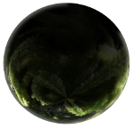

Plugin: Colorado
================

Journey through space with the history of a mountainous human
population.

Content
-------

1. [Planets](#planets)
3. [Missions](#missions)
4. [Screenshots](#screenshots)

Planets
-------

This plugin adds the RockyMountains system to our map.

* [Coloradia](#coloradia)

### Coloradia

Coloradia is a dry, rugged planet named after a historical mining
district from the original Earth colony. They say the mountains
and volcanoes offer a powerful reminder of the forces of nature
which humans initially had to overcome. Craft beer and integrated
circuitboards remain common exports from this vital community.

Missions
--------

* [What happened in Leadville?](#what-happened-in-leadville?)
* [Snoop on the Rocks](#snoop-on-the-rocks)
* [What happened in Leadville](#what-happened-in-leadville)

### What happened in Leadville?

Something crazy went down in the ultra-high altitude City of
Leadville. Go investigate.

### Snoop on the Rocks

A spurious young fellow is looking to get 4 people in a rocket-boost
over to famous Red Rocks Amphitheater to checkout Snoop Dogg live.

### Getting to John Denver

An eager woman wants to be taken to visit the esoteric John Denver
near the Spaceport region.

Screenshots
-----------

