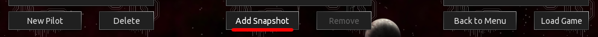
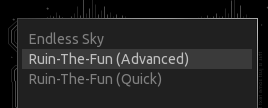
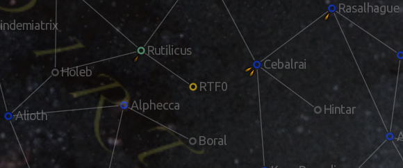
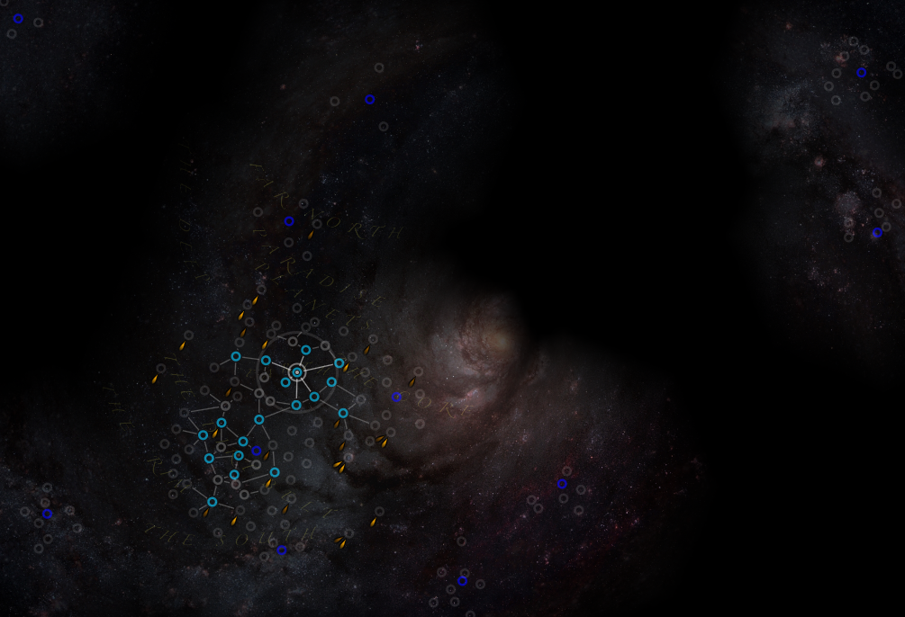
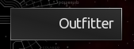
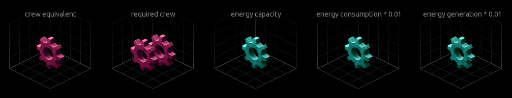

Ruin The Fun (es-ruin-the-fun)
===

Cheat plugin for [endless-sky](https://github.com/endless-sky/endless-sky), to ruin your fun, or to assist you in making or testing another plugin.

Access all ships and outfits, change your captain's name, choose the color swizzle of your ships, edit your relation with other governments, set your combat rank, hire a powerful escort, gift yourself pre-outfitted ships, give yourself money, and much more.


## Downloads

- [📦 Ruin-The-Fun: Sources](https://github.com/Pshy0/es-ruin-the-fun/) [(direct download)](https://github.com/Pshy0/es-ruin-the-fun/archive/refs/heads/main.zip):
  This is the latest commit to the plugin. It may or may not be stable, and it may also not work at all or break your save.
- [🎁 Ruin-The-Fun: Tested Release](https://github.com/Pshy0/es-ruin-the-fun/releases/tag/latest) [(direct download)](https://github.com/Pshy0/es-ruin-the-fun/releases/latest/download/-es-ruin-the-fun.zip):
  This is a tested and recommended version. But perhaps not the latest.
  Has better plugin support than other releases.
- [📦 Ruin-The-Fun: (Automatic Updates)](https://github.com/Pshy0/es-ruin-the-fun/releases/):
  This version is automatically generated on every new game version (either pre-release or release).
  It should feature the latest game content.
  However, if the data file syntax was changed by the new version, this might cause warnings or errors.
- [📦 Ruin-The-Fun: (Endless Sky continuous)](https://github.com/Pshy0/es-ruin-the-fun/releases/tag/es-continuous) [(direct download)](https://github.com/Pshy0/es-ruin-the-fun/releases/download/es-continuous/-es-ruin-the-fun-for-es-continuous.zip):
  This version is periodically generated to match continuous builds of Endless Sky. This is also the latest untested RTF version.
  If you do not use continuous Endless Sky builds, do not use this version, as it will contain things that are not yet in you game (that will be a problem).


## Install

Install this plugin by dropping it into the game's `plugins` folder.
If the plugin is in a `.zip` / archive file, extract it.

The game's `plugins` folder should be located at one of those locations:
- On Windows:
  - `plugins\ (in the same folder as the Endless Sky executable)`
  - or `C:\Users\yourusername\AppData\Roaming\endless-sky\plugins\`
- On Linux:
  - `/usr/share/games/endless-sky/plugins/`
  - or `~/.local/share/endless-sky/plugins/`
- On Mac:
  - `Contents/Resources/plugins/ (within the application bundle)`
  - or `~/Library/Application Support/endless-sky/plugins`

If the `plugins` folder does not exist, you can create it.

If you did it right, there should be a file `plugins/-es-ruin-the-fun/about.txt` or `plugins/-Ruin The Fun/about.txt`.

> This plugin should not conflict with any other, because it uses separate systems and prefixes objects it defines.


## Startup

⚠️ **Be advised against using this plugin with your favorite pilot's save**, since it will make your hours of labor nonsensical.
If you want to use this plugin for an existing save anyway, then **MAKE A BACKUP OF YOUR PILOT** (for instance with the `Add snapshot` button).



If your intent is rather to use this plugin with a new pilot, you may use one of the starts provided by this plugin to do so:


You will spawn in an RTF system, from which cheat features are available.

Cheat features are available from, and only from, the RTF systems. One of them has an hyperlink to `Rutilicus` (the default start system), so that you can reach it with an Hyperdrive:



There is other RTF systems everywhere on the map, so you do not have to cross it whole.




## Spaceport


Click the `Spaceport` button to access a number of quick actions.
More actions are available from the `Job Board`.


## Job Board


The `Job Board` contains most of this plugin's features.

The following jobs can be used after every landing on an RTF planet:
- `[basic] All Useful Things`: Get money, reveal the map, and earn combat rank 14.
- `[basic] Color Swizzle`: Change the color of your ships.
- `[basic] Combat Rank`: Set your combat rank. Optionally spawn a target in space, to get xp from.
- `[basic] Conditions`: Set your karma and other conditions.
- `[basic] Events`: Let you edit a few vanilla conditions.
- `[basic] Free Money`: Obtain 1B credits.
- `[basic] Government Reputations`: Change your reputation with other governments.
- `[basic] Pilot Name`: Change your captain's name.
- `[basic] Reveal Map`: Reveal the whole system map (upon take of).
- `[basic] Reveal Planet Infos`: Reveal all vanilla planets information (upon take of, does not reveal systems).
- `[escort] * Barges` (3 variants): Get escorted by dreadful Star Barges.
- `[escort] Escort Fleets`: Select fleets to spawn as NPC escorts.
- `[escort] Escort Ships`: Select ships to spawn as NPC escorts.
- `[escort] Tek Far 109`: Get escorted by a customized drone transporter.
- `[fight] Combat Drones`: Summon an amount of hostile Combat Drones.
- `[fight] Fight Fleet`: Pick hostile fleets to spawn.
- `[fight] Fight Ships`: Pick hostile ships to spawn.
- `[fight] Kestrels`: Summon a combination of hostile Kestrels.
- `[fight] Tek Far 109`: Summon an hostile customized drone transporter.
- `[special] RTF Advanced Start`: Replays the advanced start conversation.

The following jobs are toggles, their effect is reverted when you abort them:
- `[toggle fleet] Heliarchs vs Quargs`: Adds Heliarch and Quarg fleets to RTF0.
- `[toggle fleet] Meretis vs Sestors`: Adds Mereti and Sestor fleets to RTF0.
- `[toggle fleet] Scin vs Vis`: Adds Scin and Vi fleets to RTF0.
- `[toggle] Automatic Galaxy Map`: Automatically reveal all connected systems upon entering one.
- `[toggle] Hide RTF Systems`: Hide the RTF systems, so that they do not interfere.
- `[toggle] Super Reach`: While in an RTF system, you can jump to any system on the map, even without a God Drive. By default, RTF systems have a lower jump range, to lower their impact on surrounding content.
- `[toggle] Variants`: Enable ship variants in the RTF shipyards.


## Shipyard


From the RFT shipyards, all ships in the game are available to you.


## Outfitter



From the RFT outfitters, all outfits in the game are available to you.

RTF also adds a few outfits, all listed under the `RTF God Outfits` category:
- `God Drive`: Jump drive, with no range limit, that does not consume fuel.
- `God Mode`: Makes you immortal.
- `God Turret`: Turret that one-shot most ships.
- `100000 Outfit Space`: Gives you more than enough outfit space.
- `100000 Cargo Space`: Gives you so much cargo space that this will trigger pirate raids.

You can also find outfits that only change a single stat in the `Individual Stats` category. They look like this:



## Updating Content

You can **update the plugin's vanilla content** by running the following command inside the plugin's directory:
> make update

You may have to set the path to the Endless Sky `data` folder as instructed.

You can **include content from other plugins** by running the following command inside the plugin's directory:
> make plugin-update

This will only work if all plugins, including RTF, are in the same `plugins` folder.


## Assets (placeholders)

You can use those assets as placeholders:
 - [Outfits](./images/outfit/rtf/)
 - [Sounds](./sounds/)

Info about individual assets are available from [./copyright](./copyright).


## Moving an RTF system

You can use a mission and an event like this to move a RTF system to your plugin's galaxy:
```
mission "MYPLUGIN Move RTF10"
    landing
    on offer
        event "MYPLUGIN Move RTF10"
        fail
event "MYPLUGIN Move RTF10"
	system "RTF10"
		pos -2700 -1500
```


## Bugs / Suggestions

You are welcome to submit bug reports and suggestions using [GitHub issues](https://github.com/Pshy0/es-ruin-the-fun/issues).

You can also contact me on discord (`Pshy#7998`).


## License

 > This Source Code Form is subject to the terms of the Mozilla Public License, v. 2.0. If a copy of the MPL was not distributed with this file, You can obtain one at https://mozilla.org/MPL/2.0/.
 > This Source Code Form is “Incompatible With Secondary Licenses”, as defined by the Mozilla Public License, v. 2.0.


## References

### Non-Cheat Alternatives
If you are interested by some features of this plug-in but do not want to be cheating, you may check the following ones:

- [A Coalition at War](https://github.com/mathwhiz1212/ES-conscience-plugin): **Get help from the Quarg** so you don't have to nuke Zenith
- [Advanced Starts](https://github.com/kestrel1110/ES-Advanced-Starts/): **Adds more starts.**
- [Lampyrid Start](https://github.com/Zitchas/ES_Lampyrid_Start): **Faster and easier start**, made slightly more challenging by pirates.
- [Prism Plugin](https://github.com/Startingfresher/Prism-Plug-in): **Unlock ship color swizzles** by achieving progress in the game
