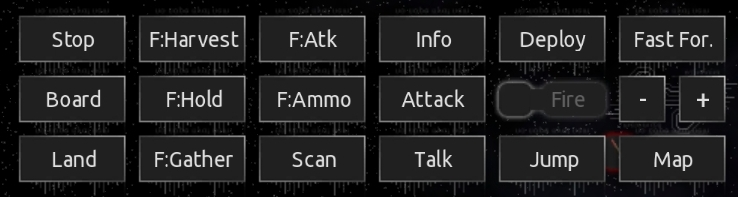

### additional command buttons  
(interface changed)(made for 0.10.1)  
 
Made for the mobile version and changes the interface by adding 10 buttons.  
It adds the following buttons:    
full stop / board ship / land on planet / fleet: harvest flotsam / fleet: hold position / fleet: gather around me / fleet: attack my target / fleet: toggle ammo usage / view player info / fast forward  
adjusts the message box to not overlap  
(inspired by theweirednut)  

</img>

Allthough most of these commands are now implemented in other parts to the original mobile user interface, I personally prefer these buttons on the lower right corner. Additional there are some functions in this plugin that the original mobile ui can't do at the moment... 
- board button cycles through the possibilities  
- fleet commands can be used for single ships when selected  
- fleet: harvest flotsam isn't implemented yet  
 
 
2023-7-26 
added 3 more buttons to a total of 10 
added decriptions inside script to exchange buttons functions 
 
2023-7-6 
changed 'fire afterburner' to new 'fleet: harvest flotsam', because afterburner can easily toggled by double tapping 