---

## Cheats

<p>35 plugins in this category.<p>

<details>

 

---

### -Omnis


[-Omnis.zip](https://github.com/Hecter94/EndlessSky-PluginArchive/releases/download/Latest/-Omnis.zip) | 7.74 mb | 2023-10-27 | [view files](https://github.com/Hecter94/EndlessSky-PluginArchive/tree/main/Working/-Omnis/) <br>
Author: Darcy Manoel | Category: Cheats <br>
[https://github.com/Adde-Endless-Sky-Mods/-Omnis](https://github.com/Adde-Endless-Sky-Mods/-Omnis) (last commit 2023-10-27) <br>

>The most extensive all-content plugin to date. It includes many opportunities to test balance or ship builds against AI driven ships or fleets, all vanilla content and the content of many plugins available to use to put together different ship builds. Many more tools are included into Omnis too!
>

<details>
<summary>:blue_book: Plugin readme</summary>
<blockquote>### Welcome to Omnis!
Omnis has risen to be the #1 all-content plugin in the community, though competition is still encouraged as only from different perspectives can the best iteration of this niche be reached. Omnis was released after [World Forge](https://github.com/EndlessSkyCommunity/world-forge) but before [Ciu Kreo](https://github.com/RestingImmortal/Ciu-Kreo), and good faith was practiced by all competing authors.

In order of release, known competitors have been:
- [All Content Plugin](https://github.com/endless-sky/all-content-plugin)
- [World Forge](https://github.com/EndlessSkyCommunity/world-forge)
- [Ciu Kreo](https://github.com/RestingImmortal/Ciu-Kreo)
- [Ruin the Fun](https://github.com/Pshy0/es-ruin-the-fun)

### What to expect
There is no need to worry about breaking existing saves when installing, you will be presented with a warning that lets you choose what level of involvement you want that save to have with Omnis. To avoid any interaction, there's an option to abort which will kill the player and disallow saving the interaction.

So how do you use this plugin? Well there are two very simple methods of [accessing Omnis](https://github.com/Adde-Endless-Sky-Mods/-Omnis/wiki/Access), there is a wormhole in Rutilicus to travel there, and there is a custom start that can be chosen when making a new pilot.

> [!WARNING]
> The Omnis custom start will begin your pilot with an impossibly high credit value and brand your save with the Omnis start.

</blockquote>
</details>

Status: N/A <br>
Daily update check: </img><br>


---

### All Content Plugin
</img><br>


[All.Content.Plugin.zip](https://github.com/Hecter94/EndlessSky-PluginArchive/releases/download/Latest/All.Content.Plugin.zip) | 148.81 kb | 2023-10-10 | [view files](https://github.com/Hecter94/EndlessSky-PluginArchive/tree/main/Working/All%20Content%20Plugin/) <br>
Author: Michael Zahniser | Category: Cheats <br>
[https://github.com/endless-sky/all-content-plugin](https://github.com/endless-sky/all-content-plugin) (last commit 2023-10-10) <br>

>This mod starts you on Greenrock with a trillion (10^12) credits and access to almost every ship and outfit in the game. It is intended for testing purposes, but of course, as its description says, "it can also be used by people who want to ruin the game for themselves by getting a massive fleet without needing to work for it." 
>

<details>
<summary>:blue_book: Plugin readme</summary>
<blockquote># All-Content Plugin
This plugin was made to allow content creators to have access to all outfits in a single place, for the purpose of designing and testing outfit loadouts for new ships. Of course, it can also be used by people who want to ruin the game for themselves by getting a massive fleet without needing to work for it.

# Contributing
This plugin is meant to mirror the most recent official release of [Endless Sky](https://github.com/endless-sky/endless-sky), rather than its most recent "continuous build," and as such should be usuable to those who use Steam or PPAs as the source of their game version. As such, PRs are welcome following new additions during an ES release cycle, but depending on the scope of the contribution, may not be merged promptly.
</blockquote>
</details>

Status: N/A <br>
Daily update check: </img><br>


---

### Arena
</img><br>


[Arena.zip](https://github.com/Hecter94/EndlessSky-PluginArchive/releases/download/Latest/Arena.zip) | 17.97 kb | 2023-07-27 | [view files](https://github.com/Hecter94/EndlessSky-PluginArchive/tree/main/Working/Arena/) <br>
Author: 10010101001 | Category: Cheats <br>
[https://github.com/10010101001/Arena](https://github.com/10010101001/Arena) (last commit 2021-05-18) <br>

>This plugin adds two arenas with diffrent combat styles for the player to enjoy in-game and for testing purposes (near Sagittarius A).
>

<details>
<summary>:blue_book: Plugin readme</summary>
<blockquote>1. Visit Arena (Next to Sagittarius A*)
2. Paste your ship builds at specified location in data/job.txt
3. Take off and land
4. Accept job on the job board

</blockquote>
</details>

Status: N/A <br>
Daily update check: </img><br>


---

### automata.destruction.0percent
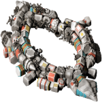</img><br>


[automata.destruction.0percent.zip](https://github.com/Hecter94/EndlessSky-PluginArchive/releases/download/Latest/automata.destruction.0percent.zip) | 43.6 kb | 2023-10-17 | [view files](https://github.com/Hecter94/EndlessSky-PluginArchive/tree/main/Working/automata.destruction.0percent/) <br>
Author: zuckung | Category: Cheats <br>
[https://github.com/zuckung/endless-sky-plugins](https://github.com/zuckung/endless-sky-plugins) (last commit 2023-10-17) <br>

>Modifies the self destruction chance of Sestor and Mereti ships to a value of 0.0 (0%). See the readme for details.

<details>
<summary>:blue_book: Plugin readme</summary>
<blockquote>### automata.destruction.0percent
<br>
<br>
Modifies the self destruction chance of Sestor and Mereti ships to a value of 0.0 (0%).<br>
<br>
Sestor 349/109/78/71/53/40/27 and Mereti 512/256/128/64/32/16/8 ships have a self destruction value of 0.0 (0%) now.<br>
You can easily change the values in automata.txt for each ship ('"self destruct" .0') to a value of your choice. I.e. 0.12 is 23%, 0.3 is 51%, 0.5 is 75%. Its calculated twice, first the chance for self destruction on boarding(i.e. 0.3) is 30%, then of the remaining 70% again 30% chance for self destruction on capturing. That makes 30% + 21% = 51% overall chance for self destruction on a capturing try.<br>
<br>
<br>
Changelog:<br>
<br>
2023-10-17<br>
added plugin.txt<br>
<br>
2023-09-07<br>
changed icon<br>
changed about.txt<br>
changed readme<br>


</blockquote>
</details>

Status: tested with 0.10.2 <br>
Daily update check: </img><br>


---

### Bit and Bobs


[Bit.and.Bobs.zip](https://github.com/Hecter94/EndlessSky-PluginArchive/releases/download/Latest/Bit.and.Bobs.zip) | 1.14 mb | 2022-10-06 | [view files](https://github.com/Hecter94/EndlessSky-PluginArchive/tree/main/Working/Bit%20and%20Bobs/) <br>
Author: N/A | Category: Cheats <br>
N/A[]()  <br>

>N/A
>


Status: N/A <br>
Daily update check: </img><br>


---

### captureable.person.ships
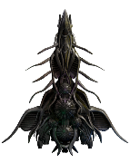</img><br>


[captureable.person.ships.zip](https://github.com/Hecter94/EndlessSky-PluginArchive/releases/download/Latest/captureable.person.ships.zip) | 170.71 kb | 2023-10-17 | [view files](https://github.com/Hecter94/EndlessSky-PluginArchive/tree/main/Working/captureable.person.ships/) <br>
Author: zuckung | Category: Cheats <br>
[https://github.com/zuckung/endless-sky-plugins](https://github.com/zuckung/endless-sky-plugins) (last commit 2023-10-17) <br>

>Makes person ships capturable. See the readme for details.
>

<details>
<summary>:blue_book: Plugin readme</summary>
<blockquote>### capturable.person.ships
<br>
<br>
Makes person ships captureable.<br> 
<br>
<br>
Well, technically this plugin disables the person ships, and creates new ones(with a space more in its names, due to limitations of changing parts of originals) which are captureable. Also adds all of them to the author government, adjusts some personalities and sets all frequencies to 1000.<br>
So attacking one of them makes all your enemies, they all try to disable instead of destroying, and they all have the same spawn chance which is in average within 10 minutes.<br>
<br>
Tested this plugin with 10x KIV349 and 10x Model512, all equipped with Mereti beam weapons, was probably an overkill on most. Except for "Zitchas" which needed less dmg weapons and max flamethrowers to prevent its cloaking. Also boarding "Zitchas"(1000 crew) needed an Echo-Galleon, and i tried it with hand2hand outfits plugin. Maybe it works with nerve gas too. Another problem is "Tranquility" which has no weapons and therefore avoids fight. Tested different personality settings and best choice was to let it stay in system after spawn(yellow dot on radar).<br>
<br>

<ul>
<li>"Michael Zahniser" (found everywhere | Kestrel + Finch)</li>
<li>"Cap'n Pester" (found everywhere | Quarg Wardragon)</li>
<li>"Marauding Max" (found everywhere | Marauder Fury)</li>
<li>"Captain Nate" (found everywhere | Vanguard)</li>
<li>"Tranquility" (found everywhere | Lampyrid)</li>
<li>"Power of the People" (found everywhere | Modified Osprey)</li>
<li>"Local God" (found everywhere | Ursa Polaris)</li>
<li>"Subsidurial" (found in uninhabited | Subsidurial)</li>
<li>"Prototype B3-CC4" (found in Ember Waste | Shooting Star)</li>
<li>"Rais Iris XVIII" (found everywhere | Marauder Bactrian)</li>
<li>"Zitchas" (found in Ember Waste | Heron + Peregrine + 4x Petrel + 32x Tern)</li>
<li>"Brick" (found everywhere | 3x Modified Boxwing)</li>
<li>"Gefullte Taubenbrust" (found everywhere | Modified Battleship)</li>
<li>"MasterOfGrey" (found in Hai space | Modified Ladybug)</li>
</ul>
<br>
<br>
Changelog:<br>
<br>
2023-10-17<br>
added plugin.txt<br>
<br>
2023-09-15<br>
changed gamerules back, because it caused mass spawning<br>
changed some personalities<br>
<br>
2023-09-09<br>
changed all frequencies to 1000<br>
changed gamerules to prevent no spawning chance<br>
<br>
2023-09-08<br>
initial release<br>

</blockquote>
</details>

Status: complete on 0.10.2 <br>
Daily update check: </img><br>


---

### Casual Mod


[Casual.Mod.zip](https://github.com/Hecter94/EndlessSky-PluginArchive/releases/download/Latest/Casual.Mod.zip) | 403.08 kb | 2023-07-27 | [view files](https://github.com/Hecter94/EndlessSky-PluginArchive/tree/main/Working/Casual%20Mod/) <br>
Author: PPhoto  | Category: Cheats <br>
N/A[]()  <br>

>Makes gameplay more casual
>Ships are heavier making navigation and combat slower
>Higher range for some cannons to compensate ship speed
>Less, slower and weaker asteroids to increase clarity, FPS and easier mining
>

<details>
<summary>:blue_book: Plugin readme</summary>
<blockquote># EndlessSky Casual Mod

## Content
Makes gameplay for Endless-Sky more casual
- Ships are heavier making navigation and combat slower
- Higher range for some cannons to compensate ship speed
- Less, slower and weaker asteroids to increase clarity, FPS and easier mining
- Bigger sprites for bigger ships

## WIP:
- Modify asteroid count and speed in more star systems
- Add more bigger ships, currently only the falcon has twice the size with sprite taken from high-dpi mod

## Limits:
- No game balancing has been done after the ship and weapon modifications

</blockquote>
</details>

Status: N/A <br>
Daily update check: </img><br>


---

### Checkmatemate


[Checkmatemate.zip](https://github.com/Hecter94/EndlessSky-PluginArchive/releases/download/Latest/Checkmatemate.zip) | 0.58 kb | 2022-10-06 | [view files](https://github.com/Hecter94/EndlessSky-PluginArchive/tree/main/Working/Checkmatemate/) <br>
Author: Zoura | Category: Cheats <br>
N/A[]()  <br>

>Unlocks checkmate stuff without having to do FWs
>


Status: Playable on 0.9.15 Continuous. <br>
Daily update check: </img><br>


---

### Ciu Kreo
</img><br>


[Ciu.Kreo.zip](https://github.com/Hecter94/EndlessSky-PluginArchive/releases/download/Latest/Ciu.Kreo.zip) | 458.64 kb | 2023-07-27 | [view files](https://github.com/Hecter94/EndlessSky-PluginArchive/tree/main/Working/Ciu%20Kreo/) <br>
Author: RestingImmortal | Category: Cheats <br>
[https://github.com/RestingImmortal/Ciu-Kreo](https://github.com/RestingImmortal/Ciu-Kreo) (last commit 2021-07-06) <br>

>An all-content plugin for Endless-Sky. Made to assist with content creation, or for general use.
>

<details>
<summary>:blue_book: Plugin readme</summary>
<blockquote># Ciu-Kreo

An all-content plugin for [Endless Sky](https://endless-sky.github.io/).
To be used to assist in content creation, or just for general use.

## Install
Unzip to your plugins folder found here:

* Linux: ~/.local/share/endless-sky/
* Windows: %AppData%\endless-sky\
* Mac OS X: ~/Library/ApplicationSupport/endless-sky/

</blockquote>
</details>

Status: Playable on 0.9.14 <br>
Daily update check: </img><br>


---

### Cloaking Device Unlocked


[Cloaking.Device.Unlocked.zip](https://github.com/Hecter94/EndlessSky-PluginArchive/releases/download/Latest/Cloaking.Device.Unlocked.zip) | 2.6 kb | 2022-10-06 | [view files](https://github.com/Hecter94/EndlessSky-PluginArchive/tree/main/Working/Cloaking%20Device%20Unlocked/) <br>
Author: FriendlyNeighbour | Category: Cheats <br>
N/A[]()  <br>

>N/A
>


Status: N/A <br>
Daily update check: </img><br>


---

### Custom Outfitting (Chop Shop)


[Custom.Outfitting.Chop.Shop.zip](https://github.com/Hecter94/EndlessSky-PluginArchive/releases/download/Latest/Custom.Outfitting.Chop.Shop.zip) | 4.02 kb | 2022-10-06 | [view files](https://github.com/Hecter94/EndlessSky-PluginArchive/tree/main/Working/Custom%20Outfitting%20(Chop%20Shop)/) <br>
Author: Jareth (Dr. Anthrax) | Category: Cheats <br>
N/A[]()  <br>

>Lets the player swap excess weapon and engine space for outfit space also alows the spending of outfit space to have more weapon and engine space.
>


Status: N/A <br>
Daily update check: </img><br>


---

### DevStarts


[DevStarts.zip](https://github.com/Hecter94/EndlessSky-PluginArchive/releases/download/Latest/DevStarts.zip) | 1.67 kb | 2023-07-27 | [view files](https://github.com/Hecter94/EndlessSky-PluginArchive/tree/main/Working/DevStarts/) <br>
Author: williaji | Category: Cheats <br>
[https://github.com/williaji/DevStarts](https://github.com/williaji/DevStarts) (last commit 2023-02-05) <br>

>several developer start options, with credits, ships or jump drives

<details>
<summary>:blue_book: Plugin readme</summary>
<blockquote># DevStarts
</blockquote>
</details>

Status: N/A <br>
Daily update check: </img><br>


---

### Dragonflame Fabrication


[Dragonflame.Fabrication.zip](https://github.com/Hecter94/EndlessSky-PluginArchive/releases/download/Latest/Dragonflame.Fabrication.zip) | 1.58 kb | 2022-10-06 | [view files](https://github.com/Hecter94/EndlessSky-PluginArchive/tree/main/Working/Dragonflame%20Fabrication/) <br>
Author: Galaucus | Category: Cheats <br>
[https://github.com/Galaucus/Dragonflame-Fabrication](https://github.com/Galaucus/Dragonflame-Fabrication) (last commit 2020-09-07) <br>

>A post-Emerald Sword mission chain that allows Kraz to manufacture a replacement Dragonflame Cannon.
>


Status: N/A <br>
Daily update check: </img><br>


---

### Easier Korath Automatons
</img><br>


[Easier.Korath.Automatons.zip](https://github.com/Hecter94/EndlessSky-PluginArchive/releases/download/Latest/Easier.Korath.Automatons.zip) | 73.38 kb | 2023-07-27 | [view files](https://github.com/Hecter94/EndlessSky-PluginArchive/tree/main/Working/Easier%20Korath%20Automatons/) <br>
Author: Kestrel1110 | Category: Cheats <br>
[https://github.com/kestrel1110/Easier-Korath-Automatons](https://github.com/kestrel1110/Easier-Korath-Automatons) (last commit 2020-05-08) <br>

>Makes fighting the Kor Mereti and Sestor a little bit easier.
>Also give bunks to the automatons so they will be viable flagships.
>

<details>
<summary>:blue_book: Plugin readme</summary>
<blockquote># Easier-Korath-Automatons
Makes fighting the Kor Mereti and Sestor a little bit easier.
Also give bunks to the automatons so they will be viable flagships.
The lore is that sometimes the Korath would travel in their automatons, so they wanted to be able to requisition any passing ship for use.

</blockquote>
</details>

Status: Should work <br>
Daily update check: </img><br>


---

### Generic Plugin


[Generic.Plugin.zip](https://github.com/Hecter94/EndlessSky-PluginArchive/releases/download/Latest/Generic.Plugin.zip) | 7.27 mb | 2022-10-06 | [view files](https://github.com/Hecter94/EndlessSky-PluginArchive/tree/main/Working/Generic%20Plugin/) <br>
Author: N/A | Category: Cheats <br>
N/A[]()  <br>

>A generic plugin for testing purposes.
>


Status: N/A <br>
Daily update check: </img><br>


---

### Gray Box


[Gray.Box.zip](https://github.com/Hecter94/EndlessSky-PluginArchive/releases/download/Latest/Gray.Box.zip) | 18.01 kb | 2022-10-06 | [view files](https://github.com/Hecter94/EndlessSky-PluginArchive/tree/main/Working/Gray%20Box/) <br>
Author: granto | Category: Cheats <br>
N/A[]()  <br>

>alternate start with more money and a medium warship
>


Status: N/A <br>
Daily update check: </img><br>


---

### Heliarch Shopping & Korath Konvenience


[Heliarch.Shopping.Korath.Konvenience.zip](https://github.com/Hecter94/EndlessSky-PluginArchive/releases/download/Latest/Heliarch.Shopping.Korath.Konvenience.zip) | 3.24 kb | 2022-10-06 | [view files](https://github.com/Hecter94/EndlessSky-PluginArchive/tree/main/Working/Heliarch%20Shopping%20&%20Korath%20Konvenience/) <br>
Author: Waladil | Category: Cheats <br>
N/A[]()  <br>

>KorExile outfits to KorEfret outfitter and mission to get Heliarch License and buy their outfits.
>


Status: Playable on 0.9.14, 0.9.15 Continuous. <br>
Daily update check: </img><br>


---

### Hilo2000 Arena
</img><br>


[Hilo2000.Arena.zip](https://github.com/Hecter94/EndlessSky-PluginArchive/releases/download/Latest/Hilo2000.Arena.zip) | 17.05 kb | 2023-07-27 | [view files](https://github.com/Hecter94/EndlessSky-PluginArchive/tree/main/Working/Hilo2000%20Arena/) <br>
Author: Mielo Symeonidis | Category: Cheats <br>
[https://github.com/Hilo2000/arena/blob/main/](https://github.com/Hilo2000/arena/blob/main/) (last commit 2022-07-17) <br>

>This plugin adds an arena with multiple hard and easy challenges.
>


Status: N/A <br>
Daily update check: </img><br>


---

### Improved Ship Integrity


[Improved.Ship.Integrity.zip](https://github.com/Hecter94/EndlessSky-PluginArchive/releases/download/Latest/Improved.Ship.Integrity.zip) | 44.14 kb | 2023-07-27 | [view files](https://github.com/Hecter94/EndlessSky-PluginArchive/tree/main/Working/Improved%20Ship%20Integrity/) <br>
Author: Xolarix | Category: Cheats <br>
[https://github.com/Xolarix/Improved-Ship-Integrity](https://github.com/Xolarix/Improved-Ship-Integrity) (last commit 2019-01-16) <br>

>This plugin puts the hull points of all ships in the game at 250% their original values.
>


Status: N/A <br>
Daily update check: </img><br>


---

### Kestrel Rework


[Kestrel.Rework.zip](https://github.com/Hecter94/EndlessSky-PluginArchive/releases/download/Latest/Kestrel.Rework.zip) | 5.53 kb | 2023-07-27 | [view files](https://github.com/Hecter94/EndlessSky-PluginArchive/tree/main/Working/Kestrel%20Rework/) <br>
Author: MinneIceCube | Category: Cheats <br>
[https://github.com/MinneIceCube/KestrelRework](https://github.com/MinneIceCube/KestrelRework) (last commit 2022-04-15) <br>

>Make Kestrel a much better ship, and increased requirements.
>

<details>
<summary>:blue_book: Plugin readme</summary>
<blockquote>This is a small rework of the Kestrel ship. The intent is to put it on par with several higher tiered alien outfits, most notablely Wanderer (2) outfits, as opposed to standard Human (1-1.5) Outfits. 
This does not make much sense according to the lore, but I personally prefer the asthetic of the Kestrel compared to many of the Wanderer ships. As such, the changes are as follows:

-The requirements for the Kestrel sub-quest have been changed:
	-The combat rating was increased from 8,000 (Combat rank 9: "Force to be reckoned with") --> 22,000 (Combat rank "Fearsome Scrapper). Intended to limit obtaining the newly buffed ship until the player is on a similar power level.
	-Increased the standard cost of the ship from 14700000 --> 67500000, as another change intended to limit how early a player could obtain the ship.
	-Buffed "Unknown ship type" by roughly half of the changes to the base Kestrel (I.E, instead of 49,700 shields, the test ship will have about 23,000), increasing the difficulty of the inital test fight while not requiring too much power to win.

-Base model "Kestrel" (Unlisted stats were not changed)
	-Shields 19,400 --> 49,700
	-Hull 7,200 --> 30,400
	-Fuel Capacity 500 --> 700
	-Outfit space 810 --> 870
	-Weapon capacity 390 --> 410
	-Engine Capacity 210 --> 230
	-Bunks 128 --> 150

-Engine Kestrel:
	-Drag -1.0 --> -2.0
	-Fuel Capacity 100 --> 300
	
-Shield Kestrel:
	-Shields 3,000 --> 28,000
	-Hull 1,500 --> 4,900

-Weapon Kestrel:
	-Weapon Capacity 40 --> 150
  
  I made these edits mostly for personal useage, and as such these are the numbers I found acceptable for my late game ship. If you feel otherwise, feel free to make edits as you please.

</blockquote>
</details>

Status: N/A <br>
Daily update check: </img><br>


---

### No Bactrian


[No.Bactrian.zip](https://github.com/Hecter94/EndlessSky-PluginArchive/releases/download/Latest/No.Bactrian.zip) | 2.91 kb | 2022-10-06 | [view files](https://github.com/Hecter94/EndlessSky-PluginArchive/tree/main/Working/No%20Bactrian/) <br>
Author: Disiuze | Category: Cheats <br>
[https://github.com/Disiuze/misc-projects](https://github.com/Disiuze/misc-projects) (last commit 2017-02-22) <br>

>This mod removes Bactrians and Mules from the shipyard and fleet definitions.
>NOTE: Overrides fleets and Lionheart shipyards, might cause problem with other plugin.
>
>


Status: Should be playable on 0.9.14, 0.9.15. <br>
Daily update check: </img><br>


---

### No Drag Mod


[No.Drag.Mod.zip](https://github.com/Hecter94/EndlessSky-PluginArchive/releases/download/Latest/No.Drag.Mod.zip) | 1.51 kb | 2022-10-06 | [view files](https://github.com/Hecter94/EndlessSky-PluginArchive/tree/main/Working/No%20Drag%20Mod/) <br>
Author: Jafdy | Category: Cheats <br>
N/A[]()  <br>

>sets the drag of all ships and missiles to 0.
>


Status: N/A <br>
Daily update check: </img><br>


---

### Nuclear War


[Nuclear.War.zip](https://github.com/Hecter94/EndlessSky-PluginArchive/releases/download/Latest/Nuclear.War.zip) | 0.72 kb | 2022-10-06 | [view files](https://github.com/Hecter94/EndlessSky-PluginArchive/tree/main/Working/Nuclear%20War/) <br>
Author: House Kitty | Category: Cheats <br>
N/A[]()  <br>

>Merchant and Pirate Hawks equiped with Nukes locked in an endless and massive battle in the Holeb system.
>


Status: Should be playable on 0.9.14, 0.9.15 Continuous. <br>
Daily update check: </img><br>


---

### Overkill


[Overkill.zip](https://github.com/Hecter94/EndlessSky-PluginArchive/releases/download/Latest/Overkill.zip) | 3.34 mb | 2022-10-06 | [view files](https://github.com/Hecter94/EndlessSky-PluginArchive/tree/main/Working/Overkill/) <br>
Author: Carter-M-II | Category: Cheats <br>
[https://github.com/Carter-M-II/ES-Overkill](https://github.com/Carter-M-II/ES-Overkill) (last commit 2022-02-03) <br>

>This mod is full of overpowered/bloated things like Ships and Outfits. Only used to beat the game but may be fun to pit on other mods with overpowered ships/outfits.
>


Status: N/A <br>
Daily update check: </img><br>


---

### Reverse Engineering


[Reverse.Engineering.zip](https://github.com/Hecter94/EndlessSky-PluginArchive/releases/download/Latest/Reverse.Engineering.zip) | 1.48 mb | 2022-10-06 | [view files](https://github.com/Hecter94/EndlessSky-PluginArchive/tree/main/Working/Reverse%20Engineering/) <br>
Author: N/A | Category: Cheats <br>
N/A[]()  <br>

>Small to medium sized mod focused around reverse engineering alien technology and establishing a business empire. 
>


Status: N/A <br>
Daily update check: </img><br>


---

### Ruin the Fun
</img><br>


[Ruin.the.Fun.zip](https://github.com/Hecter94/EndlessSky-PluginArchive/releases/download/Latest/Ruin.the.Fun.zip) | 3.65 mb | 2023-10-11 | [view files](https://github.com/Hecter94/EndlessSky-PluginArchive/tree/main/Working/Ruin%20the%20Fun/) <br>
Author: Pshy0 | Category: Cheats <br>
[https://github.com/Pshy0/es-ruin-the-fun](https://github.com/Pshy0/es-ruin-the-fun) (last commit 2023-10-11) <br>

>A development / cheat plugin for Endless Sky. Access all ships and outfits, change your captain's name, choose the color swizzle of your ships, edit your relation with other governments, set your combat rank, hire a powerful escort, gift yourself pre-outfitted ships, give yourself money, and much more. 
>

<details>
<summary>:blue_book: Plugin readme</summary>
<blockquote>Ruin The Fun (es-ruin-the-fun)
===

Cheat plugin for [endless-sky](https://github.com/endless-sky/endless-sky), to ruin your fun, or to assist you in making or testing another plugin.

Access all ships and outfits, change your captain's name, choose the color swizzle of your ships, edit your relation with other governments, set your combat rank, hire a powerful escort, gift yourself pre-outfitted ships, give yourself money, and much more.


## Downloads

- [📦 Ruin-The-Fun: Sources](https://github.com/Pshy0/es-ruin-the-fun/) [(direct download)](https://github.com/Pshy0/es-ruin-the-fun/archive/refs/heads/main.zip):
  This is the latest commit to the plugin. It may or may not be stable, and it may also not work at all or break your save.
  Includes partial **built-in plugin support**.
- [🎁 Ruin-The-Fun: Tested Release](https://github.com/Pshy0/es-ruin-the-fun/releases/tag/latest) [(direct download)](https://github.com/Pshy0/es-ruin-the-fun/releases/latest/download/-es-ruin-the-fun.zip):
  This is a tested and recommended version. But perhaps not the latest.
  Includes partial **built-in plugin support**.
- [📦 Ruin-The-Fun: (Automatic Updates)](https://github.com/Pshy0/es-ruin-the-fun/releases/):
  This version is automatically generated on every new game version (either pre-release or release).
  It should feature the latest game content.
  However, if the data file syntax was changed by the new version, this might cause warnings or errors.
  No built-in plugin support.
- [📦 Ruin-The-Fun: (Endless Sky continuous)](https://github.com/Pshy0/es-ruin-the-fun/releases/tag/es-continuous) [(direct download)](https://github.com/Pshy0/es-ruin-the-fun/releases/download/es-continuous/-es-ruin-the-fun-for-es-continuous.zip):
  This version is periodically generated to match continuous builds of Endless Sky. This is also the latest untested RTF version.
  If you do not use continuous Endless Sky builds, do not use this version, as it will contain things that are not yet in you game (that will be a problem).
  No built-in plugin support.


## Install

Install this plugin by dropping it into the game's `plugins` folder.
If the plugin is in a `.zip` / archive file, extract it.

The game's `plugins` folder should be located at one of those locations:
- On Windows:
  - `plugins\ (in the same folder as the Endless Sky executable)`
  - or `C:\Users\yourusername\AppData\Roaming\endless-sky\plugins\`
- On Linux:
  - `/usr/share/games/endless-sky/plugins/`
  - or `~/.local/share/endless-sky/plugins/`
- On Mac:
  - `Contents/Resources/plugins/ (within the application bundle)`
  - or `~/Library/Application Support/endless-sky/plugins`

If the `plugins` folder does not exist, you can create it.

If you did it right, there should be a file `plugins/-es-ruin-the-fun/about.txt` or `plugins/-Ruin The Fun/about.txt`.

> This plugin should not conflict with any other, because it uses separate systems and prefixes objects it defines.


## Startup

⚠️ **Be advised against using this plugin with your favorite pilot's save**, since it will make your hours of labor nonsensical.
If you want to use this plugin for an existing save anyway, then **MAKE A BACKUP OF YOUR PILOT** (for instance with the `Add snapshot` button).


If your intent is rather to use this plugin with a new pilot, you may use one of the starts provided by this plugin to do so:


You will spawn in an RTF system, from which cheat features are available.

Cheat features are available from, and only from, the RTF systems. One of them has an hyperlink to `Rutilicus` (the default start system), so that you can reach it with an Hyperdrive:


There is other RTF systems everywhere on the map, so you do not have to cross it whole.


## Spaceport


Click the `Spaceport` button to access a number of quick actions.
More actions are available from the `Job Board`.


## Job Board


The `Job Board` contains most of this plugin's features.

The following jobs can be used after every landing on an RTF planet:
- `[basic] All Useful Things`: Get money, reveal the map, and earn combat rank 14.
- `[basic] Color Swizzle`: Change the color of your ships.
- `[basic] Combat Rank`: Set your combat rank. Optionally spawn a target in space, to get xp from.
- `[basic] Conditions`: Set your karma and other conditions.
- `[basic] Events`: Let you edit a few vanilla conditions.
- `[basic] Free Money`: Obtain 1B credits.
- `[basic] Government Reputations`: Change your reputation with other governments.
- `[basic] Pilot Name`: Change your captain's name.
- `[basic] Reveal Map`: Reveal the whole system map (upon take of).
- `[basic] Reveal Planet Infos`: Reveal all vanilla planets information (upon take of, does not reveal systems).
- `[escort] * Barges` (3 variants): Get escorted by dreadful Star Barges.
- `[escort] Escort Fleets`: Select fleets to spawn as NPC escorts.
- `[escort] Escort Ships`: Select ships to spawn as NPC escorts.
- `[escort] Tek Far 109`: Get escorted by a customized drone transporter.
- `[fight] Combat Drones`: Summon an amount of hostile Combat Drones.
- `[fight] Fight Fleet`: Pick hostile fleets to spawn.
- `[fight] Fight Ships`: Pick hostile ships to spawn.
- `[fight] Kestrels`: Summon a combination of hostile Kestrels.
- `[fight] Tek Far 109`: Summon an hostile customized drone transporter.
- `[special] RTF Advanced Start`: Replays the advanced start conversation.

The following jobs are toggles, their effect is reverted when you abort them:
- `[toggle fleet] Heliarchs vs Quargs`: Adds Heliarch and Quarg fleets to RTF0.
- `[toggle fleet] Meretis vs Sestors`: Adds Mereti and Sestor fleets to RTF0.
- `[toggle fleet] Scin vs Vis`: Adds Scin and Vi fleets to RTF0.
- `[toggle] Automatic Galaxy Map`: Automatically reveal all connected systems upon entering one.
- `[toggle] Hide RTF Systems`: Hide the RTF systems, so that they do not interfere.
- `[toggle] Super Reach`: While in an RTF system, you can jump to any system on the map, even without a God Drive. By default, RTF systems have a lower jump range, to lower their impact on surrounding content.
- `[toggle] Variants`: Enable ship variants in the RTF shipyards.


## Shipyard


From the RFT shipyards, all ships in the game are available to you.


## Outfitter


From the RFT outfitters, all outfits in the game are available to you.

RTF also adds a few outfits, all listed under the `Special` category:
- `God Drive`: Jump drive, with no range limit, that does not consume fuel.
- `God Mode`: Makes you immortal.
- `God Turret`: Turret that one-shot most ships.
- `100000 Outfit Space`: Gives you more than enough outfit space.
- `100000 Cargo Space`: Gives you so much cargo space that this will trigger pirate raids.
- (property name): Change individual stats of a ship. They look like this:


## Updating Content

You can **update the plugin's vanilla content** by running the following command inside the plugin's directory:
> make update

You may have to set the path to the Endless Sky `data` folder as instructed.

You can **include content from other plugins** by running the following command inside the plugin's directory:
> make plugin-update

This will only work if all plugins, including RTF, are in the same `plugins` folder.


## Assets (placeholders)

You can use those assets as placeholders:
 - [Outfits](./images/outfit/rtf/)
 - [Sounds](./sounds/)

Info about individual assets are available from [./copyright](./copyright).


## Moving an RTF system

You can use a mission and an event like this to move a RTF system to your plugin's galaxy:
```
mission "MYPLUGIN Move RTF10"
    landing
    on offer
        event "MYPLUGIN Move RTF10"
        fail
event "MYPLUGIN Move RTF10"
	system "RTF10"
		pos -2700 -1500
```


## Bugs / Suggestions

You are welcome to submit bug reports and suggestions using [GitHub issues](https://github.com/Pshy0/es-ruin-the-fun/issues).

You can also contact me on discord (`Pshy#7998`).


## License

 > This Source Code Form is subject to the terms of the Mozilla Public License, v. 2.0. If a copy of the MPL was not distributed with this file, You can obtain one at https://mozilla.org/MPL/2.0/.
 > This Source Code Form is “Incompatible With Secondary Licenses”, as defined by the Mozilla Public License, v. 2.0.


## References

### Non-Cheat Alternatives
If you are interested by some features of this plug-in but do not want to be cheating, you may check the following ones:

- [A Coalition at War](https://github.com/mathwhiz1212/ES-conscience-plugin): **Get help from the Quarg** so you don't have to nuke Zenith
- [Advanced Starts](https://github.com/kestrel1110/ES-Advanced-Starts/): **Adds more starts.**
- [Lampyrid Start](https://github.com/Zitchas/ES_Lampyrid_Start): **Faster and easier start**, made slightly more challenging by pirates.
- [Prism Plugin](https://github.com/Startingfresher/Prism-Plug-in): **Unlock ship color swizzles** by achieving progress in the game

</blockquote>
</details>

Status: Released for 0.10.2. Other versions are available on the plugin's website. <br>
Daily update check: </img><br>


---

### Shipmod


[Shipmod.zip](https://github.com/Hecter94/EndlessSky-PluginArchive/releases/download/Latest/Shipmod.zip) | 6.67 kb | 2022-10-06 | [view files](https://github.com/Hecter94/EndlessSky-PluginArchive/tree/main/Working/Shipmod/) <br>
Author: Galaucus | Category: Cheats <br>
[https://github.com/Galaucus/Shipmod](https://github.com/Galaucus/Shipmod) (last commit 2020-09-29) <br>

>adds lots of outfits to the game
>


Status: N/A <br>
Daily update check: </img><br>


---

### Slightly Less Self-Destructive Korath Automa


[Slightly.Less.Self-Destructive.Korath.Automa.zip](https://github.com/Hecter94/EndlessSky-PluginArchive/releases/download/Latest/Slightly.Less.Self-Destructive.Korath.Automa.zip) | 1.37 kb | 2023-07-27 | [view files](https://github.com/Hecter94/EndlessSky-PluginArchive/tree/main/Working/Slightly%20Less%20Self-Destructive%20Korath%20Automa/) <br>
Author: N/A | Category: Cheats <br>
N/A[]()  <br>

>All this little plugin does is make them Korath Automa a little less likely to react like an Electrode and explode in your face when you try to board/capture them.
>


Status: N/A <br>
Daily update check: </img><br>


---

### Space Conversion


[Space.Conversion.zip](https://github.com/Hecter94/EndlessSky-PluginArchive/releases/download/Latest/Space.Conversion.zip) | 23.31 kb | 2022-10-06 | [view files](https://github.com/Hecter94/EndlessSky-PluginArchive/tree/main/Working/Space%20Conversion/) <br>
Author: whismerhill | Category: Cheats <br>
[https://www.nexusmods.com/endlesssky/mods/1](https://www.nexusmods.com/endlesssky/mods/1)  <br>

>Adds several outfits to fine-tune your ships, convert weapon slots, existing bunks to outfit or cargo space and even create more engine space.
>


Status: N/A <br>
Daily update check: </img><br>


---

### TheronEpic Omnis


[TheronEpic.Omnis.zip](https://github.com/Hecter94/EndlessSky-PluginArchive/releases/download/Latest/TheronEpic.Omnis.zip) | 2.68 kb | 2023-07-27 | [view files](https://github.com/Hecter94/EndlessSky-PluginArchive/tree/main/Working/TheronEpic%20Omnis/) <br>
Author: TheronEpic | Category: Cheats <br>
[https://github.com/TheronEpic/TheronEpic-Omnis](https://github.com/TheronEpic/TheronEpic-Omnis) (last commit 2020-11-07) <br>

>Just a small mod, adding a dedicated system for my content, made for players with Omnis. Has arena worlds for most of my ships


Status: N/A <br>
Daily update check: </img><br>


---

### Trollship


[Trollship.zip](https://github.com/Hecter94/EndlessSky-PluginArchive/releases/download/Latest/Trollship.zip) | 2.48 kb | 2022-10-06 | [view files](https://github.com/Hecter94/EndlessSky-PluginArchive/tree/main/Working/Trollship/) <br>
Author: House Kitty | Category: Cheats <br>
N/A[]()  <br>

>Occasionally spawn troll ships in transport.
>


Status: Playable on 0.9.14, 0.9.15 Continuous. <br>
Daily update check: </img><br>


---

### Ultimate Cheater Plugin
</img><br>


[Ultimate.Cheater.Plugin.zip](https://github.com/Hecter94/EndlessSky-PluginArchive/releases/download/Latest/Ultimate.Cheater.Plugin.zip) | 2.4 mb | 2023-07-27 | [view files](https://github.com/Hecter94/EndlessSky-PluginArchive/tree/main/Working/Ultimate%20Cheater%20Plugin/) <br>
Author: Hondolor | Category: Cheats <br>
[https://github.com/Hondolor/mdsmestad-Ultimate-Cheater-Pluggin](https://github.com/Hondolor/mdsmestad-Ultimate-Cheater-Pluggin) (last commit 2017-12-22) <br>

>This plugin was made to allow content creators to have access to all outfits in a single place, for the purpose of designing and testing outfit loadouts for new ships. Of course, it can also be used by people who want to ruin the game for themselves by getting a massive fleet without needing to work for it.
>
>

<details>
<summary>:blue_book: Plugin readme</summary>
<blockquote>This plugin was made to allow content creators to have access to all outfits in a single place, for the purpose of designing and testing outfit loadouts for new ships. Of course, it can also be used by people who want to ruin the game for themselves by getting a massive fleet without needing to work for it.

</blockquote>
</details>

Status: Playable on 0.9.14, 0.9.15 Continuous. <br>
Daily update check: </img><br>


---

### Ursa Polaris
</img><br>


[Ursa.Polaris.zip](https://github.com/Hecter94/EndlessSky-PluginArchive/releases/download/Latest/Ursa.Polaris.zip) | 3.38 mb | 2022-10-06 | [view files](https://github.com/Hecter94/EndlessSky-PluginArchive/tree/main/Working/Ursa%20Polaris/) <br>
Author: Local God | Category: Cheats <br>
[https://github.com/LocalGod79/UrsaPolaris](https://github.com/LocalGod79/UrsaPolaris) (last commit 2020-08-21) <br>

>Post-mainline mission to build a universal outfitter.
>


Status: Playable on 0.10.0 <br>
Daily update check: </img><br>


---

### Visible Minable Asteroids


[Visible.Minable.Asteroids.zip](https://github.com/Hecter94/EndlessSky-PluginArchive/releases/download/Latest/Visible.Minable.Asteroids.zip) | 7.17 mb | 2022-10-06 | [view files](https://github.com/Hecter94/EndlessSky-PluginArchive/tree/main/Working/Visible%20Minable%20Asteroids/) <br>
Author: hellminister | Category: Cheats <br>
[https://steamcommunity.com/sharedfiles/filedetails/?id=1199797331](https://steamcommunity.com/sharedfiles/filedetails/?id=1199797331)  <br>

>Add highlighting box around mineable asteroids.
>


Status: N/A <br>
Daily update check: </img><br>


---

### World Forge
</img><br>


[World.Forge.zip](https://github.com/Hecter94/EndlessSky-PluginArchive/releases/download/Latest/World.Forge.zip) | 575.37 kb | 2023-08-04 | [view files](https://github.com/Hecter94/EndlessSky-PluginArchive/tree/main/Working/World%20Forge/) <br>
Author: Amazinite | Category: Cheats <br>
[https://github.com/EndlessSkyCommunity/world-forge](https://github.com/EndlessSkyCommunity/world-forge) (last commit 2023-08-04) <br>

>"This plugin was made to allow content creators to have access to all outfits in a single place, for the purpose of designing and testing outfit loadouts for new ships. Of course, it can also be used by people who want to ruin the game for themselves by getting a massive fleet without needing to work for it."
>World Forge does this as well, but extends this: not only all outfits in one place, but sorted by race additionally, a way to change the swizzle(derived from ProjectRunabout), a easy way to add own outfits and ships into the existing scheme, and  missions to change your reputation with factions! 

<details>
<summary>:blue_book: Plugin readme</summary>
<blockquote># World-Forge Plugin for [Endless-Sky](https://endless-sky.github.io/)
World-Forge is a plugin for content creators and developers of endless-sky, adding a few systems, which have all outfits and ships available to buy. 

Have a look at [the wiki](https://github.com/Wrzlprnft/world-forge/wiki) for more information and to see what this plugin is capable of.

It is not yet finished, but working.
It does support older pilots without doing harm to them, but also has a altered start for new pilots.

## I do not recommend this for playing in super sandbox mode, because the game might actually get boring using all the superweapons, but if you're into that, go ahead.

Thx Local God, LeafyGrove, Storm Crow for helping in creating and updating.
Thx to Earl Grey, from whom i basically copied and edited the swizzle change system.
Special Thanks goes to Derpy Horse, as well as the official title "Maintainer of World Forge". 
No, for real, Derpy is the reason this still exists.

</blockquote>
</details>

Status: N/A <br>
Daily update check: </img><br>


---

### ZES Global


[ZES.Global.zip](https://github.com/Hecter94/EndlessSky-PluginArchive/releases/download/Latest/ZES.Global.zip) | 914.69 kb | 2023-07-27 | [view files](https://github.com/Hecter94/EndlessSky-PluginArchive/tree/main/Working/ZES%20Global/) <br>
Author: Zichas | Category: Cheats <br>
[https://github.com/Zitchas/ZESglobal](https://github.com/Zitchas/ZESglobal) (last commit 2021-01-29) <br>

>This is a collection of files intended to change the general feel of the game. 
>
>ZOutfitSpace: Increases the outfit space of most ships.
>ZMobility: Alters the manouverability balance of the game.
>ZRemnantStart: disabled. Will have a Remnant start once that PR is implemented.
>ZRemArrival: disabled. Will have a starting point at Ingot in an Osprey with a quantum keystone.
>

<details>
<summary>:blue_book: Plugin readme</summary>
<blockquote># ZESglobal
Zitchas's Endless Sky Global mod. This is a collection of files intended to change the general feel of the game. These files and changes are intended to be complimentary and used together, but you are welcome to pick and choose which changes you want.

ZOutfitSpace
The first mod in this set is ZOutfitSpace. This file expands the outfit space of all ships by 5%. Ships for whom 5% would be less than 5 extra space instead are straight up given 5 extra space. One of the central aspects of Endless Sky is outfitting, and while the challenge of making effective and useful ships in limited space is fun; On the flip side, I dislike having to *always* be focused on min-maxing the combat capabilities of my ship. I *enjoy* putting "non-combat" outfits on my ships; things like research laboratories, or salvage scanners. Even if I get almost no combat advantage from it, I enjoy being able to see the tactical scanner info on my GUI. 
This file does not change the Bactrian, Puffin, or Indigenous ships. 
</blockquote>
</details>

Status: N/A <br>
Daily update check: </img><br>


</details>


[back to top](https://github.com/Hecter94/EndlessSky-PluginArchive/blob/main/plugins.md#Cheats)


---

## Gameplay

<p>41 plugins in this category.<p>

<details>

 

---

### Adjusted Hyperdrive


[Adjusted.Hyperdrive.zip](https://github.com/Hecter94/EndlessSky-PluginArchive/releases/download/Latest/Adjusted.Hyperdrive.zip) | 2.87 kb | 2022-10-06 | [view files](https://github.com/Hecter94/EndlessSky-PluginArchive/tree/main/Working/Adjusted%20Hyperdrive/) <br>
Author: N/A | Category: Gameplay <br>
N/A[]()  <br>

>Increases fuel capacity of many ships and modifies the three drives.
>


Status: N/A <br>
Daily update check: </img><br>


---

### Arrival Distance Override


[Arrival.Distance.Override.zip](https://github.com/Hecter94/EndlessSky-PluginArchive/releases/download/Latest/Arrival.Distance.Override.zip) | 217.09 kb | 2022-10-06 | [view files](https://github.com/Hecter94/EndlessSky-PluginArchive/tree/main/Working/Arrival%20Distance%20Override/) <br>
Author: N/A | Category: Gameplay <br>
N/A[]()  <br>

>Add system arrival depending on habitable or belt distance.
>Can get overridden by other plugins.
>


Status: N/A <br>
Daily update check: </img><br>


---

### automata.in.human.space
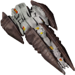</img><br>


[automata.in.human.space.zip](https://github.com/Hecter94/EndlessSky-PluginArchive/releases/download/Latest/automata.in.human.space.zip) | 35.24 kb | 2023-10-17 | [view files](https://github.com/Hecter94/EndlessSky-PluginArchive/tree/main/Working/automata.in.human.space/) <br>
Author: zuckung | Category: Gameplay <br>
[https://github.com/zuckung/endless-sky-plugins](https://github.com/zuckung/endless-sky-plugins) (last commit 2023-10-17) <br>

>Brings jump drive equipped automata into human space after the wanderer campaign. See the readme for details.

<details>
<summary>:blue_book: Plugin readme</summary>
<blockquote>### automata.in.human.space
<br>
<br>
Brings jump drive equipped automata into human space after the wanderer campaign. <br>
<br>
You can find them where Korath ships in human space are usually found(ember waste and eastern syndicate). <br>
The chance to encounter previous Korath ships or automata is like 50/50. <br>
<br>
<br>
Changelog:<br>
<br>
2023-10-17<br>
added plugin.txt<br>
<br>
2023-09-01<br>
added more fleet variants <br>
reworked readme <br>
changed icon.png<br>

</blockquote>
</details>

Status: tested with 0.10.2 <br>
Daily update check: </img><br>


---

### Bare Ships


[Bare.Ships.zip](https://github.com/Hecter94/EndlessSky-PluginArchive/releases/download/Latest/Bare.Ships.zip) | 2.02 kb | 2023-07-27 | [view files](https://github.com/Hecter94/EndlessSky-PluginArchive/tree/main/Working/Bare%20Ships/) <br>
Author: lifeyouristhis | Category: Gameplay <br>
[https://github.com/lifeyouristhis/bare-ships-plugin](https://github.com/lifeyouristhis/bare-ships-plugin) (last commit 2017-09-14) <br>

>Shipyards now sell bare hulls with no outfits.
>

<details>
<summary>:blue_book: Plugin readme</summary>
<blockquote># bare-ships-plugin

</blockquote>
</details>

Status: N/A <br>
Daily update check: </img><br>


---

### better.starts
</img><br>


[better.starts.zip](https://github.com/Hecter94/EndlessSky-PluginArchive/releases/download/Latest/better.starts.zip) | 21.25 kb | 2023-10-17 | [view files](https://github.com/Hecter94/EndlessSky-PluginArchive/tree/main/Working/better.starts/) <br>
Author: zuckung | Category: Gameplay <br>
[https://github.com/zuckung/endless-sky-plugins](https://github.com/zuckung/endless-sky-plugins) (last commit 2023-10-17) <br>

>Adds several new start options with different ships, background storys, credits and debts. See the readme for details.

<details>
<summary>:blue_book: Plugin readme</summary>
<blockquote>### better.starts <br>
<br>
Adds 9 new start options with different ships, background storys, credits and debts.<br>
<br>
<ul>
<li>Start: Trader | Freighter: equipped for cargo transport, in Merak system</li>
<li>Start: Trader (Hai) | Aphid: equipped for cargo transport, in Fah Soom system(Hai space)</li>
<li>Start: Passenger Transport | Scout: equipped for passenger transport, Talita system</li>
<li>Start: Miner | Clipper: equipped for mining, in Rasalhague system</li>
<li>Start: Salvager | Shuttle: equipped for boarding, in Aldhibain system</li>
<li>Start: Salvager(big) | Argosy: equipped for boarding, in Aldhibain system</li>
<li>Start: Explorer to Remnant | Heavy Shuttle: equipped for exploring the Remnant, in Tania Australis system</li>
<li>Start: Explorer to Automata | Bounder: equipped for exploring the Kor Automata, in Mirfak system</li>
<li>Start: Cheater | Heron: 1b credits, full visible human space, Jump Drive, in Sol system, no story</li>
</ul>
<br>
Beside the cheater start option, all others are balanced and lore friendly. A bigger ship means a bigger bank loan. All starts come with 200.000 credits cash and a bank loan between 600.000 and 4,5 million credits. The ships outfits are changed to fit the role. The intro missions on New Bosten are set as completed. Same goes for the Hai start with the Hai first contact mission.<br>
<br>
<br>
Changelog:<br>
<br>
2023-10-17<br>
added plugin.txt<br>
<br>
2023-09-15<br>
added passenger transport start<br>
set intro missions to done for all starts<br>
doubled bank loan duration / halfed interest rate for all starts<br>
changed cheater start ship and credits<br>
<br>
2023-09-03<br>
changed miner start to a system with outfitter<br>
added Start Trader Freighter<br>
added Start Trader (Hai) Aphid<br>
added Start Explorer to Remnant<br>
added Start Explorer to Automata<br>

</blockquote>
</details>

Status: tested with 0.10.2 <br>
Daily update check: </img><br>


---

### BetterVanillaHai
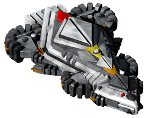</img><br>


[BetterVanillaHai.zip](https://github.com/Hecter94/EndlessSky-PluginArchive/releases/download/Latest/BetterVanillaHai.zip) | 72.77 kb | 2023-07-27 | [view files](https://github.com/Hecter94/EndlessSky-PluginArchive/tree/main/Working/BetterVanillaHai/) <br>
Author: ZBok | Category: Gameplay <br>
[https://github.com/ZBok/BetterVanillaHai](https://github.com/ZBok/BetterVanillaHai) (last commit 2022-06-24) <br>

>In short this plugin assumes news of the Hai spreads rapidly. Therefore in the late game a small percentage of humans start using their ships in ambient fleets. It therefore adds Hai vessels and many variants (like full Proton SB or Plasma/QuadBlaster Solifuge + many more) as rare additions to almost all human fleets in the late-game (more details below). This makes ambient pirate combat much more spicy and varied, with the tide of pirate battle being turned when a Hai ship from either side jumps in.

<details>
<summary>:blue_book: Plugin readme</summary>
<blockquote># BetterVanillaHai for Endless Sky

In short this plugin assumes news of the Hai spreads rapidly. Therefore in the late game a small percentage of humans start using their ships in ambient fleets. It therefore adds Hai vessels and many variants (like full Proton SB or Plasma/QuadBlaster Solifuge + many more) as rare additions to almost all human fleets in the late-game (more details below). This makes ambient pirate combat much more spicy and varied, with the tide of pirate battle being turned when a Hai ship from either side jumps in.

Ambient spawn rate of Hai ships should be around or below 10%. The plugin attempts to maintain NPC combat balance by adding strength evenly to opposing fleets (pirate/merchant etc), and maintain vanilla feeling fleet compositions.

It activates these changes after player completes both the missions related to the Solifuge and Pond Strider, and has also completed the main plot.

The general idea behind this change is that news of advanced squirrel aliens in close proximity to humanity would plausibly spread very rapidly and that the more prosperous/badass merchants and pirates will be therefore occasionally seen using their ships in human space.

Now if merchants/pirates start using Hai ships, then by golly gosh the military can't allow themselves to be outgunned and is forced to get on board the acorn train too. Therefore this plugin gives the Republic and FW custom variants of the SB as well as the standard Hai weapon setups. Deep/Syndicate use the Strider in the same way. Militia get nothing because they are poor.

Merchants/navy don't use the Solifuge, but pirates do because... somehow. To be honest I couldn't come up with any plausible process for pirates to get their hands on Solifuges - maybe they could buy from the De-fettered though pirates getting through Hai space seems unlikely - but whatever. It's a cool Hai ship, I didn't want to leave it out, so some Solifuge variants pop up in pirate fleets just because. Also the Proton Solifuge (used by Core pirates) is freaking badass.

This plugin doesn't add Hai outfitted human ships in a similar fashion (BetterVanillaPirates does).


Enjoy!

</blockquote>
</details>

Status: N/A <br>
Daily update check: </img><br>


---

### Boarding Licenses


[Boarding.Licenses.zip](https://github.com/Hecter94/EndlessSky-PluginArchive/releases/download/Latest/Boarding.Licenses.zip) | 17.69 kb | 2023-07-27 | [view files](https://github.com/Hecter94/EndlessSky-PluginArchive/tree/main/Working/Boarding%20Licenses/) <br>
Author: An-archist | Category: Gameplay <br>
[https://github.com/An-archist/boarding-licenses](https://github.com/An-archist/boarding-licenses) (last commit 2019-10-25) <br>

>Adds licenses that allow the player to capture ships. Currently in alpha The better the license, the more ships you can cap
>

<details>
<summary>:blue_book: Plugin readme</summary>
<blockquote>Prevents players from capping ships (easily) and adds licenses that allow the player to capture ships. Currently in alpha (0.0.1).
The better the license, the more ships you can cap.

Class A Boarding: (Human) Interceptors/Fighters

Class B Boarding: (Human) Light Warships/Transport/Light Freighter

Class C Boarding: (Human) Medium Warships/Heavy Freighter

Class D Boarding: (Human) Heavy Warships

Hai Boarding: Hai Ships

Korath Boarding: Korath Ships

</blockquote>
</details>

Status: N/A <br>
Daily update check: </img><br>


---

### Bounty Hunters


[Bounty.Hunters.zip](https://github.com/Hecter94/EndlessSky-PluginArchive/releases/download/Latest/Bounty.Hunters.zip) | 11.3 kb | 2023-07-27 | [view files](https://github.com/Hecter94/EndlessSky-PluginArchive/tree/main/Working/Bounty%20Hunters/) <br>
Author: WarlordMike | Category: Gameplay <br>
[https://github.com/WarlordMike/es-bounty-hunters](https://github.com/WarlordMike/es-bounty-hunters) (last commit 2020-11-07) <br>

>Adds a storyline where you can become a bounty hunter.
>

<details>
<summary>:blue_book: Plugin readme</summary>
<blockquote># es-bounty-hunters
es-bounty-hunters is a plugin for Endless Sky that adds a new storyline in which the player can become a Bounty Hunter. I won't spoil it for you here...

## Installation
Download the code as a .zip and extract it to your plugins file. On Linux, it's `~/.local/share/endless-sky/plugins`, and I don't use Window or Mac, so you'll have to figure it out yourself.

## Acknowledgements
Thank you to everyone on the ES Discord for helping me, but special thanks to EjoThims for reviewing the first chapter of the story, Arachi for pointing out my dumb mistakes, and Warlord Mike for coming up with the names for Arthur Stalgren and Admiral Lowell. Thanks, guys!

</blockquote>
</details>

Status: N/A <br>
Daily update check: </img><br>


---

### Bounty-Fix
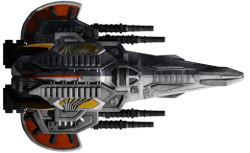</img><br>


[Bounty-Fix.zip](https://github.com/Hecter94/EndlessSky-PluginArchive/releases/download/Latest/Bounty-Fix.zip) | 95.43 kb | 2023-07-23 | [view files](https://github.com/Hecter94/EndlessSky-PluginArchive/tree/main/Working/Bounty-Fix/) <br>
Author: CatLady | Category: Gameplay <br>
[https://github.com/Cat-Lady/Bounty-Fix](https://github.com/Cat-Lady/Bounty-Fix) (last commit 2019-11-17) <br>

>This ES plugin makes Pirates/Marauders that are subject of Bounty Hunting missions be properly seen as enemies by Militia/Navy/Deep Security/Merchants and other forces that should dislike Marauders/Pirates.


Status: N/A <br>
Daily update check: </img><br>


---

### Businessman Mod


[Businessman.Mod.zip](https://github.com/Hecter94/EndlessSky-PluginArchive/releases/download/Latest/Businessman.Mod.zip) | 802.36 kb | 2023-07-27 | [view files](https://github.com/Hecter94/EndlessSky-PluginArchive/tree/main/Working/Businessman%20Mod/) <br>
Author: Evan | Category: Gameplay <br>
N/A[]()  <br>

>Become a ruler of the galaxy through money. Buy trade routes, stocks, set up shops and entertainment centers, buy planets, hire a mercenary army, hunt down people who didn't pay back their loans....and more.. Also includes an optional alternate pirate start, and additons to make piracy much more viable and fun.
>

<details>
<summary>:blue_book: Plugin readme</summary>
<blockquote># EndlessSky-Businessman-Mod
A simple mod with many changes and additions

For a full list of features and downloads check the steam guide here: http://steamcommunity.com/sharedfiles/filedetails/?id=690480787

</blockquote>
</details>

Status: Playable on 0.9.14, 0.9.15 Continuous. <br>
Daily update check: </img><br>


---

### Cargo Controls Plugin


[Cargo.Controls.Plugin.zip](https://github.com/Hecter94/EndlessSky-PluginArchive/releases/download/Latest/Cargo.Controls.Plugin.zip) | 3.15 kb | 2023-07-27 | [view files](https://github.com/Hecter94/EndlessSky-PluginArchive/tree/main/Working/Cargo%20Controls%20Plugin/) <br>
Author: petervdmeer | Category: Gameplay <br>
[https://github.com/petervdmeer/endless-sky-cargo-controls-plugin](https://github.com/petervdmeer/endless-sky-cargo-controls-plugin) (last commit 2019-11-29) <br>

>Cargo Controls options for Endless Sky.

<details>
<summary>:blue_book: Plugin readme</summary>
<blockquote># endless-sky-cargo-controls-plugin
Cargo Controls options for Endless Sky (computer game)

</blockquote>
</details>

Status: N/A <br>
Daily update check: </img><br>


---

### Conscience Plugin


[Conscience.Plugin.zip](https://github.com/Hecter94/EndlessSky-PluginArchive/releases/download/Latest/Conscience.Plugin.zip) | 24.08 kb | 2023-07-27 | [view files](https://github.com/Hecter94/EndlessSky-PluginArchive/tree/main/Working/Conscience%20Plugin/) <br>
Author: mathwhiz1212 | Category: Gameplay <br>
[https://github.com/mathwhiz1212/ES-conscience-plugin](https://github.com/mathwhiz1212/ES-conscience-plugin) (last commit 2023-03-04) <br>

>This plugin is meant to allow you to complete Endless Sky story lines without doing things you have an ethical problem with. For now, it just makes it so you don't need to drop a bomb on Zenith and kill civilians.

<details>
<summary>:blue_book: Plugin readme</summary>
<blockquote># Endless Sky Conscience Plugin

This plugin is meant to allow you to complete Endless Sky story lines without doing things you have an ethical problem with. For now, it just makes it so you don't need to drop a bomb on Zenith and kill civilians.

If you'd rather grind then use a plugin, you can cap a bunch of Korath ships in Kor Ak'Mari and destroy the Sestor fleet that way.

If you take the Quarg ships anywhere other than the assigned planets and systems, they may or may not disappear.

## Installing

1. Download the plugin here: [https://github.com/mathwhiz1212/A-Coalition-At-War/releases](https://github.com/mathwhiz1212/A-Coalition-At-War/releases)

2. Put the zip file in your plugins folder:

Windows: `%APPDATA%\endless-sky\plugins/`

Mac: `~/Library/ApplicationSupport/endless-sky/plugins/`

Linux: `~/.local/share/endless-sky/plugins/`

3. Decompress/"Unzip" the zip file.
4. Start Endless Sky. You should be able to see "A Coalition at War" under Preferences > Plugins.
5. If you have problems, open an issue.

# Using the Plugin

Install the plugin before you get to Hevru Hai. If you're already past that mission, try landing on Hevru Hai anyway. It might still work.

Park any escort ships you don't want to lose in Hai space. Make sure you have a cloaking device on your flagship.

It's best if your flagship is better than what humans have (a Wanderer warship would do nicely), but as long as your shields can last till you run away, you'll be ok.

Destroy or capture the Sestor drones above Farpoint before you land.

After talking to Danforth, cloak and hide. Run away. If you're daring, come back and distract single Sestor ships on the edges. Cloak fast when needed.

Make sure to destroy or capture every last drone, until you get a message that starts with `Against all odds...`

## Alnilam Mission

You'll get two Quarg ships to help you with this one too. Make sure to destroy or capture every Korath drone in the system. The game is more picky about this one, so if you go to Fairpoint and don't get the next mission, go back and destroy any disabled drones.

Then return to Fairpoint. You'll then be sent to Zenith. When you get to Zenith, land immediately. Don't let the cruisers get destroyed before you land on the planet.

That's it! You've successfully avoided committing mass murder!

</blockquote>
</details>

Status: N/A <br>
Daily update check: </img><br>


---

### Costly Drives
</img><br>


[Costly.Drives.zip](https://github.com/Hecter94/EndlessSky-PluginArchive/releases/download/Latest/Costly.Drives.zip) | 99.21 kb | 2023-07-27 | [view files](https://github.com/Hecter94/EndlessSky-PluginArchive/tree/main/Working/Costly%20Drives/) <br>
Author: Anarchist2 | Category: Gameplay <br>
[https://github.com/Anarchist2/costly-drives](https://github.com/Anarchist2/costly-drives) (last commit 2020-04-26) <br>

>This plugin makes drives much more expensive, while making them unplunderable to prevent easy(er) boarding. Additionally, drive sales are much more restricted.
>

<details>
<summary>:blue_book: Plugin readme</summary>
<blockquote># Costly Drives
I've always found it odd that hyperdrives, despite the supposed mystery of their workings, is sold super cheaply, especially when compared to a bunch of power outfits (which have basis in real life). This plugin makes drives much more expensive, while making them unplunderable to prevent easy(er) boarding. Additionally, drive sales are much more restricted.

Known Problems:
- Broken JDs don't have increased value/unplunderable: The main use of Broken JDs is for the Remnant Broken JD mission, and I didn't want to force players to have a boarding ship to do those missions.
- Missions don't give a corresponding amount of increased money. Because of the inability to modify existing missions using plugins, this is unfixable at the moment.
</blockquote>
</details>

Status: N/A <br>
Daily update check: </img><br>


---

### Crowded Sky


[Crowded.Sky.zip](https://github.com/Hecter94/EndlessSky-PluginArchive/releases/download/Latest/Crowded.Sky.zip) | 8.83 kb | 2022-10-06 | [view files](https://github.com/Hecter94/EndlessSky-PluginArchive/tree/main/Working/Crowded%20Sky/) <br>
Author: 1010todd | Category: Gameplay <br>
N/A[]()  <br>

>Make npc fleets spawn more often.
>Note: it's done by overwriting map file, may cause conflict with other plugin that also do that.
>


Status: N/A <br>
Daily update check: </img><br>


---

### Delayed Free Worlds


[Delayed.Free.Worlds.zip](https://github.com/Hecter94/EndlessSky-PluginArchive/releases/download/Latest/Delayed.Free.Worlds.zip) | 16.59 kb | 2023-07-27 | [view files](https://github.com/Hecter94/EndlessSky-PluginArchive/tree/main/Working/Delayed%20Free%20Worlds/) <br>
Author: MinneIceCube | Category: Gameplay <br>
[https://github.com/MinneIceCube/Delayed-Free-Worlds-Start](https://github.com/MinneIceCube/Delayed-Free-Worlds-Start) (last commit 2022-04-15) <br>

>Does exactly what the title says it does. Delays the declration of the Free Worlds by about half a year. The reason for this is so that players will have more time to complete missions for the The "Southern Mutual Defense Pact." While few in number, they are easy to miss if not done before the war starts. 


Status: N/A <br>
Daily update check: </img><br>


---

### Difficulties
</img><br>


[Difficulties.zip](https://github.com/Hecter94/EndlessSky-PluginArchive/releases/download/Latest/Difficulties.zip) | 13.81 kb | 2023-07-27 | [view files](https://github.com/Hecter94/EndlessSky-PluginArchive/tree/main/Working/Difficulties/) <br>
Author: Mielo Symeonidis | Category: Gameplay <br>
N/A[]()  <br>

>Adds three diffrent difficulties that take form as the start to a game. Not reccomended for people new to Endless Sky.
>


Status: N/A <br>
Daily update check: </img><br>


---

### Drop Loot


[Drop.Loot.zip](https://github.com/Hecter94/EndlessSky-PluginArchive/releases/download/Latest/Drop.Loot.zip) | 89.72 kb | 2023-03-04 | [view files](https://github.com/Hecter94/EndlessSky-PluginArchive/tree/main/Working/Drop%20Loot/) <br>
Author: 1010todd | Category: Gameplay <br>
N/A[]()  <br>

>Every outfit now have chance to be dropped as flotsam when the ship explodes.
>


Status: N/A <br>
Daily update check: </img><br>


---

### Extra Large Jobs


[Extra.Large.Jobs.zip](https://github.com/Hecter94/EndlessSky-PluginArchive/releases/download/Latest/Extra.Large.Jobs.zip) | 6.25 kb | 2022-10-06 | [view files](https://github.com/Hecter94/EndlessSky-PluginArchive/tree/main/Working/Extra%20Large%20Jobs/) <br>
Author: 1010todd | Category: Gameplay <br>
N/A[]()  <br>

>Add various large to extremely large jobs to fill up the space when for extra large ships.
>
>
>


Status: Playable on 0.9.15 Continuous. <br>
Daily update check: </img><br>


---

### Galactic Hazards


[Galactic.Hazards.zip](https://github.com/Hecter94/EndlessSky-PluginArchive/releases/download/Latest/Galactic.Hazards.zip) | 5.04 kb | 2022-10-06 | [view files](https://github.com/Hecter94/EndlessSky-PluginArchive/tree/main/Working/Galactic%20Hazards/) <br>
Author: N/A | Category: Gameplay <br>
N/A[]()  <br>

>adds more hazards to many systems. like coronar mass ejection, different asteroid impact, dust rings atound stars, etc.
>


Status: N/A <br>
Daily update check: </img><br>


---

### galactic.capital.investment
</img><br>


[galactic.capital.investment.zip](https://github.com/Hecter94/EndlessSky-PluginArchive/releases/download/Latest/galactic.capital.investment.zip) | 26.58 kb | 2023-10-17 | [view files](https://github.com/Hecter94/EndlessSky-PluginArchive/tree/main/Working/galactic.capital.investment/) <br>
Author: zuckung | Category: Gameplay <br>
[https://github.com/zuckung/endless-sky-plugins](https://github.com/zuckung/endless-sky-plugins) (last commit 2023-10-17) <br>

>Implements a short mission chain that enables repeatable job board investment opportunities which result in small daily income. Available in human, quarg and hai space starting with 2 million credits cash and going up to 100 million credits. See the readme for details.
>(inspired by a-alhusaini's investment bank plugin)

<details>
<summary>:blue_book: Plugin readme</summary>
<blockquote>### galactic.capital.investment <br>
<br>
Implements a short mission chain that enables repeatable job board investment opportunities which result in small daily income. Available in human, quarg and hai space starting with 2 million credits cash and going up to 100 million credits. <br>
(inspired by a-alhusaini's investment bank plugin) <br>
<br>
There are missions for 1 million, 5 million, 10 million, 50 million and 100 million credits. The chance for the jobs to appear on the job board are 25% for each one. Unfortunately you have to take off and land again on the same planet to clear the mission marker.<br>
1 million = 600 credits daily <br>
5 million = 3.400 credits daily <br>
10 million = 7.200 credits daily <br>
50 million = 37.000 credits daily <br>
100 million = 76.100 credits daily <br>
<br>
These investments pay off after 3,5 to 4,5 years. Higher Investments pay off faster.<br>
<br>
<br>
Changelog:<br>
<br>
2023-10-17<br>
added plugin.txt<br>
<br>
2023-08-25<br>
added pirate planets as mission source
moved investment missions from spaceport mission to job board
</blockquote>
</details>

Status: tested with 0.10.2 <br>
Daily update check: </img><br>


---

### Gatling Ammo Fix
</img><br>


[Gatling.Ammo.Fix.zip](https://github.com/Hecter94/EndlessSky-PluginArchive/releases/download/Latest/Gatling.Ammo.Fix.zip) | 79.73 kb | 2023-07-27 | [view files](https://github.com/Hecter94/EndlessSky-PluginArchive/tree/main/Working/Gatling%20Ammo%20Fix/) <br>
Author: Cat-Lady | Category: Gameplay <br>
[https://github.com/Cat-Lady/Gatling-Ammo-Fix](https://github.com/Cat-Lady/Gatling-Ammo-Fix) (last commit 2019-11-17) <br>

>This plugin fixes availability of Gatling Gun Ammo (and its boxes) - being most primitive and easiest to manufacture type of ordnance, it is now available where you would expect it to be (hint: "galactic south" and multipurpose ammo depots).
>
>Recommended to use with Becca's Endless Expansion plugin (which adds Kraz Cybernetic's Accurate Gatling Blaster" variant).
>

<details>
<summary>:blue_book: Plugin readme</summary>
<blockquote>#### This plugin is a part of upcoming "Endless Sky: Captain's Edition" reboot of the base game. Stay tuned - meanwhile, installing the plugins can help to preview the experience, together or in parts.

# Gatling Ammo Fix

This plugin fixes availability of Gatling Gun Ammo (and its boxes) - being most primitive and easiest to manufacture type of ordnance, it is now available where you would expect it to be (hint: "galactic south" and multipurpose ammo depots).


## Installing


Check:
https://github.com/Cat-Lady/Gatling-Ammo-Fix/releases

...for latest, pre-packaged version.

Unpack to your ES plugins folder. Be sure that you have single ``gatling-ammo-fix`` directory inside your plugins folder, containing ``data`` folder. Directory structure should look like:

```(...)/plugins/gatling-ammo-fix/(.../data/, and other stuff)```


It **won't** work if the directory structure will be anything like:

```(...)/plugins/Gatling-Ammo-Fix/gatling-ammo-fix/(...)```


## Author

* **Cat Lady**


## License

This project is licensed under the GPL3 License - see the [LICENSE.md](LICENSE.md) file for details.

## Acknowledgments

"Endless Sky" Development Team and Michael Zahniser; For maintaining and creating the game.

</blockquote>
</details>

Status: N/A <br>
Daily update check: </img><br>


---

### GreyShipVolume


[GreyShipVolume.zip](https://github.com/Hecter94/EndlessSky-PluginArchive/releases/download/Latest/GreyShipVolume.zip) | 62.42 kb | 2022-10-06 | [view files](https://github.com/Hecter94/EndlessSky-PluginArchive/tree/main/Working/GreyShipVolume/) <br>
Author: 1010Todd | Category: Gameplay <br>
N/A[]()  <br>

>Lots of map to calculate ship volume(outfit/cargo space) and mass.
>WARNING: single-file race might have unrelated data attached (Pug, Drak, etc.)
>
>


Status: Playable on 0.9.14, 0.9.15 Continuous. <br>
Daily update check: </img><br>


---

### HW Rebalance Test


[HW.Rebalance.Test.zip](https://github.com/Hecter94/EndlessSky-PluginArchive/releases/download/Latest/HW.Rebalance.Test.zip) | 18.13 kb | 2022-10-06 | [view files](https://github.com/Hecter94/EndlessSky-PluginArchive/tree/main/Working/HW%20Rebalance%20Test/) <br>
Author: 1010Todd | Category: Gameplay <br>
N/A[]()  <br>

>Triple human heavy warship mass to make them slower.
>


Status: Playable on 0.9.14, 0.9.15 Continuous. <br>
Daily update check: </img><br>


---

### Investment Bank


[Investment.Bank.zip](https://github.com/Hecter94/EndlessSky-PluginArchive/releases/download/Latest/Investment.Bank.zip) | 0.96 kb | 2023-07-27 | [view files](https://github.com/Hecter94/EndlessSky-PluginArchive/tree/main/Working/Investment%20Bank/) <br>
Author: a-alhusain | Category: Gameplay <br>
[https://github.com/a-alhusaini/investment-bank-es-plugin](https://github.com/a-alhusaini/investment-bank-es-plugin) (last commit 2021-10-13) <br>

>When you are rich enough some investment banks will offer you a chance to invest with them to gain an increased daily salary
>

<details>
<summary>:blue_book: Plugin readme</summary>
<blockquote># Investment Bank plugin for Endless sky

This plugin is simple. When you are rich enough some investment banks will offer you a chance to invest with them to gain an increased daily salary

</blockquote>
</details>

Status: Playable on 0.9.14, 0.10.0 Continuous. <br>
Daily update check: </img><br>


---

### Kor Mereti Fluff
</img><br>


[Kor.Mereti.Fluff.zip](https://github.com/Hecter94/EndlessSky-PluginArchive/releases/download/Latest/Kor.Mereti.Fluff.zip) | 2.62 mb | 2023-08-02 | [view files](https://github.com/Hecter94/EndlessSky-PluginArchive/tree/main/Working/Kor%20Mereti%20Fluff/) <br>
Author: OcelotWalrus | Category: Gameplay <br>
N/A[]()  <br>

>It is a plugin that expand the ships and the outfits of the Kor Mereti faction.
>

<details>
<summary>:blue_book: Plugin readme</summary>
<blockquote>## This plugin is deprecated and you can find the updated version merged with the [`Cromha-Expansion-plugin`](https://github.com/OcelotWalrus/Cromha-Expansion-plugin)

<p align=center></p>

<h1><p align=center>Endless Sky Plugin:<br />Kor Mereti Fluff</p></h1>

This is a plugin for the free, open-source game [Endless Sky][es]. This plugin
is developed and tested against the [Endless Sky continuous][continuous] build.
Learn more [about Endless Sky][esweb].
If you want to discuss about the plugin or ask more in depth questions to me.
You can also find this plugin merged with an other plugin: [Cromha Expansion](https://github.com/OcelotWalrus/Cromha-Expansion-plugin)


<details>

  <summary>Summary</summary>

* [About plugin](#about-plugin)
    * [This plugin](#this-plugin)
* [Contributing](#contributing)
* [Development status](#development-status)
* [Installation](#installation)
    * [Install steps](#install-steps)
    * [Keeping the plugin updated](#keeping-the-plugin-updated)
* [Credits](#credits)

</details>

# About Plugin:

It is a plugin that expand the ships and the outfits of the Kor Mereti faction. 

## This plugin:

* New ships and outfits for the Kor Mereti faction
* Adds deprecated outfits for the Korath in general
* Adds new systems in the Korath Space especially where there is the Kor Mereti and Kor Sestor factions.

# Contributing

All Contributions are welcome!
To contribute to the plugin, you can create issues to describe an error from spelling errors to mission bug or anything else.
You can also create an issue to request specific feature.

# Development Status
This plugin is fully finished.

# Installation
Go [here](https://github.com/OcelotWalrus/Cromha-Expansion-plugin/wiki/User-Guide) for more infos on installing the plugin.

## Install steps

To install the plugin you just have to clone this repository into your [endless sky plugin directory](https://github.com/endless-sky/endless-sky/wiki/CreatingPlugins).

```
git clone https://github.com/OcelotWalrus/Kor-Mereti-Fluff.git
```

## Keeping the plugin updated
If you're not familiar with git, you just have to run that command into the installed plugin.
```
git pull origin main
```
[es]: https://github.com/endless-sky/endless-sky
[continuous]: https://github.com/endless-sky/endless-sky/releases/tag/continuous
[esweb]: https://endless-sky.github.io/

# Credits

Thanks to all the people in the Endless Sky community and people who contributed.

<!--A list of the people who needs credits and for what...-->

* art from 1010todd's Green Mereti (the Model 1024 Green House ship and the Infected version)
* outfits derived from Endless Sky Pull Request #4987
* Derived from works by Nomadic Volcano (under GLP-3+) and Michael Zahniser (under the same license).
* Deprecated outfits originally from AES Misc. by Darcy Manoel
* Inspired by the plugin [Midnight-Expansion](https://github.com/MidnightPlugins/Midnight-Expansion) and [Midnight-Scrapyard](https://github.com/MidnightPlugins/Midnight-Scrapyard). The work on these plugins is insane!
* Darcy Manoel, sone of the outfits are deprecated outfits that were originally from AES Misc

</blockquote>
</details>

Status: Merged into Chroma Expansion <br>
Daily update check: </img><br>


---

### kor.efret.shipyard
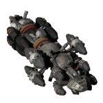</img><br>


[kor.efret.shipyard.zip](https://github.com/Hecter94/EndlessSky-PluginArchive/releases/download/Latest/kor.efret.shipyard.zip) | 29.79 kb | 2023-10-17 | [view files](https://github.com/Hecter94/EndlessSky-PluginArchive/tree/main/Working/kor.efret.shipyard/) <br>
Author: zuckung | Category: Gameplay <br>
[https://github.com/zuckung/endless-sky-plugins](https://github.com/zuckung/endless-sky-plugins) (last commit 2023-10-17) <br>

>Adds a shipyard with the three Kor Efret ships to Laki Nemparu(Kashikt) in Kor Efret space. Also adds an outfitter with all outfits of these three ships and some Korath Exiles outfits. See the readme for details.

<details>
<summary>:blue_book: Plugin readme</summary>
<blockquote>### kor.efret.shipyard
<br>
<br>
Adds a shipyard with the three Kor Efret ships to Laki Nemparu(Kashikt) in Kor Efret space. Also adds an outfitter with all outfits of these three ships and some Korath Exiles outfits. <br>
<br>
<br>
Available ships:<br>
<ul> 
<li>Arch-Carrack</li>
<li>Charm-Shallop</li>
<li>Echo-Galleon</li>
</ul>
<br>
Available outfits:<br>
<ul>
<li>Digger Mining Beam</li>
<li>Banisher Grav-Turret</li>
<li>Warder Anti-Missile</li>
<li>Grab-Strike Turret</li>
<li>Fuel Processor</li>
<li>Small Heat Shunt</li>
<li>Large Heat Shunt</li>
<li>Liquid Sodium Cooler</li>
<li>Scram Drive</li>
<li>System Core (Large)</li>
<li>System Core (Medium)</li>
<li>System Core (Small)</li>
<li>Plasma Core</li>
<li>Double Plasma Core</li>
<li>Triple Plasma Core</li>
<li>Afterburner (Asteroid Class)</li>
<li>Afterburner (Comet Class)</li>
<li>Afterburner (Lunar Class)</li>
<li>Afterburner (Planetary Class)</li>
<li>Afterburner (Stellar Class)</li>
<li>Generator (Furnace Class)</li>
<li>Generator (Candle Class)</li>
<li>Generator (Inferno Class)</li>
<li>Farves GP Hybrid Thruster</li>
<li>Gaktem GP Hybrid Steering</li>
<li>Gaktem GP Hybrid Thruster</li>
<li>Nelmeb GP Hybrid Steering</li>
<li>Nelmeb GP Hybrid Thruster</li>
<li>Engine (Meteor Class)</li>
<li>Bow Drive (Meteor Class)</li>
<li>Reverser (Asteroid Class)</li>
<li>Reverser (Comet Class)</li>
<li>Reverser (Lunar Class)</li>
<li>Reverser (Planetary Class)</li>
<li>Reverser (Stellar Class)</li>
<li>Thruster (Asteroid Class)</li>
<li>Thruster (Comet Class)</li>
<li>Thruster (Lunar Class)</li>
<li>Thruster (Planetary Class)</li>
<li>Thruster (Stellar Class)</li>
<li>Steering (Asteroid Class)</li>
<li>Steering (Comet Class)</li>
<li>Steering (Lunar Class)</li>
<li>Steering (Planetary Class)</li>
<li>Steering (Stellar Class)</li>
<li>Thermal Repeater Rifle</li>
</ul>
<br>
<br>
Changelog:<br>
<br>
2023-10-17<br>
added plugin.txt<br>
<br>
2023-09-01<br>
added 28 korath outfits(no weapons)<br>
added new icon.png<br>
reworked readme<br>
</blockquote>
</details>

Status: tested with 0.10.2 <br>
Daily update check: </img><br>


---

### Korath Domination


[Korath.Domination.zip](https://github.com/Hecter94/EndlessSky-PluginArchive/releases/download/Latest/Korath.Domination.zip) | 3.57 kb | 2022-10-06 | [view files](https://github.com/Hecter94/EndlessSky-PluginArchive/tree/main/Working/Korath%20Domination/) <br>
Author: N/A | Category: Gameplay <br>
N/A[]()  <br>

>makes korath exiles, kor efret, mereti and sestor planets dominateable(with tribute)
>


Status: N/A <br>
Daily update check: </img><br>


---

### Landing Fees and Tax


[Landing.Fees.and.Tax.zip](https://github.com/Hecter94/EndlessSky-PluginArchive/releases/download/Latest/Landing.Fees.and.Tax.zip) | 1.56 kb | 2022-10-06 | [view files](https://github.com/Hecter94/EndlessSky-PluginArchive/tree/main/Working/Landing%20Fees%20and%20Tax/) <br>
Author: Disiuze | Category: Gameplay <br>
[https://github.com/Disiuze/misc-projects](https://github.com/Disiuze/misc-projects) (last commit 2017-02-22) <br>

>Adds a landing fee the player has to pay each time after one year.
>


Status: Playable on 0.9.14, 0.9.15 Continuous. <br>
Daily update check: </img><br>


---

### Mass-ive Fix
</img><br>


[Mass-ive.Fix.zip](https://github.com/Hecter94/EndlessSky-PluginArchive/releases/download/Latest/Mass-ive.Fix.zip) | 86.69 kb | 2023-07-27 | [view files](https://github.com/Hecter94/EndlessSky-PluginArchive/tree/main/Working/Mass-ive%20Fix/) <br>
Author: Anarchist2 | Category: Gameplay <br>
[https://github.com/Anarchist2/Mass-ive-fix](https://github.com/Anarchist2/Mass-ive-fix) (last commit 2020-09-22) <br>

>Make mass and outfit space of a few outfits the same.
>

<details>
<summary>:blue_book: Plugin readme</summary>
<blockquote># Mass-ive Fix
Changelist:
- Ravager Beam mass from 13 to 18, Ravager Turret mass from 16 to 22
- Annihilator mass from 10 to 14, Annihilator Turret mass from 25 to 32
- Bellows-Class Afterburner mass from 13 to 11
- Ka'het MHD Generator mass from 20 to 22, Ka'het Reserve Accumulator mass from 2 to 3
- Ka'het EMP Deployer mass from 18 to 10
- Support Cooling mass from 6 to 8
- Primary Cooling mass from 11 to 14
- Shield Restorer mass from 15 to 19
- Inhibitor turret weapon capacity from -22 to -28
- Photovoltaic Panel masses from 22 and 3 to 16 and 2
- Collector masses from 28 and 8 to 21 and 6

Not changed:
- Missile Launcher mass: The ammo compensates for the reduced mass
- Inhibitor Turret mass: It's lored as being "outside" the mount

</blockquote>
</details>

Status: N/A <br>
Daily update check: </img><br>


---

### Mess


[Mess.zip](https://github.com/Hecter94/EndlessSky-PluginArchive/releases/download/Latest/Mess.zip) | 5.0 kb | 2023-07-27 | [view files](https://github.com/Hecter94/EndlessSky-PluginArchive/tree/main/Working/Mess/) <br>
Author: FranchuFranchu | Category: Gameplay <br>
[https://github.com/FranchuFranchu/endless-sky-mess-plugin](https://github.com/FranchuFranchu/endless-sky-mess-plugin) (last commit 2019-08-20) <br>

>This plugin makes all the governments get in war against each other
>It also makes every fleet spawn in Sol, so you can see them all destroy each other in one place
>Finally, it changes how the pilot starts.
>

<details>
<summary>:blue_book: Plugin readme</summary>
<blockquote># Mess and explosions

by FranchuFranchu

This plugin makes all the governments get in war against each other

It also makes every fleet spawn in Sol, so you can see them all destroy each other in one place

Finally, it changes how the pilot starts.
</blockquote>
</details>

Status: N/A <br>
Daily update check: </img><br>


---

### more.boarding.missions
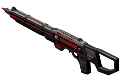</img><br>


[more.boarding.missions.zip](https://github.com/Hecter94/EndlessSky-PluginArchive/releases/download/Latest/more.boarding.missions.zip) | 14.74 kb | 2023-10-17 | [view files](https://github.com/Hecter94/EndlessSky-PluginArchive/tree/main/Working/more.boarding.missions/) <br>
Author: zuckung | Category: Gameplay <br>
[https://github.com/zuckung/endless-sky-plugins](https://github.com/zuckung/endless-sky-plugins) (last commit 2023-10-17) <br>

>Adds lots of repeatable boarding and assisting missions for different factions. Boarding bigger ships give higher rewards or higher chances for credits or special items. See the readme for details.

<details>
<summary>:blue_book: Plugin readme</summary>
<blockquote>### more.boarding.missions <br>
<br>
<br>
Adds 53 repeatable boarding and assisting missions. Boarding/assisting Free Worlds, Republic, Syndicate, Militia, Merchant, Independant, Pirates, Korath, Hai, Hai Unfettered, Pug, Pug (Wanderer) and Wanderer can trigger them. Bigger ships give higher rewards.<br>
<br>
<ul>
<li> 7 Human assisting missions (by ship categories, 20% chance, 10.000 to 30.000 credits)</li>
<li> 7 Pirate boarding missions (by ship categories, 20% chance, 5.000 to 25.000 credits)</li>
<li> 4 Pirate boarding missions (by ship categories, 1-4% chance, outfit "NDR-114 Android")</li>
<li> 7 Hai assisting missions (by ship categories, 20% chance, 20.000 to 60.000 credits)</li>
<li> 5 Hai Unfettered assisting missions (by ship categories, 20% chance, 30.000 to 90.000 credits)</li>
<li> 5 Hai Unfettered boarding missions (by ship categories, 10% chance, 30.000 to 90.000 credits)</li>
<li> 3 Hai Unfettered boarding missions (by reward, 3% chance, outfit one of the 3 weapon prototypes)</li>
<li> 2 Korath boarding missions (for the bigger ship categories, 2-3% chance, outfit "Cloaking Device")</li>
<li> 3 Pug boarding missions (by ship categories, 10% chance, 100.000 to 200.000 credits)</li>
<li> 3 Pug boarding missions (by ship categories, 1-3% chance, new outfit "Pug War Staff")</li>
<li> 7 Wanderer assisting missions (by ship categories, 10% chance, 50.000 to 100.000 credits)</li>
</ul>
<br>
<br>
Changelog:<br>
<br>
2023-10-17<br>
added plugin.txt<br>
<br>
2023-09-04<br>
added 7 wanderer assisting missions (credits)<br>
added 3 pug boarding missions (credits)<br>
added 3 pug boarding missions (outfit)<br>
added new outfit "Pug War Staff"<br>
<br>
2023-09-01<br>
added 5 hai unfettered assisting missions (credits)<br>
added 5 hai unfettered boarding missions (credits)<br>
added 3 hai unfettered boarding missions (outfit)<br>
added "Merchant" and "Independant" to human assisting missions<br>
<br>
2023-08-29<br>
added 2 korath boarding missions (outfit)<br>
added 4 pirate boarding missions (outfit)<br>
added icon and reworked readme<br>

</blockquote>
</details>

Status: tested with 0.10.2 <br>
Daily update check: </img><br>


---

### Persistent NPC


[Persistent.NPC.zip](https://github.com/Hecter94/EndlessSky-PluginArchive/releases/download/Latest/Persistent.NPC.zip) | 378.67 kb | 2023-07-27 | [view files](https://github.com/Hecter94/EndlessSky-PluginArchive/tree/main/Working/Persistent%20NPC/) <br>
Author: 1010todd | Category: Gameplay <br>
N/A[]()  <br>

>Proof-of-concept for NPC that upgrades over time if they don't die.
>


Status: Playable on 0.9.15 Continuous. <br>
Daily update check: </img><br>


---

### Pirate Hunter
</img><br>


[Pirate.Hunter.zip](https://github.com/Hecter94/EndlessSky-PluginArchive/releases/download/Latest/Pirate.Hunter.zip) | 425.02 kb | 2022-10-06 | [view files](https://github.com/Hecter94/EndlessSky-PluginArchive/tree/main/Working/Pirate%20Hunter/) <br>
Author: Zavindur | Category: Gameplay <br>
N/A[]()  <br>

>This gives a small payment for destroying pirates. About 10000 per pirate crew eliminated.  Payment is automatically given when landing on a planet with a starport.
>


Status: Playable on 0.9.14, 0.9.15 Continuous. <br>
Daily update check: </img><br>


---

### PlayerRewards


[PlayerRewards.zip](https://github.com/Hecter94/EndlessSky-PluginArchive/releases/download/Latest/PlayerRewards.zip) | 1.51 kb | 2023-07-27 | [view files](https://github.com/Hecter94/EndlessSky-PluginArchive/tree/main/Working/PlayerRewards/) <br>
Author: Beanzilla | Category: Gameplay <br>
[https://github.com/Beanzilla/PlayerRewards](https://github.com/Beanzilla/PlayerRewards) (last commit 2021-12-17) <br>

>Visit New Boston to start getting Money and to get All the Licenses.
>
>For best use... please cancel the starting mission you get when making a new game and just take off and land.
>

<details>
<summary>:blue_book: Plugin readme</summary>
<blockquote># PlayerRewards
Get rewarded for playing in Endless Sky

## How it works

You will get a special mission when you go and land on New Wales,

Basically go to Earth from there and then you should enjoy a somewhat balanced salary of credits per day.

> I didn't want to make it too much or then the game get's rather boring. (Also didn't want to make it too little else you really don't gain anything)

## Don't forget I have another mod

Tired of just getting credits? Want something more?

Try my other mod [ShipModded](https://github.com/Beanzilla/ShipModded)

</blockquote>
</details>

Status: N/A <br>
Daily update check: </img><br>


---

### Salvaging


[Salvaging.zip](https://github.com/Hecter94/EndlessSky-PluginArchive/releases/download/Latest/Salvaging.zip) | 5.44 kb | 2022-11-05 | [view files](https://github.com/Hecter94/EndlessSky-PluginArchive/tree/main/Working/Salvaging/) <br>
Author: Hecter94 | Category: Gameplay <br>
N/A[]()  <br>

>Salvaging proof of concept.
>


Status: N/A <br>
Daily update check: </img><br>


---

### Ship Overhaul


[Ship.Overhaul.zip](https://github.com/Hecter94/EndlessSky-PluginArchive/releases/download/Latest/Ship.Overhaul.zip) | 7.05 kb | 2023-07-27 | [view files](https://github.com/Hecter94/EndlessSky-PluginArchive/tree/main/Working/Ship%20Overhaul/) <br>
Author: Vrok-Kronos | Category: Gameplay <br>
[https://github.com/Vrok-Kronos/endless-sky-ship-overhaul](https://github.com/Vrok-Kronos/endless-sky-ship-overhaul) (last commit 2021-08-24) <br>

>Overhaul of ships and systems to make flying a capital ship feel weighty...
>
>More mass on larger ships, better shield and hull regen, faster drones & intercepters, and quicker turn rates
>

<details>
<summary>:blue_book: Plugin readme</summary>
<blockquote>Attempts to adjust mass values for ships in the game Endless Sky. Where mass governs acceleration and turning and drag limits max velocity, larger ships should have more mass so they accelerate slower than small ships... 

Work in progress...

Summary of changes from 9.13:

Adjusts mass stat of ships based on the stats of the ship. I.E. Shield hitpoints,
hull hp, outfit space, etc.

Most ships gain mass small ships gain a little, large ships gain a lot. See spreadsheets/ShipMassStats
for details.

Large ships are much slower to turn and accelerate, making them feel like large ships.

Shield recharge and hull repair systems have been given a 90% boost to capablilty to help the slower
ships survive combat longer.

Added an efficiency penalty to energy consumption. spreadsheets/shieldSystems for details.
	
For example:

Human rechargers are 85% efficient, resulting in an 18.4% increase in power consumption over 
shield recharge. Vanilla is 1 point of energy gets you 1 point of shields.

Ship engines are reworked to increase the smaller engines while keeping the larger ones close to the same.

Smaller ships are now faster compared to the max speeds of the largest ships. spreadsheets/Engines.

Human/Hai engines' prices have been increased: Ion +20%, Plasma +30%, Atomic +80%. The lore speaks of
how expenisive atomic engines are, but they don't feel like it... Hopefully Ion and plasma engine fits
are more attractive to the early game.
</blockquote>
</details>

Status: N/A <br>
Daily update check: </img><br>


---

### Spacefarer
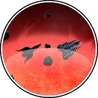</img><br>


[Spacefarer.zip](https://github.com/Hecter94/EndlessSky-PluginArchive/releases/download/Latest/Spacefarer.zip) | 220.79 kb | 2023-07-27 | [view files](https://github.com/Hecter94/EndlessSky-PluginArchive/tree/main/Working/Spacefarer/) <br>
Author: samrocketman | Category: Gameplay <br>
[https://github.com/samrocketman/Spacefarer](https://github.com/samrocketman/Spacefarer) (last commit 2023-02-04) <br>

>One Jump Drive; No ship capturing; No plundering installed outfits.
>

<details>
<summary>:blue_book: Plugin readme</summary>
<blockquote><p align=center></p>

<h1><p align=center>Endless Sky Plugin:<br />Spacefarer</p></h1>

This is a plugin for the free open source game: [Endless Sky][ES].  The theme
song for this plugin is [The Wanderer][the-wanderer].

# Gameplay Mechanics Changes

In an effort to add a unique re-playable experience to Endless Sky this plugin
aims to minimally change the vanilla experience except to place a few
constraints upon the player.

Constraints include:

- One Jump Drive
- Outfits cannot be looted
- Ships cannot be captured

# Extras provided by plugin

- Navy licenses are granted at the end of Free Worlds campaign.  So that Navy
  ships are purchasable by the player.
- Large systems core and double/triple plasma core are available after Remnant
  Cognizance missions.  They are for sale to provide additional build
  flexibility.

# Known issues

- Outfits are not plunderable but cargo on a ship can still be plundered.  This
  is a limitation in what can be accomplished in plugins.  We accept this as a
  limitation and have no plans to change it.
- If a player sells their Jump Drive they cannot get it back.  This is
  intentional.
- A player can obtain up to 3 Jump Drives simultaneously.  However, additional
  Jump Drives will be consumed to proceed with story content.  At the end, the
  player would be left with one Jump Drive.

# Development status: Beta

All critical story elements are available.  Necessary outfits are available or
plunderable when a mission calls for it.

- [x] Sheragi (JD granted for retrieving Emerald Sword)
  - [ ] Remove 2nd Jump drive granted during Sheragi campaign.
- [x] Wanderer (JD granted to give to Unfettered)
- [x] Syndicate Checkmate (JD granted to leave Pug space)
- [ ] Clean up old lootable outfits and convert them to missions.
  - [x] Free Worlds Surveillance Pod mission
  - [ ] Wanderer Control Transceiver and Reasoning Node mission
  - [ ] Free Worlds Electron Beam mission

See also [credits](credits.md).

[ES]: https://github.com/endless-sky/endless-sky
[the-wanderer]: https://www.youtube.com/watch?v=FCW0HviPEEY
[fw-drone]: metadata/fw-drone-mission.txt

</blockquote>
</details>

Status: Playable on 0.9.15 Continuous. <br>
Daily update check: </img><br>


---

### Stronger Hulls


[Stronger.Hulls.zip](https://github.com/Hecter94/EndlessSky-PluginArchive/releases/download/Latest/Stronger.Hulls.zip) | 34.66 kb | 2022-10-06 | [view files](https://github.com/Hecter94/EndlessSky-PluginArchive/tree/main/Working/Stronger%20Hulls/) <br>
Author: Connor Waterbanks | Category: Gameplay <br>
N/A[]()  <br>

>This plugin multiplies all ship hulls by five meaning ship combat lasts five times longer.
>
>


Status: Playable on 0.9.14, 0.9.15 Continuous <br>
Daily update check: </img><br>


---

### Tale Of Apoxys


[Tale.Of.Apoxys.zip](https://github.com/Hecter94/EndlessSky-PluginArchive/releases/download/Latest/Tale.Of.Apoxys.zip) | 150.62 kb | 2023-07-27 | [view files](https://github.com/Hecter94/EndlessSky-PluginArchive/tree/main/Working/Tale%20Of%20Apoxys/) <br>
Author: Zoura | Category: Gameplay <br>
[https://github.com/AvianGeneticist/TaleOfApoxys](https://github.com/AvianGeneticist/TaleOfApoxys) (last commit 2022-10-24) <br>

>Turns endless sky into a "character-driven" RPG, featuring a special ship known as the Apoxys. Take the helm of the black and red beauty and play your way through the whole game in just one ship; a ship that just so happens to grow along with you!
>

<details>
<summary>:blue_book: Plugin readme</summary>
<blockquote># TaleOfApoxys
Turn endless sky into an RPG with a ship that grows with you, crafting, and plenty of side-goodies to play with

Currently the mod is separated into two branches, pending a bugfix. The main branch is playable with no issues on continuous. The carrier pre-alpha, on the other hand, requires a bugfix PR (https://github.com/endless-sky/endless-sky/pull/7030) to be fully enjoyed, and is also unfinished.

Thank you for your interest, and I hope you enjoy!

</blockquote>
</details>

Status: N/A <br>
Daily update check: </img><br>


---

### Weapon Ranges


[Weapon.Ranges.zip](https://github.com/Hecter94/EndlessSky-PluginArchive/releases/download/Latest/Weapon.Ranges.zip) | 1.54 kb | 2023-07-23 | [view files](https://github.com/Hecter94/EndlessSky-PluginArchive/tree/main/Working/Weapon%20Ranges/) <br>
Author: EjoThims | Category: Gameplay <br>
[https://github.com/EjoThims/Weapon-Ranges](https://github.com/EjoThims/Weapon-Ranges) (last commit 2023-05-18) <br>

>Roughly double weapon ranges for all non-homing, non-beam weapons.
>
>Most small, fast projectiles have this weighted as higher velocity, while most big, slow projectiles have this weighted as longer lifetime.
>
>Adds cluster and parallel to most longer ranged weapons.
>
>Includes blaster changes to turn them into more of an anti-fighter screen, but I'm only 84% satisfied with that atm.
>
>


Status: N/A <br>
Daily update check: </img><br>


---

### zLarge Asteroid


[zLarge.Asteroid.zip](https://github.com/Hecter94/EndlessSky-PluginArchive/releases/download/Latest/zLarge.Asteroid.zip) | 48.34 mb | 2022-10-06 | [view files](https://github.com/Hecter94/EndlessSky-PluginArchive/tree/main/Working/zLarge%20Asteroid/) <br>
Author: 1010Todd | Category: Gameplay <br>
N/A[]()  <br>

>Add larger minable asteroids actually big enough for smaller ships to hide inside.
>


Status: N/A <br>
Daily update check: </img><br>


</details>


[back to top](https://github.com/Hecter94/EndlessSky-PluginArchive/blob/main/plugins.md#Gameplay)


---

## Graphics

<p>23 plugins in this category.<p>

<details>

 

---

### additional.command.buttons
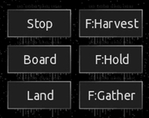</img><br>


[additional.command.buttons.zip](https://github.com/Hecter94/EndlessSky-PluginArchive/releases/download/Latest/additional.command.buttons.zip) | 160.07 kb | 2023-10-17 | [view files](https://github.com/Hecter94/EndlessSky-PluginArchive/tree/main/Working/additional.command.buttons/) <br>
Author: zuckung | Category: Graphics <br>
[https://github.com/zuckung/endless-sky-plugins](https://github.com/zuckung/endless-sky-plugins) (last commit 2023-10-17) <br>

>Made for the mobile version and adds several new buttons to the lower right corner. See the readme for details.
>(inspired by theweirednut)
>
>

<details>
<summary>:blue_book: Plugin readme</summary>
<blockquote>### additional.command.buttons <br>
<br>
Made for the mobile version and changes the interface by adding the following 10 buttons: <br> 
<ul>
<li>full stop</li>
<li>board ship</li>
<li>land on planet</li>
<li>fleet: harvest flotsam</li>
<li>fleet: hold position</li>
<li>fleet: gather around me</li>
<li>fleet: attack my target</li>
<li>fleet: toggle ammo usage</li>
<li>view player info</li>
<li>fast forward</li>
</ul>
and
<ul>
<li>adjusts the message box to not overlap</li>
<li>moved the hidden ammo box to a visible place</li>
</ul>
<br>
(inspired by theweirednut) <br>
<br>

<br>
Allthough most of these commands are now implemented in other parts to the original mobile user interface or can be accessed by gestures, I personally prefer these buttons on the lower right corner.<br>
<br>
Additional there are some functions in this plugin that the original mobile ui can't do at the moment:<br>
- board button cycles through the possibilities <br>
- fleet commands can be used for single ships when selected <br>
<br>
This plugin overwrites `interface "main buttons"` and `interface "hud"`, so it isn't compatible with other plugins modifying these.<br>
<br>
<br>
Changelog:<br>
<br>
2023-10-17<br>
added plugin.txt<br>
<br>
2023-08-24<br>
fixed non-fireing attack button<br>
<br>
2023-08-05<br>
moved the hidden ammo box to a visible place<br>
<br>
2023-08-02<br>
added new icon and reworked readme<br>
<br>
2023-07-26<br>
added 3 more buttons to a total of 10<br>
added descriptions inside script to exchange buttons functions<br>
<br>
2023-07-06<br>
changed 'fire afterburner' to new 'fleet: harvest flotsam', because afterburner can easily toggled by double tapping<br>
</blockquote>
</details>

Status: tested with 0.10.2 <br>
Daily update check: </img><br>


---

### Animated Ships


[Animated.Ships.zip](https://github.com/Hecter94/EndlessSky-PluginArchive/releases/download/Latest/Animated.Ships.zip) | 30.3 mb | 2022-10-06 | [view files](https://github.com/Hecter94/EndlessSky-PluginArchive/tree/main/Working/Animated%20Ships/) <br>
Author: beccabunny | Category: Graphics <br>
[https://github.com/beccabunny/Animated-ships](https://github.com/beccabunny/Animated-ships) (last commit 2020-06-04) <br>

>Adds animations to many ships.
>


Status: N/A <br>
Daily update check: </img><br>


---

### Animated Stars


[Animated.Stars.zip](https://github.com/Hecter94/EndlessSky-PluginArchive/releases/download/Latest/Animated.Stars.zip) | 1.54 mb | 2023-07-27 | [view files](https://github.com/Hecter94/EndlessSky-PluginArchive/tree/main/Working/Animated%20Stars/) <br>
Author: Cat-Lady | Category: Graphics <br>
[https://github.com/Cat-Lady/animated-stars-nova](https://github.com/Cat-Lady/animated-stars-nova) (last commit 2019-11-17) <br>

>Replaces many stars with animated stars.
>


Status: N/A <br>
Daily update check: </img><br>


---

### Colorful Void Sprites


[Colorful.Void.Sprites.zip](https://github.com/Hecter94/EndlessSky-PluginArchive/releases/download/Latest/Colorful.Void.Sprites.zip) | 4.28 kb | 2023-07-27 | [view files](https://github.com/Hecter94/EndlessSky-PluginArchive/tree/main/Working/Colorful%20Void%20Sprites/) <br>
Author: Rob59er | Category: Graphics <br>
[https://github.com/Rob59er/Colorful-Void-Sprites](https://github.com/Rob59er/Colorful-Void-Sprites) (last commit 2021-02-21) <br>

>Makes Void Sprites colorful.
>

<details>
<summary>:blue_book: Plugin readme</summary>
<blockquote># Colorful-Void-Sprites
Adds colorful void sprites to Endless Sky

</blockquote>
</details>

Status: Playable on 0.9.14, 0.9.15 Continuous. <br>
Daily update check: </img><br>


---

### Dark Ships
</img><br>


[Dark.Ships.zip](https://github.com/Hecter94/EndlessSky-PluginArchive/releases/download/Latest/Dark.Ships.zip) | 8.73 mb | 2022-10-06 | [view files](https://github.com/Hecter94/EndlessSky-PluginArchive/tree/main/Working/Dark%20Ships/) <br>
Author: N/A | Category: Graphics <br>
N/A[]()  <br>

>This plugin contains ships rendered with a sharper illumination angle to get more dramatic shadows and less "flat" appearances.
>


Status: Should work <br>
Daily update check: </img><br>


---

### Different Galaxy Plugin


[Different.Galaxy.Plugin.zip](https://github.com/Hecter94/EndlessSky-PluginArchive/releases/download/Latest/Different.Galaxy.Plugin.zip) | 12.36 mb | 2023-07-27 | [view files](https://github.com/Hecter94/EndlessSky-PluginArchive/tree/main/Working/Different%20Galaxy%20Plugin/) <br>
Author: FranchuFranchu | Category: Graphics <br>
[https://github.com/FranchuFranchu/endless-sky-different-galaxy-plugin](https://github.com/FranchuFranchu/endless-sky-different-galaxy-plugin) (last commit 2021-03-02) <br>

>Changes the background galaxy image of Endless Sky to a nicer one.

<details>
<summary>:blue_book: Plugin readme</summary>
<blockquote>This Endless Sky plugin changes the galaxy image to an image of NGC 2336, which I think looks nicer.

Image by Judy Schmidt - NGC 2336, CC BY 2.0, https://commons.wikimedia.org/w/index.php?curid=93254431
</blockquote>
</details>

Status: N/A <br>
Daily update check: </img><br>


---

### easier harvesting


[easier.harvesting.zip](https://github.com/Hecter94/EndlessSky-PluginArchive/releases/download/Latest/easier.harvesting.zip) | 92.25 kb | 2022-10-06 | [view files](https://github.com/Hecter94/EndlessSky-PluginArchive/tree/main/Working/easier%20harvesting/) <br>
Author: Endros Gunderberg | Category: Graphics <br>
[https://github.com/EndrosG/ES-Plugins](https://github.com/EndrosG/ES-Plugins) (last commit 2017-05-28) <br>

>This plugin provides easy to identify images which help you identifying minable asteroids.
>


Status: N/A <br>
Daily update check: </img><br>


---

### EndlessSky_ARUI
</img><br>


[EndlessSky_ARUI.zip](https://github.com/Hecter94/EndlessSky-PluginArchive/releases/download/Latest/EndlessSky_ARUI.zip) | 325.62 kb | 2023-07-27 | [view files](https://github.com/Hecter94/EndlessSky-PluginArchive/tree/main/Working/EndlessSky_ARUI/) <br>
Author: DrZingo | Category: Graphics <br>
[https://github.com/DrZingo/EndlessSky_ARUI](https://github.com/DrZingo/EndlessSky_ARUI) (last commit 2021-05-09) <br>

>A Reorganized User Interface for Endless Sky.
>
>This is a changed user interface when in space.
>
>Most important stuff (bars, weapons, hull/shield, target) is organized in top left corner by the radar.
>
>Destination is now to the right under world / date / money.
>

<details>
<summary>:blue_book: Plugin readme</summary>
<blockquote># A Reorganized User Interface for Endless Sky

This is a changed user interface when in space.

* Most important stuff (bars, weapons, hull/shield, target) is organized in top left corner by the radar.

* Destination is now to the right under world / date / money.


## Installation

Unpack or git clone repo into:

~/.local/share/endless-sky/plugins/

</blockquote>
</details>

Status: N/A <br>
Daily update check: </img><br>


---

### ES Ships


[ES.Ships.zip](https://github.com/Hecter94/EndlessSky-PluginArchive/releases/download/Latest/ES.Ships.zip) | 8.06 mb | 2022-10-06 | [view files](https://github.com/Hecter94/EndlessSky-PluginArchive/tree/main/Working/ES%20Ships/) <br>
Author: Yann | Category: Graphics <br>
N/A[]()  <br>

>Sprites with modified cockpit/bridge.
>


Status: Playable on 0.9.15 Continuous. <br>
Daily update check: </img><br>


---

### High DPI
</img><br>


[High.DPI.zip](https://github.com/Hecter94/EndlessSky-PluginArchive/releases/download/Latest/High.DPI.zip) | 558.06 mb | 2023-10-26 | [view files](https://github.com/Hecter94/EndlessSky-PluginArchive/tree/main/Working/High%20DPI/) <br>
Author: Michael Zahniser (Maintained by the ES Community) | Category: Graphics <br>
[https://github.com/endless-sky/endless-sky-high-dpi](https://github.com/endless-sky/endless-sky-high-dpi) (last commit 2023-10-26) <br>

>Official High-DPI graphics for Endless Sky.
>

<details>
<summary>:blue_book: Plugin readme</summary>
<blockquote># endless-sky-high-dpi

This is a collection of double-resolution sprites for [Endless Sky](https://github.com/endless-sky/endless-sky). To make use of these sprites, copy this folder into one of the two [plugins folders](https://github.com/endless-sky/endless-sky/wiki/CreatingPlugins). These sprites will only be used if:

  * you have set the "zoom factor" to higher than 100% in the preferences, or
  * you have a high-DPI monitor.

High-DPI mode has only been tested on Mac OS X.

</blockquote>
</details>

Status: Playable on 0.9.14, 0.9.15 Continuous. <br>
Daily update check: </img><br>


---

### Human Steering Flares


[Human.Steering.Flares.zip](https://github.com/Hecter94/EndlessSky-PluginArchive/releases/download/Latest/Human.Steering.Flares.zip) | 2.6 kb | 2022-10-06 | [view files](https://github.com/Hecter94/EndlessSky-PluginArchive/tree/main/Working/Human%20Steering%20Flares/) <br>
Author: Ferociousfeind | Category: Graphics <br>
N/A[]()  <br>

>Add steering flare to human ships.
>


Status: Playable on 0.9.14, 0.9.15 Continuous. <br>
Daily update check: </img><br>


---

### Low Quality


[Low.Quality.zip](https://github.com/Hecter94/EndlessSky-PluginArchive/releases/download/Latest/Low.Quality.zip) | 359.6 kb | 2023-07-27 | [view files](https://github.com/Hecter94/EndlessSky-PluginArchive/tree/main/Working/Low%20Quality/) <br>
Author: N/A | Category: Graphics <br>
N/A[]()  <br>

>replaces ship images with lows quality versions
>

<details>
<summary>:blue_book: Plugin readme</summary>
<blockquote>this is just a meme plugin for ESS to be used as a workshop example upon launch, however as so many people are excited to begin developing on it now, i guess i will allow it. 

</blockquote>
</details>

Status: N/A <br>
Daily update check: </img><br>


---

### New Galaxy
</img><br>


[New.Galaxy.zip](https://github.com/Hecter94/EndlessSky-PluginArchive/releases/download/Latest/New.Galaxy.zip) | 7.28 mb | 2022-10-06 | [view files](https://github.com/Hecter94/EndlessSky-PluginArchive/tree/main/Working/New%20Galaxy/) <br>
Author: Lia Gerty | Category: Graphics <br>
N/A[]()  <br>

>This is just a demonstration of the map image that would be used with an expanded core region.  Since it does not include the new systems that would be between Sagittarius A* and human space, Sagittarius A* will appear off centre.
>
>


Status: N/A <br>
Daily update check: </img><br>


---

### Outfit Highlighter
</img><br>


[Outfit.Highlighter.zip](https://github.com/Hecter94/EndlessSky-PluginArchive/releases/download/Latest/Outfit.Highlighter.zip) | 436.04 kb | 2023-07-27 | [view files](https://github.com/Hecter94/EndlessSky-PluginArchive/tree/main/Working/Outfit%20Highlighter/) <br>
Author: MidnightPlugins | Category: Graphics <br>
[https://github.com/MidnightPlugins/Outfit-Highlighter](https://github.com/MidnightPlugins/Outfit-Highlighter) (last commit 2023-01-17) <br>

>Makes the selected outfit stand out more in the outfitter screen. Recommended for those who prefer to navigate the outfitter using the keyboard instead of the mouse.
>

<details>
<summary>:blue_book: Plugin readme</summary>
<blockquote># Outfit-Highlighter

Makes the selected outfit stand out more in the outfitter screen. Recommended for those who prefer to navigate the outfitter using the keyboard instead of the mouse.

![image][image]

[image]: icon.png

https://github.com/MidnightPlugins/Outfit-Highlighter

Now includes alternate themed highlighters! To change highlighters, copy the image file in the subfolder for your chosen theme and paste it into the ui folder of the Outfit Highlighter plugin. (Not the Endless Sky ui folder!)

Description of available themes:

- Alert (color): Four exclamation corner brackets and the grid in the chosen color
- Arrows (color): Four arrows in the corner set to the chosen color
- Cargo Pods: Frame made of Syndicate cargo pods
- Classic Highlighter: The original Outfit Highlighter
- Endless Sky Frames: Frame resembling Endless Sky's menu frames
- Fade to Black: A gray box that fades to black near the top
- Fade to (color): A box of the chosen color that fades to black near the top
- Fluffy Sales Clerks: Two Subsidurials help you shop for outfits
- Hai: Frame made of Hai ship parts
- Mereti: Frame made of Mereti ship parts
- Ringworld: Frame made of Ringworld parts
- Sheragi: Frame made of Sheragi ship parts
- Vanilla Enhanced: Just a slightly bigger vanilla highlighter
- Wanderer: Frame made of Wanderer ship parts

</blockquote>
</details>

Status: N/A <br>
Daily update check: </img><br>


---

### Pi game mods


[Pi.game.mods.zip](https://github.com/Hecter94/EndlessSky-PluginArchive/releases/download/Latest/Pi.game.mods.zip) | 158.06 kb | 2022-11-09 | [view files](https://github.com/Hecter94/EndlessSky-PluginArchive/tree/main/Working/Pi%20game%20mods/) <br>
Author: Pilover100 | Category: Graphics <br>
N/A[]()  <br>

>Pilover100's personal modifications. (Change UI colors to make things more visible. Alternate Wanderer Reactor graphic.)
>


Status: Playable on 0.9.15/0.9.16. <br>
Daily update check: </img><br>


---

### Pug-Hud
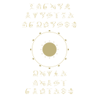</img><br>


[Pug-Hud.zip](https://github.com/Hecter94/EndlessSky-PluginArchive/releases/download/Latest/Pug-Hud.zip) | 458.21 kb | 2023-07-27 | [view files](https://github.com/Hecter94/EndlessSky-PluginArchive/tree/main/Working/Pug-Hud/) <br>
Author: comnom | Category: Graphics <br>
[https://github.com/comnom/es-huds](https://github.com/comnom/es-huds) (last commit 2018-10-20) <br>

>adds a HUD


Status: N/A <br>
Daily update check: </img><br>


---

### Rainbow Pleiades


[Rainbow.Pleiades.zip](https://github.com/Hecter94/EndlessSky-PluginArchive/releases/download/Latest/Rainbow.Pleiades.zip) | 139.64 kb | 2023-07-27 | [view files](https://github.com/Hecter94/EndlessSky-PluginArchive/tree/main/Working/Rainbow%20Pleiades/) <br>
Author: RestingImmortal | Category: Graphics <br>
[https://github.com/RestingImmortal/misc-plugins](https://github.com/RestingImmortal/misc-plugins) (last commit 2019-09-03) <br>

>Turns the galaxy sprite for the pug empty galaxy into a rainbow.

<details>
<summary>:blue_book: Plugin readme</summary>
<blockquote>### Rainbow Pleiades
Turns the galaxy sprite for the pug empty galaxy into a rainbow.

</blockquote>
</details>

Status: Abandoned <br>
Daily update check: </img><br>


---

### Realistic Solar System


[Realistic.Solar.System.zip](https://github.com/Hecter94/EndlessSky-PluginArchive/releases/download/Latest/Realistic.Solar.System.zip) | 9.06 mb | 2023-07-27 | [view files](https://github.com/Hecter94/EndlessSky-PluginArchive/tree/main/Working/Realistic%20Solar%20System/) <br>
Author: beccabunny | Category: Graphics <br>
[https://github.com/beccabunny/Realistic-Solar-System](https://github.com/beccabunny/Realistic-Solar-System) (last commit 2020-08-11) <br>

>This plugin modifies the Sol system adding every planet, large moon (over 20!) and two dwarf planets (Ceres and Pluto with its moon, Charon), each with unique sprites modified from NASA pictures taken during various missions. Everything in Sol has also been resized to a much bigger and realistic size, including the Sun itself.
>

<details>
<summary>:blue_book: Plugin readme</summary>
<blockquote># Realistic-Solar-System
This plugin modifies the Sol system adding every planet, large moon (over 20!) and two dwarf planets (Ceres and Pluto with its moon, Charon), each with unique sprites modified from NASA pictures taken during various missions. Everything in Sol has also been resized to a much bigger and realistic size, including the Sun itself.

In vanilla, the solar system has:
 - 5 planets
 - 5 moons
 - a 90x90 star

With this plugin, it gets:
- 8 planets
- 20 moons
- 2 dwarf planets
- a 450x450 star

And all of this with 31 unique sprites, plus other 30 high DPI ones included in the package!

</blockquote>
</details>

Status: N/A <br>
Daily update check: </img><br>


---

### Resized Endless Sky


[Resized.Endless.Sky.zip](https://github.com/Hecter94/EndlessSky-PluginArchive/releases/download/Latest/Resized.Endless.Sky.zip) | 3.26 mb | 2023-07-27 | [view files](https://github.com/Hecter94/EndlessSky-PluginArchive/tree/main/Working/Resized%20Endless%20Sky/) <br>
Author: FranchuFranchu | Category: Graphics <br>
[https://github.com/FranchuFranchu/resized-endless-sky](https://github.com/FranchuFranchu/resized-endless-sky) (last commit 2021-03-02) <br>

>Resizes the Endless Sky galaxy. 


Status: WIP <br>
Daily update check: </img><br>


---

### Restock


[Restock.zip](https://github.com/Hecter94/EndlessSky-PluginArchive/releases/download/Latest/Restock.zip) | 9.68 mb | 2023-07-27 | [view files](https://github.com/Hecter94/EndlessSky-PluginArchive/tree/main/Working/Restock/) <br>
Author: beccabunny | Category: Graphics <br>
[https://github.com/beccabunny/ES-Restock](https://github.com/beccabunny/ES-Restock) (last commit 2020-12-29) <br>

>A visual mod that improves the look of many vanilla human outfits, either greatly detailing the original model or using a completely new one. Currently including 109 new sprites!
>

<details>
<summary>:blue_book: Plugin readme</summary>
<blockquote># ES-Restock
A visual mod that improves the look of many vanilla human outfits, either greatly detailing the original model or using a completely new one. Currently including 109 new sprites!


</blockquote>
</details>

Status: N/A <br>
Daily update check: </img><br>


---

### swiftclaws.additional.command.buttons
</img><br>


[swiftclaws.additional.command.buttons.zip](https://github.com/Hecter94/EndlessSky-PluginArchive/releases/download/Latest/swiftclaws.additional.command.buttons.zip) | 389.02 kb | 2023-09-25 | [view files](https://github.com/Hecter94/EndlessSky-PluginArchive/tree/main/Working/swiftclaws.additional.command.buttons/) <br>
Author: swiftclaw | Category: Graphics <br>
[https://drive.google.com/file/d/17RstjG7nxM0KzhfwpVh50NrgCO9cQ375/view](https://drive.google.com/file/d/17RstjG7nxM0KzhfwpVh50NrgCO9cQ375/view)  <br>

>Modified version of additional.command.buttons plugin
>
>

<details>
<summary>:blue_book: Plugin readme</summary>
<blockquote>### swiftclaws.additional.command.buttons <br>
<br>


</blockquote>
</details>

Status: tested with 0.10.2 <br>
Daily update check: </img><br>


---

### Swizzle Player


[Swizzle.Player.zip](https://github.com/Hecter94/EndlessSky-PluginArchive/releases/download/Latest/Swizzle.Player.zip) | 48.53 kb | 2023-07-27 | [view files](https://github.com/Hecter94/EndlessSky-PluginArchive/tree/main/Working/Swizzle%20Player/) <br>
Author: Cat-Lady | Category: Graphics <br>
[https://github.com/Cat-Lady/swizzle-player/releases](https://github.com/Cat-Lady/swizzle-player/releases) (last commit 2019-11-02) <br>

>This is a small plugin that allow to change player's swizzle in "Endless Sky" - and keep the colour after ES get updates that change goverments.txt data file.
>
>

<details>
<summary>:blue_book: Plugin readme</summary>
<blockquote>#### This plugin is a part of upcoming "Endless Sky: Captain's Edition" reboot of the base game. Stay tuned - meanwhile, installing the plugins can help to preview the experience, together or in parts.

# Swizzle Player

This is a small plugin that allow to change player's swizzle in "Endless Sky" - and keep the colour after ES get updates that change goverments.txt data file.


## Installing

Check:
https://github.com/Cat-Lady/swizzle-player/releases

...for latest, pre-packaged version.


**1.** Unpack ``swizzle-player`` to your ES plugins folder. Be sure that you have single ``swizzle-player`` directory inside your plugins folder, containing ``data`` folder. Directory structure should look like:

```(...)/plugins/swizzle-player/(.../data/ and other stuff)```


It **won't** work if the directory structure will be anything like:

```(...)/plugins/swizzle-player/swizzle-player/(...)```


## Author

* **Cat Lady**


## License

This project is licensed under the GPL3 License - see the [LICENSE.md](LICENSE.md) file for details

## Acknowledgments

"Endless Sky" Development Team and Michael Zahniser; For maintaining and creating the game

 from "endless Sky" discord forum; For easy way to check swizzle numbers, the bazzilion times I needed to do it in the past.

Iggy Pop for singing "She want's to be your James Bot" (and don't even try to convince me that he meant something else).

</blockquote>
</details>

Status: N/A <br>
Daily update check: </img><br>


---

### Wanderer Suns
</img><br>


[Wanderer.Suns.zip](https://github.com/Hecter94/EndlessSky-PluginArchive/releases/download/Latest/Wanderer.Suns.zip) | 285.29 kb | 2023-07-27 | [view files](https://github.com/Hecter94/EndlessSky-PluginArchive/tree/main/Working/Wanderer%20Suns/) <br>
Author: Gefüllte Taubenbrust | Category: Graphics <br>
[https://github.com/GefullteTaubenbrust2/Wanderer-Suns](https://github.com/GefullteTaubenbrust2/Wanderer-Suns) (last commit 2022-05-15) <br>

>This plugin changes the models of the Wanderer "Sun" reactors so that a sort of "sun" can actually be seen in them.
>

<details>
<summary>:blue_book: Plugin readme</summary>
<blockquote># Wanderer-Suns
This is a plugin for Endless Sky that changes to Wanderer reactors so they actually show small "suns" within them.

</blockquote>
</details>

Status: N/A <br>
Daily update check: </img><br>


</details>


[back to top](https://github.com/Hecter94/EndlessSky-PluginArchive/blob/main/plugins.md#Graphics)


---

## Outfits

<p>44 plugins in this category.<p>

<details>

 

---

### Alternate Human Shields


[Alternate.Human.Shields.zip](https://github.com/Hecter94/EndlessSky-PluginArchive/releases/download/Latest/Alternate.Human.Shields.zip) | 2.76 kb | 2022-10-06 | [view files](https://github.com/Hecter94/EndlessSky-PluginArchive/tree/main/Working/Alternate%20Human%20Shields/) <br>
Author: 1010todd | Category: Outfits <br>
N/A[]()  <br>

>Add alternate version of human shield generator with high regen but long delay to outfitters.
>


Status: Playable on 0.9.15 Continuous. <br>
Daily update check: </img><br>


---

### Androids


[Androids.zip](https://github.com/Hecter94/EndlessSky-PluginArchive/releases/download/Latest/Androids.zip) | 1.33 kb | 2022-10-06 | [view files](https://github.com/Hecter94/EndlessSky-PluginArchive/tree/main/Working/Androids/) <br>
Author: Disiuze | Category: Outfits <br>
[https://github.com/Disiuze/misc-projects](https://github.com/Disiuze/misc-projects) (last commit 2017-02-22) <br>

>This mod reimplements the android but with a few balancing fixes.
>


Status: Playable on 0.9.14, 0.9.15 Continuous. <br>
Daily update check: </img><br>


---

### Androids Rebalanced


[Androids.Rebalanced.zip](https://github.com/Hecter94/EndlessSky-PluginArchive/releases/download/Latest/Androids.Rebalanced.zip) | 18.71 kb | 2023-07-27 | [view files](https://github.com/Hecter94/EndlessSky-PluginArchive/tree/main/Working/Androids%20Rebalanced/) <br>
Author: czartrak | Category: Outfits <br>
[https://github.com/czartrak/Androids-Rebalanced](https://github.com/czartrak/Androids-Rebalanced) (last commit 2017-10-15) <br>

>Adds androids and several outfits for charging them.
>


Status: N/A <br>
Daily update check: </img><br>


---

### Antiquity


[Antiquity.zip](https://github.com/Hecter94/EndlessSky-PluginArchive/releases/download/Latest/Antiquity.zip) | 125.25 kb | 2022-10-06 | [view files](https://github.com/Hecter94/EndlessSky-PluginArchive/tree/main/Working/Antiquity/) <br>
Author: N/A | Category: Outfits <br>
N/A[]()  <br>

>A few antique outfits and weapons scattered across human space. Plunder them from pirates and sell them for a lot of money! Or keep them for yourself, to remind yourself that you have antique stuff!
>


Status: N/A <br>
Daily update check: </img><br>


---

### Artificial Intelligence Outfits


[Artificial.Intelligence.Outfits.zip](https://github.com/Hecter94/EndlessSky-PluginArchive/releases/download/Latest/Artificial.Intelligence.Outfits.zip) | 27.32 kb | 2023-07-26 | [view files](https://github.com/Hecter94/EndlessSky-PluginArchive/tree/main/Working/Artificial%20Intelligence%20Outfits/) <br>
Author: Brent Kerman | Category: Outfits <br>
[https://www.nexusmods.com/endlesssky/mods/6](https://www.nexusmods.com/endlesssky/mods/6)  <br>

>Adds three outfits to outfitters in the Deep that reduce required crew. 
>
>Basic: Replaces one crew member. Takes two bunk space. Makes heat. Costs $50,000. Uses no outfits space.
>
>Improved: Replaces one crew member. Takes one bunk space. Makes less heat. Costs $250,000 Uses no outfits space.
>
>Advanced: Replaces one crew member, overclocks engines and shields slightly. Costs $1,000,000 Uses no outfits space.
>
>Inspired by The Machines are Taking Over, but only has AI units instead of the other things that mod also had.


Status: looks abandoned <br>
Daily update check: </img><br>


---

### Automation


[Automation.zip](https://github.com/Hecter94/EndlessSky-PluginArchive/releases/download/Latest/Automation.zip) | 1.4 kb | 2022-10-06 | [view files](https://github.com/Hecter94/EndlessSky-PluginArchive/tree/main/Working/Automation/) <br>
Author: Disiuze | Category: Outfits <br>
[https://github.com/Disiuze/misc-projects](https://github.com/Disiuze/misc-projects) (last commit 2017-02-22) <br>

>Playable on 0.9.14, 0.9.15 Continuous.Adds an outfit whiich turns ships into automata. Requries you to have more than 2 karma with the Republic.
>


Status: N/A <br>
Daily update check: </img><br>


---

### Better Vanilla Weapons


[Better.Vanilla.Weapons.zip](https://github.com/Hecter94/EndlessSky-PluginArchive/releases/download/Latest/Better.Vanilla.Weapons.zip) | 228.91 kb | 2022-11-05 | [view files](https://github.com/Hecter94/EndlessSky-PluginArchive/tree/main/Working/Better%20Vanilla%20Weapons/) <br>
Author: ZBok | Category: Outfits <br>
N/A[]()  <br>

>Add new weapons.
>


Status: N/A <br>
Daily update check: </img><br>


---

### Dr_Z


[Dr_Z.zip](https://github.com/Hecter94/EndlessSky-PluginArchive/releases/download/Latest/Dr_Z.zip) | 2.29 kb | 2022-10-06 | [view files](https://github.com/Hecter94/EndlessSky-PluginArchive/tree/main/Working/Dr_Z/) <br>
Author: Dr. Z | Category: Outfits <br>
N/A[]()  <br>

>Adds several new outfits, mostly for boarding.
>


Status: Should work. <br>
Daily update check: </img><br>


---

### Endless Cargo


[Endless.Cargo.zip](https://github.com/Hecter94/EndlessSky-PluginArchive/releases/download/Latest/Endless.Cargo.zip) | 33.15 kb | 2023-07-27 | [view files](https://github.com/Hecter94/EndlessSky-PluginArchive/tree/main/Working/Endless%20Cargo/) <br>
Author: Ryan S. Northrup | Category: Outfits <br>
[https://bitbucket.org/YellowApple/endless-cargo/downloads/](https://bitbucket.org/YellowApple/endless-cargo/downloads/)  <br>

>This plugin adds shipping containers and container ships to the game. 
>

<details>
<summary>:blue_book: Plugin readme</summary>
<blockquote># Endless Cargo

## What is it?

It's a plugin/mod for [Endless Sky](http://endless-sky.github.io) which attempts to add shipping containers and container ships to the game.

## How do I install it?

[Download the ZIP file](https://bitbucket.org/YellowApple/endless-cargo/downloads/) and extract it into your plugins folder.  Alternately, you can just `git clone` directly into the plugins folder (e.g. `git clone https://bitbucket.org/YellowApple/endless-cargo.git ~/.local/share/endless-sky/plugins/endless-cargo`).

## How does it work?

The current plan is to implement a shipping container as a sort of unarmed, ~~unpropelled~~ (HAHA, turns out at least *some* propulsion is needed for them to redock if you release them) drone, and in turn to implement a container ship as a sort of drone carrier.  This means that drones and shipping containers are interchangeable.

At this time, one type of container (a generic "Cargo Container") and two container ships (the Star Barge and Freighter without the welded-in containers and with drone bays for one's own containers) are implemented.  There's also a test mission out of Greenrock to haul an empty container to a nearby factory world (like New Britain or Luna), which I plan to flesh out and turn into more missions for more planets (including with specialized container types).  Most (if not all) factory worlds in human space sell containers, and the Container Barge and Container Freighter are available from any "Syndicate Basics" shipyard (and the former from any "Basic Ships" shipyard, so you can grab a Container Barge as your first ship right out of New Boston).

In the distant future, I might opt to attempt to implement containers as their own ship class, or perhaps as something that's not necessarily a "ship" per se.  This would require submitting this as a part of the vanilla game, though; while I think this idea is pretty cool, I'm also fully aware that's it's a *very* niche mod that probably doesn't belong in the core game, in which case - unless the core game opens up the ability to easily define new ship classes - the drone-container approach is probably the best I can do for the time being.

## What kinds of shipping containers will be implemented?

The average container (that is, the kind you'd actually want to buy at a shipyard) would have very little besides a few tons of cargo space and perhaps a smidge of outfit space.  A container ship would in turn have very little cargo or passenger space on its own, but could instead fill itself with shipping containers.

Once the basic shipping mechanics are implemented (namely, a basic container and a basic container ship), I'll likely delve into some missions involving specialized container types.  Some examples:

- Transport 5 containers carrying helicopters to Vail
- Haul 35 families and their prefabricated homes to a trailer park on New Boston
- Deliver 25 mining excavators and 5 portable field offices to a mining operation on Bounty
- etc.

Whether or not these specialized containers are something which you could buy in a shipyard is TBD.  There'd probably be no point to it, though I'm not one to stop someone from wasting money (especially if it's for roleplaying purposes or perhaps to resell somewhere else).

## Ain't this the same thing the Boxwing already does?

Kinda.  Containers are basically the drone version of the Boxwing.  Notable differences:

* Containers are drones, and thus don't require crew
* Containers are drones, and thus take up drone slots instead of fighter slots
* Containers are meant to make Boxwings look like Flivvers in comparison
* Containers have a fraction of the Boxwing's cargo space (currently 25%; I might bump that to 50% once I'm ready to actually dive into balancing)

Additionally, this plugin will feature actual missions/jobs/etc. revolving around container delivery, so it's certainly not limited to just adding a bunch of ships.

## Any gotchas?

* Containers deploy alongside the rest of your fighters and drones, so keep that in mind when you're in the heat of battle.
* Containers added by a container-hauling mission launch separately from your container ship, even if your own fighters/drones/containers are already docked.  This applies to all launches (haven't tested with wormholes yet).  Be sure to wait for your mission-added containers to redock between takeoff and jumping.
* Container-hauling missions currently don't have any multiplier for the number of containers or the distance involved.  [A bug/enhancement report has already been filed to hopefully rectify this.](https://github.com/endless-sky/endless-sky/issues/2569)

## What's the license?

GPLv3, with some CC-BY-SA-4.0 artistic assets.
</blockquote>
</details>

Status: Functional <br>
Daily update check: </img><br>


---

### Epic Outfits


[Epic.Outfits.zip](https://github.com/Hecter94/EndlessSky-PluginArchive/releases/download/Latest/Epic.Outfits.zip) | 247.23 kb | 2023-07-27 | [view files](https://github.com/Hecter94/EndlessSky-PluginArchive/tree/main/Working/Epic%20Outfits/) <br>
Author: TheronEpic | Category: Outfits <br>
[https://github.com/TheronEpic/TheronEpics-Outfits](https://github.com/TheronEpic/TheronEpics-Outfits) (last commit 2020-11-07) <br>

>Several new outfits.
>


Status: Should work <br>
Daily update check: </img><br>


---

### ES Compatability Plugin


[ES.Compatability.Plugin.zip](https://github.com/Hecter94/EndlessSky-PluginArchive/releases/download/Latest/ES.Compatability.Plugin.zip) | 27.02 kb | 2023-07-27 | [view files](https://github.com/Hecter94/EndlessSky-PluginArchive/tree/main/Working/ES%20Compatability%20Plugin/) <br>
Author: lumbar527 | Category: Outfits <br>
[https://github.com/lumbar527/es-compatability-plugin](https://github.com/lumbar527/es-compatability-plugin) (last commit 2023-07-09) <br>

>This plugin is for use on older saves that have deprecated ships or outfits. It will only be useful when deprecated things are removed from Endless Sky.

<details>
<summary>:blue_book: Plugin readme</summary>
<blockquote># ES-Deprecated
A plugin for [Endless Sky](github.com/endless-sky/endless-sky) that holds all deprecated things I can find.

If you find anything this plugin is missing, please post an issue.
</blockquote>
</details>

Status: N/A <br>
Daily update check: </img><br>


---

### Experimental


[Experimental.zip](https://github.com/Hecter94/EndlessSky-PluginArchive/releases/download/Latest/Experimental.zip) | 4.63 kb | 2023-07-27 | [view files](https://github.com/Hecter94/EndlessSky-PluginArchive/tree/main/Working/Experimental/) <br>
Author: N/A | Category: Outfits <br>
N/A[]()  <br>

>adds a 'multidrive'
>


Status: N/A <br>
Daily update check: </img><br>


---

### expert.crew.members
</img><br>


[expert.crew.members.zip](https://github.com/Hecter94/EndlessSky-PluginArchive/releases/download/Latest/expert.crew.members.zip) | 493.63 kb | 2023-10-17 | [view files](https://github.com/Hecter94/EndlessSky-PluginArchive/tree/main/Working/expert.crew.members/) <br>
Author: zuckung | Category: Outfits <br>
[https://github.com/zuckung/endless-sky-plugins](https://github.com/zuckung/endless-sky-plugins) (last commit 2023-10-17) <br>

>Adds unique crew members, aquireable through low chance spaceport missions. These crew members are technically outfits which require a bunk and a salary, but no outfit space or mass. They add, depending on their technology field, stats to your ship. Like shield regenaration, more thrust, more cargo etc. See the readme for details.
>

<details>
<summary>:blue_book: Plugin readme</summary>
<blockquote>### expert.crew.members
<br>
<br>
Adds unique crew members, aquireable through spaceport missions. These crew members are technically outfits which require a bunk and a salary, but no outfit space or mass. They add, depending on their technology field, stats to your ship. Like shield regeneration, more thrust, more cargo etc.<br>
<br>
Currently there are 40 expert crew members. Visit spaceports on human worlds with an outfitter to find the missions(5% chance).<br>
Their technology fields are: combat(4) cooling(5) energy(4) engine(3) fuel(5) hull(3) jamming(4) scanner(4) shield(3) storage(5).<br>
In case you can't afford their daily wage you can store them at the outfitter without daily costs.<br>
They have the positive stats of a medium human outfit, at the cost of a bunk and a daily salery of 2.000 to 5.000 credits. On a small ship they make a huge difference, while on a heavy warship the stats are minor.<br>
See data/crew.list.txt of this plugin for locations, an stat infos.<br>
<br>

<br>
<br>
Changelog:<br>
<br>
2023-10-17<br>
added plugin.txt<br>
<br>
2023-09-30<br>
spread the missions over human space, 5 missions for each area<br>
changed mission chance to 5%<br>
added icons to the missions<br>
reworked files<br>
added 20 more crew members<br>
<br>
2023-09-19<br>
initial release<br>
</blockquote>
</details>

Status: complete <br>
Daily update check: </img><br>


---

### Fighter Factory
</img><br>


[Fighter.Factory.zip](https://github.com/Hecter94/EndlessSky-PluginArchive/releases/download/Latest/Fighter.Factory.zip) | 173.83 kb | 2023-07-27 | [view files](https://github.com/Hecter94/EndlessSky-PluginArchive/tree/main/Working/Fighter%20Factory/) <br>
Author: 1010todd | Category: Outfits <br>
[https://github.com/1010todd/Fighter-Factory](https://github.com/1010todd/Fighter-Factory) (last commit 2023-04-24) <br>

>This plugin add outfits that can produce fighters for you.
> 
>

<details>
<summary>:blue_book: Plugin readme</summary>
<blockquote># Fighter Factory
 Plugin for Endless Sky that allow (some) fighter to be rebuilt to replace lost fighter.

To use buy "XMA03 Fighter Assembler" from an outfitter, buy Universal fighter parts and buy the blueprint for the fighter you want, depart and land then head to the job board to memorize your current number of fighter. Now when a fighter is lost the fighter assembler will build a new fighter for you upon landing.

Should work on 0.9.16.1+

# Download

To download, press the green "Code" button and download as zip. If you're on mobile and cannot see the button, open the page in desktop mode.

</blockquote>
</details>

Status: 0.9.17/Continuous <br>
Daily update check: </img><br>


---

### Gyroscopes


[Gyroscopes.zip](https://github.com/Hecter94/EndlessSky-PluginArchive/releases/download/Latest/Gyroscopes.zip) | 539.7 kb | 2023-07-27 | [view files](https://github.com/Hecter94/EndlessSky-PluginArchive/tree/main/Working/Gyroscopes/) <br>
Author: TheronEpic | Category: Outfits <br>
[https://github.com/TheronEpic/theronepics-gyroscopes](https://github.com/TheronEpic/theronepics-gyroscopes) (last commit 2020-10-23) <br>

>This plugin adds a set of Gyroscopes: They can store an amount of energy, and can produce turning force, despite not taking any engine space. But, they are dense, and constantly consume energy.
>
>In addition, there are Flywheel Batteries: similar to the gyroscopes, except that they are dedicated batteries with no turn rate; much more powerful than a similarly sized battery, but with the mentioned downsides.
>

<details>
<summary>:blue_book: Plugin readme</summary>
<blockquote># theronepics-gyroscopes
This plugin adds a set of Gyroscopes: They can store an amount of energy, and can produce turning force, despite not taking any engine space. But, they are dense, and constantly consume energy.

In addition, there are Flywheel Batteries: similar to the gyroscopes, except that they are dedicated batteries with no turn rate; much more powerful than a similarly sized battery, but with the mentioned downsides.

</blockquote>
</details>

Status: Playable on 0.9.14, 0.9.15 Continuous. <br>
Daily update check: </img><br>


---

### H2H Outfits
</img><br>


[H2H.Outfits.zip](https://github.com/Hecter94/EndlessSky-PluginArchive/releases/download/Latest/H2H.Outfits.zip) | 194.66 kb | 2023-07-27 | [view files](https://github.com/Hecter94/EndlessSky-PluginArchive/tree/main/Working/H2H%20Outfits/) <br>
Author: Timothy Butterworth | Category: Outfits <br>
[https://github.com/tmbutterworth/hand-to-hand-outfits](https://github.com/tmbutterworth/hand-to-hand-outfits) (last commit 2018-09-17) <br>

>A plugin that adds a number of hand-to-hand outfits to increase selection and availability.
>
>Outfits included are: flack vest, tactical armor, stun grenades, tear gas, bolt action rifle, blaster rifle, assault rifle, sidearm, small armory and large armory.
>

<details>
<summary>:blue_book: Plugin readme</summary>
<blockquote># hand-to-hand outfits
This is a plug-in for Endless Sky that adds a number of additional hand-to-hand outfits.

Outfits Include: Flack Vest, Tactical Armor, Stun Grenades, Tear Gas, Bolt Action Rifle, Blaster Rifle, Assault Rifle, Sidearm, Small Armory and Large Armory.

**Flack Vest** - This hand-to-hand outfit provides a navy flack vest it increases capture attack and defense. The current art work being used as concept is from Phil Morley's Plug-in Phils Flavours available in Shields Up.

**Tactical Armor** - This hand-to-hand outfit provides a full suit of tactical body armor including a helmet. It is more expensive than the simple flack vest and provides a higher capture attack and defense. The current art work being used as concept is from Phil Morley's Plug-in Phils Flavours available in Shields Up.

**Stun Grenades** - This hand-to-hand outfit is less expensive and less effective than fragmentation grenades. Unlike Fragmentation Grenades which are only available on pirate worlds stun grenades are available at various outfitters in Republic, Syndicate and Free Worlds space.

**Tear Gas** - This hand-to-hand outfit is more expensive and more effective than fragmentation grenades. Tear gas is available at a few select outfitters.

**Bolt Action Rifle** - This hand-to-hand outfit is the least expensive and least effective. It is sold around the dirt belt purchased mostly by farmers to kill wildlife.

**Blaster Rifle** - This hand-to-hand outfit is less expensive and less effective than the laser rifle. It is produced exclusively by The Syndicate and available at Syndicate outfitters.

**Assault Rifle** - This hand-to-hand outfit is more expensive and more effective than the laser rifle. They are produced primarily for The Navy and are available at a few select outfitters. The current art work being used as concept is from Phil Morley's Plug-in Phils Flavours available in Shields Up.

**Sidearm** - This hand-to-hand outfit is the least expensive and least effective weapon. They are low cost and available almost everywhere. Having them is better than being unarmed.

**Small Armory** - This hand-to-hand outfit provides a selection of readily available offensive and defensive weapons to the crew increasing attack and defense capabilities. The armory takes up mass on the ship. The current art work being used as concept is from Rafael Ramawadh Plug-in Shields Up.

**Large Armory** - This hand-to-hand outfit provides a selection of readily available offensive and defensive weapons to the crew increasing attack and defense capabilities. The armory takes up mass on the ship. The current art work being used as concept is from Rafael Ramawadh Plug-in Shields Up.

No new missions, licenses or events have been added all outfits are available at the start of the game.

</blockquote>
</details>

Status: N/A <br>
Daily update check: </img><br>


---

### Hai Engine


[Hai.Engine.zip](https://github.com/Hecter94/EndlessSky-PluginArchive/releases/download/Latest/Hai.Engine.zip) | 3.34 kb | 2022-10-06 | [view files](https://github.com/Hecter94/EndlessSky-PluginArchive/tree/main/Working/Hai%20Engine/) <br>
Author: Natan Gold | Category: Outfits <br>
N/A[]()  <br>

>adds several hai engines
>


Status: N/A <br>
Daily update check: </img><br>


---

### Hi Quality Stainless Steel Nonstick Pan


[Hi.Quality.Stainless.Steel.Nonstick.Pan.zip](https://github.com/Hecter94/EndlessSky-PluginArchive/releases/download/Latest/Hi.Quality.Stainless.Steel.Nonstick.Pan.zip) | 212.9 kb | 2022-10-06 | [view files](https://github.com/Hecter94/EndlessSky-PluginArchive/tree/main/Working/Hi%20Quality%20Stainless%20Steel%20Nonstick%20Pan/) <br>
Author: N/A | Category: Outfits <br>
N/A[]()  <br>

>adds a station with outfitter, several weapons and other outfits
>


Status: N/A <br>
Daily update check: </img><br>


---

### Human Space Overhaul


[Human.Space.Overhaul.zip](https://github.com/Hecter94/EndlessSky-PluginArchive/releases/download/Latest/Human.Space.Overhaul.zip) | 20.75 kb | 2023-07-27 | [view files](https://github.com/Hecter94/EndlessSky-PluginArchive/tree/main/Working/Human%20Space%20Overhaul/) <br>
Author: Zoura | Category: Outfits <br>
[https://github.com/AvianGeneticist/Human-Space-Overhaul](https://github.com/AvianGeneticist/Human-Space-Overhaul) (last commit 2022-10-31) <br>

>Add new unique outfits for each human governments (FW, Navy, Syndicate).
>

<details>
<summary>:blue_book: Plugin readme</summary>
<blockquote># Human-Space-Overhaul
 Alters Human-Tier Progression and unlocks

This is a progression overhaul focusing on human space, designed to vary human-tier outfits a bit more while also giving incentives to side with each human faction.

# Changelog

The South now has its own anti-missile turrets and sells all civilian shield generators (including two extra large shield generators for their carriers).
The Plasma turret and repeater are now available from the start of the game, however the repeater is locked behind the Militia license. Some free worlds unlocks have been adjusted accordingly.

The plasma repeater has been buffed slightly to make it a more alluring feature of siding with the militia.

The Syndicate now sells enhanced engines, better batteries, regenerators, a larger reactor, an upgraded proton turret and the ionic afterburner, most of which are locked behind a purchaseable license.

The Navy now has its own shield generators and active cooling outfits, both of which are substantially better than their competitors' offerings. Naturally, their outfits are locked behind their own license.

Many southern ships now use the new anti-missiles, and both Syndicate heavy warships use regenerators, their new engines, and their new batteries. Navy ships have been similarly reoutfitted to use their improved technology.

</blockquote>
</details>

Status: Playable on 0.9.15/0.9.16/Continuous. <br>
Daily update check: </img><br>


---

### Hyperdrive Boosters


[Hyperdrive.Boosters.zip](https://github.com/Hecter94/EndlessSky-PluginArchive/releases/download/Latest/Hyperdrive.Boosters.zip) | 32.52 kb | 2022-10-06 | [view files](https://github.com/Hecter94/EndlessSky-PluginArchive/tree/main/Working/Hyperdrive%20Boosters/) <br>
Author: Jafdy | Category: Outfits <br>
N/A[]()  <br>

>adds hyperdrive/scramdrive boosters, increasing the speed at which you can jump.
>


Status: N/A <br>
Daily update check: </img><br>


---

### Incendiary Grenades


[Incendiary.Grenades.zip](https://github.com/Hecter94/EndlessSky-PluginArchive/releases/download/Latest/Incendiary.Grenades.zip) | 84.38 kb | 2022-10-06 | [view files](https://github.com/Hecter94/EndlessSky-PluginArchive/tree/main/Working/Incendiary%20Grenades/) <br>
Author: czartrak | Category: Outfits <br>
[https://github.com/czartrak/Incendiary-Grenades-ES](https://github.com/czartrak/Incendiary-Grenades-ES) (last commit 2020-09-06) <br>

>Adds incendiary grenades as hand to hand outfits.
>


Status: N/A <br>
Daily update check: </img><br>


---

### Korath Automation Upgrade


[Korath.Automation.Upgrade.zip](https://github.com/Hecter94/EndlessSky-PluginArchive/releases/download/Latest/Korath.Automation.Upgrade.zip) | 143.05 kb | 2023-07-27 | [view files](https://github.com/Hecter94/EndlessSky-PluginArchive/tree/main/Working/Korath%20Automation%20Upgrade/) <br>
Author: Kriegstofu | Category: Outfits <br>
[https://github.com/Kriegstofu/Korath-Automation-Upgrade](https://github.com/Kriegstofu/Korath-Automation-Upgrade) (last commit 2018-06-29) <br>

>After the Korath have salvaged the Kor Automata building cores, not only did they begin to replicate automata ships, but they also integrated the best parts of both Kor Factions onto their Korath Raider.
>
>(This takes place after the Co-Op Wanderer/Korath mission and adds a Korath Pillager variant to their raiding fleets.) ("korath raid")
>
>So you might no longer be able to equip captured Kor Automata with jump drives but at least you will be able to get something even better. Has a large amount of crew required to balance its awesomeness
>
>Basically merges the Good of both Mereti and Sestor Ships into one
>
>NOTE: Also makes the Remnant Missions a tad harder if done after the wanderer storyline
>

<details>
<summary>:blue_book: Plugin readme</summary>
<blockquote># Endless Sky Korath Automation Upgrade
A plugin for [Endless Sky][endless-sky] which adds a new Korath Warship after the end of the Korath/Wanderer Co-Op Mission

![image][image]

Easier to capture than a Worldship, this 2.3 Tier Ship is obtainable after aiding the Wanderer/Korath in disabling the Kor Automata.
It does not replace the Korath Raider but rather complements it. If you do the Remnant Storyline after the Wanderer one, you will have an extra challenge with a few of these monstrosities. This Mod adds some challenge after beating the Automata out of Kor Efreti space

[endless-sky]: https://github.com/endless-sky/endless-sky
[image]: MODPIC.jpg

## Installation
You must create a "plugins" folder in one of two places, depending on your operating system:

### Linux ###
* /usr/share/endless-sky/plugins/
* ~/.local/share/endless-sky/plugins/

### Windows ###
* plugins\ (in the same folder as the Endless Sky executable)
* C:\Users\yourusername\AppData\Roaming\endless-sky\plugins\

### Mac OS X ###
* Content/Resources/plugins/ (within the application bundle)
* ~/Library/ApplicationSupport/endless-sky/plugins

Download the latest [release][releases] and extract it into your plugins folder.

More information may be available on the [Endless Sky Wiki][wiki].

[releases]: https://github.com/ItsNickBarry/endless-sky-flamethrower-turret/releases
[wiki]: https://github.com/endless-sky/endless-sky/wiki

</blockquote>
</details>

Status: N/A <br>
Daily update check: </img><br>


---

### MaddreMod


[MaddreMod.zip](https://github.com/Hecter94/EndlessSky-PluginArchive/releases/download/Latest/MaddreMod.zip) | 42.6 kb | 2023-07-27 | [view files](https://github.com/Hecter94/EndlessSky-PluginArchive/tree/main/Working/MaddreMod/) <br>
Author: Maddremor | Category: Outfits <br>
[https://github.com/Maddremor/ES-MaddreMod](https://github.com/Maddremor/ES-MaddreMod) (last commit 2017-05-14) <br>

>Random, unbalanced additions and tweaks for Endless Sky.
>

<details>
<summary>:blue_book: Plugin readme</summary>
<blockquote># ES-MaddreMod
Random, unbalanced additions and tweaks for Endless Sky.

</blockquote>
</details>

Status: N/A <br>
Daily update check: </img><br>


---

### Maurader Pieces


[Maurader.Pieces.zip](https://github.com/Hecter94/EndlessSky-PluginArchive/releases/download/Latest/Maurader.Pieces.zip) | 7.6 kb | 2022-10-06 | [view files](https://github.com/Hecter94/EndlessSky-PluginArchive/tree/main/Working/Maurader%20Pieces/) <br>
Author: N/A | Category: Outfits <br>
N/A[]()  <br>

>adds several new outfits. more weapon space, more hullarmor etc.
>


Status: N/A <br>
Daily update check: </img><br>


---

### Mereti


[Mereti.zip](https://github.com/Hecter94/EndlessSky-PluginArchive/releases/download/Latest/Mereti.zip) | 2.45 kb | 2022-10-06 | [view files](https://github.com/Hecter94/EndlessSky-PluginArchive/tree/main/Working/Mereti/) <br>
Author: N/A | Category: Outfits <br>
N/A[]()  <br>

>This is a small endgame QoL plugin that gives a mission which will unlock Kor Mereti shipyards and outfiters after the point in the story where they become friendly to the player.  The mission can be picked up in the shipyard of Spera Anatrusk.
>

<details>
<summary>:blue_book: Plugin readme</summary>
<blockquote>
This is a small endgame QoL plugin that gives a mission which will unlock Kor Mereti shipyards and outfiters after the point in the story where they become friendly to the player.  The mission can be picked up in the shipyard of Spera Anatrusk.
</blockquote>
</details>

Status: works on 0.10.0 <br>
Daily update check: </img><br>


---

### Missile Expansion


[Missile.Expansion.zip](https://github.com/Hecter94/EndlessSky-PluginArchive/releases/download/Latest/Missile.Expansion.zip) | 6.52 kb | 2022-10-06 | [view files](https://github.com/Hecter94/EndlessSky-PluginArchive/tree/main/Working/Missile%20Expansion/) <br>
Author: N/A | Category: Outfits <br>
N/A[]()  <br>

>adds more antimissiles, missiles and racks.
>


Status: N/A <br>
Daily update check: </img><br>


---

### MultiTech Extra Light


[MultiTech.Extra.Light.zip](https://github.com/Hecter94/EndlessSky-PluginArchive/releases/download/Latest/MultiTech.Extra.Light.zip) | 862.21 kb | 2022-10-06 | [view files](https://github.com/Hecter94/EndlessSky-PluginArchive/tree/main/Working/MultiTech%20Extra%20Light/) <br>
Author: sgtdrew720 | Category: Outfits <br>
[https://github.com/sgtdrew720/MultiTech-Extra-Light-v1.0.0-](https://github.com/sgtdrew720/MultiTech-Extra-Light-v1.0.0-) (last commit 2017-05-13) <br>

>Mod for endless sky adding alien-human tech in systems near the deep
>


Status: N/A <br>
Daily update check: </img><br>


---

### New Droid Regime


[New.Droid.Regime.zip](https://github.com/Hecter94/EndlessSky-PluginArchive/releases/download/Latest/New.Droid.Regime.zip) | 19.11 kb | 2023-07-27 | [view files](https://github.com/Hecter94/EndlessSky-PluginArchive/tree/main/Working/New%20Droid%20Regime/) <br>
Author: czartrak | Category: Outfits <br>
[https://github.com/czartrak/New-Droid-Regime](https://github.com/czartrak/New-Droid-Regime) (last commit 2017-11-13) <br>

>Re-adds NDR-228 Androids at a much higher price. Installing new droids requires a Charging Dock.
>

<details>
<summary>:blue_book: Plugin readme</summary>
<blockquote># New-Droid-Regime
</blockquote>
</details>

Status: N/A <br>
Daily update check: </img><br>


---

### Olden Things


[Olden.Things.zip](https://github.com/Hecter94/EndlessSky-PluginArchive/releases/download/Latest/Olden.Things.zip) | 1.57 mb | 2023-07-27 | [view files](https://github.com/Hecter94/EndlessSky-PluginArchive/tree/main/Working/Olden%20Things/) <br>
Author: RestingImmortal | Category: Outfits <br>
[https://github.com/RestingImmortal/misc-plugins](https://github.com/RestingImmortal/misc-plugins) (last commit 2019-09-03) <br>

>Adds some ancient ES history to the current version of the game as well as makess some changes to the UI. The outfits and ships can be accessed with Ciu Kreo or Omnis, found within Adde.

<details>
<summary>:blue_book: Plugin readme</summary>
<blockquote>### Olden Things
Adds some ancient ES history to the current version of the game as well as makess some changes to the UI. The outfits and ships can be accessed with [Ciu Kreo](https://github.com/RestingImmortal/Ciu-Kreo) or Omnis, found within [Adde](https://github.com/Darcman99/Adde-Endless-Sky).

</blockquote>
</details>

Status: Abandoned <br>
Daily update check: </img><br>


---

### Pilots License
</img><br>


[Pilots.License.zip](https://github.com/Hecter94/EndlessSky-PluginArchive/releases/download/Latest/Pilots.License.zip) | 63.65 kb | 2023-07-27 | [view files](https://github.com/Hecter94/EndlessSky-PluginArchive/tree/main/Working/Pilots%20License/) <br>
Author: Timothy Butterworth | Category: Outfits <br>
[https://github.com/tmbutterworth/pilots-license](https://github.com/tmbutterworth/pilots-license) (last commit 2018-09-18) <br>

>A small plug-in to implement the Pilot's License. All ships that used to not have a license restriction now require a Pilot's License to purchase them.
>

<details>
<summary>:blue_book: Plugin readme</summary>
<blockquote># pilots-license

A small plug-in to implement the Pilot's License. All ships that used to not have a license restriction now require a Pilot's License to purchase them.

The outfit "Pilot's License" states: "Without a pilot's license, you cannot purchase a ship on a Republic planet." This plug-in implements that lore requirement in the game.

</blockquote>
</details>

Status: N/A <br>
Daily update check: </img><br>


---

### Project Technovirus


[Project.Technovirus.zip](https://github.com/Hecter94/EndlessSky-PluginArchive/releases/download/Latest/Project.Technovirus.zip) | 694.28 kb | 2023-07-27 | [view files](https://github.com/Hecter94/EndlessSky-PluginArchive/tree/main/Working/Project%20Technovirus/) <br>
Author: czartrak | Category: Outfits <br>
[https://github.com/czartrak/Project-Technovirus](https://github.com/czartrak/Project-Technovirus) (last commit 2018-12-17) <br>

>adds several outfits and ships
>

<details>
<summary>:blue_book: Plugin readme</summary>
<blockquote># Project-Technovirus

</blockquote>
</details>

Status: N/A <br>
Daily update check: </img><br>


---

### Quarg Outfit Overhaul


[Quarg.Outfit.Overhaul.zip](https://github.com/Hecter94/EndlessSky-PluginArchive/releases/download/Latest/Quarg.Outfit.Overhaul.zip) | 574.44 kb | 2023-07-27 | [view files](https://github.com/Hecter94/EndlessSky-PluginArchive/tree/main/Working/Quarg%20Outfit%20Overhaul/) <br>
Author: N/A | Category: Outfits <br>
N/A[]()  <br>

>changing stats on some quarg outfits
>


Status: N/A <br>
Daily update check: </img><br>


---

### Science Stuff


[Science.Stuff.zip](https://github.com/Hecter94/EndlessSky-PluginArchive/releases/download/Latest/Science.Stuff.zip) | 2.98 kb | 2022-10-06 | [view files](https://github.com/Hecter94/EndlessSky-PluginArchive/tree/main/Working/Science%20Stuff/) <br>
Author: N/A | Category: Outfits <br>
N/A[]()  <br>

>adds some coolers, engines, beam weapons and a hyperdrive.
>


Status: N/A <br>
Daily update check: </img><br>


---

### Ship Modded


[Ship.Modded.zip](https://github.com/Hecter94/EndlessSky-PluginArchive/releases/download/Latest/Ship.Modded.zip) | 786.3 kb | 2023-07-27 | [view files](https://github.com/Hecter94/EndlessSky-PluginArchive/tree/main/Working/Ship%20Modded/) <br>
Author: Beanzilla | Category: Outfits <br>
[https://github.com/Beanzilla/ShipModded](https://github.com/Beanzilla/ShipModded) (last commit 2022-07-12) <br>

>This is a plugin/mod designed to provide special items that "cheat" or "hack" in the game, it allows you to modify just about everything on your ship all within game instead of needing to modify your save file.
>

<details>
<summary>:blue_book: Plugin readme</summary>
<blockquote># Ship Modded

### How do I get this to work?

So you get my plugin by multiple ways...

1. Using `git clone https://github.com/Beanzilla/ShipModded.git` (Recommended so you can use `git pull` to "update")

2. Going to [Git Repo](https://github.com/Beanzilla/ShipModded) and selecting to download it as .zip or .tar.gz or some other compressed file (Not Recommended as it doesn't update easily)

From there locate your Endless Sky Plugins directory...

Linux: `~/.local/share/endless-sky/plugins/`

Windows: `C:\Users\yourusername\AppData\Roaming\endless-sky\plugins\` (Replace yourusername with your PC's username)

Unpack/Unzip/Unrar or move the directory/folder into the Endless Sky Plugins directory...

Then restart Endless Sky if it's already running...

Enjoy!

### What is it?

This is a plugin/mod designed to provide special items that "cheat" or "hack" in the game, it allows you to modify just about everything on your ship all within game instead of needing to modify your save file.

My Primary Goal was so game developers/testers can travel through the game with ease.

My Secondary Goal was to make it so it's "Semi-Balanced" this way someone can still enjoy the original game without needing/depending on my mod/plugin.

My Third Goal was to make it so it's compatible with other plugins/mods that may be installed along side Ship Modded. (Such as All Content)

### License Info

This content uses GPL-3+ Licensing. (Yes we use quite a few of Endless Sky's Images and yes we want to give credit to them, thank you)

### What is added?

Added Outfits:

* AI Crew Replacement
* Anti-Scan Buffer
* Radar Jam Buffer
* Bunks Buffer
* Cargo Buffer
* Outfit Buffer
* Mass Debuffer
* Drag Debuffer
* Engine Buffer
* Weapon Buffer
* Storage Cell
* Energy Cube
* Fuel Cube
* Heat Sink
* Shield Modulator
* Repair Modulator
* Shield Buffer
* Hull Buffer
* Thrust Module
* Small/Medium/Large Frame
* Small/Medium/Large Matrix
* Warp Drive
* War Droid

Modified Outfits:

* You can now buy the Jump Drive from Pirates!

Hidden Outfits:

* Never Destroy (Tired of loosing drones/fighters/ships equip this and never worry again) (DANGER: Yes this is a Hack!)


</blockquote>
</details>

Status: N/A <br>
Daily update check: </img><br>


---

### snowfeather.robotics
</img><br>


[snowfeather.robotics.zip](https://github.com/Hecter94/EndlessSky-PluginArchive/releases/download/Latest/snowfeather.robotics.zip) | 21.55 kb | 2023-10-17 | [view files](https://github.com/Hecter94/EndlessSky-PluginArchive/tree/main/Working/snowfeather.robotics/) <br>
Author: zuckung | Category: Outfits <br>
[https://github.com/zuckung/endless-sky-plugins](https://github.com/zuckung/endless-sky-plugins) (last commit 2023-10-17) <br>

>Adds three missions that lead to adding androids to the outfitter on Snowfeather(Hai space).
>Starts on Snowfeather(Bore Fah) when having at least one android installed. See the readme for details.
>

<details>
<summary>:blue_book: Plugin readme</summary>
<blockquote>### snowfeather.robotics <br>
<br>
<br>
Adds three missions that lead to adding androids to the outfitter on Snowfeather(Hai space). <br>
Starts on Snowfeather(Bore Fah) when having at least one android installed. <br>
<br>
To get an android, which is needed to start this plugin, do the remnant mission 'shattered light 4'. Alternatively my plugin 'more.boarding.missions' give androids as rare reward for boarding pirates.<br>
The new buyable androids are a little bit more expensive than the original ones.<br>
<br>
<br>
Changelog:<br>
<br>
2023-10-17<br>
added plugin.txt<br>
<br>
2023-08-29<br>
removed remnant mission requirement<br>
</blockquote>
</details>

Status: tested with 0.10.2 <br>
Daily update check: </img><br>


---

### Solar Sails
</img><br>


[Solar.Sails.zip](https://github.com/Hecter94/EndlessSky-PluginArchive/releases/download/Latest/Solar.Sails.zip) | 931.02 kb | 2023-07-27 | [view files](https://github.com/Hecter94/EndlessSky-PluginArchive/tree/main/Working/Solar%20Sails/) <br>
Author: TheronEpic | Category: Outfits <br>
[https://github.com/TheronEpic/theronepic-solar-sails](https://github.com/TheronEpic/theronepic-solar-sails) (last commit 2020-10-30) <br>

>TheronEpic's Solar Sails introduces a new type of engine: Solar Sails. They're cheap, have only 25% of their size in mass, produce forward, reverse, and steering thrust, and consume negligable levels of energy.
>


Status: Playable on 0.9.14, 0.9.15 Continuous. <br>
Daily update check: </img><br>


---

### Speed Stabilisers


[Speed.Stabilisers.zip](https://github.com/Hecter94/EndlessSky-PluginArchive/releases/download/Latest/Speed.Stabilisers.zip) | 0.93 kb | 2022-10-06 | [view files](https://github.com/Hecter94/EndlessSky-PluginArchive/tree/main/Working/Speed%20Stabilisers/) <br>
Author: N/A | Category: Outfits <br>
N/A[]()  <br>

>adds 3 outfits modifying mass and drag
>


Status: N/A <br>
Daily update check: </img><br>


---

### Staferfield Mod


[Staferfield.Mod.zip](https://github.com/Hecter94/EndlessSky-PluginArchive/releases/download/Latest/Staferfield.Mod.zip) | 140.57 kb | 2023-07-27 | [view files](https://github.com/Hecter94/EndlessSky-PluginArchive/tree/main/Working/Staferfield%20Mod/) <br>
Author: staferfield | Category: Outfits <br>
[https://github.com/staferfield/ES-Plugins](https://github.com/staferfield/ES-Plugins) (last commit 2018-02-19) <br>

>several new outfits and weapons


Status: N/A <br>
Daily update check: </img><br>


---

### Stargate Mod


[Stargate.Mod.zip](https://github.com/Hecter94/EndlessSky-PluginArchive/releases/download/Latest/Stargate.Mod.zip) | 29.55 mb | 2022-10-06 | [view files](https://github.com/Hecter94/EndlessSky-PluginArchive/tree/main/Working/Stargate%20Mod/) <br>
Author: N/A | Category: Outfits <br>
N/A[]()  <br>

>adds stargate themed outfits to the game
>


Status: N/A <br>
Daily update check: </img><br>


---

### The Machines are Taking Over


[The.Machines.are.Taking.Over.zip](https://github.com/Hecter94/EndlessSky-PluginArchive/releases/download/Latest/The.Machines.are.Taking.Over.zip) | 225.46 kb | 2022-10-06 | [view files](https://github.com/Hecter94/EndlessSky-PluginArchive/tree/main/Working/The%20Machines%20are%20Taking%20Over/) <br>
Author: SpiralCat | Category: Outfits <br>
[https://www.moddb.com/mods/the-machines-are-taking-over](https://www.moddb.com/mods/the-machines-are-taking-over)  <br>

>Adds mechs and some other customization options.
>


Status: N/A <br>
Daily update check: </img><br>


---

### Utili-Pak


[Utili-Pak.zip](https://github.com/Hecter94/EndlessSky-PluginArchive/releases/download/Latest/Utili-Pak.zip) | 393.06 kb | 2022-10-06 | [view files](https://github.com/Hecter94/EndlessSky-PluginArchive/tree/main/Working/Utili-Pak/) <br>
Author: N/A | Category: Outfits <br>
N/A[]()  <br>

>adds the large cargo expansion and modifies the x1000 ion engine. also expands the outfit/cargo space of the 'crate' ship.
>


Status: N/A <br>
Daily update check: </img><br>


---

### wanderer engines


[wanderer.engines.zip](https://github.com/Hecter94/EndlessSky-PluginArchive/releases/download/Latest/wanderer.engines.zip) | 77.69 kb | 2022-10-06 | [view files](https://github.com/Hecter94/EndlessSky-PluginArchive/tree/main/Working/wanderer%20engines/) <br>
Author: N/A | Category: Outfits <br>
N/A[]()  <br>

>adds some wanderer thruster/steering
>


Status: N/A <br>
Daily update check: </img><br>


---

### worker bot


[worker.bot.zip](https://github.com/Hecter94/EndlessSky-PluginArchive/releases/download/Latest/worker.bot.zip) | 17.9 kb | 2022-10-06 | [view files](https://github.com/Hecter94/EndlessSky-PluginArchive/tree/main/Working/worker%20bot/) <br>
Author: N/A | Category: Outfits <br>
N/A[]()  <br>

>adds the "B-35 Worker Bot" which has some cooling effect.
>


Status: N/A <br>
Daily update check: </img><br>


---

### Zoura's Outfits Expanded


[Zoura.s.Outfits.Expanded.zip](https://github.com/Hecter94/EndlessSky-PluginArchive/releases/download/Latest/Zoura.s.Outfits.Expanded.zip) | 251.96 kb | 2023-07-27 | [view files](https://github.com/Hecter94/EndlessSky-PluginArchive/tree/main/Working/Zoura's%20Outfits%20Expanded/) <br>
Author: Zoura | Category: Outfits <br>
[https://github.com/AvianGeneticist/Zoura-s-Outfits-Expanded](https://github.com/AvianGeneticist/Zoura-s-Outfits-Expanded) (last commit 2023-06-27) <br>

>Expands outfit variety across all castes of vanilla Endless Sky.

<details>
<summary>:blue_book: Plugin readme</summary>
<blockquote># Zoura's Outfits Expanded

This plugin aims to greatly expand outfit variety across all of Endless Sky; at the moment, every subfaction (except for the Quarg, Pug, and Drak) has received at least one outfit, though most have received more than that.
Also of note is that care has been made to ensure that outfits are all accessible by at least one means through normal, otherwise-vanilla gameplay (for example, Korath and Gegno outfits can be obtained by looting/capping, Human and Hai outfits via outfitters, et cetera).
The mod also features support for Darcy Manoel's Omnis as well, for those who'd like to cheat- I mean, play around with the outfits in an easily accessible environment.

The primary goal of this plugin is to increase the variety in vanilla's weapon and outfit selection while preserving a "vanilla-ish" level of balance, allowing players to mix plugin and vanilla content to where all-vanilla builds are still viable, but plugin outfits offer unique advantages for certain build types or simply new ways to interact with ship statistics (for example, there are several outfits that allow you to augment the strength of your shields and hull, but with noticeable downsides).

The above said, if something seems a bit too over/underpowered, please don't hesitate to give me a shout, either here on the github (through an issue or a PR of your own) or on discord @zoura3025 (I can also be found on the Endless Sky discord).
This plugin is also accepting community contributions! If you have an outfit you'd like to see implemented in this plugin's (lack of) style, please don't be afraid to drop an issue or PR.
</blockquote>
</details>

Status: N/A <br>
Daily update check: </img><br>


---

### Zweihander


[Zweihander.zip](https://github.com/Hecter94/EndlessSky-PluginArchive/releases/download/Latest/Zweihander.zip) | 4.37 kb | 2022-10-06 | [view files](https://github.com/Hecter94/EndlessSky-PluginArchive/tree/main/Working/Zweihander/) <br>
Author: 1010Todd | Category: Outfits <br>
N/A[]()  <br>

>Add a Zweihander(sword) as H2H. Yes it's useless.
>


Status: outfit is nowhere for sale <br>
Daily update check: </img><br>


</details>


[back to top](https://github.com/Hecter94/EndlessSky-PluginArchive/blob/main/plugins.md#Outfits)


---

## Overhauls

<p>46 plugins in this category.<p>

<details>

 

---

### 3ndless March


[3ndless.March.zip](https://github.com/Hecter94/EndlessSky-PluginArchive/releases/download/Latest/3ndless.March.zip) | 1.99 mb | 2022-10-06 | [view files](https://github.com/Hecter94/EndlessSky-PluginArchive/tree/main/Working/3ndless%20March/) <br>
Author: N/A | Category: Overhauls <br>
N/A[]()  <br>

>3ndless March is a plugin that aims to add lots of advanced and dated technology for all factions
>
>Demo 1.0 Humans and partially Hai got new outfits. Playtesting purposes and typo hunting version
>

<details>
<summary>:blue_book: Plugin readme</summary>
<blockquote>A plug-in that aims to have multiple stories and a lot of advanced and dated outfits from every faction in the game

Versions (lowest is the one you got installed, duh)
Demo 1.0 - An outfit/ship demo without any story at all. Meant for playtest and typo correcting

To buy the outfits go to either "Grey Goose" (Tech1) in the umbara system near Tarazed. "Forge" 1(Adv) jump drive away or "drop point" (Adv) near saggitarius A
</blockquote>
</details>

Status: N/A <br>
Daily update check: </img><br>


---

### 40k Pack
</img><br>


[40k.Pack.zip](https://github.com/Hecter94/EndlessSky-PluginArchive/releases/download/Latest/40k.Pack.zip) | 122.31 mb | 2023-07-27 | [view files](https://github.com/Hecter94/EndlessSky-PluginArchive/tree/main/Working/40k%20Pack/) <br>
Author: 1010Todd | Category: Overhauls <br>
[https://github.com/1010todd/Endless-Sky-40k](https://github.com/1010todd/Endless-Sky-40k) (last commit 2023-03-29) <br>

>Endless Sky 40K plugin adds ships and outfits from Warhammer 40k to Endless Sky!
>
>Currently have:
>-15 Imperial Navy ships + outfits
>-2 Tau ships + outfits
>

<details>
<summary>:blue_book: Plugin readme</summary>
<blockquote># Endless-Sky-40K
 Warhammer 40k mod for Endless Sky
 
 REQUIRES: Endless Sky continuous version after 27 Feb 2022 to work. (Specifically commit dd7c20314c4a35d4017583bf1654891d06f11377)
 


Currently have:

-15 Imperial Navy ships + outfits

-2 Tau ships + outfits

-1 Necron ship + outfits

Currently only Imperial ships and outfits can be purchased at forge world Pifitus at system Pyherrus south of Syndicate space. To access Tau ships and outfits AES Omnis is required.

Notes:
Stats are not 100% accurate to lore, most are somewhat reduced so Endless Sky can handle it, for example the number of crews are significantly reduced, most are slaves and servitors you don't really pay anyway. Mass is reduced so ships do not experience "bounce back" glitch when exiting hyperspace. Ships scales are half-calculated half-eyeballed to be a bit more practical in Endless Sky (tiny) scale. However, worry not about the weapon, they still pack the punch they should.(Thanks to their sheer scale compared to Endless Sky.)

</blockquote>
</details>

Status: in development and playable 0.9.15 continous <br>
Daily update check: </img><br>


---

### A Galaxy Far Far Away


[A.Galaxy.Far.Far.Away.zip](https://github.com/Hecter94/EndlessSky-PluginArchive/releases/download/Latest/A.Galaxy.Far.Far.Away.zip) | 282.33 mb | 2023-09-01 | [view files](https://github.com/Hecter94/EndlessSky-PluginArchive/tree/main/Working/A%20Galaxy%20Far%20Far%20Away/) <br>
Author: Ember369 | Category: Overhauls <br>
[https://github.com/Ember369/Endless-Sky-A-Galaxy-Far-Far-Away](https://github.com/Ember369/Endless-Sky-A-Galaxy-Far-Far-Away) (last commit 2021-11-06) <br>

>A mod designed to replicate Star Wars in Endless Sky.
>

<details>
<summary>:blue_book: Plugin readme</summary>
<blockquote># Endless Sky – A Galaxy Far Far Away (AGFFA)
A Galaxy Far Far Away (AGFFA) is an experimental plugin that brings the Star Wars franchise to Endless Sky (or at least tries to). Adding hundreds of ships, ranging from one-man starfighters to star destroyers or even star dreadnoughts, the plugin encompasses ships from a variety of eras and factions (The Old Republic, the Republic & CIS, the Empire & Rebels, the First Order & Resistance, and even some from Legends).

Currently, the plugin is highly unbalanced, has no existing storyline, has an incomplete galaxy, and is just a fun side project that I occasionally mess around with in my free time.

### Documentation 
(https://www.moddb.com/mods/endless-sky-a-galaxy-far-far-away)

### An important note:
I really don't know if this project will ever be completed (it's not a high priority for me), but I thought I might as well make it available for other people. If anybody would like to update the plugin for themselves, please feel free! I have no idea how Github works, so maybe duplicate the plugin into your own repositories so that I don't have to deal with any of the "pull request" stuff.

Currently, the plugin is unbalanced, buggy and overall frustrating at times, and I honestly don't know if any of these issues will ever be solved. (also please don't bombard me with questions)

– Ember369

"May the Force be with you!"
__________________________________________________________________________________________________
## Notes

### Useful Links:
- https://www.moddb.com/mods/endless-sky-a-galaxy-far-far-away
- https://github.com/Ember369/Endless-Sky-A-Galaxy-Far-Far-Away

### Videos:
- https://www.youtube.com/watch?v=1-_KH3Umhe4
- https://www.youtube.com/watch?v=X0iwpfe96mc

__________________________________________________________________________________________________
### Known Issues:
1) The maximum number of turrets that a ship can have is 32, limiting the capital ships' abilities to fight
2) Starfighter AI struggle to deploy proton bombs properly due to their high drags
3) Similar to vanilla Endless Sky, starfighters can die far too easily
4) I have created both "Starfighter" and "Starfighter (Bay)" versions of each starfighter so that some may be docked while some cannot. This is less than ideal, but works alright
5) Ship balancing in general is pretty terrible at the moment (it's really quite difficult to follow SW lore)
6) Some computers are unable to load AGFFA due to the plugin's absurdly large file size
    
__________________________________________________________________________________________________
### Limitations:
1) The galaxy map is barely complete (only a few systems have been filled, though all of them have been created)
2) I didn't know whether to set the plugin in the Galactic Republic era, the Imperial era, or the New Republic/First Order era. (I added ships from all eras just in case –> including the Old Republic)
3) Outfits & weapons are currently just placeholders since I tried to standardise them just to make it easier for balancing.
4) Missions are currently non-existent (though I have added a few simply for the purposes of making some videos https://www.youtube.com/watch?v=1-_KH3Umhe4)
5) Fleets are also essentially non-existent, though there are a couple around.
6) I'm running out of things to say, but I'm sure some other problems will be discovered at some point.

__________________________________________________________________________________________________
### Adding ships:
The "images/ship" folder contains many ships that have been yet to be added to the plugin. If you wish to add them to the game, follow the steps below:
1) Scale the png. file down to a size that is comparable to the rest of the other ships (just estimate)
2) Use the website (endless-sky.github.io/ship_builder.html) to place engines, turrets and guns.
   Use the "Show Collision Mask" to identify any semi-transparent pixels
3) Add the ship to the corresponding txt. file in the "data" folder, including the correct outfits and hardpoints.
   - For the description, copy & paste from the wookiepedia entry of the ship.
4) Add the ship name to the "data/sales" txt. file.
5) Finished!
</blockquote>
</details>

Status: unfinished but playable <br>
Daily update check: </img><br>


---

### Alphean Boolean's Expansion


[Alphean.Boolean.s.Expansion.zip](https://github.com/Hecter94/EndlessSky-PluginArchive/releases/download/Latest/Alphean.Boolean.s.Expansion.zip) | 11.69 mb | 2023-07-27 | [view files](https://github.com/Hecter94/EndlessSky-PluginArchive/tree/main/Working/Alphean%20Boolean's%20Expansion/) <br>
Author: Amazinite | Category: Overhauls <br>
[https://github.com/Amazinite/alphean-expansion](https://github.com/Amazinite/alphean-expansion) (last commit 2016-08-25) <br>

>This mod adds more ships, outfits, missions and governments to the game.
>


Status: N/A <br>
Daily update check: </img><br>


---

### Altera
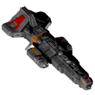</img><br>


[Altera.zip](https://github.com/Hecter94/EndlessSky-PluginArchive/releases/download/Latest/Altera.zip) | 16.08 mb | 2023-07-27 | [view files](https://github.com/Hecter94/EndlessSky-PluginArchive/tree/main/Working/Altera/) <br>
Author: EricD112 | Category: Overhauls <br>
[https://github.com/EricD112/Altera](https://github.com/EricD112/Altera) (last commit 2022-12-28) <br>

>Adds a new civilization to the Ember Wastes: Alterans.  Alterans, like
>Heliarchs, are a Tier 2.5 civilization in the Endless Sky universe.  In total,
>there are about 80 systems related to Alteran territory.
>

<details>
<summary>:blue_book: Plugin readme</summary>
<blockquote><p align=center></p>

<h1><p align=center>Endless Sky Plugin:<br />Altera</p></h1>

This is a plugin for the free, open-source game [Endless Sky][es]. This plugin
is developed and tested against the [Endless Sky continuous][continuous] build.
Learn more [about Endless Sky][esweb].

# About Plugin:

Adds a new civilization to the Ember Wastes: Alterans.  Alterans, like
Heliarchs, are a Tier 2.5 civilization in the Endless Sky universe.  In total,
there are about 80 systems related to Alteran territory.

This plugin:

* Adds Altera-related governments and planets.
* Adds Alteran ships and outfits, which are purchasable on planetary shipyards and outfitters.
* Expands upon the existing map for exploration.

# Development Status: Alpha

* A highly WIP plugin.  Story is planned but not implemented.

[es]: https://github.com/endless-sky/endless-sky
[continuous]: https://github.com/endless-sky/endless-sky/releases/tag/continuous
[esweb]: https://endless-sky.github.io/

</blockquote>
</details>

Status: Playable on 0.9.15 Continuous. <br>
Daily update check: </img><br>


---

### Amalgamation


[Amalgamation.zip](https://github.com/Hecter94/EndlessSky-PluginArchive/releases/download/Latest/Amalgamation.zip) | 42.65 mb | 2023-07-27 | [view files](https://github.com/Hecter94/EndlessSky-PluginArchive/tree/main/Working/Amalgamation/) <br>
Author: demolish238 | Category: Overhauls <br>
[https://github.com/SDer4illl4/ZAmalgamation-Revived](https://github.com/SDer4illl4/ZAmalgamation-Revived) (last commit 2022-07-24) <br>

>A large collection of older plugins that have been edited and modified to work together with the newer versions of Endless Sky and be overall more balanced and lore friendly, along with many unique Amalgamation additions to fill out previous placeholders in these plugins.
>
>The plugins included are: Shields Up, Enclave, Quarg Military Retaliation, ZRemnantX's ships, Tribute Plus, Space Conversion, Businessman, Inheritance ships, KorNewShips, Korath Automation Upgrade, Enigma Corps outfits, Cultures of the Southern Arm ships, Flamethrower Turret and The Machines are Taking Over.
>

<details>
<summary>:blue_book: Plugin readme</summary>
<blockquote># Amalgamation
A large collection of older plugins that have been edited and modified to work together with the newer versions of Endless Sky and be overall more balanced and lore friendly, along with many unique Amalgamation additions to fill out previous placeholders in these plugins.

The plugins included are: Shields Up, Enclave, Quarg Military Retaliation, ZRemnantX's ships, Tribute Plus, Space Conversion, Businessman, Inheritance ships, KorNewShips, Korath Automation Upgrade, Enigma Corps outfits, Cultures of the Southern Arm ships, Flamethrower Turret and The Machines are Taking Over.

General changes include: Adding a large number of ships into vanilla fleets all across the galaxy. Creating multiple new jobs, mercenaries, trade routes and missions to the game. Adding tons of new variants of ships to be used in many of the fleets that allow the new outfits in this plugin to be found naturally through gameplay. Changing the stats of a huge number of ships and outfits for balance and lore purposes. And finally overhauling all the fights in the main storylines to add more variance to the fleets you fight and to make it much harder to use the old stratagy of, "If we have enough ships, they will eventually run out of missiles to kill us with!"

Big thanks to BeccaBunny for the use of their sprites, allowing this plugin to have many unique ships and outfits.

To use this plugin fully, the latest release (9.9), Czartrak's Ship Pack plugin, Beccas expansion and the Adde plugin are needed. 

In addition to this the (Mission Overrides) folders files need to be moved into the "Endless Sky/data" folder and allowed to overright the files there for the campaigns to have the many ships this plugin adds included.

(Make sure to backup the overidden files otherwise only a reinstall will revert the game to the vanilla state!)

https://github.com/czartrak/Czartraks-Ship-Pack

https://github.com/Darcman99/Adde-Endless-Sky

https://github.com/beccabunny/Beccas-Endless-Expansion

Recommended Plugins:

https://github.com/ZBok/BetterVanillaPirates (self explanitory)

https://github.com/tmbutterworth/boarding-missions (makes boarding worth it in human space)

https://github.com/beccabunny/Animated-ships (makes vanilla ships look more interesting)

https://comnom.github.io/Eternals/ (just a high quality self contained plugin that I like)

Used Plugins:

https://github.com/Amazinite/Shields-Up (Shields Up)

https://github.com/Makuta-Miras/The-Enclave/tree/master (Enclave)

https://groups.google.com/forum/#!msg/endless-sky/IkoSYsZgMlQ/ (Quarg Military Retaliation)

https://github.com/Amazinite/Enigma-Corp (Enigma Corps)

https://github.com/Kriegstofu/Korath-Automation-Upgrade (Korath Automation Upgrade)

https://www.nexusmods.com/endlesssky/mods/1 (Space Conversion)

https://github.com/ItsNickBarry/endless-sky-flamethrower-turret (Flamethrower Turret)

https://drive.google.com/file/d/0B2k12Lr3UJnGSExoVW1KblRZVmc/view (Inheritance and The Machines are Taking Over)

https://github.com/Zitchas/ZRemnantX (ZRemnantX)

https://github.com/mdsmestad/ES-COTSA-Pluggin (Cultures of the Southern Arm)

If you have anyfeedback on balance problems or bugs please message me on discord (demolish238#6398)

</blockquote>
</details>

Status: N/A <br>
Daily update check: </img><br>


---

### Babylon 5-the first ones


[Babylon.5-the.first.ones.zip](https://github.com/Hecter94/EndlessSky-PluginArchive/releases/download/Latest/Babylon.5-the.first.ones.zip) | 15.6 mb | 2023-07-27 | [view files](https://github.com/Hecter94/EndlessSky-PluginArchive/tree/main/Working/Babylon%205-the%20first%20ones/) <br>
Author: Ambassador Kosh | Category: Overhauls <br>
[https://www.nexusmods.com/endlesssky/mods/9](https://www.nexusmods.com/endlesssky/mods/9)  <br>

>Goal is to integrate B5 story into endless sky. currently adding new ships, new start and a few weapons.


Status: WIP <br>
Daily update check: </img><br>


---

### Beccas Endless Expansion


[Beccas.Endless.Expansion.zip](https://github.com/Hecter94/EndlessSky-PluginArchive/releases/download/Latest/Beccas.Endless.Expansion.zip) | 6.09 mb | 2023-07-27 | [view files](https://github.com/Hecter94/EndlessSky-PluginArchive/tree/main/Working/Beccas%20Endless%20Expansion/) <br>
Author: Beccabunny | Category: Overhauls <br>
[https://github.com/beccabunny/Beccas-Endless-Expansion](https://github.com/beccabunny/Beccas-Endless-Expansion) (last commit 2022-09-10) <br>

>Add several new ships for various vanilla races with very vanilla-looking sprites (Made by same person who remade several vanilla sprites).
>

<details>
<summary>:blue_book: Plugin readme</summary>
<blockquote># Beccas-Endless-Expansion
New weapons, outfits and ships for many factions of the game Endless Sky, all with new sprites close to the vanilla ones! All you 
have to do is explore, fly in your ship and meet all the factions in the game

Current content:
Two Efreti ships, one oh which with both an empty and full variant, one Exile warship, two Remnant ships, one Wanderer anti missile, one Wanderer large heat sink, two Unfettered weapons, two Unfettered ships, two Unfettered coolings, an Unfettered rifle, a Hai afterburner, one Hai defensive outfit, a Human fuel compressor, a Human generator, one Kraz weapon and two Kraz hand to hand outfits, plus a short mission chain that gives you access to the Kraz hand to hand outfits

</blockquote>
</details>

Status: N/A <br>
Daily update check: </img><br>


---

### Better Vanilla Pirates
</img><br>


[Better.Vanilla.Pirates.zip](https://github.com/Hecter94/EndlessSky-PluginArchive/releases/download/Latest/Better.Vanilla.Pirates.zip) | 101.16 kb | 2023-10-12 | [view files](https://github.com/Hecter94/EndlessSky-PluginArchive/tree/main/Working/Better%20Vanilla%20Pirates/) <br>
Author: ZBok | Category: Overhauls <br>
[https://github.com/ZBok/BetterVanillaPirates](https://github.com/ZBok/BetterVanillaPirates) (last commit 2023-10-12) <br>

>Enhance/improve/fill gaps in many aspects of pirate combat in Human space, especially in the late-game.
>

<details>
<summary>:blue_book: Plugin readme</summary>
<blockquote># Better Vanilla Pirates for Endless Sky

## 2.1

2.0 did not have Mk II Navy ships as they aren't purchasable in vanilla.

However then I realised the Navy License has been a planned part of the game for years, it's intended that player should be able to get access to these ships sooo - I decided to add Mk II Navy ships with no license requirement until the Navy license becomes obtainable in vanilla.

Balance feedback welcome

## 2.0

Human space has a huge and beautiful variety of ships to play with, but when player gets into mid-late game it's hard to justify using them compared to much stronger alien ships. 

2.0 keeps all 1.0 functionality (see below) and adds something new - player can now purchase highly buffed, "Mk II" human ships from New Tortuga after completing a short mission which also gives the player a free Mk II heavy warship as a reward. This is offered at New Tortuga, after player has completed Kestrel missions and FW story.

These Mk II ships have heavily buffed shields/hull, and in most cases slightly buffed outfit/weapon/engine space. They are generally slightly tankier than Hai/Remnant but nowhere near Wanderer/Automata, and they are rather expensive.

The Kestrel Mk II you are able to buy should respect your design choice in the Kestrel missions. The Kestrel Mk II and Dreadnought Mk II are buffed slightly less than the others due to already being relatively strong, and Bactrian is buffed far less due to it already being imba af.

The mission to unlock this stuff is completely optional, and even completing it won't change anything in your game other than allowing you to purchase upgraded ships if you wish. None of the new ships introduced are used by any NPC's, ambient or mission related. Yet.

If you encounter bugs pls report them.

## 1.0 Do you love vanilla ES everything but wish that the human pirates, bounty hunters and related combat missions (spaceport + job board), were a little more interesting, and stayed challenging with worthwhile mission payouts even in the late game?

Like I want to see pirates in Kestrels sometimes. And in military ships even more rarely. And maybe with alien outfits. Also I want to see pirates (and merchants too?) in weird variants like full proton Kestrel or particle Dreadnought or pulse cannon Firebird, etc.

This plugin is designed to enhance/improve/fill gaps in many aspects of pirate combat in Human space, especially in the late-game. It does not contain any new weapons/ships/sprites, or any new or replacement storylines, nor does it make the early game any harder. It achieves all this by the adding the following (POTENTIAL SPOILERS BELOW!)

- Dozens more pirate ship variants including 21 different Kestrel setups (7 for each of the Kestrel choices), like Proton Kestrels, Pulse cannon/Hai Tracker Bactrians and dozens of other combinations, military ships, more Marauder variants, some which have low level alien tech.

- Introduces pirates with Hai+limited Korath exile outfits (heat shunts only), and the Kestrel, and then finally Hai/Korath fitted Kestrels, into ambient pirate/merchant fleets, mission targets (as described above), and the Marauder Bounty Hunted fleet (that Marauder fleet that hunts you down occasionally if your combat rating is high enough).

- Introduces pirates in military ships including Dreadnought, Skein, Frigate, Gunboat after main story completion. You'll see these rarely in ambient fleets and as mission targets.

- *NEW* Minor mission thread with three instalments unlocked at CR9, 10, 11, and more incoming soon (up to CR 13 or 14). These involve a shady NPC who offers you detailed information on unique bounty hunting groups coming to get you. The next few instalments will involve a longer mission finale and unlocking some powerful upgraded human weapons.

- 30+ new combat missions (jobs and spaceport) with tonnes of variety and unusual low-chance variations in human space, complete with corresponding regional NPC assistance in many cases. These new missions include planetary defence, multiple wave planetary defence, nearby pirate blockade destruction and more. They range from 1mil to 20mil payouts, but the toughest jobs require extremely expensive fleets to complete without losses. Some of these involve very big fleet battles so take care!

- Note that no existing missions/jobs are altered, just new ones added. All new missions are repeating and can be declined with no penalty.

- Many new variations of the "Marauder Hunted" mission, the "invisible" mission present in vanilla, where Marauder Bounty Hunters will occasionally hunt you down without warning if your combat rating is high enough. These new variations scale with combat rating, and come in two distinct flavours; small, homogeneous fleets of elite heavy warships with expensive outfit combinations, and larger rag-tag fleets including all types of ships.

- Additions described above that are based on storyline completion or Kestrel mission completion are applied retroactively. This means that you'll see all the changes on a save where you've completed these already, at least after you land once or twice post plugin install.

- *NEW* Now adds Korath Automata raid missions (spaceport) on certain Syndicate systems after the Korath Exiles start producing automata. Just like the Raider Attack missions in vanilla, just with Automata. You can now farm Sestor/Mereti ships post Wanderer storyline!

- Dozens of new pirate variants (new outfit combinations for existing ships).


## How does this actually change my game?

- With this plugin installed, your game will be completely vanilla everywhere early game.

- Once your combat rating gets past 9 (or if it is already), you'll start to see much more difficult combat jobs/spaceport missions, over 30 region specific variations, all over human space, vs new pirate fleet compositions. These missions start off with lots of enemy variety but will see more variation pirate ships and outfits as the main FW storyline and kestrel missions are completed, more detail on that below. The most difficult jobs also have low-chance variations with extra cool NPC assistance!

- As your combat rating continues to increase (up to a CR of 13), tougher and more varied Bounty Hunter fleets will hunt you down, and as above, these fleets become more varied with player progression. The spawn rate of these remains identical to vanilla. These fleets will keep you on your toes at all times in Human space, and force you to keep your combat and cargo/transport ships close or risk losing them. Tougher spaceport/job board missions will be unlocked at each combat rating from 8 to 12.

- After you complete the main FW storyline (or if you've already completed it), you'll start to see merchants and pirates will sometimes be outfit with limited alien tech, and pirates will sometimes be seen in Military ships (Skein, Cruiser, Gunboat etc) in corresponding regions. You'll also start to see alien tech fit Marauder fleets in the new missions as described above.

- After you complete the Kestrel missions (or if you've already completed them), you'll notice merchants and pirates start to occasionally appear in a wide range of Kestrel outfits, in the model that corresponds to your design choice in the Kestrel missions. This means if you choose weapons, you'll see 12 gun pirate Kestrels that actually use them all! Kestrels will also be seen occasionally in the missions described above.

- After you complete both the main FW storyline and Kestrel missions (or if you've already completed them), you'll see the occasional limited alien tech fitted Kestrel, both in ambient merchant/pirate fleets, and in the missions described above.

- Once you complete the Wanderer missions where the Korath Exiles begin using Sestor/Mereti automata as their own, some Syndicate systems will offer spaceport defence missions where the Korath are raiding the system with JD equipped automata! The payouts for these missions are relatively low, but they allow the player to obtain Sestor/Mereti ships after the Wanderer campaign (not possible in vanilla).


The job board/spaceport missions are designed to be quite difficult at times even for large fleets so take care. You may find that human missiles become a serious problem in large numbers, with the large impact force capable of isolating and destroying your escorts with ease, anti-missile turrets may come in very handy.

Please make backups of your pilot file before using this plugin. The changes this plugin makes to fleets (adding pirates/merchants with Hai tech, adding pirate/merchant Kestrels, etc) are stored in your save file. If you remove the plugin, it may not work anymore. Backup your pilot file just in case you don't like this plugin.

Enjoy!
</blockquote>
</details>

Status: N/A <br>
Daily update check: </img><br>


---

### Beyond the Sky


[Beyond.the.Sky.zip](https://github.com/Hecter94/EndlessSky-PluginArchive/releases/download/Latest/Beyond.the.Sky.zip) | 15.48 mb | 2023-08-15 | [view files](https://github.com/Hecter94/EndlessSky-PluginArchive/tree/main/Working/Beyond%20the%20Sky/) <br>
Author: 1010todd | Category: Overhauls <br>
[https://github.com/1010todd/Beyond-the-Sky](https://github.com/1010todd/Beyond-the-Sky) (last commit 2023-08-15) <br>

>Additional ships and reaction to being farmed for high tier alien(Pug, Quarg).
>
>

<details>
<summary>:blue_book: Plugin readme</summary>
<blockquote># Beyond the Sky
 Endless Sky plugin expanding advanced alien contents
 
Requires: Continuous/0.9.17+

 Currently includes:
 
 -New Quarg warships & outfits.
  * Several new ships(mostly warships), most only spawn when hostile enough.
 
 -New Pug warship & outfits:	
  * A few new ships, some only spawn after the Arfecta is defeated.
 
 -Mechanic to adjust fleet strength according to player's strength.

 -Mechanic for Quarg to respond to player hunting them by deploying new ships and sending hunting fleets if the player is nearby.

 -Pug deploying even stronger ship if their Arfecta is defeated or they got annoyed enough.
 
 

</blockquote>
</details>

Status: Continuous/0.9.15+ <br>
Daily update check: </img><br>


---

### Bulkheads-and-Battleships


[Bulkheads-and-Battleships.zip](https://github.com/Hecter94/EndlessSky-PluginArchive/releases/download/Latest/Bulkheads-and-Battleships.zip) | 34.3 kb | 2023-07-27 | [view files](https://github.com/Hecter94/EndlessSky-PluginArchive/tree/main/Working/Bulkheads-and-Battleships/) <br>
Author: Zoura | Category: Overhauls <br>
[https://github.com/AvianGeneticist/Bulkheads-and-Battleships](https://github.com/AvianGeneticist/Bulkheads-and-Battleships) (last commit 2023-05-27) <br>

>Turn Endless Sky into DnD-style RPG.
>

<details>
<summary>:blue_book: Plugin readme</summary>
<blockquote># Bulkheads-and-Battleships
 Turns endless sky into a DnD-style RPG.

</blockquote>
</details>

Status: Playable on 0.10.0 continuous <br>
Daily update check: </img><br>


---

### Civil War


[Civil.War.zip](https://github.com/Hecter94/EndlessSky-PluginArchive/releases/download/Latest/Civil.War.zip) | 57.79 mb | 2023-07-27 | [view files](https://github.com/Hecter94/EndlessSky-PluginArchive/tree/main/Working/Civil%20War/) <br>
Author: kikotheexile | Category: Overhauls <br>
[https://github.com/kikotheexile/Endless-Sky-Civil-War](https://github.com/kikotheexile/Endless-Sky-Civil-War) (last commit 2021-10-03) <br>

>A story-driven variation of the 2015 game Endless Sky, the spiritual successor to Escape Velocity. You can still explore other star systems. Earn money by trading, carrying passengers, or completing missions. Use your earnings to buy a better ship or to upgrade the weapons and engines on your current one. Blow up pirates. But now you can Truly pick a side in the Civil War.
>

<details>
<summary>:blue_book: Plugin readme</summary>
<blockquote>Build instructions:


Linux:

Use your favorite package manager to install the following (version numbers may vary depending on your distribution):

DEB-based distros:
   g++ \
   scons \
   libsdl2-dev \
   libpng-dev \
   libjpeg-dev \
   libgl1-mesa-dev \
   libglew-dev \
   libopenal-dev \
   libmad0-dev

RPM-based distros:
   gcc-c++ \
   scons \
   SDL2-devel \
   libpng-devel \
   libjpeg-turbo-devel \
   mesa-libGL-devel \
   glew-devel \
   openal-soft-devel \
   libmad-devel

You can then just navigate to the source code folder in a terminal and type:

  $ scons
  $ ./endless-sky

The program will run using the "data" and "images" folders that are found in the source code folder itself. For more Linux help, consult the man page (endless-sky.6).


Windows:

The Windows build has been tested on 64-bit Windows 7, only. You will need the Code::Blocks IDE and g++ 4.8 or higher. Code::Blocks is available here:

  http://sourceforge.net/projects/codeblocks/files/Binaries/13.12/Windows/codeblocks-13.12-setup.exe/download

You can install g++ separately through mingw-w64:

  http://sourceforge.net/projects/mingw-w64/files/Toolchains%20targetting%20Win64/Personal%20Builds/mingw-builds/4.8.5/threads-posix/seh/

*** Be sure to install the "pthread" version of MinGW. The "win32-thread" one does not come with support for C++11 threading. If you are using 32-bit Windows, install the compiler for "dwarf" exceptions, not "sjlj." ***

If you are on 64-bit Windows, a full set of development libraries are available here:

  http://endless-sky.github.io/win64-dev.zip

If you don't want to have to edit the paths in the Code::Blocks file, unpack the "dev64" folder directly into C:\.

If you are using 32-bit Windows, a full set of development libraries are available here:

  http://endless-sky.github.io/win32-dev.zip

You will probably need to adjust the paths to your compiler binaries, and you should also switch to the "Win32" build instead of the "Debug" or "Release" build.

You will also need libmingw32.a and libopengl32.a. Those should be included in the MinGW g++ install. If they are not in C:\Program Files\mingw64\x86_64-w64-mingw32\lib\ you will have to adjust the paths in the Code::Blocks file.


Mac OS X:

To build Endless Sky, you will first need to download Xcode from the App Store.

Next, install Homebrew (from http://brew.sh).

ARM Processors:

  If you have an ARM processor, such as the Apple M1, you will need to install an x86_64 version of Homebrew. You can do this by running the normal install command through an `arch` terminal:

  $ arch -x86_64 zsh

  You may find it useful to define an alias that you can use to interact with your x86_64 homebrew:

  alias brex="arch -x86_64 /usr/local/Homebrew/bin/brew"

  Use this alias instead of `brew` in any subsequent homebrew commands.

  Before continuing, make sure that your x86_64 Homebrew install is prefixed to `/usr/local`:

  $ brex --prefix
  /usr/local

Once Homebrew is installed, use it to install the libraries you will need:

  $ brew install pango cairo libpng libjpeg-turbo libmad sdl2

ARM version:

  $ brex install pango cairo libpng libjpg-turbo libmad sdl2

If the versions of those libraries are different from the ones that the Xcode project is set up for, you will need to modify the file paths in the “Frameworks” section in Xcode.

It is possible that you will also need to modify the “Header Search Paths” and “Library Search Paths” in “Build Settings” to point to wherever Homebrew installed those libraries.

Library paths

To create a Mac OS X binary that will work on systems other than your own, you may also need to use install_name_tool to modify the libraries so that their location is relative to the @rpath.

$ sudo install_name_tool -id "@rpath/libpng16.16.dylib" /usr/local/lib/libpng16.16.dylib
$ sudo install_name_tool -id "@rpath/libmad.0.2.1.dylib" /usr/local/lib/libmad.0.2.1.dylib
$ sudo install_name_tool -id "@rpath/libturbojpeg.0.dylib" /usr/local/opt/libjpeg-turbo/lib/libturbojpeg.0.dylib
$ sudo install_name_tool -id "@rpath/libSDL2-2.0.0.dylib" /usr/local/lib/libSDL2-2.0.0.dylib

</blockquote>
</details>

Status: Total conversion mod, will likely function but is outdated, expect issues. <br>
Daily update check: </img><br>


---

### Disable Pack


[Disable.Pack.zip](https://github.com/Hecter94/EndlessSky-PluginArchive/releases/download/Latest/Disable.Pack.zip) | 4.06 kb | 2022-10-06 | [view files](https://github.com/Hecter94/EndlessSky-PluginArchive/tree/main/Working/Disable%20Pack/) <br>
Author: "That Guy" | Category: Overhauls <br>
N/A[]()  <br>

>A small plugin which stops ships destroying everything!
>


Status: N/A <br>
Daily update check: </img><br>


---

### Edge of Endless


[Edge.of.Endless.zip](https://github.com/Hecter94/EndlessSky-PluginArchive/releases/download/Latest/Edge.of.Endless.zip) | 231.41 mb | 2023-07-27 | [view files](https://github.com/Hecter94/EndlessSky-PluginArchive/tree/main/Working/Edge%20of%20Endless/) <br>
Author: Zach Farmer | Category: Overhauls <br>
N/A[]()  <br>

>Large plugin that adds a bunch of stuffs to the galaxy. And lots of big ships.
>


Status: Abandoned, Should be playable on 0.9.14, 0.9.15 Continuous. <br>
Daily update check: </img><br>


---

### Endless Seas
</img><br>


[Endless.Seas.zip](https://github.com/Hecter94/EndlessSky-PluginArchive/releases/download/Latest/Endless.Seas.zip) | 165.55 mb | 2023-07-27 | [view files](https://github.com/Hecter94/EndlessSky-PluginArchive/tree/main/Working/Endless%20Seas/) <br>
Author: Zoura | Category: Overhauls <br>
[https://github.com/AvianGeneticist/Endless-Seas](https://github.com/AvianGeneticist/Endless-Seas) (last commit 2022-10-26) <br>

>A total conversion mod of Endless Sky. The objective of this total conversion is to give Endless Sky a more maritime theme, with all the quirks that come with it. 
>

<details>
<summary>:blue_book: Plugin readme</summary>
<blockquote># Endless-Seas
 I think I picked the wrong "S word"

Jokes aside, welcome to Endless Sea, a total conversion mod of Endless Sky. The objective of this total conversion is to give Endless Sky a more maritime theme, with all the quirks that come with it.

Currently, this is a pre-pre-pre-alpha, and is extremely primitive in all aspects. Please direct all criticism to me; feel free to post reviews in the issues board, or even go ahead and PR your own contributions! I welcome all forms of help, trust me. Be it island images, balance suggestions, and so on; I'm very happy to get others' feedback, especially this early on.

Full tranparency, this is built off of an install of Samrocketman's fork, which can be found here -> https://github.com/samrocketman/endless-sky/tree/continuous-with-plugins

</blockquote>
</details>

Status: Currently, this is a pre-pre-pre-alpha <br>
Daily update check: </img><br>


---

### Endless War The Struggles of the Old Republic


[Endless.War.The.Struggles.of.the.Old.Republic.zip](https://github.com/Hecter94/EndlessSky-PluginArchive/releases/download/Latest/Endless.War.The.Struggles.of.the.Old.Republic.zip) | 18.67 mb | 2023-07-27 | [view files](https://github.com/Hecter94/EndlessSky-PluginArchive/tree/main/Working/Endless%20War%20The%20Struggles%20of%20the%20Old%20Republic/) <br>
Author: ShadowNinja909 | Category: Overhauls <br>
[https://www.moddb.com/mods/endless-war-the-struggles-of-the-old-republic](https://www.moddb.com/mods/endless-war-the-struggles-of-the-old-republic)  <br>

>I've been slowly working on a Star Wars mod set at the beginning of the Great Galactic War between the New Sith Empire and the Galactic Republic, some four thousand years before the battle of Yavin. Right now it is far from complete, though I do have jobs and many factions implement, as well as over 40 complete star systems.


Status: seems abandoned <br>
Daily update check: </img><br>


---

### Endless-Endless-Sky
</img><br>


[Endless-Endless-Sky.zip](https://github.com/Hecter94/EndlessSky-PluginArchive/releases/download/Latest/Endless-Endless-Sky.zip) | 11.09 mb | 2023-09-09 | [view files](https://github.com/Hecter94/EndlessSky-PluginArchive/tree/main/Working/Endless-Endless-Sky/) <br>
Author: 1010Todd | Category: Overhauls <br>
[https://github.com/1010todd/Endless-Endless-Sky](https://github.com/1010todd/Endless-Endless-Sky) (last commit 2023-09-09) <br>

>Python scripts to generate new procedurally generated galaxy. Comes with pre-generated data for instant playing.
>

<details>
<summary>:blue_book: Plugin readme</summary>
<blockquote># Endless Endless Sky
 Procedural generation plugin for open source game [Endless Sky](https://github.com/endless-sky/endless-sky)

 Partially derived from Nucleartaxi's [Endless Sky Generators](https://github.com/Nucleartaxi/endless-sky-generators)

Primarily a script to generate entire galaxy along with its content from systems, governments(aliens) with their own ships fully outfitted with each faction own outfits and even generated ship sprites.


WARNING: Highly experimental, may not stable enough for regular gameplay.

WARNING: Data folder and generated sprites will be reset every update to utilize new features, backup what you like.

## How to use:
 Requires: Python 3.9+, and Pillow 8.4.0+ (For ship sprite generation)
 This plugin can be installed normally like any other plugin. Pre-generated data is provided [here](https://github.com/1010todd/Endless-Endless-Sky/releases/tag/v0.1.0) if you don't want to run the script.
 
 To run the generator, simply run main.py and wait. If success the console will say so and wait for input before closing.
 
 Some part of the generator can be configured, check instructions.txt to see which can be used. (very messy right now, some option works, some don't, will fix later)
 

</blockquote>
</details>

Status: Playable on 0.9.15/0.9.16/Continuous. <br>
Daily update check: </img><br>


---

### Fallen


[Fallen.zip](https://github.com/Hecter94/EndlessSky-PluginArchive/releases/download/Latest/Fallen.zip) | 2.62 mb | 2023-05-30 | [view files](https://github.com/Hecter94/EndlessSky-PluginArchive/tree/main/Working/Fallen/) <br>
Author: Michael Feather | Category: Overhauls <br>
[https://github.com/MrmanNaqa/Endless_Sky_PRP_Fallen](https://github.com/MrmanNaqa/Endless_Sky_PRP_Fallen) (last commit 2022-06-30) <br>

>This mod starts you on an ancient space station that was built by a fallen alien empire. You are the last member of this alien species, and the AI that awoke you has informed you that you have been tasked with reconquering the galaxy. It's a good thing the station you're on doubles as a ship construction yard.
>


Status: revival project with fixes <br>
Daily update check: </img><br>


---

### Galactic War
</img><br>


[Galactic.War.zip](https://github.com/Hecter94/EndlessSky-PluginArchive/releases/download/Latest/Galactic.War.zip) | 161.22 mb | 2023-07-27 | [view files](https://github.com/Hecter94/EndlessSky-PluginArchive/tree/main/Working/Galactic%20War/) <br>
Author: 1010todd | Category: Overhauls <br>
[https://github.com/1010todd/Galactic-War](https://github.com/1010todd/Galactic-War) (last commit 2023-05-28) <br>

>This is a massive content mod about a war in another galaxy. While no storyline exist yet there's a large galaxy to explore filled with various aliens with different advancement and specializations.
>

<details>
<summary>:blue_book: Plugin readme</summary>
<blockquote># Galactic-War
This is a repository for endless sky mod "Galactic War"
The mod is currently in development stage, many things are subjected to changes later on.

Currently the mod requires Endless Sky version 0.9.15+ to work properly.


## About
This is a massive content mod about a war in another galaxy. While no storyline exist yet there's a large galaxy to explore filled with various aliens with different advancement and specializations.

Currently the plugin consist of:

* 1 Accessible galaxy.

* 26+ Races with their own ships and outfits. Some with unique mechanic such as territory changes or even hunt you down depending on your interactions.

* Over 100 Ships,

* Over 600 Outfits,

* Over 1500 Systems.

## Accessing the Contents

To find the galaxy, head up to the system north of Ka'ch'chrai(The capital) in the Wanderer space, the wormhole will be in between Sko'karak and Pug Iyik

This plugin is complatible with Omnis and World Forge developer plugins, though, World Forge support will be missing some functions and may be slightly outdated.

## Known Issues
Galaxy image not appearing. To fix this, turn on "reduce large graphic" option in the setting and restart the game.

Game slowing down when jumping with hyperdrive. Due to the number of systems this plugin add and game's pathfinding, unfortunately the only fix is to get better hardware.

Game slowing down/freezing when escorts have high-range jump drive. Similar reason to above, use shorter-ranged jump drive or don't use escorts.

## Download
To download the lastest (development) version, press the green [code] button and download as zip from this repository.

To install you can extract the zip in your plugin folder.

High-DPI plugin for Galactic War:

For 4k monitors or if ships/outfits look blurry, you can download this plugin for sprites with higher resolution;
https://github.com/1010todd/Galactic-War-hi-dpi

Lite version: (Very Outdated)

This version will have less animation frames and exclude @2x images to reduce memory required to load the plugin. Use this if you're using low end machines or 32 bit machines.
https://mega.nz/file/8QpAAYhJ#H2vVusIAPKdlMZlzVNwTfTwzpV6tYQBsvZDXDdNhB54


## Contact
If you found any bug/issue or have some suggestion, feel free to open an issue here or find me in Endless Sky Community discord server; https://discord.gg/ZeuASSx 

I'll sometime update development progress there in #plugin chat.


</blockquote>
</details>

Status: Playable on 0.9.14, 0.9.15 Continuous. <br>
Daily update check: </img><br>


---

### Galactic War hi-dpi


[Galactic.War.hi-dpi.zip](https://github.com/Hecter94/EndlessSky-PluginArchive/releases/download/Latest/Galactic.War.hi-dpi.zip) | 55.66 mb | 2023-07-27 | [view files](https://github.com/Hecter94/EndlessSky-PluginArchive/tree/main/Working/Galactic%20War%20hi-dpi/) <br>
Author: 1010todd | Category: Overhauls <br>
[https://github.com/1010todd/Galactic-War-hi-dpi](https://github.com/1010todd/Galactic-War-hi-dpi) (last commit 2022-11-12) <br>

>high resolution sprites for endless sky mod "Galactic War"

<details>
<summary>:blue_book: Plugin readme</summary>
<blockquote>
This is a repository for high resolution sprites for endless sky mod "Galactic War"

</blockquote>
</details>

Status: N/A <br>
Daily update check: </img><br>


---

### Humans Alternate Universe


[Humans.Alternate.Universe.zip](https://github.com/Hecter94/EndlessSky-PluginArchive/releases/download/Latest/Humans.Alternate.Universe.zip) | 2.71 mb | 2022-10-06 | [view files](https://github.com/Hecter94/EndlessSky-PluginArchive/tree/main/Working/Humans%20Alternate%20Universe/) <br>
Author: N/A | Category: Overhauls <br>
N/A[]()  <br>

>N/A
>


Status: N/A <br>
Daily update check: </img><br>


---

### Jump to Lightspeed


[Jump.to.Lightspeed.zip](https://github.com/Hecter94/EndlessSky-PluginArchive/releases/download/Latest/Jump.to.Lightspeed.zip) | 1.19 mb | 2023-07-27 | [view files](https://github.com/Hecter94/EndlessSky-PluginArchive/tree/main/Working/Jump%20to%20Lightspeed/) <br>
Author: Krayt Dragon Moddding | Category: Overhauls <br>
[https://www.moddb.com/mods/endless-sky-jump-to-lightspeed](https://www.moddb.com/mods/endless-sky-jump-to-lightspeed)  <br>

>Star Wars mod.
>
>


Status: Abandoned, Should be playable on 0.9.14, 0.9.15 Continuous. <br>
Daily update check: </img><br>


---

### New Sky


[New.Sky.zip](https://github.com/Hecter94/EndlessSky-PluginArchive/releases/download/Latest/New.Sky.zip) | 11.27 mb | 2023-07-27 | [view files](https://github.com/Hecter94/EndlessSky-PluginArchive/tree/main/Working/New%20Sky/) <br>
Author: 1010Todd | Category: Overhauls <br>
[https://github.com/1010todd/ES-New_Sky](https://github.com/1010todd/ES-New_Sky) (last commit 2022-01-21) <br>

>Add a small galaxy with a few alien. Content merged with Galactic War
>

<details>
<summary>:blue_book: Plugin readme</summary>
<blockquote># ES-New_Sky
Repository for an Endless Sky plugin/mod New Sky

Merged with Galactic War plugin:

https://github.com/1010todd/Galactic-War

</blockquote>
</details>

Status: No longer developed. Playable on 0.9.14, 0.9.15 Continuous. <br>
Daily update check: </img><br>


---

### PipMod


[PipMod.zip](https://github.com/Hecter94/EndlessSky-PluginArchive/releases/download/Latest/PipMod.zip) | 24.71 kb | 2022-10-06 | [view files](https://github.com/Hecter94/EndlessSky-PluginArchive/tree/main/Working/PipMod/) <br>
Author: Pipsqueak | Category: Overhauls <br>
N/A[]()  <br>

>a lot of changes to weapons / rebalancing
>


Status: N/A <br>
Daily update check: </img><br>


---

### Pirate Expansion


[Pirate.Expansion.zip](https://github.com/Hecter94/EndlessSky-PluginArchive/releases/download/Latest/Pirate.Expansion.zip) | 4.94 mb | 2023-07-27 | [view files](https://github.com/Hecter94/EndlessSky-PluginArchive/tree/main/Working/Pirate%20Expansion/) <br>
Author: Beccabunny | Category: Overhauls <br>
[https://github.com/beccabunny/Pirate-Expansion](https://github.com/beccabunny/Pirate-Expansion) (last commit 2022-09-10) <br>

>Expand your pirate experience with new ships, outfits, systems and even mechanics! This plugin expands the northern pirate section to a large area, big enough to allow trading or similar activities one could do in the rest of the galaxy. Two new pirate ships are added, a freighter that is by itself capable of jamming the nearby sensors and a middle ground between the Firebird and the Leviathan. Finally, 6 new outfits are added, including two turrets and one special outfit that comes with a special mechanic that is obtainable using a lot of invisible missions.
>
>

<details>
<summary>:blue_book: Plugin readme</summary>
<blockquote># Pirate-Expansion
Expand your pirate experience with new ships, outfits, systems and even mechanics! This plugin expands the northern pirate section to a large area, big enough to allow trading or similar activities one could do in the rest of the galaxy. Two new pirate ships are added, a freighter that is by itself capable of jamming the nearby sensors and a middle ground between the Firebird and the Leviathan. Finally, 6 new outfits are added, including two turrets and one special outfit that comes with a special mechanic that is obtainable using a lot of invisible missions.

</blockquote>
</details>

Status: N/A <br>
Daily update check: </img><br>


---

### Prometeus Flame
</img><br>


[Prometeus.Flame.zip](https://github.com/Hecter94/EndlessSky-PluginArchive/releases/download/Latest/Prometeus.Flame.zip) | 38.51 mb | 2023-07-27 | [view files](https://github.com/Hecter94/EndlessSky-PluginArchive/tree/main/Working/Prometeus%20Flame/) <br>
Author: Delta-Zero | Category: Overhauls <br>
[https://github.com/Delta-Zero/Endless-Sky-Prometeus-Flame-Plugin](https://github.com/Delta-Zero/Endless-Sky-Prometeus-Flame-Plugin) (last commit 2022-10-06) <br>

>Prometeus Flame is a campaign expansion plugin that introduces a new corporation: “Prometeus AT Group” which become vital to the Free worlds war effort.
>The company provides over eight new ships added to the campaign that will be operated exclusively by the FW giving the faction some serious new firepower as well as new missions integrating the Lyria System and its corporation Prometeus into the universe of Endless Sky and lore.
>


Status: WIP, Map Only <br>
Daily update check: </img><br>


---

### Pug Defense
</img><br>


[Pug.Defense.zip](https://github.com/Hecter94/EndlessSky-PluginArchive/releases/download/Latest/Pug.Defense.zip) | 1.11 mb | 2022-10-06 | [view files](https://github.com/Hecter94/EndlessSky-PluginArchive/tree/main/Working/Pug%20Defense/) <br>
Author: Wyrdean | Category: Overhauls <br>
[https://github.com/Wyrdean/Pug-Defense](https://github.com/Wyrdean/Pug-Defense) (last commit 2022-02-04) <br>

>Pug Defense is a small but extremely challenging plugin which adds a system to the south of the galaxy, accessible only by jump drive. In the system, corrupted pug fleets will spawn, extremely hostile and after your blood, however, should you be strong enough, you can challenge the planets and demand tribute. The defenders are like nothing you've ever seen before, including the peak of Pug technology, the Pug Perfecta.
>
>To access the plugin content, first land on any planet to initialize the missions. Then go to the Sard system and jump south from there to a new system, Sylansia Lost. From there, landing on Monolith will begin the quest chain.
>


Status: works on 0.10.0 <br>
Daily update check: </img><br>


---

### Random Expansion


[Random.Expansion.zip](https://github.com/Hecter94/EndlessSky-PluginArchive/releases/download/Latest/Random.Expansion.zip) | 2.42 mb | 2023-07-27 | [view files](https://github.com/Hecter94/EndlessSky-PluginArchive/tree/main/Working/Random%20Expansion/) <br>
Author: Alphean Boolean | Category: Overhauls <br>
[https://github.com/Disiuze/alphean-expansion](https://github.com/Disiuze/alphean-expansion) (last commit 2016-08-25) <br>

>This mod by Alphean Boolean adds more ships, outfits, missions and governments to the game.
>


Status: N/A <br>
Daily update check: </img><br>


---

### Sci-Fi Flavours


[Sci-Fi.Flavours.zip](https://github.com/Hecter94/EndlessSky-PluginArchive/releases/download/Latest/Sci-Fi.Flavours.zip) | 41.33 mb | 2023-07-27 | [view files](https://github.com/Hecter94/EndlessSky-PluginArchive/tree/main/Working/Sci-Fi%20Flavours/) <br>
Author: Linear Perk | Category: Overhauls <br>
[https://github.com/LinearPerk/Sci-Fi-Flavours](https://github.com/LinearPerk/Sci-Fi-Flavours) (last commit 2022-11-06) <br>

>This Plugin contains:
>About 100 new ships
>About 100 new outfits/weapons
>No changes to storyline missions
>More starter ships and increased start money (1 million)
>

<details>
<summary>:blue_book: Plugin readme</summary>
<blockquote># Sci-Fi-Flavours
An Endless Sky plugin.

This is version 1.0 of a Plugin that's intended to gently eventually incorporate all of my favourite science fiction content into Endless Sky.
It's a work in progress but since I am just about to start my first full playthrough of version 1.0 I thought I would share it with the Endless Sky community.

On my first playthrough I will be building a list of balance fixes and making notes on better mission/storyline integration.
If you have feedback I'd love to hear it, especially if you have ideas for balance and or ship variants. So send me your best ship + outfits combinations!
(linearperk@gmail.com)

This Plugin contains:
  - About 100 new ships  
  - About 100 new outfits/weapons
  - No changes to storyline missions
  - More starter ships and increased start money (1 million)

To do list:
  - Hi Res sprites/images
  - Integration with campaign
  - New missions to gradually introduce plugin content
  - Learn how to create new sprites with blender :)
 
# Acknowledgments

I have been playing with, mixing, remixing, and modifying the content and assets from all of the following excellent plugins. I have used them as a guide and in some cases I've taken my favourite content and reproduced it in the Sci-Fi Flavours mod with only small tweaks to balance.  
 
Amazinite/Enigma-Corp 
https://github.com/Amazinite/Enigma-Corp

Amazinite/Shields-Up
https://github.com/Amazinite/Shields-Up

Makuta-Miras/The-Enclave 
https://github.com/Makuta-Miras/The-Enclave/tree/master/data

Kryes-Omega/endless-sky-WestIron
https://github.com/Kryes-Omega/endless-sky-WestIron

toilethinges/Adamas-Project
https://github.com/toilethinges/Adamas-Project

czartrak/Czartraks-Ship-Pack 
https://github.com/czartrak/Czartraks-Ship-Pack

ZBok/BetterVanillaPirates 
https://github.com/ZBok/BetterVanillaPirates

Ember369/Endless-Sky-A-Galaxy-Far-Far-Away 
https://github.com/Ember369/Endless-Sky-A-Galaxy-Far-Far-Away

loiseeer/The-more-ships-plugin 
https://github.com/loiseeer/The-more-ships-plugin

# Artists 
Will credit each ship when I complete the ship descriptions.

Ansel Hsiao / https://fractalsponge.net/

unusualsuspex / https://www.deviantart.com/unusualsuspex

dolynick / https://www.deviantart.com/dolynick

ravendeviant / https://www.deviantart.com/ravendeviant

# Installation

(From the Endless Sky Wiki)
https://endless-sky.fandom.com/wiki/Mods

Installing mods is simple: place the folder containing the mod files in a folder labeled "plugins" in one of the following locations, depending on your operating system.
Linux

    /usr/share/endless-sky/plugins/
    ~/.local/share/endless-sky/plugins/

Windows

    plugins\ (in the same folder as the Endless Sky executable)
    C:\Users\yourusername\AppData\Roaming\endless-sky\plugins\

Mac OS X

    Content/Resources/plugins/ (within the application bundle)
    ~/Library/ApplicationSupport/endless-sky/plugins

The end result should be something like [file-path]\endless-sky\plugins\[plugin-name], which in turn will contain that specific mod's data, images, and sounds folders, and possibly readme and copyright info. 

</blockquote>
</details>

Status: N/A <br>
Daily update check: </img><br>


---

### Shields Up
</img><br>


[Shields.Up.zip](https://github.com/Hecter94/EndlessSky-PluginArchive/releases/download/Latest/Shields.Up.zip) | 12.75 mb | 2023-07-27 | [view files](https://github.com/Hecter94/EndlessSky-PluginArchive/tree/main/Working/Shields%20Up/) <br>
Author: Alphean Boolean | Category: Overhauls <br>
[https://github.com/Disiuze/alphean-expansion](https://github.com/Disiuze/alphean-expansion) (last commit 2016-08-25) <br>

>Say hello to the one and only Shields Up plugin! This iteration of Shields Up is the love-child of quite a few people, as it was worked on by Direstorm and Friendly Neighbor, has a few cool ships from Mdsmestad, was just recently merged with the Alphean's Expansion plugin, and is currently under the care of Derpy Horse.
>Enjoy playing with dozens of new systems, outfits, and ships across the Milky Way galaxy (and beyond...?) as you encounter strange new alien races never before seen by humanity.
>


Status: N/A <br>
Daily update check: </img><br>


---

### ShieldsUp Derpy's Expansion
</img><br>


[ShieldsUp.Derpy.s.Expansion.zip](https://github.com/Hecter94/EndlessSky-PluginArchive/releases/download/Latest/ShieldsUp.Derpy.s.Expansion.zip) | 266.45 kb | 2022-10-06 | [view files](https://github.com/Hecter94/EndlessSky-PluginArchive/tree/main/Working/ShieldsUp%20Derpy's%20Expansion/) <br>
Author: N/A | Category: Overhauls <br>
N/A[]()  <br>

>Derpy's Shields Up Expansion is a temporary addition to Shields Up that brings with it a few outfits that the main plugin does not offer, most notably at the moment outfits that increase your ammunition capacity for secondary weapons. This will eventually be removed.
>


Status: N/A <br>
Daily update check: </img><br>


---

### ShieldsUp Housekeeping
</img><br>


[ShieldsUp.Housekeeping.zip](https://github.com/Hecter94/EndlessSky-PluginArchive/releases/download/Latest/ShieldsUp.Housekeeping.zip) | 5.44 mb | 2022-10-06 | [view files](https://github.com/Hecter94/EndlessSky-PluginArchive/tree/main/Working/ShieldsUp%20Housekeeping/) <br>
Author: N/A | Category: Overhauls <br>
[https://github.com/Amazinite/Shields-Up](https://github.com/Amazinite/Shields-Up) (last commit 2018-06-21) <br>

>Shields Up Housekeeping is a simple plugin meant to go along with the rest of the Shields Up pack to ensure the best Shields Up experience. Although not necessary, it's best to keep this installed, especially for players using pilots that played older versions of Shields Up.
>


Status: N/A <br>
Daily update check: </img><br>


---

### ShieldsUp Legacy


[ShieldsUp.Legacy.zip](https://github.com/Hecter94/EndlessSky-PluginArchive/releases/download/Latest/ShieldsUp.Legacy.zip) | 757.61 kb | 2022-10-06 | [view files](https://github.com/Hecter94/EndlessSky-PluginArchive/tree/main/Working/ShieldsUp%20Legacy/) <br>
Author: Amazinite | Category: Overhauls <br>
[https://github.com/Amazinite/Shields-Up](https://github.com/Amazinite/Shields-Up) (last commit 2018-06-21) <br>

>Shields Up Legacy is a small combination of two of the oldest mods that were in the original Shields Up pack: That Someone and Tufton's plugins.
>That Someone brings with it a whole new faction of Hai who have their own stories and outlooks on the history of the Hai, and a strange new Pug factions that partakes in a perpetual war.
>Tufton adds cool new weapons and an amazing heavy fighter called the Tactical Assault Fighter.
>


Status: N/A <br>
Daily update check: </img><br>


---

### ShieldsUp Override


[ShieldsUp.Override.zip](https://github.com/Hecter94/EndlessSky-PluginArchive/releases/download/Latest/ShieldsUp.Override.zip) | 1.19 mb | 2022-10-06 | [view files](https://github.com/Hecter94/EndlessSky-PluginArchive/tree/main/Working/ShieldsUp%20Override/) <br>
Author: N/A | Category: Overhauls <br>
N/A[]()  <br>

>N/A
>


Status: N/A <br>
Daily update check: </img><br>


---

### ShieldsUp Phils Flavours
</img><br>


[ShieldsUp.Phils.Flavours.zip](https://github.com/Hecter94/EndlessSky-PluginArchive/releases/download/Latest/ShieldsUp.Phils.Flavours.zip) | 13.93 mb | 2022-10-06 | [view files](https://github.com/Hecter94/EndlessSky-PluginArchive/tree/main/Working/ShieldsUp%20Phils%20Flavours/) <br>
Author: Phil Morley | Category: Overhauls <br>
[https://github.com/Amazinite/Shields-Up](https://github.com/Amazinite/Shields-Up) (last commit 2018-06-21) <br>

>Phil's Flavours is the newest addition to the Shields Up pack, and includes dozens of new animated ships and helpful new outfits, all made to look like they fit right in with the game.
>


Status: N/A <br>
Daily update check: </img><br>


---

### ShieldsUp Pompano's Ever Expanding Galaxy
</img><br>


[ShieldsUp.Pompano.s.Ever.Expanding.Galaxy.zip](https://github.com/Hecter94/EndlessSky-PluginArchive/releases/download/Latest/ShieldsUp.Pompano.s.Ever.Expanding.Galaxy.zip) | 1.41 mb | 2022-10-06 | [view files](https://github.com/Hecter94/EndlessSky-PluginArchive/tree/main/Working/ShieldsUp%20Pompano's%20Ever%20Expanding%20Galaxy/) <br>
Author: N/A | Category: Overhauls <br>
[https://github.com/Amazinite/Shields-Up](https://github.com/Amazinite/Shields-Up) (last commit 2018-06-21) <br>

>a new race, several systems, several new ships and outfits
>


Status: N/A <br>
Daily update check: </img><br>


---

### ShieldsUp_ZZOverride


[ShieldsUp_ZZOverride.zip](https://github.com/Hecter94/EndlessSky-PluginArchive/releases/download/Latest/ShieldsUp_ZZOverride.zip) | 1.19 mb | 2022-10-06 | [view files](https://github.com/Hecter94/EndlessSky-PluginArchive/tree/main/Working/ShieldsUp_ZZOverride/) <br>
Author: N/A | Category: Overhauls <br>
N/A[]()  <br>

>N/A
>


Status: N/A <br>
Daily update check: </img><br>


---

### The Empire's March


[The.Empire.s.March.zip](https://github.com/Hecter94/EndlessSky-PluginArchive/releases/download/Latest/The.Empire.s.March.zip) | 170.14 kb | 2022-10-06 | [view files](https://github.com/Hecter94/EndlessSky-PluginArchive/tree/main/Working/The%20Empire's%20March/) <br>
Author: Rushin Neighbour | Category: Overhauls <br>
N/A[]()  <br>

> Tie fighter code
> And
> The imperial system "Kullat"
>


Status: N/A <br>
Daily update check: </img><br>


---

### The Enclave
</img><br>


[The.Enclave.zip](https://github.com/Hecter94/EndlessSky-PluginArchive/releases/download/Latest/The.Enclave.zip) | 6.65 mb | 2023-07-27 | [view files](https://github.com/Hecter94/EndlessSky-PluginArchive/tree/main/Working/The%20Enclave/) <br>
Author: Storm Crow and 1010todd | Category: Overhauls <br>
[https://github.com/1010todd/The-Enclave](https://github.com/1010todd/The-Enclave) (last commit 2022-07-31) <br>

>The Enclave is a story-driven plugin focused on the discovery of an isolated group of humans stranded, hundreds of years ago, in another galaxy. I'd recommend you have a large Tier 2 fleet at least to complete the (admittedly still in-progress) story.
>

<details>
<summary>:blue_book: Plugin readme</summary>
<blockquote># The-Enclave
The Enclave focuses around the discovery of an isolated group of humans in a distant galaxy. Separated from the rest of their species for over half a millennium, how have these people developed?

### Special Thanks
[Derpy Horse](https://github.com/Amazinite) for creating the animated stars.

</blockquote>
</details>

Status: Playable on 0.9.14, 0.9.15 Continuous. <br>
Daily update check: </img><br>


---

### The Enclave High DPI


[The.Enclave.High.DPI.zip](https://github.com/Hecter94/EndlessSky-PluginArchive/releases/download/Latest/The.Enclave.High.DPI.zip) | 7.89 mb | 2023-07-27 | [view files](https://github.com/Hecter94/EndlessSky-PluginArchive/tree/main/Working/The%20Enclave%20High%20DPI/) <br>
Author: Makuta Miras | Category: Overhauls <br>
[https://github.com/Makuta-Miras/The-Enclave-High-DPI](https://github.com/Makuta-Miras/The-Enclave-High-DPI) (last commit 2017-08-16) <br>

>High DPI for The Enclave

<details>
<summary>:blue_book: Plugin readme</summary>
<blockquote># The-Enclave-High-DPI
The Enclave, but with big pretty pictures.

</blockquote>
</details>

Status: N/A <br>
Daily update check: </img><br>


---

### The Final Frontier


[The.Final.Frontier.zip](https://github.com/Hecter94/EndlessSky-PluginArchive/releases/download/Latest/The.Final.Frontier.zip) | 27.66 mb | 2022-10-06 | [view files](https://github.com/Hecter94/EndlessSky-PluginArchive/tree/main/Working/The%20Final%20Frontier/) <br>
Author: William 'Swingfire' | Category: Overhauls <br>
[https://www.indiedb.com/mods/endless-sky-the-final-frontier](https://www.indiedb.com/mods/endless-sky-the-final-frontier)  <br>

>Add Star Trek ships.
>

<details>
<summary>:blue_book: Plugin readme</summary>
<blockquote>=== WELCOME TO ENDLESS SKY: THE FINAL FRONTIER! ===

The Final Frontier Version: 0.0.2 Alpha
Endless Sky Version: 0.9.4

How To Install:

Step 1: Find your Endless Sky directory. If you installed the game through Steam, it should be under Steam\steamapps\common\Endless Sky

Step 2: Create a new folder called 'plugins' (make sure 'plugins' is all lowercase) inside your Endless Sky directory. Be sure to put it in the same place as the folders 'data', 'images', and 'sounds'.

Step 3: Copy or move the folder 'The Final Frontier v0.0.2' from the Zip file to your new 'plugins' folder.

Step 4: Copy the 'credits.txt' file into the Endless Sky folder. Make sure to say 'yes' to the file replacement popup.

Step 5: Run the game and enjoy! Be sure to leave any feedback on the mod's website: http://www.moddb.com/mods/endless-sky-the-final-frontier

=== v0.0.2 - Patch Notes ===

	-Shortened red alert sound effect to two bursts instead of three.
	-Revised governments data file to change swizzle values only.
	-Updated Phaser Cannon projectile sprite
	-Updated Pulse Phaser projectile sprite
	-Updated Impulse Engine sound effect
	-Replaced torpedo impact sound effect
	-Changed the 'fail' sound effect to something shorter
	-Removed the outer two engine hardpoints on the Defiant Class
	-Reworked blast radius, damage, and hit force of all ships.
	-Rewrote Ship Descriptions:
		Oberth Class
	-Modified medium and large final explosion sound effects
	-Modified NX class weapon loadout and capacity
	-Corrected NX class hardpoint positions
	-Revised hull and shield energy system

-= WEBSITES =-

Endless Sky on Steam: http://store.steampowered.com/app/404410/

Endless Sky on Github: https://endless-sky.github.io/

The Final Frontier: http://www.moddb.com/mods/endless-sky-the-final-frontier

</blockquote>
</details>

Status: N/A <br>
Daily update check: </img><br>


---

### Titans


[Titans.zip](https://github.com/Hecter94/EndlessSky-PluginArchive/releases/download/Latest/Titans.zip) | 10.43 mb | 2022-10-06 | [view files](https://github.com/Hecter94/EndlessSky-PluginArchive/tree/main/Working/Titans/) <br>
Author: N/A | Category: Overhauls <br>
N/A[]()  <br>

>N/A
>


Status: N/A <br>
Daily update check: </img><br>


---

### too.many.asteroids
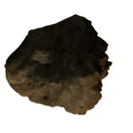</img><br>


[too.many.asteroids.zip](https://github.com/Hecter94/EndlessSky-PluginArchive/releases/download/Latest/too.many.asteroids.zip) | 17.85 kb | 2023-10-17 | [view files](https://github.com/Hecter94/EndlessSky-PluginArchive/tree/main/Working/too.many.asteroids/) <br>
Author: zuckung | Category: Overhauls <br>
[https://github.com/zuckung/endless-sky-plugins](https://github.com/zuckung/endless-sky-plugins) (last commit 2023-10-17) <br>

>Removes all non-mineable asteroids from all systems. Mineable asteroids and asteroid belts are untouched.
>Increases game performance. See the readme for details.

<details>
<summary>:blue_book: Plugin readme</summary>
<blockquote>### too.many.asteroids <br>
<br>
<br>
Removes all non-mineable asteroids from all systems. Mineable asteroids and asteroid belts are untouched. <br>
Increases game performance.<br>
<br>
<br>
Every of the 552 base game systems(0.10.2) is edited via remove command for full compatibility with other system altering plugins. A total of 2654 asteroid entries got removed.<br>
In case i won't update this plugin to the newest game version, a python script for generating an updated plugin can be found <a href="https://github.com/zuckung/endless-sky-plugins/blob/main/tools/too_many_asteroids_plugin_script">here</a>.<br>
<br>
<br>
Changelog:<br>
<br>
2023-10-17<br>
added plugin.txt<br>
<br>
2023-09-01<br>
added new icon.png<br>
reworked readme<br>
removed py script<br>
<br>
2023-06-17<br>
updated to 0.10.1<br>
added a python script which generates the asteroids.txt(in case I don't update this mod, everyone can do it in no time.)<br>
</blockquote>
</details>

Status: tested with 0.10.2 <br>
Daily update check: </img><br>


---

### Undisclosed Plugin


[Undisclosed.Plugin.zip](https://github.com/Hecter94/EndlessSky-PluginArchive/releases/download/Latest/Undisclosed.Plugin.zip) | 8.17 mb | 2023-07-27 | [view files](https://github.com/Hecter94/EndlessSky-PluginArchive/tree/main/Working/Undisclosed%20Plugin/) <br>
Author: petervdmeer | Category: Overhauls <br>
[https://github.com/petervdmeer/endless-sky-undisclosed-plugin](https://github.com/petervdmeer/endless-sky-undisclosed-plugin) (last commit 2023-01-23) <br>

>Various concept ideas.
>

<details>
<summary>:blue_book: Plugin readme</summary>
<blockquote># endless-sky-undisclosed-plugin
Plugin with content for Endless sky that is not suitable or not ready yet for PR/release to the main game.

</blockquote>
</details>

Status: N/A <br>
Daily update check: </img><br>


---

### unique.fix
</img><br>


[unique.fix.zip](https://github.com/Hecter94/EndlessSky-PluginArchive/releases/download/Latest/unique.fix.zip) | 202.5 kb | 2023-10-17 | [view files](https://github.com/Hecter94/EndlessSky-PluginArchive/tree/main/Working/unique.fix/) <br>
Author: zuckung | Category: Overhauls <br>
[https://github.com/zuckung/endless-sky-plugins](https://github.com/zuckung/endless-sky-plugins) (last commit 2023-10-17) <br>

>Removes mass and outfit space from some uniques, puts others into unique category, or gives a png if there isn't one. See the readme for details.

<details>
<summary>:blue_book: Plugin readme</summary>
<blockquote>### unique.fix
<br>
<br>
Removes mass and outfit space from some uniques, puts others into unique category, or gives a png if there isn't one. See the readme for details.<br>
<br>
<br>
<ul>
<li> Removes mass and outfit space from the cloaking device. </li>
<li> Removes mass and outfit space from outskirts gauger and puts it in unique category. </li>
<li> Gives outfit '"Puny"' a portrait. </li>
<li> Puts outfit 'Mug' into unique category and gives it a portrait </li>
</ul>

<br>
<br>
Changelog:<br>
<br>
2023-10-17<br>
added plugin.txt<br>
<br>
2023-8-31<br>
added 'Mug' to unique category and added a portrait<br>
changed puny portrait<br>
changed icon.png<br>
</blockquote>
</details>

Status: tested with 0.10.2 <br>
Daily update check: </img><br>


---

### XtraStuf


[XtraStuf.zip](https://github.com/Hecter94/EndlessSky-PluginArchive/releases/download/Latest/XtraStuf.zip) | 10.15 mb | 2023-08-22 | [view files](https://github.com/Hecter94/EndlessSky-PluginArchive/tree/main/Working/XtraStuf/) <br>
Author: Ishaname | Category: Overhauls <br>
[https://www.nexusmods.com/endlesssky/mods/8](https://www.nexusmods.com/endlesssky/mods/8)  <br>

>Just a simple plugin that adds a few things. Ships, Weapons, Quests, Asteroids, Engines. You know, the works.	


Status: N/A <br>
Daily update check: </img><br>


</details>


[back to top](https://github.com/Hecter94/EndlessSky-PluginArchive/blob/main/plugins.md#Overhauls)


---

## Overwrites

<p>4 plugins in this category.<p>

<details>

 

---

### Custom Landscapes


[Custom.Landscapes.zip](https://github.com/Hecter94/EndlessSky-PluginArchive/releases/download/Latest/Custom.Landscapes.zip) | 52.0 mb | 2023-06-03 | [view files](https://github.com/Hecter94/EndlessSky-PluginArchive/tree/main/Working/Custom%20Landscapes/) <br>
Author: hikeemt | Category: Overwrites <br>
[https://www.nexusmods.com/endlesssky/mods/5?](https://www.nexusmods.com/endlesssky/mods/5?)  <br>

>This mod replaces many landscape pictures to make planets look more alien. 
>


Status: N/A <br>
Daily update check: </img><br>


---

### Custom Portraits


[Custom.Portraits.zip](https://github.com/Hecter94/EndlessSky-PluginArchive/releases/download/Latest/Custom.Portraits.zip) | 2.75 mb | 2023-06-03 | [view files](https://github.com/Hecter94/EndlessSky-PluginArchive/tree/main/Working/Custom%20Portraits/) <br>
Author: hikeemt | Category: Overwrites <br>
[https://www.nexusmods.com/endlesssky/mods/4](https://www.nexusmods.com/endlesssky/mods/4)  <br>

>129 custom portraits that override the generic ones in the base game files.  I wanted to have a better variety of people talking to me at the Spaceport bar--something that would make me feel like I'm flying across the galaxy for adventure. 
>


Status: N/A <br>
Daily update check: </img><br>


---

### EndlessSky Sounds


[EndlessSky.Sounds.zip](https://github.com/Hecter94/EndlessSky-PluginArchive/releases/download/Latest/EndlessSky.Sounds.zip) | 9.57 mb | 2023-07-27 | [view files](https://github.com/Hecter94/EndlessSky-PluginArchive/tree/main/Working/EndlessSky%20Sounds/) <br>
Author: pphotography | Category: Overwrites <br>
[https://github.com/pphotography/EndlessSky_Sounds](https://github.com/pphotography/EndlessSky_Sounds) (last commit 2020-05-30) <br>

>Sounds for Endless Sky 

<details>
<summary>:blue_book: Plugin readme</summary>
<blockquote># Endless Sky Sounds
This is a sound repository for Endless Sky. All sounds created from scratch with my DAW and some VST instruments and effects.

License for all files is CC-BY-SA-4.0
https://creativecommons.org/licenses/by/4.0/

Files should be downsampled to fit into the game's requirements

</blockquote>
</details>

Status: N/A <br>
Daily update check: </img><br>


---

### Nerf This Sound Replacer


[Nerf.This.Sound.Replacer.zip](https://github.com/Hecter94/EndlessSky-PluginArchive/releases/download/Latest/Nerf.This.Sound.Replacer.zip) | 10.32 mb | 2022-10-06 | [view files](https://github.com/Hecter94/EndlessSky-PluginArchive/tree/main/Working/Nerf%20This%20Sound%20Replacer/) <br>
Author: N/A | Category: Overwrites <br>
N/A[]()  <br>

>This mod replaces all vanilla Endless Sky sounds with the best part of "Nerf This"
>

<details>
<summary>:blue_book: Plugin readme</summary>
<blockquote>This mod replaces all vanilla Endless Sky sounds with the best part of "Nerf This"

Installation:

1. Make a backup of your sounds folder

2. Drop the sounds folder of this mod into your Endless Sky directory and overwrite

Made by Sergalicious
</blockquote>
</details>

Status: N/A <br>
Daily update check: </img><br>


</details>


[back to top](https://github.com/Hecter94/EndlessSky-PluginArchive/blob/main/plugins.md#Overwrites)


---

## Patches

<p>3 plugins in this category.<p>

<details>

 

---

### Mega Freight ZHO


[Mega.Freight.ZHO.zip](https://github.com/Hecter94/EndlessSky-PluginArchive/releases/download/Latest/Mega.Freight.ZHO.zip) | 2.69 kb | 2022-11-05 | [view files](https://github.com/Hecter94/EndlessSky-PluginArchive/tree/main/Working/Mega%20Freight%20ZHO/) <br>
Author: 1010Todd | Category: Patches <br>
N/A[]()  <br>

>Compatibility bridge for Mega Freight and Zoura's Human Space Overhaul plugins; Allowing Mega Freight ships to use contents from Zoura's Human Space Overhaul
>


Status: N/A <br>
Daily update check: </img><br>


---

### zFleet Patch


[zFleet.Patch.zip](https://github.com/Hecter94/EndlessSky-PluginArchive/releases/download/Latest/zFleet.Patch.zip) | 7.27 kb | 2022-10-06 | [view files](https://github.com/Hecter94/EndlessSky-PluginArchive/tree/main/Working/zFleet%20Patch/) <br>
Author: 1010Todd | Category: Patches <br>
N/A[]()  <br>

>Patch for playing with (nearly) all plugins in this archive at the same time making plugin-added fleet variants appear and include several plugin ships not included with a fleet to a fleet.
>WARNING: May accidentally spawn the wrong Kraken.
>


Status: N/A <br>
Daily update check: </img><br>


---

### zFW Patch


[zFW.Patch.zip](https://github.com/Hecter94/EndlessSky-PluginArchive/releases/download/Latest/zFW.Patch.zip) | 6.34 kb | 2022-10-06 | [view files](https://github.com/Hecter94/EndlessSky-PluginArchive/tree/main/Working/zFW%20Patch/) <br>
Author: N/A | Category: Patches <br>
N/A[]()  <br>

>Something in these hundreds of plugin prevent FW missions from offering, this fixes that.
>


Status: N/A <br>
Daily update check: </img><br>


</details>


[back to top](https://github.com/Hecter94/EndlessSky-PluginArchive/blob/main/plugins.md#Patches)


---

## Races

<p>62 plugins in this category.<p>

<details>

 

---

### Adamas Project
</img><br>


[Adamas.Project.zip](https://github.com/Hecter94/EndlessSky-PluginArchive/releases/download/Latest/Adamas.Project.zip) | 17.86 mb | 2023-07-27 | [view files](https://github.com/Hecter94/EndlessSky-PluginArchive/tree/main/Working/Adamas%20Project/) <br>
Author: toiletthings | Category: Races <br>
[https://github.com/kestrel1110/Adamas-Project](https://github.com/kestrel1110/Adamas-Project) (last commit 2023-07-05) <br>

>The Adamas Project is a medium-sized plugin introducing two alien species and their regions of space, as well as some storyline involving the two.
>

<details>
<summary>:blue_book: Plugin readme</summary>
<blockquote># The Adamas Project
The Adamas Project is a plugin for Endless Sky, a free, open-source 2D space game.

This plugin has been abandoned by the original developer (toilethinges); there is now an updated version on Bereskatuket's fork:
https://github.com/kestrel1110/Adamas-Project

</blockquote>
</details>

Status: N/A <br>
Daily update check: </img><br>


---

### AES Fallen
</img><br>


[AES.Fallen.zip](https://github.com/Hecter94/EndlessSky-PluginArchive/releases/download/Latest/AES.Fallen.zip) | 885.37 kb | 2023-07-27 | [view files](https://github.com/Hecter94/EndlessSky-PluginArchive/tree/main/Working/AES%20Fallen/) <br>
Author: Darcy Manoel | Category: Races <br>
N/A[]()  <br>

>Inspired by an old and unfortunately unfinished fan favourite plugin that offered truly unique content. While this might not mimic the original in design, hopefully it can stoke a similarly unique experience.
>

<details>
<summary>:blue_book: Plugin readme</summary>
<blockquote># Adde Fallen
> Inspired by an old and unfortunately unfinished fan favourite plugin that offered truly unique content. While this might not mimic the original in design, hopefully it can stoke a similarly unique experience.

</blockquote>
</details>

Status: N/A <br>
Daily update check: </img><br>


---

### Akasha Chronicles
</img><br>


[Akasha.Chronicles.zip](https://github.com/Hecter94/EndlessSky-PluginArchive/releases/download/Latest/Akasha.Chronicles.zip) | 8.29 mb | 2023-07-27 | [view files](https://github.com/Hecter94/EndlessSky-PluginArchive/tree/main/Working/Akasha%20Chronicles/) <br>
Author: jchamlin | Category: Races <br>
[https://github.com/jchamlin/akasha-chronicles](https://github.com/jchamlin/akasha-chronicles) (last commit 2020-07-25) <br>

>Akasha Chronicles is a progressive storyline giving you access to new technology and ships over time. You can start the storyline in the Kor Efret Space (the nice Koraths) after you finish the Wanderers storyline. 
>
>

<details>
<summary>:blue_book: Plugin readme</summary>
<blockquote># Akasha Chronicles
A plugin for [Endless Sky][endless-sky] that adds a complete storyline with new alien factions.

Original author: Gillax.
Original source: https://www.reddit.com/r/endlesssky/comments/5lw3oy/plugin_akasha_chronicles_release/

![image][image]

[endless-sky]: https://github.com/endless-sky/endless-sky
[image]: images/planet/akasha.png

Akasha Chronicles is a progressive storyline giving you access to new technology and ships over time.

Featuring:
* New Goverments
* 16 New Ships
* 30 New Outfits and Weapons
* Storyline with around 30 Missions with lots of dialog and choices (hope you will make the right ones)
* 40 New Systems, Planets, Land and event sprites to bring a fitting atmosphere for the story (google images)
* Some hidden outfits which you can get during missions (going places you perhaps shouldn't)
* Changing Environment

You can start the storyline in the Kor Efret Space (the nice Koraths) after you finish the Wanderers storyline. 
The difficulty should be a good fit for people who are done with the Wanderers storyline.

## Installation
You must create a "plugins" folder in one of two places, depending on your operating system:

### Linux ###
* /usr/share/endless-sky/plugins/
* ~/.local/share/endless-sky/plugins/

### Windows ###
* plugins\ (in the same folder as the Endless Sky executable)
* C:\Users\yourusername\AppData\Roaming\endless-sky\plugins\

### Mac OS X ###
* Content/Resources/plugins/ (within the application bundle)
* ~/Library/ApplicationSupport/endless-sky/plugins

Download the latest [release][releases] and extract it into your plugins folder.

More information may be available on the [Endless Sky Wiki][wiki].

[releases]: https://github.com/jchamlin/akasha-chronicles/releases
[wiki]: https://github.com/endless-sky/endless-sky/wiki

</blockquote>
</details>

Status: N/A <br>
Daily update check: </img><br>


---

### Akashic War


[Akashic.War.zip](https://github.com/Hecter94/EndlessSky-PluginArchive/releases/download/Latest/Akashic.War.zip) | 9.78 mb | 2023-07-27 | [view files](https://github.com/Hecter94/EndlessSky-PluginArchive/tree/main/Working/Akashic%20War/) <br>
Author: EricD112 | Category: Races <br>
[https://github.com/EricD112/Akashic-War](https://github.com/EricD112/Akashic-War) (last commit 2021-03-20) <br>

>Akashic War is a reworked/updated version of the Akasha Chronicles plugin for Endless Sky by Reddit u/Giliax. 
>


Status: N/A <br>
Daily update check: </img><br>


---

### Alpha Wars


[Alpha.Wars.zip](https://github.com/Hecter94/EndlessSky-PluginArchive/releases/download/Latest/Alpha.Wars.zip) | 19.9 kb | 2023-07-27 | [view files](https://github.com/Hecter94/EndlessSky-PluginArchive/tree/main/Working/Alpha%20Wars/) <br>
Author: Storm Crow and warp-core | Category: Races <br>
[https://github.com/Makuta-Miras/ES-Alpha-Wars](https://github.com/Makuta-Miras/ES-Alpha-Wars) (last commit 2016-11-21) <br>

>Adds some outfits and ships for a planned Alpha Wars overhaul.
>

<details>
<summary>:blue_book: Plugin readme</summary>
<blockquote># ES-Alpha-Wars
A massive mod for Endless Sky completely overhauling the game to put the player at the heart of the Alpha Wars.

</blockquote>
</details>

Status: abandoned <br>
Daily update check: </img><br>


---

### Ancient Saryds


[Ancient.Saryds.zip](https://github.com/Hecter94/EndlessSky-PluginArchive/releases/download/Latest/Ancient.Saryds.zip) | 3.76 mb | 2023-05-30 | [view files](https://github.com/Hecter94/EndlessSky-PluginArchive/tree/main/Working/Ancient%20Saryds/) <br>
Author: Zoura | Category: Races <br>
N/A[]()  <br>

>This is a plugin that adds a historic sect of the Saryd species, divorced from the Coalition and the Heliarchs that govern it. Discover their steam engines and great "Trainships" in this somewhat story-driven plugin.
>


Status: Playable on 0.10.0 continuous <br>
Daily update check: </img><br>


---

### Arbiter


[Arbiter.zip](https://github.com/Hecter94/EndlessSky-PluginArchive/releases/download/Latest/Arbiter.zip) | 81.17 kb | 2023-07-27 | [view files](https://github.com/Hecter94/EndlessSky-PluginArchive/tree/main/Working/Arbiter/) <br>
Author: czartrak | Category: Races <br>
[https://github.com/czartrak/es-arbiter](https://github.com/czartrak/es-arbiter) (last commit 2018-02-08) <br>

>This mod adds another civilization called "Arbiter" into the game. To start the storyline, one has to complete the main story as well as make contact with the Quarg, Wanderers, Hai, Korath, Coalition, and has to be equipped with a jump drive. Then find a system called "Wolf" somewhear around the Free Worlds space. When you get to the Wolf system, the story will be pretty much self-explanatory.
>

<details>
<summary>:blue_book: Plugin readme</summary>
<blockquote># Arbiter mod for Endless Sky

This mod adds another civilization called "Arbiter" into the game.
To start the storyline, one has to complete the main story as well as make contact with the Quarg, Wanderers, Hai, Korath, Coalition, and has to be equipped with a jump drive. Then find a system called "Wolf" somewhear around the Free Worlds space.
When you get to the Wolf system, the story will be pretty much self-explanatory.

(check out the wiki for more information: https://github.com/Derekcz/es-arbiter/wiki)

</blockquote>
</details>

Status: N/A <br>
Daily update check: </img><br>


---

### Arena of the worthy


[Arena.of.the.worthy.zip](https://github.com/Hecter94/EndlessSky-PluginArchive/releases/download/Latest/Arena.of.the.worthy.zip) | 1.9 mb | 2023-07-27 | [view files](https://github.com/Hecter94/EndlessSky-PluginArchive/tree/main/Working/Arena%20of%20the%20worthy/) <br>
Author: RisingLeaf | Category: Races <br>
[https://github.com/RisingLeaf/Arena-of-the-Worthy/tree/main](https://github.com/RisingLeaf/Arena-of-the-Worthy/tree/main) (last commit 2022-11-26) <br>

>This plugin adds a new species, the Impeti. They are even more advanced than the Drak and they found no happiness in scientific progress. Instead they started searching for the most capable person in the galaxy and find out how they achieve happiness. Therefore they started the Arena of the Worthy, where a few individuum of each species battle for honor and very special gifts.
>

<details>
<summary>:blue_book: Plugin readme</summary>
<blockquote>
</blockquote>
</details>

Status: REQUIRES PR #7348. Either wait for it to be merged or use ESLauncher2 to download the PR. <br>
Daily update check: </img><br>


---

### Arion
</img><br>


[Arion.zip](https://github.com/Hecter94/EndlessSky-PluginArchive/releases/download/Latest/Arion.zip) | 2.94 mb | 2023-10-24 | [view files](https://github.com/Hecter94/EndlessSky-PluginArchive/tree/main/Working/Arion/) <br>
Author: Spectre907YT | Category: Races <br>
[https://github.com/Spectre907YT/Endless-Sky---Arion](https://github.com/Spectre907YT/Endless-Sky---Arion) (last commit 2023-10-24) <br>

>Adds a faction (or 2) that supplies real life fighters and other interesting stuff.
>

<details>
<summary>:blue_book: Plugin readme</summary>
<blockquote># Arion - Air Superiority

An Endless Sky plugin that adds a variety of things to endless sky, including: 

- Real life fighters
  
- Real life bombers
  
- Ace combat super planes
  
- Xenonauts fighters
  
- A bunch of new H2H weapons based on real life weapons
  
- Advanced outfits
  
- Specialized weapons
  
- Superweapons
  
- Custom capital ships
  
- 1 (or 2) new 'short campaigns' and some new jobs
  
- ETC

To get access to some of the content visit Earth, Valhalla, Hephaestus or Bourne. Perhaps helping them out by doing some jobs and mission is a good idea. You can also just have a high combat rating or finish the main campaign (although you should probably just visit the mentioned planets).

There are also some bonus content if you have the lost in midnight, mega freight, czartraks ships, amphibious ships or navycampaign (by kestrel1110) plugin. To access the bonus content, move the respective files from the bonus file to the data file.

(Special thanks to 1010todd, yuyuko_saigyouji. and gefulltetaubenbrust from the Endless Sky discord server for letting me borrow some sprites)

</blockquote>
</details>

Status: Should work in Continuous/0.10.2 <br>
Daily update check: </img><br>


---

### Athmagr Invasion


[Athmagr.Invasion.zip](https://github.com/Hecter94/EndlessSky-PluginArchive/releases/download/Latest/Athmagr.Invasion.zip) | 11.76 mb | 2022-11-07 | [view files](https://github.com/Hecter94/EndlessSky-PluginArchive/tree/main/Working/Athmagr%20Invasion/) <br>
Author: 1010todd | Category: Races <br>
[https://github.com/1010todd/Athmagr-Invasion](https://github.com/1010todd/Athmagr-Invasion) (last commit 2022-11-05) <br>

>Add new alien invader to Milky Way. Triggered 3 months after the current end of Wanderer Storyline.
>


Status: Playable on 0.9.15, 0.9.16, Continuous <br>
Daily update check: </img><br>


---

### Better Korath


[Better.Korath.zip](https://github.com/Hecter94/EndlessSky-PluginArchive/releases/download/Latest/Better.Korath.zip) | 276.43 kb | 2023-07-27 | [view files](https://github.com/Hecter94/EndlessSky-PluginArchive/tree/main/Working/Better%20Korath/) <br>
Author: superdragon322 | Category: Races <br>
[https://github.com/ldjahnigen/Better-Korath-](https://github.com/ldjahnigen/Better-Korath-) (last commit 2020-03-07) <br>

>some more mereti ships, reworked outfits and weapons, lots of fleet definitions
>

<details>
<summary>:blue_book: Plugin readme</summary>
<blockquote># Better-Korath-
A mod for Korath in Endless sky

</blockquote>
</details>

Status: N/A <br>
Daily update check: </img><br>


---

### BiteOfTheAnt


[BiteOfTheAnt.zip](https://github.com/Hecter94/EndlessSky-PluginArchive/releases/download/Latest/BiteOfTheAnt.zip) | 887.25 kb | 2023-07-27 | [view files](https://github.com/Hecter94/EndlessSky-PluginArchive/tree/main/Working/BiteOfTheAnt/) <br>
Author: TayganPhilglas | Category: Races <br>
[https://github.com/TayganPhilglas/EndlessSky-BiteOfTheAnt-Mod](https://github.com/TayganPhilglas/EndlessSky-BiteOfTheAnt-Mod) (last commit 2018-05-07) <br>

>This mod currently assumes that the Player has completed the main plot of the game. In this mod, the Player discovers the first race to actually be younger than Humanity and is tasked with helping them grow up a little bit and in the process learn how to help the Human race grow up more themselves.
>

<details>
<summary>:blue_book: Plugin readme</summary>
<blockquote># Bite-of-the-Ant
My first modding project, and is a mod-in-the-works for Endless Sky.
This is my starter project, which I am doing mostly to gain experience to be able to take on larger projects down the line. This is, again, a mod for the open source game "Endless Sky".
This mod currently assumes that the Player has completed the main plot of the game. In this mod, the Player discovers the first race to actually be younger than Humanity and is tasked with helping them grow up a little bit and in the process learn how to help the Human race grow up more themselves.

</blockquote>
</details>

Status: N/A <br>
Daily update check: </img><br>


---

### Celestial Strands
</img><br>


[Celestial.Strands.zip](https://github.com/Hecter94/EndlessSky-PluginArchive/releases/download/Latest/Celestial.Strands.zip) | 21.57 mb | 2023-07-27 | [view files](https://github.com/Hecter94/EndlessSky-PluginArchive/tree/main/Working/Celestial%20Strands/) <br>
Author: Saugia | Category: Races <br>
[https://github.com/Saugia/celestial-strands](https://github.com/Saugia/celestial-strands) (last commit 2023-06-29) <br>

>Celestial Strands is a plug-in for Endless Sky that adds a new area of content based on the original Escape Velocity games, primarily Escape Velocity: Override. 


Status: N/A <br>
Daily update check: </img><br>


---

### Celestial Strands HighDPI


[Celestial.Strands.HighDPI.zip](https://github.com/Hecter94/EndlessSky-PluginArchive/releases/download/Latest/Celestial.Strands.HighDPI.zip) | 52.57 mb | 2023-07-27 | [view files](https://github.com/Hecter94/EndlessSky-PluginArchive/tree/main/Working/Celestial%20Strands%20HighDPI/) <br>
Author: Saugia | Category: Races <br>
[https://github.com/Saugia/celestial-strands-highdpi](https://github.com/Saugia/celestial-strands-highdpi) (last commit 2023-06-29) <br>

>High DPI for the Celestial Strands plug-in. 


Status: N/A <br>
Daily update check: </img><br>


---

### Core Mining Inc
</img><br>


[Core.Mining.Inc.zip](https://github.com/Hecter94/EndlessSky-PluginArchive/releases/download/Latest/Core.Mining.Inc.zip) | 376.15 kb | 2023-08-07 | [view files](https://github.com/Hecter94/EndlessSky-PluginArchive/tree/main/Working/Core%20Mining%20Inc/) <br>
Author: DJF113 | Category: Races <br>
[https://github.com/DJF113/Core-Mining-Inc](https://github.com/DJF113/Core-Mining-Inc) (last commit 2022-03-11) <br>

>The Core Mining, Inc. plugin gives you the chance to follow the progress of a small startup mining company. The storyline is designed to fit in with the feel of the vanilla game. The story and plugin itself is not finished yet so you may find bugs, glitches, and other problems.
>

<details>
<summary>:blue_book: Plugin readme</summary>
<blockquote>Thanks for trying out the Core Mining, Inc. mod! The items below should give you a little bit
of an idea of what the mod is about and where I plan to go with it. I also have installation
instructions and the changelog as well.

   ___________________________________________________________________________
  |:..                                                           ``:::%%%%%%HH|
  |%%%:::::..                   Table of Contents                   `:::::%%%%|
  |HH%%%%%:::::.....____________________________________________________::::::|

1. About the Mod
2. Installation Instructions
3. Tips
4. Versions and Bug Fixes
5. Known Issues


1. About the Mod
	The Core Mining, Inc. mod adds a storyline that offers you the chance to work for a newly
started company called Core Mining. You start with them from the very beginning and help build
up the company. Along the way, you can make different choices which may impact the game at a
later time, as well as potentially make major changes to the plotline. Not everything is in
place yet, but I'm hoping to make a plugin that fits in seamlessly with the vanilla game.
There is a major alternate story that goes with the main one that still needs to be written
and I also would like input on the difficulty of the missions as well as typos and glitches
in the mod. Any other suggestions on the overall flow and quality of the mod are appreciated
as well.
						Thanks for reading, and enjoy!
													DJF113


2. Installation Instructions

	for Microsoft Windows
		1. Download the "Core Mining, Inc." mod
		2. Extract folder "Core Mining, Inc" into the Endless Sky plugins folder:
		   C:\Users\"your username"\AppData\Roaming\endless-sky\plugins
		   You will have to select "show hidden files and folders" in the folder options
		   menu to find the AppData folder unless you have already done so.


3. Tips

	The first mission is offered within two jumps of the Delta Capricorni system, and won't
		trigger until after 4 June 3014.
	
	I normally start the mod with a Berserker, then use the money you make to work my way up
		from there. Not everything is set in stone at the moment, but it's going to be easier
		to use that than a Sparrow!


4. Versions and Bug Fixes

-0.0.1-
	Started the Alpha version of Core Mining, Inc. by writing the first five missions into
		the CMI Part 1 file. I also created a temporary start file for the first stages of
		testing. This will be deleted later on and the first mission will not be offered on
		Maker every time. Also started the following files: events, fleets, governments, and
		names; all containing customized things for the mod. None of the info in these files
		will be used until CMI Part 2 though.

-0.0.2-
	Fixed some spelling errors and (hopefully) improved some of the mission dialogue.
		Hopefully more improvements in the dialogue coming soon.

-0.0.3-
	Finished the last two missions of the CMI Part 1 file. Players will now receive a 5000
		credit salary after completing the seventh mission. (Salary subject to change later
		on.) Working on a problem with the player swizzle not changing. Also added an icon
		and description that will show up on the plugins screen.

-0.0.4-
	Added all seven of the missions in the CMI Part 2 file. Mission #'s are: 8A, 8B, 9, 10A,
		10B, 11, and 12. A little bit more work with the events and fleets file, some of which
		will not be used until later on. I have not figured out anything with the swizzle
		problem yet. I may have to do some research on it.

-0.1.0-
	The Core Mining, Inc. mod is now version 0.1! The changes in this version were mostly
		spelling mistakes and an issue where the pirate fleet was twice the size I wanted it.
		I decided to move from Alpha to Beta since the basic testing and parts one and two of
		the storyline are finished. I have the general ideas for parts three, four, and five
		and some more ideas as well...

-0.1.1-
	Wrote all seven missions in the CMI Part 3 file. Several more events added, including one
		that slows down the amount of Korath Raids in the Durax system during mission 19.

-0.1.2-
	Just fixed a few spelling errors and some minor bugs that cropped up from version 0.1.1.

-0.1.3-
	Finished writing and added all of the missions in the CMI Part 4 file. You will also
		notice a CMI Part 5 file. This only has one mission at this point as it was written to
		test the final mission in the Part 4 string. I've also renamed all of the missions so
		you will either have to create new savegames or do some editing to your save file to
		keep playing your current savegame. The reason for the renaming is to make inserting
		missions at a later point easier.

-0.1.4-
	The CMI storyline will now no longer be available if you have played very far into the
		Free Worlds story. The specific event is "chosen sides", set once you have decided to
		join up with them. Also all of the missions are no longer in the "CMI Part" files, but
		in the "CMI Section" files. Parts 1-4 are in the Section 1 file and Parts 5-? will be
		in the Section 2 file once they are completed. It's not too many changes for the version,
		but I feel it cleans things up considerably.

-0.1.5-
	Removed the map file from the mod because of overlap with version 0.9.8 of Endless Sky.
		Finished and tested the missions in the CMI S2 Part 1 and CMI S2 Part 2 file.

-0.1.6-
	Changed the icon that shows up in the mod list. Added the "Tips" section to the readme
		file. Added Autosave feature to all missions. Wrote the CMI S2 Part 3, and Part 4 file,
		then combined them with parts 1 and 2 into the CMI Section 2 file. Designed an Under
		Construction mission that should (hopefully!) make it easier to get the next mission
		once an update comes out. CMI S3 Part 1 only contains the Under Construction mission.

-0.1.7-
	Fixed an issue where I forgot to add ship names for some of the npcs. Fixed a bug
		mentioned by Der_König where the destination name was wrong. Added a proof of concept
		CMI transport mission, and a mission that shows up when the new fusion reactor is
		available. Fixed an issue with the CMI reactor thumbnail not working. Also added several
		events that inject CMI into the game, even when the storyline has not been used in a
		playthrough. Multiple other bug fixes. Finished Section 3 of the main branch of the
		storyline, and started work on Section 4 as well. Made some changes to the bounty
		hunting mission, which included lowering the level of the nemesis ship, and giving you
		an unmarked escort. Added landscape to Keselrig.

-0.1.8-
	Very small update fixing a bug where a mission wouldn't show up.


5. Known Issues

	It's not finished! :-)
	Missions do not have passenger and freight quantities set yet. (This should be inserted
		once the storyline is closer completion.)
	Combat missions tend to not be balanced.

</blockquote>
</details>

Status: playable on 0.9.15 Continuous. <br>
Daily update check: </img><br>


---

### COTSA


[COTSA.zip](https://github.com/Hecter94/EndlessSky-PluginArchive/releases/download/Latest/COTSA.zip) | 1.2 mb | 2022-10-06 | [view files](https://github.com/Hecter94/EndlessSky-PluginArchive/tree/main/Working/COTSA/) <br>
Author: Hondolor | Category: Races <br>
[https://github.com/Hondolor/ES-COTSA-Pluggin](https://github.com/Hondolor/ES-COTSA-Pluggin) (last commit 2016-08-17) <br>

>N/A
>


Status: N/A <br>
Daily update check: </img><br>


---

### Destination Sol


[Destination.Sol.zip](https://github.com/Hecter94/EndlessSky-PluginArchive/releases/download/Latest/Destination.Sol.zip) | 151.94 kb | 2022-10-06 | [view files](https://github.com/Hecter94/EndlessSky-PluginArchive/tree/main/Working/Destination%20Sol/) <br>
Author: N/A | Category: Races <br>
N/A[]()  <br>

>Various components from the game Destination Sol, including weapons, hulls, and abilities(?).
>


Status: N/A <br>
Daily update check: </img><br>


---

### Eireen


[Eireen.zip](https://github.com/Hecter94/EndlessSky-PluginArchive/releases/download/Latest/Eireen.zip) | 3.97 mb | 2022-10-06 | [view files](https://github.com/Hecter94/EndlessSky-PluginArchive/tree/main/Working/Eireen/) <br>
Author: Endros Gunderberg | Category: Races <br>
[https://github.com/EndrosG/ES-Plugins](https://github.com/EndrosG/ES-Plugins) (last commit 2017-05-28) <br>

>In this plugin, you establish some relation to Eireen, one of the chief engineers for cargo affairs at Southbound Shipyards on Zug.
>You need to meet a certain minimum fleet / game progress to meet her (as of now: either 1200 cargo space, or 50M networth, or a third (lower) condition).
>But your first contact - which is so far the main conversation of this plugin (more to follow) - heavily depends on or progress in the games campaigns.
>


Status: N/A <br>
Daily update check: </img><br>


---

### Elystian Plugin


[Elystian.Plugin.zip](https://github.com/Hecter94/EndlessSky-PluginArchive/releases/download/Latest/Elystian.Plugin.zip) | 240.46 kb | 2023-07-27 | [view files](https://github.com/Hecter94/EndlessSky-PluginArchive/tree/main/Working/Elystian%20Plugin/) <br>
Author: Ferociousfeind | Category: Races <br>
N/A[]()  <br>

>This Mod is for adding the Elystian goverment, a friendly government that convert Korath Automata ships to fight their former factions, west of Kor Sestor space.
>


Status: Playable on 0.9.14, 0.9.15 Continuous. <br>
Daily update check: </img><br>


---

### Endless Depth Mod
</img><br>


[Endless.Depth.Mod.zip](https://github.com/Hecter94/EndlessSky-PluginArchive/releases/download/Latest/Endless.Depth.Mod.zip) | 3.5 mb | 2022-10-06 | [view files](https://github.com/Hecter94/EndlessSky-PluginArchive/tree/main/Working/Endless%20Depth%20Mod/) <br>
Author: Kryes Omega | Category: Races <br>
[https://github.com/Kryes-Omega/Endless-Depth-ES](https://github.com/Kryes-Omega/Endless-Depth-ES) (last commit 2019-09-11) <br>

>Endless Depth is a assortion of my random ideas that I thought might give the game a bit more depth. Hence the name. Rather than focusing on outfits, ships, and other things to blow up, I'm trying to get a little more creative, with things such as planetary flight areas, pirate gangs, and a few other small details I added.
>


Status: N/A <br>
Daily update check: </img><br>


---

### Endless Fortress 2
</img><br>


[Endless.Fortress.2.zip](https://github.com/Hecter94/EndlessSky-PluginArchive/releases/download/Latest/Endless.Fortress.2.zip) | 1.29 mb | 2022-10-06 | [view files](https://github.com/Hecter94/EndlessSky-PluginArchive/tree/main/Working/Endless%20Fortress%202/) <br>
Author: N/A | Category: Races <br>
N/A[]()  <br>

>N/A
>


Status: N/A <br>
Daily update check: </img><br>


---

### Endless Horizon


[Endless.Horizon.zip](https://github.com/Hecter94/EndlessSky-PluginArchive/releases/download/Latest/Endless.Horizon.zip) | 2.61 mb | 2022-10-06 | [view files](https://github.com/Hecter94/EndlessSky-PluginArchive/tree/main/Working/Endless%20Horizon/) <br>
Author: CTheta | Category: Races <br>
[https://www.moddb.com/games/endless-sky-endless-horizon](https://www.moddb.com/games/endless-sky-endless-horizon)  <br>

>Star Trek overhaul mod adding 10 ships and a number of outfits.
>


Status: Abandoned <br>
Daily update check: </img><br>


---

### Ertluk


[Ertluk.zip](https://github.com/Hecter94/EndlessSky-PluginArchive/releases/download/Latest/Ertluk.zip) | 18.92 mb | 2022-10-06 | [view files](https://github.com/Hecter94/EndlessSky-PluginArchive/tree/main/Working/Ertluk/) <br>
Author: ZBok | Category: Races <br>
N/A[]()  <br>

>Add a race.
>


Status: N/A <br>
Daily update check: </img><br>


---

### ES-Galactic-Exploration


[ES-Galactic-Exploration.zip](https://github.com/Hecter94/EndlessSky-PluginArchive/releases/download/Latest/ES-Galactic-Exploration.zip) | 73.94 mb | 2023-08-15 | [view files](https://github.com/Hecter94/EndlessSky-PluginArchive/tree/main/Working/ES-Galactic-Exploration/) <br>
Author: Roger Tabris | Category: Races <br>
[https://github.com/lumbar527/ES-Galactic-Exploration](https://github.com/lumbar527/ES-Galactic-Exploration) (last commit 2023-08-10) <br>

>A plugin, partially inspired by 1010todd's Galactic War, that adds a the Rainbow Cloud (a large group of systems with several alien races), a small cluster of systems (with another alien race), and two mysterious ships that are each larger than a dwarf galaxy!
>

<details>
<summary>:blue_book: Plugin readme</summary>
<blockquote># ES-Galactic-Exploration
A plugin, partially inspired by 1010todd's Galactic War, that adds a the Rainbow Cloud (a large group of systems with several alien races), a small cluster of systems (with another more alien race), and two mysterious ships that are each larger than a dwarf galaxy!

</blockquote>
</details>

Status: In Progress <br>
Daily update check: </img><br>


---

### Eternals
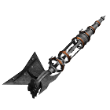</img><br>


[Eternals.zip](https://github.com/Hecter94/EndlessSky-PluginArchive/releases/download/Latest/Eternals.zip) | 16.49 mb | 2023-07-27 | [view files](https://github.com/Hecter94/EndlessSky-PluginArchive/tree/main/Working/Eternals/) <br>
Author: comnom | Category: Races <br>
[https://github.com/comnom/Eternals](https://github.com/comnom/Eternals) (last commit 2020-01-12) <br>

>It adds two new factions northeast of Unfettered space, the Valuutians and the Lost Ones.
>
>Ten new systems with sixty-nine new planet sprites
>Twenty new ships, thirteen of which are immediately purchasable
>Thirty-two new outfits with associated effects
>Custom sound effects and ambient music
>
>


Status: N/A <br>
Daily update check: </img><br>


---

### Exotic Matter


[Exotic.Matter.zip](https://github.com/Hecter94/EndlessSky-PluginArchive/releases/download/Latest/Exotic.Matter.zip) | 4.02 kb | 2023-07-27 | [view files](https://github.com/Hecter94/EndlessSky-PluginArchive/tree/main/Working/Exotic%20Matter/) <br>
Author: CristopherZhong | Category: Races <br>
[https://github.com/ChristopherZhong/endless-sky-exotic-matter-plugin](https://github.com/ChristopherZhong/endless-sky-exotic-matter-plugin) (last commit 2016-12-21) <br>

>N/A
>


Status: N/A <br>
Daily update check: </img><br>


---

### Exporianes
</img><br>


[Exporianes.zip](https://github.com/Hecter94/EndlessSky-PluginArchive/releases/download/Latest/Exporianes.zip) | 56.11 mb | 2023-07-27 | [view files](https://github.com/Hecter94/EndlessSky-PluginArchive/tree/main/Working/Exporianes/) <br>
Author: Kestrel1110 | Category: Races <br>
[https://github.com/kestrel1110/Exporianes](https://github.com/kestrel1110/Exporianes) (last commit 2023-01-07) <br>

>Adds a new race of T5 aliens to the Milky-Way galaxy. They can be reached after completing the Emerald Sword missions and having a combat rating of 13.
>

<details>
<summary>:blue_book: Plugin readme</summary>
<blockquote>Exporianes is a plugin for the space-trading game Endless-Sky. It adds a new race of T5 aliens to the Milky-Way galaxy. They can be reached after completing the Emerald Sword missions and having a combat rating of 13.

</blockquote>
</details>

Status: In development, Playable on 0.9.15 Continuous. <br>
Daily update check: </img><br>


---

### Galactic Invaders


[Galactic.Invaders.zip](https://github.com/Hecter94/EndlessSky-PluginArchive/releases/download/Latest/Galactic.Invaders.zip) | 825.82 kb | 2022-10-06 | [view files](https://github.com/Hecter94/EndlessSky-PluginArchive/tree/main/Working/Galactic%20Invaders/) <br>
Author: Matthew Murray | Category: Races <br>
N/A[]()  <br>

>N/A
>


Status: N/A <br>
Daily update check: </img><br>


---

### Ironclad


[Ironclad.zip](https://github.com/Hecter94/EndlessSky-PluginArchive/releases/download/Latest/Ironclad.zip) | 2.62 mb | 2022-10-06 | [view files](https://github.com/Hecter94/EndlessSky-PluginArchive/tree/main/Working/Ironclad/) <br>
Author: 1010todd | Category: Races <br>
N/A[]()  <br>

>Add a single-system faction which use hull-only WW2-style warships.
>
>


Status: Playable on 0.9.15 Continuous. <br>
Daily update check: </img><br>


---

### Jaling Expansion


[Jaling.Expansion.zip](https://github.com/Hecter94/EndlessSky-PluginArchive/releases/download/Latest/Jaling.Expansion.zip) | 4.25 mb | 2023-07-27 | [view files](https://github.com/Hecter94/EndlessSky-PluginArchive/tree/main/Working/Jaling%20Expansion/) <br>
Author: RizkyPramudyaCJ | Category: Races <br>
[https://github.com/RizkyPramudyaCJ/Jaling-Expansion](https://github.com/RizkyPramudyaCJ/Jaling-Expansion) (last commit 2018-03-04) <br>

>Jaling Expansion adds another human civilization which not connected to human space.
>


Status: N/A <br>
Daily update check: </img><br>


---

### KorExiles PA


[KorExiles.PA.zip](https://github.com/Hecter94/EndlessSky-PluginArchive/releases/download/Latest/KorExiles.PA.zip) | 21.75 mb | 2023-07-27 | [view files](https://github.com/Hecter94/EndlessSky-PluginArchive/tree/main/Working/KorExiles%20PA/) <br>
Author: Ejothims | Category: Races <br>
[https://github.com/EjoThims/KorExiles-PA](https://github.com/EjoThims/KorExiles-PA) (last commit 2022-01-25) <br>

>Addition for Korath Exiles Post-Automata.
>

<details>
<summary>:blue_book: Plugin readme</summary>
<blockquote># KorExiles-PA
Korath Exiles Post Automata
Long term, what I'm planning for this stuff is a set of missions responding to their re-acquisition of the automata by synthesizing their focuses against the new threat of the Wanderers and the growing danger of the Remnant, mostly with long ranged weaponry which can double on world defense as well as artillery set ups.

Start introduces Screener and Ionizer.

Screener is answer to superior but slower AMs of both, especially coupled in fleets with the Firestorm torpedo introduced in KEE. It will very much rely on the redocking to reload behavior, though, and I'm gonna have to play around with the Piercer Pod stats in Revamp - it needs some serious tweaking/buffing to be worth using over normal piercers, even at it's smaller size.

Energzier is answer to Wanderer HWs and Remnant kiters, providing ranged disruption (by channeling disruptors through detainer rig) to stack onto beam combos or enhance various piercing weapons. It is slightly heavier, does negative energy and ion damage, and less slow than normal detainer, but has longer range and larger AoE.

From there, a split is introduced with one group working on the KIV 750 artillery platform and it's giant spinal mount weapon, and the other working on deployable artillery with the above spinal versions of the FO.

Eventually you're faced with a decision to strike against one of the reserach/production facilities, and in the ensuing retaliation and for a good while afterwards, the other line appears much more often in fleets and events.

https://vimeo.com/475090386

</blockquote>
</details>

Status: Playable on 0.9.15 Continuous. <br>
Daily update check: </img><br>


---

### Low Tech Worlds


[Low.Tech.Worlds.zip](https://github.com/Hecter94/EndlessSky-PluginArchive/releases/download/Latest/Low.Tech.Worlds.zip) | 4.39 mb | 2023-07-27 | [view files](https://github.com/Hecter94/EndlessSky-PluginArchive/tree/main/Working/Low%20Tech%20Worlds/) <br>
Author: dennistribe | Category: Races <br>
[https://github.com/dennistribe/es-low-tech-worlds](https://github.com/dennistribe/es-low-tech-worlds) (last commit 2023-01-03) <br>

>Adds a new alien species that has lower technology than humans. Intended as early game content to be submitted to endless-sky for inclusion in the game.
>


Status: N/A <br>
Daily update check: </img><br>


---

### Lupainians


[Lupainians.zip](https://github.com/Hecter94/EndlessSky-PluginArchive/releases/download/Latest/Lupainians.zip) | 1.42 mb | 2023-07-23 | [view files](https://github.com/Hecter94/EndlessSky-PluginArchive/tree/main/Working/Lupainians/) <br>
Author: 3agleEmpire | Category: Races <br>
[https://github.com/3agleEmpire/Lupainian-Development](https://github.com/3agleEmpire/Lupainian-Development) (last commit 2023-04-06) <br>

>This Is The Development for a new alien Species inside Endless Sky, I will upload updates here as they come out.


Status: N/A <br>
Daily update check: </img><br>


---

### Make Communism Great Again


[Make.Communism.Great.Again.zip](https://github.com/Hecter94/EndlessSky-PluginArchive/releases/download/Latest/Make.Communism.Great.Again.zip) | 1.39 mb | 2023-07-27 | [view files](https://github.com/Hecter94/EndlessSky-PluginArchive/tree/main/Working/Make%20Communism%20Great%20Again/) <br>
Author: JonathanZhang1 | Category: Races <br>
[https://github.com/JonathanZhang1/Make-communism-great-again-endless-sky](https://github.com/JonathanZhang1/Make-communism-great-again-endless-sky) (last commit 2021-08-29) <br>

>I add a new government,a new system and three new kinds of ships into the game,and I will write some story in the future.
>

<details>
<summary>:blue_book: Plugin readme</summary>
<blockquote># Make-communism-great-again
This is a small plugin for game [endless-sky](https://endless-sky.github.io/).I haven't finished it .I have problem in making more people know it,if someone could help me,please email me.

## contents
I add a new government,a new system and three new kinds of ships into the game,and I will write some story in the future.
</blockquote>
</details>

Status: N/A <br>
Daily update check: </img><br>


---

### Mark 2 Pug


[Mark.2.Pug.zip](https://github.com/Hecter94/EndlessSky-PluginArchive/releases/download/Latest/Mark.2.Pug.zip) | 1021.7 kb | 2022-10-06 | [view files](https://github.com/Hecter94/EndlessSky-PluginArchive/tree/main/Working/Mark%202%20Pug/) <br>
Author: N/A | Category: Races <br>
N/A[]()  <br>

>Add Mark 2 version of Pug ships and replace Pug fleet in Wanderer space with it.
>


Status: N/A <br>
Daily update check: </img><br>


---

### Marsian Ancestors


[Marsian.Ancestors.zip](https://github.com/Hecter94/EndlessSky-PluginArchive/releases/download/Latest/Marsian.Ancestors.zip) | 32.54 mb | 2022-10-06 | [view files](https://github.com/Hecter94/EndlessSky-PluginArchive/tree/main/Working/Marsian%20Ancestors/) <br>
Author: Endros Gunderberg | Category: Races <br>
[https://github.com/EndrosG/ES-Plugins](https://github.com/EndrosG/ES-Plugins) (last commit 2017-05-28) <br>

>In this plugin, you get involved into discoveries of the origins of ancient settlements on Mars.
>


Status: N/A <br>
Daily update check: </img><br>


---

### Mata


[Mata.zip](https://github.com/Hecter94/EndlessSky-PluginArchive/releases/download/Latest/Mata.zip) | 29.43 mb | 2023-07-27 | [view files](https://github.com/Hecter94/EndlessSky-PluginArchive/tree/main/Working/Mata/) <br>
Author: Karirawri | Category: Races <br>
[https://github.com/Karirawri/Mata](https://github.com/Karirawri/Mata) (last commit 2023-05-16) <br>

>Add a new advanced race south east of Ember Waste.
>


Status: N/A <br>
Daily update check: </img><br>


---

### Military Plugin


[Military.Plugin.zip](https://github.com/Hecter94/EndlessSky-PluginArchive/releases/download/Latest/Military.Plugin.zip) | 315.04 kb | 2023-07-27 | [view files](https://github.com/Hecter94/EndlessSky-PluginArchive/tree/main/Working/Military%20Plugin/) <br>
Author: JPG7D | Category: Races <br>
[https://github.com/JPG7D/endless-sky-military-plugin](https://github.com/JPG7D/endless-sky-military-plugin) (last commit 2020-10-24) <br>

>Military Vehicles from WWII to the Modern Era.
>

<details>
<summary>:blue_book: Plugin readme</summary>
<blockquote># endless-sky-military-plugin
The ultimate military plugin for endless sky, from World War II to the Modern era.

</blockquote>
</details>

Status: N/A <br>
Daily update check: </img><br>


---

### Naltok


[Naltok.zip](https://github.com/Hecter94/EndlessSky-PluginArchive/releases/download/Latest/Naltok.zip) | 1.2 mb | 2023-10-27 | [view files](https://github.com/Hecter94/EndlessSky-PluginArchive/tree/main/Working/Naltok/) <br>
Author: Quantumshark | Category: Races <br>
[https://github.com/Quantumshark/ES-Naltok](https://github.com/Quantumshark/ES-Naltok) (last commit 2023-10-27) <br>

>A new tier 1.5 alien species, the amphibious Naltok. 

<details>
<summary>:blue_book: Plugin readme</summary>
<blockquote># ES-Naltok
 A new tier 1.5 alien species, the amphibious Naltok.

</blockquote>
</details>

Status: N/A <br>
Daily update check: </img><br>


---

### nomads


[nomads.zip](https://github.com/Hecter94/EndlessSky-PluginArchive/releases/download/Latest/nomads.zip) | 2.0 mb | 2023-07-27 | [view files](https://github.com/Hecter94/EndlessSky-PluginArchive/tree/main/Working/nomads/) <br>
Author: RisingLeaf | Category: Races <br>
[https://github.com/RisingLeaf/nomads](https://github.com/RisingLeaf/nomads) (last commit 2023-07-24) <br>

>adds several nomad fleets appearing ramndomly


Status: N/A <br>
Daily update check: </img><br>


---

### Octyl


[Octyl.zip](https://github.com/Hecter94/EndlessSky-PluginArchive/releases/download/Latest/Octyl.zip) | 5.53 mb | 2023-07-27 | [view files](https://github.com/Hecter94/EndlessSky-PluginArchive/tree/main/Working/Octyl/) <br>
Author: Ferociousfeind | Category: Races <br>
[https://github.com/Ferociousfeind/Octyl-Emergence](https://github.com/Ferociousfeind/Octyl-Emergence) (last commit 2019-02-25) <br>

>A modest plugin about some squids out in space.
>


Status: Should be playable on 0.9.14, 0.9.15 Continuous. <br>
Daily update check: </img><br>


---

### Overseers


[Overseers.zip](https://github.com/Hecter94/EndlessSky-PluginArchive/releases/download/Latest/Overseers.zip) | 980.65 kb | 2022-10-06 | [view files](https://github.com/Hecter94/EndlessSky-PluginArchive/tree/main/Working/Overseers/) <br>
Author: N/A | Category: Races <br>
N/A[]()  <br>

>N/A
>


Status: N/A <br>
Daily update check: </img><br>


---

### Play As Sestor


[Play.As.Sestor.zip](https://github.com/Hecter94/EndlessSky-PluginArchive/releases/download/Latest/Play.As.Sestor.zip) | 26.44 kb | 2023-07-27 | [view files](https://github.com/Hecter94/EndlessSky-PluginArchive/tree/main/Working/Play%20As%20Sestor/) <br>
Author: Zoura (AvianGeneticist) | Category: Races <br>
[https://github.com/AvianGeneticist/Play-As-Sestor](https://github.com/AvianGeneticist/Play-As-Sestor) (last commit 2023-05-08) <br>

>Play as Sestor does what it says on the tin! Start a new life (pilot) as a kiloton-rated metal death machine! Patrol space, amass a fleet, and conquer the galaxy!
>Oh, yeah, by the way, everyone hates you, except for your bretheren.
>

<details>
<summary>:blue_book: Plugin readme</summary>
<blockquote># Play-As-Sestor
 Play as the Sestor, with all challenge that entails.

</blockquote>
</details>

Status: Playable on 0.9.15/0.9.16. <br>
Daily update check: </img><br>


---

### Remnant


[Remnant.zip](https://github.com/Hecter94/EndlessSky-PluginArchive/releases/download/Latest/Remnant.zip) | 5.35 mb | 2023-07-27 | [view files](https://github.com/Hecter94/EndlessSky-PluginArchive/tree/main/Working/Remnant/) <br>
Author: Zitchas | Category: Races <br>
[https://github.com/Zitchas/ZRemnantX](https://github.com/Zitchas/ZRemnantX) (last commit 2020-05-11) <br>

>My collection of missions, excitement, and additional stuff for the Remnant.
>

<details>
<summary>:blue_book: Plugin readme</summary>
<blockquote># ZRemnantX
Zitchas' Test-Bed plugin for Endless Sky. This plug-in is not intended for general distribution, but rather serves as a temporary holding area for various ideas and thing that I am testing or have recently been tested. It isn't balanced, and sometimes breaks things. It also serves as a holding spot for a lot of lore that I work with, such as the timeline for Remnant stuff.

# The Remnant
The Remnant were originally a group of humans who fled human space in the early years of the Alpha War, circa 2455. They fled in secret, and intentionally made sure that there was no record of them or their departure. Their fear was that the Alpha's would win, and humanity would be destroyed, and thus they sought to establish new worlds where humanity might survive in hiding. To this end they cut off all contact with human systems, and avoid traveling in systems close to the edge of known human space in order to prevent anyone from being able to follow them home.


# Timeline notes (definitive)
First Contact with the Quarg: 2320

The Alpha War: 2450-2470

Player start year: 3013

# Timeline notes (speculative)

2454 Departure from human space

2455 Founding of Caelian

2456 Founding of Aventine

2457 Founding of Viminal

2600-2900 First time they were attacked by a ship with a weapon that interfered with ship engines (possibly a Korath Detainer? These are currently only found on Tek Far 78 - Osk, Tek Far 71 - Lek, Tek Far 109, Kar Ik Vot 349, and Met Par Tek 53 (Sniper).)


 endless-sky commented on May 21, 2017

The Sheragi discovered spaceflight around 100,000 years ago, about the time of the peak of the Hai empire, around the same time that the ancestors of modern humans began "banging rocks together." The Sheragi civilization survived less than a millennium after that.

The Hai discovered spaceflight about 120,000 years ago, and their civil wars stretched from about 95,000 to 90,000 years ago. 90,000 years ago, the Hai pulled back from "human" space and from the ruined worlds to the north of them, and 80,000 years ago the Wanderers moved into that northern territory.

The Korath, Saryds, Kimek, Arachi, and finally the humans, discovered spaceflight 40, 17, 14, 10, and 1 thousand years ago, respectively. Note that that means that new spacefaring species have been appearing more and more frequently in recent history, which is part of why the Archons have been having so much trouble holding things together lately.

</blockquote>
</details>

Status: N/A <br>
Daily update check: </img><br>


---

### Sarcina


[Sarcina.zip](https://github.com/Hecter94/EndlessSky-PluginArchive/releases/download/Latest/Sarcina.zip) | 6.29 mb | 2023-07-27 | [view files](https://github.com/Hecter94/EndlessSky-PluginArchive/tree/main/Working/Sarcina/) <br>
Author: 10010101001 | Category: Races <br>
[https://github.com/10010101001/Sarcina](https://github.com/10010101001/Sarcina) (last commit 2018-12-25) <br>

>Playground plugin, several new ships and outfits, not focused on adding content to vanilla galaxy so much of it is unavailable without an all-content plugin.
>
>Can be considered new game plus as only the content clostest to vanilla quality is available in-game, however probably not at its' current state. All outfits and ships are available using my all-content plugin, or adding the shipyard and outfitter manually to a planet.
>
>

<details>
<summary>:blue_book: Plugin readme</summary>
<blockquote># Sarcina

Playground plugin, several new ships and outfits, not focused on adding content to vanilla galaxy so much of it is unavailable without an all-content plugin.

</blockquote>
</details>

Status: N/A <br>
Daily update check: </img><br>


---

### Shirni


[Shirni.zip](https://github.com/Hecter94/EndlessSky-PluginArchive/releases/download/Latest/Shirni.zip) | 261.58 kb | 2023-07-27 | [view files](https://github.com/Hecter94/EndlessSky-PluginArchive/tree/main/Working/Shirni/) <br>
Author: Quantumshark | Category: Races <br>
[https://github.com/Quantumshark/ES-Shirni](https://github.com/Quantumshark/ES-Shirni) (last commit 2022-10-22) <br>

>A plugin adding a new alien species, the Shirni, who live north of Deep space.
>

<details>
<summary>:blue_book: Plugin readme</summary>
<blockquote># ES Shirni
A plugin adding a new alien species, the Shirni, who live north of Deep space.

</blockquote>
</details>

Status: N/A <br>
Daily update check: </img><br>


---

### Space Invaders
</img><br>


[Space.Invaders.zip](https://github.com/Hecter94/EndlessSky-PluginArchive/releases/download/Latest/Space.Invaders.zip) | 76.58 kb | 2022-10-06 | [view files](https://github.com/Hecter94/EndlessSky-PluginArchive/tree/main/Working/Space%20Invaders/) <br>
Author: mdsmestad | Category: Races <br>
[https://github.com/staferfield/ES-Plugins](https://github.com/staferfield/ES-Plugins) (last commit 2018-02-19) <br>

>This plugin add the iconic space invader at the end of the world.
>
>Note: You need to finish FW storyline first if you want to find them.
>


Status: Playable on 0.9.14, 0.9.15 Continuous. <br>
Daily update check: </img><br>


---

### Space Things


[Space.Things.zip](https://github.com/Hecter94/EndlessSky-PluginArchive/releases/download/Latest/Space.Things.zip) | 5.62 mb | 2022-10-06 | [view files](https://github.com/Hecter94/EndlessSky-PluginArchive/tree/main/Working/Space%20Things/) <br>
Author: Michael Arsollon | Category: Races <br>
N/A[]()  <br>

>The Space things mod implements many space themed ships, planets, etc. into the game. Of course some continuity errors 
>will arise, mostly because i have to change the story to fit into the Endless Sky world. More updates will come, 
>however i can't guarantee consistanty in updates. I hope you enjoy! (There might be some easter eggs in the Pirate systems,
>just be patient and you'll see. :)


Status: N/A <br>
Daily update check: </img><br>


---

### Star Wars Map


[Star.Wars.Map.zip](https://github.com/Hecter94/EndlessSky-PluginArchive/releases/download/Latest/Star.Wars.Map.zip) | 10.42 mb | 2023-07-27 | [view files](https://github.com/Hecter94/EndlessSky-PluginArchive/tree/main/Working/Star%20Wars%20Map/) <br>
Author: DSCelestia | Category: Races <br>
[https://github.com/ESCelestia/Star-Wars-Map-in-Endless-Sky](https://github.com/ESCelestia/Star-Wars-Map-in-Endless-Sky) (last commit 2021-10-31) <br>

>The current goal is to have every system from Star Wars Legends placed as accurately as
>possible (within reason), and to have sector borders, trade routes, and important
>astronomical features such as the Void of Chopani labled.
>

<details>
<summary>:blue_book: Plugin readme</summary>
<blockquote># Star-Wars-Map-in-Endless-Sky
The current goal is to have every system from Star Wars Legends placed as accurately as
possible (within reason), and to have sector borders, trade routes, and important
astronomical features such as the Void of Chopani labled.

Delete the ui folder in images if the background looks like garbage in-game.  Anything
contained in there is meant for development, and will make seeing anything very difficult.

The images shown in the background are screenshots from http://www.swgalaxymap.com/
The orange systems are systems that appear in Canon, and the blue systems are systems
that appear exclusively in Legends.  Many of the most important systems such as Hoth
and Byss appear in both Canon and Legends, and are thus orange.  For this reason, some
orange systems have been added to the map while others have been left alone.

Most systems do not have exact locations given in any official map, and liberty has been taken in a few
instances where perfectly accurate placement of systems would result in unreadable system names due to
how close together those systems are.  See the Tharin sector for an example, the space in and around the
Periphary region in particular.  It can be searched for in game by searching for the Dles system just above
Hutt Space.  Note how the systems in that area do not line up with the systems on the inserted screenshots.

Every system in the main Endless Sky map is included in the map.txt with the exception of Rutilicus*.
This is because a number of systems in Endless Sky have the same name as systems in Star Wars, see Rigel
and Capella as examples.  In these instances, the systems have been renamed to be slightly different from
what they actually are in Star Wars.  Rigel has been renamed Rigellia after the Rigellian race that are from
Rigel, and Capella has been renamed Greater Capella due to the presence of the Little Capella system in the
same sector.

Also included in the "Basic Outfits" are a handful of maps that will make exploring the SW galaxy not
become a massive and unbearable chore that takes about an hour even with 1,000 fuel processors and a JD,
yes I have done that before and I am still salty that I didn't just add the map outfit in the first place.

Because the current map does not have any inhabited systems, a very...potent ship will be required to
navigate the galaxy.  Included is a save file that has a ship that will be able to navigate the galaxy with
relative ease.  Note that it does not have a JD.  This is because the map is not designed with a JD in
mind.  The map was designed with the Star Wars trade routes in mind, and thus funnels players to the trade
routes rather than allowing them to roam freely as a JD would allow for.

* The Rutilicus system is not present so that it is still possible to access the Omnis plugin galaxy if you
have the Omnis plugin installed.

~36% of systems are in place, with 5785 systems expected to be the final count.

</blockquote>
</details>

Status: N/A <br>
Daily update check: </img><br>


---

### Starlus


[Starlus.zip](https://github.com/Hecter94/EndlessSky-PluginArchive/releases/download/Latest/Starlus.zip) | 1.88 mb | 2023-07-27 | [view files](https://github.com/Hecter94/EndlessSky-PluginArchive/tree/main/Working/Starlus/) <br>
Author: pilover100 | Category: Races <br>
[https://github.com/pilover100/starlus-plugin](https://github.com/pilover100/starlus-plugin) (last commit 2023-07-09) <br>

>A comprehensive content based plugin for Endless-Sky, focused around a tier 1.8 species located south of human space between Coalition space and the graveyard.
>
>
>


Status: N/A <br>
Daily update check: </img><br>


---

### StarSector


[StarSector.zip](https://github.com/Hecter94/EndlessSky-PluginArchive/releases/download/Latest/StarSector.zip) | 478.55 kb | 2022-10-06 | [view files](https://github.com/Hecter94/EndlessSky-PluginArchive/tree/main/Working/StarSector/) <br>
Author: N/A | Category: Races <br>
N/A[]()  <br>

>adds starsector themed outfits and ships
>


Status: N/A <br>
Daily update check: </img><br>


---

### synchrony


[synchrony.zip](https://github.com/Hecter94/EndlessSky-PluginArchive/releases/download/Latest/synchrony.zip) | 901.28 kb | 2022-10-06 | [view files](https://github.com/Hecter94/EndlessSky-PluginArchive/tree/main/Working/synchrony/) <br>
Author: N/A | Category: Races <br>
N/A[]()  <br>

>N/A
>


Status: N/A <br>
Daily update check: </img><br>


---

### Terrans


[Terrans.zip](https://github.com/Hecter94/EndlessSky-PluginArchive/releases/download/Latest/Terrans.zip) | 5.65 mb | 2023-07-27 | [view files](https://github.com/Hecter94/EndlessSky-PluginArchive/tree/main/Working/Terrans/) <br>
Author: TimCabbage | Category: Races <br>
[https://github.com/TimCabbage/EndlessSkyTerrans](https://github.com/TimCabbage/EndlessSkyTerrans) (last commit 2019-02-02) <br>

>just pictures, no data folders
>

<details>
<summary>:blue_book: Plugin readme</summary>
<blockquote># EndlessSkyTerrans
Terrans mod for Endless Sky


</blockquote>
</details>

Status: Nonfunfional <br>
Daily update check: </img><br>


---

### The Arion Campaign


[The.Arion.Campaign.zip](https://github.com/Hecter94/EndlessSky-PluginArchive/releases/download/Latest/The.Arion.Campaign.zip) | 8.84 mb | 2023-07-27 | [view files](https://github.com/Hecter94/EndlessSky-PluginArchive/tree/main/Working/The%20Arion%20Campaign/) <br>
Author: Red-57 | Category: Races <br>
[https://github.com/Red-57/The-Arion-Campaign](https://github.com/Red-57/The-Arion-Campaign) (last commit 2020-12-21) <br>

>Adds a new group of tier 2.5 aliens and a long storyline to go with it.
>

<details>
<summary>:blue_book: Plugin readme</summary>
<blockquote># The-Arion-Campaign
This is my Endless Sky mod that adds a new group of tier 2.5 aliens and a long storyline to go with it  
-there are now 9 ships that automaticaly appear in several new systems along with outfits, weapons, and the intro to the campaign!
if anyone has any suggestions please feel free to comment or submit pull requests


general outline of story
    
    -meet arion
    -help defend from some kor sestor attacks    
    -research about new portal leading to planets near coalition space   
    - run into coalition also reaserching same place   
    -fight coalition
    -Korath invade arion military base
    -long string of hard fights
    -coalition capture new territorys
    -realize pug are backing coalition
    -Drak want arion to use those planets to watch over pug
    -pug fight back
    -drak help arion fight pug
    -drak win

</blockquote>
</details>

Status: N/A <br>
Daily update check: </img><br>


---

### The Evora Navaiya


[The.Evora.Navaiya.zip](https://github.com/Hecter94/EndlessSky-PluginArchive/releases/download/Latest/The.Evora.Navaiya.zip) | 6.41 kb | 2023-07-27 | [view files](https://github.com/Hecter94/EndlessSky-PluginArchive/tree/main/Working/The%20Evora%20Navaiya/) <br>
Author: Polaria1 | Category: Races <br>
[https://github.com/Polaria1/The-Evora-Navaiya](https://github.com/Polaria1/The-Evora-Navaiya) (last commit 2023-06-28) <br>

>The Evora Navaiya adds two alien species to the southwest of Coalition space; the Evora Navaiya and the Doyek.
>

<details>
<summary>:blue_book: Plugin readme</summary>
<blockquote># The-Evora-Navaiya
This is a workspace for my mod for Endless Sky, the Evora Navaiya.

The Evora Navaiya adds two alien species to the southwest of Coalition space; the Evora Navaiya and the Doyek.
There are more spoilers below, but all of the information, when the mod is completed, will eventually be available in the mod itself and so, if you plan on playing, I would advise against reading.

# MOD IS CURRENTLY NON-FUNCTIONAL
The Evora Navaiya are an isolated alien species, similar in structure to humans, though overall their skin tone is darker, they have colorful scales on many parts of their body, and they are much, much taller. Both males and females regularly grow in excess of eight feet tall and weigh over 500 pounds.
They live in a territory to the southwest of Coalition space but are isolated by a curious star system.

The Doyek neighbor the Evora Navaiya's isolated star system, being barely reachable from Human Space with a Jump Drive. They are a far younger species than the Evora, and not nearly as advanced. Biologically, they appear as quadruped dragon-like creatures, as if they came straight from the human world of Skymoot, but they aren't very large comparatively, only about 10 feet tall at most (with a large wingspan of about 25 feet), though they weigh in close to a ton. Unlike those Skymoot dragons though, the Doyek's intelligence is closer to the Skymoot dragons' ancestors, the Sheragi, or possibly smarter.

</blockquote>
</details>

Status: N/A <br>
Daily update check: </img><br>


---

### The Forgotten


[The.Forgotten.zip](https://github.com/Hecter94/EndlessSky-PluginArchive/releases/download/Latest/The.Forgotten.zip) | 2.35 mb | 2023-07-27 | [view files](https://github.com/Hecter94/EndlessSky-PluginArchive/tree/main/Working/The%20Forgotten/) <br>
Author: Startome | Category: Races <br>
[https://github.com/Startome/TheForgotten](https://github.com/Startome/TheForgotten) (last commit 2017-06-06) <br>

>N/A
>

<details>
<summary>:blue_book: Plugin readme</summary>
<blockquote># TheForgotten
Repo for "The Forgotten" Plugin for Endless Sky

</blockquote>
</details>

Status: N/A <br>
Daily update check: </img><br>


---

### The Great Journey


[The.Great.Journey.zip](https://github.com/Hecter94/EndlessSky-PluginArchive/releases/download/Latest/The.Great.Journey.zip) | 4.17 mb | 2022-10-06 | [view files](https://github.com/Hecter94/EndlessSky-PluginArchive/tree/main/Working/The%20Great%20Journey/) <br>
Author: Mr.Guineo | Category: Races <br>
N/A[]()  <br>

>This is a new and at the momment WIP content plugin based in the halo universe, adding 12 new ships and 14 new outfits, including 3 new powerful spinal weapons, all purchasable in the deep and renmant.
>
>
>


Status: N/A <br>
Daily update check: </img><br>


---

### The Jump Gate Project


[The.Jump.Gate.Project.zip](https://github.com/Hecter94/EndlessSky-PluginArchive/releases/download/Latest/The.Jump.Gate.Project.zip) | 3.18 mb | 2022-10-06 | [view files](https://github.com/Hecter94/EndlessSky-PluginArchive/tree/main/Working/The%20Jump%20Gate%20Project/) <br>
Author: N/A | Category: Races <br>
N/A[]()  <br>

>N/A
>


Status: N/A <br>
Daily update check: </img><br>


---

### The Swarm Project


[The.Swarm.Project.zip](https://github.com/Hecter94/EndlessSky-PluginArchive/releases/download/Latest/The.Swarm.Project.zip) | 1.53 mb | 2023-07-27 | [view files](https://github.com/Hecter94/EndlessSky-PluginArchive/tree/main/Working/The%20Swarm%20Project/) <br>
Author: jafdy | Category: Races <br>
[https://github.com/jafdy/the-swarm-project](https://github.com/jafdy/the-swarm-project) (last commit 2016-09-23) <br>

>Adds a new race with the working name "The Swarm". 
>


Status: N/A <br>
Daily update check: </img><br>


---

### Trin


[Trin.zip](https://github.com/Hecter94/EndlessSky-PluginArchive/releases/download/Latest/Trin.zip) | 14.84 mb | 2023-07-27 | [view files](https://github.com/Hecter94/EndlessSky-PluginArchive/tree/main/Working/Trin/) <br>
Author: Elyssaen | Category: Races <br>
[https://github.com/Elyssaen/trin](https://github.com/Elyssaen/trin) (last commit 2017-05-23) <br>

>The Trin are a proposed hostile, Tier 3 alien species.
>

<details>
<summary>:blue_book: Plugin readme</summary>
<blockquote># Trin Enhancement for Endless Sky

## The Trin

The Trin are a proposed hostile, Tier 3 alien species. I'm designing them with the following objectives:

1. Provide a late game challenge for an experienced player's fleet, which makes a bit more story sense than farming the Quarg.
2. Offer a great range of outfits: weapons that might compete with the Quarg Skylance, and other outfits balanced to the Wanderers/Korath.
3. To be relatively ‘low impact’ in terms of territory and storyline. Their territory is long lost, and their planned stories try to fit into the existing setting.
4. To push the boat out mechanically: their missiles shoot bomb-pumped lasers, their Matrix Guns do more damage the closer they hit, a rare ship variant creates illusions of itself, and more...


## Background

They raid the galactic north from the Wanderers to the Korath, checked by the Quarg in Hai and Efreti space. The Trin were once an advanced civilisation, a long time ago. They rose to a great height, but their continued warring became ever more dangerous. Eventually, their atrocities caught the attention of the Drak, who sought to contain the threat.

The Trin refused all conditions of surrender, and while they were no match for the Drak and the Quarg, they fought an endless guerrilla war. Their civilisation was lost, but their Trin Fabricators (molecular assemblers) and underground hives helped them seed themselves across the galaxy and fight back. They bloodied the Quarg in battle, and even injured a few Archons.

Eventually, the Drak lost patience. They fell back on an ultimate sanction: a weapon that completely destroyed all intelligent Trin life.

They miscalculated. The Trin have two species – or perhaps two sexes. Their Queens were intelligent and civilised, and the Drak’s weapon killed every one. Their drones are strong, obedient, good at performing a given task but with no autonomy of their own. The Drak’s weapon did not affect the Trin drones. Millenia have passed, and Trin drones continue to fulfill their dead Queens’ dying wishes for war.

They seed new hives on uninhabited worlds, build new ships, and attack with no concept of free will, strategy, or mercy. They no longer recognise enemy or civilian. They’re a mindless husk of a dead species, fighting a war that’s already lost: a galactic pest. The Drak task the Quarg with eradicating hives before they ‘hatch’, and defending the Hai and Efreti from the few Trin that reach them. Despite their advanced technology, this has been enough to keep the fallen Trin mostly in check.

At least, so far.


## Gameplay

The Trin have no fleet presence. They appear through rare, usually invisible ‘raid’ missions. In Hai and Efreti space, Quarg will show up to help – eventually.

1. 7 new Tier 3 ships: Piranha fighters, Raja interceptors, Marlin light warships, Chimaera medium warships, Cachalot heavy freighters and Mako and Antiarch heavy warships. Only the first three can realistically be captured.
2. 7-11 new weapons: Phase Reapers, Matrix Guns/Batteries, Stasis Snares, Hunter-Killer Pods, Hunter-Seeker Pods and the mighty Arcblade. More rarely you’ll find Phase Reaper Turrets, Empyreal Fields, Wakefield Mortars and Hunter-Trapper Pods. 
3. 16 new outfits, including competitive alternatives to Wanderer/Korath reactors, Wanderer regenerators, Korath/Coalition cooling, Quarg batteries and Hai engines. Plus some other cool stuff. Everything except their better reactors can be obtained.
4. The Mebsuta Hive arc, a 10 mission arc encountering a mysterious alien threat under the worst circumstances.
5. The Hai Research arc, a 9 mission arc investigating the technology and origin of the Trin. Also repeating Hai missions warning of Trin raids once your combat rating is high enough.
6. The Wanderer Defence arc, about 6 missions dealing with a Trin hive.
7. The Trin Queen arc, about 4 missions finding out much more about the Trin’s origin, from a very different perspective.
8. The Dreadhand’s Challenge, a 2 mission story where you can respond to (or ignore) a challenge from an infamous pirate lord with some pretty unusual technology.

## Code Dependencies

**_[STABLE]_** **[Beta](https://github.com/Elyssaen/endless-sky/tree/beta)** – a combined branch of all relatively stable features / code dependencies. Feel free to compile this and have a look around. I'll make pre-compiled executables available at some point, but in the long run the hope is that all code dependencies can be accepted into Endless Sky.

1. _**[DONE]**_  **[RangeCalculation](https://github.com/Elyssaen/endless-sky/tree/feature/RangeCalculation)** – a tweak to Endless Sky’s range calculation to handle random lifetime/velocity and submunition velocity, needed to get certain Trin weapons (like the Phase Reaper and Arcblade) to be used effectively by the AI. 
2. _**[DONE]**_  **[NoCollision](https://github.com/Elyssaen/endless-sky/tree/feature/NoCollision)** – a new weapon attribute that allows for munitions that don’t hit anything, needed for proper operation of some fancy Trin weapons (like the Empyreal Field and Arcblade).
3. _**[DONE]**_  **[EffectResistances](https://github.com/Elyssaen/endless-sky/tree/feature/EffectResistances)** – Trin shield regenerators provide resistance to disruption and piercing damage. (The branch also creates slowing and ion resistance, not used by the Trin.)
4. _**[DONE]**_  **[MoreJammingTypes](https://github.com/Elyssaen/endless-sky/tree/feature/MoreJammingTypes)** – creates optical, infrared and untyped jamming, as the Trin use a fancy Tier 3 jammer. (Untyped not used.)
5. _**[DONE]**_  **[ShipsConditions](https://github.com/Elyssaen/endless-sky/tree/feature/ShipsConditions)** – ability to key a mission off your fleet size is used in the Dreadhand’s Challenge.
6. _**[DONE]**_ **[TurretFiringArc](https://github.com/Elyssaen/endless-sky/tree/feature/TurretFiringArc)** – any weapon (turret or gun) can have a "swivel degrees" attribute, allowing it to swivel within that range. Needed so that Swivel Matrix Guns can fire in a +/- 30 degree arc.
6. _**[DONE]**_ **[OperationalEnergy](https://github.com/Elyssaen/endless-sky/tree/feature/OperationalEnergy)** - rather than having negative energy generation, an outfit that should constantly drain energy now uses positive "operational energy". This is needed to fix some incompatibilities with solar collection, and also to make it possible to equip Strangelet Adapters before reactors.
7. _**[DONE]**_ **[ExcessiveSpeedDecay](https://github.com/Elyssaen/endless-sky/tree/feature/ExcessiveSpeedDecay)** – ships cannot obtain limitless speed when using a weapon with firing force to thrust. Needed to balance the Warp Ray.
8. _**[DONE, REVISE]**_  **[TechConditions](https://github.com/Elyssaen/endless-sky/tree/feature/TechConditions)** – any outfit or ship can have attributes beginning with "tech: ", and they will automatically be turned into auto-conditions that can be used for mission logic. Needed for the Trin Queen arc to trigger on having _any_ piece of Trin technology in your fleet.
9. _**[TESTING]**_  **[JammingHaywire](https://github.com/Elyssaen/endless-sky/tree/feature/JammingHaywire)** – to make jammers effective in AI-on-AI combat at Tier 3, this makes it possible to ‘confuse’ jammed missiles into veering off.
10. _**[PLANNED]**_ **MoreJammingHaywire** – combination of MoreJammingTypes and JammingHaywire.
11. _**[PLANNED]**_ **GiftShip** – a feature to let a mission give you a ship, needed for a mission reward.
12. _**[NO IDEA YET]**_  **OutfitTransparency** – Trin jammers need to make the ship equipping them translucent.
</blockquote>
</details>

Status: N/A <br>
Daily update check: </img><br>


---

### Ultaka Invasion of Milky Way


[Ultaka.Invasion.of.Milky.Way.zip](https://github.com/Hecter94/EndlessSky-PluginArchive/releases/download/Latest/Ultaka.Invasion.of.Milky.Way.zip) | 9.77 mb | 2023-07-27 | [view files](https://github.com/Hecter94/EndlessSky-PluginArchive/tree/main/Working/Ultaka%20Invasion%20of%20Milky%20Way/) <br>
Author: 1010Todd | Category: Races <br>
[https://github.com/1010todd/Ultaka-Invasion](https://github.com/1010todd/Ultaka-Invasion) (last commit 2022-12-23) <br>

>Got bored of writing intross. Here's what Ultaka were originally made for (The original plugin was never released).
>
>REQUIRES: Galactic War plugin for assets, AES Omnis to access the content
>

<details>
<summary>:blue_book: Plugin readme</summary>
<blockquote># Ultaka Invasion
 Experimental content plugin for open source game Endless Sky
 
# (IMPORTANT)PREREQUIRES:
Endless Sky version 0.9.15 (Continuous) or higher

[Galactic War plugin](https://github.com/1010todd/Galactic-War)

For most of the asset.

[Omnis plugin](https://github.com/Adde-Endless-Sky/-Omnis):

To trigger the invasion.

This plugin WILL NOT work without the above two plugins.

## Optional supported plugin:

[Beyond the Sky](https://github.com/1010todd/Beyond-the-Sky):

Quarg will respond to invasion by deploying better warships that are more of a match to the Ultaka. Ultaka will also deploy extra ships in response.

Shields Up:

Ultaka will also attack everyone else in their way.

Others:

Ultaka will attack everyone (If I'm aware of something, I'll add it to aggro list.)

# About
Ultaka Invasion (or lengthier its name Ultaka Invasion of Milky Way) is an experimental plugin where Milky Way is invaded by highly advanced alien, featuring mechanics for planet invasion and allowing player to retake planets and hire warships to defend it. No story planned beside small missions to make factions react to the invasion(mostly WIP).

Just for fun, not recommended for regular gameplay as multiple feature might break vanilla missions and the balance is very questionable.

</blockquote>
</details>

Status: N/A <br>
Daily update check: </img><br>


---

### Vile Corp


[Vile.Corp.zip](https://github.com/Hecter94/EndlessSky-PluginArchive/releases/download/Latest/Vile.Corp.zip) | 445.65 kb | 2023-07-27 | [view files](https://github.com/Hecter94/EndlessSky-PluginArchive/tree/main/Working/Vile%20Corp/) <br>
Author: janitor | Category: Races <br>
N/A[]()  <br>

>N/A
>


Status: N/A <br>
Daily update check: </img><br>


---

### West Iron


[West.Iron.zip](https://github.com/Hecter94/EndlessSky-PluginArchive/releases/download/Latest/West.Iron.zip) | 2.48 mb | 2023-07-27 | [view files](https://github.com/Hecter94/EndlessSky-PluginArchive/tree/main/Working/West%20Iron/) <br>
Author: Kryes-Omega | Category: Races <br>
[https://github.com/Kryes-Omega/endless-sky-WestIron](https://github.com/Kryes-Omega/endless-sky-WestIron) (last commit 2016-12-17) <br>

>Add a faction with some missions.
>

<details>
<summary>:blue_book: Plugin readme</summary>
<blockquote># endless-sky-plugins
</blockquote>
</details>

Status: N/A <br>
Daily update check: </img><br>


</details>


[back to top](https://github.com/Hecter94/EndlessSky-PluginArchive/blob/main/plugins.md#Races)


---

## Ships

<p>136 plugins in this category.<p>

<details>

 

---

### Ambriel


[Ambriel.zip](https://github.com/Hecter94/EndlessSky-PluginArchive/releases/download/Latest/Ambriel.zip) | 265.3 kb | 2023-07-27 | [view files](https://github.com/Hecter94/EndlessSky-PluginArchive/tree/main/Working/Ambriel/) <br>
Author: N/A | Category: Ships <br>
N/A[]()  <br>

>Adds a new ship.
>


Status: should work <br>
Daily update check: </img><br>


---

### Amphibious-Ships


[Amphibious-Ships.zip](https://github.com/Hecter94/EndlessSky-PluginArchive/releases/download/Latest/Amphibious-Ships.zip) | 11.35 mb | 2023-07-27 | [view files](https://github.com/Hecter94/EndlessSky-PluginArchive/tree/main/Working/Amphibious-Ships/) <br>
Author: Zoura | Category: Ships <br>
[https://github.com/AvianGeneticist/Amphibious-Ships](https://github.com/AvianGeneticist/Amphibious-Ships) (last commit 2023-07-12) <br>

>Adds sea-to-space ships to Endless Sky.
>

<details>
<summary>:blue_book: Plugin readme</summary>
<blockquote># Amphibious-Ships

 This is a plugin for Endless Sky adding a T3-ish race whose ships and weapons are inspired by modern day naval ships. The ships added range from pesky missile boats all the way to super battleships and heavy carriers, with powerful fighters to compliment them.
Currently the plugin features:
- 35 new systems
- 24 new ships: 10 Warships, 3 Dedicated Carriers, 6 Logistical Ships (1 of which has a special variant), 2 Outriggers (with 5 uniquely sprited and statted variants each), 2 Fighters, and 1 Drone.
- 19 new weapons
- A new engine set (6 thrusters, 6 steerings)
- 27 unique outfits
- A powerful new foe in the form of Quarg Automata

</blockquote>
</details>

Status: Playable on 0.10.0/Continuous <br>
Daily update check: </img><br>


---

### Archetto


[Archetto.zip](https://github.com/Hecter94/EndlessSky-PluginArchive/releases/download/Latest/Archetto.zip) | 93.94 kb | 2022-10-06 | [view files](https://github.com/Hecter94/EndlessSky-PluginArchive/tree/main/Working/Archetto/) <br>
Author: Hilokiyz | Category: Ships <br>
N/A[]()  <br>

>Adds a ship.
>


Status: N/A <br>
Daily update check: </img><br>


---

### Assault Cruiser


[Assault.Cruiser.zip](https://github.com/Hecter94/EndlessSky-PluginArchive/releases/download/Latest/Assault.Cruiser.zip) | 995.67 kb | 2022-10-06 | [view files](https://github.com/Hecter94/EndlessSky-PluginArchive/tree/main/Working/Assault%20Cruiser/) <br>
Author: N/A | Category: Ships <br>
N/A[]()  <br>

>Adds 2 Navy ships.
>


Status: N/A <br>
Daily update check: </img><br>


---

### B-25


[B-25.zip](https://github.com/Hecter94/EndlessSky-PluginArchive/releases/download/Latest/B-25.zip) | 21.01 kb | 2023-07-27 | [view files](https://github.com/Hecter94/EndlessSky-PluginArchive/tree/main/Working/B-25/) <br>
Author: N/A | Category: Ships <br>
N/A[]()  <br>

>adds the ship B-25 ynd several weapon outfits to the pirates
>


Status: N/A <br>
Daily update check: </img><br>


---

### Bacterian T2


[Bacterian.T2.zip](https://github.com/Hecter94/EndlessSky-PluginArchive/releases/download/Latest/Bacterian.T2.zip) | 142.53 kb | 2022-10-06 | [view files](https://github.com/Hecter94/EndlessSky-PluginArchive/tree/main/Working/Bacterian%20T2/) <br>
Author: N/A | Category: Ships <br>
N/A[]()  <br>

>Adds a new ship.
>


Status: N/A <br>
Daily update check: </img><br>


---

### Bailiff


[Bailiff.zip](https://github.com/Hecter94/EndlessSky-PluginArchive/releases/download/Latest/Bailiff.zip) | 2.98 kb | 2023-07-27 | [view files](https://github.com/Hecter94/EndlessSky-PluginArchive/tree/main/Working/Bailiff/) <br>
Author: GeoNeil | Category: Ships <br>
[https://github.com/geoneil/Bailiff-plugin](https://github.com/geoneil/Bailiff-plugin) (last commit 2017-02-18) <br>

>Adds a ship.
>

<details>
<summary>:blue_book: Plugin readme</summary>
<blockquote># Bailiff-plugin
My first plugin for the open source space exploration game, Endless Sky.

The intention is to provide an alternative means for a player to earn money and a way of punishing players who get too much into debt.

This first release has a very quick and dirty ship to be used as a Bailiff ship.  

Further changes to be implemented...

Some way of getting the Bailiff licence (I'll be testing the Bailiff ship first to refit with human outfits first)

Some way of getting Bailiff to chase impoverished players.

</blockquote>
</details>

Status: N/A <br>
Daily update check: </img><br>


---

### Bardagh's Ship Variants


[Bardagh.s.Ship.Variants.zip](https://github.com/Hecter94/EndlessSky-PluginArchive/releases/download/Latest/Bardagh.s.Ship.Variants.zip) | 16.26 kb | 2023-07-27 | [view files](https://github.com/Hecter94/EndlessSky-PluginArchive/tree/main/Working/Bardagh's%20Ship%20Variants/) <br>
Author: Bardagh | Category: Ships <br>
[https://github.com/Bardagh/ship-variants/](https://github.com/Bardagh/ship-variants/) (last commit 2021-01-28) <br>

>A plugin which adds variants of human ships to select shipyards. No stat changes, just loadouts. Right now it's mostly bare-bones versions so you don't have to pay for a bunch of outfits you're just going to sell - instead you get a (very) cheap engine & power system, a hyperdrive (or scram drive for the really big ships), & luxury accommodations when they're part of the stock loadout.
>

<details>
<summary>:blue_book: Plugin readme</summary>
<blockquote>A plugin which adds variants of human ships to select shipyards. No stat changes, just loadouts. Right now it's mostly bare-bones versions so you don't have to pay for a bunch of outfits you're just going to sell - instead you get a (very) cheap engine & power system, a hyperdrive, & signature equipment like luxury accommodations for Star Liners.

Also adds a shipyard to Trinket which sells bare-bones Furies, Sparrows, & Modified Argosies.

I'll make a full list of outfit loadouts up if there's enough interest. This is my first plugin, so I wasn't documenting as I went.

</blockquote>
</details>

Status: Playable on 0.9.14, 0.9.15 Continuous. <br>
Daily update check: </img><br>


---

### Battle Carrier


[Battle.Carrier.zip](https://github.com/Hecter94/EndlessSky-PluginArchive/releases/download/Latest/Battle.Carrier.zip) | 128.78 kb | 2022-10-06 | [view files](https://github.com/Hecter94/EndlessSky-PluginArchive/tree/main/Working/Battle%20Carrier/) <br>
Author: N/A | Category: Ships <br>
N/A[]()  <br>

>Adds 2 ships and an outfit.
>


Status: Ships and outfit are nowhere for sale. <br>
Daily update check: </img><br>


---

### Battleship Test


[Battleship.Test.zip](https://github.com/Hecter94/EndlessSky-PluginArchive/releases/download/Latest/Battleship.Test.zip) | 2.8 mb | 2022-10-06 | [view files](https://github.com/Hecter94/EndlessSky-PluginArchive/tree/main/Working/Battleship%20Test/) <br>
Author: Quarg Block(Brick) | Category: Ships <br>
N/A[]()  <br>

>Add post-Kor Sestor Invasion navy ship.
>


Status: N/A <br>
Daily update check: </img><br>


---

### Binary reOrder


[Binary.reOrder.zip](https://github.com/Hecter94/EndlessSky-PluginArchive/releases/download/Latest/Binary.reOrder.zip) | 1.83 mb | 2022-10-06 | [view files](https://github.com/Hecter94/EndlessSky-PluginArchive/tree/main/Working/Binary%20reOrder/) <br>
Author: Vaelophis Nyx & Kezethun | Category: Ships <br>
N/A[]()  <br>

>Add new faction of AI flying sailship-inspired ships.
>


Status: N/A <br>
Daily update check: </img><br>


---

### Blended Ships
</img><br>


[Blended.Ships.zip](https://github.com/Hecter94/EndlessSky-PluginArchive/releases/download/Latest/Blended.Ships.zip) | 3.89 mb | 2023-10-27 | [view files](https://github.com/Hecter94/EndlessSky-PluginArchive/tree/main/Working/Blended%20Ships/) <br>
Author: mOctave | Category: Ships <br>
[https://github.com/mOctave/blended-ships](https://github.com/mOctave/blended-ships) (last commit 2023-10-27) <br>

>Blended Ships is the realistic spliced ship plugin. All these ships have thumbnails, believeable stats, and actual potential uses! There is also a greater variety of civilian ships available, to support various playstyles.
>


Status: N/A <br>
Daily update check: </img><br>


---

### BSRC


[BSRC.zip](https://github.com/Hecter94/EndlessSky-PluginArchive/releases/download/Latest/BSRC.zip) | 4.68 mb | 2023-07-27 | [view files](https://github.com/Hecter94/EndlessSky-PluginArchive/tree/main/Working/BSRC/) <br>
Author: phenix2 | Category: Ships <br>
[https://github.com/phenix2/BSRC](https://github.com/phenix2/BSRC) (last commit 2020-01-08) <br>

>A Endless Sky plugin with ships from drone class to battleship class

<details>
<summary>:blue_book: Plugin readme</summary>
<blockquote># BSRC
Bioship Study and Research Center

A Endless Sky plugin
with ships from drone class to battleship class

</blockquote>
</details>

Status: N/A <br>
Daily update check: </img><br>


---

### Carriers


[Carriers.zip](https://github.com/Hecter94/EndlessSky-PluginArchive/releases/download/Latest/Carriers.zip) | 2.55 kb | 2022-10-06 | [view files](https://github.com/Hecter94/EndlessSky-PluginArchive/tree/main/Working/Carriers/) <br>
Author: Arkhne | Category: Ships <br>
N/A[]()  <br>

>Adds 6 ships.
>


Status: Should work <br>
Daily update check: </img><br>


---

### Cobbled Ships


[Cobbled.Ships.zip](https://github.com/Hecter94/EndlessSky-PluginArchive/releases/download/Latest/Cobbled.Ships.zip) | 4.44 mb | 2022-10-06 | [view files](https://github.com/Hecter94/EndlessSky-PluginArchive/tree/main/Working/Cobbled%20Ships/) <br>
Author: Zoura | Category: Ships <br>
[https://github.com/AvianGeneticist/CobbleShipModES](https://github.com/AvianGeneticist/CobbleShipModES) (last commit 2022-01-10) <br>

>Add several new ships.
>


Status: Playable on 0.9.15 Continuous. <br>
Daily update check: </img><br>


---

### Czartraks Ship Pack


[Czartraks.Ship.Pack.zip](https://github.com/Hecter94/EndlessSky-PluginArchive/releases/download/Latest/Czartraks.Ship.Pack.zip) | 12.94 mb | 2022-10-06 | [view files](https://github.com/Hecter94/EndlessSky-PluginArchive/tree/main/Working/Czartraks%20Ship%20Pack/) <br>
Author: Czartrak | Category: Ships <br>
[https://github.com/czartrak/Czartraks-Ship-Pack](https://github.com/czartrak/Czartraks-Ship-Pack) (last commit 2021-12-18) <br>

>This mod adds various new ships to Endless Sky.
>


Status: N/A <br>
Daily update check: </img><br>


---

### DaBestShipEver


[DaBestShipEver.zip](https://github.com/Hecter94/EndlessSky-PluginArchive/releases/download/Latest/DaBestShipEver.zip) | 342.21 kb | 2022-10-06 | [view files](https://github.com/Hecter94/EndlessSky-PluginArchive/tree/main/Working/DaBestShipEver/) <br>
Author: mdsmestad | Category: Ships <br>
N/A[]()  <br>

>Add DaBestShipEver.
>


Status: N/A <br>
Daily update check: </img><br>


---

### Death Pancake v1.0.0


[Death.Pancake.v1.0.0.zip](https://github.com/Hecter94/EndlessSky-PluginArchive/releases/download/Latest/Death.Pancake.v1.0.0.zip) | 289.21 kb | 2022-10-06 | [view files](https://github.com/Hecter94/EndlessSky-PluginArchive/tree/main/Working/Death%20Pancake%20v1.0.0/) <br>
Author: N/A | Category: Ships <br>
N/A[]()  <br>

>Adds a ship.
>


Status: Should work <br>
Daily update check: </img><br>


---

### Defense Drone Plugin
</img><br>


[Defense.Drone.Plugin.zip](https://github.com/Hecter94/EndlessSky-PluginArchive/releases/download/Latest/Defense.Drone.Plugin.zip) | 122.32 kb | 2022-10-06 | [view files](https://github.com/Hecter94/EndlessSky-PluginArchive/tree/main/Working/Defense%20Drone%20Plugin/) <br>
Author: starmlerp | Category: Ships <br>
[https://github.com/starmlerp/ESDefenseDronePlugin](https://github.com/starmlerp/ESDefenseDronePlugin) (last commit 2020-09-13) <br>

>This plugin adds a few human drones, intended to be added into vanilla game.
>


Status: Playable on 0.9.14, 0.9.15 Continuous. <br>
Daily update check: </img><br>


---

### Derogam
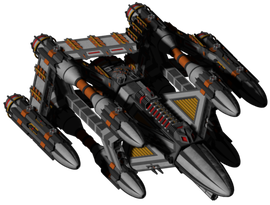</img><br>


[Derogam.zip](https://github.com/Hecter94/EndlessSky-PluginArchive/releases/download/Latest/Derogam.zip) | 5.73 mb | 2023-08-15 | [view files](https://github.com/Hecter94/EndlessSky-PluginArchive/tree/main/Working/Derogam/) <br>
Author: Lorantine | Category: Ships <br>
[https://github.com/Lorantine/derogam](https://github.com/Lorantine/derogam) (last commit 2023-08-15) <br>

>A big WIP project involving a multi-alien society with ships, outfits, jobs, a storyline and more. High-quality is the aim, so older things will be redone. Perhaps one day this'll be in the main game!
>

<details>
<summary>:blue_book: Plugin readme</summary>
<blockquote>Semi-dead, though the dream is still alive! Expect very slow progress with occasional small additions.

Current to-do (loosely sorted by which are likely first):
- 1: Rework all existing ships to something that actually looks decent; see new Guardian and Warrior models.
- 2: Replace more placeholder outfits with my own (stealing effects and sounds for placeholder though).
- 3: Improve the map more (add more commodities, planets, descriptions etc. to make it feel more alive).
- 4: Add some basic jobs to give stuff to do.
- 5: More ships!
- 6: Some basic intro missions to give some lore to the player about what this strange alien civilisation is about.

Note: Some reasonably-solid lore points already exist, though with some story missions and descriptions more details will be made and revealed.

</blockquote>
</details>

Status: Functional <br>
Daily update check: </img><br>


---

### Derp Ship


[Derp.Ship.zip](https://github.com/Hecter94/EndlessSky-PluginArchive/releases/download/Latest/Derp.Ship.zip) | 943.79 kb | 2022-10-06 | [view files](https://github.com/Hecter94/EndlessSky-PluginArchive/tree/main/Working/Derp%20Ship/) <br>
Author: N/A | Category: Ships <br>
N/A[]()  <br>

>adds the person ship "Derpy Horse"
>


Status: N/A <br>
Daily update check: </img><br>


---

### Destiny


[Destiny.zip](https://github.com/Hecter94/EndlessSky-PluginArchive/releases/download/Latest/Destiny.zip) | 148.09 kb | 2022-10-06 | [view files](https://github.com/Hecter94/EndlessSky-PluginArchive/tree/main/Working/Destiny/) <br>
Author: Dantoys | Category: Ships <br>
N/A[]()  <br>

>Add Destiny to the Game.
>


Status: N/A <br>
Daily update check: </img><br>


---

### Donut 512


[Donut.512.zip](https://github.com/Hecter94/EndlessSky-PluginArchive/releases/download/Latest/Donut.512.zip) | 376.65 kb | 2023-07-27 | [view files](https://github.com/Hecter94/EndlessSky-PluginArchive/tree/main/Working/Donut%20512/) <br>
Author: Lorantine | Category: Ships <br>
[https://github.com/Lorantine/donut-512](https://github.com/Lorantine/donut-512) (last commit 2023-06-03) <br>

>A carefully-crafted Endless Sky plugin that replaces the Model 512 with a better model. May affect balance due to size.

<details>
<summary>:blue_book: Plugin readme</summary>
<blockquote># donut-512
A carefully-crafted Endless Sky plugin that replaces the Model 512 with a better model. May affect balance due to size.

</blockquote>
</details>

Status: N/A <br>
Daily update check: </img><br>


---

### Dragoon


[Dragoon.zip](https://github.com/Hecter94/EndlessSky-PluginArchive/releases/download/Latest/Dragoon.zip) | 246.54 kb | 2022-10-06 | [view files](https://github.com/Hecter94/EndlessSky-PluginArchive/tree/main/Working/Dragoon/) <br>
Author: Hondolor | Category: Ships <br>
N/A[]()  <br>

>Adds a ship.
>


Status: Should work. <br>
Daily update check: </img><br>


---

### Dragoon Industries


[Dragoon.Industries.zip](https://github.com/Hecter94/EndlessSky-PluginArchive/releases/download/Latest/Dragoon.Industries.zip) | 36.83 kb | 2023-07-27 | [view files](https://github.com/Hecter94/EndlessSky-PluginArchive/tree/main/Working/Dragoon%20Industries/) <br>
Author: Hayden Plishka | Category: Ships <br>
N/A[]()  <br>

>Adds several ships and outfits.
>


Status: Should work <br>
Daily update check: </img><br>


---

### Elite Sky
</img><br>


[Elite.Sky.zip](https://github.com/Hecter94/EndlessSky-PluginArchive/releases/download/Latest/Elite.Sky.zip) | 201.57 kb | 2022-10-06 | [view files](https://github.com/Hecter94/EndlessSky-PluginArchive/tree/main/Working/Elite%20Sky/) <br>
Author: N/A | Category: Ships <br>
N/A[]()  <br>

>Add ships from Elite Dangerous.
>


Status: N/A <br>
Daily update check: </img><br>


---

### Endless-Sky-Ship


[Endless-Sky-Ship.zip](https://github.com/Hecter94/EndlessSky-PluginArchive/releases/download/Latest/Endless-Sky-Ship.zip) | 1.25 mb | 2023-07-27 | [view files](https://github.com/Hecter94/EndlessSky-PluginArchive/tree/main/Working/Endless-Sky-Ship/) <br>
Author: The-Borg-Captain | Category: Ships <br>
[https://github.com/The-Borg-Captain/Endless-Sky-Ship](https://github.com/The-Borg-Captain/Endless-Sky-Ship) (last commit 2018-06-21) <br>

>Adds an overpowered ship.
>

<details>
<summary>:blue_book: Plugin readme</summary>
<blockquote># Ship-rIn-HoS
A new ship for Endless sky

The name "rIn Hos" Means Over Powered in Klingon.   
This ship is supposed to by sightly op.  
I am looking for constructvie criticism and suggestions.

</blockquote>
</details>

Status: N/A <br>
Daily update check: </img><br>


---

### Endros human basic ships


[Endros.human.basic.ships.zip](https://github.com/Hecter94/EndlessSky-PluginArchive/releases/download/Latest/Endros.human.basic.ships.zip) | 189.59 kb | 2022-10-06 | [view files](https://github.com/Hecter94/EndlessSky-PluginArchive/tree/main/Working/Endros%20human%20basic%20ships/) <br>
Author: Endros Gunderberg  | Category: Ships <br>
[https://github.com/EndrosG/ES-Plugins](https://github.com/EndrosG/ES-Plugins) (last commit 2017-05-28) <br>

>adds:
>- Hauler Zero Light Warship to the Southbound Shipyards. Simply a Hauler with zero cargo pods.
>- A ct-75 (large) Star Barge.
>It does not modify the fleet definitions though, because they are generally subject to change with every new ship and thus any fleet definition in this plugin might become outdated pretty soon.
>


Status: N/A <br>
Daily update check: </img><br>


---

### Everything-n-More


[Everything-n-More.zip](https://github.com/Hecter94/EndlessSky-PluginArchive/releases/download/Latest/Everything-n-More.zip) | 148.6 kb | 2023-07-27 | [view files](https://github.com/Hecter94/EndlessSky-PluginArchive/tree/main/Working/Everything-n-More/) <br>
Author: Please-Close-This-Issue | Category: Ships <br>
[https://github.com/Please-Close-This-Issue/everything-n-more-mod-](https://github.com/Please-Close-This-Issue/everything-n-more-mod-) (last commit 2017-08-03) <br>

>several modified ships
>

<details>
<summary>:blue_book: Plugin readme</summary>
<blockquote># everything-n-more-mod-
all items and more for endless sky (wip)
any questions shoot them to me on the discord I guess

</blockquote>
</details>

Status: N/A <br>
Daily update check: </img><br>


---

### Fauxwing


[Fauxwing.zip](https://github.com/Hecter94/EndlessSky-PluginArchive/releases/download/Latest/Fauxwing.zip) | 1.31 kb | 2022-10-06 | [view files](https://github.com/Hecter94/EndlessSky-PluginArchive/tree/main/Working/Fauxwing/) <br>
Author: N/A | Category: Ships <br>
N/A[]()  <br>

>adds the ship "Fauxwing" to the shipyard on Zug
>


Status: N/A <br>
Daily update check: </img><br>


---

### Flip Those Ships
</img><br>


[Flip.Those.Ships.zip](https://github.com/Hecter94/EndlessSky-PluginArchive/releases/download/Latest/Flip.Those.Ships.zip) | 866.92 kb | 2023-07-27 | [view files](https://github.com/Hecter94/EndlessSky-PluginArchive/tree/main/Working/Flip%20Those%20Ships/) <br>
Author: TheronEpic | Category: Ships <br>
[https://github.com/TheronEpic/Flip-Those-Ships](https://github.com/TheronEpic/Flip-Those-Ships) (last commit 2020-10-08) <br>

>Do you dislike the multitude of lawn dart ships? do you like the look of front-heavy ships? Or do you just want something different? Then just flip those ships around! guns on the back, engines on the front, then drive them backwards!
>


Status: N/A <br>
Daily update check: </img><br>


---

### Fluff


[Fluff.zip](https://github.com/Hecter94/EndlessSky-PluginArchive/releases/download/Latest/Fluff.zip) | 5.88 mb | 2023-10-15 | [view files](https://github.com/Hecter94/EndlessSky-PluginArchive/tree/main/Working/Fluff/) <br>
Author: Darcy Manoel | Category: Ships <br>
[https://github.com/Adde-Endless-Sky-Mods/Fluff](https://github.com/Adde-Endless-Sky-Mods/Fluff) (last commit 2023-10-15) <br>

>As expected, this mod fluffs the edges of various different aspects of the game. Many new ships and outfits scattered about to add more to an already enticing experience, some content may blend well and remain unnoticed while other content will stick out sorely.
>

<details>
<summary>:blue_book: Plugin readme</summary>
<blockquote># Fluff
> As expected, this mod fluffs the edges of various different aspects of the game. Many new ships and outfits scattered about to add more to an already enticing experience, some content may blend well and remain unnoticed while other content will stick out sorely.

</blockquote>
</details>

Status: Merged into AES Fluff <br>
Daily update check: </img><br>


---

### Flying Saucer


[Flying.Saucer.zip](https://github.com/Hecter94/EndlessSky-PluginArchive/releases/download/Latest/Flying.Saucer.zip) | 121.82 kb | 2022-10-06 | [view files](https://github.com/Hecter94/EndlessSky-PluginArchive/tree/main/Working/Flying%20Saucer/) <br>
Author: N/A | Category: Ships <br>
N/A[]()  <br>

>adds a ship
>


Status: N/A <br>
Daily update check: </img><br>


---

### Galaxias
</img><br>


[Galaxias.zip](https://github.com/Hecter94/EndlessSky-PluginArchive/releases/download/Latest/Galaxias.zip) | 133.34 kb | 2023-07-27 | [view files](https://github.com/Hecter94/EndlessSky-PluginArchive/tree/main/Working/Galaxias/) <br>
Author: mdpiper | Category: Ships <br>
[https://github.com/mdpiper/galaxias](https://github.com/mdpiper/galaxias) (last commit 2023-03-22) <br>

>An Endless Sky plugin for the Galaxias fast battlecruiser.
>

<details>
<summary>:blue_book: Plugin readme</summary>
<blockquote># galaxias

An Endless Sky plugin for the Galaxias fast battlecruiser.

</blockquote>
</details>

Status: N/A <br>
Daily update check: </img><br>


---

### Gander


[Gander.zip](https://github.com/Hecter94/EndlessSky-PluginArchive/releases/download/Latest/Gander.zip) | 301.4 kb | 2023-07-27 | [view files](https://github.com/Hecter94/EndlessSky-PluginArchive/tree/main/Working/Gander/) <br>
Author: williaji | Category: Ships <br>
[https://github.com/williaji/Gander](https://github.com/williaji/Gander) (last commit 2023-01-07) <br>

>a new ship named Gander

<details>
<summary>:blue_book: Plugin readme</summary>
<blockquote># Gander
</blockquote>
</details>

Status: N/A <br>
Daily update check: </img><br>


---

### Gulliver


[Gulliver.zip](https://github.com/Hecter94/EndlessSky-PluginArchive/releases/download/Latest/Gulliver.zip) | 30.2 mb | 2023-07-27 | [view files](https://github.com/Hecter94/EndlessSky-PluginArchive/tree/main/Working/Gulliver/) <br>
Author: Test-711 | Category: Ships <br>
[https://github.com/Test-711/gulliver](https://github.com/Test-711/gulliver) (last commit 2021-04-26) <br>

>Add non-spaceflight race and a T2 race. Heavily WIP.
>

<details>
<summary>:blue_book: Plugin readme</summary>
<blockquote># gulliver
</blockquote>
</details>

Status: N/A <br>
Daily update check: </img><br>


---

### Hauler Expansion


[Hauler.Expansion.zip](https://github.com/Hecter94/EndlessSky-PluginArchive/releases/download/Latest/Hauler.Expansion.zip) | 1.29 mb | 2022-10-06 | [view files](https://github.com/Hecter94/EndlessSky-PluginArchive/tree/main/Working/Hauler%20Expansion/) <br>
Author: JPG7D | Category: Ships <br>
[https://github.com/JPG7D/Haulers-Expansion-v2](https://github.com/JPG7D/Haulers-Expansion-v2) (last commit 2020-09-27) <br>

>We have small Haulers, big Haulers, medium Haulers, circular Haulers! You name it, we have it!
>Come on down to Glaze in the Aldhibain system to find our heaping collection of hauling vehicles!
>


Status: N/A <br>
Daily update check: </img><br>


---

### Heliarch Avenger


[Heliarch.Avenger.zip](https://github.com/Hecter94/EndlessSky-PluginArchive/releases/download/Latest/Heliarch.Avenger.zip) | 462.23 kb | 2022-10-06 | [view files](https://github.com/Hecter94/EndlessSky-PluginArchive/tree/main/Working/Heliarch%20Avenger/) <br>
Author: Arachi(Arachi-lover) | Category: Ships <br>
N/A[]()  <br>

>Add a Heliarch superheavy warship.
>


Status: N/A <br>
Daily update check: </img><br>


---

### High Tier Warships


[High.Tier.Warships.zip](https://github.com/Hecter94/EndlessSky-PluginArchive/releases/download/Latest/High.Tier.Warships.zip) | 14.35 mb | 2022-10-06 | [view files](https://github.com/Hecter94/EndlessSky-PluginArchive/tree/main/Working/High%20Tier%20Warships/) <br>
Author: 1010todd | Category: Ships <br>
N/A[]()  <br>

>Additional ships and reaction to being farmed for high tier alien(Pug, Quarg). Renamed to Beyond the Sky.
>


Status: Playable on 0.9.14, 0.9.15 Continuous. <br>
Daily update check: </img><br>


---

### HONK


[HONK.zip](https://github.com/Hecter94/EndlessSky-PluginArchive/releases/download/Latest/HONK.zip) | 2.28 mb | 2022-10-06 | [view files](https://github.com/Hecter94/EndlessSky-PluginArchive/tree/main/Working/HONK/) <br>
Author: Hurtz | Category: Ships <br>
[https://github.com/Killerhurtz/ES-HONK](https://github.com/Killerhurtz/ES-HONK) (last commit 2017-09-14) <br>

>Small plugin for the hilarity of it. HONK.
>


Status: N/A <br>
Daily update check: </img><br>


---

### Human Ship Expansion
</img><br>


[Human.Ship.Expansion.zip](https://github.com/Hecter94/EndlessSky-PluginArchive/releases/download/Latest/Human.Ship.Expansion.zip) | 545.82 kb | 2023-07-27 | [view files](https://github.com/Hecter94/EndlessSky-PluginArchive/tree/main/Working/Human%20Ship%20Expansion/) <br>
Author: loyse | Category: Ships <br>
N/A[]()  <br>

>Add a couple of human ships and two weapons
>

<details>
<summary>:blue_book: Plugin readme</summary>
<blockquote># The-more-ships-plugin
 A small expansion plugin for Endless Sky

</blockquote>
</details>

Status: N/A <br>
Daily update check: </img><br>


---

### IJN Yamato


[IJN.Yamato.zip](https://github.com/Hecter94/EndlessSky-PluginArchive/releases/download/Latest/IJN.Yamato.zip) | 986.89 kb | 2023-07-27 | [view files](https://github.com/Hecter94/EndlessSky-PluginArchive/tree/main/Working/IJN%20Yamato/) <br>
Author: Hiloki Zheng | Category: Ships <br>
[https://github.com/hilokiyz/IJN-Yamato-Endless-Sky](https://github.com/hilokiyz/IJN-Yamato-Endless-Sky) (last commit 2021-05-27) <br>

>Bringing the biggest WW2 Battleship ever made in Endless Sky
>

<details>
<summary>:blue_book: Plugin readme</summary>
<blockquote># IJN-Yamato-Endless-Sky
The creation of the biggest WW2 battleship in Endless Sky

</blockquote>
</details>

Status: N/A <br>
Daily update check: </img><br>


---

### Improvisatory


[Improvisatory.zip](https://github.com/Hecter94/EndlessSky-PluginArchive/releases/download/Latest/Improvisatory.zip) | 1.82 mb | 2023-03-04 | [view files](https://github.com/Hecter94/EndlessSky-PluginArchive/tree/main/Working/Improvisatory/) <br>
Author: N/A | Category: Ships <br>
N/A[]()  <br>

>This plugin add a few ships that are a modified variant of existing ships by individuals and private groups like pirates and some merchants.
>


Status: N/A <br>
Daily update check: </img><br>


---

### Jenkins My Beloved


[Jenkins.My.Beloved.zip](https://github.com/Hecter94/EndlessSky-PluginArchive/releases/download/Latest/Jenkins.My.Beloved.zip) | 8.75 kb | 2022-11-05 | [view files](https://github.com/Hecter94/EndlessSky-PluginArchive/tree/main/Working/Jenkins%20My%20Beloved/) <br>
Author: Zoura (AvianGeneticist) | Category: Ships <br>
N/A[]()  <br>

>Add new types of fighter which is literally a guy with a gun flying around shooting things.
>


Status: Should be playable on 0.9.15/0.9.16 <br>
Daily update check: </img><br>


---

### Just a ship


[Just.a.ship.zip](https://github.com/Hecter94/EndlessSky-PluginArchive/releases/download/Latest/Just.a.ship.zip) | 87.72 kb | 2022-10-06 | [view files](https://github.com/Hecter94/EndlessSky-PluginArchive/tree/main/Working/Just%20a%20ship/) <br>
Author: N/A | Category: Ships <br>
N/A[]()  <br>

>Adds a new ship that is from my personal mod, it's rather overpowered even with the vanilla weapons it has, so have fun! (or something like that)
>You can find the ship at Tarazed.
>


Status: N/A <br>
Daily update check: </img><br>


---

### Kaynz


[Kaynz.zip](https://github.com/Hecter94/EndlessSky-PluginArchive/releases/download/Latest/Kaynz.zip) | 7.08 mb | 2023-07-27 | [view files](https://github.com/Hecter94/EndlessSky-PluginArchive/tree/main/Working/Kaynz/) <br>
Author: Mcgode | Category: Ships <br>
[https://github.com/Mcgode/Kaynz](https://github.com/Mcgode/Kaynz) (last commit 2017-09-22) <br>

>The goal is to add an ulterior story arc to the main game, which puts it, as of the moment this is redacted, after the wanderer storyline. The plugin will add a new galaxy to the game, with a new race: the Kaynz. They are intended to be a tier 4 alien race, capable of taking down Drak ships (with some difficulty however), a detail important to the lore. 
>

<details>
<summary>:blue_book: Plugin readme</summary>
<blockquote># Kaynz

Kaynz is a plugin for [Endless Sky](http://endless-sky.github.io) which plans to add an entire story arc to the original game.

### Story arc description

The goal is to add an ulterior story arc to the main game, which puts it, as of the moment this is redacted, after the wanderer storyline.
The plugin will add a new galaxy to the game, with a new race: the Kaynz. They are intended to be a tier 4 alien race, capable of taking down Drak ships (with some difficulty however), a detail important to the lore.
The Kayn people are intended to be human-like, however slender, smaller, and with a pronounced blue skin. 
They will come in three main factions :
* The Kayn Empire: The original faction of the Kaynz, a stagnant empire in almost every way, yet still powerful
* The Kayn Republic: The first of the two factions separated from the Empire. They still maintain relationship with the Empire, but there clearly is tension between those two factions. They are ruled by an elected Senate, or they pretend it to be that way, and is thriving economicaly.
* The New Kaynz form the last main faction, which also seceded from the Empire. They are at war with both the Empire and the Republic, however there is not much fighting going on. They are ruled by a closed council, and are thriving on a military and a technological standpoint.
The storyline will involve a first contact between humans and kaynz, the future of their relationship and the conclusion of the Kayn internal conflict

### Current status

(what is done so far)
* essential specific outfits (engines, first weapons, power, shield, heat dissipation)
* first Kayn Republic ships (Honorbound and Dragonfly)
* some cargo ships (for merchants mainly)
* first contact questline (ongoing)
* most of the galaxy (including planets)
* lore introduction

### TODO list

Gameplaywise:
* more ships specific to the Kayn Republic (currently Honorbound and Dragonfly)
* ships specific to the New Kaynz
* ships specific to the Kayn Republic
* more civilian ships
* outfit balancing
* more specific outfits
* more jobs
* finalizing galaxy (New Kayn space to do particulary)
* wormhole stabilisation station sprites
* SPRITES! (Honorbound sprite is the only "not ugly" one so far)

Writingwise:
* entire New Kayn storyline (including siding with them (long term))
* entire Kayn Empire storyline (including siding with them (long term))
* continuation of the Kayn Republic storyline
* add more lore 
* fix the author's mandatory english mistakes

</blockquote>
</details>

Status: N/A <br>
Daily update check: </img><br>


---

### Kestrel-M


[Kestrel-M.zip](https://github.com/Hecter94/EndlessSky-PluginArchive/releases/download/Latest/Kestrel-M.zip) | 54.82 kb | 2022-10-06 | [view files](https://github.com/Hecter94/EndlessSky-PluginArchive/tree/main/Working/Kestrel-M/) <br>
Author: mdsmestad | Category: Ships <br>
N/A[]()  <br>

>adds the ship "Kestrel-M" to Tarazad shipyard
>


Status: N/A <br>
Daily update check: </img><br>


---

### Kor-Fighter-Additions


[Kor-Fighter-Additions.zip](https://github.com/Hecter94/EndlessSky-PluginArchive/releases/download/Latest/Kor-Fighter-Additions.zip) | 76.33 mb | 2023-10-05 | [view files](https://github.com/Hecter94/EndlessSky-PluginArchive/tree/main/Working/Kor-Fighter-Additions/) <br>
Author: EjoThims | Category: Ships <br>
[https://github.com/EjoThims/Kor-Fighter-Additions](https://github.com/EjoThims/Kor-Fighter-Additions) (last commit 2023-10-01) <br>

>Additional fighters for Korath Exiles.
>

<details>
<summary>:blue_book: Plugin readme</summary>
<blockquote># Kor Fighter Additions
 Additional fighters for Korath Exiles

</blockquote>
</details>

Status: Playable on 0.10.0 continuous <br>
Daily update check: </img><br>


---

### Lampyrid Start
</img><br>


[Lampyrid.Start.zip](https://github.com/Hecter94/EndlessSky-PluginArchive/releases/download/Latest/Lampyrid.Start.zip) | 41.0 kb | 2023-07-27 | [view files](https://github.com/Hecter94/EndlessSky-PluginArchive/tree/main/Working/Lampyrid%20Start/) <br>
Author: Zitchas | Category: Ships <br>
[https://github.com/Zitchas/ES_Lampyrid_Start](https://github.com/Zitchas/ES_Lampyrid_Start) (last commit 2022-02-27) <br>

>Alternate start with Lampyrid ship.
>

<details>
<summary>:blue_book: Plugin readme</summary>
<blockquote># ES_Lampyrid_Start
Have you ever wanted to start Endless Sky flying something a bit more unique than the typical shuttle, starbarge, or sparrow? Have you dreamed of having a pilot that starts their career with an old ship they've been fixing up for the past few years? Well, Lampyrid Start does that. 

Choosing this starts has your pilot start their career flying a slightly modified version of the Lampyrid, which is a decent balanced transport/freighter with the capacity to be fairly fast compared to others of its class.

Be warned, however, that all is not peace, prosperity, and clear skies: Despite the tweak adding an anti-missile turret to the Lampyrid, it has sufficient cargo capacity to attract pirates on a semi-regular basis. Possibly even on your first launch. So you will have to be alert, and probably need to see about either upgrading your ship to be faster; or replacing the AM with a more intimidating turret.

So long as you can avoid the pirates, this will be an easier and faster start than the standard ones. The pirate risk can make it a little riskier and slightly more challenging, though. Just think of them as Reavers, and it'll be just like flying in the Firefly universe.

Copyright Zitchas @ 2021

</blockquote>
</details>

Status: Playable on 0.9.15 Continuous. <br>
Daily update check: </img><br>


---

### Legendary Pirates


[Legendary.Pirates.zip](https://github.com/Hecter94/EndlessSky-PluginArchive/releases/download/Latest/Legendary.Pirates.zip) | 4.0 mb | 2022-10-06 | [view files](https://github.com/Hecter94/EndlessSky-PluginArchive/tree/main/Working/Legendary%20Pirates/) <br>
Author: Galaucus | Category: Ships <br>
[https://github.com/Galaucus/Endless-Sky-Legendary-Pirates](https://github.com/Galaucus/Endless-Sky-Legendary-Pirates) (last commit 2021-06-16) <br>

>A plugin adding unique pirates in tricked-out ships. There's only one of them in the galaxy! 
>


Status: N/A <br>
Daily update check: </img><br>


---

### Lertsek
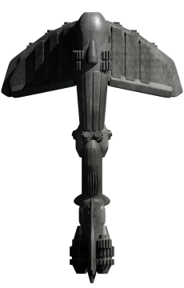</img><br>


[Lertsek.zip](https://github.com/Hecter94/EndlessSky-PluginArchive/releases/download/Latest/Lertsek.zip) | 283.87 kb | 2023-07-27 | [view files](https://github.com/Hecter94/EndlessSky-PluginArchive/tree/main/Working/Lertsek/) <br>
Author: TheronEpic | Category: Ships <br>
[https://github.com/TheronEpic/lertsek](https://github.com/TheronEpic/lertsek) (last commit 2020-11-19) <br>

>Do you dislike the Kestrel? Are its guns too far back? Do you just want something different? Or do you just like front-heavy ships? Well then the Lertsek is for you.
>


Status: N/A <br>
Daily update check: </img><br>


---

### Levis Customs


[Levis.Customs.zip](https://github.com/Hecter94/EndlessSky-PluginArchive/releases/download/Latest/Levis.Customs.zip) | 5.44 kb | 2023-07-27 | [view files](https://github.com/Hecter94/EndlessSky-PluginArchive/tree/main/Working/Levis%20Customs/) <br>
Author: Zoura | Category: Ships <br>
[https://github.com/AvianGeneticist/Levi-s-Customs](https://github.com/AvianGeneticist/Levi-s-Customs) (last commit 2023-06-27) <br>

>Build your own custom Leviathans!
>This is a simple plugin for Endless Sky that allows you to pay 20 million credits to customize a Leviathan. Choose half a dozen extra hardpoints, add Health and System Capacities, and even special augmentations to give yourself a leg-up in the early to mid game!
>

<details>
<summary>:blue_book: Plugin readme</summary>
<blockquote># Levi-s-Customs
Build your own custom Leviathans!

This is a simple plugin for Endless Sky that allows you to pay 20 million credits to customize a Leviathan. Choose half a dozen extra hardpoints, add Health and System Capacities, and even special augmentations to give yourself a leg-up in the early to mid game!

</blockquote>
</details>

Status: N/A <br>
Daily update check: </img><br>


---

### Lleytons ES Starships


[Lleytons.ES.Starships.zip](https://github.com/Hecter94/EndlessSky-PluginArchive/releases/download/Latest/Lleytons.ES.Starships.zip) | 31.79 kb | 2023-07-27 | [view files](https://github.com/Hecter94/EndlessSky-PluginArchive/tree/main/Working/Lleytons%20ES%20Starships/) <br>
Author: Lleyton | Category: Ships <br>
[https://github.com/Llalpaca/Lleytons-es-starships](https://github.com/Llalpaca/Lleytons-es-starships) (last commit 2018-06-11) <br>

>adds back in a couple of old ships, I plan to add some of my own in the future.
>

<details>
<summary>:blue_book: Plugin readme</summary>
<blockquote># Lleytons-es-starships
Plugin for endless sky, currently only adds back in a couple of old ships, I plan to add some of my own in the future.

</blockquote>
</details>

Status: N/A <br>
Daily update check: </img><br>


---

### Loronar Transport


[Loronar.Transport.zip](https://github.com/Hecter94/EndlessSky-PluginArchive/releases/download/Latest/Loronar.Transport.zip) | 283.7 kb | 2023-07-27 | [view files](https://github.com/Hecter94/EndlessSky-PluginArchive/tree/main/Working/Loronar%20Transport/) <br>
Author: Armalarde7895 | Category: Ships <br>
[https://github.com/Armalarde7895/Loronar-transport](https://github.com/Armalarde7895/Loronar-transport) (last commit 2020-06-17) <br>

>It adds the Loronar medium transport from Star Wars.
>

<details>
<summary>:blue_book: Plugin readme</summary>
<blockquote># Loronar medium transport
A plugin for Endless Sky. It adds the Loronar medium transport from Star Wars.
The Loronar medium transport was designed by the Loronar Corporation prior to the Clone Wars.
The Loronar medium transport is sold by Loronar Corporation, on the planet Rust in the Kraz System.

# Install
Place the downloaded file, "Loronar-transport", in your plugins folder found here:

###### Linux: ~/.local/share/endless-sky/
###### Windows: %AppData%\endless-sky\
###### Mac OS X: ~/Library/ApplicationSupport/endless-sky/
###### Steam: If using Steam right click the game in the Library and click Properties, then select Local Files and Browse Local Files.

</blockquote>
</details>

Status: N/A <br>
Daily update check: </img><br>


---

### Marauder Bactrian
</img><br>


[Marauder.Bactrian.zip](https://github.com/Hecter94/EndlessSky-PluginArchive/releases/download/Latest/Marauder.Bactrian.zip) | 3.09 mb | 2023-07-27 | [view files](https://github.com/Hecter94/EndlessSky-PluginArchive/tree/main/Working/Marauder%20Bactrian/) <br>
Author: J.C. Hamlin | Category: Ships <br>
[https://github.com/jchamlin/marauder-bactrian](https://github.com/jchamlin/marauder-bactrian) (last commit 2020-08-01) <br>

>This plugin adds Marauder shields, engines, and weapons variants of the Bactrian.
>

<details>
<summary>:blue_book: Plugin readme</summary>
<blockquote># Marauder Bactrian
A plugin for [Endless Sky][endless-sky] that adds Marauder shields, engines, and weapons variants of the Bactrian.

![image][image]

[endless-sky]: https://github.com/endless-sky/endless-sky
[image]: icon.png

## Installation
You must create a "plugins" folder in one of two places, depending on your operating system:

### Linux ###
* /usr/share/endless-sky/plugins/
* ~/.local/share/endless-sky/plugins/

### Windows ###
* plugins\ (in the same folder as the Endless Sky executable)
* C:\Users\yourusername\AppData\Roaming\endless-sky\plugins\

### Mac OS X ###
* Content/Resources/plugins/ (within the application bundle)
* ~/Library/ApplicationSupport/endless-sky/plugins

Download the latest [release][releases] and extract it into your plugins folder.

More information may be available on the [Endless Sky Wiki][wiki].

[releases]: https://github.com/jchamlin/marauder-bactrian/releases
[wiki]: https://github.com/endless-sky/endless-sky/wiki

</blockquote>
</details>

Status: N/A <br>
Daily update check: </img><br>


---

### Marauder Swarmer
</img><br>


[Marauder.Swarmer.zip](https://github.com/Hecter94/EndlessSky-PluginArchive/releases/download/Latest/Marauder.Swarmer.zip) | 106.3 kb | 2023-07-27 | [view files](https://github.com/Hecter94/EndlessSky-PluginArchive/tree/main/Working/Marauder%20Swarmer/) <br>
Author: Tadrix | Category: Ships <br>
[https://github.com/Tadrix/es-mswarmer](https://github.com/Tadrix/es-mswarmer) (last commit 2018-05-02) <br>

>This plugin adds a new type of fighter, Marauder Swarmers. It doesn't make them available in shipyards and doesn't add them to NPC fleets.
>
>

<details>
<summary>:blue_book: Plugin readme</summary>
<blockquote># es-mswarmer
This plugin adds a new type of fighter, Marauder Swarmers, to the game Endless Sky (located at https://github.com/endless-sky/endless-sky). It doesn't make them available in shipyards and doesn't add them to NPC fleets.

</blockquote>
</details>

Status: N/A <br>
Daily update check: </img><br>


---

### Marausprey
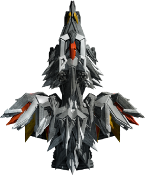</img><br>


[Marausprey.zip](https://github.com/Hecter94/EndlessSky-PluginArchive/releases/download/Latest/Marausprey.zip) | 777.44 kb | 2023-07-27 | [view files](https://github.com/Hecter94/EndlessSky-PluginArchive/tree/main/Working/Marausprey/) <br>
Author: TheronEpic | Category: Ships <br>
[https://github.com/TheronEpic/marausprey](https://github.com/TheronEpic/marausprey) (last commit 2020-10-31) <br>

>Three new upgraded versions of the Osprey! Now with 30% more spike, and 100% more badassery.
>


Status: N/A <br>
Daily update check: </img><br>


---

### Marvette
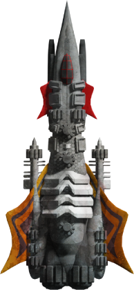</img><br>


[Marvette.zip](https://github.com/Hecter94/EndlessSky-PluginArchive/releases/download/Latest/Marvette.zip) | 362.85 kb | 2023-07-27 | [view files](https://github.com/Hecter94/EndlessSky-PluginArchive/tree/main/Working/Marvette/) <br>
Author: TheronEpic | Category: Ships <br>
[https://github.com/TheronEpic/marvette](https://github.com/TheronEpic/marvette) (last commit 2020-10-06) <br>

>plugin that adds a Marauder Corvette, as well as two variants with different sprites and thumbnails, to the game Endless Sky. 


Status: N/A <br>
Daily update check: </img><br>


---

### Matthews Alien Ship


[Matthews.Alien.Ship.zip](https://github.com/Hecter94/EndlessSky-PluginArchive/releases/download/Latest/Matthews.Alien.Ship.zip) | 86.67 kb | 2022-10-06 | [view files](https://github.com/Hecter94/EndlessSky-PluginArchive/tree/main/Working/Matthews%20Alien%20Ship/) <br>
Author: N/A | Category: Ships <br>
N/A[]()  <br>

>adds a ship to Tarazad shipyard
>


Status: N/A <br>
Daily update check: </img><br>


---

### Maurader Osprey
</img><br>


[Maurader.Osprey.zip](https://github.com/Hecter94/EndlessSky-PluginArchive/releases/download/Latest/Maurader.Osprey.zip) | 471.07 kb | 2023-07-27 | [view files](https://github.com/Hecter94/EndlessSky-PluginArchive/tree/main/Working/Maurader%20Osprey/) <br>
Author: TheronEpic | Category: Ships <br>
N/A[]()  <br>

>Three new upgraded versions of the Osprey! Now with 30% more spike, and 100% more badassery.
>


Status: N/A <br>
Daily update check: </img><br>


---

### Maurder Covette
</img><br>


[Maurder.Covette.zip](https://github.com/Hecter94/EndlessSky-PluginArchive/releases/download/Latest/Maurder.Covette.zip) | 363.03 kb | 2023-07-27 | [view files](https://github.com/Hecter94/EndlessSky-PluginArchive/tree/main/Working/Maurder%20Covette/) <br>
Author: TheronEpic | Category: Ships <br>
N/A[]()  <br>

>little description space better Corvette 2 variant in fleets TheronEpic.
>


Status: N/A <br>
Daily update check: </img><br>


---

### MAY


[MAY.zip](https://github.com/Hecter94/EndlessSky-PluginArchive/releases/download/Latest/MAY.zip) | 30.45 kb | 2023-07-27 | [view files](https://github.com/Hecter94/EndlessSky-PluginArchive/tree/main/Working/MAY/) <br>
Author: N/A | Category: Ships <br>
N/A[]()  <br>

>adds several new ships and outfits
>


Status: N/A <br>
Daily update check: </img><br>


---

### Mega Bactrian


[Mega.Bactrian.zip](https://github.com/Hecter94/EndlessSky-PluginArchive/releases/download/Latest/Mega.Bactrian.zip) | 363.7 kb | 2022-10-06 | [view files](https://github.com/Hecter94/EndlessSky-PluginArchive/tree/main/Working/Mega%20Bactrian/) <br>
Author: mdsmestad | Category: Ships <br>
N/A[]()  <br>

>Adds mega Bactrian ship
>


Status: N/A <br>
Daily update check: </img><br>


---

### Mega Freight
</img><br>


[Mega.Freight.zip](https://github.com/Hecter94/EndlessSky-PluginArchive/releases/download/Latest/Mega.Freight.zip) | 134.02 mb | 2023-10-24 | [view files](https://github.com/Hecter94/EndlessSky-PluginArchive/tree/main/Working/Mega%20Freight/) <br>
Author: 1010todd | Category: Ships <br>
[https://github.com/1010todd/Mega-Freight](https://github.com/1010todd/Mega-Freight) (last commit 2023-10-24) <br>

>Adds several mostly civilian ships for you and npc merchants( and pirates) to use for more variety in human space.
>

<details>
<summary>:blue_book: Plugin readme</summary>
<blockquote># Mega Freight
 Content plugin for opensource game [Endless Sky](https://github.com/endless-sky/endless-sky)


Adds several ships for you and various factions to use adding more variety to the galaxy as well as universe progression releasing new ships and technologies dependent and independent of storyline (mostly just human space for now).
* Faction with new ships: Merchant, Pirate, Republic, Syndicate, Free Worlds, Hai, Wanderer

Summary of what this plugin adds:

Over 50 ships:
* 50+ Freighters including specialized cargo ships (Fuel, LNG, Chemical, etc.) + 2 Superheavy
* 4 Transports
* 3 Space Liner
* 10+ Utility (Carriers, miners, etc.)
* 17+ Warships + 2 Superheavy (Purpose-built and modification of existing.)
* 1 Battlestation
* 9 Fighters, Drones, and other carried ships (Utility and Combat)

And other things:
* A few weapons and outfits. 
* Special jobs that gets expanded with appropriate ship (Mining, Gas shipping, Chemical shipping, Heavy lift/Crane, Cars, etc.)
* Additional luxury jobs/rich passengers depending on outfits.
* Huge jobs (Passengers, Deliveries, Escorts).
* Just a lot more jobs which are often location-specific. Planet that mines radioactive things export more of that. Leading electronics manufacturer export more of advanced electronics. etc. (WIP)
* New sub-factions often with unique variants, weapons, or even ships (Espion Mining, Rangphenn, Ugyr, Jack's, Rakin, Black Death, Crossguard, Sulso, Maryhal, NGK, Core Food, Core Nuclear, Solacer, Luna Winery).
* NPC fleets using the new ships.
* Persistent NPC (Battlestations in 3 systems, 2 of which can respawn after some time.)
* Additional ship spawn for some story missions.
* Orbital shipyard orbiting Mars after main plot.
* A few stations (Nordlin, Ankulah, Yokosuka, GS1 Galaxy, Ourea, Forge, Ankaim, Titanite)
* Gradual progression of the universe both dependent and independent of story missions. 
  * Stronger pirate fleet over time and merchants upgrading their weapons to keep up. 
  * New ships and technologies (timed and/or locked behind story missions)
  * Factions constructing new stations.
  * Limited time events that will be resolved by governments after a while.

Requires Unstable Build/0.10.3 or above.

# Recommended 

To fully utilize mining/utility fighters and drones provided with this plugin you can try Sam's Mining Complete fork of the game which allows you ~~command your ships to target mineable asteroids~~(In vanilla now) and distribute fuel among your fleet with fighters. The fork also provides other gameplay improvements and bug fixes.

(Possibly outdated as of 19/07/2023)
Link: https://github.com/samrocketman/endless-sky/releases/tag/continuous-with-plugins

This plugin have a few debug functionality and unobtainable ships which can be unlocked with Omnis cheat/developer plugin.

Link: https://github.com/Adde-Endless-Sky-Mods/-Omnis

# Download

To download, press the green "Code" button and download as zip. If you're on mobile and cannot see the button, open the page in desktop mode.


</blockquote>
</details>

Status: Requires Continuous/0.10.1+ <br>
Daily update check: </img><br>


---

### Merchant Marine


[Merchant.Marine.zip](https://github.com/Hecter94/EndlessSky-PluginArchive/releases/download/Latest/Merchant.Marine.zip) | 79.54 kb | 2022-10-06 | [view files](https://github.com/Hecter94/EndlessSky-PluginArchive/tree/main/Working/Merchant%20Marine/) <br>
Author: AnotherMonkey | Category: Ships <br>
N/A[]()  <br>

>Add a few new human ships.
>


Status: Playable on 0.9.14, 0.9.15 Continuous. <br>
Daily update check: </img><br>


---

### Mercury


[Mercury.zip](https://github.com/Hecter94/EndlessSky-PluginArchive/releases/download/Latest/Mercury.zip) | 258.48 kb | 2022-10-06 | [view files](https://github.com/Hecter94/EndlessSky-PluginArchive/tree/main/Working/Mercury/) <br>
Author: Orlando Peñarubia | Category: Ships <br>
N/A[]()  <br>

>This is a heavy warship designed to use the best human engines. This is the main idea behind the stats design.
>It is a very fast ship with very high shields.
>It has 4 particle cannons, 4 sidewinder missile launchers, 2 heavy laser turrets and 2 heavy anti-missile turrets.
>
>The ships can be bought in World Forge plugin human shipyard and in Navy Basics shipyards.
>


Status: N/A <br>
Daily update check: </img><br>


---

### Mining Pinger


[Mining.Pinger.zip](https://github.com/Hecter94/EndlessSky-PluginArchive/releases/download/Latest/Mining.Pinger.zip) | 744.9 kb | 2023-07-27 | [view files](https://github.com/Hecter94/EndlessSky-PluginArchive/tree/main/Working/Mining%20Pinger/) <br>
Author: Zoura | Category: Ships <br>
[https://github.com/AvianGeneticist/MiningPinger](https://github.com/AvianGeneticist/MiningPinger) (last commit 2023-04-03) <br>

>Some miscalleneous stuff for ES; mostly pertaining to fleets and mining 
>


Status: N/A <br>
Daily update check: </img><br>


---

### Mining ships
</img><br>


[Mining.ships.zip](https://github.com/Hecter94/EndlessSky-PluginArchive/releases/download/Latest/Mining.ships.zip) | 1017.29 kb | 2022-10-06 | [view files](https://github.com/Hecter94/EndlessSky-PluginArchive/tree/main/Working/Mining%20ships/) <br>
Author: 1010todd | Category: Ships <br>
N/A[]()  <br>

>Adds 3 new ships and a weapon dedicated to asteroid mining.
>


Status: Playable since the version that adds minable asteroid (0.9.3). <br>
Daily update check: </img><br>


---

### Modified Falcon


[Modified.Falcon.zip](https://github.com/Hecter94/EndlessSky-PluginArchive/releases/download/Latest/Modified.Falcon.zip) | 295.48 kb | 2022-10-06 | [view files](https://github.com/Hecter94/EndlessSky-PluginArchive/tree/main/Working/Modified%20Falcon/) <br>
Author: Jason Clark | Category: Ships <br>
N/A[]()  <br>

>adds the "Modified Falcon" the the southern pirates shipyards
>


Status: N/A <br>
Daily update check: </img><br>


---

### Modular Haulers


[Modular.Haulers.zip](https://github.com/Hecter94/EndlessSky-PluginArchive/releases/download/Latest/Modular.Haulers.zip) | 586.27 kb | 2022-10-06 | [view files](https://github.com/Hecter94/EndlessSky-PluginArchive/tree/main/Working/Modular%20Haulers/) <br>
Author: PhantomBerserker | Category: Ships <br>
[https://github.com/PhantomBerserker/ES-Modular-Haulers](https://github.com/PhantomBerserker/ES-Modular-Haulers) (last commit 2021-05-27) <br>

>A small plugin that aims to introduce new ships to the Southbound Shipyards plethora.
>Drop by your local Free Worlds affiliated shipyard to purchase one today!
>


Status: N/A <br>
Daily update check: </img><br>


---

### Monitor


[Monitor.zip](https://github.com/Hecter94/EndlessSky-PluginArchive/releases/download/Latest/Monitor.zip) | 23.0 kb | 2022-10-06 | [view files](https://github.com/Hecter94/EndlessSky-PluginArchive/tree/main/Working/Monitor/) <br>
Author: N/A | Category: Ships <br>
N/A[]()  <br>

>Adding a fan favorite ship back into the game. The Monitor.
>


Status: N/A <br>
Daily update check: </img><br>


---

### More Ships Plugin
</img><br>


[More.Ships.Plugin.zip](https://github.com/Hecter94/EndlessSky-PluginArchive/releases/download/Latest/More.Ships.Plugin.zip) | 545.62 kb | 2023-07-27 | [view files](https://github.com/Hecter94/EndlessSky-PluginArchive/tree/main/Working/More%20Ships%20Plugin/) <br>
Author: Loiseeer | Category: Ships <br>
[https://github.com/loiseeer/The-more-ships-plugin](https://github.com/loiseeer/The-more-ships-plugin) (last commit 2020-05-31) <br>

>Add a couple of human ships and two weapons
>

<details>
<summary>:blue_book: Plugin readme</summary>
<blockquote># The-more-ships-plugin
 A small expansion plugin for Endless Sky

</blockquote>
</details>

Status: Playable on 0.9.14, 0.9.15 Continuous. <br>
Daily update check: </img><br>


---

### Nemesis
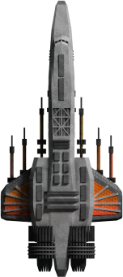</img><br>


[Nemesis.zip](https://github.com/Hecter94/EndlessSky-PluginArchive/releases/download/Latest/Nemesis.zip) | 155.5 kb | 2022-10-06 | [view files](https://github.com/Hecter94/EndlessSky-PluginArchive/tree/main/Working/Nemesis/) <br>
Author: Zavindur | Category: Ships <br>
N/A[]()  <br>

>Add a ship.
>


Status: N/A <br>
Daily update check: </img><br>


---

### Normandy


[Normandy.zip](https://github.com/Hecter94/EndlessSky-PluginArchive/releases/download/Latest/Normandy.zip) | 355.34 kb | 2022-10-06 | [view files](https://github.com/Hecter94/EndlessSky-PluginArchive/tree/main/Working/Normandy/) <br>
Author: Dogmeat137mods | Category: Ships <br>
[https://www.moddb.com/mods/endless-sky-n7](https://www.moddb.com/mods/endless-sky-n7)  <br>

>This is a simple plugin that adds an unique ship and a few outfits after completing a dedicated quest line.
>The Normandy is meant to be an end game flagship option to compete with the Pug Arfecta.
>


Status: N/A <br>
Daily update check: </img><br>


---

### Penthrower


[Penthrower.zip](https://github.com/Hecter94/EndlessSky-PluginArchive/releases/download/Latest/Penthrower.zip) | 226.43 kb | 2022-10-06 | [view files](https://github.com/Hecter94/EndlessSky-PluginArchive/tree/main/Working/Penthrower/) <br>
Author: 1010Todd | Category: Ships <br>
N/A[]()  <br>

>Joke plugin that add a new ship and a few weapons.
>


Status: N/A <br>
Daily update check: </img><br>


---

### Pheonix


[Pheonix.zip](https://github.com/Hecter94/EndlessSky-PluginArchive/releases/download/Latest/Pheonix.zip) | 267.1 kb | 2022-10-06 | [view files](https://github.com/Hecter94/EndlessSky-PluginArchive/tree/main/Working/Pheonix/) <br>
Author: Matthew Smestad | Category: Ships <br>
N/A[]()  <br>

>adds a new ship
>


Status: N/A <br>
Daily update check: </img><br>


---

### Poseidon


[Poseidon.zip](https://github.com/Hecter94/EndlessSky-PluginArchive/releases/download/Latest/Poseidon.zip) | 272.15 kb | 2022-10-06 | [view files](https://github.com/Hecter94/EndlessSky-PluginArchive/tree/main/Working/Poseidon/) <br>
Author: N/A | Category: Ships <br>
N/A[]()  <br>

>adds a new ship
>


Status: N/A <br>
Daily update check: </img><br>


---

### Project Olympus


[Project.Olympus.zip](https://github.com/Hecter94/EndlessSky-PluginArchive/releases/download/Latest/Project.Olympus.zip) | 5.79 mb | 2022-10-06 | [view files](https://github.com/Hecter94/EndlessSky-PluginArchive/tree/main/Working/Project%20Olympus/) <br>
Author: N/A | Category: Ships <br>
N/A[]()  <br>

>N/A
>


Status: N/A <br>
Daily update check: </img><br>


---

### Project Runabout


[Project.Runabout.zip](https://github.com/Hecter94/EndlessSky-PluginArchive/releases/download/Latest/Project.Runabout.zip) | 213.36 kb | 2022-10-06 | [view files](https://github.com/Hecter94/EndlessSky-PluginArchive/tree/main/Working/Project%20Runabout/) <br>
Author: EarlGrey | Category: Ships <br>
N/A[]()  <br>

>N/A
>


Status: N/A <br>
Daily update check: </img><br>


---

### Prong
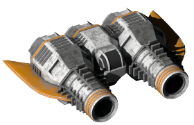</img><br>


[Prong.zip](https://github.com/Hecter94/EndlessSky-PluginArchive/releases/download/Latest/Prong.zip) | 195.89 kb | 2023-03-04 | [view files](https://github.com/Hecter94/EndlessSky-PluginArchive/tree/main/Working/Prong/) <br>
Author: 1010todd | Category: Ships <br>
N/A[]()  <br>

>Add Prong interceptor, which is basically a Barb with extra gun.
>


Status: N/A <br>
Daily update check: </img><br>


---

### prototype D
</img><br>


[prototype.D.zip](https://github.com/Hecter94/EndlessSky-PluginArchive/releases/download/Latest/prototype.D.zip) | 1.41 mb | 2022-10-06 | [view files](https://github.com/Hecter94/EndlessSky-PluginArchive/tree/main/Working/prototype%20D/) <br>
Author: 1010todd | Category: Ships <br>
N/A[]()  <br>

>Adds a ship to Tarazed shipyard and a few weapons.
>


Status: Playable on 0.9.15 Continuous. <br>
Daily update check: </img><br>


---

### Quaernan


[Quaernan.zip](https://github.com/Hecter94/EndlessSky-PluginArchive/releases/download/Latest/Quaernan.zip) | 842.46 kb | 2022-10-06 | [view files](https://github.com/Hecter94/EndlessSky-PluginArchive/tree/main/Working/Quaernan/) <br>
Author: Zoura | Category: Ships <br>
N/A[]()  <br>

>Add Quaernan, a human worldship from alternate universe.
>


Status: Playable on 0.9.15 Continuous. <br>
Daily update check: </img><br>


---

### QuaernanHardpoints


[QuaernanHardpoints.zip](https://github.com/Hecter94/EndlessSky-PluginArchive/releases/download/Latest/QuaernanHardpoints.zip) | 915.63 kb | 2022-10-06 | [view files](https://github.com/Hecter94/EndlessSky-PluginArchive/tree/main/Working/QuaernanHardpoints/) <br>
Author: Zoura | Category: Ships <br>
N/A[]()  <br>

>Add Quaernan, a human worldship from alternate universe.
>


Status: Playable on 0.9.15 Continuous. <br>
Daily update check: </img><br>


---

### QuaernanHardpointsCarries


[QuaernanHardpointsCarries.zip](https://github.com/Hecter94/EndlessSky-PluginArchive/releases/download/Latest/QuaernanHardpointsCarries.zip) | 1.03 mb | 2022-10-06 | [view files](https://github.com/Hecter94/EndlessSky-PluginArchive/tree/main/Working/QuaernanHardpointsCarries/) <br>
Author: Zoura | Category: Ships <br>
[https://github.com/AvianGeneticist/QuaernanHardpointsCarries](https://github.com/AvianGeneticist/QuaernanHardpointsCarries) (last commit 2022-08-17) <br>

>Add Quaernan, a human worldship from alternate universe.
>


Status: Playable on 0.9.15 Continuous. <br>
Daily update check: </img><br>


---

### QuaernanV2 Lian


[QuaernanV2.Lian.zip](https://github.com/Hecter94/EndlessSky-PluginArchive/releases/download/Latest/QuaernanV2.Lian.zip) | 6.73 mb | 2022-10-06 | [view files](https://github.com/Hecter94/EndlessSky-PluginArchive/tree/main/Working/QuaernanV2%20Lian/) <br>
Author: Zoura | Category: Ships <br>
N/A[]()  <br>

>An endless sky plugin that just aims to flesh out the game with a wide variety of changes, ranging from experimental weapons to the expansion of both Human and Hai space, as well as a whole new (in-development) galaxy.
>


Status: N/A <br>
Daily update check: </img><br>


---

### Quarg Elder Dragon


[Quarg.Elder.Dragon.zip](https://github.com/Hecter94/EndlessSky-PluginArchive/releases/download/Latest/Quarg.Elder.Dragon.zip) | 38.76 kb | 2022-10-06 | [view files](https://github.com/Hecter94/EndlessSky-PluginArchive/tree/main/Working/Quarg%20Elder%20Dragon/) <br>
Author: mdsmestad | Category: Ships <br>
N/A[]()  <br>

>adds the ship "Elder Dragon" to the quarg fleets. also adds an introduction mission for it if your quarg reputation is very low.
>


Status: N/A <br>
Daily update check: </img><br>


---

### Quargarriffic


[Quargarriffic.zip](https://github.com/Hecter94/EndlessSky-PluginArchive/releases/download/Latest/Quargarriffic.zip) | 7.4 mb | 2022-10-06 | [view files](https://github.com/Hecter94/EndlessSky-PluginArchive/tree/main/Working/Quargarriffic/) <br>
Author: N/A | Category: Ships <br>
N/A[]()  <br>

>adds several new quarg ships to their fleets. the fleets can be very large.
>


Status: N/A <br>
Daily update check: </img><br>


---

### Random Human Expansion
</img><br>


[Random.Human.Expansion.zip](https://github.com/Hecter94/EndlessSky-PluginArchive/releases/download/Latest/Random.Human.Expansion.zip) | 5.93 mb | 2023-07-27 | [view files](https://github.com/Hecter94/EndlessSky-PluginArchive/tree/main/Working/Random%20Human%20Expansion/) <br>
Author: kestrel1110 | Category: Ships <br>
[https://github.com/kestrel1110/Random-Human-Expansion](https://github.com/kestrel1110/Random-Human-Expansion) (last commit 2020-05-08) <br>

>Adds a bunch of ships to the human race.

<details>
<summary>:blue_book: Plugin readme</summary>
<blockquote># Random-Human-Expansion
Adds a bunch of ships to the human race.
[These ships may or may not be balanced.]

</blockquote>
</details>

Status: N/A <br>
Daily update check: </img><br>


---

### Raptor


[Raptor.zip](https://github.com/Hecter94/EndlessSky-PluginArchive/releases/download/Latest/Raptor.zip) | 57.41 kb | 2022-10-06 | [view files](https://github.com/Hecter94/EndlessSky-PluginArchive/tree/main/Working/Raptor/) <br>
Author: N/A | Category: Ships <br>
N/A[]()  <br>

>adds the new ship "Raptor" to the Remnant shipyard on Caelian.
>


Status: N/A <br>
Daily update check: </img><br>


---

### Ravens Aerie


[Ravens.Aerie.zip](https://github.com/Hecter94/EndlessSky-PluginArchive/releases/download/Latest/Ravens.Aerie.zip) | 568.38 kb | 2022-10-06 | [view files](https://github.com/Hecter94/EndlessSky-PluginArchive/tree/main/Working/Ravens%20Aerie/) <br>
Author: N/A | Category: Ships <br>
N/A[]()  <br>

>N/A
>


Status: N/A <br>
Daily update check: </img><br>


---

### Recluse


[Recluse.zip](https://github.com/Hecter94/EndlessSky-PluginArchive/releases/download/Latest/Recluse.zip) | 18.36 kb | 2023-07-27 | [view files](https://github.com/Hecter94/EndlessSky-PluginArchive/tree/main/Working/Recluse/) <br>
Author: David Reynolds | Category: Ships <br>
N/A[]()  <br>

>adds a ship
>


Status: N/A <br>
Daily update check: </img><br>


---

### Recovery Ships


[Recovery.Ships.zip](https://github.com/Hecter94/EndlessSky-PluginArchive/releases/download/Latest/Recovery.Ships.zip) | 777.3 kb | 2022-10-06 | [view files](https://github.com/Hecter94/EndlessSky-PluginArchive/tree/main/Working/Recovery%20Ships/) <br>
Author: 1010Todd | Category: Ships <br>
N/A[]()  <br>

>Add a few new ships for carrying other ships. Safemode avoids meddling with vanilla category.
>WARNING: Will cause Light Warship and Light Freighter escorts from mission to not spawn.


Status: Playable on 0.9.15 Continuous. <br>
Daily update check: </img><br>


---

### Recovery Ships Safemode


[Recovery.Ships.Safemode.zip](https://github.com/Hecter94/EndlessSky-PluginArchive/releases/download/Latest/Recovery.Ships.Safemode.zip) | 1.96 mb | 2022-10-06 | [view files](https://github.com/Hecter94/EndlessSky-PluginArchive/tree/main/Working/Recovery%20Ships%20Safemode/) <br>
Author: 1010Todd | Category: Ships <br>
N/A[]()  <br>

>Add a few new ships for carrying other ships. Safemode avoids meddling with vanilla category.
>


Status: Playable on 0.9.15 Continuous. <br>
Daily update check: </img><br>


---

### Red's Star Trek Prime Ship Pack Plugin 0.4


[Red.s.Star.Trek.Prime.Ship.Pack.Plugin.0.4.zip](https://github.com/Hecter94/EndlessSky-PluginArchive/releases/download/Latest/Red.s.Star.Trek.Prime.Ship.Pack.Plugin.0.4.zip) | 1.73 mb | 2023-07-27 | [view files](https://github.com/Hecter94/EndlessSky-PluginArchive/tree/main/Working/Red's%20Star%20Trek%20Prime%20Ship%20Pack%20Plugin%200.4/) <br>
Author: William 'Swingfire' | Category: Ships <br>
N/A[]()  <br>

>adds many StarTrek themed ships to the game
>

<details>
<summary>:blue_book: Plugin readme</summary>
<blockquote># ES-Modular-Haulers
An Endless Sky plugin that adds several new ships to the Southbound Shipyards roster.

Drop by your local Free Worlds affiliated shipyard to purchase one today!

Presently in alpha stage of testing, message me on discord (PhantomBerserker #9070) for any feedback.

</blockquote>
</details>

Status: N/A <br>
Daily update check: </img><br>


---

### Red's The Final Frontier 0.0.1a


[Red.s.The.Final.Frontier.0.0.1a.zip](https://github.com/Hecter94/EndlessSky-PluginArchive/releases/download/Latest/Red.s.The.Final.Frontier.0.0.1a.zip) | 25.77 mb | 2023-07-27 | [view files](https://github.com/Hecter94/EndlessSky-PluginArchive/tree/main/Working/Red's%20The%20Final%20Frontier%200.0.1a/) <br>
Author: N/A | Category: Ships <br>
[https://www.moddb.com/mods/endless-sky-the-final-frontier](https://www.moddb.com/mods/endless-sky-the-final-frontier)  <br>

>The Final Frontier is a Star-Trek themed full overhaul mod
>

<details>
<summary>:blue_book: Plugin readme</summary>
<blockquote>=== WELCOME TO ENDLESS SKY: THE FINAL FRONTIER! ===

The Final Frontier Version: 0.0.1 Alpha
Endless Sky Version: 0.9.4


How To Install:

Step 1: Find your Endless Sky directory. If you installed the game through Steam, it should be under Steam\steamapps\common\Endless Sky

Step 2: Create a new folder called 'plugins' (make sure 'plugins' is all lowercase) inside your Endless Sky directory. Be sure to put it in the same place as the folders 'data', 'images', and 'sounds'.

Step 3: Copy or move the folder 'The Final Frontier 0.0.1a' from the Zip file to your new 'plugins' folder.

Step 4: Copy the 'credits.txt' file into the Endless Sky folder. Make sure to say 'yes' to the file replacement popup.

Step 5: Run the game and enjoy! Be sure to leave any feedback on the mod's website: http://www.moddb.com/mods/endless-sky-the-final-frontier


-= WEBSITES =-

Endless Sky on Steam: http://store.steampowered.com/app/404410/

Endless Sky on Github: https://endless-sky.github.io/

The Final Frontier: http://www.moddb.com/mods/endless-sky-the-final-frontier

</blockquote>
</details>

Status: N/A <br>
Daily update check: </img><br>


---

### Republic Battlecruiser


[Republic.Battlecruiser.zip](https://github.com/Hecter94/EndlessSky-PluginArchive/releases/download/Latest/Republic.Battlecruiser.zip) | 528.54 kb | 2022-10-06 | [view files](https://github.com/Hecter94/EndlessSky-PluginArchive/tree/main/Working/Republic%20Battlecruiser/) <br>
Author: N/A | Category: Ships <br>
N/A[]()  <br>

>adds the new ship Battlecruiser to Republic fleets.
>


Status: N/A <br>
Daily update check: </img><br>


---

### Republic Destroyer


[Republic.Destroyer.zip](https://github.com/Hecter94/EndlessSky-PluginArchive/releases/download/Latest/Republic.Destroyer.zip) | 225.68 kb | 2022-10-06 | [view files](https://github.com/Hecter94/EndlessSky-PluginArchive/tree/main/Working/Republic%20Destroyer/) <br>
Author: N/A | Category: Ships <br>
N/A[]()  <br>

>add the Republic Destroyer. can only be seen/obtained with an all-content-plugin.
>


Status: N/A <br>
Daily update check: </img><br>


---

### Republic Juggernaut


[Republic.Juggernaut.zip](https://github.com/Hecter94/EndlessSky-PluginArchive/releases/download/Latest/Republic.Juggernaut.zip) | 57.71 kb | 2022-10-06 | [view files](https://github.com/Hecter94/EndlessSky-PluginArchive/tree/main/Working/Republic%20Juggernaut/) <br>
Author: 1010Todd | Category: Ships <br>
N/A[]()  <br>

>New Republic heavy warship for a competition.
>


Status: N/A <br>
Daily update check: </img><br>


---

### Republic Rising


[Republic.Rising.zip](https://github.com/Hecter94/EndlessSky-PluginArchive/releases/download/Latest/Republic.Rising.zip) | 8.26 mb | 2023-08-22 | [view files](https://github.com/Hecter94/EndlessSky-PluginArchive/tree/main/Working/Republic%20Rising/) <br>
Author: wolffe420 | Category: Ships <br>
[https://www.moddb.com/mods/endless-sky-republic-rising](https://www.moddb.com/mods/endless-sky-republic-rising)  <br>

>StarWars plugin. It includes starships from the Clone Wars era.


Status: seems abandoned <br>
Daily update check: </img><br>


---

### Riley's Plugin


[Riley.s.Plugin.zip](https://github.com/Hecter94/EndlessSky-PluginArchive/releases/download/Latest/Riley.s.Plugin.zip) | 1.18 mb | 2022-10-06 | [view files](https://github.com/Hecter94/EndlessSky-PluginArchive/tree/main/Working/Riley's%20Plugin/) <br>
Author: N/A | Category: Ships <br>
N/A[]()  <br>

>N/A
>


Status: N/A <br>
Daily update check: </img><br>


---

### Rymeilema Skylark
</img><br>


[Rymeilema.Skylark.zip](https://github.com/Hecter94/EndlessSky-PluginArchive/releases/download/Latest/Rymeilema.Skylark.zip) | 43.91 mb | 2023-07-27 | [view files](https://github.com/Hecter94/EndlessSky-PluginArchive/tree/main/Working/Rymeilema%20Skylark/) <br>
Author: rymeilema | Category: Ships <br>
[https://github.com/rymeilema/rymeilema-skylark](https://github.com/rymeilema/rymeilema-skylark) (last commit 2019-10-23) <br>

>this plugin adds an upgraded skylark purchasable in tarazed, with a special animation.
>

<details>
<summary>:blue_book: Plugin readme</summary>
<blockquote># rymeilema-skylark
modified quarg skylark with an animation for endless sky
by rymeilema#9311

</blockquote>
</details>

Status: N/A <br>
Daily update check: </img><br>


---

### Rymeilema Skylark II
</img><br>


[Rymeilema.Skylark.II.zip](https://github.com/Hecter94/EndlessSky-PluginArchive/releases/download/Latest/Rymeilema.Skylark.II.zip) | 11.54 mb | 2023-07-23 | [view files](https://github.com/Hecter94/EndlessSky-PluginArchive/tree/main/Working/Rymeilema%20Skylark%20II/) <br>
Author: Rymeilema | Category: Ships <br>
[https://github.com/rymeilema/rymeilema-skylark-ii](https://github.com/rymeilema/rymeilema-skylark-ii) (last commit 2020-02-17) <br>

>new animated skylark as a tribute to Storm Crow's old "edgy designs"


Status: N/A <br>
Daily update check: </img><br>


---

### Scrapper Extras


[Scrapper.Extras.zip](https://github.com/Hecter94/EndlessSky-PluginArchive/releases/download/Latest/Scrapper.Extras.zip) | 94.93 kb | 2023-03-04 | [view files](https://github.com/Hecter94/EndlessSky-PluginArchive/tree/main/Working/Scrapper%20Extras/) <br>
Author: 1010todd | Category: Ships <br>
N/A[]()  <br>

>This plugin add a new small pirate interceptor, Scrapper. Comes in a few variants and are quite common to find. The Scrapper is weaker than Sparrow to allow stock Sparrow to actually beat something with relative ease.
>


Status: N/A <br>
Daily update check: </img><br>


---

### Sestor-Expansion


[Sestor-Expansion.zip](https://github.com/Hecter94/EndlessSky-PluginArchive/releases/download/Latest/Sestor-Expansion.zip) | 769.11 kb | 2023-07-27 | [view files](https://github.com/Hecter94/EndlessSky-PluginArchive/tree/main/Working/Sestor-Expansion/) <br>
Author: Zoura | Category: Ships <br>
[https://github.com/AvianGeneticist/Sestor-Expansion](https://github.com/AvianGeneticist/Sestor-Expansion) (last commit 2023-05-05) <br>

>Greatly increases the variety in Kor Sestor ships and fleets.
>

<details>
<summary>:blue_book: Plugin readme</summary>
<blockquote># Sestor-Expansion
 Greatly increases the variety in Kor Sestor ships and fleets.

</blockquote>
</details>

Status: Playable on 0.9.16 <br>
Daily update check: </img><br>


---

### Shadow's Expansion


[Shadow.s.Expansion.zip](https://github.com/Hecter94/EndlessSky-PluginArchive/releases/download/Latest/Shadow.s.Expansion.zip) | 253.21 kb | 2022-10-06 | [view files](https://github.com/Hecter94/EndlessSky-PluginArchive/tree/main/Working/Shadow's%20Expansion/) <br>
Author: N/A | Category: Ships <br>
N/A[]()  <br>

>N/A
>


Status: N/A <br>
Daily update check: </img><br>


---

### Ship Testing
</img><br>


[Ship.Testing.zip](https://github.com/Hecter94/EndlessSky-PluginArchive/releases/download/Latest/Ship.Testing.zip) | 1.52 mb | 2023-07-27 | [view files](https://github.com/Hecter94/EndlessSky-PluginArchive/tree/main/Working/Ship%20Testing/) <br>
Author: loiseeer | Category: Ships <br>
[https://github.com/loiseeer/Ship-testing](https://github.com/loiseeer/Ship-testing) (last commit 2020-06-13) <br>

>adds several new ships to the game
>

<details>
<summary>:blue_book: Plugin readme</summary>
<blockquote># Testing
A preview of what’s to come

</blockquote>
</details>

Status: N/A <br>
Daily update check: </img><br>


---

### Spinaleviathan


[Spinaleviathan.zip](https://github.com/Hecter94/EndlessSky-PluginArchive/releases/download/Latest/Spinaleviathan.zip) | 50.99 kb | 2023-07-27 | [view files](https://github.com/Hecter94/EndlessSky-PluginArchive/tree/main/Working/Spinaleviathan/) <br>
Author: Zoura | Category: Ships <br>
[https://github.com/AvianGeneticist/Spinaleviathan](https://github.com/AvianGeneticist/Spinaleviathan) (last commit 2023-07-01) <br>

>Adds a spinal leviathan with big guns. 


Status: N/A <br>
Daily update check: </img><br>


---

### Squid Ship


[Squid.Ship.zip](https://github.com/Hecter94/EndlessSky-PluginArchive/releases/download/Latest/Squid.Ship.zip) | 898.86 kb | 2023-07-27 | [view files](https://github.com/Hecter94/EndlessSky-PluginArchive/tree/main/Working/Squid%20Ship/) <br>
Author: seanpuller | Category: Ships <br>
N/A[]()  <br>

>Add a star-camouflaged and animated ship.
>


Status: Playable on 0.9.15 Continuous. <br>
Daily update check: </img><br>


---

### Star Destroyer


[Star.Destroyer.zip](https://github.com/Hecter94/EndlessSky-PluginArchive/releases/download/Latest/Star.Destroyer.zip) | 207.33 kb | 2022-10-06 | [view files](https://github.com/Hecter94/EndlessSky-PluginArchive/tree/main/Working/Star%20Destroyer/) <br>
Author: N/A | Category: Ships <br>
N/A[]()  <br>

>adds the Star Destroyer from StarWars to several shipyards
>


Status: N/A <br>
Daily update check: </img><br>


---

### Starbridge Pack
</img><br>


[Starbridge.Pack.zip](https://github.com/Hecter94/EndlessSky-PluginArchive/releases/download/Latest/Starbridge.Pack.zip) | 616.9 kb | 2023-07-27 | [view files](https://github.com/Hecter94/EndlessSky-PluginArchive/tree/main/Working/Starbridge%20Pack/) <br>
Author: autohummer | Category: Ships <br>
[https://github.com/Autohummer/Endless-Sky-Starbridge-Pack](https://github.com/Autohummer/Endless-Sky-Starbridge-Pack) (last commit 2021-05-21) <br>

>Add Starbridge(and its variant) from Escape Velocity series.

<details>
<summary>:blue_book: Plugin readme</summary>
<blockquote># Starbridge Pack
An Endless Sky plugin.

Includes the following ships:
Starbridge
Mod. Starbridge
Pirate Starbridge
Pirate Mod. Starbridge (not actually in the original EVN)
Rebel Starbridge
Railbridge (Mod Stabridge with wingtip blasters replaced by railguns) (Civilian/Pirate/Rebel/Forbidden variants)

Also, two types of infinite ammunition railguns have been added for the authentic EVN experience. The ships and weapons can be bought from various advanced shipyards and outfitters. As a fallback, all Starbridge variants and outfits featured in this mod are available at any Syndicate Advanced shipyard.
 
# Acknowledgments

The model used to create the graphics used in this mod is created by Autohummer, based on the appearance of the Starbridge as it appears in EVN.

The Pirate Mod Starbridge was suggested by EjoThims on discord.

The Starbridge is a ship from the game Escape Velocity Nova, according to the EVN wiki:

The Civilian Starbridge was modelled by Scott Vardy, torn back to individual polygons and put back together by Dave Williams for Lightwave, then remodelled by Dave with textures by either Philip Chick or Dave.
The Modified Starbridge was modelled by Scott Vardy, torn back to individual polygons and put back together by Dave Williams for Lightwave, then remodelled by Dave with textures by either Philip Chick or Dave.
The Pirate Starbridge was modelled by Scott Vardy, torn back to individual polygons and put back together by Dave Williams for Lightwave, then remodelled by Dave with textures by either Philip Chick or Dave.
The Rebellion Starbridge was modelled by Scott Vardy, torn back to individual polygons and put back together by Dave Williams for Lightwave, then remodelled by Dave with textures by either Philip Chick or Dave.

# Artists 
The model used to create the graphics used in this mod is created by Autohummer, based on the appearance of the Starbridge as it appears in EVN.

The graphics for this mod is created by Autohummer.

The Starbridge is a ship from the game Escape Velocity Nova, according to the EVN wiki:

The Civilian Starbridge was modelled by Scott Vardy, torn back to individual polygons and put back together by Dave Williams for Lightwave, then remodelled by Dave with textures by either Philip Chick or Dave.
The Modified Starbridge was modelled by Scott Vardy, torn back to individual polygons and put back together by Dave Williams for Lightwave, then remodelled by Dave with textures by either Philip Chick or Dave.
The Pirate Starbridge was modelled by Scott Vardy, torn back to individual polygons and put back together by Dave Williams for Lightwave, then remodelled by Dave with textures by either Philip Chick or Dave.
The Rebellion Starbridge was modelled by Scott Vardy, torn back to individual polygons and put back together by Dave Williams for Lightwave, then remodelled by Dave with textures by either Philip Chick or Dave.

# Installation

(From the Endless Sky Wiki)
https://endless-sky.fandom.com/wiki/Mods

Installing mods is simple: place the folder containing the mod files in a folder labeled "plugins" in one of the following locations, depending on your operating system.
Linux

    /usr/share/endless-sky/plugins/
    ~/.local/share/endless-sky/plugins/

Windows

    plugins\ (in the same folder as the Endless Sky executable)
    C:\Users\yourusername\AppData\Roaming\endless-sky\plugins\

Mac OS X

    Content/Resources/plugins/ (within the application bundle)
    ~/Library/ApplicationSupport/endless-sky/plugins

The end result should be something like [file-path]\endless-sky\plugins\[plugin-name], which in turn will contain that specific mod's data, images, and sounds folders, and possibly readme and copyright info. 

</blockquote>
</details>

Status: Playable on 0.9.14, 0.9.15 Continuous. <br>
Daily update check: </img><br>


---

### Starhopper


[Starhopper.zip](https://github.com/Hecter94/EndlessSky-PluginArchive/releases/download/Latest/Starhopper.zip) | 33.56 kb | 2022-10-06 | [view files](https://github.com/Hecter94/EndlessSky-PluginArchive/tree/main/Working/Starhopper/) <br>
Author: Matthew Smestad | Category: Ships <br>
N/A[]()  <br>

>adds a ship
>


Status: N/A <br>
Daily update check: </img><br>


---

### StarProtector-Endless-Sky


[StarProtector-Endless-Sky.zip](https://github.com/Hecter94/EndlessSky-PluginArchive/releases/download/Latest/StarProtector-Endless-Sky.zip) | 411.78 kb | 2023-07-27 | [view files](https://github.com/Hecter94/EndlessSky-PluginArchive/tree/main/Working/StarProtector-Endless-Sky/) <br>
Author: BawSaqS | Category: Ships <br>
[https://github.com/BawSaqS/StarProtector-Endless-Sky](https://github.com/BawSaqS/StarProtector-Endless-Sky) (last commit 2023-05-01) <br>

>Add a ship called StrProtector.
>


Status: Playable on 0.9.16 <br>
Daily update check: </img><br>


---

### Subsidurial Petting Zoo


[Subsidurial.Petting.Zoo.zip](https://github.com/Hecter94/EndlessSky-PluginArchive/releases/download/Latest/Subsidurial.Petting.Zoo.zip) | 2.02 kb | 2022-10-06 | [view files](https://github.com/Hecter94/EndlessSky-PluginArchive/tree/main/Working/Subsidurial%20Petting%20Zoo/) <br>
Author: N/A | Category: Ships <br>
N/A[]()  <br>

>Adopt tamed Subsidurials into your fleet, so you can have all the 700+ ton furry friends you could want.
>
>Biiig space moo-moos.
>


Status: N/A <br>
Daily update check: </img><br>


---

### Super Carrier


[Super.Carrier.zip](https://github.com/Hecter94/EndlessSky-PluginArchive/releases/download/Latest/Super.Carrier.zip) | 176.33 kb | 2022-10-06 | [view files](https://github.com/Hecter94/EndlessSky-PluginArchive/tree/main/Working/Super%20Carrier/) <br>
Author: N/A | Category: Ships <br>
N/A[]()  <br>

>adds the Super Carrier to the Tarazad shipyard
>


Status: N/A <br>
Daily update check: </img><br>


---

### Super Kestrel


[Super.Kestrel.zip](https://github.com/Hecter94/EndlessSky-PluginArchive/releases/download/Latest/Super.Kestrel.zip) | 83.02 kb | 2022-10-06 | [view files](https://github.com/Hecter94/EndlessSky-PluginArchive/tree/main/Working/Super%20Kestrel/) <br>
Author: mdsmestad | Category: Ships <br>
N/A[]()  <br>

>adds a ship and several outfits for it
>


Status: N/A <br>
Daily update check: </img><br>


---

### Super Ships


[Super.Ships.zip](https://github.com/Hecter94/EndlessSky-PluginArchive/releases/download/Latest/Super.Ships.zip) | 92.09 kb | 2023-07-27 | [view files](https://github.com/Hecter94/EndlessSky-PluginArchive/tree/main/Working/Super%20Ships/) <br>
Author: taldarus | Category: Ships <br>
[https://www.moddb.com/mods/super-ships](https://www.moddb.com/mods/super-ships)  <br>

>Adds more ships and outfits to the game.
>


Status: N/A <br>
Daily update check: </img><br>


---

### Swarm Ship


[Swarm.Ship.zip](https://github.com/Hecter94/EndlessSky-PluginArchive/releases/download/Latest/Swarm.Ship.zip) | 4.9 kb | 2022-10-06 | [view files](https://github.com/Hecter94/EndlessSky-PluginArchive/tree/main/Working/Swarm%20Ship/) <br>
Author: mdsmestad | Category: Ships <br>
N/A[]()  <br>

>adds the fighter "Swarm Drone"
>


Status: N/A <br>
Daily update check: </img><br>


---

### Syndicate Capital Ships


[Syndicate.Capital.Ships.zip](https://github.com/Hecter94/EndlessSky-PluginArchive/releases/download/Latest/Syndicate.Capital.Ships.zip) | 2.1 mb | 2023-07-27 | [view files](https://github.com/Hecter94/EndlessSky-PluginArchive/tree/main/Working/Syndicate%20Capital%20Ships/) <br>
Author: Ejothims | Category: Ships <br>
[https://github.com/EjoThims/Syndicate-Capital-Ships](https://github.com/EjoThims/Syndicate-Capital-Ships) (last commit 2023-05-18) <br>

>Adds beefed up versions of Vanguard, with a new spinal mount proton gun, and Protector, which uses angled gun ports and 8 fighter slots.
>
>

<details>
<summary>:blue_book: Plugin readme</summary>
<blockquote># Syndicate-Capital-Ships

Adds beefed up versions of Vanguard, with a new spinal mount proton gun, and Protector, which uses angled gun ports and 8 fighter slots.

https://discord.com/channels/251118043411775489/266345072554016768/853189650096586752

</blockquote>
</details>

Status: Playable on 0.9.15 Continuous. <br>
Daily update check: </img><br>


---

### Tachyon


[Tachyon.zip](https://github.com/Hecter94/EndlessSky-PluginArchive/releases/download/Latest/Tachyon.zip) | 55.5 kb | 2022-10-06 | [view files](https://github.com/Hecter94/EndlessSky-PluginArchive/tree/main/Working/Tachyon/) <br>
Author: mdsmestad | Category: Ships <br>
N/A[]()  <br>

>adds the ship "Tachyon" to syndicate shipyards
>


Status: N/A <br>
Daily update check: </img><br>


---

### The Borg Captain


[The.Borg.Captain.zip](https://github.com/Hecter94/EndlessSky-PluginArchive/releases/download/Latest/The.Borg.Captain.zip) | 1.79 mb | 2023-07-27 | [view files](https://github.com/Hecter94/EndlessSky-PluginArchive/tree/main/Working/The%20Borg%20Captain/) <br>
Author: The Borg Captain | Category: Ships <br>
[https://github.com/The-Borg-Captain/TheBorgCaptain-s-Shipyard](https://github.com/The-Borg-Captain/TheBorgCaptain-s-Shipyard) (last commit 2018-06-25) <br>

>Welcome to The Borg Captain's Shipyard where you can find mainly ship plugins for Endless Sky

<details>
<summary>:blue_book: Plugin readme</summary>
<blockquote># The Borg Captain's Shipyard
Welcome to The Borg Captain's Shipyard where you can find mainly ship plugins for Endless Sky

</blockquote>
</details>

Status: N/A <br>
Daily update check: </img><br>


---

### The Heroes


[The.Heroes.zip](https://github.com/Hecter94/EndlessSky-PluginArchive/releases/download/Latest/The.Heroes.zip) | 1.99 mb | 2022-10-06 | [view files](https://github.com/Hecter94/EndlessSky-PluginArchive/tree/main/Working/The%20Heroes/) <br>
Author: Hondolor | Category: Ships <br>
[https://github.com/Hondolor/The-Heroes-ES-Pluggin](https://github.com/Hondolor/The-Heroes-ES-Pluggin) (last commit 2016-09-08) <br>

>Add a bunch of person ships representing the community members.
>


Status: Playable on 0.9.14, 0.9.15 Continuous. <br>
Daily update check: </img><br>


---

### The Peacebringer


[The.Peacebringer.zip](https://github.com/Hecter94/EndlessSky-PluginArchive/releases/download/Latest/The.Peacebringer.zip) | 4.45 kb | 2023-10-05 | [view files](https://github.com/Hecter94/EndlessSky-PluginArchive/tree/main/Working/The%20Peacebringer/) <br>
Author: Polaria1 | Category: Ships <br>
[https://github.com/Polaria1/The-Peacebringer](https://github.com/Polaria1/The-Peacebringer) (last commit 2023-10-02) <br>

>End-game flagship with *jazz hands* modularity! 

<details>
<summary>:blue_book: Plugin readme</summary>
<blockquote># The Peacebringer
Plugin for Endless Sky
WORK IN PROGRESS!!!

  "The Peacebringer is a one of a kind ship, commissioned not for sport, nor in exchange for money, or any other material offering that could conceivably produce any standard spacecraft into reality, but instead as a reparation to a remarkable individual who has woven together the failing strings of the galaxy with their bare hands; a gift to one who has saved humanity one or more times from an otherwise hopeless drive to extinction. It is tribute, to ensure that this individual, whomever they may be, can continue their extraordinary drive to keep the universe together.
  I guess you could also just... y'know, buy it from the Omnis shipyard, but that's kind of mean."
~ shipyard description

The Peacebringer is (going to be) a near end-game flagship "rewarded" to the player immediately after the (spoilers!) Kor Sestor missions involving their breach of human space. Well, when I say "rewarded", I mean that they're going to be sent across the galaxy on a wild goose chase for the most advanced technologies that each species has to offer in order to build, piece by piece, the most powerful starship that humanity has ever witnessed. A culmination of all creations advanced and arcane combined together into an unmatched set of speed, firepower, stealth, and modularity, the Peacebringer is kind of like a mini Heron but has a bunch of different alien technologies instead of just stuff from the Remnant.

To-do, generally:
- find appropriate, somewhat lore-friendly way to introduce
- model ship, and custom outfits (if any)
- outfit the ship
- create gathering missions
- snort ringworld shavings

</blockquote>
</details>

Status: WIP <br>
Daily update check: </img><br>


---

### The Ships of the Internet


[The.Ships.of.the.Internet.zip](https://github.com/Hecter94/EndlessSky-PluginArchive/releases/download/Latest/The.Ships.of.the.Internet.zip) | 846.53 kb | 2022-10-06 | [view files](https://github.com/Hecter94/EndlessSky-PluginArchive/tree/main/Working/The%20Ships%20of%20the%20Internet/) <br>
Author: N/A | Category: Ships <br>
N/A[]()  <br>

>adds several ships
>


Status: N/A <br>
Daily update check: </img><br>


---

### TheronEpics Ships


[TheronEpics.Ships.zip](https://github.com/Hecter94/EndlessSky-PluginArchive/releases/download/Latest/TheronEpics.Ships.zip) | 2.78 mb | 2023-07-27 | [view files](https://github.com/Hecter94/EndlessSky-PluginArchive/tree/main/Working/TheronEpics%20Ships/) <br>
Author: TheronEpic | Category: Ships <br>
[https://github.com/TheronEpic/TheronEpics-Ships](https://github.com/TheronEpic/TheronEpics-Ships) (last commit 2020-11-07) <br>

>A merging of multiple of my other ship-focused plugins, this holds: the Flipped Ships, Marvette, Marausprey, and a separate ship, the Amur.


Status: N/A <br>
Daily update check: </img><br>


---

### Tiny Ships


[Tiny.Ships.zip](https://github.com/Hecter94/EndlessSky-PluginArchive/releases/download/Latest/Tiny.Ships.zip) | 60.04 kb | 2022-10-06 | [view files](https://github.com/Hecter94/EndlessSky-PluginArchive/tree/main/Working/Tiny%20Ships/) <br>
Author: N/A | Category: Ships <br>
N/A[]()  <br>

>adds tiny versions of warships to the shipyard on Tarazad
>


Status: N/A <br>
Daily update check: </img><br>


---

### Tremor Gunship
</img><br>


[Tremor.Gunship.zip](https://github.com/Hecter94/EndlessSky-PluginArchive/releases/download/Latest/Tremor.Gunship.zip) | 603.25 kb | 2023-07-27 | [view files](https://github.com/Hecter94/EndlessSky-PluginArchive/tree/main/Working/Tremor%20Gunship/) <br>
Author: N/A | Category: Ships <br>
N/A[]()  <br>

>Add OP heavily armed light warship with unique weapon tuned for solo play and capable of taking down most ship with some piloting skill.
>


Status: N/A <br>
Daily update check: </img><br>


---

### Tufton Plugin


[Tufton.Plugin.zip](https://github.com/Hecter94/EndlessSky-PluginArchive/releases/download/Latest/Tufton.Plugin.zip) | 680.94 kb | 2022-10-06 | [view files](https://github.com/Hecter94/EndlessSky-PluginArchive/tree/main/Working/Tufton%20Plugin/) <br>
Author: N/A | Category: Ships <br>
N/A[]()  <br>

>adds some new ships, several outfits and fleet definifions
>


Status: N/A <br>
Daily update check: </img><br>


---

### Tuftons Stuffs


[Tuftons.Stuffs.zip](https://github.com/Hecter94/EndlessSky-PluginArchive/releases/download/Latest/Tuftons.Stuffs.zip) | 681.13 kb | 2022-10-06 | [view files](https://github.com/Hecter94/EndlessSky-PluginArchive/tree/main/Working/Tuftons%20Stuffs/) <br>
Author: N/A | Category: Ships <br>
N/A[]()  <br>

>adds ships and outfits
>


Status: N/A <br>
Daily update check: </img><br>


---

### Twinargosy


[Twinargosy.zip](https://github.com/Hecter94/EndlessSky-PluginArchive/releases/download/Latest/Twinargosy.zip) | 45.78 kb | 2022-10-06 | [view files](https://github.com/Hecter94/EndlessSky-PluginArchive/tree/main/Working/Twinargosy/) <br>
Author: Zoura | Category: Ships <br>
N/A[]()  <br>

>This is a plugin giving stats to a seemingly previously unused Twin Argosy hull image.
>


Status: playable on 0.9.15 Continuous. <br>
Daily update check: </img><br>


---

### Ultra Protector
</img><br>


[Ultra.Protector.zip](https://github.com/Hecter94/EndlessSky-PluginArchive/releases/download/Latest/Ultra.Protector.zip) | 663.97 kb | 2023-07-27 | [view files](https://github.com/Hecter94/EndlessSky-PluginArchive/tree/main/Working/Ultra%20Protector/) <br>
Author: N/A | Category: Ships <br>
N/A[]()  <br>

>adds a ship
>


Status: N/A <br>
Daily update check: </img><br>


---

### Unfettered Innovations
</img><br>


[Unfettered.Innovations.zip](https://github.com/Hecter94/EndlessSky-PluginArchive/releases/download/Latest/Unfettered.Innovations.zip) | 974.04 kb | 2023-07-27 | [view files](https://github.com/Hecter94/EndlessSky-PluginArchive/tree/main/Working/Unfettered%20Innovations/) <br>
Author: Hurleveur | Category: Ships <br>
[https://github.com/Hurleveur/unfettered-innovations](https://github.com/Hurleveur/unfettered-innovations) (last commit 2023-07-22) <br>

>endless sky plugin for the Unfettered ships and outfits to come in the campaign


Status: N/A <br>
Daily update check: </img><br>


---

### War of Worlds


[War.of.Worlds.zip](https://github.com/Hecter94/EndlessSky-PluginArchive/releases/download/Latest/War.of.Worlds.zip) | 182.34 kb | 2022-10-06 | [view files](https://github.com/Hecter94/EndlessSky-PluginArchive/tree/main/Working/War%20of%20Worlds/) <br>
Author: fjc130 | Category: Ships <br>
[https://www.moddb.com/mods/war-of-worlds-v01](https://www.moddb.com/mods/war-of-worlds-v01)  <br>

>adds 4 new ships
>


Status: N/A <br>
Daily update check: </img><br>


---

### What a Wonderful World-Ship


[What.a.Wonderful.World-Ship.zip](https://github.com/Hecter94/EndlessSky-PluginArchive/releases/download/Latest/What.a.Wonderful.World-Ship.zip) | 543.0 kb | 2023-07-27 | [view files](https://github.com/Hecter94/EndlessSky-PluginArchive/tree/main/Working/What%20a%20Wonderful%20World-Ship/) <br>
Author: RestingImmortal | Category: Ships <br>
[https://github.com/RestingImmortal/misc-plugins](https://github.com/RestingImmortal/misc-plugins) (last commit 2019-09-03) <br>

>WhatAWonderfulWorldShip, but Luna did the work on this. Currently changes all ship, most effects, all human weapons, and all systems. (Idea stolen from Arachi)

<details>
<summary>:blue_book: Plugin readme</summary>
<blockquote>### WWWS but Luna made this one
WWWS, but Luna did the work on this. Currently changes all ship, most effects, all human weapons, and all systems.
(Idea stolen from Arachi)

</blockquote>
</details>

Status: Abandoned <br>
Daily update check: </img><br>


---

### Winners Arrow


[Winners.Arrow.zip](https://github.com/Hecter94/EndlessSky-PluginArchive/releases/download/Latest/Winners.Arrow.zip) | 42.61 kb | 2022-10-06 | [view files](https://github.com/Hecter94/EndlessSky-PluginArchive/tree/main/Working/Winners%20Arrow/) <br>
Author: Matthew Smestad | Category: Ships <br>
N/A[]()  <br>

>adds a ship
>


Status: N/A <br>
Daily update check: </img><br>


---

### X-70B Phantom


[X-70B.Phantom.zip](https://github.com/Hecter94/EndlessSky-PluginArchive/releases/download/Latest/X-70B.Phantom.zip) | 292.57 kb | 2023-07-27 | [view files](https://github.com/Hecter94/EndlessSky-PluginArchive/tree/main/Working/X-70B%20Phantom/) <br>
Author: Armalarde7895 | Category: Ships <br>
[https://github.com/Armalarde7895/X-70B-Phantom](https://github.com/Armalarde7895/X-70B-Phantom) (last commit 2020-06-17) <br>

>It adds the X-70B Phantom from Star Wars.
>On the planet Rust in the Kraz System.
>

<details>
<summary>:blue_book: Plugin readme</summary>
<blockquote># X-70B-Phantom
A plugin for Endless Sky. It adds the X-70B Phantom from Star Wars.
The X-70B Phantom-class prototype was a prototype starship of the reconstituted Sith Empire used by Imperial Intelligence.
The X-70B Phantom-class prototype is sold by ~~Classified~~, on the planet Rust in the Kraz System.

# Install
Place the downloaded file, "X70BPhantom", in your plugins folder found here:

###### Linux: ~/.local/share/endless-sky/
###### Windows: %AppData%\endless-sky\
###### Mac OS X: ~/Library/ApplicationSupport/endless-sky/
###### Steam: If using Steam right click the game in the Library and click Properties, then select Local Files and Browse Local Files.

</blockquote>
</details>

Status: N/A <br>
Daily update check: </img><br>


---

### Yokoyama


[Yokoyama.zip](https://github.com/Hecter94/EndlessSky-PluginArchive/releases/download/Latest/Yokoyama.zip) | 361.34 kb | 2022-10-06 | [view files](https://github.com/Hecter94/EndlessSky-PluginArchive/tree/main/Working/Yokoyama/) <br>
Author: dilydaly | Category: Ships <br>
[https://github.com/dilydaly/Endless-Sky---Yokoyama](https://github.com/dilydaly/Endless-Sky---Yokoyama) (last commit 2020-01-07) <br>

>A plugin/mod for Endless Sky that adds a few familiar ships to the game. 
>


Status: N/A <br>
Daily update check: </img><br>


</details>


[back to top](https://github.com/Hecter94/EndlessSky-PluginArchive/blob/main/plugins.md#Ships)


---

## Story

<p>77 plugins in this category.<p>

<details>

 

---

### Advanced Starts


[Advanced.Starts.zip](https://github.com/Hecter94/EndlessSky-PluginArchive/releases/download/Latest/Advanced.Starts.zip) | 11.72 kb | 2023-07-27 | [view files](https://github.com/Hecter94/EndlessSky-PluginArchive/tree/main/Working/Advanced%20Starts/) <br>
Author: Kestrel1110 | Category: Story <br>
[https://github.com/kestrel1110/ES-Advanced-Starts](https://github.com/kestrel1110/ES-Advanced-Starts) (last commit 2021-06-03) <br>

>Adds more starting options.
>

<details>
<summary>:blue_book: Plugin readme</summary>
<blockquote># ES-Advanced-Starts
This is a plugin that adds more starting options to the space-trading video game, Endless-Sky.

</blockquote>
</details>

Status: N/A <br>
Daily update check: </img><br>


---

### Alexandria


[Alexandria.zip](https://github.com/Hecter94/EndlessSky-PluginArchive/releases/download/Latest/Alexandria.zip) | 3.23 kb | 2022-12-28 | [view files](https://github.com/Hecter94/EndlessSky-PluginArchive/tree/main/Working/Alexandria/) <br>
Author: N/A | Category: Story <br>
N/A[]()  <br>

>adds a museum tour on alexandria
>


Status: N/A <br>
Daily update check: </img><br>


---

### Alternate Start Luna


[Alternate.Start.Luna.zip](https://github.com/Hecter94/EndlessSky-PluginArchive/releases/download/Latest/Alternate.Start.Luna.zip) | 2.71 kb | 2022-10-06 | [view files](https://github.com/Hecter94/EndlessSky-PluginArchive/tree/main/Working/Alternate%20Start%20Luna/) <br>
Author: N/A | Category: Story <br>
N/A[]()  <br>

>adds a new start option/story on luna
>


Status: N/A <br>
Daily update check: </img><br>


---

### Arrr Mateys


[Arrr.Mateys.zip](https://github.com/Hecter94/EndlessSky-PluginArchive/releases/download/Latest/Arrr.Mateys.zip) | 3.56 kb | 2023-07-27 | [view files](https://github.com/Hecter94/EndlessSky-PluginArchive/tree/main/Working/Arrr%20Mateys/) <br>
Author: Ryan S. Northrup | Category: Story <br>
[https://bitbucket.org/YellowApple/arrr-mateys/src/master/](https://bitbucket.org/YellowApple/arrr-mateys/src/master/)  <br>

>Adds some missions for the pirate worlds.
>

<details>
<summary>:blue_book: Plugin readme</summary>
<blockquote># Arrr, Mateys!

## What is it?

A bunch of missions and stuff to give folks something to actually *do* on the pirate worlds in [Endless Sky](http://endless-sky.github.io).  Many of these things actually have an impact on pirate opinions, giving players a proper "if you can't beat 'em, join 'em" option.

## What sorts of fun things can I do?

### Which ones are already implemented?

* Smuggle illicit substances (namely: drugs) out of pirate worlds
* Smuggle illicit multimedia (namely: pirated software/videos/music) out of pirate worlds
* Smuggle counterfeit goods out of pirate worlds

### Which ones are planned to be implemented in the near future?

* Smuggle illegal immigrants out of pirate worlds
* Transport isolationists to pirate worlds
* Deliver medical supplies / luxury goods / etc. to pirate worlds
* Smuggle slaves into / out of pirate worlds
* Smuggle weapons into pirate worlds

### Which ones are planned to be implemented in the not-so-near future?

* Some pirate-centric mini-storylines (or perhaps a Pirate-centric main storyline)
* A pirate-centric alternate start (probably part of the above)

## What's the license?

GPLv3 (see `COPYING`).
</blockquote>
</details>

Status: N/A <br>
Daily update check: </img><br>


---

### Bactrian Mission


[Bactrian.Mission.zip](https://github.com/Hecter94/EndlessSky-PluginArchive/releases/download/Latest/Bactrian.Mission.zip) | 715.14 kb | 2023-07-27 | [view files](https://github.com/Hecter94/EndlessSky-PluginArchive/tree/main/Working/Bactrian%20Mission/) <br>
Author: Turtleroku | Category: Story <br>
[https://github.com/Turtleroku/Bactrian-Mission](https://github.com/Turtleroku/Bactrian-Mission) (last commit 2017-10-13) <br>

>This plugin was built to provide some satisfaction to acquiring the mighty Bactrian. Hopefully the short mission sequence will also be enjoyable.
>There is some non-linearity to the story so depending on your choices two of three large ships (i.e. flagships) can be made available for purchase.
>Two large ships, one bounty mission and one transport mission were added.
>

<details>
<summary>:blue_book: Plugin readme</summary>
<blockquote># Bactrian-Mission
This plugin was built to provide some satisfaction to acquiring the mighty Bactrian. Hopefully the short mission sequence will also be enjoyable.
There is some non-linearity to the story so depending on your choices two of three large ships (i.e. flagships) can be made available for purchase.
Two large ships, one bounty mission and one transport mission were added.


</blockquote>
</details>

Status: N/A <br>
Daily update check: </img><br>


---

### Blackheart's Treasure


[Blackheart.s.Treasure.zip](https://github.com/Hecter94/EndlessSky-PluginArchive/releases/download/Latest/Blackheart.s.Treasure.zip) | 398.29 kb | 2023-07-27 | [view files](https://github.com/Hecter94/EndlessSky-PluginArchive/tree/main/Working/Blackheart's%20Treasure/) <br>
Author: Galaucus | Category: Story <br>
[https://github.com/Galaucus/Blackheart-s-Treasure](https://github.com/Galaucus/Blackheart-s-Treasure) (last commit 2021-05-01) <br>

>N/A


Status: N/A <br>
Daily update check: </img><br>


---

### Boarding Missions


[Boarding.Missions.zip](https://github.com/Hecter94/EndlessSky-PluginArchive/releases/download/Latest/Boarding.Missions.zip) | 2.38 kb | 2023-07-27 | [view files](https://github.com/Hecter94/EndlessSky-PluginArchive/tree/main/Working/Boarding%20Missions/) <br>
Author: Timothy Butterworth | Category: Story <br>
[https://github.com/tmbutterworth/boarding-missions](https://github.com/tmbutterworth/boarding-missions) (last commit 2018-09-18) <br>

>This plug-in adds additional boarding missions to the game increasing the chances for a player to receive a payment for assisting a disabled ship.
>

<details>
<summary>:blue_book: Plugin readme</summary>
<blockquote># boarding-missions

This plug-in adds additional boarding missions to the game increasing the chances for the player to receive a payment for assisting a disabled ship.

</blockquote>
</details>

Status: N/A <br>
Daily update check: </img><br>


---

### bunrodea.missions
</img><br>


[bunrodea.missions.zip](https://github.com/Hecter94/EndlessSky-PluginArchive/releases/download/Latest/bunrodea.missions.zip) | 47.67 kb | 2023-10-17 | [view files](https://github.com/Hecter94/EndlessSky-PluginArchive/tree/main/Working/bunrodea.missions/) <br>
Author: zuckung | Category: Story <br>
[https://github.com/zuckung/endless-sky-plugins](https://github.com/zuckung/endless-sky-plugins) (last commit 2023-10-17) <br>

>Adds some missions and jobs to increase the Bunrodea reputation. The first mission is available after the vanilla first contact mission. Doing more jobs will allow you to get access to all their planets and ships. See the readme for details.

<details>
<summary>:blue_book: Plugin readme</summary>
<blockquote>### bunrodea.missions
<br>
<br>
This plugin adds some missions to destroy Korath ships, which enable job board missions for raising the Bunrodea reputation. The first mission is available after the vanilla first contact mission. Doing more jobs will allow you to get access to all their planets and ships.<br>
<br>
Unlocking the planet with all ships needs 100 reputation. Unlocking the last of the planets needs 500 reputation.<br>
<br>
10 rep for vanilla first contact mission<br>
20 rep for the first mission which unlocks repeatable jobs.<br>
5-7 rep for repeatable transport jobs<br>
10 rep for Korath ship killing job<br>
At 100 rep the second mission starts, which gives 30 rep and unlocks the second repeatable fighting job which gives 30 rep.<br>
<br>
As a little bonus, the three eastern uninhabited systems spawn jumpdrive equipped "Lor'kas Ik 577" or "Ra'gru Ik 618" or "Ra'at Ik 621".<br>
<br>
<br>
Changelog:<br>
<br>
2023-10-17<br>
added plugin.txt<br>
<br>
2023-09-02<br>
changed fleet missions/jobs to include only Palavret and Rano'erek<br>
added korath fleets to Era Natta, Genta Bo and Eneva Katta<br>
added 6 transport/passenger jobs<br>
<br>
2023-09-01<br>
added a 2nd mission and a 2nd repeatable job<br>
<br>
2023-08-26<br>
intial release<br>


</blockquote>
</details>

Status: tested with 0.10.2 <br>
Daily update check: </img><br>


---

### Captain Last and the Timeship


[Captain.Last.and.the.Timeship.zip](https://github.com/Hecter94/EndlessSky-PluginArchive/releases/download/Latest/Captain.Last.and.the.Timeship.zip) | 40.77 mb | 2022-10-06 | [view files](https://github.com/Hecter94/EndlessSky-PluginArchive/tree/main/Working/Captain%20Last%20and%20the%20Timeship/) <br>
Author: N/A | Category: Story <br>
N/A[]()  <br>

>N/A
>


Status: N/A <br>
Daily update check: </img><br>


---

### Coalition-At-War


[Coalition-At-War.zip](https://github.com/Hecter94/EndlessSky-PluginArchive/releases/download/Latest/Coalition-At-War.zip) | 40.74 kb | 2023-09-05 | [view files](https://github.com/Hecter94/EndlessSky-PluginArchive/tree/main/Working/Coalition-At-War/) <br>
Author: mathwhiz1212 | Category: Story <br>
[https://github.com/mathwhiz1212/A-Coalition-At-War](https://github.com/mathwhiz1212/A-Coalition-At-War) (last commit 2023-09-05) <br>

>You hear a lot about the conflict between the Coalition and the Quarg, but you never see it.
>
>This plugin introduces a storyline that lets you see that conflict and even capture Heliarch ships if you want to farm experience by repairing Heliarch ships.
>

<details>
<summary>:blue_book: Plugin readme</summary>
<blockquote># A Coalition at War

You hear a lot about the conflict between the Coalition and the Quarg in Endless Sky, but you never see it. This plugin introduces a storyline that lets you see or join that conflict. You gain access to Quarg or Heliarch tech and warships depending on the side you choose.

You can start the first mission by landing on "Tebuteb's Table" (in the Tebuteb system) or Forpelog (in the Sadalsuud system) and accepting the anomaly mission.

This plugin is best enjoyed after finishing the Wanderer Campaign. Getting access to Tier 3 tech makes everything else basically irrelevant.

There's few missions right now. See "Contributing" below if you have any ideas for more missions.

# Getting Started

## Installing

1. Download the plugin here: [https://github.com/mathwhiz1212/A-Coalition-At-War/releases](https://github.com/mathwhiz1212/A-Coalition-At-War/releases)

2. Put the zip file in your plugins folder:

Windows: `%APPDATA%\endless-sky\plugins/`

Mac: `~/Library/ApplicationSupport/endless-sky/plugins/`

Linux: `~/.local/share/endless-sky/plugins/`

3. Decompress/"Unzip" the zip file.
4. Start Endless Sky. You should be able to see "A Coalition at War" under Preferences > Plugins.
5. If you have problems, open an issue: https://github.com/mathwhiz1212/A-Coalition-At-War/issues/new/choose

## Using

Land on Tebuteb's Table or Forpelog and you will be asked to investigate an anomaly. Accept the mission and you'll be on your way.

# Contributing

[Feature Requests](https://github.com/mathwhiz1212/A-Coalition-At-War/issues/new?template=feature_request.md)

[Current Objectives](https://docs.google.com/document/d/1IeBmp9kmmM7WnmgqslpIvvAnddImp_nccEt_qGWagAc/edit?usp=drivesdk)

[Bug Reports](https://github.com/mathwhiz1212/A-Coalition-At-War/issues/new?template=bug_report.md)

[Wiki](https://github.com/mathwhiz1212/A-Coalition-At-War/wiki)

</blockquote>
</details>

Status: N/A <br>
Daily update check: </img><br>


---

### Cognitive Subdivision
</img><br>


[Cognitive.Subdivision.zip](https://github.com/Hecter94/EndlessSky-PluginArchive/releases/download/Latest/Cognitive.Subdivision.zip) | 13.44 mb | 2023-07-27 | [view files](https://github.com/Hecter94/EndlessSky-PluginArchive/tree/main/Working/Cognitive%20Subdivision/) <br>
Author: LazurasLong | Category: Story <br>
[https://github.com/LazurasLong/cognitive-subdivision](https://github.com/LazurasLong/cognitive-subdivision) (last commit 2018-07-29) <br>

>Cognitive Subdivision introduces a new difficult story taking place after the first part of the Wanderer Campaign
>as well as several new maps, 2 new tier 3 factions with various unique outfits and ships of their own for you to unlock
>...and some suprises for you to find!
>

<details>
<summary>:blue_book: Plugin readme</summary>
<blockquote># cognitive-subdivision
A mod for Endless Sky. Takes place right around the start of the second half of the Wanderer storyline

The story involves two main factions, the Algol and the Hand of Eden, as well as some vanilla factions like the Quarg and Drak.
The player will have to aid the Algol in various tasks throughout the campaign.

The completed plugin will include over 9 new tier 3 and tier 2 ships, various new outfits to count, as well as over 14 new systems in the Milky Way galaxy.

</blockquote>
</details>

Status: N/A <br>
Daily update check: </img><br>


---

### Colorado


[Colorado.zip](https://github.com/Hecter94/EndlessSky-PluginArchive/releases/download/Latest/Colorado.zip) | 73.45 kb | 2023-07-27 | [view files](https://github.com/Hecter94/EndlessSky-PluginArchive/tree/main/Working/Colorado/) <br>
Author: Clint Moyer | Category: Story <br>
[https://github.com/clintmoyer/endless-sky-plugins](https://github.com/clintmoyer/endless-sky-plugins) (last commit 2018-04-30) <br>

>Adds a new system and some missions.
>

<details>
<summary>:blue_book: Plugin readme</summary>
<blockquote>Plugin: Colorado
================

Journey through space with the history of a mountainous human
population.

Content
-------

1. [Planets](#planets)
3. [Missions](#missions)
4. [Screenshots](#screenshots)

Planets
-------

This plugin adds the RockyMountains system to our map.

* [Coloradia](#coloradia)

### Coloradia


Coloradia is a dry, rugged planet named after a historical mining
district from the original Earth colony. They say the mountains
and volcanoes offer a powerful reminder of the forces of nature
which humans initially had to overcome. Craft beer and integrated
circuitboards remain common exports from this vital community.

Missions
--------

* [What happened in Leadville?](#what-happened-in-leadville?)
* [Snoop on the Rocks](#snoop-on-the-rocks)
* [What happened in Leadville](#what-happened-in-leadville)

### What happened in Leadville?

Something crazy went down in the ultra-high altitude City of
Leadville. Go investigate.

### Snoop on the Rocks

A spurious young fellow is looking to get 4 people in a rocket-boost
over to famous Red Rocks Amphitheater to checkout Snoop Dogg live.

### Getting to John Denver

An eager woman wants to be taken to visit the esoteric John Denver
near the Spaceport region.

Screenshots
-----------


</blockquote>
</details>

Status: N/A <br>
Daily update check: </img><br>


---

### Cromha Expansion
</img><br>


[Cromha.Expansion.zip](https://github.com/Hecter94/EndlessSky-PluginArchive/releases/download/Latest/Cromha.Expansion.zip) | 114.71 mb | 2023-09-20 | [view files](https://github.com/Hecter94/EndlessSky-PluginArchive/tree/main/Working/Cromha%20Expansion/) <br>
Author: OcelotWalrus | Category: Story <br>
[https://github.com/OcelotWalrus/Cromha-Expansion-plugin](https://github.com/OcelotWalrus/Cromha-Expansion-plugin) (last commit 2023-09-20) <br>

>Adds a new civilization to the Korath Space (now named the 'Empire Space'): The Cromha Empire. Also known as 'The Empire', it is a government that dirige a huge part of the north of the Milky Way. It also a very high advanced government, that has kind of remixed outfits and ships from other vanilla governments. They are human but don't directly have contact with human Merchants, they have contact with the Syndicate, the Republic but they don't allow them to enter their territory.

<details>
<summary>:blue_book: Plugin readme</summary>
<blockquote><p align=center></p>

<h1><p align=center>Endless Sky Plugin:<br />Cromha-Expansion</p></h1>

[](https://github.com/OcelotWalrus/Cromha-Expansion-plugin/actions/workflows/cd.yaml)
[](https://github.com/OcelotWalrus/Cromha-Expansion-plugin/actions/workflows/sub-modules-update.yaml)
[](https://github.com/OcelotWalrus/Cromha-Expansion-plugin/actions/workflows/codespaces/create_codespaces_prebuilds)

## 

This is a plugin for the free, open-source game [Endless Sky][es]. This plugin
is developed and tested against the [Endless Sky continuous][continuous] build.
Learn more [about Endless Sky][esweb].
**You can join the discord server [here](https://discord.gg/tafa8dVH5Q)** if you want to discuss about the plugin or ask more in depth questions to me.


<details>

  <summary>Summary</summary>

* [About plugin](#about-plugin)
    * [This plugin](#this-plugin)
* [Contributing](#contributing)
* [Development status](#development-status)
* [System Requirements](#system-requirements)
  * [Known Issues](#known-issues)
* [Installation](#installation)
    * [Install steps](#install-steps)
    * [Keeping the plugin updated](#keeping-the-plugin-updated)
* [Special Thanks](#special-thanks)

</details>

# About Plugin:

Adds a new civilization to the Korath Space (now named the '[Empire Space](https://github.com/OcelotWalrus/Cromha-Expansion-plugin/wiki/Regions-of-the-galaxy#the-empire-space)': [The Cromha Empire](https://github.com/OcelotWalrus/Cromha-Expansion-plugin/wiki/Cromha-Empire). Also known as 'The Empire', it is a government that dirige a huge part of the north of the Milky Way. It also a very high advanced government. They are human but don't directly have contact with human Merchants, they have contact with the Syndicate, the Republic but they don't allow them to enter their territory. Know more about the plugin in the [wiki](https://github.com/OcelotWalrus/Cromha-Expansion-plugin/wiki)! (or test the game yourself) Also, there is another empire that is set up next to the Paradise Planets. It is called the [Lumbarian Empire](https://github.com/OcelotWalrus/Cromha-Expansion-plugin/wiki/Lumbarian-Empire).
## This plugin:

* Adds governments that are related to the vanilla storyline (kind of).
* Expand various civilizations:
  * Quarg
  * Drak
  * Pug
  * Remnant
  * Ka'Het
  * Kor Automatons (Kor Mereti and Kor Sestor)
  * Korath
* The Lumbarian Empire that wants to replace the Republic and the Free Worlds and the Syndicate
* The storyline that the plugin adds is made so it is the most similar possible to the vanilla one.
* Add new outfits and ships from different governments.
* Expands upon the existing map for exploration (New Systems in the north of the galaxy and near the Deep Space).
* Adds a new galaxy where there is Sheragi is but it is still in work.

# Contributing

All Contributions are welcome!

_Check the [Contributing Guide](https://github.com/OcelotWalrus/Cromha-Expansion-plugin/wiki/Contributor-Guide) before creating any issue or pull request._

To contribute to the plugin, you can create [issues](https://github.com/OcelotWalrus/Cromha-Expansion-plugin/issues) to describe an error from spelling errors to mission bug or anything else.
You can also create an [issue](https://github.com/OcelotWalrus/Cromha-Expansion-plugin/issues) or a [pull request](https://github.com/OcelotWalrus/Cromha-Expansion-plugin/pulls) to request specific feature.

# Development Status
It is currently a Beta plugin.

* A medium WIP (work in progress) plugin
* Story is not fully implemented but for most of the part, it is
* Spaceport and planets descriptions are not fully done
* Quarg-Pug Expansion not finished
* Ember Watse/Remnant/Dark Expansion not finished
* Many more civilizations expansions to do
* Outfits and ships descriptions are not fully done.
* The whole 'Empire Rebels' part is not started very yet. (check [wiki](https://github.com/OcelotWalrus/Cromha-Expansion-plugin/wiki/Governments-&-Major-Factions))
* The [wiki](https://github.com/OcelotWalrus/Cromha-Expansion-plugin/wiki/) still in work and most of the Gameplay section is outdated
* The Lumbarian Empire is currently in a very early stage. Help create the storyline [here](https://github.com/OcelotWalrus/Cromha-Expansion-plugin/discussions/117)

# System requirements
Endless Sky has very minimal system requirements, meaning most systems should be able to run the game. But this plugin is kind of heavy.

|| Minimum | Recommended |
|---|----:|----:|
|RAM | 4 MB | 8 GB |
|Graphics | OpenGL 3.0 | OpenGL 3.3 |
|Storage Free | 900 MB | 3 GB |

## Known issues
  * Game crash when loading resources (don't have enough RAM)

# Installation
If you're new in the Endless Sky community, check the [User Guide](https://github.com/OcelotWalrus/Cromha-Expansion-plugin/wiki/User-Guide) to learn the basics!

## Install steps

To install the plugin you just have to clone this repository into your [endless sky plugin directory](https://github.com/endless-sky/endless-sky/wiki/CreatingPlugins).
You can use the following command if you're used to command line.

```
git clone https://github.com/OcelotWalrus/Cromha-Expansion-plugin.git
```

If you want the `sources/` directory (a directory for the plugin assets like `.blend` files or `.xcf` for contributor), run the following command to enable sub-modules:

```
git clone https://github.com/OcelotWalrus/Cromha-Expansion-plugin.git --recursive
```

 If not, you can download the [continuous build](https://github.com/OcelotWalrus/Cromha-Expansion-plugin/releases/tag/9.9.9-continuous) and put the folder into your [endless sky plugin directory](https://github.com/endless-sky/endless-sky/wiki/CreatingPlugins).

## Keeping the plugin updated
If you're not familiar with git, you just have to run that command into the installed plugin.

```
git pull
```

If it don't work, you can just re-download the plugin at [releases](https://github.com/OcelotWalrus/Cromha-Expansion-plugin/releases) and put it in your [endless sky plugin directory](https://github.com/endless-sky/endless-sky/wiki/CreatingPlugins). And make sure you deleted the old Cromha Expansion plugin folder.

## Special thanks

Check [copyright.txt](https://github.com/OcelotWalrus/Cromha-Expansion-plugin/blob/main/copyright.txt) for full credits.
I have several people that really needs credits for my work here, first because some of them helped me but also some of them did great work on the endless sky community:

  * [`@lumbar527`](https://github.com/lumbar527)
    * He helped me by a lot on the plugin and had a lot of great ideas.
  * [`@1010todd`](https://github.com/1010todd)
    * This guys is an insane plugin creator who made tons of great assets, plugins and also have insane ideas. Lot of ideas from this project originally come from some of his work. You can check his plugins [here](https://github.com/endless-sky/endless-sky/discussions/7928). Respect to this guy.
  * [`@MidnightPlugins`](https://github.com/MidnightPlugins)
    * He made great plugins with great ideas that have have to me other great ideas.
  * [`@Petersupes`](https://github.com/Petersupes)
    * He created the [Sheragi Rebirth](https://github.com/Petersupes/sheragi-rebirth) plugin, which I partially copied.
  * The whole Endless Sky content creator community!


[es]: https://github.com/endless-sky/endless-sky
[continuous]: https://github.com/endless-sky/endless-sky/releases/tag/continuous
[esweb]: https://endless-sky.github.io/

</blockquote>
</details>

Status: N/A <br>
Daily update check: </img><br>


---

### Dangerous Games


[Dangerous.Games.zip](https://github.com/Hecter94/EndlessSky-PluginArchive/releases/download/Latest/Dangerous.Games.zip) | 4.63 kb | 2023-07-27 | [view files](https://github.com/Hecter94/EndlessSky-PluginArchive/tree/main/Working/Dangerous%20Games/) <br>
Author: wispborne | Category: Story <br>
[https://github.com/wispborne/endless-sky-dangerous-games](https://github.com/wispborne/endless-sky-dangerous-games) (last commit 2016-09-11) <br>

>This is a mission available from the planet Clark that takes you an a short adventure with the dragons of Skymoot.
>

<details>
<summary>:blue_book: Plugin readme</summary>
<blockquote># Dangerous Games missions

This is a mission available from the planet Clark that takes you an a short adventure with the dragons of Skymoot.

Install in the plugins folder, the location of which can be found here: https://github.com/endless-sky/endless-sky/wiki/CreatingPlugins
</blockquote>
</details>

Status: Allready ingame <br>
Daily update check: </img><br>


---

### EfretiMissions


[EfretiMissions.zip](https://github.com/Hecter94/EndlessSky-PluginArchive/releases/download/Latest/EfretiMissions.zip) | 0.63 kb | 2023-07-27 | [view files](https://github.com/Hecter94/EndlessSky-PluginArchive/tree/main/Working/EfretiMissions/) <br>
Author: williaji | Category: Story <br>
[https://github.com/williaji/EfretiMissions](https://github.com/williaji/EfretiMissions) (last commit 2023-02-16) <br>

>additional missions for the Korath Efreti


Status: N/A <br>
Daily update check: </img><br>


---

### Endless Romances


[Endless.Romances.zip](https://github.com/Hecter94/EndlessSky-PluginArchive/releases/download/Latest/Endless.Romances.zip) | 3.57 kb | 2023-03-04 | [view files](https://github.com/Hecter94/EndlessSky-PluginArchive/tree/main/Working/Endless%20Romances/) <br>
Author: N/A | Category: Story <br>
N/A[]()  <br>

>Romance Plugin for Endless sky as requested by more people then i would like to admit (WIP)
>


Status: N/A <br>
Daily update check: </img><br>


---

### Enigma Corp
</img><br>


[Enigma.Corp.zip](https://github.com/Hecter94/EndlessSky-PluginArchive/releases/download/Latest/Enigma.Corp.zip) | 28.77 mb | 2023-07-27 | [view files](https://github.com/Hecter94/EndlessSky-PluginArchive/tree/main/Working/Enigma%20Corp/) <br>
Author: Amazinite | Category: Story <br>
[https://github.com/amazinite/enigma-corp](https://github.com/amazinite/enigma-corp) (last commit 2017-07-17) <br>

>Enigma Corp is an ever expanding mod that centers around the story of the Enigma Corporation, a new and mysterious weapons developer that has only risen up since shortly before the player begins their journey.
>

<details>
<summary>:blue_book: Plugin readme</summary>
<blockquote># Enigma Corp
Enigma Corp is an ever expanding mod that takes you through the adventures of the Enigma Corporation, a strange and greedy corporation that has only just recently surfaced onto the open market and is already doing big things. Both an outfit development and ship creation company, the Corporation has taken the market by storm, introducing new and exciting things to the general public that have never been seen before.

Although, some say that Enigma Corp's rise to power was not done cleanly, claiming that they steal secrets from other companies in order to gain an unfair edgy on their competitors. And rumor has it that they have dark connections with alien races, allowing them to develop the amazing things that they do that recently seemed out of humanity's grasps. But are these rumors true? Only you can find out!

Enjoy playing with dozens of new outfits and multiple new ships, as well as exploring the over 40 new systems that this mod adds in the Milky Way alone. That's right! There's more than just the Milky Way in this mod! Where will your travels take you? Find out today!

</blockquote>
</details>

Status: N/A <br>
Daily update check: </img><br>


---

### Enigma Corp High DPI
</img><br>


[Enigma.Corp.High.DPI.zip](https://github.com/Hecter94/EndlessSky-PluginArchive/releases/download/Latest/Enigma.Corp.High.DPI.zip) | 8.47 mb | 2023-07-27 | [view files](https://github.com/Hecter94/EndlessSky-PluginArchive/tree/main/Working/Enigma%20Corp%20High%20DPI/) <br>
Author: Amazinite | Category: Story <br>
[https://github.com/Amazinite/Enigma-Corp-High-DPI](https://github.com/Amazinite/Enigma-Corp-High-DPI) (last commit 2017-05-27) <br>

>The high DPI plugin for the Enigma Corp mod. High DPI images are only used if your zoom level is above 100% to increase graphical resolution.
>


Status: N/A <br>
Daily update check: </img><br>


---

### Enigma Corp Legacy


[Enigma.Corp.Legacy.zip](https://github.com/Hecter94/EndlessSky-PluginArchive/releases/download/Latest/Enigma.Corp.Legacy.zip) | 13.89 mb | 2022-10-06 | [view files](https://github.com/Hecter94/EndlessSky-PluginArchive/tree/main/Working/Enigma%20Corp%20Legacy/) <br>
Author: Amazinite | Category: Story <br>
[https://github.com/Amazinite/Enigma-Corp-Legacy](https://github.com/Amazinite/Enigma-Corp-Legacy) (last commit 2017-05-27) <br>

>A bunch of old stuff that I removed from Enigma Corp 
>


Status: N/A <br>
Daily update check: </img><br>


---

### Enki-Station


[Enki-Station.zip](https://github.com/Hecter94/EndlessSky-PluginArchive/releases/download/Latest/Enki-Station.zip) | 15.3 kb | 2023-07-27 | [view files](https://github.com/Hecter94/EndlessSky-PluginArchive/tree/main/Working/Enki-Station/) <br>
Author: Nergal8617 | Category: Story <br>
[https://github.com/Nergal8617/Enki-Station](https://github.com/Nergal8617/Enki-Station) (last commit 2018-03-11) <br>

>N/A
>

<details>
<summary>:blue_book: Plugin readme</summary>
<blockquote># Enki-Station
</blockquote>
</details>

Status: N/A <br>
Daily update check: </img><br>


---

### Epic Trucker
</img><br>


[Epic.Trucker.zip](https://github.com/Hecter94/EndlessSky-PluginArchive/releases/download/Latest/Epic.Trucker.zip) | 160.58 kb | 2023-07-27 | [view files](https://github.com/Hecter94/EndlessSky-PluginArchive/tree/main/Working/Epic%20Trucker/) <br>
Author: BriannaTheBrave | Category: Story <br>
[https://github.com/BriannaTheBrave/epic-trucker](https://github.com/BriannaTheBrave/epic-trucker) (last commit 2020-07-29) <br>

>This plug-in adds additional cargo and passenger (and both at once) missions to the game increasing the scale and scope for a player who wants to focus on running a huge trucker shipping delivery and passenger service.
>

<details>
<summary>:blue_book: Plugin readme</summary>
<blockquote># epic-trucker

Plugin for Endless Sky https://endless-sky.github.io/

This plug-in adds additional cargo and passenger (and both at once) missions to the game increasing the scale and scope for a player who wants to focus on running a huge trucker shipping delivery passenger service.

Please check "Releases" for functional releases - whatever is currently in source may be a work in progress. I release code when it is in a stable, tested state so check there!

-=-=-=-
Fluff
-=-=-=-

Alright you gear-jamming hyperspace truckers, this message is brought to you by your good ol' boys at Meganthium Trucking Company, THE Mega Truck Co. Find yourself doing a lot of shopping and price comparison trying to fill up all that cargo space? Maybe you've found gravy town and got yourself a little convoy and are ready to move up to the big leagues? Well we at Mega Truck Co. have you covered. Bigger jobs for a big galaxy. Get your cargo and passenger space up high enough and you'll start getting bigger and larger jobs with more bonus payout. With around fifty billion humans making and taking, it has never been a better time to be a trucker, hauler, ferry, or cabby. 

Why not go into the big leagues and find yourself some truely EPIC deliveries to fulfill? These special missions come co-sponsored by yours truely, Max Hammer, CEO, Mega Truck Co. These enormous, mega, and epic missions are all high-risk. You'll run into corporations looking to get even or just level the competition. You might even get targetted by the biggest and bravest pirates around who want to steal all that cargo. You aren't just hauling big volume; I need you to keep that cargo safe!

-=-=-=-
Features:
-=-=-=-

Additional jobs which become unlocked with higher cargo and passenger count. These are copies of the vanilla jobs with a few tweaks to both increase minimums and push the maximum sizes way up - and also their default bonuses. After all, hiring you to do it in one saves them on logistics. There are also more jobs for moving criminals (needs the brig) and more for wealthy patrons (needs luxury) and added one or two fun little but high payout jobs such as a wealthy enthusiast who wants to brag about having gotten a ride with such a legendary captain! (Requires high net-worth)

Right now these extra jobs should come into a vanilla campaign over time as you grow your fleet, either with many haulers or just a couple huge rigs. Most of these jobs are slightly more rare to cut down on job-overload. For now though, once you're an epic trucker you will see nearly 50% more jobs each day.

*Existing Compatible*
This can be safely added or removed from an existing game. I've tested this myself on Windows and Ubuntu (Linux) only. When adding, you won't see new jobs until you land again (if you're already landed it won't prompt to check for new jobs until you take off). If you remove it, you will keep whatever jobs you have as they're part of your save file -- you will just stop seeing these jobs (again, only once you take off). 

*Mod Compatible*
This should work with any other mods because this only adds jobs and does not try to tweak existing stuff. 
Once we add any overrides to phase out vanilla shipping, however, this will become more complicated. This isn't implemented yet.

-=-=-=-
Installation Instructions: 
-=-=-=-

Download the ZIP file and extract it into your plugins folder. 
Alternately, you can just git clone directly into the plugins folder
Make sure you are only one folder with the name of the mod which directly contains the "data" folder - if you're two levels deep the plugin loader wont find and load the plugin.

You'll know it is working if you have over 200 cargo or 6 passengers and you see missions with "Bigger" "Larger" "Many" "A Big Family" and similar things in their name

-=-=-=-
Future:
-=-=-=-

* Override for existing main jobs to phase them out over time as your cargo + passengers + net worth go up. 
* Add 3rd tier of mega jobs and have them phase in over time as the big ones also phase out. No one wants to be cluttered with "deliver 5 tons" when you're doing "deliver 2200 tons" and the job system can get overloaded and noisy.
* More jobs for cargo + passengers from special regions, like corporate retreat for 200+ people, or help setup a colony 1000tons and 100 people
* High Risk job line which requires certain net worth and combat rating on top of cargo and passenger which involves turbo pirate and later, ELITE enemies
* Deep, Syndicate, and FW specific jobs
* Eliminating Large Industry Transport Executives - ELITE Pirate force as special antagonists using large pools of vessels including checking for modded ones to be the antagonists for EPIC jobs
* Mega Truck Co. HQ with special mission line and some cute custom loadouts for basic haulers, freighters, etc as well as the atomic fusion bactrian "MEGA TRUCK" rig just for fun, nothing game breaking nor outside of vanilla game
* Extra banter from merchants and major factions once you've completed EPIC or MEGA jobs which allows setting to appear to be aware you are a truely epic trucker

</blockquote>
</details>

Status: Playable on 0.9.14, 0.9.15 Continuous. <br>
Daily update check: </img><br>


---

### ES Callisto
</img><br>


[ES.Callisto.zip](https://github.com/Hecter94/EndlessSky-PluginArchive/releases/download/Latest/ES.Callisto.zip) | 298.14 kb | 2023-07-27 | [view files](https://github.com/Hecter94/EndlessSky-PluginArchive/tree/main/Working/ES%20Callisto/) <br>
Author: mOctave | Category: Story <br>
[https://github.com/mOctave/es-callisto](https://github.com/mOctave/es-callisto) (last commit 2023-03-21) <br>

>This is a very small plugin that adds Callisto as a landable location in Sol, and provides backstory as to why it is currently abandoned. More may be added to this plugin in the future, but I might also just leave it at this.


Status: N/A <br>
Daily update check: </img><br>


---

### ES Dawn


[ES.Dawn.zip](https://github.com/Hecter94/EndlessSky-PluginArchive/releases/download/Latest/ES.Dawn.zip) | 327.71 kb | 2023-07-27 | [view files](https://github.com/Hecter94/EndlessSky-PluginArchive/tree/main/Working/ES%20Dawn/) <br>
Author: mOctave | Category: Story <br>
[https://github.com/mOctave/es-dawn/](https://github.com/mOctave/es-dawn/) (last commit 2022-10-03) <br>

>A plugin for Endless Sky providing an alternate, and much earlier, storyline. First version still in progress: Right now it is very buggy and incomplete.
>

<details>
<summary>:blue_book: Plugin readme</summary>
<blockquote># es-dawn
A plugin for [Endless Sky](https://github.com/endless-sky/endless-sky/) providing an alternate, and much earlier, storyline.
First version still in progress: Right now it is very buggy and incomplete.
Currently just getting everything set up. Read the [Contribution Guidlines](https://github.com/mOctave/es-dawn/blob/main/CONTRIBUTING.md) to see how you can help.

</blockquote>
</details>

Status:  designed for 0.9.14 <br>
Daily update check: </img><br>


---

### Eternal Shuttle
</img><br>


[Eternal.Shuttle.zip](https://github.com/Hecter94/EndlessSky-PluginArchive/releases/download/Latest/Eternal.Shuttle.zip) | 326.67 kb | 2023-08-24 | [view files](https://github.com/Hecter94/EndlessSky-PluginArchive/tree/main/Working/Eternal%20Shuttle/) <br>
Author: mOctave | Category: Story <br>
[https://github.com/mOctave/eternal-shuttle](https://github.com/mOctave/eternal-shuttle) (last commit 2023-08-24) <br>

>An Endless Sky plugin about the end of humanity and fighting off an alien invasion in a Shuttle.
>


Status: Work In Progress <br>
Daily update check: </img><br>


---

### Fire Corporation
</img><br>


[Fire.Corporation.zip](https://github.com/Hecter94/EndlessSky-PluginArchive/releases/download/Latest/Fire.Corporation.zip) | 1.01 mb | 2023-09-21 | [view files](https://github.com/Hecter94/EndlessSky-PluginArchive/tree/main/Working/Fire%20Corporation/) <br>
Author: lumbar527 | Category: Story <br>
[https://github.com/lumbar527/Fire-Corporation](https://github.com/lumbar527/Fire-Corporation) (last commit 2023-09-21) <br>

>An Endless Sky plugin about a manufacturing corporation that hates pirates. 

<details>
<summary>:blue_book: Plugin readme</summary>
<blockquote># **_THIS REPOSITORY IS NO LONGER BEING MAINTAINED. IT HAS BEEN REPLACED BY https://github.com/Cromha-Plugins/Fire-Corporation!_**

# Fire-Corporation

One of the greatest manufacturers in human space (in their own opinion) is Fire Corporation. They produce several ships for civilian and military uses.
If you were worried about fighting pirates using their ships, you don't have to worry; that's what they do.
They will offer you jobs to hunt down pirates who took their ships, or even their outfits.

# Contributing
Contributions are welcome. If you want to contribute, please refer to the contributing folder.

</blockquote>
</details>

Status: N/A <br>
Daily update check: </img><br>


---

### Flavour Text


[Flavour.Text.zip](https://github.com/Hecter94/EndlessSky-PluginArchive/releases/download/Latest/Flavour.Text.zip) | 4.24 kb | 2022-10-06 | [view files](https://github.com/Hecter94/EndlessSky-PluginArchive/tree/main/Working/Flavour%20Text/) <br>
Author: N/A | Category: Story <br>
N/A[]()  <br>

>N/A
>


Status: N/A <br>
Daily update check: </img><br>


---

### Free Kitten


[Free.Kitten.zip](https://github.com/Hecter94/EndlessSky-PluginArchive/releases/download/Latest/Free.Kitten.zip) | 438.4 kb | 2023-07-27 | [view files](https://github.com/Hecter94/EndlessSky-PluginArchive/tree/main/Working/Free%20Kitten/) <br>
Author: Epchk | Category: Story <br>
[https://github.com/Epchk/ES-free-kitten](https://github.com/Epchk/ES-free-kitten) (last commit 2018-12-31) <br>

>Adds a mission that pays you with a kitten.
>

<details>
<summary>:blue_book: Plugin readme</summary>
<blockquote># ES-free-kitten
A plugin for the open source game Endless Sky. 

[Endless Sky][endlesssky] is an open source game. The free kitten plugin offers a one-time mission with a unique reward.

Adds a quest that pays you with a kitten. The quest starts in New Austria.

# Installation

Create  "plugins" folder if it does not already exists
Linux

    ~/.local/share/endless-sky/plugins/

Windows

    C:\Users\yourusername\AppData\Roaming\endless-sky\plugins\

Mac OS X

    ~/Library/ApplicationSupport/endless-sky/plugins

Download the latest release and extract it into your plugins folder.


[endlesssky]: https://endless-sky.github.io/

</blockquote>
</details>

Status: N/A <br>
Daily update check: </img><br>


---

### Free Worlds Saga


[Free.Worlds.Saga.zip](https://github.com/Hecter94/EndlessSky-PluginArchive/releases/download/Latest/Free.Worlds.Saga.zip) | 45.0 kb | 2022-10-06 | [view files](https://github.com/Hecter94/EndlessSky-PluginArchive/tree/main/Working/Free%20Worlds%20Saga/) <br>
Author: Ian | Category: Story <br>
N/A[]()  <br>

>N/A
>


Status: N/A <br>
Daily update check: </img><br>


---

### Galactic Conquest


[Galactic.Conquest.zip](https://github.com/Hecter94/EndlessSky-PluginArchive/releases/download/Latest/Galactic.Conquest.zip) | 1.55 mb | 2022-10-06 | [view files](https://github.com/Hecter94/EndlessSky-PluginArchive/tree/main/Working/Galactic%20Conquest/) <br>
Author: SpiralCat | Category: Story <br>
[https://www.moddb.com/mods/galactic-conquest](https://www.moddb.com/mods/galactic-conquest)  <br>

>Starts you on an abandoned alien station, where you are tasked with conquering the galaxy. Adds ships and outfits.
>


Status: Abandoned. An updated version appears to have been made by 1010Todd: "Fallen" <br>
Daily update check: </img><br>


---

### Galactic Couriers
</img><br>


[Galactic.Couriers.zip](https://github.com/Hecter94/EndlessSky-PluginArchive/releases/download/Latest/Galactic.Couriers.zip) | 10.13 mb | 2022-10-06 | [view files](https://github.com/Hecter94/EndlessSky-PluginArchive/tree/main/Working/Galactic%20Couriers/) <br>
Author: Derekcz | Category: Story <br>
[https://github.com/Derekcz/galactic-couriers](https://github.com/Derekcz/galactic-couriers) (last commit 2019-12-03) <br>

>A minor side-story taking place mostly in an isolated star system outside of the human space.
>Main game story must be completed before this plugin's story can fully start.
>


Status: N/A <br>
Daily update check: </img><br>


---

### Inheritance


[Inheritance.zip](https://github.com/Hecter94/EndlessSky-PluginArchive/releases/download/Latest/Inheritance.zip) | 304.6 kb | 2022-10-06 | [view files](https://github.com/Hecter94/EndlessSky-PluginArchive/tree/main/Working/Inheritance/) <br>
Author: N/A | Category: Story <br>
N/A[]()  <br>

>alternate start with some missions
>


Status: N/A <br>
Daily update check: </img><br>


---

### Join the Navy


[Join.the.Navy.zip](https://github.com/Hecter94/EndlessSky-PluginArchive/releases/download/Latest/Join.the.Navy.zip) | 59.26 kb | 2022-10-06 | [view files](https://github.com/Hecter94/EndlessSky-PluginArchive/tree/main/Working/Join%20the%20Navy/) <br>
Author: N/A | Category: Story <br>
N/A[]()  <br>

>many missions for the navy
>


Status: N/A <br>
Daily update check: </img><br>


---

### Jojo's Galactic Adventure


[Jojo.s.Galactic.Adventure.zip](https://github.com/Hecter94/EndlessSky-PluginArchive/releases/download/Latest/Jojo.s.Galactic.Adventure.zip) | 16.31 kb | 2022-10-06 | [view files](https://github.com/Hecter94/EndlessSky-PluginArchive/tree/main/Working/Jojo's%20Galactic%20Adventure/) <br>
Author: N/A | Category: Story <br>
N/A[]()  <br>

>N/A
>


Status: N/A <br>
Daily update check: </img><br>


---

### Korath Remnant War


[Korath.Remnant.War.zip](https://github.com/Hecter94/EndlessSky-PluginArchive/releases/download/Latest/Korath.Remnant.War.zip) | 5.84 kb | 2023-07-27 | [view files](https://github.com/Hecter94/EndlessSky-PluginArchive/tree/main/Working/Korath%20Remnant%20War/) <br>
Author: Rafael Ramawadh | Category: Story <br>
N/A[]()  <br>

>This mod is all about allowing a player to have access to the korath world ship which now is allowed to spawn inside the remnant worlds, all i did was make it is the korath home fleets spawn at half the rate of raids.... my first plugin so don't enjoy
>


Status: N/A <br>
Daily update check: </img><br>


---

### Kraz Expanded


[Kraz.Expanded.zip](https://github.com/Hecter94/EndlessSky-PluginArchive/releases/download/Latest/Kraz.Expanded.zip) | 6.54 mb | 2023-08-12 | [view files](https://github.com/Hecter94/EndlessSky-PluginArchive/tree/main/Working/Kraz%20Expanded/) <br>
Author: Oskatel | Category: Story <br>
N/A[]()  <br>

>This plugin continues the story of Kraz Cybernetics. Including new alien race, outfits and ships.
>

<details>
<summary>:blue_book: Plugin readme</summary>
<blockquote># The Aura Space
Plugin for Endless Sky. Including new alien race, outfits and ships. (Work in progress)

Discord Server: https://discord.gg/c4S3UsrAaK 

</blockquote>
</details>

Status: Work in Progress <br>
Daily update check: </img><br>


---

### Lemurias Extra ES Stuff
</img><br>


[Lemurias.Extra.ES.Stuff.zip](https://github.com/Hecter94/EndlessSky-PluginArchive/releases/download/Latest/Lemurias.Extra.ES.Stuff.zip) | 13.58 mb | 2023-07-27 | [view files](https://github.com/Hecter94/EndlessSky-PluginArchive/tree/main/Working/Lemurias%20Extra%20ES%20Stuff/) <br>
Author: a-random-lemurian | Category: Story <br>
[https://github.com/a-random-lemurian/Lemurias-Extra-ES-Stuff](https://github.com/a-random-lemurian/Lemurias-Extra-ES-Stuff) (last commit 2023-07-06) <br>

>It adds so much new content to the game that it cannot be listed in this README
>

<details>
<summary>:blue_book: Plugin readme</summary>
<blockquote># Notice: 2023-06-27

I don't play Endless Sky very much anymore. I used to maintain this plugin because it was fun. But now I realize the many issues it has; such as the inherent implausibility of the factions such as the CSSF and Sayari Plushie Authority; the space LEEST uses for systems being taken up by new pull requests. It was great by 2021 standards for me, but in the two years since I have improved at an exponential rate and moved away from Endless Sky.

If I ever returned to Endless Sky and wanted to make plugins; it is likely I would start from scratch and call it LEEST 2.

- Lemuria

# About
This is a plugin for Endless Sky, created by Lemuria. It adds so much new content to the game that it cannot be listed in this README. Please view [this document](./docs/NEWCONTENT.md) for more information.

Disclaimers:
- This plugin is fictional. References to real life however are expected as ES takes place over 1000 years in the future (as of 2022).
- Planet/ship/character/any names with innocent meanings in English but vulgar meanings in other languages are rare (the author has not gotten any complaints). Any such meanings are unintended. Please contact the author if you have a problem.
- May contain mild traces of the Hai ambassador "Sayari".

Ingredients: VS Code, Endless Sky, Lemuria's brain cells, electricity, mac, sweat, hardwork, MSG, plugins, GitHub, copyrights, credits, coding experience, natural flavors, Sayari photos, Sayari, immersive simulations of Sayari, wizards, Kar Ik Vot 349s, Bactrians, Bactrains, Leviathans, Yuyuko, cheese, data drives, food, luxury goods, industrial, electronics, missions, failed missions, free worlds, actual Free Worlds, humans, Hai, Korath, Korath Raiders, Korath World Ships, Syndicate Bulk Freighters, Clippers, frogs, ants, terraformers, hyperdrives, jump drives, heat shunts, variables, Discord pings, @everyone pings, memes, Sayari plushie smugglers, Dreadnoughts, natural flavors, pexels.com images, GPL licenses, code, machine-readable code, binary, human-readable code, Debian, Ubuntu, Arch Linux, other Linux distros, Debian hats, Freya Winters plushies, Taely plushies, female Remnant plushies, images of Freya Winters, Free Worlds mission ideas, rejected pull requests to add Freya plushies, and more.

# Let's play! (Installation instructions)
LEESt only supports the continuous build of Endless Sky due to it's use of bleeding-edge features.

## Download
* If on GitHub, scroll up and click that big green `Code` button and download the zip file.

### Windows
* Copy the Lemurias-Extra-ES-Stuff-main.zip file into `C:\Users\<username>\AppData\Roaming\endless-sky\plugins`.
* Unzip the file.
* Remove the Lemurias-Extra-ES-Stuff-main.zip, if you want to.

### macOS
* Extract the zip to `/Users/Library/ApplicationSupport/endless-sky/plugins`. Or `Application Support`, depending on your version.

### Linux
The preferred way to install on Linux is to `cd $HOME/.local/share/endless-sky/plugins && git clone https://github.com/a-random-lemurian/Lemurias-Extra-ES-Stuff`. Updating is easy, just run `git pull`. We're assuming you know how to use a terminal here, by the way.

Or, you can just download the zip and extract it to `~/.local/share/endless-sky/plugins`.

### Verify installation
* Start Endless Sky and click on Preferences.
* Click on the Plugins tab.
* If you see "Lemuria's Extra Endless Sky Stuff", the plugin has been installed correctly.
* Go forth and play.

## Sayari disclaimer

This Endless Sky plugin may contain traces of the Hai ambassador "Sayari". Exposure to Sayari may result in the following effects: Simping, being targeted by Yuyuko Saigyouji, being killed by Yuyuko Saigyouji, insomnia due to thinking about Sayari and Endless Sky constantly at night, gaming addiction.

Additional effects include a cease and desist letter from anti-gaming groups (rare), and for developers, overload of any MongoDB databases, bill shock if GitHub autopay is on and price is based upon your use of storage and computing power, being denied access to APIs and web services due to storing excessive photos of Sayari, writing too much code that keeps track of Sayari, sending too many requests for a search for Sayari, and excessive posting of Sayari images to aforementioned web services (Stack Overflow, Discord, animal forums, r/aww, r/squirrel, subreddits related to squirrels) respectively.

> I've never seen someone simp so hard for a digital squirrel alien
>
> Hyugatha #FixFighters, Endless Sky discord server


# Content Rating
Dialog and "strings" visible to players do not contain mild/major swear words, not even their substitutes. This add-on has not been assigned any official ratings by rating agencies such as the ESRB, PEGI, or your country's video game rating authority.

Do note that this addon has references to slavery and organized crime (pirates).

When writing content for LEEST, I make sure the content remains at ESRB's *Teen* rating, PEGI's *12* rating, Germany's *USK 12* rating, or in general, appropriate for someone at or above the age of 13.

# Copyrights
Plugin copyright (C) Lemuria#0685 2021-2023. License: GPLv3, view in LICENSE.md

Image copyright (C) Several authors, licenses vary: see Pictures section.

Contact:          Lemuria#0685 (Discord)


Can't find the attribution for your image? Use the search feature of your code editor or whatever program you're using to read this.

To make it easier to contact the author, you may join the Endless Sky discord server at: https://discord.com/invite/ZeuASSx

## Pictures

### Planet landscape images
None of the people mentioned here have endorsed the use of their image for this plugin.

> LI = landscape image

<details><summary>Copyright disclaimers for planet and station images</summary>

| planet                    | author               | license                 | links |
| ------------------------- | -------------------- | ----------------------- | --------------- |
| Laateli                   | Themanilaxperience   | CC BY-SA 3.0            | ([orig](https://commons.wikimedia.org/wiki/File:Makatiskyline.jpg))
| Markaii                   | [WeaponizingArchitecture](https://commons.wikimedia.org/wiki/User:WeaponizingArchitecture)   | CC BY-SA 4.0 "International" | ([orig](https://commons.wikimedia.org/wiki/File:Ann_Arbor_Skyline_2021.jpg))
| Yinachr                   | Vyacheslav Argenberg | CC-BY 4.0               | ([orig](https://commons.wikimedia.org/wiki/File:Nile_River,_West_bank_2,_Aswan,_Egypt.jpg))
| Pedinai                   | Vyacheslav Argenberg | CC-BY 4.0               | ([orig](https://commons.wikimedia.org/wiki/File:Manila_skyline_from_above,_approaching_the_Manila_airport,_Manila,_Philippines.jpg))
| Rodoluki                  | Vyacheslav Argenberg | CC-BY 4.0               | ([orig](https://upload.wikimedia.org/wikipedia/commons/thumb/5/53/Damascus%2C_Syria%2C_Panoramic_view_of_Damascus.jpg/800px-Damascus%2C_Syria%2C_Panoramic_view_of_Damascus.jpg))
| Khoramelia                | Vyacheslav Argenberg | CC-BY 4.0               | ([orig](https://commons.wikimedia.org/wiki/File:Karachay-Cherkessia,_Arkhyz_Valley,_%D0%A1%D0%BA%D0%BB%D0%BE%D0%BD%D1%8B_%D0%90%D0%B1%D0%B8%D1%88%D0%B8%D1%80%D0%B0-%D0%90%D1%85%D1%83%D0%B1%D0%B0,_%D0%9A%D0%B0%D1%80%D0%B0%D1%87%D0%B0%D0%B5%D0%B2%D0%BE-%D0%A7%D0%B5%D1%80%D0%BA%D0%B5%D1%81%D0%B8%D1%8F.jpg))
| Mindai                    | Vyacheslav Argenberg | CC-BY 4.0               | ([orig](https://commons.wikimedia.org/wiki/File:Bangkok,_Thailand,_Aerial_view.jpg))
| Leroo Station             | Bill Ebbesen,        | CC BY 3.0               | ([orig](https://commons.wikimedia.org/wiki/File:Heatpipe_tunnel_copenhagen_2009.jpg))
| Khoramelia Mission Office | Gregory Varnum       | CC BY-SA 4.0            | ([orig](https://commons.wikimedia.org/wiki/File:Bahamas_Cruise_-_ship_interior_-_June_2018_(2198).jpg))
| Arlok                     | Vyacheslav Argenberg | CC-BY 4.0               | ([orig](https://commons.wikimedia.org/wiki/File:Kuala_Lumpur,_Malaysia,_Buildings_in_Bukit_Bintang.jpg))
| Lorok                     | Vyacheslav Argenberg | CC-BY 4.0               | ([orig](https://commons.wikimedia.org/wiki/File:Krabi,_View_over_Krabi_plains,_Thailand.jpg))
| Melisida                  | Vyacheslav Argenberg | CC-BY 4.0               | ([orig](https://commons.wikimedia.org/wiki/File:Old_Delhi_city_skyline_from_Jama_Masjid,_Delhi,_India.jpg))
| Ekarai                    | Vyacheslav Argenberg | CC-BY 4.0               | ([orig](https://commons.wikimedia.org/wiki/File:Downtown_Beirut,_Lebanon.jpg))
| Renpaya                   | A_Peach              | CC-BY 2.0 "Generic"     | ([orig](https://commons.wikimedia.org/wiki/File:Tanzania_-_Endless_plains,_endless_sky_(11122490586).jpg))
| Denchrao                  | John Picken          | CC-BY 2.0 "Generic"     | ([orig](https://commons.wikimedia.org/wiki/File:Chicago_River_ferry.jpg))
| Perechra                  | Dexbaldon            | CC BY-SA 4.0            | ([orig](https://commons.wikimedia.org/wiki/File:Legazpi_City_view_from_Taysan.jpg))
| Peliru                    | Svetlov Artem        | CC BY 3.0               | ([orig](https://commons.wikimedia.org/wiki/File:Lieninski_District,_Mogilev,_Belarus_-_panoramio_(488).jpg))
| Kestrix I                 | Bernard Gagnon       | *several*               | ([orig](https://commons.wikimedia.org/wiki/File:Quebrada_de_las_Flechas_01.jpg))
| Kestrix II                | Chris Light          | CC BY-SA 4.0            | ([orig](https://commons.wikimedia.org/wiki/File:Badlands_NP_(creteatious_beds).jpg))
| Kestrix III               | Ronincmc             | CC BY-SA 4.0            | ([orig](https://commons.wikimedia.org/wiki/File:Badlands00523.JPG))
| Merschre                  | Trick17              | CC BY-SA 4.0            | ([orig](https://commons.wikimedia.org/wiki/File:BlackRiver1.JPG))
| Eisei                     | Skye Marthaler       | CC BY-SA 4.0            | ([orig](https://commons.wikimedia.org/wiki/File:Looking_eastward_at_Charles_Mound,_the_highest_point_in_Illinois.jpg))
| Kaistra                   | Albinfo              | CC BY-SA 4.0            | ([orig](https://commons.wikimedia.org/wiki/File:WK402_WikipediaWeekendTirana2015_MaguraMine_122.JPG))
| Salistra                  | Murray Foubister     | CC BY-SA 2.0 "Generic"  | ([orig](https://commons.wikimedia.org/wiki/File:Cascades_S_of_Chilliwack,_BC_-_Mt_Cheam_(2104m)_sharp_peak_on_left._(16132353992).jpg))
| Moristra                  | earth_photos         | CC BY 2.0               | ([orig](https://commons.wikimedia.org/wiki/File:Chinafarmland.jpg))
| Eteristra                 | David Iliff          | CC BY-SA 3.0            | ([orig](https://en.wikipedia.org/wiki/File:Half_Dome_from_Glacier_Point,_Yosemite_NP_-_Diliff.jpg))
| Delistra                  | David Iliff          | CC BY-SA 3.0            | ([orig](https://en.wikipedia.org/wiki/File:Tunnel_View,_Yosemite_Valley,_Yosemite_NP_-_Diliff.jpg))
| Pondar                    | PiccoloNamek         | CC BY-SA 3.0            | ([orig](https://en.wikipedia.org/wiki/File:CirrusField-color.jpg))
| Aylar                     | Jarvin               | CC BY-SA 3.0            | ([orig](https://commons.wikimedia.org/wiki/File:Gamle_Stavanger.jpg))
| Voreo                     | Daniel Delille       | CC BY-SA 3.0            | ([orig](https://commons.wikimedia.org/wiki/File:Port_aux_Fran%C3%A7ais.JPG))
| Mirdenheim                | Jean-Pierre Dalbéra  | CC BY 2.0               | ([orig](https://upload.wikimedia.org/wikipedia/commons/thumb/e/ef/Le_KUMU%2C_mus%C3%A9e_dart_estonien_%28Tallinn%29_%287637597178%29.jpg/1024px-Le_KUMU%2C_mus%C3%A9e_dart_estonien_%28Tallinn%29_%287637597178%29.jpg))
| Sparley                   | Chensiyuan           | CC BY-SA 3.0            | ([orig](https://commons.wikimedia.org/wiki/File:1_rocinha_night_2014_panorama.jpg))
| Barachen                  | Jjm596               | CC BY-SA 4.0            | ([orig](https://commons.wikimedia.org/wiki/File:Mizen_Head_2695.jpg))
| Taraz                     | Benh LIEU SONG       | CC BY-SA 4.0            | ([orig](https://commons.wikimedia.org/wiki/File:Hong_Kong_Harbour_Night_2019-06-11.jpg))
| Martieu                   | David Schwab         | Public domain           | ([orig](https://commons.wikimedia.org/wiki/File:Allegheny_Monongahela_Ohio.jpg))
| Tarsia                    | Qbolewicz            | CC BY-SA 4.0            | ([orig](https://commons.wikimedia.org/wiki/File:Panorama_siekierkowski.jpg))
| Kabegan                   | cassi saari          | CC BY-SA 4.0            | ([orig](https://commons.wikimedia.org/wiki/File:Nachusa_Grasslands_Spring_2016.jpg))
| Bredehoft                 | Dominic              | Public domain           | ([orig](https://commons.wikimedia.org/wiki/File:Scottsdale_cityscape4.jpg))
| Gura                      | Alexd2010            | CC BY-SA 4.0            | ([orig](https://commons.wikimedia.org/wiki/File:Downtown_San_Antonio_2021.jpg))
| Couric                    | Vyacheslav Argenberg | CC BY-SA 4.0            | ([orig](https://commons.wikimedia.org/wiki/File:Kali_Gandaki_Valley,_Canyon,_Nepal.jpg))
| Pareia                    | Kai Lehmann          | CC BY-SA 2.0 "Generic"  | ([orig](https://commons.wikimedia.org/wiki/File:Taal_Volcano_crater_lake_8-8-2014.jpg))
| Lattice                   | Jibi44               | CC BY-SA 3.0 "Unported" | ([orig](https://commons.wikimedia.org/wiki/File:Ile_de_Nantes.JPG))
| Brigantium                | Tiago Foreze         | CC BY-SA 3.0 "Unported" | ([orig](https://commons.wikimedia.org/wiki/File:Clouds_over_the_Atlantic_Ocean.jpg))
| Steirek                   | Bill Reckert         | Public domain           | ([orig](https://commons.wikimedia.org/wiki/File:FEMA_-_6050_-_Photograph_by_Bill_Reckert_in_Maryland.jpg))
| Ponarai                   | Jean-Marie Hullot    | CC BY 2.0 "Generic"     | ([orig](https://commons.wikimedia.org/wiki/File:Tiger_Lake_Jiuzhaigou.jpg))
| Narchrai                  | Nik Cyclist          | CC BY 2.0 "Generic"     | ([orig](https://commons.wikimedia.org/wiki/File:Chaophraya_River_(8767097465).jpg))
| Ondoristra                | wanghongliu          | CC BY-SA 3.0 "Unported" | ([orig](https://commons.wikimedia.org/wiki/File:1998%E5%B9%B4%E6%9B%BC%E8%B0%B7%E4%BA%9A%E6%B4%B2%E9%85%92%E5%BA%97%E6%A5%BC%E4%B8%8A_Asia_Hotel,_Bangkok_-_panoramio.jpg))
| Bardanistra               | Roma Neus            | CC BY-SA 3.0 "Unported" | ([orig](https://commons.wikimedia.org/wiki/File:Bangkok_2013_april_-_panoramio.jpg))
| Naprai                    | josef knecht         | CC BY-SA 3.0 "Unported" | ([orig](https://commons.wikimedia.org/wiki/File:Bangkok,_Oriental_City_-_panoramio_(1).jpg))
| Ancherum                  | Philip Halling       | CC BY-SA 2.0 "Generic"  | ([orig](https://commons.wikimedia.org/wiki/File:Cotswold_grassland_-_geograph.org.uk_-_3009368.jpg))
| Parton                    | Andrew Wood          | CC BY-SA 2.0 "Generic"  | ([orig](https://commons.wikimedia.org/wiki/File:Riveston_Grassland_-_geograph.org.uk_-_2579417.jpg))
| Heine                     | Wing-Chi Poon        | CC BY-SA 2.5 "Generic"  | ([orig](https://commons.wikimedia.org/wiki/File:Cumulus_Clouds_over_Yellow_Prairie2.jpg))
| Hidalgo Shrine            | Benh LIEU SONG       | CC BY-SA 3.0 "Unported" | ([orig](https://commons.wikimedia.org/wiki/File:Hotel_de_Ville_Paris_Wikimedia_Commons.jpg))
| Ring of Gensokyo          | ZKang123             | CC BY-SA 4.0            | ([orig](https://commons.wikimedia.org/wiki/File:CE1_DT16_Bayfront_MRT_Exit_B_20201201_152252.jpg))
| Taglamig                  | Markus Leupold-Löwenthal | CC BY-SA 3.0 "Unported" | ([orig](https://commons.wikimedia.org/wiki/File:KleinarlWinterwonderland.jpg))
| Nuclear Furnace           | J.D. Griggs          | Public Domain           | ([orig](https://commons.wikimedia.org/wiki/File:Pahoeoe_fountain_edit2.jpg))
| Letty                     | Malc McDonald        | CC BY-SA 2.0               | ([orig](https://www.geograph.org.uk/photo/7041176))
| Scarlet                   | Jim Barton           | CC BY-SA 2.0               | ([orig](https://www.geograph.org.uk/photo/6371158))
| Margaret                  | Γεωργός              | CC BY-SA 4.0               | ([orig](https://commons.wikimedia.org/wiki/User:%CE%93%CE%B5%CF%89%CF%81%CE%B3%CF%8C%CF%82))
| Alice                     | Natasha Ceridwen de Chroustchoff | CC BY-SA 2.0   | ([orig](https://www.geograph.org.uk/photo/1788888))
| Geidontei Fortress        | Trevor Littlewood    | CC BY-SA 2.0 | ([orig](https://www.geograph.org.uk/photo/3406552))
| Liminal Bastion           | aconcagua            | CC BY-SA 3.0 "Unported" | ([orig](https://commons.wikimedia.org/wiki/File:130809_La_Defense.jpg))

Regarding the planet named Bredehoft: Please do not inquire about the name choice with regard to any 21st century defamation court case.

Vyacheslav Argenberg's website: http://vascoplanet.com / http://vascoplanet.ru

- Pelitol Cluster nebula image: *NASA, ESA, J. Hester and A. Loll (Arizona State University)*, [original](https://en.wikipedia.org/wiki/File:Crab_Nebula.jpg)
</details>

### Ship sprites
- Amidala, 0.10.14 and later: Zoura ([zoura3025](https://steamcommunity.com/profiles/76561198064308674) on Steam, Zoura#7972 on Discord)

### Planet sprites
Modified earth sprite, generated by a Python GIMP script. Source image of sprite as stated in "Author" field on Commons: NASA’s Terra satellite for the MODIS imageries, combined by Wikipedia editor "Meow". Credit: NASA Goddard Space Flight Center Image by Reto Stöckli (land surface, shallow water, clouds). Enhancements by Robert Simmon (ocean color, compositing, 3D globes, animation). Data and technical support: MODIS Land Group; MODIS Science Data Support Team; MODIS Atmosphere Group; MODIS Ocean Group Additional data: USGS EROS Data Center (topography); USGS Terrestrial Remote Sensing Flagstaff Field Center (Antarctica); Defense Meteorological Satellite Program (city lights).

https://en.wikipedia.org/wiki/File:Blue_Marble_2002.png

### Scenes
* Anne Hidalgo image (`/images/scene/anneHidalgo.jpg`) you see when landing on the Hidalgo Shrine: Jacques Paquier. See [original](https://commons.wikimedia.org/wiki/File:(Anne_Hidalgo)_2020._Jacques_Paquier._P%C3%A9cresse_-_Ollier_-_Hidalgo_(cropped).jpg) on Wikimedia Commons.

## Other
* This plugin contains copy-pasted code in map.txt from the base game, specifically the Sol System's code.
* This plugin is written in Endless Sky Data Language using Visual Studio Code.

</blockquote>
</details>

Status: N/A <br>
Daily update check: </img><br>


---

### Little Addon


[Little.Addon.zip](https://github.com/Hecter94/EndlessSky-PluginArchive/releases/download/Latest/Little.Addon.zip) | 12.6 kb | 2022-10-06 | [view files](https://github.com/Hecter94/EndlessSky-PluginArchive/tree/main/Working/Little%20Addon/) <br>
Author: HorusX5 | Category: Story <br>
N/A[]()  <br>

>Add a Search and Rescue mission type, which requires you to board and repair a disabled merchant ship within a limited time.
>


Status: Playable on 0.9.14, 0.9.15 Continuous. <br>
Daily update check: </img><br>


---

### Lost in Midnight
</img><br>


[Lost.in.Midnight.zip](https://github.com/Hecter94/EndlessSky-PluginArchive/releases/download/Latest/Lost.in.Midnight.zip) | 61.67 mb | 2023-10-22 | [view files](https://github.com/Hecter94/EndlessSky-PluginArchive/tree/main/Working/Lost%20in%20Midnight/) <br>
Author: MidnightPlugins | Category: Story <br>
[https://github.com/MidnightPlugins/Lost-in-Midnight](https://github.com/MidnightPlugins/Lost-in-Midnight) (last commit 2023-10-22) <br>

>A mission focused plugin for Endless Sky.
>

<details>
<summary>:blue_book: Plugin readme</summary>
<blockquote># Lost-in-Midnight
A mission focused plugin for Endless Sky.

Many new missions and mission chains.
Several new systems, ships and variants.
New outfits. Some new starts.

Some highlights:
- a doomsday device left behind by a long dead civilization
- a pre-Hyperdrive civilization
- new (rare) stuff to harvest from asteroids
- Dirt Belt pirates armed with Turbo Blasters
- several indigenous/invasive life forms
- a system with more than four suns
- a system with no suns
- a bloody detour through the Wanderer storyline
- weapons trading with the Unfettered
- dominating the Unfettered
- finding hidden systems with guidance from a Quarg outcast
- missions gathering specimens
- missions where your employer betrays you
- missions where you may betray your employer
- "ghost ships"
- another human pilot appears among the Remnant
- a crime family targets the player for revenge
- a new type of piracy involving hacking
- a search for pieces of a legendary city ship
- special offers from a black market organization
- terrorists not satisfied with how the war ended
- a search for a legendary Hai artifact
- buying used ships from independent sellers
- a derelict Wanderer space station
- a salvaged Builder ship
- Coalition smuggling, intrigues, and dissention
- Subsidurial Herding
- an asteroid catapult
- more Sheragi ships appear in human space
- smugglers develop a new rocket
- new unfettered weapons
- treasure maps
- comets
- Pug reinforcements armed with new technology
- three Skeleton Keys to unlock a hidden treasure
- space station defense jobs


</blockquote>
</details>

Status: In development, Playable on 0.9.14, 0.9.15 Continuous. <br>
Daily update check: </img><br>


---

### Mad Quest


[Mad.Quest.zip](https://github.com/Hecter94/EndlessSky-PluginArchive/releases/download/Latest/Mad.Quest.zip) | 43.06 kb | 2023-07-27 | [view files](https://github.com/Hecter94/EndlessSky-PluginArchive/tree/main/Working/Mad%20Quest/) <br>
Author: czartrak | Category: Story <br>
[https://github.com/czartrak/Mad-Quest](https://github.com/czartrak/Mad-Quest) (last commit 2017-11-13) <br>

>N/A
>

<details>
<summary>:blue_book: Plugin readme</summary>
<blockquote># Mad-Quest
</blockquote>
</details>

Status: N/A <br>
Daily update check: </img><br>


---

### Midnight Expansion
</img><br>


[Midnight.Expansion.zip](https://github.com/Hecter94/EndlessSky-PluginArchive/releases/download/Latest/Midnight.Expansion.zip) | 14.65 mb | 2023-10-22 | [view files](https://github.com/Hecter94/EndlessSky-PluginArchive/tree/main/Working/Midnight%20Expansion/) <br>
Author: MidnightPlugins | Category: Story <br>
[https://github.com/MidnightPlugins/Midnight-Expansion](https://github.com/MidnightPlugins/Midnight-Expansion) (last commit 2023-10-22) <br>

>Plugin using ships, outfits, or other resources from plugins by other creators or derivatives of their original creations. Some content may require the Lost in Midnight or Midnight Scrapyard plugins to unlock. 
>

<details>
<summary>:blue_book: Plugin readme</summary>
<blockquote># Midnight-Expansion

Missions using ships, outfits, or other resources from plugins by other creators or derivatives of their original creations.

Some content may require the Lost in Midnight or Midnight Scrapyard plugins to unlock.

Currently features:

- Korath Exiles develop a war ship after their faction gained access to certain technologies

- Parts hunt to complete an unfinished Kor Sestor prototype

- Escort missions for a new Mereti freighter

- Kor Efret interceptors mining asteroids near their worlds

- Restores an old Quarg ringworld

- Parts hunt to restore a derelict Quarg ship

- Increased traffic at Quarg ringworlds

- Large Korath World Ships appear in Ember Waste and Scrapyard

- Korath Exiles have Scouters

- Human Garbage Scow and Modified Garbage Scow ships/missions

- Human Ruhk and Marauder Ruhk ships/missions


</blockquote>
</details>

Status: N/A <br>
Daily update check: </img><br>


---

### Midnight Scrapyard
</img><br>


[Midnight.Scrapyard.zip](https://github.com/Hecter94/EndlessSky-PluginArchive/releases/download/Latest/Midnight.Scrapyard.zip) | 11.19 mb | 2023-10-22 | [view files](https://github.com/Hecter94/EndlessSky-PluginArchive/tree/main/Working/Midnight%20Scrapyard/) <br>
Author: MidnightPlugins | Category: Story <br>
[https://github.com/MidnightPlugins/Midnight-Scrapyard](https://github.com/MidnightPlugins/Midnight-Scrapyard) (last commit 2023-10-22) <br>

>A plugin suggesting an epilogue for the Kor Sestor region of Endless Sky.
>
>
>

<details>
<summary>:blue_book: Plugin readme</summary>
<blockquote># Midnight-Scrapyard

A plugin suggesting an epilogue for the Kor Sestor region of Endless Sky.

This region of space has abandoned derelicts waiting to be scavenged. But something lurks amongst the wreckage...

Highlights

- Korath "scrapper" faction
- new invasive life form
- some new missions
- a pet that accompanies your fleet into battle
- two unique boarding weapons
- Korath equivalent of "Marauder" Raiders
- new ships and ship variants
- new outfits
- a shipyard opens for the Kor Efret
- an infestation that threatens to expand beyond the Scrapyard

Note: Most of this content requires that the player completed the Wanderer storyline content (Endless Sky ver.0.9.16)

</blockquote>
</details>

Status: In development, Playable on 0.9.14, 0.9.15 Continuous. <br>
Daily update check: </img><br>


---

### Moar Humanity
</img><br>


[Moar.Humanity.zip](https://github.com/Hecter94/EndlessSky-PluginArchive/releases/download/Latest/Moar.Humanity.zip) | 28.75 kb | 2023-08-24 | [view files](https://github.com/Hecter94/EndlessSky-PluginArchive/tree/main/Working/Moar%20Humanity/) <br>
Author: mOctave | Category: Story <br>
[https://github.com/mOctave/moar-humanity](https://github.com/mOctave/moar-humanity) (last commit 2023-08-24) <br>

>Moar Humanity is my dump for everything human related that involves original creation (read, not ship splices). Some of this new content is actually somewhat realistic, but a lot of it, especially the setup with Marauding Max, is completely illogical and designed for comic relief rather than sanity.


Status: N/A <br>
Daily update check: </img><br>


---

### Moar Jobs


[Moar.Jobs.zip](https://github.com/Hecter94/EndlessSky-PluginArchive/releases/download/Latest/Moar.Jobs.zip) | 2.94 kb | 2023-07-27 | [view files](https://github.com/Hecter94/EndlessSky-PluginArchive/tree/main/Working/Moar%20Jobs/) <br>
Author: appdevland | Category: Story <br>
[https://github.com/a-alhusaini/moarjobs-es-plugin](https://github.com/a-alhusaini/moarjobs-es-plugin) (last commit 2021-09-25) <br>

>This is a plugin for endless sky that introduces umm... more jobs? and a pirate storyline Enjoy!
>

<details>
<summary>:blue_book: Plugin readme</summary>
<blockquote>This is a fork to store changes mostly centred around cleaning up grammar. Original author's README below.

# THIS IS VAPORWARE IT IS NOT DONE YET

This is a plugin for endless sky that introduces umm... more jobs? and a pirate storyline Enjoy!

</blockquote>
</details>

Status: N/A <br>
Daily update check: </img><br>


---

### More Missions


[More.Missions.zip](https://github.com/Hecter94/EndlessSky-PluginArchive/releases/download/Latest/More.Missions.zip) | 0.76 kb | 2022-10-06 | [view files](https://github.com/Hecter94/EndlessSky-PluginArchive/tree/main/Working/More%20Missions/) <br>
Author: N/A | Category: Story <br>
N/A[]()  <br>

>adds a mission to eliminate a pirate fleet
>


Status: N/A <br>
Daily update check: </img><br>


---

### Nanachi Missions


[Nanachi.Missions.zip](https://github.com/Hecter94/EndlessSky-PluginArchive/releases/download/Latest/Nanachi.Missions.zip) | 52.78 kb | 2022-10-06 | [view files](https://github.com/Hecter94/EndlessSky-PluginArchive/tree/main/Working/Nanachi%20Missions/) <br>
Author: N/A | Category: Story <br>
N/A[]()  <br>

>allready ingame
>


Status: N/A <br>
Daily update check: </img><br>


---

### Navy Campaign


[Navy.Campaign.zip](https://github.com/Hecter94/EndlessSky-PluginArchive/releases/download/Latest/Navy.Campaign.zip) | 5.19 mb | 2023-10-13 | [view files](https://github.com/Hecter94/EndlessSky-PluginArchive/tree/main/Working/Navy%20Campaign/) <br>
Author: kestrel1110 | Category: Story <br>
[https://github.com/kestrel1110/Navy-Campaign](https://github.com/kestrel1110/Navy-Campaign) (last commit 2023-10-13) <br>

>My Navy campaign which I hope to get implemented when finished.
>

<details>
<summary>:blue_book: Plugin readme</summary>
<blockquote># Navy-Campaign
My Navy campaign which I hope to get implemented when finished.
Thanks to Warlord Mike, Disiuze, Kiko, Moonbeam, and Kat for helping.

TO DO LIST:

[x] intro missions (parallel of southern mutual defense pact)

[x] joining the navy

[x] pirate recon sequence

[x] geminus

[x] Electron sequence

[x] kornephoros attack

[] navy intelligence sequence (when the prowler is developed)

[] infiltrating the FW (stealing data on all new FW tech)

[] counterattacking against FW expansion


[] to be continued...

</blockquote>
</details>

Status: N/A <br>
Daily update check: </img><br>


---

### Navy Conscript
</img><br>


[Navy.Conscript.zip](https://github.com/Hecter94/EndlessSky-PluginArchive/releases/download/Latest/Navy.Conscript.zip) | 85.53 kb | 2023-07-27 | [view files](https://github.com/Hecter94/EndlessSky-PluginArchive/tree/main/Working/Navy%20Conscript/) <br>
Author: Timothy Butterworth | Category: Story <br>
[https://github.com/tmbutterworth/navy-conscript](https://github.com/tmbutterworth/navy-conscript) (last commit 2018-09-18) <br>

>This Plug-in provides an alternate story plot to the main story plot allowing the player to join The Republic Navy as a conscript instead of joining the free worlds militia.
>
>This plug-in uses time based events, if you game date is past: 11 7 3014 the plug-in story plot will never start.
>

<details>
<summary>:blue_book: Plugin readme</summary>
<blockquote># navy-conscript

This is a work in progress plug-in that will provide the player a choice to join The Republic Navy instead of The Free Worlds Militia.

So far only the core events, and some other components have been added. There are very few missions at this point in time and the Plug-in does not have parity with the Militia main quest.

# Contributors wanted!

**Story Line Needed**

I envisioned three rank tier's for conscript. The Tier's consist of:

**Tier I** starts off collecting surveillance and fights pirates in the north. The Lore here has an emphasis on capturing ships and assisting damaged navy ships. This initial phase is to help the player build up their fleet. Tier I then moves to collecting surveillance in the south discovering the moon where the nuclear tests were performed which earns rank of Tier II.

**Tier II** Tier II is war in the south. It will involve capturing systems, destroying some southern pirates that are plundering border republic worlds. This tier will also have the Alpha attack.

**Tier III** Tier III will be the Syndicate investigation and the Pug Invasion.

I want to keep tier II and tier III story lines lined up with the main story but of course they will be from the perspective of The Republic/Navy and of course the navy will win. 

 


</blockquote>
</details>

Status: N/A <br>
Daily update check: </img><br>


---

### News Plugin
</img><br>


[News.Plugin.zip](https://github.com/Hecter94/EndlessSky-PluginArchive/releases/download/Latest/News.Plugin.zip) | 8.57 kb | 2023-07-27 | [view files](https://github.com/Hecter94/EndlessSky-PluginArchive/tree/main/Working/News%20Plugin/) <br>
Author: SeaLiteral | Category: Story <br>
[https://github.com/SeaLiteral/endless-sky-news-plugin](https://github.com/SeaLiteral/endless-sky-news-plugin) (last commit 2021-09-04) <br>

>This plugin adds some news.
>
>Most of them show up in Hai space.
>

<details>
<summary>:blue_book: Plugin readme</summary>
<blockquote>A plugin for Endless Sky, adding some spaceport news.

Most of them show up Hai space. The game's repository is at <https://github.com/endless-sky/endless-sky> . News show when you press the "Spaceport" button while on an inhabited planet.

</blockquote>
</details>

Status: Playable on 0.9.14, 0.9.15. <br>
Daily update check: </img><br>


---

### Outfits Expansion


[Outfits.Expansion.zip](https://github.com/Hecter94/EndlessSky-PluginArchive/releases/download/Latest/Outfits.Expansion.zip) | 213.74 kb | 2022-10-06 | [view files](https://github.com/Hecter94/EndlessSky-PluginArchive/tree/main/Working/Outfits%20Expansion/) <br>
Author: N/A | Category: Story <br>
N/A[]()  <br>

>adds some remnant missions and a new jumpdrive
>


Status: N/A <br>
Daily update check: </img><br>


---

### Paradigm Shift


[Paradigm.Shift.zip](https://github.com/Hecter94/EndlessSky-PluginArchive/releases/download/Latest/Paradigm.Shift.zip) | 22.22 kb | 2022-10-06 | [view files](https://github.com/Hecter94/EndlessSky-PluginArchive/tree/main/Working/Paradigm%20Shift/) <br>
Author: N/A | Category: Story <br>
N/A[]()  <br>

>adds some systems/planets with own human government and a mission chain for it.
>


Status: N/A <br>
Daily update check: </img><br>


---

### Paradise World Jobs


[Paradise.World.Jobs.zip](https://github.com/Hecter94/EndlessSky-PluginArchive/releases/download/Latest/Paradise.World.Jobs.zip) | 3.09 kb | 2023-07-27 | [view files](https://github.com/Hecter94/EndlessSky-PluginArchive/tree/main/Working/Paradise%20World%20Jobs/) <br>
Author: Timothy Butterworth | Category: Story <br>
[https://github.com/tmbutterworth/paradise-world-jobs](https://github.com/tmbutterworth/paradise-world-jobs) (last commit 2018-09-18) <br>

>This plug-in adds additional paradise world jobs to the game increasing variety.
>

<details>
<summary>:blue_book: Plugin readme</summary>
<blockquote># paradise-world-jobs

This plug-in adds additional paradise world jobs to the game increasing variety.

</blockquote>
</details>

Status: N/A <br>
Daily update check: </img><br>


---

### Pathmakers Way


[Pathmakers.Way.zip](https://github.com/Hecter94/EndlessSky-PluginArchive/releases/download/Latest/Pathmakers.Way.zip) | 5.21 mb | 2022-10-06 | [view files](https://github.com/Hecter94/EndlessSky-PluginArchive/tree/main/Working/Pathmakers%20Way/) <br>
Author: Zachary Chupinsky | Category: Story <br>
N/A[]()  <br>

>Add a new race with systems scattered in between the existing gaps across human space.
>


Status: N/A <br>
Daily update check: </img><br>


---

### Pirate Planets


[Pirate.Planets.zip](https://github.com/Hecter94/EndlessSky-PluginArchive/releases/download/Latest/Pirate.Planets.zip) | 61.63 kb | 2023-07-27 | [view files](https://github.com/Hecter94/EndlessSky-PluginArchive/tree/main/Working/Pirate%20Planets/) <br>
Author: jjhankins | Category: Story <br>
[https://github.com/jjhankins/pirate-planets](https://github.com/jjhankins/pirate-planets) (last commit 2017-11-06) <br>

>In this mod you start as a member of a poor farming community on one of the Pirate worlds. Your village has just been massacred by a rogue band of pirate raiders, yet you have managed to steal one of their ships and escape. You have a chance to seek justice, wealth, or perhaps bring true political change to the Pirate worlds.

<details>
<summary>:blue_book: Plugin readme</summary>
<blockquote># pirate-planets
## A mod with a new start and storyline for endless-sky

The pirate worlds have always been an essential part of the Republic,
necessary and despised at the same time. They take the pressure off
inner-world jails by providing a place for scoundrels and
ne'er-do-wells to flee, and they provide a convenient place for
wealthy, inner-world aristos to conduct less-than-legal
business. Savvy operators in the Pirate worlds have understood that
this was their role since before the Republic even existed, and have
always been sure to offer a quiet marketplace where law-abiding
citizen can buy drugs, slaves, and other things their neighbors
wouldn't approve of. In return, these Pirate world operators, half
crime-lord and half medieval warlord, can rest secure in the knowledge
that they are too useful to the Paradise worlds to ever face any
serious attempt to bring them to justice.

It's a win-win scenario - for everyone but the people of the Pirate
worlds.  Theirs is a life of hard labor and a precarious existence,
where the will of the local Warlord is absolute.

In this mod you start as a member of a poor farming community on one
of the Pirate worlds. Your village has just been massacred by a rogue
band of pirate raiders, yet you have managed to steal one of their
ships and escape. You have a chance to seek justice, wealth, or
perhaps bring true political change to the Pirate worlds.

## Notice

This is a work in progress, and is not necessarily fully playable
yet. Install it at your own risk.

</blockquote>
</details>

Status: WIP abandoned <br>
Daily update check: </img><br>


---

### Portraits for News
</img><br>


[Portraits.for.News.zip](https://github.com/Hecter94/EndlessSky-PluginArchive/releases/download/Latest/Portraits.for.News.zip) | 1.09 mb | 2023-07-27 | [view files](https://github.com/Hecter94/EndlessSky-PluginArchive/tree/main/Working/Portraits%20for%20News/) <br>
Author: Anarchist2 | Category: Story <br>
[https://github.com/Anarchist2/ES-news-portraits](https://github.com/Anarchist2/ES-news-portraits) (last commit 2023-04-06) <br>

>This plugin re-activates the portrait system for news in ES. Many of the images for portraits are already in the game, but became unused after portraits for news was disabled by default. However, some portraits had to be added for news items after 0.9.12. Alien portraits (including transhuman portraits) are not considered canon. 
>

<details>
<summary>:blue_book: Plugin readme</summary>
<blockquote>NOTICE: This plugin's development is highly sporadic, and as such, will not always be up to date with the latest version of Endless Sky. If you want to help bring this plugin up to date, or to add more portraits (especially for aliens), feel free to make a PR.
# Portraits for News in Endless Sky
This plugin re-activates the portrait system for news in ES. All the images for portraits are already in the game, but became unused after portraits for news was disabled by default. Alien portraits (including transhuman portraits) are not considered canon. Compatable for most news up to 0.10.0.
###### To install
It is highly recommended to use [ESLauncher2](https://github.com/EndlessSkyCommunity/ESLauncher2/releases/latest) to install this plugin. If you can't/don't want to install ESLauncher2, then you can install the plugin by unzipping it and placing it into ES's plugin folder.
</blockquote>
</details>

Status: made for 0.9.13 <br>
Daily update check: </img><br>


---

### Prometheus-Flame
</img><br>


[Prometheus-Flame.zip](https://github.com/Hecter94/EndlessSky-PluginArchive/releases/download/Latest/Prometheus-Flame.zip) | 12.1 mb | 2023-07-27 | [view files](https://github.com/Hecter94/EndlessSky-PluginArchive/tree/main/Working/Prometheus-Flame/) <br>
Author: CruzEli | Category: Story <br>
[https://github.com/CruzEli/Prometheus-Flame](https://github.com/CruzEli/Prometheus-Flame) (last commit 2023-04-28) <br>

>A content expansion plugin that aims to overhaul the campaign and human content in general to make it relevant for mid and late game while introducing new ships, factions and storylines fleshing out the world of Endless Sky. It introduces a new corporation: "Paradeigm AT Group", a major player in the periphery which became vital to the Free Worlds war effort and later the development of human civilization.

<details>
<summary>:blue_book: Plugin readme</summary>
<blockquote># Prometheus-Flame
A content expansion plugin that aims to overhaul the campaign and human content in general to make it relevant for mid and late game while introducing new ships, factions and storylines fleshing out the world of Endless Sky. It introduces a new corporation: "Paradeigm AT Group", a major player in the periphery which became vital to the Free Worlds war effort and later the development of human civilization.

</blockquote>
</details>

Status: N/A <br>
Daily update check: </img><br>


---

### Quarg Military Retalition


[Quarg.Military.Retalition.zip](https://github.com/Hecter94/EndlessSky-PluginArchive/releases/download/Latest/Quarg.Military.Retalition.zip) | 1.53 mb | 2023-07-27 | [view files](https://github.com/Hecter94/EndlessSky-PluginArchive/tree/main/Working/Quarg%20Military%20Retalition/) <br>
Author: Issacssv | Category: Story <br>
N/A[]()  <br>

>Quarg fight back when farmed.
>


Status: Playable on 0.9.14, 0.9.15 Continuous. <br>
Daily update check: </img><br>


---

### real.fluff
</img><br>


[real.fluff.zip](https://github.com/Hecter94/EndlessSky-PluginArchive/releases/download/Latest/real.fluff.zip) | 1.93 mb | 2023-10-17 | [view files](https://github.com/Hecter94/EndlessSky-PluginArchive/tree/main/Working/real.fluff/) <br>
Author: zuckung | Category: Story <br>
[https://github.com/zuckung/endless-sky-plugins](https://github.com/zuckung/endless-sky-plugins) (last commit 2023-10-17) <br>

>A bunch of side missions which reward unique fluffy pets. See the readme for details.
>

<details>
<summary>:blue_book: Plugin readme</summary>
<blockquote>### real.fluff
<br>
<br>
A bunch of side missions which reward unique pets. <br>
<br>
Lore-friendly, total useless, but cute pet outfits, with storylines. All missions have a 10% chance of appearing, except alien mission which has  100%.<br>
<ul>
<li>Alien - land somewhere in human space, hidden destination is Danoa system</li>
<li>Ferret - mission found on Bivrost</li>
<li>Hamster - mission found on Twinstar</li>
<li>Koala - mission found on New Portland</li>
<li>Ocelot - mission found on Farpoint</li>
<li>Rabbit - mission found on Starcross</li>
<li>Raccoon - mission found on Foundry </li>
<li>Squirrel - mission found on Heartvalley (Hai space)</li>
</ul>

<br>
<br>
Changelog:<br>
<br>
2023-10-17<br>
added plugin.txt<br>
<br>
2023-10-03<br>
added ocelot mission<br>
added raccoon mission<br>
added alien mission<br>
<br>
2023-09-23<br>
added ferret mission
added koala mission<br>
added rabbit mission<br>
added hamster mission<br>
<br>
2023-09-20<br>
added squirrel mission chain<br>
added 5 pet outfits with images<br>
initial release<br>
</blockquote>
</details>

Status: complete <br>
Daily update check: </img><br>


---

### Red Cross


[Red.Cross.zip](https://github.com/Hecter94/EndlessSky-PluginArchive/releases/download/Latest/Red.Cross.zip) | 9.11 kb | 2022-10-06 | [view files](https://github.com/Hecter94/EndlessSky-PluginArchive/tree/main/Working/Red%20Cross/) <br>
Author: SirRailOfGun | Category: Story <br>
[https://github.com/SirRailOfGun/ES-Red-Cross](https://github.com/SirRailOfGun/ES-Red-Cross) (last commit 2020-11-08) <br>

>This mod is a compiliation of medical-themed outfits and jobs, allowing the player to turn their ships into ambulances.
>


Status: N/A <br>
Daily update check: </img><br>


---

### sheragi-rebirth
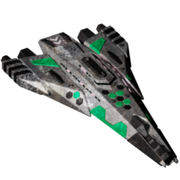</img><br>


[sheragi-rebirth.zip](https://github.com/Hecter94/EndlessSky-PluginArchive/releases/download/Latest/sheragi-rebirth.zip) | 1.4 mb | 2023-07-27 | [view files](https://github.com/Hecter94/EndlessSky-PluginArchive/tree/main/Working/sheragi-rebirth/) <br>
Author: Petersupes | Category: Story <br>
[https://github.com/Petersupes/sheragi-rebirth](https://github.com/Petersupes/sheragi-rebirth) (last commit 2023-04-02) <br>

>Adds a new questline that leads to a small sheragi star cluster.
>


Status: N/A <br>
Daily update check: </img><br>


---

### Smugglers, Corporations, and Other Thieves


[Smugglers.Corporations.and.Other.Thieves.zip](https://github.com/Hecter94/EndlessSky-PluginArchive/releases/download/Latest/Smugglers.Corporations.and.Other.Thieves.zip) | 3.38 mb | 2022-10-06 | [view files](https://github.com/Hecter94/EndlessSky-PluginArchive/tree/main/Working/Smugglers,%20Corporations,%20and%20Other%20Thieves/) <br>
Author: pootthedestroyer | Category: Story <br>
N/A[]()  <br>

>Add a few new ships and weapons.
>


Status: Playable on 0.9.14, 0.9.15 Continuous. <br>
Daily update check: </img><br>


---

### Space Shuttle Start
</img><br>


[Space.Shuttle.Start.zip](https://github.com/Hecter94/EndlessSky-PluginArchive/releases/download/Latest/Space.Shuttle.Start.zip) | 645.93 kb | 2023-07-27 | [view files](https://github.com/Hecter94/EndlessSky-PluginArchive/tree/main/Working/Space%20Shuttle%20Start/) <br>
Author: MidnightPlugins | Category: Story <br>
[https://github.com/MidnightPlugins/Space-Shuttle-Start](https://github.com/MidnightPlugins/Space-Shuttle-Start) (last commit 2022-10-21) <br>

>Start in the Sol system with an old Earth relic for your ship.
>
>The space shuttle has no weapons, but lots of cargo space.
>
>It has an Afterburner.
>
>

<details>
<summary>:blue_book: Plugin readme</summary>
<blockquote># Space-Shuttle-Start
An alternate start for Endless Sky.

Start in the Sol system with an old Earth relic for your ship.

The space shuttle has lots of cargo space and a drone bay, but few weapons.

It has an Afterburner.

"You were born on New Boston, but moved to Earth at a young age. You've dreamed of owning a starship ever since your first visit to the spaceport at the age of fifteen. A few years later, your dream came true when you got a bargain on an old Earth relic that was up for auction. After many years working at a textile mill, you've finally saved enough credits to fix the shuttle, but there's still a debt to pay off."

</blockquote>
</details>

Status: N/A <br>
Daily update check: </img><br>


---

### SpaceCrate
</img><br>


[SpaceCrate.zip](https://github.com/Hecter94/EndlessSky-PluginArchive/releases/download/Latest/SpaceCrate.zip) | 126.59 kb | 2023-07-27 | [view files](https://github.com/Hecter94/EndlessSky-PluginArchive/tree/main/Working/SpaceCrate/) <br>
Author: Arnan de Gans | Category: Story <br>
[https://github.com/adegans/SpaceCrate](https://github.com/adegans/SpaceCrate) (last commit 2023-06-11) <br>

>SpaceCrate adds planet X-283N1 in the Alpha Centauri system. A rapidly developing world obsessed with trade and exports. Ship workers and raw materials in bulk to the planet. Export everything they produce.
>
>
>

<details>
<summary>:blue_book: Plugin readme</summary>
<blockquote>---------------------------------------------------------------------------------------------
---------------------------------------------------------------------------------------------
---THANKS FOR TRYING SPACECRATE A SILLY BUT SERIOUS ATTEMPT TO ADD CONTENT TO ENDLESS SKY!---
---------------------------------------------------------------------------------------------
---------------------------------------------------------------------------------------------

---------------------------------------------------------------------------------------------
- WHAT TO EXPECT FROM SPACECRATE

SpaceCrate is a trade mod focused on lucrative deals from a trade planet perspective.
In Alpha Centauri you'll find a rich planet called X-283N1 whose people are obsessed with
trade and exports. An implied silly 'narrative' exists appointing Arnan (me) as its CEO
running the place. The people on X-283N1 love trade and exports so much that they have no
time for petty politics. All they want is to ship stuff to the galaxy. And they're willing
to pay.

Their obsession with exports requires a lot of imports as well. Notably raw materials. You
will find Bulk Deliveries aimed at X-283N1 throughout many systems, as well as prospecting
passengers who want to travel to the planet to find a new career. This in turn results in
shipments of all sizes being ready for export. Higher paying and more challenging jobs are
unlocked as your reputation and combat rating goes up.

You gain reputation with SpaceCrate Inc. by doing jobs and to some extend killing pirates.
Once your reputation is sufficiently high CEO Arnan sends out a recruiter to give you a job
with a salary through a basic story line. Completing the story line successfully will
unlock employee missions, which are larger and riskier jobs normally reserved for the inner
circle of SpaceCrate.

Other than a few illicit jobs you will not find fighting missions or other combat related
activities in this plugin as that is not what this mod is for. Instead the mod relies on
already available mechanics to create a (pirate) threat for your growing merchant fleet.
The planet does have a sizable defense force that will attack you like a bunch of mad
pirates should you contest the planet. Some jobs require a combat rating to be offered.

You'll see CEO Arnan fly in and around Alpha Centauri in his ship 'StarGoose' encouraging
you to visit his planet and make some money. Regular trade fleets can be seen flying near
Alpha Centauri sometimes with witty remarks or hints about the various jobs and perks
SpaceCrate has to offer.

SpaceCrate is a bit of an experiment with how the plugin system works.

Post your experience on the repo: https://github.com/adegans/SpaceCrate/discussions

---------------------------------------------------------------------------------------------
- BALANCING

If you find any balancing issues, for example ridiculous rewards or shipments that never fit
into your hold... Let me know. I'm making things up as I go along and some of the numbers
don't mean a whole lot to me, yet!

Post your concerns on the repo: https://github.com/adegans/SpaceCrate/discussions

---------------------------------------------------------------------------------------------
- INSTALLATION

Download and extract the zip file for SpaceCrate for example to your desktop of downloads folder.
Move the extracted folder in the plugins directory for your endless sky installation.

On macOS:
~/Library/Application Support/endless-sky/plugins

On Linux:
~/.local/share/endless-sky/plugins/

On Windows:
C:\Users\yourusername\AppData\Roaming\endless-sky\plugins\


---------------------------------------------------------------------------------------------
- TODO / IDEAS

	* Unlock shipyard through missions?
	* Unlock outfitter through missions?
	* Specialized SpaceCrate cargo ships?
	* Set up trade outposts (stations) in the region through missions?

Post your ideas on the repo: https://github.com/adegans/SpaceCrate/discussions

---------------------------------------------------------------------------------------------
- CHANGELOG

0.4.1
	* Fixed: Trigger for employment storyline is not an actual job
	* Tweak: Removed combat rating requirement from most jobs
	* Tweak: Added/streamlined reputation requirement for jobs to help new pilots
	* Tweak: Larger defense force fleets
	* Fixed: Various typos in mission briefs and dialog

0.4
	* Tweak: Increased SpaceCrate salary in order to operate larger fleets
	* Added: If you reach a high enough reputation with SpaceCrate while employed a new side-story "A Wild Goose Chase" has been added.
	* Fixed: Various typos in mission briefs and dialog

0.3
	* Added: Get a high enough reputation and unlock a short storyline to get employed by SpaceCrate Inc.
	* Added: Exclusive employee missions with higher rewards and risks (optional)
	* Added: Reputation earned by completing SpaceCrate Inc. missions
	* Added: Reputation lost by failing/aborting a SpaceCrate Inc. missions
	* Added: Reputation earned by killing pirates
	* Added: 'Corrupt SpaceCrate Official' to X-283N1 Spaceport to leak your reputation score
	* Added: 4 Delivery export missions unlocked by completing other small missions
	* Added: 4 Large Delivery export missions unlocked by completing other medium missions
	* Added: 4 Bulk Delivery export missions unlocked by completing other large missions
	* Added: 4 Bulk Delivery import missions available throughout human systems
	* Added: 2 jobs to terminate SpaceCrate employment
	* Added: Small random chance on a pirate raid on Employee and Bulk Delivery missions
	* Added: Trade fleets in many neighboring systems
	* Added: Hails attempting to be funny
	* Added: Hails dropping hints about things to do in SpaceCrate (Similar to spaceport hints)
	* Tweak: Bulk cargo jobs now require reputation with SpaceCrate to unlock
	* Tweak: Slightly reduced passenger mission availability
	* Tweak: Government attitude to be "less caring" for other factions
	* Tweak: Defense fleet now scans incoming ships (enforcement)
	* Tweak: Ship callsigns
	* Tweak: SpaceCrate Inc 'Yellow' now slightly less bright.
	* Fixed: Missing 'stopover dialog' for all passenger pickup jobs
	* Fixed: Mission availability 'random' values were too high
	* Fixed: Planet description readability
	* Fixed: CEO Arnan personalities
	* Fixed: CEO Arnan spawn locations
	* Fixed: Removed duplicate ships in fleet variants

0.2
	* Fixed: Several passenger mission descriptions

0.1
	* First release
	* Added planet X-283N1 in Alpha Centauri
	* Added flying NPC "Arnan de Gans" who acts as the CEO of planet X-283N1
	* Added Government X-283N1 Inc. (based of of Republic)
	* Added X-283N1 Defense fleet (inspired by larger pirate fleets)
	* Added X-283N1 merchant fleet (inspired by Southern Merchant fleets)

</blockquote>
</details>

Status: Tested on: ES 0.9.16.1 (macOS) <br>
Daily update check: </img><br>


---

### Superquest


[Superquest.zip](https://github.com/Hecter94/EndlessSky-PluginArchive/releases/download/Latest/Superquest.zip) | 12.83 kb | 2022-10-06 | [view files](https://github.com/Hecter94/EndlessSky-PluginArchive/tree/main/Working/Superquest/) <br>
Author: N/A | Category: Story <br>
N/A[]()  <br>

>a bunch of missions to renew your pilots license
>


Status: N/A <br>
Daily update check: </img><br>


---

### Syndicate
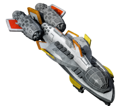</img><br>


[Syndicate.zip](https://github.com/Hecter94/EndlessSky-PluginArchive/releases/download/Latest/Syndicate.zip) | 164.06 kb | 2023-07-27 | [view files](https://github.com/Hecter94/EndlessSky-PluginArchive/tree/main/Working/Syndicate/) <br>
Author: N/A | Category: Story <br>
N/A[]()  <br>

>This is an alternate start for Endless Sky, with a full storyline running parallel to the Free Worlds story.
>

<details>
<summary>:blue_book: Plugin readme</summary>
<blockquote># Syndicate Storyline for Endless Sky, v0.2

This is an alternate start for Endless Sky, with a full storyline running parallel to the Free Worlds story.

## Current status

Intro and part 2/4 finished: Runs up almost to the point of the Free Worlds choice to side with the defector or Syndicate

- Plus the main side-plot for part I, and some side jobs

I've written the story outline for the rest, up to the end of the civil war, but not written it into the game yet: that's To Be Continued.

## How to play/install

First play Endless Sky (https://github.com/endless-sky/endless-sky/). I recommend playing the main version first, up to the end of the main Free Worlds storyline. This alternate-start's intro is not as helpful for beginners, and maybe the story is more fun if you already know what's happening on the Free Worlds side... or, maybe it's fun the other way around! Good point! Well, up to you then.

To play, download this repository (or a release folder) into your plugins directory for Endless Sky. You probably already know how. If not, let me know, and I'll get round to updating this readme with the instructions.

You need Endless Sky minimum version 0.9.15, which at time of writing is the continuous build in the main Endless Sky project.

</blockquote>
</details>

Status: N/A <br>
Daily update check: </img><br>


---

### Syndicate Campaign
</img><br>


[Syndicate.Campaign.zip](https://github.com/Hecter94/EndlessSky-PluginArchive/releases/download/Latest/Syndicate.Campaign.zip) | 694.68 kb | 2023-07-27 | [view files](https://github.com/Hecter94/EndlessSky-PluginArchive/tree/main/Working/Syndicate%20Campaign/) <br>
Author: Amazinite | Category: Story <br>
[https://github.com/Amazinite/ES-Syndicate-Campaign](https://github.com/Amazinite/ES-Syndicate-Campaign) (last commit 2019-08-13) <br>

>This is an alternate start for Endless Sky, with a full storyline running parallel to the Free Worlds story.
>
>Current status
>
>Main story and most side-things, complete. This will take you up to the end of the civil war, all completed and ready to continue the game as if you'd completed the main-game story.
>
>Remaining: logs on all the events; a few more epilogue conversations; and various hopefully-minor issues, both discovered and undiscovered.
>

<details>
<summary>:blue_book: Plugin readme</summary>
<blockquote># ES-Syndicate-Campaign
The development repository for the Syndicate campaign of Endless Sky. Spoilers ahead.

### What's this exta stuff folder?
I'm keeping my workflow public for anyone to check out and comment on. This folder contains all the things I'm using to help create the campaign, from Blender files of any new models to text files containing any work for the development process. Given the nature of my workflow, this will be a mix of new and old stuff, some (maybe even most) of which that may not make any sense whatsoever and may never be used. It can also get rather unorganized. Below is a description of the text files in the extra stuff folder, but just take everything you see in these files with a grain of salt as none of it is set in stone.

* everything syndicate.txt: a file containing every reference to the Syndicate in the game.
* syndicate info.txt: a distilled, summarized version of the above file.
* character sheet.txt: a file containing info on all the characters new and old that are part of the Syndicate.
* syndicate notes.txt: a file of random notes that I've taken during the development of the campaign.
* rough storyboard.txt: a file that contains a VERY rough (WIP) storyboard of how things will go. More polished storyboards will be located in the data folder once I'm actually about to start writing that part.

</blockquote>
</details>

Status: N/A <br>
Daily update check: </img><br>


---

### Syndicate Consultancy


[Syndicate.Consultancy.zip](https://github.com/Hecter94/EndlessSky-PluginArchive/releases/download/Latest/Syndicate.Consultancy.zip) | 12.44 kb | 2023-07-27 | [view files](https://github.com/Hecter94/EndlessSky-PluginArchive/tree/main/Working/Syndicate%20Consultancy/) <br>
Author: Elyssaen | Category: Story <br>
[https://github.com/Elyssaen/syndicate-consultancy](https://github.com/Elyssaen/syndicate-consultancy) (last commit 2017-05-18) <br>

>Side stories working for various parties within the Syndicate in Endless Sky. 
>


Status: N/A <br>
Daily update check: </img><br>


---

### Syndicate Story
</img><br>


[Syndicate.Story.zip](https://github.com/Hecter94/EndlessSky-PluginArchive/releases/download/Latest/Syndicate.Story.zip) | 284.75 kb | 2023-10-18 | [view files](https://github.com/Hecter94/EndlessSky-PluginArchive/tree/main/Working/Syndicate%20Story/) <br>
Author: leklachu | Category: Story <br>
[https://github.com/leklachu/endless-sky-syndicate](https://github.com/leklachu/endless-sky-syndicate) (last commit 2023-10-18) <br>

>This is an alternate start for Endless Sky, with a full storyline running parallel to the Free Worlds story.
>
>

<details>
<summary>:blue_book: Plugin readme</summary>
<blockquote># Crisis in Management, a Syndicate Storyline for Endless Sky

v0.9

This is an alternate start for Endless Sky, with a full storyline running parallel to the Free Worlds story.

> Leave your failing company and take to the stars to escape repercussions, then find yourself in the background, behind the scenes of Endless Sky's main storyline.  
> Beyond that, the same, endless, sky awaits.

## How to play/install

First play Endless Sky (https://github.com/endless-sky/endless-sky/). I recommend playing the main version first, up to the end of the main Free Worlds storyline. This alternate-start's intro is not as helpful for beginners, and maybe the story is more fun if you already know what's happening on the Free Worlds side... or, maybe it's fun the other way around! Good point! Well, up to you then.

To play, download this repository (or a release folder) into your plugins directory for Endless Sky, or install with ESLauncher2 (available there soon I hope).

You need Endless Sky minimum version 0.9.15, which at time of writing is the most recent release. If perchance you're playing this in the future and it doesn't work any more, please let me know and I'll try to fix it for current release.

## Current status

Approximately complete. There are a few things I want to improve sometime (feel free to help speed that up by telling me how much you loved... or hated but want to love, the plugin). For that and for bug reports you can open an issue or discussion on Github, or dig through the files to find my email address.

## Contribution and Copying

Many thanks to everyone at Endless Sky, without whom this wouldn't make a lot of sense, and would never have happened. Special thanks to samrocketman who gave advice on tidying up the licence and things.

Images are thanks to Michael Zahniser and Becca Tommaso (see copyright file).

The text of this I release into the public domain. While, if you publish an altered version of this story I'd appreciate if you let me know or even ask me first; but I place no legal restrictions on this and have waived my copyright.
</blockquote>
</details>

Status: N/A <br>
Daily update check: </img><br>


---

### test convo


[test.convo.zip](https://github.com/Hecter94/EndlessSky-PluginArchive/releases/download/Latest/test.convo.zip) | 3.8 kb | 2022-10-06 | [view files](https://github.com/Hecter94/EndlessSky-PluginArchive/tree/main/Working/test%20convo/) <br>
Author: N/A | Category: Story <br>
N/A[]()  <br>

>All this variant/plugin adds is a little more background to the PC on start, to reduce the whole feeling of being parachuted into a bank with a loan signing hanging over your head.
>


Status: N/A <br>
Daily update check: </img><br>


---

### That Someone


[That.Someone.zip](https://github.com/Hecter94/EndlessSky-PluginArchive/releases/download/Latest/That.Someone.zip) | 451.29 kb | 2022-10-06 | [view files](https://github.com/Hecter94/EndlessSky-PluginArchive/tree/main/Working/That%20Someone/) <br>
Author: N/A | Category: Story <br>
N/A[]()  <br>

>N/A
>


Status: N/A <br>
Daily update check: </img><br>


---

### The Legacy
</img><br>


[The.Legacy.zip](https://github.com/Hecter94/EndlessSky-PluginArchive/releases/download/Latest/The.Legacy.zip) | 633.94 kb | 2023-07-27 | [view files](https://github.com/Hecter94/EndlessSky-PluginArchive/tree/main/Working/The%20Legacy/) <br>
Author: pega3 | Category: Story <br>
[https://github.com/pega3/endless-sky-the-legacy-plugin](https://github.com/pega3/endless-sky-the-legacy-plugin) (last commit 2020-08-02) <br>

>Endless Sky: The Legacy takes the player on a chase through the Galaxy, covering
>multiple races and testing the knowledge of the player on the systems of Endless
>Sky and the storylines.
>

<details>
<summary>:blue_book: Plugin readme</summary>
<blockquote># endless-sky-the-legacy-plugin

Endless Sky: The Legacy - plugin
A chase through the galaxy on the trail of a mysterious legacy

Endless Sky: The Legacy takes the player on a chase through the Galaxy, covering
multiple races and testing the knowledge of the player on the systems of Endless
Sky and the storylines.

Prerequisites:
- The major campaigns should be finished (FW, Wanderer, Remnant)
- Rim Archaeology done
- Transported TMBR to Hai space or even back to the Deep scientists
- Saved the couple from Smuggler's den and have revisited them

To kick off the mission, visit a Spaceport on one of the Paradise planets

</blockquote>
</details>

Status: N/A <br>
Daily update check: </img><br>


---

### The Mysterious Baby


[The.Mysterious.Baby.zip](https://github.com/Hecter94/EndlessSky-PluginArchive/releases/download/Latest/The.Mysterious.Baby.zip) | 0.67 kb | 2022-10-06 | [view files](https://github.com/Hecter94/EndlessSky-PluginArchive/tree/main/Working/The%20Mysterious%20Baby/) <br>
Author: N/A | Category: Story <br>
N/A[]()  <br>

>does nothing, its a single nonfunctional mission
>


Status: Nonfunctional <br>
Daily update check: </img><br>


---

### The Station of Dr. Rousseau


[The.Station.of.Dr.Rousseau.zip](https://github.com/Hecter94/EndlessSky-PluginArchive/releases/download/Latest/The.Station.of.Dr.Rousseau.zip) | 2.5 mb | 2022-10-06 | [view files](https://github.com/Hecter94/EndlessSky-PluginArchive/tree/main/Working/The%20Station%20of%20Dr.%20Rousseau/) <br>
Author: Fallen Cat | Category: Story <br>
N/A[]()  <br>

>N/A
>


Status: N/A <br>
Daily update check: </img><br>


---

### Tribute and Domination


[Tribute.and.Domination.zip](https://github.com/Hecter94/EndlessSky-PluginArchive/releases/download/Latest/Tribute.and.Domination.zip) | 39.96 kb | 2022-10-06 | [view files](https://github.com/Hecter94/EndlessSky-PluginArchive/tree/main/Working/Tribute%20and%20Domination/) <br>
Author: Legolas | Category: Story <br>
N/A[]()  <br>

>Allow you to tribute (almost) every planet(alien included) and start your own faction.
>


Status: Playable on 0.9.14, 0.9.15 Continuous. <br>
Daily update check: </img><br>


---

### Unfettered Conquest


[Unfettered.Conquest.zip](https://github.com/Hecter94/EndlessSky-PluginArchive/releases/download/Latest/Unfettered.Conquest.zip) | 1.64 mb | 2023-07-27 | [view files](https://github.com/Hecter94/EndlessSky-PluginArchive/tree/main/Working/Unfettered%20Conquest/) <br>
Author: Amazinite | Category: Story <br>
[https://github.com/Amazinite/ES-Unfettered-Conquest](https://github.com/Amazinite/ES-Unfettered-Conquest) (last commit 2017-06-04) <br>

>Yet another planned plugin for Endless Sky. This one will have the aim of getting into the vanilla game as an actual story, though. 
>


Status: N/A <br>
Daily update check: </img><br>


---

### Wanderers Storyline


[Wanderers.Storyline.zip](https://github.com/Hecter94/EndlessSky-PluginArchive/releases/download/Latest/Wanderers.Storyline.zip) | 369.11 kb | 2023-07-27 | [view files](https://github.com/Hecter94/EndlessSky-PluginArchive/tree/main/Working/Wanderers%20Storyline/) <br>
Author: beccabunny | Category: Story <br>
[https://github.com/beccabunny/Wanderer-Storyline](https://github.com/beccabunny/Wanderer-Storyline) (last commit 2019-09-03) <br>

>A continuation to the wanderer storyline, with new ships, outfits and missions!

<details>
<summary>:blue_book: Plugin readme</summary>
<blockquote># Wanderer-Storyline
A continuation to the wanderer storyline, with new ships, outfits and missions!

</blockquote>
</details>

Status: N/A <br>
Daily update check: </img><br>


---

### WanderersPart3


[WanderersPart3.zip](https://github.com/Hecter94/EndlessSky-PluginArchive/releases/download/Latest/WanderersPart3.zip) | 10.32 kb | 2023-07-27 | [view files](https://github.com/Hecter94/EndlessSky-PluginArchive/tree/main/Working/WanderersPart3/) <br>
Author: warp core | Category: Story <br>
[https://github.com/warp-core/WanderersPart3](https://github.com/warp-core/WanderersPart3) (last commit 2022-08-04) <br>

>A potential continuation of the Wanderer story in Endless Sky.


Status: N/A <br>
Daily update check: </img><br>


---

### WandererStart


[WandererStart.zip](https://github.com/Hecter94/EndlessSky-PluginArchive/releases/download/Latest/WandererStart.zip) | 9.07 kb | 2023-07-27 | [view files](https://github.com/Hecter94/EndlessSky-PluginArchive/tree/main/Working/WandererStart/) <br>
Author: williaji | Category: Story <br>
[https://github.com/williaji/WandererStart](https://github.com/williaji/WandererStart) (last commit 2022-05-08) <br>

>a bunch of wanderer missions

<details>
<summary>:blue_book: Plugin readme</summary>
<blockquote># WandererStart

</blockquote>
</details>

Status: N/A <br>
Daily update check: </img><br>


---

### Warm Start


[Warm.Start.zip](https://github.com/Hecter94/EndlessSky-PluginArchive/releases/download/Latest/Warm.Start.zip) | 38.38 kb | 2023-07-27 | [view files](https://github.com/Hecter94/EndlessSky-PluginArchive/tree/main/Working/Warm%20Start/) <br>
Author: David Elworthy | Category: Story <br>
N/A[]()  <br>

>This plugin gives you some alternatives for the starting character. The choices are:
>
>  the standard starting character from the official version of Endless Sky.
>  an adventurer with a good combat rating.
>  an inexperienced youth with a trust fund.
>  a merchant with a temporarily mislaid ship.
>
>For the last two of these, you'll have to complete a simple mission.
>

<details>
<summary>:blue_book: Plugin readme</summary>
<blockquote>Once you've played Endless Sky a few times, the early stages of building up from your initial ship can be a little dull. This plugin gives you some alternatives for the starting character. The choices are:
- the standard starting character from the official version of Endless Sky.
- an adventurer with a good combat rating.
- an inexperienced youth with a trust fund.
- a merchant with a temporarily mislaid ship.

For the last two of these, you'll have to complete a simple mission.

</blockquote>
</details>

Status: N/A <br>
Daily update check: </img><br>


---

### Watcher


[Watcher.zip](https://github.com/Hecter94/EndlessSky-PluginArchive/releases/download/Latest/Watcher.zip) | 11.76 kb | 2023-07-27 | [view files](https://github.com/Hecter94/EndlessSky-PluginArchive/tree/main/Working/Watcher/) <br>
Author: Natan Gold | Category: Story <br>
N/A[]()  <br>

>Roughly double weapon ranges for all non-homing, non-beam weapons.
>
>Most small, fast projectiles have this weighted as higher velocity, while most big, slow projectiles have this weighted as longer lifetime.
>
>Adds cluster and parallel to most longer ranged weapons.
>
>Includes blaster changes to turn them into more of an anti-fighter screen, but I'm only 84% satisfied with that atm.
>
>


Status: N/A <br>
Daily update check: </img><br>


</details>


[back to top](https://github.com/Hecter94/EndlessSky-PluginArchive/blob/main/plugins.md#Story)


---

## Weapons

<p>41 plugins in this category.<p>

<details>

 

---

### 50 cal


[50.cal.zip](https://github.com/Hecter94/EndlessSky-PluginArchive/releases/download/Latest/50.cal.zip) | 57.81 kb | 2022-10-06 | [view files](https://github.com/Hecter94/EndlessSky-PluginArchive/tree/main/Working/50%20cal/) <br>
Author: 1010Todd | Category: Weapons <br>
N/A[]()  <br>

>Adds M2 Browning as ship outfit and H2H, also made Sparrow variant with it, and make npcs use it.
>


Status: complete and playable on 0.9.15 continous <br>
Daily update check: </img><br>


---

### Andromeda Torpedo


[Andromeda.Torpedo.zip](https://github.com/Hecter94/EndlessSky-PluginArchive/releases/download/Latest/Andromeda.Torpedo.zip) | 6.87 mb | 2022-10-06 | [view files](https://github.com/Hecter94/EndlessSky-PluginArchive/tree/main/Working/Andromeda%20Torpedo/) <br>
Author: N/A | Category: Weapons <br>
N/A[]()  <br>

>Adds a torpedo and launcher to the game.
>


Status: N/A <br>
Daily update check: </img><br>


---

### Assorted Outfits


[Assorted.Outfits.zip](https://github.com/Hecter94/EndlessSky-PluginArchive/releases/download/Latest/Assorted.Outfits.zip) | 96.83 kb | 2022-10-06 | [view files](https://github.com/Hecter94/EndlessSky-PluginArchive/tree/main/Working/Assorted%20Outfits/) <br>
Author: N/A | Category: Weapons <br>
N/A[]()  <br>

>adds some new weapons(ionizer blaster, incendiary launcher/rockets/rack)
>


Status: N/A <br>
Daily update check: </img><br>


---

### Ballistic Mayhem


[Ballistic.Mayhem.zip](https://github.com/Hecter94/EndlessSky-PluginArchive/releases/download/Latest/Ballistic.Mayhem.zip) | 106.54 kb | 2022-10-06 | [view files](https://github.com/Hecter94/EndlessSky-PluginArchive/tree/main/Working/Ballistic%20Mayhem/) <br>
Author: SpiralCat | Category: Weapons <br>
N/A[]()  <br>

>Adds a ship and several outfits.
>


Status: Ship and outfits are nowhere for sale. <br>
Daily update check: </img><br>


---

### Better Thunderhead Lance


[Better.Thunderhead.Lance.zip](https://github.com/Hecter94/EndlessSky-PluginArchive/releases/download/Latest/Better.Thunderhead.Lance.zip) | 281.27 kb | 2022-10-06 | [view files](https://github.com/Hecter94/EndlessSky-PluginArchive/tree/main/Working/Better%20Thunderhead%20Lance/) <br>
Author: BCPowerhouse | Category: Weapons <br>
N/A[]()  <br>

>Modifies this outfit.
>


Status: N/A <br>
Daily update check: </img><br>


---

### Burst Anti-Missile


[Burst.Anti-Missile.zip](https://github.com/Hecter94/EndlessSky-PluginArchive/releases/download/Latest/Burst.Anti-Missile.zip) | 2.89 kb | 2022-10-06 | [view files](https://github.com/Hecter94/EndlessSky-PluginArchive/tree/main/Working/Burst%20Anti-Missile/) <br>
Author: mdsmestad | Category: Weapons <br>
N/A[]()  <br>

>Adds 6 new outfits.
>


Status: N/A <br>
Daily update check: </img><br>


---

### Cannon Friendly Weapon Pack


[Cannon.Friendly.Weapon.Pack.zip](https://github.com/Hecter94/EndlessSky-PluginArchive/releases/download/Latest/Cannon.Friendly.Weapon.Pack.zip) | 214.13 kb | 2022-10-06 | [view files](https://github.com/Hecter94/EndlessSky-PluginArchive/tree/main/Working/Cannon%20Friendly%20Weapon%20Pack/) <br>
Author: Kyle Willey | Category: Weapons <br>
N/A[]()  <br>

>The Cannon Friendly Weapon Pack (pun intended) is a selection of guns and lasers that aims to add more versatility to the range of weapons in Endless Sky. It attempts to blend itself into the canon where possible.
>
>The Cannon Friendly Weapon Pack has a number of weapons and weapon additions, such as ammunition storage for most vanilla weapons, all the ammunition-consuming weapons in the CFWP, and more.
>


Status: N/A <br>
Daily update check: </img><br>


---

### Dual Blaster


[Dual.Blaster.zip](https://github.com/Hecter94/EndlessSky-PluginArchive/releases/download/Latest/Dual.Blaster.zip) | 69.92 kb | 2022-10-06 | [view files](https://github.com/Hecter94/EndlessSky-PluginArchive/tree/main/Working/Dual%20Blaster/) <br>
Author: Nathan | Category: Weapons <br>
N/A[]()  <br>

>Adds a weapon.
>


Status: Should work <br>
Daily update check: </img><br>


---

### EMP Weapons


[EMP.Weapons.zip](https://github.com/Hecter94/EndlessSky-PluginArchive/releases/download/Latest/EMP.Weapons.zip) | 2.68 mb | 2022-10-06 | [view files](https://github.com/Hecter94/EndlessSky-PluginArchive/tree/main/Working/EMP%20Weapons/) <br>
Author: Fallen Cat | Category: Weapons <br>
N/A[]()  <br>

>Adds some outfits and a ship.
>


Status: Ship and outfits are nowhere for sale. <br>
Daily update check: </img><br>


---

### Evasion Bomb


[Evasion.Bomb.zip](https://github.com/Hecter94/EndlessSky-PluginArchive/releases/download/Latest/Evasion.Bomb.zip) | 1.05 kb | 2022-10-06 | [view files](https://github.com/Hecter94/EndlessSky-PluginArchive/tree/main/Working/Evasion%20Bomb/) <br>
Author: Vilhelm | Category: Weapons <br>
N/A[]()  <br>

>Adds 2 outfits.
>


Status: Outfits are nowhere for sale. <br>
Daily update check: </img><br>


---

### Extra Missiles Outfit


[Extra.Missiles.Outfit.zip](https://github.com/Hecter94/EndlessSky-PluginArchive/releases/download/Latest/Extra.Missiles.Outfit.zip) | 2.53 kb | 2022-10-06 | [view files](https://github.com/Hecter94/EndlessSky-PluginArchive/tree/main/Working/Extra%20Missiles%20Outfit/) <br>
Author: N/A | Category: Weapons <br>
N/A[]()  <br>

>Adds some missile outfits.
>


Status: Should work <br>
Daily update check: </img><br>


---

### Fancy Weapons


[Fancy.Weapons.zip](https://github.com/Hecter94/EndlessSky-PluginArchive/releases/download/Latest/Fancy.Weapons.zip) | 1.85 mb | 2022-10-06 | [view files](https://github.com/Hecter94/EndlessSky-PluginArchive/tree/main/Working/Fancy%20Weapons/) <br>
Author: 1010todd | Category: Weapons <br>
N/A[]()  <br>

>Add various weapons utilizing complex submunition chain to be used as example. Not intended for normal gameplay.


Status: Requires AES Omnis to access. <br>
Daily update check: </img><br>


---

### Flak Weapons


[Flak.Weapons.zip](https://github.com/Hecter94/EndlessSky-PluginArchive/releases/download/Latest/Flak.Weapons.zip) | 75.49 kb | 2023-07-27 | [view files](https://github.com/Hecter94/EndlessSky-PluginArchive/tree/main/Working/Flak%20Weapons/) <br>
Author: tehhowch | Category: Weapons <br>
[https://github.com/tehhowch/es-modding](https://github.com/tehhowch/es-modding) (last commit 2017-08-14) <br>

>Adds some weapon outfits.
>

<details>
<summary>:blue_book: Plugin readme</summary>
<blockquote>This repository is for any content I create for the cross-platform application 'Endless Sky'.

You are welcome to clone or fork this repository and modify its contents as appropriate, in accordance with the GPLv3 license.
Images (.png) and creative assets (*.blend, *.xcf) are licensed under CC-BY-SA 4.0

I welcome any collaboration and contributions you wish to make.

You may obtain your own copy of Endless Sky at https://github.com/endless-sky/endless-sky

</blockquote>
</details>

Status: N/A <br>
Daily update check: </img><br>


---

### Flak&Snare


[Flak.Snare.zip](https://github.com/Hecter94/EndlessSky-PluginArchive/releases/download/Latest/Flak.Snare.zip) | 75.42 kb | 2023-07-27 | [view files](https://github.com/Hecter94/EndlessSky-PluginArchive/tree/main/Working/Flak&Snare/) <br>
Author: tehhowch | Category: Weapons <br>
[https://github.com/tehhowch/es-modding](https://github.com/tehhowch/es-modding) (last commit 2017-08-14) <br>

>Adds some weapon outfits.
>

<details>
<summary>:blue_book: Plugin readme</summary>
<blockquote>This repository is for any content I create for the cross-platform application 'Endless Sky'.

You are welcome to clone or fork this repository and modify its contents as appropriate, in accordance with the GPLv3 license.
Images (.png) and creative assets (*.blend, *.xcf) are licensed under CC-BY-SA 4.0

I welcome any collaboration and contributions you wish to make.

You may obtain your own copy of Endless Sky at https://github.com/endless-sky/endless-sky

</blockquote>
</details>

Status: N/A <br>
Daily update check: </img><br>


---

### Flamethrower Turret


[Flamethrower.Turret.zip](https://github.com/Hecter94/EndlessSky-PluginArchive/releases/download/Latest/Flamethrower.Turret.zip) | 74.02 kb | 2023-07-27 | [view files](https://github.com/Hecter94/EndlessSky-PluginArchive/tree/main/Working/Flamethrower%20Turret/) <br>
Author: ItsNickBarry | Category: Weapons <br>
[https://github.com/ItsNickBarry/endless-sky-flamethrower-turret](https://github.com/ItsNickBarry/endless-sky-flamethrower-turret) (last commit 2021-01-26) <br>

>adds a turret variant of the flamethrower.
>

<details>
<summary>:blue_book: Plugin readme</summary>
<blockquote># Endless Sky Flamethrower Turret
A plugin for [Endless Sky][endless-sky] which adds a turret variant of the flamethrower.

![image][image]

[endless-sky]: https://github.com/endless-sky/endless-sky
[image]: images/outfit/flamethrower%20turret@2x.png

## Installation
You must create a "plugins" folder in one of two places, depending on your operating system:

### Linux ###
* /usr/share/endless-sky/plugins/
* ~/.local/share/endless-sky/plugins/

### Windows ###
* plugins\ (in the same folder as the Endless Sky executable)
* C:\Users\yourusername\AppData\Roaming\endless-sky\plugins\

### Mac OS X ###
* Content/Resources/plugins/ (within the application bundle)
* ~/Library/ApplicationSupport/endless-sky/plugins

Download the latest [release][releases] and extract it into your plugins folder.

More information may be available on the [Endless Sky Wiki][wiki].

[releases]: https://github.com/ItsNickBarry/endless-sky-flamethrower-turret/releases
[wiki]: https://github.com/endless-sky/endless-sky/wiki

</blockquote>
</details>

Status: N/A <br>
Daily update check: </img><br>


---

### Gungnir


[Gungnir.zip](https://github.com/Hecter94/EndlessSky-PluginArchive/releases/download/Latest/Gungnir.zip) | 461.32 kb | 2023-07-27 | [view files](https://github.com/Hecter94/EndlessSky-PluginArchive/tree/main/Working/Gungnir/) <br>
Author: jschiav | Category: Weapons <br>
[https://github.com/jschiav/Gungnir](https://github.com/jschiav/Gungnir) (last commit 2020-05-22) <br>

>adds mining laser
>


Status: N/A <br>
Daily update check: </img><br>


---

### HellFire Missile


[HellFire.Missile.zip](https://github.com/Hecter94/EndlessSky-PluginArchive/releases/download/Latest/HellFire.Missile.zip) | 41.35 kb | 2022-10-06 | [view files](https://github.com/Hecter94/EndlessSky-PluginArchive/tree/main/Working/HellFire%20Missile/) <br>
Author: N/A | Category: Weapons <br>
N/A[]()  <br>

>adds hellfire missile launcher and missiles
>


Status: N/A <br>
Daily update check: </img><br>


---

### Interdictor


[Interdictor.zip](https://github.com/Hecter94/EndlessSky-PluginArchive/releases/download/Latest/Interdictor.zip) | 0.61 kb | 2022-10-06 | [view files](https://github.com/Hecter94/EndlessSky-PluginArchive/tree/main/Working/Interdictor/) <br>
Author: Nechochwen | Category: Weapons <br>
N/A[]()  <br>

>Fuel Damage before fuel damage is a thing in vanilla.
>


Status: N/A <br>
Daily update check: </img><br>


---

### Kinetic Weaponry
</img><br>


[Kinetic.Weaponry.zip](https://github.com/Hecter94/EndlessSky-PluginArchive/releases/download/Latest/Kinetic.Weaponry.zip) | 131.44 kb | 2023-07-27 | [view files](https://github.com/Hecter94/EndlessSky-PluginArchive/tree/main/Working/Kinetic%20Weaponry/) <br>
Author: kestrel1110 | Category: Weapons <br>
[https://github.com/kestrel1110/KineticWeaponry](https://github.com/kestrel1110/KineticWeaponry) (last commit 2022-08-02) <br>

>A plugin adding modern realistic weapons to Endless-Sky, including a cannon and two shell types, APFSDS & HEATFS.
>They are tier 1 human weapons, already balanced to work as anti-capital ship weapons.
>

<details>
<summary>:blue_book: Plugin readme</summary>
<blockquote># KineticWeaponry

A plugin adding modern realistic weapons to Endless-Sky, including a cannon and two shell types, APFSDS & HEATFS.
They are tier 1 human weapons, already balanced to work as anti-capital ship weapons.

</blockquote>
</details>

Status: Playable on 0.9.15, 0.9.16, Continuous. <br>
Daily update check: </img><br>


---

### Kraz Cybernetics Evolution


[Kraz.Cybernetics.Evolution.zip](https://github.com/Hecter94/EndlessSky-PluginArchive/releases/download/Latest/Kraz.Cybernetics.Evolution.zip) | 116.15 kb | 2023-07-27 | [view files](https://github.com/Hecter94/EndlessSky-PluginArchive/tree/main/Working/Kraz%20Cybernetics%20Evolution/) <br>
Author: MCOfficer | Category: Weapons <br>
[https://github.com/MCOfficer/Kraz-Cybernetics-Evolution](https://github.com/MCOfficer/Kraz-Cybernetics-Evolution) (last commit 2017-05-15) <br>

>adds the quad electron turret to the kraz outfitter.
>

<details>
<summary>:blue_book: Plugin readme</summary>
<blockquote>Kraz-Cybernetics-Evolution

</blockquote>
</details>

Status: N/A <br>
Daily update check: </img><br>


---

### M.A.C. cannon


[M.A.C.cannon.zip](https://github.com/Hecter94/EndlessSky-PluginArchive/releases/download/Latest/M.A.C.cannon.zip) | 37.98 kb | 2022-10-06 | [view files](https://github.com/Hecter94/EndlessSky-PluginArchive/tree/main/Working/M.A.C.%20cannon/) <br>
Author: N/A | Category: Weapons <br>
N/A[]()  <br>

>adds the magnetic accelerator cannon and its ammo
>


Status: N/A <br>
Daily update check: </img><br>


---

### Mass Driver


[Mass.Driver.zip](https://github.com/Hecter94/EndlessSky-PluginArchive/releases/download/Latest/Mass.Driver.zip) | 1.04 kb | 2022-10-06 | [view files](https://github.com/Hecter94/EndlessSky-PluginArchive/tree/main/Working/Mass%20Driver/) <br>
Author: Daniel Bordeianu | Category: Weapons <br>
N/A[]()  <br>

>adds the mass driver turret and its ammo
>


Status: N/A <br>
Daily update check: </img><br>


---

### Missile Turrets


[Missile.Turrets.zip](https://github.com/Hecter94/EndlessSky-PluginArchive/releases/download/Latest/Missile.Turrets.zip) | 3.13 kb | 2022-10-06 | [view files](https://github.com/Hecter94/EndlessSky-PluginArchive/tree/main/Working/Missile%20Turrets/) <br>
Author: Dalrethliant | Category: Weapons <br>
N/A[]()  <br>

>adds the sidewinder missile turret
>


Status: N/A <br>
Daily update check: </img><br>


---

### Non Lethal


[Non.Lethal.zip](https://github.com/Hecter94/EndlessSky-PluginArchive/releases/download/Latest/Non.Lethal.zip) | 52.62 kb | 2022-10-06 | [view files](https://github.com/Hecter94/EndlessSky-PluginArchive/tree/main/Working/Non%20Lethal/) <br>
Author: N/A | Category: Weapons <br>
N/A[]()  <br>

>adds to tractor beams and several hand to hand outfits
>


Status: N/A <br>
Daily update check: </img><br>


---

### Nuclear Launcher


[Nuclear.Launcher.zip](https://github.com/Hecter94/EndlessSky-PluginArchive/releases/download/Latest/Nuclear.Launcher.zip) | 35.82 kb | 2022-10-06 | [view files](https://github.com/Hecter94/EndlessSky-PluginArchive/tree/main/Working/Nuclear%20Launcher/) <br>
Author: N/A | Category: Weapons <br>
N/A[]()  <br>

>adds nuclear launcher/missiles to the pirate outfitters
>


Status: N/A <br>
Daily update check: </img><br>


---

### Nuke turret


[Nuke.turret.zip](https://github.com/Hecter94/EndlessSky-PluginArchive/releases/download/Latest/Nuke.turret.zip) | 35.66 kb | 2022-10-06 | [view files](https://github.com/Hecter94/EndlessSky-PluginArchive/tree/main/Working/Nuke%20turret/) <br>
Author: 1010todd | Category: Weapons <br>
N/A[]()  <br>

>Tiny plugin that add two outfit: Nuclear Missile Turret and Nuclear Missile Ammo. 
>
>Just happened to have a nuke launcher turret sprite so I turned it into a quick plugin.
>


Status: N/A <br>
Daily update check: </img><br>


---

### OP Thunderhead Lance


[OP.Thunderhead.Lance.zip](https://github.com/Hecter94/EndlessSky-PluginArchive/releases/download/Latest/OP.Thunderhead.Lance.zip) | 281.17 kb | 2022-10-06 | [view files](https://github.com/Hecter94/EndlessSky-PluginArchive/tree/main/Working/OP%20Thunderhead%20Lance/) <br>
Author: BCPowerhouse | Category: Weapons <br>
N/A[]()  <br>

>N/A
>


Status: N/A <br>
Daily update check: </img><br>


---

### Orion Missile


[Orion.Missile.zip](https://github.com/Hecter94/EndlessSky-PluginArchive/releases/download/Latest/Orion.Missile.zip) | 1.87 kb | 2023-07-27 | [view files](https://github.com/Hecter94/EndlessSky-PluginArchive/tree/main/Working/Orion%20Missile/) <br>
Author: Marksman-ES | Category: Weapons <br>
[https://github.com/TheMarksman-ES/Orion-Missile](https://github.com/TheMarksman-ES/Orion-Missile) (last commit 2022-09-11) <br>

>Add a missile based on Orion Drive nuclear propulsion, gets more powerful over range.
>

<details>
<summary>:blue_book: Plugin readme</summary>
<blockquote># Orion-Missile
This plugin features the Orion Missile, a weaponised Orion Drive meant for use against the most hardended ships in the game. However, it is only a fun side project, not meant for serious use against an Archon. 

</blockquote>
</details>

Status: Playable on 0.9.15 Continuous. <br>
Daily update check: </img><br>


---

### Particle Turret


[Particle.Turret.zip](https://github.com/Hecter94/EndlessSky-PluginArchive/releases/download/Latest/Particle.Turret.zip) | 363.74 kb | 2022-10-06 | [view files](https://github.com/Hecter94/EndlessSky-PluginArchive/tree/main/Working/Particle%20Turret/) <br>
Author: Jason Clark | Category: Weapons <br>
N/A[]()  <br>

>adds two missions to unlock the particle turret
>


Status: N/A <br>
Daily update check: </img><br>


---

### Plasma Mine


[Plasma.Mine.zip](https://github.com/Hecter94/EndlessSky-PluginArchive/releases/download/Latest/Plasma.Mine.zip) | 42.73 kb | 2023-07-27 | [view files](https://github.com/Hecter94/EndlessSky-PluginArchive/tree/main/Working/Plasma%20Mine/) <br>
Author: John Abbe | Category: Weapons <br>
N/A[]()  <br>

>Plasma mines - This is a first attempt at mines to see how they fit into combat tactics and learn how to balance them properly. The heat damage gives a decent chance to disable big ships without giving the mines an unbalanced amount of regular damage.
>


Status: N/A <br>
Daily update check: </img><br>


---

### Pulse


[Pulse.zip](https://github.com/Hecter94/EndlessSky-PluginArchive/releases/download/Latest/Pulse.zip) | 20.09 kb | 2023-07-27 | [view files](https://github.com/Hecter94/EndlessSky-PluginArchive/tree/main/Working/Pulse/) <br>
Author: Jesse Dickens | Category: Weapons <br>
N/A[]()  <br>

>The comcept is to create a series of crafts that combine the engineering prowess of the space pirates along with the technology of aliens.
>


Status: N/A <br>
Daily update check: </img><br>


---

### Punt Gun
</img><br>


[Punt.Gun.zip](https://github.com/Hecter94/EndlessSky-PluginArchive/releases/download/Latest/Punt.Gun.zip) | 133.53 kb | 2023-03-04 | [view files](https://github.com/Hecter94/EndlessSky-PluginArchive/tree/main/Working/Punt%20Gun/) <br>
Author: 1010todd | Category: Weapons <br>
N/A[]()  <br>

>Add bigger proton gun with higher knockback, and recoil. Found at Rust, Kraz system.
>


Status: N/A <br>
Daily update check: </img><br>


---

### Quarg AM


[Quarg.AM.zip](https://github.com/Hecter94/EndlessSky-PluginArchive/releases/download/Latest/Quarg.AM.zip) | 189.2 kb | 2022-10-06 | [view files](https://github.com/Hecter94/EndlessSky-PluginArchive/tree/main/Working/Quarg%20AM/) <br>
Author: N/A | Category: Weapons <br>
N/A[]()  <br>

>adds some quarg outfits/weapons
>


Status: N/A <br>
Daily update check: </img><br>


---

### sensor
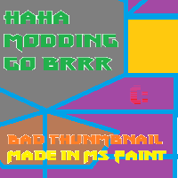</img><br>


[sensor.zip](https://github.com/Hecter94/EndlessSky-PluginArchive/releases/download/Latest/sensor.zip) | 167.37 kb | 2023-08-20 | [view files](https://github.com/Hecter94/EndlessSky-PluginArchive/tree/main/Working/sensor/) <br>
Author: orbitalsupershell | Category: Weapons <br>
[https://github.com/orbitalsupershell/sensor](https://github.com/orbitalsupershell/sensor) (last commit 2023-08-20) <br>

>Tiny mod for adding weapons, still in progress!
>
>More weapons WILL be added soon!
>

<details>
<summary>:blue_book: Plugin readme</summary>
<blockquote># sensor

Tiny mod for adding weapons, still in progress!

More weapons WILL be added soon!

</blockquote>
</details>

Status: N/A <br>
Daily update check: </img><br>


---

### Spacetime Ripper Warhead


[Spacetime.Ripper.Warhead.zip](https://github.com/Hecter94/EndlessSky-PluginArchive/releases/download/Latest/Spacetime.Ripper.Warhead.zip) | 2.99 mb | 2023-07-27 | [view files](https://github.com/Hecter94/EndlessSky-PluginArchive/tree/main/Working/Spacetime%20Ripper%20Warhead/) <br>
Author: Karirawri | Category: Weapons <br>
[https://github.com/Karirawri/Spacetime-Ripper-Warhead](https://github.com/Karirawri/Spacetime-Ripper-Warhead) (last commit 2017-10-15) <br>

>A proof of concept superweapon for Endless sky. Available in Trinket, Makerplace and World forge.
>
>

<details>
<summary>:blue_book: Plugin readme</summary>
<blockquote># Spacetime-Ripper-Warhead
A proof of concept superweapon for Endless sky. Available in Trinket, Makerplace and World forge.

</blockquote>
</details>

Status: N/A <br>
Daily update check: </img><br>


---

### Stat Reworks


[Stat.Reworks.zip](https://github.com/Hecter94/EndlessSky-PluginArchive/releases/download/Latest/Stat.Reworks.zip) | 9.65 mb | 2022-11-09 | [view files](https://github.com/Hecter94/EndlessSky-PluginArchive/tree/main/Working/Stat%20Reworks/) <br>
Author: Saturnalia9 | Category: Weapons <br>
N/A[]()  <br>

>Reworked vanilla weapon stats and add new weapons for more diversity.
>


Status: Should work on 0.9.15, 0.9.16, Continuous. <br>
Daily update check: </img><br>


---

### Support Beams


[Support.Beams.zip](https://github.com/Hecter94/EndlessSky-PluginArchive/releases/download/Latest/Support.Beams.zip) | 138.86 kb | 2022-10-06 | [view files](https://github.com/Hecter94/EndlessSky-PluginArchive/tree/main/Working/Support%20Beams/) <br>
Author: 1010Todd | Category: Weapons <br>
N/A[]()  <br>

>Add a few supportive beams (Repair, Shields, etc.) Don't give to AI.
>


Status: N/A <br>
Daily update check: </img><br>


---

### The Witch


[The.Witch.zip](https://github.com/Hecter94/EndlessSky-PluginArchive/releases/download/Latest/The.Witch.zip) | 6.4 kb | 2022-10-06 | [view files](https://github.com/Hecter94/EndlessSky-PluginArchive/tree/main/Working/The%20Witch/) <br>
Author: 1010todd | Category: Weapons <br>
N/A[]()  <br>

>Add small spaceport mission that can offer you various magic orbs to assist you in-flight.
>
>Will conflict with anything that add: "Repair Beam"
>


Status: N/A <br>
Daily update check: </img><br>


---

### Thunderhead Lance


[Thunderhead.Lance.zip](https://github.com/Hecter94/EndlessSky-PluginArchive/releases/download/Latest/Thunderhead.Lance.zip) | 281.09 kb | 2022-10-06 | [view files](https://github.com/Hecter94/EndlessSky-PluginArchive/tree/main/Working/Thunderhead%20Lance/) <br>
Author: BCPowerhouse | Category: Weapons <br>
N/A[]()  <br>

>N/A
>


Status: N/A <br>
Daily update check: </img><br>


---

### TooManyBlasters


[TooManyBlasters.zip](https://github.com/Hecter94/EndlessSky-PluginArchive/releases/download/Latest/TooManyBlasters.zip) | 2.67 kb | 2022-10-06 | [view files](https://github.com/Hecter94/EndlessSky-PluginArchive/tree/main/Working/TooManyBlasters/) <br>
Author: N/A | Category: Weapons <br>
N/A[]()  <br>

>Pssh, just put 90 blasters on a turret mount, idk.
>


Status: N/A <br>
Daily update check: </img><br>


---

### YEET


[YEET.zip](https://github.com/Hecter94/EndlessSky-PluginArchive/releases/download/Latest/YEET.zip) | 280.77 kb | 2022-10-06 | [view files](https://github.com/Hecter94/EndlessSky-PluginArchive/tree/main/Working/YEET/) <br>
Author: BCPowerhouse | Category: Weapons <br>
N/A[]()  <br>

>N/A
>


Status: N/A <br>
Daily update check: </img><br>


</details>


[back to top](https://github.com/Hecter94/EndlessSky-PluginArchive/blob/main/plugins.md#Weapons)


---

## Uncategorized

<p>28 plugins in this category.<p>

<details>

 

---

### AuldrStarts


[AuldrStarts.zip](https://github.com/Hecter94/EndlessSky-PluginArchive/releases/download/Latest/AuldrStarts.zip) | 1.88 kb | 2023-07-27 | [view files](https://github.com/Hecter94/EndlessSky-PluginArchive/tree/main/Working/AuldrStarts/) <br>
Author: williaji | Category: N/A <br>
[https://github.com/williaji/AuldrStarts](https://github.com/williaji/AuldrStarts) (last commit 2023-01-08) <br>

>several starting options with different ships

<details>
<summary>:blue_book: Plugin readme</summary>
<blockquote># AuldrStarts
</blockquote>
</details>

Status: N/A <br>
Daily update check: </img><br>


---

### Disable Author Ships
</img><br>


[Disable.Author.Ships.zip](https://github.com/Hecter94/EndlessSky-PluginArchive/releases/download/Latest/Disable.Author.Ships.zip) | 93.15 kb | 2023-07-27 | [view files](https://github.com/Hecter94/EndlessSky-PluginArchive/tree/main/Working/Disable%20Author%20Ships/) <br>
Author: samrocketman | Category: N/A <br>
[https://github.com/samrocketman/endless-sky-disable-author-ships](https://github.com/samrocketman/endless-sky-disable-author-ships) (last commit 2022-06-04) <br>

>An endless sky plugin to remove author ships from the game. 

<details>
<summary>:blue_book: Plugin readme</summary>
<blockquote># Endless Sky plugin

This plugin disables the author ships.

</blockquote>
</details>

Status: N/A <br>
Daily update check: </img><br>


---

### Endless Addon


[Endless.Addon.zip](https://github.com/Hecter94/EndlessSky-PluginArchive/releases/download/Latest/Endless.Addon.zip) | 8.51 mb | 2023-07-27 | [view files](https://github.com/Hecter94/EndlessSky-PluginArchive/tree/main/Working/Endless%20Addon/) <br>
Author: IModThings | Category: N/A <br>
[https://github.com/IModThings/I_M_T-Endless-Sky-Mods](https://github.com/IModThings/I_M_T-Endless-Sky-Mods) (last commit 2019-12-15) <br>

>Includes the ships, missions, and outfits I have or will create. Features unique and original endless sky ideas and original assets created by me.
>

<details>
<summary>:blue_book: Plugin readme</summary>
<blockquote># I_M_T-Endless-Sky-Mods
Includes the ships, missions, and outfits I have or will create. Features unique and original endless sky ideas and original assets created by me.

Please note that as of this time I do not consider this mod pack ready for public use. By using this mod you are automatically a Beta tester. This mod may break your game save, not function as expected, or destroy the universe... who knows.

My ships:


An Archon captured by the syndicate and fitten with control devices and modified weaponery. Fortunatly the syndicate was unable to access the most powerful of the Drak weaponery but this is still a fearsome weapon in the wrong hands.


This ship, originally created to explot a vulnurability in a malfunctioning Korath ship, is fitted with a powerful electrical arc weapon which bypasses shields entirely and does massive amounts of damage.


Inspired by the yaka arrow from guardians of the galaxy, this drone ship is capable of instantly destroying nearly every ship in the game. It also has a tracer effect similar to the one in the movies.


Sol Invictus, a ship with a blue dwarf at it heart providing nearly unlimited energy along with thrust and a flame thrower like weapon.

</blockquote>
</details>

Status: N/A <br>
Daily update check: </img><br>


---

### Endless Gauntlet
</img><br>


[Endless.Gauntlet.zip](https://github.com/Hecter94/EndlessSky-PluginArchive/releases/download/Latest/Endless.Gauntlet.zip) | 756.32 kb | 2023-07-27 | [view files](https://github.com/Hecter94/EndlessSky-PluginArchive/tree/main/Working/Endless%20Gauntlet/) <br>
Author: comnom(maintained by samrocketman) | Category: N/A <br>
[https://github.com/EndlessSkyPlugins/Endless-Gauntlet](https://github.com/EndlessSkyPlugins/Endless-Gauntlet) (last commit 2022-03-18) <br>

>This plugin generates an arcade-style gauntlet wherein you take a mission, jump through a wormhole, and face a series of randomly generated fleets. Intended for end-game players who are comfortable running a python script.
>


Status: Playable on 0.9.14, 0.9.15 Continuous. <br>
Daily update check: </img><br>


---

### Endless Sky except everything makes that werid Tim Allen noise


[Endless.Sky.except.everything.makes.that.werid.Tim.Allen.noise.zip](https://github.com/Hecter94/EndlessSky-PluginArchive/releases/download/Latest/Endless.Sky.except.everything.makes.that.werid.Tim.Allen.noise.zip) | 5.65 mb | 2022-10-06 | [view files](https://github.com/Hecter94/EndlessSky-PluginArchive/tree/main/Working/Endless%20Sky%20except%20everything%20makes%20that%20werid%20Tim%20Allen%20noise/) <br>
Author: N/A | Category: N/A <br>
N/A[]()  <br>

>Replaces sounds.
>


Status: Should work <br>
Daily update check: </img><br>


---

### Endless Sky except ships make that weird Tim Allen sound when they die


[Endless.Sky.except.ships.make.that.weird.Tim.Allen.sound.when.they.die.zip](https://github.com/Hecter94/EndlessSky-PluginArchive/releases/download/Latest/Endless.Sky.except.ships.make.that.weird.Tim.Allen.sound.when.they.die.zip) | 85.63 kb | 2022-10-06 | [view files](https://github.com/Hecter94/EndlessSky-PluginArchive/tree/main/Working/Endless%20Sky%20except%20ships%20make%20that%20weird%20Tim%20Allen%20sound%20when%20they%20die/) <br>
Author: N/A | Category: N/A <br>
N/A[]()  <br>

>Replaces sounds.
>


Status: Should work <br>
Daily update check: </img><br>


---

### Endless Sky Gauntlet


[Endless.Sky.Gauntlet.zip](https://github.com/Hecter94/EndlessSky-PluginArchive/releases/download/Latest/Endless.Sky.Gauntlet.zip) | 6.36 mb | 2023-07-27 | [view files](https://github.com/Hecter94/EndlessSky-PluginArchive/tree/main/Working/Endless%20Sky%20Gauntlet/) <br>
Author: Galaucus | Category: N/A <br>
[https://github.com/Galaucus/Endless-Sky-Gauntlet](https://github.com/Galaucus/Endless-Sky-Gauntlet) (last commit 2020-10-31) <br>

>The goal of this project is to add a difficult region of space that can only be accessible with a small fleet. This is to be achieved through an unstable wormhole gate, and accessed via missions that give the player a handful of "keys" to be installed onto ships.

<details>
<summary>:blue_book: Plugin readme</summary>
<blockquote># Endless-Sky-Gauntlet
An endgame gauntlet plugin for Endless Sky.

The nebula is visible to the upper-right of the main galaxy on the map editor.
The goal of this project is to add a difficult region of space that can only be accessible with a small fleet. This is to be achieved through an unstable wormhole gate, and accessed via missions that give the player a handful of "keys" to be installed onto ships.

</blockquote>
</details>

Status: WIP, looks abandoned <br>
Daily update check: </img><br>


---

### Endless Zombies


[Endless.Zombies.zip](https://github.com/Hecter94/EndlessSky-PluginArchive/releases/download/Latest/Endless.Zombies.zip) | 28.88 kb | 2023-07-27 | [view files](https://github.com/Hecter94/EndlessSky-PluginArchive/tree/main/Working/Endless%20Zombies/) <br>
Author: Zoura | Category: N/A <br>
[https://github.com/AvianGeneticist/Endless-Zombies](https://github.com/AvianGeneticist/Endless-Zombies) (last commit 2023-07-18) <br>

>Adds an waved-based PvE zombies mode to Endless Sky. 

<details>
<summary>:blue_book: Plugin readme</summary>
<blockquote># Endless-Zombies
 Adds an waved-based PvE zombies mode to Endless Sky.

</blockquote>
</details>

Status: N/A <br>
Daily update check: </img><br>


---

### ES Andromeda


[ES.Andromeda.zip](https://github.com/Hecter94/EndlessSky-PluginArchive/releases/download/Latest/ES.Andromeda.zip) | 10.83 mb | 2023-07-27 | [view files](https://github.com/Hecter94/EndlessSky-PluginArchive/tree/main/Working/ES%20Andromeda/) <br>
Author: Amazinite | Category: N/A <br>
[https://github.com/Amazinite/ES-Andromeda](https://github.com/Amazinite/ES-Andromeda) (last commit 2018-01-09) <br>

>Adds a new galaxy with lots of systems. No other content.

<details>
<summary>:blue_book: Plugin readme</summary>
<blockquote># ES-Andromeda
Coming eventually

## What is this?
ES Andromeda is (going to be) a plugin for [Endless Sky](https://github.com/endless-sky/endless-sky) that expands the playable area out into the Andromeda galaxy.
Through a story that takes place in the Milky Way, the player (along with a few allies) will be able to access the Andromeda galaxy, exploring hundreds of new systems and all new alien races. 

</blockquote>
</details>

Status: Abandoned <br>
Daily update check: </img><br>


---

### Expanded Territory


[Expanded.Territory.zip](https://github.com/Hecter94/EndlessSky-PluginArchive/releases/download/Latest/Expanded.Territory.zip) | 982.24 kb | 2023-07-27 | [view files](https://github.com/Hecter94/EndlessSky-PluginArchive/tree/main/Working/Expanded%20Territory/) <br>
Author: virmitio | Category: N/A <br>
[https://github.com/virmitio/ES_ExpandedTerritory](https://github.com/virmitio/ES_ExpandedTerritory) (last commit 2016-11-02) <br>

>This is a plugin for Endless Sky which adds a significant large area to fly around and explore. At this time there isn't much to see or do beyond just flying around the pair of newly accessable galaxies (which are not yet fully mapped out or populated).
>

<details>
<summary>:blue_book: Plugin readme</summary>
<blockquote>## Intent:

Performing the below actions should result in a working directory `<work_dir>` which will permit the map editor and game to both correctly load the plugin while still keeping the plugin repository safely seperated from the root game data.

### Assumptions:
   - The repo was simply cloned to `%appdata%\endless-sky\plugins\ES_ExpandedTerritory`
   - that steam is installed to the default location `%ProgramFiles(x86)%\Steam`
   - that Endless Sky is installed to the default install location set by steam (`<steam_dir>\steamapps\common\...`)

### Commands:
```
cd <work_dir>
mklink /J data "%appdata%\endless-sky\plugins\ES_ExpandedTerritory\data"
mklink /J images "%ProgramFiles(x86)%\Steam\steamapps\common\Endless Sky\images"
mklink /J repo "%appdata%\endless-sky\plugins\ES_ExpandedTerritory"

cd "%ProgramFiles(x86)%\Steam\steamapps\common\Endless Sky\images"
mklink es_et "%appdata%\endless-sky\plugins\ES_ExpandedTerritory\images\es_et"
```

When opening in the map editor, please open files by way of the `<work_dir>\data` directory tree.

</blockquote>
</details>

Status: N/A <br>
Daily update check: </img><br>


---

### Logbook Help
</img><br>


[Logbook.Help.zip](https://github.com/Hecter94/EndlessSky-PluginArchive/releases/download/Latest/Logbook.Help.zip) | 15.25 kb | 2022-10-06 | [view files](https://github.com/Hecter94/EndlessSky-PluginArchive/tree/main/Working/Logbook%20Help/) <br>
Author: MidnightPlugins | Category: N/A <br>
[https://github.com/MidnightPlugins/Logbook-Help](https://github.com/MidnightPlugins/Logbook-Help) (last commit 2022-07-29) <br>

>Adds a Help tab to the Logbook which can be used as a centralized location to review or preview various helpful game tips.
>


Status: Compatible with ES 0.9.14 <br>
Daily update check: </img><br>


---

### MechSummoner


[MechSummoner.zip](https://github.com/Hecter94/EndlessSky-PluginArchive/releases/download/Latest/MechSummoner.zip) | 478.28 kb | 2023-07-27 | [view files](https://github.com/Hecter94/EndlessSky-PluginArchive/tree/main/Working/MechSummoner/) <br>
Author: Zoura | Category: N/A <br>
[https://github.com/AvianGeneticist/MechSummoner](https://github.com/AvianGeneticist/MechSummoner) (last commit 2023-04-01) <br>

>Adds self-managing ally ships to Endless Sky.
>
>Mechsummoner is an in-universe company; they operate across a wide swathe of human space, particularly in the dirt belt and up in Megaparsec territory (northern syndicate space). Their AI fleets are designed for maximum convenience.
>
>

<details>
<summary>:blue_book: Plugin readme</summary>
<blockquote># MechSummoner
 Adds self-managing ally ships to Endless Sky.

 Mechsummoner is an in-universe company; they operate across a wide swathe of human space, particularly in the dirt belt and up in Megaparsec territory (northern syndicate space). Their AI fleets are designed for maximum convenience.
</blockquote>
</details>

Status: Playable on 0.10.0 continuous <br>
Daily update check: </img><br>


---

### multiplayer map


[multiplayer.map.zip](https://github.com/Hecter94/EndlessSky-PluginArchive/releases/download/Latest/multiplayer.map.zip) | 3.51 mb | 2022-10-06 | [view files](https://github.com/Hecter94/EndlessSky-PluginArchive/tree/main/Working/multiplayer%20map/) <br>
Author: N/A | Category: N/A <br>
N/A[]()  <br>

>N/A
>


Status: N/A <br>
Daily update check: </img><br>


---

### Newscasts


[Newscasts.zip](https://github.com/Hecter94/EndlessSky-PluginArchive/releases/download/Latest/Newscasts.zip) | 1.86 kb | 2022-10-06 | [view files](https://github.com/Hecter94/EndlessSky-PluginArchive/tree/main/Working/Newscasts/) <br>
Author: czartrak | Category: N/A <br>
[https://github.com/czartrak/ES-newscasts](https://github.com/czartrak/ES-newscasts) (last commit 2019-12-02) <br>

>more spaceport news
>


Status: N/A <br>
Daily update check: </img><br>


---

### Prism
</img><br>


[Prism.zip](https://github.com/Hecter94/EndlessSky-PluginArchive/releases/download/Latest/Prism.zip) | 43.42 kb | 2023-07-30 | [view files](https://github.com/Hecter94/EndlessSky-PluginArchive/tree/main/Working/Prism/) <br>
Author: Startingfresher | Category: N/A <br>
[https://github.com/Startingfresher/Prism-Plug-in](https://github.com/Startingfresher/Prism-Plug-in) (last commit 2023-07-30) <br>

>a plug-in for the game "Endless Sky", it adds missions on every star that let you change your fleet swizzle to a few options. when you start the game you get access to two, eventually you will find all 6. look in the about.txt file for spoilers on where to get em. 

<details>
<summary>:blue_book: Plugin readme</summary>
<blockquote># Prism-Plug-in
An [Endless Sky](https://github.com/endless-sky/endless-sky) that adds the option to change your ship swizzle (colors on specific parts of your ships) using missions. How far you are in-game will affect what swizzles you can use. At the beginning, you only have to option to choose between Merchant (blue) and Pirate/Independent (Red). See [about.txt](https://github.com/Startingfresher/Prism-Plug-in/blob/main/about.txt) for clues on how to get them all!

</blockquote>
</details>

Status: N/A <br>
Daily update check: </img><br>


---

### Reluvethel Potestas


[Reluvethel.Potestas.zip](https://github.com/Hecter94/EndlessSky-PluginArchive/releases/download/Latest/Reluvethel.Potestas.zip) | 14.34 kb | 2023-07-27 | [view files](https://github.com/Hecter94/EndlessSky-PluginArchive/tree/main/Working/Reluvethel%20Potestas/) <br>
Author: Makuta Miras | Category: N/A <br>
[https://github.com/Makuta-Miras/Reluvethel-Potestas](https://github.com/Makuta-Miras/Reluvethel-Potestas) (last commit 2017-08-07) <br>

>In the far north-west of the galaxy lie the lands of the Reluvethel. Splintered and fractured, can they rebuild the ancient, glorious dominion of the Reluvethel? 


Status: WIP abandoned <br>
Daily update check: </img><br>


---

### Sounds Of Endless Sky


[Sounds.Of.Endless.Sky.zip](https://github.com/Hecter94/EndlessSky-PluginArchive/releases/download/Latest/Sounds.Of.Endless.Sky.zip) | 51.51 mb | 2023-07-27 | [view files](https://github.com/Hecter94/EndlessSky-PluginArchive/tree/main/Working/Sounds%20Of%20Endless%20Sky/) <br>
Author: samrocketman | Category: N/A <br>
[https://github.com/samrocketman/sounds-of-endless-sky](https://github.com/samrocketman/sounds-of-endless-sky) (last commit 2023-03-05) <br>

>This is a plugin aiming to provide music for Endless Sky as well as remaster the audio to balance it.
>
>

<details>
<summary>:blue_book: Plugin readme</summary>
<blockquote># Sounds of Endless Sky

This is a plugin aiming to provide music for Endless Sky as well as remaster the
audio to balance it.

# Music by Anthrophantasmus

Licensed CC-BY-4.0.  See [copyright](copyright) for licensing.

The original uncompressed WAV files released by Anthrophantasmus can be found at
[raw-sounds-of-endless-sky][raw-sounds-of-endless-sky].

Other profiles:

- [Anthrophantasmus YouTube channel][Anthrophantasmus-youtube]
- [Anthrophantasmus GitHub profile][Anthrophantasmus-github]

[Anthrophantasmus-youtube]: https://www.youtube.com/channel/UCryMx7RshwDKNHQ-amgEm0A
[Anthrophantasmus-github]: https://github.com/Anthrophantasmus
[raw-sounds-of-endless-sky]: https://github.com/samrocketman/raw-sounds-of-endless-sky

# Audio conversion

Endless Sky is extremely specific about how it supports audio.  Currently, only
WAV for sound effects and MP3 for music is supported.

### Encoding sound effects

Sound effects are in WAV format.  Specifically, little-endian 16-bit PCM at
44100 Hz.

Here's an `ffmpeg` command to get sounds into an appropriate format.

    ffmpeg -i original.wav -ac 1 -f wav -c pcm_s16le -ab 705k -ar 44100 sounds/effect.wav

### Encoding music

MP3 specifically requires stereo format (2-channel) bit rate 179kb/s at 44100
Hz.

    ffmpeg -i original.wav -f mp3 -ar 44100 -ab 179k -ac 2 sounds/music.mp3

</blockquote>
</details>

Status: N/A <br>
Daily update check: </img><br>


---

### SW Galaxy Test


[SW.Galaxy.Test.zip](https://github.com/Hecter94/EndlessSky-PluginArchive/releases/download/Latest/SW.Galaxy.Test.zip) | 8.62 mb | 2023-07-27 | [view files](https://github.com/Hecter94/EndlessSky-PluginArchive/tree/main/Working/SW%20Galaxy%20Test/) <br>
Author: FranchuFranchu | Category: N/A <br>
[https://github.com/FranchuFranchu/endless-sky-sw-galaxy-test](https://github.com/FranchuFranchu/endless-sky-sw-galaxy-test) (last commit 2021-01-07) <br>

>N/A


Status: N/A <br>
Daily update check: </img><br>


---

### The Chaos Insurgency


[The.Chaos.Insurgency.zip](https://github.com/Hecter94/EndlessSky-PluginArchive/releases/download/Latest/The.Chaos.Insurgency.zip) | 213.44 kb | 2023-07-27 | [view files](https://github.com/Hecter94/EndlessSky-PluginArchive/tree/main/Working/The%20Chaos%20Insurgency/) <br>
Author: czartrak | Category: N/A <br>
[https://github.com/czartrak/Chaos-Insurgency](https://github.com/czartrak/Chaos-Insurgency) (last commit 2018-02-09) <br>

>N/A


Status: N/A <br>
Daily update check: </img><br>


---

### Thi Ruun


[Thi.Ruun.zip](https://github.com/Hecter94/EndlessSky-PluginArchive/releases/download/Latest/Thi.Ruun.zip) | 712.89 kb | 2023-07-27 | [view files](https://github.com/Hecter94/EndlessSky-PluginArchive/tree/main/Working/Thi%20Ruun/) <br>
Author: Zoura | Category: N/A <br>
[https://github.com/AvianGeneticist/Thi-Ruun](https://github.com/AvianGeneticist/Thi-Ruun) (last commit 2022-11-13) <br>

>Map Content for the Thi'Ruun Project


Status: N/A <br>
Daily update check: </img><br>


---

### Thi Ruun Content


[Thi.Ruun.Content.zip](https://github.com/Hecter94/EndlessSky-PluginArchive/releases/download/Latest/Thi.Ruun.Content.zip) | 1.59 mb | 2023-07-27 | [view files](https://github.com/Hecter94/EndlessSky-PluginArchive/tree/main/Working/Thi%20Ruun%20Content/) <br>
Author: Zoura | Category: N/A <br>
[https://github.com/AvianGeneticist/Thi-Ruun--Content-](https://github.com/AvianGeneticist/Thi-Ruun--Content-) (last commit 2022-11-13) <br>

>Ships and Outfits for the Thi-Ruun


Status: N/A <br>
Daily update check: </img><br>


---

### Warehouse


[Warehouse.zip](https://github.com/Hecter94/EndlessSky-PluginArchive/releases/download/Latest/Warehouse.zip) | 1.27 kb | 2023-07-27 | [view files](https://github.com/Hecter94/EndlessSky-PluginArchive/tree/main/Working/Warehouse/) <br>
Author: Wanderer | Category: N/A <br>
[https://www.nexusmods.com/endlesssky/mods/2](https://www.nexusmods.com/endlesssky/mods/2)  <br>

>Adds purchasable warehouse to every advanced shipyard, pirate shipyards, and Coalition shipyards.
>
>


Status: N/A <br>
Daily update check: </img><br>


</details>


[back to top](https://github.com/Hecter94/EndlessSky-PluginArchive/blob/main/plugins.md#Uncategorized)


