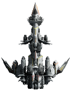

All Plugins (604)

[Cheats](https://github.com/Hecter94/EndlessSky-PluginArchive/blob/main/res/mds/cheats.md) (38) | [Gameplay](https://github.com/Hecter94/EndlessSky-PluginArchive/blob/main/res/mds/gameplay.md) (55) | [Graphics](https://github.com/Hecter94/EndlessSky-PluginArchive/blob/main/res/mds/graphics.md) (29) | [Outfits](https://github.com/Hecter94/EndlessSky-PluginArchive/blob/main/res/mds/outfits.md) (52)<br>
[Overhauls](https://github.com/Hecter94/EndlessSky-PluginArchive/blob/main/res/mds/overhauls.md) (46) | [Overwrites](https://github.com/Hecter94/EndlessSky-PluginArchive/blob/main/res/mds/overwrites.md) (4) | [Patches](https://github.com/Hecter94/EndlessSky-PluginArchive/blob/main/res/mds/patches.md) (3) | [Races](https://github.com/Hecter94/EndlessSky-PluginArchive/blob/main/res/mds/races.md) (70)<br>
[Ships](https://github.com/Hecter94/EndlessSky-PluginArchive/blob/main/res/mds/ships.md) (143) | [Starts](https://github.com/Hecter94/EndlessSky-PluginArchive/blob/main/res/md/starts.md) (17) | [Story](https://github.com/Hecter94/EndlessSky-PluginArchive/blob/main/res/mds/story.md) (80) | [Weapons](https://github.com/Hecter94/EndlessSky-PluginArchive/blob/main/res/mds/weapons.md) (42)<br>
[Uncategorized](https://github.com/Hecter94/EndlessSky-PluginArchive/blob/main/res/mds/uncategorized.md) (25)<br>

---

## Cheats

<p>38 plugins in this category.<p>


 

---

### -Omnis


[-Omnis.zip](https://github.com/Hecter94/EndlessSky-PluginArchive/releases/download/Latest/-Omnis.zip) | 2.91 mb | 2025-08-01 | [view files](https://github.com/Hecter94/EndlessSky-PluginArchive/tree/main/Working/-Omnis/) <br>
Author: TheGiraffe3 | Category: Cheats <br>
[https://github.com/EndlessSkyCommunity/-Omnis](https://github.com/EndlessSkyCommunity/-Omnis) (last commit 2025-08-01) <br>

>The most extensive all-content plugin to date. It includes many opportunities to test balance or ship builds against AI driven ships or fleets, all vanilla content and the content of many plugins available to use to put together different ship builds. Many more tools are included into Omnis too!
>

<details>
<summary>:blue_book: Plugin readme</summary>
<blockquote>### Welcome to Omnis!
Omnis has risen to be the #1 all-content plugin in the community, though competition is still encouraged as only from different perspectives can the best iteration of this niche be reached. Omnis was released after [World Forge](https://github.com/EndlessSkyCommunity/world-forge) but before [Ciu Kreo](https://github.com/RestingImmortal/Ciu-Kreo), and good faith was practiced by all competing authors.

In order of release, known competitors have been:
- [All Content Plugin](https://github.com/endless-sky/all-content-plugin)
- [World Forge](https://github.com/EndlessSkyCommunity/world-forge)
- [Ciu Kreo](https://github.com/RestingImmortal/Ciu-Kreo)
- [Ruin the Fun](https://github.com/Pshy0/es-ruin-the-fun)

### What to expect
There is no need to worry about breaking existing saves when installing, you will be presented with a warning that lets you choose what level of involvement you want that save to have with Omnis. To avoid any interaction, there's an option to abort which will kill the player and disallow saving the interaction.

So how do you use this plugin? Well there are two very simple methods of [accessing Omnis](https://github.com/EndlessSkyCommunity/-Omnis/wiki/Access). 
There is a wormhole in each of the major factions' systems to travel there, and there is a custom start that can be chosen when making a new pilot.

> [!WARNING]
> The Omnis custom start will begin your pilot with an impossibly high credit value and brand your save with the Omnis start.

</blockquote>
</details>

Status: N/A <br>
Daily update check: </img><br>


---

### All Content Plugin
</img><br>


[All.Content.Plugin.zip](https://github.com/Hecter94/EndlessSky-PluginArchive/releases/download/Latest/All.Content.Plugin.zip) | 150.26 kb | 2025-02-01 | [view files](https://github.com/Hecter94/EndlessSky-PluginArchive/tree/main/Working/All%20Content%20Plugin/) <br>
Author: Michael Zahniser | Category: Cheats <br>
[https://github.com/endless-sky/all-content-plugin](https://github.com/endless-sky/all-content-plugin) (last commit 2025-02-01) <br>

>This mod starts you on Greenrock with a trillion (10^12) credits and access to almost every ship and outfit in the game. It is intended for testing purposes, but of course, as its description says, "it can also be used by people who want to ruin the game for themselves by getting a massive fleet without needing to work for it." 
>

<details>
<summary>:blue_book: Plugin readme</summary>
<blockquote># All-Content Plugin
This plugin was made to allow content creators to have access to all outfits in a single place, for the purpose of designing and testing outfit loadouts for new ships. Of course, it can also be used by people who want to ruin the game for themselves by getting a massive fleet without needing to work for it.

# Contributing
This plugin is meant to mirror the most recent official release of [Endless Sky](https://github.com/endless-sky/endless-sky), rather than its most recent "continuous build," and as such should be usuable to those who use Steam or PPAs as the source of their game version. As such, PRs are welcome following new additions during an ES release cycle, but depending on the scope of the contribution, may not be merged promptly.
</blockquote>
</details>

Status: N/A <br>
Daily update check: </img><br>


---

### Arena
</img><br>


[Arena.zip](https://github.com/Hecter94/EndlessSky-PluginArchive/releases/download/Latest/Arena.zip) | 17.97 kb | 2023-07-27 | [view files](https://github.com/Hecter94/EndlessSky-PluginArchive/tree/main/Working/Arena/) <br>
Author: 10010101001 | Category: Cheats <br>
[https://github.com/10010101001/Arena](https://github.com/10010101001/Arena) (last commit 2021-05-18) <br>

>This plugin adds two arenas with diffrent combat styles for the player to enjoy in-game and for testing purposes (near Sagittarius A).
>

<details>
<summary>:blue_book: Plugin readme</summary>
<blockquote>1. Visit Arena (Next to Sagittarius A*)
2. Paste your ship builds at specified location in data/job.txt
3. Take off and land
4. Accept job on the job board

</blockquote>
</details>

Status: N/A <br>
Daily update check: </img><br>


---

### automata.destruction.0percent
</img><br>


[automata.destruction.0percent.zip](https://github.com/Hecter94/EndlessSky-PluginArchive/releases/download/Latest/automata.destruction.0percent.zip) | 43.63 kb | 2024-06-07 | [view files](https://github.com/Hecter94/EndlessSky-PluginArchive/tree/main/Working/automata.destruction.0percent/) <br>
Author: zuckung | Category: Cheats <br>
[https://github.com/zuckung/endless-sky-plugins](https://github.com/zuckung/endless-sky-plugins) (last commit 2024-06-07) <br>

>Modifies the self destruction chance of Sestor and Mereti ships to a value of 0.0 (0%). See the readme for details.

<details>
<summary>:blue_book: Plugin readme</summary>
<blockquote>### automata.destruction.0percent
<br>
<br>
Modifies the self destruction chance of Sestor and Mereti ships to a value of 0.0 (0%).<br>
<br>
Sestor 349/109/78/71/53/27/14 and Mereti 512/256/128/64/32/16/8 ships have a self destruction value of 0.0 (0%) now.<br>
You can easily change the values in automata.txt for each ship ('"self destruct" .0') to a value of your choice. I.e. 0.12 is 23%, 0.3 is 51%, 0.5 is 75%. Its calculated twice, first the chance for self destruction on boarding(i.e. 0.3) is 30%, then of the remaining 70% again 30% chance for self destruction on capturing. That makes 30% + 21% = 51% overall chance for self destruction on a capturing try.<br>
<br>
<br>
Changelog:<br>
<br>
2024-06-07<br>
text corrections (thx to TheGiraffe3)<br>
<br>
2023-10-17<br>
added plugin.txt<br>
<br>
2023-09-07<br>
changed icon<br>
changed about.txt<br>
changed readme<br>


</blockquote>
</details>

Status: complete <br>
Daily update check: </img><br>


---

### Bit and Bobs


[Bit.and.Bobs.zip](https://github.com/Hecter94/EndlessSky-PluginArchive/releases/download/Latest/Bit.and.Bobs.zip) | 1.14 mb | 2022-10-06 | [view files](https://github.com/Hecter94/EndlessSky-PluginArchive/tree/main/Working/Bit%20and%20Bobs/) <br>
Author: N/A | Category: Cheats <br>
N/A[]()  <br>

>N/A
>


Status: N/A <br>
Daily update check: </img><br>


---

### captureable.person.ships
</img><br>


[captureable.person.ships.zip](https://github.com/Hecter94/EndlessSky-PluginArchive/releases/download/Latest/captureable.person.ships.zip) | 196.8 kb | 2025-06-19 | [view files](https://github.com/Hecter94/EndlessSky-PluginArchive/tree/main/Working/captureable.person.ships/) <br>
Author: zuckung | Category: Cheats <br>
[https://github.com/zuckung/endless-sky-plugins](https://github.com/zuckung/endless-sky-plugins) (last commit 2025-06-19) <br>

>Makes person ships capturable. See the readme for details.
>

<details>
<summary>:blue_book: Plugin readme</summary>
<blockquote>### capturable.person.ships
<br>
<br>
Makes person ships captureable.<br> 
<br>
<br>
Well, technically this plugin disables the person ships, and creates new ones which are captureable (with changed names to "<name> (C)", due to limitations of changing parts of the originals). Also adds all of them to the author government, adjusts some personalities and sets all frequencies to 1000. Changed "Tranquility" to have a weapon, so it doesn't flee. And changed "Zitchas" personality to "decloaked", so it doesn't flee and regenerate while cloaked.<br>
Attacking one of them makes all your enemies, they all try to disable instead of destroying, and they all have the same spawn chance which is in average 10 minutes.<br>
<br>
At Earth's job board you can find a repeatable job that displays which persons you have already killed, which are alive, and where to find them. If the plugin control.station is installed hou can find the list there, along with this readme.<br>
After you've killed them all, you receive a small unique gift.<br>
<br>
I tested this plugin with 10x KIV349, all equipped with Mereti beam weapons, was probably an overkill on most. Boarding "Zitchas"(1000 crew) needed an Echo-Galleon, and I tried it with hand2hand outfits plugin. Maybe it works with nerve gas too.<br>
In cap_persons.txt you find the following line under gamerules: "#	"person spawn period" 2000". If you remove the "#" the spawning speed is increased to one spawn in around half a minute.<br>
<ul>
<li>"vyu-Ir" (not a person ship, but unique | found south-western of Gegno)</li>
<li>"Michael Zahniser" (found everywhere | Kestrel + Finch)</li>
<li>"Cap'n Pester" (found everywhere | Quarg Wardragon)</li>
<li>"Marauding Max" (found everywhere | Marauder Fury)</li>
<li>"Captain Nate" (found everywhere | Vanguard)</li>
<li>"Tranquility" (found everywhere | Lampyrid)</li>
<li>"Power of the People" (found everywhere | Modified Osprey)</li>
<li>"Local God" (found everywhere | Ursa Polaris)</li>
<li>"Subsidurial" (found in uninhabited | Subsidurial)</li>
<li>"Prototype B3-CC4" (found in Ember Waste | Shooting Star)</li>
<li>"Rais Iris XVIII" (found everywhere | Marauder Bactrian)</li>
<li>"Zitchas" (found in Ember Waste | Heron + Peregrine + 4x Petrel + 32x Tern)</li>
<li>"Brick" (found everywhere | 3x Modified Boxwing)</li>
<li>"Gefullte Taubenbrust" (found everywhere | Modified Battleship)</li>
<li>"MasterOfGrey" (found in Hai space | Modified Ladybug)</li>
<li>"Patrol Team" (found everywhere | 6x Waverider)</li>
<li>"Danau" (found in human space | 1x mod. Hauler IV, 2x Hauler III, 2x Hauler II, 2x Hauler)</li>
</ul>
<br>
<br>
Changelog:<br>
<br>
2025-06-19<br>
added control.station support<br>
<br>
2025-06-05<br>
colored the job<br>
added outfit series<br>
<br>
2025-05-19<br>
typo fixes by snoogles<br>
icon@2x, plugintxt changes<br>
<br>
2025-01-27<br>
added 0.10.11 person "Danau"<br>
<br>
2024-11-11<br>
made vyu-Ir captureable (unique, but no person ship)<br>
normalized the spawn speed<br>
<br>
2024-10-08<br>
proofreading and minor text changes (Vemenous-Repentile)<br>
changed status mission to fail on daily<br>
changed subsidural (1 outfit space, keystone and 300 fuel)<br>
<br>
2024-07-14<br>
fixed tranquility weapon space error<br>
removed fines from author government<br>
<br>
2024-06-07<br>
text corrections (thx to TheGiraffe3)<br>
<br>
2024-05-28<br>
adjusted mass and drag to be like in 0.10.7<br>
removed staying personality ftom Tranquility<br>
renamed persons to "name (C)", was "name (Capture me)"<br>
<br>
2024-04-06<br>
set person killed job back to earth only, less annoying when you are done<br>
added a mission with unique reward, after killing all person ships<br>
<br>
2024-03-23<br>
set "no person spawn weight" to 0<br>
added person destroyed check job to every planet with a job board<br>
added a gun to Tranquility so that it stays for fighting<br>
changed Zitchas personality, so that it doesn't cloak<br>
<br>
2024-03-14<br>
bugfixes<br>
added person destroyed check on Earth job board<br>
<br>
2024-02-02<br>
added 0.10.5 person "Patrol Team"<br>
<br>
2023-10-17<br>
added plugin.txt<br>
<br>
2023-09-15<br>
changed gamerules back, because it caused mass spawning<br>
changed some personalities<br>
<br>
2023-09-09<br>
changed all frequencies to 1000<br>
changed gamerules to prevent no spawning chance<br>
<br>
2023-09-08<br>
initial release<br>

</blockquote>
</details>

Status: complete <br>
Daily update check: </img><br>


---

### Casual Mod


[Casual.Mod.zip](https://github.com/Hecter94/EndlessSky-PluginArchive/releases/download/Latest/Casual.Mod.zip) | 403.08 kb | 2023-07-27 | [view files](https://github.com/Hecter94/EndlessSky-PluginArchive/tree/main/Working/Casual%20Mod/) <br>
Author: PPhoto  | Category: Cheats <br>
N/A[]()  <br>

>Makes gameplay more casual
>Ships are heavier making navigation and combat slower
>Higher range for some cannons to compensate ship speed
>Less, slower and weaker asteroids to increase clarity, FPS and easier mining
>

<details>
<summary>:blue_book: Plugin readme</summary>
<blockquote># EndlessSky Casual Mod

## Content
Makes gameplay for Endless-Sky more casual
- Ships are heavier making navigation and combat slower
- Higher range for some cannons to compensate ship speed
- Less, slower and weaker asteroids to increase clarity, FPS and easier mining
- Bigger sprites for bigger ships

## WIP:
- Modify asteroid count and speed in more star systems
- Add more bigger ships, currently only the falcon has twice the size with sprite taken from high-dpi mod

## Limits:
- No game balancing has been done after the ship and weapon modifications

</blockquote>
</details>

Status: N/A <br>
Daily update check: </img><br>


---

### Checkmatemate


[Checkmatemate.zip](https://github.com/Hecter94/EndlessSky-PluginArchive/releases/download/Latest/Checkmatemate.zip) | 0.58 kb | 2022-10-06 | [view files](https://github.com/Hecter94/EndlessSky-PluginArchive/tree/main/Working/Checkmatemate/) <br>
Author: Zoura | Category: Cheats <br>
N/A[]()  <br>

>Unlocks checkmate stuff without having to do FWs
>


Status: Playable on 0.9.15 Continuous. <br>
Daily update check: </img><br>


---

### Ciu Kreo
</img><br>


[Ciu.Kreo.zip](https://github.com/Hecter94/EndlessSky-PluginArchive/releases/download/Latest/Ciu.Kreo.zip) | 458.64 kb | 2023-07-27 | [view files](https://github.com/Hecter94/EndlessSky-PluginArchive/tree/main/Working/Ciu%20Kreo/) <br>
Author: RestingImmortal | Category: Cheats <br>
[https://github.com/RestingImmortal/Ciu-Kreo](https://github.com/RestingImmortal/Ciu-Kreo) (last commit 2021-07-06) <br>

>An all-content plugin for Endless-Sky. Made to assist with content creation, or for general use.
>

<details>
<summary>:blue_book: Plugin readme</summary>
<blockquote># Ciu-Kreo

An all-content plugin for [Endless Sky](https://endless-sky.github.io/).
To be used to assist in content creation, or just for general use.

## Install
Unzip to your plugins folder found here:

* Linux: /.local/share/endless-sky/
* Windows: %AppData%\endless-sky\
* Mac OS X: /Library/ApplicationSupport/endless-sky/

</blockquote>
</details>

Status: Playable on 0.9.14 <br>
Daily update check: </img><br>


---

### Cloaking Device Unlocked


[Cloaking.Device.Unlocked.zip](https://github.com/Hecter94/EndlessSky-PluginArchive/releases/download/Latest/Cloaking.Device.Unlocked.zip) | 2.6 kb | 2022-10-06 | [view files](https://github.com/Hecter94/EndlessSky-PluginArchive/tree/main/Working/Cloaking%20Device%20Unlocked/) <br>
Author: FriendlyNeighbour | Category: Cheats <br>
N/A[]()  <br>

>N/A
>


Status: N/A <br>
Daily update check: </img><br>


---

### coalition.shopping
</img><br>


[coalition.shopping.zip](https://github.com/Hecter94/EndlessSky-PluginArchive/releases/download/Latest/coalition.shopping.zip) | 402.57 kb | 2024-11-09 | [view files](https://github.com/Hecter94/EndlessSky-PluginArchive/tree/main/Working/coalition.shopping/) <br>
Author: zuckung | Category: Cheats <br>
[https://github.com/zuckung/endless-sky-plugins](https://github.com/zuckung/endless-sky-plugins) (last commit 2024-11-09) <br>

>Adds all Coalition/Heliarch/Lunarium outfits and ships to 'Far Home' in 'Homeward' system. See the readme for details.
>

<details>
<summary>:blue_book: Plugin readme</summary>
<blockquote>### coalition.shopping
<br>
<br>
Adds all Coalition/Heliarch/Lunarium outfits and ships to 'Far Home' in 'Homeward' system.<br>
<br>
Adds all existing coalition outfitters and shipyards to 'Far Home'. Also adds a new shipyard and a new outfitter with missing ships/outfits.<br>
To start the mission to enable these outfitters and shipyards, you have to join Heliarch or Lunarium (complete the first chapter of these storylines) and own/pay 6/5 million credits. The mission starts anywhere in coalition space. I added this plausible mission to make the plugin feel less cheaty.<br>


<br>
<br>
Changelog:<br>
<br>
2024-11-09<br>
corrected scene size<br>
added @2x images<br>
<br>
2024-09-15<br>
some error fixing, adjustments and text improvements (thx to timeout.fu)<br>
more text adjustments (from TheGiraffe3)<br>
<br>
2024-05-04<br>
added 2 scene images<br>
added a plausible story mission for heliarch and one for lunarium players<br>
<br>
2024-04-21<br>
fixed error on coalition basics outfitter<br>
<br>
2023-10-17<br>
added plugin.txt<br>
<br>
2023-10-05<br>
initial release<br>


</blockquote>
</details>

Status: complete <br>
Daily update check: </img><br>


---

### Custom Outfitting (Chop Shop)


[Custom.Outfitting.Chop.Shop.zip](https://github.com/Hecter94/EndlessSky-PluginArchive/releases/download/Latest/Custom.Outfitting.Chop.Shop.zip) | 4.02 kb | 2022-10-06 | [view files](https://github.com/Hecter94/EndlessSky-PluginArchive/tree/main/Working/Custom%20Outfitting%20(Chop%20Shop)/) <br>
Author: Jareth (Dr. Anthrax) | Category: Cheats <br>
N/A[]()  <br>

>Lets the player swap excess weapon and engine space for outfit space also alows the spending of outfit space to have more weapon and engine space.
>


Status: N/A <br>
Daily update check: </img><br>


---

### Dragonflame Fabrication


[Dragonflame.Fabrication.zip](https://github.com/Hecter94/EndlessSky-PluginArchive/releases/download/Latest/Dragonflame.Fabrication.zip) | 1.58 kb | 2022-10-06 | [view files](https://github.com/Hecter94/EndlessSky-PluginArchive/tree/main/Working/Dragonflame%20Fabrication/) <br>
Author: Galaucus | Category: Cheats <br>
[https://github.com/Galaucus/Dragonflame-Fabrication](https://github.com/Galaucus/Dragonflame-Fabrication) (last commit 2020-09-07) <br>

>A post-Emerald Sword mission chain that allows Kraz to manufacture a replacement Dragonflame Cannon.
>


Status: N/A <br>
Daily update check: </img><br>


---

### Easier Korath Automatons
</img><br>


[Easier.Korath.Automatons.zip](https://github.com/Hecter94/EndlessSky-PluginArchive/releases/download/Latest/Easier.Korath.Automatons.zip) | 73.3 kb | 2024-10-24 | [view files](https://github.com/Hecter94/EndlessSky-PluginArchive/tree/main/Working/Easier%20Korath%20Automatons/) <br>
Author: Kestrel1110 | Category: Cheats <br>
[https://github.com/kestrel1110/Easier-Korath-Automatons](https://github.com/kestrel1110/Easier-Korath-Automatons) (last commit 2020-05-08) <br>

>Makes fighting the Kor Mereti and Sestor a little bit easier.
>Also give bunks to the automatons so they will be viable flagships.
>

<details>
<summary>:blue_book: Plugin readme</summary>
<blockquote># Easier-Korath-Automatons
Makes fighting the Kor Mereti and Sestor a little bit easier.
Also give bunks to the automatons so they will be viable flagships.
The lore is that sometimes the Korath would travel in their automatons, so they wanted to be able to requisition any passing ship for use.

</blockquote>
</details>

Status: Should work <br>
Daily update check: </img><br>


---

### Generic Plugin


[Generic.Plugin.zip](https://github.com/Hecter94/EndlessSky-PluginArchive/releases/download/Latest/Generic.Plugin.zip) | 7.27 mb | 2022-10-06 | [view files](https://github.com/Hecter94/EndlessSky-PluginArchive/tree/main/Working/Generic%20Plugin/) <br>
Author: N/A | Category: Cheats <br>
N/A[]()  <br>

>A generic plugin for testing purposes.
>


Status: N/A <br>
Daily update check: </img><br>


---

### Heliarch Shopping & Korath Konvenience


[Heliarch.Shopping.Korath.Konvenience.zip](https://github.com/Hecter94/EndlessSky-PluginArchive/releases/download/Latest/Heliarch.Shopping.Korath.Konvenience.zip) | 3.24 kb | 2022-10-06 | [view files](https://github.com/Hecter94/EndlessSky-PluginArchive/tree/main/Working/Heliarch%20Shopping%20&%20Korath%20Konvenience/) <br>
Author: Waladil | Category: Cheats <br>
N/A[]()  <br>

>KorExile outfits to KorEfret outfitter and mission to get Heliarch License and buy their outfits.
>


Status: Playable on 0.9.14, 0.9.15 Continuous. <br>
Daily update check: </img><br>


---

### Hilo2000 Arena
</img><br>


[Hilo2000.Arena.zip](https://github.com/Hecter94/EndlessSky-PluginArchive/releases/download/Latest/Hilo2000.Arena.zip) | 28.72 kb | 2023-12-27 | [view files](https://github.com/Hecter94/EndlessSky-PluginArchive/tree/main/Working/Hilo2000%20Arena/) <br>
Author: Mielo Symeonidis | Category: Cheats <br>
N/A[]()  <br>

>This plugin adds an arena with multiple hard and easy challenges.
>


Status: N/A <br>
Daily update check: </img><br>


---

### Improved Ship Integrity


[Improved.Ship.Integrity.zip](https://github.com/Hecter94/EndlessSky-PluginArchive/releases/download/Latest/Improved.Ship.Integrity.zip) | 44.14 kb | 2023-07-27 | [view files](https://github.com/Hecter94/EndlessSky-PluginArchive/tree/main/Working/Improved%20Ship%20Integrity/) <br>
Author: Xolarix | Category: Cheats <br>
[https://github.com/Xolarix/Improved-Ship-Integrity](https://github.com/Xolarix/Improved-Ship-Integrity) (last commit 2019-01-16) <br>

>This plugin puts the hull points of all ships in the game at 250% their original values.
>


Status: N/A <br>
Daily update check: </img><br>


---

### Inhibitor Turret Available
</img><br>


[Inhibitor.Turret.Available.zip](https://github.com/Hecter94/EndlessSky-PluginArchive/releases/download/Latest/Inhibitor.Turret.Available.zip) | 67.74 kb | 2024-11-01 | [view files](https://github.com/Hecter94/EndlessSky-PluginArchive/tree/main/Working/Inhibitor%20Turret%20Available/) <br>
Author: TheGiraffe3 | Category: Cheats <br>
[https://github.com/TheGiraffe3/es-inhibitor-turret](https://github.com/TheGiraffe3/es-inhibitor-turret) (last commit 2024-10-13) <br>

>Makes the Inhibitor Turret be sold on Remnant planets. It is already in the game, but not usable.
>

<details>
<summary>:blue_book: Plugin readme</summary>
<blockquote># es-inhibitor-turret

Makes the Inhibitor Turret from [Endless Sky](https://github.com/endless-sky/endless-sky) available for purchase.

</blockquote>
</details>

Status: Complete <br>
Daily update check: </img><br>


---

### Kestrel Rework


[Kestrel.Rework.zip](https://github.com/Hecter94/EndlessSky-PluginArchive/releases/download/Latest/Kestrel.Rework.zip) | 5.53 kb | 2023-07-27 | [view files](https://github.com/Hecter94/EndlessSky-PluginArchive/tree/main/Working/Kestrel%20Rework/) <br>
Author: MinneIceCube | Category: Cheats <br>
[https://github.com/MinneIceCube/KestrelRework](https://github.com/MinneIceCube/KestrelRework) (last commit 2022-04-15) <br>

>Make Kestrel a much better ship, and increased requirements.
>

<details>
<summary>:blue_book: Plugin readme</summary>
<blockquote>Kestrel Rework Readme:
This is a small rework of the Kestrel ship. The intent is to put it on par with several higher tiered alien outfits, most notablely Wanderer (2) outfits, as opposed to standard Human (1-1.5) Outfits. 
This does not make much sense according to the lore, but I personally prefer the asthetic of the Kestrel compared to many of the Wanderer ships. as such, the changes are as follows:

-The requirements for the Kestrel sub-quest have been changed:
	-The combat rating was increased from 8,000 (Combat rank 9: "Force to be reckoned with") --> 22,000 (Combat rank "Fearsome Scrapper). Intended to limit obtaining the newly buffed ship until the player is on a similar power level.
	-Increased the standard cost of the ship from 14700000 --> 67500000, as another change intended to limit how early a player could obtain the ship.
	-Buffed "Unknown ship type" by roughly half of the changes to the base Kestrel (I.E, instead of 49,700 shields, the test ship will have about 23,000), increasing the difficulty of the inital test fight while not requiring too much power to win.

-Base model "Kestrel" (Unlisted stats were not changed)
	-Shields 19,400 --> 49,700
	-Hull 7,200 --> 30,400
	-Fuel Capacity 500 --> 700
	-Outfit space 810 --> 900
	-Weapon capacity 390 --> 410
	-Engine Capacity 210 --> 230
	-Bunks 128 --> 150

-Engine Kestrel:
	-Drag -1.0 --> -2.0
	-Fuel Capacity 100 --> 300
	
-Shield Kestrel:
	-Shields 3,000 --> 28,000
	-Hull 1,500 --> 4,900

-Weapon Kestrel:
	-Weapon Capacity 40 --> 150
</blockquote>
</details>

Status: N/A <br>
Daily update check: </img><br>


---

### more.arfectas
</img><br>


[more.arfectas.zip](https://github.com/Hecter94/EndlessSky-PluginArchive/releases/download/Latest/more.arfectas.zip) | 30.34 kb | 2024-06-03 | [view files](https://github.com/Hecter94/EndlessSky-PluginArchive/tree/main/Working/more.arfectas/) <br>
Author: zuckung | Category: Cheats <br>
[https://github.com/zuckung/endless-sky-plugins](https://github.com/zuckung/endless-sky-plugins) (last commit 2024-04-15) <br>

>Adds the new system 'Mego Pug', in eastern Bunrodea space. There you can farm rare spawning Arfectas and other more common Pug ships, without ruining your Pug reputation. See the readme for details.
>

<details>
<summary>:blue_book: Plugin readme</summary>
<blockquote>### more.arfectas <br>
<br>
Adds the new system 'Mego Pug', in eastern Bunrodea space. There you can farm rare spawning Arfectas and other more common Pug ships, without ruining your Pug reputation.<br>
<br>
Added a new system, with new government "Pug Farm" and 3 new fleets. Two fleets are like the ones in 'Pug Iyek' and the third, rare spawning one, has 1 arfecta. It spawns within 15000 frames(4 minutes).<br>
<br>
<br>
Changelog:<br>
<br>
2024-04-14<br>
moved the system to eastern Bunrodea territory<br>
renamed the system, adjusted objects, added a planet<br>
made them hostile at first contact<br>
added a warning mission on system entering<br>
added support for more.boarding.missions<br>
<br>
2023-10-17<br>
added plugin.txt<br>
</blockquote>
</details>

Status: complete <br>
Daily update check: </img><br>


---

### No Bactrian


[No.Bactrian.zip](https://github.com/Hecter94/EndlessSky-PluginArchive/releases/download/Latest/No.Bactrian.zip) | 2.91 kb | 2022-10-06 | [view files](https://github.com/Hecter94/EndlessSky-PluginArchive/tree/main/Working/No%20Bactrian/) <br>
Author: Disiuze | Category: Cheats <br>
[https://github.com/Disiuze/misc-projects](https://github.com/Disiuze/misc-projects) (last commit 2017-02-22) <br>

>This mod removes Bactrians and Mules from the shipyard and fleet definitions.
>NOTE: Overrides fleets and Lionheart shipyards, might cause problem with other plugin.
>
>


Status: Should be playable on 0.9.14, 0.9.15. <br>
Daily update check: </img><br>


---

### No Drag Mod


[No.Drag.Mod.zip](https://github.com/Hecter94/EndlessSky-PluginArchive/releases/download/Latest/No.Drag.Mod.zip) | 1.51 kb | 2022-10-06 | [view files](https://github.com/Hecter94/EndlessSky-PluginArchive/tree/main/Working/No%20Drag%20Mod/) <br>
Author: Jafdy | Category: Cheats <br>
N/A[]()  <br>

>sets the drag of all ships and missiles to 0.
>


Status: N/A <br>
Daily update check: </img><br>


---

### Nuclear War


[Nuclear.War.zip](https://github.com/Hecter94/EndlessSky-PluginArchive/releases/download/Latest/Nuclear.War.zip) | 0.72 kb | 2022-10-06 | [view files](https://github.com/Hecter94/EndlessSky-PluginArchive/tree/main/Working/Nuclear%20War/) <br>
Author: House Kitty | Category: Cheats <br>
N/A[]()  <br>

>Merchant and Pirate Hawks equiped with Nukes locked in an endless and massive battle in the Holeb system.
>


Status: Should be playable on 0.9.14, 0.9.15 Continuous. <br>
Daily update check: </img><br>


---

### Overkill


[Overkill.zip](https://github.com/Hecter94/EndlessSky-PluginArchive/releases/download/Latest/Overkill.zip) | 3.34 mb | 2022-10-06 | [view files](https://github.com/Hecter94/EndlessSky-PluginArchive/tree/main/Working/Overkill/) <br>
Author: Carter-M-II | Category: Cheats <br>
[https://github.com/Carter-M-II/ES-Overkill](https://github.com/Carter-M-II/ES-Overkill) (last commit 2022-02-03) <br>

>This mod is full of overpowered/bloated things like Ships and Outfits. Only used to beat the game but may be fun to pit on other mods with overpowered ships/outfits.
>


Status: N/A <br>
Daily update check: </img><br>


---

### quarg.farm
</img><br>


[quarg.farm.zip](https://github.com/Hecter94/EndlessSky-PluginArchive/releases/download/Latest/quarg.farm.zip) | 109.74 kb | 2025-06-05 | [view files](https://github.com/Hecter94/EndlessSky-PluginArchive/tree/main/Working/quarg.farm/) <br>
Author: zuckung | Category: Cheats <br>
[https://github.com/zuckung/endless-sky-plugins](https://github.com/zuckung/endless-sky-plugins) (last commit 2025-06-05) <br>

>Adds a new system Saquerver (between human and coalition space) where you can farm a new Quarg faction. Also the death sentence from all other Quarg got removed. See the readme for details.
>

<details>
<summary>:blue_book: Plugin readme</summary>
<blockquote>### quarg.farm
<br>
<br>
Adds a new system "Saquerver" (between human and coalition space) where you can farm a new Quarg faction. Also the death sentence from all other Quarg got removed.<br>
<br>
The system "Saquerver" lies between "Serquergen" and "Ablub". The usual-sized Quarg fleets spawn there. Killing/plundering them doesn't make the other Quarg angry. Landing on the other Quarg faction's worlds doesn't end with a death sentence when you have their ships/outfits.<br>
<br>
<br>
Changelog:<br>
<br>
2025-06-05<br>
update with new 0.10.13 ships<br>
<br>
2025-05-19<br>
plugintxt fix<br>
<br>
2025-04-18<br>
added icon@2x<br>
changed plugin.txt<br>
typo fixes(by snoggles)<br>
adjusted system "Saquerver" better to not interfere with avgi storyline<br>
<br>
2025-01-27<br>
adjusted system "Saquerver" position to not collide with 0.10.11 additions<br>
<br>
2024-10-06<br>
removed death sentence from government "Quarg (Incipias)"<br>
<br>
2024-05-26<br>
initial release<br>


</blockquote>
</details>

Status: made for 0.10.6 <br>
Daily update check: </img><br>


---

### Reverse Engineering


[Reverse.Engineering.zip](https://github.com/Hecter94/EndlessSky-PluginArchive/releases/download/Latest/Reverse.Engineering.zip) | 1.48 mb | 2022-10-06 | [view files](https://github.com/Hecter94/EndlessSky-PluginArchive/tree/main/Working/Reverse%20Engineering/) <br>
Author: N/A | Category: Cheats <br>
N/A[]()  <br>

>Small to medium sized mod focused around reverse engineering alien technology and establishing a business empire. 
>


Status: N/A <br>
Daily update check: </img><br>


---

### Ruin the Fun
</img><br>


[Ruin.the.Fun.zip](https://github.com/Hecter94/EndlessSky-PluginArchive/releases/download/Latest/Ruin.the.Fun.zip) | 3.57 mb | 2025-07-01 | [view files](https://github.com/Hecter94/EndlessSky-PluginArchive/tree/main/Working/Ruin%20the%20Fun/) <br>
Author: Pshy0 | Category: Cheats <br>
[https://github.com/Pshy0/es-ruin-the-fun](https://github.com/Pshy0/es-ruin-the-fun) (last commit 2025-07-01) <br>

>A development / cheat plugin for Endless Sky. Access all ships and outfits, change your captain's name, choose the color swizzle of your ships, edit your relation with other governments, set your combat rank, hire a powerful escort, gift yourself pre-outfitted ships, give yourself money, and much more. 
>

<details>
<summary>:blue_book: Plugin readme</summary>
<blockquote>Ruin The Fun (es-ruin-the-fun)
===

Cheat plugin for [endless-sky](https://github.com/endless-sky/endless-sky), to ruin your fun, or to assist you in making or testing another plugin.

Access all ships and outfits, change your captain's name, choose the color swizzle of your ships, edit your relation with other governments, set your combat rank, hire a powerful escort, gift yourself pre-outfitted ships, give yourself money, and much more.


## Downloads

- [📦 Ruin-The-Fun: Sources](https://github.com/Pshy0/es-ruin-the-fun/) [(direct download)](https://github.com/Pshy0/es-ruin-the-fun/archive/refs/heads/main.zip):
  This is the latest commit to the plugin. It may or may not be stable, and it may also not work at all or break your save.
- [🎁 Ruin-The-Fun: Tested Release](https://github.com/Pshy0/es-ruin-the-fun/releases/tag/latest) [(direct download)](https://github.com/Pshy0/es-ruin-the-fun/releases/latest/download/-es-ruin-the-fun.zip):
  This is a tested and recommended version. But perhaps not the latest.
  Has better plugin support than other releases.
- [📦 Ruin-The-Fun: (Automatic Updates)](https://github.com/Pshy0/es-ruin-the-fun/releases/):
  This version is automatically generated on every new game version (either pre-release or release).
  It should feature the latest game content.
  However, if the data file syntax was changed by the new version, this might cause warnings or errors.
- [📦 Ruin-The-Fun: (Endless Sky continuous)](https://github.com/Pshy0/es-ruin-the-fun/releases/tag/es-continuous) [(direct download)](https://github.com/Pshy0/es-ruin-the-fun/releases/download/es-continuous/-es-ruin-the-fun-for-es-continuous.zip):
  This version is periodically generated to match continuous builds of Endless Sky. This is also the latest untested RTF version.
  If you do not use continuous Endless Sky builds, do not use this version, as it will contain things that are not yet in you game (that will be a problem).


## Install

Install this plugin by dropping it into the game's `plugins` folder.
If the plugin is in a `.zip` / archive file, extract it.

The game's `plugins` folder should be located at one of those locations:
- On Windows:
  - `plugins\ (in the same folder as the Endless Sky executable)`
  - or `C:\Users\yourusername\AppData\Roaming\endless-sky\plugins\`
- On Linux:
  - `/usr/share/games/endless-sky/plugins/`
  - or `/.local/share/endless-sky/plugins/`
- On Mac:
  - `Contents/Resources/plugins/ (within the application bundle)`
  - or `/Library/Application Support/endless-sky/plugins`

If the `plugins` folder does not exist, you can create it.

If you did it right, there should be a file `plugins/-es-ruin-the-fun/about.txt` or `plugins/-Ruin The Fun/about.txt`.

> This plugin should not conflict with any other, because it uses separate systems and prefixes objects it defines.


## Startup

⚠️ **Be advised against using this plugin with your favorite pilot's save**, since it will make your hours of labor nonsensical.
If you want to use this plugin for an existing save anyway, then **MAKE A BACKUP OF YOUR PILOT** (for instance with the `Add snapshot` button).


If your intent is rather to use this plugin with a new pilot, you may use one of the starts provided by this plugin to do so:


You will spawn in an RTF system, from which cheat features are available.

Cheat features are available from, and only from, the RTF systems. One of them has an hyperlink to `Rutilicus` (the default start system), so that you can reach it with an Hyperdrive:


There is other RTF systems everywhere on the map, so you do not have to cross it whole.


## Spaceport


Click the `Spaceport` button to access a number of quick actions.
More actions are available from the `Job Board`.


## Job Board


The `Job Board` contains most of this plugin's features.

The following jobs can be used after every landing on an RTF planet:
- `[basic] All Useful Things`: Get money, reveal the map, and earn combat rank 14.
- `[basic] Color Swizzle`: Change the color of your ships.
- `[basic] Combat Rank`: Set your combat rank. Optionally spawn a target in space, to get xp from.
- `[basic] Conditions`: Set your karma and other conditions.
- `[basic] Events`: Let you edit a few vanilla conditions.
- `[basic] Free Money`: Obtain 1B credits.
- `[basic] Government Reputations`: Change your reputation with other governments.
- `[basic] Pilot Name`: Change your captain's name.
- `[basic] Reveal Map`: Reveal the whole system map (upon take of).
- `[basic] Reveal Planet Infos`: Reveal all vanilla planets information (upon take of, does not reveal systems).
- `[escort] * Barges` (3 variants): Get escorted by dreadful Star Barges.
- `[escort] Escort Fleets`: Select fleets to spawn as NPC escorts.
- `[escort] Escort Ships`: Select ships to spawn as NPC escorts.
- `[escort] Tek Far 109`: Get escorted by a customized drone transporter.
- `[fight] Combat Drones`: Summon an amount of hostile Combat Drones.
- `[fight] Fight Fleet`: Pick hostile fleets to spawn.
- `[fight] Fight Ships`: Pick hostile ships to spawn.
- `[fight] Kestrels`: Summon a combination of hostile Kestrels.
- `[fight] Tek Far 109`: Summon an hostile customized drone transporter.
- `[special] RTF Advanced Start`: Replays the advanced start conversation.

The following jobs are toggles, their effect is reverted when you abort them:
- `[toggle fleet] Heliarchs vs Quargs`: Adds Heliarch and Quarg fleets to RTF0.
- `[toggle fleet] Meretis vs Sestors`: Adds Mereti and Sestor fleets to RTF0.
- `[toggle fleet] Scin vs Vis`: Adds Scin and Vi fleets to RTF0.
- `[toggle] Automatic Galaxy Map`: Automatically reveal all connected systems upon entering one.
- `[toggle] Hide RTF Systems`: Hide the RTF systems, so that they do not interfere.
- `[toggle] Super Reach`: While in an RTF system, you can jump to any system on the map, even without a God Drive. By default, RTF systems have a lower jump range, to lower their impact on surrounding content.
- `[toggle] Variants`: Enable ship variants in the RTF shipyards.


## Shipyard


From the RFT shipyards, all ships in the game are available to you.


## Outfitter


From the RTF outfitters, all outfits in the game are available to you.

RTF also adds a few outfits, all listed under the `RTF God Outfits` category:
- `God Drive`: Jump drive, with no range limit, that does not consume fuel.
- `God Mode`: Makes you immortal.
- `God Turret`: Turret that one-shot any ships.
- `God Disabling Turret`: Disables ships without destroying them.
- `100000 Outfit Space`: Gives you more than enough outfit space.
- `100000 Cargo Space`: Gives you so much cargo space that this will trigger pirate raids.

You can also find outfits that only change a single stat in the `Individual Stats` category. They look like this:


## Updating Content

You can **update the plugin's vanilla content** by running the following command inside the plugin's directory:
> make update

You may have to set the path to the Endless Sky `data` folder as instructed.

You can **include content from other plugins** by running the following command inside the plugin's directory:
> make plugin-update

This will only work if all plugins, including RTF, are in the same `plugins` folder.


## Assets (placeholders)

You can use those assets as placeholders:
 - [Outfits](./images/outfit/rtf/)
 - [Sounds](./sounds/)

Info about individual assets are available from [./copyright](./copyright).


## Moving an RTF system

You can use a mission and an event like this to move a RTF system to your plugin's galaxy:
```
mission "MYPLUGIN Move RTF10"
    landing
    on offer
        event "MYPLUGIN Move RTF10"
        fail
event "MYPLUGIN Move RTF10"
	system "RTF10"
		pos -2700 -1500
```


## Bugs / Suggestions

You are welcome to submit bug reports and suggestions using [GitHub issues](https://github.com/Pshy0/es-ruin-the-fun/issues).

You can also contact me on discord (`Pshy#7998`).


## License

 > This Source Code Form is subject to the terms of the Mozilla Public License, v. 2.0. If a copy of the MPL was not distributed with this file, You can obtain one at https://mozilla.org/MPL/2.0/.
 > This Source Code Form is “Incompatible With Secondary Licenses”, as defined by the Mozilla Public License, v. 2.0.


## References

### Non-Cheat Alternatives
If you are interested by some features of this plug-in but do not want to be cheating, you may check the following ones:

- [A Coalition at War](https://github.com/mathwhiz1212/ES-conscience-plugin): **Get help from the Quarg** so you don't have to nuke Zenith
- [Advanced Starts](https://github.com/kestrel1110/ES-Advanced-Starts/): **Adds more starts.**
- [Lampyrid Start](https://github.com/Zitchas/ES_Lampyrid_Start): **Faster and easier start**, made slightly more challenging by pirates.
- [Prism Plugin](https://github.com/Startingfresher/Prism-Plug-in): **Unlock ship color swizzles** by achieving progress in the game
- [Mega-Freight](https://github.com/1010todd/Mega-Freight) **Adds over 150 ships to the game** (Has powerful ships you can obtain more legitimately with RTF).
- [Capitalis-Major](https://github.com/demolish238/Capitalis-Major) **Adds powerful obtainable capital ships**, less invasive than Mega Freight.

</blockquote>
</details>

Status: Updated for 0.10.4. Other versions are available on the plugin's website. <br>
Daily update check: </img><br>


---

### Shipmod


[Shipmod.zip](https://github.com/Hecter94/EndlessSky-PluginArchive/releases/download/Latest/Shipmod.zip) | 6.67 kb | 2022-10-06 | [view files](https://github.com/Hecter94/EndlessSky-PluginArchive/tree/main/Working/Shipmod/) <br>
Author: Galaucus | Category: Cheats <br>
[https://github.com/Galaucus/Shipmod](https://github.com/Galaucus/Shipmod) (last commit 2020-09-29) <br>

>adds lots of outfits to the game
>


Status: N/A <br>
Daily update check: </img><br>


---

### Slightly Less Self-Destructive Korath Automa


[Slightly.Less.Self-Destructive.Korath.Automa.zip](https://github.com/Hecter94/EndlessSky-PluginArchive/releases/download/Latest/Slightly.Less.Self-Destructive.Korath.Automa.zip) | 1.37 kb | 2023-07-27 | [view files](https://github.com/Hecter94/EndlessSky-PluginArchive/tree/main/Working/Slightly%20Less%20Self-Destructive%20Korath%20Automa/) <br>
Author: N/A | Category: Cheats <br>
N/A[]()  <br>

>All this little plugin does is make them Korath Automa a little less likely to react like an Electrode and explode in your face when you try to board/capture them.
>


Status: N/A <br>
Daily update check: </img><br>


---

### Space Conversion


[Space.Conversion.zip](https://github.com/Hecter94/EndlessSky-PluginArchive/releases/download/Latest/Space.Conversion.zip) | 23.31 kb | 2022-10-06 | [view files](https://github.com/Hecter94/EndlessSky-PluginArchive/tree/main/Working/Space%20Conversion/) <br>
Author: whismerhill | Category: Cheats <br>
[https://www.nexusmods.com/endlesssky/mods/1](https://www.nexusmods.com/endlesssky/mods/1)  <br>

>Adds several outfits to fine-tune your ships, convert weapon slots, existing bunks to outfit or cargo space and even create more engine space.
>


Status: N/A <br>
Daily update check: </img><br>


---

### TheronEpic Omnis


[TheronEpic.Omnis.zip](https://github.com/Hecter94/EndlessSky-PluginArchive/releases/download/Latest/TheronEpic.Omnis.zip) | 2.68 kb | 2023-07-27 | [view files](https://github.com/Hecter94/EndlessSky-PluginArchive/tree/main/Working/TheronEpic%20Omnis/) <br>
Author: TheronEpic | Category: Cheats <br>
[https://github.com/TheronEpic/TheronEpic-Omnis](https://github.com/TheronEpic/TheronEpic-Omnis) (last commit 2020-11-07) <br>

>Just a small mod, adding a dedicated system for my content, made for players with Omnis. Has arena worlds for most of my ships


Status: N/A <br>
Daily update check: </img><br>


---

### Trollship


[Trollship.zip](https://github.com/Hecter94/EndlessSky-PluginArchive/releases/download/Latest/Trollship.zip) | 2.48 kb | 2022-10-06 | [view files](https://github.com/Hecter94/EndlessSky-PluginArchive/tree/main/Working/Trollship/) <br>
Author: House Kitty | Category: Cheats <br>
N/A[]()  <br>

>Occasionally spawn troll ships in transport.
>


Status: Playable on 0.9.14, 0.9.15 Continuous. <br>
Daily update check: </img><br>


---

### Ultimate Cheater Plugin
</img><br>


[Ultimate.Cheater.Plugin.zip](https://github.com/Hecter94/EndlessSky-PluginArchive/releases/download/Latest/Ultimate.Cheater.Plugin.zip) | 2.4 mb | 2023-07-27 | [view files](https://github.com/Hecter94/EndlessSky-PluginArchive/tree/main/Working/Ultimate%20Cheater%20Plugin/) <br>
Author: Hondolor | Category: Cheats <br>
[https://github.com/Hondolor/mdsmestad-Ultimate-Cheater-Pluggin](https://github.com/Hondolor/mdsmestad-Ultimate-Cheater-Pluggin) (last commit 2017-12-22) <br>

>This plugin was made to allow content creators to have access to all outfits in a single place, for the purpose of designing and testing outfit loadouts for new ships. Of course, it can also be used by people who want to ruin the game for themselves by getting a massive fleet without needing to work for it.
>
>

<details>
<summary>:blue_book: Plugin readme</summary>
<blockquote>This plugin was made to allow content creators to have access to all outfits in a single place, for the purpose of designing and testing outfit loadouts for new ships. Of course, it can also be used by people who want to ruin the game for themselves by getting a massive fleet without needing to work for it.

</blockquote>
</details>

Status: Playable on 0.9.14, 0.9.15 Continuous. <br>
Daily update check: </img><br>


---

### Ursa Polaris
</img><br>


[Ursa.Polaris.zip](https://github.com/Hecter94/EndlessSky-PluginArchive/releases/download/Latest/Ursa.Polaris.zip) | 3.38 mb | 2022-10-06 | [view files](https://github.com/Hecter94/EndlessSky-PluginArchive/tree/main/Working/Ursa%20Polaris/) <br>
Author: Local God | Category: Cheats <br>
[https://github.com/LocalGod79/UrsaPolaris](https://github.com/LocalGod79/UrsaPolaris) (last commit 2020-08-21) <br>

>Post-mainline mission to build a universal outfitter.
>


Status: Playable on 0.10.0 <br>
Daily update check: </img><br>


---

### Visible Minable Asteroids


[Visible.Minable.Asteroids.zip](https://github.com/Hecter94/EndlessSky-PluginArchive/releases/download/Latest/Visible.Minable.Asteroids.zip) | 7.17 mb | 2022-10-06 | [view files](https://github.com/Hecter94/EndlessSky-PluginArchive/tree/main/Working/Visible%20Minable%20Asteroids/) <br>
Author: hellminister | Category: Cheats <br>
[https://steamcommunity.com/sharedfiles/filedetails/?id=1199797331](https://steamcommunity.com/sharedfiles/filedetails/?id=1199797331)  <br>

>Add highlighting box around mineable asteroids.
>


Status: N/A <br>
Daily update check: </img><br>


---

### World Forge
</img><br>


[World.Forge.zip](https://github.com/Hecter94/EndlessSky-PluginArchive/releases/download/Latest/World.Forge.zip) | 582.68 kb | 2025-07-05 | [view files](https://github.com/Hecter94/EndlessSky-PluginArchive/tree/main/Working/World%20Forge/) <br>
Author: Amazinite | Category: Cheats <br>
[https://github.com/EndlessSkyCommunity/world-forge](https://github.com/EndlessSkyCommunity/world-forge) (last commit 2025-07-05) <br>

>"This plugin was made to allow content creators to have access to all outfits in a single place, for the purpose of designing and testing outfit loadouts for new ships. Of course, it can also be used by people who want to ruin the game for themselves by getting a massive fleet without needing to work for it."
>World Forge does this as well, but extends this: not only all outfits in one place, but sorted by race additionally, a way to change the swizzle(derived from ProjectRunabout), a easy way to add own outfits and ships into the existing scheme, and  missions to change your reputation with factions! 

<details>
<summary>:blue_book: Plugin readme</summary>
<blockquote># World-Forge Plugin for [Endless-Sky](https://endless-sky.github.io/)
World-Forge is a plugin for content creators and developers of endless-sky, adding a few systems, which have all outfits and ships available to buy. 

Have a look at [the wiki](https://github.com/Wrzlprnft/world-forge/wiki) for more information and to see what this plugin is capable of.

It is not yet finished, but working.
It does support older pilots without doing harm to them, but also has a altered start for new pilots.

## I do not recommend this for playing in super sandbox mode, because the game might actually get boring using all the superweapons, but if you're into that, go ahead.

Thx Local God, LeafyGrove, Storm Crow for helping in creating and updating.
Thx to Earl Grey, from whom i basically copied and edited the swizzle change system.
Special Thanks goes to Derpy Horse, as well as the official title "Maintainer of World Forge". 
No, for real, Derpy is the reason this still exists.

</blockquote>
</details>

Status: N/A <br>
Daily update check: </img><br>


---

### ZES Global


[ZES.Global.zip](https://github.com/Hecter94/EndlessSky-PluginArchive/releases/download/Latest/ZES.Global.zip) | 914.69 kb | 2023-07-27 | [view files](https://github.com/Hecter94/EndlessSky-PluginArchive/tree/main/Working/ZES%20Global/) <br>
Author: Zichas | Category: Cheats <br>
[https://github.com/Zitchas/ZESglobal](https://github.com/Zitchas/ZESglobal) (last commit 2021-01-29) <br>

>This is a collection of files intended to change the general feel of the game. 
>
>ZOutfitSpace: Increases the outfit space of most ships.
>ZMobility: Alters the manouverability balance of the game.
>ZRemnantStart: disabled. Will have a Remnant start once that PR is implemented.
>ZRemArrival: disabled. Will have a starting point at Ingot in an Osprey with a quantum keystone.
>

<details>
<summary>:blue_book: Plugin readme</summary>
<blockquote># ZESglobal
Zitchas's Endless Sky Global mod. This is a collection of files intended to change the general feel of the game. These files and changes are intended to be complimentary and used together, but you are welcome to pick and choose which changes you want.

ZOutfitSpace
The first mod in this set is ZOutfitSpace. This file expands the outfit space of all ships by 5%. Ships for whom 5% would be less than 5 extra space instead are straight up given 5 extra space. One of the central aspects of Endless Sky is outfitting, and while the challenge of making effective and useful ships in limited space is fun; On the flip side, I dislike having to *always* be focused on min-maxing the combat capabilities of my ship. I *enjoy* putting "non-combat" outfits on my ships; things like research laboratories, or salvage scanners. Even if I get almost no combat advantage from it, I enjoy being able to see the tactical scanner info on my GUI. 
This file does not change the Bactrian, Puffin, or Indigenous ships. 
</blockquote>
</details>

Status: N/A <br>
Daily update check: </img><br>


[back to top](https://github.com/Hecter94/EndlessSky-PluginArchive/blob/main/res/mds/cheats.md#cheats)


