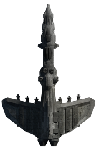
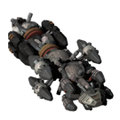
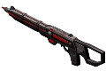
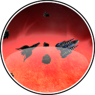

All Plugins (604)

[Cheats](https://github.com/Hecter94/EndlessSky-PluginArchive/blob/main/res/mds/cheats.md) (38) | [Gameplay](https://github.com/Hecter94/EndlessSky-PluginArchive/blob/main/res/mds/gameplay.md) (55) | [Graphics](https://github.com/Hecter94/EndlessSky-PluginArchive/blob/main/res/mds/graphics.md) (29) | [Outfits](https://github.com/Hecter94/EndlessSky-PluginArchive/blob/main/res/mds/outfits.md) (52)<br>
[Overhauls](https://github.com/Hecter94/EndlessSky-PluginArchive/blob/main/res/mds/overhauls.md) (46) | [Overwrites](https://github.com/Hecter94/EndlessSky-PluginArchive/blob/main/res/mds/overwrites.md) (4) | [Patches](https://github.com/Hecter94/EndlessSky-PluginArchive/blob/main/res/mds/patches.md) (3) | [Races](https://github.com/Hecter94/EndlessSky-PluginArchive/blob/main/res/mds/races.md) (70)<br>
[Ships](https://github.com/Hecter94/EndlessSky-PluginArchive/blob/main/res/mds/ships.md) (143) | [Starts](https://github.com/Hecter94/EndlessSky-PluginArchive/blob/main/res/md/starts.md) (17) | [Story](https://github.com/Hecter94/EndlessSky-PluginArchive/blob/main/res/mds/story.md) (80) | [Weapons](https://github.com/Hecter94/EndlessSky-PluginArchive/blob/main/res/mds/weapons.md) (42)<br>
[Uncategorized](https://github.com/Hecter94/EndlessSky-PluginArchive/blob/main/res/mds/uncategorized.md) (25)<br>

---

## Gameplay

<p>55 plugins in this category.<p>


 

---

### Adjusted Hyperdrive


[Adjusted.Hyperdrive.zip](https://github.com/Hecter94/EndlessSky-PluginArchive/releases/download/Latest/Adjusted.Hyperdrive.zip) | 2.87 kb | 2022-10-06 | [view files](https://github.com/Hecter94/EndlessSky-PluginArchive/tree/main/Working/Adjusted%20Hyperdrive/) <br>
Author: N/A | Category: Gameplay <br>
N/A[]()  <br>

>Increases fuel capacity of many ships and modifies the three drives.
>


Status: N/A <br>
Daily update check: </img><br>


---

### Arc Over
</img><br>


[Arc.Over.zip](https://github.com/Hecter94/EndlessSky-PluginArchive/releases/download/Latest/Arc.Over.zip) | 180.38 kb | 2024-11-30 | [view files](https://github.com/Hecter94/EndlessSky-PluginArchive/tree/main/Working/Arc%20Over/) <br>
Author: Saugia | Category: Gameplay <br>
[https://github.com/Saugia/arc-over](https://github.com/Saugia/arc-over) (last commit 2024-06-26) <br>

>Gives vanilla ships limited turret arcs, introducing a new aspect to combat balance.
>

<details>
<summary>:blue_book: Plugin readme</summary>
<blockquote># Arc Over


This repository is for the Endless Sky plug-in "Arc Over". The plug-in currently encompasses all vanilla ships except person ships as well as ships not yet used in vanilla gameplay. As new ships are added to vanilla, this plug-in will be updated.

## About
Arc Over gives limited angles to turret mounts on vanilla ships, adding another balance aspect to combat gameplay. These arcs are determined by a few factors, and are given exceptions in some cases, some being more lenient than others, and others being no limits at all. For detailed information, see the `arc notes.txt` file in the data folder for general concept and specific choices for each faction.

## Download
For a "stable release", check out the Releases on the righthand side of this page and download the Source.zip file and extract to your plug-ins directory, so that there's the "arc-over-version#" folder in your plug-ins folder.
For getting the "continuous", which can be changed at any moment, click on the green `<> Code` button at the top right of the repository and download the ZIP file, then extract it to your plug-ins folder.

## Contact
If you find any bugs or issues with this plug-in, or have any suggestions, feel free to open an Issue in this repository, or visit the Endless Sky Community Discord server here: https://discord.gg/ZeuASSx and @Saugia in #plug-in chat. Additionally, feel free to leave any feedback on how limited turret arc gameplay feels with vanilla content - whether it is beneficial, net neutral, or a detriment. 

</blockquote>
</details>

Status: In Progress <br>
Daily update check: </img><br>


---

### Arrival Distance Override


[Arrival.Distance.Override.zip](https://github.com/Hecter94/EndlessSky-PluginArchive/releases/download/Latest/Arrival.Distance.Override.zip) | 217.09 kb | 2022-10-06 | [view files](https://github.com/Hecter94/EndlessSky-PluginArchive/tree/main/Working/Arrival%20Distance%20Override/) <br>
Author: N/A | Category: Gameplay <br>
N/A[]()  <br>

>Add system arrival depending on habitable or belt distance.
>Can get overridden by other plugins.
>


Status: N/A <br>
Daily update check: </img><br>


---

### automata.in.human.space
</img><br>


[automata.in.human.space.zip](https://github.com/Hecter94/EndlessSky-PluginArchive/releases/download/Latest/automata.in.human.space.zip) | 35.37 kb | 2024-09-24 | [view files](https://github.com/Hecter94/EndlessSky-PluginArchive/tree/main/Working/automata.in.human.space/) <br>
Author: zuckung | Category: Gameplay <br>
[https://github.com/zuckung/endless-sky-plugins](https://github.com/zuckung/endless-sky-plugins) (last commit 2024-09-24) <br>

>Brings jump drive equipped automata into human space after the wanderer campaign. See the readme for details.

<details>
<summary>:blue_book: Plugin readme</summary>
<blockquote>### automata.in.human.space
<br>
<br>
Brings jump drive equipped automata into human space after the wanderer campaign. <br>
<br>
You can find them where Korath ships in human space are usually found(ember waste and eastern syndicate). <br>
The chance to encounter previous Korath ships or automata is like 50/50. <br>
<br>
<br>
Changelog:<br>
<br>
2024-09-24<br>
removed jumpdrive from fighters and drones and put them correctly into the carriers<br>
adjusted some fleet variants<br>
<br>
2023-10-17<br>
added plugin.txt<br>
<br>
2023-09-01<br>
added more fleet variants <br>
reworked readme <br>
changed icon.png<br>

</blockquote>
</details>

Status: complete <br>
Daily update check: </img><br>


---

### Bare Ships


[Bare.Ships.zip](https://github.com/Hecter94/EndlessSky-PluginArchive/releases/download/Latest/Bare.Ships.zip) | 2.02 kb | 2023-07-27 | [view files](https://github.com/Hecter94/EndlessSky-PluginArchive/tree/main/Working/Bare%20Ships/) <br>
Author: lifeyouristhis | Category: Gameplay <br>
[https://github.com/lifeyouristhis/bare-ships-plugin](https://github.com/lifeyouristhis/bare-ships-plugin) (last commit 2017-09-14) <br>

>Shipyards now sell bare hulls with no outfits.
>

<details>
<summary>:blue_book: Plugin readme</summary>
<blockquote># bare-ships-plugin

</blockquote>
</details>

Status: N/A <br>
Daily update check: </img><br>


---

### BetterVanillaHai
</img><br>


[BetterVanillaHai.zip](https://github.com/Hecter94/EndlessSky-PluginArchive/releases/download/Latest/BetterVanillaHai.zip) | 73.69 kb | 2023-11-21 | [view files](https://github.com/Hecter94/EndlessSky-PluginArchive/tree/main/Working/BetterVanillaHai/) <br>
Author: ZBok | Category: Gameplay <br>
[https://github.com/ZBok/BetterVanillaHai](https://github.com/ZBok/BetterVanillaHai) (last commit 2022-06-24) <br>

>In short this plugin assumes news of the Hai spreads rapidly. Therefore in the late game a small percentage of humans start using their ships in ambient fleets. It therefore adds Hai vessels and many variants (like full Proton SB or Plasma/QuadBlaster Solifuge + many more) as rare additions to almost all human fleets in the late-game (more details below). This makes ambient pirate combat much more spicy and varied, with the tide of pirate battle being turned when a Hai ship from either side jumps in.

<details>
<summary>:blue_book: Plugin readme</summary>
<blockquote># BetterVanillaHai for Endless Sky

In short this plugin assumes news of the Hai spreads rapidly. Therefore in the late game a small percentage of humans start using their ships in ambient fleets. It therefore adds Hai vessels and many variants (like full Proton SB or Plasma/QuadBlaster Solifuge + many more) as rare additions to almost all human fleets in the late-game (more details below). This makes ambient pirate combat much more spicy and varied, with the tide of pirate battle being turned when a Hai ship from either side jumps in.

Ambient spawn rate of Hai ships should be around or below 10%. The plugin attempts to maintain NPC combat balance by adding strength evenly to opposing fleets (pirate/merchant etc), and maintain vanilla feeling fleet compositions.

It activates these changes after player completes both the missions related to the Solifuge and Pond Strider, and has also completed the main plot.

The general idea behind this change is that news of advanced squirrel aliens in close proximity to humanity would plausibly spread very rapidly and that the more prosperous/badass merchants and pirates will be therefore occasionally seen using their ships in human space.

Now if merchants/pirates start using Hai ships, then by golly gosh the military can't allow themselves to be outgunned and is forced to get on board the acorn train too. Therefore this plugin gives the Republic and FW custom variants of the SB as well as the standard Hai weapon setups. Deep/Syndicate use the Strider in the same way. Militia get nothing because they are poor.

Merchants/navy don't use the Solifuge, but pirates do because... somehow. To be honest I couldn't come up with any plausible process for pirates to get their hands on Solifuges - maybe they could buy from the De-fettered though pirates getting through Hai space seems unlikely - but whatever. It's a cool Hai ship, I didn't want to leave it out, so some Solifuge variants pop up in pirate fleets just because. Also the Proton Solifuge (used by Core pirates) is freaking badass.

This plugin doesn't add Hai outfitted human ships in a similar fashion (BetterVanillaPirates does).


Enjoy!

</blockquote>
</details>

Status: N/A <br>
Daily update check: </img><br>


---

### Boarding Licenses


[Boarding.Licenses.zip](https://github.com/Hecter94/EndlessSky-PluginArchive/releases/download/Latest/Boarding.Licenses.zip) | 17.96 kb | 2023-11-21 | [view files](https://github.com/Hecter94/EndlessSky-PluginArchive/tree/main/Working/Boarding%20Licenses/) <br>
Author: An-archist | Category: Gameplay <br>
[https://github.com/An-archist/boarding-licenses](https://github.com/An-archist/boarding-licenses) (last commit 2019-10-25) <br>

>Adds licenses that allow the player to capture ships. Currently in alpha The better the license, the more ships you can cap
>

<details>
<summary>:blue_book: Plugin readme</summary>
<blockquote>Prevents players from capping ships (easily) and adds licenses that allow the player to capture ships. Currently in alpha (0.0.1).
The better the license, the more ships you can cap.

Class A Boarding: (Human) Interceptors/Fighters

Class B Boarding: (Human) Light Warships/Transport/Light Freighter

Class C Boarding: (Human) Medium Warships/Heavy Freighter

Class D Boarding: (Human) Heavy Warships

Hai Boarding: Hai Ships

Korath Boarding: Korath Ships

</blockquote>
</details>

Status: N/A <br>
Daily update check: </img><br>


---

### Bounty Hunters


[Bounty.Hunters.zip](https://github.com/Hecter94/EndlessSky-PluginArchive/releases/download/Latest/Bounty.Hunters.zip) | 11.3 kb | 2023-07-27 | [view files](https://github.com/Hecter94/EndlessSky-PluginArchive/tree/main/Working/Bounty%20Hunters/) <br>
Author: WarlordMike | Category: Gameplay <br>
[https://github.com/WarlordMike/es-bounty-hunters](https://github.com/WarlordMike/es-bounty-hunters) (last commit 2020-11-07) <br>

>Adds a storyline where you can become a bounty hunter.
>

<details>
<summary>:blue_book: Plugin readme</summary>
<blockquote># es-bounty-hunters
es-bounty-hunters is a plugin for Endless Sky that adds a new storyline in which the player can become a Bounty Hunter. I won't spoil it for you here...

## Installation
Download the code as a .zip and extract it to your plugins file. On Linux, it's `/.local/share/endless-sky/plugins`, and I don't use Window or Mac, so you'll have to figure it out yourself.

## Acknowledgements
Thank you to everyone on the ES Discord for helping me, but special thanks to EjoThims for reviewing the first chapter of the story, Arachi for pointing out my dumb mistakes, and Warlord Mike for coming up with the names for Arthur Stalgren and Admiral Lowell. Thanks, guys!

</blockquote>
</details>

Status: N/A <br>
Daily update check: </img><br>


---

### Bounty-Fix
</img><br>


[Bounty-Fix.zip](https://github.com/Hecter94/EndlessSky-PluginArchive/releases/download/Latest/Bounty-Fix.zip) | 95.43 kb | 2023-07-23 | [view files](https://github.com/Hecter94/EndlessSky-PluginArchive/tree/main/Working/Bounty-Fix/) <br>
Author: CatLady | Category: Gameplay <br>
[https://github.com/Cat-Lady/Bounty-Fix](https://github.com/Cat-Lady/Bounty-Fix) (last commit 2019-11-17) <br>

>This ES plugin makes Pirates/Marauders that are subject of Bounty Hunting missions be properly seen as enemies by Militia/Navy/Deep Security/Merchants and other forces that should dislike Marauders/Pirates.


Status: N/A <br>
Daily update check: </img><br>


---

### Businessman Mod


[Businessman.Mod.zip](https://github.com/Hecter94/EndlessSky-PluginArchive/releases/download/Latest/Businessman.Mod.zip) | 802.36 kb | 2023-07-27 | [view files](https://github.com/Hecter94/EndlessSky-PluginArchive/tree/main/Working/Businessman%20Mod/) <br>
Author: Evan | Category: Gameplay <br>
N/A[]()  <br>

>Become a ruler of the galaxy through money. Buy trade routes, stocks, set up shops and entertainment centers, buy planets, hire a mercenary army, hunt down people who didn't pay back their loans....and more.. Also includes an optional alternate pirate start, and additons to make piracy much more viable and fun.
>

<details>
<summary>:blue_book: Plugin readme</summary>
<blockquote># EndlessSky-Businessman-Mod
A simple mod with many changes and additions

For a full list of features and downloads check the steam guide here: http://steamcommunity.com/sharedfiles/filedetails/?id=690480787

</blockquote>
</details>

Status: Playable on 0.9.14, 0.9.15 Continuous. <br>
Daily update check: </img><br>


---

### Cargo Controls Plugin


[Cargo.Controls.Plugin.zip](https://github.com/Hecter94/EndlessSky-PluginArchive/releases/download/Latest/Cargo.Controls.Plugin.zip) | 3.15 kb | 2023-07-27 | [view files](https://github.com/Hecter94/EndlessSky-PluginArchive/tree/main/Working/Cargo%20Controls%20Plugin/) <br>
Author: petervdmeer | Category: Gameplay <br>
[https://github.com/petervdmeer/endless-sky-cargo-controls-plugin](https://github.com/petervdmeer/endless-sky-cargo-controls-plugin) (last commit 2019-11-29) <br>

>Cargo Controls options for Endless Sky.

<details>
<summary>:blue_book: Plugin readme</summary>
<blockquote># endless-sky-cargo-controls-plugin
Cargo Controls options for Endless Sky (computer game)

</blockquote>
</details>

Status: N/A <br>
Daily update check: </img><br>


---

### Conscience Plugin


[Conscience.Plugin.zip](https://github.com/Hecter94/EndlessSky-PluginArchive/releases/download/Latest/Conscience.Plugin.zip) | 24.08 kb | 2023-07-27 | [view files](https://github.com/Hecter94/EndlessSky-PluginArchive/tree/main/Working/Conscience%20Plugin/) <br>
Author: mathwhiz1212 | Category: Gameplay <br>
[https://github.com/mathwhiz1212/ES-conscience-plugin](https://github.com/mathwhiz1212/ES-conscience-plugin) (last commit 2023-03-04) <br>

>This plugin is meant to allow you to complete Endless Sky story lines without doing things you have an ethical problem with. For now, it just makes it so you don't need to drop a bomb on Zenith and kill civilians.

<details>
<summary>:blue_book: Plugin readme</summary>
<blockquote># Endless Sky Conscience Plugin

This plugin is meant to allow you to complete Endless Sky story lines without doing things you have an ethical problem with. For now, it just makes it so you don't need to drop a bomb on Zenith and kill civilians.

If you'd rather grind then use a plugin, you can cap a bunch of Korath ships in Kor Ak'Mari and destroy the Sestor fleet that way.

If you take the Quarg ships anywhere other than the assigned planets and systems, they may or may not disappear.

## Installing

1. Download the plugin here: [https://github.com/mathwhiz1212/A-Coalition-At-War/releases](https://github.com/mathwhiz1212/A-Coalition-At-War/releases)

2. Put the zip file in your plugins folder:

Windows: `%APPDATA%\endless-sky\plugins/`

Mac: `/Library/ApplicationSupport/endless-sky/plugins/`

Linux: `/.local/share/endless-sky/plugins/`

3. Decompress/"Unzip" the zip file.
4. Start Endless Sky. You should be able to see "A Coalition at War" under Preferences > Plugins.
5. If you have problems, open an issue.

# Using the Plugin

Install the plugin before you get to Hevru Hai. If you're already past that mission, try landing on Hevru Hai anyway. It might still work.

Park any escort ships you don't want to lose in Hai space. Make sure you have a cloaking device on your flagship.

It's best if your flagship is better than what humans have (a Wanderer warship would do nicely), but as long as your shields can last till you run away, you'll be ok.

Destroy or capture the Sestor drones above Farpoint before you land.

After talking to Danforth, cloak and hide. Run away. If you're daring, come back and distract single Sestor ships on the edges. Cloak fast when needed.

Make sure to destroy or capture every last drone, until you get a message that starts with `Against all odds...`

## Alnilam Mission

You'll get two Quarg ships to help you with this one too. Make sure to destroy or capture every Korath drone in the system. The game is more picky about this one, so if you go to Fairpoint and don't get the next mission, go back and destroy any disabled drones.

Then return to Fairpoint. You'll then be sent to Zenith. When you get to Zenith, land immediately. Don't let the cruisers get destroyed before you land on the planet.

That's it! You've successfully avoided committing mass murder!

</blockquote>
</details>

Status: N/A <br>
Daily update check: </img><br>


---

### Costly Drives
</img><br>


[Costly.Drives.zip](https://github.com/Hecter94/EndlessSky-PluginArchive/releases/download/Latest/Costly.Drives.zip) | 99.21 kb | 2023-07-27 | [view files](https://github.com/Hecter94/EndlessSky-PluginArchive/tree/main/Working/Costly%20Drives/) <br>
Author: Anarchist2 | Category: Gameplay <br>
[https://github.com/Anarchist2/costly-drives](https://github.com/Anarchist2/costly-drives) (last commit 2020-04-26) <br>

>This plugin makes drives much more expensive, while making them unplunderable to prevent easy(er) boarding. Additionally, drive sales are much more restricted.
>

<details>
<summary>:blue_book: Plugin readme</summary>
<blockquote># Costly Drives
I've always found it odd that hyperdrives, despite the supposed mystery of their workings, is sold super cheaply, especially when compared to a bunch of power outfits (which have basis in real life). This plugin makes drives much more expensive, while making them unplunderable to prevent easy(er) boarding. Additionally, drive sales are much more restricted.

Known Problems:
- Broken JDs don't have increased value/unplunderable: The main use of Broken JDs is for the Remnant Broken JD mission, and I didn't want to force players to have a boarding ship to do those missions.
- Missions don't give a corresponding amount of increased money. Because of the inability to modify existing missions using plugins, this is unfixable at the moment.
</blockquote>
</details>

Status: N/A <br>
Daily update check: </img><br>


---

### Crowded Sky


[Crowded.Sky.zip](https://github.com/Hecter94/EndlessSky-PluginArchive/releases/download/Latest/Crowded.Sky.zip) | 8.83 kb | 2022-10-06 | [view files](https://github.com/Hecter94/EndlessSky-PluginArchive/tree/main/Working/Crowded%20Sky/) <br>
Author: 1010todd | Category: Gameplay <br>
N/A[]()  <br>

>Make npc fleets spawn more often.
>Note: it's done by overwriting map file, may cause conflict with other plugin that also do that.
>


Status: N/A <br>
Daily update check: </img><br>


---

### Delayed Free Worlds


[Delayed.Free.Worlds.zip](https://github.com/Hecter94/EndlessSky-PluginArchive/releases/download/Latest/Delayed.Free.Worlds.zip) | 16.59 kb | 2023-07-27 | [view files](https://github.com/Hecter94/EndlessSky-PluginArchive/tree/main/Working/Delayed%20Free%20Worlds/) <br>
Author: MinneIceCube | Category: Gameplay <br>
[https://github.com/MinneIceCube/Delayed-Free-Worlds-Start](https://github.com/MinneIceCube/Delayed-Free-Worlds-Start) (last commit 2022-04-15) <br>

>Does exactly what the title says it does. Delays the declration of the Free Worlds by about half a year. The reason for this is so that players will have more time to complete missions for the The "Southern Mutual Defense Pact." While few in number, they are easy to miss if not done before the war starts. 


Status: N/A <br>
Daily update check: </img><br>


---

### disable.person.ships
</img><br>


[disable.person.ships.zip](https://github.com/Hecter94/EndlessSky-PluginArchive/releases/download/Latest/disable.person.ships.zip) | 19.64 kb | 2025-02-24 | [view files](https://github.com/Hecter94/EndlessSky-PluginArchive/tree/main/Working/disable.person.ships/) <br>
Author: zuckung | Category: Gameplay <br>
[https://github.com/zuckung/endless-sky-plugins](https://github.com/zuckung/endless-sky-plugins) (last commit 2024-02-02) <br>

>Disables all person ships. See the README for details.
>

<details>
<summary>:blue_book: Plugin readme</summary>
<blockquote>### disable.person.ships <br>
<br>
<br>
Disables all 14 random spawning person ships.<br>
<br>
<ul>
<li>	"Michael Zahniser" </li>
<li>	"Cap'n Pester" </li>
<li>	"Marauding Max" </li>
<li>	"Captain Nate" </li>
<li>	"Tranquility" </li>
<li>	"Power of the People" </li>
<li>	"Local God" </li>
<li>	"Subsidurial" </li>
<li>	"Prototype B3-CC4" </li>
<li>	"Rais Iris XVIII" </li>
<li>	"Zitchas" </li>
<li>	"Brick" </li>
<li>	"Gefullte Taubenbrust" </li>
<li>	"MasterOfGrey" </li>
<li>	"Patrol Team" </li>
</ul>
<br>
<br>
Changelog:<br>
<br>
2024-02-02<br>
added 0.10.5 "Patrol Team"<br>
<br>
2023-10-17<br>
added plugin.txt<br>
<br>
2013-08-31<br>
added icon.png<br>
</blockquote>
</details>

Status: complete <br>
Daily update check: </img><br>


---

### disable.spaceport.repeatables
</img><br>


[disable.spaceport.repeatables.zip](https://github.com/Hecter94/EndlessSky-PluginArchive/releases/download/Latest/disable.spaceport.repeatables.zip) | 20.13 kb | 2025-02-24 | [view files](https://github.com/Hecter94/EndlessSky-PluginArchive/tree/main/Working/disable.spaceport.repeatables/) <br>
Author: zuckung | Category: Gameplay <br>
[https://github.com/zuckung/endless-sky-plugins](https://github.com/zuckung/endless-sky-plugins) (last commit 2024-05-26) <br>

>Disables all repeatable spaceport missions. I.e. shady passenger transport, drug smuggling, time critical transport or defend planet. See the README for details.
>

<details>
<summary>:blue_book: Plugin readme</summary>
<blockquote>### disable.spaceport.repeatables
<br>
<br>
Disables all spaceport repeatable missions. These missions annoy me. Removes the 8 dialog repeatables, the 8 defend planet missions and the 4 republic catastrophe repeatables.<br>
<br>
<br>
<ul>
<li> "Shady passenger transport 1" </li>
<li> "Shady passenger transport 2" </li>
<li> "Shady passenger transport 3" </li>
<li> "Drug Running 1" </li>
<li> "Drug Running 2" </li>
<li> "Drug Running 3" </li>
<li> "Courier 1" </li>
<li> "Courier 2" </li>
<li> "Southern Pirate Attack" </li>
<li> "Northern Pirate Attack" </li>
<li> "Core Pirate Attack" </li>
<li> "Pirate Occupation [0]" </li>
<li> "Pirate Occupation [1]" </li>
<li> "Pirate Occupation [2]" </li>
<li> "Raider Attack 1" </li>
<li> "Raider Attack 2" </li>
<li> "Republic Navy Advisory System [frozen]" </li>
<li> "Republic Navy Advisory System [volcanic]" </li>
<li> "Republic Navy Advisory System [wildfire cargo]" </li>
<li> "Republic Navy Advisory System [wildfire firefighters]" </li>
<li> "Small Scale Delivery" (Kor Efret)<li>
</ul>
<br>
<br>
Changelog:<br>
<br>
2024-05-26<br>
added "Small Scale Delivery" from Kor Efret<br>
<br>
2024-04-06<br>
added the 4 republic catastrophe repeatables<br>
<br>
2023-10-17<br>
added plugin.txt<br>
<br>
2023-09-03<br>
added the 2 syndicate alien attack missions<br>
<br>
2023-08-31<br>
added the 3 pirate occupation missions<br>
added icon.png<br>
</blockquote>
</details>

Status: complete <br>
Daily update check: </img><br>


---

### Drop Loot


[Drop.Loot.zip](https://github.com/Hecter94/EndlessSky-PluginArchive/releases/download/Latest/Drop.Loot.zip) | 89.72 kb | 2023-03-04 | [view files](https://github.com/Hecter94/EndlessSky-PluginArchive/tree/main/Working/Drop%20Loot/) <br>
Author: 1010todd | Category: Gameplay <br>
N/A[]()  <br>

>Every outfit now have chance to be dropped as flotsam when the ship explodes.
>


Status: N/A <br>
Daily update check: </img><br>


---

### Extra Large Jobs


[Extra.Large.Jobs.zip](https://github.com/Hecter94/EndlessSky-PluginArchive/releases/download/Latest/Extra.Large.Jobs.zip) | 6.25 kb | 2022-10-06 | [view files](https://github.com/Hecter94/EndlessSky-PluginArchive/tree/main/Working/Extra%20Large%20Jobs/) <br>
Author: 1010todd | Category: Gameplay <br>
N/A[]()  <br>

>Add various large to extremely large jobs to fill up the space when for extra large ships.
>
>
>


Status: Playable on 0.9.15 Continuous. <br>
Daily update check: </img><br>


---

### Galactic Hazards


[Galactic.Hazards.zip](https://github.com/Hecter94/EndlessSky-PluginArchive/releases/download/Latest/Galactic.Hazards.zip) | 5.04 kb | 2022-10-06 | [view files](https://github.com/Hecter94/EndlessSky-PluginArchive/tree/main/Working/Galactic%20Hazards/) <br>
Author: N/A | Category: Gameplay <br>
N/A[]()  <br>

>adds more hazards to many systems. like coronar mass ejection, different asteroid impact, dust rings atound stars, etc.
>


Status: N/A <br>
Daily update check: </img><br>


---

### galactic.capital.investment
</img><br>


[galactic.capital.investment.zip](https://github.com/Hecter94/EndlessSky-PluginArchive/releases/download/Latest/galactic.capital.investment.zip) | 4.07 mb | 2025-06-07 | [view files](https://github.com/Hecter94/EndlessSky-PluginArchive/tree/main/Working/galactic.capital.investment/) <br>
Author: zuckung | Category: Gameplay <br>
[https://github.com/zuckung/endless-sky-plugins](https://github.com/zuckung/endless-sky-plugins) (last commit 2025-06-07) <br>

>Implements a short mission chain that enables repeatable job board investment opportunities which result in small daily income. Available in human, quarg and hai space starting with 2 million credits cash and going up to 100 million credits. See the readme for details.
>(inspired by a-alhusaini's investment bank plugin)

<details>
<summary>:blue_book: Plugin readme</summary>
<blockquote>### galactic.capital.investment <br>
<br>
Implements a short mission chain that enables repeatable job board investment opportunities which result in small daily income. Available in human, quarg and hai space starting with 2 million credits cash and going up to 1 billion credits.<br>
<br>
At 1 billion credits cash a longer mission chain starts and enables a reapeatable job board investment of 1 billion credits. The chain has some breaks and finishes after a year.<br>
There is also a job to deposit and withdraw credits, but at a much lower interest rate. And the same job offers to deposit and withdraw to a family trust, which can be accessed by all your saves/pilots (but without interest).<br>
<br>
Job board investments:(if enabled)<br>
1 million = 274 credits daily (12% chance) (10% interest p.a.)<br>
5 million = 1,520 credits daily (10% chance) (11% interest p.a.)<br>
10 million = 3,287 credits daily (8% chance) (12% interest p.a.)<br>
50 million = 17,808 credits daily (6% chance) (13% interest p.a.)<br>
100 million = 38,356 credits daily (4% chance) (14% interest p.a.)<br>
1 billion = 410,958 credits daily (2% chance) (15% interest p.a.)<br>
<br>
Job board bank account, always available:<br>
Deposit and withdraw from your bank account (4% interest p.a.)<br>
Deposit and withdraw from your family trust, accessible by all your pilots<br>
Sell investments at 10% conversion rate<br>
Set up the bank account interest as a daily cash payout<br>
Enable and disable the investment jobs/missions<br>
<br>
<br>
<br>
Changelog:<br>
<br>
2025-06-07<br>
recolored the jobs purple<br>
<br>
2025-06-05<br>
colored the jobs<br>
added series<br>
<br>
2025-05-19<br>
typo fixes by snoogles<br>
icon@2x, plugintxt changes<br>
<br>
2025-03-20<br>
replaced colony ship sprite (new one created by 1010todd)<br>
added the option to enable/disable job board investments/missions globally<br>
<br>
2025-02-14<br>
added normal banking with deposit and withdrawal to the job board(4% interest)<br>
added family trust banking, transfer money between pilots<br>
added investment selling<br>
halfed investment yield, and reduced chance for jobs<br>
upscaled colony ship image<br>
<br>
2024-10-29<br>
fixed wrong outfitter at planet Sapphire<br>
added @2x images<br>
renamed files to be unique<br>
<br>
2024-07-13<br>
removed the need to land on the same planet after accepting an investment job<br>
text corrections<br>
<br>
2024-06-07<br>
text corrections (thx to TheGiraffe3)<br>
<br>
2024-04-05<br>
removed duplicate pngs<br>
resized land jpg<br>
<br>
2024-03-31<br>
fixed some errors<br>
changed scene pngs to jpg<br>
<br>
2024-03-20<br>
changed icon<br>
added 5 new conversation scenes<br>
added 9-mission-chain to get credits for a planet colonization<br>
added unique trophy outfit at the end of the chain<br>
added a new rare repeatable job after the colonization chain<br>
<br>
2023-10-17<br>
added plugin.txt<br>
<br>
2023-08-25<br>
added pirate planets as mission source<br>
moved investment missions from spaceport mission to job board<br>

</blockquote>
</details>

Status: complete <br>
Daily update check: </img><br>


---

### Gatling Ammo Fix
</img><br>


[Gatling.Ammo.Fix.zip](https://github.com/Hecter94/EndlessSky-PluginArchive/releases/download/Latest/Gatling.Ammo.Fix.zip) | 79.73 kb | 2023-07-27 | [view files](https://github.com/Hecter94/EndlessSky-PluginArchive/tree/main/Working/Gatling%20Ammo%20Fix/) <br>
Author: Cat-Lady | Category: Gameplay <br>
[https://github.com/Cat-Lady/Gatling-Ammo-Fix](https://github.com/Cat-Lady/Gatling-Ammo-Fix) (last commit 2019-11-17) <br>

>This plugin fixes availability of Gatling Gun Ammo (and its boxes) - being most primitive and easiest to manufacture type of ordnance, it is now available where you would expect it to be (hint: "galactic south" and multipurpose ammo depots).
>
>Recommended to use with Becca's Endless Expansion plugin (which adds Kraz Cybernetic's Accurate Gatling Blaster" variant).
>

<details>
<summary>:blue_book: Plugin readme</summary>
<blockquote>[h1]This plugin is a part of upcoming "Endless Sky: Captain's Edition" reboot of the base game. Stay tuned - meanwhile, installing the plugins can help to preview the experience, together or in parts.[/h1]

This plugin fixes availability of Gatling Gun Ammo (and its boxes) - being most primitive and easiest to manufacture type of ordnance, it is now available where you would expect it to be (hint: "galactic south" and multipurpose ammo depots).


[h1]Installing[/h1]

Check:
https://github.com/Cat-Lady/Gatling-Ammo-Fix/releases

...for latest, pre-packaged version.


[b]1.[/b] Unpack [i]boarding-enhancements[/i] to your ES plugins folder. Be sure that you have single [i]gatling-ammo-fix[/i] directory inside your plugins folder, containing [i]data[/i] folder. Directory structure should look like:

[code](...)/plugins/gatling-ammo-fix/(.../data/, and other stuff)[/code]

It [b]won't[/b] work if the directory structure will be anything like:

[code](...)/plugins/gatling-ammo-fix/gatling-ammo-fix/(...)[/code]


[h1]Author[/h1]

[list][*][b]Cat Lady[/b][/list]


[h1]License[/h1]

This project is licensed under the GPL3 License - see the LICENSE.md file for details.


[h1]Acknowledgments[/h1]

"Endless Sky" Development Team and Michael Zahniser; For maintaining and creating the game.
</blockquote>
</details>

Status: N/A <br>
Daily update check: </img><br>


---

### GreyShipVolume


[GreyShipVolume.zip](https://github.com/Hecter94/EndlessSky-PluginArchive/releases/download/Latest/GreyShipVolume.zip) | 62.42 kb | 2022-10-06 | [view files](https://github.com/Hecter94/EndlessSky-PluginArchive/tree/main/Working/GreyShipVolume/) <br>
Author: 1010Todd | Category: Gameplay <br>
N/A[]()  <br>

>Lots of map to calculate ship volume(outfit/cargo space) and mass.
>WARNING: single-file race might have unrelated data attached (Pug, Drak, etc.)
>
>


Status: Playable on 0.9.14, 0.9.15 Continuous. <br>
Daily update check: </img><br>


---

### hai.side.mission.unlocker
</img><br>


[hai.side.mission.unlocker.zip](https://github.com/Hecter94/EndlessSky-PluginArchive/releases/download/Latest/hai.side.mission.unlocker.zip) | 100.02 kb | 2025-06-05 | [view files](https://github.com/Hecter94/EndlessSky-PluginArchive/tree/main/Working/hai.side.mission.unlocker/) <br>
Author: zuckung | Category: Gameplay <br>
[https://github.com/zuckung/endless-sky-plugins](https://github.com/zuckung/endless-sky-plugins) (last commit 2025-06-05) <br>

>Unlocks Hai missions, that are currently blocked because of the Hai reveal rework. See the README for details.
>

<details>
<summary>:blue_book: Plugin readme</summary>
<blockquote>### hai.side.mission.unlocker
<br>
<br>
Unlocks following hai missions: Unwanted Cargo Trigger, Hiding in Plain Sight and Hai Reveal: Pirate Troubles [0]. If there are followups they work too. Also Devil-Run related systems are shown now.<br>
<br>
Currently these missions are either completely blocked or blocked after you start chapter 1 of hai reveal. This plugin fixes that.<br>
mission "Unwanted Cargo Trigger" (removed secret leaks)<br>
mission "Unwanted Cargo" (removed secret leaks)<br>
mission "Hiding in Plain Sight" (removed secret leaks & resolution)<br>
mission "Hai Reveal: Pirate Troubles [0]" (Scars Legion cut out of campaign)<br>
<br>
Also removes the hidden tag from system Devil-Run. It can be found near the core and opens the path to the Deep Space systems and the Devil-Hide system via wormhole.<br>
And removes hidden tag from "Devil-Hide" and "Al Hurr", both Hai Reveal systems.<br>
<br>
<br>
Changelog:<br>
<br>
2025-06-05<br>
removed nanachi and expanding business from plugin (0.10.13 enabled them now)<br>
<br>
2025-05-19<br>
typo fixes by snoogles<br>
license, README changes<br>
<br>
2024-09-06<br>
removed HR status message from Pirate Troubles [1]<br>
disabled the original missions, instead of a workaround<br>
merged this plugin with the plugin devil-run.unhidden<br>
<br>
2024-04-19<br>
bug fixes<br>
<br>
2024-04-16<br>
initial release<br>


</blockquote>
</details>

Status: complete <br>
Daily update check: </img><br>


---

### highrollers.ltd
</img><br>


[highrollers.ltd.zip](https://github.com/Hecter94/EndlessSky-PluginArchive/releases/download/Latest/highrollers.ltd.zip) | 1.02 mb | 2025-05-03 | [view files](https://github.com/Hecter94/EndlessSky-PluginArchive/tree/main/Working/highrollers.ltd/) <br>
Author: zuckung | Category: Gameplay <br>
[https://github.com/zuckung/endless-sky-plugins](https://github.com/zuckung/endless-sky-plugins) (last commit 2025-03-14) <br>

>This plugin adds some casino space stations where you can gamble. See the README for details.
>

<details>
<summary>:blue_book: Plugin readme</summary>
<blockquote>### highrollers.ltd
<br>
<br>
This plugin adds some casino space stations where you can gamble.<br>
<br>
Adds casino space stations to Ruchbah, Tarazed, Rutilicus, and Epsilon Leonis. On each station's job board you can start six luck based games (Baccarat, Blackjack, Poker, Roulette, Craps, and Sic Bo).<br>
Every won round has a chance of increasing your skill for this special game. The skill levels go up to 500 which means you have a 5% higher chance of winning a round on max level. The games have different start winning chances from 47% to 50%.  I.e. with max poker skill, you have 55% chance to win a poker round. The table limits range from 5,000 to 100,000 credits and are randomized. After around 160 played rounds you get tired and the games ends (for this day).<br>
<br>
<br>
Changelog:<br>
<br>
2025-03-14<br>
typo fix (thx zanano)<br>
added 30 cargo/passenger jobs to/from the casinos<br>
<br>
2025-03-11<br>
initial release<br>


</blockquote>
</details>

Status: complete <br>
Daily update check: </img><br>


---

### HW Rebalance Test


[HW.Rebalance.Test.zip](https://github.com/Hecter94/EndlessSky-PluginArchive/releases/download/Latest/HW.Rebalance.Test.zip) | 18.13 kb | 2022-10-06 | [view files](https://github.com/Hecter94/EndlessSky-PluginArchive/tree/main/Working/HW%20Rebalance%20Test/) <br>
Author: 1010Todd | Category: Gameplay <br>
N/A[]()  <br>

>Triple human heavy warship mass to make them slower.
>


Status: Playable on 0.9.14, 0.9.15 Continuous. <br>
Daily update check: </img><br>


---

### Investment Bank


[Investment.Bank.zip](https://github.com/Hecter94/EndlessSky-PluginArchive/releases/download/Latest/Investment.Bank.zip) | 0.96 kb | 2023-07-27 | [view files](https://github.com/Hecter94/EndlessSky-PluginArchive/tree/main/Working/Investment%20Bank/) <br>
Author: a-alhusain | Category: Gameplay <br>
[https://github.com/a-alhusaini/investment-bank-es-plugin](https://github.com/a-alhusaini/investment-bank-es-plugin) (last commit 2021-10-13) <br>

>When you are rich enough some investment banks will offer you a chance to invest with them to gain an increased daily salary
>

<details>
<summary>:blue_book: Plugin readme</summary>
<blockquote># Investment Bank plugin for Endless sky

This plugin is simple. When you are rich enough some investment banks will offer you a chance to invest with them to gain an increased daily salary

</blockquote>
</details>

Status: Playable on 0.9.14, 0.10.0 Continuous. <br>
Daily update check: </img><br>


---

### Jaws
</img><br>


[Jaws.zip](https://github.com/Hecter94/EndlessSky-PluginArchive/releases/download/Latest/Jaws.zip) | 3.37 mb | 2025-08-06 | [view files](https://github.com/Hecter94/EndlessSky-PluginArchive/tree/main/Working/Jaws/) <br>
Author: LixiChronikouOriou | Category: Gameplay <br>
[https://github.com/LixiChronikouOriou/ES-plugins](https://github.com/LixiChronikouOriou/ES-plugins) (last commit 2025-08-06) <br>

>Completely harmless space wildlife, which you can randomly shoot at. Trust me.
>

<details>
<summary>:blue_book: Plugin readme</summary>
<blockquote>
### Jaws ###

**Author: [Timeout](https://github.com/LixiChronikouOriou)**

**Artwork: [Tearcell](https://tearcellgames.itch.io/cosmic-canidae-assets)**

**Thanks**: Zuckung

Adds the Antaren Thresher to Gossamer and neighboring systems, which consumes void fish, asteroids and since recently also Abberants. Once inhabited also Arachi space and even Antares, but out of unknown reasons went extinct there long ago.

Completely harmless.

Inspired by the Spaceshark from [Mil-taj Protectorate](https://github.com/demolish238/Mil-taj-Protectorate) by [Demolish238](https://github.com/demolish238), which was derived from the Antaren Thresher in [Cosmic Canidae](https://tearcellgames.itch.io/cosmic-canidae) by [Tearcell](https://tearcellgames.itch.io).

Can be found in Omnis under the Vyrmeids.

In the Thresher's habitat you can find crunched, i.e. derelict, Aberrants with otherwise extremely rare items to plunder.

**Changelog**

| Date | Version | Comment |
|------|---------|---------|
| 2025-08-06 | 1.2.1 | Replaced custom on-death effect with an appropriate vanilla one, such significantly reducing file size. |
| 2025-08-05 | 1.2.0 | Habitat expansion, added derelict Aberrants with rare items, tweaked stats, added image for ripping maw, becoming also the new icon. Reduced plugin size further. | 
| 2025-07-19 | 1.1.0 | Added support for Omnis. |
| 2025-07-11 | 1.0.0 | Creature relocation, and complete redesign of lore, stats and appearance. Reduced requirements regarding free storage space by 2/3. |
| 2024-11-02 | - | Release of [Mil-taj Protectorate](https://github.com/demolish238/Mil-taj-Protectorate) |
| 2022-02-13 | - | Release of [Cosmic Canidae](https://tearcellgames.itch.io/cosmic-canidae) |

</blockquote>
</details>

Status: complete <br>
Daily update check: </img><br>


---

### jump.gates
</img><br>


[jump.gates.zip](https://github.com/Hecter94/EndlessSky-PluginArchive/releases/download/Latest/jump.gates.zip) | 1.99 mb | 2025-02-07 | [view files](https://github.com/Hecter94/EndlessSky-PluginArchive/tree/main/Working/jump.gates/) <br>
Author: zuckung | Category: Gameplay <br>
[https://github.com/zuckung/endless-sky-plugins](https://github.com/zuckung/endless-sky-plugins) (last commit 2025-02-07) <br>

>Adds a ring of jump gates at the borders of human space to create shortcuts inside human space. See the README for details.
>

<details>
<summary>:blue_book: Plugin readme</summary>
<blockquote>### jump.gates
<br>
<br>
Adds a ring of "jump gates" at the borders of Human space to create shortcuts inside the Human space.<br>
<br>
A month after the game starts, the player gets a spaceport info mission about a new discovered technology, that enables the building of jump gates (if your savegame is beyond that point, this info mission starts on the next planet landing). Over the next 5 months there are regularly spaceport info missions telling you things about how far the process of building these gates has come. At the end of this period all jump gates have been built and are usable.<br>
These jump gates are technically just wormholes with new sprites. The jump gate ring around human space is made of two gates in every of these systems: Naos (Deep) - Spica (Dirt Belt) - Alniyat (South) - Tarazed (South) - Sheratan (Core) - Alnitak (North) and from there back to Naos. Two gates, so you can move forward and backward on the ring.<br>
<br>
<br>
Changelog:<br>
<br>
2025-02-07<br>
removed label images and added wormhole names <br>
added @2x images<br>
resized planet images and changed scale<br>
added compatibility mission to handle the new image sizes<br>
<br>
2024-11-11<br>
fixed error<br>
<br>
2024-07-19<br>
initial release<br>
text corrections (thx to TheGiraffe3)<br>


</blockquote>
</details>

Status: complete <br>
Daily update check: </img><br>


---

### kestrel.unlocks
</img><br>


[kestrel.unlocks.zip](https://github.com/Hecter94/EndlessSky-PluginArchive/releases/download/Latest/kestrel.unlocks.zip) | 6.19 kb | 2025-02-24 | [view files](https://github.com/Hecter94/EndlessSky-PluginArchive/tree/main/Working/kestrel.unlocks/) <br>
Author: zuckung | Category: Gameplay <br>
[https://github.com/zuckung/endless-sky-plugins](https://github.com/zuckung/endless-sky-plugins) (last commit 2024-08-18) <br>

>Unlocks all Kestrel variants after you have unlocked the first one. See the README for details.
>

<details>
<summary>:blue_book: Plugin readme</summary>
<blockquote>### kestrel.unlocks
<br>
<br>
Unlocks all Kestrel variants after you have unlocked the first one.<br>
<br>
After completing the Kestrel mission chain, every 30 days a new variant is unlocked and you get notified about that. If you activate this plugin after you have already completed the missions, the 30 days timer starts from then.<br>
<br>
<br>
Changelog:<br>
<br>
2024-08-18<br>
initial release<br>


</blockquote>
</details>

Status: complete <br>
Daily update check: </img><br>


---

### Kor Mereti Fluff
</img><br>


[Kor.Mereti.Fluff.zip](https://github.com/Hecter94/EndlessSky-PluginArchive/releases/download/Latest/Kor.Mereti.Fluff.zip) | 2.62 mb | 2023-08-02 | [view files](https://github.com/Hecter94/EndlessSky-PluginArchive/tree/main/Working/Kor%20Mereti%20Fluff/) <br>
Author: OcelotWalrus | Category: Gameplay <br>
N/A[]()  <br>

>It is a plugin that expand the ships and the outfits of the Kor Mereti faction.
>

<details>
<summary>:blue_book: Plugin readme</summary>
<blockquote>## This plugin is deprecated and you can find the updated version merged with the [`Cromha-Expansion-plugin`](https://github.com/OcelotWalrus/Cromha-Expansion-plugin)

<p align=center></p>

<h1><p align=center>Endless Sky Plugin:<br />Kor Mereti Fluff</p></h1>

This is a plugin for the free, open-source game [Endless Sky][es]. This plugin
is developed and tested against the [Endless Sky continuous][continuous] build.
Learn more [about Endless Sky][esweb].
If you want to discuss about the plugin or ask more in depth questions to me.
You can also find this plugin merged with an other plugin: [Cromha Expansion](https://github.com/OcelotWalrus/Cromha-Expansion-plugin)


<details>

  <summary>Summary</summary>

* [About plugin](#about-plugin)
    * [This plugin](#this-plugin)
* [Contributing](#contributing)
* [Development status](#development-status)
* [Installation](#installation)
    * [Install steps](#install-steps)
    * [Keeping the plugin updated](#keeping-the-plugin-updated)
* [Credits](#credits)

</details>

# About Plugin:

It is a plugin that expand the ships and the outfits of the Kor Mereti faction. 

## This plugin:

* New ships and outfits for the Kor Mereti faction
* Adds deprecated outfits for the Korath in general
* Adds new systems in the Korath Space especially where there is the Kor Mereti and Kor Sestor factions.

# Contributing

All Contributions are welcome!
To contribute to the plugin, you can create issues to describe an error from spelling errors to mission bug or anything else.
You can also create an issue to request specific feature.

# Development Status
This plugin is fully finished.

# Installation
Go [here](https://github.com/OcelotWalrus/Cromha-Expansion-plugin/wiki/User-Guide) for more infos on installing the plugin.

## Install steps

To install the plugin you just have to clone this repository into your [endless sky plugin directory](https://github.com/endless-sky/endless-sky/wiki/CreatingPlugins).

```
git clone https://github.com/OcelotWalrus/Kor-Mereti-Fluff.git
```

## Keeping the plugin updated
If you're not familiar with git, you just have to run that command into the installed plugin.
```
git pull origin main
```
[es]: https://github.com/endless-sky/endless-sky
[continuous]: https://github.com/endless-sky/endless-sky/releases/tag/continuous
[esweb]: https://endless-sky.github.io/

# Credits

Thanks to all the people in the Endless Sky community and people who contributed.

<!--A list of the people who needs credits and for what...-->

* art from 1010todd's Green Mereti (the Model 1024 Green House ship and the Infected version)
* outfits derived from Endless Sky Pull Request #4987
* Derived from works by Nomadic Volcano (under GLP-3+) and Michael Zahniser (under the same license).
* Deprecated outfits originally from AES Misc. by Darcy Manoel
* Inspired by the plugin [Midnight-Expansion](https://github.com/MidnightPlugins/Midnight-Expansion) and [Midnight-Scrapyard](https://github.com/MidnightPlugins/Midnight-Scrapyard). The work on these plugins is insane!
* Darcy Manoel, sone of the outfits are deprecated outfits that were originally from AES Misc

</blockquote>
</details>

Status: Merged into Chroma Expansion <br>
Daily update check: </img><br>


---

### kor.efret.shipyard
</img><br>


[kor.efret.shipyard.zip](https://github.com/Hecter94/EndlessSky-PluginArchive/releases/download/Latest/kor.efret.shipyard.zip) | 29.96 kb | 2024-11-04 | [view files](https://github.com/Hecter94/EndlessSky-PluginArchive/tree/main/Working/kor.efret.shipyard/) <br>
Author: zuckung | Category: Gameplay <br>
[https://github.com/zuckung/endless-sky-plugins](https://github.com/zuckung/endless-sky-plugins) (last commit 2024-11-04) <br>

>Adds a shipyard with the three Kor Efret ships to Laki Nemparu(Kashikt) in Kor Efret space. Also adds an outfitter with all outfits of these three ships and some Korath Exiles outfits. See the readme for details.

<details>
<summary>:blue_book: Plugin readme</summary>
<blockquote>### kor.efret.shipyard
<br>
<br>
Adds a shipyard with the three Kor Efret ships to Laki Nemparu(Kashikt) in Kor Efret space. Also adds an outfitter with all outfits of these three ships and some Korath Exiles outfits. <br>
<br>
<br>
Available ships:<br>
<ul> 
<li>Arch-Carrack</li>
<li>Charm-Shallop</li>
<li>Echo-Galleon</li>
</ul>
<br>
Available outfits:<br>
<ul>
<li>"Cluster Mine Rack"</li>
<li>"Cluster Mine"</li>
<li>"Piercer Missile Rack"</li>
<li>"Piercer Missile"</li>
<li>"Firestorm Torpedo Rack"</li>
<li>"Firestorm Torpedo"</li>
<li>"Firelight Storage Rack"</li>
<li>"Firelight Missile"</li>
<li>Digger Mining Beam</li>
<li>Banisher Grav-Turret</li>
<li>Warder Anti-Missile</li>
<li>Grab-Strike Turret</li>
<li>Fuel Processor</li>
<li>Small Heat Shunt</li>
<li>Large Heat Shunt</li>
<li>Liquid Sodium Cooler</li>
<li>Scram Drive</li>
<li>System Core (Large)</li>
<li>System Core (Medium)</li>
<li>System Core (Small)</li>
<li>System Core (Tiny)</li>
<li>Plasma Core</li>
<li>Double Plasma Core</li>
<li>Triple Plasma Core</li>
<li>Afterburner (Asteroid Class)</li>
<li>Afterburner (Comet Class)</li>
<li>Afterburner (Lunar Class)</li>
<li>Afterburner (Planetary Class)</li>
<li>Afterburner (Stellar Class)</li>
<li>Generator (Furnace Class)</li>
<li>Generator (Candle Class)</li>
<li>Generator (Inferno Class)</li>
<li>Farves GP Hybrid Thruster</li>
<li>Gaktem GP Hybrid Steering</li>
<li>Gaktem GP Hybrid Thruster</li>
<li>Nelmeb GP Hybrid Steering</li>
<li>Nelmeb GP Hybrid Thruster</li>
<li>Engine (Meteor Class)</li>
<li>Bow Drive (Meteor Class)</li>
<li>Reverser (Asteroid Class)</li>
<li>Reverser (Comet Class)</li>
<li>Reverser (Lunar Class)</li>
<li>Reverser (Planetary Class)</li>
<li>Reverser (Stellar Class)</li>
<li>Thruster (Asteroid Class)</li>
<li>Thruster (Comet Class)</li>
<li>Thruster (Lunar Class)</li>
<li>Thruster (Planetary Class)</li>
<li>Thruster (Stellar Class)</li>
<li>Steering (Asteroid Class)</li>
<li>Steering (Comet Class)</li>
<li>Steering (Lunar Class)</li>
<li>Steering (Planetary Class)</li>
<li>Steering (Stellar Class)</li>
<li>Thermal Repeater Rifle</li>
</ul>
<br>
<br>
Changelog:<br>
<br>
2024-11-04<br>
added korath ammunition (thx to MeretiJane)<br>
<br>
2024-10-29<br>
added System Core (Tiny), (thx timeout.fu)<br>
<br>
2023-10-17<br>
added plugin.txt<br>
<br>
2023-09-01<br>
added 28 korath outfits(no weapons)<br>
added new icon.png<br>
reworked readme<br>
</blockquote>
</details>

Status: complete <br>
Daily update check: </img><br>


---

### Korath Domination


[Korath.Domination.zip](https://github.com/Hecter94/EndlessSky-PluginArchive/releases/download/Latest/Korath.Domination.zip) | 3.57 kb | 2022-10-06 | [view files](https://github.com/Hecter94/EndlessSky-PluginArchive/tree/main/Working/Korath%20Domination/) <br>
Author: N/A | Category: Gameplay <br>
N/A[]()  <br>

>makes korath exiles, kor efret, mereti and sestor planets dominateable(with tribute)
>


Status: N/A <br>
Daily update check: </img><br>


---

### Landing Fees and Tax


[Landing.Fees.and.Tax.zip](https://github.com/Hecter94/EndlessSky-PluginArchive/releases/download/Latest/Landing.Fees.and.Tax.zip) | 1.56 kb | 2022-10-06 | [view files](https://github.com/Hecter94/EndlessSky-PluginArchive/tree/main/Working/Landing%20Fees%20and%20Tax/) <br>
Author: Disiuze | Category: Gameplay <br>
[https://github.com/Disiuze/misc-projects](https://github.com/Disiuze/misc-projects) (last commit 2017-02-22) <br>

>Adds a landing fee the player has to pay each time after one year.
>


Status: Playable on 0.9.14, 0.9.15 Continuous. <br>
Daily update check: </img><br>


---

### Mass-ive Fix
</img><br>


[Mass-ive.Fix.zip](https://github.com/Hecter94/EndlessSky-PluginArchive/releases/download/Latest/Mass-ive.Fix.zip) | 86.69 kb | 2023-07-27 | [view files](https://github.com/Hecter94/EndlessSky-PluginArchive/tree/main/Working/Mass-ive%20Fix/) <br>
Author: Anarchist2 | Category: Gameplay <br>
[https://github.com/Anarchist2/Mass-ive-fix](https://github.com/Anarchist2/Mass-ive-fix) (last commit 2020-09-22) <br>

>Make mass and outfit space of a few outfits the same.
>

<details>
<summary>:blue_book: Plugin readme</summary>
<blockquote># Mass-ive Fix
Changelist:
- Ravager Beam mass from 13 to 18, Ravager Turret mass from 16 to 22
- Annihilator mass from 10 to 14, Annihilator Turret mass from 25 to 32
- Bellows-Class Afterburner mass from 13 to 11
- Ka'het MHD Generator mass from 20 to 22, Ka'het Reserve Accumulator mass from 2 to 3
- Ka'het EMP Deployer mass from 18 to 10
- Support Cooling mass from 6 to 8
- Primary Cooling mass from 11 to 14
- Shield Restorer mass from 15 to 19
- Inhibitor turret weapon capacity from -22 to -28
- Photovoltaic Panel masses from 22 and 3 to 16 and 2
- Collector masses from 28 and 8 to 21 and 6

Not changed:
- Missile Launcher mass: The ammo compensates for the reduced mass
- Inhibitor Turret mass: It's lored as being "outside" the mount

</blockquote>
</details>

Status: N/A <br>
Daily update check: </img><br>


---

### Mess


[Mess.zip](https://github.com/Hecter94/EndlessSky-PluginArchive/releases/download/Latest/Mess.zip) | 5.0 kb | 2023-07-27 | [view files](https://github.com/Hecter94/EndlessSky-PluginArchive/tree/main/Working/Mess/) <br>
Author: FranchuFranchu | Category: Gameplay <br>
[https://github.com/FranchuFranchu/endless-sky-mess-plugin](https://github.com/FranchuFranchu/endless-sky-mess-plugin) (last commit 2019-08-20) <br>

>This plugin makes all the governments get in war against each other
>It also makes every fleet spawn in Sol, so you can see them all destroy each other in one place
>Finally, it changes how the pilot starts.
>

<details>
<summary>:blue_book: Plugin readme</summary>
<blockquote># Mess and explosions

by FranchuFranchu

This plugin makes all the governments get in war against each other

It also makes every fleet spawn in Sol, so you can see them all destroy each other in one place

Finally, it changes how the pilot starts.
</blockquote>
</details>

Status: N/A <br>
Daily update check: </img><br>


---

### mission.helper
</img><br>


[mission.helper.zip](https://github.com/Hecter94/EndlessSky-PluginArchive/releases/download/Latest/mission.helper.zip) | 157.46 kb | 2025-06-29 | [view files](https://github.com/Hecter94/EndlessSky-PluginArchive/tree/main/Working/mission.helper/) <br>
Author: zuckung | Category: Gameplay <br>
[https://github.com/zuckung/endless-sky-plugins](https://github.com/zuckung/endless-sky-plugins) (last commit 2025-06-29) <br>

>Enables a job on every planet's job board, that shows missions you haven't done. It also shows the "source" and "to offer" of these missions, so you can easily find them. See the README for details.
>

<details>
<summary>:blue_book: Plugin readme</summary>
<blockquote>### mission.helper
<br>
<br>
Enables a job on every planet's job board, that shows missions you haven't done. It also shows the "source" and "to offer" of these missions, so you can easily find them.<br>
<br>
Accept the job "(mission.helper)" and click your way to the mission you want more information about.<br>
<br>
<br>
Changelog:<br>
<br>
2025-06-29<br>
updated missions to 0.10.14<br>
<br>
2025-06-12<br>
added missing sheragi category with no spoiler option<br>
<br>
2025-06-10<br>
set up condition to show drag/rulei/kahet with no spoiler option<br>
<br>
2025-06-10<br>
set up condition to show drag/rulei/kahet with no spoiler option<br>
added starting point to missions (spaceport/landing/boarding/etc)<br>
<br>
2025-06-05<br>
updated missions to 0.10.13<br>
added rulei and ka'het<br>
added color code to job<br>
<br>
2025-05-01<br>
added the choice to prevent race spoilers<br>
removed races without missions<br>
added icon@2x and improved plugin.txt<br>
<br>
2025-02-26<br>
updated with 0.10.12 data<br>
improved help text<br>
<br>
2025-02-20<br>
added passengers requirement<br>
added cargo requirement<br>
added to fail condition<br>
added to complete condition<br>
added to accept condition<br>
<br>
2025-02-17<br>
initial release<br>


</blockquote>
</details>

Status: complete <br>
Daily update check: </img><br>


---

### more.boarding.missions
</img><br>


[more.boarding.missions.zip](https://github.com/Hecter94/EndlessSky-PluginArchive/releases/download/Latest/more.boarding.missions.zip) | 5.65 mb | 2025-06-05 | [view files](https://github.com/Hecter94/EndlessSky-PluginArchive/tree/main/Working/more.boarding.missions/) <br>
Author: zuckung | Category: Gameplay <br>
[https://github.com/zuckung/endless-sky-plugins](https://github.com/zuckung/endless-sky-plugins) (last commit 2025-06-05) <br>

>Adds lots of repeatable boarding and assisting missions for different factions. Boarding bigger ships give higher rewards or higher chances for credits or special items. See the readme for details.

<details>
<summary>:blue_book: Plugin readme</summary>
<blockquote>### more.boarding.missions <br>
<br>
<br>
Adds 96 repeatable boarding and assisting missions. Boarding/assisting Free Worlds, Republic, Syndicate, Militia, Merchant, Independent, Pirates, Korath, Hai, Hai Unfettered, Pug, Pug (Wanderer), Wanderer, Ka'het, Aberrant, Avgi, Remnant, Gegno Vi and Gegno Scin can trigger them. Bigger ships give higher rewards.<br>
<br>
Only natural spawning ships can trigger these missions and ships spawned from jobs/missions or marauder hunting fleets doesn't trigger. Remnant assisting chances and Ka'het boarding chances are so high, cause of the rarity to find a boardable ship.<br>
<br>
<ul>
<li> 7 Gegno Scin assisting missions (by ship categories, 20% chance, 14.000 to 50.000 credits)</li>
<li> 7 Gegno Vi assisting missions (by ship categories, 20% chance, 16.000 to 50.000 credits)</li>
<li> 7 Hai assisting missions (by ship categories, 20% chance, 20.000 to 60.000 credits)</li>
<li> 5 Hai Unfettered assisting missions (by ship categories, 20% chance, 30.000 to 90.000 credits)</li>
<li> 5 Hai Unfettered boarding missions (by ship categories, 10% chance, 30.000 to 90.000 credits)</li>
<li> 3 Hai Unfettered boarding missions (by reward, 3% chance, outfit one of the 3 weapon prototypes)</li>
<li> 7 Human assisting missions (by ship categories, 20% chance, 10.000 to 30.000 credits)</li>
<li> 7 Human boarding missions (by ship categories, 20% chance, 10.000 to 30.000 credits)</li>
<li> 3 Ka'het boarding missions (by ship categories, 25-35% chance, 150.000 to 250.000 credits)</li>
<li> 2 Aberrrant boarding missions (by ship categories, 15% chance, 150.000 to 200.000 credits)</li>
<li> 7 Avgi assist8ng missions (by ship categories, 20% chance, 14.000 to 40.000 credits)</li>
<li> 2 Korath boarding missions (for the bigger ship categories, 15% chance, 20.000 to 30.000 credits)</li>
<li> 2 Korath boarding missions (for the bigger ship categories, 2-3% chance, outfit "Cloaking Device")</li>
<li> 7 Pirate boarding missions (by ship categories, 20% chance, 5.000 to 25.000 credits)</li>
<li> 4 Pirate boarding missions (by ship categories, 1-4% chance, outfit "NDR-114 Android")</li>
<li> 3 Pug boarding missions (by ship categories, 10% chance, 100.000 to 200.000 credits)</li>
<li> 3 Pug boarding missions (by ship categories, 1-3% chance, new outfit "Pug War Staff")</li>
<li> 7 Remnant assisting missions (by ship categories, 50% chance, 20.000 to 100.000 credits)</li>
<li> 1 Remnant assisting missions (10% chance, outfit "Void Rifle")</li>
<li> 7 Wanderer assisting missions (by ship categories, 10% chance, 50.000 to 100.000 credits)</li>
<li> support for plugin more.arfectas(6 pug farm boarding missions)</li>
</ul>
<br>
<br>
Changelog:<br>
<br>
2025-06-05<br>
added outfit series<br>
<br>
2025-05-19<br>
typo fixes by snoogles<br>
icon@2x, plugintxt changes<br>
<br>
2025-02-10<br>
added @2x images<br>
added 2 aberrant boarding missions<br>
added 7 avgi assisting missions<br>
<br>
2024-05-08<br>
fixed hai assisting to include  "Hai Merchant" "Hai Merchant (Sympathizers)" "Hai Merchant (Human)"<br>
added 7 human boarding missions<br>
modified 3 vanilla boarding conversations to add image<br>
<br>
2024-04-21<br>
fixed error on human Independent assisting missions<br>
added 2 korath boarding missions for credits<br>
added 7 remnant assisting missions for credits<br>
added 1 remnant assisting missions for outfit void rifle<br>
<br>
2024-04-16<br>
added 3 Ka'het boarding missions<br>
added 23 scene images, boarding looks great now<br>
added support for plugin more.arfectas<br>
reorganized/renamed files(delete old files on update)<br>
<br>
2024-03-15<br>
bugfixes<br>
added 7 Gegno Scin assisting mission<br>
added 7 Gegno Vi assisting mission<br>
added color changed outfit png for pug war staff<br>
<br>
2023-10-17<br>
added plugin.txt<br>
<br>
2023-09-04<br>
added 7 wanderer assisting missions (credits)<br>
added 3 pug boarding missions (credits)<br>
added 3 pug boarding missions (outfit)<br>
added new outfit "Pug War Staff"<br>
<br>
2023-09-01<br>
added 5 hai unfettered assisting missions (credits)<br>
added 5 hai unfettered boarding missions (credits)<br>
added 3 hai unfettered boarding missions (outfit)<br>
added "Merchant" and "Independent" to human assisting missions<br>
<br>
2023-08-29<br>
added 2 korath boarding missions (outfit)<br>
added 4 pirate boarding missions (outfit)<br>
added icon and reworked readme<br>

</blockquote>
</details>

Status: complete <br>
Daily update check: </img><br>


---

### New Planets
</img><br>


[New.Planets.zip](https://github.com/Hecter94/EndlessSky-PluginArchive/releases/download/Latest/New.Planets.zip) | 89.04 kb | 2024-11-01 | [view files](https://github.com/Hecter94/EndlessSky-PluginArchive/tree/main/Working/New%20Planets/) <br>
Author: TheGiraffe3 | Category: Gameplay <br>
[https://github.com/TheGiraffe3/es-new-planets](https://github.com/TheGiraffe3/es-new-planets) (last commit 2024-10-02) <br>

>Adds new uninhabited planets in various systems.
>

<details>
<summary>:blue_book: Plugin readme</summary>
<blockquote># es-new-planets

More uninhabited planets for [Endless Sky](https://github.com/endless-sky/endless-sky).

</blockquote>
</details>

Status: In Progress <br>
Daily update check: </img><br>


---

### no.more.mereti.mines
</img><br>


[no.more.mereti.mines.zip](https://github.com/Hecter94/EndlessSky-PluginArchive/releases/download/Latest/no.more.mereti.mines.zip) | 80.88 kb | 2025-02-24 | [view files](https://github.com/Hecter94/EndlessSky-PluginArchive/tree/main/Working/no.more.mereti.mines/) <br>
Author: zuckung | Category: Gameplay <br>
[https://github.com/zuckung/endless-sky-plugins](https://github.com/zuckung/endless-sky-plugins) (last commit 2024-09-06) <br>

>Removes the mines from Mereti ships and replaces them with Husk-Slice and Shield Disruptor guns, as well as Heat Shunts to increase game performance. See the README for details.
>

<details>
<summary>:blue_book: Plugin readme</summary>
<blockquote>### no.more.mereti.mines
<br>
<br>
Removes the mines from Mereti ships and replaces them with Mereti-typical guns to increase game performance.<br>
<br>
Replaces Cluster Mine Layer, Cluster Mine Racks and Cluster Mines with Husk-Slice and Shield Disruptor guns, and if need be Heat Shunts, on Model 16/32/64/128/256/512. For every removed mine layer guns and heat shunts got added. That increases game performance in mass fights, like in Mesuket system.<br>
Added bunrodean swarm pods change by timeout.fu. Now it fires less, but with more damage.br>
<br>
<br>
Changelog:<br>
<br>
2024-09-06<br>
fixed weapon space bug of Model 256<br>
<br>
2024-08-02<br>
added shield disruptor guns (by Darcy Manoel) and heat shunts to the Mereti ships<br>
<br>
2024-07-24<br>
added better performance to bunrodea swarm pods (by timeout.fu)<br>
<br>
2024-02-04<br>
initial release<br>


</blockquote>
</details>

Status: complete <br>
Daily update check: </img><br>


---

### paint.your.ships
</img><br>


[paint.your.ships.zip](https://github.com/Hecter94/EndlessSky-PluginArchive/releases/download/Latest/paint.your.ships.zip) | 190.51 kb | 2025-06-21 | [view files](https://github.com/Hecter94/EndlessSky-PluginArchive/tree/main/Working/paint.your.ships/) <br>
Author: zuckung | Category: Gameplay <br>
[https://github.com/zuckung/endless-sky-plugins](https://github.com/zuckung/endless-sky-plugins) (last commit 2025-06-21) <br>

>Offers a job on Earth to paint your ships. See the README for details.
>

<details>
<summary>:blue_book: Plugin readme</summary>
<blockquote>### paint.your.ships
<br>
<br>
Offers a job on Earth to paint your ships.<br>
<br>
There are already like five plugins that change the swizzle color, but this one has the colors displayed ingame (image by amazinite). If the plugin control.station is installed, the job changes from Earth to that station.<br>
<br>
<br>
Changelog:<br>
<br>
2025-06-21<br>
added control.station support<br>
<br>
2025-06-04<br>
colored the job<br>
<br>
2025-05-19<br>
icon@2x, plugintxt changes<br>
<br>
2024-09-06<br>
initial release<br>


</blockquote>
</details>

Status: complete <br>
Daily update check: </img><br>


---

### Persistent NPC


[Persistent.NPC.zip](https://github.com/Hecter94/EndlessSky-PluginArchive/releases/download/Latest/Persistent.NPC.zip) | 378.67 kb | 2023-07-27 | [view files](https://github.com/Hecter94/EndlessSky-PluginArchive/tree/main/Working/Persistent%20NPC/) <br>
Author: 1010todd | Category: Gameplay <br>
N/A[]()  <br>

>Proof-of-concept for NPC that upgrades over time if they don't die.
>


Status: Playable on 0.9.15 Continuous. <br>
Daily update check: </img><br>


---

### Pirate Hunter
</img><br>


[Pirate.Hunter.zip](https://github.com/Hecter94/EndlessSky-PluginArchive/releases/download/Latest/Pirate.Hunter.zip) | 425.02 kb | 2022-10-06 | [view files](https://github.com/Hecter94/EndlessSky-PluginArchive/tree/main/Working/Pirate%20Hunter/) <br>
Author: Zavindur | Category: Gameplay <br>
N/A[]()  <br>

>This gives a small payment for destroying pirates. About 10000 per pirate crew eliminated.  Payment is automatically given when landing on a planet with a starport.
>


Status: Playable on 0.9.14, 0.9.15 Continuous. <br>
Daily update check: </img><br>


---

### PlayerRewards


[PlayerRewards.zip](https://github.com/Hecter94/EndlessSky-PluginArchive/releases/download/Latest/PlayerRewards.zip) | 1.51 kb | 2023-07-27 | [view files](https://github.com/Hecter94/EndlessSky-PluginArchive/tree/main/Working/PlayerRewards/) <br>
Author: Beanzilla | Category: Gameplay <br>
[https://github.com/Beanzilla/PlayerRewards](https://github.com/Beanzilla/PlayerRewards) (last commit 2021-12-17) <br>

>Visit New Boston to start getting Money and to get All the Licenses.
>
>For best use... please cancel the starting mission you get when making a new game and just take off and land.
>

<details>
<summary>:blue_book: Plugin readme</summary>
<blockquote># PlayerRewards
Get rewarded for playing in Endless Sky

## How it works

You will get a special mission when you go and land on New Wales,

Basically go to Earth from there and then you should enjoy a somewhat balanced salary of credits per day.

> I didn't want to make it too much or then the game get's rather boring. (Also didn't want to make it too little else you really don't gain anything)

## Don't forget I have another mod

Tired of just getting credits? Want something more?

Try my other mod [ShipModded](https://github.com/Beanzilla/ShipModded)

</blockquote>
</details>

Status: N/A <br>
Daily update check: </img><br>


---

### Salvaging


[Salvaging.zip](https://github.com/Hecter94/EndlessSky-PluginArchive/releases/download/Latest/Salvaging.zip) | 5.44 kb | 2022-11-05 | [view files](https://github.com/Hecter94/EndlessSky-PluginArchive/tree/main/Working/Salvaging/) <br>
Author: Hecter94 | Category: Gameplay <br>
N/A[]()  <br>

>Salvaging proof of concept.
>


Status: N/A <br>
Daily update check: </img><br>


---

### Ship Overhaul


[Ship.Overhaul.zip](https://github.com/Hecter94/EndlessSky-PluginArchive/releases/download/Latest/Ship.Overhaul.zip) | 7.05 kb | 2023-07-27 | [view files](https://github.com/Hecter94/EndlessSky-PluginArchive/tree/main/Working/Ship%20Overhaul/) <br>
Author: Vrok-Kronos | Category: Gameplay <br>
[https://github.com/Vrok-Kronos/endless-sky-ship-overhaul](https://github.com/Vrok-Kronos/endless-sky-ship-overhaul) (last commit 2021-08-24) <br>

>Overhaul of ships and systems to make flying a capital ship feel weighty...
>
>More mass on larger ships, better shield and hull regen, faster drones & intercepters, and quicker turn rates
>

<details>
<summary>:blue_book: Plugin readme</summary>
<blockquote>Attempts to adjust mass values for ships in the game Endless Sky. Where mass governs acceleration and turning and drag limits max velocity, larger ships should have more mass so they accelerate slower than small ships... 

Work in progress...

Summary of changes from 9.13:

Adjusts mass stat of ships based on the stats of the ship. I.E. Shield hitpoints,
hull hp, outfit space, etc.

Most ships gain mass small ships gain a little, large ships gain a lot. See spreadsheets/ShipMassStats
for details.

Large ships are much slower to turn and accelerate, making them feel like large ships.

Shield recharge and hull repair systems have been given a 90% boost to capablilty to help the slower
ships survive combat longer.

Added an efficiency penalty to energy consumption. spreadsheets/shieldSystems for details.
	
For example:

Human rechargers are 85% efficient, resulting in an 18.4% increase in power consumption over 
shield recharge. Vanilla is 1 point of energy gets you 1 point of shields.

Ship engines are reworked to increase the smaller engines while keeping the larger ones close to the same.

Smaller ships are now faster compared to the max speeds of the largest ships. spreadsheets/Engines.

Human/Hai engines' prices have been increased: Ion +20%, Plasma +30%, Atomic +80%. The lore speaks of
how expenisive atomic engines are, but they don't feel like it... Hopefully Ion and plasma engine fits
are more attractive to the early game.
</blockquote>
</details>

Status: N/A <br>
Daily update check: </img><br>


---

### show.reputation
</img><br>


[show.reputation.zip](https://github.com/Hecter94/EndlessSky-PluginArchive/releases/download/Latest/show.reputation.zip) | 159.22 kb | 2025-06-21 | [view files](https://github.com/Hecter94/EndlessSky-PluginArchive/tree/main/Working/show.reputation/) <br>
Author: zuckung | Category: Gameplay <br>
[https://github.com/zuckung/endless-sky-plugins](https://github.com/zuckung/endless-sky-plugins) (last commit 2025-06-21) <br>

>Enables a job on every planet's job board, that shows the reputation values. See the README for details.
>

<details>
<summary>:blue_book: Plugin readme</summary>
<blockquote>### show.reputation
<br>
<br>
Enables a job on the Earth job board, that shows the reputation values.<br>
<br>
Accept the job and the reputations conversation pops up. Then you can choose between viewing the 35 most useful or all. If the plugin control.station is installed, the job changes from Earth to that station.<br>
<br>
<br>
Changelog:<br>
<br>
2025-06-21<br>
added control.station support<br>
<br>
2025-06-05<br>
colored the job<br>
added missing reputations<br>
<br>
2025-05-19<br>
icon@2x, plugintxt changes<br>
<br>
22025-01-5<br>
added 0.10.11 govs<br>
<br>
2024-11-02<br>
added 0.10.9 govs<br>
changed to show on job accept instead of landing<br>
<br>
2024-03-16<br>
added option to show all rep values or just the 35 most useful<br>
changed to better reputation handling (thx to zoura for the tip)<br>
<br>
2024-03-14<br>
initial release<br>


</blockquote>
</details>

Status: complete <br>
Daily update check: </img><br>


---

### space.fauna
</img><br>


[space.fauna.zip](https://github.com/Hecter94/EndlessSky-PluginArchive/releases/download/Latest/space.fauna.zip) | 1.67 mb | 2024-06-03 | [view files](https://github.com/Hecter94/EndlessSky-PluginArchive/tree/main/Working/space.fauna/) <br>
Author: zuckung | Category: Gameplay <br>
[https://github.com/zuckung/endless-sky-plugins](https://github.com/zuckung/endless-sky-plugins) (last commit 2024-05-03) <br>

>Adds space fauna fleets to all systems. Useless but pretty, to make the universe more alive. See the readme for details.
>

<details>
<summary>:blue_book: Plugin readme</summary>
<blockquote>### space.fauna
<br>
<br>
Adds space fauna fleets to all systems. Useless but pretty, to make the universe more alive.<br>
<br>
There are 14 different organisms, 1 titan-sized, 3 superheavy-sized, 4 heavy-sized, 6 medium-sized. They are coming in fleet sized from 1 to 5 and aren't capturable/plunderable. There are 4 Hive planets around the galaxy, with increased spawn rates and a "queen". Uninhabited systems have a higher spawn chance than inhabited systems.<br>
<br>


<br>
<br>
Changelog:<br>
<br>
2024-05-03<br>
added a titan-sized "queen" to each hive system(permanent mission npcs)<br>
changed gun ports positions, amounts and damage <br>
<br>
2024-05-02<br>
added short range weapon<br>
added 3 organisms<br>
<br>
2024-05-01<br>
initial release<br>


</blockquote>
</details>

Status: complete <br>
Daily update check: </img><br>


---

### Spacefarer
</img><br>


[Spacefarer.zip](https://github.com/Hecter94/EndlessSky-PluginArchive/releases/download/Latest/Spacefarer.zip) | 220.79 kb | 2023-07-27 | [view files](https://github.com/Hecter94/EndlessSky-PluginArchive/tree/main/Working/Spacefarer/) <br>
Author: samrocketman | Category: Gameplay <br>
[https://github.com/samrocketman/Spacefarer](https://github.com/samrocketman/Spacefarer) (last commit 2024-02-11) <br>

>One Jump Drive; No ship capturing; No plundering installed outfits.
>

<details>
<summary>:blue_book: Plugin readme</summary>
<blockquote><p align=center></p>

<h1><p align=center>Endless Sky Plugin:<br />Spacefarer</p></h1>

This is a plugin for the free open source game: [Endless Sky][ES].  The theme
song for this plugin is [The Wanderer][the-wanderer].

# Gameplay Mechanics Changes

In an effort to add a unique re-playable experience to Endless Sky this plugin
aims to minimally change the vanilla experience except to place a few
constraints upon the player.

Constraints include:

- One Jump Drive
- Outfits cannot be looted
- Ships cannot be captured

# Extras provided by plugin

- Navy licenses are granted at the end of Free Worlds campaign.  So that Navy
  ships are purchasable by the player.
- Large systems core and double/triple plasma core are available after Remnant
  Cognizance missions.  They are for sale to provide additional build
  flexibility.

# Known issues

- Outfits are not plunderable but cargo on a ship can still be plundered.  This
  is a limitation in what can be accomplished in plugins.  We accept this as a
  limitation and have no plans to change it.
- If a player sells their Jump Drive they cannot get it back.  This is
  intentional.
- A player can obtain up to 3 Jump Drives simultaneously.  However, additional
  Jump Drives will be consumed to proceed with story content.  At the end, the
  player would be left with one Jump Drive.

# Development status: Beta

All critical story elements are available.  Necessary outfits are available or
plunderable when a mission calls for it.

- [x] Sheragi (JD granted for retrieving Emerald Sword)
  - [ ] Remove 2nd Jump drive granted during Sheragi campaign.
- [x] Wanderer (JD granted to give to Unfettered)
- [x] Syndicate Checkmate (JD granted to leave Pug space)
- [ ] Clean up old lootable outfits and convert them to missions.
  - [x] Free Worlds Surveillance Pod mission
  - [ ] Wanderer Control Transceiver and Reasoning Node mission
  - [ ] Free Worlds Electron Beam mission

See also [credits](credits.md).

[ES]: https://github.com/endless-sky/endless-sky
[the-wanderer]: https://www.youtube.com/watch?v=FCW0HviPEEY
[fw-drone]: metadata/fw-drone-mission.txt

</blockquote>
</details>

Status: Playable on 0.9.15 Continuous. <br>
Daily update check: </img><br>


---

### Stronger Hulls


[Stronger.Hulls.zip](https://github.com/Hecter94/EndlessSky-PluginArchive/releases/download/Latest/Stronger.Hulls.zip) | 34.66 kb | 2022-10-06 | [view files](https://github.com/Hecter94/EndlessSky-PluginArchive/tree/main/Working/Stronger%20Hulls/) <br>
Author: Connor Waterbanks | Category: Gameplay <br>
N/A[]()  <br>

>This plugin multiplies all ship hulls by five meaning ship combat lasts five times longer.
>
>


Status: Playable on 0.9.14, 0.9.15 Continuous <br>
Daily update check: </img><br>


---

### Tale Of Apoxys


[Tale.Of.Apoxys.zip](https://github.com/Hecter94/EndlessSky-PluginArchive/releases/download/Latest/Tale.Of.Apoxys.zip) | 150.62 kb | 2023-07-27 | [view files](https://github.com/Hecter94/EndlessSky-PluginArchive/tree/main/Working/Tale%20Of%20Apoxys/) <br>
Author: Zoura | Category: Gameplay <br>
[https://github.com/AvianGeneticist/TaleOfApoxys](https://github.com/AvianGeneticist/TaleOfApoxys) (last commit 2022-10-24) <br>

>Turns endless sky into a "character-driven" RPG, featuring a special ship known as the Apoxys. Take the helm of the black and red beauty and play your way through the whole game in just one ship; a ship that just so happens to grow along with you!
>

<details>
<summary>:blue_book: Plugin readme</summary>
<blockquote># TaleOfApoxys
Turn endless sky into an RPG with a ship that grows with you, crafting, and plenty of side-goodies to play with

Currently the mod is separated into two branches, pending a bugfix. The main branch is playable with no issues on continuous. The carrier pre-alpha, on the other hand, requires a bugfix PR (https://github.com/endless-sky/endless-sky/pull/7030) to be fully enjoyed, and is also unfinished.

Thank you for your interest, and I hope you enjoy!

</blockquote>
</details>

Status: N/A <br>
Daily update check: </img><br>


---

### tribute.republic
</img><br>


[tribute.republic.zip](https://github.com/Hecter94/EndlessSky-PluginArchive/releases/download/Latest/tribute.republic.zip) | 21.57 kb | 2024-08-17 | [view files](https://github.com/Hecter94/EndlessSky-PluginArchive/tree/main/Working/tribute.republic/) <br>
Author: zuckung | Category: Gameplay <br>
[https://github.com/zuckung/endless-sky-plugins](https://github.com/zuckung/endless-sky-plugins) (last commit 2024-08-17) <br>

>Allows you to tribute all Republic planets, without losing Free Worlds or Deep Security reputation. See the README for details.
>

<details>
<summary>:blue_book: Plugin readme</summary>
<blockquote>### tribute.republic
<br>
<br>
Allows you to tribute all Republic planets, without losing Free Worlds or Deep Security reputation.<br>
<br>
This plugin replaces Militia and Deep Security defense fleets of all hostile Republic planets (during the Free Worlds war), with Republic fleets.<br>
To prevent mission-related changes overwriting this plugin, activate it, when you are ready to tribute the Republic planets. When you are done, you can deactivate it again, if you want.<br>

<br>
<br>
Changelog:<br>
<br>
2024-08-17<br>
added Wayfarer and Arachne Station<br>
<br>
2024-08-09<br>
initial release<br>


</blockquote>
</details>

Status: complete <br>
Daily update check: </img><br>


---

### Weapon Ranges


[Weapon.Ranges.zip](https://github.com/Hecter94/EndlessSky-PluginArchive/releases/download/Latest/Weapon.Ranges.zip) | 1.54 kb | 2024-03-23 | [view files](https://github.com/Hecter94/EndlessSky-PluginArchive/tree/main/Working/Weapon%20Ranges/) <br>
Author: EjoThims | Category: Gameplay <br>
[https://github.com/EjoThims/Weapon-Ranges](https://github.com/EjoThims/Weapon-Ranges) (last commit 2023-05-18) <br>

>Roughly double weapon ranges for all non-homing, non-beam weapons.
>
>Most small, fast projectiles have this weighted as higher velocity, while most big, slow projectiles have this weighted as longer lifetime.
>
>Adds cluster and parallel to most longer ranged weapons.
>
>Includes blaster changes to turn them into more of an anti-fighter screen, but I'm only 84% satisfied with that atm.
>
>


Status: N/A <br>
Daily update check: </img><br>


---

### zLarge Asteroid


[zLarge.Asteroid.zip](https://github.com/Hecter94/EndlessSky-PluginArchive/releases/download/Latest/zLarge.Asteroid.zip) | 48.34 mb | 2022-10-06 | [view files](https://github.com/Hecter94/EndlessSky-PluginArchive/tree/main/Working/zLarge%20Asteroid/) <br>
Author: 1010Todd | Category: Gameplay <br>
N/A[]()  <br>

>Add larger minable asteroids actually big enough for smaller ships to hide inside.
>


Status: N/A <br>
Daily update check: </img><br>


---

### Zone.of.Control
</img><br>


[Zone.of.Control.zip](https://github.com/Hecter94/EndlessSky-PluginArchive/releases/download/Latest/Zone.of.Control.zip) | 38.55 kb | 2025-08-09 | [view files](https://github.com/Hecter94/EndlessSky-PluginArchive/tree/main/Working/Zone.of.Control/) <br>
Author: Timeout | Category: Gameplay <br>
[https://github.com/LixiChronikouOriou/ES-plugins](https://github.com/LixiChronikouOriou/ES-plugins) (last commit 2025-08-09) <br>

>Provides a proper way to tribute human space after finishing the main plot without needing to save-edit (Free Worlds) or being dependent on time slots during campaign (Republic & Syndicate). Also handles independent systems by defining own polities to avoid issues with independent mission NPCs. And adds some vanilla mission chain related candy.
>

<details>
<summary>:blue_book: Plugin readme</summary>
<blockquote>
### Zone of Control ###

**Author: [Timeout](https://github.com/LixiChronikouOriou)**

#### Introduction ####
In vanilla, tributing human space is a bit tedious because there are no mechanisms for making peace with the factions. The only systems which don't cause issues are the Pirates' ones. To tribute the Free Worlds one has to save-edit afterwards, for tributing Republic and Syndicate one has to use the phases during the main campaign to profit from the reputation reset afterwards. Independent systems like Men cause problems with neutral mission NPCs, so one has to save-edit here, too. Also the monastery planets New Tibet cannot be tributed in vanilla, causing ugly spots on the conquest map.

#### Features ####
This post-campaign plugin solves this issue by providing a peace-making mechanism after tributing all systems of a faction, and by introducing polities for independent systems. Further, some planets will pay you tribute without a fight after the completion of a mission chain. Also New Tibet and Harmony will pay symbolic tribute of 1 credit to color the map.

Has individual dialogue boxes for each of the following situations.

| Faction | Requires | Results |
|---------|----------|----------|
| Free Worlds | Main plot complete. All FW systems except Alioth and Girtab dominated. | Recovered reputation for FW and Militia. Revoked militia license will be restored. New Tibet (Alioth) and Harmony (Girtab) will pay symbolic tribute (1 credit) to color the map properly. |
| Republic | Main plot complete. All Republican systems dominated. | Recovered reputation for Republic and Deep Security. Revoked navy licenses will **not** be restored. |
| Syndicate | Main plot complete. All Syndicate systems dominated. | Recovered reputation for Syndicate. |
| Free State <sup>1</sup> | Main plot complete. All Free State systems dominated. | Recovered reputation for Free State and Militia. |
| Commonwealth<sup>2</sup> | Main plot complete. All Commonwealth systems dominated. | Recovered reputation for Commonwealth and Militia. |

1) A new polity for the independent system of Men. Includes Antares, if it remains neutral after the campaign.
2) A new polity if the system Tarazed remains independent after the campaign. Includes also the inhabited systems Dabih and Albireo.

| Planet | Requires | Results |
|--------|----------|---------|
| Haven | 90 days after "Ice Queen 8: done", and Haven isn't tributed currently. | Haven dominated. |
| Norn | 90 days after "Stone to Hope: Thanks: offered", and Norn isn't tributed currently. | Norn dominated. |
| Poisonwood | 30 days after "event: liberation of Poisonwood" (and done it the proper way) and "main plot completed", and Poisonwood isn't tributed currently. | Poisonwood dominated. |
| Windblain | 30 days after "Hjlod Remembers Windblain: done", and Windblain isn't tributed currently. | Windblain dominated. |

**Changelog**

| Date | Version | Comment |
|------|---------|---------|
| 2025-08-09 | 1.0.0 | Initial release. |

</blockquote>
</details>

Status: complete <br>
Daily update check: </img><br>


[back to top](https://github.com/Hecter94/EndlessSky-PluginArchive/blob/main/res/mds/gameplay.md#gameplay)


