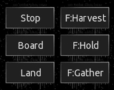

All Plugins (604)

[Cheats](https://github.com/Hecter94/EndlessSky-PluginArchive/blob/main/res/mds/cheats.md) (38) | [Gameplay](https://github.com/Hecter94/EndlessSky-PluginArchive/blob/main/res/mds/gameplay.md) (55) | [Graphics](https://github.com/Hecter94/EndlessSky-PluginArchive/blob/main/res/mds/graphics.md) (29) | [Outfits](https://github.com/Hecter94/EndlessSky-PluginArchive/blob/main/res/mds/outfits.md) (52) 
[Overhauls](https://github.com/Hecter94/EndlessSky-PluginArchive/blob/main/res/mds/overhauls.md) (46) | [Overwrites](https://github.com/Hecter94/EndlessSky-PluginArchive/blob/main/res/mds/overwrites.md) (4) | [Patches](https://github.com/Hecter94/EndlessSky-PluginArchive/blob/main/res/mds/patches.md) (3) | [Races](https://github.com/Hecter94/EndlessSky-PluginArchive/blob/main/res/mds/races.md) (70) 
[Ships](https://github.com/Hecter94/EndlessSky-PluginArchive/blob/main/res/mds/ships.md) (143) | [Starts](https://github.com/Hecter94/EndlessSky-PluginArchive/blob/main/res/md/starts.md) (17) | [Story](https://github.com/Hecter94/EndlessSky-PluginArchive/blob/main/res/mds/story.md) (80) | [Weapons](https://github.com/Hecter94/EndlessSky-PluginArchive/blob/main/res/mds/weapons.md) (42) 
[Uncategorized](https://github.com/Hecter94/EndlessSky-PluginArchive/blob/main/res/mds/uncategorized.md) (25) 

---

## Graphics

29 plugins in this category.

 

---

### additional.command.buttons
</img> 

[additional.command.buttons.zip](https://github.com/Hecter94/EndlessSky-PluginArchive/releases/download/Latest/additional.command.buttons.zip) | 17.65 kb | 2024-06-07 | [view files](https://github.com/Hecter94/EndlessSky-PluginArchive/tree/main/Working/additional.command.buttons/)  
Author: zuckung | Category: Graphics  
[https://github.com/zuckung/endless-sky-plugins](https://github.com/zuckung/endless-sky-plugins) (last commit 2024-06-07)  

>Made for the mobile version and adds several new buttons to the lower right corner. See the readme for details.
>(inspired by theweirednut)
>
>

:blue_book: Plugin readme

<blockquote>### additional.command.buttons  
 
Made for the mobile version and changes the interface by adding the following 10 buttons:   
<ul>
<li>full stop</li>
<li>board ship</li>
<li>land on planet</li>
<li>fleet: harvest flotsam</li>
<li>fleet: hold position</li>
<li>fleet: gather around me</li>
<li>fleet: attack my target</li>
<li>fleet: toggle ammo usage</li>
<li>view player info</li>
<li>fast forward</li>
</ul>
and
<ul>
<li>adjusts the message box to not overlap</li>
<li>moved the hidden ammo box to a visible place</li>
</ul>
 
(inspired by theweirednut)  
 

 
Allthough most of these commands are now implemented in other parts to the original mobile user interface or can be accessed by gestures, I personally prefer these buttons on the lower right corner. 
 
Additional there are some functions in this plugin that the original mobile ui can't do at the moment: 
- board button cycles through the possibilities  
- fleet commands can be used for single ships when selected  
 
This plugin overwrites `interface "main buttons"` and `interface "hud"`, so it isn't compatible with other plugins modifying these. 
 
 
Changelog: 
 
2024-06-07 
text corrections (thx to TheGiraffe3) 
 
2024-02-20 
re-added the ammo box to main buttons (latest mobile game version needed) 
 
2023-10-17 
added plugin.txt 
 
2023-08-24 
fixed non-firing attack button 
 
2023-08-05 
moved the hidden ammo box to a visible place 
 
2023-08-02 
added new icon and reworked readme 
 
2023-07-26 
added 3 more buttons to a total of 10 
added descriptions inside script to exchange buttons functions 
 
2023-07-06 
changed 'fire afterburner' to new 'fleet: harvest flotsam', because afterburner can easily toggled by double tapping 

</blockquote>

Status: DEPRECATED, continued in plugin "additional.command.buttons.radial"  
Daily update check: </img> 

---

### additional.command.buttons.radial
</img> 

[additional.command.buttons.radial.zip](https://github.com/Hecter94/EndlessSky-PluginArchive/releases/download/Latest/additional.command.buttons.radial.zip) | 404.67 kb | 2025-07-29 | [view files](https://github.com/Hecter94/EndlessSky-PluginArchive/tree/main/Working/additional.command.buttons.radial/)  
Author: zuckung | Category: Graphics  
[https://github.com/zuckung/endless-sky-plugins](https://github.com/zuckung/endless-sky-plugins) (last commit 2025-07-28)  

>Made for the MOBILE ANDROID version. Adds several new buttons to the lower right corner. See the README for details.
>
>

:blue_book: Plugin readme

<blockquote>### additional.command.buttons  
 
Reworks the main buttons ui on the lower right side. Made for the ANDROID version of ES.  
 
 
This plugin 
- rearranges and resizes some of the buttons 
- changes most icons (making a ring around as a standard)
- adds more permanent buttons from the radial menus to make them easy accessible 
- removes the radial menus 
- adds a new button row to the top right for the fleet commands 
- adds zoom buttons 
- adds more targeting buttons 
- greyes out inactive buttons 
- puts images behind the buttons, to grey out unavailable. 
- changes the ship hud 
 
merged the plugin landing.images.android:
Moves the landing image above the textbox, instead of behind the textbox. 
 
In case parts of the UI/the buttons are outside the screen, try rescaling your UI in the ES options 
If that doesn't help, open the zip, edit 'additional.command.buttons.radial/data/planet.txt' and change line 2 to 7 to: 
	image "land"
		center -60 -150
		dimensions 250 135
	sprite "ui/frame"
		center -60 -150
		dimensions 265 150
That resizes the landing image and the frame to their half. 
 
 
Changelog: 
 
2025-07-28 
made bottom right invisible buttons rectangle to fill out whole box 
 
2025-06-06 
merged with plugin landing.images.android 
added new line of buttons to top left 
added more greyed out buttons 
 
2025-04-26 
added greyed-out attack button if you can't attack 
fixed non-working recall button (thx to VelvetKrow) 
 
2025-04-21 
added 2xicon 
moved zoom+- to top left 
added round thrust / afterburner to bottom right 
removed thrust/afterburner from bottom left 
added more space between bottom right buttons 
 
2025-03-14 
added reverse thrust/afterburner button to bottom left 
 
2025-02-28 
moved the fleet box below the text box 
adjusted onscreen joystick size 
 
2025-02-23 
added new fleet jump button 
moved targeting buttons to the lower right 
removed fleet attack from normal attack button 
removed targeting button from target display 
 
2025-02-06 
the targeting buttons blocked the new scanner attribute display, so i moved it up 
hollowed and colorized the targeting buttons 
 
2025-02-04 
increased the size of the fuel, energy and heat bar to handle fuel up to 4400 
resized message box to not overlap with 2 rows of escorts 
restored the somehow missing tactical information display 
added "target nearest enemy" and "target nearest asteroid" buttons 
removed the color folders, white is enough 
 
2024-12-28 
moved the ammo box to the left side if the lower buttons 
added ship hud (inspired by Upmost Bsc | https://github.com/tobersj/Central-HUD) 
 
2024-11-20 
added small main menu button to the top left corner (requested by tarminu) 
 
2024-11-02 
removed hold fire button, because it's unsure when/if it comes back 
changed fast forward button back to small again, because it messed up the mission overview 
added 5 colour schemes(red, green, blue, purple, orange)
 
2024-10-29 
deactivated hold fire button, because it got removed in 0.10.10 
 
2024-10-11 
added fleet formations button 
 
2024-10-07 
added fleet hold fire button 
 
2024-09-06 
fine tuning for the graphics 
 
2024-09-02 
fixed button radius typo on fleet gather 
moved the fleet commands to the right side, so the jump systems are better seen 
 
2024-08-31 
changed button background to look more natural 
 
2024-08-30 
fixed an error 
adjusted positions 
added zoom buttons 
all buttons are visible now, but greyed out if you can't use them 
reworked all buttons to display a ring around them 
resized the fast forward button in the upper left corner, and added a greyed out version 
 
2024-08-25 
added a new panel for the fleet commands to the top center 
reworked the toggle ammo button 
removed the expandable radial menus, because all buttons are on the screen now 
exchanged some of the button positions 
 
2024-05-09 
initial release 
</blockquote>

Status: complete  
Daily update check: </img> 

---

### Animated Ships

[Animated.Ships.zip](https://github.com/Hecter94/EndlessSky-PluginArchive/releases/download/Latest/Animated.Ships.zip) | 30.3 mb | 2022-10-06 | [view files](https://github.com/Hecter94/EndlessSky-PluginArchive/tree/main/Working/Animated%20Ships/)  
Author: beccabunny | Category: Graphics  
[https://github.com/beccabunny/Animated-ships](https://github.com/beccabunny/Animated-ships) (last commit 2020-06-04)  

>Adds animations to many ships.
>

Status: N/A  
Daily update check: </img> 

---

### Animated Stars

[Animated.Stars.zip](https://github.com/Hecter94/EndlessSky-PluginArchive/releases/download/Latest/Animated.Stars.zip) | 1.54 mb | 2023-07-27 | [view files](https://github.com/Hecter94/EndlessSky-PluginArchive/tree/main/Working/Animated%20Stars/)  
Author: Cat-Lady | Category: Graphics  
[https://github.com/Cat-Lady/animated-stars-nova](https://github.com/Cat-Lady/animated-stars-nova) (last commit 2019-11-17)  

>Replaces many stars with animated stars.
>

Status: N/A  
Daily update check: </img> 

---

### Colorful Void Sprites

[Colorful.Void.Sprites.zip](https://github.com/Hecter94/EndlessSky-PluginArchive/releases/download/Latest/Colorful.Void.Sprites.zip) | 4.28 kb | 2023-07-27 | [view files](https://github.com/Hecter94/EndlessSky-PluginArchive/tree/main/Working/Colorful%20Void%20Sprites/)  
Author: Rob59er | Category: Graphics  
[https://github.com/Rob59er/Colorful-Void-Sprites](https://github.com/Rob59er/Colorful-Void-Sprites) (last commit 2021-02-21)  

>Makes Void Sprites colorful.
>

:blue_book: Plugin readme

<blockquote># Colorful-Void-Sprites
Adds colorful void sprites to Endless Sky

</blockquote>

Status: Playable on 0.9.14, 0.9.15 Continuous.  
Daily update check: </img> 

---

### Dark Ships
</img> 

[Dark.Ships.zip](https://github.com/Hecter94/EndlessSky-PluginArchive/releases/download/Latest/Dark.Ships.zip) | 8.73 mb | 2022-10-06 | [view files](https://github.com/Hecter94/EndlessSky-PluginArchive/tree/main/Working/Dark%20Ships/)  
Author: N/A | Category: Graphics  
N/A   

>This plugin contains ships rendered with a sharper illumination angle to get more dramatic shadows and less "flat" appearances.
>

Status: Should work  
Daily update check: </img> 

---

### Different Galaxy Plugin

[Different.Galaxy.Plugin.zip](https://github.com/Hecter94/EndlessSky-PluginArchive/releases/download/Latest/Different.Galaxy.Plugin.zip) | 12.36 mb | 2023-07-27 | [view files](https://github.com/Hecter94/EndlessSky-PluginArchive/tree/main/Working/Different%20Galaxy%20Plugin/)  
Author: FranchuFranchu | Category: Graphics  
[https://github.com/FranchuFranchu/endless-sky-different-galaxy-plugin](https://github.com/FranchuFranchu/endless-sky-different-galaxy-plugin) (last commit 2021-03-02)  

>Changes the background galaxy image of Endless Sky to a nicer one.

:blue_book: Plugin readme

<blockquote>This Endless Sky plugin changes the galaxy image to an image of NGC 2336, which I think looks nicer.

Image by Judy Schmidt - NGC 2336, CC BY 2.0, https://commons.wikimedia.org/w/index.php?curid=93254431
</blockquote>

Status: N/A  
Daily update check: </img> 

---

### easier harvesting

[easier.harvesting.zip](https://github.com/Hecter94/EndlessSky-PluginArchive/releases/download/Latest/easier.harvesting.zip) | 92.25 kb | 2022-10-06 | [view files](https://github.com/Hecter94/EndlessSky-PluginArchive/tree/main/Working/easier%20harvesting/)  
Author: Endros Gunderberg | Category: Graphics  
[https://github.com/EndrosG/ES-Plugins](https://github.com/EndrosG/ES-Plugins) (last commit 2017-05-28)  

>This plugin provides easy to identify images which help you identifying minable asteroids.
>

Status: N/A  
Daily update check: </img> 

---

### EndlessSky_ARUI
</img> 

[EndlessSky_ARUI.zip](https://github.com/Hecter94/EndlessSky-PluginArchive/releases/download/Latest/EndlessSky_ARUI.zip) | 325.62 kb | 2023-07-27 | [view files](https://github.com/Hecter94/EndlessSky-PluginArchive/tree/main/Working/EndlessSky_ARUI/)  
Author: DrZingo | Category: Graphics  
[https://github.com/DrZingo/EndlessSky_ARUI](https://github.com/DrZingo/EndlessSky_ARUI) (last commit 2021-05-09)  

>A Reorganized User Interface for Endless Sky.
>
>This is a changed user interface when in space.
>
>Most important stuff (bars, weapons, hull/shield, target) is organized in top left corner by the radar.
>
>Destination is now to the right under world / date / money.
>

:blue_book: Plugin readme

<blockquote># A Reorganized User Interface for Endless Sky

This is a changed user interface when in space.

* Most important stuff (bars, weapons, hull/shield, target) is organized in top left corner by the radar.

* Destination is now to the right under world / date / money.

## Installation

Unpack or git clone repo into:

/.local/share/endless-sky/plugins/

</blockquote>

Status: N/A  
Daily update check: </img> 

---

### ES Ships

[ES.Ships.zip](https://github.com/Hecter94/EndlessSky-PluginArchive/releases/download/Latest/ES.Ships.zip) | 8.06 mb | 2022-10-06 | [view files](https://github.com/Hecter94/EndlessSky-PluginArchive/tree/main/Working/ES%20Ships/)  
Author: Yann | Category: Graphics  
N/A   

>Sprites with modified cockpit/bridge.
>

Status: Playable on 0.9.15 Continuous.  
Daily update check: </img> 

---

### es-ui-upgrades
</img> 

[es-ui-upgrades.zip](https://github.com/Hecter94/EndlessSky-PluginArchive/releases/download/Latest/es-ui-upgrades.zip) | 810.53 kb | 2024-11-01 | [view files](https://github.com/Hecter94/EndlessSky-PluginArchive/tree/main/Working/es-ui-upgrades/)  
Author: lumbar527 | Category: Graphics  
[https://github.com/Cromha-Plugins/es-ui-upgrades](https://github.com/Cromha-Plugins/es-ui-upgrades) (last commit 2024-07-08)  

>Transforms the user interface by making it blue.
>

Status: Complete  
Daily update check: </img> 

---

### High DPI
</img> 

[High.DPI.zip](https://github.com/Hecter94/EndlessSky-PluginArchive/releases/download/Latest/High.DPI.zip) | 749.12 mb | 2025-08-05 | [view files](https://github.com/Hecter94/EndlessSky-PluginArchive/tree/main/Working/High%20DPI/)  
Author: Michael Zahniser (Maintained by the ES Community) | Category: Graphics  
[https://github.com/endless-sky/endless-sky-high-dpi](https://github.com/endless-sky/endless-sky-high-dpi) (last commit 2025-08-05)  

>Official High-DPI graphics for Endless Sky.
>

:blue_book: Plugin readme

<blockquote># endless-sky-high-dpi

This is a collection of double-resolution sprites for [Endless Sky](https://github.com/endless-sky/endless-sky). To make use of these sprites, copy this folder into one of the two [plugins folders](https://github.com/endless-sky/endless-sky/wiki/CreatingPlugins). These sprites will only be used if:

  * you have set the "zoom factor" to higher than 100% in the preferences, or
  * you have a high-DPI monitor.

High-DPI mode has only been tested on Mac OS X.

</blockquote>

Status: Playable on 0.9.14, 0.9.15 Continuous.  
Daily update check: </img> 

---

### Human Steering Flares

[Human.Steering.Flares.zip](https://github.com/Hecter94/EndlessSky-PluginArchive/releases/download/Latest/Human.Steering.Flares.zip) | 2.6 kb | 2022-10-06 | [view files](https://github.com/Hecter94/EndlessSky-PluginArchive/tree/main/Working/Human%20Steering%20Flares/)  
Author: Ferociousfeind | Category: Graphics  
N/A   

>Add steering flare to human ships.
>

Status: Playable on 0.9.14, 0.9.15 Continuous.  
Daily update check: </img> 

---

### human.labels
</img> 

[human.labels.zip](https://github.com/Hecter94/EndlessSky-PluginArchive/releases/download/Latest/human.labels.zip) | 1.99 mb | 2025-06-21 | [view files](https://github.com/Hecter94/EndlessSky-PluginArchive/tree/main/Working/human.labels/)  
Author: zuckung | Category: Graphics  
[https://github.com/zuckung/endless-sky-plugins](https://github.com/zuckung/endless-sky-plugins) (last commit 2025-06-21)  

>Reworks the Human area labels and adds area borders. See the README for details.
>

:blue_book: Plugin readme

<blockquote>### human.labels
 
 
Reworks the map labels and adds area borders. See the readme for details. 
 
The area labels are now smaller and better to see. Also there is a border drawn around each human area. 
On Earth's job board you can find a mission to change the color of the labels (light blue, light gray, yellow, dark red, green, dark gray, orange, purple). 
 
 
Changelog: 
 
2025-06-21 
added control.station support 
 
2025-06-05 
colored job 
 
2025-05-19 
icon@2x, plugintxt changes 
 
2025-02-13 
added @2x images 
added non-human labels 
 
2024-07-13 
corrected script error 
 
2024-07-09 
text correction 
 
2024-07-08 
added 4 more label colors to choose of (green, dark gray, orange, purple) 
 
2024-07-07 
added 3 more label colors to choose of (light blue, light gray, dark red) 
added job on Earth to change the label colors 
 
2024-06-26 
initial release 

</blockquote>

Status: complete  
Daily update check: </img> 

---

### landing.images
</img> 

[landing.images.zip](https://github.com/Hecter94/EndlessSky-PluginArchive/releases/download/Latest/landing.images.zip) | 15.3 mb | 2024-10-06 | [view files](https://github.com/Hecter94/EndlessSky-PluginArchive/tree/main/Working/landing.images/)  
Author: zuckung | Category: Graphics  
[https://github.com/zuckung/endless-sky-plugins](https://github.com/zuckung/endless-sky-plugins) (last commit 2024-10-06)  

>Replaces all planet landing images with better fitting ones. See the README for details.
>

:blue_book: Plugin readme

<blockquote>### landing.images
 
 
Replaces all planet landing images with better fitting ones. 
 
These images replace the boring vanilla images you see when you've landed on a planet with new, AI generated, better fitting ones. The old ones look like photos from earth or taken from public NASA archives(which they are). According to the description of the planets I tried to generate better fitting, more futuristic, more alien-looking images. And I think that went well :)  
0.10.8 with 472 planets 
See all images <a href='https://github.com/zuckung/endless-sky-plugins-graphics/blob/main/res/md/landing.images.md'>here</a>. 
 
 
Changelog: 
 
2024-10-06 
added 53 landing images for 0.10.9 update 
 
2024-07-31 
initial release 

</blockquote>

Status: complete  
Daily update check: </img> 

---

### landing.images.android
</img> 

[landing.images.android.zip](https://github.com/Hecter94/EndlessSky-PluginArchive/releases/download/Latest/landing.images.android.zip) | 31.51 kb | 2024-08-17 | [view files](https://github.com/Hecter94/EndlessSky-PluginArchive/tree/main/Working/landing.images.android/)  
Author: zuckung | Category: Graphics  
[https://github.com/zuckung/endless-sky-plugins](https://github.com/zuckung/endless-sky-plugins) (last commit 2024-08-09)  

>Moves the landing image above the textbox, instead of behind the textbox (for ES mobile). See the README for details.
>

:blue_book: Plugin readme

<blockquote>### landing.images.android 
 
 
Moves the landing image above the textbox, instead of behind the textbox (for ES mobile). 
 
In case parts of the UI/the buttons are outside the screen, try rescaling your UI in the ES options 
If that doesn't help, open the zip, edit 'landing.images.android/data/interface.txt' and change line 2 to 7 to: 
	image "land"
		center -60 -150
		dimensions 250 135
	sprite "ui/frame"
		center -60 -150
		dimensions 265 150
That resizes the landing image and the frame to their half. 
 
Before: 

 
After: 

 
 
Changelog: 
 
2024-08-09 
minor text changes (thx to TheGiraffe3) 
 
2024-08-07 
added a frame for the image 
finetuned position 
 
2024-08-03 
added hire all/fire all buttons which were missing (thx timeout.fu) 
added guide to resize the image (thx Pyrrha of simpleplanes)
 
2024-08-02 
initial release 

</blockquote>

Status: complete  
Daily update check: </img> 

---

### landing.images.highres
</img> 

[landing.images.highres.zip](https://github.com/Hecter94/EndlessSky-PluginArchive/releases/download/Latest/landing.images.highres.zip) | 67.11 mb | 2024-10-06 | [view files](https://github.com/Hecter94/EndlessSky-PluginArchive/tree/main/Working/landing.images.highres/)  
Author: zuckung | Category: Graphics  
[https://github.com/zuckung/endless-sky-plugins](https://github.com/zuckung/endless-sky-plugins) (last commit 2024-10-06)  

>High resolution files for landing.images plugin. See the README for details.
>

:blue_book: Plugin readme

<blockquote>### landing.images.highres
 
 
High resolution files for landing.images plugin. 
 
Adds images with 1440x720 resolution. The landing.images plugin is still needed. 
 
 
Changelog: 
 
2024-10-06 
added 53 landing images for 0.10.9 update 
 
2024-08-09 
minor text changes (thx to TheGiraffe3) 
 
2024-08-02 
initial release 

</blockquote>

Status: complete  
Daily update check: </img> 

---

### Low Quality

[Low.Quality.zip](https://github.com/Hecter94/EndlessSky-PluginArchive/releases/download/Latest/Low.Quality.zip) | 359.6 kb | 2023-07-27 | [view files](https://github.com/Hecter94/EndlessSky-PluginArchive/tree/main/Working/Low%20Quality/)  
Author: N/A | Category: Graphics  
N/A   

>replaces ship images with lows quality versions
>

:blue_book: Plugin readme

<blockquote>this is just a meme plugin for ESS to be used as a workshop example upon launch, however as so many people are excited to begin developing on it now, i guess i will allow it. 

</blockquote>

Status: N/A  
Daily update check: </img> 

---

### New Galaxy
</img> 

[New.Galaxy.zip](https://github.com/Hecter94/EndlessSky-PluginArchive/releases/download/Latest/New.Galaxy.zip) | 7.28 mb | 2022-10-06 | [view files](https://github.com/Hecter94/EndlessSky-PluginArchive/tree/main/Working/New%20Galaxy/)  
Author: Lia Gerty | Category: Graphics  
N/A   

>This is just a demonstration of the map image that would be used with an expanded core region.  Since it does not include the new systems that would be between Sagittarius A* and human space, Sagittarius A* will appear off centre.
>
>

Status: N/A  
Daily update check: </img> 

---

### Outfit Highlighter
</img> 

[Outfit.Highlighter.zip](https://github.com/Hecter94/EndlessSky-PluginArchive/releases/download/Latest/Outfit.Highlighter.zip) | 445.75 kb | 2023-10-28 | [view files](https://github.com/Hecter94/EndlessSky-PluginArchive/tree/main/Working/Outfit%20Highlighter/)  
Author: MidnightPlugins | Category: Graphics  
[https://github.com/MidnightPlugins/Outfit-Highlighter](https://github.com/MidnightPlugins/Outfit-Highlighter) (last commit 2023-10-28)  

>Makes the selected outfit stand out more in the outfitter screen. Recommended for those who prefer to navigate the outfitter using the keyboard instead of the mouse.
>

:blue_book: Plugin readme

<blockquote># Outfit-Highlighter

Makes the selected outfit stand out more in the outfitter screen. Recommended for those who prefer to navigate the outfitter using the keyboard instead of the mouse.

![image][image]

[image]: icon.png

https://github.com/MidnightPlugins/Outfit-Highlighter

Now includes alternate themed highlighters! To change highlighters, copy the image file in the subfolder for your chosen theme and paste it into the ui folder of the Outfit Highlighter plugin. (Not the Endless Sky ui folder!)

Description of available themes:

- Alert (color): Four exclamation corner brackets and the grid in the chosen color
- Arrows (color): Four arrows in the corner set to the chosen color
- Cargo Pods: Frame made of Syndicate cargo pods
- Classic Highlighter: The original Outfit Highlighter
- Endless Sky Frames: Frame resembling Endless Sky's menu frames
- Fade to Black: A gray box that fades to black near the top
- Fade to (color): A box of the chosen color that fades to black near the top
- Fluffy Sales Clerks: Two Subsidurials help you shop for outfits
- Hai: Frame made of Hai ship parts
- Mereti: Frame made of Mereti ship parts
- Ringworld: Frame made of Ringworld parts
- Sheragi: Frame made of Sheragi ship parts
- Vanilla Enhanced: Just a slightly bigger vanilla highlighter
- Wanderer: Frame made of Wanderer ship parts

</blockquote>

Status: N/A  
Daily update check: </img> 

---

### Pi game mods

[Pi.game.mods.zip](https://github.com/Hecter94/EndlessSky-PluginArchive/releases/download/Latest/Pi.game.mods.zip) | 158.06 kb | 2022-11-09 | [view files](https://github.com/Hecter94/EndlessSky-PluginArchive/tree/main/Working/Pi%20game%20mods/)  
Author: Pilover100 | Category: Graphics  
N/A   

>Pilover100's personal modifications. (Change UI colors to make things more visible. Alternate Wanderer Reactor graphic.)
>

Status: Playable on 0.9.15/0.9.16.  
Daily update check: </img> 

---

### Pug-Hud
</img> 

[Pug-Hud.zip](https://github.com/Hecter94/EndlessSky-PluginArchive/releases/download/Latest/Pug-Hud.zip) | 458.21 kb | 2023-07-27 | [view files](https://github.com/Hecter94/EndlessSky-PluginArchive/tree/main/Working/Pug-Hud/)  
Author: comnom | Category: Graphics  
N/A   

>adds a HUD
>

Status: N/A  
Daily update check: </img> 

---

### Rainbow Pleiades

[Rainbow.Pleiades.zip](https://github.com/Hecter94/EndlessSky-PluginArchive/releases/download/Latest/Rainbow.Pleiades.zip) | 139.64 kb | 2023-07-27 | [view files](https://github.com/Hecter94/EndlessSky-PluginArchive/tree/main/Working/Rainbow%20Pleiades/)  
Author: RestingImmortal | Category: Graphics  
[https://github.com/RestingImmortal/misc-plugins](https://github.com/RestingImmortal/misc-plugins) (last commit 2019-09-03)  

>Turns the galaxy sprite for the pug empty galaxy into a rainbow.

:blue_book: Plugin readme

<blockquote>### Rainbow Pleiades
Turns the galaxy sprite for the pug empty galaxy into a rainbow.

</blockquote>

Status: Abandoned  
Daily update check: </img> 

---

### Realistic Solar System

[Realistic.Solar.System.zip](https://github.com/Hecter94/EndlessSky-PluginArchive/releases/download/Latest/Realistic.Solar.System.zip) | 9.06 mb | 2023-07-27 | [view files](https://github.com/Hecter94/EndlessSky-PluginArchive/tree/main/Working/Realistic%20Solar%20System/)  
Author: beccabunny | Category: Graphics  
[https://github.com/beccabunny/Realistic-Solar-System](https://github.com/beccabunny/Realistic-Solar-System) (last commit 2020-08-11)  

>This plugin modifies the Sol system adding every planet, large moon (over 20!) and two dwarf planets (Ceres and Pluto with its moon, Charon), each with unique sprites modified from NASA pictures taken during various missions. Everything in Sol has also been resized to a much bigger and realistic size, including the Sun itself.
>

:blue_book: Plugin readme

<blockquote># Realistic-Solar-System
This plugin modifies the Sol system adding every planet, large moon (over 20!) and two dwarf planets (Ceres and Pluto with its moon, Charon), each with unique sprites modified from NASA pictures taken during various missions. Everything in Sol has also been resized to a much bigger and realistic size, including the Sun itself.

In vanilla, the solar system has:
 - 5 planets
 - 5 moons
 - a 90x90 star

With this plugin, it gets:
- 8 planets
- 20 moons
- 2 dwarf planets
- a 450x450 star

And all of this with 31 unique sprites, plus other 30 high DPI ones included in the package!

</blockquote>

Status: N/A  
Daily update check: </img> 

---

### Resized Endless Sky

[Resized.Endless.Sky.zip](https://github.com/Hecter94/EndlessSky-PluginArchive/releases/download/Latest/Resized.Endless.Sky.zip) | 3.26 mb | 2023-07-27 | [view files](https://github.com/Hecter94/EndlessSky-PluginArchive/tree/main/Working/Resized%20Endless%20Sky/)  
Author: FranchuFranchu | Category: Graphics  
[https://github.com/FranchuFranchu/resized-endless-sky](https://github.com/FranchuFranchu/resized-endless-sky) (last commit 2021-03-02)  

>Resizes the Endless Sky galaxy. 

Status: WIP  
Daily update check: </img> 

---

### Restock

[Restock.zip](https://github.com/Hecter94/EndlessSky-PluginArchive/releases/download/Latest/Restock.zip) | 9.68 mb | 2023-07-27 | [view files](https://github.com/Hecter94/EndlessSky-PluginArchive/tree/main/Working/Restock/)  
Author: beccabunny | Category: Graphics  
[https://github.com/beccabunny/ES-Restock](https://github.com/beccabunny/ES-Restock) (last commit 2020-12-29)  

>A visual mod that improves the look of many vanilla human outfits, either greatly detailing the original model or using a completely new one. Currently including 109 new sprites!
>

:blue_book: Plugin readme

<blockquote># ES-Restock
A visual mod that improves the look of many vanilla human outfits, either greatly detailing the original model or using a completely new one. Currently including 109 new sprites!

</blockquote>

Status: N/A  
Daily update check: </img> 

---

### swiftclaws.additional.command.buttons
</img> 

[swiftclaws.additional.command.buttons.zip](https://github.com/Hecter94/EndlessSky-PluginArchive/releases/download/Latest/swiftclaws.additional.command.buttons.zip) | 389.02 kb | 2023-09-25 | [view files](https://github.com/Hecter94/EndlessSky-PluginArchive/tree/main/Working/swiftclaws.additional.command.buttons/)  
Author: swiftclaw | Category: Graphics  
[https://drive.google.com/file/d/17RstjG7nxM0KzhfwpVh50NrgCO9cQ375/view](https://drive.google.com/file/d/17RstjG7nxM0KzhfwpVh50NrgCO9cQ375/view)   

>Modified version of additional.command.buttons plugin
>
>

:blue_book: Plugin readme

<blockquote>### swiftclaws.additional.command.buttons  
 

</blockquote>

Status: tested with 0.10.2  
Daily update check: </img> 

---

### Swizzle Player

[Swizzle.Player.zip](https://github.com/Hecter94/EndlessSky-PluginArchive/releases/download/Latest/Swizzle.Player.zip) | 48.53 kb | 2023-07-27 | [view files](https://github.com/Hecter94/EndlessSky-PluginArchive/tree/main/Working/Swizzle%20Player/)  
Author: Cat-Lady | Category: Graphics  
[https://github.com/Cat-Lady/swizzle-player/releases](https://github.com/Cat-Lady/swizzle-player/releases) (last commit 2019-11-02)  

>This is a small plugin that allow to change player's swizzle in "Endless Sky" - and keep the colour after ES get updates that change goverments.txt data file.
>
>

:blue_book: Plugin readme

<blockquote>This is a small plugin that allow to change player's swizzle in "Endless Sky" - and keep the colour after ES get updates that change goverments.txt data file.

[h1]Installing[/h1]

Check:
https://github.com/Cat-Lady/swizzle-player/releases

...for latest, pre-packaged version.

[b]1.[/b] Unpack [i]swizzle-player[/i] to your ES plugins folder. Be sure that you have single [i]swizzle-player[/i] directory inside your plugins folder, containing [i]data[/i] folder. Directory structure should look like:

[code](...)/plugins/swizzle-player/(.../data/, /images/ and other stuff)[/code]

It [b]won't[/b] work if the directory structure will be anything like:

[code](...)/plugins/swizzle-player/swizzle-player/(...)[/code]

[h1]Author[/h1]

[list][*][b]Cat Lady[/b][/list]

[h1]License[/h1]

This project is licensed under the GPL3 License - see the LICENSE.md file for details.

[h1]Acknowledgments[/h1]

"Endless Sky" Development Team and Michael Zahniser; For maintaining and creating the game

[url=https://github.com/EndlessSkyCommunity/EndlessSky-Discord-Bot]James the Bot[/url] from "endless Sky" discord forum; For easy way to check swizzle numbers, the bazzilion times I needed to do it in the past.

Iggy Pop for singing "She want's to be your James Bot" (and don't even try to convince me that he meant something else).
</blockquote>

Status: N/A  
Daily update check: </img> 

---

### Wanderer Suns
</img> 

[Wanderer.Suns.zip](https://github.com/Hecter94/EndlessSky-PluginArchive/releases/download/Latest/Wanderer.Suns.zip) | 285.29 kb | 2023-07-27 | [view files](https://github.com/Hecter94/EndlessSky-PluginArchive/tree/main/Working/Wanderer%20Suns/)  
Author: Gefüllte Taubenbrust | Category: Graphics  
[https://github.com/GefullteTaubenbrust2/Wanderer-Suns](https://github.com/GefullteTaubenbrust2/Wanderer-Suns) (last commit 2022-05-15)  

>This plugin changes the models of the Wanderer "Sun" reactors so that a sort of "sun" can actually be seen in them.
>

:blue_book: Plugin readme

<blockquote># Wanderer-Suns
This is a plugin for Endless Sky that changes to Wanderer reactors so they actually show small "suns" within them.

</blockquote>

Status: N/A  
Daily update check: </img> 

[back to top](https://github.com/Hecter94/EndlessSky-PluginArchive/blob/main/res/mds/graphics.md#graphics)

