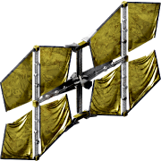

All Plugins (604)

[Cheats](https://github.com/Hecter94/EndlessSky-PluginArchive/blob/main/res/mds/cheats.md) (38) | [Gameplay](https://github.com/Hecter94/EndlessSky-PluginArchive/blob/main/res/mds/gameplay.md) (55) | [Graphics](https://github.com/Hecter94/EndlessSky-PluginArchive/blob/main/res/mds/graphics.md) (29) | [Outfits](https://github.com/Hecter94/EndlessSky-PluginArchive/blob/main/res/mds/outfits.md) (52) 
[Overhauls](https://github.com/Hecter94/EndlessSky-PluginArchive/blob/main/res/mds/overhauls.md) (46) | [Overwrites](https://github.com/Hecter94/EndlessSky-PluginArchive/blob/main/res/mds/overwrites.md) (4) | [Patches](https://github.com/Hecter94/EndlessSky-PluginArchive/blob/main/res/mds/patches.md) (3) | [Races](https://github.com/Hecter94/EndlessSky-PluginArchive/blob/main/res/mds/races.md) (70) 
[Ships](https://github.com/Hecter94/EndlessSky-PluginArchive/blob/main/res/mds/ships.md) (143) | [Starts](https://github.com/Hecter94/EndlessSky-PluginArchive/blob/main/res/md/starts.md) (17) | [Story](https://github.com/Hecter94/EndlessSky-PluginArchive/blob/main/res/mds/story.md) (80) | [Weapons](https://github.com/Hecter94/EndlessSky-PluginArchive/blob/main/res/mds/weapons.md) (42) 
[Uncategorized](https://github.com/Hecter94/EndlessSky-PluginArchive/blob/main/res/mds/uncategorized.md) (25) 

---

## Outfits

52 plugins in this category.

 

---

### Alternate Human Shields

[Alternate.Human.Shields.zip](https://github.com/Hecter94/EndlessSky-PluginArchive/releases/download/Latest/Alternate.Human.Shields.zip) | 2.76 kb | 2022-10-06 | [view files](https://github.com/Hecter94/EndlessSky-PluginArchive/tree/main/Working/Alternate%20Human%20Shields/)  
Author: 1010todd | Category: Outfits  
N/A   

>Add alternate version of human shield generator with high regen but long delay to outfitters.
>

Status: Playable on 0.9.15 Continuous.  
Daily update check: </img> 

---

### Androids

[Androids.zip](https://github.com/Hecter94/EndlessSky-PluginArchive/releases/download/Latest/Androids.zip) | 1.33 kb | 2022-10-06 | [view files](https://github.com/Hecter94/EndlessSky-PluginArchive/tree/main/Working/Androids/)  
Author: Disiuze | Category: Outfits  
[https://github.com/Disiuze/misc-projects](https://github.com/Disiuze/misc-projects) (last commit 2017-02-22)  

>This mod reimplements the android but with a few balancing fixes.
>

Status: Playable on 0.9.14, 0.9.15 Continuous.  
Daily update check: </img> 

---

### Androids Rebalanced

[Androids.Rebalanced.zip](https://github.com/Hecter94/EndlessSky-PluginArchive/releases/download/Latest/Androids.Rebalanced.zip) | 18.71 kb | 2023-07-27 | [view files](https://github.com/Hecter94/EndlessSky-PluginArchive/tree/main/Working/Androids%20Rebalanced/)  
Author: czartrak | Category: Outfits  
[https://github.com/czartrak/Androids-Rebalanced](https://github.com/czartrak/Androids-Rebalanced) (last commit 2017-10-15)  

>Adds androids and several outfits for charging them.
>

Status: N/A  
Daily update check: </img> 

---

### Antiquity

[Antiquity.zip](https://github.com/Hecter94/EndlessSky-PluginArchive/releases/download/Latest/Antiquity.zip) | 125.25 kb | 2022-10-06 | [view files](https://github.com/Hecter94/EndlessSky-PluginArchive/tree/main/Working/Antiquity/)  
Author: N/A | Category: Outfits  
N/A   

>A few antique outfits and weapons scattered across human space. Plunder them from pirates and sell them for a lot of money! Or keep them for yourself, to remind yourself that you have antique stuff!
>

Status: N/A  
Daily update check: </img> 

---

### Artificial Intelligence Outfits

[Artificial.Intelligence.Outfits.zip](https://github.com/Hecter94/EndlessSky-PluginArchive/releases/download/Latest/Artificial.Intelligence.Outfits.zip) | 27.32 kb | 2023-07-26 | [view files](https://github.com/Hecter94/EndlessSky-PluginArchive/tree/main/Working/Artificial%20Intelligence%20Outfits/)  
Author: Brent Kerman | Category: Outfits  
[https://www.nexusmods.com/endlesssky/mods/6](https://www.nexusmods.com/endlesssky/mods/6)   

>Adds three outfits to outfitters in the Deep that reduce required crew. 
>
>Basic: Replaces one crew member. Takes two bunk space. Makes heat. Costs $50,000. Uses no outfits space.
>
>Improved: Replaces one crew member. Takes one bunk space. Makes less heat. Costs $250,000 Uses no outfits space.
>
>Advanced: Replaces one crew member, overclocks engines and shields slightly. Costs $1,000,000 Uses no outfits space.
>
>Inspired by The Machines are Taking Over, but only has AI units instead of the other things that mod also had.

Status: looks abandoned  
Daily update check: </img> 

---

### Automation

[Automation.zip](https://github.com/Hecter94/EndlessSky-PluginArchive/releases/download/Latest/Automation.zip) | 1.4 kb | 2022-10-06 | [view files](https://github.com/Hecter94/EndlessSky-PluginArchive/tree/main/Working/Automation/)  
Author: Disiuze | Category: Outfits  
[https://github.com/Disiuze/misc-projects](https://github.com/Disiuze/misc-projects) (last commit 2017-02-22)  

>Playable on 0.9.14, 0.9.15 Continuous.Adds an outfit whiich turns ships into automata. Requries you to have more than 2 karma with the Republic.
>

Status: N/A  
Daily update check: </img> 

---

### Better Vanilla Weapons

[Better.Vanilla.Weapons.zip](https://github.com/Hecter94/EndlessSky-PluginArchive/releases/download/Latest/Better.Vanilla.Weapons.zip) | 228.91 kb | 2022-11-05 | [view files](https://github.com/Hecter94/EndlessSky-PluginArchive/tree/main/Working/Better%20Vanilla%20Weapons/)  
Author: ZBok | Category: Outfits  
N/A   

>Add new weapons.
>

Status: N/A  
Daily update check: </img> 

---

### Dr_Z

[Dr_Z.zip](https://github.com/Hecter94/EndlessSky-PluginArchive/releases/download/Latest/Dr_Z.zip) | 2.29 kb | 2022-10-06 | [view files](https://github.com/Hecter94/EndlessSky-PluginArchive/tree/main/Working/Dr_Z/)  
Author: Dr. Z | Category: Outfits  
N/A   

>Adds several new outfits, mostly for boarding.
>

Status: Should work.  
Daily update check: </img> 

---

### Endless Cargo

[Endless.Cargo.zip](https://github.com/Hecter94/EndlessSky-PluginArchive/releases/download/Latest/Endless.Cargo.zip) | 33.15 kb | 2023-07-27 | [view files](https://github.com/Hecter94/EndlessSky-PluginArchive/tree/main/Working/Endless%20Cargo/)  
Author: Ryan S. Northrup | Category: Outfits  
[https://bitbucket.org/YellowApple/endless-cargo/downloads/](https://bitbucket.org/YellowApple/endless-cargo/downloads/)   

>This plugin adds shipping containers and container ships to the game. 
>

:blue_book: Plugin readme

<blockquote># Endless Cargo

## What is it?

It's a plugin/mod for [Endless Sky](http://endless-sky.github.io) which attempts to add shipping containers and container ships to the game.

## How do I install it?

[Download the ZIP file](https://bitbucket.org/YellowApple/endless-cargo/downloads/) and extract it into your plugins folder.  Alternately, you can just `git clone` directly into the plugins folder (e.g. `git clone https://bitbucket.org/YellowApple/endless-cargo.git /.local/share/endless-sky/plugins/endless-cargo`).

## How does it work?

The current plan is to implement a shipping container as a sort of unarmed, unpropelled (HAHA, turns out at least *some* propulsion is needed for them to redock if you release them) drone, and in turn to implement a container ship as a sort of drone carrier.  This means that drones and shipping containers are interchangeable.

At this time, one type of container (a generic "Cargo Container") and two container ships (the Star Barge and Freighter without the welded-in containers and with drone bays for one's own containers) are implemented.  There's also a test mission out of Greenrock to haul an empty container to a nearby factory world (like New Britain or Luna), which I plan to flesh out and turn into more missions for more planets (including with specialized container types).  Most (if not all) factory worlds in human space sell containers, and the Container Barge and Container Freighter are available from any "Syndicate Basics" shipyard (and the former from any "Basic Ships" shipyard, so you can grab a Container Barge as your first ship right out of New Boston).

In the distant future, I might opt to attempt to implement containers as their own ship class, or perhaps as something that's not necessarily a "ship" per se.  This would require submitting this as a part of the vanilla game, though; while I think this idea is pretty cool, I'm also fully aware that's it's a *very* niche mod that probably doesn't belong in the core game, in which case - unless the core game opens up the ability to easily define new ship classes - the drone-container approach is probably the best I can do for the time being.

## What kinds of shipping containers will be implemented?

The average container (that is, the kind you'd actually want to buy at a shipyard) would have very little besides a few tons of cargo space and perhaps a smidge of outfit space.  A container ship would in turn have very little cargo or passenger space on its own, but could instead fill itself with shipping containers.

Once the basic shipping mechanics are implemented (namely, a basic container and a basic container ship), I'll likely delve into some missions involving specialized container types.  Some examples:

- Transport 5 containers carrying helicopters to Vail
- Haul 35 families and their prefabricated homes to a trailer park on New Boston
- Deliver 25 mining excavators and 5 portable field offices to a mining operation on Bounty
- etc.

Whether or not these specialized containers are something which you could buy in a shipyard is TBD.  There'd probably be no point to it, though I'm not one to stop someone from wasting money (especially if it's for roleplaying purposes or perhaps to resell somewhere else).

## Ain't this the same thing the Boxwing already does?

Kinda.  Containers are basically the drone version of the Boxwing.  Notable differences:

* Containers are drones, and thus don't require crew
* Containers are drones, and thus take up drone slots instead of fighter slots
* Containers are meant to make Boxwings look like Flivvers in comparison
* Containers have a fraction of the Boxwing's cargo space (currently 25%; I might bump that to 50% once I'm ready to actually dive into balancing)

Additionally, this plugin will feature actual missions/jobs/etc. revolving around container delivery, so it's certainly not limited to just adding a bunch of ships.

## Any gotchas?

* Containers deploy alongside the rest of your fighters and drones, so keep that in mind when you're in the heat of battle.
* Containers added by a container-hauling mission launch separately from your container ship, even if your own fighters/drones/containers are already docked.  This applies to all launches (haven't tested with wormholes yet).  Be sure to wait for your mission-added containers to redock between takeoff and jumping.
* Container-hauling missions currently don't have any multiplier for the number of containers or the distance involved.  [A bug/enhancement report has already been filed to hopefully rectify this.](https://github.com/endless-sky/endless-sky/issues/2569)

## What's the license?

GPLv3, with some CC-BY-SA-4.0 artistic assets.
</blockquote>

Status: Functional  
Daily update check: </img> 

---

### Epic Outfits

[Epic.Outfits.zip](https://github.com/Hecter94/EndlessSky-PluginArchive/releases/download/Latest/Epic.Outfits.zip) | 247.23 kb | 2023-07-27 | [view files](https://github.com/Hecter94/EndlessSky-PluginArchive/tree/main/Working/Epic%20Outfits/)  
Author: TheronEpic | Category: Outfits  
[https://github.com/TheronEpic/TheronEpics-Outfits](https://github.com/TheronEpic/TheronEpics-Outfits) (last commit 2020-11-07)  

>Several new outfits.
>

Status: Should work  
Daily update check: </img> 

---

### ES Compatability Plugin

[ES.Compatability.Plugin.zip](https://github.com/Hecter94/EndlessSky-PluginArchive/releases/download/Latest/ES.Compatability.Plugin.zip) | 27.02 kb | 2023-07-27 | [view files](https://github.com/Hecter94/EndlessSky-PluginArchive/tree/main/Working/ES%20Compatability%20Plugin/)  
Author: lumbar527 | Category: Outfits  
[https://github.com/lumbar527/es-compatability-plugin](https://github.com/lumbar527/es-compatability-plugin) (last commit 2023-07-09)  

>This plugin is for use on older saves that have deprecated ships or outfits. It will only be useful when deprecated things are removed from Endless Sky.

:blue_book: Plugin readme

<blockquote># ES-Deprecated
A plugin for [Endless Sky](github.com/endless-sky/endless-sky) that holds all deprecated things I can find.

If you find anything this plugin is missing, please post an issue.
</blockquote>

Status: N/A  
Daily update check: </img> 

---

### Experimental

[Experimental.zip](https://github.com/Hecter94/EndlessSky-PluginArchive/releases/download/Latest/Experimental.zip) | 4.63 kb | 2023-07-27 | [view files](https://github.com/Hecter94/EndlessSky-PluginArchive/tree/main/Working/Experimental/)  
Author: N/A | Category: Outfits  
N/A   

>adds a 'multidrive'
>

Status: N/A  
Daily update check: </img> 

---

### expert.crew.members
</img> 

[expert.crew.members.zip](https://github.com/Hecter94/EndlessSky-PluginArchive/releases/download/Latest/expert.crew.members.zip) | 8.07 mb | 2025-06-25 | [view files](https://github.com/Hecter94/EndlessSky-PluginArchive/tree/main/Working/expert.crew.members/)  
Author: zuckung | Category: Outfits  
[https://github.com/zuckung/endless-sky-plugins](https://github.com/zuckung/endless-sky-plugins) (last commit 2025-06-25)  

>Adds unique crew members, aquireable through low chance spaceport missions. These crew members are technically outfits which require a bunk and a salary, but no outfit space or mass. They add, depending on their technology field, stats to your ship. Like shield regenaration, more thrust, more cargo etc. See the readme for details.
>

:blue_book: Plugin readme

<blockquote>### expert.crew.members
 
 
Adds unique crew members, aquireable through spaceport missions. These crew members are technically outfits which require a bunk and a salary, but no outfit space or mass. They add, depending on their technology field, stats to your ship. Like shield regeneration, more thrust, more cargo etc. 
 
Currently there are 100 expert crew members. Visit spaceports with an outfitter to find the missions(1% chance). In every of the following regions  you can find 5 experts: Rim, South, Dirt Belt, Deep, Near Earth, Core, North, Paradise, Hai, Bunrodea(after first contact), Remnant, Wanderer(after translation device), Kor Efret(after Rek went to the Kor Efret), Gegno, Successor, Avgi(after first contact), Incipias, Arachi, Kimek, Saryd(last 3 after coalition first contact). 
Their technology fields are: combat(10) cooling(10) energy(10) engine(10) fuel(10) hull(10) jamming(10) scanner(10) shield(9) storage(10). 
In case you can't afford their daily wage you can store them at the outfitter without daily costs. 
They have the positive stats of a small human outfit, at the cost of a bunk and a daily salary of 2.000 to 5.000 credits. On a small ship they make a huge difference, while on a heavy warship the stats are minor. 
If you collect them all, you'll get a special mission. 
See <a href='https://github.com/zuckung/endless-sky-plugins/blob/main/myplugins/expert.crew.members/crew.list.txt'>crew.list.txt</a> of this plugin for locations, and stat infos. 
 
 
Changelog: 
 
2025-06-25 
used wrong script on last update, incipias and expertcounter were messed up, fixed 
added outfit sorting by race 
 
2025-06-21 
added control.station support 
changed offering to > 98, because of game changes to offering 
 
2025-05-19 
typo fixes by snoogles 
 
2025-04-14 
added more of stat3 
added hiredexperts variable for future content 
added 5 incipias experts 
added series sorting 
 
2025-02-06 
added the new scanning attributes to the scanning experts 
 
2025-01-30 
added 5 avgi experts 
 
2024-11-29 
changed images for wanderers, korath, hai and bunrodea (for more quality and consistency) 
 
2024-10-08 
proofreading and minor text changes (Vemenous-Repentile) 
 
2024-10-06 
added 5 successor experts 
 
2024-04-01 
added 5 gegno experts 
changed mission chance from 3% to 1% 
halfed most stats 
 
2024-03-27 
added option to decline the hiring, they will be offered later again 
fixed human experts showing the image name as race 
 
2024-03-23 
generated 40 new human portraits 
 
2024-03-20 
generated 15 alien portraits 
added 5 Saryd experts 
added 5 Arachi experts 
added 5 Kimek experts 
added mission after collecting all crew members 
 
2024-03-14 
bugfixes 
changed outfit descriptions to show race and source 
changed chance from 5% to 3% 
generated 25 alien portraits 
added 5 Hai experts 
added 5 Bunrodea experts 
added 5 Wanderer experts 
added 5 Korath experts 
added 5 Remnant experts 
 
2023-10-17 
added plugin.txt 
 
2023-09-30 
spread the missions over human space, 5 missions for each area 
changed mission chance to 5% 
added icons to the missions 
reworked files 
added 20 more crew members 
 
2023-09-19 
initial release 
</blockquote>

Status: complete  
Daily update check: </img> 

---

### Fighter Factory
</img> 

[Fighter.Factory.zip](https://github.com/Hecter94/EndlessSky-PluginArchive/releases/download/Latest/Fighter.Factory.zip) | 173.83 kb | 2023-07-27 | [view files](https://github.com/Hecter94/EndlessSky-PluginArchive/tree/main/Working/Fighter%20Factory/)  
Author: 1010todd | Category: Outfits  
[https://github.com/1010todd/Fighter-Factory](https://github.com/1010todd/Fighter-Factory) (last commit 2023-04-24)  

>This plugin add outfits that can produce fighters for you.
> 
>

:blue_book: Plugin readme

<blockquote># Fighter Factory
 Plugin for Endless Sky that allow (some) fighter to be rebuilt to replace lost fighter.

To use buy "XMA03 Fighter Assembler" from an outfitter, buy Universal fighter parts and buy the blueprint for the fighter you want, depart and land then head to the job board to memorize your current number of fighter. Now when a fighter is lost the fighter assembler will build a new fighter for you upon landing.

Should work on 0.9.16.1+

# Download

To download, press the green "Code" button and download as zip. If you're on mobile and cannot see the button, open the page in desktop mode.

</blockquote>

Status: 0.9.17/Continuous  
Daily update check: </img> 

---

### flare.play
</img> 

[flare.play.zip](https://github.com/Hecter94/EndlessSky-PluginArchive/releases/download/Latest/flare.play.zip) | 8.3 mb | 2025-07-02 | [view files](https://github.com/Hecter94/EndlessSky-PluginArchive/tree/main/Working/flare.play/)  
Author: zuckung | Category: Outfits  
[https://github.com/zuckung/endless-sky-plugins](https://github.com/zuckung/endless-sky-plugins) (last commit 2025-07-02)  

>Adds lots of engine flare outfits to the big shipyards and outfitters. These outfits are just cosmetic. Idea by 'Thermognuclear Missile' on discord. See the README for details.
>

:blue_book: Plugin readme

<blockquote>### flare.play 
 
Adds lots of engine flare outfits to the big shipyards and outfitters. These outfits are just cosmetic. Idea by 'Thermognuclear Missile' on Discord. 
 
 
Adds a new outfitter with 241 cosmetic flare outfits to Wayfarer, Valhalla, Sunracer, Foundry and Solace. These flares get added to your normal engine flare. If your engine has a big flare and you add a tiny flare outfit, it is barely seen. Multiple flare outfits make the engine flare more intense. To use steering, reverse, or afterburner flares, your ship needs engine outfits with the regarding engine type. There are 155 vanilla flare outfits and 86 recolored flare outfits. 
Missions and events: On day 1 after plugin installation, a mission shows up, explaining the new flare outfits. After 30 days, all human fleets get a variant with flares; after 90 days, these fleets get another variant; and after 150 days they get the third variant. 
 
 
Changelog: 
 
2025-07-02 
updated to 0.10.14 
 
2025-05-01 
fixed Vi violet flare 
added 25 recolored Korath flares 
added flares to human government fleets 
 
2025-04-28 
initial release 

</blockquote>

Status: complete  
Daily update check: </img> 

---

### Fundamental.Outfit.Expansion
</img> 

[Fundamental.Outfit.Expansion.zip](https://github.com/Hecter94/EndlessSky-PluginArchive/releases/download/Latest/Fundamental.Outfit.Expansion.zip) | 5.22 mb | 2025-07-19 | [view files](https://github.com/Hecter94/EndlessSky-PluginArchive/tree/main/Working/Fundamental.Outfit.Expansion/)  
Author: (many authors) | Category: Outfits  
[https://github.com/LixiChronikouOriou/ES-plugins/blob/main/README.md#fundamentaloutfitexpansion](https://github.com/LixiChronikouOriou/ES-plugins/blob/main/README.md#fundamentaloutfitexpansion) (last commit 2025-07-19)  

>A collection of essential outfits from various plugins of various authors which should be vanilla, but incomprehensibly aren't.
>

:blue_book: Plugin readme

<blockquote>
### Fundamental Outfit Expansion ###

**Authors:** see table

**Thanks:** Kassandra Haruki, Kitteh, Questenberg, Unknown_Rawrs

Other fundamental content can be found in the plugin recommendation list.

| Creator | Outfit | Origin |
|---------|--------|--------|
| *anonymous* | Afterburner Steerings Heavy Rocket Turret Meteor Turret Sidewinder VLS Dual Mining Laser Turret Hailstorm Missile Rapier Missile Thunderbolt Missile Surveillance Radar Tactical Radar | [RW Extras](https://www.moddb.com/mods/rw-extras/downloads) collection
| [1010todd](https://github.com/1010todd) | Heavy Blasters Nuke Turret | [Heavy Blaster](https://github.com/endless-sky/endless-sky/discussions/7928) [Nuke Turret](https://github.com/endless-sky/endless-sky/discussions/7928) |
| [AvianGeneticist](https://github.com/AvianGeneticist) | Compressed Fuel Pod Covalent Proton Turret Naval Shields PDP Batteries Plasma Howitzer Plasma Repeater Turret Sentinel Reactor | [ZOE](https://github.com/AvianGeneticist/Zoura-s-Outfits-Expanded) |
| [Demolish238](https://github.com/demolish238) | Small Outfit Expansion Living Space Removal Marine, Ranger & Trooper Gears Extended Bunk Room Sizeable Map Type 0 & 5 Radiant Engines | [QOL Outfits](https://github.com/demolish238/QOL-Outfits) |
| [J.C.Hamlin](https://github.com/jchamlin) | Particle Turrets | [Marauder Bactrian](https://github.com/jchamlin/marauder-bactrian) |
| [Loyse](https://github.com/loiseeer) | Barrage Blaster Flak Cannon | [Louise](https://github.com/LixiChronikouOriou/ES-plugins/blob/main/README.md#LouiseConglomerateShipyards) |
| [Timeout](https://github.com/LixiChronikouOriou) | Hesperian Toolbox HTS Artisan HTS Crafter Hesperian Red Lager | FOE |
| [TheronEpic](https://github.com/TheronEpic) | Plasma Turret (Single) Fuel Shields | [Epic Outfits](https://github.com/Hecter94/EndlessSky-PluginArchive/blob/main/res/mds/outfits.md#epic-outfits) |
| [	Tommaso Becca](https://github.com/beccabunny) | Slave Active Radar Jammer Interference Emitters Javelin Pod Turret | [Pirate Expansion](https://github.com/beccabunny/Pirate-Expansion) |

The original concept for FOE's Shipwright Gear was introduced by Darcy Manoel and  [Hurleveur](https://github.com/Hurleveur) with the Shipwright Gear in [Fluff](https://github.com/Hecter94/EndlessSky-PluginArchive/blob/main/res/mds/ships.md#fluff) resp. the Repair Team in [Unfettered Innovations](https://github.com/Hurleveur/unfettered-innovations). The stats are a mix-up inspired from those. The concept was extended by toolset-slots and evolved into the Hesperian Toolbox.

__Note__: Overwrites the vanilla Heavy Blaster. Justified, as the vanilla HB's lore is imho heretic to the original by 1010todd.

**Changelog**

| Date | Version | Comment |
|------|---------|---------|
| 2025-07-19 | 1.4.0 | Added support for Omnis. Plus hotfixes. |
| 2025-07-11 | 1.3.0 | Added subset of Pirate Expansion, updated with series and index specifications. Updated missile turrets after author's update. Reduced fuel consumption of the fuel shields. |
| 2025-06-12 | 1.2.1 | Fixes. Tweaked PDP batteries. Added series and index specifications. |
| 2025-06-01 | 1.2.0 | Added subset of ZOE with modified stats and extended by events. Added Single Plasma Turret and reworked Fuel Shields from Epic Outfits, also adding events. Established compatibility to ZOE and Epic Outfits. Limited Red Lager to Mars. |
| 2025-05-27 | 1.1.0 | Added Nuke Turret, new projectile and sound for Heavy Blasters from PR #11358, added subsets of QOL Outfits and RW Extras, buffed Shipwright Gear, added Hesperian Red Lager, Hesperian Toolbox incl. HTS tools. |
| 2025-05-18 | 1.0.0 | Initial publication with Barrage Blaster, Flak Cannon, Heavy Blasters, Particle Turrets, Shipwright Gear. |

</blockquote>

Status: complete  
Daily update check: </img> 

---

### Gyroscopes

[Gyroscopes.zip](https://github.com/Hecter94/EndlessSky-PluginArchive/releases/download/Latest/Gyroscopes.zip) | 539.7 kb | 2023-07-27 | [view files](https://github.com/Hecter94/EndlessSky-PluginArchive/tree/main/Working/Gyroscopes/)  
Author: TheronEpic | Category: Outfits  
[https://github.com/TheronEpic/theronepics-gyroscopes](https://github.com/TheronEpic/theronepics-gyroscopes) (last commit 2020-10-23)  

>This plugin adds a set of Gyroscopes: They can store an amount of energy, and can produce turning force, despite not taking any engine space. But, they are dense, and constantly consume energy.
>
>In addition, there are Flywheel Batteries: similar to the gyroscopes, except that they are dedicated batteries with no turn rate; much more powerful than a similarly sized battery, but with the mentioned downsides.
>

:blue_book: Plugin readme

<blockquote># theronepics-gyroscopes
This plugin adds a set of Gyroscopes: They can store an amount of energy, and can produce turning force, despite not taking any engine space. But, they are dense, and constantly consume energy.

In addition, there are Flywheel Batteries: similar to the gyroscopes, except that they are dedicated batteries with no turn rate; much more powerful than a similarly sized battery, but with the mentioned downsides.

</blockquote>

Status: Playable on 0.9.14, 0.9.15 Continuous.  
Daily update check: </img> 

---

### H2H Outfits
</img> 

[H2H.Outfits.zip](https://github.com/Hecter94/EndlessSky-PluginArchive/releases/download/Latest/H2H.Outfits.zip) | 194.66 kb | 2023-07-27 | [view files](https://github.com/Hecter94/EndlessSky-PluginArchive/tree/main/Working/H2H%20Outfits/)  
Author: Timothy Butterworth | Category: Outfits  
[https://github.com/tmbutterworth/hand-to-hand-outfits](https://github.com/tmbutterworth/hand-to-hand-outfits) (last commit 2018-09-17)  

>A plugin that adds a number of hand-to-hand outfits to increase selection and availability.
>
>Outfits included are: flack vest, tactical armor, stun grenades, tear gas, bolt action rifle, blaster rifle, assault rifle, sidearm, small armory and large armory.
>

:blue_book: Plugin readme

<blockquote># hand-to-hand outfits
This is a plug-in for Endless Sky that adds a number of additional hand-to-hand outfits.

Outfits Include: Flack Vest, Tactical Armor, Stun Grenades, Tear Gas, Bolt Action Rifle, Blaster Rifle, Assault Rifle, Sidearm, Small Armory and Large Armory.

**Flack Vest** - This hand-to-hand outfit provides a navy flack vest it increases capture attack and defense. The current art work being used as concept is from Phil Morley's Plug-in Phils Flavours available in Shields Up.

**Tactical Armor** - This hand-to-hand outfit provides a full suit of tactical body armor including a helmet. It is more expensive than the simple flack vest and provides a higher capture attack and defense. The current art work being used as concept is from Phil Morley's Plug-in Phils Flavours available in Shields Up.

**Stun Grenades** - This hand-to-hand outfit is less expensive and less effective than fragmentation grenades. Unlike Fragmentation Grenades which are only available on pirate worlds stun grenades are available at various outfitters in Republic, Syndicate and Free Worlds space.

**Tear Gas** - This hand-to-hand outfit is more expensive and more effective than fragmentation grenades. Tear gas is available at a few select outfitters.

**Bolt Action Rifle** - This hand-to-hand outfit is the least expensive and least effective. It is sold around the dirt belt purchased mostly by farmers to kill wildlife.

**Blaster Rifle** - This hand-to-hand outfit is less expensive and less effective than the laser rifle. It is produced exclusively by The Syndicate and available at Syndicate outfitters.

**Assault Rifle** - This hand-to-hand outfit is more expensive and more effective than the laser rifle. They are produced primarily for The Navy and are available at a few select outfitters. The current art work being used as concept is from Phil Morley's Plug-in Phils Flavours available in Shields Up.

**Sidearm** - This hand-to-hand outfit is the least expensive and least effective weapon. They are low cost and available almost everywhere. Having them is better than being unarmed.

**Small Armory** - This hand-to-hand outfit provides a selection of readily available offensive and defensive weapons to the crew increasing attack and defense capabilities. The armory takes up mass on the ship. The current art work being used as concept is from Rafael Ramawadh Plug-in Shields Up.

**Large Armory** - This hand-to-hand outfit provides a selection of readily available offensive and defensive weapons to the crew increasing attack and defense capabilities. The armory takes up mass on the ship. The current art work being used as concept is from Rafael Ramawadh Plug-in Shields Up.

No new missions, licenses or events have been added all outfits are available at the start of the game.

</blockquote>

Status: N/A  
Daily update check: </img> 

---

### Hai Engine

[Hai.Engine.zip](https://github.com/Hecter94/EndlessSky-PluginArchive/releases/download/Latest/Hai.Engine.zip) | 3.34 kb | 2022-10-06 | [view files](https://github.com/Hecter94/EndlessSky-PluginArchive/tree/main/Working/Hai%20Engine/)  
Author: Natan Gold | Category: Outfits  
N/A   

>adds several hai engines
>

Status: N/A  
Daily update check: </img> 

---

### Hi Quality Stainless Steel Nonstick Pan

[Hi.Quality.Stainless.Steel.Nonstick.Pan.zip](https://github.com/Hecter94/EndlessSky-PluginArchive/releases/download/Latest/Hi.Quality.Stainless.Steel.Nonstick.Pan.zip) | 212.9 kb | 2022-10-06 | [view files](https://github.com/Hecter94/EndlessSky-PluginArchive/tree/main/Working/Hi%20Quality%20Stainless%20Steel%20Nonstick%20Pan/)  
Author: N/A | Category: Outfits  
N/A   

>adds a station with outfitter, several weapons and other outfits
>

Status: N/A  
Daily update check: </img> 

---

### Human Space Overhaul

[Human.Space.Overhaul.zip](https://github.com/Hecter94/EndlessSky-PluginArchive/releases/download/Latest/Human.Space.Overhaul.zip) | 20.75 kb | 2023-07-27 | [view files](https://github.com/Hecter94/EndlessSky-PluginArchive/tree/main/Working/Human%20Space%20Overhaul/)  
Author: Zoura | Category: Outfits  
[https://github.com/AvianGeneticist/Human-Space-Overhaul](https://github.com/AvianGeneticist/Human-Space-Overhaul) (last commit 2022-10-31)  

>Add new unique outfits for each human governments (FW, Navy, Syndicate).
>

:blue_book: Plugin readme

<blockquote># Human-Space-Overhaul
 Alters Human-Tier Progression and unlocks

This is a progression overhaul focusing on human space, designed to vary human-tier outfits a bit more while also giving incentives to side with each human faction.

# Changelog

The South now has its own anti-missile turrets and sells all civilian shield generators (including two extra large shield generators for their carriers).
The Plasma turret and repeater are now available from the start of the game, however the repeater is locked behind the Militia license. Some free worlds unlocks have been adjusted accordingly.

The plasma repeater has been buffed slightly to make it a more alluring feature of siding with the militia.

The Syndicate now sells enhanced engines, better batteries, regenerators, a larger reactor, an upgraded proton turret and the ionic afterburner, most of which are locked behind a purchaseable license.

The Navy now has its own shield generators and active cooling outfits, both of which are substantially better than their competitors' offerings. Naturally, their outfits are locked behind their own license.

Many southern ships now use the new anti-missiles, and both Syndicate heavy warships use regenerators, their new engines, and their new batteries. Navy ships have been similarly reoutfitted to use their improved technology.

</blockquote>

Status: Playable on 0.9.15/0.9.16/Continuous.  
Daily update check: </img> 

---

### Hyperdrive Boosters

[Hyperdrive.Boosters.zip](https://github.com/Hecter94/EndlessSky-PluginArchive/releases/download/Latest/Hyperdrive.Boosters.zip) | 32.52 kb | 2022-10-06 | [view files](https://github.com/Hecter94/EndlessSky-PluginArchive/tree/main/Working/Hyperdrive%20Boosters/)  
Author: Jafdy | Category: Outfits  
N/A   

>adds hyperdrive/scramdrive boosters, increasing the speed at which you can jump.
>

Status: N/A  
Daily update check: </img> 

---

### Incendiary Grenades

[Incendiary.Grenades.zip](https://github.com/Hecter94/EndlessSky-PluginArchive/releases/download/Latest/Incendiary.Grenades.zip) | 84.38 kb | 2022-10-06 | [view files](https://github.com/Hecter94/EndlessSky-PluginArchive/tree/main/Working/Incendiary%20Grenades/)  
Author: czartrak | Category: Outfits  
[https://github.com/czartrak/Incendiary-Grenades-ES](https://github.com/czartrak/Incendiary-Grenades-ES) (last commit 2020-09-06)  

>Adds incendiary grenades as hand to hand outfits.
>

Status: N/A  
Daily update check: </img> 

---

### Korath Automation Upgrade

[Korath.Automation.Upgrade.zip](https://github.com/Hecter94/EndlessSky-PluginArchive/releases/download/Latest/Korath.Automation.Upgrade.zip) | 143.05 kb | 2023-07-27 | [view files](https://github.com/Hecter94/EndlessSky-PluginArchive/tree/main/Working/Korath%20Automation%20Upgrade/)  
Author: Kriegstofu | Category: Outfits  
[https://github.com/Kriegstofu/Korath-Automation-Upgrade](https://github.com/Kriegstofu/Korath-Automation-Upgrade) (last commit 2018-06-29)  

>After the Korath have salvaged the Kor Automata building cores, not only did they begin to replicate automata ships, but they also integrated the best parts of both Kor Factions onto their Korath Raider.
>
>(This takes place after the Co-Op Wanderer/Korath mission and adds a Korath Pillager variant to their raiding fleets.) ("korath raid")
>
>So you might no longer be able to equip captured Kor Automata with jump drives but at least you will be able to get something even better. Has a large amount of crew required to balance its awesomeness
>
>Basically merges the Good of both Mereti and Sestor Ships into one
>
>NOTE: Also makes the Remnant Missions a tad harder if done after the wanderer storyline
>

:blue_book: Plugin readme

<blockquote># Endless Sky Korath Automation Upgrade
A plugin for [Endless Sky][endless-sky] which adds a new Korath Warship after the end of the Korath/Wanderer Co-Op Mission

![image][image]

Easier to capture than a Worldship, this 2.3 Tier Ship is obtainable after aiding the Wanderer/Korath in disabling the Kor Automata.
It does not replace the Korath Raider but rather complements it. If you do the Remnant Storyline after the Wanderer one, you will have an extra challenge with a few of these monstrosities. This Mod adds some challenge after beating the Automata out of Kor Efreti space

[endless-sky]: https://github.com/endless-sky/endless-sky
[image]: MODPIC.jpg

## Installation
You must create a "plugins" folder in one of two places, depending on your operating system:

### Linux ###
* /usr/share/endless-sky/plugins/
* /.local/share/endless-sky/plugins/

### Windows ###
* plugins\ (in the same folder as the Endless Sky executable)
* C:\Users\yourusername\AppData\Roaming\endless-sky\plugins\

### Mac OS X ###
* Content/Resources/plugins/ (within the application bundle)
* /Library/ApplicationSupport/endless-sky/plugins

Download the latest [release][releases] and extract it into your plugins folder.

More information may be available on the [Endless Sky Wiki][wiki].

[releases]: https://github.com/ItsNickBarry/endless-sky-flamethrower-turret/releases
[wiki]: https://github.com/endless-sky/endless-sky/wiki

</blockquote>

Status: N/A  
Daily update check: </img> 

---

### MaddreMod

[MaddreMod.zip](https://github.com/Hecter94/EndlessSky-PluginArchive/releases/download/Latest/MaddreMod.zip) | 42.6 kb | 2023-07-27 | [view files](https://github.com/Hecter94/EndlessSky-PluginArchive/tree/main/Working/MaddreMod/)  
Author: Maddremor | Category: Outfits  
[https://github.com/Maddremor/ES-MaddreMod](https://github.com/Maddremor/ES-MaddreMod) (last commit 2017-05-14)  

>Random, unbalanced additions and tweaks for Endless Sky.
>

:blue_book: Plugin readme

<blockquote># ES-MaddreMod
Random, unbalanced additions and tweaks for Endless Sky.

</blockquote>

Status: N/A  
Daily update check: </img> 

---

### Maurader Pieces

[Maurader.Pieces.zip](https://github.com/Hecter94/EndlessSky-PluginArchive/releases/download/Latest/Maurader.Pieces.zip) | 7.6 kb | 2022-10-06 | [view files](https://github.com/Hecter94/EndlessSky-PluginArchive/tree/main/Working/Maurader%20Pieces/)  
Author: N/A | Category: Outfits  
N/A   

>adds several new outfits. more weapon space, more hullarmor etc.
>

Status: N/A  
Daily update check: </img> 

---

### Mereti

[Mereti.zip](https://github.com/Hecter94/EndlessSky-PluginArchive/releases/download/Latest/Mereti.zip) | 2.45 kb | 2022-10-06 | [view files](https://github.com/Hecter94/EndlessSky-PluginArchive/tree/main/Working/Mereti/)  
Author: N/A | Category: Outfits  
N/A   

>This is a small endgame QoL plugin that gives a mission which will unlock Kor Mereti shipyards and outfiters after the point in the story where they become friendly to the player.  The mission can be picked up in the shipyard of Spera Anatrusk.
>

:blue_book: Plugin readme

<blockquote>
This is a small endgame QoL plugin that gives a mission which will unlock Kor Mereti shipyards and outfiters after the point in the story where they become friendly to the player.  The mission can be picked up in the shipyard of Spera Anatrusk.
</blockquote>

Status: works on 0.10.0  
Daily update check: </img> 

---

### Missile Expansion

[Missile.Expansion.zip](https://github.com/Hecter94/EndlessSky-PluginArchive/releases/download/Latest/Missile.Expansion.zip) | 6.52 kb | 2022-10-06 | [view files](https://github.com/Hecter94/EndlessSky-PluginArchive/tree/main/Working/Missile%20Expansion/)  
Author: N/A | Category: Outfits  
N/A   

>adds more antimissiles, missiles and racks.
>

Status: N/A  
Daily update check: </img> 

---

### MultiTech Extra Light

[MultiTech.Extra.Light.zip](https://github.com/Hecter94/EndlessSky-PluginArchive/releases/download/Latest/MultiTech.Extra.Light.zip) | 862.21 kb | 2022-10-06 | [view files](https://github.com/Hecter94/EndlessSky-PluginArchive/tree/main/Working/MultiTech%20Extra%20Light/)  
Author: sgtdrew720 | Category: Outfits  
[https://github.com/sgtdrew720/MultiTech-Extra-Light-v1.0.0-](https://github.com/sgtdrew720/MultiTech-Extra-Light-v1.0.0-) (last commit 2017-05-13)  

>Mod for endless sky adding alien-human tech in systems near the deep
>

Status: N/A  
Daily update check: </img> 

---

### New Droid Regime

[New.Droid.Regime.zip](https://github.com/Hecter94/EndlessSky-PluginArchive/releases/download/Latest/New.Droid.Regime.zip) | 19.16 kb | 2024-10-10 | [view files](https://github.com/Hecter94/EndlessSky-PluginArchive/tree/main/Working/New%20Droid%20Regime/)  
Author: czartrak | Category: Outfits  
[https://github.com/czartrak/New-Droid-Regime](https://github.com/czartrak/New-Droid-Regime) (last commit 2017-11-13)  

>Re-adds NDR-228 Androids at a much higher price. Installing new droids requires a Charging Dock.
>

Status: N/A  
Daily update check: </img> 

---

### Olden Things

[Olden.Things.zip](https://github.com/Hecter94/EndlessSky-PluginArchive/releases/download/Latest/Olden.Things.zip) | 1.57 mb | 2024-10-11 | [view files](https://github.com/Hecter94/EndlessSky-PluginArchive/tree/main/Working/Olden%20Things/)  
Author: RestingImmortal | Category: Outfits  
[https://github.com/RestingImmortal/misc-plugins](https://github.com/RestingImmortal/misc-plugins) (last commit 2019-09-03)  

>Adds some ancient ES history to the current version of the game as well as makess some changes to the UI. The outfits and ships can be accessed with Ciu Kreo or Omnis, found within Adde.

:blue_book: Plugin readme

<blockquote>### Olden Things
Adds some ancient ES history to the current version of the game as well as makess some changes to the UI. The outfits and ships can be accessed with [Ciu Kreo](https://github.com/RestingImmortal/Ciu-Kreo) or Omnis, found [here](https://github.com/EndlessSkyCommunity/-Omnis).

</blockquote>

Status: Abandoned  
Daily update check: </img> 

---

### outfits.weapon.slot
</img> 

[outfits.weapon.slot.zip](https://github.com/Hecter94/EndlessSky-PluginArchive/releases/download/Latest/outfits.weapon.slot.zip) | 928.98 kb | 2025-06-05 | [view files](https://github.com/Hecter94/EndlessSky-PluginArchive/tree/main/Working/outfits.weapon.slot/)  
Author: zuckung | Category: Outfits  
[https://github.com/zuckung/endless-sky-plugins](https://github.com/zuckung/endless-sky-plugins) (last commit 2025-06-05)  

>Adds several non-weapon outfits for gun and turret ports. See the README for details.
>

:blue_book: Plugin readme

<blockquote>### outfits.weapon.slot
 
 
Adds several non-weapon outfits for gun and turret ports. See the README for details. 
 
These outfits use an empty gun or turret port and add stats like fuel, cargo, bunks etc. 
Half the outfits are designed by timeout.fu and he did an overall balancing of all outfits (thx). 
Currently there are 7 gun port outfits and 6 turret port outfits. Available on Glaze, Valhalla, Wayfarer, Luna and Sunracer. 
 
 
Changelog: 
 
2025-06-05 
added outfit series 
 
2025-05-19 
icon@2x, plugintxt changes 
 
2024-08-30 
initial release 

</blockquote>

Status: complete  
Daily update check: </img> 

---

### Pilots License
</img> 

[Pilots.License.zip](https://github.com/Hecter94/EndlessSky-PluginArchive/releases/download/Latest/Pilots.License.zip) | 63.65 kb | 2023-07-27 | [view files](https://github.com/Hecter94/EndlessSky-PluginArchive/tree/main/Working/Pilots%20License/)  
Author: Timothy Butterworth | Category: Outfits  
[https://github.com/tmbutterworth/pilots-license](https://github.com/tmbutterworth/pilots-license) (last commit 2018-09-18)  

>A small plug-in to implement the Pilot's License. All ships that used to not have a license restriction now require a Pilot's License to purchase them.
>

:blue_book: Plugin readme

<blockquote># pilots-license

A small plug-in to implement the Pilot's License. All ships that used to not have a license restriction now require a Pilot's License to purchase them.

The outfit "Pilot's License" states: "Without a pilot's license, you cannot purchase a ship on a Republic planet." This plug-in implements that lore requirement in the game.

</blockquote>

Status: N/A  
Daily update check: </img> 

---

### Project Technovirus

[Project.Technovirus.zip](https://github.com/Hecter94/EndlessSky-PluginArchive/releases/download/Latest/Project.Technovirus.zip) | 694.28 kb | 2023-07-27 | [view files](https://github.com/Hecter94/EndlessSky-PluginArchive/tree/main/Working/Project%20Technovirus/)  
Author: czartrak | Category: Outfits  
[https://github.com/czartrak/Project-Technovirus](https://github.com/czartrak/Project-Technovirus) (last commit 2018-12-17)  

>adds several outfits and ships
>

:blue_book: Plugin readme

<blockquote># Project-Technovirus

</blockquote>

Status: N/A  
Daily update check: </img> 

---

### QOL-Outfits
</img> 

[QOL-Outfits.zip](https://github.com/Hecter94/EndlessSky-PluginArchive/releases/download/Latest/QOL-Outfits.zip) | 2.72 mb | 2025-04-26 | [view files](https://github.com/Hecter94/EndlessSky-PluginArchive/tree/main/Working/QOL-Outfits/)  
Author: Demolish238 | Category: Outfits  
[https://github.com/demolish238/QOL-Outfits](https://github.com/demolish238/QOL-Outfits) (last commit 2025-04-26)  

>An offshoot of my Amalgamation plugin from 4 years ago, I wanted to bring some of the old QOL outfits from that collection of plugins back into the modern Endless Sky landscape. Hope you enjoy.
>

:blue_book: Plugin readme

<blockquote># QOL Outfits
Hi I am the original author of the Amalgamation plugin, while I have gotten back into Endless Sky recently my ideas of polish have changed greatly over these 4 years.

I decided that while I wasn't satisfied with Amalgamation as a whole, many of the outfits from plugins like Shields up were still interesting to me, and something I wanted in the game all these years later.

So rather than uploading a massive plugin that turns away many people by its sheer size again, I would upload this, a small quality of life plugin that adds many of the smaller outfits I personally believe make building ships more fun overall.

I am also working on an independent plugin for the Shields Up 'Mil'taj' race, since that was where I put the most effort and had the most interest when making Amalgamation back in the day.

This Plugin adds a new armoury outfit that allows you to equip powerful boarding weaponry, while costing upkeep and space. A smaller outfit space expansion, external fuel pods, extended bunk rooms, a handful of basic human outfits to add a slight bit of variation and huge tier 5 radiant engines along with a small tier 0.

No other plugins are needed with this and implementation into the grander game is minimal outside of outfitters, since most of these are mostly for player use rather than to make AI ships more interesting.

Reccomended Plugins:

https://github.com/demolish238/Mil-taj-Protectorate/tree/main (Mil'taj Protectorate) (My other plugin)

https://github.com/demolish238/Korath-Retribution (Korath Retribution) (My other plugin)

https://github.com/demolish238/Capitalis-Major (Capitalis Major) (My other plugin)

Used Plugins:

https://github.com/Amazinite/Shields-Up (Shields Up)

https://github.com/Amazinite/Enigma-Corp (Enigma Corps)

https://www.nexusmods.com/endlesssky/mods/1 (Space Conversion)

If you have anyfeedback on balance problems or bugs please message me on discord (demolish238#6398)

</blockquote>

Status: 0.10.4 compatible  
Daily update check: </img> 

---

### Quarg Outfit Overhaul

[Quarg.Outfit.Overhaul.zip](https://github.com/Hecter94/EndlessSky-PluginArchive/releases/download/Latest/Quarg.Outfit.Overhaul.zip) | 574.44 kb | 2023-07-27 | [view files](https://github.com/Hecter94/EndlessSky-PluginArchive/tree/main/Working/Quarg%20Outfit%20Overhaul/)  
Author: N/A | Category: Outfits  
N/A   

>changing stats on some quarg outfits
>

Status: N/A  
Daily update check: </img> 

---

### Science Stuff

[Science.Stuff.zip](https://github.com/Hecter94/EndlessSky-PluginArchive/releases/download/Latest/Science.Stuff.zip) | 2.98 kb | 2022-10-06 | [view files](https://github.com/Hecter94/EndlessSky-PluginArchive/tree/main/Working/Science%20Stuff/)  
Author: N/A | Category: Outfits  
N/A   

>adds some coolers, engines, beam weapons and a hyperdrive.
>

Status: N/A  
Daily update check: </img> 

---

### Ship Modded

[Ship.Modded.zip](https://github.com/Hecter94/EndlessSky-PluginArchive/releases/download/Latest/Ship.Modded.zip) | 786.3 kb | 2023-07-27 | [view files](https://github.com/Hecter94/EndlessSky-PluginArchive/tree/main/Working/Ship%20Modded/)  
Author: Beanzilla | Category: Outfits  
[https://github.com/Beanzilla/ShipModded](https://github.com/Beanzilla/ShipModded) (last commit 2022-07-12)  

>This is a plugin/mod designed to provide special items that "cheat" or "hack" in the game, it allows you to modify just about everything on your ship all within game instead of needing to modify your save file.
>

:blue_book: Plugin readme

<blockquote># Ship Modded

### How do I get this to work?

So you get my plugin by multiple ways...

1. Using `git clone https://github.com/Beanzilla/ShipModded.git` (Recommended so you can use `git pull` to "update")

2. Going to [Git Repo](https://github.com/Beanzilla/ShipModded) and selecting to download it as .zip or .tar.gz or some other compressed file (Not Recommended as it doesn't update easily)

From there locate your Endless Sky Plugins directory...

Linux: `/.local/share/endless-sky/plugins/`

Windows: `C:\Users\yourusername\AppData\Roaming\endless-sky\plugins\` (Replace yourusername with your PC's username)

Unpack/Unzip/Unrar or move the directory/folder into the Endless Sky Plugins directory...

Then restart Endless Sky if it's already running...

Enjoy!

### What is it?

This is a plugin/mod designed to provide special items that "cheat" or "hack" in the game, it allows you to modify just about everything on your ship all within game instead of needing to modify your save file.

My Primary Goal was so game developers/testers can travel through the game with ease.

My Secondary Goal was to make it so it's "Semi-Balanced" this way someone can still enjoy the original game without needing/depending on my mod/plugin.

My Third Goal was to make it so it's compatible with other plugins/mods that may be installed along side Ship Modded. (Such as All Content)

### License Info

This content uses GPL-3+ Licensing. (Yes we use quite a few of Endless Sky's Images and yes we want to give credit to them, thank you)

### What is added?

Added Outfits:

* AI Crew Replacement
* Anti-Scan Buffer
* Radar Jam Buffer
* Bunks Buffer
* Cargo Buffer
* Outfit Buffer
* Mass Debuffer
* Drag Debuffer
* Engine Buffer
* Weapon Buffer
* Storage Cell
* Energy Cube
* Fuel Cube
* Heat Sink
* Shield Modulator
* Repair Modulator
* Shield Buffer
* Hull Buffer
* Thrust Module
* Small/Medium/Large Frame
* Small/Medium/Large Matrix
* Warp Drive
* War Droid

Modified Outfits:

* You can now buy the Jump Drive from Pirates!

Hidden Outfits:

* Never Destroy (Tired of loosing drones/fighters/ships equip this and never worry again) (DANGER: Yes this is a Hack!)

</blockquote>

Status: N/A  
Daily update check: </img> 

---

### snowfeather.robotics
</img> 

[snowfeather.robotics.zip](https://github.com/Hecter94/EndlessSky-PluginArchive/releases/download/Latest/snowfeather.robotics.zip) | 1.78 mb | 2025-06-05 | [view files](https://github.com/Hecter94/EndlessSky-PluginArchive/tree/main/Working/snowfeather.robotics/)  
Author: zuckung | Category: Outfits  
[https://github.com/zuckung/endless-sky-plugins](https://github.com/zuckung/endless-sky-plugins) (last commit 2025-06-05)  

>Adds three missions that lead to adding androids to the outfitter on Snowfeather(Hai space).
>Starts on Snowfeather(Bore Fah) when having at least one android installed. See the readme for details.
>

:blue_book: Plugin readme

<blockquote>### snowfeather.robotics  
 
 
Adds three missions that lead to adding androids to the outfitter on Snowfeather(Hai space).  
Starts on Snowfeather(Bore Fah) when having at least one android installed.  
 
To get an android, which is needed to start this plugin, do the remnant mission 'shattered light 4'. Alternatively my plugin 'more.boarding.missions' gives androids as rare reward for boarding pirates. 
The new buyable worker androids are twice as expensive as the original ones, and pay off after like 4 years. Also 6 fighting androids are added, technically they are h2h outfits (with attack/defense 2/2, 4/4, 6/6, 8/8, 10/10, 12/12). To keep all androids close a new outfit category "Androids" was made. 
 
 
Changelog: 
 
2025-06-05 
added outfit series 
 
2025-05-19 
typo fixes by snoogles 
icon@2x, plugintxt changes 
 
2024-11-09 
corrected scene size 
added @2x images 
 
2024-05-03 
added 6 combat androids 
added new outfit category "Androids" 
changed worker android image to fit to the new androids 
 
2024-04-13 
change scene png to jpg 
added a new scene image 
 
2024-03-14 
bugfixes 
changed icon 
added new android outfit png 
added 2 scenes to the missions 
lowered wait time from 60 to 30 days 
 
2023-10-17 
added plugin.txt 
 
2023-08-29 
removed remnant mission requirement 
</blockquote>

Status: complete  
Daily update check: </img> 

---

### Solar Sails
</img> 

[Solar.Sails.zip](https://github.com/Hecter94/EndlessSky-PluginArchive/releases/download/Latest/Solar.Sails.zip) | 1.45 mb | 2025-07-19 | [view files](https://github.com/Hecter94/EndlessSky-PluginArchive/tree/main/Working/Solar%20Sails/)  
Author: TheronEpic | Category: Outfits  
[https://github.com/TheronEpic/theronepic-solar-sails](https://github.com/TheronEpic/theronepic-solar-sails) (last commit 2020-10-30)  

>TheronEpic's Solar Sails introduces a new type of engine: Solar Sails. They're cheap, have only 25% of their size in mass, produce forward, reverse, and steering thrust, and consume negligable levels of energy.
>

Status: Playable on 0.9.14, 0.9.15 Continuous.  
Daily update check: </img> 

---

### Solar.Sails
</img> 

[Solar.Sails.zip](https://github.com/Hecter94/EndlessSky-PluginArchive/releases/download/Latest/Solar.Sails.zip) | 1.45 mb | 2025-07-19 | [view files](https://github.com/Hecter94/EndlessSky-PluginArchive/tree/main/Working/Solar.Sails/)  
Author: TheronEpic | Category: Outfits  
[https://github.com/LixiChronikouOriou/ES-plugins/blob/main/README.md#SolarSails](https://github.com/LixiChronikouOriou/ES-plugins/blob/main/README.md#SolarSails) (last commit 2025-07-19)  

>Epic diffractive solar sails for Human and Coalition space, providing thrust, turn and solar collection, thereby using only outfitspace worth of half the consumed enginespace.
>

:blue_book: Plugin readme

<blockquote>
### Solar Sails ###

**Author: [TheronEpic](https://github.com/TheronEpic)**

**Thanks:** Kitteh

An overhaul and re-publication of TheronEpic's [Solar Sails](https://github.com/TheronEpic/theronepic-solar-sails). Since the last update of the plugin in October 2020 there have been made massive changes in ES considering engines, so a stat overhaul was overdue. Also various syntax bugs had to be hunted down.

It seems, that TheronEpic could not complete the work on this plugin, so future updates of this re-publication will fill some gaps, e.g. considering fleets and variants.

One major change made, proposed by **Kitteh**, was to switch from reflective to diffractive solar sails. Therefore the sails, besides providing thrust and turn, also generate energy. However, reverse thrust as introduced by the original, was removed because of a lack of explainability.

**Changelog**

| Date | Version | Comment |
|------|---------|---------|
| 2025-07-19 | 2.0.2 | Fixes. |
| 2025-06-12 | 2.0.1 | Added series and index specifications. Removed unused files. Changed icon. |
| 2025-06-01 | 2.0.0 | Complete rework -- Made the solar sails to be diffractive, i.e. added solar collection. Buffed relation of turn/thrust to used engine/outfit space, change from turn/thrust heat to solar heat, and removed reverse thrust. Also removed front sail variants, and KP-3 and KPM-6 panels. Added @2x images. Removed experimental status. |
| 2025-05-18 | 1.0.0 | Overhaul and Re-publication. |
| 2020-10-30 | - | Last Update of the original *Solar Sails* plugin. |

</blockquote>

Status: complete  
Daily update check: </img> 

---

### Speed Stabilisers

[Speed.Stabilisers.zip](https://github.com/Hecter94/EndlessSky-PluginArchive/releases/download/Latest/Speed.Stabilisers.zip) | 0.93 kb | 2022-10-06 | [view files](https://github.com/Hecter94/EndlessSky-PluginArchive/tree/main/Working/Speed%20Stabilisers/)  
Author: N/A | Category: Outfits  
N/A   

>adds 3 outfits modifying mass and drag
>

Status: N/A  
Daily update check: </img> 

---

### Staferfield Mod

[Staferfield.Mod.zip](https://github.com/Hecter94/EndlessSky-PluginArchive/releases/download/Latest/Staferfield.Mod.zip) | 140.57 kb | 2023-07-27 | [view files](https://github.com/Hecter94/EndlessSky-PluginArchive/tree/main/Working/Staferfield%20Mod/)  
Author: staferfield | Category: Outfits  
[https://github.com/staferfield/ES-Plugins](https://github.com/staferfield/ES-Plugins) (last commit 2018-02-19)  

>several new outfits and weapons

Status: N/A  
Daily update check: </img> 

---

### Stargate Mod

[Stargate.Mod.zip](https://github.com/Hecter94/EndlessSky-PluginArchive/releases/download/Latest/Stargate.Mod.zip) | 29.55 mb | 2022-10-06 | [view files](https://github.com/Hecter94/EndlessSky-PluginArchive/tree/main/Working/Stargate%20Mod/)  
Author: N/A | Category: Outfits  
N/A   

>adds stargate themed outfits to the game
>

Status: N/A  
Daily update check: </img> 

---

### The Machines are Taking Over

[The.Machines.are.Taking.Over.zip](https://github.com/Hecter94/EndlessSky-PluginArchive/releases/download/Latest/The.Machines.are.Taking.Over.zip) | 225.46 kb | 2022-10-06 | [view files](https://github.com/Hecter94/EndlessSky-PluginArchive/tree/main/Working/The%20Machines%20are%20Taking%20Over/)  
Author: SpiralCat | Category: Outfits  
[https://www.moddb.com/mods/the-machines-are-taking-over](https://www.moddb.com/mods/the-machines-are-taking-over)   

>Adds mechs and some other customization options.
>

Status: N/A  
Daily update check: </img> 

---

### uniques
</img> 

[uniques.zip](https://github.com/Hecter94/EndlessSky-PluginArchive/releases/download/Latest/uniques.zip) | 11.99 mb | 2025-07-29 | [view files](https://github.com/Hecter94/EndlessSky-PluginArchive/tree/main/Working/uniques/)  
Author: zuckung | Category: Outfits  
[https://github.com/zuckung/endless-sky-plugins](https://github.com/zuckung/endless-sky-plugins) (last commit 2025-07-28)  

>Removes mass and outfit space from some uniques, puts others into unique category, or gives a png if there isn't one. Also adds lots of new uniques. See the README for details.

:blue_book: Plugin readme

<blockquote>### uniques
 
 
Removes mass and outfit space from some uniques, puts others into unique category, or gives a png if there isn't one. Also adds lots of new uniques. 
 
 
Uniques are great! Why aren't more ingame? If the plugin control.station is installed, that station offers a job to see the status of obtaining the uniques. 
This plugin contains my former plugins unique.fix (just some vanilla unique adjustments), real.fluff (10 unique pets) and lots of new uniques with storylines. 
 
<ul>
<li> vanilla: removes mass and outfit space from the cloaking device</li>
<li> vanilla: removes mass and outfit space from outskirts gauger and puts it in unique category</li>
<li> vanilla: gives outfit '"Puny"' a dog picture and puts it into pets category</li>
<li> vanilla: gives outfit 'Antigrav Glass' a picture and puts it into unique category</li>
<li> vanilla: gives outfit Damselflyman a picture and puts it into unique category</li>
<li> vanilla: gives outfit Lancet Adamant a picture</li>
<li> vanilla: puts outfit 'Mug' into unique category</li>
<li> vanilla: puts outfit Trefoil Board into unique category</li>
<li> vanilla: puts outfit Ka'het Electric Stunner into unique category</li>
<li> new vanilla: rewrote Skadenga book mission, so you can buy the unique book</li>
<li> new vanilla: rewrote Wanderer and Remnant missions for human cultural archive, so you get the unique archive chip</li>
<li> new unique pet: alien "Snuggles" (land somewhere in human space, hidden destination is Danoa system (based on the Alien movies))</li>
<li> new unique pet: alien "Exotic" (land somewhere in human space, hidden destination is Unagi system (based on the Dark Star movie))</li>
<li> new unique pet: Cat "Cleo" (Deadman's Cove, 20% chance)</li>
<li> new unique pet: Ferret "Gummi Bear" (Bivrost, 20% chance)</li>
<li> new unique pet: Hamster "Peanut" (Twinstar, 20% chance)</li>
<li> new unique pet: Koala "Archie" (New Portland, 20% chance)</li>
<li> new unique pet: Ocelot "Babou" (Farpoint, 20% chance, needs 1000 combat rating)</li>
<li> new unique pet: Rabbit "Thumper" (Starcross, 20% chance)</li>
<li> new unique pet: Raccoon "Bandit" (Foundry, 20% chance)</li>
<li> new unique pet: Squirrel "Trixie" (Heartvalley, 20% chance)</li>
<li> new unique: "Bawdy Magazines" (during "The Exotic" mission)</li>
<li> new unique: "Glass Cat" (after collecting all pets)</li>
<li> new unique: "Bioluminescent Plant" (Aesila, 10% chance, several followup missions)</li>
<li> new unique: "Spaceship Figurine" (Sunracer, 3% chance)</li>
<li> new unique: "Alien Handgun" (Alix, 10% chance)</li>
<li> new unique: "Quantum Ring" (Charon Station, 3% chance)</li>
<li> new unique: "Old Whisky Bottles" (Socket, 10% chance)</li>
<li> new unique: "Scanning Computer" (Overseer, 10% chance)</li>
<li> new unique: "Hai Survival Rations" (Hai space, 3% chance)</li>
<li> new unique: "Piloting For Dummies" (Paradise worlds, 3% chance)</li>
<li> new unique: "External Holo Emitter" (Luna, 6% chance, several followup missions)</li>
<li> new unique: "Toby the Teddy Bear" (Featherweight, 3% chance)</li>
<li> new unique: "Toolbox" (Clark, 3% chance)</li>
<li> new unique: "Korath Pillow" (Laki Nemparu, 3% chance)</li>
<li> new unique: "Gegno Starmap" (Wye Tzeou, 10% chance)</li>
<li> new unique: "Nav Buoys" (human outfitter, after discovering shrouded systems, 20% chance)</li>
<li> new unique: "Derelict Scanner" (Oblivion, 100k credits, 10% chance, several followup missions)</li>
<li> new unique: "Landing Computer" (Ahr, 30% chance, several followup missions)</li>
</ul>
 
 
Changelog: 
 
2025-07-28 
added landing computer unique (thx to unknown_rawrs for writing the story) 
added plugin re-shrouded in root folder(not active, to revert what nav buoys do) 
vanilla Ka'het Electric Stunner to unique category 
removed derelict fleets/added derelict missions for scanner/with notification 
 
2025-06-21 
added control.station support 
 
2025-05-19 
typo fixes by snoogles 
 
2025-04-16 
change vanilla Trefoil Board, unique category 
change vanilla Damselflyman, unique category, new picture 
change vanilla Lancet Adamant, new picture 
added series sorting to the outfits 
added derelict scanner unique + 3 derelict ship missions  
added minor h2h stats to the pets and extended their descriptions 
 
2025-01-27 
removed nav buoy mission and events for gegno space 
added nav buoy mission and events for avgi space 
 
2025-01-25 
added new 'non-blocking' to offspring mission 
 
2024-10-11 
fixed error 
added nav buoys unique 
 
2024-10-02 
renamed nostromo and dark star ship types, because of a conflict with midnight plugins (thx timeout.fu) 
 
2024-09-23 
removed forgotten test outfitter from earth 
added 2 new holo emitter missions (Snowfeather, Earth) 
 
2024-09-20 
merged plugin with real.fluff 
added @2x images for real.fluff 
fixed skadenga and human archive missions pops up a second time 
 
2024-09-13 
rewrote skadenga book mission, so you can buy the unique book 
rewrote wanderer and remnant mission for cultural archive, so you get the unique chip 
added toby the teddy bear unique 
added toolbox unique 
added korath pillow unique 
added gegno starmap unique 
added bioluminescent offspring and bio reactor uniques, and more missions 
 
2024-09-02 
renamed plugin from "unique.fix" to "uniques" 
gave Antigrav Glass a sprite and moved it to unique 
added bioluminescent plant unique, and a new planet 
added spaceship figurine unique 
added alien handgun unique 
added quantum ring unique 
added old whisky bottles unique, and a new planet 
added scanning computer unique, and a new planet 
added hai survival rartions 
added piloting for dummies 
added external holo emitter and 8 advertising missions 
 
2024-03-15 
changed Puny png to ai generated 
 
2024-02-04 
removed mug image, because it got added in 0.10.5 
changed puny image to a poodle and added high res image  
 
2023-10-17 
added plugin.txt 
 
2023-8-31 
added 'Mug' to unique category and added a portrait 
changed puny portrait 
changed icon.png 

</blockquote>

Status: complete  
Daily update check: </img> 

---

### Utili-Pak

[Utili-Pak.zip](https://github.com/Hecter94/EndlessSky-PluginArchive/releases/download/Latest/Utili-Pak.zip) | 393.06 kb | 2022-10-06 | [view files](https://github.com/Hecter94/EndlessSky-PluginArchive/tree/main/Working/Utili-Pak/)  
Author: N/A | Category: Outfits  
N/A   

>adds the large cargo expansion and modifies the x1000 ion engine. also expands the outfit/cargo space of the 'crate' ship.
>

Status: N/A  
Daily update check: </img> 

---

### variant-outfits
</img> 

[variant-outfits.zip](https://github.com/Hecter94/EndlessSky-PluginArchive/releases/download/Latest/variant-outfits.zip) | 226.62 kb | 2024-11-01 | [view files](https://github.com/Hecter94/EndlessSky-PluginArchive/tree/main/Working/variant-outfits/)  
Author: Zarkonnen | Category: Outfits  
[https://github.com/Zarkonnen/variant-outfits](https://github.com/Zarkonnen/variant-outfits) (last commit 2024-06-21)  

>Adds modified versions of some of the basic human outfits. 
>

:blue_book: Plugin readme

<blockquote># Variant Outfits
A plugin for [Endless Sky](https://endless-sky.github.io/). Adds a number of variant outfits to some outfitters. The ultimate intent would be to have EVN-style used outfits that only sometimes appear in shops.

## Examples

</blockquote>

Status: In Progress  
Daily update check: </img> 

---

### wanderer engines

[wanderer.engines.zip](https://github.com/Hecter94/EndlessSky-PluginArchive/releases/download/Latest/wanderer.engines.zip) | 77.69 kb | 2022-10-06 | [view files](https://github.com/Hecter94/EndlessSky-PluginArchive/tree/main/Working/wanderer%20engines/)  
Author: N/A | Category: Outfits  
N/A   

>adds some wanderer thruster/steering
>

Status: N/A  
Daily update check: </img> 

---

### worker bot

[worker.bot.zip](https://github.com/Hecter94/EndlessSky-PluginArchive/releases/download/Latest/worker.bot.zip) | 17.9 kb | 2022-10-06 | [view files](https://github.com/Hecter94/EndlessSky-PluginArchive/tree/main/Working/worker%20bot/)  
Author: N/A | Category: Outfits  
N/A   

>adds the "B-35 Worker Bot" which has some cooling effect.
>

Status: N/A  
Daily update check: </img> 

---

### Zoura's Outfits Expanded
</img> 

[Zoura.s.Outfits.Expanded.zip](https://github.com/Hecter94/EndlessSky-PluginArchive/releases/download/Latest/Zoura.s.Outfits.Expanded.zip) | 2.03 mb | 2024-08-20 | [view files](https://github.com/Hecter94/EndlessSky-PluginArchive/tree/main/Working/Zoura's%20Outfits%20Expanded/)  
Author: Zoura | Category: Outfits  
[https://github.com/AvianGeneticist/Zoura-s-Outfits-Expanded](https://github.com/AvianGeneticist/Zoura-s-Outfits-Expanded) (last commit 2024-08-20)  

>Expands outfit variety across all castes of vanilla Endless Sky.

:blue_book: Plugin readme

<blockquote># Zoura's Outfits Expanded

This plugin aims to greatly expand outfit variety across all of Endless Sky; at the moment, every subfaction (except for the Quarg, T3 Pug, and Drak) has received at least one outfit, though most have received more than that.
Also of note is that care has been made to ensure that outfits are all accessible by at least one means through normal, otherwise-vanilla gameplay (for example, Korath and Gegno outfits can be obtained by looting/capping, Human and Hai outfits via outfitters, et cetera).
The mod also features support for Darcy Manoel's Omnis as well, for those who'd like to cheat- I mean, play around with the outfits in an easily accessible environment.

The primary goal of this plugin is to increase the variety in vanilla's weapon and outfit selection while preserving a "vanilla-ish" level of balance, allowing players to mix plugin and vanilla content to where all-vanilla builds are still viable, but plugin outfits offer unique advantages for certain build types or simply new ways to interact with ship statistics (for example, there are several outfits that allow you to augment the strength of your shields and hull, but with noticeable downsides).

The above said, if something seems a bit too over/underpowered, please don't hesitate to give me a shout, either here on the github (through an issue or a PR of your own) or on discord @zoura3025 (I can also be found on the Endless Sky discord).
This plugin is also accepting community contributions! If you have an outfit you'd like to see implemented in this plugin's (lack of) style, please don't be afraid to drop an issue or PR.

</blockquote>

Status: N/A  
Daily update check: </img> 

---

### Zweihander

[Zweihander.zip](https://github.com/Hecter94/EndlessSky-PluginArchive/releases/download/Latest/Zweihander.zip) | 4.37 kb | 2022-10-06 | [view files](https://github.com/Hecter94/EndlessSky-PluginArchive/tree/main/Working/Zweihander/)  
Author: 1010Todd | Category: Outfits  
N/A   

>Add a Zweihander(sword) as H2H. Yes it's useless.
>

Status: outfit is nowhere for sale  
Daily update check: </img> 

[back to top](https://github.com/Hecter94/EndlessSky-PluginArchive/blob/main/res/mds/outfits.md#outfits)

