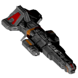

All Plugins (604)

[Cheats](https://github.com/Hecter94/EndlessSky-PluginArchive/blob/main/res/mds/cheats.md) (38) | [Gameplay](https://github.com/Hecter94/EndlessSky-PluginArchive/blob/main/res/mds/gameplay.md) (55) | [Graphics](https://github.com/Hecter94/EndlessSky-PluginArchive/blob/main/res/mds/graphics.md) (29) | [Outfits](https://github.com/Hecter94/EndlessSky-PluginArchive/blob/main/res/mds/outfits.md) (52) 
[Overhauls](https://github.com/Hecter94/EndlessSky-PluginArchive/blob/main/res/mds/overhauls.md) (46) | [Overwrites](https://github.com/Hecter94/EndlessSky-PluginArchive/blob/main/res/mds/overwrites.md) (4) | [Patches](https://github.com/Hecter94/EndlessSky-PluginArchive/blob/main/res/mds/patches.md) (3) | [Races](https://github.com/Hecter94/EndlessSky-PluginArchive/blob/main/res/mds/races.md) (70) 
[Ships](https://github.com/Hecter94/EndlessSky-PluginArchive/blob/main/res/mds/ships.md) (143) | [Starts](https://github.com/Hecter94/EndlessSky-PluginArchive/blob/main/res/md/starts.md) (17) | [Story](https://github.com/Hecter94/EndlessSky-PluginArchive/blob/main/res/mds/story.md) (80) | [Weapons](https://github.com/Hecter94/EndlessSky-PluginArchive/blob/main/res/mds/weapons.md) (42) 
[Uncategorized](https://github.com/Hecter94/EndlessSky-PluginArchive/blob/main/res/mds/uncategorized.md) (25) 

---

## Overhauls

46 plugins in this category.

 

---

### 3ndless March

[3ndless.March.zip](https://github.com/Hecter94/EndlessSky-PluginArchive/releases/download/Latest/3ndless.March.zip) | 1.99 mb | 2022-10-06 | [view files](https://github.com/Hecter94/EndlessSky-PluginArchive/tree/main/Working/3ndless%20March/)  
Author: N/A | Category: Overhauls  
N/A   

>3ndless March is a plugin that aims to add lots of advanced and dated technology for all factions
>
>Demo 1.0 Humans and partially Hai got new outfits. Playtesting purposes and typo hunting version
>

:blue_book: Plugin readme

<blockquote>A plug-in that aims to have multiple stories and a lot of advanced and dated outfits from every faction in the game

Versions (lowest is the one you got installed, duh)
Demo 1.0 - An outfit/ship demo without any story at all. Meant for playtest and typo correcting

To buy the outfits go to either "Grey Goose" (Tech1) in the umbara system near Tarazed. "Forge" 1(Adv) jump drive away or "drop point" (Adv) near saggitarius A
</blockquote>

Status: N/A  
Daily update check: </img> 

---

### 40k Pack
</img> 

[40k.Pack.zip](https://github.com/Hecter94/EndlessSky-PluginArchive/releases/download/Latest/40k.Pack.zip) | 122.31 mb | 2023-07-27 | [view files](https://github.com/Hecter94/EndlessSky-PluginArchive/tree/main/Working/40k%20Pack/)  
Author: 1010Todd | Category: Overhauls  
[https://github.com/1010todd/Endless-Sky-40k](https://github.com/1010todd/Endless-Sky-40k) (last commit 2023-03-29)  

>Endless Sky 40K plugin adds ships and outfits from Warhammer 40k to Endless Sky!
>
>Currently have:
>-15 Imperial Navy ships + outfits
>-2 Tau ships + outfits
>

:blue_book: Plugin readme

<blockquote># Endless-Sky-40K
 Warhammer 40k mod for Endless Sky
 
 REQUIRES: Endless Sky continuous version after 27 Feb 2022 to work. (Specifically commit dd7c20314c4a35d4017583bf1654891d06f11377)
 

Currently have:

-15 Imperial Navy ships + outfits

-2 Tau ships + outfits

-1 Necron ship + outfits

Currently only Imperial ships and outfits can be purchased at forge world Pifitus at system Pyherrus south of Syndicate space. To access Tau ships and outfits AES Omnis is required.

Notes:
Stats are not 100% accurate to lore, most are somewhat reduced so Endless Sky can handle it, for example the number of crews are significantly reduced, most are slaves and servitors you don't really pay anyway. Mass is reduced so ships do not experience "bounce back" glitch when exiting hyperspace. Ships scales are half-calculated half-eyeballed to be a bit more practical in Endless Sky (tiny) scale. However, worry not about the weapon, they still pack the punch they should.(Thanks to their sheer scale compared to Endless Sky.)

</blockquote>

Status: in development and playable 0.9.15 continous  
Daily update check: </img> 

---

### A Galaxy Far Far Away

[A.Galaxy.Far.Far.Away.zip](https://github.com/Hecter94/EndlessSky-PluginArchive/releases/download/Latest/A.Galaxy.Far.Far.Away.zip) | 282.33 mb | 2023-09-01 | [view files](https://github.com/Hecter94/EndlessSky-PluginArchive/tree/main/Working/A%20Galaxy%20Far%20Far%20Away/)  
Author: Ember369 | Category: Overhauls  
[https://github.com/Ember369/Endless-Sky-A-Galaxy-Far-Far-Away](https://github.com/Ember369/Endless-Sky-A-Galaxy-Far-Far-Away) (last commit 2021-11-06)  

>A mod designed to replicate Star Wars in Endless Sky.
>

:blue_book: Plugin readme

<blockquote># Endless Sky – A Galaxy Far Far Away (AGFFA)
A Galaxy Far Far Away (AGFFA) is an experimental plugin that brings the Star Wars franchise to Endless Sky (or at least tries to). Adding hundreds of ships, ranging from one-man starfighters to star destroyers or even star dreadnoughts, the plugin encompasses ships from a variety of eras and factions (The Old Republic, the Republic & CIS, the Empire & Rebels, the First Order & Resistance, and even some from Legends).

Currently, the plugin is highly unbalanced, has no existing storyline, has an incomplete galaxy, and is just a fun side project that I occasionally mess around with in my free time.

### Documentation 
(https://www.moddb.com/mods/endless-sky-a-galaxy-far-far-away)

### An important note:
I really don't know if this project will ever be completed (it's not a high priority for me), but I thought I might as well make it available for other people. If anybody would like to update the plugin for themselves, please feel free! I have no idea how Github works, so maybe duplicate the plugin into your own repositories so that I don't have to deal with any of the "pull request" stuff.

Currently, the plugin is unbalanced, buggy and overall frustrating at times, and I honestly don't know if any of these issues will ever be solved. (also please don't bombard me with questions)

– Ember369

"May the Force be with you!"
__________________________________________________________________________________________________
## Notes

### Useful Links:
- https://www.moddb.com/mods/endless-sky-a-galaxy-far-far-away
- https://github.com/Ember369/Endless-Sky-A-Galaxy-Far-Far-Away

### Videos:
- https://www.youtube.com/watch?v=1-_KH3Umhe4
- https://www.youtube.com/watch?v=X0iwpfe96mc

__________________________________________________________________________________________________
### Known Issues:
1) The maximum number of turrets that a ship can have is 32, limiting the capital ships' abilities to fight
2) Starfighter AI struggle to deploy proton bombs properly due to their high drags
3) Similar to vanilla Endless Sky, starfighters can die far too easily
4) I have created both "Starfighter" and "Starfighter (Bay)" versions of each starfighter so that some may be docked while some cannot. This is less than ideal, but works alright
5) Ship balancing in general is pretty terrible at the moment (it's really quite difficult to follow SW lore)
6) Some computers are unable to load AGFFA due to the plugin's absurdly large file size
    
__________________________________________________________________________________________________
### Limitations:
1) The galaxy map is barely complete (only a few systems have been filled, though all of them have been created)
2) I didn't know whether to set the plugin in the Galactic Republic era, the Imperial era, or the New Republic/First Order era. (I added ships from all eras just in case –> including the Old Republic)
3) Outfits & weapons are currently just placeholders since I tried to standardise them just to make it easier for balancing.
4) Missions are currently non-existent (though I have added a few simply for the purposes of making some videos https://www.youtube.com/watch?v=1-_KH3Umhe4)
5) Fleets are also essentially non-existent, though there are a couple around.
6) I'm running out of things to say, but I'm sure some other problems will be discovered at some point.

__________________________________________________________________________________________________
### Adding ships:
The "images/ship" folder contains many ships that have been yet to be added to the plugin. If you wish to add them to the game, follow the steps below:
1) Scale the png. file down to a size that is comparable to the rest of the other ships (just estimate)
2) Use the website (endless-sky.github.io/ship_builder.html) to place engines, turrets and guns.
   Use the "Show Collision Mask" to identify any semi-transparent pixels
3) Add the ship to the corresponding txt. file in the "data" folder, including the correct outfits and hardpoints.
   - For the description, copy & paste from the wookiepedia entry of the ship.
4) Add the ship name to the "data/sales" txt. file.
5) Finished!
</blockquote>

Status: unfinished but playable  
Daily update check: </img> 

---

### Ace Combat Endless Skies

[Ace.Combat.Endless.Skies.zip](https://github.com/Hecter94/EndlessSky-PluginArchive/releases/download/Latest/Ace.Combat.Endless.Skies.zip) | 158.93 kb | 2024-11-01 | [view files](https://github.com/Hecter94/EndlessSky-PluginArchive/tree/main/Working/Ace%20Combat%20Endless%20Skies/)  
Author: Spectre907 | Category: Overhauls  
[https://github.com/Spectre907YT/AC-ES](https://github.com/Spectre907YT/AC-ES) (last commit 2024-10-21)  

>Ace Combat Endless Skies is a total conversation made to bring some of that ace combat experience.
>

:blue_book: Plugin readme

<blockquote># AC-ES
Ace Combat: Endless Skies is a "total conversion" for the game endless sky made to bring in some of that ace combat experience.

</blockquote>

Status: In Progress  
Daily update check: </img> 

---

### Alphean Boolean's Expansion

[Alphean.Boolean.s.Expansion.zip](https://github.com/Hecter94/EndlessSky-PluginArchive/releases/download/Latest/Alphean.Boolean.s.Expansion.zip) | 11.69 mb | 2023-07-27 | [view files](https://github.com/Hecter94/EndlessSky-PluginArchive/tree/main/Working/Alphean%20Boolean's%20Expansion/)  
Author: Amazinite | Category: Overhauls  
[https://github.com/Amazinite/alphean-expansion](https://github.com/Amazinite/alphean-expansion) (last commit 2016-08-25)  

>This mod adds more ships, outfits, missions and governments to the game.
>

Status: N/A  
Daily update check: </img> 

---

### Altera
</img> 

[Altera.zip](https://github.com/Hecter94/EndlessSky-PluginArchive/releases/download/Latest/Altera.zip) | 16.08 mb | 2023-07-27 | [view files](https://github.com/Hecter94/EndlessSky-PluginArchive/tree/main/Working/Altera/)  
Author: EricD112 | Category: Overhauls  
[https://github.com/EricD112/Altera](https://github.com/EricD112/Altera) (last commit 2022-12-28)  

>Adds a new civilization to the Ember Wastes: Alterans.  Alterans, like
>Heliarchs, are a Tier 2.5 civilization in the Endless Sky universe.  In total,
>there are about 80 systems related to Alteran territory.
>

:blue_book: Plugin readme

<blockquote>

<h1>
Endless Sky Plugin: Altera
</h1>

This is a plugin for the free, open-source game [Endless Sky][es]. This plugin
is developed and tested against the [Endless Sky continuous][continuous] build.
Learn more [about Endless Sky][esweb].

# About Plugin:

Adds a new civilization to the Ember Wastes: Alterans.  Alterans, like
Heliarchs, are a Tier 2.5 civilization in the Endless Sky universe.  In total,
there are about 80 systems related to Alteran territory.

This plugin:

* Adds Altera-related governments and planets.
* Adds Alteran ships and outfits, which are purchasable on planetary shipyards and outfitters.
* Expands upon the existing map for exploration.

# Development Status: Alpha

* A highly WIP plugin.  Story is planned but not implemented.

[es]: https://github.com/endless-sky/endless-sky
[continuous]: https://github.com/endless-sky/endless-sky/releases/tag/continuous
[esweb]: https://endless-sky.github.io/

</blockquote>

Status: Playable on 0.9.15 Continuous.  
Daily update check: </img> 

---

### Amalgamation

[Amalgamation.zip](https://github.com/Hecter94/EndlessSky-PluginArchive/releases/download/Latest/Amalgamation.zip) | 42.67 mb | 2024-10-11 | [view files](https://github.com/Hecter94/EndlessSky-PluginArchive/tree/main/Working/Amalgamation/)  
Author: demolish238 | Category: Overhauls  
[https://github.com/SDer4illl4/ZAmalgamation-Revived](https://github.com/SDer4illl4/ZAmalgamation-Revived) (last commit 2022-07-24)  

>A large collection of older plugins that have been edited and modified to work together with the newer versions of Endless Sky and be overall more balanced and lore friendly, along with many unique Amalgamation additions to fill out previous placeholders in these plugins.
>
>The plugins included are: Shields Up, Enclave, Quarg Military Retaliation, ZRemnantX's ships, Tribute Plus, Space Conversion, Businessman, Inheritance ships, KorNewShips, Korath Automation Upgrade, Enigma Corps outfits, Cultures of the Southern Arm ships, Flamethrower Turret and The Machines are Taking Over.
>

:blue_book: Plugin readme

<blockquote># Amalgamation
A large collection of older plugins that have been edited and modified to work together with the newer versions of Endless Sky and be overall more balanced and lore friendly, along with many unique Amalgamation additions to fill out previous placeholders in these plugins.

The plugins included are: Shields Up, Enclave, Quarg Military Retaliation, ZRemnantX's ships, Tribute Plus, Space Conversion, Businessman, Inheritance ships, KorNewShips, Korath Automation Upgrade, Enigma Corps outfits, Cultures of the Southern Arm ships, Flamethrower Turret and The Machines are Taking Over.

General changes include: Adding a large number of ships into vanilla fleets all across the galaxy. Creating multiple new jobs, mercenaries, trade routes and missions to the game. Adding tons of new variants of ships to be used in many of the fleets that allow the new outfits in this plugin to be found naturally through gameplay. Changing the stats of a huge number of ships and outfits for balance and lore purposes. And finally overhauling all the fights in the main storylines to add more variance to the fleets you fight and to make it much harder to use the old strategy of, "If we have enough ships, they will eventually run out of missiles to kill us with!"

Big thanks to BeccaBunny for the use of their sprites, allowing this plugin to have many unique ships and outfits.

To use this plugin fully, the latest release (9.9), Czartrak's Ship Pack plugin, Beccas expansion and the Omnis plugin are needed. 

In addition to this the (Mission Overrides) folders files need to be moved into the "Endless Sky/data" folder and allowed to override the files there for the campaigns to have the many ships this plugin adds included.

(Make sure to backup the overidden files otherwise only a reinstall will revert the game to the vanilla state!)

https://github.com/czartrak/Czartraks-Ship-Pack

https://github.com/EndlessSkyCommunity/-Omnis

https://github.com/beccabunny/Beccas-Endless-Expansion

Recommended Plugins:

https://github.com/ZBok/BetterVanillaPirates (self explanatory)

https://github.com/tmbutterworth/boarding-missions (makes boarding worth it in human space)

https://github.com/beccabunny/Animated-ships (makes vanilla ships look more interesting)

https://comnom.github.io/Eternals/ (just a high quality self contained plugin that I like)

Used Plugins:

https://github.com/Amazinite/Shields-Up (Shields Up)

https://github.com/Makuta-Miras/The-Enclave/ (Enclave)

https://groups.google.com/forum/#!msg/endless-sky/IkoSYsZgMlQ/ (Quarg Military Retaliation)

https://github.com/Amazinite/Enigma-Corp (Enigma Corps)

https://github.com/Kriegstofu/Korath-Automation-Upgrade (Korath Automation Upgrade)

https://www.nexusmods.com/endlesssky/mods/1 (Space Conversion)

https://github.com/ItsNickBarry/endless-sky-flamethrower-turret (Flamethrower Turret)

https://drive.google.com/file/d/0B2k12Lr3UJnGSExoVW1KblRZVmc/view (Inheritance and The Machines are Taking Over)

https://github.com/Zitchas/ZRemnantX (ZRemnantX)

https://github.com/mdsmestad/ES-COTSA-Pluggin (Cultures of the Southern Arm)

If you have any feedback on balance problems or bugs please message me on Discord (demolish238#6398)

</blockquote>

Status: N/A  
Daily update check: </img> 

---

### Babylon 5-the first ones

[Babylon.5-the.first.ones.zip](https://github.com/Hecter94/EndlessSky-PluginArchive/releases/download/Latest/Babylon.5-the.first.ones.zip) | 15.6 mb | 2023-07-27 | [view files](https://github.com/Hecter94/EndlessSky-PluginArchive/tree/main/Working/Babylon%205-the%20first%20ones/)  
Author: Ambassador Kosh | Category: Overhauls  
[https://www.nexusmods.com/endlesssky/mods/9](https://www.nexusmods.com/endlesssky/mods/9)   

>Goal is to integrate B5 story into endless sky. currently adding new ships, new start and a few weapons.

Status: WIP  
Daily update check: </img> 

---

### Beccas Endless Expansion

[Beccas.Endless.Expansion.zip](https://github.com/Hecter94/EndlessSky-PluginArchive/releases/download/Latest/Beccas.Endless.Expansion.zip) | 6.09 mb | 2023-07-27 | [view files](https://github.com/Hecter94/EndlessSky-PluginArchive/tree/main/Working/Beccas%20Endless%20Expansion/)  
Author: Beccabunny | Category: Overhauls  
[https://github.com/beccabunny/Beccas-Endless-Expansion](https://github.com/beccabunny/Beccas-Endless-Expansion) (last commit 2022-09-10)  

>Add several new ships for various vanilla races with very vanilla-looking sprites (Made by same person who remade several vanilla sprites).
>

:blue_book: Plugin readme

<blockquote># Beccas-Endless-Expansion
New weapons, outfits and ships for many factions of the game Endless Sky, all with new sprites close to the vanilla ones! All you 
have to do is explore, fly in your ship and meet all the factions in the game

Current content:
Two Efreti ships, one oh which with both an empty and full variant, one Exile warship, two Remnant ships, one Wanderer anti missile, one Wanderer large heat sink, two Unfettered weapons, two Unfettered ships, two Unfettered coolings, an Unfettered rifle, a Hai afterburner, one Hai defensive outfit, a Human fuel compressor, a Human generator, one Kraz weapon and two Kraz hand to hand outfits, plus a short mission chain that gives you access to the Kraz hand to hand outfits

</blockquote>

Status: N/A  
Daily update check: </img> 

---

### Better Vanilla Pirates
</img> 

[Better.Vanilla.Pirates.zip](https://github.com/Hecter94/EndlessSky-PluginArchive/releases/download/Latest/Better.Vanilla.Pirates.zip) | 101.16 kb | 2023-10-12 | [view files](https://github.com/Hecter94/EndlessSky-PluginArchive/tree/main/Working/Better%20Vanilla%20Pirates/)  
Author: ZBok | Category: Overhauls  
[https://github.com/ZBok/BetterVanillaPirates](https://github.com/ZBok/BetterVanillaPirates) (last commit 2023-10-12)  

>Enhance/improve/fill gaps in many aspects of pirate combat in Human space, especially in the late-game.
>

:blue_book: Plugin readme

<blockquote># Better Vanilla Pirates for Endless Sky

## 2.1

2.0 did not have Mk II Navy ships as they aren't purchasable in vanilla.

However then I realised the Navy License has been a planned part of the game for years, it's intended that player should be able to get access to these ships sooo - I decided to add Mk II Navy ships with no license requirement until the Navy license becomes obtainable in vanilla.

Balance feedback welcome

## 2.0

Human space has a huge and beautiful variety of ships to play with, but when player gets into mid-late game it's hard to justify using them compared to much stronger alien ships. 

2.0 keeps all 1.0 functionality (see below) and adds something new - player can now purchase highly buffed, "Mk II" human ships from New Tortuga after completing a short mission which also gives the player a free Mk II heavy warship as a reward. This is offered at New Tortuga, after player has completed Kestrel missions and FW story.

These Mk II ships have heavily buffed shields/hull, and in most cases slightly buffed outfit/weapon/engine space. They are generally slightly tankier than Hai/Remnant but nowhere near Wanderer/Automata, and they are rather expensive.

The Kestrel Mk II you are able to buy should respect your design choice in the Kestrel missions. The Kestrel Mk II and Dreadnought Mk II are buffed slightly less than the others due to already being relatively strong, and Bactrian is buffed far less due to it already being imba af.

The mission to unlock this stuff is completely optional, and even completing it won't change anything in your game other than allowing you to purchase upgraded ships if you wish. None of the new ships introduced are used by any NPC's, ambient or mission related. Yet.

If you encounter bugs pls report them.

## 1.0 Do you love vanilla ES everything but wish that the human pirates, bounty hunters and related combat missions (spaceport + job board), were a little more interesting, and stayed challenging with worthwhile mission payouts even in the late game?

Like I want to see pirates in Kestrels sometimes. And in military ships even more rarely. And maybe with alien outfits. Also I want to see pirates (and merchants too?) in weird variants like full proton Kestrel or particle Dreadnought or pulse cannon Firebird, etc.

This plugin is designed to enhance/improve/fill gaps in many aspects of pirate combat in Human space, especially in the late-game. It does not contain any new weapons/ships/sprites, or any new or replacement storylines, nor does it make the early game any harder. It achieves all this by the adding the following (POTENTIAL SPOILERS BELOW!)

- Dozens more pirate ship variants including 21 different Kestrel setups (7 for each of the Kestrel choices), like Proton Kestrels, Pulse cannon/Hai Tracker Bactrians and dozens of other combinations, military ships, more Marauder variants, some which have low level alien tech.

- Introduces pirates with Hai+limited Korath exile outfits (heat shunts only), and the Kestrel, and then finally Hai/Korath fitted Kestrels, into ambient pirate/merchant fleets, mission targets (as described above), and the Marauder Bounty Hunted fleet (that Marauder fleet that hunts you down occasionally if your combat rating is high enough).

- Introduces pirates in military ships including Dreadnought, Skein, Frigate, Gunboat after main story completion. You'll see these rarely in ambient fleets and as mission targets.

- *NEW* Minor mission thread with three instalments unlocked at CR9, 10, 11, and more incoming soon (up to CR 13 or 14). These involve a shady NPC who offers you detailed information on unique bounty hunting groups coming to get you. The next few instalments will involve a longer mission finale and unlocking some powerful upgraded human weapons.

- 30+ new combat missions (jobs and spaceport) with tonnes of variety and unusual low-chance variations in human space, complete with corresponding regional NPC assistance in many cases. These new missions include planetary defence, multiple wave planetary defence, nearby pirate blockade destruction and more. They range from 1mil to 20mil payouts, but the toughest jobs require extremely expensive fleets to complete without losses. Some of these involve very big fleet battles so take care!

- Note that no existing missions/jobs are altered, just new ones added. All new missions are repeating and can be declined with no penalty.

- Many new variations of the "Marauder Hunted" mission, the "invisible" mission present in vanilla, where Marauder Bounty Hunters will occasionally hunt you down without warning if your combat rating is high enough. These new variations scale with combat rating, and come in two distinct flavours; small, homogeneous fleets of elite heavy warships with expensive outfit combinations, and larger rag-tag fleets including all types of ships.

- Additions described above that are based on storyline completion or Kestrel mission completion are applied retroactively. This means that you'll see all the changes on a save where you've completed these already, at least after you land once or twice post plugin install.

- *NEW* Now adds Korath Automata raid missions (spaceport) on certain Syndicate systems after the Korath Exiles start producing automata. Just like the Raider Attack missions in vanilla, just with Automata. You can now farm Sestor/Mereti ships post Wanderer storyline!

- Dozens of new pirate variants (new outfit combinations for existing ships).

## How does this actually change my game?

- With this plugin installed, your game will be completely vanilla everywhere early game.

- Once your combat rating gets past 9 (or if it is already), you'll start to see much more difficult combat jobs/spaceport missions, over 30 region specific variations, all over human space, vs new pirate fleet compositions. These missions start off with lots of enemy variety but will see more variation pirate ships and outfits as the main FW storyline and kestrel missions are completed, more detail on that below. The most difficult jobs also have low-chance variations with extra cool NPC assistance!

- As your combat rating continues to increase (up to a CR of 13), tougher and more varied Bounty Hunter fleets will hunt you down, and as above, these fleets become more varied with player progression. The spawn rate of these remains identical to vanilla. These fleets will keep you on your toes at all times in Human space, and force you to keep your combat and cargo/transport ships close or risk losing them. Tougher spaceport/job board missions will be unlocked at each combat rating from 8 to 12.

- After you complete the main FW storyline (or if you've already completed it), you'll start to see merchants and pirates will sometimes be outfit with limited alien tech, and pirates will sometimes be seen in Military ships (Skein, Cruiser, Gunboat etc) in corresponding regions. You'll also start to see alien tech fit Marauder fleets in the new missions as described above.

- After you complete the Kestrel missions (or if you've already completed them), you'll notice merchants and pirates start to occasionally appear in a wide range of Kestrel outfits, in the model that corresponds to your design choice in the Kestrel missions. This means if you choose weapons, you'll see 12 gun pirate Kestrels that actually use them all! Kestrels will also be seen occasionally in the missions described above.

- After you complete both the main FW storyline and Kestrel missions (or if you've already completed them), you'll see the occasional limited alien tech fitted Kestrel, both in ambient merchant/pirate fleets, and in the missions described above.

- Once you complete the Wanderer missions where the Korath Exiles begin using Sestor/Mereti automata as their own, some Syndicate systems will offer spaceport defence missions where the Korath are raiding the system with JD equipped automata! The payouts for these missions are relatively low, but they allow the player to obtain Sestor/Mereti ships after the Wanderer campaign (not possible in vanilla).

The job board/spaceport missions are designed to be quite difficult at times even for large fleets so take care. You may find that human missiles become a serious problem in large numbers, with the large impact force capable of isolating and destroying your escorts with ease, anti-missile turrets may come in very handy.

Please make backups of your pilot file before using this plugin. The changes this plugin makes to fleets (adding pirates/merchants with Hai tech, adding pirate/merchant Kestrels, etc) are stored in your save file. If you remove the plugin, it may not work anymore. Backup your pilot file just in case you don't like this plugin.

Enjoy!
</blockquote>

Status: N/A  
Daily update check: </img> 

---

### Beyond the Sky

[Beyond.the.Sky.zip](https://github.com/Hecter94/EndlessSky-PluginArchive/releases/download/Latest/Beyond.the.Sky.zip) | 15.48 mb | 2023-08-15 | [view files](https://github.com/Hecter94/EndlessSky-PluginArchive/tree/main/Working/Beyond%20the%20Sky/)  
Author: 1010todd | Category: Overhauls  
[https://github.com/1010todd/Beyond-the-Sky](https://github.com/1010todd/Beyond-the-Sky) (last commit 2023-08-15)  

>Additional ships and reaction to being farmed for high tier alien(Pug, Quarg).
>
>

:blue_book: Plugin readme

<blockquote># Beyond the Sky
 Endless Sky plugin expanding advanced alien contents
 
Requires: Continuous/0.9.17+

 Currently includes:
 
 -New Quarg warships & outfits.
  * Several new ships(mostly warships), most only spawn when hostile enough.
 
 -New Pug warship & outfits:	
  * A few new ships, some only spawn after the Arfecta is defeated.
 
 -Mechanic to adjust fleet strength according to player's strength.

 -Mechanic for Quarg to respond to player hunting them by deploying new ships and sending hunting fleets if the player is nearby.

 -Pug deploying even stronger ship if their Arfecta is defeated or they got annoyed enough.
 
 

</blockquote>

Status: Continuous/0.9.15+  
Daily update check: </img> 

---

### Bulkheads-and-Battleships

[Bulkheads-and-Battleships.zip](https://github.com/Hecter94/EndlessSky-PluginArchive/releases/download/Latest/Bulkheads-and-Battleships.zip) | 33.15 kb | 2023-11-21 | [view files](https://github.com/Hecter94/EndlessSky-PluginArchive/tree/main/Working/Bulkheads-and-Battleships/)  
Author: Zoura | Category: Overhauls  
[https://github.com/AvianGeneticist/Bulkheads-and-Battleships](https://github.com/AvianGeneticist/Bulkheads-and-Battleships) (last commit 2023-05-27)  

>Turn Endless Sky into DnD-style RPG.
>

:blue_book: Plugin readme

<blockquote># Bulkheads-and-Battleships
 Turns endless sky into a DnD-style RPG.

</blockquote>

Status: Playable on 0.10.0 continuous  
Daily update check: </img> 

---

### Civil War

[Civil.War.zip](https://github.com/Hecter94/EndlessSky-PluginArchive/releases/download/Latest/Civil.War.zip) | 57.79 mb | 2023-07-27 | [view files](https://github.com/Hecter94/EndlessSky-PluginArchive/tree/main/Working/Civil%20War/)  
Author: kikotheexile | Category: Overhauls  
[https://github.com/kikotheexile/Endless-Sky-Civil-War](https://github.com/kikotheexile/Endless-Sky-Civil-War) (last commit 2021-10-03)  

>A story-driven variation of the 2015 game Endless Sky, the spiritual successor to Escape Velocity. You can still explore other star systems. Earn money by trading, carrying passengers, or completing missions. Use your earnings to buy a better ship or to upgrade the weapons and engines on your current one. Blow up pirates. But now you can Truly pick a side in the Civil War.
>

:blue_book: Plugin readme

<blockquote>Build instructions:

Linux:

Use your favorite package manager to install the following (version numbers may vary depending on your distribution):

DEB-based distros:
   g++ \
   scons \
   libsdl2-dev \
   libpng-dev \
   libjpeg-dev \
   libgl1-mesa-dev \
   libglew-dev \
   libopenal-dev \
   libmad0-dev

RPM-based distros:
   gcc-c++ \
   scons \
   SDL2-devel \
   libpng-devel \
   libjpeg-turbo-devel \
   mesa-libGL-devel \
   glew-devel \
   openal-soft-devel \
   libmad-devel

You can then just navigate to the source code folder in a terminal and type:

  $ scons
  $ ./endless-sky

The program will run using the "data" and "images" folders that are found in the source code folder itself. For more Linux help, consult the man page (endless-sky.6).

Windows:

The Windows build has been tested on 64-bit Windows 7, only. You will need the Code::Blocks IDE and g++ 4.8 or higher. Code::Blocks is available here:

  http://sourceforge.net/projects/codeblocks/files/Binaries/13.12/Windows/codeblocks-13.12-setup.exe/download

You can install g++ separately through mingw-w64:

  http://sourceforge.net/projects/mingw-w64/files/Toolchains%20targetting%20Win64/Personal%20Builds/mingw-builds/4.8.5/threads-posix/seh/

*** Be sure to install the "pthread" version of MinGW. The "win32-thread" one does not come with support for C++11 threading. If you are using 32-bit Windows, install the compiler for "dwarf" exceptions, not "sjlj." ***

If you are on 64-bit Windows, a full set of development libraries are available here:

  http://endless-sky.github.io/win64-dev.zip

If you don't want to have to edit the paths in the Code::Blocks file, unpack the "dev64" folder directly into C:\.

If you are using 32-bit Windows, a full set of development libraries are available here:

  http://endless-sky.github.io/win32-dev.zip

You will probably need to adjust the paths to your compiler binaries, and you should also switch to the "Win32" build instead of the "Debug" or "Release" build.

You will also need libmingw32.a and libopengl32.a. Those should be included in the MinGW g++ install. If they are not in C:\Program Files\mingw64\x86_64-w64-mingw32\lib\ you will have to adjust the paths in the Code::Blocks file.

Mac OS X:

To build Endless Sky, you will first need to download Xcode from the App Store.

Next, install Homebrew (from http://brew.sh).

ARM Processors:

  If you have an ARM processor, such as the Apple M1, you will need to install an x86_64 version of Homebrew. You can do this by running the normal install command through an `arch` terminal:

  $ arch -x86_64 zsh

  You may find it useful to define an alias that you can use to interact with your x86_64 homebrew:

  alias brex="arch -x86_64 /usr/local/Homebrew/bin/brew"

  Use this alias instead of `brew` in any subsequent homebrew commands.

  Before continuing, make sure that your x86_64 Homebrew install is prefixed to `/usr/local`:

  $ brex --prefix
  /usr/local

Once Homebrew is installed, use it to install the libraries you will need:

  $ brew install pango cairo libpng libjpeg-turbo libmad sdl2

ARM version:

  $ brex install pango cairo libpng libjpg-turbo libmad sdl2

If the versions of those libraries are different from the ones that the Xcode project is set up for, you will need to modify the file paths in the “Frameworks” section in Xcode.

It is possible that you will also need to modify the “Header Search Paths” and “Library Search Paths” in “Build Settings” to point to wherever Homebrew installed those libraries.

Library paths

To create a Mac OS X binary that will work on systems other than your own, you may also need to use install_name_tool to modify the libraries so that their location is relative to the @rpath.

$ sudo install_name_tool -id "@rpath/libpng16.16.dylib" /usr/local/lib/libpng16.16.dylib
$ sudo install_name_tool -id "@rpath/libmad.0.2.1.dylib" /usr/local/lib/libmad.0.2.1.dylib
$ sudo install_name_tool -id "@rpath/libturbojpeg.0.dylib" /usr/local/opt/libjpeg-turbo/lib/libturbojpeg.0.dylib
$ sudo install_name_tool -id "@rpath/libSDL2-2.0.0.dylib" /usr/local/lib/libSDL2-2.0.0.dylib

</blockquote>

Status: Total conversion mod, will likely function but is outdated, expect issues.  
Daily update check: </img> 

---

### Disable Pack

[Disable.Pack.zip](https://github.com/Hecter94/EndlessSky-PluginArchive/releases/download/Latest/Disable.Pack.zip) | 4.06 kb | 2022-10-06 | [view files](https://github.com/Hecter94/EndlessSky-PluginArchive/tree/main/Working/Disable%20Pack/)  
Author: "That Guy" | Category: Overhauls  
N/A   

>A small plugin which stops ships destroying everything!
>

Status: N/A  
Daily update check: </img> 

---

### Edge of Endless

[Edge.of.Endless.zip](https://github.com/Hecter94/EndlessSky-PluginArchive/releases/download/Latest/Edge.of.Endless.zip) | 231.41 mb | 2023-07-27 | [view files](https://github.com/Hecter94/EndlessSky-PluginArchive/tree/main/Working/Edge%20of%20Endless/)  
Author: Zach Farmer | Category: Overhauls  
N/A   

>Large plugin that adds a bunch of stuffs to the galaxy. And lots of big ships.
>

Status: Abandoned, Should be playable on 0.9.14, 0.9.15 Continuous.  
Daily update check: </img> 

---

### Endless Seas
</img> 

[Endless.Seas.zip](https://github.com/Hecter94/EndlessSky-PluginArchive/releases/download/Latest/Endless.Seas.zip) | 165.55 mb | 2023-07-27 | [view files](https://github.com/Hecter94/EndlessSky-PluginArchive/tree/main/Working/Endless%20Seas/)  
Author: Zoura | Category: Overhauls  
[https://github.com/AvianGeneticist/Endless-Seas](https://github.com/AvianGeneticist/Endless-Seas) (last commit 2022-10-26)  

>A total conversion mod of Endless Sky. The objective of this total conversion is to give Endless Sky a more maritime theme, with all the quirks that come with it. 
>

:blue_book: Plugin readme

<blockquote># Endless-Seas
 I think I picked the wrong "S word"

Jokes aside, welcome to Endless Sea, a total conversion mod of Endless Sky. The objective of this total conversion is to give Endless Sky a more maritime theme, with all the quirks that come with it.

Currently, this is a pre-pre-pre-alpha, and is extremely primitive in all aspects. Please direct all criticism to me; feel free to post reviews in the issues board, or even go ahead and PR your own contributions! I welcome all forms of help, trust me. Be it island images, balance suggestions, and so on; I'm very happy to get others' feedback, especially this early on.

Full tranparency, this is built off of an install of Samrocketman's fork, which can be found here -> https://github.com/samrocketman/endless-sky/tree/continuous-with-plugins

</blockquote>

Status: Currently, this is a pre-pre-pre-alpha  
Daily update check: </img> 

---

### Endless War The Struggles of the Old Republic

[Endless.War.The.Struggles.of.the.Old.Republic.zip](https://github.com/Hecter94/EndlessSky-PluginArchive/releases/download/Latest/Endless.War.The.Struggles.of.the.Old.Republic.zip) | 18.67 mb | 2023-07-27 | [view files](https://github.com/Hecter94/EndlessSky-PluginArchive/tree/main/Working/Endless%20War%20The%20Struggles%20of%20the%20Old%20Republic/)  
Author: ShadowNinja909 | Category: Overhauls  
[https://www.moddb.com/mods/endless-war-the-struggles-of-the-old-republic](https://www.moddb.com/mods/endless-war-the-struggles-of-the-old-republic)   

>I've been slowly working on a Star Wars mod set at the beginning of the Great Galactic War between the New Sith Empire and the Galactic Republic, some four thousand years before the battle of Yavin. Right now it is far from complete, though I do have jobs and many factions implement, as well as over 40 complete star systems.

Status: seems abandoned  
Daily update check: </img> 

---

### Endless-Endless-Sky
</img> 

[Endless-Endless-Sky.zip](https://github.com/Hecter94/EndlessSky-PluginArchive/releases/download/Latest/Endless-Endless-Sky.zip) | 11.09 mb | 2024-03-27 | [view files](https://github.com/Hecter94/EndlessSky-PluginArchive/tree/main/Working/Endless-Endless-Sky/)  
Author: 1010Todd | Category: Overhauls  
[https://github.com/1010todd/Endless-Endless-Sky](https://github.com/1010todd/Endless-Endless-Sky) (last commit 2024-03-27)  

>Python scripts to generate new procedurally generated galaxy. Comes with pre-generated data for instant playing.
>

:blue_book: Plugin readme

<blockquote># Endless Endless Sky
 Procedural generation plugin for open source game [Endless Sky](https://github.com/endless-sky/endless-sky)

 Partially derived from Nucleartaxi's [Endless Sky Generators](https://github.com/Nucleartaxi/endless-sky-generators)

Primarily a script to generate entire galaxy along with its content from systems, governments(aliens) with their own ships fully outfitted with each faction own outfits and even generated ship sprites.

WARNING: Highly experimental, may not stable enough for regular gameplay.

WARNING: Data folder and generated sprites will be reset every update to utilize new features, backup what you like.

## How to use:
 Requires: Python 3.9+, and Pillow 8.4.0+ (For ship sprite generation)
 This plugin can be installed normally like any other plugin. Pre-generated data is provided [here](https://github.com/1010todd/Endless-Endless-Sky/releases/tag/v0.1.0) if you don't want to run the script.
 
 To run the generator, simply run main.py and wait. If success the console will say so and wait for input before closing.
 
 Some part of the generator can be configured, check instructions.txt to see which can be used. (very messy right now, some option works, some don't, will fix later)
 

</blockquote>

Status: Playable on 0.9.15/0.9.16/Continuous.  
Daily update check: </img> 

---

### Fallen

[Fallen.zip](https://github.com/Hecter94/EndlessSky-PluginArchive/releases/download/Latest/Fallen.zip) | 2.62 mb | 2023-05-30 | [view files](https://github.com/Hecter94/EndlessSky-PluginArchive/tree/main/Working/Fallen/)  
Author: Michael Feather | Category: Overhauls  
N/A   

>This mod starts you on an ancient space station that was built by a fallen alien empire. You are the last member of this alien species, and the AI that awoke you has informed you that you have been tasked with reconquering the galaxy. It's a good thing the station you're on doubles as a ship construction yard.
>

Status: revival project with fixes  
Daily update check: </img> 

---

### Galactic War
</img> 

[Galactic.War.zip](https://github.com/Hecter94/EndlessSky-PluginArchive/releases/download/Latest/Galactic.War.zip) | 161.21 mb | 2024-10-31 | [view files](https://github.com/Hecter94/EndlessSky-PluginArchive/tree/main/Working/Galactic%20War/)  
Author: 1010todd | Category: Overhauls  
[https://github.com/1010todd/Galactic-War](https://github.com/1010todd/Galactic-War) (last commit 2024-10-31)  

>This is a massive content mod about a war in another galaxy. While no storyline exist yet there's a large galaxy to explore filled with various aliens with different advancement and specializations.
>

:blue_book: Plugin readme

<blockquote># Galactic-War
This is a repository for the Endless Sky mod "Galactic War".
The mod is currently in development stage, so many things are subject to change later on.

Currently the mod requires Endless Sky version 0.10.3+ to work properly.
(Only 0.10.3 feature used is the plugin.txt file really, it'll work with 0.9.15 still)
Version above this is usually compatible as well. Endless Sky backward compatibility is exceptional so far.

## About
This is a massive content mod about a war in another galaxy. While no storyline exists yet, there is a large galaxy to explore, filled with various aliens that have different advancements and specializations.

Currently the plugin consist of:

* 1 Accessible galaxy.

* 27 Races with their own ships and outfits. Some with unique mechanics such as territory changes or they can even hunt you down depending on your interactions with them.

* Over 100 Ships,

* Over 600 Outfits,

* Over 1500 Systems.

## Accessing the Content

To find the galaxy, head up to the system north of Ka'ch'chrai (the capital) in Wanderer space, and the wormhole will be in a system between Sko'karak and Pug Iyik.

This plugin is complatible with the Omnis and World Forge developer plugins, though World Forge support will be missing some functions and may be slightly outdated.

## Known Issues
Galaxy image not appearing. To fix this, turn on "reduce large graphic" option in the settings menu and restart the game.

Game slowing down when jumping with hyperdrive. Due to the number of systems this plugin adds and the game's pathfinding methods, unfortunately the only fix is to get better hardware.

Game slowing down/freezing when escorts have high-range jump drive. Similar reason to above, use shorter-ranged jump drives or don't use escorts.

## Download
To download the latest (development) version, press the green [code] button and download as zip from this repository.

To install you can extract the zip in your plugin folder.

High-DPI plugin for Galactic War:

For 4k monitors or if ships/outfits look blurry, you can download this plugin for sprites with higher resolution;
https://github.com/1010todd/Galactic-War-hi-dpi

Lite version: (Very Outdated)

This version will have fewer animation frames and exclude @2x images to reduce memory required to load the plugin. Use this if you're using low end machines or 32 bit machines.
https://mega.nz/file/8QpAAYhJ#H2vVusIAPKdlMZlzVNwTfTwzpV6tYQBsvZDXDdNhB54

## Recommended

This plugin have a few debug functionality and unobtainable ships which can be unlocked with Omnis cheat/developer plugin.

[Link](https://github.com/EndlessSkyCommunity/-Omnis)

## Contact
If you find any bugs/issues or have a suggestion, feel free to open an issue here or find me in Endless Sky Community discord server; [Link](https://discord.gg/ZeuASSx)

</blockquote>

Status: Playable on 0.9.14, 0.9.15 Continuous.  
Daily update check: </img> 

---

### Galactic War hi-dpi

[Galactic.War.hi-dpi.zip](https://github.com/Hecter94/EndlessSky-PluginArchive/releases/download/Latest/Galactic.War.hi-dpi.zip) | 55.66 mb | 2023-07-27 | [view files](https://github.com/Hecter94/EndlessSky-PluginArchive/tree/main/Working/Galactic%20War%20hi-dpi/)  
Author: 1010todd | Category: Overhauls  
[https://github.com/1010todd/Galactic-War-hi-dpi](https://github.com/1010todd/Galactic-War-hi-dpi) (last commit 2022-11-12)  

>high resolution sprites for endless sky mod "Galactic War"

:blue_book: Plugin readme

<blockquote>
This is a repository for high resolution sprites for endless sky mod "Galactic War"

</blockquote>

Status: N/A  
Daily update check: </img> 

---

### Humans Alternate Universe

[Humans.Alternate.Universe.zip](https://github.com/Hecter94/EndlessSky-PluginArchive/releases/download/Latest/Humans.Alternate.Universe.zip) | 2.71 mb | 2022-10-06 | [view files](https://github.com/Hecter94/EndlessSky-PluginArchive/tree/main/Working/Humans%20Alternate%20Universe/)  
Author: N/A | Category: Overhauls  
N/A   

>N/A
>

Status: N/A  
Daily update check: </img> 

---

### Jump to Lightspeed

[Jump.to.Lightspeed.zip](https://github.com/Hecter94/EndlessSky-PluginArchive/releases/download/Latest/Jump.to.Lightspeed.zip) | 1.19 mb | 2023-07-27 | [view files](https://github.com/Hecter94/EndlessSky-PluginArchive/tree/main/Working/Jump%20to%20Lightspeed/)  
Author: Krayt Dragon Moddding | Category: Overhauls  
[https://www.moddb.com/mods/endless-sky-jump-to-lightspeed](https://www.moddb.com/mods/endless-sky-jump-to-lightspeed)   

>Star Wars mod.
>
>

Status: Abandoned, Should be playable on 0.9.14, 0.9.15 Continuous.  
Daily update check: </img> 

---

### New Sky

[New.Sky.zip](https://github.com/Hecter94/EndlessSky-PluginArchive/releases/download/Latest/New.Sky.zip) | 11.27 mb | 2023-07-27 | [view files](https://github.com/Hecter94/EndlessSky-PluginArchive/tree/main/Working/New%20Sky/)  
Author: 1010Todd | Category: Overhauls  
[https://github.com/1010todd/ES-New_Sky](https://github.com/1010todd/ES-New_Sky) (last commit 2022-01-21)  

>Add a small galaxy with a few alien. Content merged with Galactic War
>

:blue_book: Plugin readme

<blockquote># ES-New_Sky
Repository for an Endless Sky plugin/mod New Sky

Merged with Galactic War plugin:

https://github.com/1010todd/Galactic-War

</blockquote>

Status: No longer developed. Playable on 0.9.14, 0.9.15 Continuous.  
Daily update check: </img> 

---

### PipMod

[PipMod.zip](https://github.com/Hecter94/EndlessSky-PluginArchive/releases/download/Latest/PipMod.zip) | 24.71 kb | 2022-10-06 | [view files](https://github.com/Hecter94/EndlessSky-PluginArchive/tree/main/Working/PipMod/)  
Author: Pipsqueak | Category: Overhauls  
N/A   

>a lot of changes to weapons / rebalancing
>

Status: N/A  
Daily update check: </img> 

---

### Pirate Expansion

[Pirate.Expansion.zip](https://github.com/Hecter94/EndlessSky-PluginArchive/releases/download/Latest/Pirate.Expansion.zip) | 4.94 mb | 2023-11-21 | [view files](https://github.com/Hecter94/EndlessSky-PluginArchive/tree/main/Working/Pirate%20Expansion/)  
Author: Beccabunny | Category: Overhauls  
[https://github.com/beccabunny/Pirate-Expansion](https://github.com/beccabunny/Pirate-Expansion) (last commit 2022-09-10)  

>Expand your pirate experience with new ships, outfits, systems and even mechanics! This plugin expands the northern pirate section to a large area, big enough to allow trading or similar activities one could do in the rest of the galaxy. Two new pirate ships are added, a freighter that is by itself capable of jamming the nearby sensors and a middle ground between the Firebird and the Leviathan. Finally, 6 new outfits are added, including two turrets and one special outfit that comes with a special mechanic that is obtainable using a lot of invisible missions.
>
>

:blue_book: Plugin readme

<blockquote># Pirate-Expansion
Expand your pirate experience with new ships, outfits, systems and even mechanics! This plugin expands the northern pirate section to a large area, big enough to allow trading or similar activities one could do in the rest of the galaxy. Two new pirate ships are added, a freighter that is by itself capable of jamming the nearby sensors and a middle ground between the Firebird and the Leviathan. Finally, 6 new outfits are added, including two turrets and one special outfit that comes with a special mechanic that is obtainable using a lot of invisible missions.

</blockquote>

Status: N/A  
Daily update check: </img> 

---

### Prometeus Flame
</img> 

[Prometeus.Flame.zip](https://github.com/Hecter94/EndlessSky-PluginArchive/releases/download/Latest/Prometeus.Flame.zip) | 38.51 mb | 2023-07-27 | [view files](https://github.com/Hecter94/EndlessSky-PluginArchive/tree/main/Working/Prometeus%20Flame/)  
Author: Delta-Zero | Category: Overhauls  
[https://github.com/Delta-Zero/Endless-Sky-Prometeus-Flame-Plugin](https://github.com/Delta-Zero/Endless-Sky-Prometeus-Flame-Plugin) (last commit 2022-10-06)  

>Prometeus Flame is a campaign expansion plugin that introduces a new corporation: “Prometeus AT Group” which become vital to the Free worlds war effort.
>The company provides over eight new ships added to the campaign that will be operated exclusively by the FW giving the faction some serious new firepower as well as new missions integrating the Lyria System and its corporation Prometeus into the universe of Endless Sky and lore.
>

Status: WIP, Map Only  
Daily update check: </img> 

---

### Pug Defense
</img> 

[Pug.Defense.zip](https://github.com/Hecter94/EndlessSky-PluginArchive/releases/download/Latest/Pug.Defense.zip) | 1.11 mb | 2022-10-06 | [view files](https://github.com/Hecter94/EndlessSky-PluginArchive/tree/main/Working/Pug%20Defense/)  
Author: Wyrdean | Category: Overhauls  
[https://github.com/Wyrdean/Pug-Defense](https://github.com/Wyrdean/Pug-Defense) (last commit 2022-02-04)  

>Pug Defense is a small but extremely challenging plugin which adds a system to the south of the galaxy, accessible only by jump drive. In the system, corrupted pug fleets will spawn, extremely hostile and after your blood, however, should you be strong enough, you can challenge the planets and demand tribute. The defenders are like nothing you've ever seen before, including the peak of Pug technology, the Pug Perfecta.
>
>To access the plugin content, first land on any planet to initialize the missions. Then go to the Sard system and jump south from there to a new system, Sylansia Lost. From there, landing on Monolith will begin the quest chain.
>

Status: works on 0.10.0  
Daily update check: </img> 

---

### Random Expansion

[Random.Expansion.zip](https://github.com/Hecter94/EndlessSky-PluginArchive/releases/download/Latest/Random.Expansion.zip) | 2.42 mb | 2023-07-27 | [view files](https://github.com/Hecter94/EndlessSky-PluginArchive/tree/main/Working/Random%20Expansion/)  
Author: Alphean Boolean | Category: Overhauls  
[https://github.com/Disiuze/alphean-expansion](https://github.com/Disiuze/alphean-expansion) (last commit 2016-08-25)  

>This mod by Alphean Boolean adds more ships, outfits, missions and governments to the game.
>

Status: N/A  
Daily update check: </img> 

---

### Sci-Fi Flavours

[Sci-Fi.Flavours.zip](https://github.com/Hecter94/EndlessSky-PluginArchive/releases/download/Latest/Sci-Fi.Flavours.zip) | 41.33 mb | 2023-07-27 | [view files](https://github.com/Hecter94/EndlessSky-PluginArchive/tree/main/Working/Sci-Fi%20Flavours/)  
Author: Linear Perk | Category: Overhauls  
[https://github.com/LinearPerk/Sci-Fi-Flavours](https://github.com/LinearPerk/Sci-Fi-Flavours) (last commit 2022-11-06)  

>This Plugin contains:
>About 100 new ships
>About 100 new outfits/weapons
>No changes to storyline missions
>More starter ships and increased start money (1 million)
>

:blue_book: Plugin readme

<blockquote># Sci-Fi-Flavours
An Endless Sky plugin.

This is version 1.0 of a Plugin that's intended to gently eventually incorporate all of my favourite science fiction content into Endless Sky.
It's a work in progress but since I am just about to start my first full playthrough of version 1.0 I thought I would share it with the Endless Sky community.

On my first playthrough I will be building a list of balance fixes and making notes on better mission/storyline integration.
If you have feedback I'd love to hear it, especially if you have ideas for balance and or ship variants. So send me your best ship + outfits combinations!
(linearperk@gmail.com)

This Plugin contains:
  - About 100 new ships  
  - About 100 new outfits/weapons
  - No changes to storyline missions
  - More starter ships and increased start money (1 million)

To do list:
  - Hi Res sprites/images
  - Integration with campaign
  - New missions to gradually introduce plugin content
  - Learn how to create new sprites with blender :)
 
# Acknowledgments

I have been playing with, mixing, remixing, and modifying the content and assets from all of the following excellent plugins. I have used them as a guide and in some cases I've taken my favourite content and reproduced it in the Sci-Fi Flavours mod with only small tweaks to balance.  
 
Amazinite/Enigma-Corp 
https://github.com/Amazinite/Enigma-Corp

Amazinite/Shields-Up
https://github.com/Amazinite/Shields-Up

Makuta-Miras/The-Enclave 
https://github.com/Makuta-Miras/The-Enclave/tree/master/data

Kryes-Omega/endless-sky-WestIron
https://github.com/Kryes-Omega/endless-sky-WestIron

toilethinges/Adamas-Project
https://github.com/toilethinges/Adamas-Project

czartrak/Czartraks-Ship-Pack 
https://github.com/czartrak/Czartraks-Ship-Pack

ZBok/BetterVanillaPirates 
https://github.com/ZBok/BetterVanillaPirates

Ember369/Endless-Sky-A-Galaxy-Far-Far-Away 
https://github.com/Ember369/Endless-Sky-A-Galaxy-Far-Far-Away

loiseeer/The-more-ships-plugin 
https://github.com/loiseeer/The-more-ships-plugin

# Artists 
Will credit each ship when I complete the ship descriptions.

Ansel Hsiao / https://fractalsponge.net/

unusualsuspex / https://www.deviantart.com/unusualsuspex

dolynick / https://www.deviantart.com/dolynick

ravendeviant / https://www.deviantart.com/ravendeviant

# Installation

(From the Endless Sky Wiki)
https://endless-sky.fandom.com/wiki/Mods

Installing mods is simple: place the folder containing the mod files in a folder labeled "plugins" in one of the following locations, depending on your operating system.
Linux

    /usr/share/endless-sky/plugins/
    /.local/share/endless-sky/plugins/

Windows

    plugins\ (in the same folder as the Endless Sky executable)
    C:\Users\yourusername\AppData\Roaming\endless-sky\plugins\

Mac OS X

    Content/Resources/plugins/ (within the application bundle)
    /Library/ApplicationSupport/endless-sky/plugins

The end result should be something like [file-path]\endless-sky\plugins\[plugin-name], which in turn will contain that specific mod's data, images, and sounds folders, and possibly readme and copyright info. 

</blockquote>

Status: N/A  
Daily update check: </img> 

---

### Shields Up
</img> 

[Shields.Up.zip](https://github.com/Hecter94/EndlessSky-PluginArchive/releases/download/Latest/Shields.Up.zip) | 12.75 mb | 2023-07-27 | [view files](https://github.com/Hecter94/EndlessSky-PluginArchive/tree/main/Working/Shields%20Up/)  
Author: Alphean Boolean | Category: Overhauls  
[https://github.com/Disiuze/alphean-expansion](https://github.com/Disiuze/alphean-expansion) (last commit 2016-08-25)  

>Say hello to the one and only Shields Up plugin! This iteration of Shields Up is the love-child of quite a few people, as it was worked on by Direstorm and Friendly Neighbor, has a few cool ships from Mdsmestad, was just recently merged with the Alphean's Expansion plugin, and is currently under the care of Derpy Horse.
>Enjoy playing with dozens of new systems, outfits, and ships across the Milky Way galaxy (and beyond...?) as you encounter strange new alien races never before seen by humanity.
>

Status: N/A  
Daily update check: </img> 

---

### ShieldsUp Derpy's Expansion
</img> 

[ShieldsUp.Derpy.s.Expansion.zip](https://github.com/Hecter94/EndlessSky-PluginArchive/releases/download/Latest/ShieldsUp.Derpy.s.Expansion.zip) | 266.45 kb | 2022-10-06 | [view files](https://github.com/Hecter94/EndlessSky-PluginArchive/tree/main/Working/ShieldsUp%20Derpy's%20Expansion/)  
Author: N/A | Category: Overhauls  
N/A   

>Derpy's Shields Up Expansion is a temporary addition to Shields Up that brings with it a few outfits that the main plugin does not offer, most notably at the moment outfits that increase your ammunition capacity for secondary weapons. This will eventually be removed.
>

Status: N/A  
Daily update check: </img> 

---

### ShieldsUp Housekeeping
</img> 

[ShieldsUp.Housekeeping.zip](https://github.com/Hecter94/EndlessSky-PluginArchive/releases/download/Latest/ShieldsUp.Housekeeping.zip) | 5.44 mb | 2022-10-06 | [view files](https://github.com/Hecter94/EndlessSky-PluginArchive/tree/main/Working/ShieldsUp%20Housekeeping/)  
Author: N/A | Category: Overhauls  
[https://github.com/Amazinite/Shields-Up](https://github.com/Amazinite/Shields-Up) (last commit 2018-06-21)  

>Shields Up Housekeeping is a simple plugin meant to go along with the rest of the Shields Up pack to ensure the best Shields Up experience. Although not necessary, it's best to keep this installed, especially for players using pilots that played older versions of Shields Up.
>

Status: N/A  
Daily update check: </img> 

---

### ShieldsUp Legacy

[ShieldsUp.Legacy.zip](https://github.com/Hecter94/EndlessSky-PluginArchive/releases/download/Latest/ShieldsUp.Legacy.zip) | 757.61 kb | 2022-10-06 | [view files](https://github.com/Hecter94/EndlessSky-PluginArchive/tree/main/Working/ShieldsUp%20Legacy/)  
Author: Amazinite | Category: Overhauls  
[https://github.com/Amazinite/Shields-Up](https://github.com/Amazinite/Shields-Up) (last commit 2018-06-21)  

>Shields Up Legacy is a small combination of two of the oldest mods that were in the original Shields Up pack: That Someone and Tufton's plugins.
>That Someone brings with it a whole new faction of Hai who have their own stories and outlooks on the history of the Hai, and a strange new Pug factions that partakes in a perpetual war.
>Tufton adds cool new weapons and an amazing heavy fighter called the Tactical Assault Fighter.
>

Status: N/A  
Daily update check: </img> 

---

### ShieldsUp Override

[ShieldsUp.Override.zip](https://github.com/Hecter94/EndlessSky-PluginArchive/releases/download/Latest/ShieldsUp.Override.zip) | 1.19 mb | 2022-10-06 | [view files](https://github.com/Hecter94/EndlessSky-PluginArchive/tree/main/Working/ShieldsUp%20Override/)  
Author: N/A | Category: Overhauls  
N/A   

>N/A
>

Status: N/A  
Daily update check: </img> 

---

### ShieldsUp Phils Flavours
</img> 

[ShieldsUp.Phils.Flavours.zip](https://github.com/Hecter94/EndlessSky-PluginArchive/releases/download/Latest/ShieldsUp.Phils.Flavours.zip) | 13.93 mb | 2022-10-06 | [view files](https://github.com/Hecter94/EndlessSky-PluginArchive/tree/main/Working/ShieldsUp%20Phils%20Flavours/)  
Author: Phil Morley | Category: Overhauls  
[https://github.com/Amazinite/Shields-Up](https://github.com/Amazinite/Shields-Up) (last commit 2018-06-21)  

>Phil's Flavours is the newest addition to the Shields Up pack, and includes dozens of new animated ships and helpful new outfits, all made to look like they fit right in with the game.
>

Status: N/A  
Daily update check: </img> 

---

### ShieldsUp Pompano's Ever Expanding Galaxy
</img> 

[ShieldsUp.Pompano.s.Ever.Expanding.Galaxy.zip](https://github.com/Hecter94/EndlessSky-PluginArchive/releases/download/Latest/ShieldsUp.Pompano.s.Ever.Expanding.Galaxy.zip) | 1.41 mb | 2022-10-06 | [view files](https://github.com/Hecter94/EndlessSky-PluginArchive/tree/main/Working/ShieldsUp%20Pompano's%20Ever%20Expanding%20Galaxy/)  
Author: N/A | Category: Overhauls  
[https://github.com/Amazinite/Shields-Up](https://github.com/Amazinite/Shields-Up) (last commit 2018-06-21)  

>a new race, several systems, several new ships and outfits
>

Status: N/A  
Daily update check: </img> 

---

### ShieldsUp_ZZOverride

[ShieldsUp_ZZOverride.zip](https://github.com/Hecter94/EndlessSky-PluginArchive/releases/download/Latest/ShieldsUp_ZZOverride.zip) | 1.19 mb | 2022-10-06 | [view files](https://github.com/Hecter94/EndlessSky-PluginArchive/tree/main/Working/ShieldsUp_ZZOverride/)  
Author: N/A | Category: Overhauls  
N/A   

>N/A
>

Status: N/A  
Daily update check: </img> 

---

### The Empire's March

[The.Empire.s.March.zip](https://github.com/Hecter94/EndlessSky-PluginArchive/releases/download/Latest/The.Empire.s.March.zip) | 170.14 kb | 2022-10-06 | [view files](https://github.com/Hecter94/EndlessSky-PluginArchive/tree/main/Working/The%20Empire's%20March/)  
Author: Rushin Neighbour | Category: Overhauls  
N/A   

> Tie fighter code
> And
> The imperial system "Kullat"
>

Status: N/A  
Daily update check: </img> 

---

### The Enclave
</img> 

[The.Enclave.zip](https://github.com/Hecter94/EndlessSky-PluginArchive/releases/download/Latest/The.Enclave.zip) | 6.65 mb | 2023-07-27 | [view files](https://github.com/Hecter94/EndlessSky-PluginArchive/tree/main/Working/The%20Enclave/)  
Author: Storm Crow and 1010todd | Category: Overhauls  
[https://github.com/1010todd/The-Enclave](https://github.com/1010todd/The-Enclave) (last commit 2022-07-31)  

>The Enclave is a story-driven plugin focused on the discovery of an isolated group of humans stranded, hundreds of years ago, in another galaxy. I'd recommend you have a large Tier 2 fleet at least to complete the (admittedly still in-progress) story.
>

:blue_book: Plugin readme

<blockquote># The-Enclave
The Enclave focuses around the discovery of an isolated group of humans in a distant galaxy. Separated from the rest of their species for over half a millennium, how have these people developed?

### Special Thanks
[Derpy Horse](https://github.com/Amazinite) for creating the animated stars.

</blockquote>

Status: Playable on 0.9.14, 0.9.15 Continuous.  
Daily update check: </img> 

---

### The Enclave High DPI

[The.Enclave.High.DPI.zip](https://github.com/Hecter94/EndlessSky-PluginArchive/releases/download/Latest/The.Enclave.High.DPI.zip) | 7.89 mb | 2023-07-27 | [view files](https://github.com/Hecter94/EndlessSky-PluginArchive/tree/main/Working/The%20Enclave%20High%20DPI/)  
Author: Makuta Miras | Category: Overhauls  
[https://github.com/Makuta-Miras/The-Enclave-High-DPI](https://github.com/Makuta-Miras/The-Enclave-High-DPI) (last commit 2017-08-16)  

>High DPI for The Enclave

:blue_book: Plugin readme

<blockquote># The-Enclave-High-DPI
The Enclave, but with big pretty pictures.

</blockquote>

Status: N/A  
Daily update check: </img> 

---

### The Final Frontier

[The.Final.Frontier.zip](https://github.com/Hecter94/EndlessSky-PluginArchive/releases/download/Latest/The.Final.Frontier.zip) | 27.66 mb | 2022-10-06 | [view files](https://github.com/Hecter94/EndlessSky-PluginArchive/tree/main/Working/The%20Final%20Frontier/)  
Author: William 'Swingfire' | Category: Overhauls  
[https://www.indiedb.com/mods/endless-sky-the-final-frontier](https://www.indiedb.com/mods/endless-sky-the-final-frontier)   

>Add Star Trek ships.
>

:blue_book: Plugin readme

<blockquote>=== WELCOME TO ENDLESS SKY: THE FINAL FRONTIER! ===

The Final Frontier Version: 0.0.2 Alpha
Endless Sky Version: 0.9.4

How To Install:

Step 1: Find your Endless Sky directory. If you installed the game through Steam, it should be under Steam\steamapps\common\Endless Sky

Step 2: Create a new folder called 'plugins' (make sure 'plugins' is all lowercase) inside your Endless Sky directory. Be sure to put it in the same place as the folders 'data', 'images', and 'sounds'.

Step 3: Copy or move the folder 'The Final Frontier v0.0.2' from the Zip file to your new 'plugins' folder.

Step 4: Copy the 'credits.txt' file into the Endless Sky folder. Make sure to say 'yes' to the file replacement popup.

Step 5: Run the game and enjoy! Be sure to leave any feedback on the mod's website: http://www.moddb.com/mods/endless-sky-the-final-frontier

=== v0.0.2 - Patch Notes ===

	-Shortened red alert sound effect to two bursts instead of three.
	-Revised governments data file to change swizzle values only.
	-Updated Phaser Cannon projectile sprite
	-Updated Pulse Phaser projectile sprite
	-Updated Impulse Engine sound effect
	-Replaced torpedo impact sound effect
	-Changed the 'fail' sound effect to something shorter
	-Removed the outer two engine hardpoints on the Defiant Class
	-Reworked blast radius, damage, and hit force of all ships.
	-Rewrote Ship Descriptions:
		Oberth Class
	-Modified medium and large final explosion sound effects
	-Modified NX class weapon loadout and capacity
	-Corrected NX class hardpoint positions
	-Revised hull and shield energy system

-= WEBSITES =-

Endless Sky on Steam: http://store.steampowered.com/app/404410/

Endless Sky on Github: https://endless-sky.github.io/

The Final Frontier: http://www.moddb.com/mods/endless-sky-the-final-frontier

</blockquote>

Status: N/A  
Daily update check: </img> 

---

### Titans

[Titans.zip](https://github.com/Hecter94/EndlessSky-PluginArchive/releases/download/Latest/Titans.zip) | 10.43 mb | 2022-10-06 | [view files](https://github.com/Hecter94/EndlessSky-PluginArchive/tree/main/Working/Titans/)  
Author: N/A | Category: Overhauls  
N/A   

>N/A
>

Status: N/A  
Daily update check: </img> 

---

### too.many.asteroids
</img> 

[too.many.asteroids.zip](https://github.com/Hecter94/EndlessSky-PluginArchive/releases/download/Latest/too.many.asteroids.zip) | 19.0 kb | 2025-01-25 | [view files](https://github.com/Hecter94/EndlessSky-PluginArchive/tree/main/Working/too.many.asteroids/)  
Author: zuckung | Category: Overhauls  
[https://github.com/zuckung/endless-sky-plugins](https://github.com/zuckung/endless-sky-plugins) (last commit 2025-01-25)  

>Removes all non-mineable asteroids from all systems. Mineable asteroids and asteroid belts are untouched.
>Increases game performance. See the readme for details.

:blue_book: Plugin readme

<blockquote>### too.many.asteroids  
 
 
Removes all non-mineable asteroids from all systems. Mineable asteroids and asteroid belts are untouched.  
Increases game performance. 
 
 
Every of the 699 base game systems (0.10.11) is edited via a remove command for full compatibility with other system altering plugins. A total of 3149 asteroid entries got removed. 
 
 
Changelog: 
 
2025-01-25 
added the 0.10.11 systems 
 
2024-09-29 
added the 0.10.9 systems 
 
2024-06-07 
text corrections (thx to TheGiraffe3) 
updated to 0.10.7 
 
2024-02-04 
added the 0.10.5 systems 
 
2023-10-17 
added plugin.txt 
 
2023-09-01 
added new icon.png 
reworked readme 
removed py script 
 
2023-06-17 
updated to 0.10.1 
added a python script which generates the asteroids.txt(in case I don't update this mod, everyone can do it in no time.) 

</blockquote>

Status: complete  
Daily update check: </img> 

---

### Undisclosed Plugin

[Undisclosed.Plugin.zip](https://github.com/Hecter94/EndlessSky-PluginArchive/releases/download/Latest/Undisclosed.Plugin.zip) | 828.47 kb | 2025-06-02 | [view files](https://github.com/Hecter94/EndlessSky-PluginArchive/tree/main/Working/Undisclosed%20Plugin/)  
Author: petervdmeer | Category: Overhauls  
[https://github.com/petervdmeer/endless-sky-undisclosed-plugin](https://github.com/petervdmeer/endless-sky-undisclosed-plugin) (last commit 2025-06-02)  

>Various concept ideas.
>

:blue_book: Plugin readme

<blockquote># endless-sky-undisclosed-plugin
Plugin with content for Endless sky that is not suitable or not ready yet for PR/release to the main game.

</blockquote>

Status: N/A  
Daily update check: </img> 

---

### XtraStuf

[XtraStuf.zip](https://github.com/Hecter94/EndlessSky-PluginArchive/releases/download/Latest/XtraStuf.zip) | 10.15 mb | 2023-08-22 | [view files](https://github.com/Hecter94/EndlessSky-PluginArchive/tree/main/Working/XtraStuf/)  
Author: Ishaname | Category: Overhauls  
[https://www.nexusmods.com/endlesssky/mods/8](https://www.nexusmods.com/endlesssky/mods/8)   

>Just a simple plugin that adds a few things. Ships, Weapons, Quests, Asteroids, Engines. You know, the works.	

Status: N/A  
Daily update check: </img> 

[back to top](https://github.com/Hecter94/EndlessSky-PluginArchive/blob/main/res/mds/overhauls.md#overhauls)

