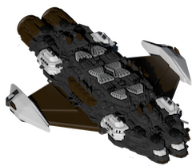

All Plugins (604)

[Cheats](https://github.com/Hecter94/EndlessSky-PluginArchive/blob/main/res/mds/cheats.md) (38) | [Gameplay](https://github.com/Hecter94/EndlessSky-PluginArchive/blob/main/res/mds/gameplay.md) (55) | [Graphics](https://github.com/Hecter94/EndlessSky-PluginArchive/blob/main/res/mds/graphics.md) (29) | [Outfits](https://github.com/Hecter94/EndlessSky-PluginArchive/blob/main/res/mds/outfits.md) (52) 
[Overhauls](https://github.com/Hecter94/EndlessSky-PluginArchive/blob/main/res/mds/overhauls.md) (46) | [Overwrites](https://github.com/Hecter94/EndlessSky-PluginArchive/blob/main/res/mds/overwrites.md) (4) | [Patches](https://github.com/Hecter94/EndlessSky-PluginArchive/blob/main/res/mds/patches.md) (3) | [Races](https://github.com/Hecter94/EndlessSky-PluginArchive/blob/main/res/mds/races.md) (70) 
[Ships](https://github.com/Hecter94/EndlessSky-PluginArchive/blob/main/res/mds/ships.md) (143) | [Starts](https://github.com/Hecter94/EndlessSky-PluginArchive/blob/main/res/md/starts.md) (17) | [Story](https://github.com/Hecter94/EndlessSky-PluginArchive/blob/main/res/mds/story.md) (80) | [Weapons](https://github.com/Hecter94/EndlessSky-PluginArchive/blob/main/res/mds/weapons.md) (42) 
[Uncategorized](https://github.com/Hecter94/EndlessSky-PluginArchive/blob/main/res/mds/uncategorized.md) (25) 

---

## Races

70 plugins in this category.

 

---

### Adamas Project
</img> 

[Adamas.Project.zip](https://github.com/Hecter94/EndlessSky-PluginArchive/releases/download/Latest/Adamas.Project.zip) | 17.86 mb | 2023-07-27 | [view files](https://github.com/Hecter94/EndlessSky-PluginArchive/tree/main/Working/Adamas%20Project/)  
Author: toiletthings | Category: Races  
[https://github.com/kestrel1110/Adamas-Project](https://github.com/kestrel1110/Adamas-Project) (last commit 2023-07-05)  

>The Adamas Project is a medium-sized plugin introducing two alien species and their regions of space, as well as some storyline involving the two.
>

:blue_book: Plugin readme

<blockquote># The Adamas Project
The Adamas Project is a plugin for Endless Sky, a free, open-source 2D space game.

This plugin has been abandoned by the original developer (toilethinges); there is now an updated version on Bereskatuket's fork:
https://github.com/kestrel1110/Adamas-Project

</blockquote>

Status: N/A  
Daily update check: </img> 

---

### AES Fallen
</img> 

[AES.Fallen.zip](https://github.com/Hecter94/EndlessSky-PluginArchive/releases/download/Latest/AES.Fallen.zip) | 885.37 kb | 2023-07-27 | [view files](https://github.com/Hecter94/EndlessSky-PluginArchive/tree/main/Working/AES%20Fallen/)  
Author: Darcy Manoel | Category: Races  
N/A   

>Inspired by an old and unfortunately unfinished fan favourite plugin that offered truly unique content. While this might not mimic the original in design, hopefully it can stoke a similarly unique experience.
>

:blue_book: Plugin readme

<blockquote># Adde Fallen
> Inspired by an old and unfortunately unfinished fan favourite plugin that offered truly unique content. While this might not mimic the original in design, hopefully it can stoke a similarly unique experience.

</blockquote>

Status: N/A  
Daily update check: </img> 

---

### Akasha Chronicles
</img> 

[Akasha.Chronicles.zip](https://github.com/Hecter94/EndlessSky-PluginArchive/releases/download/Latest/Akasha.Chronicles.zip) | 8.29 mb | 2023-07-27 | [view files](https://github.com/Hecter94/EndlessSky-PluginArchive/tree/main/Working/Akasha%20Chronicles/)  
Author: jchamlin | Category: Races  
[https://github.com/jchamlin/akasha-chronicles](https://github.com/jchamlin/akasha-chronicles) (last commit 2020-07-25)  

>Akasha Chronicles is a progressive storyline giving you access to new technology and ships over time. You can start the storyline in the Kor Efret Space (the nice Koraths) after you finish the Wanderers storyline. 
>
>

:blue_book: Plugin readme

<blockquote># Akasha Chronicles
A plugin for [Endless Sky][endless-sky] that adds a complete storyline with new alien factions.

Original author: Gillax.
Original source: https://www.reddit.com/r/endlesssky/comments/5lw3oy/plugin_akasha_chronicles_release/

![image][image]

[endless-sky]: https://github.com/endless-sky/endless-sky
[image]: images/planet/akasha.png

Akasha Chronicles is a progressive storyline giving you access to new technology and ships over time.

Featuring:
* New Goverments
* 16 New Ships
* 30 New Outfits and Weapons
* Storyline with around 30 Missions with lots of dialog and choices (hope you will make the right ones)
* 40 New Systems, Planets, Land and event sprites to bring a fitting atmosphere for the story (google images)
* Some hidden outfits which you can get during missions (going places you perhaps shouldn't)
* Changing Environment

You can start the storyline in the Kor Efret Space (the nice Koraths) after you finish the Wanderers storyline. 
The difficulty should be a good fit for people who are done with the Wanderers storyline.

## Installation
You must create a "plugins" folder in one of two places, depending on your operating system:

### Linux ###
* /usr/share/endless-sky/plugins/
* /.local/share/endless-sky/plugins/

### Windows ###
* plugins\ (in the same folder as the Endless Sky executable)
* C:\Users\yourusername\AppData\Roaming\endless-sky\plugins\

### Mac OS X ###
* Content/Resources/plugins/ (within the application bundle)
* /Library/ApplicationSupport/endless-sky/plugins

Download the latest [release][releases] and extract it into your plugins folder.

More information may be available on the [Endless Sky Wiki][wiki].

[releases]: https://github.com/jchamlin/akasha-chronicles/releases
[wiki]: https://github.com/endless-sky/endless-sky/wiki

</blockquote>

Status: N/A  
Daily update check: </img> 

---

### Akashic War

[Akashic.War.zip](https://github.com/Hecter94/EndlessSky-PluginArchive/releases/download/Latest/Akashic.War.zip) | 9.78 mb | 2023-07-27 | [view files](https://github.com/Hecter94/EndlessSky-PluginArchive/tree/main/Working/Akashic%20War/)  
Author: EricD112 | Category: Races  
[https://github.com/EricD112/Akashic-War](https://github.com/EricD112/Akashic-War) (last commit 2021-03-20)  

>Akashic War is a reworked/updated version of the Akasha Chronicles plugin for Endless Sky by Reddit u/Giliax. 
>

Status: N/A  
Daily update check: </img> 

---

### Alpha Wars

[Alpha.Wars.zip](https://github.com/Hecter94/EndlessSky-PluginArchive/releases/download/Latest/Alpha.Wars.zip) | 19.9 kb | 2023-07-27 | [view files](https://github.com/Hecter94/EndlessSky-PluginArchive/tree/main/Working/Alpha%20Wars/)  
Author: Storm Crow and warp-core | Category: Races  
[https://github.com/Makuta-Miras/ES-Alpha-Wars](https://github.com/Makuta-Miras/ES-Alpha-Wars) (last commit 2016-11-21)  

>Adds some outfits and ships for a planned Alpha Wars overhaul.
>

:blue_book: Plugin readme

<blockquote># ES-Alpha-Wars
A massive mod for Endless Sky completely overhauling the game to put the player at the heart of the Alpha Wars.

</blockquote>

Status: abandoned  
Daily update check: </img> 

---

### Ancient Saryds

[Ancient.Saryds.zip](https://github.com/Hecter94/EndlessSky-PluginArchive/releases/download/Latest/Ancient.Saryds.zip) | 3.76 mb | 2023-05-30 | [view files](https://github.com/Hecter94/EndlessSky-PluginArchive/tree/main/Working/Ancient%20Saryds/)  
Author: Zoura | Category: Races  
N/A   

>This is a plugin that adds a historic sect of the Saryd species, divorced from the Coalition and the Heliarchs that govern it. Discover their steam engines and great "Trainships" in this somewhat story-driven plugin.
>

Status: Playable on 0.10.0 continuous  
Daily update check: </img> 

---

### Arbiter

[Arbiter.zip](https://github.com/Hecter94/EndlessSky-PluginArchive/releases/download/Latest/Arbiter.zip) | 81.17 kb | 2023-07-27 | [view files](https://github.com/Hecter94/EndlessSky-PluginArchive/tree/main/Working/Arbiter/)  
Author: czartrak | Category: Races  
[https://github.com/czartrak/es-arbiter](https://github.com/czartrak/es-arbiter) (last commit 2018-02-08)  

>This mod adds another civilization called "Arbiter" into the game. To start the storyline, one has to complete the main story as well as make contact with the Quarg, Wanderers, Hai, Korath, Coalition, and has to be equipped with a jump drive. Then find a system called "Wolf" somewhear around the Free Worlds space. When you get to the Wolf system, the story will be pretty much self-explanatory.
>

:blue_book: Plugin readme

<blockquote># Arbiter mod for Endless Sky

This mod adds another civilization called "Arbiter" into the game.
To start the storyline, one has to complete the main story as well as make contact with the Quarg, Wanderers, Hai, Korath, Coalition, and has to be equipped with a jump drive. Then find a system called "Wolf" somewhear around the Free Worlds space.
When you get to the Wolf system, the story will be pretty much self-explanatory.

(check out the wiki for more information: https://github.com/Derekcz/es-arbiter/wiki)

</blockquote>

Status: N/A  
Daily update check: </img> 

---

### Arena of the worthy

[Arena.of.the.worthy.zip](https://github.com/Hecter94/EndlessSky-PluginArchive/releases/download/Latest/Arena.of.the.worthy.zip) | 1.9 mb | 2024-06-30 | [view files](https://github.com/Hecter94/EndlessSky-PluginArchive/tree/main/Working/Arena%20of%20the%20worthy/)  
Author: RisingLeaf | Category: Races  
[https://github.com/RisingLeaf/Arena-of-the-Worthy/tree/main](https://github.com/RisingLeaf/Arena-of-the-Worthy/tree/main) (last commit 2024-06-30)  

>This plugin adds a new species, the Impeti. They are even more advanced than the Drak and they found no happiness in scientific progress. Instead they started searching for the most capable person in the galaxy and find out how they achieve happiness. Therefore they started the Arena of the Worthy, where a few individuum of each species battle for honor and very special gifts.
>

:blue_book: Plugin readme

<blockquote>
</blockquote>

Status: REQUIRES PR #7348. Either wait for it to be merged or use ESLauncher2 to download the PR.  
Daily update check: </img> 

---

### Arion - Air Superiority
</img> 

[Arion.-.Air.Superiority.zip](https://github.com/Hecter94/EndlessSky-PluginArchive/releases/download/Latest/Arion.-.Air.Superiority.zip) | 4.57 mb | 2025-05-04 | [view files](https://github.com/Hecter94/EndlessSky-PluginArchive/tree/main/Working/Arion%20-%20Air%20Superiority/)  
Author: Spectre907 | Category: Races  
[https://github.com/Spectre907YT/Endless-Sky---Arion](https://github.com/Spectre907YT/Endless-Sky---Arion) (last commit 2025-05-04)  

>Plugin that adds a bunch of interesting things, mainly some modern military planes and weapons.
>

:blue_book: Plugin readme

<blockquote># Arion - Air Superiority

An Endless Sky plugin that adds a variety of things to endless sky, including: 

- Real life fighters and bombers
  
- Fighters from some other games
  
- A bunch of new H2H weapons based on real life weapons
  
- Advanced outfits
  
- Powerful and unique weapons
  
- Superweapons
  
- Custom capital ships
  
- 1 (or 2) new 'short campaigns' and some new jobs
  
- ETC

To get access to the content visit Earth, Valhalla, Hephaestus or Bourne. Perhaps helping them out by doing some jobs and missions is a good idea. You could also just have a high combat rating or finish the main campaign (although i reccomend just visiting the previously planets first for more content).

There are also some bonus content if you have the lost in midnight, mega freight, czartraks ships, amphibious ships, altera or navycampaign (by kestrel1110) plugin. To access the bonus content, move the respective files from the bonus file to the data file.

(Special thanks to 1010todd, thisismyname563 (Yuyuko Saigyouji)
, gefulltetaubenbrust, jenbones3135 and kitteh_cat from the Endless Sky discord server for letting me borrow some sprites)

</blockquote>

Status: Should work in Continuous/0.10.3+  
Daily update check: </img> 

---

### Arlug
</img> 

[Arlug.zip](https://github.com/Hecter94/EndlessSky-PluginArchive/releases/download/Latest/Arlug.zip) | 35.69 mb | 2024-11-24 | [view files](https://github.com/Hecter94/EndlessSky-PluginArchive/tree/main/Working/Arlug/)  
Author: TheSilverStone | Category: Races  
[https://github.com/TheSilverStone/Arlug](https://github.com/TheSilverStone/Arlug) (last commit 2024-11-24)  

>Adds a new T2.3 race, the Atlanteans, who came from Earth when Atlantis sank.
>

:blue_book: Plugin readme

<blockquote># Arlug

Adds my Arlug for [Endless Sky](https://github.com/endless-sky/endless-sky).

</blockquote>

Status: In Progress  
Daily update check: </img> 

---

### Athmagr Invasion

[Athmagr.Invasion.zip](https://github.com/Hecter94/EndlessSky-PluginArchive/releases/download/Latest/Athmagr.Invasion.zip) | 11.76 mb | 2025-06-07 | [view files](https://github.com/Hecter94/EndlessSky-PluginArchive/tree/main/Working/Athmagr%20Invasion/)  
Author: 1010todd | Category: Races  
[https://github.com/1010todd/Athmagr-Invasion](https://github.com/1010todd/Athmagr-Invasion) (last commit 2022-11-05)  

>Add new alien invader to Milky Way. Triggered 3 months after the current end of Wanderer Storyline.
>

Status: Playable on 0.9.15, 0.9.16, Continuous  
Daily update check: </img> 

---

### Atlanteans
</img> 

[Atlanteans.zip](https://github.com/Hecter94/EndlessSky-PluginArchive/releases/download/Latest/Atlanteans.zip) | 90.56 mb | 2024-10-12 | [view files](https://github.com/Hecter94/EndlessSky-PluginArchive/tree/main/Working/Atlanteans/)  
Author: TheSilverStone | Category: Races  
N/A   

>Adds a new T2.3 race, the Atlanteans, who came from Earth when Atlantis sank.
>

:blue_book: Plugin readme

<blockquote># Oklen

Adds my Oklen for [Endless Sky](https://github.com/endless-sky/endless-sky).

</blockquote>

Status: Work continued in Arlug plugin  
Daily update check: </img> 

---

### Better Korath

[Better.Korath.zip](https://github.com/Hecter94/EndlessSky-PluginArchive/releases/download/Latest/Better.Korath.zip) | 276.43 kb | 2023-07-27 | [view files](https://github.com/Hecter94/EndlessSky-PluginArchive/tree/main/Working/Better%20Korath/)  
Author: superdragon322 | Category: Races  
[https://github.com/ldjahnigen/Better-Korath-](https://github.com/ldjahnigen/Better-Korath-) (last commit 2020-03-07)  

>some more mereti ships, reworked outfits and weapons, lots of fleet definitions
>

:blue_book: Plugin readme

<blockquote># Better-Korath-
A mod for Korath in Endless sky

</blockquote>

Status: N/A  
Daily update check: </img> 

---

### BiteOfTheAnt

[BiteOfTheAnt.zip](https://github.com/Hecter94/EndlessSky-PluginArchive/releases/download/Latest/BiteOfTheAnt.zip) | 887.25 kb | 2023-07-27 | [view files](https://github.com/Hecter94/EndlessSky-PluginArchive/tree/main/Working/BiteOfTheAnt/)  
Author: TayganPhilglas | Category: Races  
[https://github.com/TayganPhilglas/EndlessSky-BiteOfTheAnt-Mod](https://github.com/TayganPhilglas/EndlessSky-BiteOfTheAnt-Mod) (last commit 2018-05-07)  

>This mod currently assumes that the Player has completed the main plot of the game. In this mod, the Player discovers the first race to actually be younger than Humanity and is tasked with helping them grow up a little bit and in the process learn how to help the Human race grow up more themselves.
>

:blue_book: Plugin readme

<blockquote># Bite-of-the-Ant
My first modding project, and is a mod-in-the-works for Endless Sky.
This is my starter project, which I am doing mostly to gain experience to be able to take on larger projects down the line. This is, again, a mod for the open source game "Endless Sky".
This mod currently assumes that the Player has completed the main plot of the game. In this mod, the Player discovers the first race to actually be younger than Humanity and is tasked with helping them grow up a little bit and in the process learn how to help the Human race grow up more themselves.

</blockquote>

Status: N/A  
Daily update check: </img> 

---

### Celestial Strands
</img> 

[Celestial.Strands.zip](https://github.com/Hecter94/EndlessSky-PluginArchive/releases/download/Latest/Celestial.Strands.zip) | 21.58 mb | 2024-10-26 | [view files](https://github.com/Hecter94/EndlessSky-PluginArchive/tree/main/Working/Celestial%20Strands/)  
Author: Saugia | Category: Races  
[https://github.com/Saugia/celestial-strands](https://github.com/Saugia/celestial-strands) (last commit 2024-10-26)  

>Celestial Strands is a plug-in for Endless Sky that adds a new area of content based on the original Escape Velocity games, primarily Escape Velocity: Override. 

Status: N/A  
Daily update check: </img> 

---

### Celestial Strands HighDPI

[Celestial.Strands.HighDPI.zip](https://github.com/Hecter94/EndlessSky-PluginArchive/releases/download/Latest/Celestial.Strands.HighDPI.zip) | 52.57 mb | 2023-07-27 | [view files](https://github.com/Hecter94/EndlessSky-PluginArchive/tree/main/Working/Celestial%20Strands%20HighDPI/)  
Author: Saugia | Category: Races  
[https://github.com/Saugia/celestial-strands-highdpi](https://github.com/Saugia/celestial-strands-highdpi) (last commit 2023-06-29)  

>High DPI for the Celestial Strands plug-in. 

Status: N/A  
Daily update check: </img> 

---

### Core Mining Inc
</img> 

[Core.Mining.Inc.zip](https://github.com/Hecter94/EndlessSky-PluginArchive/releases/download/Latest/Core.Mining.Inc.zip) | 310.98 kb | 2024-10-03 | [view files](https://github.com/Hecter94/EndlessSky-PluginArchive/tree/main/Working/Core%20Mining%20Inc/)  
Author: DJF113 | Category: Races  
[https://github.com/DJF113/Core-Mining-Inc](https://github.com/DJF113/Core-Mining-Inc) (last commit 2024-10-03)  

>The Core Mining, Inc. plugin gives you the chance to follow the progress of a small startup mining company. The storyline is designed to fit in with the feel of the vanilla game. The story and plugin itself is not finished yet so you may find bugs, glitches, and other problems.
>

:blue_book: Plugin readme

<blockquote>Thanks for trying out the Core Mining, Inc. mod! The items below should give you a little bit
of an idea of what the mod is about and where I plan to go with it. I also have installation
instructions and the changelog as well.

   ___________________________________________________________________________
  |:..                                                           ``:::%%%%%%HH|
  |%%%:::::..                   Table of Contents                   `:::::%%%%|
  |HH%%%%%:::::.....____________________________________________________::::::|

1. About the Mod
2. Installation Instructions
3. Tips
4. Versions and Bug Fixes
5. Known Issues

1. About the Mod
	The Core Mining, Inc. mod adds a storyline that offers you the chance to work for a newly
started company called Core Mining. You start with them from the very beginning and help build
up the company. Along the way, you can make different choices which may impact the game at a
later time, as well as potentially make major changes to the plotline. Not everything is in
place yet, but I'm hoping to make a plugin that fits in seamlessly with the vanilla game.
There is a major alternate story that goes with the main one that still needs to be written
and I also would like input on the difficulty of the missions as well as typos and glitches
in the mod. Any other suggestions on the overall flow and quality of the mod are appreciated
as well.
						Thanks for reading, and enjoy!
													DJF113

2. Installation Instructions

	for Microsoft Windows
		1. Download the "Core Mining, Inc." mod
		2. Extract folder "Core Mining, Inc" into the Endless Sky plugins folder:
		   C:\Users\"your username"\AppData\Roaming\endless-sky\plugins
		   You will have to select "show hidden files and folders" in the folder options
		   menu to find the AppData folder unless you have already done so.

3. Tips

	The first mission is offered within two jumps of the Delta Capricorni system, and won't
		trigger until after 4 June 3014.
	
	I normally start the mod with a Berserker, then use the money you make to work my way up
		from there. Not everything is set in stone at the moment, but it's going to be easier
		to use that than a Sparrow!

4. Versions and Bug Fixes

-0.0.1-
	Started the Alpha version of Core Mining, Inc. by writing the first five missions into
		the CMI Part 1 file. I also created a temporary start file for the first stages of
		testing. This will be deleted later on and the first mission will not be offered on
		Maker every time. Also started the following files: events, fleets, governments, and
		names; all containing customized things for the mod. None of the info in these files
		will be used until CMI Part 2 though.

-0.0.2-
	Fixed some spelling errors and (hopefully) improved some of the mission dialogue.
		Hopefully more improvements in the dialogue coming soon.

-0.0.3-
	Finished the last two missions of the CMI Part 1 file. Players will now receive a 5000
		credit salary after completing the seventh mission. (Salary subject to change later
		on.) Working on a problem with the player swizzle not changing. Also added an icon
		and description that will show up on the plugins screen.

-0.0.4-
	Added all seven of the missions in the CMI Part 2 file. Mission #'s are: 8A, 8B, 9, 10A,
		10B, 11, and 12. A little bit more work with the events and fleets file, some of which
		will not be used until later on. I have not figured out anything with the swizzle
		problem yet. I may have to do some research on it.

-0.1.0-
	The Core Mining, Inc. mod is now version 0.1! The changes in this version were mostly
		spelling mistakes and an issue where the pirate fleet was twice the size I wanted it.
		I decided to move from Alpha to Beta since the basic testing and parts one and two of
		the storyline are finished. I have the general ideas for parts three, four, and five
		and some more ideas as well...

-0.1.1-
	Wrote all seven missions in the CMI Part 3 file. Several more events added, including one
		that slows down the amount of Korath Raids in the Durax system during mission 19.

-0.1.2-
	Just fixed a few spelling errors and some minor bugs that cropped up from version 0.1.1.

-0.1.3-
	Finished writing and added all of the missions in the CMI Part 4 file. You will also
		notice a CMI Part 5 file. This only has one mission at this point as it was written to
		test the final mission in the Part 4 string. I've also renamed all of the missions so
		you will either have to create new savegames or do some editing to your save file to
		keep playing your current savegame. The reason for the renaming is to make inserting
		missions at a later point easier.

-0.1.4-
	The CMI storyline will now no longer be available if you have played very far into the
		Free Worlds story. The specific event is "chosen sides", set once you have decided to
		join up with them. Also all of the missions are no longer in the "CMI Part" files, but
		in the "CMI Section" files. Parts 1-4 are in the Section 1 file and Parts 5-? will be
		in the Section 2 file once they are completed. It's not too many changes for the version,
		but I feel it cleans things up considerably.

-0.1.5-
	Removed the map file from the mod because of overlap with version 0.9.8 of Endless Sky.
		Finished and tested the missions in the CMI S2 Part 1 and CMI S2 Part 2 file.

-0.1.6-
	Changed the icon that shows up in the mod list. Added the "Tips" section to the readme
		file. Added Autosave feature to all missions. Wrote the CMI S2 Part 3, and Part 4 file,
		then combined them with parts 1 and 2 into the CMI Section 2 file. Designed an Under
		Construction mission that should (hopefully!) make it easier to get the next mission
		once an update comes out. CMI S3 Part 1 only contains the Under Construction mission.

-0.1.7-
	Fixed an issue where I forgot to add ship names for some of the npcs. Fixed a bug
		mentioned by Der_König where the destination name was wrong. Added a proof of concept
		CMI transport mission, and a mission that shows up when the new fusion reactor is
		available. Fixed an issue with the CMI reactor thumbnail not working. Also added several
		events that inject CMI into the game, even when the storyline has not been used in a
		playthrough. Multiple other bug fixes. Finished Section 3 of the main branch of the
		storyline, and started work on Section 4 as well. Made some changes to the bounty
		hunting mission, which included lowering the level of the nemesis ship, and giving you
		an unmarked escort. Added landscape to Keselrig.

-0.1.8-
	Very small update fixing a bug where a mission wouldn't show up.

5. Known Issues

	It's not finished! :-)
	Missions do not have passenger and freight quantities set yet. (This should be inserted
		once the storyline is closer completion.)
	Combat missions tend to not be balanced.

</blockquote>

Status: playable on 0.9.15 Continuous.  
Daily update check: </img> 

---

### COTSA

[COTSA.zip](https://github.com/Hecter94/EndlessSky-PluginArchive/releases/download/Latest/COTSA.zip) | 1.2 mb | 2022-10-06 | [view files](https://github.com/Hecter94/EndlessSky-PluginArchive/tree/main/Working/COTSA/)  
Author: Hondolor | Category: Races  
[https://github.com/Hondolor/ES-COTSA-Pluggin](https://github.com/Hondolor/ES-COTSA-Pluggin) (last commit 2016-08-17)  

>N/A
>

Status: N/A  
Daily update check: </img> 

---

### Destination Sol

[Destination.Sol.zip](https://github.com/Hecter94/EndlessSky-PluginArchive/releases/download/Latest/Destination.Sol.zip) | 151.94 kb | 2022-10-06 | [view files](https://github.com/Hecter94/EndlessSky-PluginArchive/tree/main/Working/Destination%20Sol/)  
Author: N/A | Category: Races  
N/A   

>Various components from the game Destination Sol, including weapons, hulls, and abilities(?).
>

Status: N/A  
Daily update check: </img> 

---

### Eireen

[Eireen.zip](https://github.com/Hecter94/EndlessSky-PluginArchive/releases/download/Latest/Eireen.zip) | 3.97 mb | 2022-10-06 | [view files](https://github.com/Hecter94/EndlessSky-PluginArchive/tree/main/Working/Eireen/)  
Author: Endros Gunderberg | Category: Races  
[https://github.com/EndrosG/ES-Plugins](https://github.com/EndrosG/ES-Plugins) (last commit 2017-05-28)  

>In this plugin, you establish some relation to Eireen, one of the chief engineers for cargo affairs at Southbound Shipyards on Zug.
>You need to meet a certain minimum fleet / game progress to meet her (as of now: either 1200 cargo space, or 50M networth, or a third (lower) condition).
>But your first contact - which is so far the main conversation of this plugin (more to follow) - heavily depends on or progress in the games campaigns.
>

Status: N/A  
Daily update check: </img> 

---

### Elystian Plugin

[Elystian.Plugin.zip](https://github.com/Hecter94/EndlessSky-PluginArchive/releases/download/Latest/Elystian.Plugin.zip) | 240.46 kb | 2023-07-27 | [view files](https://github.com/Hecter94/EndlessSky-PluginArchive/tree/main/Working/Elystian%20Plugin/)  
Author: Ferociousfeind | Category: Races  
N/A   

>This Mod is for adding the Elystian goverment, a friendly government that convert Korath Automata ships to fight their former factions, west of Kor Sestor space.
>

Status: Playable on 0.9.14, 0.9.15 Continuous.  
Daily update check: </img> 

---

### Endless Depth Mod

[Endless.Depth.Mod.zip](https://github.com/Hecter94/EndlessSky-PluginArchive/releases/download/Latest/Endless.Depth.Mod.zip) | 4.99 mb | 2023-11-21 | [view files](https://github.com/Hecter94/EndlessSky-PluginArchive/tree/main/Working/Endless%20Depth%20Mod/)  
Author: Kryes Omega | Category: Races  
[https://github.com/Kryes-Omega/Endless-Depth-ES](https://github.com/Kryes-Omega/Endless-Depth-ES) (last commit 2019-09-11)  

>Endless Depth is a assortion of my random ideas that I thought might give the game a bit more depth. Hence the name. Rather than focusing on outfits, ships, and other things to blow up, I'm trying to get a little more creative, with things such as planetary flight areas, pirate gangs, and a few other small details I added.
>

Status: N/A  
Daily update check: </img> 

---

### Endless Fortress 2
</img> 

[Endless.Fortress.2.zip](https://github.com/Hecter94/EndlessSky-PluginArchive/releases/download/Latest/Endless.Fortress.2.zip) | 1.29 mb | 2022-10-06 | [view files](https://github.com/Hecter94/EndlessSky-PluginArchive/tree/main/Working/Endless%20Fortress%202/)  
Author: N/A | Category: Races  
N/A   

>N/A
>

Status: N/A  
Daily update check: </img> 

---

### Endless Horizon

[Endless.Horizon.zip](https://github.com/Hecter94/EndlessSky-PluginArchive/releases/download/Latest/Endless.Horizon.zip) | 2.61 mb | 2022-10-06 | [view files](https://github.com/Hecter94/EndlessSky-PluginArchive/tree/main/Working/Endless%20Horizon/)  
Author: CTheta | Category: Races  
[https://www.moddb.com/games/endless-sky-endless-horizon](https://www.moddb.com/games/endless-sky-endless-horizon)   

>Star Trek overhaul mod adding 10 ships and a number of outfits.
>

Status: Abandoned  
Daily update check: </img> 

---

### Ertluk

[Ertluk.zip](https://github.com/Hecter94/EndlessSky-PluginArchive/releases/download/Latest/Ertluk.zip) | 18.92 mb | 2022-10-06 | [view files](https://github.com/Hecter94/EndlessSky-PluginArchive/tree/main/Working/Ertluk/)  
Author: ZBok | Category: Races  
N/A   

>Add a race.
>

Status: N/A  
Daily update check: </img> 

---

### ES-Galactic-Exploration

[ES-Galactic-Exploration.zip](https://github.com/Hecter94/EndlessSky-PluginArchive/releases/download/Latest/ES-Galactic-Exploration.zip) | 73.94 mb | 2023-11-21 | [view files](https://github.com/Hecter94/EndlessSky-PluginArchive/tree/main/Working/ES-Galactic-Exploration/)  
Author: Roger Tabris | Category: Races  
[https://github.com/lumbar527/ES-Galactic-Exploration](https://github.com/lumbar527/ES-Galactic-Exploration) (last commit 2023-08-10)  

>A plugin, partially inspired by 1010todd's Galactic War, that adds a the Rainbow Cloud (a large group of systems with several alien races), a small cluster of systems (with another alien race), and two mysterious ships that are each larger than a dwarf galaxy!
>

:blue_book: Plugin readme

<blockquote># ES-Galactic-Exploration
A plugin, partially inspired by 1010todd's Galactic War, that adds a the Rainbow Cloud (a large group of systems with several alien races), a small cluster of systems (with another more alien race), and two mysterious ships that are each larger than a dwarf galaxy!

</blockquote>

Status: In Progress  
Daily update check: </img> 

---

### Eternals
</img> 

[Eternals.zip](https://github.com/Hecter94/EndlessSky-PluginArchive/releases/download/Latest/Eternals.zip) | 16.49 mb | 2024-09-25 | [view files](https://github.com/Hecter94/EndlessSky-PluginArchive/tree/main/Working/Eternals/)  
Author: comnom | Category: Races  
N/A   

>It adds two new factions northeast of Unfettered space, the Valuutians and the Lost Ones.
>
>Ten new systems with sixty-nine new planet sprites
>Twenty new ships, thirteen of which are immediately purchasable
>Thirty-two new outfits with associated effects
>Custom sound effects and ambient music
>
>

Status: N/A  
Daily update check: </img> 

---

### Exotic Matter

[Exotic.Matter.zip](https://github.com/Hecter94/EndlessSky-PluginArchive/releases/download/Latest/Exotic.Matter.zip) | 4.02 kb | 2023-07-27 | [view files](https://github.com/Hecter94/EndlessSky-PluginArchive/tree/main/Working/Exotic%20Matter/)  
Author: CristopherZhong | Category: Races  
[https://github.com/ChristopherZhong/endless-sky-exotic-matter-plugin](https://github.com/ChristopherZhong/endless-sky-exotic-matter-plugin) (last commit 2016-12-21)  

>N/A
>

Status: N/A  
Daily update check: </img> 

---

### Exporianes
</img> 

[Exporianes.zip](https://github.com/Hecter94/EndlessSky-PluginArchive/releases/download/Latest/Exporianes.zip) | 56.11 mb | 2023-07-27 | [view files](https://github.com/Hecter94/EndlessSky-PluginArchive/tree/main/Working/Exporianes/)  
Author: Kestrel1110 | Category: Races  
[https://github.com/kestrel1110/Exporianes](https://github.com/kestrel1110/Exporianes) (last commit 2023-01-07)  

>Adds a new race of T5 aliens to the Milky-Way galaxy. They can be reached after completing the Emerald Sword missions and having a combat rating of 13.
>

:blue_book: Plugin readme

<blockquote>Exporianes is a plugin for the space-trading game Endless-Sky. It adds a new race of T5 aliens to the Milky-Way galaxy. They can be reached after completing the Emerald Sword missions and having a combat rating of 13.

</blockquote>

Status: In development, Playable on 0.9.15 Continuous.  
Daily update check: </img> 

---

### Gaguka

[Gaguka.zip](https://github.com/Hecter94/EndlessSky-PluginArchive/releases/download/Latest/Gaguka.zip) | 3.1 mb | 2025-01-21 | [view files](https://github.com/Hecter94/EndlessSky-PluginArchive/tree/main/Working/Gaguka/)  
Author: MIMSBZ3 | Category: Races  
[https://github.com/MIMSBZ3/Gaguka](https://github.com/MIMSBZ3/Gaguka) (last commit 2025-01-21)  

>Adds new aliens called the Gaguka in their own separate galaxy.
>

:blue_book: Plugin readme

<blockquote># Gaguka

A plugin for the free and open-source video game [Endless Sky](https://github.com/endless-sky/endless-sky).
Adds aliens called the Gaguka in their own separate galaxy.

</blockquote>

Status: In Progress  
Daily update check: </img> 

---

### Galactic Invaders

[Galactic.Invaders.zip](https://github.com/Hecter94/EndlessSky-PluginArchive/releases/download/Latest/Galactic.Invaders.zip) | 825.82 kb | 2022-10-06 | [view files](https://github.com/Hecter94/EndlessSky-PluginArchive/tree/main/Working/Galactic%20Invaders/)  
Author: Matthew Murray | Category: Races  
N/A   

>N/A
>

Status: N/A  
Daily update check: </img> 

---

### Ironclad

[Ironclad.zip](https://github.com/Hecter94/EndlessSky-PluginArchive/releases/download/Latest/Ironclad.zip) | 2.62 mb | 2022-10-06 | [view files](https://github.com/Hecter94/EndlessSky-PluginArchive/tree/main/Working/Ironclad/)  
Author: 1010todd | Category: Races  
N/A   

>Add a single-system faction which use hull-only WW2-style warships.
>
>

Status: Playable on 0.9.15 Continuous.  
Daily update check: </img> 

---

### Jaling Expansion

[Jaling.Expansion.zip](https://github.com/Hecter94/EndlessSky-PluginArchive/releases/download/Latest/Jaling.Expansion.zip) | 4.25 mb | 2023-07-27 | [view files](https://github.com/Hecter94/EndlessSky-PluginArchive/tree/main/Working/Jaling%20Expansion/)  
Author: RizkyPramudyaCJ | Category: Races  
N/A   

>Jaling Expansion adds another human civilization which not connected to human space.
>

Status: N/A  
Daily update check: </img> 

---

### Jibauni

[Jibauni.zip](https://github.com/Hecter94/EndlessSky-PluginArchive/releases/download/Latest/Jibauni.zip) | 14.36 mb | 2025-05-04 | [view files](https://github.com/Hecter94/EndlessSky-PluginArchive/tree/main/Working/Jibauni/)  
Author: TheGiraffe3 | Category: Races  
[https://github.com/TheGiraffe3/Jibauni](https://github.com/TheGiraffe3/Jibauni) (last commit 2025-05-04)  

>Adds the Jibauni and the Diba. The Jibauni are dinosaurs with an aversion to insults, while the Doba are robots controlled by an Alpha...
>

Status: In Progress  
Daily update check: </img> 

---

### Kor Ramoret

[Kor.Ramoret.zip](https://github.com/Hecter94/EndlessSky-PluginArchive/releases/download/Latest/Kor.Ramoret.zip) | 583.96 kb | 2024-11-30 | [view files](https://github.com/Hecter94/EndlessSky-PluginArchive/tree/main/Working/Kor%20Ramoret/)  
Author: Zoura | Category: Races  
[https://github.com/AvianGeneticist/Kor-Ramoret](https://github.com/AvianGeneticist/Kor-Ramoret) (last commit 2024-07-05)  

>Adds a third Korath Automaton faction.
>

:blue_book: Plugin readme

<blockquote># Kor-Ramoret
 Adds a third Korath Automaton Faction to Endless Sky. The Kor Ramoret (or "Aggregated Korath") are a higher-tier automata faction made by combining aspects of both the Sestor and Mereti. They're a carrier-focused faction with powerful custom weapons, though they do share other Korath outfits (reactors, engines, cooling, et cetera).

</blockquote>

Status: Complete  
Daily update check: </img> 

---

### KorExiles PA

[KorExiles.PA.zip](https://github.com/Hecter94/EndlessSky-PluginArchive/releases/download/Latest/KorExiles.PA.zip) | 21.75 mb | 2023-07-27 | [view files](https://github.com/Hecter94/EndlessSky-PluginArchive/tree/main/Working/KorExiles%20PA/)  
Author: Ejothims | Category: Races  
[https://github.com/EjoThims/KorExiles-PA](https://github.com/EjoThims/KorExiles-PA) (last commit 2022-01-25)  

>Addition for Korath Exiles Post-Automata.
>

:blue_book: Plugin readme

<blockquote># KorExiles-PA
Korath Exiles Post Automata
Long term, what I'm planning for this stuff is a set of missions responding to their re-acquisition of the automata by synthesizing their focuses against the new threat of the Wanderers and the growing danger of the Remnant, mostly with long ranged weaponry which can double on world defense as well as artillery set ups.

Start introduces Screener and Ionizer.

Screener is answer to superior but slower AMs of both, especially coupled in fleets with the Firestorm torpedo introduced in KEE. It will very much rely on the redocking to reload behavior, though, and I'm gonna have to play around with the Piercer Pod stats in Revamp - it needs some serious tweaking/buffing to be worth using over normal piercers, even at it's smaller size.

Energzier is answer to Wanderer HWs and Remnant kiters, providing ranged disruption (by channeling disruptors through detainer rig) to stack onto beam combos or enhance various piercing weapons. It is slightly heavier, does negative energy and ion damage, and less slow than normal detainer, but has longer range and larger AoE.

From there, a split is introduced with one group working on the KIV 750 artillery platform and it's giant spinal mount weapon, and the other working on deployable artillery with the above spinal versions of the FO.

Eventually you're faced with a decision to strike against one of the reserach/production facilities, and in the ensuing retaliation and for a good while afterwards, the other line appears much more often in fleets and events.

https://vimeo.com/475090386

</blockquote>

Status: Playable on 0.9.15 Continuous.  
Daily update check: </img> 

---

### Low Tech Worlds

[Low.Tech.Worlds.zip](https://github.com/Hecter94/EndlessSky-PluginArchive/releases/download/Latest/Low.Tech.Worlds.zip) | 57.38 mb | 2023-11-21 | [view files](https://github.com/Hecter94/EndlessSky-PluginArchive/tree/main/Working/Low%20Tech%20Worlds/)  
Author: dennistribe | Category: Races  
[https://github.com/dennistribe/es-low-tech-worlds](https://github.com/dennistribe/es-low-tech-worlds) (last commit 2023-01-03)  

>Adds a new alien species that has lower technology than humans. Intended as early game content to be submitted to endless-sky for inclusion in the game.
>

Status: N/A  
Daily update check: </img> 

---

### Lupainians

[Lupainians.zip](https://github.com/Hecter94/EndlessSky-PluginArchive/releases/download/Latest/Lupainians.zip) | 1.42 mb | 2023-07-23 | [view files](https://github.com/Hecter94/EndlessSky-PluginArchive/tree/main/Working/Lupainians/)  
Author: 3agleEmpire | Category: Races  
[https://github.com/3agleEmpire/Lupainian-Development](https://github.com/3agleEmpire/Lupainian-Development) (last commit 2023-04-06)  

>This Is The Development for a new alien Species inside Endless Sky, I will upload updates here as they come out.

Status: N/A  
Daily update check: </img> 

---

### Make Communism Great Again

[Make.Communism.Great.Again.zip](https://github.com/Hecter94/EndlessSky-PluginArchive/releases/download/Latest/Make.Communism.Great.Again.zip) | 1.39 mb | 2023-07-27 | [view files](https://github.com/Hecter94/EndlessSky-PluginArchive/tree/main/Working/Make%20Communism%20Great%20Again/)  
Author: JonathanZhang1 | Category: Races  
[https://github.com/JonathanZhang1/Make-communism-great-again-endless-sky](https://github.com/JonathanZhang1/Make-communism-great-again-endless-sky) (last commit 2021-08-29)  

>I add a new government,a new system and three new kinds of ships into the game,and I will write some story in the future.
>

:blue_book: Plugin readme

<blockquote># Make-communism-great-again
This is a small plugin for game [endless-sky](https://endless-sky.github.io/).I haven't finished it .I have problem in making more people know it,if someone could help me,please email me.

## contents
I add a new government,a new system and three new kinds of ships into the game,and I will write some story in the future.
</blockquote>

Status: N/A  
Daily update check: </img> 

---

### Mark 2 Pug

[Mark.2.Pug.zip](https://github.com/Hecter94/EndlessSky-PluginArchive/releases/download/Latest/Mark.2.Pug.zip) | 1021.7 kb | 2022-10-06 | [view files](https://github.com/Hecter94/EndlessSky-PluginArchive/tree/main/Working/Mark%202%20Pug/)  
Author: N/A | Category: Races  
N/A   

>Add Mark 2 version of Pug ships and replace Pug fleet in Wanderer space with it.
>

Status: N/A  
Daily update check: </img> 

---

### Marsian Ancestors

[Marsian.Ancestors.zip](https://github.com/Hecter94/EndlessSky-PluginArchive/releases/download/Latest/Marsian.Ancestors.zip) | 32.54 mb | 2022-10-06 | [view files](https://github.com/Hecter94/EndlessSky-PluginArchive/tree/main/Working/Marsian%20Ancestors/)  
Author: Endros Gunderberg | Category: Races  
[https://github.com/EndrosG/ES-Plugins](https://github.com/EndrosG/ES-Plugins) (last commit 2017-05-28)  

>In this plugin, you get involved into discoveries of the origins of ancient settlements on Mars.
>

Status: N/A  
Daily update check: </img> 

---

### Mata

[Mata.zip](https://github.com/Hecter94/EndlessSky-PluginArchive/releases/download/Latest/Mata.zip) | 29.43 mb | 2023-07-27 | [view files](https://github.com/Hecter94/EndlessSky-PluginArchive/tree/main/Working/Mata/)  
Author: Karirawri | Category: Races  
[https://github.com/Karirawri/Mata](https://github.com/Karirawri/Mata) (last commit 2023-05-16)  

>Add a new advanced race south east of Ember Waste.
>

Status: N/A  
Daily update check: </img> 

---

### Mil'taj Protectorate
</img> 

[Mil.taj.Protectorate.zip](https://github.com/Hecter94/EndlessSky-PluginArchive/releases/download/Latest/Mil.taj.Protectorate.zip) | 42.28 mb | 2024-02-05 | [view files](https://github.com/Hecter94/EndlessSky-PluginArchive/tree/main/Working/Mil'taj%20Protectorate/)  
Author: Demolish238 | Category: Races  
[https://github.com/demolish238/Mil-taj-Protectorate](https://github.com/demolish238/Mil-taj-Protectorate) (last commit 2024-02-05)  

>This plugin contains the Mil'taj race placed in the right arm of the galaxy. They are tier 3 and contain a small mission chain to experience.
>

:blue_book: Plugin readme

<blockquote># Mil'taj Protectorate
Hi I am the original author of the Amalgamation plugin, while I have gotten back into Endless Sky recently my ideas of polish have changed greatly over these 4 years.

I decided that while I wasn't satisfied with Amalgamation as a whole, but a race of aliens from the plugin Shields up were still interesting to me, and something I wanted in the game all these years later.

This is my attempt to morph the Mil'taj into their own fully functional developed race, with a simple opening mission chain and plenty of lore.

It is recommended to avoid the Mil'taj storyline until you can at least defeat a Wardragon, otherwise you will have a bad time.

ATM you can choose to either align yourself with the Mil'taj against the Quarg, or make them an enemy. I do not plan to ever have a Quarg side to the campaign, they just want you to piss off.

Currently something I cannot do myself is art. So the mil'taj licences are just wanderer licences until I can get custom ones.

For the rest of the plugin all art assets are taken from dead plugins that years ago I worked on updating to the then current game version.

The idealised goal would be to replace them all with custom assets just for this plugin, but I doubt that will happen, so I'm mainly hoping someone will be interested in adding their own custom made Mil'taj licences for the plugin.

Reccomended Plugins:

https://github.com/1010todd/Beyond-the-Sky (Beyond the Sky) (Makes the Quarg actually scary as a threat and makes the higher tier Mil'taj ships make sense in comparison)

https://github.com/demolish238/QOL-Outfits (QOL outfits) (My other plugin)

https://github.com/demolish238/Korath-Retribution (Korath Retribution) (My other plugin)

https://github.com/demolish238/Capitalis-Major (Capitalis Major) (My other plugin)

Used Plugins:

https://github.com/Amazinite/Shields-Up (Shields Up) (The original creator of the Mil'taj)

https://github.com/Makuta-Miras/The-Enclave/tree/master (Enclave) (For Mil'taj weapons and outfits)

https://github.com/mdsmestad/ES-COTSA-Pluggin (Cultures of the Southern Arm) (For the Avendri Ships)

https://tearcellgames.itch.io/cosmic-canidae-assets (Mal'korbra assets)

https://github.com/MidnightPlugins/Lost-in-Midnight (Lost in Midnight) (Damaged Jump Drive Image)

If you have anyfeedback on balance problems or bugs please message me on discord (demolish238#6398)

</blockquote>

Status: 0.10.4 compatible  
Daily update check: </img> 

---

### Military Plugin

[Military.Plugin.zip](https://github.com/Hecter94/EndlessSky-PluginArchive/releases/download/Latest/Military.Plugin.zip) | 315.04 kb | 2023-07-27 | [view files](https://github.com/Hecter94/EndlessSky-PluginArchive/tree/main/Working/Military%20Plugin/)  
Author: JPG7D | Category: Races  
[https://github.com/JPG7D/endless-sky-military-plugin](https://github.com/JPG7D/endless-sky-military-plugin) (last commit 2020-10-24)  

>Military Vehicles from WWII to the Modern Era.
>

:blue_book: Plugin readme

<blockquote># endless-sky-military-plugin
The ultimate military plugin for endless sky, from World War II to the Modern era.

</blockquote>

Status: N/A  
Daily update check: </img> 

---

### Naltok

[Naltok.zip](https://github.com/Hecter94/EndlessSky-PluginArchive/releases/download/Latest/Naltok.zip) | 6.79 mb | 2025-08-09 | [view files](https://github.com/Hecter94/EndlessSky-PluginArchive/tree/main/Working/Naltok/)  
Author: Quantumshark | Category: Races  
[https://github.com/Quantumshark/ES-Naltok](https://github.com/Quantumshark/ES-Naltok) (last commit 2025-08-09)  

>A new tier 1.5 alien species, the amphibious Naltok. 

:blue_book: Plugin readme

<blockquote># ES-Naltok
 A new tier 1.5 alien species, the amphibious Naltok.

</blockquote>

Status: N/A  
Daily update check: </img> 

---

### nomads

[nomads.zip](https://github.com/Hecter94/EndlessSky-PluginArchive/releases/download/Latest/nomads.zip) | 14.78 mb | 2024-06-10 | [view files](https://github.com/Hecter94/EndlessSky-PluginArchive/tree/main/Working/nomads/)  
Author: RisingLeaf | Category: Races  
[https://github.com/RisingLeaf/nomads-real](https://github.com/RisingLeaf/nomads-real) (last commit 2024-06-08)  

>adds several nomad fleets appearing ramndomly
>

:blue_book: Plugin readme

<blockquote>## The Lore of the Nomads

# About the region of space

The nomads come from an object called a globular cluster. Globular clusters are clusters of stars circulating around the 
milkyway in a relative short distance. Because of their structure, stars inside a globular cluster move much faster than the 
average star inside the milkyway. Globular clusters also circulate in the region where scientists expect the most dark matter. 
From this point on I will take some creative freedom and "invent" some facts, because we all know that just realism is boring.
Fact 1: Because of the high amount of dark matter there, a lot of gravitational storms are appearing in the outer regions of the 
cluster. Also gravitational forces are so strong that a constant drain is applied to all ships shields.
Fact 2: Around the center, gravity is more stable which results in only having a shield drain but no storms. The center of the 
cluster is a small nebula, which some cool envoiremental effects.

# About the nomads

The nomads came to live in one of the most unfriendly regions of the galaxy. Not only that but their home planet also has a lack 
of water, which limited their expansion over this one planet very quickly.
Now, the nomads are their name. Opposing what other species progression look like, they never settled down anywhere. They 
traveled from oasis to oasis. When they came to one oasis they used all the resources there exessively and went to the next one 
as soon as the resources got depleted. Now this sounds horrible to nature, but it actually is not. The nomads are experts in 
creating their routes so that the resources of one oasis will be fully replenished when they come back to it and this system 
worked for a long time, during this time no real technological advancement was there, because everything worked fine. But at 
some point, nobody really knows why anymore, their population started increasing. Not fast but slowly. First the nomads noticed 
nothing, but then resources become less on their usual travel routes and continued dropping. The nomads reacted to this problem 
by building structures on an oasis that would increase the resource output but also increase the rate at which the resources got 
replenished. The first wave of technological advancements begun. The nomads managed to hold a balance between increased 
population and advancing technology for about two millennia. At some point the population stabilised again and technological 
advancement stopped. There were a total of three of these waves and everything worked out fine, but when the fourth wave came 
the planets resources were maxed out. There was no way to increase the output. There was only one logical solution: Space 
travel. The nomads begun searching for inhabitable systems and found one. They colonized it and made it a waypoint on their 
routes. Now this is a very rough compression of how long it took the nomads to be able to space travel, the gravitational storms 
where a huge barrier and in fact they were on the tech level of the remnant when there first ships left their home system. In 
the fith wave they colonized two more planets.
--> Current state is about two millennia after the fith wave.

# Biology of the nomads

The nomads are snakes. Their size is a meter long and 10 centimeters in radius. They do not need much water and have a high heat 
tolerance.

</blockquote>

Status: N/A  
Daily update check: </img> 

---

### Octyl

[Octyl.zip](https://github.com/Hecter94/EndlessSky-PluginArchive/releases/download/Latest/Octyl.zip) | 5.53 mb | 2023-07-27 | [view files](https://github.com/Hecter94/EndlessSky-PluginArchive/tree/main/Working/Octyl/)  
Author: Ferociousfeind | Category: Races  
[https://github.com/Ferociousfeind/Octyl-Emergence](https://github.com/Ferociousfeind/Octyl-Emergence) (last commit 2019-02-25)  

>A modest plugin about some squids out in space.
>

Status: Should be playable on 0.9.14, 0.9.15 Continuous.  
Daily update check: </img> 

---

### Overseers

[Overseers.zip](https://github.com/Hecter94/EndlessSky-PluginArchive/releases/download/Latest/Overseers.zip) | 980.65 kb | 2022-10-06 | [view files](https://github.com/Hecter94/EndlessSky-PluginArchive/tree/main/Working/Overseers/)  
Author: N/A | Category: Races  
N/A   

>N/A
>

Status: N/A  
Daily update check: </img> 

---

### Remnant

[Remnant.zip](https://github.com/Hecter94/EndlessSky-PluginArchive/releases/download/Latest/Remnant.zip) | 5.35 mb | 2023-07-27 | [view files](https://github.com/Hecter94/EndlessSky-PluginArchive/tree/main/Working/Remnant/)  
Author: Zitchas | Category: Races  
[https://github.com/Zitchas/ZRemnantX](https://github.com/Zitchas/ZRemnantX) (last commit 2020-05-11)  

>My collection of missions, excitement, and additional stuff for the Remnant.
>

:blue_book: Plugin readme

<blockquote># ZRemnantX
Zitchas' Test-Bed plugin for Endless Sky. This plug-in is not intended for general distribution, but rather serves as a temporary holding area for various ideas and thing that I am testing or have recently been tested. It isn't balanced, and sometimes breaks things. It also serves as a holding spot for a lot of lore that I work with, such as the timeline for Remnant stuff.

# The Remnant
The Remnant were originally a group of humans who fled human space in the early years of the Alpha War, circa 2455. They fled in secret, and intentionally made sure that there was no record of them or their departure. Their fear was that the Alpha's would win, and humanity would be destroyed, and thus they sought to establish new worlds where humanity might survive in hiding. To this end they cut off all contact with human systems, and avoid traveling in systems close to the edge of known human space in order to prevent anyone from being able to follow them home.

# Timeline notes (definitive)
First Contact with the Quarg: 2320

The Alpha War: 2450-2470

Player start year: 3013

# Timeline notes (speculative)

2454 Departure from human space

2455 Founding of Caelian

2456 Founding of Aventine

2457 Founding of Viminal

2600-2900 First time they were attacked by a ship with a weapon that interfered with ship engines (possibly a Korath Detainer? These are currently only found on Tek Far 78 - Osk, Tek Far 71 - Lek, Tek Far 109, Kar Ik Vot 349, and Met Par Tek 53 (Sniper).)

 endless-sky commented on May 21, 2017

The Sheragi discovered spaceflight around 100,000 years ago, about the time of the peak of the Hai empire, around the same time that the ancestors of modern humans began "banging rocks together." The Sheragi civilization survived less than a millennium after that.

The Hai discovered spaceflight about 120,000 years ago, and their civil wars stretched from about 95,000 to 90,000 years ago. 90,000 years ago, the Hai pulled back from "human" space and from the ruined worlds to the north of them, and 80,000 years ago the Wanderers moved into that northern territory.

The Korath, Saryds, Kimek, Arachi, and finally the humans, discovered spaceflight 40, 17, 14, 10, and 1 thousand years ago, respectively. Note that that means that new spacefaring species have been appearing more and more frequently in recent history, which is part of why the Archons have been having so much trouble holding things together lately.

</blockquote>

Status: N/A  
Daily update check: </img> 

---

### Sarcina

[Sarcina.zip](https://github.com/Hecter94/EndlessSky-PluginArchive/releases/download/Latest/Sarcina.zip) | 6.29 mb | 2023-07-27 | [view files](https://github.com/Hecter94/EndlessSky-PluginArchive/tree/main/Working/Sarcina/)  
Author: 10010101001 | Category: Races  
[https://github.com/10010101001/Sarcina](https://github.com/10010101001/Sarcina) (last commit 2018-12-25)  

>Playground plugin, several new ships and outfits, not focused on adding content to vanilla galaxy so much of it is unavailable without an all-content plugin.
>
>Can be considered new game plus as only the content clostest to vanilla quality is available in-game, however probably not at its' current state. All outfits and ships are available using my all-content plugin, or adding the shipyard and outfitter manually to a planet.
>
>

:blue_book: Plugin readme

<blockquote># Sarcina

Playground plugin, several new ships and outfits, not focused on adding content to vanilla galaxy so much of it is unavailable without an all-content plugin.

</blockquote>

Status: N/A  
Daily update check: </img> 

---

### Shirni

[Shirni.zip](https://github.com/Hecter94/EndlessSky-PluginArchive/releases/download/Latest/Shirni.zip) | 261.58 kb | 2023-07-27 | [view files](https://github.com/Hecter94/EndlessSky-PluginArchive/tree/main/Working/Shirni/)  
Author: Quantumshark | Category: Races  
[https://github.com/Quantumshark/ES-Shirni](https://github.com/Quantumshark/ES-Shirni) (last commit 2022-10-22)  

>A plugin adding a new alien species, the Shirni, who live north of Deep space.
>

:blue_book: Plugin readme

<blockquote># ES Shirni
A plugin adding a new alien species, the Shirni, who live north of Deep space.

</blockquote>

Status: N/A  
Daily update check: </img> 

---

### Space Invaders
</img> 

[Space.Invaders.zip](https://github.com/Hecter94/EndlessSky-PluginArchive/releases/download/Latest/Space.Invaders.zip) | 76.58 kb | 2022-10-06 | [view files](https://github.com/Hecter94/EndlessSky-PluginArchive/tree/main/Working/Space%20Invaders/)  
Author: mdsmestad | Category: Races  
[https://github.com/staferfield/ES-Plugins](https://github.com/staferfield/ES-Plugins) (last commit 2018-02-19)  

>This plugin add the iconic space invader at the end of the world.
>
>Note: You need to finish FW storyline first if you want to find them.
>

Status: Playable on 0.9.14, 0.9.15 Continuous.  
Daily update check: </img> 

---

### Space Things

[Space.Things.zip](https://github.com/Hecter94/EndlessSky-PluginArchive/releases/download/Latest/Space.Things.zip) | 5.62 mb | 2022-10-06 | [view files](https://github.com/Hecter94/EndlessSky-PluginArchive/tree/main/Working/Space%20Things/)  
Author: Michael Arsollon | Category: Races  
N/A   

>The Space things mod implements many space themed ships, planets, etc. into the game. Of course some continuity errors 
>will arise, mostly because i have to change the story to fit into the Endless Sky world. More updates will come, 
>however i can't guarantee consistanty in updates. I hope you enjoy! (There might be some easter eggs in the Pirate systems,
>just be patient and you'll see. :)

Status: N/A  
Daily update check: </img> 

---

### Star Wars Map

[Star.Wars.Map.zip](https://github.com/Hecter94/EndlessSky-PluginArchive/releases/download/Latest/Star.Wars.Map.zip) | 10.42 mb | 2023-07-27 | [view files](https://github.com/Hecter94/EndlessSky-PluginArchive/tree/main/Working/Star%20Wars%20Map/)  
Author: DSCelestia | Category: Races  
[https://github.com/ESCelestia/Star-Wars-Map-in-Endless-Sky](https://github.com/ESCelestia/Star-Wars-Map-in-Endless-Sky) (last commit 2021-10-31)  

>The current goal is to have every system from Star Wars Legends placed as accurately as
>possible (within reason), and to have sector borders, trade routes, and important
>astronomical features such as the Void of Chopani labled.
>

:blue_book: Plugin readme

<blockquote># Star-Wars-Map-in-Endless-Sky
The current goal is to have every system from Star Wars Legends placed as accurately as
possible (within reason), and to have sector borders, trade routes, and important
astronomical features such as the Void of Chopani labled.

Delete the ui folder in images if the background looks like garbage in-game.  Anything
contained in there is meant for development, and will make seeing anything very difficult.

The images shown in the background are screenshots from http://www.swgalaxymap.com/
The orange systems are systems that appear in Canon, and the blue systems are systems
that appear exclusively in Legends.  Many of the most important systems such as Hoth
and Byss appear in both Canon and Legends, and are thus orange.  For this reason, some
orange systems have been added to the map while others have been left alone.

Most systems do not have exact locations given in any official map, and liberty has been taken in a few
instances where perfectly accurate placement of systems would result in unreadable system names due to
how close together those systems are.  See the Tharin sector for an example, the space in and around the
Periphary region in particular.  It can be searched for in game by searching for the Dles system just above
Hutt Space.  Note how the systems in that area do not line up with the systems on the inserted screenshots.

Every system in the main Endless Sky map is included in the map.txt with the exception of Rutilicus*.
This is because a number of systems in Endless Sky have the same name as systems in Star Wars, see Rigel
and Capella as examples.  In these instances, the systems have been renamed to be slightly different from
what they actually are in Star Wars.  Rigel has been renamed Rigellia after the Rigellian race that are from
Rigel, and Capella has been renamed Greater Capella due to the presence of the Little Capella system in the
same sector.

Also included in the "Basic Outfits" are a handful of maps that will make exploring the SW galaxy not
become a massive and unbearable chore that takes about an hour even with 1,000 fuel processors and a JD,
yes I have done that before and I am still salty that I didn't just add the map outfit in the first place.

Because the current map does not have any inhabited systems, a very...potent ship will be required to
navigate the galaxy.  Included is a save file that has a ship that will be able to navigate the galaxy with
relative ease.  Note that it does not have a JD.  This is because the map is not designed with a JD in
mind.  The map was designed with the Star Wars trade routes in mind, and thus funnels players to the trade
routes rather than allowing them to roam freely as a JD would allow for.

* The Rutilicus system is not present so that it is still possible to access the Omnis plugin galaxy if you
have the Omnis plugin installed.

36% of systems are in place, with 5785 systems expected to be the final count.

</blockquote>

Status: N/A  
Daily update check: </img> 

---

### Starlus

[Starlus.zip](https://github.com/Hecter94/EndlessSky-PluginArchive/releases/download/Latest/Starlus.zip) | 1.88 mb | 2023-07-27 | [view files](https://github.com/Hecter94/EndlessSky-PluginArchive/tree/main/Working/Starlus/)  
Author: pilover100 | Category: Races  
[https://github.com/pilover100/starlus-plugin](https://github.com/pilover100/starlus-plugin) (last commit 2023-07-09)  

>A comprehensive content based plugin for Endless-Sky, focused around a tier 1.8 species located south of human space between Coalition space and the graveyard.
>
>
>

Status: N/A  
Daily update check: </img> 

---

### StarSector

[StarSector.zip](https://github.com/Hecter94/EndlessSky-PluginArchive/releases/download/Latest/StarSector.zip) | 478.55 kb | 2022-10-06 | [view files](https://github.com/Hecter94/EndlessSky-PluginArchive/tree/main/Working/StarSector/)  
Author: N/A | Category: Races  
N/A   

>adds starsector themed outfits and ships
>

Status: N/A  
Daily update check: </img> 

---

### synchrony

[synchrony.zip](https://github.com/Hecter94/EndlessSky-PluginArchive/releases/download/Latest/synchrony.zip) | 901.28 kb | 2022-10-06 | [view files](https://github.com/Hecter94/EndlessSky-PluginArchive/tree/main/Working/synchrony/)  
Author: N/A | Category: Races  
N/A   

>N/A
>

Status: N/A  
Daily update check: </img> 

---

### Terrans

[Terrans.zip](https://github.com/Hecter94/EndlessSky-PluginArchive/releases/download/Latest/Terrans.zip) | 5.65 mb | 2023-07-27 | [view files](https://github.com/Hecter94/EndlessSky-PluginArchive/tree/main/Working/Terrans/)  
Author: TimCabbage | Category: Races  
[https://github.com/TimCabbage/EndlessSkyTerrans](https://github.com/TimCabbage/EndlessSkyTerrans) (last commit 2019-02-02)  

>just pictures, no data folders
>

:blue_book: Plugin readme

<blockquote># EndlessSkyTerrans
Terrans mod for Endless Sky

</blockquote>

Status: Nonfunfional  
Daily update check: </img> 

---

### The Arion Campaign

[The.Arion.Campaign.zip](https://github.com/Hecter94/EndlessSky-PluginArchive/releases/download/Latest/The.Arion.Campaign.zip) | 8.84 mb | 2023-07-27 | [view files](https://github.com/Hecter94/EndlessSky-PluginArchive/tree/main/Working/The%20Arion%20Campaign/)  
Author: Red-57 | Category: Races  
[https://github.com/Red-57/The-Arion-Campaign](https://github.com/Red-57/The-Arion-Campaign) (last commit 2020-12-21)  

>Adds a new group of tier 2.5 aliens and a long storyline to go with it.
>

:blue_book: Plugin readme

<blockquote># The-Arion-Campaign
This is my Endless Sky mod that adds a new group of tier 2.5 aliens and a long storyline to go with it  
-there are now 9 ships that automaticaly appear in several new systems along with outfits, weapons, and the intro to the campaign!
if anyone has any suggestions please feel free to comment or submit pull requests

general outline of story
    
    -meet arion
    -help defend from some kor sestor attacks    
    -research about new portal leading to planets near coalition space   
    - run into coalition also reaserching same place   
    -fight coalition
    -Korath invade arion military base
    -long string of hard fights
    -coalition capture new territorys
    -realize pug are backing coalition
    -Drak want arion to use those planets to watch over pug
    -pug fight back
    -drak help arion fight pug
    -drak win

</blockquote>

Status: N/A  
Daily update check: </img> 

---

### The Evora Navaiya

[The.Evora.Navaiya.zip](https://github.com/Hecter94/EndlessSky-PluginArchive/releases/download/Latest/The.Evora.Navaiya.zip) | 6.16 kb | 2023-11-21 | [view files](https://github.com/Hecter94/EndlessSky-PluginArchive/tree/main/Working/The%20Evora%20Navaiya/)  
Author: Polaria1 | Category: Races  
N/A   

>The Evora Navaiya adds two alien species to the southwest of Coalition space; the Evora Navaiya and the Doyek.
>

:blue_book: Plugin readme

<blockquote># The-Evora-Navaiya
This is a workspace for my mod for Endless Sky, the Evora Navaiya.

The Evora Navaiya adds two alien species to the southwest of Coalition space; the Evora Navaiya and the Doyek.
There are more spoilers below, but all of the information, when the mod is completed, will eventually be available in the mod itself and so, if you plan on playing, I would advise against reading.

# MOD IS CURRENTLY NON-FUNCTIONAL
The Evora Navaiya are an isolated alien species, similar in structure to humans, though overall their skin tone is darker, they have colorful scales on many parts of their body, and they are much, much taller. Both males and females regularly grow in excess of eight feet tall and weigh over 500 pounds.
They live in a territory to the southwest of Coalition space but are isolated by a curious star system.

The Doyek neighbor the Evora Navaiya's isolated star system, being barely reachable from Human Space with a Jump Drive. They are a far younger species than the Evora, and not nearly as advanced. Biologically, they appear as quadruped dragon-like creatures, as if they came straight from the human world of Skymoot, but they aren't very large comparatively, only about 10 feet tall at most (with a large wingspan of about 25 feet), though they weigh in close to a ton. Unlike those Skymoot dragons though, the Doyek's intelligence is closer to the Skymoot dragons' ancestors, the Sheragi, or possibly smarter.

</blockquote>

Status: N/A  
Daily update check: </img> 

---

### The Forgotten

[The.Forgotten.zip](https://github.com/Hecter94/EndlessSky-PluginArchive/releases/download/Latest/The.Forgotten.zip) | 2.35 mb | 2023-07-27 | [view files](https://github.com/Hecter94/EndlessSky-PluginArchive/tree/main/Working/The%20Forgotten/)  
Author: Startome | Category: Races  
[https://github.com/Startome/TheForgotten](https://github.com/Startome/TheForgotten) (last commit 2017-06-06)  

>N/A
>

:blue_book: Plugin readme

<blockquote># TheForgotten
Repo for "The Forgotten" Plugin for Endless Sky

</blockquote>

Status: N/A  
Daily update check: </img> 

---

### The Great Journey

[The.Great.Journey.zip](https://github.com/Hecter94/EndlessSky-PluginArchive/releases/download/Latest/The.Great.Journey.zip) | 4.17 mb | 2022-10-06 | [view files](https://github.com/Hecter94/EndlessSky-PluginArchive/tree/main/Working/The%20Great%20Journey/)  
Author: Mr.Guineo | Category: Races  
N/A   

>This is a new and at the momment WIP content plugin based in the halo universe, adding 12 new ships and 14 new outfits, including 3 new powerful spinal weapons, all purchasable in the deep and renmant.
>
>
>

Status: N/A  
Daily update check: </img> 

---

### The Iltan Race
</img> 

[The.Iltan.Race.zip](https://github.com/Hecter94/EndlessSky-PluginArchive/releases/download/Latest/The.Iltan.Race.zip) | 39.17 mb | 2025-06-08 | [view files](https://github.com/Hecter94/EndlessSky-PluginArchive/tree/main/Working/The%20Iltan%20Race/)  
Author: Zanano Quinito | Category: Races  
[https://github.com/Zanano/IltanRace](https://github.com/Zanano/IltanRace) (last commit 2025-06-08)  

>"The Iltan Race" adds the Iltans, along with their systems, ships, outfits, missions, and a new start. They are T3/T4.
>

:blue_book: Plugin readme

<blockquote>
--Features--
Adds the Iltan race.
Ships, outfits, systems.
Placeholder 2D ship for Tetryon.

By Zanano Quinito

Permissions: 
If anyone would like to make content for the Iltan mod, submit it to me and I will validate and integrate it into the mod, along with adding you as a co-creator.

</blockquote>

Status: Playable, In Progress  
Daily update check: </img> 

---

### The Jump Gate Project

[The.Jump.Gate.Project.zip](https://github.com/Hecter94/EndlessSky-PluginArchive/releases/download/Latest/The.Jump.Gate.Project.zip) | 3.18 mb | 2022-10-06 | [view files](https://github.com/Hecter94/EndlessSky-PluginArchive/tree/main/Working/The%20Jump%20Gate%20Project/)  
Author: N/A | Category: Races  
N/A   

>N/A
>

Status: N/A  
Daily update check: </img> 

---

### The Swarm Project

[The.Swarm.Project.zip](https://github.com/Hecter94/EndlessSky-PluginArchive/releases/download/Latest/The.Swarm.Project.zip) | 1.53 mb | 2023-07-27 | [view files](https://github.com/Hecter94/EndlessSky-PluginArchive/tree/main/Working/The%20Swarm%20Project/)  
Author: jafdy | Category: Races  
[https://github.com/jafdy/the-swarm-project](https://github.com/jafdy/the-swarm-project) (last commit 2016-09-23)  

>Adds a new race with the working name "The Swarm". 
>

Status: N/A  
Daily update check: </img> 

---

### Trin

[Trin.zip](https://github.com/Hecter94/EndlessSky-PluginArchive/releases/download/Latest/Trin.zip) | 14.84 mb | 2023-07-27 | [view files](https://github.com/Hecter94/EndlessSky-PluginArchive/tree/main/Working/Trin/)  
Author: Elyssaen | Category: Races  
[https://github.com/Elyssaen/trin](https://github.com/Elyssaen/trin) (last commit 2017-05-23)  

>The Trin are a proposed hostile, Tier 3 alien species.
>

:blue_book: Plugin readme

<blockquote># Trin Enhancement for Endless Sky

## The Trin

The Trin are a proposed hostile, Tier 3 alien species. I'm designing them with the following objectives:

1. Provide a late game challenge for an experienced player's fleet, which makes a bit more story sense than farming the Quarg.
2. Offer a great range of outfits: weapons that might compete with the Quarg Skylance, and other outfits balanced to the Wanderers/Korath.
3. To be relatively ‘low impact’ in terms of territory and storyline. Their territory is long lost, and their planned stories try to fit into the existing setting.
4. To push the boat out mechanically: their missiles shoot bomb-pumped lasers, their Matrix Guns do more damage the closer they hit, a rare ship variant creates illusions of itself, and more...

## Background

They raid the galactic north from the Wanderers to the Korath, checked by the Quarg in Hai and Efreti space. The Trin were once an advanced civilisation, a long time ago. They rose to a great height, but their continued warring became ever more dangerous. Eventually, their atrocities caught the attention of the Drak, who sought to contain the threat.

The Trin refused all conditions of surrender, and while they were no match for the Drak and the Quarg, they fought an endless guerrilla war. Their civilisation was lost, but their Trin Fabricators (molecular assemblers) and underground hives helped them seed themselves across the galaxy and fight back. They bloodied the Quarg in battle, and even injured a few Archons.

Eventually, the Drak lost patience. They fell back on an ultimate sanction: a weapon that completely destroyed all intelligent Trin life.

They miscalculated. The Trin have two species – or perhaps two sexes. Their Queens were intelligent and civilised, and the Drak’s weapon killed every one. Their drones are strong, obedient, good at performing a given task but with no autonomy of their own. The Drak’s weapon did not affect the Trin drones. Millenia have passed, and Trin drones continue to fulfill their dead Queens’ dying wishes for war.

They seed new hives on uninhabited worlds, build new ships, and attack with no concept of free will, strategy, or mercy. They no longer recognise enemy or civilian. They’re a mindless husk of a dead species, fighting a war that’s already lost: a galactic pest. The Drak task the Quarg with eradicating hives before they ‘hatch’, and defending the Hai and Efreti from the few Trin that reach them. Despite their advanced technology, this has been enough to keep the fallen Trin mostly in check.

At least, so far.

## Gameplay

The Trin have no fleet presence. They appear through rare, usually invisible ‘raid’ missions. In Hai and Efreti space, Quarg will show up to help – eventually.

1. 7 new Tier 3 ships: Piranha fighters, Raja interceptors, Marlin light warships, Chimaera medium warships, Cachalot heavy freighters and Mako and Antiarch heavy warships. Only the first three can realistically be captured.
2. 7-11 new weapons: Phase Reapers, Matrix Guns/Batteries, Stasis Snares, Hunter-Killer Pods, Hunter-Seeker Pods and the mighty Arcblade. More rarely you’ll find Phase Reaper Turrets, Empyreal Fields, Wakefield Mortars and Hunter-Trapper Pods. 
3. 16 new outfits, including competitive alternatives to Wanderer/Korath reactors, Wanderer regenerators, Korath/Coalition cooling, Quarg batteries and Hai engines. Plus some other cool stuff. Everything except their better reactors can be obtained.
4. The Mebsuta Hive arc, a 10 mission arc encountering a mysterious alien threat under the worst circumstances.
5. The Hai Research arc, a 9 mission arc investigating the technology and origin of the Trin. Also repeating Hai missions warning of Trin raids once your combat rating is high enough.
6. The Wanderer Defence arc, about 6 missions dealing with a Trin hive.
7. The Trin Queen arc, about 4 missions finding out much more about the Trin’s origin, from a very different perspective.
8. The Dreadhand’s Challenge, a 2 mission story where you can respond to (or ignore) a challenge from an infamous pirate lord with some pretty unusual technology.

## Code Dependencies

**_[STABLE]_** **[Beta](https://github.com/Elyssaen/endless-sky/tree/beta)** – a combined branch of all relatively stable features / code dependencies. Feel free to compile this and have a look around. I'll make pre-compiled executables available at some point, but in the long run the hope is that all code dependencies can be accepted into Endless Sky.

1. _**[DONE]**_  **[RangeCalculation](https://github.com/Elyssaen/endless-sky/tree/feature/RangeCalculation)** – a tweak to Endless Sky’s range calculation to handle random lifetime/velocity and submunition velocity, needed to get certain Trin weapons (like the Phase Reaper and Arcblade) to be used effectively by the AI. 
2. _**[DONE]**_  **[NoCollision](https://github.com/Elyssaen/endless-sky/tree/feature/NoCollision)** – a new weapon attribute that allows for munitions that don’t hit anything, needed for proper operation of some fancy Trin weapons (like the Empyreal Field and Arcblade).
3. _**[DONE]**_  **[EffectResistances](https://github.com/Elyssaen/endless-sky/tree/feature/EffectResistances)** – Trin shield regenerators provide resistance to disruption and piercing damage. (The branch also creates slowing and ion resistance, not used by the Trin.)
4. _**[DONE]**_  **[MoreJammingTypes](https://github.com/Elyssaen/endless-sky/tree/feature/MoreJammingTypes)** – creates optical, infrared and untyped jamming, as the Trin use a fancy Tier 3 jammer. (Untyped not used.)
5. _**[DONE]**_  **[ShipsConditions](https://github.com/Elyssaen/endless-sky/tree/feature/ShipsConditions)** – ability to key a mission off your fleet size is used in the Dreadhand’s Challenge.
6. _**[DONE]**_ **[TurretFiringArc](https://github.com/Elyssaen/endless-sky/tree/feature/TurretFiringArc)** – any weapon (turret or gun) can have a "swivel degrees" attribute, allowing it to swivel within that range. Needed so that Swivel Matrix Guns can fire in a +/- 30 degree arc.
6. _**[DONE]**_ **[OperationalEnergy](https://github.com/Elyssaen/endless-sky/tree/feature/OperationalEnergy)** - rather than having negative energy generation, an outfit that should constantly drain energy now uses positive "operational energy". This is needed to fix some incompatibilities with solar collection, and also to make it possible to equip Strangelet Adapters before reactors.
7. _**[DONE]**_ **[ExcessiveSpeedDecay](https://github.com/Elyssaen/endless-sky/tree/feature/ExcessiveSpeedDecay)** – ships cannot obtain limitless speed when using a weapon with firing force to thrust. Needed to balance the Warp Ray.
8. _**[DONE, REVISE]**_  **[TechConditions](https://github.com/Elyssaen/endless-sky/tree/feature/TechConditions)** – any outfit or ship can have attributes beginning with "tech: ", and they will automatically be turned into auto-conditions that can be used for mission logic. Needed for the Trin Queen arc to trigger on having _any_ piece of Trin technology in your fleet.
9. _**[TESTING]**_  **[JammingHaywire](https://github.com/Elyssaen/endless-sky/tree/feature/JammingHaywire)** – to make jammers effective in AI-on-AI combat at Tier 3, this makes it possible to ‘confuse’ jammed missiles into veering off.
10. _**[PLANNED]**_ **MoreJammingHaywire** – combination of MoreJammingTypes and JammingHaywire.
11. _**[PLANNED]**_ **GiftShip** – a feature to let a mission give you a ship, needed for a mission reward.
12. _**[NO IDEA YET]**_  **OutfitTransparency** – Trin jammers need to make the ship equipping them translucent.
</blockquote>

Status: N/A  
Daily update check: </img> 

---

### Ultaka Invasion of Milky Way

[Ultaka.Invasion.of.Milky.Way.zip](https://github.com/Hecter94/EndlessSky-PluginArchive/releases/download/Latest/Ultaka.Invasion.of.Milky.Way.zip) | 9.79 mb | 2024-10-11 | [view files](https://github.com/Hecter94/EndlessSky-PluginArchive/tree/main/Working/Ultaka%20Invasion%20of%20Milky%20Way/)  
Author: 1010Todd | Category: Races  
[https://github.com/1010todd/Ultaka-Invasion](https://github.com/1010todd/Ultaka-Invasion) (last commit 2022-12-23)  

>Got bored of writing intross. Here's what Ultaka were originally made for (The original plugin was never released).
>
>REQUIRES: Galactic War plugin for assets, AES Omnis to access the content
>

:blue_book: Plugin readme

<blockquote># Ultaka Invasion
 Experimental content plugin for open source game Endless Sky
 
# (IMPORTANT)PREREQUIRES:
Endless Sky version 0.9.15 (Continuous) or higher

[Galactic War plugin](https://github.com/1010todd/Galactic-War)

For most of the asset.

[Omnis plugin](https://github.com/EndlessSkyCommunity/-Omnis):

To trigger the invasion.

This plugin WILL NOT work without the above two plugins.

## Optional supported plugin:

[Beyond the Sky](https://github.com/1010todd/Beyond-the-Sky):

Quarg will respond to invasion by deploying better warships that are more of a match to the Ultaka. Ultaka will also deploy extra ships in response.

Shields Up:

Ultaka will also attack everyone else in their way.

Others:

Ultaka will attack everyone (If I'm aware of something, I'll add it to aggro list.)

# About
Ultaka Invasion (or lengthier its name Ultaka Invasion of Milky Way) is an experimental plugin where Milky Way is invaded by highly advanced alien, featuring mechanics for planet invasion and allowing player to retake planets and hire warships to defend it. No story planned beside small missions to make factions react to the invasion(mostly WIP).

Just for fun, not recommended for regular gameplay as multiple feature might break vanilla missions and the balance is very questionable.

</blockquote>

Status: N/A  
Daily update check: </img> 

---

### Vile Corp

[Vile.Corp.zip](https://github.com/Hecter94/EndlessSky-PluginArchive/releases/download/Latest/Vile.Corp.zip) | 445.65 kb | 2023-07-27 | [view files](https://github.com/Hecter94/EndlessSky-PluginArchive/tree/main/Working/Vile%20Corp/)  
Author: janitor | Category: Races  
N/A   

>N/A
>

Status: N/A  
Daily update check: </img> 

---

### West Iron

[West.Iron.zip](https://github.com/Hecter94/EndlessSky-PluginArchive/releases/download/Latest/West.Iron.zip) | 2.48 mb | 2023-07-27 | [view files](https://github.com/Hecter94/EndlessSky-PluginArchive/tree/main/Working/West%20Iron/)  
Author: Kryes-Omega | Category: Races  
[https://github.com/Kryes-Omega/endless-sky-WestIron](https://github.com/Kryes-Omega/endless-sky-WestIron) (last commit 2016-12-17)  

>Add a faction with some missions.
>

:blue_book: Plugin readme

<blockquote># endless-sky-plugins
</blockquote>

Status: N/A  
Daily update check: </img> 

---

### Wherna

[Wherna.zip](https://github.com/Hecter94/EndlessSky-PluginArchive/releases/download/Latest/Wherna.zip) | 1.37 mb | 2025-04-02 | [view files](https://github.com/Hecter94/EndlessSky-PluginArchive/tree/main/Working/Wherna/)  
Author: TheSilverStone | Category: Races  
[https://github.com/TheSilverStone/Wherna](https://github.com/TheSilverStone/Wherna) (last commit 2025-04-02)  

>Adds a new alien species called the Wherna.
>

Status: In Progress  
Daily update check: </img> 

[back to top](https://github.com/Hecter94/EndlessSky-PluginArchive/blob/main/res/mds/races.md#races)

