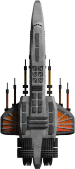

All Plugins (604)

[Cheats](https://github.com/Hecter94/EndlessSky-PluginArchive/blob/main/res/mds/cheats.md) (38) | [Gameplay](https://github.com/Hecter94/EndlessSky-PluginArchive/blob/main/res/mds/gameplay.md) (55) | [Graphics](https://github.com/Hecter94/EndlessSky-PluginArchive/blob/main/res/mds/graphics.md) (29) | [Outfits](https://github.com/Hecter94/EndlessSky-PluginArchive/blob/main/res/mds/outfits.md) (52) 
[Overhauls](https://github.com/Hecter94/EndlessSky-PluginArchive/blob/main/res/mds/overhauls.md) (46) | [Overwrites](https://github.com/Hecter94/EndlessSky-PluginArchive/blob/main/res/mds/overwrites.md) (4) | [Patches](https://github.com/Hecter94/EndlessSky-PluginArchive/blob/main/res/mds/patches.md) (3) | [Races](https://github.com/Hecter94/EndlessSky-PluginArchive/blob/main/res/mds/races.md) (70) 
[Ships](https://github.com/Hecter94/EndlessSky-PluginArchive/blob/main/res/mds/ships.md) (143) | [Starts](https://github.com/Hecter94/EndlessSky-PluginArchive/blob/main/res/md/starts.md) (17) | [Story](https://github.com/Hecter94/EndlessSky-PluginArchive/blob/main/res/mds/story.md) (80) | [Weapons](https://github.com/Hecter94/EndlessSky-PluginArchive/blob/main/res/mds/weapons.md) (42) 
[Uncategorized](https://github.com/Hecter94/EndlessSky-PluginArchive/blob/main/res/mds/uncategorized.md) (25) 

---

## Ships

143 plugins in this category.

 

---

### Ambriel

[Ambriel.zip](https://github.com/Hecter94/EndlessSky-PluginArchive/releases/download/Latest/Ambriel.zip) | 265.3 kb | 2023-07-27 | [view files](https://github.com/Hecter94/EndlessSky-PluginArchive/tree/main/Working/Ambriel/)  
Author: N/A | Category: Ships  
N/A   

>Adds a new ship.
>

Status: should work  
Daily update check: </img> 

---

### Amphibious-Ships

[Amphibious-Ships.zip](https://github.com/Hecter94/EndlessSky-PluginArchive/releases/download/Latest/Amphibious-Ships.zip) | 17.54 mb | 2024-06-04 | [view files](https://github.com/Hecter94/EndlessSky-PluginArchive/tree/main/Working/Amphibious-Ships/)  
Author: Zoura | Category: Ships  
[https://github.com/AvianGeneticist/Amphibious-Ships](https://github.com/AvianGeneticist/Amphibious-Ships) (last commit 2024-06-04)  

>Adds sea-to-space ships to Endless Sky.
>

:blue_book: Plugin readme

<blockquote># Amphibious-Ships

 This is a plugin for Endless Sky adding a T3-ish race whose ships and weapons are inspired by modern day naval ships. The ships added range from pesky missile boats all the way to super battleships and heavy carriers, with powerful fighters to compliment them.
Currently the plugin features:
- 35 new systems
- 27 new ships: 12 Warships, 4 Dedicated Carriers, 6 Logistical Ships (1 of which has a special variant), 2 Outriggers (with 5 uniquely sprited and statted variants each), 2 Fighters, and 1 Drone.
- 20 new weapons
- A new engine set (6 thrusters, 6 steerings)
- 27 unique outfits
- A powerful new foe in the form of Quarg Automata

</blockquote>

Status: Playable on 0.10.0/Continuous  
Daily update check: </img> 

---

### Archetto

[Archetto.zip](https://github.com/Hecter94/EndlessSky-PluginArchive/releases/download/Latest/Archetto.zip) | 93.94 kb | 2022-10-06 | [view files](https://github.com/Hecter94/EndlessSky-PluginArchive/tree/main/Working/Archetto/)  
Author: Hilokiyz | Category: Ships  
N/A   

>Adds a ship.
>

Status: N/A  
Daily update check: </img> 

---

### Assault Cruiser

[Assault.Cruiser.zip](https://github.com/Hecter94/EndlessSky-PluginArchive/releases/download/Latest/Assault.Cruiser.zip) | 995.67 kb | 2022-10-06 | [view files](https://github.com/Hecter94/EndlessSky-PluginArchive/tree/main/Working/Assault%20Cruiser/)  
Author: N/A | Category: Ships  
N/A   

>Adds 2 Navy ships.
>

Status: N/A  
Daily update check: </img> 

---

### B-25

[B-25.zip](https://github.com/Hecter94/EndlessSky-PluginArchive/releases/download/Latest/B-25.zip) | 21.01 kb | 2023-07-27 | [view files](https://github.com/Hecter94/EndlessSky-PluginArchive/tree/main/Working/B-25/)  
Author: N/A | Category: Ships  
N/A   

>adds the ship B-25 ynd several weapon outfits to the pirates
>

Status: N/A  
Daily update check: </img> 

---

### Bacterian T2

[Bacterian.T2.zip](https://github.com/Hecter94/EndlessSky-PluginArchive/releases/download/Latest/Bacterian.T2.zip) | 142.53 kb | 2022-10-06 | [view files](https://github.com/Hecter94/EndlessSky-PluginArchive/tree/main/Working/Bacterian%20T2/)  
Author: N/A | Category: Ships  
N/A   

>Adds a new ship.
>

Status: N/A  
Daily update check: </img> 

---

### Bailiff

[Bailiff.zip](https://github.com/Hecter94/EndlessSky-PluginArchive/releases/download/Latest/Bailiff.zip) | 2.98 kb | 2023-07-27 | [view files](https://github.com/Hecter94/EndlessSky-PluginArchive/tree/main/Working/Bailiff/)  
Author: GeoNeil | Category: Ships  
[https://github.com/geoneil/Bailiff-plugin](https://github.com/geoneil/Bailiff-plugin) (last commit 2017-02-18)  

>Adds a ship.
>

:blue_book: Plugin readme

<blockquote># Bailiff-plugin
My first plugin for the open source space exploration game, Endless Sky.

The intention is to provide an alternative means for a player to earn money and a way of punishing players who get too much into debt.

This first release has a very quick and dirty ship to be used as a Bailiff ship.  

Further changes to be implemented...

Some way of getting the Bailiff licence (I'll be testing the Bailiff ship first to refit with human outfits first)

Some way of getting Bailiff to chase impoverished players.

</blockquote>

Status: N/A  
Daily update check: </img> 

---

### Bardagh's Ship Variants

[Bardagh.s.Ship.Variants.zip](https://github.com/Hecter94/EndlessSky-PluginArchive/releases/download/Latest/Bardagh.s.Ship.Variants.zip) | 16.26 kb | 2023-07-27 | [view files](https://github.com/Hecter94/EndlessSky-PluginArchive/tree/main/Working/Bardagh's%20Ship%20Variants/)  
Author: Bardagh | Category: Ships  
[https://github.com/Bardagh/ship-variants/](https://github.com/Bardagh/ship-variants/) (last commit 2021-01-28)  

>A plugin which adds variants of human ships to select shipyards. No stat changes, just loadouts. Right now it's mostly bare-bones versions so you don't have to pay for a bunch of outfits you're just going to sell - instead you get a (very) cheap engine & power system, a hyperdrive (or scram drive for the really big ships), & luxury accommodations when they're part of the stock loadout.
>

:blue_book: Plugin readme

<blockquote>A plugin which adds variants of human ships to select shipyards. No stat changes, just loadouts. Right now it's mostly bare-bones versions so you don't have to pay for a bunch of outfits you're just going to sell - instead you get a (very) cheap engine & power system, a hyperdrive, & signature equipment like luxury accommodations for Star Liners.

Also adds a shipyard to Trinket which sells bare-bones Furies, Sparrows, & Modified Argosies.

I'll make a full list of outfit loadouts up if there's enough interest. This is my first plugin, so I wasn't documenting as I went.

</blockquote>

Status: Playable on 0.9.14, 0.9.15 Continuous.  
Daily update check: </img> 

---

### Battle Carrier

[Battle.Carrier.zip](https://github.com/Hecter94/EndlessSky-PluginArchive/releases/download/Latest/Battle.Carrier.zip) | 128.78 kb | 2022-10-06 | [view files](https://github.com/Hecter94/EndlessSky-PluginArchive/tree/main/Working/Battle%20Carrier/)  
Author: N/A | Category: Ships  
N/A   

>Adds 2 ships and an outfit.
>

Status: Ships and outfit are nowhere for sale.  
Daily update check: </img> 

---

### Battleship Test

[Battleship.Test.zip](https://github.com/Hecter94/EndlessSky-PluginArchive/releases/download/Latest/Battleship.Test.zip) | 2.8 mb | 2022-10-06 | [view files](https://github.com/Hecter94/EndlessSky-PluginArchive/tree/main/Working/Battleship%20Test/)  
Author: Quarg Block(Brick) | Category: Ships  
N/A   

>Add post-Kor Sestor Invasion navy ship.
>

Status: N/A  
Daily update check: </img> 

---

### Binary reOrder

[Binary.reOrder.zip](https://github.com/Hecter94/EndlessSky-PluginArchive/releases/download/Latest/Binary.reOrder.zip) | 1.83 mb | 2022-10-06 | [view files](https://github.com/Hecter94/EndlessSky-PluginArchive/tree/main/Working/Binary%20reOrder/)  
Author: Vaelophis Nyx & Kezethun | Category: Ships  
N/A   

>Add new faction of AI flying sailship-inspired ships.
>

Status: N/A  
Daily update check: </img> 

---

### Blended Ships
</img> 

[Blended.Ships.zip](https://github.com/Hecter94/EndlessSky-PluginArchive/releases/download/Latest/Blended.Ships.zip) | 7.57 mb | 2025-06-01 | [view files](https://github.com/Hecter94/EndlessSky-PluginArchive/tree/main/Working/Blended%20Ships/)  
Author: mOctave | Category: Ships  
[https://github.com/mOctave/blended-ships](https://github.com/mOctave/blended-ships) (last commit 2025-06-01)  

>Blended Ships is the realistic spliced ship plugin. All these ships have thumbnails, believeable stats, and actual potential uses! There is also a greater variety of civilian ships available, to support various playstyles.
>

Status: N/A  
Daily update check: </img> 

---

### BSRC

[BSRC.zip](https://github.com/Hecter94/EndlessSky-PluginArchive/releases/download/Latest/BSRC.zip) | 4.68 mb | 2023-07-27 | [view files](https://github.com/Hecter94/EndlessSky-PluginArchive/tree/main/Working/BSRC/)  
Author: phenix2 | Category: Ships  
[https://github.com/phenix2/BSRC](https://github.com/phenix2/BSRC) (last commit 2020-01-08)  

>A Endless Sky plugin with ships from drone class to battleship class

:blue_book: Plugin readme

<blockquote># BSRC
Bioship Study and Research Center

A Endless Sky plugin
with ships from drone class to battleship class

</blockquote>

Status: N/A  
Daily update check: </img> 

---

### Capitalis Major
</img> 

[Capitalis.Major.zip](https://github.com/Hecter94/EndlessSky-PluginArchive/releases/download/Latest/Capitalis.Major.zip) | 1.96 mb | 2025-04-09 | [view files](https://github.com/Hecter94/EndlessSky-PluginArchive/tree/main/Working/Capitalis%20Major/)  
Author: Demolish238 | Category: Ships  
[https://github.com/demolish238/Capitalis-Major](https://github.com/demolish238/Capitalis-Major) (last commit 2025-04-09)  

>A collection of four superheavy ships, each with their own missions to unlock them, all of which are only avaliable after the main story has been finished.
>

:blue_book: Plugin readme

<blockquote># Capitalis Major
A collection of four superheavy ships, each with their own missions to unlock them, all of which are only available after the main story has been finished.

For those who want the Sestor capital ship, don't worry if you can't capture it the first time you find it, as long as it isn't destroyed it will be available to fight in a different location later on where you can challenge it when you are prepared.
Only one Sestor capital is available unlike the other ships in this plugin.

Plugins:

https://github.com/demolish238/Mil-taj-Protectorate/tree/main (Mil'taj Protectorate) (My other plugin)

https://github.com/demolish238/QOL-Outfits (QOL outfits) (My other plugin)

https://github.com/demolish238/Korath-Retribution (Korath Retribution) (My other plugin)

Credits:

Darcy Manoel (Aesalon)

https://github.com/Amazinite/Shields-Up (Shields Up) (For Kriegsmacher and Monolith)

Icegriffon (Kar Ik Vot 927)

Unknown (Detainer Turret)

If you have anyfeedback on balance problems or bugs please message me on discord (demolish238#6398)

</blockquote>

Status: 0.10.4 compatible  
Daily update check: </img> 

---

### Carriers

[Carriers.zip](https://github.com/Hecter94/EndlessSky-PluginArchive/releases/download/Latest/Carriers.zip) | 2.55 kb | 2022-10-06 | [view files](https://github.com/Hecter94/EndlessSky-PluginArchive/tree/main/Working/Carriers/)  
Author: Arkhne | Category: Ships  
N/A   

>Adds 6 ships.
>

Status: Should work  
Daily update check: </img> 

---

### Cobbled Ships

[Cobbled.Ships.zip](https://github.com/Hecter94/EndlessSky-PluginArchive/releases/download/Latest/Cobbled.Ships.zip) | 4.44 mb | 2022-10-06 | [view files](https://github.com/Hecter94/EndlessSky-PluginArchive/tree/main/Working/Cobbled%20Ships/)  
Author: Zoura | Category: Ships  
[https://github.com/AvianGeneticist/CobbleShipModES](https://github.com/AvianGeneticist/CobbleShipModES) (last commit 2022-01-10)  

>Add several new ships.
>

Status: Playable on 0.9.15 Continuous.  
Daily update check: </img> 

---

### Cutlass
</img> 

[Cutlass.zip](https://github.com/Hecter94/EndlessSky-PluginArchive/releases/download/Latest/Cutlass.zip) | 88.68 kb | 2024-10-19 | [view files](https://github.com/Hecter94/EndlessSky-PluginArchive/tree/main/Working/Cutlass/)  
Author: TheGiraffe3 | Category: Ships  
N/A   

>Adds a new ship called the Cutlass, the pirate version of a Gunboat. This plugin is deprecated; has been replaced by the Rumskib plugin.
>

:blue_book: Plugin readme

<blockquote># ES-Cutlass

Adds the Cutlass, which is a heavily modified Gunboat used in small quantities by northern pirates.

All data and sprites come from the closed [PR](https://github.com/endless-sky/endless-sky/pull/8104).

</blockquote>

Status: Complete  
Daily update check: </img> 

---

### Czartraks Ship Pack

[Czartraks.Ship.Pack.zip](https://github.com/Hecter94/EndlessSky-PluginArchive/releases/download/Latest/Czartraks.Ship.Pack.zip) | 13.01 mb | 2023-11-13 | [view files](https://github.com/Hecter94/EndlessSky-PluginArchive/tree/main/Working/Czartraks%20Ship%20Pack/)  
Author: Czartrak | Category: Ships  
[https://github.com/czartrak/Czartraks-Ship-Pack](https://github.com/czartrak/Czartraks-Ship-Pack) (last commit 2023-11-13)  

>This mod adds various new ships to Endless Sky.
>

Status: N/A  
Daily update check: </img> 

---

### DaBestShipEver

[DaBestShipEver.zip](https://github.com/Hecter94/EndlessSky-PluginArchive/releases/download/Latest/DaBestShipEver.zip) | 342.21 kb | 2022-10-06 | [view files](https://github.com/Hecter94/EndlessSky-PluginArchive/tree/main/Working/DaBestShipEver/)  
Author: mdsmestad | Category: Ships  
N/A   

>Add DaBestShipEver.
>

Status: N/A  
Daily update check: </img> 

---

### Death Pancake v1.0.0

[Death.Pancake.v1.0.0.zip](https://github.com/Hecter94/EndlessSky-PluginArchive/releases/download/Latest/Death.Pancake.v1.0.0.zip) | 289.21 kb | 2022-10-06 | [view files](https://github.com/Hecter94/EndlessSky-PluginArchive/tree/main/Working/Death%20Pancake%20v1.0.0/)  
Author: N/A | Category: Ships  
N/A   

>Adds a ship.
>

Status: Should work  
Daily update check: </img> 

---

### Defense Drone Plugin
</img> 

[Defense.Drone.Plugin.zip](https://github.com/Hecter94/EndlessSky-PluginArchive/releases/download/Latest/Defense.Drone.Plugin.zip) | 122.81 kb | 2023-11-21 | [view files](https://github.com/Hecter94/EndlessSky-PluginArchive/tree/main/Working/Defense%20Drone%20Plugin/)  
Author: starmlerp | Category: Ships  
[https://github.com/starmlerp/ESDefenseDronePlugin](https://github.com/starmlerp/ESDefenseDronePlugin) (last commit 2020-09-13)  

>This plugin adds a few human drones, intended to be added into vanilla game.
>

Status: Playable on 0.9.14, 0.9.15 Continuous.  
Daily update check: </img> 

---

### Derogam
</img> 

[Derogam.zip](https://github.com/Hecter94/EndlessSky-PluginArchive/releases/download/Latest/Derogam.zip) | 5.76 mb | 2024-05-30 | [view files](https://github.com/Hecter94/EndlessSky-PluginArchive/tree/main/Working/Derogam/)  
Author: Lorantine | Category: Ships  
[https://github.com/Lorantine/derogam](https://github.com/Lorantine/derogam) (last commit 2024-05-30)  

>A big WIP project involving a multi-alien society with ships, outfits, jobs, a storyline and more. High-quality is the aim, so older things will be redone. Perhaps one day this'll be in the main game!
>

:blue_book: Plugin readme

<blockquote>Semi-dead, though the dream is still alive! Expect very slow progress with occasional small additions.

Current to-do (loosely sorted by which are likely first):
- 1: Rework all existing ships to something that actually looks decent; see new Guardian and Warrior models.
- 2: Replace more placeholder outfits with my own (stealing effects and sounds for placeholder though).
- 3: Improve the map more (add more commodities, planets, descriptions etc. to make it feel more alive).
- 4: Add some basic jobs to give stuff to do.
- 5: More ships!
- 6: Some basic intro missions to give some lore to the player about what this strange alien civilisation is about.

Note: Some reasonably-solid lore points already exist, though with some story missions and descriptions more details will be made and revealed.

</blockquote>

Status: Functional  
Daily update check: </img> 

---

### Derp Ship

[Derp.Ship.zip](https://github.com/Hecter94/EndlessSky-PluginArchive/releases/download/Latest/Derp.Ship.zip) | 943.79 kb | 2022-10-06 | [view files](https://github.com/Hecter94/EndlessSky-PluginArchive/tree/main/Working/Derp%20Ship/)  
Author: N/A | Category: Ships  
N/A   

>adds the person ship "Derpy Horse"
>

Status: N/A  
Daily update check: </img> 

---

### Destiny

[Destiny.zip](https://github.com/Hecter94/EndlessSky-PluginArchive/releases/download/Latest/Destiny.zip) | 148.09 kb | 2022-10-06 | [view files](https://github.com/Hecter94/EndlessSky-PluginArchive/tree/main/Working/Destiny/)  
Author: Dantoys | Category: Ships  
N/A   

>Add Destiny to the Game.
>

Status: N/A  
Daily update check: </img> 

---

### Donut 512

[Donut.512.zip](https://github.com/Hecter94/EndlessSky-PluginArchive/releases/download/Latest/Donut.512.zip) | 376.65 kb | 2023-07-27 | [view files](https://github.com/Hecter94/EndlessSky-PluginArchive/tree/main/Working/Donut%20512/)  
Author: Lorantine | Category: Ships  
[https://github.com/Lorantine/donut-512](https://github.com/Lorantine/donut-512) (last commit 2023-06-03)  

>A carefully-crafted Endless Sky plugin that replaces the Model 512 with a better model. May affect balance due to size.

:blue_book: Plugin readme

<blockquote># donut-512
A carefully-crafted Endless Sky plugin that replaces the Model 512 with a better model. May affect balance due to size.

</blockquote>

Status: N/A  
Daily update check: </img> 

---

### Dragoon

[Dragoon.zip](https://github.com/Hecter94/EndlessSky-PluginArchive/releases/download/Latest/Dragoon.zip) | 246.54 kb | 2022-10-06 | [view files](https://github.com/Hecter94/EndlessSky-PluginArchive/tree/main/Working/Dragoon/)  
Author: Hondolor | Category: Ships  
N/A   

>Adds a ship.
>

Status: Should work.  
Daily update check: </img> 

---

### Dragoon Industries

[Dragoon.Industries.zip](https://github.com/Hecter94/EndlessSky-PluginArchive/releases/download/Latest/Dragoon.Industries.zip) | 36.83 kb | 2023-07-27 | [view files](https://github.com/Hecter94/EndlessSky-PluginArchive/tree/main/Working/Dragoon%20Industries/)  
Author: Hayden Plishka | Category: Ships  
N/A   

>Adds several ships and outfits.
>

Status: Should work  
Daily update check: </img> 

---

### Elite Sky
</img> 

[Elite.Sky.zip](https://github.com/Hecter94/EndlessSky-PluginArchive/releases/download/Latest/Elite.Sky.zip) | 201.57 kb | 2022-10-06 | [view files](https://github.com/Hecter94/EndlessSky-PluginArchive/tree/main/Working/Elite%20Sky/)  
Author: N/A | Category: Ships  
N/A   

>Add ships from Elite Dangerous.
>

Status: N/A  
Daily update check: </img> 

---

### Endless-Sky-Ship

[Endless-Sky-Ship.zip](https://github.com/Hecter94/EndlessSky-PluginArchive/releases/download/Latest/Endless-Sky-Ship.zip) | 1.25 mb | 2023-07-27 | [view files](https://github.com/Hecter94/EndlessSky-PluginArchive/tree/main/Working/Endless-Sky-Ship/)  
Author: The-Borg-Captain | Category: Ships  
[https://github.com/The-Borg-Captain/Endless-Sky-Ship](https://github.com/The-Borg-Captain/Endless-Sky-Ship) (last commit 2018-06-21)  

>Adds an overpowered ship.
>

:blue_book: Plugin readme

<blockquote># Ship-rIn-HoS
A new ship for Endless sky

The name "rIn Hos" Means Over Powered in Klingon.   
This ship is supposed to by sightly op.  
I am looking for constructvie criticism and suggestions.

</blockquote>

Status: N/A  
Daily update check: </img> 

---

### Endros human basic ships

[Endros.human.basic.ships.zip](https://github.com/Hecter94/EndlessSky-PluginArchive/releases/download/Latest/Endros.human.basic.ships.zip) | 189.59 kb | 2022-10-06 | [view files](https://github.com/Hecter94/EndlessSky-PluginArchive/tree/main/Working/Endros%20human%20basic%20ships/)  
Author: Endros Gunderberg  | Category: Ships  
[https://github.com/EndrosG/ES-Plugins](https://github.com/EndrosG/ES-Plugins) (last commit 2017-05-28)  

>adds:
>- Hauler Zero Light Warship to the Southbound Shipyards. Simply a Hauler with zero cargo pods.
>- A ct-75 (large) Star Barge.
>It does not modify the fleet definitions though, because they are generally subject to change with every new ship and thus any fleet definition in this plugin might become outdated pretty soon.
>

Status: N/A  
Daily update check: </img> 

---

### Everything-n-More

[Everything-n-More.zip](https://github.com/Hecter94/EndlessSky-PluginArchive/releases/download/Latest/Everything-n-More.zip) | 148.6 kb | 2023-07-27 | [view files](https://github.com/Hecter94/EndlessSky-PluginArchive/tree/main/Working/Everything-n-More/)  
Author: Please-Close-This-Issue | Category: Ships  
[https://github.com/Please-Close-This-Issue/everything-n-more-mod-](https://github.com/Please-Close-This-Issue/everything-n-more-mod-) (last commit 2017-08-03)  

>several modified ships
>

:blue_book: Plugin readme

<blockquote># everything-n-more-mod-
all items and more for endless sky (wip)
any questions shoot them to me on the discord I guess

</blockquote>

Status: N/A  
Daily update check: </img> 

---

### Fauxwing

[Fauxwing.zip](https://github.com/Hecter94/EndlessSky-PluginArchive/releases/download/Latest/Fauxwing.zip) | 1.31 kb | 2022-10-06 | [view files](https://github.com/Hecter94/EndlessSky-PluginArchive/tree/main/Working/Fauxwing/)  
Author: N/A | Category: Ships  
N/A   

>adds the ship "Fauxwing" to the shipyard on Zug
>

Status: N/A  
Daily update check: </img> 

---

### Flip Those Ships
</img> 

[Flip.Those.Ships.zip](https://github.com/Hecter94/EndlessSky-PluginArchive/releases/download/Latest/Flip.Those.Ships.zip) | 866.92 kb | 2023-07-27 | [view files](https://github.com/Hecter94/EndlessSky-PluginArchive/tree/main/Working/Flip%20Those%20Ships/)  
Author: TheronEpic | Category: Ships  
[https://github.com/TheronEpic/Flip-Those-Ships](https://github.com/TheronEpic/Flip-Those-Ships) (last commit 2020-10-08)  

>Do you dislike the multitude of lawn dart ships? do you like the look of front-heavy ships? Or do you just want something different? Then just flip those ships around! guns on the back, engines on the front, then drive them backwards!
>

Status: N/A  
Daily update check: </img> 

---

### Fluff

[Fluff.zip](https://github.com/Hecter94/EndlessSky-PluginArchive/releases/download/Latest/Fluff.zip) | 5.88 mb | 2023-10-15 | [view files](https://github.com/Hecter94/EndlessSky-PluginArchive/tree/main/Working/Fluff/)  
Author: Darcy Manoel | Category: Ships  
N/A   

>As expected, this mod fluffs the edges of various different aspects of the game. Many new ships and outfits scattered about to add more to an already enticing experience, some content may blend well and remain unnoticed while other content will stick out sorely.
>

:blue_book: Plugin readme

<blockquote># Fluff
> As expected, this mod fluffs the edges of various different aspects of the game. Many new ships and outfits scattered about to add more to an already enticing experience, some content may blend well and remain unnoticed while other content will stick out sorely.

</blockquote>

Status: Merged into AES Fluff  
Daily update check: </img> 

---

### Flying Saucer

[Flying.Saucer.zip](https://github.com/Hecter94/EndlessSky-PluginArchive/releases/download/Latest/Flying.Saucer.zip) | 121.82 kb | 2022-10-06 | [view files](https://github.com/Hecter94/EndlessSky-PluginArchive/tree/main/Working/Flying%20Saucer/)  
Author: N/A | Category: Ships  
N/A   

>adds a ship
>

Status: N/A  
Daily update check: </img> 

---

### Galaxias
</img> 

[Galaxias.zip](https://github.com/Hecter94/EndlessSky-PluginArchive/releases/download/Latest/Galaxias.zip) | 133.34 kb | 2023-07-27 | [view files](https://github.com/Hecter94/EndlessSky-PluginArchive/tree/main/Working/Galaxias/)  
Author: mdpiper | Category: Ships  
[https://github.com/mdpiper/galaxias](https://github.com/mdpiper/galaxias) (last commit 2023-03-22)  

>An Endless Sky plugin for the Galaxias fast battlecruiser.
>

:blue_book: Plugin readme

<blockquote># galaxias

An Endless Sky plugin for the Galaxias fast battlecruiser.

</blockquote>

Status: N/A  
Daily update check: </img> 

---

### Gander

[Gander.zip](https://github.com/Hecter94/EndlessSky-PluginArchive/releases/download/Latest/Gander.zip) | 301.4 kb | 2023-07-27 | [view files](https://github.com/Hecter94/EndlessSky-PluginArchive/tree/main/Working/Gander/)  
Author: williaji | Category: Ships  
[https://github.com/williaji/Gander](https://github.com/williaji/Gander) (last commit 2023-01-07)  

>a new ship named Gander

:blue_book: Plugin readme

<blockquote># Gander
</blockquote>

Status: N/A  
Daily update check: </img> 

---

### Gulliver

[Gulliver.zip](https://github.com/Hecter94/EndlessSky-PluginArchive/releases/download/Latest/Gulliver.zip) | 30.2 mb | 2023-07-27 | [view files](https://github.com/Hecter94/EndlessSky-PluginArchive/tree/main/Working/Gulliver/)  
Author: Test-711 | Category: Ships  
[https://github.com/Test-711/gulliver](https://github.com/Test-711/gulliver) (last commit 2021-04-26)  

>Add non-spaceflight race and a T2 race. Heavily WIP.
>

:blue_book: Plugin readme

<blockquote># gulliver
</blockquote>

Status: N/A  
Daily update check: </img> 

---

### Hauler Expansion

[Hauler.Expansion.zip](https://github.com/Hecter94/EndlessSky-PluginArchive/releases/download/Latest/Hauler.Expansion.zip) | 1.29 mb | 2022-10-06 | [view files](https://github.com/Hecter94/EndlessSky-PluginArchive/tree/main/Working/Hauler%20Expansion/)  
Author: JPG7D | Category: Ships  
[https://github.com/JPG7D/Haulers-Expansion-v2](https://github.com/JPG7D/Haulers-Expansion-v2) (last commit 2020-09-27)  

>We have small Haulers, big Haulers, medium Haulers, circular Haulers! You name it, we have it!
>Come on down to Glaze in the Aldhibain system to find our heaping collection of hauling vehicles!
>

Status: N/A  
Daily update check: </img> 

---

### Heliarch Avenger

[Heliarch.Avenger.zip](https://github.com/Hecter94/EndlessSky-PluginArchive/releases/download/Latest/Heliarch.Avenger.zip) | 462.23 kb | 2022-10-06 | [view files](https://github.com/Hecter94/EndlessSky-PluginArchive/tree/main/Working/Heliarch%20Avenger/)  
Author: Arachi(Arachi-lover) | Category: Ships  
N/A   

>Add a Heliarch superheavy warship.
>

Status: N/A  
Daily update check: </img> 

---

### High Tier Warships

[High.Tier.Warships.zip](https://github.com/Hecter94/EndlessSky-PluginArchive/releases/download/Latest/High.Tier.Warships.zip) | 14.35 mb | 2022-10-06 | [view files](https://github.com/Hecter94/EndlessSky-PluginArchive/tree/main/Working/High%20Tier%20Warships/)  
Author: 1010todd | Category: Ships  
N/A   

>Additional ships and reaction to being farmed for high tier alien(Pug, Quarg). Renamed to Beyond the Sky.
>

Status: Playable on 0.9.14, 0.9.15 Continuous.  
Daily update check: </img> 

---

### HONK

[HONK.zip](https://github.com/Hecter94/EndlessSky-PluginArchive/releases/download/Latest/HONK.zip) | 2.28 mb | 2022-10-06 | [view files](https://github.com/Hecter94/EndlessSky-PluginArchive/tree/main/Working/HONK/)  
Author: Hurtz | Category: Ships  
[https://github.com/Killerhurtz/ES-HONK](https://github.com/Killerhurtz/ES-HONK) (last commit 2017-09-14)  

>Small plugin for the hilarity of it. HONK.
>

Status: N/A  
Daily update check: </img> 

---

### Human Ship Expansion
</img> 

[Human.Ship.Expansion.zip](https://github.com/Hecter94/EndlessSky-PluginArchive/releases/download/Latest/Human.Ship.Expansion.zip) | 545.82 kb | 2023-07-27 | [view files](https://github.com/Hecter94/EndlessSky-PluginArchive/tree/main/Working/Human%20Ship%20Expansion/)  
Author: loyse | Category: Ships  
N/A   

>Add a couple of human ships and two weapons
>

:blue_book: Plugin readme

<blockquote># The-more-ships-plugin
 A small expansion plugin for Endless Sky

</blockquote>

Status: N/A  
Daily update check: </img> 

---

### IJN Yamato

[IJN.Yamato.zip](https://github.com/Hecter94/EndlessSky-PluginArchive/releases/download/Latest/IJN.Yamato.zip) | 997.68 kb | 2023-11-01 | [view files](https://github.com/Hecter94/EndlessSky-PluginArchive/tree/main/Working/IJN%20Yamato/)  
Author: Hiloki Zheng | Category: Ships  
[https://github.com/hilokiyz/IJN-Yamato-Endless-Sky](https://github.com/hilokiyz/IJN-Yamato-Endless-Sky) (last commit 2023-10-31)  

>Bringing the biggest WW2 Battleship ever made in Endless Sky
>

:blue_book: Plugin readme

<blockquote># IJN-Yamato-Endless-Sky
The creation of the biggest WW2 battleship in Endless Sky

Where to acquire: 
Look for an isolated system near the south of Hai space

</blockquote>

Status: N/A  
Daily update check: </img> 

---

### Improvisatory

[Improvisatory.zip](https://github.com/Hecter94/EndlessSky-PluginArchive/releases/download/Latest/Improvisatory.zip) | 1.82 mb | 2023-03-04 | [view files](https://github.com/Hecter94/EndlessSky-PluginArchive/tree/main/Working/Improvisatory/)  
Author: N/A | Category: Ships  
N/A   

>This plugin add a few ships that are a modified variant of existing ships by individuals and private groups like pirates and some merchants.
>

Status: N/A  
Daily update check: </img> 

---

### Jenkins My Beloved

[Jenkins.My.Beloved.zip](https://github.com/Hecter94/EndlessSky-PluginArchive/releases/download/Latest/Jenkins.My.Beloved.zip) | 8.75 kb | 2022-11-05 | [view files](https://github.com/Hecter94/EndlessSky-PluginArchive/tree/main/Working/Jenkins%20My%20Beloved/)  
Author: Zoura (AvianGeneticist) | Category: Ships  
N/A   

>Add new types of fighter which is literally a guy with a gun flying around shooting things.
>

Status: Should be playable on 0.9.15/0.9.16  
Daily update check: </img> 

---

### Just a ship

[Just.a.ship.zip](https://github.com/Hecter94/EndlessSky-PluginArchive/releases/download/Latest/Just.a.ship.zip) | 87.72 kb | 2022-10-06 | [view files](https://github.com/Hecter94/EndlessSky-PluginArchive/tree/main/Working/Just%20a%20ship/)  
Author: N/A | Category: Ships  
N/A   

>Adds a new ship that is from my personal mod, it's rather overpowered even with the vanilla weapons it has, so have fun! (or something like that)
>You can find the ship at Tarazed.
>

Status: N/A  
Daily update check: </img> 

---

### Kaynz

[Kaynz.zip](https://github.com/Hecter94/EndlessSky-PluginArchive/releases/download/Latest/Kaynz.zip) | 7.08 mb | 2023-07-27 | [view files](https://github.com/Hecter94/EndlessSky-PluginArchive/tree/main/Working/Kaynz/)  
Author: Mcgode | Category: Ships  
[https://github.com/Mcgode/Kaynz](https://github.com/Mcgode/Kaynz) (last commit 2017-09-22)  

>The goal is to add an ulterior story arc to the main game, which puts it, as of the moment this is redacted, after the wanderer storyline. The plugin will add a new galaxy to the game, with a new race: the Kaynz. They are intended to be a tier 4 alien race, capable of taking down Drak ships (with some difficulty however), a detail important to the lore. 
>

:blue_book: Plugin readme

<blockquote># Kaynz

Kaynz is a plugin for [Endless Sky](http://endless-sky.github.io) which plans to add an entire story arc to the original game.

### Story arc description

The goal is to add an ulterior story arc to the main game, which puts it, as of the moment this is redacted, after the wanderer storyline.
The plugin will add a new galaxy to the game, with a new race: the Kaynz. They are intended to be a tier 4 alien race, capable of taking down Drak ships (with some difficulty however), a detail important to the lore.
The Kayn people are intended to be human-like, however slender, smaller, and with a pronounced blue skin. 
They will come in three main factions :
* The Kayn Empire: The original faction of the Kaynz, a stagnant empire in almost every way, yet still powerful
* The Kayn Republic: The first of the two factions separated from the Empire. They still maintain relationship with the Empire, but there clearly is tension between those two factions. They are ruled by an elected Senate, or they pretend it to be that way, and is thriving economicaly.
* The New Kaynz form the last main faction, which also seceded from the Empire. They are at war with both the Empire and the Republic, however there is not much fighting going on. They are ruled by a closed council, and are thriving on a military and a technological standpoint.
The storyline will involve a first contact between humans and kaynz, the future of their relationship and the conclusion of the Kayn internal conflict

### Current status

(what is done so far)
* essential specific outfits (engines, first weapons, power, shield, heat dissipation)
* first Kayn Republic ships (Honorbound and Dragonfly)
* some cargo ships (for merchants mainly)
* first contact questline (ongoing)
* most of the galaxy (including planets)
* lore introduction

### TODO list

Gameplaywise:
* more ships specific to the Kayn Republic (currently Honorbound and Dragonfly)
* ships specific to the New Kaynz
* ships specific to the Kayn Republic
* more civilian ships
* outfit balancing
* more specific outfits
* more jobs
* finalizing galaxy (New Kayn space to do particulary)
* wormhole stabilisation station sprites
* SPRITES! (Honorbound sprite is the only "not ugly" one so far)

Writingwise:
* entire New Kayn storyline (including siding with them (long term))
* entire Kayn Empire storyline (including siding with them (long term))
* continuation of the Kayn Republic storyline
* add more lore 
* fix the author's mandatory english mistakes

</blockquote>

Status: N/A  
Daily update check: </img> 

---

### Kestrel-M

[Kestrel-M.zip](https://github.com/Hecter94/EndlessSky-PluginArchive/releases/download/Latest/Kestrel-M.zip) | 54.82 kb | 2022-10-06 | [view files](https://github.com/Hecter94/EndlessSky-PluginArchive/tree/main/Working/Kestrel-M/)  
Author: mdsmestad | Category: Ships  
N/A   

>adds the ship "Kestrel-M" to Tarazad shipyard
>

Status: N/A  
Daily update check: </img> 

---

### Kor-Fighter-Additions

[Kor-Fighter-Additions.zip](https://github.com/Hecter94/EndlessSky-PluginArchive/releases/download/Latest/Kor-Fighter-Additions.zip) | 76.33 mb | 2023-10-05 | [view files](https://github.com/Hecter94/EndlessSky-PluginArchive/tree/main/Working/Kor-Fighter-Additions/)  
Author: EjoThims | Category: Ships  
[https://github.com/EjoThims/Kor-Fighter-Additions](https://github.com/EjoThims/Kor-Fighter-Additions) (last commit 2023-10-01)  

>Additional fighters for Korath Exiles.
>

:blue_book: Plugin readme

<blockquote># Kor Fighter Additions
 Additional fighters for Korath Exiles

</blockquote>

Status: Playable on 0.10.0 continuous  
Daily update check: </img> 

---

### Korunak.Defense.Drones
</img> 

[Korunak.Defense.Drones.zip](https://github.com/Hecter94/EndlessSky-PluginArchive/releases/download/Latest/Korunak.Defense.Drones.zip) | 540.33 kb | 2025-07-19 | [view files](https://github.com/Hecter94/EndlessSky-PluginArchive/tree/main/Working/Korunak.Defense.Drones/)  
Author: Starmlerp | Category: Ships  
[https://github.com/LixiChronikouOriou/ES-plugins](https://github.com/LixiChronikouOriou/ES-plugins) (last commit 2025-07-19)  

>Korunak Robotics provides combat drones from primitive missile sponges to innovative fighting machines, popular among merchants, but not only.
>

:blue_book: Plugin readme

<blockquote>
### Korunak Defense Drones ###

**Author: [Starmlerp](https://github.com/starmlerp)**

**Artwork: [Loyse](https://github.com/loiseeer), [Becca](https://github.com/beccabunny)**

**Thanks**: Kitteh

An overhaul and republication of the [Defense Drone Plugin](https://github.com/starmlerp/ESDefenseDronePlugin), with consideration of the corresponding ES PRs [#5071](https://github.com/endless-sky/endless-sky/pull/5071) and [#5417](https://github.com/endless-sky/endless-sky/pull/5417).

Being distributed over a plugin and two PRs from May to October 2020, Starmlerp's idea has never been  consolidated into a whole. Nevertheless there's even a serious modern plugin, [RW Ships](https://www.moddb.com/mods/rw-ships) which takes the original plugin into account. It was time to modernize the stats, bring everything together, and round off.

Korunak Robotics is a sister company of Korunak Photovoltaics. Except of houshold drones of any kind like the Vroomba or the Sheepomotion, it also became well-known for its space combat drones. Popular among merchants, the [classified] became interested to [paragraph classified]. Therefore, [2 pages classified], so finally [10 pages classified].

The basic *Defense Drone* is available from the beginning, the *Nock* in-war, the *Super Nock* post-war. Further, the plugin brings a drone-carrying modification of the Freighter and involves [classified].

**Changelog**

| Date | Version | Comment |
|------|---------|---------|
| 2025-07-19 | 1.1.0 | Added support for Omnis. |
| 2025-06-01 | 1.0.4 | Minor metadata fix. |
| 2025-05-18 | 1.0.3 | Cheapened the drones reasonably. Adjusted icon. |
| 2025-05-04 | 1.0.2 | Event fix. Gun- and Enginepoint corrections. |
| 2025-05-04 | 1.0.1 | Sprite de-hazification. Drone repricing. |
| 2025-05-03 | 1.0.0 | Overhaul and Re-publication as *Korunak Defense Drones*. |
| 2020-10-07 | - | ES PR #5417 |
| 2020-09-30 | - | Last Update of the *Defense Drones Plugin*. |
| 2020-05-16 | - | ES PR #5071 |

</blockquote>

Status: complete  
Daily update check: </img> 

---

### Legendary Pirates

[Legendary.Pirates.zip](https://github.com/Hecter94/EndlessSky-PluginArchive/releases/download/Latest/Legendary.Pirates.zip) | 4.0 mb | 2022-10-06 | [view files](https://github.com/Hecter94/EndlessSky-PluginArchive/tree/main/Working/Legendary%20Pirates/)  
Author: Galaucus | Category: Ships  
[https://github.com/Galaucus/Endless-Sky-Legendary-Pirates](https://github.com/Galaucus/Endless-Sky-Legendary-Pirates) (last commit 2021-06-16)  

>A plugin adding unique pirates in tricked-out ships. There's only one of them in the galaxy! 
>

Status: N/A  
Daily update check: </img> 

---

### Lertsek
</img> 

[Lertsek.zip](https://github.com/Hecter94/EndlessSky-PluginArchive/releases/download/Latest/Lertsek.zip) | 283.87 kb | 2023-07-27 | [view files](https://github.com/Hecter94/EndlessSky-PluginArchive/tree/main/Working/Lertsek/)  
Author: TheronEpic | Category: Ships  
[https://github.com/TheronEpic/lertsek](https://github.com/TheronEpic/lertsek) (last commit 2020-11-19)  

>Do you dislike the Kestrel? Are its guns too far back? Do you just want something different? Or do you just like front-heavy ships? Well then the Lertsek is for you.
>

Status: N/A  
Daily update check: </img> 

---

### Levis Customs

[Levis.Customs.zip](https://github.com/Hecter94/EndlessSky-PluginArchive/releases/download/Latest/Levis.Customs.zip) | 5.44 kb | 2023-07-27 | [view files](https://github.com/Hecter94/EndlessSky-PluginArchive/tree/main/Working/Levis%20Customs/)  
Author: Zoura | Category: Ships  
[https://github.com/AvianGeneticist/Levi-s-Customs](https://github.com/AvianGeneticist/Levi-s-Customs) (last commit 2023-06-27)  

>Build your own custom Leviathans!
>This is a simple plugin for Endless Sky that allows you to pay 20 million credits to customize a Leviathan. Choose half a dozen extra hardpoints, add Health and System Capacities, and even special augmentations to give yourself a leg-up in the early to mid game!
>

:blue_book: Plugin readme

<blockquote># Levi-s-Customs
Build your own custom Leviathans!

This is a simple plugin for Endless Sky that allows you to pay 20 million credits to customize a Leviathan. Choose half a dozen extra hardpoints, add Health and System Capacities, and even special augmentations to give yourself a leg-up in the early to mid game!

</blockquote>

Status: N/A  
Daily update check: </img> 

---

### Lleytons ES Starships

[Lleytons.ES.Starships.zip](https://github.com/Hecter94/EndlessSky-PluginArchive/releases/download/Latest/Lleytons.ES.Starships.zip) | 31.79 kb | 2023-07-27 | [view files](https://github.com/Hecter94/EndlessSky-PluginArchive/tree/main/Working/Lleytons%20ES%20Starships/)  
Author: Lleyton | Category: Ships  
[https://github.com/Llalpaca/Lleytons-es-starships](https://github.com/Llalpaca/Lleytons-es-starships) (last commit 2018-06-11)  

>adds back in a couple of old ships, I plan to add some of my own in the future.
>

:blue_book: Plugin readme

<blockquote># Lleytons-es-starships
Plugin for endless sky, currently only adds back in a couple of old ships, I plan to add some of my own in the future.

</blockquote>

Status: N/A  
Daily update check: </img> 

---

### Loronar Transport

[Loronar.Transport.zip](https://github.com/Hecter94/EndlessSky-PluginArchive/releases/download/Latest/Loronar.Transport.zip) | 283.7 kb | 2023-07-27 | [view files](https://github.com/Hecter94/EndlessSky-PluginArchive/tree/main/Working/Loronar%20Transport/)  
Author: Armalarde7895 | Category: Ships  
[https://github.com/Armalarde7895/Loronar-transport](https://github.com/Armalarde7895/Loronar-transport) (last commit 2020-06-17)  

>It adds the Loronar medium transport from Star Wars.
>

:blue_book: Plugin readme

<blockquote># Loronar medium transport
A plugin for Endless Sky. It adds the Loronar medium transport from Star Wars.
The Loronar medium transport was designed by the Loronar Corporation prior to the Clone Wars.
The Loronar medium transport is sold by Loronar Corporation, on the planet Rust in the Kraz System.

# Install
Place the downloaded file, "Loronar-transport", in your plugins folder found here:

###### Linux: /.local/share/endless-sky/
###### Windows: %AppData%\endless-sky\
###### Mac OS X: /Library/ApplicationSupport/endless-sky/
###### Steam: If using Steam right click the game in the Library and click Properties, then select Local Files and Browse Local Files.

</blockquote>

Status: N/A  
Daily update check: </img> 

---

### Louise.Conglomerate.Shipyards
</img> 

[Louise.Conglomerate.Shipyards.zip](https://github.com/Hecter94/EndlessSky-PluginArchive/releases/download/Latest/Louise.Conglomerate.Shipyards.zip) | 2.51 mb | 2025-07-19 | [view files](https://github.com/Hecter94/EndlessSky-PluginArchive/tree/main/Working/Louise.Conglomerate.Shipyards/)  
Author: Loyse | Category: Ships  
[https://github.com/LixiChronikouOriou/ES-plugins](https://github.com/LixiChronikouOriou/ES-plugins) (last commit 2025-07-19)  

>The ships manufactured by the Louise Conglomerate, based on Follower, are designed for the harsh pirate-infested frontier areas, thereby showing a remarkable sense for beauty. Requires Fundamental.Outfit.Expansion.
>

:blue_book: Plugin readme

<blockquote>
### Louise Conglomerate Shipyards ###

**Author: [Loyse](https://github.com/loiseeer)**

**Requires**: [Fundamental.Outfit.Expansion](https://github.com/LixiChronikouOriou/ES-plugins/blob/main/README.md#FundamentalOutfitExpansion)

**Thanks**: Kitteh, Corvettefan

An overhaul and republication of the [More Ships Plugin](https://github.com/loiseeer/The-more-ships-plugin). This jewel had to be polished regarding the stats, as it was updated last in May 2020. Luckily Loyse gave permission, and the idea to call the shipyard *Louise*.

Lore-wise the Louise Conglomerate is one of the Syndicate's megacorps with activities in many sectors. Its shipyards focus on ships for the harsh pirate-infested systems and therefore are centered around robustness and agility, at that keeping a remarkable sense for beautiful design. Preferred shipyard of the Space Hansa, which despises Pirates, and has no trust at all in the ability of any government to solve this long-lasting issue.

Yeer e Ki Cooperative Shipyards reached out to the Louise Conglomerate, and signed a contract for a licensed production of 3 ship models on Makerplace, equipped with Hai technology, in an ambitious advance to mess up business of Imo Loo Meer Corporation and the Mon Ki i'Hiya Consortium.

**Changelog**

| Date | Version | Comment |
|------|---------|---------|
| 2025-07-19 | 1.2.0 | Added support for Omnis. |
| 2025-06-01 | 1.1.1 | Tweaked stock sale outfits. |
| 2025-05-18 | 1.1.0 | Re-balanced the ships and their variants. Moved weapons to [FOE](https://github.com/LixiChronikouOriou/ES-plugins/blob/main/README.md#FundamentalOutfitExpansion). Pathfinder got 2 and Bulk Boxer 5 drone bays. Removed shipyards on Pirate planets. Added shipyard on Makerplace in Hai space. |
| 2025-05-04 | 1.0.3 | Added @2x images. |
| 2025-05-03 | 1.0.2 | Metadata file fixes. |
| 2025-04-27 | 1.0.1 | Fixes considering stand-alonization. |
| 2025-04-27 | 1.0.0 | Overhaul and Re-publication as *Louise Conglomerate Shipyards*. |
| 2020-05-31 | - | Last Update of the *More Ships Plugin*. |

</blockquote>

Status: complete  
Daily update check: </img> 

---

### Marauder Bactrian
</img> 

[Marauder.Bactrian.zip](https://github.com/Hecter94/EndlessSky-PluginArchive/releases/download/Latest/Marauder.Bactrian.zip) | 3.09 mb | 2023-07-27 | [view files](https://github.com/Hecter94/EndlessSky-PluginArchive/tree/main/Working/Marauder%20Bactrian/)  
Author: J.C. Hamlin | Category: Ships  
[https://github.com/jchamlin/marauder-bactrian](https://github.com/jchamlin/marauder-bactrian) (last commit 2020-08-01)  

>This plugin adds Marauder shields, engines, and weapons variants of the Bactrian.
>

:blue_book: Plugin readme

<blockquote># Marauder Bactrian
A plugin for [Endless Sky][endless-sky] that adds Marauder shields, engines, and weapons variants of the Bactrian.

![image][image]

[endless-sky]: https://github.com/endless-sky/endless-sky
[image]: icon.png

## Installation
You must create a "plugins" folder in one of two places, depending on your operating system:

### Linux ###
* /usr/share/endless-sky/plugins/
* /.local/share/endless-sky/plugins/

### Windows ###
* plugins\ (in the same folder as the Endless Sky executable)
* C:\Users\yourusername\AppData\Roaming\endless-sky\plugins\

### Mac OS X ###
* Content/Resources/plugins/ (within the application bundle)
* /Library/ApplicationSupport/endless-sky/plugins

Download the latest [release][releases] and extract it into your plugins folder.

More information may be available on the [Endless Sky Wiki][wiki].

[releases]: https://github.com/jchamlin/marauder-bactrian/releases
[wiki]: https://github.com/endless-sky/endless-sky/wiki

</blockquote>

Status: N/A  
Daily update check: </img> 

---

### Marauder Swarmer
</img> 

[Marauder.Swarmer.zip](https://github.com/Hecter94/EndlessSky-PluginArchive/releases/download/Latest/Marauder.Swarmer.zip) | 106.3 kb | 2023-07-27 | [view files](https://github.com/Hecter94/EndlessSky-PluginArchive/tree/main/Working/Marauder%20Swarmer/)  
Author: Tadrix | Category: Ships  
[https://github.com/Tadrix/es-mswarmer](https://github.com/Tadrix/es-mswarmer) (last commit 2018-05-02)  

>This plugin adds a new type of fighter, Marauder Swarmers. It doesn't make them available in shipyards and doesn't add them to NPC fleets.
>
>

:blue_book: Plugin readme

<blockquote># es-mswarmer
This plugin adds a new type of fighter, Marauder Swarmers, to the game Endless Sky (located at https://github.com/endless-sky/endless-sky). It doesn't make them available in shipyards and doesn't add them to NPC fleets.

</blockquote>

Status: N/A  
Daily update check: </img> 

---

### Marausprey
</img> 

[Marausprey.zip](https://github.com/Hecter94/EndlessSky-PluginArchive/releases/download/Latest/Marausprey.zip) | 777.44 kb | 2023-07-27 | [view files](https://github.com/Hecter94/EndlessSky-PluginArchive/tree/main/Working/Marausprey/)  
Author: TheronEpic | Category: Ships  
[https://github.com/TheronEpic/marausprey](https://github.com/TheronEpic/marausprey) (last commit 2020-10-31)  

>Three new upgraded versions of the Osprey! Now with 30% more spike, and 100% more badassery.
>

Status: N/A  
Daily update check: </img> 

---

### Marvette
</img> 

[Marvette.zip](https://github.com/Hecter94/EndlessSky-PluginArchive/releases/download/Latest/Marvette.zip) | 362.85 kb | 2023-07-27 | [view files](https://github.com/Hecter94/EndlessSky-PluginArchive/tree/main/Working/Marvette/)  
Author: TheronEpic | Category: Ships  
[https://github.com/TheronEpic/marvette](https://github.com/TheronEpic/marvette) (last commit 2020-10-06)  

>plugin that adds a Marauder Corvette, as well as two variants with different sprites and thumbnails, to the game Endless Sky. 

Status: N/A  
Daily update check: </img> 

---

### Matthews Alien Ship

[Matthews.Alien.Ship.zip](https://github.com/Hecter94/EndlessSky-PluginArchive/releases/download/Latest/Matthews.Alien.Ship.zip) | 86.67 kb | 2022-10-06 | [view files](https://github.com/Hecter94/EndlessSky-PluginArchive/tree/main/Working/Matthews%20Alien%20Ship/)  
Author: N/A | Category: Ships  
N/A   

>adds a ship to Tarazad shipyard
>

Status: N/A  
Daily update check: </img> 

---

### Maurader Osprey
</img> 

[Maurader.Osprey.zip](https://github.com/Hecter94/EndlessSky-PluginArchive/releases/download/Latest/Maurader.Osprey.zip) | 471.07 kb | 2023-07-27 | [view files](https://github.com/Hecter94/EndlessSky-PluginArchive/tree/main/Working/Maurader%20Osprey/)  
Author: TheronEpic | Category: Ships  
N/A   

>Three new upgraded versions of the Osprey! Now with 30% more spike, and 100% more badassery.
>

Status: N/A  
Daily update check: </img> 

---

### Maurder Covette
</img> 

[Maurder.Covette.zip](https://github.com/Hecter94/EndlessSky-PluginArchive/releases/download/Latest/Maurder.Covette.zip) | 363.03 kb | 2023-07-27 | [view files](https://github.com/Hecter94/EndlessSky-PluginArchive/tree/main/Working/Maurder%20Covette/)  
Author: TheronEpic | Category: Ships  
N/A   

>little description space better Corvette 2 variant in fleets TheronEpic.
>

Status: N/A  
Daily update check: </img> 

---

### MAY

[MAY.zip](https://github.com/Hecter94/EndlessSky-PluginArchive/releases/download/Latest/MAY.zip) | 30.45 kb | 2023-07-27 | [view files](https://github.com/Hecter94/EndlessSky-PluginArchive/tree/main/Working/MAY/)  
Author: N/A | Category: Ships  
N/A   

>adds several new ships and outfits
>

Status: N/A  
Daily update check: </img> 

---

### Mega Bactrian

[Mega.Bactrian.zip](https://github.com/Hecter94/EndlessSky-PluginArchive/releases/download/Latest/Mega.Bactrian.zip) | 363.7 kb | 2022-10-06 | [view files](https://github.com/Hecter94/EndlessSky-PluginArchive/tree/main/Working/Mega%20Bactrian/)  
Author: mdsmestad | Category: Ships  
N/A   

>Adds mega Bactrian ship
>

Status: N/A  
Daily update check: </img> 

---

### Mega Freight
</img> 

[Mega.Freight.zip](https://github.com/Hecter94/EndlessSky-PluginArchive/releases/download/Latest/Mega.Freight.zip) | 147.53 mb | 2025-08-05 | [view files](https://github.com/Hecter94/EndlessSky-PluginArchive/tree/main/Working/Mega%20Freight/)  
Author: 1010todd | Category: Ships  
[https://github.com/1010todd/Mega-Freight](https://github.com/1010todd/Mega-Freight) (last commit 2025-08-05)  

>Adds several mostly civilian ships for you and npc merchants( and pirates) to use for more variety in human space.
>

:blue_book: Plugin readme

<blockquote># Mega Freight
 Content plugin for opensource game [Endless Sky](https://github.com/endless-sky/endless-sky)

Adds several ships for you and various factions to use adding more variety to the galaxy as well as universe progression releasing new ships and technologies dependent and independent of storyline (mostly just human space for now).
* Faction with new ships: Merchant, Pirate, Republic, Syndicate, Free Worlds, Hai, Wanderer

Summary of what this plugin adds:

Over 150 ships:
* 50+ Freighters including specialized cargo ships (Fuel, LNG, Chemical, etc.) + 2 Superheavy
* 4 Transports
* 4 Space Liner
* 10+ Utility (Carriers, miners, etc.)
* 20+ Warships + 2 Superheavy (Purpose-built and modification of existing.)
* 1 Battlestation
* 10+ Fighters, Drones, and other carried ships (Utility and Combat)
* 1 Interceptor
* Majority of the ships with limited turret arc both for aesthetic and gameplay.

And other things:
* A few weapons and outfits.
* Special jobs that gets expanded with appropriate ship (Mining, Gas shipping, Chemical shipping, Heavy lift/Crane, Cars, Salvaging, etc.)
* Additional luxury jobs/rich passengers depending on outfits.
* Huge jobs (Passengers, Deliveries, Escorts).
* Just a lot more jobs which are often location-specific. Planet that mines radioactive things export more of that. Leading electronics manufacturer export more of advanced electronics. etc. (WIP)
* New sub-factions often with unique variants, weapons, or even ships (Espion Mining, Rangphenn, Ugyr, Jack's, Rakin, Black Death, Crossguard, Sulso, Maryhal, NGK, Core Food, Core Nuclear, Solacer, Luna Winery, GX, NBSL, KDB/Reshetka, Bellwing/Stilletto).
* NPC fleets using the new ships.
* Cargo fleets along major trade routes.
* Persistent NPC (Battlestations in 3 systems, 2 of which can respawn after some time.)
* Additional ship spawn for some story missions.
* Orbital shipyard orbiting Mars after main plot.
* A few stations (Nordlin, Ankulah, Yokosuka, GS1 Galaxy, Ourea, Forge, Ankaim, Titanite, Zagreus, Ningxi, Wilkes)
* Gradual progression of the universe both dependent and independent of story missions.
  * Stronger pirate fleet over time and merchants upgrading their weapons to keep up.
  * New ships and technologies (timed and/or locked behind story missions and locked behind jobs)
  * Factions constructing new stations.
  * Limited time events that will be resolved by governments after a while.
  * Unlocking secret/exclusive shipyards by gaining favour with specific sub-factions.
* Additional shipyard and outfitter to various locations.
* Basically overhaul human space at this point.

Requires Unstable Build/0.10.13 or above.
Version above this is usually compatible as well. Endless Sky backward compatibility is exceptional so far.

# Recommended

To fully utilize mining/utility fighters and drones provided with this plugin you can try Sam's Mining Complete fork of the game which allows you command your ships to target mineable asteroids(In vanilla now) and distribute fuel among your fleet with fighters. The fork also provides other gameplay improvements and bug fixes.

(Possibly outdated as of 19/07/2023)
[Link](https://github.com/samrocketman/endless-sky/releases/tag/continuous-with-plugins)

This plugin have a few debug functionality and unobtainable ships which can be unlocked with Omnis cheat/developer plugin.

[Link](https://github.com/EndlessSkyCommunity/-Omnis)

# Download

To download, press the green "Code" button and download as zip. If you're on mobile and cannot see the button, open the page in desktop mode.

</blockquote>

Status: Requires Continuous/0.10.1+  
Daily update check: </img> 

---

### Merchant Marine

[Merchant.Marine.zip](https://github.com/Hecter94/EndlessSky-PluginArchive/releases/download/Latest/Merchant.Marine.zip) | 79.54 kb | 2022-10-06 | [view files](https://github.com/Hecter94/EndlessSky-PluginArchive/tree/main/Working/Merchant%20Marine/)  
Author: AnotherMonkey | Category: Ships  
N/A   

>Add a few new human ships.
>

Status: Playable on 0.9.14, 0.9.15 Continuous.  
Daily update check: </img> 

---

### Mercury

[Mercury.zip](https://github.com/Hecter94/EndlessSky-PluginArchive/releases/download/Latest/Mercury.zip) | 258.48 kb | 2022-10-06 | [view files](https://github.com/Hecter94/EndlessSky-PluginArchive/tree/main/Working/Mercury/)  
Author: Orlando Pearubia | Category: Ships  
N/A   

>This is a heavy warship designed to use the best human engines. This is the main idea behind the stats design.
>It is a very fast ship with very high shields.
>It has 4 particle cannons, 4 sidewinder missile launchers, 2 heavy laser turrets and 2 heavy anti-missile turrets.
>
>The ships can be bought in World Forge plugin human shipyard and in Navy Basics shipyards.
>

Status: N/A  
Daily update check: </img> 

---

### Mining Pinger

[Mining.Pinger.zip](https://github.com/Hecter94/EndlessSky-PluginArchive/releases/download/Latest/Mining.Pinger.zip) | 744.9 kb | 2023-07-27 | [view files](https://github.com/Hecter94/EndlessSky-PluginArchive/tree/main/Working/Mining%20Pinger/)  
Author: Zoura | Category: Ships  
[https://github.com/AvianGeneticist/MiningPinger](https://github.com/AvianGeneticist/MiningPinger) (last commit 2023-04-03)  

>Some miscalleneous stuff for ES; mostly pertaining to fleets and mining 
>

Status: N/A  
Daily update check: </img> 

---

### Mining ships
</img> 

[Mining.ships.zip](https://github.com/Hecter94/EndlessSky-PluginArchive/releases/download/Latest/Mining.ships.zip) | 1017.29 kb | 2022-10-06 | [view files](https://github.com/Hecter94/EndlessSky-PluginArchive/tree/main/Working/Mining%20ships/)  
Author: 1010todd | Category: Ships  
N/A   

>Adds 3 new ships and a weapon dedicated to asteroid mining.
>

Status: Playable since the version that adds minable asteroid (0.9.3).  
Daily update check: </img> 

---

### Modified Falcon

[Modified.Falcon.zip](https://github.com/Hecter94/EndlessSky-PluginArchive/releases/download/Latest/Modified.Falcon.zip) | 295.48 kb | 2022-10-06 | [view files](https://github.com/Hecter94/EndlessSky-PluginArchive/tree/main/Working/Modified%20Falcon/)  
Author: Jason Clark | Category: Ships  
N/A   

>adds the "Modified Falcon" the the southern pirates shipyards
>

Status: N/A  
Daily update check: </img> 

---

### Modular Haulers

[Modular.Haulers.zip](https://github.com/Hecter94/EndlessSky-PluginArchive/releases/download/Latest/Modular.Haulers.zip) | 586.27 kb | 2022-10-06 | [view files](https://github.com/Hecter94/EndlessSky-PluginArchive/tree/main/Working/Modular%20Haulers/)  
Author: PhantomBerserker | Category: Ships  
[https://github.com/PhantomBerserker/ES-Modular-Haulers](https://github.com/PhantomBerserker/ES-Modular-Haulers) (last commit 2021-05-27)  

>A small plugin that aims to introduce new ships to the Southbound Shipyards plethora.
>Drop by your local Free Worlds affiliated shipyard to purchase one today!
>

Status: N/A  
Daily update check: </img> 

---

### Monitor

[Monitor.zip](https://github.com/Hecter94/EndlessSky-PluginArchive/releases/download/Latest/Monitor.zip) | 23.0 kb | 2022-10-06 | [view files](https://github.com/Hecter94/EndlessSky-PluginArchive/tree/main/Working/Monitor/)  
Author: N/A | Category: Ships  
N/A   

>Adding a fan favorite ship back into the game. The Monitor.
>

Status: N/A  
Daily update check: </img> 

---

### More Ships Plugin
</img> 

[More.Ships.Plugin.zip](https://github.com/Hecter94/EndlessSky-PluginArchive/releases/download/Latest/More.Ships.Plugin.zip) | 545.62 kb | 2023-07-27 | [view files](https://github.com/Hecter94/EndlessSky-PluginArchive/tree/main/Working/More%20Ships%20Plugin/)  
Author: Loiseeer | Category: Ships  
[https://github.com/loiseeer/The-more-ships-plugin](https://github.com/loiseeer/The-more-ships-plugin) (last commit 2020-05-31)  

>Add a couple of human ships and two weapons
>

:blue_book: Plugin readme

<blockquote># The-more-ships-plugin
 A small expansion plugin for Endless Sky

</blockquote>

Status: Playable on 0.9.14, 0.9.15 Continuous.  
Daily update check: </img> 

---

### more.person.ships
</img> 

[more.person.ships.zip](https://github.com/Hecter94/EndlessSky-PluginArchive/releases/download/Latest/more.person.ships.zip) | 4.67 mb | 2025-06-05 | [view files](https://github.com/Hecter94/EndlessSky-PluginArchive/tree/main/Working/more.person.ships/)  
Author: zuckung | Category: Ships  
[https://github.com/zuckung/endless-sky-plugins](https://github.com/zuckung/endless-sky-plugins) (last commit 2025-06-05)  

>This plugin adds more person ships to the different regions of the galaxy. See the README for details.
>

:blue_book: Plugin readme

<blockquote>### more.person.ships
 
 
This plugin adds more person ships. 
 
I renamed my plugin pirate.warlords and added more person ships. 
These ships have a frequency of 1000, are all captureable and currently there are 8 persons. 
 
List of new person ships: 
 
North Pirate Warlord | Human northern pirate territory | Modified Bactrian 
Core Pirate Warlord | Human core pirate territory | Modified Bactrian 
South Pirate Warlord | Human southern pirate territory | Modified Bactrian 
The Emperor | Unfettered Hai territory | Emperor Beetle (unused vanilla ship)(@2x in official hdpi plugin) 
Eco-One | Human territory | Eco (new ship) 
Explorer Corps | Human territory | 3xBadger (new ship) 
Coinin Tapa | east of Gegno territory| Coinin (new ship with new outfits) 
Sesk Lem | Korath territory | Ikatila'ej (new ship, vanilla sprites)(@2x in official hdpi plugin) 
Planet Express | everywhere | Old Bessie (new ship, stats by timeout.fu)
 
 
Changelog: 
 
2025-06-05 
colored job 
added outfit series 
 
2025-05-19 
icon@2x, plugintxt changes 
 
2024-10-15 
added Futurama person ship (thx timeout.fu for stats and texts) 
 
2024-10-08 
added status mission to Earth 
 
2024-08-25 
added person Sesk Lem 
added person Coinin Tapa 
 
2024-06-27 
renamed plugin from pirate.warlords to more.person.ships 
changed mass and drag to rebalanced values 
added person The Emperor 
added person Eco-One 
added person Explorer Corps 
 
2024-02-15 
initial release 

</blockquote>

Status: complete  
Daily update check: </img> 

---

### Nemesis
</img> 

[Nemesis.zip](https://github.com/Hecter94/EndlessSky-PluginArchive/releases/download/Latest/Nemesis.zip) | 155.5 kb | 2022-10-06 | [view files](https://github.com/Hecter94/EndlessSky-PluginArchive/tree/main/Working/Nemesis/)  
Author: Zavindur | Category: Ships  
N/A   

>Add a ship.
>

Status: N/A  
Daily update check: </img> 

---

### Normandy

[Normandy.zip](https://github.com/Hecter94/EndlessSky-PluginArchive/releases/download/Latest/Normandy.zip) | 355.34 kb | 2022-10-06 | [view files](https://github.com/Hecter94/EndlessSky-PluginArchive/tree/main/Working/Normandy/)  
Author: Dogmeat137mods | Category: Ships  
[https://www.moddb.com/mods/endless-sky-n7](https://www.moddb.com/mods/endless-sky-n7)   

>This is a simple plugin that adds an unique ship and a few outfits after completing a dedicated quest line.
>The Normandy is meant to be an end game flagship option to compete with the Pug Arfecta.
>

Status: N/A  
Daily update check: </img> 

---

### Penthrower

[Penthrower.zip](https://github.com/Hecter94/EndlessSky-PluginArchive/releases/download/Latest/Penthrower.zip) | 226.43 kb | 2022-10-06 | [view files](https://github.com/Hecter94/EndlessSky-PluginArchive/tree/main/Working/Penthrower/)  
Author: 1010Todd | Category: Ships  
N/A   

>Joke plugin that add a new ship and a few weapons.
>

Status: N/A  
Daily update check: </img> 

---

### Pheonix

[Pheonix.zip](https://github.com/Hecter94/EndlessSky-PluginArchive/releases/download/Latest/Pheonix.zip) | 267.1 kb | 2022-10-06 | [view files](https://github.com/Hecter94/EndlessSky-PluginArchive/tree/main/Working/Pheonix/)  
Author: Matthew Smestad | Category: Ships  
N/A   

>adds a new ship
>

Status: N/A  
Daily update check: </img> 

---

### Poseidon

[Poseidon.zip](https://github.com/Hecter94/EndlessSky-PluginArchive/releases/download/Latest/Poseidon.zip) | 272.15 kb | 2022-10-06 | [view files](https://github.com/Hecter94/EndlessSky-PluginArchive/tree/main/Working/Poseidon/)  
Author: N/A | Category: Ships  
N/A   

>adds a new ship
>

Status: N/A  
Daily update check: </img> 

---

### Project Olympus

[Project.Olympus.zip](https://github.com/Hecter94/EndlessSky-PluginArchive/releases/download/Latest/Project.Olympus.zip) | 5.79 mb | 2022-10-06 | [view files](https://github.com/Hecter94/EndlessSky-PluginArchive/tree/main/Working/Project%20Olympus/)  
Author: N/A | Category: Ships  
N/A   

>N/A
>

Status: N/A  
Daily update check: </img> 

---

### Project Runabout

[Project.Runabout.zip](https://github.com/Hecter94/EndlessSky-PluginArchive/releases/download/Latest/Project.Runabout.zip) | 213.36 kb | 2022-10-06 | [view files](https://github.com/Hecter94/EndlessSky-PluginArchive/tree/main/Working/Project%20Runabout/)  
Author: EarlGrey | Category: Ships  
N/A   

>N/A
>

Status: N/A  
Daily update check: </img> 

---

### Prong
</img> 

[Prong.zip](https://github.com/Hecter94/EndlessSky-PluginArchive/releases/download/Latest/Prong.zip) | 195.89 kb | 2023-03-04 | [view files](https://github.com/Hecter94/EndlessSky-PluginArchive/tree/main/Working/Prong/)  
Author: 1010todd | Category: Ships  
N/A   

>Add Prong interceptor, which is basically a Barb with extra gun.
>

Status: N/A  
Daily update check: </img> 

---

### prototype D
</img> 

[prototype.D.zip](https://github.com/Hecter94/EndlessSky-PluginArchive/releases/download/Latest/prototype.D.zip) | 1.41 mb | 2022-10-06 | [view files](https://github.com/Hecter94/EndlessSky-PluginArchive/tree/main/Working/prototype%20D/)  
Author: 1010todd | Category: Ships  
N/A   

>Adds a ship to Tarazed shipyard and a few weapons.
>

Status: Playable on 0.9.15 Continuous.  
Daily update check: </img> 

---

### Quaernan

[Quaernan.zip](https://github.com/Hecter94/EndlessSky-PluginArchive/releases/download/Latest/Quaernan.zip) | 842.46 kb | 2022-10-06 | [view files](https://github.com/Hecter94/EndlessSky-PluginArchive/tree/main/Working/Quaernan/)  
Author: Zoura | Category: Ships  
N/A   

>Add Quaernan, a human worldship from alternate universe.
>

Status: Playable on 0.9.15 Continuous.  
Daily update check: </img> 

---

### QuaernanHardpoints

[QuaernanHardpoints.zip](https://github.com/Hecter94/EndlessSky-PluginArchive/releases/download/Latest/QuaernanHardpoints.zip) | 915.63 kb | 2022-10-06 | [view files](https://github.com/Hecter94/EndlessSky-PluginArchive/tree/main/Working/QuaernanHardpoints/)  
Author: Zoura | Category: Ships  
N/A   

>Add Quaernan, a human worldship from alternate universe.
>

Status: Playable on 0.9.15 Continuous.  
Daily update check: </img> 

---

### QuaernanHardpointsCarries

[QuaernanHardpointsCarries.zip](https://github.com/Hecter94/EndlessSky-PluginArchive/releases/download/Latest/QuaernanHardpointsCarries.zip) | 1.03 mb | 2022-10-06 | [view files](https://github.com/Hecter94/EndlessSky-PluginArchive/tree/main/Working/QuaernanHardpointsCarries/)  
Author: Zoura | Category: Ships  
[https://github.com/AvianGeneticist/QuaernanHardpointsCarries](https://github.com/AvianGeneticist/QuaernanHardpointsCarries) (last commit 2022-08-17)  

>Add Quaernan, a human worldship from alternate universe.
>

Status: Playable on 0.9.15 Continuous.  
Daily update check: </img> 

---

### QuaernanV2 Lian

[QuaernanV2.Lian.zip](https://github.com/Hecter94/EndlessSky-PluginArchive/releases/download/Latest/QuaernanV2.Lian.zip) | 6.73 mb | 2022-10-06 | [view files](https://github.com/Hecter94/EndlessSky-PluginArchive/tree/main/Working/QuaernanV2%20Lian/)  
Author: Zoura | Category: Ships  
N/A   

>An endless sky plugin that just aims to flesh out the game with a wide variety of changes, ranging from experimental weapons to the expansion of both Human and Hai space, as well as a whole new (in-development) galaxy.
>

Status: N/A  
Daily update check: </img> 

---

### Quarg Elder Dragon

[Quarg.Elder.Dragon.zip](https://github.com/Hecter94/EndlessSky-PluginArchive/releases/download/Latest/Quarg.Elder.Dragon.zip) | 38.76 kb | 2022-10-06 | [view files](https://github.com/Hecter94/EndlessSky-PluginArchive/tree/main/Working/Quarg%20Elder%20Dragon/)  
Author: mdsmestad | Category: Ships  
N/A   

>adds the ship "Elder Dragon" to the quarg fleets. also adds an introduction mission for it if your quarg reputation is very low.
>

Status: N/A  
Daily update check: </img> 

---

### Quargarriffic

[Quargarriffic.zip](https://github.com/Hecter94/EndlessSky-PluginArchive/releases/download/Latest/Quargarriffic.zip) | 7.4 mb | 2022-10-06 | [view files](https://github.com/Hecter94/EndlessSky-PluginArchive/tree/main/Working/Quargarriffic/)  
Author: N/A | Category: Ships  
N/A   

>adds several new quarg ships to their fleets. the fleets can be very large.
>

Status: N/A  
Daily update check: </img> 

---

### Random Human Expansion
</img> 

[Random.Human.Expansion.zip](https://github.com/Hecter94/EndlessSky-PluginArchive/releases/download/Latest/Random.Human.Expansion.zip) | 5.93 mb | 2023-11-21 | [view files](https://github.com/Hecter94/EndlessSky-PluginArchive/tree/main/Working/Random%20Human%20Expansion/)  
Author: kestrel1110 | Category: Ships  
[https://github.com/kestrel1110/Random-Human-Expansion](https://github.com/kestrel1110/Random-Human-Expansion) (last commit 2020-05-08)  

>Adds a bunch of ships to the human race.

:blue_book: Plugin readme

<blockquote># Random-Human-Expansion
Adds a bunch of ships to the human race.
[These ships may or may not be balanced.]

</blockquote>

Status: N/A  
Daily update check: </img> 

---

### Raptor

[Raptor.zip](https://github.com/Hecter94/EndlessSky-PluginArchive/releases/download/Latest/Raptor.zip) | 57.41 kb | 2022-10-06 | [view files](https://github.com/Hecter94/EndlessSky-PluginArchive/tree/main/Working/Raptor/)  
Author: N/A | Category: Ships  
N/A   

>adds the new ship "Raptor" to the Remnant shipyard on Caelian.
>

Status: N/A  
Daily update check: </img> 

---

### Ravens Aerie

[Ravens.Aerie.zip](https://github.com/Hecter94/EndlessSky-PluginArchive/releases/download/Latest/Ravens.Aerie.zip) | 568.38 kb | 2022-10-06 | [view files](https://github.com/Hecter94/EndlessSky-PluginArchive/tree/main/Working/Ravens%20Aerie/)  
Author: N/A | Category: Ships  
N/A   

>N/A
>

Status: N/A  
Daily update check: </img> 

---

### Recluse

[Recluse.zip](https://github.com/Hecter94/EndlessSky-PluginArchive/releases/download/Latest/Recluse.zip) | 18.36 kb | 2023-07-27 | [view files](https://github.com/Hecter94/EndlessSky-PluginArchive/tree/main/Working/Recluse/)  
Author: David Reynolds | Category: Ships  
N/A   

>adds a ship
>

Status: N/A  
Daily update check: </img> 

---

### Recovery Ships

[Recovery.Ships.zip](https://github.com/Hecter94/EndlessSky-PluginArchive/releases/download/Latest/Recovery.Ships.zip) | 777.3 kb | 2022-10-06 | [view files](https://github.com/Hecter94/EndlessSky-PluginArchive/tree/main/Working/Recovery%20Ships/)  
Author: 1010Todd | Category: Ships  
N/A   

>Add a few new ships for carrying other ships. Safemode avoids meddling with vanilla category.
>WARNING: Will cause Light Warship and Light Freighter escorts from mission to not spawn.

Status: Playable on 0.9.15 Continuous.  
Daily update check: </img> 

---

### Recovery Ships Safemode

[Recovery.Ships.Safemode.zip](https://github.com/Hecter94/EndlessSky-PluginArchive/releases/download/Latest/Recovery.Ships.Safemode.zip) | 1.96 mb | 2022-10-06 | [view files](https://github.com/Hecter94/EndlessSky-PluginArchive/tree/main/Working/Recovery%20Ships%20Safemode/)  
Author: 1010Todd | Category: Ships  
N/A   

>Add a few new ships for carrying other ships. Safemode avoids meddling with vanilla category.
>

Status: Playable on 0.9.15 Continuous.  
Daily update check: </img> 

---

### Red's Star Trek Prime Ship Pack Plugin 0.4

[Red.s.Star.Trek.Prime.Ship.Pack.Plugin.0.4.zip](https://github.com/Hecter94/EndlessSky-PluginArchive/releases/download/Latest/Red.s.Star.Trek.Prime.Ship.Pack.Plugin.0.4.zip) | 1.73 mb | 2023-07-27 | [view files](https://github.com/Hecter94/EndlessSky-PluginArchive/tree/main/Working/Red's%20Star%20Trek%20Prime%20Ship%20Pack%20Plugin%200.4/)  
Author: William 'Swingfire' | Category: Ships  
N/A   

>adds many StarTrek themed ships to the game
>

:blue_book: Plugin readme

<blockquote># ES-Modular-Haulers
An Endless Sky plugin that adds several new ships to the Southbound Shipyards roster.

Drop by your local Free Worlds affiliated shipyard to purchase one today!

Presently in alpha stage of testing, message me on discord (PhantomBerserker #9070) for any feedback.

</blockquote>

Status: N/A  
Daily update check: </img> 

---

### Red's The Final Frontier 0.0.1a

[Red.s.The.Final.Frontier.0.0.1a.zip](https://github.com/Hecter94/EndlessSky-PluginArchive/releases/download/Latest/Red.s.The.Final.Frontier.0.0.1a.zip) | 25.77 mb | 2023-07-27 | [view files](https://github.com/Hecter94/EndlessSky-PluginArchive/tree/main/Working/Red's%20The%20Final%20Frontier%200.0.1a/)  
Author: N/A | Category: Ships  
[https://www.moddb.com/mods/endless-sky-the-final-frontier](https://www.moddb.com/mods/endless-sky-the-final-frontier)   

>The Final Frontier is a Star-Trek themed full overhaul mod
>

:blue_book: Plugin readme

<blockquote>=== WELCOME TO ENDLESS SKY: THE FINAL FRONTIER! ===

The Final Frontier Version: 0.0.1 Alpha
Endless Sky Version: 0.9.4

How To Install:

Step 1: Find your Endless Sky directory. If you installed the game through Steam, it should be under Steam\steamapps\common\Endless Sky

Step 2: Create a new folder called 'plugins' (make sure 'plugins' is all lowercase) inside your Endless Sky directory. Be sure to put it in the same place as the folders 'data', 'images', and 'sounds'.

Step 3: Copy or move the folder 'The Final Frontier 0.0.1a' from the Zip file to your new 'plugins' folder.

Step 4: Copy the 'credits.txt' file into the Endless Sky folder. Make sure to say 'yes' to the file replacement popup.

Step 5: Run the game and enjoy! Be sure to leave any feedback on the mod's website: http://www.moddb.com/mods/endless-sky-the-final-frontier

-= WEBSITES =-

Endless Sky on Steam: http://store.steampowered.com/app/404410/

Endless Sky on Github: https://endless-sky.github.io/

The Final Frontier: http://www.moddb.com/mods/endless-sky-the-final-frontier

</blockquote>

Status: N/A  
Daily update check: </img> 

---

### Republic Battlecruiser

[Republic.Battlecruiser.zip](https://github.com/Hecter94/EndlessSky-PluginArchive/releases/download/Latest/Republic.Battlecruiser.zip) | 528.54 kb | 2022-10-06 | [view files](https://github.com/Hecter94/EndlessSky-PluginArchive/tree/main/Working/Republic%20Battlecruiser/)  
Author: N/A | Category: Ships  
N/A   

>adds the new ship Battlecruiser to Republic fleets.
>

Status: N/A  
Daily update check: </img> 

---

### Republic Destroyer

[Republic.Destroyer.zip](https://github.com/Hecter94/EndlessSky-PluginArchive/releases/download/Latest/Republic.Destroyer.zip) | 225.68 kb | 2022-10-06 | [view files](https://github.com/Hecter94/EndlessSky-PluginArchive/tree/main/Working/Republic%20Destroyer/)  
Author: N/A | Category: Ships  
N/A   

>add the Republic Destroyer. can only be seen/obtained with an all-content-plugin.
>

Status: N/A  
Daily update check: </img> 

---

### Republic Juggernaut

[Republic.Juggernaut.zip](https://github.com/Hecter94/EndlessSky-PluginArchive/releases/download/Latest/Republic.Juggernaut.zip) | 57.71 kb | 2022-10-06 | [view files](https://github.com/Hecter94/EndlessSky-PluginArchive/tree/main/Working/Republic%20Juggernaut/)  
Author: 1010Todd | Category: Ships  
N/A   

>New Republic heavy warship for a competition.
>

Status: N/A  
Daily update check: </img> 

---

### Republic Rising

[Republic.Rising.zip](https://github.com/Hecter94/EndlessSky-PluginArchive/releases/download/Latest/Republic.Rising.zip) | 8.26 mb | 2023-08-22 | [view files](https://github.com/Hecter94/EndlessSky-PluginArchive/tree/main/Working/Republic%20Rising/)  
Author: wolffe420 | Category: Ships  
[https://www.moddb.com/mods/endless-sky-republic-rising](https://www.moddb.com/mods/endless-sky-republic-rising)   

>StarWars plugin. It includes starships from the Clone Wars era.

Status: seems abandoned  
Daily update check: </img> 

---

### Riley's Plugin

[Riley.s.Plugin.zip](https://github.com/Hecter94/EndlessSky-PluginArchive/releases/download/Latest/Riley.s.Plugin.zip) | 1.18 mb | 2022-10-06 | [view files](https://github.com/Hecter94/EndlessSky-PluginArchive/tree/main/Working/Riley's%20Plugin/)  
Author: N/A | Category: Ships  
N/A   

>N/A
>

Status: N/A  
Daily update check: </img> 

---

### Rumskib
</img> 

[Rumskib.zip](https://github.com/Hecter94/EndlessSky-PluginArchive/releases/download/Latest/Rumskib.zip) | 4.27 mb | 2025-08-09 | [view files](https://github.com/Hecter94/EndlessSky-PluginArchive/tree/main/Working/Rumskib/)  
Author: TheGiraffe3 | Category: Ships  
[https://github.com/TheGiraffe3/rumskib](https://github.com/TheGiraffe3/rumskib) (last commit 2025-08-09)  

>Adds a few more ships that have plausible stories for why they were invented.
>

Status: Complete, but may be added to  
Daily update check: </img> 

---

### RW Ships
</img> 

[RW.Ships.zip](https://github.com/Hecter94/EndlessSky-PluginArchive/releases/download/Latest/RW.Ships.zip) | 2.65 mb | 2024-06-01 | [view files](https://github.com/Hecter94/EndlessSky-PluginArchive/tree/main/Working/RW%20Ships/)  
Author: Anonymous | Category: Ships  
[https://www.moddb.com/mods/rw-ships](https://www.moddb.com/mods/rw-ships)   

>A small collection of custom ships: primarily drones and multipurpose freighter/utility ships, most of which can carry varying amounts of drones. If the ES Defense Drone Plugin is also installed, non-miner merchants will be loaded with Defense Drones.
>

:blue_book: Plugin readme

<blockquote>A small collection of custom ships: primarily drones and multipurpose freighter/utility ships, most of which can carry varying amounts of drones. If the ES Defense Drone Plugin is also installed, non-miner merchants will be loaded with Defense Drones.

ESDD link: https://github.com/starmlerp/ESDefenseDronePlugin

Alt. link: https://github.com/Hecter94/EndlessSky-PluginArchive/blob/main/plugins.md#defense-drone-plugin

About the ships:

CARGO DRONE - 
An EV Nova classic that I always felt was missing from the game. Unarmed, cheap, and fast; they're designed to be able to keep up with (Heavy) Shuttles and be easy to keep buying more of in the early game as you can afford them to exponentially grow your profits on a small scale, but watch out for your piracy threat rating if you spam them. Later on, they can also be useful in conjunction with Mining Drones and the rest of the ships in this plugin to collect flotsam and such.

MUDROCK - 
A medium-heavy freighter/warship hybrid; intended to be comparable to the IDA Frigate from EV Nova, but kinda turned into its own thing. It's meant to look and feel like an older design, retaining a ramscoop, auxiliary solar power, and weak anti-missile defences. Modern refits can substantially improve the ship by using its extensive outfit space more efficiently. Size- and stat-wise it falls between the Hauler III and Behemoth, but with an unusually strong hull and an emphasis on outfits over cargo; it's also comparable to the Mule.

GEMSTONE - 
Basically an Aerie that carries 4 drones instead of 2 fighters. With 2 guns and 4 turret hardpoints, it's intended to be a versatile platform for carrying various utility items like Tractor Beams. Its large capacity relative to its mass makes it noticeably slower when fully loaded with both drones and cargo.

DEEPVALE - 
Big boy ship for some real industrial-scale asteroid sweeping. With 10 turrets and 8 drone bays, it can carry any utilities it might need and follow in the wake of its drones vacuuming up all the flotsam. Being designed with mining in mind, it is relatively fast for such a heavy ship, albeit not quite to the level of the Auxiliary and Bactrian.

PACKET LINER - 
Passenger/cargo hybrid ship. Stat-wise it's quite literally half a Star Queen with a Freighter bolted on. It can also be described as a bigger Blackbird, and like the Blackbird it makes for a decent warship.

THUNDERER - 
A high-speed ship good for a lot of things since it's basically a medium warship with the weapon and engine capacities swapped. The original design intent was to be a relatively large ship that can achieve the speed to mine fast-moving asteroid fields, but it also makes for a great pirating or smuggling ship.

CAVALIER - 
Heavy gunboat with a 5/2 gun/turret hardpoint layout and a low-drag armored hull. Middling engine capacity and poor heat dissipation make it a little clunky, but like the Raven it is undeniably capable of punching above its weight.

LANCIER - 
A torpedo boat, bigger than the Navy's Rainmaker, with a total of 10(!) gun ports and a defensive turret. Its weapons array is impressive-looking but the ship itself is slow and vulnerable, so in the present day it is mainly used for intimidating merchant convoys. That said, with war looming in 3014, it might find a new lease on life.

Some of these ships also have variants in the style of the vanilla Navy Auxiliary, with different models and base stats.

</blockquote>

Status: Complete  
Daily update check: </img> 

---

### Rymeilema Skylark
</img> 

[Rymeilema.Skylark.zip](https://github.com/Hecter94/EndlessSky-PluginArchive/releases/download/Latest/Rymeilema.Skylark.zip) | 43.91 mb | 2023-07-27 | [view files](https://github.com/Hecter94/EndlessSky-PluginArchive/tree/main/Working/Rymeilema%20Skylark/)  
Author: rymeilema | Category: Ships  
[https://github.com/rymeilema/rymeilema-skylark](https://github.com/rymeilema/rymeilema-skylark) (last commit 2019-10-23)  

>this plugin adds an upgraded skylark purchasable in tarazed, with a special animation.
>

:blue_book: Plugin readme

<blockquote># rymeilema-skylark
modified quarg skylark with an animation for endless sky
by rymeilema#9311

</blockquote>

Status: N/A  
Daily update check: </img> 

---

### Rymeilema Skylark II
</img> 

[Rymeilema.Skylark.II.zip](https://github.com/Hecter94/EndlessSky-PluginArchive/releases/download/Latest/Rymeilema.Skylark.II.zip) | 11.54 mb | 2023-07-23 | [view files](https://github.com/Hecter94/EndlessSky-PluginArchive/tree/main/Working/Rymeilema%20Skylark%20II/)  
Author: Rymeilema | Category: Ships  
[https://github.com/rymeilema/rymeilema-skylark-ii](https://github.com/rymeilema/rymeilema-skylark-ii) (last commit 2020-02-17)  

>new animated skylark as a tribute to Storm Crow's old "edgy designs"

Status: N/A  
Daily update check: </img> 

---

### Scrapper Extras

[Scrapper.Extras.zip](https://github.com/Hecter94/EndlessSky-PluginArchive/releases/download/Latest/Scrapper.Extras.zip) | 94.93 kb | 2023-03-04 | [view files](https://github.com/Hecter94/EndlessSky-PluginArchive/tree/main/Working/Scrapper%20Extras/)  
Author: 1010todd | Category: Ships  
N/A   

>This plugin add a new small pirate interceptor, Scrapper. Comes in a few variants and are quite common to find. The Scrapper is weaker than Sparrow to allow stock Sparrow to actually beat something with relative ease.
>

Status: N/A  
Daily update check: </img> 

---

### Sestor-Expansion

[Sestor-Expansion.zip](https://github.com/Hecter94/EndlessSky-PluginArchive/releases/download/Latest/Sestor-Expansion.zip) | 769.11 kb | 2023-07-27 | [view files](https://github.com/Hecter94/EndlessSky-PluginArchive/tree/main/Working/Sestor-Expansion/)  
Author: Zoura | Category: Ships  
[https://github.com/AvianGeneticist/Sestor-Expansion](https://github.com/AvianGeneticist/Sestor-Expansion) (last commit 2023-05-05)  

>Greatly increases the variety in Kor Sestor ships and fleets.
>

:blue_book: Plugin readme

<blockquote># Sestor-Expansion
 Greatly increases the variety in Kor Sestor ships and fleets.

</blockquote>

Status: Playable on 0.9.16  
Daily update check: </img> 

---

### Shadow's Expansion

[Shadow.s.Expansion.zip](https://github.com/Hecter94/EndlessSky-PluginArchive/releases/download/Latest/Shadow.s.Expansion.zip) | 253.21 kb | 2022-10-06 | [view files](https://github.com/Hecter94/EndlessSky-PluginArchive/tree/main/Working/Shadow's%20Expansion/)  
Author: N/A | Category: Ships  
N/A   

>N/A
>

Status: N/A  
Daily update check: </img> 

---

### Ship Testing
</img> 

[Ship.Testing.zip](https://github.com/Hecter94/EndlessSky-PluginArchive/releases/download/Latest/Ship.Testing.zip) | 1.52 mb | 2023-07-27 | [view files](https://github.com/Hecter94/EndlessSky-PluginArchive/tree/main/Working/Ship%20Testing/)  
Author: loiseeer | Category: Ships  
[https://github.com/loiseeer/Ship-testing](https://github.com/loiseeer/Ship-testing) (last commit 2020-06-13)  

>adds several new ships to the game
>

:blue_book: Plugin readme

<blockquote># Testing
A preview of whats to come

</blockquote>

Status: N/A  
Daily update check: </img> 

---

### Spinaleviathan

[Spinaleviathan.zip](https://github.com/Hecter94/EndlessSky-PluginArchive/releases/download/Latest/Spinaleviathan.zip) | 50.99 kb | 2023-07-27 | [view files](https://github.com/Hecter94/EndlessSky-PluginArchive/tree/main/Working/Spinaleviathan/)  
Author: Zoura | Category: Ships  
[https://github.com/AvianGeneticist/Spinaleviathan](https://github.com/AvianGeneticist/Spinaleviathan) (last commit 2023-07-01)  

>Adds a spinal leviathan with big guns. 

Status: N/A  
Daily update check: </img> 

---

### Squid Ship

[Squid.Ship.zip](https://github.com/Hecter94/EndlessSky-PluginArchive/releases/download/Latest/Squid.Ship.zip) | 898.86 kb | 2023-07-27 | [view files](https://github.com/Hecter94/EndlessSky-PluginArchive/tree/main/Working/Squid%20Ship/)  
Author: seanpuller | Category: Ships  
N/A   

>Add a star-camouflaged and animated ship.
>

Status: Playable on 0.9.15 Continuous.  
Daily update check: </img> 

---

### Star Destroyer

[Star.Destroyer.zip](https://github.com/Hecter94/EndlessSky-PluginArchive/releases/download/Latest/Star.Destroyer.zip) | 207.33 kb | 2022-10-06 | [view files](https://github.com/Hecter94/EndlessSky-PluginArchive/tree/main/Working/Star%20Destroyer/)  
Author: N/A | Category: Ships  
N/A   

>adds the Star Destroyer from StarWars to several shipyards
>

Status: N/A  
Daily update check: </img> 

---

### Starbridge Pack
</img> 

[Starbridge.Pack.zip](https://github.com/Hecter94/EndlessSky-PluginArchive/releases/download/Latest/Starbridge.Pack.zip) | 616.9 kb | 2023-07-27 | [view files](https://github.com/Hecter94/EndlessSky-PluginArchive/tree/main/Working/Starbridge%20Pack/)  
Author: autohummer | Category: Ships  
[https://github.com/Autohummer/Endless-Sky-Starbridge-Pack](https://github.com/Autohummer/Endless-Sky-Starbridge-Pack) (last commit 2021-05-21)  

>Add Starbridge(and its variant) from Escape Velocity series.

:blue_book: Plugin readme

<blockquote># Starbridge Pack
An Endless Sky plugin.

Includes the following ships:
Starbridge
Mod. Starbridge
Pirate Starbridge
Pirate Mod. Starbridge (not actually in the original EVN)
Rebel Starbridge
Railbridge (Mod Stabridge with wingtip blasters replaced by railguns) (Civilian/Pirate/Rebel/Forbidden variants)

Also, two types of infinite ammunition railguns have been added for the authentic EVN experience. The ships and weapons can be bought from various advanced shipyards and outfitters. As a fallback, all Starbridge variants and outfits featured in this mod are available at any Syndicate Advanced shipyard.
 
# Acknowledgments

The model used to create the graphics used in this mod is created by Autohummer, based on the appearance of the Starbridge as it appears in EVN.

The Pirate Mod Starbridge was suggested by EjoThims on discord.

The Starbridge is a ship from the game Escape Velocity Nova, according to the EVN wiki:

The Civilian Starbridge was modelled by Scott Vardy, torn back to individual polygons and put back together by Dave Williams for Lightwave, then remodelled by Dave with textures by either Philip Chick or Dave.
The Modified Starbridge was modelled by Scott Vardy, torn back to individual polygons and put back together by Dave Williams for Lightwave, then remodelled by Dave with textures by either Philip Chick or Dave.
The Pirate Starbridge was modelled by Scott Vardy, torn back to individual polygons and put back together by Dave Williams for Lightwave, then remodelled by Dave with textures by either Philip Chick or Dave.
The Rebellion Starbridge was modelled by Scott Vardy, torn back to individual polygons and put back together by Dave Williams for Lightwave, then remodelled by Dave with textures by either Philip Chick or Dave.

# Artists 
The model used to create the graphics used in this mod is created by Autohummer, based on the appearance of the Starbridge as it appears in EVN.

The graphics for this mod is created by Autohummer.

The Starbridge is a ship from the game Escape Velocity Nova, according to the EVN wiki:

The Civilian Starbridge was modelled by Scott Vardy, torn back to individual polygons and put back together by Dave Williams for Lightwave, then remodelled by Dave with textures by either Philip Chick or Dave.
The Modified Starbridge was modelled by Scott Vardy, torn back to individual polygons and put back together by Dave Williams for Lightwave, then remodelled by Dave with textures by either Philip Chick or Dave.
The Pirate Starbridge was modelled by Scott Vardy, torn back to individual polygons and put back together by Dave Williams for Lightwave, then remodelled by Dave with textures by either Philip Chick or Dave.
The Rebellion Starbridge was modelled by Scott Vardy, torn back to individual polygons and put back together by Dave Williams for Lightwave, then remodelled by Dave with textures by either Philip Chick or Dave.

# Installation

(From the Endless Sky Wiki)
https://endless-sky.fandom.com/wiki/Mods

Installing mods is simple: place the folder containing the mod files in a folder labeled "plugins" in one of the following locations, depending on your operating system.
Linux

    /usr/share/endless-sky/plugins/
    /.local/share/endless-sky/plugins/

Windows

    plugins\ (in the same folder as the Endless Sky executable)
    C:\Users\yourusername\AppData\Roaming\endless-sky\plugins\

Mac OS X

    Content/Resources/plugins/ (within the application bundle)
    /Library/ApplicationSupport/endless-sky/plugins

The end result should be something like [file-path]\endless-sky\plugins\[plugin-name], which in turn will contain that specific mod's data, images, and sounds folders, and possibly readme and copyright info. 

</blockquote>

Status: Playable on 0.9.14, 0.9.15 Continuous.  
Daily update check: </img> 

---

### Starhopper

[Starhopper.zip](https://github.com/Hecter94/EndlessSky-PluginArchive/releases/download/Latest/Starhopper.zip) | 33.56 kb | 2022-10-06 | [view files](https://github.com/Hecter94/EndlessSky-PluginArchive/tree/main/Working/Starhopper/)  
Author: Matthew Smestad | Category: Ships  
N/A   

>adds a ship
>

Status: N/A  
Daily update check: </img> 

---

### StarProtector-Endless-Sky

[StarProtector-Endless-Sky.zip](https://github.com/Hecter94/EndlessSky-PluginArchive/releases/download/Latest/StarProtector-Endless-Sky.zip) | 411.78 kb | 2023-07-27 | [view files](https://github.com/Hecter94/EndlessSky-PluginArchive/tree/main/Working/StarProtector-Endless-Sky/)  
Author: BawSaqS | Category: Ships  
[https://github.com/BawSaqS/StarProtector-Endless-Sky](https://github.com/BawSaqS/StarProtector-Endless-Sky) (last commit 2023-05-01)  

>Add a ship called StrProtector.
>

Status: Playable on 0.9.16  
Daily update check: </img> 

---

### Subsidurial Petting Zoo

[Subsidurial.Petting.Zoo.zip](https://github.com/Hecter94/EndlessSky-PluginArchive/releases/download/Latest/Subsidurial.Petting.Zoo.zip) | 2.02 kb | 2022-10-06 | [view files](https://github.com/Hecter94/EndlessSky-PluginArchive/tree/main/Working/Subsidurial%20Petting%20Zoo/)  
Author: N/A | Category: Ships  
N/A   

>Adopt tamed Subsidurials into your fleet, so you can have all the 700+ ton furry friends you could want.
>
>Biiig space moo-moos.
>

Status: N/A  
Daily update check: </img> 

---

### Super Carrier

[Super.Carrier.zip](https://github.com/Hecter94/EndlessSky-PluginArchive/releases/download/Latest/Super.Carrier.zip) | 176.33 kb | 2022-10-06 | [view files](https://github.com/Hecter94/EndlessSky-PluginArchive/tree/main/Working/Super%20Carrier/)  
Author: N/A | Category: Ships  
N/A   

>adds the Super Carrier to the Tarazad shipyard
>

Status: N/A  
Daily update check: </img> 

---

### Super Kestrel

[Super.Kestrel.zip](https://github.com/Hecter94/EndlessSky-PluginArchive/releases/download/Latest/Super.Kestrel.zip) | 83.02 kb | 2022-10-06 | [view files](https://github.com/Hecter94/EndlessSky-PluginArchive/tree/main/Working/Super%20Kestrel/)  
Author: mdsmestad | Category: Ships  
N/A   

>adds a ship and several outfits for it
>

Status: N/A  
Daily update check: </img> 

---

### Super Ships

[Super.Ships.zip](https://github.com/Hecter94/EndlessSky-PluginArchive/releases/download/Latest/Super.Ships.zip) | 92.09 kb | 2023-07-27 | [view files](https://github.com/Hecter94/EndlessSky-PluginArchive/tree/main/Working/Super%20Ships/)  
Author: taldarus | Category: Ships  
[https://www.moddb.com/mods/super-ships](https://www.moddb.com/mods/super-ships)   

>Adds more ships and outfits to the game.
>

Status: N/A  
Daily update check: </img> 

---

### Swarm Ship

[Swarm.Ship.zip](https://github.com/Hecter94/EndlessSky-PluginArchive/releases/download/Latest/Swarm.Ship.zip) | 4.9 kb | 2022-10-06 | [view files](https://github.com/Hecter94/EndlessSky-PluginArchive/tree/main/Working/Swarm%20Ship/)  
Author: mdsmestad | Category: Ships  
N/A   

>adds the fighter "Swarm Drone"
>

Status: N/A  
Daily update check: </img> 

---

### Syndicate Capital Ships

[Syndicate.Capital.Ships.zip](https://github.com/Hecter94/EndlessSky-PluginArchive/releases/download/Latest/Syndicate.Capital.Ships.zip) | 2.1 mb | 2023-07-27 | [view files](https://github.com/Hecter94/EndlessSky-PluginArchive/tree/main/Working/Syndicate%20Capital%20Ships/)  
Author: Ejothims | Category: Ships  
[https://github.com/EjoThims/Syndicate-Capital-Ships](https://github.com/EjoThims/Syndicate-Capital-Ships) (last commit 2023-05-18)  

>Adds beefed up versions of Vanguard, with a new spinal mount proton gun, and Protector, which uses angled gun ports and 8 fighter slots.
>
>

:blue_book: Plugin readme

<blockquote># Syndicate-Capital-Ships

Adds beefed up versions of Vanguard, with a new spinal mount proton gun, and Protector, which uses angled gun ports and 8 fighter slots.

https://discord.com/channels/251118043411775489/266345072554016768/853189650096586752

</blockquote>

Status: Playable on 0.9.15 Continuous.  
Daily update check: </img> 

---

### Tachyon

[Tachyon.zip](https://github.com/Hecter94/EndlessSky-PluginArchive/releases/download/Latest/Tachyon.zip) | 55.5 kb | 2022-10-06 | [view files](https://github.com/Hecter94/EndlessSky-PluginArchive/tree/main/Working/Tachyon/)  
Author: mdsmestad | Category: Ships  
N/A   

>adds the ship "Tachyon" to syndicate shipyards
>

Status: N/A  
Daily update check: </img> 

---

### Tanager
</img> 

[Tanager.zip](https://github.com/Hecter94/EndlessSky-PluginArchive/releases/download/Latest/Tanager.zip) | 71.77 kb | 2024-10-19 | [view files](https://github.com/Hecter94/EndlessSky-PluginArchive/tree/main/Working/Tanager/)  
Author: TheGiraffe3 | Category: Ships  
N/A   

>Adds a new ship whose stats are a cross between that of the Shuttle and the Scout. This plugin is deprecated; has been replaced by the Rumskib plugin.
>

:blue_book: Plugin readme

<blockquote># Tanager

Adds the Tanager, which is a newer, better version of the Shuttle.
A plugin for [Endless Sky](https://github.com/endless-sky/endless-sky).

Images come from [bene-dictator's branch](https://github.com/bene-dictator/endless-sky/tree/tanager).

Assets: https://github.com/TheGiraffe3/new-ship-assets

</blockquote>

Status: Complete  
Daily update check: </img> 

---

### The Borg Captain

[The.Borg.Captain.zip](https://github.com/Hecter94/EndlessSky-PluginArchive/releases/download/Latest/The.Borg.Captain.zip) | 1.79 mb | 2023-07-27 | [view files](https://github.com/Hecter94/EndlessSky-PluginArchive/tree/main/Working/The%20Borg%20Captain/)  
Author: The Borg Captain | Category: Ships  
[https://github.com/The-Borg-Captain/TheBorgCaptain-s-Shipyard](https://github.com/The-Borg-Captain/TheBorgCaptain-s-Shipyard) (last commit 2018-06-25)  

>Welcome to The Borg Captain's Shipyard where you can find mainly ship plugins for Endless Sky

:blue_book: Plugin readme

<blockquote># The Borg Captain's Shipyard
Welcome to The Borg Captain's Shipyard where you can find mainly ship plugins for Endless Sky

</blockquote>

Status: N/A  
Daily update check: </img> 

---

### The Heroes

[The.Heroes.zip](https://github.com/Hecter94/EndlessSky-PluginArchive/releases/download/Latest/The.Heroes.zip) | 1.99 mb | 2022-10-06 | [view files](https://github.com/Hecter94/EndlessSky-PluginArchive/tree/main/Working/The%20Heroes/)  
Author: Hondolor | Category: Ships  
[https://github.com/Hondolor/The-Heroes-ES-Pluggin](https://github.com/Hondolor/The-Heroes-ES-Pluggin) (last commit 2016-09-08)  

>Add a bunch of person ships representing the community members.
>

Status: Playable on 0.9.14, 0.9.15 Continuous.  
Daily update check: </img> 

---

### The Peacebringer

[The.Peacebringer.zip](https://github.com/Hecter94/EndlessSky-PluginArchive/releases/download/Latest/The.Peacebringer.zip) | 4.45 kb | 2023-10-05 | [view files](https://github.com/Hecter94/EndlessSky-PluginArchive/tree/main/Working/The%20Peacebringer/)  
Author: Polaria1 | Category: Ships  
[https://github.com/Polaria1/The-Peacebringer](https://github.com/Polaria1/The-Peacebringer) (last commit 2023-10-02)  

>End-game flagship with *jazz hands* modularity! 

:blue_book: Plugin readme

<blockquote># The Peacebringer
Plugin for Endless Sky
WORK IN PROGRESS!!!

  "The Peacebringer is a one of a kind ship, commissioned not for sport, nor in exchange for money, or any other material offering that could conceivably produce any standard spacecraft into reality, but instead as a reparation to a remarkable individual who has woven together the failing strings of the galaxy with their bare hands; a gift to one who has saved humanity one or more times from an otherwise hopeless drive to extinction. It is tribute, to ensure that this individual, whomever they may be, can continue their extraordinary drive to keep the universe together.
  I guess you could also just... y'know, buy it from the Omnis shipyard, but that's kind of mean."
 shipyard description

The Peacebringer is (going to be) a near end-game flagship "rewarded" to the player immediately after the (spoilers!) Kor Sestor missions involving their breach of human space. Well, when I say "rewarded", I mean that they're going to be sent across the galaxy on a wild goose chase for the most advanced technologies that each species has to offer in order to build, piece by piece, the most powerful starship that humanity has ever witnessed. A culmination of all creations advanced and arcane combined together into an unmatched set of speed, firepower, stealth, and modularity, the Peacebringer is kind of like a mini Heron but has a bunch of different alien technologies instead of just stuff from the Remnant.

To-do, generally:
- find appropriate, somewhat lore-friendly way to introduce
- model ship, and custom outfits (if any)
- outfit the ship
- create gathering missions
- snort ringworld shavings

</blockquote>

Status: WIP  
Daily update check: </img> 

---

### The Ships of the Internet

[The.Ships.of.the.Internet.zip](https://github.com/Hecter94/EndlessSky-PluginArchive/releases/download/Latest/The.Ships.of.the.Internet.zip) | 846.53 kb | 2022-10-06 | [view files](https://github.com/Hecter94/EndlessSky-PluginArchive/tree/main/Working/The%20Ships%20of%20the%20Internet/)  
Author: N/A | Category: Ships  
N/A   

>adds several ships
>

Status: N/A  
Daily update check: </img> 

---

### TheronEpics Ships

[TheronEpics.Ships.zip](https://github.com/Hecter94/EndlessSky-PluginArchive/releases/download/Latest/TheronEpics.Ships.zip) | 2.78 mb | 2023-07-27 | [view files](https://github.com/Hecter94/EndlessSky-PluginArchive/tree/main/Working/TheronEpics%20Ships/)  
Author: TheronEpic | Category: Ships  
[https://github.com/TheronEpic/TheronEpics-Ships](https://github.com/TheronEpic/TheronEpics-Ships) (last commit 2020-11-07)  

>A merging of multiple of my other ship-focused plugins, this holds: the Flipped Ships, Marvette, Marausprey, and a separate ship, the Amur.

Status: N/A  
Daily update check: </img> 

---

### Tiny Ships

[Tiny.Ships.zip](https://github.com/Hecter94/EndlessSky-PluginArchive/releases/download/Latest/Tiny.Ships.zip) | 60.04 kb | 2022-10-06 | [view files](https://github.com/Hecter94/EndlessSky-PluginArchive/tree/main/Working/Tiny%20Ships/)  
Author: N/A | Category: Ships  
N/A   

>adds tiny versions of warships to the shipyard on Tarazad
>

Status: N/A  
Daily update check: </img> 

---

### Tremor Gunship
</img> 

[Tremor.Gunship.zip](https://github.com/Hecter94/EndlessSky-PluginArchive/releases/download/Latest/Tremor.Gunship.zip) | 603.25 kb | 2023-07-27 | [view files](https://github.com/Hecter94/EndlessSky-PluginArchive/tree/main/Working/Tremor%20Gunship/)  
Author: N/A | Category: Ships  
N/A   

>Add OP heavily armed light warship with unique weapon tuned for solo play and capable of taking down most ship with some piloting skill.
>

Status: N/A  
Daily update check: </img> 

---

### Tufton Plugin

[Tufton.Plugin.zip](https://github.com/Hecter94/EndlessSky-PluginArchive/releases/download/Latest/Tufton.Plugin.zip) | 680.94 kb | 2022-10-06 | [view files](https://github.com/Hecter94/EndlessSky-PluginArchive/tree/main/Working/Tufton%20Plugin/)  
Author: N/A | Category: Ships  
N/A   

>adds some new ships, several outfits and fleet definifions
>

Status: N/A  
Daily update check: </img> 

---

### Tuftons Stuffs

[Tuftons.Stuffs.zip](https://github.com/Hecter94/EndlessSky-PluginArchive/releases/download/Latest/Tuftons.Stuffs.zip) | 681.13 kb | 2022-10-06 | [view files](https://github.com/Hecter94/EndlessSky-PluginArchive/tree/main/Working/Tuftons%20Stuffs/)  
Author: N/A | Category: Ships  
N/A   

>adds ships and outfits
>

Status: N/A  
Daily update check: </img> 

---

### Twinargosy

[Twinargosy.zip](https://github.com/Hecter94/EndlessSky-PluginArchive/releases/download/Latest/Twinargosy.zip) | 45.78 kb | 2022-10-06 | [view files](https://github.com/Hecter94/EndlessSky-PluginArchive/tree/main/Working/Twinargosy/)  
Author: Zoura | Category: Ships  
N/A   

>This is a plugin giving stats to a seemingly previously unused Twin Argosy hull image.
>

Status: playable on 0.9.15 Continuous.  
Daily update check: </img> 

---

### Ultra Protector
</img> 

[Ultra.Protector.zip](https://github.com/Hecter94/EndlessSky-PluginArchive/releases/download/Latest/Ultra.Protector.zip) | 663.97 kb | 2023-07-27 | [view files](https://github.com/Hecter94/EndlessSky-PluginArchive/tree/main/Working/Ultra%20Protector/)  
Author: N/A | Category: Ships  
N/A   

>adds a ship
>

Status: N/A  
Daily update check: </img> 

---

### Unfettered Innovations
</img> 

[Unfettered.Innovations.zip](https://github.com/Hecter94/EndlessSky-PluginArchive/releases/download/Latest/Unfettered.Innovations.zip) | 2.16 mb | 2025-01-18 | [view files](https://github.com/Hecter94/EndlessSky-PluginArchive/tree/main/Working/Unfettered%20Innovations/)  
Author: Hurleveur | Category: Ships  
[https://github.com/Hurleveur/unfettered-innovations](https://github.com/Hurleveur/unfettered-innovations) (last commit 2025-01-18)  

>endless sky plugin for the Unfettered ships and outfits to come in the campaign

Status: N/A  
Daily update check: </img> 

---

### War of Worlds

[War.of.Worlds.zip](https://github.com/Hecter94/EndlessSky-PluginArchive/releases/download/Latest/War.of.Worlds.zip) | 182.34 kb | 2022-10-06 | [view files](https://github.com/Hecter94/EndlessSky-PluginArchive/tree/main/Working/War%20of%20Worlds/)  
Author: fjc130 | Category: Ships  
[https://www.moddb.com/mods/war-of-worlds-v01](https://www.moddb.com/mods/war-of-worlds-v01)   

>adds 4 new ships
>

Status: N/A  
Daily update check: </img> 

---

### What a Wonderful World-Ship

[What.a.Wonderful.World-Ship.zip](https://github.com/Hecter94/EndlessSky-PluginArchive/releases/download/Latest/What.a.Wonderful.World-Ship.zip) | 543.0 kb | 2023-07-27 | [view files](https://github.com/Hecter94/EndlessSky-PluginArchive/tree/main/Working/What%20a%20Wonderful%20World-Ship/)  
Author: RestingImmortal | Category: Ships  
[https://github.com/RestingImmortal/misc-plugins](https://github.com/RestingImmortal/misc-plugins) (last commit 2019-09-03)  

>WhatAWonderfulWorldShip, but Luna did the work on this. Currently changes all ship, most effects, all human weapons, and all systems. (Idea stolen from Arachi)

:blue_book: Plugin readme

<blockquote>### WWWS but Luna made this one
WWWS, but Luna did the work on this. Currently changes all ship, most effects, all human weapons, and all systems.
(Idea stolen from Arachi)

</blockquote>

Status: Abandoned  
Daily update check: </img> 

---

### Winners Arrow

[Winners.Arrow.zip](https://github.com/Hecter94/EndlessSky-PluginArchive/releases/download/Latest/Winners.Arrow.zip) | 42.61 kb | 2022-10-06 | [view files](https://github.com/Hecter94/EndlessSky-PluginArchive/tree/main/Working/Winners%20Arrow/)  
Author: Matthew Smestad | Category: Ships  
N/A   

>adds a ship
>

Status: N/A  
Daily update check: </img> 

---

### X-70B Phantom

[X-70B.Phantom.zip](https://github.com/Hecter94/EndlessSky-PluginArchive/releases/download/Latest/X-70B.Phantom.zip) | 292.57 kb | 2023-07-27 | [view files](https://github.com/Hecter94/EndlessSky-PluginArchive/tree/main/Working/X-70B%20Phantom/)  
Author: Armalarde7895 | Category: Ships  
[https://github.com/Armalarde7895/X-70B-Phantom](https://github.com/Armalarde7895/X-70B-Phantom) (last commit 2020-06-17)  

>It adds the X-70B Phantom from Star Wars.
>On the planet Rust in the Kraz System.
>

:blue_book: Plugin readme

<blockquote># X-70B-Phantom
A plugin for Endless Sky. It adds the X-70B Phantom from Star Wars.
The X-70B Phantom-class prototype was a prototype starship of the reconstituted Sith Empire used by Imperial Intelligence.
The X-70B Phantom-class prototype is sold by Classified, on the planet Rust in the Kraz System.

# Install
Place the downloaded file, "X70BPhantom", in your plugins folder found here:

###### Linux: /.local/share/endless-sky/
###### Windows: %AppData%\endless-sky\
###### Mac OS X: /Library/ApplicationSupport/endless-sky/
###### Steam: If using Steam right click the game in the Library and click Properties, then select Local Files and Browse Local Files.

</blockquote>

Status: N/A  
Daily update check: </img> 

---

### Yokoyama

[Yokoyama.zip](https://github.com/Hecter94/EndlessSky-PluginArchive/releases/download/Latest/Yokoyama.zip) | 361.34 kb | 2022-10-06 | [view files](https://github.com/Hecter94/EndlessSky-PluginArchive/tree/main/Working/Yokoyama/)  
Author: dilydaly | Category: Ships  
[https://github.com/dilydaly/Endless-Sky---Yokoyama](https://github.com/dilydaly/Endless-Sky---Yokoyama) (last commit 2020-01-07)  

>A plugin/mod for Endless Sky that adds a few familiar ships to the game. 
>

Status: N/A  
Daily update check: </img> 

[back to top](https://github.com/Hecter94/EndlessSky-PluginArchive/blob/main/res/mds/ships.md#ships)

