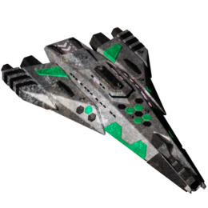

All Plugins (604)

[Cheats](https://github.com/Hecter94/EndlessSky-PluginArchive/blob/main/res/mds/cheats.md) (38) | [Gameplay](https://github.com/Hecter94/EndlessSky-PluginArchive/blob/main/res/mds/gameplay.md) (55) | [Graphics](https://github.com/Hecter94/EndlessSky-PluginArchive/blob/main/res/mds/graphics.md) (29) | [Outfits](https://github.com/Hecter94/EndlessSky-PluginArchive/blob/main/res/mds/outfits.md) (52)<br>
[Overhauls](https://github.com/Hecter94/EndlessSky-PluginArchive/blob/main/res/mds/overhauls.md) (46) | [Overwrites](https://github.com/Hecter94/EndlessSky-PluginArchive/blob/main/res/mds/overwrites.md) (4) | [Patches](https://github.com/Hecter94/EndlessSky-PluginArchive/blob/main/res/mds/patches.md) (3) | [Races](https://github.com/Hecter94/EndlessSky-PluginArchive/blob/main/res/mds/races.md) (70)<br>
[Ships](https://github.com/Hecter94/EndlessSky-PluginArchive/blob/main/res/mds/ships.md) (143) | [Starts](https://github.com/Hecter94/EndlessSky-PluginArchive/blob/main/res/md/starts.md) (17) | [Story](https://github.com/Hecter94/EndlessSky-PluginArchive/blob/main/res/mds/story.md) (80) | [Weapons](https://github.com/Hecter94/EndlessSky-PluginArchive/blob/main/res/mds/weapons.md) (42)<br>
[Uncategorized](https://github.com/Hecter94/EndlessSky-PluginArchive/blob/main/res/mds/uncategorized.md) (25)<br>

---

## Story

<p>80 plugins in this category.<p>


 

---

### Alexandria


[Alexandria.zip](https://github.com/Hecter94/EndlessSky-PluginArchive/releases/download/Latest/Alexandria.zip) | 3.23 kb | 2022-12-28 | [view files](https://github.com/Hecter94/EndlessSky-PluginArchive/tree/main/Working/Alexandria/) <br>
Author: N/A | Category: Story <br>
N/A[]()  <br>

>adds a museum tour on alexandria
>


Status: N/A <br>
Daily update check: </img><br>


---

### Arrr Mateys


[Arrr.Mateys.zip](https://github.com/Hecter94/EndlessSky-PluginArchive/releases/download/Latest/Arrr.Mateys.zip) | 3.56 kb | 2023-07-27 | [view files](https://github.com/Hecter94/EndlessSky-PluginArchive/tree/main/Working/Arrr%20Mateys/) <br>
Author: Ryan S. Northrup | Category: Story <br>
[https://bitbucket.org/YellowApple/arrr-mateys/src/master/](https://bitbucket.org/YellowApple/arrr-mateys/src/master/)  <br>

>Adds some missions for the pirate worlds.
>

<details>
<summary>:blue_book: Plugin readme</summary>
<blockquote># Arrr, Mateys!

## What is it?

A bunch of missions and stuff to give folks something to actually *do* on the pirate worlds in [Endless Sky](http://endless-sky.github.io).  Many of these things actually have an impact on pirate opinions, giving players a proper "if you can't beat 'em, join 'em" option.

## What sorts of fun things can I do?

### Which ones are already implemented?

* Smuggle illicit substances (namely: drugs) out of pirate worlds
* Smuggle illicit multimedia (namely: pirated software/videos/music) out of pirate worlds
* Smuggle counterfeit goods out of pirate worlds

### Which ones are planned to be implemented in the near future?

* Smuggle illegal immigrants out of pirate worlds
* Transport isolationists to pirate worlds
* Deliver medical supplies / luxury goods / etc. to pirate worlds
* Smuggle slaves into / out of pirate worlds
* Smuggle weapons into pirate worlds

### Which ones are planned to be implemented in the not-so-near future?

* Some pirate-centric mini-storylines (or perhaps a Pirate-centric main storyline)
* A pirate-centric alternate start (probably part of the above)

## What's the license?

GPLv3 (see `COPYING`).
</blockquote>
</details>

Status: N/A <br>
Daily update check: </img><br>


---

### avgi.licenses
</img><br>


[avgi.licenses.zip](https://github.com/Hecter94/EndlessSky-PluginArchive/releases/download/Latest/avgi.licenses.zip) | 374.35 kb | 2025-02-24 | [view files](https://github.com/Hecter94/EndlessSky-PluginArchive/tree/main/Working/avgi.licenses/) <br>
Author: zuckung | Category: Story <br>
[https://github.com/zuckung/endless-sky-plugins](https://github.com/zuckung/endless-sky-plugins) (last commit 2025-02-06) <br>

>Adds a mission on "Navigeo Yards" to get the 3 Avgi licenses. See the README for details.
>

<details>
<summary>:blue_book: Plugin readme</summary>
<blockquote>### avgi.licenses<br>
<br>
Adds a mission on "Navigeo Yards" to get the 3 Avgi licenses.<br>
<br>
<br>
When you have completed the Avgi Intro (Avgi: Twilight Escape 3: done), land on "Navigeo Yards". You have a 20% chance kn getting the licenses mission, which leads you to the Gossamer system, where you have to mine some stuff and bring it back. Licenses have new images. You also get an unassigned Avgi unique.<br>
<br>
<br>
Changelog:<br>
<br>
2025-02-06<br>
initial release<br>

</blockquote>
</details>

Status: complete <br>
Daily update check: </img><br>


---

### Bactrian Mission


[Bactrian.Mission.zip](https://github.com/Hecter94/EndlessSky-PluginArchive/releases/download/Latest/Bactrian.Mission.zip) | 715.14 kb | 2023-07-27 | [view files](https://github.com/Hecter94/EndlessSky-PluginArchive/tree/main/Working/Bactrian%20Mission/) <br>
Author: Turtleroku | Category: Story <br>
[https://github.com/Turtleroku/Bactrian-Mission](https://github.com/Turtleroku/Bactrian-Mission) (last commit 2017-10-13) <br>

>This plugin was built to provide some satisfaction to acquiring the mighty Bactrian. Hopefully the short mission sequence will also be enjoyable.
>There is some non-linearity to the story so depending on your choices two of three large ships (i.e. flagships) can be made available for purchase.
>Two large ships, one bounty mission and one transport mission were added.
>

<details>
<summary>:blue_book: Plugin readme</summary>
<blockquote># Bactrian-Mission
This plugin was built to provide some satisfaction to acquiring the mighty Bactrian. Hopefully the short mission sequence will also be enjoyable.
There is some non-linearity to the story so depending on your choices two of three large ships (i.e. flagships) can be made available for purchase.
Two large ships, one bounty mission and one transport mission were added.


</blockquote>
</details>

Status: N/A <br>
Daily update check: </img><br>


---

### Blackheart's Treasure


[Blackheart.s.Treasure.zip](https://github.com/Hecter94/EndlessSky-PluginArchive/releases/download/Latest/Blackheart.s.Treasure.zip) | 398.29 kb | 2023-07-27 | [view files](https://github.com/Hecter94/EndlessSky-PluginArchive/tree/main/Working/Blackheart's%20Treasure/) <br>
Author: Galaucus | Category: Story <br>
[https://github.com/Galaucus/Blackheart-s-Treasure](https://github.com/Galaucus/Blackheart-s-Treasure) (last commit 2021-05-01) <br>

>N/A


Status: N/A <br>
Daily update check: </img><br>


---

### Boarding Missions


[Boarding.Missions.zip](https://github.com/Hecter94/EndlessSky-PluginArchive/releases/download/Latest/Boarding.Missions.zip) | 2.38 kb | 2023-07-27 | [view files](https://github.com/Hecter94/EndlessSky-PluginArchive/tree/main/Working/Boarding%20Missions/) <br>
Author: Timothy Butterworth | Category: Story <br>
[https://github.com/tmbutterworth/boarding-missions](https://github.com/tmbutterworth/boarding-missions) (last commit 2018-09-18) <br>

>This plug-in adds additional boarding missions to the game increasing the chances for a player to receive a payment for assisting a disabled ship.
>

<details>
<summary>:blue_book: Plugin readme</summary>
<blockquote># boarding-missions

This plug-in adds additional boarding missions to the game increasing the chances for the player to receive a payment for assisting a disabled ship.

</blockquote>
</details>

Status: N/A <br>
Daily update check: </img><br>


---

### bunrodea.missions
</img><br>


[bunrodea.missions.zip](https://github.com/Hecter94/EndlessSky-PluginArchive/releases/download/Latest/bunrodea.missions.zip) | 2.95 mb | 2025-06-19 | [view files](https://github.com/Hecter94/EndlessSky-PluginArchive/tree/main/Working/bunrodea.missions/) <br>
Author: zuckung | Category: Story <br>
[https://github.com/zuckung/endless-sky-plugins](https://github.com/zuckung/endless-sky-plugins) (last commit 2025-06-19) <br>

>Adds some missions and jobs to increase the Bunrodea reputation. The first mission is available after the vanilla first contact mission. Doing more jobs will allow you to get access to all their planets and ships. See the readme for details.

<details>
<summary>:blue_book: Plugin readme</summary>
<blockquote>### bunrodea.missions
<br>
<br>
This plugin adds some missions to destroy Korath ships, which enable job board missions for raising the Bunrodea reputation. The first mission is available after the vanilla first contact mission. Doing more jobs will allow you to get access to all their planets and ships.<br>
<br>
Unlocking the planets is based on reputation, so you get access step by step. Unlocking the last of the planets(with the big shipyard) needs 500 reputation.<br>
<br>
Some missions from landing/spaceport unlock jobs. Others just give reputation or unlock story progression. Each job gives 5 to 40 reputation.<br>
Averagely you have to do like 50 jobs, less if you take the fighting jobs. Like in vanilla play, hit spaceport often.<br>
<br>
Since it's often questioned, here is a guide to the bunrodea first contact mission: Travel through Bunrodea territory till you've killed at least one Bunrodea ship, then fly to a human system (Misam works), land there and you get a mission, that brings you back to the Bunrodea. You can land on 4 planets now, and at this point this plugin starts.<br>
<br>
If the plugin control.station is installed, it gives additional information about the missions and shows this README.<br>
<br>
<br>
Changelog:<br>
<br>
2025-06-19<br>
added control.station support<br>
adjusted some mission offering chances<br>
added target personality to korath npc fleets<br>
<br>
2025-05-19<br>
typo fixes by snoogles<br>
<br>
2025-04-13<br>
added series for the 2 uniques<br>
added @2xicon<br>
added support for plugin BunrodeaRebellion (by YouKnowWho)<br>
<br>
2025-02-13<br>
somehow i forgot the @2x images, now they are in<br>
<br>
2025-02-10<br>
added @2x images<br>
changed news portraits, because of a conflict with expert.crew.members<br>
<br>
2024-10-08 <br>
proofreading and minor text changes (Vemenous-Repentile)<br>
<br>
2024-06-07<br>
text correction (thx to Dagroth)<br>
<br>
2024-06-07<br>
text corrections (thx to TheGiraffe3)<br>
<br>
2024-04-30<br>
fixed error on natural spawning korath fleets<br>
changed some spaceport news and jobs to require culture conversations<br>
changed culture conversation chance from 10% to 20%<br>
changed icon<br>
changed reputation needed for planet landings, to make the progression more fluent<br>
changed first contact mission chance to 100%, from 10% (for pilcrow)<br>
changed filenames (delete old files on update)<br>
added 5 new jobs<br>
added 6 side missions/chains, most with scene images<br>
added 1 person ship (thx pilcrow)<br>
added language bunrodea and friendly hails<br>
added minable asteroids to the systems<br>
<br>
2024-04-10<br>
added 4 scene images<br>
added 2 invisible missions to fix storyline on update / on loss of uniques<br>
changed gift at full rep from ship to a unique<br>
added 2 new culture conversations: flonkball / snap fly hunt<br>
added more spaceport news and regrouped them<br>
rebalanced the worldship mission/job, to nearly same chances as in vanilla fleets. (2,5%=582,590,577,Rai'alorej and 50%=618 and 40%=621)<br>
added "Kas'lor Ik 582 (Jump)" and "Lor'nag Ik 590 (Troop Transport)" and "Rai'alorej" to worldship mission/jobs<br>
<br>
2024-04-04<br>
added lots of spaceport news, with portraits<br>
added 3 new medium transport jobs<br>
changed execution culture conversation and jobs to 300 rep<br>
changed korath defense missions from landing to spaceport, and added choice to defer<br>
changed reputation needed on Bunthro and Erabuthro to reflect the progression<br>
changed chance for the 577 worldship to 10%<br>
<br>
2024-03-15<br>
bugfixes<br>
added first contact guide to readme<br>
added unique outfit "Bunrodea Translation Device"<br>
added 2 more hunt criminal jobs<br>
<br>
2024-03-11<br>
fixed missions not starting bug <br>
removed worldship fleets from the 3 border systems<br>
added normal korath fleets to the 3 border systems<br>
added 3rd fight mission(worldship) and repeatable job(25% chance)<br>
added 3 rush delivery jobs<br>
added criminal hunt culture conversation(25% chance) and repeatable job(35% chance) after<br>
added final mission at 500 reputation<br>
<br>
2024-02-18<br>
fixed unplayable first mission, if it gets started direct after the first contact<br>
<br>
2023-10-17<br>
added plugin.txt<br>
<br>
2023-09-02<br>
changed fleet missions/jobs to include only Palavret and Rano'erek<br>
added korath fleets to Era Natta, Genta Bo and Eneva Katta<br>
added 6 transport/passenger jobs<br>
<br>
2023-09-01<br>
added a 2nd mission and a 2nd repeatable job<br>
<br>
2023-08-26<br>
initial release<br>


</blockquote>
</details>

Status: complete <br>
Daily update check: </img><br>


---

### Captain Last and the Timeship


[Captain.Last.and.the.Timeship.zip](https://github.com/Hecter94/EndlessSky-PluginArchive/releases/download/Latest/Captain.Last.and.the.Timeship.zip) | 40.77 mb | 2022-10-06 | [view files](https://github.com/Hecter94/EndlessSky-PluginArchive/tree/main/Working/Captain%20Last%20and%20the%20Timeship/) <br>
Author: N/A | Category: Story <br>
N/A[]()  <br>

>N/A
>


Status: N/A <br>
Daily update check: </img><br>


---

### Coalition-At-War


[Coalition-At-War.zip](https://github.com/Hecter94/EndlessSky-PluginArchive/releases/download/Latest/Coalition-At-War.zip) | 40.07 kb | 2024-01-15 | [view files](https://github.com/Hecter94/EndlessSky-PluginArchive/tree/main/Working/Coalition-At-War/) <br>
Author: mathwhiz1212 | Category: Story <br>
[https://github.com/mathwhiz1212/A-Coalition-At-War](https://github.com/mathwhiz1212/A-Coalition-At-War) (last commit 2024-01-15) <br>

>You hear a lot about the conflict between the Coalition and the Quarg, but you never see it.
>
>This plugin introduces a storyline that lets you see that conflict and even capture Heliarch ships if you want to farm experience by repairing Heliarch ships.
>

<details>
<summary>:blue_book: Plugin readme</summary>
<blockquote># A Coalition at War

You hear a lot about the conflict between the Coalition and the Quarg in Endless Sky, but you never see it. This plugin introduces a storyline that lets you see or join that conflict. You gain access to Quarg or Heliarch tech and warships depending on the side you choose.

You can start the first mission by landing on "Tebuteb's Table" (in the Tebuteb system) or Forpelog (in the Sadalsuud system) and accepting the anomaly mission.

This plugin is best enjoyed after finishing the Wanderer Campaign. Getting access to Tier 3 tech makes everything else basically irrelevant.

There's few missions right now. See "Contributing" below if you have any ideas for more missions.

# Getting Started

## Installing

1. Download the plugin here: [https://github.com/mathwhiz1212/A-Coalition-At-War/releases](https://github.com/mathwhiz1212/A-Coalition-At-War/releases)

2. Put the zip file in your plugins folder:

Windows: `%APPDATA%\endless-sky\plugins/`

Mac: `/Library/ApplicationSupport/endless-sky/plugins/`

Linux: `/.local/share/endless-sky/plugins/`

3. Decompress/"Unzip" the zip file.
4. Start Endless Sky. You should be able to see "A Coalition at War" under Preferences > Plugins.
5. If you have problems, open an issue: https://github.com/mathwhiz1212/A-Coalition-At-War/issues/new/choose

## Using

Land on Tebuteb's Table or Forpelog and you will be asked to investigate an anomaly. Accept the mission and you'll be on your way.

# Contributing

[Feature Requests](https://github.com/mathwhiz1212/A-Coalition-At-War/issues/new?template=feature_request.md)

[Current Objectives](https://docs.google.com/document/d/1IeBmp9kmmM7WnmgqslpIvvAnddImp_nccEt_qGWagAc/edit?usp=drivesdk)

[Bug Reports](https://github.com/mathwhiz1212/A-Coalition-At-War/issues/new?template=bug_report.md)

[Wiki](https://github.com/mathwhiz1212/A-Coalition-At-War/wiki)

</blockquote>
</details>

Status: N/A <br>
Daily update check: </img><br>


---

### Cognitive Subdivision
</img><br>


[Cognitive.Subdivision.zip](https://github.com/Hecter94/EndlessSky-PluginArchive/releases/download/Latest/Cognitive.Subdivision.zip) | 15.77 mb | 2024-07-12 | [view files](https://github.com/Hecter94/EndlessSky-PluginArchive/tree/main/Working/Cognitive%20Subdivision/) <br>
Author: Maryn-s | Category: Story <br>
[https://github.com/Maryn-s/cognitive-subdivision](https://github.com/Maryn-s/cognitive-subdivision) (last commit 2024-07-12) <br>

>Cognitive Subdivision introduces a new difficult story taking place after the first part of the Wanderer Campaign
>as well as several new maps, 2 new tier 3 factions with various unique outfits and ships of their own for you to unlock
>...and some suprises for you to find!
>

<details>
<summary>:blue_book: Plugin readme</summary>
<blockquote># cognitive-subdivision
This plugin has been discontinued.

A mod for Endless Sky. Takes place right around the start of the second half of the Wanderer storyline

The story involves two main factions, the Algol and the Hand of Eden, as well as some vanilla factions like the Coalition, Hai Unfettered, and of course Humanity.
The player will have to aid the Algol in various tasks throughout the current campaign.

</blockquote>
</details>

Status: N/A <br>
Daily update check: </img><br>


---

### Colorado


[Colorado.zip](https://github.com/Hecter94/EndlessSky-PluginArchive/releases/download/Latest/Colorado.zip) | 73.45 kb | 2023-07-27 | [view files](https://github.com/Hecter94/EndlessSky-PluginArchive/tree/main/Working/Colorado/) <br>
Author: Clint Moyer | Category: Story <br>
[https://github.com/clintmoyer/endless-sky-plugins](https://github.com/clintmoyer/endless-sky-plugins) (last commit 2018-04-30) <br>

>Adds a new system and some missions.
>

<details>
<summary>:blue_book: Plugin readme</summary>
<blockquote>Plugin: Colorado
================

Journey through space with the history of a mountainous human
population.

Content
-------

1. [Planets](#planets)
3. [Missions](#missions)
4. [Screenshots](#screenshots)

Planets
-------

This plugin adds the RockyMountains system to our map.

* [Coloradia](#coloradia)

### Coloradia


Coloradia is a dry, rugged planet named after a historical mining
district from the original Earth colony. They say the mountains
and volcanoes offer a powerful reminder of the forces of nature
which humans initially had to overcome. Craft beer and integrated
circuitboards remain common exports from this vital community.

Missions
--------

* [What happened in Leadville?](#what-happened-in-leadville?)
* [Snoop on the Rocks](#snoop-on-the-rocks)
* [What happened in Leadville](#what-happened-in-leadville)

### What happened in Leadville?

Something crazy went down in the ultra-high altitude City of
Leadville. Go investigate.

### Snoop on the Rocks

A spurious young fellow is looking to get 4 people in a rocket-boost
over to famous Red Rocks Amphitheater to checkout Snoop Dogg live.

### Getting to John Denver

An eager woman wants to be taken to visit the esoteric John Denver
near the Spaceport region.

Screenshots
-----------


</blockquote>
</details>

Status: N/A <br>
Daily update check: </img><br>


---

### Cromha Expansion
</img><br>


[Cromha.Expansion.zip](https://github.com/Hecter94/EndlessSky-PluginArchive/releases/download/Latest/Cromha.Expansion.zip) | 118.76 mb | 2024-03-16 | [view files](https://github.com/Hecter94/EndlessSky-PluginArchive/tree/main/Working/Cromha%20Expansion/) <br>
Author: OcelotWalrus | Category: Story <br>
[https://github.com/OcelotWalrus/Cromha-Expansion-plugin](https://github.com/OcelotWalrus/Cromha-Expansion-plugin) (last commit 2024-03-16) <br>

>Adds a new civilization to the Korath Space (now named the 'Empire Space'): The Cromha Empire. Also known as 'The Empire', it is a government that dirige a huge part of the north of the Milky Way. It also a very high advanced government, that has kind of remixed outfits and ships from other vanilla governments. They are human but don't directly have contact with human Merchants, they have contact with the Syndicate, the Republic but they don't allow them to enter their territory.

<details>
<summary>:blue_book: Plugin readme</summary>
<blockquote><p align=center></p>

<h1><p align=center>Endless Sky Plugin:<br />Cromha-Expansion</p></h1>

[](https://github.com/OcelotWalrus/Cromha-Expansion-plugin/actions/workflows/cd.yaml)
[](https://github.com/OcelotWalrus/Cromha-Expansion-plugin/actions/workflows/sub-modules-update.yaml)
[](https://github.com/OcelotWalrus/Cromha-Expansion-plugin/actions/workflows/codespaces/create_codespaces_prebuilds)

## 

This is a plugin for the free, open-source game [Endless Sky][es]. This plugin
is developed and tested against the [Endless Sky continuous][continuous] build.
Learn more [about Endless Sky][esweb].
**You can join or create any discussion [here](https://github.com/Cromha-Plugins/Cromha-Expansion-plugin/discussions)** if you want to discuss about the plugin or ask more in depth questions to me.


<details>

  <summary>Summary</summary>

* [About plugin](#about-plugin)
    * [Gameplay Images](#gameplay-images)
    * [This plugin](#this-plugin)
* [Contributing](#contributing)
* [Development status](#development-status)
* [System Requirements](#system-requirements)
  * [Known Issues](#known-issues)
* [Installation](#installation)
    * [Install steps](#install-steps)
    * [Keeping the plugin updated](#keeping-the-plugin-updated)
* [Special Thanks](#special-thanks)

</details>

# About Plugin:

Adds a new civilization to the Korath Space (now named the '[Empire Space](https://github.com/OcelotWalrus/Cromha-Expansion-plugin/wiki/Regions-of-the-galaxy#the-empire-space)': [The Cromha Empire](https://github.com/OcelotWalrus/Cromha-Expansion-plugin/wiki/Cromha-Empire). Also known as 'The Empire', it is a government that dirige a huge part of the north of the Milky Way. It also a very high advanced government. They are human but don't directly have contact with human Merchants, they have contact with the Syndicate, the Republic but they don't allow them to enter their territory. Know more about the plugin in the [wiki](https://github.com/OcelotWalrus/Cromha-Expansion-plugin/wiki)! (or test the game yourself) Also, there is another empire that is set up next to the Paradise Planets. It is called the [Lumbarian Empire](https://github.com/OcelotWalrus/Cromha-Expansion-plugin/wiki/Lumbarian-Empire).

**Please do not use this plugin with your existing saves! This plugin is highly beta and it could corrupt your saves or make them unusable!**

*I want to clarify that this plugin is no made to be compatible with any plugin, to prevent your save to be corrupted, only play with this plugin with a specific save just for the plugin.*

## Gameplay Images

<details>

  <summary>Gameplay Images</summary>


</details>

## This plugin:

* Adds governments, factions and species that are related to the vanilla storyline (kind of).
* Expand various civilizations:
  * Quarg (expand weapons with different category with tiers, large new variety of ships, new systems and new lore)
  * Drak (new outfits and systems as well as lore)
  * Pug (new outfits, new lore and new systems)
  * Remnant (new colony living in the Empire Space and in the Sentar Galaxy, new outfits and new ships)
  * Ka'Het (new outfits, ships and systems)
  * Kor Automatons {Kor Mereti and Kor Sestor} (new outfits, new ships and new systems)
  * Korath (new lore, new systems, new outfits and new ships)
* The Lumbarian Empire that wants to replace the Republic and the Free Worlds and the Syndicate
* The storyline that the plugin adds is made so it is the most similar possible to the vanilla one.
* Add new outfits and ships from different governments and factions and species.
* Expands upon the existing map for exploration (New Systems in the north of the galaxy and near the Deep Space).
* Adds a new galaxy where there is the Sheragi civilization.

# Contributing

All Contributions are welcome!

_Check the [Contributing Guide](https://github.com/OcelotWalrus/Cromha-Expansion-plugin/wiki/Contributor-Guide) before creating any issue or pull request._

To contribute to the plugin, you can create [issues](https://github.com/OcelotWalrus/Cromha-Expansion-plugin/issues) to describe an error from spelling errors to mission bug or anything else.
You can also create an [issue](https://github.com/OcelotWalrus/Cromha-Expansion-plugin/issues) or a [pull request](https://github.com/OcelotWalrus/Cromha-Expansion-plugin/pulls) to request specific feature.

# Development Status
It is currently a Beta plugin.

* A medium WIP (work in progress) plugin
* Story is not fully implemented but for most of the part, it is
* Spaceport and planets descriptions are not fully done
* Quarg-Pug Expansion not finished
* Ember Watse/Remnant/Dark Expansion not finished
* Many more civilizations expansions to do
* Outfits and ships descriptions are not fully done.
* The whole 'Empire Rebels' part is not started very yet. (check [wiki](https://github.com/OcelotWalrus/Cromha-Expansion-plugin/wiki/Governments-&-Major-Factions))
* The [wiki](https://github.com/OcelotWalrus/Cromha-Expansion-plugin/wiki/) still in work and most of the Gameplay section is outdated
* The Lumbarian Empire is currently in a very early stage. Help create the storyline [here](https://github.com/OcelotWalrus/Cromha-Expansion-plugin/discussions/117)

# System requirements
Endless Sky has very minimal system requirements, meaning most systems should be able to run the game. But this plugin is kind of heavy.
It is also important that you play using the **latest unstable beta version of Endless Sky**, the main branch of the official [Endless Sky repository](https://github.com/endless-sky/endless-sky).

|| Minimum | Recommended |
|---|----:|----:|
|RAM | 4 GB | 8 GB |
|Graphics | OpenGL 3.0 | OpenGL 3.3 |
|Storage Free | 900 MB | 3 GB |

## Known issues
  * Game sometimes crash when loading resources (don't have enough RAM)
  * Some outfits or ships don't have texture: it's because we're currently revamping them (the textures to be revamped are in [images/_TEMP/](https://github.com/Cromha-Plugins/Cromha-Expansion-plugin/tree/main/images/_TEMP))

# Installation
If you're new in the Endless Sky community, check the [User Guide](https://github.com/OcelotWalrus/Cromha-Expansion-plugin/wiki/User-Guide) to learn the basics!

## Install steps

To install the plugin you just have to clone this repository into your [endless sky plugin directory](https://github.com/endless-sky/endless-sky/wiki/CreatingPlugins).
You can use the following command if you're used to command line.

```
git clone https://github.com/OcelotWalrus/Cromha-Expansion-plugin.git
```

If you want the `sources/` directory (a directory for the plugin assets like `.blend` files or `.xcf` for contributor), run the following command to enable sub-modules:

```
git clone https://github.com/OcelotWalrus/Cromha-Expansion-plugin.git --recursive
```

 If not, you can download the [continuous build](https://github.com/OcelotWalrus/Cromha-Expansion-plugin/releases/tag/9.9.9-continuous) and put the folder into your [endless sky plugin directory](https://github.com/endless-sky/endless-sky/wiki/CreatingPlugins).

## Keeping the plugin updated
If you're not familiar with git, you just have to run that command into the installed plugin.

```
git pull
```

If it don't work, you can just re-download the plugin at [releases](https://github.com/OcelotWalrus/Cromha-Expansion-plugin/releases) and put it in your [endless sky plugin directory](https://github.com/endless-sky/endless-sky/wiki/CreatingPlugins). And make sure you deleted the old Cromha Expansion plugin folder.

## Special thanks

Check [copyright.txt](https://github.com/OcelotWalrus/Cromha-Expansion-plugin/blob/main/copyright.txt) for full credits.
I have several people that really needs credits for my work here, first because some of them helped me but also some of them did great work on the endless sky community:

  * [`@lumbar527`](https://github.com/lumbar527)
    * He helped me by a lot on the plugin and had a lot of great ideas.
  * [`@1010todd`](https://github.com/1010todd)
    * This guys is an insane plugin creator who made tons of great assets, plugins and also have insane ideas. Lot of ideas from this project originally come from some of his work. You can check his plugins [here](https://github.com/endless-sky/endless-sky/discussions/7928). Respect to this guy.
  * [`@MidnightPlugins`](https://github.com/MidnightPlugins)
    * He made great plugins with great ideas that have have to me other great ideas.


[es]: https://github.com/endless-sky/endless-sky
[continuous]: https://github.com/endless-sky/endless-sky/releases/tag/continuous
[esweb]: https://endless-sky.github.io/

</blockquote>
</details>

Status: N/A <br>
Daily update check: </img><br>


---

### Dangerous Games


[Dangerous.Games.zip](https://github.com/Hecter94/EndlessSky-PluginArchive/releases/download/Latest/Dangerous.Games.zip) | 4.63 kb | 2023-07-27 | [view files](https://github.com/Hecter94/EndlessSky-PluginArchive/tree/main/Working/Dangerous%20Games/) <br>
Author: wispborne | Category: Story <br>
[https://github.com/wispborne/endless-sky-dangerous-games](https://github.com/wispborne/endless-sky-dangerous-games) (last commit 2016-09-11) <br>

>This is a mission available from the planet Clark that takes you an a short adventure with the dragons of Skymoot.
>

<details>
<summary>:blue_book: Plugin readme</summary>
<blockquote># Dangerous Games missions

This is a mission available from the planet Clark that takes you an a short adventure with the dragons of Skymoot.

Install in the plugins folder, the location of which can be found here: https://github.com/endless-sky/endless-sky/wiki/CreatingPlugins
</blockquote>
</details>

Status: Allready ingame <br>
Daily update check: </img><br>


---

### EfretiMissions


[EfretiMissions.zip](https://github.com/Hecter94/EndlessSky-PluginArchive/releases/download/Latest/EfretiMissions.zip) | 0.63 kb | 2023-07-27 | [view files](https://github.com/Hecter94/EndlessSky-PluginArchive/tree/main/Working/EfretiMissions/) <br>
Author: williaji | Category: Story <br>
[https://github.com/williaji/EfretiMissions](https://github.com/williaji/EfretiMissions) (last commit 2023-02-16) <br>

>additional missions for the Korath Efreti


Status: N/A <br>
Daily update check: </img><br>


---

### Endless Romances


[Endless.Romances.zip](https://github.com/Hecter94/EndlessSky-PluginArchive/releases/download/Latest/Endless.Romances.zip) | 3.57 kb | 2023-03-04 | [view files](https://github.com/Hecter94/EndlessSky-PluginArchive/tree/main/Working/Endless%20Romances/) <br>
Author: N/A | Category: Story <br>
N/A[]()  <br>

>Romance Plugin for Endless sky as requested by more people then i would like to admit (WIP)
>


Status: N/A <br>
Daily update check: </img><br>


---

### Enigma Corp
</img><br>


[Enigma.Corp.zip](https://github.com/Hecter94/EndlessSky-PluginArchive/releases/download/Latest/Enigma.Corp.zip) | 28.77 mb | 2023-07-27 | [view files](https://github.com/Hecter94/EndlessSky-PluginArchive/tree/main/Working/Enigma%20Corp/) <br>
Author: Amazinite | Category: Story <br>
[https://github.com/amazinite/enigma-corp](https://github.com/amazinite/enigma-corp) (last commit 2017-07-17) <br>

>Enigma Corp is an ever expanding mod that centers around the story of the Enigma Corporation, a new and mysterious weapons developer that has only risen up since shortly before the player begins their journey.
>

<details>
<summary>:blue_book: Plugin readme</summary>
<blockquote># Enigma Corp
Enigma Corp is an ever expanding mod that takes you through the adventures of the Enigma Corporation, a strange and greedy corporation that has only just recently surfaced onto the open market and is already doing big things. Both an outfit development and ship creation company, the Corporation has taken the market by storm, introducing new and exciting things to the general public that have never been seen before.

Although, some say that Enigma Corp's rise to power was not done cleanly, claiming that they steal secrets from other companies in order to gain an unfair edgy on their competitors. And rumor has it that they have dark connections with alien races, allowing them to develop the amazing things that they do that recently seemed out of humanity's grasps. But are these rumors true? Only you can find out!

Enjoy playing with dozens of new outfits and multiple new ships, as well as exploring the over 40 new systems that this mod adds in the Milky Way alone. That's right! There's more than just the Milky Way in this mod! Where will your travels take you? Find out today!

</blockquote>
</details>

Status: N/A <br>
Daily update check: </img><br>


---

### Enigma Corp High DPI
</img><br>


[Enigma.Corp.High.DPI.zip](https://github.com/Hecter94/EndlessSky-PluginArchive/releases/download/Latest/Enigma.Corp.High.DPI.zip) | 8.47 mb | 2023-07-27 | [view files](https://github.com/Hecter94/EndlessSky-PluginArchive/tree/main/Working/Enigma%20Corp%20High%20DPI/) <br>
Author: Amazinite | Category: Story <br>
[https://github.com/Amazinite/Enigma-Corp-High-DPI](https://github.com/Amazinite/Enigma-Corp-High-DPI) (last commit 2017-05-27) <br>

>The high DPI plugin for the Enigma Corp mod. High DPI images are only used if your zoom level is above 100% to increase graphical resolution.
>


Status: N/A <br>
Daily update check: </img><br>


---

### Enigma Corp Legacy


[Enigma.Corp.Legacy.zip](https://github.com/Hecter94/EndlessSky-PluginArchive/releases/download/Latest/Enigma.Corp.Legacy.zip) | 13.89 mb | 2022-10-06 | [view files](https://github.com/Hecter94/EndlessSky-PluginArchive/tree/main/Working/Enigma%20Corp%20Legacy/) <br>
Author: Amazinite | Category: Story <br>
[https://github.com/Amazinite/Enigma-Corp-Legacy](https://github.com/Amazinite/Enigma-Corp-Legacy) (last commit 2017-05-27) <br>

>A bunch of old stuff that I removed from Enigma Corp 
>


Status: N/A <br>
Daily update check: </img><br>


---

### Enki-Station


[Enki-Station.zip](https://github.com/Hecter94/EndlessSky-PluginArchive/releases/download/Latest/Enki-Station.zip) | 15.3 kb | 2023-07-27 | [view files](https://github.com/Hecter94/EndlessSky-PluginArchive/tree/main/Working/Enki-Station/) <br>
Author: Nergal8617 | Category: Story <br>
[https://github.com/Nergal8617/Enki-Station](https://github.com/Nergal8617/Enki-Station) (last commit 2018-03-11) <br>

>N/A
>

<details>
<summary>:blue_book: Plugin readme</summary>
<blockquote># Enki-Station
</blockquote>
</details>

Status: N/A <br>
Daily update check: </img><br>


---

### Epic Trucker
</img><br>


[Epic.Trucker.zip](https://github.com/Hecter94/EndlessSky-PluginArchive/releases/download/Latest/Epic.Trucker.zip) | 160.58 kb | 2023-07-27 | [view files](https://github.com/Hecter94/EndlessSky-PluginArchive/tree/main/Working/Epic%20Trucker/) <br>
Author: BriannaTheBrave | Category: Story <br>
[https://github.com/BriannaTheBrave/epic-trucker](https://github.com/BriannaTheBrave/epic-trucker) (last commit 2020-07-29) <br>

>This plug-in adds additional cargo and passenger (and both at once) missions to the game increasing the scale and scope for a player who wants to focus on running a huge trucker shipping delivery and passenger service.
>

<details>
<summary>:blue_book: Plugin readme</summary>
<blockquote># epic-trucker

Plugin for Endless Sky https://endless-sky.github.io/

This plug-in adds additional cargo and passenger (and both at once) missions to the game increasing the scale and scope for a player who wants to focus on running a huge trucker shipping delivery passenger service.

Please check "Releases" for functional releases - whatever is currently in source may be a work in progress. I release code when it is in a stable, tested state so check there!

-=-=-=-
Fluff
-=-=-=-

Alright you gear-jamming hyperspace truckers, this message is brought to you by your good ol' boys at Meganthium Trucking Company, THE Mega Truck Co. Find yourself doing a lot of shopping and price comparison trying to fill up all that cargo space? Maybe you've found gravy town and got yourself a little convoy and are ready to move up to the big leagues? Well we at Mega Truck Co. have you covered. Bigger jobs for a big galaxy. Get your cargo and passenger space up high enough and you'll start getting bigger and larger jobs with more bonus payout. With around fifty billion humans making and taking, it has never been a better time to be a trucker, hauler, ferry, or cabby. 

Why not go into the big leagues and find yourself some truely EPIC deliveries to fulfill? These special missions come co-sponsored by yours truely, Max Hammer, CEO, Mega Truck Co. These enormous, mega, and epic missions are all high-risk. You'll run into corporations looking to get even or just level the competition. You might even get targetted by the biggest and bravest pirates around who want to steal all that cargo. You aren't just hauling big volume; I need you to keep that cargo safe!

-=-=-=-
Features:
-=-=-=-

Additional jobs which become unlocked with higher cargo and passenger count. These are copies of the vanilla jobs with a few tweaks to both increase minimums and push the maximum sizes way up - and also their default bonuses. After all, hiring you to do it in one saves them on logistics. There are also more jobs for moving criminals (needs the brig) and more for wealthy patrons (needs luxury) and added one or two fun little but high payout jobs such as a wealthy enthusiast who wants to brag about having gotten a ride with such a legendary captain! (Requires high net-worth)

Right now these extra jobs should come into a vanilla campaign over time as you grow your fleet, either with many haulers or just a couple huge rigs. Most of these jobs are slightly more rare to cut down on job-overload. For now though, once you're an epic trucker you will see nearly 50% more jobs each day.

*Existing Compatible*
This can be safely added or removed from an existing game. I've tested this myself on Windows and Ubuntu (Linux) only. When adding, you won't see new jobs until you land again (if you're already landed it won't prompt to check for new jobs until you take off). If you remove it, you will keep whatever jobs you have as they're part of your save file -- you will just stop seeing these jobs (again, only once you take off). 

*Mod Compatible*
This should work with any other mods because this only adds jobs and does not try to tweak existing stuff. 
Once we add any overrides to phase out vanilla shipping, however, this will become more complicated. This isn't implemented yet.

-=-=-=-
Installation Instructions: 
-=-=-=-

Download the ZIP file and extract it into your plugins folder. 
Alternately, you can just git clone directly into the plugins folder
Make sure you are only one folder with the name of the mod which directly contains the "data" folder - if you're two levels deep the plugin loader wont find and load the plugin.

You'll know it is working if you have over 200 cargo or 6 passengers and you see missions with "Bigger" "Larger" "Many" "A Big Family" and similar things in their name

-=-=-=-
Future:
-=-=-=-

* Override for existing main jobs to phase them out over time as your cargo + passengers + net worth go up. 
* Add 3rd tier of mega jobs and have them phase in over time as the big ones also phase out. No one wants to be cluttered with "deliver 5 tons" when you're doing "deliver 2200 tons" and the job system can get overloaded and noisy.
* More jobs for cargo + passengers from special regions, like corporate retreat for 200+ people, or help setup a colony 1000tons and 100 people
* High Risk job line which requires certain net worth and combat rating on top of cargo and passenger which involves turbo pirate and later, ELITE enemies
* Deep, Syndicate, and FW specific jobs
* Eliminating Large Industry Transport Executives - ELITE Pirate force as special antagonists using large pools of vessels including checking for modded ones to be the antagonists for EPIC jobs
* Mega Truck Co. HQ with special mission line and some cute custom loadouts for basic haulers, freighters, etc as well as the atomic fusion bactrian "MEGA TRUCK" rig just for fun, nothing game breaking nor outside of vanilla game
* Extra banter from merchants and major factions once you've completed EPIC or MEGA jobs which allows setting to appear to be aware you are a truely epic trucker

</blockquote>
</details>

Status: Playable on 0.9.14, 0.9.15 Continuous. <br>
Daily update check: </img><br>


---

### ES Callisto
</img><br>


[ES.Callisto.zip](https://github.com/Hecter94/EndlessSky-PluginArchive/releases/download/Latest/ES.Callisto.zip) | 298.14 kb | 2023-07-27 | [view files](https://github.com/Hecter94/EndlessSky-PluginArchive/tree/main/Working/ES%20Callisto/) <br>
Author: mOctave | Category: Story <br>
[https://github.com/mOctave/es-callisto](https://github.com/mOctave/es-callisto) (last commit 2023-03-21) <br>

>This is a very small plugin that adds Callisto as a landable location in Sol, and provides backstory as to why it is currently abandoned. More may be added to this plugin in the future, but I might also just leave it at this.


Status: N/A <br>
Daily update check: </img><br>


---

### ES Dawn


[ES.Dawn.zip](https://github.com/Hecter94/EndlessSky-PluginArchive/releases/download/Latest/ES.Dawn.zip) | 327.71 kb | 2023-07-27 | [view files](https://github.com/Hecter94/EndlessSky-PluginArchive/tree/main/Working/ES%20Dawn/) <br>
Author: mOctave | Category: Story <br>
[https://github.com/mOctave/es-dawn/](https://github.com/mOctave/es-dawn/) (last commit 2022-10-03) <br>

>A plugin for Endless Sky providing an alternate, and much earlier, storyline. First version still in progress: Right now it is very buggy and incomplete.
>

<details>
<summary>:blue_book: Plugin readme</summary>
<blockquote># es-dawn
A plugin for [Endless Sky](https://github.com/endless-sky/endless-sky/) providing an alternate, and much earlier, storyline.
First version still in progress: Right now it is very buggy and incomplete.
Currently just getting everything set up. Read the [Contribution Guidlines](https://github.com/mOctave/es-dawn/blob/main/CONTRIBUTING.md) to see how you can help.

</blockquote>
</details>

Status:  designed for 0.9.14 <br>
Daily update check: </img><br>


---

### Eternal Shuttle
</img><br>


[Eternal.Shuttle.zip](https://github.com/Hecter94/EndlessSky-PluginArchive/releases/download/Latest/Eternal.Shuttle.zip) | 326.67 kb | 2023-08-24 | [view files](https://github.com/Hecter94/EndlessSky-PluginArchive/tree/main/Working/Eternal%20Shuttle/) <br>
Author: mOctave | Category: Story <br>
[https://github.com/mOctave/eternal-shuttle](https://github.com/mOctave/eternal-shuttle) (last commit 2023-08-24) <br>

>An Endless Sky plugin about the end of humanity and fighting off an alien invasion in a Shuttle.
>


Status: Work In Progress <br>
Daily update check: </img><br>


---

### Fire Corporation
</img><br>


[Fire.Corporation.zip](https://github.com/Hecter94/EndlessSky-PluginArchive/releases/download/Latest/Fire.Corporation.zip) | 1.01 mb | 2024-11-01 | [view files](https://github.com/Hecter94/EndlessSky-PluginArchive/tree/main/Working/Fire%20Corporation/) <br>
Author: lumbar527 | Category: Story <br>
[https://github.com/Cromha-Plugins/Fire-Corporation](https://github.com/Cromha-Plugins/Fire-Corporation) (last commit 2023-11-12) <br>

>An Endless Sky plugin about a manufacturing corporation that hates pirates. 
>

<details>
<summary>:blue_book: Plugin readme</summary>
<blockquote># Fire-Corporation

One of the greatest manufacturers in human space (in their own opinion) is Fire Corporation. They produce several ships for civilian and military uses.
If you were worried about fighting pirates using their ships, you don't have to worry; that's what they do.
They will offer you jobs to hunt down pirates who took their ships, or even their outfits.

# Contributing
Contributions are welcome. If you want to contribute, please refer to the contributing folder.

</blockquote>
</details>

Status: N/A <br>
Daily update check: </img><br>


---

### Flavour Text


[Flavour.Text.zip](https://github.com/Hecter94/EndlessSky-PluginArchive/releases/download/Latest/Flavour.Text.zip) | 4.24 kb | 2022-10-06 | [view files](https://github.com/Hecter94/EndlessSky-PluginArchive/tree/main/Working/Flavour%20Text/) <br>
Author: N/A | Category: Story <br>
N/A[]()  <br>

>N/A
>


Status: N/A <br>
Daily update check: </img><br>


---

### Free Kitten


[Free.Kitten.zip](https://github.com/Hecter94/EndlessSky-PluginArchive/releases/download/Latest/Free.Kitten.zip) | 438.4 kb | 2023-07-27 | [view files](https://github.com/Hecter94/EndlessSky-PluginArchive/tree/main/Working/Free%20Kitten/) <br>
Author: Epchk | Category: Story <br>
[https://github.com/Epchk/ES-free-kitten](https://github.com/Epchk/ES-free-kitten) (last commit 2018-12-31) <br>

>Adds a mission that pays you with a kitten.
>

<details>
<summary>:blue_book: Plugin readme</summary>
<blockquote># ES-free-kitten
A plugin for the open source game Endless Sky. 

[Endless Sky][endlesssky] is an open source game. The free kitten plugin offers a one-time mission with a unique reward.

Adds a quest that pays you with a kitten. The quest starts in New Austria.

# Installation

Create  "plugins" folder if it does not already exists
Linux

    /.local/share/endless-sky/plugins/

Windows

    C:\Users\yourusername\AppData\Roaming\endless-sky\plugins\

Mac OS X

    /Library/ApplicationSupport/endless-sky/plugins

Download the latest release and extract it into your plugins folder.


[endlesssky]: https://endless-sky.github.io/

</blockquote>
</details>

Status: N/A <br>
Daily update check: </img><br>


---

### Free Worlds Saga


[Free.Worlds.Saga.zip](https://github.com/Hecter94/EndlessSky-PluginArchive/releases/download/Latest/Free.Worlds.Saga.zip) | 45.0 kb | 2022-10-06 | [view files](https://github.com/Hecter94/EndlessSky-PluginArchive/tree/main/Working/Free%20Worlds%20Saga/) <br>
Author: Ian | Category: Story <br>
N/A[]()  <br>

>N/A
>


Status: N/A <br>
Daily update check: </img><br>


---

### Galactic Couriers
</img><br>


[Galactic.Couriers.zip](https://github.com/Hecter94/EndlessSky-PluginArchive/releases/download/Latest/Galactic.Couriers.zip) | 10.13 mb | 2022-10-06 | [view files](https://github.com/Hecter94/EndlessSky-PluginArchive/tree/main/Working/Galactic%20Couriers/) <br>
Author: Derekcz | Category: Story <br>
N/A[]()  <br>

>A minor side-story taking place mostly in an isolated star system outside of the human space.
>Main game story must be completed before this plugin's story can fully start.
>


Status: N/A <br>
Daily update check: </img><br>


---

### gegno.pirates
</img><br>


[gegno.pirates.zip](https://github.com/Hecter94/EndlessSky-PluginArchive/releases/download/Latest/gegno.pirates.zip) | 236.92 kb | 2025-03-11 | [view files](https://github.com/Hecter94/EndlessSky-PluginArchive/tree/main/Working/gegno.pirates/) <br>
Author: zuckung | Category: Story <br>
[https://github.com/zuckung/endless-sky-plugins](https://github.com/zuckung/endless-sky-plugins) (last commit 2025-03-11) <br>

>Adds a new faction of Gegno pirates which lets you capture Gegno ships, gain Gegno/Scin/Vi reputation, open their planets for travel, loot Gegno licenses and create an outfitter/shipyard for all their gear. See the readme for details.
>

<details>
<summary>:blue_book: Plugin readme</summary>
<blockquote>### gegno.pirates
<br>
<br>
Adds a new faction of Gegno pirates which lets you capture Gegno ships, gain Gegno/Scin/Vi reputation, open their planets for travel, loot Gegno licenses and create an outfitter/shipyard for all their gear.<br>
<br>
The new government "Gegno Pirates" (hidden till vanilla gegno story is done) inhabit the new System "Zaron"(between Huud, Vesvii and Cotpoxi). The surrounding systems, up to 3 jumps away, have new pirate fleets.<br>
Killing pirates and assisting Gegno/Scin/Vi gives reputation now. The needed reputation to land on the Gegno planets got changed to higher values. Killing like 80 Gegno pirates should allow you to land on all Gegno planets and use their shipyards and outfitters.<br>
Boarding Gegno Pirates gives you a 5% chance to obtain one of the 8 Gegno licenses.<br> 
After gaining full reputation for all planets and obtaining all Gegno licenses you get a mission to a new system with all outfitters/shipyards centralized.<br>
<br>
<br>
<br>
Changelog:<br>
<br>
2025-03-11<br>
gegno pirates are now hidden till the vanilla story is done<br>
<br>
2024-10-29<br>
added ship Rhyolite to sale<br>
<br>
2024-03-20<br>
fixed missing hyperlink from asio to uuba (thx isaias for reporting)<br>
<br>
2024-03-15<br>
adjustments and fixes<br>
<br>
2024-03-09<br>
adjustments and fixes<br>
compatibility fix in missions<br>
<br>
2024-03-08<br>
adjustments and fixes<br>
added plugin removal guide to the readme<br>
added several missions<br>
added new planet with all outfits/ships for easier browsing<br>
<br>
2024-03-07<br>
adjustments and fixes<br>
added different license pngs<br>
added missing outfits and ships<br>
<br>
2024-03-05<br>
initial release<br>


</blockquote>
</details>

Status: complete <br>
Daily update check: </img><br>


---

### Jibauni Storyline Additions


[Jibauni.Storyline.Additions.zip](https://github.com/Hecter94/EndlessSky-PluginArchive/releases/download/Latest/Jibauni.Storyline.Additions.zip) | 13.14 kb | 2025-03-06 | [view files](https://github.com/Hecter94/EndlessSky-PluginArchive/tree/main/Working/Jibauni%20Storyline%20Additions/) <br>
Author: TheGiraffe3 | Category: Story <br>
[https://github.com/TheGiraffe3/more-Jibauni-storyline](https://github.com/TheGiraffe3/more-Jibauni-storyline) (last commit 2025-03-06) <br>

>Expands the Jibauni storyline with more missions. Still beta. Requires the [Jibauni](https://github.com/TheGiraffe3/Jibauni) plugin to use.
>


Status: In Progress <br>
Daily update check: </img><br>


---

### Join the Navy


[Join.the.Navy.zip](https://github.com/Hecter94/EndlessSky-PluginArchive/releases/download/Latest/Join.the.Navy.zip) | 59.26 kb | 2022-10-06 | [view files](https://github.com/Hecter94/EndlessSky-PluginArchive/tree/main/Working/Join%20the%20Navy/) <br>
Author: N/A | Category: Story <br>
N/A[]()  <br>

>many missions for the navy
>


Status: N/A <br>
Daily update check: </img><br>


---

### Jojo's Galactic Adventure


[Jojo.s.Galactic.Adventure.zip](https://github.com/Hecter94/EndlessSky-PluginArchive/releases/download/Latest/Jojo.s.Galactic.Adventure.zip) | 16.31 kb | 2022-10-06 | [view files](https://github.com/Hecter94/EndlessSky-PluginArchive/tree/main/Working/Jojo's%20Galactic%20Adventure/) <br>
Author: N/A | Category: Story <br>
N/A[]()  <br>

>N/A
>


Status: N/A <br>
Daily update check: </img><br>


---

### Korath Remnant War


[Korath.Remnant.War.zip](https://github.com/Hecter94/EndlessSky-PluginArchive/releases/download/Latest/Korath.Remnant.War.zip) | 5.84 kb | 2023-07-27 | [view files](https://github.com/Hecter94/EndlessSky-PluginArchive/tree/main/Working/Korath%20Remnant%20War/) <br>
Author: Rafael Ramawadh | Category: Story <br>
N/A[]()  <br>

>This mod is all about allowing a player to have access to the korath world ship which now is allowed to spawn inside the remnant worlds, all i did was make it is the korath home fleets spawn at half the rate of raids.... my first plugin so don't enjoy
>


Status: N/A <br>
Daily update check: </img><br>


---

### Korath Retribution
</img><br>


[Korath.Retribution.zip](https://github.com/Hecter94/EndlessSky-PluginArchive/releases/download/Latest/Korath.Retribution.zip) | 79.5 kb | 2024-01-12 | [view files](https://github.com/Hecter94/EndlessSky-PluginArchive/tree/main/Working/Korath%20Retribution/) <br>
Author: Demolish238 | Category: Story <br>
[https://github.com/demolish238/Korath-Retribution](https://github.com/demolish238/Korath-Retribution) (last commit 2024-01-12) <br>

>Hello, this plugin adds consequences for Worldship hunting, from the Quarg being disapproving, to Korath Revenge fleets and the Efreti being angered.
>

<details>
<summary>:blue_book: Plugin readme</summary>
<blockquote># Korath Retribution
Hello, this plugin adds consequences for Worldship hunting, from the Quarg being disapproving, to Korath Revenge fleets and the Efreti being angered.

Reccomended Plugins:

https://github.com/MidnightPlugins/Lost-in-Midnight (Lost in Midnight) (Allows you a chance to get a capturable Korsmanath A'awoj unlike in vanilla, also just a good plugin)

https://github.com/demolish238/Mil-taj-Protectorate/tree/main (Mil'taj Protectorate) (My other plugin)

https://github.com/demolish238/QOL-Outfits (QOL outfits) (My other plugin)

https://github.com/demolish238/Capitalis-Major (Capitalis Major) (My other plugin)

If you have anyfeedback on balance problems or bugs please message me on discord (demolish238#6398)

</blockquote>
</details>

Status: 0.10.4 compatible <br>
Daily update check: </img><br>


---

### Kraz Expanded


[Kraz.Expanded.zip](https://github.com/Hecter94/EndlessSky-PluginArchive/releases/download/Latest/Kraz.Expanded.zip) | 6.54 mb | 2023-08-12 | [view files](https://github.com/Hecter94/EndlessSky-PluginArchive/tree/main/Working/Kraz%20Expanded/) <br>
Author: Oskatel | Category: Story <br>
N/A[]()  <br>

>This plugin continues the story of Kraz Cybernetics. Including new alien race, outfits and ships.
>

<details>
<summary>:blue_book: Plugin readme</summary>
<blockquote># The Aura Space
Plugin for Endless Sky. Including new alien race, outfits and ships. (Work in progress)

Discord Server: https://discord.gg/c4S3UsrAaK 

</blockquote>
</details>

Status: Work in Progress <br>
Daily update check: </img><br>


---

### Lemurias Extra ES Stuff
</img><br>


[Lemurias.Extra.ES.Stuff.zip](https://github.com/Hecter94/EndlessSky-PluginArchive/releases/download/Latest/Lemurias.Extra.ES.Stuff.zip) | 14.38 mb | 2024-11-01 | [view files](https://github.com/Hecter94/EndlessSky-PluginArchive/tree/main/Working/Lemurias%20Extra%20ES%20Stuff/) <br>
Author: a-random-lemurian | Category: Story <br>
[https://github.com/a-random-lemurian/Lemurias-Extra-ES-Stuff](https://github.com/a-random-lemurian/Lemurias-Extra-ES-Stuff) (last commit 2024-11-01) <br>

>It adds so much new content to the game that it cannot be listed in this README
>

<details>
<summary>:blue_book: Plugin readme</summary>
<blockquote># Notice: 2023-06-27

I don't play Endless Sky very much anymore. I used to maintain this plugin because it was fun. But now I realize the many issues it has; such as the inherent implausibility of the factions such as the CSSF and Sayari Plushie Authority; the space LEEST uses for systems being taken up by new pull requests. It was great by 2021 standards for me, but in the two years since I have improved at an exponential rate and moved away from Endless Sky.

If I ever returned to Endless Sky and wanted to make plugins; it is likely I would start from scratch and call it LEEST 2.

- Lemuria

## Extra Notice: 2024-10-19

This repository has been unarchived after I decided to start playing Endless Sky again. However, this interest might be short-lived and only last a few days or weeks, but nonetheless it might be long enough to fix the plugin's typos and other issues.

# About
This is a plugin for Endless Sky, created by Lemuria. It adds so much new content to the game that it cannot be listed in this README. Please view [this document](./docs/NEWCONTENT.md) for more information.

Disclaimers:
- This plugin is fictional. References to real life however are expected as ES takes place over 1000 years in the future (as of 2022).
- Planet/ship/character/any names with innocent meanings in English but vulgar meanings in other languages are rare (the author has not gotten any complaints). Any such meanings are unintended. Please contact the author if you have a problem.
- May contain mild traces of the Hai ambassador "Sayari".

Ingredients: VS Code, Endless Sky, Lemuria's brain cells, electricity, mac, sweat, hardwork, MSG, plugins, GitHub, copyrights, credits, coding experience, natural flavors, Sayari photos, Sayari, immersive simulations of Sayari, wizards, Kar Ik Vot 349s, Bactrians, Bactrains, Leviathans, Yuyuko, cheese, data drives, food, luxury goods, industrial, electronics, missions, failed missions, free worlds, actual Free Worlds, humans, Hai, Korath, Korath Raiders, Korath World Ships, Syndicate Bulk Freighters, Clippers, frogs, ants, terraformers, hyperdrives, jump drives, heat shunts, variables, Discord pings, @everyone pings, memes, Sayari plushie smugglers, Dreadnoughts, natural flavors, pexels.com images, GPL licenses, code, machine-readable code, binary, human-readable code, Debian, Ubuntu, Arch Linux, other Linux distros, Debian hats, Freya Winters plushies, Taely plushies, female Remnant plushies, images of Freya Winters, Free Worlds mission ideas, rejected pull requests to add Freya plushies, and more.

# Let's play! (Installation instructions)
LEESt only supports the continuous build of Endless Sky due to it's use of bleeding-edge features.

## Download
* If on GitHub, scroll up and click that big green `Code` button and download the zip file.

### Windows
* Copy the Lemurias-Extra-ES-Stuff-main.zip file into `C:\Users\<username>\AppData\Roaming\endless-sky\plugins`.
* Unzip the file.
* Remove the Lemurias-Extra-ES-Stuff-main.zip, if you want to.

### macOS
* Extract the zip to `/Users/Library/ApplicationSupport/endless-sky/plugins`. Or `Application Support`, depending on your version.

### Linux
The preferred way to install on Linux is to `cd $HOME/.local/share/endless-sky/plugins && git clone https://github.com/a-random-lemurian/Lemurias-Extra-ES-Stuff`. Updating is easy, just run `git pull`. We're assuming you know how to use a terminal here, by the way.

Or, you can just download the zip and extract it to `/.local/share/endless-sky/plugins`.

### Verify installation
* Start Endless Sky and click on Preferences.
* Click on the Plugins tab.
* If you see "Lemuria's Extra Endless Sky Stuff", the plugin has been installed correctly.
* Go forth and play.

## Sayari disclaimer

This Endless Sky plugin may contain traces of the Hai ambassador "Sayari". Exposure to Sayari may result in the following effects: Simping, being targeted by Yuyuko Saigyouji, being killed by Yuyuko Saigyouji, insomnia due to thinking about Sayari and Endless Sky constantly at night, gaming addiction.

Additional effects include a cease and desist letter from anti-gaming groups (rare), and for developers, overload of any MongoDB databases, bill shock if GitHub autopay is on and price is based upon your use of storage and computing power, being denied access to APIs and web services due to storing excessive photos of Sayari, writing too much code that keeps track of Sayari, sending too many requests for a search for Sayari, and excessive posting of Sayari images to aforementioned web services (Stack Overflow, Discord, animal forums, r/aww, r/squirrel, subreddits related to squirrels) respectively.

> I've never seen someone simp so hard for a digital squirrel alien
>
> Hyugatha #FixFighters, Endless Sky discord server


# Content Rating
Dialog and "strings" visible to players do not contain mild/major swear words, not even their substitutes. This add-on has not been assigned any official ratings by rating agencies such as the ESRB, PEGI, or your country's video game rating authority.

Do note that this addon has references to slavery and organized crime (pirates).

When writing content for LEEST, I make sure the content remains at ESRB's *Teen* rating, PEGI's *12* rating, Germany's *USK 12* rating, or in general, appropriate for someone at or above the age of 13.

# Copyrights
Plugin copyright (C) Lemuria#0685 2021-2023. License: GPLv3, view in LICENSE.md

Image copyright (C) Several authors, licenses vary: see Pictures section.

Contact:          Lemuria#0685 (Discord)


Can't find the attribution for your image? Use the search feature of your code editor or whatever program you're using to read this.

To make it easier to contact the author, you may join the Endless Sky discord server at: https://discord.com/invite/ZeuASSx

## Pictures

### Planet landscape images
None of the people mentioned here have endorsed the use of their image for this plugin.

> LI = landscape image

<details><summary>Copyright disclaimers for planet and station images</summary>

| planet                    | author               | license                 | links |
| ------------------------- | -------------------- | ----------------------- | --------------- |
| Laateli                   | Themanilaxperience   | CC BY-SA 3.0            | ([orig](https://commons.wikimedia.org/wiki/File:Makatiskyline.jpg))
| Markaii                   | [WeaponizingArchitecture](https://commons.wikimedia.org/wiki/User:WeaponizingArchitecture)   | CC BY-SA 4.0 "International" | ([orig](https://commons.wikimedia.org/wiki/File:Ann_Arbor_Skyline_2021.jpg))
| Yinachr                   | Vyacheslav Argenberg | CC-BY 4.0               | ([orig](https://commons.wikimedia.org/wiki/File:Nile_River,_West_bank_2,_Aswan,_Egypt.jpg))
| Pedinai                   | Vyacheslav Argenberg | CC-BY 4.0               | ([orig](https://commons.wikimedia.org/wiki/File:Manila_skyline_from_above,_approaching_the_Manila_airport,_Manila,_Philippines.jpg))
| Rodoluki                  | Vyacheslav Argenberg | CC-BY 4.0               | ([orig](https://upload.wikimedia.org/wikipedia/commons/thumb/5/53/Damascus%2C_Syria%2C_Panoramic_view_of_Damascus.jpg/800px-Damascus%2C_Syria%2C_Panoramic_view_of_Damascus.jpg))
| Khoramelia                | Vyacheslav Argenberg | CC-BY 4.0               | ([orig](https://commons.wikimedia.org/wiki/File:Karachay-Cherkessia,_Arkhyz_Valley,_%D0%A1%D0%BA%D0%BB%D0%BE%D0%BD%D1%8B_%D0%90%D0%B1%D0%B8%D1%88%D0%B8%D1%80%D0%B0-%D0%90%D1%85%D1%83%D0%B1%D0%B0,_%D0%9A%D0%B0%D1%80%D0%B0%D1%87%D0%B0%D0%B5%D0%B2%D0%BE-%D0%A7%D0%B5%D1%80%D0%BA%D0%B5%D1%81%D0%B8%D1%8F.jpg))
| Mindai                    | Vyacheslav Argenberg | CC-BY 4.0               | ([orig](https://commons.wikimedia.org/wiki/File:Bangkok,_Thailand,_Aerial_view.jpg))
| Leroo Station             | Bill Ebbesen,        | CC BY 3.0               | ([orig](https://commons.wikimedia.org/wiki/File:Heatpipe_tunnel_copenhagen_2009.jpg))
| Khoramelia Mission Office | Gregory Varnum       | CC BY-SA 4.0            | ([orig](https://commons.wikimedia.org/wiki/File:Bahamas_Cruise_-_ship_interior_-_June_2018_(2198).jpg))
| Arlok                     | Vyacheslav Argenberg | CC-BY 4.0               | ([orig](https://commons.wikimedia.org/wiki/File:Kuala_Lumpur,_Malaysia,_Buildings_in_Bukit_Bintang.jpg))
| Lorok                     | Vyacheslav Argenberg | CC-BY 4.0               | ([orig](https://commons.wikimedia.org/wiki/File:Krabi,_View_over_Krabi_plains,_Thailand.jpg))
| Melisida                  | Vyacheslav Argenberg | CC-BY 4.0               | ([orig](https://commons.wikimedia.org/wiki/File:Old_Delhi_city_skyline_from_Jama_Masjid,_Delhi,_India.jpg))
| Ekarai                    | Vyacheslav Argenberg | CC-BY 4.0               | ([orig](https://commons.wikimedia.org/wiki/File:Downtown_Beirut,_Lebanon.jpg))
| Renpaya                   | A_Peach              | CC-BY 2.0 "Generic"     | ([orig](https://commons.wikimedia.org/wiki/File:Tanzania_-_Endless_plains,_endless_sky_(11122490586).jpg))
| Denchrao                  | John Picken          | CC-BY 2.0 "Generic"     | ([orig](https://commons.wikimedia.org/wiki/File:Chicago_River_ferry.jpg))
| Perechra                  | Dexbaldon            | CC BY-SA 4.0            | ([orig](https://commons.wikimedia.org/wiki/File:Legazpi_City_view_from_Taysan.jpg))
| Peliru                    | Svetlov Artem        | CC BY 3.0               | ([orig](https://commons.wikimedia.org/wiki/File:Lieninski_District,_Mogilev,_Belarus_-_panoramio_(488).jpg))
| Kestrix I                 | Bernard Gagnon       | *several*               | ([orig](https://commons.wikimedia.org/wiki/File:Quebrada_de_las_Flechas_01.jpg))
| Kestrix II                | Chris Light          | CC BY-SA 4.0            | ([orig](https://commons.wikimedia.org/wiki/File:Badlands_NP_(creteatious_beds).jpg))
| Kestrix III               | Ronincmc             | CC BY-SA 4.0            | ([orig](https://commons.wikimedia.org/wiki/File:Badlands00523.JPG))
| Merschre                  | Trick17              | CC BY-SA 4.0            | ([orig](https://commons.wikimedia.org/wiki/File:BlackRiver1.JPG))
| Eisei                     | Skye Marthaler       | CC BY-SA 4.0            | ([orig](https://commons.wikimedia.org/wiki/File:Looking_eastward_at_Charles_Mound,_the_highest_point_in_Illinois.jpg))
| Kaistra                   | Albinfo              | CC BY-SA 4.0            | ([orig](https://commons.wikimedia.org/wiki/File:WK402_WikipediaWeekendTirana2015_MaguraMine_122.JPG))
| Salistra                  | Murray Foubister     | CC BY-SA 2.0 "Generic"  | ([orig](https://commons.wikimedia.org/wiki/File:Cascades_S_of_Chilliwack,_BC_-_Mt_Cheam_(2104m)_sharp_peak_on_left._(16132353992).jpg))
| Moristra                  | earth_photos         | CC BY 2.0               | ([orig](https://commons.wikimedia.org/wiki/File:Chinafarmland.jpg))
| Eteristra                 | David Iliff          | CC BY-SA 3.0            | ([orig](https://en.wikipedia.org/wiki/File:Half_Dome_from_Glacier_Point,_Yosemite_NP_-_Diliff.jpg))
| Delistra                  | David Iliff          | CC BY-SA 3.0            | ([orig](https://en.wikipedia.org/wiki/File:Tunnel_View,_Yosemite_Valley,_Yosemite_NP_-_Diliff.jpg))
| Pondar                    | PiccoloNamek         | CC BY-SA 3.0            | ([orig](https://en.wikipedia.org/wiki/File:CirrusField-color.jpg))
| Aylar                     | Jarvin               | CC BY-SA 3.0            | ([orig](https://commons.wikimedia.org/wiki/File:Gamle_Stavanger.jpg))
| Voreo                     | Daniel Delille       | CC BY-SA 3.0            | ([orig](https://commons.wikimedia.org/wiki/File:Port_aux_Fran%C3%A7ais.JPG))
| Mirdenheim                | Jean-Pierre Dalbra  | CC BY 2.0               | ([orig](https://upload.wikimedia.org/wikipedia/commons/thumb/e/ef/Le_KUMU%2C_mus%C3%A9e_dart_estonien_%28Tallinn%29_%287637597178%29.jpg/1024px-Le_KUMU%2C_mus%C3%A9e_dart_estonien_%28Tallinn%29_%287637597178%29.jpg))
| Sparley                   | Chensiyuan           | CC BY-SA 3.0            | ([orig](https://commons.wikimedia.org/wiki/File:1_rocinha_night_2014_panorama.jpg))
| Barachen                  | Jjm596               | CC BY-SA 4.0            | ([orig](https://commons.wikimedia.org/wiki/File:Mizen_Head_2695.jpg))
| Taraz                     | Benh LIEU SONG       | CC BY-SA 4.0            | ([orig](https://commons.wikimedia.org/wiki/File:Hong_Kong_Harbour_Night_2019-06-11.jpg))
| Martieu                   | David Schwab         | Public domain           | ([orig](https://commons.wikimedia.org/wiki/File:Allegheny_Monongahela_Ohio.jpg))
| Tarsia                    | Qbolewicz            | CC BY-SA 4.0            | ([orig](https://commons.wikimedia.org/wiki/File:Panorama_siekierkowski.jpg))
| Kabegan                   | cassi saari          | CC BY-SA 4.0            | ([orig](https://commons.wikimedia.org/wiki/File:Nachusa_Grasslands_Spring_2016.jpg))
| Bredehoft                 | Dominic              | Public domain           | ([orig](https://commons.wikimedia.org/wiki/File:Scottsdale_cityscape4.jpg))
| Gura                      | Alexd2010            | CC BY-SA 4.0            | ([orig](https://commons.wikimedia.org/wiki/File:Downtown_San_Antonio_2021.jpg))
| Couric                    | Vyacheslav Argenberg | CC BY-SA 4.0            | ([orig](https://commons.wikimedia.org/wiki/File:Kali_Gandaki_Valley,_Canyon,_Nepal.jpg))
| Pareia                    | Kai Lehmann          | CC BY-SA 2.0 "Generic"  | ([orig](https://commons.wikimedia.org/wiki/File:Taal_Volcano_crater_lake_8-8-2014.jpg))
| Lattice                   | Jibi44               | CC BY-SA 3.0 "Unported" | ([orig](https://commons.wikimedia.org/wiki/File:Ile_de_Nantes.JPG))
| Brigantium                | Tiago Foreze         | CC BY-SA 3.0 "Unported" | ([orig](https://commons.wikimedia.org/wiki/File:Clouds_over_the_Atlantic_Ocean.jpg))
| Steirek                   | Bill Reckert         | Public domain           | ([orig](https://commons.wikimedia.org/wiki/File:FEMA_-_6050_-_Photograph_by_Bill_Reckert_in_Maryland.jpg))
| Ponarai                   | Jean-Marie Hullot    | CC BY 2.0 "Generic"     | ([orig](https://commons.wikimedia.org/wiki/File:Tiger_Lake_Jiuzhaigou.jpg))
| Narchrai                  | Nik Cyclist          | CC BY 2.0 "Generic"     | ([orig](https://commons.wikimedia.org/wiki/File:Chaophraya_River_(8767097465).jpg))
| Ondoristra                | wanghongliu          | CC BY-SA 3.0 "Unported" | ([orig](https://commons.wikimedia.org/wiki/File:1998%E5%B9%B4%E6%9B%BC%E8%B0%B7%E4%BA%9A%E6%B4%B2%E9%85%92%E5%BA%97%E6%A5%BC%E4%B8%8A_Asia_Hotel,_Bangkok_-_panoramio.jpg))
| Bardanistra               | Roma Neus            | CC BY-SA 3.0 "Unported" | ([orig](https://commons.wikimedia.org/wiki/File:Bangkok_2013_april_-_panoramio.jpg))
| Naprai                    | josef knecht         | CC BY-SA 3.0 "Unported" | ([orig](https://commons.wikimedia.org/wiki/File:Bangkok,_Oriental_City_-_panoramio_(1).jpg))
| Ancherum                  | Philip Halling       | CC BY-SA 2.0 "Generic"  | ([orig](https://commons.wikimedia.org/wiki/File:Cotswold_grassland_-_geograph.org.uk_-_3009368.jpg))
| Parton                    | Andrew Wood          | CC BY-SA 2.0 "Generic"  | ([orig](https://commons.wikimedia.org/wiki/File:Riveston_Grassland_-_geograph.org.uk_-_2579417.jpg))
| Heine                     | Wing-Chi Poon        | CC BY-SA 2.5 "Generic"  | ([orig](https://commons.wikimedia.org/wiki/File:Cumulus_Clouds_over_Yellow_Prairie2.jpg))
| Hidalgo Shrine            | Benh LIEU SONG       | CC BY-SA 3.0 "Unported" | ([orig](https://commons.wikimedia.org/wiki/File:Hotel_de_Ville_Paris_Wikimedia_Commons.jpg))
| Ring of Gensokyo          | ZKang123             | CC BY-SA 4.0            | ([orig](https://commons.wikimedia.org/wiki/File:CE1_DT16_Bayfront_MRT_Exit_B_20201201_152252.jpg))
| Taglamig                  | Markus Leupold-Lwenthal | CC BY-SA 3.0 "Unported" | ([orig](https://commons.wikimedia.org/wiki/File:KleinarlWinterwonderland.jpg))
| Nuclear Furnace           | J.D. Griggs          | Public Domain           | ([orig](https://commons.wikimedia.org/wiki/File:Pahoeoe_fountain_edit2.jpg))
| Letty                     | Malc McDonald        | CC BY-SA 2.0               | ([orig](https://www.geograph.org.uk/photo/7041176))
| Scarlet                   | Jim Barton           | CC BY-SA 2.0               | ([orig](https://www.geograph.org.uk/photo/6371158))
| Margaret                  |               | CC BY-SA 4.0               | ([orig](https://commons.wikimedia.org/wiki/User:%CE%93%CE%B5%CF%89%CF%81%CE%B3%CF%8C%CF%82))
| Alice                     | Natasha Ceridwen de Chroustchoff | CC BY-SA 2.0   | ([orig](https://www.geograph.org.uk/photo/1788888))
| Geidontei Fortress        | Trevor Littlewood    | CC BY-SA 2.0 | ([orig](https://www.geograph.org.uk/photo/3406552))
| Liminal Bastion           | aconcagua            | CC BY-SA 3.0 "Unported" | ([orig](https://commons.wikimedia.org/wiki/File:130809_La_Defense.jpg))
| Pechara High              | The wub              | CC BY-SA 4.0 "International" | ([orig](https://commons.wikimedia.org/wiki/File:London_King%27s_Cross_rainbow_light_tunnel_-_2023-06-25.jpg))

Regarding the planet named Bredehoft: Please do not inquire about the name choice with regard to any 21st century defamation court case.

Vyacheslav Argenberg's website: http://vascoplanet.com / http://vascoplanet.ru

- Pelitol Cluster nebula image: *NASA, ESA, J. Hester and A. Loll (Arizona State University)*, [original](https://en.wikipedia.org/wiki/File:Crab_Nebula.jpg)
</details>

### Ship sprites
- Amidala, 0.10.14 and later: Zoura ([zoura3025](https://steamcommunity.com/profiles/76561198064308674) on Steam, Zoura#7972 on Discord)

### Planet sprites
Modified earth sprite, generated by a Python GIMP script. Source image of sprite as stated in "Author" field on Commons: NASAs Terra satellite for the MODIS imageries, combined by Wikipedia editor "Meow". Credit: NASA Goddard Space Flight Center Image by Reto Stckli (land surface, shallow water, clouds). Enhancements by Robert Simmon (ocean color, compositing, 3D globes, animation). Data and technical support: MODIS Land Group; MODIS Science Data Support Team; MODIS Atmosphere Group; MODIS Ocean Group Additional data: USGS EROS Data Center (topography); USGS Terrestrial Remote Sensing Flagstaff Field Center (Antarctica); Defense Meteorological Satellite Program (city lights).

https://en.wikipedia.org/wiki/File:Blue_Marble_2002.png

### Scenes
* Anne Hidalgo image (`/images/scene/anneHidalgo.jpg`) you see when landing on the Hidalgo Shrine: Jacques Paquier. See [original](https://commons.wikimedia.org/wiki/File:(Anne_Hidalgo)_2020._Jacques_Paquier._P%C3%A9cresse_-_Ollier_-_Hidalgo_(cropped).jpg) on Wikimedia Commons.

## Other
* This plugin contains copy-pasted code in map.txt from the base game, specifically the Sol System's code.
* This plugin is written in Endless Sky Data Language using Visual Studio Code.

</blockquote>
</details>

Status: N/A <br>
Daily update check: </img><br>


---

### Little Addon


[Little.Addon.zip](https://github.com/Hecter94/EndlessSky-PluginArchive/releases/download/Latest/Little.Addon.zip) | 12.6 kb | 2022-10-06 | [view files](https://github.com/Hecter94/EndlessSky-PluginArchive/tree/main/Working/Little%20Addon/) <br>
Author: HorusX5 | Category: Story <br>
N/A[]()  <br>

>Add a Search and Rescue mission type, which requires you to board and repair a disabled merchant ship within a limited time.
>


Status: Playable on 0.9.14, 0.9.15 Continuous. <br>
Daily update check: </img><br>


---

### Lost in Midnight
</img><br>


[Lost.in.Midnight.zip](https://github.com/Hecter94/EndlessSky-PluginArchive/releases/download/Latest/Lost.in.Midnight.zip) | 78.4 mb | 2025-07-11 | [view files](https://github.com/Hecter94/EndlessSky-PluginArchive/tree/main/Working/Lost%20in%20Midnight/) <br>
Author: MidnightPlugins | Category: Story <br>
[https://github.com/MidnightPlugins/Lost-in-Midnight](https://github.com/MidnightPlugins/Lost-in-Midnight) (last commit 2025-07-11) <br>

>A mission focused plugin for Endless Sky.
>

<details>
<summary>:blue_book: Plugin readme</summary>
<blockquote># Lost-in-Midnight
A mission focused plugin for Endless Sky.

Many new missions and mission chains.
Several new systems, ships and variants.
New outfits. Some new starts.

Some highlights:
- a doomsday device left behind by a long dead civilization
- a pre-Hyperdrive civilization
- new (rare) stuff to harvest from asteroids
- Dirt Belt pirates armed with Turbo Blasters
- several indigenous/invasive life forms
- a system with more than four suns
- a system with no suns
- a bloody detour through the Wanderer storyline
- weapons trading with the Unfettered
- dominating the Unfettered
- finding hidden systems with guidance from a Quarg outcast
- missions gathering specimens
- missions where your employer betrays you
- missions where you may betray your employer
- "ghost ships"
- another human pilot appears among the Remnant
- a crime family targets the player for revenge
- a new type of piracy involving hacking
- a search for pieces of a legendary city ship
- special offers from a black market organization
- terrorists not satisfied with how the war ended
- a search for a legendary Hai artifact
- buying used ships from independent sellers
- a derelict Wanderer space station
- a salvaged Builder ship
- Coalition smuggling, intrigues, and dissention
- Subsidurial Herding
- an asteroid catapult
- more Sheragi ships appear in human space
- smugglers develop a new rocket
- new unfettered weapons
- treasure maps
- comets
- Pug reinforcements armed with new technology
- three Skeleton Keys to unlock a hidden treasure
- space station defense jobs
- Sunracer racing
- ancestral Hai worlds
- alternate starts (some only unlocked after completing the main plot with a different pilot)

</blockquote>
</details>

Status: In development, Playable on 0.9.14, 0.9.15 Continuous. <br>
Daily update check: </img><br>


---

### Mad Quest


[Mad.Quest.zip](https://github.com/Hecter94/EndlessSky-PluginArchive/releases/download/Latest/Mad.Quest.zip) | 43.06 kb | 2023-07-27 | [view files](https://github.com/Hecter94/EndlessSky-PluginArchive/tree/main/Working/Mad%20Quest/) <br>
Author: czartrak | Category: Story <br>
[https://github.com/czartrak/Mad-Quest](https://github.com/czartrak/Mad-Quest) (last commit 2017-11-13) <br>

>N/A
>

<details>
<summary>:blue_book: Plugin readme</summary>
<blockquote># Mad-Quest
</blockquote>
</details>

Status: N/A <br>
Daily update check: </img><br>


---

### Main Plot Plus


[Main.Plot.Plus.zip](https://github.com/Hecter94/EndlessSky-PluginArchive/releases/download/Latest/Main.Plot.Plus.zip) | 214.3 kb | 2025-06-01 | [view files](https://github.com/Hecter94/EndlessSky-PluginArchive/tree/main/Working/Main%20Plot%20Plus/) <br>
Author: ziproot | Category: Story <br>
[https://github.com/ziproot/endless-sky-main-plot-plus](https://github.com/ziproot/endless-sky-main-plot-plus) (last commit 2025-06-01) <br>

>A plugin mostly centered around improving the main plot.
>

<details>
<summary>:blue_book: Plugin readme</summary>
<blockquote># Main Plot Plus
[](https://github.com/ziproot/endless-sky-main-plot-plus/actions/workflows/check-files.yml)

A plugin for the video game endless sky mostly centered around improving the main plot.

## Guided Start
This is an optional feature that can be enabled or disabled upon creating a new save or loading an existing one with this plugin installed for the first time. If you haven't chosen sides in the human civil war by July 3017, Guided Start will allow you to join the Free Worlds, and also the Syndicate if you have the Crisis in Management plugin installed. It will additionally allow you to remain neutral (see below). Any conditions blocking the campaigns from starting will be cleared. If you enter the spaceport, a map indicator will lead you to the planet to get started and remind you to enter the spaceport if necessary.

## Fast Forward
This is a start two years later than the present. To unlock it, you must have made it to the point where Fast Forward begins. It automatically reveals all of human space and puts you in Wayfarer with no loan and enough credits to buy an Osprey. Since it is two years later, you can immediately start doing the free worlds prologue missions, but you are also unable to do pact recon.

## Neutrality
You can choose to remain neutral in the human civil war. To do this, just play the game normally without choosing sides, then when asked what side you are on, say that you are neutral. When pressed, continue to remain neutral. Shortly after, land on any world one jump away from a Pug planet and tell the Pug that you are neutral, and you will be able to skip the main plot. However, there's a catch: a different pilot will do the free worlds campaign instead, and they will choose checkmate. If you want the reconciliation ending, join the Syndicate with the Crisis in Management plugin or join the Free Worlds and choose reconciliation. The missions are designed so that you will be relocated to Ruin and time will advance by several years, but this is waiting on several pull requests to be merged, so at the moment you will have to use your imagination. Your reward for completing Neutrality is a subsidurial pet.

### Compatibility
Neutrality should be compatible with most major missions in the base game. You are told about the Pug war, the Free Worlds having nuclear weapons, and some of the new outfits produced by humanity: the plasma turret, flamethrower, s-970 regenerator, s-270 regenerator, ionic afterburner, typhoon torpedo launcher, electron beam, and catalytic ramscoop. This isn't everything, as it excludes the stack core due to it not being sold by Kraz Cybernetics, but it is enough to cover everything in the Coalition intros. You also learn about the Oathkeepers, and you assist Danforth by taking out a pirate fleet, unlocking the Wanderers campaign. From there, you can start Hai Reveal through Fiona and Rain, as the pirate fleet happened to have Hai weapons. I have additionally patched a mission that assumes you know Alondo.

## Road to Hai Reveal
Hai Reveal is still in a work in progress state. Additionally, it at the moment requires you to specifically join the Free Worlds, or none of the missions after the leak will offer. As a result, I have a series of missions called Road to Hai Reveal that will allow you to do the intro of Hai Reveal if you have done Neutrality. I have also patched all the post-war reactions, see below. I have set it up so that you meet Alondo, which should allow the rest of Hai Reveal to work without issue if it gets merged as-is. If it gets changed to be more campaign agnostic, that still works and you can go down the free worlds path.

### Post War Reactions
The post-war reactions by default all assume you have directly fought with the Pug, which isn't necessarily true in Crisis in Management and definitely isn't true in the Neutrality option. I have replaced all three of these with patch missions which vary depending on how you interacted with the Pug, based on this plugin, the vanilla Free Worlds Reconciliation branch, and Crisis in Management. It also tries to test if you have done the vanilla version of Free Worlds Checkmate instead, if needed. I also removed a stupid section about the Free Worlds and Navy captains joking about almost killing each other, and I have reverted the gender of a character in War Reactions: Syndicate Orphan because MasterofGrey says that the change was not justified. Other than that, doing Free Worlds should result in the same post-war reactions as vanilla, but doing Crisis in Management or the Neutrality option will give you different outcomes that make sense for what you've done.

## Syndicate
The Syndicate will now use their new technology on their ships if you complete the main plot, though they still won't sell it to you if you did reconciliation. The weights of the variants are based on the ones for the republic Mark II ships. A few of the Mark II variants are used in vanilla for a few missions in the reconciliation branch, but I added a bunch more so that all the Syndicate ships used in their main fleets have Mark II variants. The Syndicate rarely uses nuclear missiles before the war in the eastern parts of the Core, where they get raided by the Korath. They stop in 3014 because of the impending war.

### Test Dummies
Do you know those test dummy missions that you have to do? Well, there's a reason for them. Amazinite's Checkmate improvements include automatic ships. I have added these ships to occasionally show up in the Syndicate fleets after the main plot. They are essentially the same as the normal mark II ships, except that they have a special government that can change hails to use the test dummy ones, they cannot be bribed, they have the same confusion as the target practice jobs, they have the automaton and self-destruct attributes from the jobs, they are always called Syndicate Test Vessel, and, being expensive, try to avoid battle and run away if threatened. Speaking of the test dummies, you can no longer fight them after the main plot, as the Syndicate has moved to the next phase of their testing and has started to incorporate them in their fleet.

## Improved Checkmate
Amazinite had, a long time ago, added changes that improved the Checkmate branch, that ultimately didn't go anywhere, other than some changes in the first part of the campaign rework. These changes will likely be added as part of the next parts of the campaign rework. However, as I am a fan of the Checkmate branch already, I think more people should be doing it, so I am incorporating these changes now, along with some minor fixes. Mostly, these allow you to ask about progress made by the Syndicate in finding the terrorists, and eventually allow you to fight them with automatic ships after the Pug invasion. This updated plot is referenced in the Neutrality option, mentioning the Syndicate finding the terrorists and the automatic vessels being used as cannon fodder.

### Nuclear Missile (Mark II)
I am also changing one major thing: the nuke launcher is three times smaller, but it now launches mark II nuclear missiles, which are essentially the buffed nuclear missiles proposed by Azure3141, but with ionization damage. When these begin being sold, the Syndicate also begin using them instead of regular nukes in a new Mark II Nuclear loadout in the systems raided by the Korath. This Manta loadout has two nuclear launch bays holding four mark II missiles, and two sidewinder missile launchers holding 90 sidewinder missiles, the latter of which ensure that the Mantas use the missile boat AI, making them less likely to blow themselves up. The old nuclear missiles are 10x cheaper than the nuclear missiles in vanilla are, i.e. they cost 100,000 credits each instead of a million credits each. The nuclear launch bay costs 1 million credits, but each mark II nuke only costs 80,000 credits and can load two nukes, and you can restock from any outfitter via 0.10.13s system. There is not a storage container for nukes as each one takes up weapon and outfit space directly, which is the main reason why the nuclear launch bay takes up so little outfit space on its own. However, you can still add one ton nuclear installation chips to *load* additional nukes. This is required mainly so that the game can let you refill to whatever target you want without you having to manually rebuy the nukes yourself.

## Other Changes

### Other Free Worlds Changes
The FW Albatross 2A mission requires you to fight Ryk Bartlett, essentially like a bounty mission, however, instead of using the Bounty government, Ryk Bartlett uses the Pirate government, allowing you to just wait for friendly ships to take the ship out. This replaces the government for Ryk Bartlett in that mission with the Bounty government. Additionally, the longest Han Sizer Month job now gives a brief paragraph of flavor text, made by Zitchas, once you land on the final planet before heading to your destination.

### Deep Science Drones
0.10.5 added the sunder and mining drones, so I decided that it was time to allow you to get your own science drones! Some time after you do project hawking, Valhalla and Asgard will begin selling a drone variant of the aerie along with science drones, and a fleets consisting of an aerie with two science drones will begin to travel around the Deep. You will know this happens when you see an advertisement for a science drone upon entering a shipyard that sells it. A few months later, miners will begin using the drone variant with mining drones to mine. The aerie drone variant is also occasionally used by the pirate fleet in road to hai reveal.

### Author Ships
Author ships no longer fine you, because they arent canon, with the exception of Captain Pester because shes Captain Pester.

### Security Analyses and Blueberry1vom1ts Discount Paint Plugin
I have included Blueberry1vom1ts Discount Paint Plugin, which you can toggle on or off, allowing you to change the swizzle of your ship via the job board. I have also included jobs in nearly every populated planet that allow to see your armament deterrance, cargo attraction, and local reputation, which changes based on what I think makes the most sense, but is usually the planetary government or is mentioned in the job description. The main exceptions are the Avgi systems, which are dependent on hidden planet attributes that determine which faction the planet is likely to be aligned with, however, landing on a non tangled shroud planet will get you the generic Avgi reputation, while landing on a twilight guard or dissonance planet will get you twilight guard or angry dissonance reputation. Landing on Weledos will give you the Avgi consonance reputation, and landing on any other Consonance planet in the tangled shroud will get you the Avgi dissonance reputation.

## Bugs
I have playtested this plugin and fixed any bugs, edge cases, and warnings I could find. There may still be bugs, and bug reports and pull requests fixing bugs are welcome.

## Uninstalling
Most changes made by this plugin should be automatically reverted when the plugin is uninstalled or disabled. One exception is the Neutrality plotline, where if you uninstall or disable the plugin while in the middle of that plotline, you will be unable to finish the main plot, Hai Reveal, or Wanderers. If you have not finished Neutrality and Road to Hai Reveal, you will probably have to revert your save, as Hai Reveal normally requires you to complete Free Worlds. I do not recommend uninstalling or disabling Main Plot Plus if you are in the middle of the Neutrality or Road to Hai Reveal plotlines.

## Other Plugins and Forks
My plugin takes the Crisis in Management plugin into account as much as possible, with the exception of Road to Hai Reveal. This means you still cannot do Hai Reveal if you did Crisis in Management. It also used to contain a patch to prevent the Constellations plugin from softlocking the game, but recent versions of this plugin no longer have the issue, so the patch has been removed, and loading this plugin should result in the patch also being reverted. This is because the patch would remove the wormhole if the plugin gets disabled/uninstalled, which I think is worse than old versions of one plugin breaking.

### Mega Freight Battles
Mega Freight Battles conflicts with Main Plot Plus. This was something I was initially working around, however, Saugia has nerfed the Free Worlds battles and especially made the fleets in those battles smaller. Therefore, I have nerfed my versions of the battles, and opted not to support Mega Freight Battles. This is because Mega Freight Battles makes the fleets even bigger, which is contrary to Saugias goal of reducing fleet size, and therefore is not something I will be supporting any longer. If you have Mega Freight Battles, you CAN use this plugin, however, the following missions may be one or the other due to conflicts and race conditions:

Conflicting missions:
```
FW Defend New Tibet (patched)
FW Liberate Delta Sagitarii (patched)
FWC Attack Kaus Borealis (patched)
```

## Copyright
This was originally donated to the public domain, however, I am not sure if I am allowed to do that given that I have copied text from a work licensed under the GPL v3 or later. I have relicensed it under the GPL to make sure that I am not violating any rules. I would therefore recommend following the GPL v3 anyways.

## Note on Breaking Changes
I have made a full release, which means that there will be no more breaking changes. For those who just downloaded the beta or full release, I still make no guarantees, but I will try to prevent save issues from now on. Note that I still may rename missions, for instance, but I will provide patch missions, whereas before this wasn't the case. However, those playing before the release will likely have to go through breaking changes when updating to a release branch, including, but not limited to, renaming the plugin, renaming files, removing files, reorganizing files, splitting files, merging files, and modifying data files without providing patch missions or other backwards compatibility features. For those who tested out my plugin before release, thank you, but treat this like you would the continuous branch of Endless Sky, except for updates after the release, and do not be surprised if you end up with broken saves. Remember, there is no warranty.

</blockquote>
</details>

Status: dormant <br>
Daily update check: </img><br>


---

### Midnight Expansion
</img><br>


[Midnight.Expansion.zip](https://github.com/Hecter94/EndlessSky-PluginArchive/releases/download/Latest/Midnight.Expansion.zip) | 16.32 mb | 2025-06-29 | [view files](https://github.com/Hecter94/EndlessSky-PluginArchive/tree/main/Working/Midnight%20Expansion/) <br>
Author: MidnightPlugins | Category: Story <br>
[https://github.com/MidnightPlugins/Midnight-Expansion](https://github.com/MidnightPlugins/Midnight-Expansion) (last commit 2025-06-29) <br>

>Plugin using ships, outfits, or other resources from plugins by other creators or derivatives of their original creations. Some content may require the Lost in Midnight or Midnight Scrapyard plugins to unlock. 
>

<details>
<summary>:blue_book: Plugin readme</summary>
<blockquote># Midnight-Expansion

Missions using ships, outfits, or other resources from plugins by other creators or derivatives of their original creations.

Some content may require the Lost in Midnight or Midnight Scrapyard plugins to unlock.

Currently features:

- Korath Exiles develop a war ship after their faction gained access to certain technologies

- Parts hunt to complete an unfinished Kor Sestor prototype

- Escort missions for a new Mereti freighter

- Kor Efret interceptors mining asteroids near their worlds

- Restores an old Quarg ringworld

- Parts hunt to restore a derelict Quarg ship

- Increased traffic at Quarg ringworlds

- Large Korath World Ships appear in Ember Waste and Scrapyard

- Korath Exiles have Scouters

- Human Garbage Scow and Modified Garbage Scow ships/missions

- Human Ruhk and Marauder Ruhk ships/missions


</blockquote>
</details>

Status: N/A <br>
Daily update check: </img><br>


---

### Midnight Scrapyard
</img><br>


[Midnight.Scrapyard.zip](https://github.com/Hecter94/EndlessSky-PluginArchive/releases/download/Latest/Midnight.Scrapyard.zip) | 11.77 mb | 2025-07-11 | [view files](https://github.com/Hecter94/EndlessSky-PluginArchive/tree/main/Working/Midnight%20Scrapyard/) <br>
Author: MidnightPlugins | Category: Story <br>
[https://github.com/MidnightPlugins/Midnight-Scrapyard](https://github.com/MidnightPlugins/Midnight-Scrapyard) (last commit 2025-07-11) <br>

>A plugin suggesting an epilogue for the Kor Sestor region of Endless Sky.
>
>
>

<details>
<summary>:blue_book: Plugin readme</summary>
<blockquote># Midnight-Scrapyard

A plugin suggesting an epilogue for the Kor Sestor region of Endless Sky.

This region of space has abandoned derelicts waiting to be scavenged. But something lurks amongst the wreckage...

Highlights

- Korath "scrapper" faction
- new invasive life form
- some new missions
- a pet that accompanies your fleet into battle
- two unique boarding weapons
- Korath equivalent of "Marauder" Raiders
- new ships and ship variants
- new outfits
- a shipyard opens for the Kor Efret
- an infestation that threatens to expand beyond the Scrapyard

Note: Most of this content requires that the player completed the Wanderer storyline content (Endless Sky ver.0.9.16)

</blockquote>
</details>

Status: In development, Playable on 0.9.14, 0.9.15 Continuous. <br>
Daily update check: </img><br>


---

### Moar Humanity
</img><br>


[Moar.Humanity.zip](https://github.com/Hecter94/EndlessSky-PluginArchive/releases/download/Latest/Moar.Humanity.zip) | 28.75 kb | 2023-08-24 | [view files](https://github.com/Hecter94/EndlessSky-PluginArchive/tree/main/Working/Moar%20Humanity/) <br>
Author: mOctave | Category: Story <br>
[https://github.com/mOctave/moar-humanity](https://github.com/mOctave/moar-humanity) (last commit 2023-08-24) <br>

>Moar Humanity is my dump for everything human related that involves original creation (read, not ship splices). Some of this new content is actually somewhat realistic, but a lot of it, especially the setup with Marauding Max, is completely illogical and designed for comic relief rather than sanity.


Status: N/A <br>
Daily update check: </img><br>


---

### Moar Jobs


[Moar.Jobs.zip](https://github.com/Hecter94/EndlessSky-PluginArchive/releases/download/Latest/Moar.Jobs.zip) | 2.94 kb | 2023-07-27 | [view files](https://github.com/Hecter94/EndlessSky-PluginArchive/tree/main/Working/Moar%20Jobs/) <br>
Author: appdevland | Category: Story <br>
[https://github.com/a-alhusaini/moarjobs-es-plugin](https://github.com/a-alhusaini/moarjobs-es-plugin) (last commit 2021-09-25) <br>

>This is a plugin for endless sky that introduces umm... more jobs? and a pirate storyline Enjoy!
>

<details>
<summary>:blue_book: Plugin readme</summary>
<blockquote>This is a fork to store changes mostly centred around cleaning up grammar. Original author's README below.

# THIS IS VAPORWARE IT IS NOT DONE YET

This is a plugin for endless sky that introduces umm... more jobs? and a pirate storyline Enjoy!

</blockquote>
</details>

Status: N/A <br>
Daily update check: </img><br>


---

### More Missions


[More.Missions.zip](https://github.com/Hecter94/EndlessSky-PluginArchive/releases/download/Latest/More.Missions.zip) | 0.76 kb | 2022-10-06 | [view files](https://github.com/Hecter94/EndlessSky-PluginArchive/tree/main/Working/More%20Missions/) <br>
Author: N/A | Category: Story <br>
N/A[]()  <br>

>adds a mission to eliminate a pirate fleet
>


Status: N/A <br>
Daily update check: </img><br>


---

### More Vanilla Missions


[More.Vanilla.Missions.zip](https://github.com/Hecter94/EndlessSky-PluginArchive/releases/download/Latest/More.Vanilla.Missions.zip) | 18.91 kb | 2024-11-30 | [view files](https://github.com/Hecter94/EndlessSky-PluginArchive/tree/main/Working/More%20Vanilla%20Missions/) <br>
Author: Loymdayddaud | Category: Story <br>
[https://github.com/TheGiraffe3/extra-es-missions](https://github.com/TheGiraffe3/extra-es-missions) (last commit 2024-11-19) <br>

>Adds many more missions intended to feel vanilla-like. Many of them are taken from closed pull requests to the base game.
>

<details>
<summary>:blue_book: Plugin readme</summary>
<blockquote>Adds more missions for the game [Endless Sky](https://github.com/endless-sky/endless-sky).

</blockquote>
</details>

Status: Complete, but may be added to <br>
Daily update check: </img><br>


---

### Nanachi Missions


[Nanachi.Missions.zip](https://github.com/Hecter94/EndlessSky-PluginArchive/releases/download/Latest/Nanachi.Missions.zip) | 52.78 kb | 2022-10-06 | [view files](https://github.com/Hecter94/EndlessSky-PluginArchive/tree/main/Working/Nanachi%20Missions/) <br>
Author: N/A | Category: Story <br>
N/A[]()  <br>

>allready ingame
>


Status: N/A <br>
Daily update check: </img><br>


---

### Navy Campaign


[Navy.Campaign.zip](https://github.com/Hecter94/EndlessSky-PluginArchive/releases/download/Latest/Navy.Campaign.zip) | 4.38 mb | 2024-10-09 | [view files](https://github.com/Hecter94/EndlessSky-PluginArchive/tree/main/Working/Navy%20Campaign/) <br>
Author: kestrel1110 | Category: Story <br>
[https://github.com/kestrel1110/Navy-Campaign](https://github.com/kestrel1110/Navy-Campaign) (last commit 2024-10-09) <br>

>My Navy campaign which I hope to get implemented when finished.
>

<details>
<summary>:blue_book: Plugin readme</summary>
<blockquote># Navy-Campaign

An alternate storyline to the Free Worlds wherein the pilot is commissioned into the Navy and fights the war from the Republic perspective.
Thanks to Warlord Mike, Disiuze, Kiko, Moonbeam, and Kat for major writing contributions.
Thanks also to those on Github and Discord for many other things.

Discussion is active on the discord: https://discord.gg/jPr6Fyb

Current status: Bug free (supposedly) up through Navy weapons development
Next major task: FW attack and Navy Intelligence Sequence

  See attack_outline.txt

</blockquote>
</details>

Status: N/A <br>
Daily update check: </img><br>


---

### Navy Conscript
</img><br>


[Navy.Conscript.zip](https://github.com/Hecter94/EndlessSky-PluginArchive/releases/download/Latest/Navy.Conscript.zip) | 85.53 kb | 2023-07-27 | [view files](https://github.com/Hecter94/EndlessSky-PluginArchive/tree/main/Working/Navy%20Conscript/) <br>
Author: Timothy Butterworth | Category: Story <br>
[https://github.com/tmbutterworth/navy-conscript](https://github.com/tmbutterworth/navy-conscript) (last commit 2018-09-18) <br>

>This Plug-in provides an alternate story plot to the main story plot allowing the player to join The Republic Navy as a conscript instead of joining the free worlds militia.
>
>This plug-in uses time based events, if you game date is past: 11 7 3014 the plug-in story plot will never start.
>

<details>
<summary>:blue_book: Plugin readme</summary>
<blockquote># navy-conscript

This is a work in progress plug-in that will provide the player a choice to join The Republic Navy instead of The Free Worlds Militia.

So far only the core events, and some other components have been added. There are very few missions at this point in time and the Plug-in does not have parity with the Militia main quest.

# Contributors wanted!

**Story Line Needed**

I envisioned three rank tier's for conscript. The Tier's consist of:

**Tier I** starts off collecting surveillance and fights pirates in the north. The Lore here has an emphasis on capturing ships and assisting damaged navy ships. This initial phase is to help the player build up their fleet. Tier I then moves to collecting surveillance in the south discovering the moon where the nuclear tests were performed which earns rank of Tier II.

**Tier II** Tier II is war in the south. It will involve capturing systems, destroying some southern pirates that are plundering border republic worlds. This tier will also have the Alpha attack.

**Tier III** Tier III will be the Syndicate investigation and the Pug Invasion.

I want to keep tier II and tier III story lines lined up with the main story but of course they will be from the perspective of The Republic/Navy and of course the navy will win. 

 


</blockquote>
</details>

Status: N/A <br>
Daily update check: </img><br>


---

### navy.licenses
</img><br>


[navy.licenses.zip](https://github.com/Hecter94/EndlessSky-PluginArchive/releases/download/Latest/navy.licenses.zip) | 433.16 kb | 2024-11-10 | [view files](https://github.com/Hecter94/EndlessSky-PluginArchive/tree/main/Working/navy.licenses/) <br>
Author: zuckung | Category: Story <br>
[https://github.com/zuckung/endless-sky-plugins](https://github.com/zuckung/endless-sky-plugins) (last commit 2024-11-10) <br>

>Adds a mission on Stormhold(Alcyone system) which leads you to Geminus(Castor system) to buy the four Navy licenses. See the readme for details.
>

<details>
<summary>:blue_book: Plugin readme</summary>
<blockquote>### navy.licenses
<br>
<br>
Adds a mission on Stormhold (Alcyone system) which leads you to Geminus (Castor system) to buy the four Navy licenses.<br>
<br>
The mission can get started with 550,000 credits cash available. You have to pay 50,000 credits for making the contact and 500,000 credits for each of the four licenses.<br>
If you reject the mission, you can restart it on other visits. Also not buying all licenses lets the buying mission on Geminus restart on other landings (until all are bought).<br>
You get the following licenses: Navy license, Navy Auxiliary license, Navy Cruiser license, Navy Carrier license.<br>


<br>
<br>
Changelog:<br>
<br>
2024-11-09<br>
corrected scene size<br>
added @2x images <br>
<br>
2024-06-07<br>
text corrections (thx to TheGiraffe3)<br>
<br>
2024-05-04<br>
added 2 scene images<br>
added the option to buy single licenses<br>
<br>
2024-02-17<br>
initial release<br>


</blockquote>
</details>

Status: complete <br>
Daily update check: </img><br>


---

### News Plugin
</img><br>


[News.Plugin.zip](https://github.com/Hecter94/EndlessSky-PluginArchive/releases/download/Latest/News.Plugin.zip) | 8.57 kb | 2023-07-27 | [view files](https://github.com/Hecter94/EndlessSky-PluginArchive/tree/main/Working/News%20Plugin/) <br>
Author: SeaLiteral | Category: Story <br>
[https://github.com/SeaLiteral/endless-sky-news-plugin](https://github.com/SeaLiteral/endless-sky-news-plugin) (last commit 2021-09-04) <br>

>This plugin adds some news.
>
>Most of them show up in Hai space.
>

<details>
<summary>:blue_book: Plugin readme</summary>
<blockquote>A plugin for Endless Sky, adding some spaceport news.

Most of them show up Hai space. The game's repository is at <https://github.com/endless-sky/endless-sky> . News show when you press the "Spaceport" button while on an inhabited planet.

</blockquote>
</details>

Status: Playable on 0.9.14, 0.9.15. <br>
Daily update check: </img><br>


---

### Old Memory
</img><br>


[Old.Memory.zip](https://github.com/Hecter94/EndlessSky-PluginArchive/releases/download/Latest/Old.Memory.zip) | 40.18 mb | 2024-07-22 | [view files](https://github.com/Hecter94/EndlessSky-PluginArchive/tree/main/Working/Old%20Memory/) <br>
Author: Maryn-s | Category: Story <br>
[https://github.com/Maryn-s/Old-Memory](https://github.com/Maryn-s/Old-Memory) (last commit 2024-07-22) <br>

>A glimpse into the memories of the old ones. Meet new aliens, fight pirates, pick a side or play it safe as you uncover the burried secrets of Old Memory.
>

<details>
<summary>:blue_book: Plugin readme</summary>
<blockquote># Old-Memory

## Disclaimer
A restoration of Old Memory, a plugin for Endless Sky that's unfinished. Meant only for archival purposes and to make it playable.
With the recent addition of ship categories and spinal mounts, some ships and weapons have been changed to be more in line with what they were originally envisioned to be. This includes category changes, and larger weapons requiring spinal mounts. All other balance issues persist and will remain unchanged, unless someone wants to step in and estimate the costs or tweaks to overpowered attributes. The only changes I (the creator of the plugin) will make are those to make the plugin function with the current release of the game. There will be no further development for this plugin on my behalf, but anyone is free to adopt and expand on the ideas in it if they want to.

## Synopsis
A glimpse into the memories of the old ones. Meet new aliens, fight pirates, pick a side, or play it safe as you uncover the buried secrets of Old Memory.

</blockquote>
</details>

Status: N/A <br>
Daily update check: </img><br>


---

### Outfits Expansion


[Outfits.Expansion.zip](https://github.com/Hecter94/EndlessSky-PluginArchive/releases/download/Latest/Outfits.Expansion.zip) | 213.74 kb | 2022-10-06 | [view files](https://github.com/Hecter94/EndlessSky-PluginArchive/tree/main/Working/Outfits%20Expansion/) <br>
Author: N/A | Category: Story <br>
N/A[]()  <br>

>adds some remnant missions and a new jumpdrive
>


Status: N/A <br>
Daily update check: </img><br>


---

### Paradigm Shift


[Paradigm.Shift.zip](https://github.com/Hecter94/EndlessSky-PluginArchive/releases/download/Latest/Paradigm.Shift.zip) | 22.22 kb | 2022-10-06 | [view files](https://github.com/Hecter94/EndlessSky-PluginArchive/tree/main/Working/Paradigm%20Shift/) <br>
Author: N/A | Category: Story <br>
N/A[]()  <br>

>adds some systems/planets with own human government and a mission chain for it.
>


Status: N/A <br>
Daily update check: </img><br>


---

### Paradise World Jobs


[Paradise.World.Jobs.zip](https://github.com/Hecter94/EndlessSky-PluginArchive/releases/download/Latest/Paradise.World.Jobs.zip) | 3.09 kb | 2023-07-27 | [view files](https://github.com/Hecter94/EndlessSky-PluginArchive/tree/main/Working/Paradise%20World%20Jobs/) <br>
Author: Timothy Butterworth | Category: Story <br>
[https://github.com/tmbutterworth/paradise-world-jobs](https://github.com/tmbutterworth/paradise-world-jobs) (last commit 2018-09-18) <br>

>This plug-in adds additional paradise world jobs to the game increasing variety.
>

<details>
<summary>:blue_book: Plugin readme</summary>
<blockquote># paradise-world-jobs

This plug-in adds additional paradise world jobs to the game increasing variety.

</blockquote>
</details>

Status: N/A <br>
Daily update check: </img><br>


---

### Pathmakers Way


[Pathmakers.Way.zip](https://github.com/Hecter94/EndlessSky-PluginArchive/releases/download/Latest/Pathmakers.Way.zip) | 5.21 mb | 2022-10-06 | [view files](https://github.com/Hecter94/EndlessSky-PluginArchive/tree/main/Working/Pathmakers%20Way/) <br>
Author: Zachary Chupinsky | Category: Story <br>
N/A[]()  <br>

>Add a new race with systems scattered in between the existing gaps across human space.
>


Status: N/A <br>
Daily update check: </img><br>


---

### planet.map
</img><br>


[planet.map.zip](https://github.com/Hecter94/EndlessSky-PluginArchive/releases/download/Latest/planet.map.zip) | 15.21 mb | 2025-06-07 | [view files](https://github.com/Hecter94/EndlessSky-PluginArchive/tree/main/Working/planet.map/) <br>
Author: zuckung | Category: Story <br>
[https://github.com/zuckung/endless-sky-plugins](https://github.com/zuckung/endless-sky-plugins) (last commit 2025-04-14) <br>

>Planetary map travelling concept work: Land on Memory, visit the outfitter and follow the small story line. See the README for details.
>

<details>
<summary>:blue_book: Plugin readme</summary>
<blockquote>### planet.map
<br>
<br>
This is a storyline entirely on a planets surface(with fitting visuals). Available at the outfitter on planet Memory.<br>
<br>
This is a proof of concept of an idea by Epsil-Astra.<br>
Basically a planet in a starsystem is a wormhole to a starsystem with changed background, to look like a ground map. The planets there look like cities. The galaxy background is a single whole planet. It simulates travelling on a planet you've landed on. Other starsystems act as different bioms, like forest, desert, sea.<br>
Beside showing the concept there is a storyline, 9 cities/outpost, 9 areas with 3 different bioms.<br>
<br>
<br>
<br>
Changelog:<br>
<br>
2025-04-14<br>
added @2x images<br>
changed dragon image<br>
added spaceport news<br>
renamed files<br>
new icons<br>
<br>
2024-11-11<br>
fixed error<br>
<br>
2024-08-18<br>
removed the start<br>
adjustments and finetuning<br>
added new map locations (4 'areas', 3 'cities')<br>
added 9 new landing images<br>
added 7 scene images<br>
added 6 standard jobs<br>
added a repeatable local fauna defense mission<br>
<br>
2024-03-26<br>
fixes and adjustments<br>
added galaxy planet<br>
added 4 new locations, with 2 new backgrounds<br>
<br>
2024-03-24<br>
initial release<br>
</blockquote>
</details>

Status: complete <br>
Daily update check: </img><br>


---

### Portraits for News
</img><br>


[Portraits.for.News.zip](https://github.com/Hecter94/EndlessSky-PluginArchive/releases/download/Latest/Portraits.for.News.zip) | 15.43 mb | 2025-07-03 | [view files](https://github.com/Hecter94/EndlessSky-PluginArchive/tree/main/Working/Portraits%20for%20News/) <br>
Author: Anarchist2 | Category: Story <br>
[https://github.com/Anarchist2/ES-news-portraits](https://github.com/Anarchist2/ES-news-portraits) (last commit 2025-07-03) <br>

>This plugin re-activates the portrait system for news in ES. Many of the images for portraits are already in the game, but became unused after portraits for news was disabled by default. However, some portraits had to be added for news items after 0.9.12. Alien portraits (including transhuman portraits) are not considered canon. 
>

<details>
<summary>:blue_book: Plugin readme</summary>
<blockquote>NOTICE: This plugin's development is highly sporadic, and as such, will not always be up to date with the latest version of Endless Sky. If you want to help bring this plugin up to date, or to add more portraits (especially for aliens), feel free to make a PR.
# Portraits for News in Endless Sky
This plugin re-activates the portrait system for news in ES. Includes all of the portrait images that were removed in 0.10.14. Alien portraits (including transhuman portraits) are not considered canon. Compatable for most news up to 0.10.0.
###### To install
It is highly recommended to use [ESLauncher2](https://github.com/EndlessSkyCommunity/ESLauncher2/releases/latest) to install this plugin. If you can't/don't want to install ESLauncher2, then you can install the plugin by unzipping it and placing it into ES's plugin folder.
</blockquote>
</details>

Status: made for 0.9.13 <br>
Daily update check: </img><br>


---

### Prometheus-Flame
</img><br>


[Prometheus-Flame.zip](https://github.com/Hecter94/EndlessSky-PluginArchive/releases/download/Latest/Prometheus-Flame.zip) | 4.06 mb | 2024-04-10 | [view files](https://github.com/Hecter94/EndlessSky-PluginArchive/tree/main/Working/Prometheus-Flame/) <br>
Author: CruzEli | Category: Story <br>
[https://github.com/CruzEli/Prometheus-Flame](https://github.com/CruzEli/Prometheus-Flame) (last commit 2024-04-10) <br>

>A content expansion plugin that aims to overhaul the campaign and human content in general to make it relevant for mid and late game while introducing new ships, factions and storylines fleshing out the world of Endless Sky. It introduces a new corporation: "Paradeigm AT Group", a major player in the periphery which became vital to the Free Worlds war effort and later the development of human civilization.

<details>
<summary>:blue_book: Plugin readme</summary>
<blockquote># Prometheus-Flame
A content expansion plugin that aims to overhaul the campaign and human content in general to make it relevant for mid and late game while introducing new ships, factions and storylines fleshing out the universe of Endless Sky. It introduces a new corporation: "Paradeigm Group", a major player in the Periphery which became vital to the Free Worlds war effort and later the development of human civilization.

</blockquote>
</details>

Status: N/A <br>
Daily update check: </img><br>


---

### Quarg Military Retalition


[Quarg.Military.Retalition.zip](https://github.com/Hecter94/EndlessSky-PluginArchive/releases/download/Latest/Quarg.Military.Retalition.zip) | 1.53 mb | 2023-07-27 | [view files](https://github.com/Hecter94/EndlessSky-PluginArchive/tree/main/Working/Quarg%20Military%20Retalition/) <br>
Author: Issacssv | Category: Story <br>
N/A[]()  <br>

>Quarg fight back when farmed.
>


Status: Playable on 0.9.14, 0.9.15 Continuous. <br>
Daily update check: </img><br>


---

### real.fluff
</img><br>


[real.fluff.zip](https://github.com/Hecter94/EndlessSky-PluginArchive/releases/download/Latest/real.fluff.zip) | 2.05 mb | 2024-07-20 | [view files](https://github.com/Hecter94/EndlessSky-PluginArchive/tree/main/Working/real.fluff/) <br>
Author: zuckung | Category: Story <br>
[https://github.com/zuckung/endless-sky-plugins](https://github.com/zuckung/endless-sky-plugins) (last commit 2024-07-20) <br>

>A bunch of side missions which reward unique fluffy pets. See the readme for details.
>

<details>
<summary>:blue_book: Plugin readme</summary>
<blockquote>### real.fluff
<br>
<br>
A bunch of side missions which reward unique pets. <br>
<br>
Lore-friendly, totally useless, but cute pet outfits, with storylines. All missions have a 20% chance of appearing, except xenomorph and exotic mission which have 100%.<br>
<ul>
<li>Xenomorph - land somewhere in human space, hidden destination is Danoa system (based on the Alien movies)</li>
<li>The Exotic - land somewhere in human space, hidden destination is Unagi system (based on the Dark Star movie)</li>
<li>Cat - mission found on Deadman's Cove (Almach)</li>
<li>Ferret - mission found on Bivrost (Markeb)</li>
<li>Hamster - mission found on Twinstar (Alniyat)</li>
<li>Koala - mission found on New Portland (Delta Sagittarii)</li>
<li>Ocelot - mission found on Farpoint (Alnitak) needs 1000 combat rating</li>
<li>Rabbit - mission found on Starcross (Acrux)</li>
<li>Raccoon - mission found on Foundry (Achernar)</li>
<li>Squirrel - mission found on Heartvalley (Io Lowe, Hai space)</li>
</ul>
After collecting them all(except the two movie pets), you get a mission (20%) with unique reward.<br>


<br>
<br>
Changelog:<br>
<br>
2024-07-20<br>
bug fixing (thx to timeout.fu for testing)<br>
text corrections (thx to TheGiraffe3)<br>
text
<br>
2024-07-19<br>
added exotic pet,bawdy magazines unique, with dark star mission(thx to timeout.fu for brainstorming)<br>
renamed alien to xenomorph<br>
resized nostromo<br>
made all pets unplunderable<br>
<br>
2024-07-13<br>
changed nostromo from the alien mission to a bigger ship (as criticized by timeout.fu)<br>
added four mission screenshots<br>
<br>
2024-06-07<br>
text corrections (thx to TheGiraffe3)<br>
<br>
2024-04-21<br>
changed size of alien.png to prevent error.txt mentioning<br>
added 4 more scene images<br>
<br>
2024-03-13<br>
added the choice to defer missions<br>
added the choice to take a pet or not(doesnt influence the final mission)<br>
<br>
2024-03-31<br>
new category pets<br>
gave puny an image and added to pets<br>
a new missions, after collecting all pets, with a unique reward<br>
converted scene pngs to jpg<br>
minor tweaks<br>
<br>
2024-03-15<br>
bugfixes<br>
added cat mission<br>
added 4 new scene images<br>
changed images to ai generated<br>
<br>
2023-10-17<br>
added plugin.txt<br>
<br>
2023-10-03<br>
added ocelot mission<br>
added raccoon mission<br>
added alien mission<br>
<br>
2023-09-23<br>
added ferret mission
added koala mission<br>
added rabbit mission<br>
added hamster mission<br>
<br>
2023-09-20<br>
added squirrel mission chain<br>
added 5 pet outfits with images<br>
initial release<br>

</blockquote>
</details>

Status: DEPRECATED, continued in plugin "uniques" <br>
Daily update check: </img><br>


---

### Red Cross


[Red.Cross.zip](https://github.com/Hecter94/EndlessSky-PluginArchive/releases/download/Latest/Red.Cross.zip) | 9.11 kb | 2022-10-06 | [view files](https://github.com/Hecter94/EndlessSky-PluginArchive/tree/main/Working/Red%20Cross/) <br>
Author: SirRailOfGun | Category: Story <br>
[https://github.com/SirRailOfGun/ES-Red-Cross](https://github.com/SirRailOfGun/ES-Red-Cross) (last commit 2020-11-08) <br>

>This mod is a compiliation of medical-themed outfits and jobs, allowing the player to turn their ships into ambulances.
>


Status: N/A <br>
Daily update check: </img><br>


---

### sheragi-rebirth
</img><br>


[sheragi-rebirth.zip](https://github.com/Hecter94/EndlessSky-PluginArchive/releases/download/Latest/sheragi-rebirth.zip) | 1.4 mb | 2023-07-27 | [view files](https://github.com/Hecter94/EndlessSky-PluginArchive/tree/main/Working/sheragi-rebirth/) <br>
Author: Petersupes | Category: Story <br>
[https://github.com/Petersupes/sheragi-rebirth](https://github.com/Petersupes/sheragi-rebirth) (last commit 2023-04-02) <br>

>Adds a new questline that leads to a small sheragi star cluster.
>


Status: N/A <br>
Daily update check: </img><br>


---

### Smugglers, Corporations, and Other Thieves


[Smugglers.Corporations.and.Other.Thieves.zip](https://github.com/Hecter94/EndlessSky-PluginArchive/releases/download/Latest/Smugglers.Corporations.and.Other.Thieves.zip) | 3.38 mb | 2022-10-06 | [view files](https://github.com/Hecter94/EndlessSky-PluginArchive/tree/main/Working/Smugglers,%20Corporations,%20and%20Other%20Thieves/) <br>
Author: pootthedestroyer | Category: Story <br>
N/A[]()  <br>

>Add a few new ships and weapons.
>


Status: Playable on 0.9.14, 0.9.15 Continuous. <br>
Daily update check: </img><br>


---

### SpaceCrate
</img><br>


[SpaceCrate.zip](https://github.com/Hecter94/EndlessSky-PluginArchive/releases/download/Latest/SpaceCrate.zip) | 137.6 kb | 2024-07-11 | [view files](https://github.com/Hecter94/EndlessSky-PluginArchive/tree/main/Working/SpaceCrate/) <br>
Author: Arnan de Gans | Category: Story <br>
[https://github.com/adegans/SpaceCrate](https://github.com/adegans/SpaceCrate) (last commit 2024-07-11) <br>

>SpaceCrate adds planet X-283N1 in the Alpha Centauri system. A rapidly developing world obsessed with trade and exports. Ship workers and raw materials in bulk to the planet. Export everything they produce.
>
>
>

<details>
<summary>:blue_book: Plugin readme</summary>
<blockquote>---------------------------------------------------------------------------------------------
---------------------------------------------------------------------------------------------
---THANKS FOR TRYING SPACECRATE A SILLY BUT SERIOUS ATTEMPT TO ADD CONTENT TO ENDLESS SKY!---
---------------------------------------------------------------------------------------------
---------------------------------------------------------------------------------------------

---------------------------------------------------------------------------------------------
- WHAT TO EXPECT FROM SPACECRATE

SpaceCrate is a trade mod focused on lucrative deals from a trade planet perspective.
In Alpha Centauri you'll find a rich planet called X-283N1 whose people are obsessed with
trade and exports. An implied silly 'narrative' exists appointing Arnan (me) as its CEO
running the place. The people on X-283N1 love trade and exports so much that they have no
time for petty politics. All they want is to ship stuff to the galaxy. And they're willing
to pay.

Their obsession with exports requires a lot of imports as well. Notably raw materials. You
will find Bulk Deliveries aimed at X-283N1 throughout many systems, as well as prospecting
passengers who want to travel to the planet to find a new career. This in turn results in
shipments of all sizes being ready for export. Higher paying and more challenging jobs are
unlocked as your reputation and combat rating goes up.

You gain reputation with SpaceCrate Inc. by doing jobs and to some extend killing pirates.
Once your reputation is sufficiently high CEO Arnan sends out a recruiter to give you a job
with a salary through a basic story line. Completing the story line successfully will
unlock employee missions, which are larger and riskier jobs normally reserved for the inner
circle of SpaceCrate.

Other than a few illicit jobs you will not find fighting missions or other combat related
activities in this plugin as that is not what this mod is for. Instead the mod relies on
already available mechanics to create a (pirate) threat for your growing merchant fleet.
The planet does have a sizable defense force that will attack you like a bunch of mad
pirates should you contest the planet. Some jobs require a combat rating to be offered.

You'll see CEO Arnan fly in and around Alpha Centauri in his ship 'StarGoose' encouraging
you to visit his planet and make some money. Regular trade fleets can be seen flying near
Alpha Centauri sometimes with witty remarks or hints about the various jobs and perks
SpaceCrate has to offer.

SpaceCrate is a bit of an experiment with how the plugin system works.

Post your experience on the repo: https://github.com/adegans/SpaceCrate/discussions

---------------------------------------------------------------------------------------------
- BALANCING

If you find any balancing issues, for example ridiculous rewards or shipments that never fit
into your hold... Let me know. I'm making things up as I go along and some of the numbers
don't mean a whole lot to me, yet!

Post your concerns on the repo: https://github.com/adegans/SpaceCrate/discussions

---------------------------------------------------------------------------------------------
- INSTALLATION

Download and extract the zip file for SpaceCrate for example to your desktop of downloads folder.
Move the extracted folder in the plugins directory for your endless sky installation.

On macOS:
/Library/Application Support/endless-sky/plugins

On Linux:
/.local/share/endless-sky/plugins/

On Windows:
C:\Users\yourusername\AppData\Roaming\endless-sky\plugins\


---------------------------------------------------------------------------------------------
- TODO / IDEAS

	* Unlock shipyard through missions?
	* Unlock outfitter through missions?
	* Specialized SpaceCrate cargo ships?
	* Set up trade outposts (stations) in the region through missions?

Post your ideas on the repo: https://github.com/adegans/SpaceCrate/discussions

---------------------------------------------------------------------------------------------
- CHANGELOG

0.4.1
	* Fixed: Trigger for employment storyline is not an actual job
	* Tweak: Removed combat rating requirement from most jobs
	* Tweak: Added/streamlined reputation requirement for jobs to help new pilots
	* Tweak: Larger defense force fleets
	* Fixed: Various typos in mission briefs and dialog

0.4
	* Tweak: Increased SpaceCrate salary in order to operate larger fleets
	* Added: If you reach a high enough reputation with SpaceCrate while employed a new side-story "A Wild Goose Chase" has been added.
	* Fixed: Various typos in mission briefs and dialog

0.3
	* Added: Get a high enough reputation and unlock a short storyline to get employed by SpaceCrate Inc.
	* Added: Exclusive employee missions with higher rewards and risks (optional)
	* Added: Reputation earned by completing SpaceCrate Inc. missions
	* Added: Reputation lost by failing/aborting a SpaceCrate Inc. missions
	* Added: Reputation earned by killing pirates
	* Added: 'Corrupt SpaceCrate Official' to X-283N1 Spaceport to leak your reputation score
	* Added: 4 Delivery export missions unlocked by completing other small missions
	* Added: 4 Large Delivery export missions unlocked by completing other medium missions
	* Added: 4 Bulk Delivery export missions unlocked by completing other large missions
	* Added: 4 Bulk Delivery import missions available throughout human systems
	* Added: 2 jobs to terminate SpaceCrate employment
	* Added: Small random chance on a pirate raid on Employee and Bulk Delivery missions
	* Added: Trade fleets in many neighboring systems
	* Added: Hails attempting to be funny
	* Added: Hails dropping hints about things to do in SpaceCrate (Similar to spaceport hints)
	* Tweak: Bulk cargo jobs now require reputation with SpaceCrate to unlock
	* Tweak: Slightly reduced passenger mission availability
	* Tweak: Government attitude to be "less caring" for other factions
	* Tweak: Defense fleet now scans incoming ships (enforcement)
	* Tweak: Ship callsigns
	* Tweak: SpaceCrate Inc 'Yellow' now slightly less bright.
	* Fixed: Missing 'stopover dialog' for all passenger pickup jobs
	* Fixed: Mission availability 'random' values were too high
	* Fixed: Planet description readability
	* Fixed: CEO Arnan personalities
	* Fixed: CEO Arnan spawn locations
	* Fixed: Removed duplicate ships in fleet variants

0.2
	* Fixed: Several passenger mission descriptions

0.1
	* First release
	* Added planet X-283N1 in Alpha Centauri
	* Added flying NPC "Arnan de Gans" who acts as the CEO of planet X-283N1
	* Added Government X-283N1 Inc. (based of of Republic)
	* Added X-283N1 Defense fleet (inspired by larger pirate fleets)
	* Added X-283N1 merchant fleet (inspired by Southern Merchant fleets)

</blockquote>
</details>

Status: Tested on: ES 0.9.16.1 (macOS) <br>
Daily update check: </img><br>


---

### Superquest


[Superquest.zip](https://github.com/Hecter94/EndlessSky-PluginArchive/releases/download/Latest/Superquest.zip) | 12.83 kb | 2022-10-06 | [view files](https://github.com/Hecter94/EndlessSky-PluginArchive/tree/main/Working/Superquest/) <br>
Author: N/A | Category: Story <br>
N/A[]()  <br>

>a bunch of missions to renew your pilots license
>


Status: N/A <br>
Daily update check: </img><br>


---

### Syndicate
</img><br>


[Syndicate.zip](https://github.com/Hecter94/EndlessSky-PluginArchive/releases/download/Latest/Syndicate.zip) | 164.06 kb | 2023-07-27 | [view files](https://github.com/Hecter94/EndlessSky-PluginArchive/tree/main/Working/Syndicate/) <br>
Author: N/A | Category: Story <br>
N/A[]()  <br>

>This is an alternate start for Endless Sky, with a full storyline running parallel to the Free Worlds story.
>

<details>
<summary>:blue_book: Plugin readme</summary>
<blockquote># Syndicate Storyline for Endless Sky, v0.2

This is an alternate start for Endless Sky, with a full storyline running parallel to the Free Worlds story.

## Current status

Intro and part 2/4 finished: Runs up almost to the point of the Free Worlds choice to side with the defector or Syndicate

- Plus the main side-plot for part I, and some side jobs

I've written the story outline for the rest, up to the end of the civil war, but not written it into the game yet: that's To Be Continued.

## How to play/install

First play Endless Sky (https://github.com/endless-sky/endless-sky/). I recommend playing the main version first, up to the end of the main Free Worlds storyline. This alternate-start's intro is not as helpful for beginners, and maybe the story is more fun if you already know what's happening on the Free Worlds side... or, maybe it's fun the other way around! Good point! Well, up to you then.

To play, download this repository (or a release folder) into your plugins directory for Endless Sky. You probably already know how. If not, let me know, and I'll get round to updating this readme with the instructions.

You need Endless Sky minimum version 0.9.15, which at time of writing is the continuous build in the main Endless Sky project.

</blockquote>
</details>

Status: N/A <br>
Daily update check: </img><br>


---

### Syndicate Campaign
</img><br>


[Syndicate.Campaign.zip](https://github.com/Hecter94/EndlessSky-PluginArchive/releases/download/Latest/Syndicate.Campaign.zip) | 694.68 kb | 2023-07-27 | [view files](https://github.com/Hecter94/EndlessSky-PluginArchive/tree/main/Working/Syndicate%20Campaign/) <br>
Author: Amazinite | Category: Story <br>
[https://github.com/Amazinite/ES-Syndicate-Campaign](https://github.com/Amazinite/ES-Syndicate-Campaign) (last commit 2019-08-13) <br>

>This is an alternate start for Endless Sky, with a full storyline running parallel to the Free Worlds story.
>
>Current status
>
>Main story and most side-things, complete. This will take you up to the end of the civil war, all completed and ready to continue the game as if you'd completed the main-game story.
>
>Remaining: logs on all the events; a few more epilogue conversations; and various hopefully-minor issues, both discovered and undiscovered.
>

<details>
<summary>:blue_book: Plugin readme</summary>
<blockquote># Syndicate Storyline for Endless Sky, v0.4

This is an alternate start for Endless Sky, with a full storyline running parallel to the Free Worlds story.

## Current status

Main story and most side-things, complete. This will take you up to the end of the civil war, all completed and ready to continue the game as if you'd completed the main-game story.

Remaining: logs on all the events; a few more epilogue conversations; and various hopefully-minor issues, both discovered and undiscovered.

## How to play/install

First play Endless Sky (https://github.com/endless-sky/endless-sky/). I recommend playing the main version first, up to the end of the main Free Worlds storyline. This alternate-start's intro is not as helpful for beginners, and maybe the story is more fun if you already know what's happening on the Free Worlds side... or, maybe it's fun the other way around! Good point! Well, up to you then.

To play, download this repository (or a release folder) into your plugins directory for Endless Sky. You probably already know how. If not, let me know, and I'll get round to updating this readme with the instructions.

You need Endless Sky minimum version 0.9.15, which at time of writing is the continuous build in the main Endless Sky project.

- Changes to the Korath have impacted this plugin. The current version tracks the current git repository for endless sky. (2022-09-04)

</blockquote>
</details>

Status: N/A <br>
Daily update check: </img><br>


---

### Syndicate Consultancy


[Syndicate.Consultancy.zip](https://github.com/Hecter94/EndlessSky-PluginArchive/releases/download/Latest/Syndicate.Consultancy.zip) | 12.44 kb | 2023-07-27 | [view files](https://github.com/Hecter94/EndlessSky-PluginArchive/tree/main/Working/Syndicate%20Consultancy/) <br>
Author: Elyssaen | Category: Story <br>
[https://github.com/Elyssaen/syndicate-consultancy](https://github.com/Elyssaen/syndicate-consultancy) (last commit 2017-05-18) <br>

>Side stories working for various parties within the Syndicate in Endless Sky. 
>


Status: N/A <br>
Daily update check: </img><br>


---

### Syndicate Story
</img><br>


[Syndicate.Story.zip](https://github.com/Hecter94/EndlessSky-PluginArchive/releases/download/Latest/Syndicate.Story.zip) | 284.75 kb | 2025-03-09 | [view files](https://github.com/Hecter94/EndlessSky-PluginArchive/tree/main/Working/Syndicate%20Story/) <br>
Author: leklachu | Category: Story <br>
[https://github.com/leklachu/endless-sky-syndicate](https://github.com/leklachu/endless-sky-syndicate) (last commit 2025-03-09) <br>

>This is an alternate start for Endless Sky, with a full storyline running parallel to the Free Worlds story.
>
>

<details>
<summary>:blue_book: Plugin readme</summary>
<blockquote># Crisis in Management, a Syndicate Storyline for Endless Sky

v0.9

This is an alternate start for Endless Sky, with a full storyline running parallel to the Free Worlds story.

> Leave your failing company and take to the stars to escape repercussions, then find yourself in the background, behind the scenes of Endless Sky's main storyline.  
> Beyond that, the same, endless, sky awaits.

## How to play/install

First play Endless Sky (https://github.com/endless-sky/endless-sky/). I recommend playing the main version first, up to the end of the main Free Worlds storyline. This alternate-start's intro is not as helpful for beginners, and maybe the story is more fun if you already know what's happening on the Free Worlds side... or, maybe it's fun the other way around! Good point! Well, up to you then.

To play, download this repository (or a release folder) into your plugins directory for Endless Sky, or install with ESLauncher2 (available there soon I hope).

You need Endless Sky minimum version 0.9.15, which at time of writing is the most recent release. If perchance you're playing this in the future and it doesn't work any more, please let me know and I'll try to fix it for current release.

## Current status

Approximately complete. There are a few things I want to improve sometime (feel free to help speed that up by telling me how much you loved... or hated but want to love, the plugin). For that and for bug reports you can open an issue or discussion on Github, or dig through the files to find my email address.

## Contribution and Copying

Many thanks to everyone at Endless Sky, without whom this wouldn't make a lot of sense, and would never have happened. Special thanks to samrocketman who gave advice on tidying up the licence and things.

Images are thanks to Michael Zahniser and Becca Tommaso (see copyright file).

The text of this I release into the public domain. While, if you publish an altered version of this story I'd appreciate if you let me know or even ask me first; but I place no legal restrictions on this and have waived my copyright.
</blockquote>
</details>

Status: N/A <br>
Daily update check: </img><br>


---

### That Someone


[That.Someone.zip](https://github.com/Hecter94/EndlessSky-PluginArchive/releases/download/Latest/That.Someone.zip) | 451.29 kb | 2022-10-06 | [view files](https://github.com/Hecter94/EndlessSky-PluginArchive/tree/main/Working/That%20Someone/) <br>
Author: N/A | Category: Story <br>
N/A[]()  <br>

>N/A
>


Status: N/A <br>
Daily update check: </img><br>


---

### The Legacy
</img><br>


[The.Legacy.zip](https://github.com/Hecter94/EndlessSky-PluginArchive/releases/download/Latest/The.Legacy.zip) | 633.94 kb | 2023-07-27 | [view files](https://github.com/Hecter94/EndlessSky-PluginArchive/tree/main/Working/The%20Legacy/) <br>
Author: pega3 | Category: Story <br>
[https://github.com/pega3/endless-sky-the-legacy-plugin](https://github.com/pega3/endless-sky-the-legacy-plugin) (last commit 2020-08-02) <br>

>Endless Sky: The Legacy takes the player on a chase through the Galaxy, covering
>multiple races and testing the knowledge of the player on the systems of Endless
>Sky and the storylines.
>

<details>
<summary>:blue_book: Plugin readme</summary>
<blockquote># endless-sky-the-legacy-plugin

Endless Sky: The Legacy - plugin
A chase through the galaxy on the trail of a mysterious legacy

Endless Sky: The Legacy takes the player on a chase through the Galaxy, covering
multiple races and testing the knowledge of the player on the systems of Endless
Sky and the storylines.

Prerequisites:
- The major campaigns should be finished (FW, Wanderer, Remnant)
- Rim Archaeology done
- Transported TMBR to Hai space or even back to the Deep scientists
- Saved the couple from Smuggler's den and have revisited them

To kick off the mission, visit a Spaceport on one of the Paradise planets

</blockquote>
</details>

Status: N/A <br>
Daily update check: </img><br>


---

### The Mysterious Baby


[The.Mysterious.Baby.zip](https://github.com/Hecter94/EndlessSky-PluginArchive/releases/download/Latest/The.Mysterious.Baby.zip) | 0.67 kb | 2022-10-06 | [view files](https://github.com/Hecter94/EndlessSky-PluginArchive/tree/main/Working/The%20Mysterious%20Baby/) <br>
Author: N/A | Category: Story <br>
N/A[]()  <br>

>does nothing, its a single nonfunctional mission
>


Status: Nonfunctional <br>
Daily update check: </img><br>


---

### The Station of Dr. Rousseau


[The.Station.of.Dr.Rousseau.zip](https://github.com/Hecter94/EndlessSky-PluginArchive/releases/download/Latest/The.Station.of.Dr.Rousseau.zip) | 2.5 mb | 2022-10-06 | [view files](https://github.com/Hecter94/EndlessSky-PluginArchive/tree/main/Working/The%20Station%20of%20Dr.%20Rousseau/) <br>
Author: Fallen Cat | Category: Story <br>
N/A[]()  <br>

>N/A
>


Status: N/A <br>
Daily update check: </img><br>


---

### Tribute and Domination


[Tribute.and.Domination.zip](https://github.com/Hecter94/EndlessSky-PluginArchive/releases/download/Latest/Tribute.and.Domination.zip) | 39.96 kb | 2022-10-06 | [view files](https://github.com/Hecter94/EndlessSky-PluginArchive/tree/main/Working/Tribute%20and%20Domination/) <br>
Author: Legolas | Category: Story <br>
N/A[]()  <br>

>Allow you to tribute (almost) every planet(alien included) and start your own faction.
>


Status: Playable on 0.9.14, 0.9.15 Continuous. <br>
Daily update check: </img><br>


---

### Unfettered Conquest


[Unfettered.Conquest.zip](https://github.com/Hecter94/EndlessSky-PluginArchive/releases/download/Latest/Unfettered.Conquest.zip) | 10.58 mb | 2023-11-21 | [view files](https://github.com/Hecter94/EndlessSky-PluginArchive/tree/main/Working/Unfettered%20Conquest/) <br>
Author: Amazinite | Category: Story <br>
[https://github.com/Amazinite/ES-Unfettered-Conquest](https://github.com/Amazinite/ES-Unfettered-Conquest) (last commit 2017-06-04) <br>

>Yet another planned plugin for Endless Sky. This one will have the aim of getting into the vanilla game as an actual story, though. 
>


Status: N/A <br>
Daily update check: </img><br>


---

### Wanderers Storyline


[Wanderers.Storyline.zip](https://github.com/Hecter94/EndlessSky-PluginArchive/releases/download/Latest/Wanderers.Storyline.zip) | 380.62 kb | 2023-11-21 | [view files](https://github.com/Hecter94/EndlessSky-PluginArchive/tree/main/Working/Wanderers%20Storyline/) <br>
Author: beccabunny | Category: Story <br>
[https://github.com/beccabunny/Wanderer-Storyline](https://github.com/beccabunny/Wanderer-Storyline) (last commit 2019-09-03) <br>

>A continuation to the wanderer storyline, with new ships, outfits and missions!

<details>
<summary>:blue_book: Plugin readme</summary>
<blockquote># Wanderer-Storyline
A continuation to the wanderer storyline, with new ships, outfits and missions!

</blockquote>
</details>

Status: N/A <br>
Daily update check: </img><br>


---

### WanderersPart3


[WanderersPart3.zip](https://github.com/Hecter94/EndlessSky-PluginArchive/releases/download/Latest/WanderersPart3.zip) | 10.32 kb | 2023-07-27 | [view files](https://github.com/Hecter94/EndlessSky-PluginArchive/tree/main/Working/WanderersPart3/) <br>
Author: warp core | Category: Story <br>
[https://github.com/warp-core/WanderersPart3](https://github.com/warp-core/WanderersPart3) (last commit 2022-08-04) <br>

>A potential continuation of the Wanderer story in Endless Sky.


Status: N/A <br>
Daily update check: </img><br>


---

### WandererStart


[WandererStart.zip](https://github.com/Hecter94/EndlessSky-PluginArchive/releases/download/Latest/WandererStart.zip) | 9.07 kb | 2023-07-27 | [view files](https://github.com/Hecter94/EndlessSky-PluginArchive/tree/main/Working/WandererStart/) <br>
Author: williaji | Category: Story <br>
[https://github.com/williaji/WandererStart](https://github.com/williaji/WandererStart) (last commit 2022-05-08) <br>

>a bunch of wanderer missions

<details>
<summary>:blue_book: Plugin readme</summary>
<blockquote># WandererStart

</blockquote>
</details>

Status: N/A <br>
Daily update check: </img><br>


---

### Watcher


[Watcher.zip](https://github.com/Hecter94/EndlessSky-PluginArchive/releases/download/Latest/Watcher.zip) | 11.76 kb | 2023-07-27 | [view files](https://github.com/Hecter94/EndlessSky-PluginArchive/tree/main/Working/Watcher/) <br>
Author: Natan Gold | Category: Story <br>
N/A[]()  <br>

>Roughly double weapon ranges for all non-homing, non-beam weapons.
>
>Most small, fast projectiles have this weighted as higher velocity, while most big, slow projectiles have this weighted as longer lifetime.
>
>Adds cluster and parallel to most longer ranged weapons.
>
>Includes blaster changes to turn them into more of an anti-fighter screen, but I'm only 84% satisfied with that atm.
>
>


Status: N/A <br>
Daily update check: </img><br>


[back to top](https://github.com/Hecter94/EndlessSky-PluginArchive/blob/main/res/mds/story.md#story)


