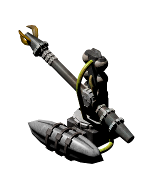

All Plugins (604)

[Cheats](https://github.com/Hecter94/EndlessSky-PluginArchive/blob/main/res/mds/cheats.md) (38) | [Gameplay](https://github.com/Hecter94/EndlessSky-PluginArchive/blob/main/res/mds/gameplay.md) (55) | [Graphics](https://github.com/Hecter94/EndlessSky-PluginArchive/blob/main/res/mds/graphics.md) (29) | [Outfits](https://github.com/Hecter94/EndlessSky-PluginArchive/blob/main/res/mds/outfits.md) (52) 
[Overhauls](https://github.com/Hecter94/EndlessSky-PluginArchive/blob/main/res/mds/overhauls.md) (46) | [Overwrites](https://github.com/Hecter94/EndlessSky-PluginArchive/blob/main/res/mds/overwrites.md) (4) | [Patches](https://github.com/Hecter94/EndlessSky-PluginArchive/blob/main/res/mds/patches.md) (3) | [Races](https://github.com/Hecter94/EndlessSky-PluginArchive/blob/main/res/mds/races.md) (70) 
[Ships](https://github.com/Hecter94/EndlessSky-PluginArchive/blob/main/res/mds/ships.md) (143) | [Starts](https://github.com/Hecter94/EndlessSky-PluginArchive/blob/main/res/md/starts.md) (17) | [Story](https://github.com/Hecter94/EndlessSky-PluginArchive/blob/main/res/mds/story.md) (80) | [Weapons](https://github.com/Hecter94/EndlessSky-PluginArchive/blob/main/res/mds/weapons.md) (42) 
[Uncategorized](https://github.com/Hecter94/EndlessSky-PluginArchive/blob/main/res/mds/uncategorized.md) (25) 

---

## Weapons

42 plugins in this category.

 

---

### 50 cal

[50.cal.zip](https://github.com/Hecter94/EndlessSky-PluginArchive/releases/download/Latest/50.cal.zip) | 57.81 kb | 2022-10-06 | [view files](https://github.com/Hecter94/EndlessSky-PluginArchive/tree/main/Working/50%20cal/)  
Author: 1010Todd | Category: Weapons  
N/A   

>Adds M2 Browning as ship outfit and H2H, also made Sparrow variant with it, and make npcs use it.
>

Status: complete and playable on 0.9.15 continous  
Daily update check: </img> 

---

### Andromeda Torpedo

[Andromeda.Torpedo.zip](https://github.com/Hecter94/EndlessSky-PluginArchive/releases/download/Latest/Andromeda.Torpedo.zip) | 6.87 mb | 2022-10-06 | [view files](https://github.com/Hecter94/EndlessSky-PluginArchive/tree/main/Working/Andromeda%20Torpedo/)  
Author: N/A | Category: Weapons  
N/A   

>Adds a torpedo and launcher to the game.
>

Status: N/A  
Daily update check: </img> 

---

### Assorted Outfits

[Assorted.Outfits.zip](https://github.com/Hecter94/EndlessSky-PluginArchive/releases/download/Latest/Assorted.Outfits.zip) | 96.83 kb | 2022-10-06 | [view files](https://github.com/Hecter94/EndlessSky-PluginArchive/tree/main/Working/Assorted%20Outfits/)  
Author: N/A | Category: Weapons  
N/A   

>adds some new weapons(ionizer blaster, incendiary launcher/rockets/rack)
>

Status: N/A  
Daily update check: </img> 

---

### Ballistic Mayhem

[Ballistic.Mayhem.zip](https://github.com/Hecter94/EndlessSky-PluginArchive/releases/download/Latest/Ballistic.Mayhem.zip) | 106.54 kb | 2022-10-06 | [view files](https://github.com/Hecter94/EndlessSky-PluginArchive/tree/main/Working/Ballistic%20Mayhem/)  
Author: SpiralCat | Category: Weapons  
N/A   

>Adds a ship and several outfits.
>

Status: Ship and outfits are nowhere for sale.  
Daily update check: </img> 

---

### Better Thunderhead Lance

[Better.Thunderhead.Lance.zip](https://github.com/Hecter94/EndlessSky-PluginArchive/releases/download/Latest/Better.Thunderhead.Lance.zip) | 281.27 kb | 2022-10-06 | [view files](https://github.com/Hecter94/EndlessSky-PluginArchive/tree/main/Working/Better%20Thunderhead%20Lance/)  
Author: BCPowerhouse | Category: Weapons  
N/A   

>Modifies this outfit.
>

Status: N/A  
Daily update check: </img> 

---

### Bunsen.Burner
</img> 

[Bunsen.Burner.zip](https://github.com/Hecter94/EndlessSky-PluginArchive/releases/download/Latest/Bunsen.Burner.zip) | 283.4 kb | 2025-07-19 | [view files](https://github.com/Hecter94/EndlessSky-PluginArchive/tree/main/Working/Bunsen.Burner/)  
Author: ItsNickBarry | Category: Weapons  
[https://github.com/LixiChronikouOriou/ES-plugins](https://github.com/LixiChronikouOriou/ES-plugins) (last commit 2025-07-19)  

>Next-generation Flamethrower, as gun, turret and h2h. For those who like it hot.
>

:blue_book: Plugin readme

<blockquote>
### Bunsen Burner ###

**Author: [Nick Barry](https://github.com/ItsNickBarry)**

An overhaul and re-publication of [Flamethrower-Turret-1.1.0](https://github.com/ItsNickBarry/endless-sky-flamethrower-turret). Since the last update of the plugin in January 2021 the Flamethrower was nerfed and got a new outfit image, so the Flamethrower Turret didn't fit anymore to the vanilla Flamethrower.

Therefore, N.Barry's turret was combined with the old vanilla Flamethrower image it was based on to create a next-generation Flamethrower which burns hotter -- the Bunsen Burner. Now with *blue* flames. Naturally, as we are used to, one has to complete Barmy's weapon test mission, written by N.Barry, to unlock it.

Also Darcy Manoel's H2H flamethrower, which is based on the same design, was added as the Bunsen Torch. Available during the war, it will be banned afterwards as inhumane and only be obtainable on Pirate-ruled planets. However, legally bought torches still won't be fined because of exception rules in the corresponding paragraphs.

**Changelog**

| Date | Version | Comment |
|------|---------|---------|
| 2025-07-19 | 1.2.0 | Added support for Omnis. |
| 2025-06-12 | 1.1.2 | Fixes. Added series and index specifications. |
| 2025-06-01 | 1.1.1 | Minor metadata fix. Clarification in torch's description. |
| 2025-05-18 | 1.1.0 | Added H2H Bunsen Torch. |
| 2025-05-03 | 1.0.2 | Metadata files fixes. |
| 2025-04-28 | 1.0.1 | Readme and copyright fixes. |
| 2025-04-28 | 1.0.0 | Overhaul and Re-publication as *Bunsen Burner*. |
| 2021-01-26 | - | Last Update of the *Flamethrower Turret* plugin. |

</blockquote>

Status: complete  
Daily update check: </img> 

---

### Burst Anti-Missile

[Burst.Anti-Missile.zip](https://github.com/Hecter94/EndlessSky-PluginArchive/releases/download/Latest/Burst.Anti-Missile.zip) | 2.89 kb | 2022-10-06 | [view files](https://github.com/Hecter94/EndlessSky-PluginArchive/tree/main/Working/Burst%20Anti-Missile/)  
Author: mdsmestad | Category: Weapons  
N/A   

>Adds 6 new outfits.
>

Status: N/A  
Daily update check: </img> 

---

### Cannon Friendly Weapon Pack

[Cannon.Friendly.Weapon.Pack.zip](https://github.com/Hecter94/EndlessSky-PluginArchive/releases/download/Latest/Cannon.Friendly.Weapon.Pack.zip) | 214.13 kb | 2022-10-06 | [view files](https://github.com/Hecter94/EndlessSky-PluginArchive/tree/main/Working/Cannon%20Friendly%20Weapon%20Pack/)  
Author: Kyle Willey | Category: Weapons  
N/A   

>The Cannon Friendly Weapon Pack (pun intended) is a selection of guns and lasers that aims to add more versatility to the range of weapons in Endless Sky. It attempts to blend itself into the canon where possible.
>
>The Cannon Friendly Weapon Pack has a number of weapons and weapon additions, such as ammunition storage for most vanilla weapons, all the ammunition-consuming weapons in the CFWP, and more.
>

Status: N/A  
Daily update check: </img> 

---

### Dual Blaster

[Dual.Blaster.zip](https://github.com/Hecter94/EndlessSky-PluginArchive/releases/download/Latest/Dual.Blaster.zip) | 69.92 kb | 2022-10-06 | [view files](https://github.com/Hecter94/EndlessSky-PluginArchive/tree/main/Working/Dual%20Blaster/)  
Author: Nathan | Category: Weapons  
N/A   

>Adds a weapon.
>

Status: Should work  
Daily update check: </img> 

---

### EMP Weapons

[EMP.Weapons.zip](https://github.com/Hecter94/EndlessSky-PluginArchive/releases/download/Latest/EMP.Weapons.zip) | 2.68 mb | 2022-10-06 | [view files](https://github.com/Hecter94/EndlessSky-PluginArchive/tree/main/Working/EMP%20Weapons/)  
Author: Fallen Cat | Category: Weapons  
N/A   

>Adds some outfits and a ship.
>

Status: Ship and outfits are nowhere for sale.  
Daily update check: </img> 

---

### Evasion Bomb

[Evasion.Bomb.zip](https://github.com/Hecter94/EndlessSky-PluginArchive/releases/download/Latest/Evasion.Bomb.zip) | 1.05 kb | 2022-10-06 | [view files](https://github.com/Hecter94/EndlessSky-PluginArchive/tree/main/Working/Evasion%20Bomb/)  
Author: Vilhelm | Category: Weapons  
N/A   

>Adds 2 outfits.
>

Status: Outfits are nowhere for sale.  
Daily update check: </img> 

---

### Extra Missiles Outfit

[Extra.Missiles.Outfit.zip](https://github.com/Hecter94/EndlessSky-PluginArchive/releases/download/Latest/Extra.Missiles.Outfit.zip) | 2.53 kb | 2022-10-06 | [view files](https://github.com/Hecter94/EndlessSky-PluginArchive/tree/main/Working/Extra%20Missiles%20Outfit/)  
Author: N/A | Category: Weapons  
N/A   

>Adds some missile outfits.
>

Status: Should work  
Daily update check: </img> 

---

### Fancy Weapons

[Fancy.Weapons.zip](https://github.com/Hecter94/EndlessSky-PluginArchive/releases/download/Latest/Fancy.Weapons.zip) | 1.85 mb | 2022-10-06 | [view files](https://github.com/Hecter94/EndlessSky-PluginArchive/tree/main/Working/Fancy%20Weapons/)  
Author: 1010todd | Category: Weapons  
N/A   

>Add various weapons utilizing complex submunition chain to be used as example. Not intended for normal gameplay.

Status: Requires AES Omnis to access.  
Daily update check: </img> 

---

### Flak Weapons

[Flak.Weapons.zip](https://github.com/Hecter94/EndlessSky-PluginArchive/releases/download/Latest/Flak.Weapons.zip) | 75.49 kb | 2023-07-27 | [view files](https://github.com/Hecter94/EndlessSky-PluginArchive/tree/main/Working/Flak%20Weapons/)  
Author: tehhowch | Category: Weapons  
[https://github.com/tehhowch/es-modding](https://github.com/tehhowch/es-modding) (last commit 2017-08-14)  

>Adds some weapon outfits.
>

:blue_book: Plugin readme

<blockquote>This repository is for any content I create for the cross-platform application 'Endless Sky'.

You are welcome to clone or fork this repository and modify its contents as appropriate, in accordance with the GPLv3 license.
Images (.png) and creative assets (*.blend, *.xcf) are licensed under CC-BY-SA 4.0

I welcome any collaboration and contributions you wish to make.

You may obtain your own copy of Endless Sky at https://github.com/endless-sky/endless-sky

</blockquote>

Status: N/A  
Daily update check: </img> 

---

### Flak&Snare

[Flak.Snare.zip](https://github.com/Hecter94/EndlessSky-PluginArchive/releases/download/Latest/Flak.Snare.zip) | 75.42 kb | 2023-07-27 | [view files](https://github.com/Hecter94/EndlessSky-PluginArchive/tree/main/Working/Flak&Snare/)  
Author: tehhowch | Category: Weapons  
[https://github.com/tehhowch/es-modding](https://github.com/tehhowch/es-modding) (last commit 2017-08-14)  

>Adds some weapon outfits.
>

:blue_book: Plugin readme

<blockquote>This repository is for any content I create for the cross-platform application 'Endless Sky'.

You are welcome to clone or fork this repository and modify its contents as appropriate, in accordance with the GPLv3 license.
Images (.png) and creative assets (*.blend, *.xcf) are licensed under CC-BY-SA 4.0

I welcome any collaboration and contributions you wish to make.

You may obtain your own copy of Endless Sky at https://github.com/endless-sky/endless-sky

</blockquote>

Status: N/A  
Daily update check: </img> 

---

### Flamethrower Turret
</img> 

[Flamethrower.Turret.zip](https://github.com/Hecter94/EndlessSky-PluginArchive/releases/download/Latest/Flamethrower.Turret.zip) | 149.36 kb | 2025-05-15 | [view files](https://github.com/Hecter94/EndlessSky-PluginArchive/tree/main/Working/Flamethrower%20Turret/)  
Author: ItsNickBarry | Category: Weapons  
[https://github.com/ItsNickBarry/endless-sky-flamethrower-turret](https://github.com/ItsNickBarry/endless-sky-flamethrower-turret) (last commit 2025-05-15)  

>adds a turret variant of the flamethrower.
>

:blue_book: Plugin readme

<blockquote># Endless Sky Flamethrower Turret
A plugin for [Endless Sky][endless-sky] which adds a turret variant of the flamethrower.

> This repository is no longer maintained, and will not work with the latest versions of Endless Sky.  As of May 2025, an updated version is available from a third party.  See [PR #7](https://github.com/ItsNickBarry/endless-sky-flamethrower-turret/pull/7) for more infromation.

![image][image]

The flamethrower turret is unlocked as a part of the Free Worlds storyline.

[endless-sky]: https://github.com/endless-sky/endless-sky
[image]: images/outfit/flamethrower%20turret@2x.png

## Installation
You must create a "plugins" folder in one of two places, depending on your operating system:

### Linux ###
* /usr/share/endless-sky/plugins/
* /.local/share/endless-sky/plugins/

### Windows ###
* plugins\ (in the same folder as the Endless Sky executable)
* C:\Users\yourusername\AppData\Roaming\endless-sky\plugins\

### Mac OS X ###
* Content/Resources/plugins/ (within the application bundle)
* /Library/ApplicationSupport/endless-sky/plugins

Download the latest [release][releases] and extract it into your plugins folder.

More information may be available on the [Endless Sky Wiki][wiki].

[releases]: https://github.com/ItsNickBarry/endless-sky-flamethrower-turret/releases
[wiki]: https://github.com/endless-sky/endless-sky/wiki

</blockquote>

Status: N/A  
Daily update check: </img> 

---

### Gungnir

[Gungnir.zip](https://github.com/Hecter94/EndlessSky-PluginArchive/releases/download/Latest/Gungnir.zip) | 461.32 kb | 2023-07-27 | [view files](https://github.com/Hecter94/EndlessSky-PluginArchive/tree/main/Working/Gungnir/)  
Author: jschiav | Category: Weapons  
[https://github.com/jschiav/Gungnir](https://github.com/jschiav/Gungnir) (last commit 2020-05-22)  

>adds mining laser
>

Status: N/A  
Daily update check: </img> 

---

### HellFire Missile

[HellFire.Missile.zip](https://github.com/Hecter94/EndlessSky-PluginArchive/releases/download/Latest/HellFire.Missile.zip) | 41.35 kb | 2022-10-06 | [view files](https://github.com/Hecter94/EndlessSky-PluginArchive/tree/main/Working/HellFire%20Missile/)  
Author: N/A | Category: Weapons  
N/A   

>adds hellfire missile launcher and missiles
>

Status: N/A  
Daily update check: </img> 

---

### Interdictor

[Interdictor.zip](https://github.com/Hecter94/EndlessSky-PluginArchive/releases/download/Latest/Interdictor.zip) | 0.61 kb | 2022-10-06 | [view files](https://github.com/Hecter94/EndlessSky-PluginArchive/tree/main/Working/Interdictor/)  
Author: Nechochwen | Category: Weapons  
N/A   

>Fuel Damage before fuel damage is a thing in vanilla.
>

Status: N/A  
Daily update check: </img> 

---

### Kinetic Weaponry
</img> 

[Kinetic.Weaponry.zip](https://github.com/Hecter94/EndlessSky-PluginArchive/releases/download/Latest/Kinetic.Weaponry.zip) | 131.44 kb | 2023-07-27 | [view files](https://github.com/Hecter94/EndlessSky-PluginArchive/tree/main/Working/Kinetic%20Weaponry/)  
Author: kestrel1110 | Category: Weapons  
[https://github.com/kestrel1110/KineticWeaponry](https://github.com/kestrel1110/KineticWeaponry) (last commit 2022-08-02)  

>A plugin adding modern realistic weapons to Endless-Sky, including a cannon and two shell types, APFSDS & HEATFS.
>They are tier 1 human weapons, already balanced to work as anti-capital ship weapons.
>

:blue_book: Plugin readme

<blockquote># KineticWeaponry

A plugin adding modern realistic weapons to Endless-Sky, including a cannon and two shell types, APFSDS & HEATFS.
They are tier 1 human weapons, already balanced to work as anti-capital ship weapons.

</blockquote>

Status: Playable on 0.9.15, 0.9.16, Continuous.  
Daily update check: </img> 

---

### Kraz Cybernetics Evolution

[Kraz.Cybernetics.Evolution.zip](https://github.com/Hecter94/EndlessSky-PluginArchive/releases/download/Latest/Kraz.Cybernetics.Evolution.zip) | 116.15 kb | 2023-07-27 | [view files](https://github.com/Hecter94/EndlessSky-PluginArchive/tree/main/Working/Kraz%20Cybernetics%20Evolution/)  
Author: MCOfficer | Category: Weapons  
[https://github.com/MCOfficer/Kraz-Cybernetics-Evolution](https://github.com/MCOfficer/Kraz-Cybernetics-Evolution) (last commit 2017-05-15)  

>adds the quad electron turret to the kraz outfitter.
>

:blue_book: Plugin readme

<blockquote>Kraz-Cybernetics-Evolution

</blockquote>

Status: N/A  
Daily update check: </img> 

---

### M.A.C. cannon

[M.A.C.cannon.zip](https://github.com/Hecter94/EndlessSky-PluginArchive/releases/download/Latest/M.A.C.cannon.zip) | 37.98 kb | 2022-10-06 | [view files](https://github.com/Hecter94/EndlessSky-PluginArchive/tree/main/Working/M.A.C.%20cannon/)  
Author: N/A | Category: Weapons  
N/A   

>adds the magnetic accelerator cannon and its ammo
>

Status: N/A  
Daily update check: </img> 

---

### Mass Driver

[Mass.Driver.zip](https://github.com/Hecter94/EndlessSky-PluginArchive/releases/download/Latest/Mass.Driver.zip) | 1.04 kb | 2022-10-06 | [view files](https://github.com/Hecter94/EndlessSky-PluginArchive/tree/main/Working/Mass%20Driver/)  
Author: Daniel Bordeianu | Category: Weapons  
N/A   

>adds the mass driver turret and its ammo
>

Status: N/A  
Daily update check: </img> 

---

### Missile Turrets

[Missile.Turrets.zip](https://github.com/Hecter94/EndlessSky-PluginArchive/releases/download/Latest/Missile.Turrets.zip) | 3.13 kb | 2022-10-06 | [view files](https://github.com/Hecter94/EndlessSky-PluginArchive/tree/main/Working/Missile%20Turrets/)  
Author: Dalrethliant | Category: Weapons  
N/A   

>adds the sidewinder missile turret
>

Status: N/A  
Daily update check: </img> 

---

### Non Lethal

[Non.Lethal.zip](https://github.com/Hecter94/EndlessSky-PluginArchive/releases/download/Latest/Non.Lethal.zip) | 52.62 kb | 2022-10-06 | [view files](https://github.com/Hecter94/EndlessSky-PluginArchive/tree/main/Working/Non%20Lethal/)  
Author: N/A | Category: Weapons  
N/A   

>adds to tractor beams and several hand to hand outfits
>

Status: N/A  
Daily update check: </img> 

---

### Nuclear Launcher

[Nuclear.Launcher.zip](https://github.com/Hecter94/EndlessSky-PluginArchive/releases/download/Latest/Nuclear.Launcher.zip) | 35.82 kb | 2022-10-06 | [view files](https://github.com/Hecter94/EndlessSky-PluginArchive/tree/main/Working/Nuclear%20Launcher/)  
Author: N/A | Category: Weapons  
N/A   

>adds nuclear launcher/missiles to the pirate outfitters
>

Status: N/A  
Daily update check: </img> 

---

### Nuke turret

[Nuke.turret.zip](https://github.com/Hecter94/EndlessSky-PluginArchive/releases/download/Latest/Nuke.turret.zip) | 35.66 kb | 2022-10-06 | [view files](https://github.com/Hecter94/EndlessSky-PluginArchive/tree/main/Working/Nuke%20turret/)  
Author: 1010todd | Category: Weapons  
N/A   

>Tiny plugin that add two outfit: Nuclear Missile Turret and Nuclear Missile Ammo. 
>
>Just happened to have a nuke launcher turret sprite so I turned it into a quick plugin.
>

Status: N/A  
Daily update check: </img> 

---

### OP Thunderhead Lance

[OP.Thunderhead.Lance.zip](https://github.com/Hecter94/EndlessSky-PluginArchive/releases/download/Latest/OP.Thunderhead.Lance.zip) | 281.17 kb | 2022-10-06 | [view files](https://github.com/Hecter94/EndlessSky-PluginArchive/tree/main/Working/OP%20Thunderhead%20Lance/)  
Author: BCPowerhouse | Category: Weapons  
N/A   

>N/A
>

Status: N/A  
Daily update check: </img> 

---

### Orion Missile

[Orion.Missile.zip](https://github.com/Hecter94/EndlessSky-PluginArchive/releases/download/Latest/Orion.Missile.zip) | 1.87 kb | 2023-07-27 | [view files](https://github.com/Hecter94/EndlessSky-PluginArchive/tree/main/Working/Orion%20Missile/)  
Author: Marksman-ES | Category: Weapons  
[https://github.com/TheMarksman-ES/Orion-Missile](https://github.com/TheMarksman-ES/Orion-Missile) (last commit 2022-09-11)  

>Add a missile based on Orion Drive nuclear propulsion, gets more powerful over range.
>

:blue_book: Plugin readme

<blockquote># Orion-Missile
This plugin features the Orion Missile, a weaponised Orion Drive meant for use against the most hardended ships in the game. However, it is only a fun side project, not meant for serious use against an Archon. 

</blockquote>

Status: Playable on 0.9.15 Continuous.  
Daily update check: </img> 

---

### Particle Turret

[Particle.Turret.zip](https://github.com/Hecter94/EndlessSky-PluginArchive/releases/download/Latest/Particle.Turret.zip) | 363.74 kb | 2022-10-06 | [view files](https://github.com/Hecter94/EndlessSky-PluginArchive/tree/main/Working/Particle%20Turret/)  
Author: Jason Clark | Category: Weapons  
N/A   

>adds two missions to unlock the particle turret
>

Status: N/A  
Daily update check: </img> 

---

### Plasma Mine

[Plasma.Mine.zip](https://github.com/Hecter94/EndlessSky-PluginArchive/releases/download/Latest/Plasma.Mine.zip) | 42.73 kb | 2023-07-27 | [view files](https://github.com/Hecter94/EndlessSky-PluginArchive/tree/main/Working/Plasma%20Mine/)  
Author: John Abbe | Category: Weapons  
N/A   

>Plasma mines - This is a first attempt at mines to see how they fit into combat tactics and learn how to balance them properly. The heat damage gives a decent chance to disable big ships without giving the mines an unbalanced amount of regular damage.
>

Status: N/A  
Daily update check: </img> 

---

### Pulse

[Pulse.zip](https://github.com/Hecter94/EndlessSky-PluginArchive/releases/download/Latest/Pulse.zip) | 20.09 kb | 2023-07-27 | [view files](https://github.com/Hecter94/EndlessSky-PluginArchive/tree/main/Working/Pulse/)  
Author: Jesse Dickens | Category: Weapons  
N/A   

>The comcept is to create a series of crafts that combine the engineering prowess of the space pirates along with the technology of aliens.
>

Status: N/A  
Daily update check: </img> 

---

### Punt Gun
</img> 

[Punt.Gun.zip](https://github.com/Hecter94/EndlessSky-PluginArchive/releases/download/Latest/Punt.Gun.zip) | 133.53 kb | 2023-03-04 | [view files](https://github.com/Hecter94/EndlessSky-PluginArchive/tree/main/Working/Punt%20Gun/)  
Author: 1010todd | Category: Weapons  
N/A   

>Add bigger proton gun with higher knockback, and recoil. Found at Rust, Kraz system.
>

Status: N/A  
Daily update check: </img> 

---

### Quarg AM

[Quarg.AM.zip](https://github.com/Hecter94/EndlessSky-PluginArchive/releases/download/Latest/Quarg.AM.zip) | 189.2 kb | 2022-10-06 | [view files](https://github.com/Hecter94/EndlessSky-PluginArchive/tree/main/Working/Quarg%20AM/)  
Author: N/A | Category: Weapons  
N/A   

>adds some quarg outfits/weapons
>

Status: N/A  
Daily update check: </img> 

---

### sensor
</img> 

[sensor.zip](https://github.com/Hecter94/EndlessSky-PluginArchive/releases/download/Latest/sensor.zip) | 3.47 mb | 2025-06-23 | [view files](https://github.com/Hecter94/EndlessSky-PluginArchive/tree/main/Working/sensor/)  
Author: orbitalsupershell | Category: Weapons  
[https://github.com/orbitalsupershell/sensor](https://github.com/orbitalsupershell/sensor) (last commit 2025-06-23)  

>Tiny mod for adding weapons, still in progress!
>
>More weapons WILL be added soon!
>

:blue_book: Plugin readme

<blockquote># sensor
Mod for adding weapons to endless sky.
Very unbalanced.

</blockquote>

Status: N/A  
Daily update check: </img> 

---

### Spacetime Ripper Warhead

[Spacetime.Ripper.Warhead.zip](https://github.com/Hecter94/EndlessSky-PluginArchive/releases/download/Latest/Spacetime.Ripper.Warhead.zip) | 2.99 mb | 2023-07-27 | [view files](https://github.com/Hecter94/EndlessSky-PluginArchive/tree/main/Working/Spacetime%20Ripper%20Warhead/)  
Author: Karirawri | Category: Weapons  
[https://github.com/Karirawri/Spacetime-Ripper-Warhead](https://github.com/Karirawri/Spacetime-Ripper-Warhead) (last commit 2017-10-15)  

>A proof of concept superweapon for Endless sky. Available in Trinket, Makerplace and World forge.
>
>

:blue_book: Plugin readme

<blockquote># Spacetime-Ripper-Warhead
A proof of concept superweapon for Endless sky. Available in Trinket, Makerplace and World forge.

</blockquote>

Status: N/A  
Daily update check: </img> 

---

### Stat Reworks

[Stat.Reworks.zip](https://github.com/Hecter94/EndlessSky-PluginArchive/releases/download/Latest/Stat.Reworks.zip) | 9.65 mb | 2022-11-09 | [view files](https://github.com/Hecter94/EndlessSky-PluginArchive/tree/main/Working/Stat%20Reworks/)  
Author: Saturnalia9 | Category: Weapons  
N/A   

>Reworked vanilla weapon stats and add new weapons for more diversity.
>

Status: Should work on 0.9.15, 0.9.16, Continuous.  
Daily update check: </img> 

---

### Support Beams

[Support.Beams.zip](https://github.com/Hecter94/EndlessSky-PluginArchive/releases/download/Latest/Support.Beams.zip) | 138.86 kb | 2022-10-06 | [view files](https://github.com/Hecter94/EndlessSky-PluginArchive/tree/main/Working/Support%20Beams/)  
Author: 1010Todd | Category: Weapons  
N/A   

>Add a few supportive beams (Repair, Shields, etc.) Don't give to AI.
>

Status: N/A  
Daily update check: </img> 

---

### The Witch

[The.Witch.zip](https://github.com/Hecter94/EndlessSky-PluginArchive/releases/download/Latest/The.Witch.zip) | 6.4 kb | 2022-10-06 | [view files](https://github.com/Hecter94/EndlessSky-PluginArchive/tree/main/Working/The%20Witch/)  
Author: 1010todd | Category: Weapons  
N/A   

>Add small spaceport mission that can offer you various magic orbs to assist you in-flight.
>
>Will conflict with anything that add: "Repair Beam"
>

Status: N/A  
Daily update check: </img> 

---

### Thunderhead Lance

[Thunderhead.Lance.zip](https://github.com/Hecter94/EndlessSky-PluginArchive/releases/download/Latest/Thunderhead.Lance.zip) | 281.09 kb | 2022-10-06 | [view files](https://github.com/Hecter94/EndlessSky-PluginArchive/tree/main/Working/Thunderhead%20Lance/)  
Author: BCPowerhouse | Category: Weapons  
N/A   

>N/A
>

Status: N/A  
Daily update check: </img> 

---

### TooManyBlasters

[TooManyBlasters.zip](https://github.com/Hecter94/EndlessSky-PluginArchive/releases/download/Latest/TooManyBlasters.zip) | 2.67 kb | 2022-10-06 | [view files](https://github.com/Hecter94/EndlessSky-PluginArchive/tree/main/Working/TooManyBlasters/)  
Author: N/A | Category: Weapons  
N/A   

>Pssh, just put 90 blasters on a turret mount, idk.
>

Status: N/A  
Daily update check: </img> 

---

### YEET

[YEET.zip](https://github.com/Hecter94/EndlessSky-PluginArchive/releases/download/Latest/YEET.zip) | 280.77 kb | 2022-10-06 | [view files](https://github.com/Hecter94/EndlessSky-PluginArchive/tree/main/Working/YEET/)  
Author: BCPowerhouse | Category: Weapons  
N/A   

>N/A
>

Status: N/A  
Daily update check: </img> 

[back to top](https://github.com/Hecter94/EndlessSky-PluginArchive/blob/main/res/mds/weapons.md#weapons)

